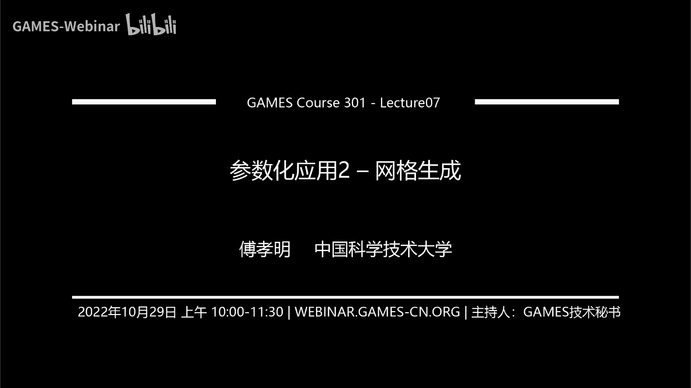
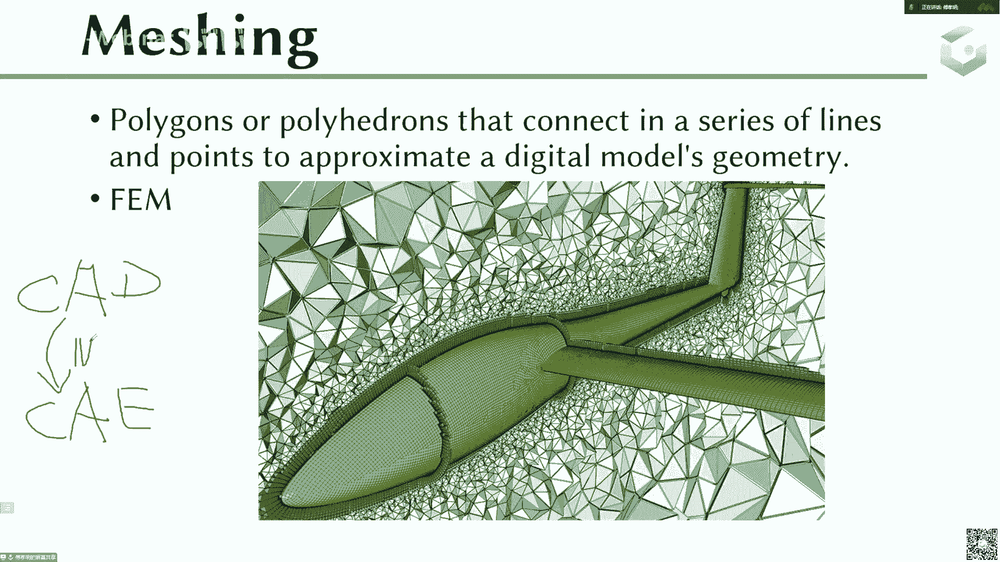
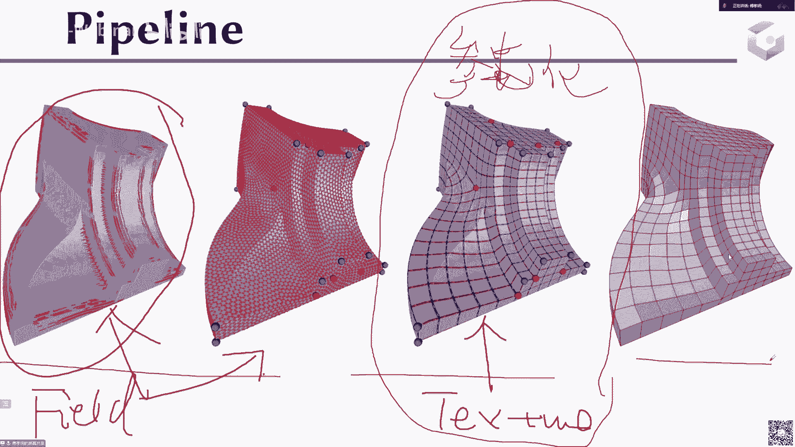
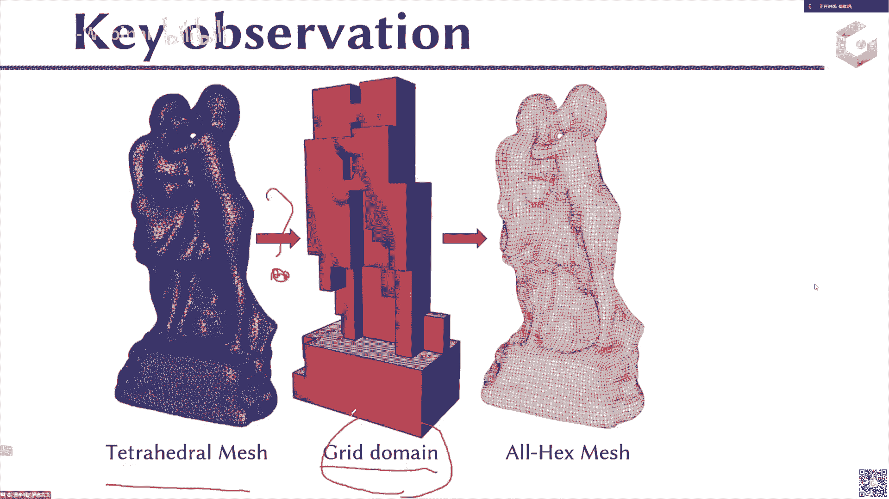
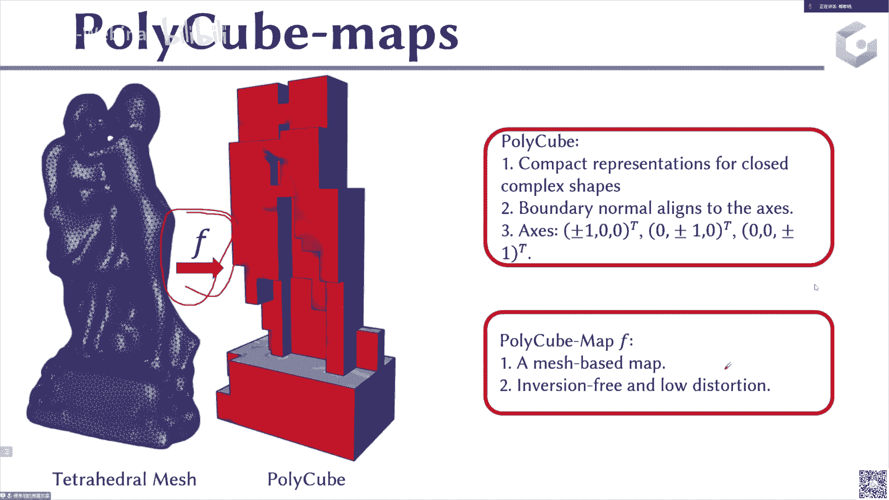
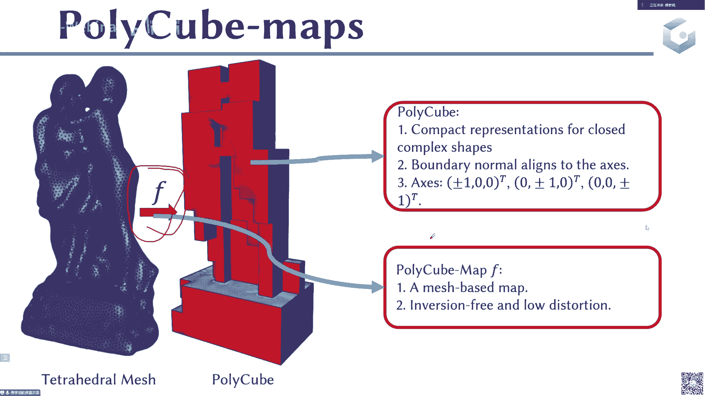

# GAMES301-曲面参数化 - P7：Lecture 07 参数化应用2-网格生成 - GAMES-Webinar - BV18T411P7hT

好那个时间到了啊，我们就开始上课啊，十点钟那个今天我们要讲的是一个基于参数化的一个应用啊，就是这个网格生成。

那么首先来看一下什么是这个网格生成，或者我们来简单的了解一下这个事情啊，那么网格生成的话，从这句话的来，这句话的意思来是讲，就是说用一些多边形或者多面体，然后呢通过一些边点把它连起来。

然后呢它的目的是用来干嘛的，是用来近似一个，呃去用来近似一个数字的一个模型的几何对吧，那比如说下面这个例子，比如这个黄色的是一架飞机，那它可能是由这个c a d的，是一个c a d的模型，它是由这样的。

就是呃呃设计公司或者说这种cad的软件，就是他们用这种软件设计出来的一个模型，然后呢你把它去做一个呃四边形化，就是表面去做了一个这样的一个四边四边形化是吧，那这样的话你就生成了一个四边形。

表面去近似这样的一个飞机的模型，那么也就是说它在这个表面的每一个元素都是一个四边形，然后呢他真正的在这个有限元的模拟里面，它其实还需要对这个飞机外外面的这个空气啊或者流体啊，去做进一步的仿真。

这时候他需要去给他去做一个外面的这些空气里面的这个网格化，那比如说这个最最外面这一层是一个四面体，那这个表面这一层网格是一个表面，这一层网格是一个呃边界层网格对吧，但不管怎么样。

它这个整个网格化的过程就是去生成一些多边形或者一些多面体，然后呢通过一些呃我们之前讲的这些边啊，点上去把它给连起来，那么连起来呢连起来以后呢，它最后其实是近似的，是一个这样的一个数字模型啊。

那么这样的话有了这样的一个呃多边形网格，或者说这样一个多面体网格以后呢，它其实可以应用到后续的这个应用里面去，那比如说最典型的就是这样的一个有限元分析，或者说这个就像流体力学啊等等。

这样的还可以做这种物理的仿真，那得到一些物理量，然后进而去判断你这个一开始设计的这个形状合不合理，或者说以它的一些性能达不达到要求对吧，当然这个过程就说这是一个网格化的过程，那么多说一下这个。

比如说在刚才讲到的这个，呃刚才讲到了这个c a d对吧，你现在有一个c a d的模型，然后呢你接下来你可能要去做c a e就是有些人的分析，然后呢你这个地方会有一个cad模型。

比如现在最常见的还是用这种ns曲面片，或者用一些这种嗯，这一种就是各种这种基本的原去表示一个cad模型，但是片与片之间它其实是一个呃离分散的过程，然后呢你需要去给为了去做c a e，为了去做cae。

那这时候呢或者为了去做有限元，你这时候需要去把这个c a d模型去做一个这样的一个网格化，这样一个过程。

那么这个过程呢其实是相对而言是比较费时费劲的，就是说其实这个网格化过程显然就是很重要，但是呢你给一个cad模型在做这个cad的时候，它其实是比较的缓慢的。

所以这个时候呢你需要去进一步的去提升它的这个效率，提升它的这个呃鲁棒性，那么所以说现在这个网格从这个网格化这个角度来讲，首先它是一个连接c a d和c a e之间的一个桥梁，呃，当然了。

现在呃最近比较热的一个研究的题目，就是这个所谓的c a d c一体化的这个这样的一个问题对吧，希望啊cad和cae放在统一的这样的一个模型或者数据的这样的一个，表示的情况下去做设计和分析。

那么从而不需要去做这个网格化呃，但是呢这个现从现在的这个发展来讲，现在还没有一种方法能够完全去把这两个东西给放在一起去啊，比如说现在这个很热的，有一些啊，具体内这些我就不讲了。

就比如现在有一些很热的这个方法，其实还是啊还有很大的发展空间，或者说他可能从根本上也没有解决一些嗯，就是这些问题啊，那么反正不管怎么样，所以说要去把这个cad和这个cae去给它联系起来。

那么最常用的或者说最古老的方式就是去把cad模型做成网格化，他们去做c a e，做完ca以后，你会得到一些物理的分析，那么有了这些物体的物理的分析以后，其实你应该反过来再去修改这个cad模型对吧。

那么这个时候呢你其实这个过程也是比较的嗯，呃这个这个过程也是比较的繁琐的啊，那这个时候很多时候呢其实现在也是只能通过人去做，那么现在最近这2年呢，他们发展出来就是去通过这样的啊神经网络。

或者说这样的可微的这样的一个技术，去把这个呃c a e的这个结果再反过来去去deform这个c a d对吧，或者说基于这种可微的基础，那么现在或者说ai的这种技术去做这个事情，现在也是一个研究的趋势啊。

好啊这就拆开说了一下啊，那么接下来就是呃我们在图形学里面经常常见的这个东西呢，我们是一般叫一般是这样的一个remage的一个过程啊，啊跟这个前面的这个，motion的过程稍微有一点点区别啊。

reversion是指这样的，首先呢你有一个输入的一个三维模型啊，比如说是这个是一个输入，然后呢你要去计算另外一个模型，computer another match。

你比如说这是你的another mesh，就是就是输入，这是out，这是out，就是input，这是out put，然后呢你的这个输出的这个模型，它的element就是它的每一个三角形。

比如说每一个四面体，每一个334边形，每一个他的element要是满足一些质量的准则的，然后呢近似这个对这个输入曲面的这个近似是比较的好的啊，那么所以说呢现在given a three d呃。

呃three d mesh，computer another mesh，whose elements satisfies，some quality requirements。

who who while approximation of the input e accel，那么这是一个remax的一个从宏观上的一个定义啊，就是它的定义就是说输入我有一个三角形网格。

这个三角形网格质量可能很差，所以它的质量满满足不了啊，就是满足不了这个某一些质量的这个呃要求，那么所以说这时候你需要去计算另外一个呃，你需要去计算另外一个网格。

那这个网格它是能够满足这样的一些质量的要求的，然后呢并且这两个之间的这个距离啊，就是他要近似他是比较好的，就说能在可进行的范围内，比如说他们之间的hotop距离是呃是control的。

或者他们的hotop距离是比较小，或者他hop就是有界等等这样的一些约束，他们说这个reaction呢它最常见的，比如说你这你这个模型怎么来的，最常见的模型就是这个模型就是来自于这种扫描的模型。

现在的三维扫描里，他们其实少的都是等于等于重建重建8。1重练成网格，一般都是用ming cube marching cube的话，一般出来的网格质量还是，当然有些时候也做的还可以，但有的质量还是比较差。

就是说他在这个模型cube出来很密的网格以后，他做了一把简化对吧，简化完以后呢，它这个网格它其实就是当时他可能没有考虑质量，那这时候说出来的结果就可能比较的啊糟糕。

那这个时候呢你可能需要去进一步的去做一个reaction，让这个网格的质量提升，那这样的话可以用于后面的这个嗯去进一步的去做这个分析，那还有这个输入这个网格质量比较差的。

还有还有可能是来自于这种cad的模型，这种cad的模型它的输入就是一开始的时候它可能是质量呃，就是你一开始是一片片的note曲面片，然后你可能给他做三角画的时候，可能或者说你给他做spa spa情况。

或者说做做其他的这个网格化的时候，你可能确实它的质量没有做的很好，那这个时候呢你在呃或者说你在这个cad网格化的过程中，其实第一步可能是生成一个粗糙的一个cad的三角化的模型，然后再去做一把优化。

然后让它的这个网络质量提升对吧，那这样的话，所以说呢这个remaster呢，它其实相当于是你可以认为是对这样一个输入的一个三角形模型，或者对输入的一个网格模型，不一定三角形啊，输入的网格模式。

你去做进一步的这个质量的提升啊。

那这种方法这种叫做remaster啊，那么这个就是输出的这个网格的这个呃输出的这个网格，它的呃就是网格的这个类型的话，一般情况下会分为如下的四种吧，首先第一个是这个三角形网格是吧。

那么它只是一个表面网格，每个每个元素都是一个三角形，那么还有一个也是一个表面网格，但是他的每个表面都是一个四边形，然后还有一个是体网格，就是它不光是有表面，它还有内部。

那这时候他的每一个体都是一个四面体网格，四面体，那么还有一个是六面体，它是整个是一个体网格，但是它每一个单元都是一个六面体啊，这是一个六面体，一个四面体，一个四边形，一个三角形，三角形网格。

三角形网格和四边形网格是表面形网格，四面体和六面体网格是一个呃体网格，这里这四种网格也是在这个有限元分析，或者说在这个图形学的应用里面使用的最广泛的。

那么使用的最广泛的应该是这个三角形网格和这个四边形网格，三角形网格和这个四面形网格，那么啊特别是现在这种传统意义上呃，这两个网格用的很常用啊，但是这个这个网格三角四面体四边形网格其实用的也比较广泛。

因为什么，因为它这个比如说在这个比如在这个动画，或者说这种就是游戏里面，它的有时候因为这个四边形，它这些呃边的走向其实可以跟这个一些呃特征的走向，是保持一致的，那这样的话他在做一些这种动作的时候。

他就能够把这个人的比如说他就可以把一些呃动作，他的捕获会比较好，所以他们经常使用的也是一个呃思维性网，在特别是在动画里面呃，六面体和这个四面体网格在这个有限元里面，其实也是相对数比较比较受欢迎的对吧。

那这个因为它可以在上面构造这个高精度的机，然后再去做这样的，有些人的分析可能会呃精度会更高一点，但是呢说实话这个事情不是那么的绝对，就是说现在特别是现在这个时候，其实有时候他有。

一些呃四面体或者说一些三角形，你也可以在上面构造一些高高低啊，就是高阶的机啊，你当然你也可以把这个几何变成高阶的几何，比如说变成一个后面我们会讲讲和所谓的高阶的网格。

那这个时候你去做这个有些人分析的时候，其实每个提速上或者每个呃每个这个三角形上或者每个四面体上，其实你的这个有限的精度也能够提升啊，首先这个里面其实很混乱。

就是说这个你到底比如说一个应用具体什么使用什么网格是最好的，天下的那肯定是有应用来驱动的，就是你的这个应用决定了你要使用什么网格对吧，那么你这个比如你这个应用下，你觉得就是他们觉得给这种网格是最合适的。

那你可能就要去生成这样的网格，但是有一些应用里面可能可能两个网格，两种网格之间其实会存在一种battle，或者说他们会直接一些竞争，所以你不能说哪一种网格一定会比另外一种网格好。

那这个时候可能就是你要在有一些质量下，或者有一些计算的代价下面去做一个取舍，就大概是这样一个意思，特别是比如在有限，原理你肯定是为了为他的物理仿真去服务的，只有你不管你生成什么网格，最后只有评判标准。

应该就只有一种，就是说你的物理仿真的结果比较准确对吧，那怎么去看待这个事情呢，这个情就需要有很有经验的人去做这个事，或者说你要用一些能够去自动的去判断这个事的人，判断事情的这种机制是吧。

那你这个时候呢你可能就是这时候需要去，你不管你生成的四面体网格也好，高级网格也好，或者说是四面体网格也好等等等，那么六面体网格也好，等，等最终你这个结果或者说你最终这个东西这个网格好还是不好。

其实就是完全由这个物理仿真最终的这个准确性来来决定好，那么对于这样的，刚才我们说了，他其实是个网格化也好，或者说这个重新网格化也好，最后其实我希望这个质量是有一定的保证的对吧，就说说这个质量的话啊。

显然是刚才我已经提过了，就是different application，就是不同的这个啊应用，或者说不同的这个，他其实对这个质量的需求和这个啊质量的定义其实是不一样的啊，那么通常的这个质量的话。

比如说这个三角形的正则性，可以说四边形的正则性，四面体的正则性，那比如说是不是三角形更接近于正三角形是最好的，四边四边形，正方形是最好的等等对吧，然后还有sns上的，有些地方它的这个四三角形要大一点。

有些地方的三角形要小一点吧，有些地方四面体要大一点等等，这个s还有这个orientation对吧，那比如说我现在这个地方，它的这个网格是具有一定的朝向信息对吧，那比如说这个四边形网格，那比如说。

这个四边形网格，这是一条feature，那当然我希望这个四边形网格就是这样构造的对吧，那这样的话我其实就是这个这条fish就能够保证出来，那么这个四边形的走向，orientation。

它的朝向就是要这样走对吧，那比如说alignment，就是比如说在这个地方的alignment，对这一条你要跟它对齐，然后还有就是这个呃网格的这个单元，这个三角形的形状啊，是不是什么时候是最优的。

当然可能最后的网格质量你还要考虑这个拓扑的一些，比如他这个地方的产生了一些呃非流行啊，top上出现了一些不好的东西，那你需要去，做一些repair等等，这些，好那我们具体来看一下几个典型的例子啊。

首先是这个element的ship，那比如说对于这样的啊，这不好意思，这个地方打错了，地方是iso tropic，不是iso matchiso t r o p i c啊，下面没写错，这地方打错了。

这地方是不好意思，这是一个alex roy的一个网格，这是一个ice ropic网格，这是一个各项，这是一个各项同性的网格，这是一个各项异性的网格，那么我们来看一下这个各项同性的吻合。

你可以看到每一个三角形的元素都是接近于正三角形对吧，都是接近于那个regular全员过的，不是每个三角形都是接近这样，那么它，就是一种各项同性的这样网格，当然对于这样的各项异性的网格的话。

这个左边是一个各项异性的网格，你会发现，比如说这是一个正一个带呃round的那个就是带这个边界是圆弧过渡的，或者说它是一个round的这样的一个角和一个四面一个正方体。

那么其实这个地方你会看到它的这个每一个元素，它其实是这边，比如说这边是接近于正正三角形，这边这个三角形它其实是这样的一个狭长的三角形，然后在这个中间它这个比较平的地方，是一些比较大的这样的一个正三角形。

那么它其，实会根据比如说像这样的一个结果，它其实是跟这个曲率是，这跟曲率其实是一个自适应的一个这样的结果对吧，那比如说在这个地方，它其实是个圆角的，它接近接近接近于这其实是一个小圆小球。

那么所以说它这个地方就是一个各项同性的接近于这个面积啊，这个元素质量比较小的，那么像这种这种狭长的这个地方，它其实是一个这样啊，这样一个狭长的一个三角形，它其实是这个轴的。

这个它其实是满足这样的一个曲率的一个关系的对吧，那么这种就是叫做一个各项异性的网格，那么还有这个delement的那个desk对吧，那它其实有些地方这个从网格质量来讲的话，它同样是比如这个眼睛这个地方。

比如中间这个结果它就生成的是一个uniform，所有的三角形代表都是一样的，然后还有一个是能与form或者说自适应的，比如还是这个眼睛这个地方，但它在这些曲率高的地方，就是比如说这些曲率。

这是曲率比较高的地方，它在这个地方它就是加密了采样的密度，就像这个地方的点踩的更多一点，那这样的话它能够让这个眼睛在这个地方的，这个就是在这个地方曲率高的地方，它的那个三角形放的更多一点。

那这样的话你最后呃对于这个原始网格的逼定程度，你就会更好对吧，这个事情也是很自然的一个事情，就是你在曲率高的地方，你放的三角形更多一点，在曲率低的地方，你放的三角形更少一点。

那么这样的话其实你还是能达到一个平衡，就是你三角形也不会爆炸的很多，但是你会对这个三角形的逼近程度会做得更好，你你比如说你在这个地方放的这些三角形比较多，那么也就是说这个地方本身是曲率比较过的。

曲率比较高的，那么曲率比较高，也就，是说明了这个地方它的这个呃曲面的这个变化程度是比较快的，那这个地方你放一些，然后三角形的元素放的多一点，在这个地方，那么其实你对这个曲面的逼近程度也会做的更好对吧。

那么这样的话你其实也是可以做到这个就是对这个就是他的呃，他的逼近程度会比较，那么所以说一般情况下，就这个就是uniform和这个呃自适应的这种都有这种采取的方式吧。

好接下来是这个要元素对齐或者orientation朝向，那比如说现在是你现在首先是你比如说像这样的一些cad的模型对吧，就这个地方，给的是三个c a d的例子，这个三个cad的例子。

一般情况下他会都会有这样的一些sharp feature，就是这些这个两个feature，左右两侧的这个normal产生了一个很很剧烈的一个变化，这个其实是也是这种在机械里面，或者说在这种工业里面。

它在设计一些零件的时候，他可能就会有这样的一些呃，就是棱棱角角对吧，那就是对于这样的一个棱棱角角的话，其实你去跑这样的cad模型，其实你是去做这样的，他会有一些这样的很大的feature。

那这个时候你再去生成这样的一个呃，你再去生成这样的一个三三角形，网格的时候，按三角形网格或者四边形网格的时候，你的这个边呢最好是跟这些feature是对齐的。

那么这样的话你才能够去把这些feature给保持住，那比如说我们来看看具体的例子，比如这是一条这个呃shfeature，那么正常情况下，如果你要保持住的话，你这个左右两边的这个三角形应该是长这样的对吧。

但是如果你是这样，你还是你原来中间这条边是这样，这个是你现在这个是一个三角形，只是一个三角形对吧，但如果你最后的三角形就变成这样，你的这个中间这条边是变成这样了，你这这个原来是一条feature啊。

这是这是这是一个feature，然后你的三角形是这样和这样，那么你就说你在中间这一条边，你是长这样的，那其实你对这一段的feature其实是没有保持住的，那么所以说呢我们在做这个。

我们希望最后你生成的这个网格是能够把这些feature给保持住的啊，那么接下来还有一个是orientation，我希望它是跟这个比如各项异性的网格，它是沿着这个曲率的朝向的呃，保持一致的啊。

比如说我们来看一下，像有些地方它的曲率就是一个方向大，一个方向小，那么我希望跟它的主体离方向是能够对齐，那这样的话看上去比较舒服，或者说或者说他最后的这个分析也是比较好。

但是真正对于这个各项异性网格而言，它的朝向呢一般情况下在这个工程里面，它其实这个朝向其实是由这个p d e决定的，这个各项异性网格的这个使用经最常用的使用的这个地方，其实一般是在这个流体的这个仿真里面。

那么流体的仿真里面它是具有很强的各项异性，就是它的流体的流动，它其实具有一个，方向性，那么其实你这个时候你生成的这个网格，如果能符合这个流体的这个流动，或者说流体的这个变化的这个方向的话。

其实他对他的这个仿真带来的这个是那个，所以说这个时候那个我哦对我刚才讲到，就是说你在这个流体流体里面，它其实这个这个它的具有很强的方向性，正常这个时候你这个这个时候你给他去做一个就是你生成的这个五个。

如果能符合它的这个流体的这个流动的潮，流动的这个方向，那这个时候它的这个流体仿真的这个精度就会显著的提升，那么显著，提升以后呢，你最后它的这个就是流体就会准确性比较高呃，准确性比较高。

那就会导致你最终的这个，导导致你最终的这个叫什么，这个就是就是你这个网格是比较适合你这个应用的对吧，那么所以说呢对于这样的各项异性网络而言，它在这个流体仿真里面，或者说它在c f d里面。

其实啊应用是比较广泛的，特别是这种水的模拟啊，空气的模拟啊，它一般情况下都是需要了，或者说有些喷气的模拟，它其实比如一些它其实是受各项一些网络，他对这个物理的这个呃。

那他们对这个物理的表达能够更加的准确对吧，呃是是这样的啊，那么嗯接下来是这个要讲一下这个全局的这样一些structure，比如说这个顶点，那么比如对于这个三角形网格而言，他如果一个顶点周边的度是六。

那么我们称为这个三角，这个顶点就是一个regular的顶点，如果是四边形网格，它的内部的顶点如果是一个度为四，度为四的话，就长这样吧，周边有四个四个四边形。

那么这样的话这个点我就称为是一个regular 4边形，那对于这个三角形的话，比如说我这边周边的都是六的话，那么我这个点称为是一个regular的顶点，那么其他的顶点就是一个irregular。

那么对于这个全局的而言，如果是一个irregular的三角形风口，那就是讲这样的，那么如果是一个sai regular，它其实是一个对一个这个粗糙的一个三角形网格。

做细分以后得到的一个呃网格叫做regular，一一semi regular的，如果是一个完全regular的一个三角形网格，指的是指的是什么呢，指的是这个三角形网格里面所有点的度都是六。

那么这个时候呢就称为是一个regular的三角形网格，但这样的是这样的三角形网格其实很少，就所有点的度都是六，那么这个三角形混合称为这个regular 3角形，那如果是一个regular 3角形网。

格如果是一highly regulate，也就是说大部分点都是一个re度为六的啊，好啊，那么介绍到这里呢，我们接下来要进入，前面是介绍了一些这个基本的这个网格化或者重新网格化。

这样的一些基本的知识和概念，那么接下来我们就要去呃进入这个呃，今天我们要呃的重点就是一个基于参数化的这样的一个网格生成的，这样的一个方法的介绍，那么首先呃当然作为作为一个网格生成。

它其实是一个非常非常大的呃领域啊，那么比如说我这里面列了几个最经典的这个方法，第一个是基于这个底donation pression和bo diem的这样的一个方法。

那么还有这种advanced front对吧，就是这种玻纤板这个东西呢在工程里面的使用是非常广泛的，但是它的研究的价值可能没有那么高，但是他在这个工程里面使用的这个使用的这个还是经常会被使用的。

特别是他在有些地方的这个控制力会比较强，那么接下来是比如说最常也是比较常见的，是基于这些local operate去做一些质量的提升或者生产logo opera，age flip啊，还有这h sy啊。

或者说还有这个clipse split等等这样的一些操作对吧，那么这些操作的话就collapse flip，sweet location，就几个四个操作。

那么这样的话swap或者flip或者叫做swap，那么这样呢我通过这些操作以后，他对这个网格的这个质量的提升也是比较显著的，但是它其实还是过于局部的。

这时候呢其实有时候在呃做用这些局部的操作去做操作的时候，你其实最后得到这个结果可能会很容易陷入一些局部最小化，那么接下来还有一类方法，就是我们今天要介绍的这个基于参数化的方法，就是我们今天等会要讲的啊。

那么当然还有一些什么结构优化等等，这个地方方法就很多了，还有基于这个field的对吧，就这2年比较热门的啊，其实还有基于这种field啊，其实field其实会跟这个参数化的方法是有一些办。

或者说有一些这种内容上其实是有一些是交叉的啊，那么接下来我们来进入这个基于参数化的这个方法，那么基于这个参数化的方法，它的这个python其实也是比较的，它的参数它的整个拍出来也是比较的简单的啊。

首先呢这是一个输入的一个模型，然后呢你把它去做一个参数化，这是我们的参数化，参数化以后呢，你在这个平面上你再去做这个，或者说你在这个参数域里面去做这个呃，我重新网格化，或者说网格生成。

然后再把这个参数与你根据这个地方你不是定义了一个f吗，然后呢你这个地方其实用的是f的力，把这个参数据的结果在映射回这个原始网格上，那么因素元素网格化以后呢。

你可以得到比如说这个地方它这个做的是各项同性的生产，这个地方做的是一个各项，在刚才说的带dac的，就说这是取率高的地方，他放的点会多一点，但我其实说出来结果就长这样子啊，所以这里面整个来看呢。

它这个整个基于这个参数化的方法，它一般情况下会基于如下的步骤，第一步是计算这个参数化，然后第二个是在这个参数的gmain里面，参数的等main里面去做remage就remash。

然后第三步是在lift回来，就lift到原始这个曲面上啊，一般情况下就会分为这个三步，那么所以说接下来你可以可以想象，你所有的工作其实都是在这个三步上展开，如何做参数化。

如何在这个参数域里去做这个网格化，如何去把这个呃基于这个参数化去给lift回来，那这个是相对的容易的，主要的困难是在这一步呃，这一步里面，那么首先我们来讲一下，首先我们来讲一下。

为什么这个既然他这个基于这个参数化的这个网格方法，他为什么要去做这个事情，就是为什么要使用这个方法，那其实是这样的，就是你把这个网格参数化到这样的一个平面上以后呢，其实你的这个在平面上去做这个网格化。

或者说在这个参数域里面去做网格的话，就会变得比较简单，所以说it is easy to perform motion或者remission in the参数的可能，那也就是说你其实参数化以后。

你的这个把你这个网格生成这个问题变简单了，那这个时候才是驱动你去使用这个参数化的方法，去基于参数化的方法去做网格生成的这样的一个内在动力，就是你可以认为这个参数化其实它是一个映射。

把你这个原来的这个do main是把你这个输入的dm映射到了啊，把你这个输入的多边输入的定义域，你去做一个参数化，然后映射到另外一个定义域里面，另外到吝啬到一个令你可以认为是一个映射。

映射到另外一个域里面，然后你在那个域里面去做这个网格化就会变得比较简单，然后简单的网格化以后，你再返回来再去把这个问题再去把变回到这个原始的网格化啊，这是基于这样的一个思想。

其实就是本质上就是说你硬生后的那个日语里面去做事情，就变得简单了对吧，那这个时候也是跟我们平时日常生活也是一样的，比如日常生活我们要去解决一个问题对吧，我们解决这个问题，你可能这个直接去解会比较麻烦。

那这时候你就要去想办法，能不能去转化到另外一个地方对吧，把这个问题等价转化成另外一个问题，或者说在某种意义上能够能够转化成另外一个相对简单的问题去求解，求解完以后我再去返回来去解原始的问题对吧。

那这种其实是一种思维的逻辑，就，是说你其实这种就是一种方法论，那你原来这个问题很难对吧，那我能不能去想个办法去把这个问题变简单，然后再去反驳回来，那么所以对于我们这个地方的这个对于这个就比如说这个。

那这个网格化的话也是一样的，就是这个地方我其实是需要去呃，就是我现在这个输入的等待你去做这个网格化比较困难，那么我就把它转到一个定义里面去做对吧，定义里面相对比参数域里面去做。

那么参数语里面相对比较简单，简单化以后我再做完以后再返回来，那么但是呢对于这个真正，要去做这个事情的话，那这个参数化本身也是一个问题，问题在哪里呢，比如说现在这个地方这个这一页p p t展示的例子。

它其实是一个开网格对吧，它或者说它是一个开网格，那么你要去想，你去做开网格的时候，哎我可能可以做对吧，呃比如说我直接去做参数化了，那比如说我现在是个b网格，这是个b网格对吧，那b网格我怎么去衡。

我们之前讲过的吧，那之前比如在讲这个atx，我们所谓的给他去做一个cut对吧，去做一个这样切割，切割完以后我再去做这个呃网格化，再去做参数化，参数化以后再去做对吧，那这个切换怎么切。

那对于这个他对这个各项运行网格，对这本对于这个网格化而言，他的这个切有没有什么额外的要求是吧，那第二是这个虽然说在这个参数语里面，这个虽然说在这个参数据里面去做这个网格化变得比较简单了。

但是他在这个参数化里面去做这个网的话，它是不是会带来一些额外的约束，那比如说我刚才讲的这个你在这个分组是吧，那最起码我在这个返回返回到原始网格的时候，在跟缝处，它其实是需要网格是能够拼上的，对不对。

就是，你你你因为你很简单，你在还有就是不是很简单，就是你在这个空间中，如果你去做一条歌缝，然后参数化得到2d上，那这条歌缝的量，它其实是会把这个原始网格上一个顶点。

拆成参数域上的两个顶点或者参数参数参数日常的几个三个点点等等，那么这个时候你在这个最后第三步lift起来的时候，其实你是希望这个地方能够再返回回来，再到这个原始曲面上。

他还是这样的一个能够合上的状态对吧，能够能够这个整个就是拼上的状态，那么这个时候你就会加入一些额外的约束，对，吧，所以说对于这样的一个参数化参数化的这样的一个呃，就是对于这样的参数化的方法。

那么我们其实是希望这个从这个嗯是一个低扭曲的对吧，那低扭区的话就定扭曲，或者说是一个低呃，confirm，或者说是一个confirm的意思，或者是一个等距的意思。

那这样的话你在这个参你在这个2d平面上做的这个三角的话，你直接返回来的时候，你还能够保证它的形状对吧，那比如说接下来的问题就是这个cut对吧，这cut我刚才讲过的，其实你真正在去做这个映射的时候。

你其实是需要去嗯满足一定，的这个条件，那么在才能够使得最后你回来的时候，才能够还能够欣赏的是一个最最麻烦的这样的一个约束，呃这个接下来我们进入一些典型的案例啊，比如首先是这个各项同性的网课。

那么比如说我现在是一个各项同性的这样的一个remix，这个这个是一个这是一个输入的，这是一个输入的网格啊，这是一个输入的网格，那么我现在是希望去给他去做一个就是各项啊。

就是所有的三角形都长得差不多的这样的一个，或者说是一个regular的一个三角形啊，直接定义正三角形的这个网网格生成呃，你为了去保证这个输出和输入之间的近似程度。

那你需要去对这个身心的点去投影到这个原始的局面上去，那么对于比如说这个例子就是一条一只狗，它的这个耳朵呢是比如说是就是接近于这样的一个两个耳朵，它的那个这个上下就靠的非常非常的近。

那这个时候呢你再去做这些什么投影啊，你再去做这个比如说这个collapse啊，split啊，你在这个地方，它其实会把这个因为你在这个地方，你其实会把这样原来的，比如说这这条边。

你就会把它collapse掉对吧，那这样的话你其实最后做出来的这个结果，比如这条边小于你的目标边长，小于你的这个目标边长，然后这样的话你这个地方其实这个耳朵慢慢就会被你class掉。

那么所以说呢对于这样的各项同性的网格生成，如果这些地方出现一些很极端的这样的一个扁平的结构，或者说一些很小的特征的话，如果你直接用之前那些collapse，因为这些操作去改善这个网格质量的话。

它其实这个耳朵就会被搞没掉，那么这个时候呢，你就可以去尝试去使用这样的一个rematch的这样的一个操作，就是可以这样在平面上参数域里面去做一个rematch操作，这个怎么做呢。

就你还是先把这个网格参数化到这个2d的平面上，那然后呢你在这个2d的平面上，你再去做这个各项同性的remax对吧，你可以看到比如这个地方刚才那个尾巴那个地方可以搞，被你搞没了，那这个时候你去发现啊。

尾巴尾巴这个地方还有很多的三角形，那么这样的话你最后的这个呃提升上来的这个网格的这个质量，这个耳朵也在，这个尾巴也在对吧，不像这个前面这个地方，它的这个尾巴和耳朵都不在了，因为为，什么呢。

因为你在这个2d平面里去做这个各项同性的网格生成的话，其实这个地方的原来的这个欧式距离啊，你在因为你在这个空间三维中你去做计算的时候，你其实更多的用的是这个三维空间中的这样的一个欧式距离。

去判断这两个点的距离，这两个点之间的距离对吧，那比如说像我刚才说的这两这是一个耳朵的上面和下面，那这个点和这个点的距离其实是比较近的，那这个时候有时候有可能会影响你的这个，比如说一些这个操作的一些执行。

那这个时候有可能会使得你，的这个出现把耳朵给弄没了这样的一个情况，那么如果你在这个op平面上，如果你做了一个各项呃，这接近于这个就是iso metric的这样的一个参数化，那么你这样做完这个参数化以后。

你再到这个2d上，你再去做这样的一个，你再你再再到2d上去做这样的一个各项啊，呃各项同性的网格生成的话，因为你在2d平面上，你这个由由由于你的这个呃接近各项接近那个等距的嵌入。

那这时候你在这个2d平面上，你去计算两个点之间这个距离其实接近于等价，接近于等价于你在这个原，始的这个曲面上去，原始的曲面上去算一个彻底距离啊，所以说这个时候呢你就不会出现，比如把有一些很窄的地方。

因为我刚才我画的，比如说这个地方存在对吧，那你原来这个地方距离可能是这个被你collapse，但你到这个地方，你现在在这个做的话，距离可能会比较长，那这时候你可能就不会被collapse掉。

那么对于这样的一个问题，我们之前说过对吧，这个地方可能会存在一个cut的问题对吧，那么要去完成这个cut问题，最最常见的最最简单最最最最简单的一种做法，就是你去把这个网格切开，开的时候的那个cut。

你在做这个2d参数化的时候，保证保持边界，保持边界并保持边界不动啊啊保持这个边界不动，好这个地方就是当然了，你如果你当然是可能有的同学问问了，那你原始网格上切出来那个边界，它不能够保证它是一个各项同的。

就是它那个每个三角形状都长得差不多，那这时候其实你可以在你的cp的时先去做一个这样的一个spring，刚刚好差不多使得它的这个边界cut尽量已经是在你做参数化之前。

已经保证它是比较每一段每一个边长都是差不多长的啊，那么所以说呢这个整个的这个方法的话，就是对于这样各项同性的，如果你要去基于这个参数化去做这样的呃，mansion的话，其实或者remain的话。

它其实分为如下的几部啊，首先第一步是做这个切割，切割的话，就是把这个网格切割成各项同性的网格，然后第二步是做这个参数化啊，不切割成这个跟圆盘同配的网格，然后呢接下来你是做这个参数化啊，做完参数化以后呢。

你在这个参数域里面去做什么mash，然后接下来是把它投影回原始网格啊，啊这这个四步啊，当然注意这个地方能cut的处理啊，就是在这个地方的时候，你是cut是这个边界是边界。

是在这个remaremax的过程中，边界是不改变的，那么你在做这个cut的时候，你需要对这个现有的边界已经去做一个，比如说呃split club，让它的这个不是其实就是把它的边框位置调一下。

那么这个是一个很简单的这样的一个各项同性的网格生成，那么接下来我们要讲一个基于这个叫各项异性的网格生成啊，那么首先这个地方的各项对于各项异性网格生成的话，首先我们要明白什么是各项异性网格法。

那么各项异性网格的话，这就是之前我们讲的，它其实各项同性的话，就是让它它的每一个三角形看上去都接近于是一个正确的道型，那么对于各项而各项异性网格而言，它的输入是一个定义域。

然后它的呃还有一个是一个叫做不良的厂，这个杜兰的厂是一个对称正定的矩阵，它其实是描述了这个地方的这个三角形，或者说这个地方的这个元素，它的朝向大小啊，就是由这个各项异性。

就是由这样的一个度量的厂来决定的啊，那么对于asthmatic的呃，as the magic reaction，其实你是我们希望它的所有的3a所有的边长都是尽量相等对吧，所有的三角形都是一个正三角形。

那么对于各项异性网格而言，其实我们是希望的是这个生产出来的这个网格，它在就这个你给定的这个度量意一下，它的边长是尽量多相等啊，就是说呃原来是你的这个就是用欧式距离去度量了，你的这个所有的边长。

这个时候如果在这个各项异性网格的时候，你其实是要用这样的一个度量厂magic field去度量你的所有的片厂，那他其实是希望你在这样的不良场意一下，它的这个所有的三角形和所有的三角形。

都是呃尽量的都是一样一样的啊，那么，这个地方啊，这页ppt简单的介绍了一下什么是度量啊，这个度量的话如果大家不理解的话，其实可以回过来想一下大家的，学过的，学过的在这个之前学过的这个距离的定义啊。

呃如果距离的定义还不清楚，大家可以想学想一下这个之前学过的这个范数的定义啊，如果算数还搞，如果大家都不清楚，那可以想想内积的定义啊，比如说你现在要去定义一个magic。

或者说你要去定义一个这样的不良的话，它其实是描述的是这样的一个函数啊，所以它这个函数呢它其实是把这样的一个呃，就是把两个向量映射到一个两个向量映射到一个呃正正大于零的数的。

大于等于零的数的这样一个那非负的一个数的上面的一个映射啊，那么对于这样的一个恢复上面映射的话，它这个距离它其实是需要满足几个性质啊，就是这个这个或者说这个magic，你也或者说你也可以认为是这个距离。

那么在一般情况下，在中文的书里面，这两条性质合起来就叫做非负性啊，非负性的意思是什么呢，就是x y你可以看到它是一个映射，这个映射它是把呃两个向量，x和x这两个向量或者一个集合里面的元素映射到一个d。

这是一个映射映射后的结果，它是大于等于零的，那么如果等于零，当且仅当x和y是相等的啊，这个东西呢其实比如说比如说最简单的，我给大家举一个最简单的例子啊，就是这个欧式空间里面的那个距离。

欧式空间里面的距离，它其实是比如说d x是一个n维的向量，y也是n维的向量，它其实这个地方的这个距离定义一般情况下嗯，所以我们一般情况下定义成就是x减去y的一个二倍数，那其实如果用内积来定义的话。

其实就是x减去y和xy的一个内积，然后再自己和自己的内积在开根号对吧，那这样的话我们其实定义的是x和y两个，比如n维向量中的r n中的两个向量的距离，其实你就定义成这样对吧。

那么对于我们来看一下这第一条这个非负性，那么你当你这个x和y相等的时候，那x x y当当然这个因为是二次数，所以它肯定是个大于等于零的，那么如果是唉这个这个距离等于零的情况下呢，只有这个x减y等于零。

等于零对吧，那么第三条是这个呃，接下来这一条是这个具体的定义，或者说这个match这个函数的定义，它还是需要去满足这样的一个对称性，那么接下来第三条是这个三角不等式，那么三角不等式的话。

其实就是这个x减去x到z的距离是小于等于x到y的距离，长到y到z的距离，那么如果按照这个形式，就是按照这个右边这个二次函数的形式其实就是什么呢，你就x减去对的二范数，等于x减去y加上y减去z的二范数。

那么由这个算数的这个定义半数的三角不等式，你就可以知道小于等于x减去y的二分数，加上y减去z的二范数，那么所以说我定义的这样的一个欧式距离，它其实是满足这个三角不等式的，那么这个当然对称性也是蛮多的。

但是这样的对称性，所以我最简单的这种距离的定义就是这样一个定义啊，所以这个所谓的这个magic你就可以看成是一个e一的，它可能是一个映射啊，它但是它定义的是一个距离，这个距离要满足非负性正正交。

非负性对称性和这个三角不等式啊，那么最常见的这个距离的定义就是用这个内积的内在线性空间里面，用内积去定义这样的一个呃magic bu，当然你这个地方还可以用其他的方式。

那么在我们这个各项异性网络生成里面，它这个地方的match的定义，就是或者说你这个222之间这个呃两个元素之间的这个距离的定义，它其实是用了这样的一个呃，用了这样的一个对称正定的矩阵啊。

这个其实也是一样的，就是我们刚才讲了，我们刚才讲这个地方的这个，我们刚才讲这个嗯，我们的这个r欧式空间里面的这个bx y，它其实是等于x减去y的二范数，然后等于根号下x减去y和x减去y自己的内心对吧。

那么如果对于这样的各项异性网格生成里面，我已经输入了这样的一个呃magic field，这个magic field你可以看成是每一个点上，它都是一个对称正定矩阵，那么这个时候我是可以去重新定义它的内积。

好这个地方我重新给它去定义一个呃内积，内积的话就是x和y的内积就定义成x的转置乘上m乘上y对吧，就是假如说x y都是一个r n空间中的一个向量的话，我可以把它写成这样的一个啊，这个这个是一个m啊。

这是这是一个啊，这如果这是一个m乘以m等它就是一个m为了一个向量的话，ma的向量，那么x的转置乘上m这就定义了他的内积对吧，定义了它的内积，我就可以定义这个x减去我就可以定义这个范数。

我就定义成根号下x跟x的这样的内积，它再开根号，这就是他的那个范数，那么定义完算数以后，我就可以用这个d x y的距离，我就可以定义成x减去y的二范数啊，这个不是这个地方也不一定二，就定义成这个范数。

那么这样的话，我其实最后就会得到它的这个x和y之间的这个距离的定义啊，首先定义内积，定义内积完以后，定义范数，定义完算数以后再去定义这个距离啊，或者说定义这个两个向量之间的这个距离啊。

那么这样的话对于我们这个各项异性网格生成而言，其实也是这样的，就是我现在有一个这样的一个度量啊，这个度量其实是用来去定义这个内积的，有了内机以后，我可以去定义这个范数，有了范数以后呢。

我就可以去定义距离，那么接下来我们的各项异性网格生成的这个目的，其实就是要让这个这个距离对于三角形的一个，对于这样的一个三角形而言，他其实我可以去，我可以去估算这一段的距，离对吧，这个距离是注意啊。

是这个距离不是这个欧式距离了，那么这一段我也可以估算它的距离，那么这一段我也可以估算它的这个这个距离，这个注意注意，这不是欧式距离，就不是这个欧式距离了，是这个下面这个定义新的这个距离。

那么在这个新的定义距离情况下，我们希望它这个每一条的边长是，所以我希望这个三个边长在我心的这个距离的定义上其实是相等的啊，那么所以说这个所谓的这个呃整个的这个各项异性网络生成。

你可以认为是说先输入是有个定义域，然后每，个地域上我有一个对称正定的这样的一个match，或者是这样的一个距离的一个矩阵，然后去定义它这个距离，有了这个距离以后，我就可以去计算它的这个呃。

就是我希望他最后在这个情况下是够升尽量一样的啊，那么所以说呢这个地方它还可以讲的就是说这个近似的长度是这样，这样你就不看了，那么我们来看一下对于这样的一个各项呃，这样的一些，比如说这是输入的一些例子啊。

这是一个正方形的定义域对吧，然后呢对于在每个面上我可以定义一个各项异性的度量，那这个地，方的这个度量呢我其实本来是写成了这样一个椭圆的形式啊，这个椭圆是什么意思呢，就是让这个d x y等于一啊。

或者说等就是我们刚才讲的不是定义了新的这个距离吗，这个距离其实就是等于什么呢，等于根号下x减去y乘上m x减去y这样的一个形式啊，这个地方是转折，就这样它这个形式等于一的这样的一个椭一个椭圆啊。

那这样的我就把它扣，我这个代表的是这个意思啊，那么这个是一个三维表面上的一个呃度量的定义，这是一个空间中的一个火球的这样一个定义，啊那么有了这度量以后，我们其实希望他在这个度量的意义上。

其实是最后是长度都是接近于是一样的，那么这个时候呢，其实我在刚才我们再来回过来看一下这个事啊，那其实我可以把这个m呢呃做一个这样的一个分解，作为这样的一个，因为它是一个对称正定矩阵。

所以我可以把它作为一个特征值分解，还有就是它这是它的特征向量，就是它的特征向量的转置，就是它的特征向量的，但是它的特征值，那这个时候呢我就可以把它转成，我就定义一个新的这个发这个f是取它的一，半啊。

其它的一半，那么所以说这个地方的这个m呢就可以写成f的转置乘上范大，这没问题啊，far的转置乘上这个f那么乘上f以后呢，这样的话我就可以去原来我们的距离的定义啊，大家回过来看一下啊，我们的距离定义是呃。

d y等于根号下x减去y的转置，乘上m对吧，乘上x减去y，所以说这个地方就等于根号下x减去y的转置，乘上φ的转置，乘上y乘上x减去y，那这个时候呢我把这个向量就这两个向量，我这两个是转置的关系对吧。

那我把这个向量看成新的x1 y减去，y1 y那其实我们希望的是这个x1 y这个新的这个向量，就是相当于映射后的这个矩阵，它是尽量的是各项同性的，对不对，就长度尽量是一样的。

所以说其实呢这个地方我可以用一个发这样的一个矩阵，把一个各项异性的网格里面映射到一个各项同性的网络空间里面，什么意思呢，我们的目的是要让这个距离是变得在这个各项。

相当于我要让这个要让这个距离是各项异性网格生成的目的，就是要让这个距离尽量的全部相等，那么也就是说我要让这个距离这个ex 1 y减去y，1y尽量的是一个项，a是一个正三角形对吧，那么是一个正三角形。

所以说你可以把这个各项同性的这个网格去做一个这样的一个映射，从这个x1 y减去y1 y等于y乘上x减去y对吧，那其实就是你把这个这个原始的这个网格。

这个x比如这个地方是x就是y你把它映射到这边的x1 y y1 y来，那你在这个定义域里面，你希望它所有的三角形尽量是一个各项同性的话，但是这是主要是这个意思。

那么也就是说现在我们各项异性网格的生成的目的就变成了什么呢，就是，说你在这个five的这样的一个映射下，它其实所有的三角形最好是各项同性的啊，那么现在是为了去做这样的一个呃事情啊。

就是我们现在去目的是要去做这个非常性网格生成，目的也说明白了，我们是希望在这个范意下，它是保证最终的这个呃它所有的边长是尽量相等的，那么这个时候呢一般情况下一般情况下这个各项异性网格生成的呃。

做起来是比较难的对吧，那但是各项同性的网格生成是比较简单的，那么所以说这个时候我们就想能不能通过这样的参数字化或者映射的，方法把这个各项同性的网格生成的问题转成各项。

把各项异性网格生成问题转成各项同性的网格生成问题，那么这样的话我就能够减呃，简化这个各项往减减，减小这个各项网各项异性网格生成的这样的难度啊，那么所以说呢这个时候我们就要去考虑。

能不能去用这样的参数化或者这样的映射去做这个事情，把各项异性的网格生成问题转化成一个各项同性的网格生成，那这里面呢最常见的会有两类的映射啊，第一类的映射是这个confirm映射。

第二类映射是一个high dimension的as magic的embing，那，么我们首先来看一下这个cfo的映射，它基于的定义是什么呢，至于是这个基于的是这个conformer。

就是这个映射里面理论的这个这个这个一致化的定理啊，那么对于这样的一个一致化的定理而言，它其实是什么呢，它其实是任何一个曲面，然后给你输入一个黎曼度量啊，就是我们之前省的这个m。

那么我都可以把它转化成跟原来的那个输入的形状，它具有的那个度量是一样的啊，那么这是一个很丰富的这样的一个uniform的定理，那么第二个是一个high dimension。

的imagic bin是什么意思呢，就是他记得是那那是in bing的那个定理啊，就是任何一个黎曼黎曼流行，它都能够被等距地嵌入到一个某一个高维的欧式空间里面啊，这就是那个比如说你原来是个三维的。

那你可以把它嵌入到一个八维的这样的一个欧式空间里面，那么你原来你在这个三维的空间里面，其实是要考虑这个度量的，黎曼度量的，或者你要考虑这个度量的，但是你在这个八维空间里面。

你只需要去考虑它的各项同性的这个度量，那么你这样的话，你在这个高维的空间里面，你的所有，的这些不良的计算，就你所有的或者说你的这个形状的计算全部变成了这个各项同性，或者说各项的呃，各项同性。

或者说是一个uniform这样的一个方法，那么这样的话你这个问题就变得比较简单了，所以说最常见的是这样的一个conformal和这样的一个happy mation，embing的这样一个方法，嗯。

这个是也是接下来我要讲的两个方法，第一个是这个各项基于conformal的，那么原来是这样的这样的一个呃stretch，就是说它的这个地方的这个这地方可能写的不太清楚啊，就大家可以看一下。

这是最终的这样的一个各项异性，的网格对吧，这是一个最终的各项异性的网格，那么这个时候呢我是希望它这个各项异性的网格，它其实是在这个我其实是可以把它去做一个conformal的映射。

然后呢在这个2d平面上，它就是一个各项同性的网格啊，就是其实你可以认为是这样的一个映射，这是一个conformer的映射，然后呢他在这个cfo映射以后以后呢，它这个地方就是可以做一个各项同性的网格啊。

这部分具体理论后面的那个方谦老师再去进一步介绍吧，反正就是有一个定理存在，就可以去做这样的一个各项同呃做一个呃，保角的映射使得这个原来的各项异性的吻合，这样的生成问题转成各项同性网格生成问题吧。

这是基于的是那个呃conformer里面的那个练那个定理啊。

那么接下来我要讲的另外一个事情是这个对于任意的一个给定的，任意的一个光滑的一个metric field，然后呢如果它是定义在这样的一个定义域上的。

那么它会存在一个高维的这样的一个就是high dimension的时候，原来比如说可能是这个这个地方的这个m是一个三维的对吧，原来你的这个比如这个地址你的定义是二位的，那么最后这个地方是一个，三位。

那么这个地方的l就是三个地方就是二，那么你在这个这个这个域里面，原来这个域里面是一个各项同性各项异性的网格，然后你在这个域里面你就变成了各项同性的这样的一个网格啊，那么这样的就是什么意思。

就是说你原来在这个各项异性的网格，你在这个高高阶的这个或者说这个高文这个网格里，就变成了一个呃各项同性的，那你就可以用这个欧式的距离去度量这个去做这个reaction啊，那么这样的话你在欧高额的保单里。

你做的所有的这些运算就会变得比较简单，所以，说这个这个呢就是可以去做一个高维的等距的嵌入啊，这是也是一个现成的这样的一个定理。

那么你要去做这样的一个高维的等距的嵌入的话，你就需要去做，一般是需要去做优化，那么第一个就是你要去做嵌入的，或者说你要去做一个等距的呃变化对吧，就是你相当于什么呢，相当于你在这个2d的这个平面里面。

就是你在这个原来那个低维的空间里面，其实你是定义了这样的一个距离对吧，其实跟你这个低位下有这个magic度量定义，的这个距离是尽量是一样的，要跟你这个低维空间里面。

低维空间里面的那个呃各项疫情下的那个距离要是接近的，第二个能量是我希望这个高位嵌入的空间是比较光滑的啊，这样的话高考的话你在这个后面这个嵌入空间里面，你再去做这个重新重新玩的话。

或者说你再去做这个mc的时候就会变得比较简单，所以说这个地方呢它会有这样的两项能量，一项是这个bin ebin，能量一向是这个smooth的能量化，那比如说还是这个例子。

那么首先是这个首先是这个地方是一个输入的呃，定义域和这个各项异性的网格，然后呢他去做这样的一个变形，在这个变形过程中呢，它就是生成这样的呃，是生存去做一个嵌入啊，这是一个二维的，这是一个2d的。

你把它嵌入到一个3d的空间里面，最后就变成了一个等距的嵌入，然后你在这个3d的空间里面，你再去做这个各项同性的这个网格生成，做完各项同性的网格生成以后，再返回到这个2d平面上。

就得到了一个这样的各项异性的网格吧，啊这是一个呃整个的流程，呃接下来我们介绍一下这个四边形网格，那么对于这个四边形网格而言，这是一个record网格，就是所有的顶点的度都是四。

那这是一个sei berry的网格，就是它的这个它的这个大部分顶点的度都是四啊，它是把一个呃cost的这样的一个四边形网格，把它做细分，得到了一个session regular的一个网格。

就大部分的地方的顶点都是度都是4000分，就少部分点的度都是呃是非死的，这是一个呃提一点比较多的网课吧，对于这个四边形网格，我们一般会叫这些呃，如果它的度不是一个，四的话这些点我们会把它叫做齐一点。

那么这是一个起点比较多的网格啊，这个也是一个二三，那么我们的目的的话，一般是一般是去生成这样的一个space网格，就大部分地方的顶点的度都是四啊，那么这时候最常用最常用的这个方法是基于这样的一个呃。

参数化的方法，那么比如这个是拿一个2d的例子来举例啊，这是一个2d的平面上的一个箭头的例子，那么我把这个箭头，我把箭头在这个地方，这个红色的点你可以认为是一个奇异点。

我把这个奇异点呢连着这个绿色的线连到，这个边界上，比如连接到这个灰色的点上，我把它切开，切开以后呢，我把这这一段就切开了，切开切开以后呢，我再把它去参数化到这个2d的平面上，注意啊。

因为你是目的是要去做四边形化，所以你在做参数化的时候，你需要让这些点都是落在这个落在这个边界的格点上啊，落在这个边界的格点上，落在这样的一个格点上，然后呢，并且注意这条这条高缝呢。

它其实会变成这样的两份copy啊，会变成上面一份和下面这一份，那么注意在这个变成两份的时候，你会发现这条绿色的线，这道这，条绿色的线，它其实这个地方是一个垂直90度的关系啊。

我等会来讲为什么是90度关系啊，然后呢并且它这个转过去以后，他还要保证一定的，但在这个例子它直接转过去就可以了，但是在其他的例子里面，他这个地方还需要有一个这样的一个translate的。

意思就是他直接转过去啊，其实是不够的啊，那这个我们后面再讲，那么他其实为什么要去把它映射到这个格点上呢，对于这样的一个四边形网格生成而言，它其实是把这样的一个网格参数化到一个2d平面上。

然后呢在2d平面上，去做四边形化，那么在2d平面上去做四边情况最简单的方式是什么，自然的方式其实就是这样，那到底平面上我去放一个规律的去放一个这样的一个规律的网格对吧，那么规定网格的话。

每一个这样的其实就是一个规整的一个四边形化，然后呢我在这个2d上，我再把这些四边形网格在映射回到原始网格，就变成了这样的一个四边形，对不对，那么所以说呢我就需要把这个参数化的过程，我其实是要去做这样的。

把它映射到映射到这样的一个grad上，那没收到这个规则以上以后呢，我再去反应回到原始网格上，那它在这个地方就直接去生成了一个呃实验型化对吧，那所以说这里面的难难度就是什么呢。

就是我怎么去让这个去计算的这个参数化，它能够使得这个网格它最后都落在这样的一个格点上，那么这样的话我最后所有的识别情况就变得非常简，就后面的两红对吧，在在参数里面去做四边情况，在映射回去。

那这两步都变得比较简单的，那唯一的难点就是在这里的参数规划上，他跟书画上，我就是要让这些角点或者这些边啊，这些都在这些格点上，那么那，这样的话我这个映射回去就是一个很好的识别情况对吧。

那比如说这个地方为什么要这个地方要转90度呢，是这样的，你可以看到我们看一下，比如说这款我们来看看这一块区域和这一块区域，其实你会发现这对于这个四边形而言，对于这个四边形而言，对于这个四边形而言。

它这一块区域其实是缺掉的对吧，它这块缺掉的其实是由什么来补充呢，他其实对于这条边界而言，这条绿色的边界而言，它其实跟这条绿色的边界而言是一是对应的对吧，那也就是说它映射回到这个原始，的这个曲面上的时候。

它其实这这一段的边界和这段的边界应该是重合起来，那么重合之前来这地方缺掉的这个缺掉的这一块这个空白区域，它其实应该是由这一块区域，这一块小的这个黄色的区域给填充上去对吧。

那么这个时候你就需要让这个地方的这个角度是垂直是90度的，那么垂直九速了以后，你这个地方转过去以后，并且这一条正这两条边就是一个旋转的角度，那这样的话你转过去把它拼上。

把这块剩下的剩下的这个规律去填充上，那么这样的话它这个地方就会成，为一个完整的格子啊，所以这个地方这两条边界，它就是需要是一个呃90度的一个旋转的一个关系啊。

并且像这个保证这样参数化以后的这一段长度和这段长度，就是一个旋转90度关系，那这样的话它才能够把这块空白的区域给填上，那其他地方也是一样的，这样的话填上以后它才能够成为一个完整的格子。

那么这样的话他最终最终的这个思维情况才能够是这个地方全部填满，填满上，否则的话你这个地方是填不满的啊，啊当然还会有一些呃这个地方举一，个简单的例子，还会有一些其他的更复杂的情况，但基本质上就是这样。

那你要让他这个拽过去90度，然后这两个格子能够合上对吧，当然不一定是90度，也可能是180度对吧，这地方参数化出来可能是长这样的，就是说不一定是90度，但肯定是90度的倍数呃。

那么所以说呢对于这个四边形网格生成而言，他其实也是去做这样的一个参数，就是最直比较常见的一个方法，就是基于参数化的方法，最常见的就是这样，但是他需要去对这个参数化去做一些额外的约束，他希望这。

个参数化是能够映射到这些格点上，并且这个切割割缝的左右两侧，它是满足这样的一个旋转约束，当然其实后面还会有一个平移的约束啊，因为什么，因为在这个参数域里面。

比如说你在一个原始网格上切出一条歌颂最大个缝以后，他在这个平面做完参数化以后，它其实这两条沟缝有可能会隔得很远，就是它不一定是挨着的，你看这这个点是因为它这个起点的原因，它这个地方是挨着的。

但是在这个如果这个封闭网格上，可能两条参数与两条在原始网格上的同一条线，拆成两条参，数域上线，这两条线其实有可能是不挨着的，没有一个起点把它连起来，那这个时候呢你做完了这个旋转以后。

你还需要把它平移过去对吧，你为了不让他接受，你其实还是希望还要要让他平移过去，那这个时候平移过去的就平移过去的这两个量也要是整数，那这样的话它才能够那这个格子能够严严丝合缝的合上吧。

好那么这是整个的对于这样的基于参数化的方法，它一般情况下会有这样的一个pipeline啊，呃呃初始去做一个厂做了，做完长了以后去做一个参数化，参数化，大家可以看一下这个地方。

就是直接把这个参数化的这个等参线给画出来，其实这个这个绿色的线和这个蓝色的线和这个红色的线，就是我们这一页ppt里看到的，比如说这个就是这个蓝色的线，那这个这个这个方向的线就是一个红色的线啊。

就这个这个方向的线就是红色的线，这个方向就是一格这个格子的线，就是蓝色的线啊，那么所以说呢你会发现比如在参数化里面，他这个蓝色的线就是一个格子线，这个蓝色的线就是格子线，这个线就是一个红色的线。

那这个就是一个参数化的，你可以认看成就是一个texture map啊，就是一个纹理的映射啊，它其实不是一个四边形网格，它就是一个纹理映射，只不过是用这些greed是作为这样的一个纹理映射。

那么你会发现它其实就是完全的对上了对吧，那这样的话它其实最后很容易去生成这样的一个四边形网格啊，那么大家可以看一下这个，我们再来看一下这个地方的红色的线啊，你可以看到它其实是这个红色的线。

比如说你可以看到这一段红色的线，这是一段红色的线，这一段是蓝色的线，所以你会发现这个红色的线和这个蓝色的线会连起来啊，大家可以看啊，那大家可以仔细看一下，你可以看。

比如这一段是一个这这一条过来是一条蓝色的线对吧，但是其实你会在中间你会发现它其实会有一些啊，这个线不明显啊，那我们来看一下这条吧，就其实还是这条，你看到比如这条线他过来其实一开始是一条红色的线。

但是到这个地方就变成一条蓝色的线了是吧，那其实这个东西是怎么来的呢，就是我们就是我们这个地方来的，我们来看一下在这个例子啊，比如说你这个地方这一条是一条蓝色的线对吧等等等等，唉你到这了，你到这了以后。

其实你最后你这个再往下画，你就因为你空白了，你不会画嘛，所以你会其实你会转到这个地方的对吧，所以你会转到这地方来，对这个地方你会你会转到这来，所以你最后的线这一条是一条蓝色的线，然后到这地方转过来。

因为这两条要合起来嘛，你会转到这边了，那这个就是变成蓝色，变成blue，那么所以你就会发现你在这个里面也是一样的，比如这条是绿红色的线，做了做了可能就会变成蓝色的线，那其实就是因为这个地方存在一条割缝。

把它给切开了，那么这样的话你就会发现你的这个蓝色线会不会这样交点，那其实就是刚才说的那个样板主板图那个旋转的约束啊，他说这个就是那个参数化里面有，就是就是那个参数化的过程啊，所以这是这是材料主管啊。

好那这个地方最后是生成一个四边形四边形网格，那么其实你刚刚已经知道了，这里面最难的就是这个对吧，你怎么让它的这个参数化是满足这些格点的要求，并且它这个旋转的额外还会有一些约束，你怎么能让这个事情去做好。

那这个事情其实是相对比较困难的话，这个整个这个方法啊，整个这个流程去场是做餐桌啊，做这个网格化这个流程大概经过了呃，从比较成熟到现在差不多大概有十，大概过去了15年内吧，这个方法被研究的很透彻啊。

现在呢其实有一些有有一有一两个方法其实是鲁邦性非常好，就他基本上大部分例子都能跑就跑出来，效果说实话真的是挺好的对。

然后至于这样的一个方法，我们可以看一下，再来看一下这个参数化这个这个结果啊，大家可以看到这个地方就是比如说像这个地方啊，我们来看一下这个就是什么呢，这，一段这一段和这一段，这段和这一段。

比如说或者说这一段和这一段其实就是什么呢，其实就是这个前面这个两个圈，这两个车灯的这个前面这个对齐的地方，其实你会发现这个和这个它其实差的什么呢，它这个地方旋转不差，他这两个旋转不差。

他其实差的是这个斜对面这个平移啊，平移就你你做grey的，你比如说你去画这个grey的线的话，你其实你比如说你在这个地方画grey的线对吧，那其实你要让这个grey线和这边的这个green的线给对上。

其实你需要把这个grade线整体往右边去平移一下，对吧，它其实最后可能那他这个参数化以后，它这个地方可能不在一起啊，比如说还是拿这个例子来说啊，他这个地方它这两个这个和这个他不在一起。

那么所以说你需要把这一段平移到这边来是吧，平移的时候你也需要有整数的定义，那才能让这个grade，比如你这个地方是一，你这个地方是四，那你这个地方一平移四，那你其实要平移的是三对吧。

平移过来以后你才能够整数格点对上，所以说这个地方还需要是一个整数的，整数格点的这样一个平移的，那这样的话才能够让这个线对齐，右边也是这样的，那么这样的话这种这个方法，比如这边也是，这边也是。

所以说这个地方其实真正去做这个参数化的时候，它其实有几个约束，第一个约束是这个要没有翻转，第二个约束是起点要在整数格点上，第三是歌颂的这个要是一个旋转，再加旋转，是一个90度的整数倍的旋转。

再加上一个呃90度的，这样呃就是一个整数的平移啊，就是这些约束，然后这些约束多满足的情况下，它就能导出来一个四边形网格了，但是这个四边形网格的话，它最后生成的这个。

其实你要满足这些四边形网格其实是挺难的啊，这些约束条件下的参数啊其实是挺难的，挺难做的啊，嗯然后今年去年今年吧，现在还是2022年，2022年就有篇西瓜文章，就把这个思想就说到另外一题网络上啊。

效果也很好啊。

所以接下来我们要讲的是这个六面体网格生成，六面体网格生成的话就是所有的这个元素它都是一个六面体网格啊，那么这里面我们介绍一个也是基于参数化的。

但是这个地方的参数率其实是一个呃polp的这样的一个参数域啊，这个polo的参数域其实就是一个呃轴对齐的一个参数域，就是一个横平竖直的这样的一个啊结构啊，那么横平竖直的结构。

那么如果是一个横平竖直的结构，其实或者说它是一个gradm，它在这个上面就已经把这个一些格子都已经打好了，就是它其实就是一个你可以看成是一个有一些有一些这种呃立高，乐高的这种就是玩具。

或者说有一些立方体堆积而成的，这样提出化的一个一个定义啊，那么如果它是一个体系化的定义域，那么其实你在这个里面，你其实去做这个体式化，其实是比较相对比较容易的啊，像素和这个呃去做这个六面体的话。

就直接就是把这些体术堆在这边就行了，那这样的话你再把它映射回你的这个定义域的话，就会生成生成一个比较好的六面体网格啊，所以说你的这个这里面的这个核心就是怎么去做这个事情。

怎么去把一个比如说一个输入的一个四面体化，或者说输入输入的一个四面体网格，或者输入的一个三角形网格，把它变成一个在一个grade表面上啊。

那么这时候你就要去做这样的一个呃四面体化，那么这时候你需要去有这样的啊，这是一个poly cue的这样的一个结构，那你的核心问题就是去算算这个，那他需要满足的什么条件呢。

第一个是它的这个算出来的这个边界的法向它其实是要跟轴对齐的，第二个是它的这个轴的话就只有两个，只有六个啊，正负x正正负x正负正负z啊，那么这个map的话，你也是希望它是扭曲比较低啊等等这样的这样的情况。

那么这时候你需要去做这个事情啊。

当然这个事情做起来也不好做，说实话，但是呢呃近两晋也是大概12 10年左右吧，这从09年09年08年左右开始，大概也是经过了十几年的研究，其实也有一些这2年还每年大概前几年吧，每年大概还有1年。

每年大概还有一天到两天，每天比较重要的文章还是能出个比较好的文章，还是1年能出个1~2篇吧，但是出的也比较少，说实话这个题目做的人也不多，但是他确实是有一些模型，它的这个六面替换还是能做的比较好的。

基于这个poly cube，特别是这个前2年那个呃就是这个刘洋老师他们做了一篇文章对吧，最后这个他们对很多的cad模型都能够跑出值呃，全六面体的结果呢呃这个而且飞鞋对的也比较好，呃。

从效果上来看还是结果还是比较比较不错的啊，但是说实话这个整个的工作量是啊非常大，那个学生也是比较厉害啊，就是这个原来也是科大少年班出去的一些学生，确实是就是工作量很大，然后呢。

嗯对反正就是这个六面体网格生成也是比较重要的内容啊，啊这个这个我们就不讲了。

具体就这个具体方法我们就不讲了，大概就跟大家讲一讲，介绍一下吧，那么接下来我们要给大家介绍一个东西叫做高阶网格，那么高阶网格什么意思呢，它其实是每一个每一个元素啊，它不是一个它这个每一个元素。

它不是一个传传统大家意意义上的一个呃四面体网格，或者说一个三角形网格，它不是每一条边不是直的了，它每一条边变成了每一个四面体呢，就变成了一个多项式表示的四面体啊，所以它是一个由北绕。

它是每个你可以看到他们内部的接线，其实都是一些弯的线啊，它不是直的线，那么这个时候呢你是所以说它这个地方的定义，它其实都是由这样的一个北泽尔的映射定义出来的啊，本来比如说我们去做这个三角形四面体的定义。

它其实就是这样的一个质变的四面体对吧，那比如这是一个正四面体，这是一个等腰直角三角形，这个意义上的这种等边的，那个就是垂直这种意义下的这样的一个四面体，但是呢在这样的一个高级网格里面而言。

它其实这个每个所有的这个四面体的定义，它其实都是有一个这样的额外的一个北大二mark定义出来的，就是它其实是一个多项式定义出来的这样的一个形状啊，那么要去做这样的一个网格的话，呃。

它其实最呃当然他这个好处是什么呢，就是它能够对这个边界的这个保值会更好，然后第二呢是它的有限元的时候，他的基呀，因为它是在这个网格现在变成了一个呃北大的map，所以说他在上面做这个有限元的时候。

他这个地方的鸡呢就会就g函数就会变成一个高阶的g高阶g的话，它的精度会更高啊，当然计算量也会更大，那么接下来，啊这个它的北大的这个map呢，他当然是希望它是所有的都是没有翻转的啊。

就是跟我们后面讲的这个，但是这句话的北大map它是一个什么呢，它是一个连续的map，它不是一个就是我们之前讲的，就是它定义在一个三角形网络上，定义在一个三角形上，或者说定义在一个四面体上。

它整个的map是一个连续的map，就是它是一个呃主点不相同的办法，就是它是一个连续的，就是呃不是连续，但是就是说呃它会有这样的，它不是一个constant，它是一个变化的啊。

那么这时候你需要在这个整个四面体上，保证主点的这个都是没有翻转的时候，他的那个条件判断条件都会不一样啊，那么也是这个明天的课程，我们会明天的课程，那个陈仁杰老师可能会带大家来呃，讲一些这种新的这种呃。

就不是在这种三角形网格，或者说四边形网格上，对于这样的一个四面体网格而言，最常用的，对于这样的高级网格生产而言，最常见的方法是首先生成一个粗糙的线性网格，然后把这个线性网格变形到变形以后呢。

跟这个原来的这个四面体网格呃，变把它变形成一，个高级网格最常用的方法，那么这时候的变形过程其实就是一个计算映射的过程。

或者是这个建设优化的过程，好今天的内容就到这里结束了啊，就是前面后面可能会比较的那个呃，刚才有个同学问的是这个流体碎裂成液滴，应该怎么解决网格撕裂的问题啊，这个说实话我不大熟这个事情啊。

就是我们这个流体的仿真，其实我没有很深入的研究，我只是知道就是说这个这个流体的仿真里面需要各项异性的话，但是说涉及到这种客户变化呃，说实话我现在还没有一些深入的炎症，可能后面我们看看能不能做一点吧。

特别是这个还会涉及到整体整个流体里面的一些变化什么的，但我感觉可能也能做，但是怎么做我可能需要去研究一下啊，说实话我现在不是很熟悉，说实话这个流体这个东西已经有点超出了我的目前的这个知识范围了。

这个问题不好意思，我现在回答不了。

那那就那就这样好吧。