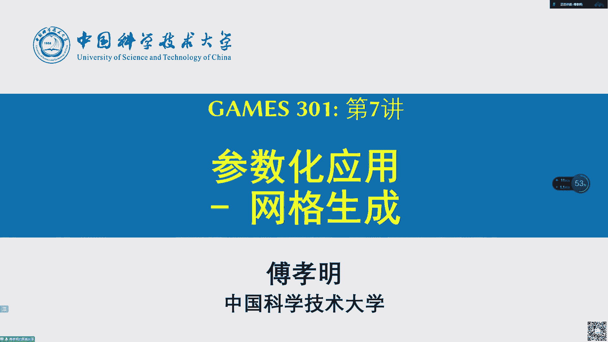
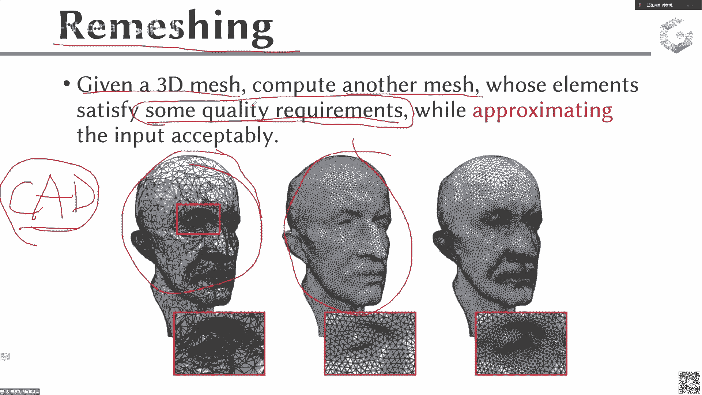
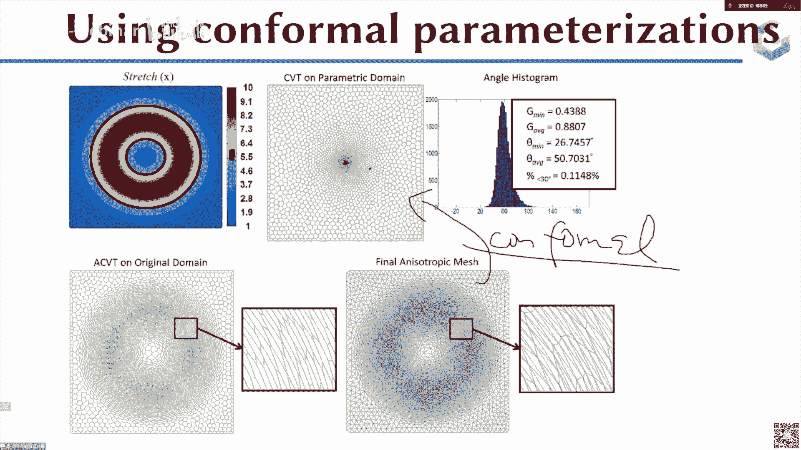
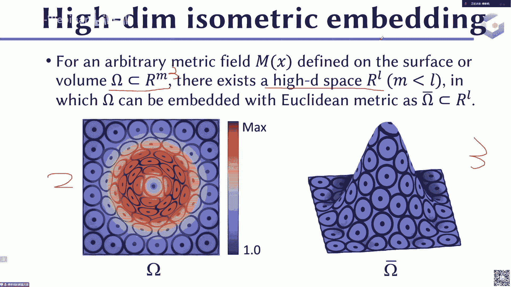
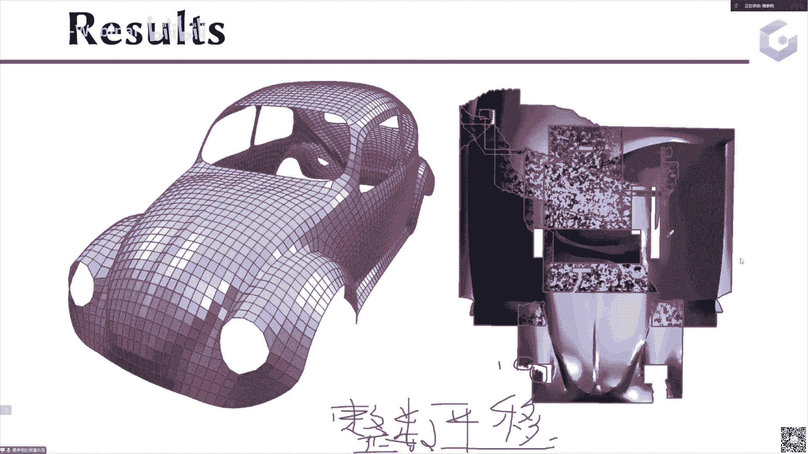
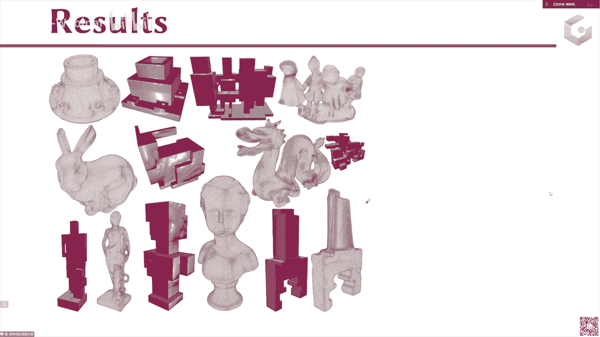
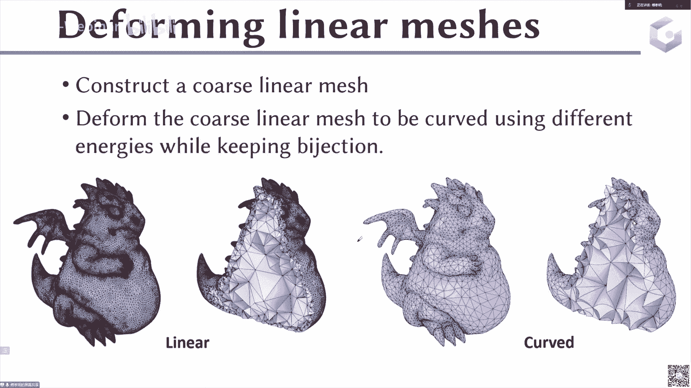

# GAMES301-曲面参数化 - P7：Lecture 07 参数化应用2-网格生成 🧠

在本节课中，我们将学习如何将曲面参数化技术应用于网格生成领域。我们将了解网格生成的基本概念、不同类型网格的特点，并重点探讨基于参数化的网格生成方法的核心思想与流程。

## 什么是网格生成？ 📐

网格生成是指使用多边形或多面体，通过边和顶点连接起来，以近似表示一个数字几何模型的过程。

例如，一个黄色的飞机CAD模型，其表面可以被四边形化，生成一个四边形表面网格来近似原始模型。在进行有限元模拟时，还需要对飞机外部的空气或流体区域生成体网格（如边界层的四面体网格）。整个网格化过程就是生成多边形或多面体并连接起来，以近似数字模型。

有了这样的多边形或体网格后，可以应用于后续的分析，如有限元分析或计算流体力学，进行物理仿真以评估设计性能。

## 网格生成的重要性与挑战 🔗

网格生成是连接计算机辅助设计（CAD）和计算机辅助工程（CAE）的关键桥梁。尽管CAD到CAE一体化是研究趋势，但目前最常用的方式仍是将CAD模型网格化后进行CAE分析，再根据物理仿真结果修改CAD设计。这个过程通常比较繁琐。

在计算机图形学中，与此紧密相关的概念是“重新网格化”（Remeshing）。

## 重新网格化（Remeshing）概述

给定一个输入的三维网格，计算另一个新的网格，其单元（如三角形、四边形）满足特定的质量要求，同时能很好地近似输入几何。

输入网格可能来自三维扫描重建（如Marching Cubes算法）或CAD模型的初步三角化，其质量可能较差。重新网格化的目的就是提升网格质量，以用于后续分析或仿真。

## 网格的主要类型 📦

常见的网格类型主要有以下四种：
*   **三角形网格**：表面网格，每个面是三角形。
*   **四边形网格**：表面网格，每个面是四边形。
*   **四面体网格**：体网格，每个体单元是四面体。
*   **六面体网格**：体网格，每个体单元是六面体。

三角形和四边形网格是表面网格，四面体和六面体网格是体网格。这四种网格在有限元分析和图形学中应用最广泛。具体应用中使用哪种网格最佳，通常由应用场景本身决定，最终评判标准是物理仿真的准确性。

## 网格质量要求 🎯

不同的应用对网格质量的定义和需求不同。常见的质量考量包括：
*   **单元形状**：如三角形是否接近正三角形，四边形是否接近正方形。
*   **尺寸**：网格单元的大小分布，可以是均匀的或自适应的（如在曲率高的区域加密）。
*   **朝向**：网格单元的排列方向，例如与几何特征对齐。
*   **各项同性与各项异性**：
    *   **各项同性网格**：单元在各个方向上尺寸接近，如接近正三角形。
    *   **各项异性网格**：单元在不同方向上尺寸有显著差异，通常用于适应曲率或物理场（如流体流动方向）。
*   **全局结构**：如三角形网格中，内部顶点若邻接6个三角形则为正则顶点；四边形网格中，内部顶点邻接4个四边形则为正则顶点。大部分顶点正则的网格称为半正则网格。

上一节我们介绍了网格生成的基本概念和质量要求，本节中我们来看看基于参数化的网格生成方法。

## 基于参数化的网格生成方法 🗺️

基于参数化的网格生成方法流程清晰，主要分为三步：
1.  **参数化**：将输入的曲面网格映射到一个简单的参数域（通常是平面）。
2.  **在参数域中生成网格**：在参数域内进行（重新）网格化，因为在此二维平面上操作相对简单。
3.  **映射回原始曲面**：将参数域中生成的新网格，利用参数化映射的逆映射，提升回原始三维曲面。

这种方法的核心思想是**通过映射将复杂的三维曲面网格生成问题，转化为简单的二维平面网格生成问题**。

### 方法优势与挑战

其优势在于简化了网格生成操作。然而，也带来一些挑战：
*   **参数化质量**：需要计算一个低扭曲（如保角或近似等距）的参数化，以确保二维平面上的良好形状在映射回三维后仍能保持。
*   **切割处理**：对于封闭曲面，需要切割（Cut）使其拓扑同胚于圆盘才能参数化到平面。切割缝处的网格在最后需要能够无缝拼接。
*   **额外约束**：在某些特定类型的网格生成中（如四边形网格），参数化需要满足额外的约束条件（如边界对齐格点、切割缝两侧满足旋转和平移关系）。

接下来，我们将通过几个典型应用案例来具体说明。

## 应用案例一：各项同性三角形网格生成 🔺

目标是生成所有三角形都尽可能接近正三角形的网格。

直接在三维修改网格（如通过边折叠、边交换等局部操作）可能抹除模型上的细小特征（如靠近的耳朵）。基于参数化的方法可以避免此问题。

以下是基于参数化生成各项同性网格的步骤：
1.  **切割**：将输入网格切割，使其拓扑同胚于圆盘。
2.  **参数化**：将切割后的网格参数化到二维平面，并保持边界固定。
3.  **在参数域中重新网格化**：在二维平面上生成高质量的各项同性三角形网格。
4.  **投影回原始曲面**：将平面网格的顶点投影回原始三维曲面。

**关键点**：在参数域中，两点间的欧氏距离近似等于原始曲面上的测地距离。因此，在三维中很近但在曲面距离上可能不近的点（如耳朵上下表面），在参数域中会被正确分离，从而避免特征在网格优化中被错误消除。

## 应用案例二：各项异性网格生成 🥚

目标是生成适应特定方向性要求的网格，例如在流体仿真中沿流动方向拉长的网格。这需要一个**度量场**（Metric Field）来指导，该场在每个位置定义了一个对称正定矩阵，用于重新定义局部空间的“距离”。

**核心思想**：将各项异性网格生成问题转化为各项同性网格生成问题。这可以通过两种映射实现：
*   **保角映射**：利用共形几何理论，存在保角映射能将给定的黎曼度量（即度量场）转化为标准欧氏度量。
*   **高维等距嵌入**：根据纳什嵌入定理，任何黎曼流形都可以等距嵌入到更高维的欧氏空间中。在高维欧氏空间中，可以使用标准的各项同性网格生成方法。

以高维嵌入为例，流程如下：
1.  给定二维域和其上的度量场。
2.  计算一个到三维空间的嵌入映射，使得嵌入后的曲面在三维空间中的欧氏距离尽可能接近原二维域在给定度量场下的距离。
3.  在三维嵌入空间中生成各项同性三角形网格。
4.  将网格映射回原始二维域，即得到各项异性网格。

**优化能量**：嵌入过程通常需要优化两项能量：一项迫使嵌入后的距离符合目标度量（嵌入能量），另一项保证嵌入映射的光滑性（光滑能量）。

## 应用案例三：四边形网格生成 ⬛

目标是生成大部分顶点度为4的四边形网格。

基于参数化的经典方法是：将曲面参数化到一个二维平面，并使参数化坐标线对齐一个规则的整数格点网格。这样，参数域本身的格网在映射回曲面时就自然构成了四边形网格。

以下是关键步骤与约束：
1.  **切割与奇异点**：在参数化前，需要将曲面切割开。奇异点（度不为4的顶点）必须位于切割线上，并被连接到边界。
2.  **约束参数化**：计算参数化时，需施加严格约束：
    *   **整数格点约束**：所有顶点（特别是奇异点和边界点）的参数坐标必须是整数。
    *   **旋转约束**：切割缝在参数域中被表示为两条边界。这两条边界对应的格线必须满足90度的整数倍旋转关系，才能保证网格在缝合后严丝合缝。
    *   **平移约束**：有时还需要满足整数倍的平移约束，以确保格线能完全对齐。
3.  **生成网格**：满足上述约束的参数化本身，其坐标等参线就构成了曲面上的四边形网格。

这种方法将困难的曲面四边形划分问题，转化为一个带复杂约束的参数化优化问题。

## 应用案例四：六面体网格生成 🧊

目标是生成全六面体网格。一种基于参数化的方法是使用**多立方体（Polycube）映射**。

**核心思想**：将复杂的三维体域参数化（映射）到一个由多个轴对齐的立方体堆砌而成的“多立方体”域上。由于多立方体域本身是由规则立方体构成的，在其内部生成六面体网格是 trivial 的（直接细分即可）。然后，将这个六面体网格通过映射拉回原始域，即可得到所需的六面体网格。

**关键挑战**：如何计算一个高质量的多立方体映射。该映射需要满足：
*   边界法向与坐标轴对齐。
*   映射本身扭曲低、无翻转。

## 高阶网格简介 🚀

高阶网格的单元边/面不再是直线/平面，而是由多项式（如贝塞尔曲线/曲面）定义的曲线/曲面。这能更精确地描述几何边界，并支持在单元上使用更高阶的基函数进行有限元分析，从而提高计算精度。

生成高阶网格的常见方法是：首先生成一个线性的（低阶）网格，然后通过一个映射/变形过程，将其“弯曲”成高阶网格，同时确保映射是局部单射（无翻转）。

## 总结 📝

本节课我们一起学习了网格生成的基本概念及其与参数化技术的结合。我们了解到：
*   网格生成是CAD与CAE间的桥梁，重新网格化旨在提升网格质量。
*   基于参数化的方法通过“三维到二维的降维”策略简化网格生成问题，其通用流程为：参数化 → 参数域内网格化 → 映射回三维。
*   该方法可灵活应用于各项同性/异性三角形网格、四边形网格乃至六面体网格的生成，但需解决参数化质量、切割缝合以及特定约束（如格点对齐）等关键挑战。
*   高阶网格代表了网格发展的一个前沿方向，能提供更高的几何与数值精度。

通过本课的学习，我们看到了参数化技术作为一项强大的几何处理工具，在解决复杂工程问题中的核心作用。