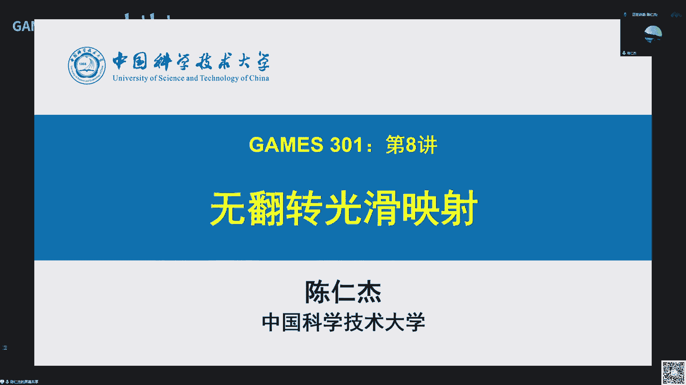
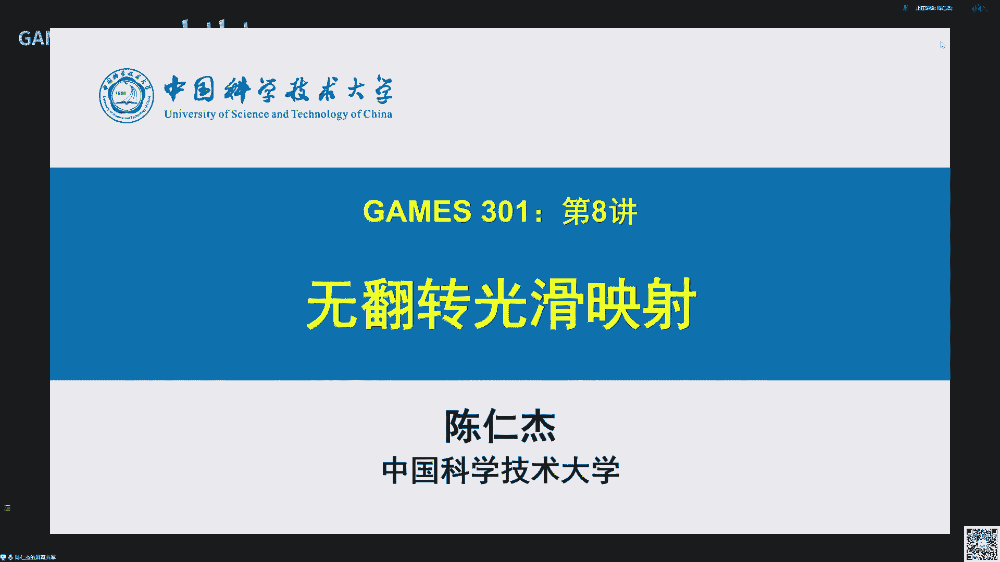
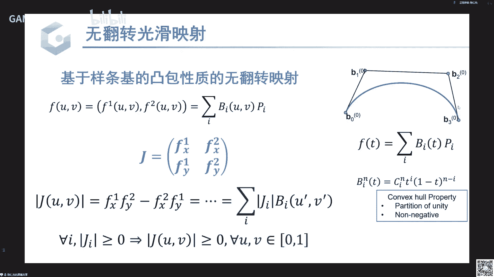

# GAMES301-曲面参数化 - P8：Lecture 08 无翻转光滑映射 - GAMES-Webinar - BV18T411P7hT

啊好长时间到了那个线上的各位老师同学嗯，早上好，欢迎来到我们啊games 301第八讲啊，那个这今天是由我呃来呃做那个讲课，对我是呃中国科学技术大学的陈文杰对啊，今天我们的题目是叫啊无翻转光滑映射啊。

首先我们看一下这个题目啊，那个我们呃就呃从第一讲啊，应该啊第一讲主要是那个啊整个课程的大概介绍是吧，然后从第二讲到第七讲，由啊郭老师来介绍啊。

主要是关于三教网格的那个呃参数化啊，然后三角网格上的映射啊，就没有单独，我们之前没有强调。

但是基本，上我们都是假设这个映射是啊一个分片线性的映射嗯，然后我们说这个分片线性应该是它不是光滑的啊，原因是它这个基函数是不光滑啊，然后呃还有一个他呃在不光滑的一个表现是啊，对于相邻面片。

也就是香菱三角形，它的那个映射的导数就是甲壳底，它是不连续的啊，具体我们看一下这个例子啊，这里我们啊虽然不是参数化，但是我们呃就说明一下这个映射。

它是啊可以写成就是这个定义在三角网格上的一个分片线性映射，f可以写成啊这么一个形式，然后这里嗯dr dj就是，我们的g函数对，然后那个外界其实就是我们的目标啊，应该是右边就被映射之后顶点的坐标。

我们可以把整个f写成这个形式，它就整个f它其实就是我们啊g函数bj的一些线组，然后组合的权重就是目标顶点的坐标y啊，对从y一到y n，然后具体这个bj长什么形式呢，我们可以看一下，是这样的。

然后当x呃当i跟j正好相等的时候，呃，这个g函数取值为一，然后当呃i根据不相等，的时候这个g函数取值为零啊，然后我们可以验证一下这个呃就是通过这个g函数组合的形式，这个f确实是满足我们的性质。

比如说我们把呃随便x啊，i等于一带进去了，右边嗯只有当啊就是i等于那只有当j也等于一的时候啊，那那一项才是有值的对吧，因为只有那一项b啊，这个g函数采取为一，然后出来就是y一对，然后呃所有其他项啊。

b j x一它就等于零对，所以整个出来啊就是线性组合出来这个fx一就等于x等于就等于呃，应该是等于y对对啊，然后在网格上我们，可以进一步把这个啊g函数这个b j g函数画出来，它就是这个意思。

就是这样的，就是他在dj的顶点上这个取值为一，然后在所有其他顶点上取值为零，对啊，我们啊这这里的示意是说这个网格它本身就是在啊c c等于零啊，这个平面上对啊，然后为了使得这个g函数它是就是这里。

我们啊其实只讨论了在顶点上的曲子是吧啊，然后作为一个呃映射函数，它在内部就是三角形内部非顶点数也是有取值的对啊，然后一般我们这个g函数啊，就是我们希望这个f是一个连续的映射所。

以这个g函数它也是一个所有的结都是连续的，所以啊为了使得它连续，我们就是在相邻顶点之间，我们啊用了最简单的一个线性差值，对我们看啊，就是右边啊，这里每一个三角就是在在第i个顶点。

就是当呃这个顶点抬起的这个顶点，它周围的一个一零域三角形也相应的抬起了，是吧对啊，这样这个映射它还是一个或者说这个啊函数它还是一个连续的函数，这个看起来可能有一点啊，稍微有点不是太直观。

我们可以看一维的版本，那就比较简单了对吧，下面就是一个一维的版本，就，是我们呃在就是这个b x就是我们啊同样的就是一维的一个啊，分片线性的一个啊，就是这个应该是叫德尔塔函数，他去世唯一，然后在所有x啊。

就是从0~1的一个直接的一个线性函数，最简单的线性函数对啊，然后我们看这个g函数b啊，b j x i它就不是一个啊光滑的基函数对吧，因为它取值如果我们不考虑那个呃就是差值的话，它在顶点的话。

差顶顶点上的取值就是一个啊，只有在一点取值为一，所有所有其他点取值为零对啊，所以他是在这个点上，它是啊就是应该是没有大导数是啊，比较大对，然后我们呃对，然后这个差值就刚刚已经提到。

使得这个函数变量连续的这个差值就是其实就是一个分片线性，就在这个呃一维的情况下，它在左边是一个线性函数，在右边是一个另外一个线性函数，所以它是一个分片的线性函数对，然后在三角网格上也是一样。

它在每一个三角片上是一个线性的函数，对，啊然后我们刚刚说第二点说那个这个映射它啊，相邻片的映射导数不连续，我们看一下这个具体是说啊怎么回事，对啊就具体我们可以把嗯把就把这种线性映射呃，分偏线性映射啊。

可视化用这个纹理映射的形式把它可视化出来啊，就是这个例子比较明显啊，就当我们这个网格很稀疏的时候啊，然后其实这个原始的那个定义这个网格它其实就是一个啊，就是一个非常长的长方形。

然后分片线性的映射到这个稍微有一点变化的一个呃网格，然后我们可以看到相邻啊，三角形之间这个呃就纹理它变化还是就是非非常不连续是吧，就是纹理的那个啊就是小格子的大小啊。

然后那个走向啊在边的两边它是变化挺大的对啊，这其实就是这个相邻片映射连续导数不连续的一个，就是视觉视觉上的一个体现对啊，数学上我们可以看这个啊相邻面片映射的导数它是怎么计算呢，就是我们看啊刚刚已经提到。

就呃这个映射它在每一片上的一个分片线性是吧，我们考虑这个啊当前这个货啊，红色的三角形t啊，然后在这两个三角形之间，这个映射它其实是一个唯一的一个线性映射啊，它把三个顶点映射到另外三个顶点。

然后这个映射可以其实啊就可以写成啊，这个形式就是呃就是fx等于a x加b啊，这应该是一个仿射映射，因为它在线性啊，就a x是它的线性成分，然后加上b就变成一个仿射变换，对。

然后我们可以考虑就是我们相邻三角片之间，这个呃x可以任意取值是吧，就在这种映射的构造里边，我们的顶点是我们的自由度啊，然后相邻面片的x可以是任意取的，那那个a就没有理由啊，就相邻面片的那个就解。

我们可以通过解这个方程得到这个a其实就是雅克比，他没有理由是连续的对啊，其实a在每一个面片内部，它是一个常量对吧，因为这个映射它是一个在这个三角面片内部，它是一个分片线性，它就是在每一点上。

这个映射它其实都是这个形式对，啊对那我们呃已经经过就前面讨论民已经知道这个分片线性映射啊，就在三角网格导致了这个分片线性映射，它啊不够光滑是吧啊，那怎么去提高它的整体映射的这个光滑程度呢。

呃一个最简单的做法，我们是啊就在中学或者那个计算数额，就计算几何的变，我们一般是通过增加网格的啊，就十分辨率就是把网格加密，那网格只要足够密，它这个映射就看起来啊。

会啊不会有我们这里这个例子里边这么明显的不连续性，对啊，那这个带来的代价就是我们做映射做优化，这个计算复杂度就会啊大幅飙升，就会非常非常大吧，就是很难求解。

特别是我们呃比如说我们呃第二个作业要做非线性优化是吧，他要迭代的去解这个呃线性方程组，然后每一个线性方程组因为网格变大之后，每一个线性方程组的它的复杂度都会啊，是一个至少是一个in lol的一个普拉度。

那它的这个计算代价就非常非常高啊，这是最简单的做法，就是增加网格的分辨率，我们使得整体上这个因素它会变得更光滑啊，但是它的代价就是计算复杂度高啊，那我们今天主要讨论的是就是我们通过一种啊直接去构造啊。

光滑基函数的方法，使得这个映射变得更光滑，对，对啊这是我们今天这节课的主要内容，就是我们啊讨论一下怎么去就现有的啊去构造，直接构造光滑映射的一些方法，对主要啊我们讨论啊，这里四类方法。

首先是第一类是叫rbf啊，也就是镜像基函数啊，第二类方法叫啊管理中心坐标，然后第三类是从从广义中心坐标，我们啊那个啊引出这个调和映射，调和音色是啊在啊，因为它是调和的，它所以可以认为它是最光滑的。

就是数学上它是最光滑的映射啊，然后还有一类是叫啊基于样条的呃，那个运算函数呃，样条是在就是c g d里边啊，发展起来它是呃其实简单说它其实就是一个分片啊，多项式的一个啊映射。

因为它分配每一片是多项式是吧，那相比啊线性函数线性时它就会光滑很多，对啊好的，那我们下面就呃足够来讨论对啊，首先是最简单的这个方法，奇函数叫镜像奇函数。

这个全称是叫radio basis function啊，就radio就是说镜像的意思啊，具体来说就是我们这个映射这个基函数就是这里的bi啊，它可以写成关于呃到某个点距离的一个函数。

就是这里一些呃x减p i绝对值是吧，这个就是就是在某个参数点pi的距离对啊，那这个距离啊，就是这个函数它就是以pi为中心的一个就是一个相当于一个误差，在在p i为中心的一些圆上，它的取值是一样的对。

因为它主观性距离对，所以这个这类g f叫做镜像极限数啊，然后由啊这类基函数同样我们可以装成一个映射空间，那个它就整个映射的表述跟前面其实是一样的，就是fx可以写成啊。

我们啊一些基函数的线性组合对bi就是我们的下面的迹象数，然后ai就是我们的系数啊，这个镜像基函数最早是拿来做，就是图像变形，就右边就是展示了这个拿r d f来做啊，jping的一个例子。

就是在这个例子里边啊，我们用户指定啊将图像里边的一些点拨到新的位置，就变形到新的位置，然后这里其实就是第就这个从新图像到旧图啊，从旧图像到新图像，它其实就是一个呃二维的一个呃main就是一个映射函数。

对就是我们将啊这个f找呃，确定之后，我们将f作用到每一个像素是吧，呃的呃，就是原来是图像的每一个像素就可以得到它在新图像上的啊坐标，然后将相应的那个原来的那个颜色值复制过去，那就可以得到新的图像。

啊然后具体这里这个g函数它可以啊，有很多形式，就是g可以取不同的那个具体的函数，比如说我可以去那个呃距离的倒数啊，这里为了避免出现福林操作，就是我们如果当x就等于pi的时候，这里啊这个距离就为零是吧。

如果我们只是取那个倒数的话，就会出现啊处理操作啊，所以一般我们会加上一个app系统，使得它避免这个竹林操作对啊，然后还有一种是取那个指数函数对啊，然后最后一种是就取那个啊指数方呃，那个呃多项式对啊。

那个平方的倒数对啊，这里就是在呃变形里，边我们一般会取啊倒数或者倒数的平方，原因是我们希望啊这个就是映射是由啊，主要是由这些控制点啊指定的，应呃就在控制点，它必须要满足我们啊用户指定的目标是吧。

然后在啊控制点附近啊，随着距离的增大，这个映射它会越来越趋向于呃的那个啊，应该是就是原始的一个单啊，叫恒等映射，所以我们希望这个区域啊它的影响范围就是每个基函数，它的影响范围是额递减呢。

就以啊这个二维函数它是递减在在原点，在在r等于零的时候，这影响是最大，然后随着r的增大，这个，啊g函数的值取值，它应该是越来越小，所以我们会取这个倒数的形式，对啊，就在图像处理里边。

这个rbf呃就是还是就是最早提出来啊，那做这个应用啊，就是做这个应用其实还是挺自然的一个想法对啊，然后在呃几何在在网格数里边呃，rbf也现在也用的呃。

也也就同样我们可以其实也可以拿rbf来做网格的变形对啊，然后也可以做，比如说做那个呃网格的重建对有很多应用都可以用到这个极函数啊，但是这个基函数可能啊现在用的没有那么多，原因是这个基函数啊。

虽然它很光滑是吧，就是它是这个距离的倒数，我们其实也可以啊，无限时求导啊，但是他，就是这种奇函数它不能张成最简单的那个函数，就是那个多项式函数，特别是线性函数，不能由这类奇函数章程。

就是我们只是只是去比如说啊pi啊，就pi就是我们的参数是吧，就是这个g函数的参数，我们随便撒一提点，就有一呃一批那个基函数，永远都不能生成一个啊线性函数就是我们最简单的线性映射，是不能由自主机章程的。

对那这这就是这个rdf的一个呃最最主要的问题对啊，因为线性函数还是很重要的一类函数，虽然它，很简单，这是第一类啊，最最简单的光滑函数就是r b f啊，然后第二类函数是第二类映射。

是叫那个呃广基广义中心坐标的一个映射啊，在介绍这个广义中心坐标之前，我们先看一下这个重心坐标的概念，呃中心坐标是说就是在三角形就在平面上，我们任意一个点可以有啊三个点的一个啊线性组合。

或者说啊任意点的坐标可以啊，可以写成关于三个基点的一个啊，相对的一个坐标对啊，更具体的说，比如说我们现在有三个点啊，就是大a大b大c它的我认为他们的坐标分别就是100010啊。

001就类似我们呃那个呃欧式坐标是那个1001对吧，然后现在我们讨论还是在平面上，但是我们有三个基点，就是大a大b大c对，关于这三个点的一个呃线性组合对，我认为它的那个中心坐标啊。

可以就可以写成关于那个大a大b大c的一个哦，就是权重对，这里的小a小b小c就类比我们啊欧式坐标里面的x y z是吧啊，原来我们二维表示那个欧式坐标只需要xy，现在这个重心坐标我们用了三个数。

小a小b小c3 个数对啊，就多了一个数啊，这个数其实是呃这里其实有一个人鱼，就是有一个，自由度多出来是吧啊，所以一般我们要求这个啊，就为了避免这个龙语，我们要求这个小a小b小c加起来等于一。

这样这个每一个点他的那个啊表示就中心坐标表示它就唯一了，呃然后装修坐标它最重要的一个性质就是说啊，这个质量就是我们啊定义的这个重心坐标，小a小b小c。

然后这三个点的那个质心就可根据这个啊那个质量得到的治心啊，是原来我这个点的平面坐标，这个v其实就是那个欧式坐标，然后b a b b c c就是三个顶点的那个欧式坐标，所以这这是一个非常那个啊巧的一个事。

就是说我们拿啊就给定平面上一个点是吧，我可以有两个坐标，一个是欧式坐标，第一个是那个呃重心坐标小a小b小c啊，这个公式就啊把这个重心坐标跟这个欧式坐标关联起来嗯。

对他就是说呃这个平面上的一点就是呃平面上一个三角形，b a b b c c c啊，他们的那个呃加权组合的形式就是其实这里啊就右边这个表达式啊，就是小a小b小c是啊，我们重心是吧，然后那个分母是他们的核。

那这个组合其实就是啊一个应该是一个啊，就加这三个全部加起来等于一对吧，然后呃可以是为负的，对取取值可能就是某一个具体每某一个坐标，比如说小呃a b c啊，不这这里我们没有要求他为正对啊。

所以这个组合它其实是一个呃，应该是叫仿射组合对，那非典就是那个啊三个点三个点三角形三个顶点的一个仿射组合对，对啊那个在呃就是这这是mobius最早啊在啊就是18世纪吧，给出了这么一个证明。

是说在三角形上，我们这个重心坐标它其实是唯一的啊，原因其实就是我们我们如果看这个就刚刚这个呃重心的一个要求的话，这个我们可以把这个重心啊这个要求写出来，其实这里v是一个向量是吧。

然后v1 v2 v3 也是向量，然后w1 w2 w3 是啊，这里的重心坐标啊，但但是这里啊w1 w2 w3 它是不要求归一化的，就是它加起来可以不等于一对啊，所以这里分母要除以它们的格对。

然后这个分嗯就是这个公式，它其实是说那个啊b的那个x呃跟y成分分别是v1 v2 ，v3 的x跟y成分的一个呃线性组合对，那就意味着我们关于呃那个w1 w2 w3 其实就有两个方程了，对吧啊。

那他们的自由度就只有一个了，这个自由度就是说我们啊假设有一组那个权重ww 2 w3 ，正好满足这个重心的一个性质，那这个公式还是成立的对啊，然后具体对啊，这个三角形而言的话。

这个啊就是这个坐标w这个坐标其实有非常简单的形式，就在这个例子里边，我们看啊w关于啊每个点，比如说啊w e是v关于v一的那个坐标啊，它就是呃v一所对的小三角形，就是红色三角形的那个面积。

对我们看啊红色三角形它就是啊b b2 b3 是吧，就是那个它的呃这这里的大a就表示它的三角形的一个面积对嗯，然后嗯v关于v2 的权重就是v2 所对的小三角形，就是这个绿色三角形是b b3 b一啊。

它的面积对啊，这里的指标是关于三是去啊关于三的模对，所以这，里啊我们可以看到w i的那个呃，关于第i个顶点是对的，权重是另外两个顶点的那个呃，再加上就中心这个点是吧，当前点就三角形。

另外两个顶点加上当前点构成一个小三角形的面积对啊，所以在三角形的情况，这个中心坐标它的表示还是比较啊，非常简单对啊，然后为了就是我们一般啊为了使这个重心坐标为一，我们要将它做归一化，这个规一化也很简单。

就是我们啊前面得到了那个w是w就是小三角形的面积，然后归一化只是说小三小三角形的面积除以大三角形的面积，那，么就可以得到一个规划的一个坐标啊，这个坐标有啊一些非常好的性质，首先是它是有啊归一性。

就是说所有这些啊就b3 个b b1 b2 b3 加起来它是等于一，这个证明很频繁对啊，然后第二个是那个叫重现性，就是说我啊拿那个当前点的那个重型坐标乘以呃作为系数啊。

作为那个就是c1 b2 c33 个点的那个线性组合的系数，那啊组合得到就是原来我当前点的坐标对啊，这个重现性其实就是由这个定义来，就是就是由自行的这个定义来对啊，然后还有一个是啊叫非户，型就是bi啊。

它在当当fee啊，属于三角形内部的时候啊，这个三个权重函数，三个坐标它都是非负的啊，这里要说明一下，就是当我我们前面说这个wi是面积是吧，呃是小三角形的面积啊，那面积它肯定是非负氧对吧啊。

就是这里还是要注意一下，就是当v取到外面的时候，其实我们这个面积应该是去啊那个带符号的面积，也就是说这个面积是跟这个三角形的定向有关的，对就是这里我们假设啊b啊，就是b i加e d i加二。

它是一个逆时针方向，那这个面积就为正当v跑到外面，那这三，这三个点的定向可能就反而变成顺时针，那这个时候这个面积就为负对，这样我们才能保证这个三个形式都是成立对啊。

唯一的问题就是当这个点跑到三角形外面之后啊，我们的那个非负性就不成立了，对，啊因为这三个性质就是啊使得这个中心坐标，然后它是拿来做啊差值的一个呃就是理想的一个函数对，非常理想的一个函数对啊对。

这个其实啊我们前面说到这个在三角对，就是这个f t其实就是一个啊基于三啊，就是它对应的差值出来这个映射它其实就是一个线性映射，啊那我们回到，啊这是三角形上对啊，然后对于那个几何处理里边。

我们更多时候我们希望关心那个啊就是跟一般的多边形，就是啊都在定义在多边形上的这个中心坐标，这就是啊管理重心坐标，它是三角形上的重心坐标的一个推广啊，然后作为中型坐标，就嗯它还是中心坐标是吧。

所以每一个点啊它的中心坐标还是要满足这个知心的性质，这个知心的性质就是说呃我拿重心坐标，每一维它作为那个质量，然后分配到我们啊这个多边形顶点上啊，所以这些质量的那个知心啊。

正好就是我原来这个点的那个欧式作品啊，对，啊然后同样有一个规划的一个概念，就是假设就是上面这个执行的概念，其实不要求这个wi是那个归一的，就是它加起来可以啊，不等于一对，然后我们拿来做叉子的话。

我们一般希望这个坐标它有规性啊，所以我们可以将w i做回一化啊，然后根据就根据这两条定义，我们就得到这个广义中心坐标，一般啊就两条性质，首先它是归一的，就是归一化之后，当然当然是那个加起来等于对啊。

然后是重现型，就这这个也是直接由这个自行的概念来的，就是我们可以把啊这个bi带进去就可以得到做呃，这个b就跑到右边是吧，然后左边其实就是那个啊西格玛bi乘以r d r对。

然后这两条性质就可以保证我们啊就是这个重心坐标得到的这个映射，章程的映射，就假设我啊f是就我有一个现成的一个线性映射f，然后我知道f在啊控制顶点就是这些多边形顶上顶点上的值对。

然后我拿这个顶点的值啊来做线性组合来做差值，那得到一个新的函数是吧，我们得到一个差值函数，这个函数，就跟原来的那个线性映射线性函数它是啊一样的，就是原来的线性函数对，就这里啊大家看一下啊。

就是这里左边其实是说啊，我做差值的时候，只需要这个函数在顶点处的值是吧，就f在顶点处的值，然后做差值就是我拿正确坐标作为权重，然后对零点所在的值做一个线性组合，然后这样得到一个新的函数。

这个函数它在我定义在在三角形啊，应该是在多边形啊，另外都是有取值的对，然后当这个啊我取就是在在f在b i点的那个取值，它正好是一个线性函数的时候，这个差值出来。

的函数就是我们啊就初始的那个线性和线性函数对，这是啊广义中心坐标一个非常重要的性质，就是它是能重现啊，那个线性函数对，啊下面我们看一下一些经典的呃最经典的那个管理状态坐标。

首先是啊就最早由flotto在97年提出来的，这个叫呃均值坐标或者说中值坐标吧，对啊，这是呃具体的这个终极坐标的一个公式，看起来有点复杂是吧，就是就是右边是一个示意啊。

就是距离这里的角度阿尔法i减一跟阿尔法是就是我当前点啊，v关于v i的权重啊，或者说坐标啊，是在这个图，按照这个图里边我们有两个角度，就是v跟vi这条边两边有分别有两个角度，然后他们的那个呃去取绊脚。

然后再去看景的，再除以这个啊b跟v i之间的距离，r就是他们的距离啊，这是v关于bi的那个权重，然后关于其他点的权重也是一样定义的，只是把呃只指标i h不一样就行对啊，然后根据呃前面的那个介绍。

其实这个坐标就满足执行的性质啊，然后这个坐标还有一个比较重要的形式，它是非负的，就是对于呃那个新型多呃多边形来说，就是当这个点正好落在我啊，这个多边形的那个应该是他的克隆，就是它就这个点。

简单说就是这个点能看到所有三角形的顶点，就是我呃那个这个点跟就当前点v跟所有的v i连起来，这个啊这个边吧，这条边就ri这条边完全是落在多边形内部的时候啊，这个权重就是这么定义的呢。

ww i它是非负的对这就是这个坐标非常重要的一个性质，就是跟啊很多其他那个管理中心坐标就没有这个性质对啊，这是我们第一次作业是做那个啊float参数化是吧，就是float那个呃就是应该是96年那篇文章。

它那个权重构造构造还是挺复杂的对吧，就是我们要对每个每一个点，我们要找到所有就是在这一领域内，这个点的那个三角形，然后取三角形的重心坐标来构造一组权重哈，啊一一组权重对恢复权重嘛对啊。

就那个算法就是看起来比较简单，但是实现起来还是稍微有点麻烦对吧啊，然后其实我们可以用这个装置坐标可以啊，更简单就是他直接就有这个啊重心的性质是吧，就是我v可以写成那个利用这个w i可以啊。

第一可以写成那个就是多边形零点vi的一个重心的一个组合啊，然后这个重心就是恢复的是吧，那正好就是以满足了那个啊恢复的要求，就是那个tt参数化的要求，并且，这个权重是跟我们的几何相关。

所以它其实就是一个啊形状相关的一个参数化，对或者说形形状敏感的仓库啊，啊这这个权重函数挺复杂的是吧，这大家可能会好奇这个具体它怎么来的呃，具体它是其实就是由这个中值差值来的，就是中呃。

我们在啊可能在微积分里边提啊，有学过这个啊，终止就是那个调和函数有一个终止性质是吧，就是我们啊f在n一点的那个取值，它可以是在这个点附近取一个路径啊，然后当这个在在这个路径上做一个积分对啊。

就做一个加权的积分w其实就是一个权重函数对啊，然后这个积分出来啊，就是我们这个点在这个b点的值，对这个终止性质应该是说我们当这个路径收敛到v的时候啊，这个积分会收敛到啊。

这个f在b点到底对吧啊对那这个中值坐标其实就是有啊，这里啊这个中值差值及中值差值的那个啊应该是一个定理来的对啊，这里的w在装置插座里边，这个w其实是就是倒数一二除以那个x减b的距离的倒数对对这个呃。

这是稍微提一下这个啊，这看起来有点复杂的这个公式具体是怎么来的对啊，大家如果感兴趣可以看啊，floor应该是97年这篇文章对，对啊，然后这里还有一些呃非常常用的那个反应装新坐标。

这啊叫离散的调和音调和坐标啊，或者说叫就叫那个cotine权重啊，对啊，在这个坐标里边啊，其实也是9v跟vi相关的两个三角形啊，然后有另外在这里取得另外两个角。

就是那个b e c i所对的两个三角形内角，然后他们的那ptg加起来啊，one press也是类似的啊，一个构造就是这应该是上面这个图对他是啊，对086是取了阿尔法，还跟阿尔法i减一是吧。

然后rush bs是取了那个正好是啊，b i所在的两个内角是贝塔i跟伽马i减一，啊对这这三个坐标是都是非呃是是非常经典的那个管理中心坐标，其实管理中心坐标还有很多啊，这这方面的研究还是非常非常多的对啊。

这里列了九个，其实应该还有更多啊，强调一下这个管理中心坐标，它一般是没有这个恢复性的，就是啊其实对啊，基数是啊，那个新型的那个多边形吧，这个很多啊，只有只有这个mw它是有啊，刚刚说的恢复性。

这就是在那个新型多边形的那个kl出，它是非负的，然后呃很多其他坐标都没有这个性质啊，更进一步，我们其实在呃实际里边我们接触的多边形态其实是不一定是新型，它可以是更一般的简单多边形啊。

在这个时候就所有这些作用坐标就没有这个恢复性，啊前面说的是啊，就这里列的是叫呃就带有就是解析形式，然后还有一类啊管理中心坐标它是没有啊，显示构造的，它是需要求解的啊，这里最经典的就是这个叫调和坐标。

调和坐标定义是这样的，就是啊它其实坐标可以看成是这个调整坐标，可以看成是一个函数是吧，就是没它在内部所有点都有啊一个值吗，那然后把所有点的值啊都取出来，它就是一个函数对，然后这个调整坐标它是作为函数。

它要满足这个拉普拉斯方程，也就是它的那个拉普，拉斯要等于零，然后呃边界条件就是这个狄拉克函数，就是当呃在这里的飞机就是在边界上的啊，顶点就i关于呃d i f e j就是说我d呃。

我当前点关于呃应该是dx顶点就是vj关于dx顶点的那个权重，对这里当根据相等的时候啊，这个取值应该为一，然后否则就为零对这是啊调和坐标它护照里边的一个边界条件啊，这个呃拉普拉斯我简单介绍一下。

简单说一下吧，这个拉普拉斯算子其实就是说di关于呃这里我们讨论的是二维是吧啊，那在二维上面这个拉普拉斯就是啊bi关于，x的偏导啊，两次偏导加上bi关于y的两次偏导对，这是这个拉普拉斯算子的一个定义。

对啊，这个坐标非常嗯非常好，原因是它是满足这个拉拉普拉斯方程，所以它是c无穷啊，这无穷街啊连续可导啊，然后它是有呃恢复性的，原因是啊，我边界值是那个啊零一是吧。

然后在内部它的取值就是在在连续情况下解这个方程出来的那个啊，就是中心坐标，在多边形的内部，它永远是背负的，就是在取值，就是在零一之间，嗯但是在呃离散情况下，这个啊一般这个拉普拉斯方程就就这个对啊。

拉普拉斯方程我们一般要用啊有限元去离散啊，这个时候有可能啊有可能这个取值它会变啊，稍微呃就就有可能变负值，虽然这个负的比例会就是那个具体的数值会比较小，但是有可能它就会变成啊小于零的值。

啊这这是就在同学里边非常经典的一个坐坐标，就是这个我们同样的有一个三维的版本啊，这里我列的这个啊就是这个参考书啊，就是这边呃文章其实就是拿来做那个三维的那个形状变形的对啊，三维的时候。

这个拉普拉斯方程式就是关于呃x的二阶导加上y的二阶导，再加上c的二阶导，这个定义是从二维啊一样推广过来对啊，然后呃关于中心就是计算的中心坐标，还有啊这里列了三种基于那个最大熵坐标啊，最小啊移动最小二乘。

以及那个啊，就是啊，我们呃实际上是张学友老师在14年提出的这个局部的中心坐标，对啊，就是啊大多数正确坐标就是基于计算的中心坐标，它是非局部的，就是说我们比如说这个调和坐标，除除了在边界上它可能为零是吧。

但是在所有其他内部，所有其他点啊，bi它都是大于零，它可能非常接近零，但是它就是非零的一个组对，然后局局部中心坐标的概念是我希望bi的影响啊，比如说b就应该是b b i对啊，bj的影响它是啊。

如果这两个点就边，界上两个点很远，差得很远，就我当前点跟某个边界差得很远，那这个边界对当前点的影响应该就没有对，就是这个时候应该啊这个中心坐标它的值应该是为零，对啊，这个这是局部中心手表的一个概念对。

呃我们介绍了很多这个广义中心坐标，然后广义中心坐标在同学里边其实有非常非常多的应用啊，最对最经典的最火的或者说最直接的一个应用就是做叉子是吧，就像呃这这里的例子就是说我们在一个多边形上有一个函数值。

然后我们可以将这个函数值通过啊管理中心坐标插值到整个平面啊，或者说三维也可以是整个空间对啊，然后这个叉子可以作用到更一般的一个函数，比如说这里是网格上对啊，我们将往这里啊几个网格的坐标啊。

就所有点的坐标拿这个中心坐标来作为权重来差值的话就可以得到啊，中间这个插值后的形状，这样就可以拿来做网格的一个或者说形状的一个动画啊，然后在渲染里边我们可以呃从呃这是这是对法向的一个差别。

就是我们一般法相是在顶点上是啊给定的顶点的法向他可是有啊，就是我们有其他方法，比如说或或者说就直接有那个啊分片线性差的那个靶向来算出来，然后对于我们渲染的时候。

需要每一个三角形内部所有点的那个啊任意一点的那个法向，那这个法向就可以由啊这个顶点的法向来做up主得到，这样我们可以通过啊，就经过插值之后，这个法向场就变成一个光滑的一个啊是方向盘。

然后这样渲染我们就可以得到一个啊光滑的一个曲面，看起来是就是原来这个三角网格，它是非常低分辨率是吧，那通过这个光环的反向反向场，我们可以啊实现一个光滑的一个渲染效果对呃。

然后呃管理中心坐标跟这个rbf一样，也可以拿来做图像的waking对啊，就在这个例子里边，我们同样是有一个这这这虽然也是多边形状，这其实可能是两，个多边形对，然后我们将啊原来这个顶点就是整个平面上。

应该是图像平面上所有的点用重心坐标来表示，然后将这个多边形变形之后啊，根据这个创新坐标来将原来的点同样的，就就用原来原来的中心坐标来做差值，可以得到新的坐标。

这样就是做这个图像image working的一个应用啊，然后最后一个应用是做这个向量场，就是同样的，我们在这跟shading可能是比较类似的一个事情，就我们在多边形上有一些方向是吧。

然后我们通过啊中心坐标可以将这些啊方向，那就是就将这些向量吧，他知道，啊全平面，这样这样就得到了一个啊向量场对，就是在向量场，就是每一点有一个定义，一个方向的一个或者说向量的一个场。

啊然后我们看一下这个啊一个记忆中心坐标，一个非常经典或者说非常重要的一点，就是怎怎么跟我们的呃参数化怎么关联起来是吧，就是其实在呃最前面我们提到那个r b f是啊一组光滑激函数。

那这个重心坐标是怎么样的一个计算数，对这个重心坐标其实就是我们把坐标看成一个函数的话，其实就是一个基于就是一个光滑的基函数，对我们看这个例子里边啊，从这组基函数我们可以得到光滑的一个映射啊。

具体是这样的，就是我们啊看左边一个多边形是吧，就有蓝色多边形对，然后呃这里作为可视化，我们贴了一个长颈鹿的一个纹理，然后在这个多边形内部任意一个点d我们有它的重心坐标di是吧，然后呃作为重心坐标。

它有这个重心性质，就是bi作为权重，然后啊将原始多边形的顶点做一个线性组合，那得到的这个组合就是原来的我们低一点的那个坐标啊，这是重心坐标的一个基本的一个信用值啊。

现在假设我们将这个多边形啊做了一个变换，稍微编辑了一下啊，得到了一个新的多边形，那呃我们可以拿这个中心坐标来插这个具体的差距就是这样的，我们啊现在多边形变了是吧，就是原来的原来是c i，现在变成xr啊。

但是原来是计算好的那个重型坐标bi我可以啊，呃同样的拿过来用，就拿bi作为权重作为新的啊，多边形顶点的一个权重啊，就是做线性组合的一个权重，那这个呃v点就会得到一个新的坐标，就变成那个fc对啊。

那这个就是一个就对另一个点，我们可以算通过这个线性组合得到新的坐标对，那这样其实就定义了一个啊音色函数f对，我们将这个f用，纹理映射的形式把它发出来，我们可以看到啊，这原来这个长颈鹿是吧。

现在就变成另外一个形式了，对可以看到这个长颈鹿还是啊还是一个长颈鹿是吧，就是感觉还是一个比较，就在这个例子里边还是一个比较自然的一个变形啊，这说明这个映射它确实还是比较自然。

具体来说它就是一个啊还是一个比较呃，是一个光滑的，然后啊我们可以看到它没有明显的那个像像那个分片映射的那种效果，对对啊，原因就是我们这个b i的构造，它是我们的啊，可以看到在再回来看这个三个经。

典的坐标是吧，就这个b i其实就是这里wi其实我们就是我们的di只是经过了归化啊，可以看到这个bi它是有啊，就是这个解析表达式，然后这个表达式里边就是他应该还是关于我们呃v点的一个。

就是欧式坐标的一个连续的函数，就这个函数可能如果我们写成那个x y的形式，它会非常复杂，但是呃没有关系，它就是啊虽然是一个比较复杂函数，但是从这个表达式可以看出来，这个它确实是有解析的表达式，对啊。

不是一个分片的一个或者说线性或者更低阶的一个形式对，对啊，这样我们可以通过反应中心坐标来构造啊，光滑映射对，就是整个映射其实也是啊，就f还是跟之前一样，还是这些基函数的一个线性组合对。

这个g函数就变成我们现在的那个广义中心坐标函数对，然后呃这里提一下这个叫啊那个柯西负重型坐标的一个概念，这里跟前面一页的差别，唯一的差别就是原来是b现在我们换成c了啊，这个b是一个实数。

就根据刚刚的定义，这个b是有解析表达式算出来的，是它最终是一个实数的一个形式啊，但是这里啊在科技中心坐标里面，c它可以取负数对，就是啊它是一个复平面上的一个数据对。

然后同样c就变成啊一样的是在复平面上的数据，所以这里啊线性组合就变成那个负数的一个形式的，一个啊加权的一个组合，我们可以同样可以拿这个中心坐标，复数中心坐标来做来构造一个光滑映射啊。

这这里只是一个示意啊，就是我们同样可以实现这个啊对这个长颈鹿的一个变形的，一个就光滑变形的一个效果，差别就是原来是di是吧，就是这个ci的表达式跟di有一点不一样对。

啊然后这个重心坐标的好处是我们这样构造出来的这个映射函数，f它是全程的啊，就是数学上如果我们对呃f关于c的共轭求导的话，那这个导数就是零啊，所以这个映射它是叫全纯映射啊。

其实全程音色跟啊叫那个啊保角映射其实是基本上是等价的啊，唯一的差别是这个全程因素它可能有零点，就是说啊它可以f关于c的导数可以消失，在某些点可以消失，对啊，这是全程音色，然后通啊，现在有了全程音色。

全程音色我们可以啊构造啊调和映射呃，稍微提一下这个全程映射跟，调和映射的一个联系啊，其实全程映射其实就是调和映射啊，但是它不是啊，但是啊现在有了啊，那个全程映射我们可以通过全程映射的一个啊复合。

我们可以得到所有的那个调换映射啊，具体啊我们后面会呃下一页介绍，我们首先介绍一下这个叫全程映射的一个啊，这个调映射跟呃这个前面提到有调和坐标是吧，都是调和啊，所以它也是满足这个调和方程。

就是呃这里我们还是以二维为例，就，是这个调音是它是平面的一个映射，就是它可以写成啊u成分跟v成分啊，分别是关于xy的那个函数啊，然后这个调和的坐标啊，这个拉普拉斯方程啊，跟前面一样。

这个拉普拉斯算子其实就是关于x的二阶导加上y的二阶导对啊，所以这里是一个偏分方程关，关于u跟v分别是有一个偏分方程对啊，然后这里我们有提边界条件是吧，我们一般这个边界条件是给定的对。

然后呃给定边界条件我们可以解这个呃拉普拉斯方程，然后这个拉普拉斯方程作为一般的pd，它是有唯一解的对就是这个给定边界条件，我们可以从边界推到啊，就是根据这个拉布拉方拉普拉斯方程得到所内部所有点的一个解。

对啊，这个调二映射它很重要，原因是它是呃非常光滑，就是在数学上它是最光滑的一类函数啊，一类映射啊，就是最光滑的意思，就是说它是数学上它是无穷阶可导，就是你可以求他的任意阶导数，然后呃作为调和调嗯。

就是挑音色，它的每一个成分是作为调和函数，它有这个极值原理，就是说我们u跟v啊分别有极值，原理是说u跟v的那个极值极大值和极小值是在边界上达到，就是对，就我们看这个例子来说，就这个下面这个例子来说啊。

这个映射不会跑到无穷远啊，跑到这呃，简单说就是内部的点，它不能跑到外面对，啊这个说的简单了一点啊，就在实际上其实这个调完音色有可能这个内部点会跑到外面，但是它不能跑到太原，就是我们不能跑到这个啊。

这不多，那那是绝对不可能的，因为这个即使原理啊，然后还有一个比较重要的性质是叫唯一性，就是给定了边界条件，这个条件是就是唯一的，它的解释唯一的就是这个拉普拉斯方程的解释，唯一的对啊。

这个唯一性可以允许我们啊做很多事情，就是给定边界条件，我可以确定啊，要就通过啊，我们要求映射要满足一定的性质是吧啊，因为它是唯一的，就是调音色是唯一的，我可以把这些要求放到边界上，然后在一定条件下。

它内部就会自动满足啊，我们希望呢希望达到的一些要求，对，啊然后调和音色有啊，那个还有一呃一个比较好的星座，就是二维的调节音色，有一个比较好的性质是说啊所有的调味映射我可以有这么一个分解。

这个分解具体是这样的，就是它可以写成两个映射的那个啊，就是和对，就是那个复合对啊，不是复活，就简单的加起来吧，对然后这两个映射分别是这样，一个是那个啊，其实就是前面的一个叫泉水音色。

然后另外一个跟全程映射非常接近，它是全是是叫反全纯映射啊，就几何上我们可以看这个全版全程映射，其实就是由全程映射做一个镜面翻转，这是关于呃x轴的一个镜像得到的，然后这个fire跟pos就是全程映射是吧。

所以我们可以由啊前面提到的那个柯西副中心坐标来得到，对啊，这样我们利用柯西中就是根据这个调后映射的这个分解，我们利用柯西中心坐标可以构造所有的那个太合映射啊，具体的构造是这样的，就前面我们已经提到啊。

利用分析中心坐标，我们可以得到一个全程映射是吧，φ是一个全程音色，然后对应啊我们可以构造啊另外一个全程颜色cos，然后取它的共轭就得到了一个反权反映社，对就persize啊，拔就是这个版权传音色。

然后把它们加起来就是一个调和映射，这样啊我们可以通过啊这个控制这个全程，这这里five跟presi系数是吧，x跟y就是这两个啊全纯映射的系数，就给定任意一组系数，我们就可以得到一个调和映射。

然后反过来也是一样的，给定任意一个调和映射，我们可以找到唯一的一组权重对，这样就构造了一个啊调映射，跟这个啊二维的一个向量之间的一个一一对应对，这样允许我们啊去解析的，去构造啊调所有的调味映射。

而不需要去求解这个拉普拉斯方程，因为如果是啊这个拉普拉斯方程的形式，这个是其实是比较难优化的，对这样我们呃利用柯西中心坐标可以得到，可以构造出所有的插画影射啊，然后还有一个好处是就是利用可惜中中心坐标。

它其实啊对应的这个映射它的那个啊一阶导就是f关于c的导数，其实就是发的啊，导数它同样的有一个解析的表达式对，就是这里啊其实就需要这个柯西中心坐标的那个导数。

对这里都是有解析表达式的对然后呃那个f关于18的共嗯，关于c一共轭的那个导数一样的，就是就是那个啊这里应该写错了，应该是f关于c共轭的导数，再取一个啊，没问题，没问这没问题。

对f关于c8 的那个导数是f的导数，然后再取个共轭对，啊ok这样我们可以呃就讲完了那个呃广义中心坐标应引啊，引出的这个广义重心映射以及条纹云社嗯好的，那我们要不先休息几分钟，我们看看大家有没有问题啊。

那个有网友问到这个拉普拉斯为啥是无穷光滑啊，这里不是说拉普拉斯算子是无穷关，好像是说这个调和映射是无穷阶可导对啊，就是作为这个特殊的一类那个pd方程就是拉普拉斯，他他他是拉普拉普拉斯方程。

它的解释呃叫调和映射或者调和函数，它是呃无穷阶可导对啊，下面是我们介绍啊，那个我们今天的最后一，类关卡基函数是计量条机啊，在介绍这个样桥机里边啊，这里有一类啊最经典的曲线叫做那个北泽的曲线啊。

北侧曲线是用于呃曲线建模或曲线设计里边，最最最经典的一类啊曲线吧啊这右边是一个事业啊，就是我们假设用户啊指定一些控制点啊，b0 b1 b2 b3 啊，它们连起来就是一个啊多边形啊。

然后呃这个白色的曲线是由呃是说那个我可以构造，有有那个就这里已经其实给出了xt就是这个白色曲线的一个形式，然后这个曲线其实就是一组基函数的一个线性组合啊，这，个b i n就是我们的那个基函数。

具体的形式是这样的，它是c ni啊，就是啊那个嗯排列组合是吧，从n那n个里边去，i n跟i写到了不对，然后呃后面是t的，自从你那个一减t的减i x啊，这是这个g函数。

然后呃整个曲线就是由这个基函数啊来线性组合，然后组合的那个参数或者说系数就是我们的控制顶点啊，然后这个曲线啊他正好能插值我们的那个呃多边形的那两个端点，然后呃就是其他端点是就其他分其他方式点吧。

会比较接近，但不会插足对啊，但是这个曲线啊好处就，是我们啊，还有还有一个好处，是我们呃在两个端点的导数啊，就是我们控制多边形的第一条边跟最后一条边对，就是大家可以看出来这是相切的对。

嗯然后其实从这个形式里边我们可以看出啊，就是这个表达式里面可以看出来，其实这个曲线其实是一个多项式的形式是吧啊，然后如果我的顶点越多，那这个曲线的接触就会越高。

对啊对这个白色曲线是可以拿来近似我们的控制多边形，但是它不插手对啊，就是顶点不多的话，这个啊看起来曲线还是比较自然，比较光滑是吧，然后也啊可能拿来做曲线的设计还是比较自然的一件事情啊。

确实在六七十年代啊，这个白色的曲线就是啊拿来做在c a d领域嗯，对在在c a d领域，特别是汽车跟啊那个啊飞机行业吧，航空领域啊拿来做表面啊，曲线曲面的设计这个用途对啊，但但是这个啊这里的g函数啊。

主要是这个g函数啊，这个g函数叫伯恩斯坦机，它有一些问题，首先是那个如果我的接触比较高，就是我要啊那个拟合非常复杂的一个多边形啊，其实它对应还是一个多项式曲线是吧。

就是这个多项式的接触会啊次数吧会比较高，那这个时候计算就会比较不太稳定啊，然后复杂啊就计算的，复杂度也会比较高对然后第二个是这个支撑，它其实不呃不是啊。

局部的就是说每一个基函数它在整个区间上取值都是非负，只有在两个端点上，它啊都都都是为政嘛，只有在两个端点上啊，就是某呃有一些技术它取之它为确切的名，嗯对然后它是不差值。

只有两个端点是插值的对这这是啊北色曲线的一些问题，所以啊但但是还是有一些好处是吧，就这个基函数它是多项式，所以它是光滑的，就是相比那个呃线性函数啊，他肯定要光滑一点对啊。

然后第二点是它支撑其实是伪局部的，就是说我尾局部的意思是说我移动一个控制顶点，这个曲线离这个顶点比较近的部分变化会比较大，然后曲线上离这个顶点越近越远的啊，那些点它的影响就越小对啊。

归一性就是加起来所有的基函数加起来是等于一，然后还有一个是恢复型，就是当这个参数t在零一区间内啊，取值这个g函数取值是非负的啊，就是说哦的曲线就xt它永远是落在我的控制多边，控制多边形。

比如说我控制多边形，它可能出现的区域对，嗯就前面提到这个本色曲线，它的基函数这个啊伯恩斯坦机还是有些问题是吧，它啊高阶就顶点多的时候接触就比较高，然后它的支撑它不是局部的啊。

所以啊在这个c hd里边我们进步啊，对啊，这是一般的低压槽机像素的一个构造，它是递归的定义，首先是一阶的啊，就是它在指定的区域内，就是它的支撑区域内啊，比如说第i个一阶啊，第二个区间就是从i到i加一。

它的取值为一，然后在所有其他区间它取值为零，它所以它就是一个分片的一个常值函数啊，然后由这些呃呃就低阶的基函数我可以递归的去构造啊，高阶的函数这个构造具体是这样的，就假设我现在有两个低阶的是吧啊。

就这这个图假设我已经有两个稍微低阶的一个函数，然后我将这两个低阶的奇函数做一个线性组合，对啊这里我们用上标啊，这里也上标k减一，就是说那个它的阶数是k减一，就右边是两个k减1d一阶的那个几项数。

由他们来线性组合就可以得到左边这个k阶的进项数啊，然后呃这里组合的时候，这个权重函数它是非常简单，就是在比如说我第一个记函数，它有一个支撑区域，就是说它取值为非零的一个区域，然后在这个区域内。

这个权重函数它是被一个线性的一个递增函数，从0~1啊递增的一个函数啊，这里我们可以验证一下，就t在啊这个第i个啊，k减一阶基函数的那，个支撑区域，它是他的自身区域，就是i到啊i加k减一。

然后在这个区域内在a点是取零，然后在i加k减一的时候，这个啊这个权重函数是取一，就是从0~1递增的一个权重函数，然后啊对应的这个右边这个g函数的，它的权重是从1~0递减的一个线性函数对。

然后由啊这两个基函数可以啊，先进组合就得到一个高一阶的基函数对，然后呃在代数上其实啊就原来是比如说从啊一阶它是一个分片线，要分片常数函数是吧啊，两个分片常数函数做一个这样一个差值就可以得到。

啊高高一次的一个多项式函数就是变成一个分片的一个线性函数，对啊下就第二个等式就是把上面这个等式稍微简化一下，我们可以呃这个其实不太重要，对我们看一下具体的一些啊比较低阶的一些基函数吧，对啊这里是啊。

前两个图就是啊两个一阶的减速，他们分别是在啊各自的支撑区域内是取一，然后在所有其他区域为呃，呃区域是取零，然后将这两个相邻的那个一阶级函数做啊，那个线性差值是吧，就可以得到啊。

下面这个二阶的对应的就是一个啊分片线性的一个函数，就，可以得到最前面我们看到的那个帽子函数是吧，就变成这样了，对这是一个分片的一个线性函数，然后将两个相邻的分辨线性函数再做一个差值。

就可以得到啊那个分片的大致的函数，那看起来这个函数这个函数就变得这个奇函数就进一步光滑，它就有一个啊应该是二次的多项式，所以是一次呃，那个c一连续的，然后再进一步将两个三阶的机箱做一个线性组合。

得到可以得到4g的奇函数，然后这个奇函数就变成啊c3 应该是第二，就是它是三次的多项式，然后是在啊在节点处，是ci连续的对，这是啊，一般我们这个碧阳桥或呃就是在央桥里边，我们接触不会取得太高。

一般四阶是最常见的对啊，然后有了这些基函数，我们就可以来啊做线性组合可以得到啊，具体的曲线就是我们啊这个释义就是说我们啊将对应的那个控制点，就是这里我们有一些啊原点就是我们的那个参数啊。

然后这这些参数作为权重函数吧啊，将这些t函数作为一个线性组合就可以得到一个啊那个曲线，这个曲线就是一个非常光滑的曲线对啊，然后我们可以看看下面这个啊这些基函，数啊可以看到这些奇函数长得都是一样的是吧。

然后看起来就是这些计算数，就是啊每一个进项数可以由另外一个计算数做一个平移得到对啊，然后这个计算数本一个奇函数，它有各自的有自己的一个支撑区域，在支撑区域外是取零。

对啊对这样我们就呃这这里就是在量槽里边最重要的一个概念，它每一个基函数都是由相同的构造，然后长得也很像是吧，然后那个啊又有非常好的性质，它是一个分片，啊线性它应该是分片多项式，就是在自己的支撑区域内啊。

是有一个是其实是一个分片的多项式对，然后它有景支撑，就是说在自己的支撑区域内啊，才取自茶，才是恢复在支撑区域外，它直径为零啊，这里是两个就低样条曲线的例子，就是啊这些这这这多边形是我们的控制多边形。

就是这里的控制顶点啊，也叫啊德布点，然后这些点啊作为权重，它是有一个啊局不行，这是我移动这个控制顶点是吧，中呃应该是第三个控制顶点啊，这个曲线它只有局部找的变化，就是右边这一部分的曲线它是完全不动的。

对这这是在曲线编辑里边一个非常重要的性质，就是我们作为用户，我编辑局部编编辑曲线的时候，我不想整个曲线都变对，所以啊这个局部支撑性是非常重要的一个，呃我们今天的主题是讲那个映射函数是吧。

他应该是就一般是在就是网格，或者说在二维区域上的一个映射函数啊，那我们花生前面花了这么多事情在介绍这个曲线啊，为什么呢啊其实曲线这里最重要的一个概念就是这个基函数是吧，这个基函数啊。

我们拿这个基函数来一维的基函数可以构造得到啊，更高维的基函数对嗯，这里其实一维跟二维其实差别啊，就是我们这个定义是什么是吧，就是一维的呢，呃就是曲线了，它的定义它其实是一个一维。

就是一个参数t然后作为二维曲线啊，曲面或者说平面的话，它其实是有两个参数u跟b对，然后再进一步啊，空间的话应该是有三个参数，它内在应啊就是本身它应该是有三个维度，u v w3 个维度对，那我们可以呃。

现在已经有了一个一维的奇函数，我们可以通过一维的奇函数来构造得到更高维的基函数啊，最简单的构造就是我们用啊一个叫张亮机的形式，啊这里我们是现在是要构造啊样条曲面就是前面是曲线是吧，有曲线怎么得到曲面啊。

曲线是一个参数，现在我们曲面的话它应该要要有两个参数对啊，然后曲面的话我们应该是就跟曲线一样的曲线，它实际上这样条曲线它是一个分片的一个多项式的一个曲线，然后对啊。

我们曲面的话我们可以两条曲线做一个扎拉机，那这样得到的一个曲面，它其实就是一个分片的一个啊，多项式也是一个多项啊，多多变量应该是两个变量，那个多项式。

然后呃那个两相邻片之间它会有呃那个相应的连续性条件对，就跟曲线一样啊，然后在这个样条曲面里边，这个每一片啊就叫一个样条块啊，下面我们看一下具体怎么构造对啊，就在样条曲面里边有两个方法。

首先是一个叫张亮机，就前面说的最简单的构造是张亮机，就是我们在一个方向上是一个呃一个可以看成一个曲线是吧，然后在v方向也是另外一个曲线，然后我们将这两组两两组曲线嘛做一个张量就可以啊，生存得到一个曲面。

就是当它这个定义就是一个规整的一个格子对啊，然后前面说的那个曲线的那些性质啊，因为g函数有啊，比如说非负性，有有那个归一性啊，我们可以频繁的就现在就可以频繁的推广到曲面的啊，case对啊。

然后在这个张量机里面，它每一片它其实是一个啊，就刚才已经提到它的参数域其实是一个啊，就应该是一个格子是吧，所以每一片它其实是跟那个正方形式同配的对就是一个把四边形。

就是这个呃曲面它就是一个四边形的一个四边形网格的一个啊，laout对啊，还有一类那个样条曲，面是叫全自由度曲面啊，这这里是一个室友，不知道是不是看得出来啊，这是一个呃应该是一个白色三角形。

就单个的三角形，然后我们可以将很多三角形拼接起来，就可以得到呃那个呃就是比较大的一个曲面嘛，对然后每一片它其实啊就每每一片是一个北色的三角形，有个呃有同样有一个控制多边形。

那这个空多边形其实就是在三维的一个三角网格对，然后这个啊这个曲面全自由度曲面，它是啊跟跟上面这个定义就呃参数也就不一样了，上面参数意义是隔着是吧，所以这个全自。

由度曲面它的参数也就是一个啊三角网格对平面的三角网格啊，然后这里每一片这个全自由度曲面，它每一片就是一个三角片，啊我们先看这个加垃圾曲面啊，照相机曲面我们看它怎么构造。

这里其实就是呃就是一个灾难机的形式，就是我们现在有啊，根据曲线我们有那个一维的奇函数是吧，有有那个啊，比如说这里是四阶的四阶的那个基数，就有四个b1 b2 b3 ，然后嗯嗯嗯第一第二第三第四。

然后呃现在我们变成原来是一个参数，现在我们变成两个参数，那就有两两个两两组那个计算数吧，然后我们将这两组积函数，关于u一组基数跟关于v一组基函数做一个张量，那就可以得到啊，这里变成四至16个基函数对啊。

这这里的基函数就是那个呃每一个奇函数它是有两个参数u v对，所以变成将来计时的形式之后，我们基函数就由那个取啊，原来一维的基函数做一个啊，就是其实就是排列组合是吧，就是啊b又跟bb之间啊。

所有可能组合都拿出来，就得到了所有的那个张量机曲面的那个极限数啊，然后这个这是一个失意，就是我们原来就是在啊一维下面有这些那个异维的计算数，然后我们将这些基函数做一个那个呃张亮机形式。

我们就可以得到二维的基函数就在平面域上的一个奇函数啊，这个这个事也是说我们两个红色的激函数做一个张量，它就变成一个以啊，就是这个格点为中心的一个啊类似镜像的一个递减的一个函数，然后右边啊是同样的释义。

其实是一个同样的释义对，就我们把这个这个这个标量函数吧，把它的高度就是啊那个可视化成那个高度场的形式，就变成右边这个形式对啊，然后有了现在有有了基函数，我们就可以构造这个曲面啊。

这个脏脏机曲面具体就是这样的，我们现在是啊有一，组奇数就b i u啊，乘以b j b这就是一个减函数对，然后呃那个我们控制点，就是我们啊所有的那个就是张开机曲面里边的那个啊控制顶点，我们作为参数。

然后将这些所有的那个控制啊，所有的那个啊基函数做一个线性组合，就可以得到这个啊发量机曲面，然后我们可以将这个表达式可以稍微变换一下，可以看到就是啊这里内核可以交换啊，就是顺序可以随便交换是吧。

所以这个单量机曲面可以看成是曲线的曲线，就是这样条曲线的曲线对啊，这是啊这对啊，刚刚说到这个张三，机曲面是怎么构造的，但是我们呃就在拼，就两个照相机，它其实是分片形式是吧。

那那那个我们呃需要光滑曲线曲面的话，我们要求这个在啊两片之间，它要满足一定的那个连续性条件，比如说那个c连续，那就需要它的一阶导数连续的那作为张亮机形式，他在比如说这个区呃。

这个啊定义域上其实在呃在在这条边上，它在呃应该是y方向，它是自然的，就满足那个啊一阶连续，但是在社交方向就是从从左往右啊，这是在x方向，它的那个导数它不一定是自然的去满足那个c一连续的。

所以这个c一连续是需要啊，我们作为条件放到这个呃那个参数的构造里面，对对具体来说这个啊其实就是说我们这个控制点它要满足一定的条件，比如说啊这里这应该是红色控制点吧。

他应该正好就落在相邻的两个控制点的中间，这样它就能保证在这个方向上它是c一连续的啊，这个我稍微提一下，就是那个关于两片之间的一个连续性条件对啊，然后还有一种构造。

就是那个曲面的构造是叫这个北423角形啊，它可以看成这个就是呃德法算法的一个三角形的形式啊，这里，我就不详细展开了，就简单说就是我们德卡送塔里边啊，它把它变成一个三角形的形式。

就是说我三个方向三条边上分别做那个德塔算法对啊，就重复的做割脚吧，对当最后变成一个三角形做那个差值，这个时候差值就是用纵横坐标来差值变成一个点，这个点就变成那个曲面上的一个点，对啊。

就这这个曲面相对于张亮机曲面，它会更自由一点，因为它啊它的那个呃就是参数域的那个拓扑可以是任意的，就可以是因为是可以任意的一个三角网格，相对那个打格子的一个形式会更自，由对啊。

这这个是构造稍微麻烦一点啊，我们就不再展开对，嗯ok那我们今天主要还是花时间是介绍这个叫光滑映射啊，主要是四位那个光滑的基函数啊，最后我们稍微再介绍一下啊，我们啊做做参数化是吧。

参数化里边我们啊最关注就目前最关注的是一个映射，是叫无翻转的一个映射，那现在我们现在啊映射由分片线性映射变成那个光滑映射，那对应的那个无翻转啊，应该怎么做，首先我们回忆一下这个分片线性映射，就是左边啊。

我们要做它的一个无反转优化，一般是这样做是吧，这这是我们第二次作业啊，就是呃给定现在我们要优化这个叫sd能量嗯，对这个sd能量就一个映射的s级能量是就扭曲能量吧，它一般在三角网格上。

就是在每一片上的能量的啊那个值，然后做一个加权的平均加权的和，然后权重就是这一片的那个面积啊，这个加面积加权原因是其实这个能量应该是一个积分的形式，就是我们其实每一个点都是有一个能量。

只在分辨线性因素里边啊，每一点它的能量是一模一样啊，这就三角形内部它的每一点的能量是一模一样的，因为它的甲不比是一个在三角形内部是一个常数对，所以在每一片三角形上的那个积分就变成一个简单的一个啊。

面积乘以就是任意点的一个权重啊，任意一点的一个扭曲吧，对呃然后呃就这个优化啊，就就是大家呃，就现在我们主流是用这个叫啊sd能量或者其他那个等级能量，原因是这个能量里面有内置的一个叫障碍函数。

就是这个甲壳比它的战术的一个倒数啊，这这一项它会变成无穷大是吧，当当映射变成那个奇异的时候啊，这个甲克比就是呃它的范数应该是那个行列式吧，甲壳比的行列行列式变成零，所以它的倒数就变成那个无穷大。

就是在呃，然后我们一般优化这个能量是叫用一个内点法，就是一个连续优化的一个思路啊，就是每一次我们是想去啊，将这个能量沿它的梯度或者其他的一个，比如说二次下降的方向去连续的去啊，再在一个连续的路径上啊。

保证的能量是下降的啊，然后因为这个能量也就这个能啊，就是度量函数里边扭曲，度量函数里面有一个内置的障碍是函数，如果我啊这个映射变成啊奇异的，那这个能量就会爆掉，就变成无穷大是吧。

那就保证我们在连续优化的时候，这个可以保证这个每一片它的映射没，或者说每一点的映射都是不起眼，这样假设我们映射是从一个啊就是初始是一个无翻转的音色开始，那就可以通过这个形式啊，保证在连续优化的过程中。

这个因素都是啊都是没有翻转的对啊，这这个付老师之前已经已经详细讲过，讲过了，我们就稍微再提一下对嗯，就是在分片线性映射里边，我们可以将这个能量啊原来是一个积分形式，我们在三角啊分片线性映设置一下。

下面它是变成一个简单的啊求和对吧，就是在每一片上的那个能量啊，然后求和对嗯，然后无反转条件也是一样的，就是我们希望是每一点都不翻转，然后但是没在三角片内，每一点的映射它是一样的。

所以我们只需要对每一个片只需要有一个夹克比啊，大于零就可以，就它的行列式大于零不翻转就可以，这样这个映射就这样，这个一个优化问题就还是比较啊，直接的就是它是有一个啊非线性的一个能量是吧。

就是这个能量是可以计算机是可以去表达，可以去啊优化求解的，然后这个约束也是有限的对吧，就是我们啊可以因为是有限的，我们可以去啊用啊，就是内点法去做连续的优化，这是分界线性映射，然后现在我们做光滑映射。

那把频繁的推广过来啊，现在我们的能量就变成还是变成这个能量的，就是组每一点能量的一个积分，就在整个定义域上的一个积分啊，然后同样的约束是我们要求每一点的夹克比它都是含量是大于零啊。

那要注意到这个积分就是现在我们变成一个光滑映射，每一点就是呃给你任意两个点，无论它有多近，这个两个点，他的那个呃就是价格比肯定是不一样的，那这个积分就没有办法把它变成本片线性映射下面求和的形式，就是啊。

所以我们这个积分必须得啊想办法去去把它变成啊，就在计算机可以有限的去去求解的一个形式啊，然后还有一个问题就是我们的约束就是说啊作为定义，我们要求无反转映射是在那一点都没有反转是吧，所有点。

那其实我们就有无穷多个约束，就是要求无穷多个点，它的价格优势大于零，嗯这样我们就可以看到这个光滑映射跟分片线性映射还是有很大差别，就是说呃我们的能量它要啊求一个积分，这个积分是没有显示的。

那个表达式就变不能变成一个简单的一个求和形式，然后约束它有无穷多位的约束，就是这个非线性的约束它具体的那个数啊，就每一点都有个约束是吧，然后点的个数是无限的嘛，啊约束的个数就是无限的对啊，那怎么办呢。

这个显然不是计算机可以求解了是吧，就没有办法去求解这么一个问题啊，然后一般就在我们用那个计算机器实现，或者说去做这样的优化的时候，我们还是要把它变成一个啊，可以啊。

就是变成一个有限的一个形式吧啊首先这个积分我们可以取近似，就是我们可以在这个定义上去采样啊，那这个积分就变成一个还是变成一个有限合的形式，就是我只要我的采样点足够多，那这个积分就足够精啊。

就会足够精确吧对啊，然后这个同样的这个约束原来是无穷多是吧，那我同样的可以把它换成那个在有限的点上的一个约，束对啊，那这样就变成啊，其实啊跟左边有个差不多了对吧，就是啊我们要优化一个有现象的那个能量。

在能量在有限个点的那个呃和，然后那个加上能量在同样的有限个点上的一个呃呃不是能量，就是这个啊在有线点上的那个呃一个非线性的一个约束，就是甲克比大于零的一个约束啊，但是带来问题了，就是我们现在这么优化呃。

利用这个比如说等级能量的一个啊，就是sd能量的一个优化，那只能就这样优化，我们只能保证在这些点上，就我采样的这些点上它都不反转，那在采样点，之外这样优化的结果其实不是没有保证。

对它可能是有翻转是吧对就是呃这这这是我们对光环因素，其实去真正去做优化，只能这么做，就是只能把啊无穷多个点，它把它变成有限多个点，这样我们才能优化，对啊对，还是带来的问题之后，我们怎么保证。

现在我们只是啊在优化的时候显示的在有限的有限多个点上，是有这个无翻转的一个约束，那怎么保证在这个有限点之外，就是当呃这个点s落在这个采样点之外，我们怎么怎么保证这个映射是无反转的呢。

对香菱介绍两类方法啊，首，先第一类是叫呃，那个就是考虑到我们映射是我们这个映射它是光滑映射是吧，那映射它本身是啊光滑的，然后进一步它是不是连续的。

然后对应的相应的那个我们啊可以要求这个或者说可以期期望嘛，期望这个价格比函数它也是一个连续的函数对啊，进一步是lip形式连续对啊，我们是看一下视野，就是前面我们提到我们现在在有限个点。

有限个点就是这些格子点的话，我们可以要求这个啊啊就是无翻出来对，然后呃就是我们现在可以要通过libc连续剧情要求这个啊，就在p点附，近的一个球或者圆内，它是不发生翻转。

具体的条件就变成原来是要求我们在p点它的那个价格比大于零，现在我们只呃利用那个连续型，就是啊，因为在p点附近，这个呃这个价格比它可以下降是吧，如果在p点就等于零啊，它下降就变成那个负数。

所以我们要求p点的那个甲托比它要大于某个常数，大于某个正值啊，具体这个正则我们啊后面再看它是一个linux常数乘以这个半径，啊这样啊在q点就任意一点，就是在球内任意一点啊，利用这个lip连续型。

那这个q点在这个求内那一点啊，就这个不等式成立，那出来啊这个表达式就是大于零，这样我们就可以保证啊在这个球内任意一点啊，这个假科比都是大于零对啊，然后再解释一下这个l这个东西，l就是一个叫lipx常数。

它是这么定义的，它是说我们呃现在我们关心的是甲科比这个函数是吧啊，然后这里的甲科比呃，这个这个内部函数就是说我这个假科比他在呃这个点附近吧，在p点附近啊，在在这个球内，它的变化率最大变化率就在球内。

它的那个应该是梯度的一个模长对，因为它变化率不超过这个l是吧，那我再从p点到求啊，应该是球面上吧啊，最大的变化量只可能是l乘以2r就是那个球的那个半径，所以在而球面上它的极小值。

所以那个那j q它就是大于零对啊，这是利用啊，就是我们映射是啊光滑映射，所以它对应的这个载荷比的那个行列式啊啊应该也是一个光滑的函数，进一步他应该呃我们希望它能有一个lipx常数，l就是一个lip。

是常数对，啊然后这是在单个点我们可以这样要求是吧，就是在p点我们可以要求他是啊，甲数比大于l2 ，然后当在所有采样点它都满足大于l2 的时候啊，然后因为这些球它能覆盖整个呃，就是如果r足够大啊。

p点也足够密，那我所有这些以p点为中心的球，它就能覆盖整个空间整整个定义域，那我就能保证在所有点上对任意的p啊，这个假设里都是大于零的，对啊，这是基于那个linux连续性的那个无反转判断对。

就是利用我们啊光滑映射的连续性啊，进一步可以要求期期望甲科比是那个，连续啊，进一步是不是连续，所以我们通过要求在p点它的甲壳比啊，不是不是单纯的大于零，而是大于某个政治，在采样点优化的那些点之外。

载客比都是大于零，啊然后还有一类啊那个做那个无帆转光滑映射的那个方法是啊，利用前面提到的样调剂的突发性质，就刚刚提到啊，还是回到我们本次的曲线，它的积压数这个伯恩斯坦基它是有这个突破性组织。

是说呃首先这个gf就b啊，d i n，这个gf它是啊加起来等于所有所有n阶那个计数加起来等于一，然后呃那个他在参数区间内，当t大于零小于一的时候，这个b就g f它是非负的。

所以啊这组啊这组系数吧它就一个凸组合的性质对啊，那我们如果可以把啊甲克比是吧，它其实是一个其实就是一个多项式形式，就是啊这里f x一也是关于u v的一个函数是吧。

然后那这个行列式就是关于u v的一个多项式，那这个多项式我们可以啊把它想办法把它写成啊一个就是北cr的形式，就是啊具体就是说我们可以把它写成在啊某些应该是控制点吧，就是采样点就呃内部所有点的那个甲壳笔。

可以写成在采样点的甲壳比的一个啊应该线性组合，然后组合的权重就是我们的基函数对，如果能够写成这个形式，然后啊甲科比在所有的采样点上是非负对吧，对我们知道就我们在优化的时候。

保证这个巧克比在采样点上是非负的，那因为啊这个bi它是这个g函数的，它是有突出的形式，它是啊恢复的那这些那这个就是凸组合，就是那个甲壳比的凸组合啊，就同样的应该有非负，因为甲科比在这采样点是非负。

所以它的凸组合也非负，这这是一个充分条件，就是我们如果能写成一个呃就是北齐的形式，然后在采样点上又是非负，那我们可以啊推断这个在呃当前点就是uv这个点，这个价格离是大于零啊。

但是很有可能就是我们这样写之后，在某些点啊，这个价格比它其实是呃小于零是吧，那那这个条件啊就就这个左边这个条件它就不成立啊，那这个时候其实没有办法。

就就不能我们不能判断这个价格比在u一点的甲壳比啊是大于零，它可能实际上是大于零啊，那怎么办呢，就是在呃基于样条的这个方法里面，我们可以做对这个就是啊曲线或者曲面做一个细分啊。

细分之后这个组合就会表这这个组合的就是线性啊，组合的那个啊表示吧它会更加紧致，我们可以期望这个价格比呃，就是在在啊a点的价格比，就很有可能原来在啊少数点是那个可能非负数，可能是负数是吧。

现在细分之后它就变成啊那个非负值了，这样我们就可以通过细分的形式可以得到更加精确的一个判断，对这是利用呃样条基函数的一个突发性质来做那个翻转预设，对啊，这里我就啊这这这两个方法我就大概介绍一下啊。

那个啊下次我们会通过一个具体的那个做形状变形的例子呢。

着重介绍基于那个啊应该是基于内部连续性的一个反转音色优化，对啊好，的那个那我们今天啊那个无反转光滑映射的一个介绍就到这里呃。

不知道大家有没有问题嗯好的，那如果大家没有问题，暂时没有问题的话，我们今天的课就到这里好。

