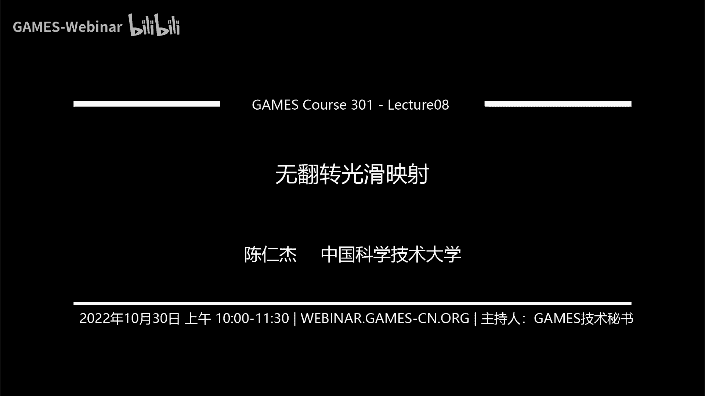
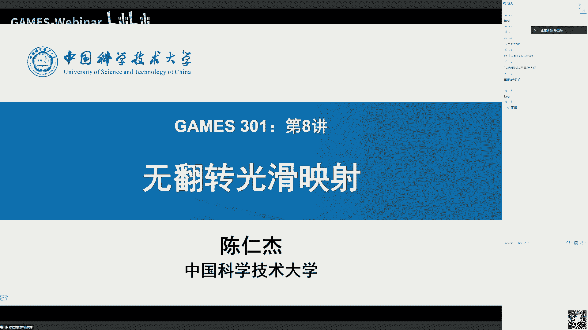
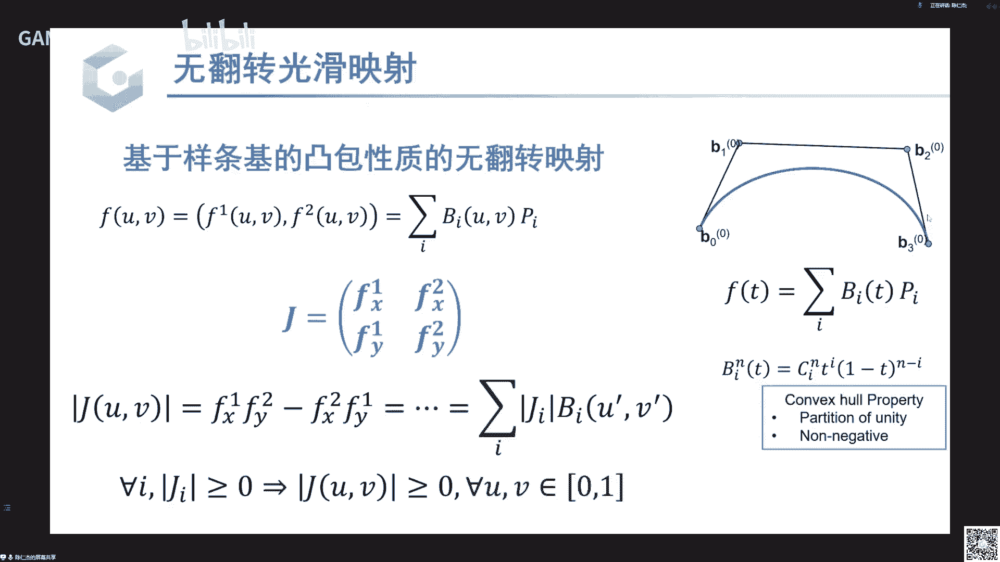
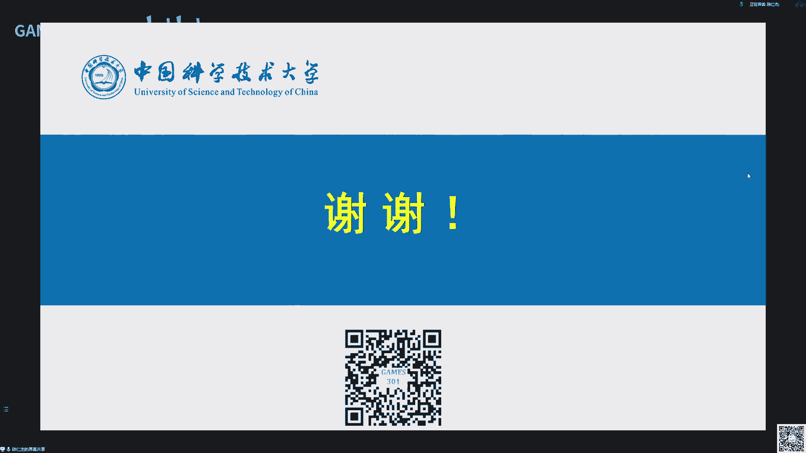

# GAMES301-曲面参数化 - P8：Lecture 08 无翻转光滑映射 🧭

在本节课中，我们将要学习如何构造比三角网格上的分片线性映射更光滑的映射，并探讨如何保证这类光滑映射的无翻转性质。

## 概述

在前面的课程中，我们主要学习了三角网格上的参数化，其映射通常被假设为分片线性映射。这种映射不够光滑，因为其基函数不光滑，且相邻面片间的映射导数不连续。本节课我们将介绍几种直接构造光滑映射的方法，并讨论如何确保这些光滑映射在优化过程中不发生翻转。

## 从分片线性映射到光滑映射

上一节我们介绍了三角网格上的分片线性映射。本节中我们来看看分片线性映射为何不够光滑，以及提升光滑度的基本思路。

三角网格上的分片线性映射 `f` 可以表示为基函数 `b_j` 的线性组合：
`f(x) = Σ (y_j * b_j(x))`
其中 `y_j` 是目标顶点的坐标，`b_j` 是定义在顶点 `j` 上的分片线性基函数（即“帽子函数”）。

这种映射存在两个主要问题：
1.  **基函数不光滑**：基函数 `b_j` 在顶点处不可导。
2.  **导数不连续**：映射的雅可比矩阵（导数）在相邻三角形边界处不连续。

一个直观的解决思路是增加网格分辨率，但这会显著增加计算复杂度。本节课的核心是介绍通过构造**光滑基函数**来直接获得光滑映射的方法。

## 四类光滑映射构造方法

以下是四种主要的构造光滑映射的方法。

### 1. 径向基函数 (RBF) 🌐

径向基函数是一类以距离为自变量的基函数。映射 `f` 被构造为这些基函数的线性组合：
`f(x) = Σ (a_i * φ(||x - p_i||))`
其中 `φ` 是径向函数，例如 `φ(r) = 1 / (ε + r)` 或 `φ(r) = exp(-r^2)`。

RBF 非常光滑，但一个主要缺陷是：**由 RBF 张成的函数空间无法表示简单的线性函数**，这限制了其应用。

### 2. 广义重心坐标映射 🧩

广义重心坐标是三角形重心坐标在多边形上的推广。对于多边形内的任意点 `v`，其重心坐标 `b_i` 满足：
`v = Σ (b_i * v_i)` 且 `Σ b_i = 1`
其中 `v_i` 是多边形顶点。

利用重心坐标，我们可以构造光滑映射：将变形后的多边形顶点坐标 `x_i` 代入公式：
`f(v) = Σ (b_i * x_i)`
这样定义的映射 `f` 是光滑的，并且能精确重现线性函数。

以下是几种经典的广义重心坐标：
*   **均值坐标 (Mean Value Coordinates)**：具有非负性，在凸多边形内部保证 `b_i ≥ 0`。
*   **离散调和坐标 (Cotangent Coordinates)**：与拉普拉斯算子相关。
*   **调和坐标 (Harmonic Coordinates)**：通过求解拉普拉斯方程得到，理论上无限光滑。

广义重心坐标在图像变形、网格插值和法向场光滑化等方面有广泛应用。

### 3. 调和映射 ⚖️

调和映射是指满足拉普拉斯方程 `Δf = 0` 的映射（每个坐标分量分别满足）。在给定边界条件下，调和映射的解存在且唯一，并且是数学上“最光滑”的映射之一（无穷阶可导）。

二维调和映射有一个重要性质：任何调和映射都可以分解为一个全纯映射和一个反全纯映射之和。结合前面提到的**复重心坐标**，我们可以解析地构造出所有的二维调和映射，而无需直接求解偏微分方程。

### 4. 样条基函数 🛣️

样条是计算机图形学中用于构造光滑曲线曲面的经典工具。其核心是一组光滑的、局部支撑的基函数。

*   **Bézier 曲线**：使用伯恩斯坦基函数，但高阶时计算不稳定，且基函数非局部。
*   **B 样条曲线**：通过递归定义，提供了局部支撑性、非负性、归一性等优良性质。`k` 阶 B 样条基函数是 `C^(k-2)` 连续的。

通过**张量积**，可以将一维 B 样条基函数推广到二维，用于定义曲面片（如 NURBS 曲面）。样条曲面由控制顶点和基函数线性组合而成：
`S(u, v) = Σ Σ (P_{i,j} * B_{i,k}(u) * B_{j,l}(v))`
其中 `P_{i,j}` 是控制顶点，`B` 是 B 样条基函数。

## 无翻转光滑映射的优化挑战与策略

上一节我们介绍了如何构造光滑映射。本节中我们来看看如何优化这些映射，并确保其无翻转性质。

在分片线性映射中，我们通过优化如对称狄利克雷 (SD) 能量来防止翻转，该能量在雅可比行列式趋于零时会趋于无穷大，形成一个“障碍函数”。优化问题形式为：
最小化 `E_{SD}(f) = Σ (A_t * energy(J_t))`
约束为 对每个三角形 `t`，`det(J_t) > 0`
这是一个具有有限个非线性约束的有限维优化问题。

对于光滑映射，问题变得复杂：
1.  **能量项**：需要计算定义域上的积分 `∫ energy(J(x)) dx`，而非有限和。
2.  **约束条件**：要求定义域内**每一点** `x` 都满足 `det(J(x)) > 0`，即有无穷多个约束。

为了在计算机上求解，我们必须将问题离散化：
*   **能量离散**：在定义域上采样一组点 `{p_k}`，用求和近似积分：`E ≈ Σ (w_k * energy(J(p_k)))`。
*   **约束离散**：同样只在采样点 `{p_k}` 上施加约束 `det(J(p_k)) > 0`。

但这带来了新问题：**如何保证在采样点之外，映射也是无翻转的？**

以下是两类保证策略：

**策略一：利用 Lipschitz 连续性**
如果映射足够光滑，其雅可比行列式函数 `det(J(x))` 是连续的，甚至是 Lipschitz 连续的（即变化速度有界）。那么，如果在采样点 `p` 处满足 `det(J(p)) > L * r`（其中 `L` 是 Lipschitz 常数，`r` 是采样半径），则可以证明在以 `p` 为中心、半径为 `r` 的邻域内所有点 `q` 处，都有 `det(J(q)) > 0`。通过布置足够密的采样点覆盖整个区域，就能保证全局无翻转。

**策略二：利用样条基函数的凸包性质**
对于由 B 样条等基函数构造的映射，其雅可比行列式可以写成控制点处雅可比值的凸组合（因为基函数非负且和为1）。因此，如果我们在所有控制点（采样点）处保证雅可比行列式非负，那么在整个定义域上，雅可比行列式也将非负。如果某些区域不满足，可以通过细分样条来获得更紧致的凸包逼近，从而满足条件。

## 总结

本节课中我们一起学习了从分片线性映射到光滑映射的过渡。我们介绍了四类构造光滑映射的方法：径向基函数 (RBF)、广义重心坐标映射、调和映射以及基于样条的方法。重点讨论了光滑映射在优化时面临的核心挑战——如何保证全局无翻转性质，并介绍了基于 Lipschitz 连续性和样条凸包性质的两种保证策略。这些方法为处理更高质量、更光滑的曲面参数化与变形提供了重要工具。