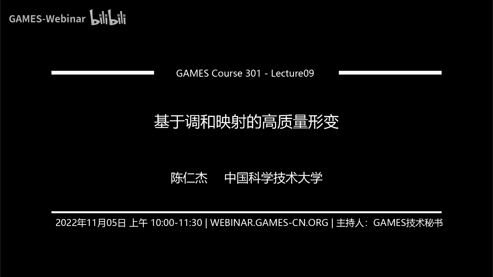
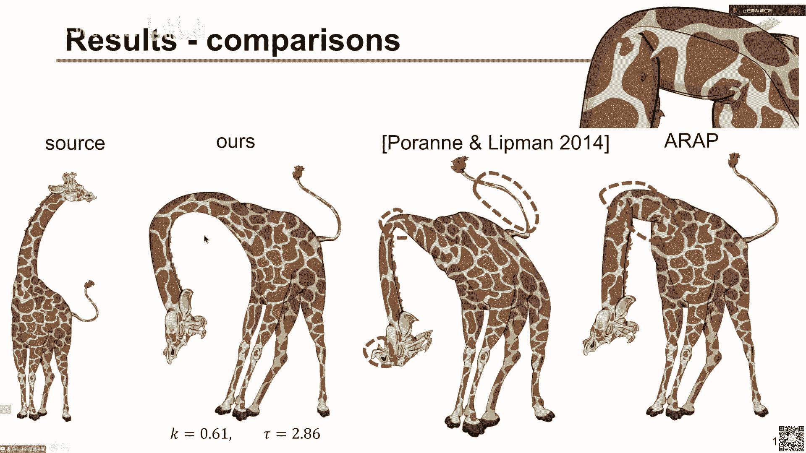
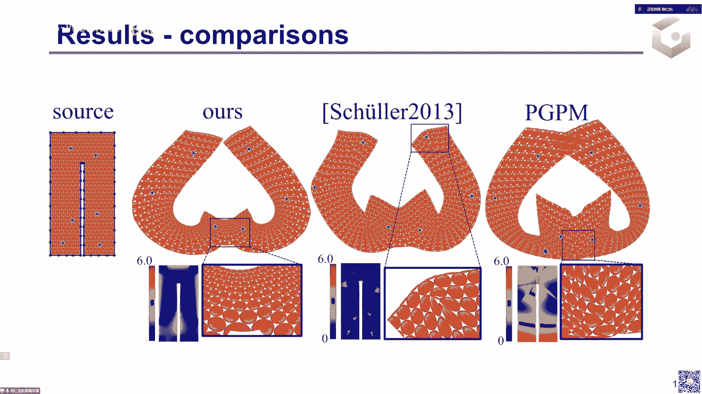
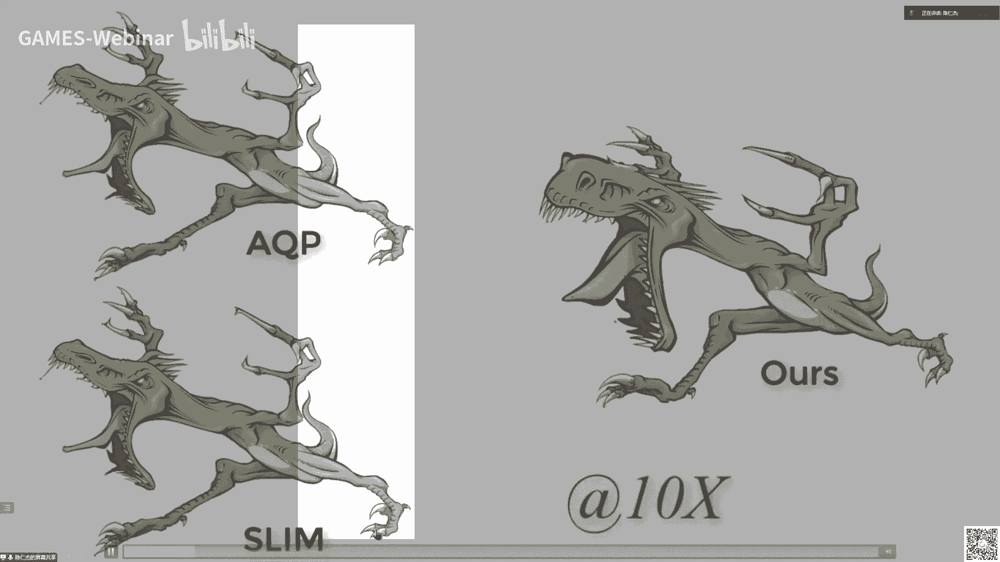
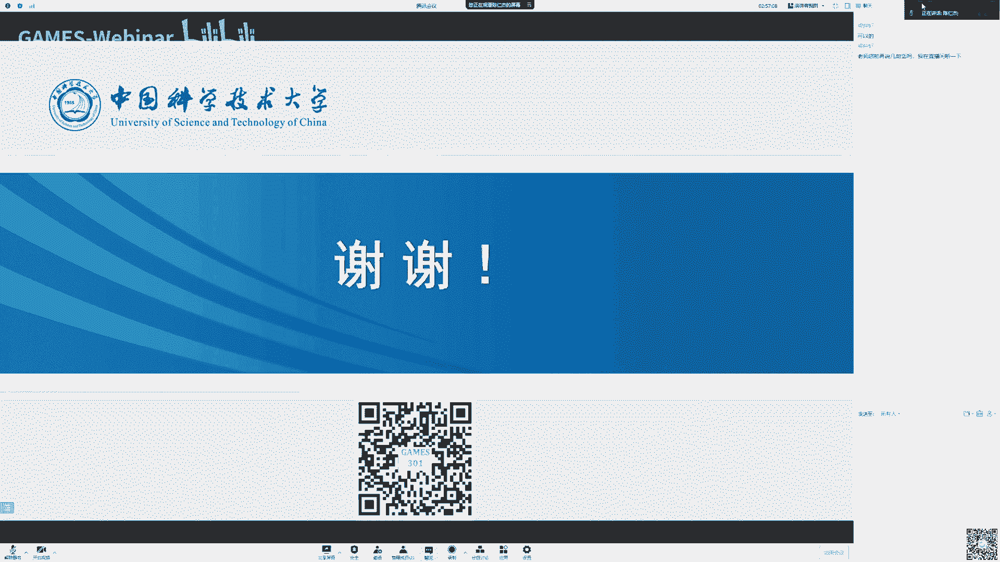
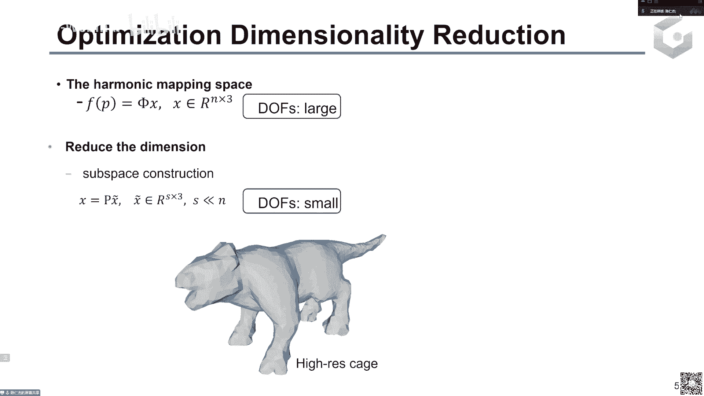

# GAMES301-曲面参数化 - P9：Lecture 09 基于调和映射的高质量形变 🎨

在本节课中，我们将学习如何利用调和映射来实现高质量的二维和三维形状变形。我们将从变形问题的基本概念和需求出发，逐步介绍调和映射的理论基础、优化方法，并展示其在实时交互式变形中的应用。

## 概述

形状变形是计算机图形学中的一个经典且重要的问题，尤其在关键帧动画制作中。设计师通常先绘制关键姿势（关键帧），然后需要生成中间帧以形成流畅的动画。本节课将探讨如何通过优化一个光滑的映射来实现高质量、无翻转且扭曲可控的变形。

上一讲我们介绍了光滑映射构造的基础知识，本节中我们来看看如何利用调和映射这一特殊的光滑映射来实现高质量的形变。

## 变形问题的基本要求

作为一个用于动画设计的形状变形系统，需要满足以下核心要求：

*   **直观的用户界面**：用户可以通过简单的交互（如鼠标拖拽）来指定变形约束。
*   **快速的算法**：算法需要足够快，以提供实时反馈，允许用户根据结果调整约束。
*   **高质量的变形结果**：变形映射需要满足：
    *   **光滑性**：映射本身是光滑的。
    *   **局部单射（无翻转）**：变形不会导致表面自交或折叠。
    *   **扭曲有界**：变形的拉伸或压缩程度可以被控制在一定范围内。

为了直观地判断变形质量，我们可以将规则的圆形图案作为纹理贴到形状上。高质量的变形会使这些圆形尽可能保持为接近正圆的椭圆，且大小变化不大。

## 相关工作与挑战

现有的变形方法主要分为两类：基于网格（分片线性）的方法和无网格（基于光滑映射）的方法。

以下是现有方法的一些局限性：

*   **基于广义重心坐标的方法**：可以保证局部单射，但其扭曲的上界不可控，可能导致严重的拉伸或压缩。
*   **基于可控保角映射的方法**：不能直接指定关键点的位置约束，而这在变形中至关重要。
*   **基于径向基函数（RBF）或样条基的方法**：虽然可以证明结果是无翻转的，但其给出的扭曲上界估计往往不够“紧”，且基函数与形状本身关联不紧密，可能导致不自然的变形。

## 平面映射与扭曲度量

平面映射 `f` 将一个二维区域 `Ω` 映射到另一个二维区域 `Ω'`，可以表示为向量函数 `f(x, y) = (u(x, y), v(x, y))`。其雅可比矩阵 `J_f` 描述了映射在一点附近的局部线性近似。

通过 `J_f` 的奇异值分解（SVD），我们可以得到两个奇异值 `σ₁` 和 `σ₂`（`σ₁ ≥ σ₂`）。它们具有清晰的几何意义：映射 `f` 将定义域内某点处的一个无穷小圆，变换为目标域内的一个椭圆，该椭圆的长短半轴长度即为 `σ₁` 和 `σ₂`。

基于奇异值，我们可以定义多种扭曲度量：

*   **保角扭曲**：希望椭圆保持为正圆（允许缩放），即 `σ₁` 与 `σ₂` 尽可能接近。度量公式为 `(σ₁ - σ₂)²`。
*   **等距扭曲**：希望椭圆不仅是正圆，且大小不变，即 `σ₁` 和 `σ₂` 都接近 1。一个常用的度量是**对称狄利克雷能量**：
    `E_sd = (σ₁² + σ₂²) * (1/σ₁² + 1/σ₂²)`
    当 `σ₁ = σ₂ = 1` 时，`E_sd` 取得最小值 4。

在复数域下，映射 `f` 可以表示为关于复变量 `z = x + iy` 的函数 `f(z)`。此时，奇异值有更简洁的解析表达式：
`σ₁ = |f_z| + |f_z̄|`, `σ₂ = ||f_z| - |f_z̄||`
其中 `f_z` 和 `f_z̄` 是 `f` 关于 `z` 和其共轭 `z̄` 的导数。

## 调和映射与边界最大值原理

调和映射是一类特殊的映射，其分量函数 `u` 和 `v` 满足拉普拉斯方程 `Δu = 0`, `Δv = 0`。在数学上，调和映射是最光滑的映射（无穷阶可导）。

调和映射的一个重要性质是**边界最大值原理**：调和函数在其定义域的边界上取得最大值和最小值。

对于变形问题，我们关心的是映射的扭曲（如 `σ₁`, `σ₂` 或其函数）是否在整个区域上有界。一个关键的理论结果是：对于一个调和映射 `f`，如果其扭曲度量（如 `|f_z|/|f_z̄|` 和 `σ₁/σ₂`）在边界上有上界，并且 `f` 满足一个额外的积分条件（与 `f_z` 在边界上的积分有关），那么这些扭曲度量在区域内部也满足同样的上界。这相当于将需要在全二维区域上验证的“无翻转”条件，降维到了一维的边界上进行验证，极大地简化了问题。

## 基于调和映射的变形算法

有了上述理论基础，我们可以设计变形算法。

### 1. 参数化调和映射空间

首先，我们需要一个方便优化的调和映射表示。任何平面调和映射 `f` 都可以唯一地分解为一个全纯函数 `g` 和一个反全纯函数 `h` 的和：`f = g + h`。

利用柯西广义重心坐标，`g` 和 `h` 可以分别用两组复数向量 `m` 和 `n` 来参数化。这样，整个调和映射空间就被参数化为由 `m` 和 `n` 张成的空间，优化时只需调整 `m` 和 `n`。

### 2. 优化问题建模

我们的目标是找到一个调和映射 `f`，使其满足：
1.  **位置约束（软约束）**：用户指定的点被映射到目标位置。
2.  **扭曲有界（硬约束）**：在边界上，扭曲度量不超过用户给定的上界 `K` 和 `T`。
3.  **积分条件**：满足前述理论中的边界积分条件，以保证内部点的扭曲也有界。

优化能量通常选择对称狄利克雷能量 `E_sd` 或其变体，位置约束作为惩罚项加入。这是一个带有非线性不等式约束的非凸优化问题。

### 3. 优化求解策略

*   **凸化技术**：对于非凸的扭曲约束，可以采用局部凸近似（如二次函数近似）的迭代策略，将每一步转化为一个凸优化问题来求解。
*   **边界采样**：理论上需要在无穷多个边界点上施加约束。实践中，我们在边界上采样一组有限点集 `P`，在这些点上施加约束。
*   **利用 Lipschitz 连续性**：为了将从有限采样点 `P` 上满足的约束推广到整个边界，我们利用调和映射导数 `f_z` 和 `f_z̄` 的 Lipschitz 连续性。如果在采样点处 `f_z` 足够大且 `f_z̄` 足够小，那么在整个边界线段上，`f_z` 都不会太小，`f_z̄` 都不会太大，从而保证扭曲有界。

### 4. 算法缺陷与改进

上述方法存在一些缺陷：扭曲上界需用户指定；位置约束是软约束，在约束过严时可能无法满足；凸化迭代求解可能较慢。

为了获得更快的交互速度，后续研究提出了基于**牛顿法**的优化方案：
*   **目标函数**：直接使用对称狄利克雷能量 `E_sd` 加位置约束惩罚项。`E_sd` 本身具有障碍函数性质，当映射趋于退化（`σ₂ → 0`）时能量趋于无穷大，这有助于在优化路径上保持映射无翻转。
*   **牛顿法求解**：通过计算目标函数的海森矩阵，使用牛顿迭代快速收敛。需要对海森矩阵进行投影以保证其正定性，从而获得下降方向。
*   **GPU 加速**：整个优化流程（矩阵乘法、稠密线性方程组求解、更新）非常适合在 GPU 上并行实现，能达到实时交互的速度。

## 从二维到三维体变形

三维体变形的核心思想与二维平面变形类似，但更加复杂。

*   **映射描述**：三维映射将单位球映射为椭球，三个奇异值 `σ₁, σ₂, σ₃` 对应椭球三个主轴的长度。无翻转条件为 `σ₃ > 0`（雅可比行列式 > 0）。
*   **挑战**：
    1.  **无解析表达式**：三维奇异值没有像二维那样的简洁解析表达式，依赖于数值 SVD 计算。
    2.  **定理不直接成立**：二维中“边界扭曲有界可推出内部扭曲有界”的定理在三维中不成立。因此，我们必须在整个三维区域内部进行采样验证。
*   **解决方案**：
    *   **估计 Lipschitz 常数**：为了从采样点验证推广到全区域，需要估计扭曲函数（如 `σ₃`）的 Lipschitz 常数。我们利用调和映射的二阶导数（海森张量）来给出一个上界估计。
    *   **增加光滑性惩罚**：在优化能量中加入映射二阶导的范数作为惩罚项，强制映射更加光滑，从而获得更紧的 Lipschitz 常数估计，减少所需的采样点数量。
    *   **降维**：三维体网格通常顶点很多，导致自由度巨大。可以通过主成分分析（PCA）在由最光滑的调和映射张成的子空间中进行优化，大幅提升速度。

三维体变形算法同样可以实现实时交互，并保证变形结果光滑、无翻转。

## 总结

本节课中，我们一起学习了基于调和映射的高质量形变方法。

*   我们首先明确了变形应用对**高质量映射**（光滑、无翻转、扭曲有界）的需求。
*   接着，我们回顾了**调和映射**的数学定义和重要性质，特别是其**边界最大值原理**，这为将全局约束简化为边界约束提供了理论依据。
*   然后，我们详细介绍了如何**参数化调和映射空间**，并建立包含位置约束和扭曲约束的**优化问题**。我们探讨了使用**凸化技术**和**Lipschitz连续性**进行求解和验证的策略。
*   为了追求实时性能，我们进一步介绍了基于**牛顿法**和**对称狄利克雷能量**的快速优化方案，该方案非常适合**GPU加速**。
*   最后，我们将方法推广到更复杂的**三维体变形**，解决了奇异值无解析表达式和边界定理不成立等挑战，通过估计 Lipschitz 常数、增加光滑项和降维等技术，实现了高效的体变形。

通过利用调和映射的光滑性和独特的数学性质，我们能够构建出既满足高质量要求，又能实现实时交互的变形系统，为数字动画和几何处理提供了强大的工具。