# GAMES302-等几何分析 - P10：10. 基于等几何分析的拓扑优化 - GAMES-Webinar - BV1dM4y117PS

好各位老师各位同学，那我们现在开始我们j的第四讲。

那么我们这一次课呢，主要给大家介绍基于等级和分析的，拓扑优化的这部分内容，我们上次课呢给大家介绍了，这个基于登记和分析的形状优化对吧，那我们说形状优化啊，主要是去优化这个模型的这个外形。

那是在形容一化里面的，我们前面说过啥，就是体现了这个等级的飞机啊，非常大的这个优势，较大的优势，那么相对于top优化啊，也是作为我们结构优化的一部分对吧，那在这个引入等级和分析之后，会有哪些新的方法啊。

或者在整个框架上有没有一些革命性的改变啊，之类的啊，那么我们也是啊，通过这次课呢来介绍目前基于整体和分析的，拓扑优化的一些相关的一些工作，那么实际上目前基于等级和分析的这个拓扑，优化的工作是越来越多了。

目前估计也有，上百篇的这个论文了啊，那么实际上就是说啊从我的理解来看啊，就是说目前基于等你分到拓扑优化的，这份工作啊，基本上应该还是一些经典的拓扑优化的方法，的一些扩展啊，一些扩展。

比如说在等级和分析框架下的一些扩展，那么实际上就是说真正的啊，能够体现等几个分析优势的，这种特殊优化方法啊，目前目前来看啊，应该还是，比较少啊，比较少，所以所以呢我们也是通过这次课能够让。

特别是前面可能对拓扑优化啊这部内容啊，呃不是特别熟悉的同学呢，可以呃我说那个嗯进行一些初步的一些学习啊，就是说了解拓扑优化呢是来做一件什么事情啊，那目前一些主流的方法有哪些啊，有哪些。

然后怎么样能够把等级和分析的这个图比画，和我们基于有限元分的图标优化啊，来做些比较，看看确实有哪些优势对吧，希望呢就呃也为我们以后啊，呃如果有同学啊，有有兴趣在基等几个b的拓扑优化方向呢。

继续深入研究的同学能够提供一些呃参考啊，那我提供一些参考。

那么这是我们今天要讲的呃主要的内容啊，首先首先呢给大家介绍一下这个拓扑优化的，它的这个背景啊，还有他的一些主要的应用的一个领域对，然后介绍这个相应的几种比较经典的，特别有方法啊，主要这边呢主要有四种啊。

第一个呢就是基于这个simple的top优化了啊，第二呢是基于这种双向接近结构的演化的，这种图表化方法，还有呢就是基于我们呃打工郭旭老师团队，提出了这个呃，基于这种移动可变形组件的啊top优化方法。

然后呢是基于这种live set的图表方法，应该做四种的，应该是我们这个基本的这个拓扑优化方法里面，呃比较经典的四种方法也是呃体现了啊，他们之间的这个基本的思想，各方面呢还是有很大不同的啊。

所以呢我们就给大家介绍下这四种啊，比较经典的啊，他不用画的方法，最后呢来介绍一下，就是说我们最近在面向之中，特别是这种像素是体术式的特别法，方法是做了一些后处理啊，还有这个cad重建方面的一些工作。

那么首先介绍一下这个什么是拓扑优化。

拓扑优化来做什么事情，那么这是实际上是我们上次课的一张slide，一张ppt，那么爷爷说我们结构优化啊，实际上可以分为拓扑优化，形状优化和这个尺寸优化，那我们上节课呢主要给大家介绍了，这个形状优化是吧。

那么可以发现呢呃基于等级分的形状优化，确实呢呃相比传统的形状优化方法啊，要有比较呃大的这个优势啊，那么其本质呢，实际上就是来源于我在我的整个的物理，仿真的阶段和优化的阶段的，都是啊，以我的这个什么啊。

控制零点上的这个变量啊，来作为这个设计变量啊，也就说实际上就是把我们的物理仿真，和我们后面的这个形状融化的过程啊，完全融合到了通过控制顶点，控制网格这一套东西完全融合到了一起啊。

所以可以呢非常明显的就可以体现出啊，这个等几何的优势来对吧，那么top优化呢，我们说的就实际上就是怎么样来实现呃，通过改变这个呃，物体的这个一些内部的一些材料的分布，来达到最好的这个力学的这些性能。

对力学的这个性能啊，那么实际上这个呢也是目前啊，在很多的呃这个领域呢，都有很多广泛的这个应用，广泛的这个应用啊，而且呢特别是随着这个问题，这个3d打印的这个增材制造，这个技术的快速发展啊。

那么top优化呢，实际是为我们提供了一个更好的一种，创成式设计的一个工具对吧，一个工具，那么杀这个工具呢，那么我们就是说呢呃这个名词大家还是要知道，这是创层式设计，就那个这个创作师设计师。

二是应该是从这个英文翻译而来的，叫做这个generative design，那么实际上也就是说呢，呃它实际上就是和我们上节课讲的这个形状，一块一样的啊，就说这个用户啊可以不必去理解啊。

就说我最后的这个拓扑优化的结果啊，它是怎么来生长出来，也就是说用户呢可以完全可以，就是可以把这个拓扑优化里面的这些啊，无论是我们后面讲的各种四种方法对吧，可以其实这个用户不必要了解，去了解这些四种方法。

它背后的数学原理啊，物理基础啊，这个优化的机制是什么啊，那么这个用户呢，完全可以通过一个类似于一个黑匣子黑盒子啊，然后你只要去指定一些它的边界条件对吧，还有它的设计空间啊。

然后就指定你的一些目标的函数啊，然后你的一些约束对吧，然后这个我们计算机啊，这个软件呀，就可以自动的啊，帮你呢去算出他最优的材料分布啊，最优的这个拓扑设计是什么样子，也就是说呢实际上是目前top优化。

它可能已经不仅仅是一种啊优化的一种工具啊，仅仅是一种结构优化的一种工具，而现在呢他已经变成了一种从设计方面啊，就是说我们把它，你看它已经呃和这个设计这个名词啊，这个绑定在一起了，变成一个创成式设计啊。

也就是说他很多更多的时候呢是来做什么啊，概念设计的概念设计啊，也就是说它实际上是一种具有非常强的创新性，的一种概念设计的技术啊，也就是说实在我们产品设计的一个最初阶段，我为了满足这些呃好的力学性能。

又满足我的一些对吧，设计的一些约束啊，还要满足一些我要保留多少体积啊，保存多少，保留多少材料啊对吧，然后你的设计空间啊是什么样的，包括目前这个怎么样去满足，一些制造工艺的约束，也是拓扑优化呃。

很多的这个目前的一些科研，这个工作里面都都涉及到的对吧，包括妈咪的很多论文里面都有写的对吧，面要制造的这种呃结构优化的技术，那么实际上就是说呢就说这个拓扑优化呢，目前应该呢呃来看的应该就是喝一种字。

可以把它称作成一种更为先进的一种设计，概产品概念设计的一种手段啊，概概念的手段，那比如说这边呢就是大家非常熟悉的，赵州桥的这个模型是吧，那么实际上你说这个模型是怎么来的。

当时肯定肯定我没说这个1000多年前，这个我们的这个呃老前辈们肯定是不知道啊，怎么他是呃这么一个模型对吧，它只是凭经验来设计出来的啊，但是呢我们现在呢如果用我们拓扑优化的技术，让计算机帮我们来算一算啊。

然后就是我去设定一些约束条件对吧，这边固定，然后这个桥面上施加一个往下的载荷对吧，然后我要算一算，他这个最优的这个材料的分布，应该是什么样子的啊，那我这个计算机的自动就会给我们算出来。

它这个呢就应该是这个样子啊，也就是实际上这种材料的分布这一种啊，概念的一种设计，和我们呃这个老总在1000多年前设计出来的，这种赵州桥的结构还是非常非常累，接近对吧，非常非常接近啊。

也就是说呢实际上就是说呃我们这个初始的啊，这么一个设计对吧啊实际上是来源于什么啊，虽然是来源于我们这个师傅们的经验对吧，但他确实呃在一定程度上是达到了这个呃，力学性能上的最好啊，并且呢还节省材料对吧。

怎么样去，而且呢去满足我的一些这个这个这个呃，一些这个蟹黄啊方面的一些要求对吧，那么也就是说实际上我们说拓扑优化啊，实际上它最终的结果啊，就是怎么样来确定一个具有最大载荷的路径，的一个设计方案。

比如说我这个在我的这个设计域里面呃，比如在这么一个挂钩的一个透明化设计里面啊，我这里红色的就是材部分，就是我要呃我有我要保留的这些这些部分对吧，也说我怎么样把这种呃这么一个设计语里面的。

它这个最佳的材料的分布，把它给自动化的算出来啊，就是就是我们top优化需要解决的一个问题，那三随着这个拓扑优化技术出现，那么我们可以让计算机帮我们做一些，个性化的定制啊，而且这种定制随着这个3d打印啊。

特别是一些金属的3d打印的一些技术，增材制造的技术的出现了，这样是可使得我们的一些拓扑优化的技术组的。

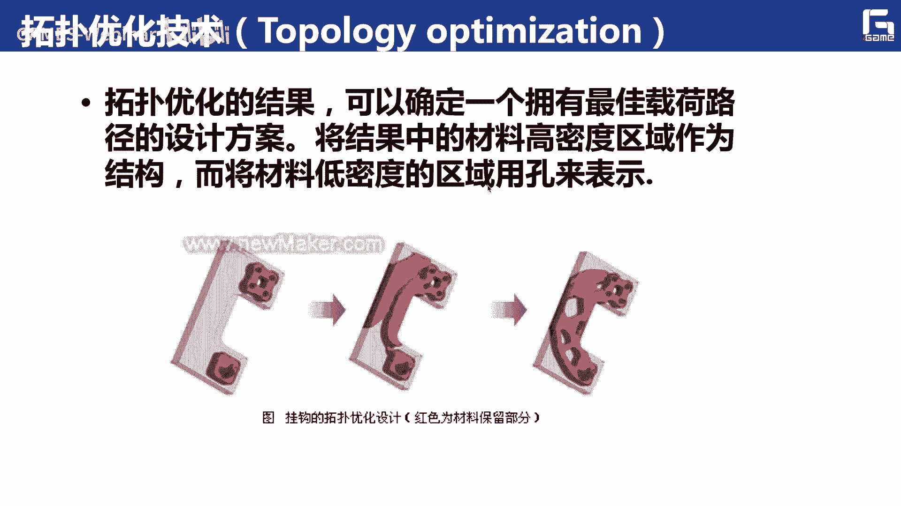

可以啊更广泛的应用我们的一些实际的生活，比如说这边呢就是呃，所以一个可以拎起来的一个摩托车，对吧啊，也就是说就是可以实现什么这种摩托车的一些，轻量化的设计啊，也就是说实际上这边的我挖的这些洞啊。

这些设计出来的这个金属部分的这些拓扑啊，比如说啊如果让我们凭空的去想象，你很难是想象它应该是这个样子的啊，但是呢我现在呢就可以通过拓扑优化的技术啊，通过这种创成式设计的手段啊，就可以啊。

就可以把我们这个摩托车，它最优的这种框架结构，把它给自动的算出来，把它给自动算出来，那么这样的话呢就可以实现这种轻量化啊，轻量化，实际上这种技术呢在其他的一些领域呢。

也是被很多的力采用了对吧，也就是说我们说的这种拓扑优化，基于这种拓扑优化的创造性设计呢，实际上就是我们通过一些我们的结构优化的，一些软件中的这种拓扑优化算法对吧，自动生成艺术品，建筑模型或者机械模型。

模具的这种一些最优的啊，一个外形的一个设计方法，我觉得他这边呢已经是一种概念化的一个设计。

那么这边呢是给出了一些更呃，其他的一些例子啊，比如说我们这个像穿的这个鞋子对吧啊，我我希望这个鞋底啊，它这个里面怎么样能够呃鞋子更轻对吧，当然我们这个鞋鞋垫呢，这边呢可以。

也是可以通过类似于这种多孔结构啊，多孔结构来进行设计，来实现这种呃鞋子的轻量化啊，包括自行车的轻量化啊，还有一些比如这种零件的气，这种轻量化是吧，也是我初始的设计域呢是这样的对吧对吧。

那我给它施加一些载荷，加一些约束啊，然后再满足一些他的这个呃体积，需要满足这些条件，然后呢，我就可以自动的把它整个相应的材料的分布啊，把它给算出来，那么这边呢也是一些例子啊。

特别是像啊这这边的这个模型对吧，实际上也就是说如果让我们用传统的呃方法啊，传统的这个经验去设计这么一把椅子啊，让我们去很难想象他最优的结果是这个样子，但是现在我们通过拓扑优化，通过创造式设计。

通过计算机啊，就可以自动的自动的帮我们，把这么一个最优的这个结构啊，把它给计算出来，特别是现在对吧，我们有了3d打印，然后对于这种呃，上次如果用传统的这种c a c，这种这种数控加工的手段呢来对他呃。

来做一个制造啊，是比较困难的啊，但现在我们有了这个3d打印嗯，实际上这方面呢也就迎刃而解，也就是说，实际上我们通过基于这种拓扑优化的创作设计，我们可以让设计师通过以传统的这种手动建模。

不获得一些思想的灵感呢，就可以创造出一些不同寻常的对吧，复杂的集合结构设计的一些作品，也是可以实现这种个性化的定制，而且我们可以发现，就是说呃这边是这边，应该是我们这个荷兰代尔夫特大学。

吴静老师团队做了一个工作，对他们实际上就是呃优化了这么一个东西啊，可以发现我最后拓扑优化出来的这个结构，但这边也算是打印出来的，主要是和我们传统的，后面真实的这个自然界中的这种骨头，纹理的这个分布啊。

还是也是非常非常接近的，对吧啊，这边就有电这个仿生学的这个味道，你说实际上我们的自然界是非常厉害的啊，就是说它实际上呃这个所构造出来的对吧，我天生所具有的这种结构形状啊之类的。

应该是在我们也可以用我们科学的手段去呃，原理啊，这些去解释都可以发现的，都是高度的这个吻合的，那此外呢比如在航空航天里面啊，像这个呃左上角这个图啊，就是发表在这个nural内存上面上面的一篇论文。

也是这个应该是丹麦，而做这个top优化，最最厉害的那个就那个那个做这个对吧，呃他们的所做的这么一个结果，实际上也是通过一些并行计算，高性能计算，我们可以实现这种机翼的这种最优结构的，这个设计啊。

实际上也是呃，可以是可以为我们这个呃可以发现啊，就是说这个拓扑优化对吧，不仅仅可以用在一些日常生活里，而且对这种航空航天的这种重大装备的，它的这个设计的话也是有着非常重要的，这个应用。

像这个右上角这个图呢，就是对我们这个输577这个战斗机的，它的材料的一个拓扑布局的一个优化是吧，下面这个图呢就是对于一个直升机啊，它的这个不，这个相应的一些拓扑优化的一些结果，包括在一些航空里对吧。

那么实际就像这个a380 飞机的这个。

隔板的优化啊，也是可以啊，用来做这个相当于面向这种，我们说a380 的这种结构的轻量化轻量化，那么这边是一个汽车的一个应用的一个例子，是因为我们一边搬到我们这个汽车的轮子。

这边实际上是他是这个这个轮圈啊，这边实际上就是一般都是实心的对吧，现在呢我通过这种拓扑优化的这个技术，拓扑优化的技术就可以实现啊，就可以实现这种呃，相应的这个轻量化的一个结果啊，就可以发现诶。

这个它相应的这个呃结构最优的结构啊，应该而是应该是这个样子的，这个上次也是和我们平常的这个想象对吧，嗯还是有着一些区别，但是啊这么一个名字，我们通过3d打印啊，啊金属的三打印可以把它打印出来。

然后叫起来啊，确实也是能够满足这个汽车在行进过程中，它的一个相应的一个性能方面的一个要求，此外在这个建筑设计里面啊，在建筑设计里面呃。

实际上这个也是有比较好的一些应用的啊，比较重要，像呃一些这种建筑建筑结构的设计对吧，我们通过头部的话，也是可以设计出非常漂亮的一些结构出来，这个像应该是呃澳大利亚还是拿那个团队啊，就是我们那个谢老师。

谢一鸣老师团队也是专门把这个top优化啊，把top优化运用到这个建筑结构设计上啊，并且开发了相应的一些软件，那么实际上后面的还是，我们还可以把这种拓扑优化对吧，呃进一步的进一步的加深做强对吧啊。

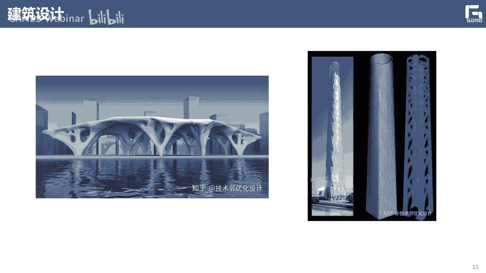

特别是在航天里面有呃，实际上比如像航天五院的一些公司比，就是说呃，如果我能够把我的这个呃，自身的这些运载火箭啊，或者其他的这个飞船啊，里面的这些结构能够做一些呃，比较可观的轻量化的这样的。

这也就意味着他们是可以多带一些东西啊，上天的对吧，实际上这个时候在我们的航天事业里面，是非常有用的啊，实际上目前很多前沿的技术啊，包括把这种点阵啊，还有这种多孔结构啊，啊应用到这种金属的3d打印啊。

这方面包括在航天里面，已经啊他们在开始在用起来了啊，那么实际上就是说呃这种多孔结构对吧，可能还不仅仅是宏观的这种拓扑优化，而它涉及到一些微观的拓扑优化，这样子也可以从进一步从这个材料的组成。

材料的结构方面的进一步的去进行，相应的这个这个优化，可以更好的呢去减轻这些结构的这个重，那么实际上我们前面给介绍了这个拓扑优化，特别好，以及相应的这个创成式设计的一些概念对吧。

就可以发现这些确实是拓扑优化啊，以及这个相应的创作设计，在我们很多的这个随着3d打印技术的发展，对吧，在我们很多的，无论是日常生活还是一些航空航天啊，这个机械方面的这个重大装备方面。

都有着非常好的这个应用的场景啊，非常好的这个应用的场景，那么现在就来看这个传统的这个拓扑优化问题，如果从数学上来讲，他应该是怎样来解释的啊，怎么样来解释的，这边的三维是呃，借鉴了这个和戴夫特大学。

这个吴健老师的一些ppt，我觉得他从他这个角度来看，给大家讲这个拓扑优化呢是啊，非常好的一个思路啊，非常好的一个思路上，我们就可以把它一个看到一个是toy problem，就是类似于玩具的一个问题啊。

大家很多都玩过这个乐高对吧啊，乐高那么长，这个乐高这个东西，这个拓扑优化这个问题我们先去这样解释啊，这最简单的一个悬臂梁的一个问题对吧，那么所以说悬臂梁呢就是左这个左边呢，这边挂在墙上，我是固定的啊。

然后右边呢我我我施加一个往下的力，施加一个往下力，所以现在拓扑优化的问题是来解决什么的啊，他就是解决就说我这个内部啊，这个物这个计算域这个矩形对吧，这个10x20的这个呃矩形啊。

这个有200个格子组成的对吧，那么这200个格子这个矩形呢，就是我的这个设计对吧，我的设计，那么有了这么一个设计，与我们现在要解决问题是什么啊，也就相当于我这些呃乐高啊。

这些blocks我走放在哪些地方啊，能够让我所形成的呃，就是我这些乐高的这些block所形成的这些呃，这个形状这个shape它具有最强的刚度对吧，最强的刚度啊，那么商就是就是通俗来讲。

就是这么一个问题对吧，那么也就是说现在我有100 10x20，有200个格子对吧，然后我要把它要放60个blog，60个vlog，那么也就是说我这60个blog应该怎么放，应该怎么放，对不对啊。

那么这60个blog怎么放，如果啊有同学很明显，就是我们可以直接都可以想到这段，大家可以想一想这个怎么来做对吧，它是一个什么问题啊，不就是一个排列组合的一个问题嘛，对吧啊。

也说我把这60个vlog放到这200个格子里面，我有多少种选择，但我要找到其中一种最好的一种选择对吧，最好的一种选择，那么就是来求我top优化问题，实际上准确的来讲就是这样来做对吧。

也就是实际他是一个就是在我们这个问题呢，它应该属于一个什么啊，就是一个离散优化的一个问题，是离散优化的问题，也就是说我们可能可能的这个解有多少个啊，可能的这个解有多少个，那想想爷爷说。

我们刚才说的就是一个排列组合问题啊，排列组合问题啊，就是我从200个里面选60个对吧，那我们可以算一算，我这个所有的这个design总共有多少个啊，所以我算出来应该是呃，7x10的51次方种选择。

也说实际上就是说我呃如果啊严格来讲，就是说我是，实际上也就要从这7x10的51次方个，这个选择里面，我选到一个这个最好的一种设计对吧，最好的一种材质的分布啊，那么这是我们的呃。

针对我们这么一个问题来讲对吧，因为它是呃作为一个二维的像素化的一种拓扑，优化的一个问题对吧，离三化的一个特别的问题啊，所以它就是一个离散优化的一个问题，那么对于这么一个离散优化的这么一个问题啊。

那么我如果这边给你这么一个a b c啊，总共有三种选择对吧，三种选择，那么这边怎么选呢啊我问你下面的这个，abc对吧，abc他等相应的这个选择哪一个是最好的呢，那么a这边我是选的60，从20个里面。

你看这个是三行吗，就是就是60对吧，就是60个格子啊，那么b呢也是是一种选择是吧啊，c呢也是一种填法啊，c呢也是一种填法，那么我问大家，就说这三个选三个填法里面，哪一个是我们想要的啊。

是想要的可以满足这个干度这种，那么其实如果有同学啊，研究过或者接触过一些，拓扑优化的一些知识的话，就可以知道应该选哪一个啊，那是选c对吧，那是选c，那么为为为什么选c呢啊为什么选c呢。

实际上我们可以来来做一些验证啊，开来做一些验证啊，就是说我可以对吧，如果按照刚才的做法，我可以让这个格子更密一点对吧，原来你是10x20，我如果现在变成，比如说是30乘以乘以乘以40啊。

或者或者更多的更密一点对吧，那我相应的这个格子的弦对吧，我最后形成的就是这个样子对吧，我有三种选择三种啊，当然我是可以做一些验证啊，做一些验证，就是说我可以通过呃，你说我优化后的结果对吧。

我可以同样的通过用这个有限元分析，或者等几个分析再来算一遍啊，我在这种结构下啊，如果我最后保留了部分啊，最后保留的部分就是我的黑色的这个黑格子，这一部分对吧啊，那么如果这样的话。

我最佳的选择选择是什么啊，最佳的这个选择是什么啊，他们他现在这个性能怎么样对吧，我是上，是可以通过有限元或者等几何来进行验证一下，是吧，来进行验证一下，那么我们可以看一下这个验证的结果对吧。

可以可以发现诶我c的这种设计啊，c的这种设计啊，确实可以，它相应的发行这个呃高度是最最最大的，对不对啊，因为我的这个它的发生了位移，就几乎没有发生位移，就几乎没有发生位移对吧，就是比较稳定的啊。

但是像这个a和b啊，如果我占用这个有限元再重新来算一下的话啊，那么它这个相应的这个位移，还是会会会发生的变形对吧，会发生的变形，发生了位移，这三就说明就是说诶就是说可以发现啊，c这种设计是最好的啊。

是最好的盐酸，实际上啊实际上就刚才我们说，这么一个拓扑优化的一个设计啊，实际上就是它是在我们这种基于像素的，或者基于提出的这种方法里面，他就是一个什么啊，离散优化的一个问题对吧，离散优化的问题。

但是对于这种离散优化问题来讲，我们是很难去进行求解啊，很难进行求解的去求解这么一个优化问题，因为它这个可能性太多了，就像有7x10的51次方啊，这是一个非常偏文的一个数字对吧。

那么也就是说我怎么样去求解，相应的一个这么一个离散优化的有问题的啊，那可以建造一个思路对吧，嗯就像我们三前面前面有次我给大家讲，我怎么样把这种哎这个最大值函数对吧，然后呢变得可微啊。

商也就说我在数学上呃，在这个数学上有很多的这个套路，很多的这个方法呢可以去做一些放松啊，或者做一些改造啊，然后呢，哎我基本的目标，还是朝着这个目标去努力了是吧，但是我在这个过程中。

就可以把相应的这个问题的难度呢，把它大大降低了啊，这实际上是在我们很多的这个实际的科研问题，里面经常会碰到的对吧，我怎么样把一个呃非常难以求解的一个呃，无论是优化问题还是其他问题就好还好对吧。

然后我把它放松啊，然后把它呢能够变成一个比较更容易解的，这么一个问题，那么商业说一个非常直接的思路啊，就是说啊我们可以把离散优化问题啊，top优化的这么一个离散优化问题，把它简化成呃。

放松成一个连续优化的一个问题啊，也就是说实际上就是说呃我希望啊，比如原来目标，我希望他的这个呃柔度最小对吧啊，在满足我的物理性能下，这个柔度最小，然后呢满足一定的呃体积的一些约束对吧。

然后这个roi呢对吧，我原来只是有有有一种选择对吧，要么是零，要么是一啊对吧，就是零一优化的问题啊，就是我要么是这么一个离散优化的问题对吧啊，要么是零，要么是一，然后呢我把它现在放松呢。

我可以让我的这个呃这格子的密度啊，格子的密度啊，变成一个连续的啊，连续的一个表达可能有表达啊，我要我这个roi呢，它可以是从零在0~1之间的啊，在0~1之间的，然后这个里面呢你们就可以把一个比较难的啊。

一个啊二级问题啊，二值优化的一个问题，把它转换成一个啊相对更容易的一个呃，连续优化的一个问题啊，那么实际上这也是我们后面要给大家介绍了，这个simple啊，这个方法它的一个基本的一个思路啊。

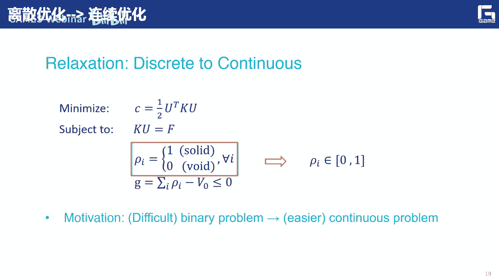

就那个思路啊，他的思想呢就是我爸啊连续优化问题啊，离散优化问题把它转换成什么啊，连续优化问题，那么sa simple呢它就是我们这些sodic是topic。

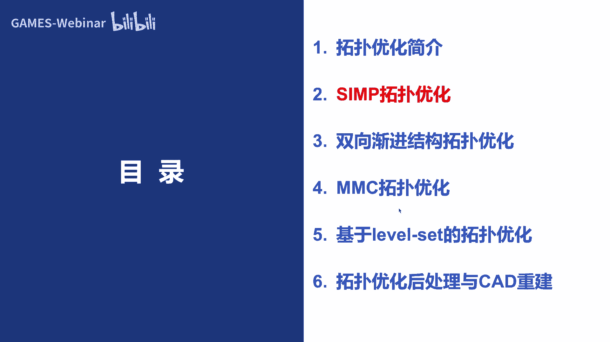

make rostructure，vi ponalization，作为作为惩罚的这么一个方法啊，比如说他是这种带冲拉系数的啊，各项同性的啊这么一个呃结构的方法啊，有时候上它是假设我这个材料的物理属性。

和我的这些呃单元密度之间，它存在着某种对应关系，然后通过引入一些惩罚因子呢，对这个中间密度质量来进行惩罚，然后说比如说呃，尽量的避免产生这个在0~1之间的，这个灰度单元啊，也就是说我们从呃。

以这个0~1这个区间系列的连续变化的，这个呃密度单元来表示这个结结构，它是存在的对吧，如果是密度单元是零，就这边是空洞啊，密单元是一呢，就代表是实体啊，实体实体，那么实际上是在simple啊。

simple是我们啊目前应该是结构优化里面呃，用的最多的一种方法啊，用的最多的一种方法啊，因为它迭代起来呢呃比较稳定，比较稳定，而且呢呃比较高效啊，而且比较容易理解啊，上市目前在呃top优化方面的。

应该是非常主流的一种方法啊，应该说每每一位呃开始学拓扑优化的同学啊，都会先学simple是吧，那simple那么实际上就是说它的缺点呢，就会就是呢会产生一些数值问题，就是比如像棋盘格对吧。

还有一些比较依赖于你的这个初始的这个，背景的网格啊，然后会产生比较多的灰度的单元啊，因为我们是希望能够尽量平面产生这个，0~1的混沌，因为你有了灰度单元，就实际上也就说明你我这个呃。

最后优化出来这个结构，它的边界在哪啊，这个就是比较难去确定啊，所以呢我们呃通常需要引入一些比如灵敏度啊，还有他的一些呃呃过滤的一些算子啊，这些东西啊，包括一些这些方法来进行解决，啊这边就是下面的颜色。

比如说像这种棋盘格的现象啊，棋盘格的现象呢实际上就是说，就就显得这种锯齿状非常明显对吧，而这些特别是一些孤立的一些锯齿状，而且它就可以会产生一些，非常脆弱的一些结构啊，非常脆弱的一些结构。

这个当然不是我们想看到啊，想看的啊，另外一个就是灰度单元比较多啊，就是它边缘不清晰啊，边缘不清晰，我们很难确定哪些是它的这个边缘啊，满清时代的边缘，那么实际上就是说啊等几何啊。

也就是说如果我们把基于样条的这种仿真啊，包括他的一些表示啊，引入到这个simple的框架里面的啊，主要就是说还是会带来一些好处啊，第一个就是说呃因为我们基于这种拟合呢，它这个它本来就是一个连续的一个。

向量函数对吧，而且呢呃它每个奇函数，它实际上是有一个局部的支撑空间的，那么在这个局部支撑空间内，它实际上就是自动的，就会有一些比较好的啊这种呃过滤的啊，这种情线还可以避免啊，这种棋盘格的这种现象啊。

棋盘格的这种现象啊，而且另外一个呢就是说呃，和我们前面介绍的一样对吧，等你和上他这个计算所需要的这个自由度，比有些人来讲应该是少了很多了啊，应该说在呃一些大规模的这种呃优化问题上啊。

特别优化问题上它的这个效率会比较高啊，这等你的一种方法啊，当然了，就说因为它本市场还是基于simple的方法来做的啊，所以说他在呃最终的优化中呢，可是可以可能出现这种边界不光滑的。

这种网格依赖的这种现象啊，那么他的这个基本思想啊，如果在我们登记和的特别化里面，它实际上就是说我开通这个控制点，这些密度来呃来计算啊，通过相当于我在这个控制点数，给他放一些密度值对吧，然后呢。

来计算这个结构中任何位置的这个密度值对吧，这个上次和我们啊，这就是相当于把我们这个dk对吧，放到这个和这个g函数做个加权啊，也就是说这样我以等级和单元中的中点，位置的密度。

来表示这个单元的这个密度就可以了，也就是说我这个得控制点的密度和，等级和单元密度之间的这个关系啊，我们可以通过一个呃，和我们这个样条这个表示一样的，通过一个奇函数加权的形式来进行实现啊。

那么说simple呢，它基本上最后的实际上就是一个最后一个字，这个p这个就是乘法对吧，也就是说他对这种中间的这个密度呃，单元呢来施加这个乘法，让它的单元的材料的模量啊降低啊。

那么这样呢在这个优化过程中啊，逐渐的被被移除掉啊，那我们可以定义相应的一个铲子，一个模型啊，通过这个铲子模型，实际上就是我可以哎，把这种连续离散优化的问题，把它连续化对吧，因为肉呢是在零一之间的对吧。

那么一般呢这个p呢，我们也是一般是乘以4÷3的啊，也就是说这样的话，我们就可以把这种单元的刚度，矩阵和我的这个它的材料属性直接放在一起啊，也就是说如果一个它是实体单元的呃，磁体材料的话啊。

这个就是我们知道的快点对啊，因为我们这边不可能是纯实体单元了，那么因为他有个密度值，所以说我可以这样来，这样就可以得到这个呃，在这个材料模型下，他现在的这个单元刚度啊，矩阵，那么商业言说。

如果我们以结构柔度的最小化为目标，对吧啊就可以写成这样子啊，那么呃a呢，就是我的这个等级和里面的这个，单元的数目对吧，然后相应的这个材料属性啊，啊这个诱饵就是你得的那个布片或位移嘛。

啊开点就是刚度矩阵是吧，让他这么多满足一定的体积的约束对吧，比如说我最后保留的体积大概是多少比例，什么之类的都可以放到这，然后满足我的一些力学性能，可以有等于f啊，那我这个肉呢当然是要满足这个东西。

也是这就是我们在等你和的，就等你们分析的这么一个simple的，这个拓扑优化的一个框架的，就是这样子，那么当然我们也是同样的啊，我们需要呃做这个灵敏度分析啊，因为它本质上还是一个基于梯度的优化问题啊。

梯度的一个优化问题，也就是说我相应的这个目标函数c啊，他对这个d开口设计变量的灵敏度啊，我们可以去去去算一下啊，当然在我们整个的这个计算过程中啊，因为我们这个那不是啊，或者样条这个基函数。

还是具有这个局部支撑性的对吧，比如说它这个定义域范围是有限的对吧，是有限的啊，那么还是相对比较独立的对吧，所以说呃我的d开头控制节点，它所影响的这个等级和单元的数量还是有限的，是一个np是吧。

是一个np啊，那么实实在这个里面呢，我们刚才也讲过，然后在基于等几何的这个框架下，它的这个sim的这个灵敏度过滤，是一个有着非常好的呃一个一个性质啊，就是说也就是我这个单元灵敏度。

可以由单元对应的嗯这么一个控制，顶点密度通过ng函数组合得到啊，并且一个控制点呢会影响多个单元对吧啊，也说实际是对我们这个，避免这种吸盘格的现象呢起到了一定作用啊，今天的作用。

也就是说我们实际上就是可以直接，可以通过样条啊的定义啊，来进行这种呃，即单元的这种啊灵敏度的这个过滤，那么啥也说，如果那不是这个基函数次数越高对吧啊，那么这个单个控制点它影响了单元数据越高。

相应的这个过滤性啊就越好啊，另外一个就是我怎么样去求解相应的这个，结构优化设计的问题啊，也就是说这个实际上就是说这个simple方法啊，那么我们一般呢就在用这个，oc的方法来进行求解啊。

那么它主要是比较适用于这种求解，设计变量比较多，优势条件比较少的优化问题啊，那么这边呢我们也是可以更新啊，他的呃去定义它的一些更新的一些规则啊，也就是说我做一个呃，我就是我在每一次每一步迭代里面。

我相信了每个单元的这个密度是肉，它是怎么来更新的啊，那么这边是基本上就是一个分情况的来考虑啊，分情况来考虑，那么这边呢就是呃给出了一些这个simple啊，优化的。

这边就是一个m b b量优化的一个问题啊，那么他这边这个载荷不是放在中间，而是放在我这个右下角，这边是固定的啊，这边也是100x200的啊，毫米的这么一个设计域啊，那么如果初始的拓扑是这个样子啊。

那慢慢的我通过多少次的迭代，大家可以看到这个类似于就慢慢生长是吧啊，然后慢慢的怎么找对吧，现在这个柔度大家可以也从原来的122，一直降到79。26，79。26，然后自家的这个科普的这个材料的分布呢。

也是进行了一些变化，那么当然我们也是可以啊，可以和这个把这个啊基于等你合的拓扑优化啊，基等你合的拓扑优化和，基于这个有些人的拓扑优化呢来做一下对比啊，来做一下对比啊，就可以发现什么呢。

啊这个虽然从结果上来看好像差别不大啊，但是确实这个等你和他在一些灰度单元上，可能还是呃有所小小的改进啊，啊但是在效率上确实还是提升了啊，还是提升了啊，那比如说对于这么一个80x40。

这个它的自由度这边是啊将近2万个自由度啊，那么在这个基等几何的这个图标化里面啊，这个是7000个自由度啊，那么现在呢这个优化所需的时间有限元，是十秒啊，那么这边呢是大概呃一半啊，减少一半就4。73秒啊。

那么基本上都是这个水平嘛，啊大概就降降低一半多的样子啊，也就说这样的话虽然就是说可以发现啊，我们继续在这个等式几何的这个框架下啊，确实我基于这个呃嗯等几个分析的这个突破。

优化呢要比有些人分析的话来来的的更更好啊，可以得到基本可以得到一致的，这个优化的结果啊，也说它的构型啊，还有它的柔度啊，最后的基本上可以收敛的，还是非常接近的，但是确实在效率上啊得到了提升啊。

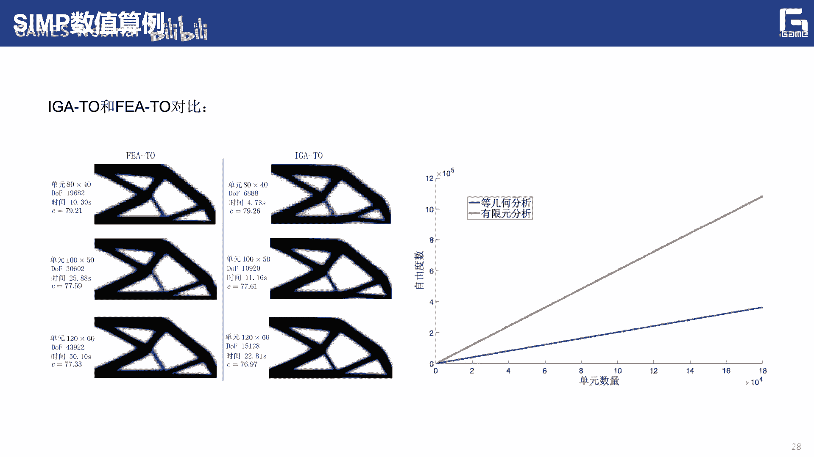

得到了提升，你说这些这前面的这一个呢，我们是首先的给大家介绍了，基于这个simple的这个拓扑优化啊，simple的这个方法的拓扑优化啊，也说就是我们这个变密度法对吧，便秘的发啊。

那么实际是对于这个边牧的方法，它实际上也是一还是一种军医化的一种方法啊，那么实际上便秘度法呢所需要的这么一个呃，设计变量的数目相当于金融化的，一般的均化方法呢，它的数目是大大减少的啊。

因为我们这边所说的这个变密度呢，一般是指基于这种单元或者节点的这种伪密度，方法的这种拖布就换啊，那么这种方法的商是从他的这个思想上啊，还是比较简单的啊，思路比较清洗对吧，然后你包括整个编程啊。

设计啊都是相对还是比较集成的啊，比较容易的，应该说目前很多的这个呃商业的一些结构，优化的一些商业软件里面所经营基层的，最最多的就是这个呃simple的这种便秘的方法啊，还有一个呢就是说呃。

这个变密度法相对于这个呃其他的方法的，最大的优势，就是说他对于这种任意行动的设计，也都是比较合适啊，那么它上也是具有一些天然的普适性啊，这种天然普性实际上是对于比如后面讲的这个。

无论是呃leveset还是其他的商，就是就是商是不可比的，那么这是首先给大家介绍这个simple的，基于simple的这种呃特别玩方法，下面给大家介绍一下啊，这个。

给双性渐进结构演化的这种top优化思路啊，那么实际上呃我们说simple，它基本上是类似于增长的这种这种原理对吧，那实际上是呃这个呃渐进的这种思想呢，基本上就是说我是从呃去移除的这种思路啊。

也就是说实际上我怎么样从你的这个格子里面，我怎么样去把这些啊没用的格子，先把它给把它给删掉啊，把它给删掉啊，然后爷爷说呢，这个呢就是说啊，我怎么样移除这些低效的这些单元啊，反正我保证了我这个结构。

不断朝着最优的结构进行演化啊，也是所以说你在删我呃，我先删哪些单元对吧啊，然后我我怎么删啊，这个三就是一个比较重要的一个问题啊，比较重要的一个问题啊，那么商一开始出现的就是这种单向的，这个eso啊。

这种演化的方法，后来呢就出现了这个bl的方法上，就是基于这种双向的啊，双向的话也就是说当他在每一次的迭代更新中，我能够先把这个低效能的变成呃这种空单元啊，但是我在每次迭代的话。

我可以把这种高性能的空单元变成十单元，也是能够进行一个呃，如果你这个删的太厉害了，我可以进行恢复啊，那么上这次也是一个非常好的一种思路，就是可以避免误删嘛啊不免误删的啊。

也就是说所以说呢就是说呃还是存在的，就是吧我又怎么删掉和添加嘛对吧，恢复嘛啊，所以说我怎么样能够保证得到最优的，也是比较重要的啊，也就是说实际上我们也是可以，在这个白色的方法里面啊，受这个呃。

根据像这个simple一样来引入一些乘法因子啊，那么然后实际上就说我我希望能够呃，再加上一些过滤的一些手段的话，我可以实现这种非常接近，我这个通过零一优化所得到的这种这种结果好。

那么这就是我们这个双向间隙结构，它的拓扑优化的一个模型，也就是说我希望也是有这个优化最最小柔度啊，那么外乎就是说我这边呢呃c就是融入函数吗，那么这个k和u呢，就是它的呃这个全局的高度矩阵。

还有全局的位移向量啊，然后呢，我最后卫星呢，就是我希望达到了目标的这个体积的分数，我的体积的比例对吧啊，然后这个单元密度是呃x最小或者一啊，也就是说实际上就是说这个x me。

实际上就是来表示我这个空单元的这个密度，也就是实际上这个里面非常重要的，就是说呃我要确定哪些单元是要被删的是吧啊，所以说这个时候呢就要通过来算一下，也是需要算一下的这个灵敏度对吧，做一下灵敏度分析。

商业的需要算一下，我这个相应的，比如这个额额度最小的这个目标函数，对每个设计变量，它这个导数要求一下偏导是吧啊，那实际上在等你和里面，这个上也是有着天然的优势的对吧，它因为是一个连续的一个表达。

所以呢我是可以通过在求导方面呢，也是比较嗯直接的啊，也就是说像我这个单元的密度上，是也是通过控制点的这个密度，通过那不是g函数的一个组合来得到，那么当我们就可以得到一个单元，灵敏度的一个表达式。

是简短灵敏度的一个表达式，通过这个单元灵敏度的表达式，我就可以知道哪些单元灵敏度啊比较小，拿的哪些单元灵敏度比较大对吧，我上去可以做一个排序算法，做一个排序是吧，然后再让我通过排序之后。

我希望删掉的是什么啊，肯定是那些啊，先删这些难灵敏度比较小对吧，因为三角人民度比较小的话，上次也就是说，现在对我整个结构的性能影响比较少啊，这样的话实际上就是说哎，比如你要保留这个70%啊。

到商品就可以慢慢删，我每一次比如2/300啊，然后我大概三个，比如迭代个呃呃十几次，20次，然后就可以达到最后的这个保留体系，这个目标的对吧，但是就是说你比如我删到这个2%之后。

我要重新再算一下这种等几个分析再算一下，我相信的这个呃，这个结构的性能变成什么样子的对吧，然后呢我再对剩下的这些单元，然后再做一个呃求灵敏度，然后再算上，然后这样的话就是我再，然后我再重新做个排序是吧。

我再删掉里面的2%啊，然后这样就一直让一直迭代下去嘛，迭代下去之后，实际上就是我就可以得到，那经过比如说啊20来次迭代，我就可以剩下，最后剩下百分之六七十的这个体积，我就剩下了，那么我继续。

所以里面的这个观念是什么，就说我怎么样呃，计算这个单元的灵敏度对吧，那么我们这边也是可以在等你和框架里面，我们可以把它给推导出来啊，把它给推导出来，而且是一个解析的一个表达。

也就是说这边呢我们实际上是呃，有些进化的一些策略啊，对吧啊，就是说比如说卫星是你最终要保留的，这个目标的体积，那么那么未开呢就是我地空地开次啊，迭代所得到的对吧，然后这个e2 就是我前面说的。

就是你希望在每一次这时候你是三多，百分之多少啊，就是这个每次迭代最大的体积变化对吧，比如说你这样是可以2%，也可以是5% 3%对吧，就是实际上也就代表了你这个进化比啊，你这个进化比。

那么实际上也就是说我决定了每次迭代里面，他这个最大的这个体积的变化啊，当然我这边要定义一个收敛准则对吧啊，也就是说嗯如果我经过多少次迭代之后啊，迭代之后我上一次的柔度和下一次柔度。

他们之间的这个呃目标函数，它们之间的这个值相差非常小啊，那么就实验就说，我可以意味着我已经达到收敛了啊，一般这个excel我们是取的是0。001，也是这样的话，就意味着最近十次迭代呃。

这个目标函数的值啊，相差都非常小了啊，那说明我这个算法基本上已经已经收敛了啊，那么就可以不需要再进行这个继续往下优化，就是它的一些更新的一些策略对吧，那么这边呢就是一个就在等你的分析框架下。

这个bl的拓扑优化的这么一个，算法的一个流程的一个示意图啊，那么你就说你首先基于这个nb啊，这个建模对吧，可以来创建一个设计域啊，然后你定义优化及所需的这个呃参数啊，像那目标体积啊，要进化比啊。

就是百分之多少啊，还有这个相应的乘法因子啊，然后你可以对这些单元设计，它的一些单元的材料属性啊，打印模量啊，保证比啊，还有载荷啊，以及支持约束的一些条件啊，然后针对这个整个结构进行，等你和仿真分析对吧。

然后计算啊我这个每个单元的灵敏度，然后进行这个灵敏度的过滤啊，比如说我要删哪些单元，是也就说三句，说这边呢就是说根据这个目标函数，还有单元灵敏度来，根据这个进化比来决定下次呃迭代目标的体积。

然后你更新这个设计变量对吧，比如说确定我删掉了，让你整个结构都发生变化了嘛，然后你可以更新设计变量啊，然后看一下是不是满足底角色啊，啊还没有满足对吧，呃就说明还还可以删对吧，还可以删。

那么继续对你更新后的这个结构啊，进行这个等级和分析对吧，因为你现在这个密度，每个单元的密度啊，什么这些都不一样了嘛，啊那么三爷说你进行一个等几个分析对吧，包括删掉了你整个单元的这个，整个结构的形状啊。

什么都发生了变化，然后你可以进行一个等你分析，然后再去呃计计算这个新的这个目标函数的值，还有这个单元灵敏度的那个单元的明度对吧，然后下面呢再我再给你精华笔再删掉啊，宝剩下的这个呃5%是吧。

然后呢进行迭代一次，咱们中心下去，直到满足我这个体积约束啊，然满足这个体验是不是满足，这个是不进行收敛了啊，如果是的话，那么那么我就结束了啊，如果还没有收敛啊，那么还可以，就是如果没有。

还没有达到我这个最终的这个目标函数的什么，还可以继续的来进行迭代，继续的进行这个优化，那么这下面的就是一些算力啊，就是这边呢就是给出了呃，像这种双线建立结构特别化算力，就是这边呢呃。

是一个也是一个悬臂梁的优化对吧，刚才看到相机我们一开始就会发现诶，它最优的形状是不是应该是这个样子了对吧，a b c里面我确实应该选c对吧，那么三也是我们这边和把这个ig啊。

ig a b a c e这都是i g的结果对吧，那么b d f就是这个这个呃，嗯就是这个等那个有限元的啊，特别优化的结果，就可以发现主内从这个棋盘格啊，这种现象方面啊，确实这个锯齿状的方面。

这个等级和要好很多，对不对啊，而且相应的整个结构呃，也要比这个这个有限元方面要来的要好，也就是说等你和方向盘它更为稳定一些，那么实际上也有时候我们可以看出啊，呃这是另外一个例子啊，就是说我我这边固定。

然后这边是加一个往下的力对吧啊，然后这边是最终的这个特别优化的结果啊，也是在不同单元格式的优化结果，还有目标还是体积比例的变化，随着这个迭代次数还怎么变化的啊，也就可以看到不同单元个数的最终的构型啊。

基本上还是非常一致的啊，并没有出现，我说我这个背景网格依赖的这个情况，就是验证了我们这个等级和拓扑优化的。

它的一个稳定性，那么这是双向间距结构拓扑优化，下面再介绍一下这个呃。

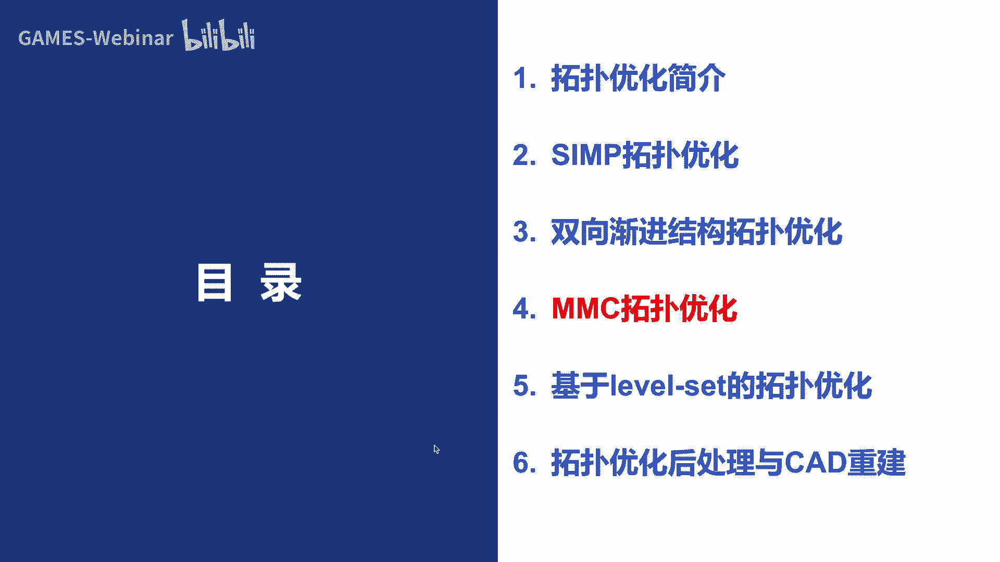

就是我们国学老师提出了，这个m m c的top优化的这个思路啊，也就是说实际上前面的几种啊，无论是，无论是这个simple的方法还是这个bl的方法，包括后面讲的这个levesa的方法。

因为它基本上都是还是一种呃，基于演示即可描述的啊，一些也是有描述的，也就是说19说像这个为什么隐私了呢，像呃后面我们讲这个leveset啊，我们应该先讲这个level set的。

那么那我们先讲live set吧，后面我们再讲这个这个移动可变性组件好吧，后面我这个b b d会相应进行确定，要说这个live set是什么方法呢，实际上就是水平级的这个方法啊，水平级的这个方法。

那么实际上就是说这个水平级的方法呢，呃随便集在很多的地方都用到了，特别像我们这个图形图像的这个处理里面啊，也是用的非常多的啊，当然就是一个，这个演示的画的一个方法啊。

就像我们的一些呃这个leveset对吧，它实际上就是一个呃零等值面对吧，那等值面或者等值线啊，等值线啊，所以它本质上就是一个影视的曲线，曲面的表达啊，全明表达所在很多的这个呃图医学图像的分割，对吧啊。

还有一些三维形状的重建啊，里面呢会呃都会用到这个level set的方法啊，也就是说他常是呃也是非常广泛的啊，它的核心思想呢就是相当，就是我可以把这个边界对吧，这个结构的形状的形状呢可以看到是呃。

这个高一维空间中某一个函数的零的水平级啊，然后就是影视曲线曲面，我们前面也给大家介绍过的对吧啊，就像一个圆，这两个圆对吧啊，这两个圆我可以呃说明在这个呃c4 的部分，它就是满足f大于零对吧。

然后在这个与两个孔的边界上啊，它会获得这个外面这个边界，它就满足这个f等于零对吧，然后在这个浅色的部分啊，他就满足f小于零啊，那么商业就说，我随着这个f这个函数的这个变化，这个像这个孔洞的树木啊。

孔洞的形状啊都是会发生变化的对吧，也就是说你看这个这个平面，这个地上就可以看出是我高维的话啊，高维的话是就是这个曲面三维曲面，三维曲面和我这个呃z等于零相交啊，z等于零，这个d平面相交对吧。

这样就可以得到一个零水平集，零水平集，那么香蕉我所得到的这两个曲线对吧，这两个曲线是不是就是我这边的啊，两个拓扑结构啊，两个孔是吧，那么这两个孔它的边界就是影视曲线对，就是影视曲线啊。

也就是12 十这个里面的话呃，呃我这个变化当然是一个随着时间的变化的，对吧啊，也那么随着这个时间变量的变化，它这个结构的这个几何呢实际上是可以呃，随着水平集函数的这个变化而进行变化啊。

那么商业说这边就会涉及到一个设计与表达的，一个问题啊，第一个表达的问题啊，也就是说我这边这个fire我怎么去表达对吧，那么上我最后得到的一个水平集函数，对这个所有的这个时间演化的这么一个呃，一个方程。

然后就得到相当于hd方程啊，以解方程，那么这边的这个方案呢，就是我这个设计表达的一个对吧，然后现在你这个是什么量是吧啊，然后对时间的导数啊，应该等于啊，他这个法向的速度乘以这个这个f i s t。

对这个德尔塔这个等等于零啊，然后呢，呃我大概有一个初始的一个水平的函数啊，但对于这么一个方程，我们一般都是采用这个优先差分法，来进行求解啊，但是因为我们很多时候这个它是一个什么啊，是一个符号距离函数啊。

因为我们所以还是具有很多时候需要进行这个，重新的一个初始化啊，而且这个演化过程中呢，对这种差分格式这个稳定性还是比较大的要求，对于他的这个传统的水平级啊，他这个计算方法的计算量还是比较大啊，比如说，啊。

我们上次也有一些作者有引入了这种，参数化水面积的方法啊，参数化水面积的方法，传统化水平的方法呢，实际上就是说我们可以把原来的这种方程找，更用于求解的一些常用方程啊，也就是说我我可以把这种水平集函数。

就是fx t啊，用这种哎ng函数的组合对吧，这就和我们等你和结合起来了，对不对啊，来表示啊，来表示啊，那么也就是说我定义一些在每个时刻对吧，我就定义一个相应的一个控制变量方案。

然后呢和我这个那不是解函数组合，就会得到这个东西对吧，我们把这个东西就当做我的水平集函数了啊，水平集函数了啊，也就是说这个3t呢，就是在第二个网格点所对应的扩展的系数。

那个ax就是对应的那不是电函数对吧，那相应的我是不是呃这个h键偏移方程啊，还有相同的反应速度，表示我就可以这样写出来是吧，那么商这样写出来，一写出来的话，我这个相应的这个求这些vn的求解啊，这表达式啊。

反正都是变成碱性的啊，所以说就比较容易求解，那么实际上我们最后要要求的是什么，就是那些扩展的扩展系数就发了，这就就这个东西就是这个东西对吧，他这个求出来之后，我相应的那个呃整个的这个拓扑的表达。

也就也就求出来了对吧，然后像我这个发啊，我得到这个发t之后对吧，我每一个时刻啊，他这个拓扑是怎么变化的，我就你知道的对吧，我最后呃对我们这个三维曲面，我就得到的是一个演示的一个曲曲线嘛。

那么这个演示的曲线，相对是表达了我最后的这个拓扑结构的，也就是说当然我们也是可以把这么相应的一个，最小化柔弱的这个优化模型把它给写出来，是吧啊，也是我要满足一定的这个这个呃体积的约束啊。

然后最小化我的柔度，也是我这个相应的这个目标函数啊，我上次可以把这么一个约束优化问题，通过拉格朗日乘数法，从正法把它转换成一个为5月数的一个问题啊，5月数问题，然后呢来求相应的这个呃这个目标函数啊。

对这个它的形状导数把它给抽出来啊，包括对于这个设计变量，那会说fiat就是我的设计变量，对不对啊，对于这个设计变量这个灵敏度可以把它提出来，然后呢通过这种oc方法啊，来去更新这个fia对吧，更新和发。

那么啥就说我最后呃什么样的伪定呢，就是我这个目标函数l，对我的这个设计变量的方案，它的偏导等于零对吧，然后我采取后c法来更新这个设计变量啊，那是通过这种迭代呢，来逐步的更新我的这个发i t f i t。

然后重新，从而实现我这个最拓扑构型的这个优化啊，也是我最后的得到的拓扑构型，实际上是一个隐私的一个表达是吧，然后根据这个数量条件呢，也是同样的来进行判断，我有没有收敛，那么这边呢就是一个。

比如说一个桥结构的一个优化的问题啊，这边固定，然后往下对吧，然后这个优化方法和我们用simple方法优化出来，也是非常接近的啊，当然这边呢就是a呢就是我初始的这个孔洞啊，初始的那个fiat。

他的这个拓扑结构是这个样子的啊，也是我们在每一步的时候，我都是来更新什么，来优化那个呃发t啊，就是我的这个呃扩展系数啊，就这个发t是我的优化设计的变量啊，然后这样的话，所以大家可以看一下。

我通过这个8t的控制啊，我可以可以实现啊，这种拓扑结构的演化这种变化啊，然后我再最后呢在呃把这个相应的这个边界，因为它就是二维问题嘛，啊也是说它本质上这些边界都是影视曲线。

我就可以把这些演示曲线把它给提取出来啊，通过吧，请martin square对吧，二维的butsquare，那三维的如果影视曲面就把tin cube，大家都可以把它给抽取出来。

那么这边呢是更多的一些例子，这个曲边的一些悬梁臂，它的这个呃优化的一些结果，商业说我初始的这个孔洞呢是这样分布的啊，然后我最后慢慢的演化，演化，演化就会得到我想要的这个头部优化的结果啊。

那么商业元素我们可以和这种有限元，基于有限元，也就是说的方法和因为基于有限元，我们也可以转向用的live set top换，和基于等几何的这种live set top换呢来做一下对比。

就可以发现这个等你盒用的时间啊，基本上都是是在这个有限元这个框架下的，1/3左右啊，1/3左右啊，也就是说可以实现3~4倍的这个加速啊，当然这个也是比较容易理解的啊，就是因为我相应的这个自由度啊。

相应的自由度啊，在登顶盒的这个框架确实比较比较少，就是我这个fiat，这个是我的这个设计变量或者自由度吧，所以说你相应的这个也是会得到比较，在速度上得到比较大的这个提升，啊这边也是我们总结一下了。

整个基于水平集的这种拓扑优化的流程对吧，也就是说你可以定义初始的设计参数啊，就是书写的是一个设计参数啊，就我对我得到拓扑是这样的对吧啊，原来呃你输入，然后在上面对一些呃fi t嘛，然后数字可能这样子啊。

然后呢，做这种初参数化水平级的初始化啊，这个求解初始的扩展扩散系数啊，就那个fg嘛，然后我在四加通过这些边界条件对吧，来进行等你的分析计算目标函数和灵敏度更新，这个参数化的水平值是吧。

我的每一次都在通过这个oc的方法去去update，和这些variable是吧，然后慢慢的就在这个对会慢慢进行迭代，然后进行这种收敛性的判断，然后呢就会得到最终的这个top优化的结果。

那么这是基于live set这种头部优化，那么我们再再给大家回过来，来看看这个基于mmc的，那我这边就简单介绍一下这个，有兴趣的同学可以看一下我们郭老师团队啊，发表了很多的呃这个顶级的一些论文啊。

啊你看这个相应的引用量也算大的啊，那么上面刚才讲了三种啊，simple bl，还有这个leveset，然后这这三种方法应该都是基于这个，影视结合描述啊，那么实际上也是存在着一些问题。

第一个就是呃对于这种三维问题，会会会计算量非常大，会有这种尾数在灾难的这种问题对吧，另外一个呢就是对这种呃，和智商相关的一些几何约束，实际上在影视几何里面，你非常去难去满足，非常难去满足啊。

也是我最后的优化结果上是很难，我和我这个cad系统啊直接呃构建啊，也是我在说，为什么后面最后一部分会给大家简单介绍一下，我们在呃面向这种离散的拓扑优化结果，这个充电方面的这个工作。

也就是实际上是基于这个上述问题吧，啊也说就说郭老师团队提出了一种，基于m m c的，就是移动可变形组件的结构拓扑优化新框架，也说上次建立了结构拓扑优化的新范式，也就是说把传统的基于这种隐私表达的。

结构拓扑优化问题框架啊，把它改改成了这种基于显示的，移动可变形组件的这种结构拓扑优化器框架，他的这个基本思想呢，就是说呃就是在这个结构设计一类，来放置一定数量的基本的结构的组件啊。

这种组件呢我们是有它的，这个基本的解析表达的，然后我们把这个格组件的中心位置啊，厚度啊，也说这些基本的一些几何的这个参数啊，作为这个优化模型的设计变量啊，也就是说后面等级和一样。

它实际也是通过这些几何参数的话，也是可以大大减少什么自由度的数啊，然后我通过这个几何参数，几何尺寸的这些参数呢，就可以构建设计院内的一些拓扑，描述的一个函数啊，这个算是和我们这个呃水平集的方法。

有点类似了啊，那么然后呢建立设计变量与目标函数，约束函数的一些隐私关系啊，通过一些i i m m a的这些优化算法呢，来驱动啊，这个就这些组件的移动变形啊，旋转之后来得到一个最优的一个拓扑结构啊。

包括一些相应结构主要的几何参数，因为我们说这些这些参数啊什么都是显示的，所以说你最后得到的这个这个结果的，也是显示的啊，那么商也是说这个呃结构突破的几何描述啊，主要是我现在组件是怎么来定义的啊。

这边啊这边只是它一个它的组件的这个形状，大概就是这样子啊，大概就是这样子啊，颜色上这个里面呢就是呃top描述函数有哪些呢，就是这个组件的中心点呢，呃横坐标这是我的o嘛，就我的横坐标纵坐标对吧。

还有这个倾斜角sa啊，这个倾斜角sa，然后这个还有这个骨架线的这个带长度，就这个l2 就是古代线的半导段，还有三个不同位置的组件的厚度啊，三个不同位置的组件的厚度，就是厚度就t i e t t e r。

t r i和t3 i对吧，这是三个不同的组件的厚度对吧，然后呢我就可以通过这些参数啊，这你二的12345啊，大概有这么呃这么多参数对吧，然后我就可以呃总共是七个参数对吧。

七个参数啊我就可以去定义相应的一个组件啊，相应的组件当然这边是一个二维问题啊，啊通过这七个参数呢，我就可以定义一个相应的一个脱口描述的函数，就是这个fi这个东西啊，和我们这个呃是一样的对吧。

和我们这个leveset那边的，有点类似对吧，也就是我在这个组件的内部，它都是小于零的对吧，在外面都是大于零的啊，然后在这个边界上都是等于零的啊，那么基于这个组件的这个表达式，就是这个样子啊。

这个呃我就这边的具体不介绍了啊，有些同学可以具体解释一下啊，有时候实际上就是大家可以知道这个，我这个每一个组件都是通过这七个参数来进行，表达的啊，然后所以说我后面呃你在优化目标的优化变量。

就是这每个呃就相当于每个组件都有几个参数，就是这些几何参数啊，比如说你比如说有十个组件啊，那你就优化的就是70个参数，是70个参数，那么12点相应的这个呃，我们也可以把整体和的框架应用到相应的这个。

m c的这个框架里对吧，然后通过实际就是来控制这些材料的属性嘛，啊材料的属性啊，包括相应的这个拓扑优化的模型，那我们也是可以把它给写出来啊，也就是说，所以说我们的最终目标就是，我找到这些最优的这个参数。

是最优的参数啊，这些d这几何参数定义这些主要的点参数啊，几何参数，然后呢去极小化相应的柔度是吧，还满足一定的力学性能，还有这个体积的一些约束是吧，所以说我就可能要算一下我这个目标函数c啊。

对我这些几何参数，几何设计变量的导数，还有这个体积约束还是灵敏度的公式呢，就要把它给算出来啊，那么这样的我也因为用了，等你了，还有我这些显示的参数的表达嘛，所以我这里也是可以把它给想出来的啊。

那么最后用到了这个优化的算法，那么m a的算法，因为它呢呃比较呃适用于这种呃多约束，还有这种目标还是比较复杂的一些问题啊，我们上节课呢，在形状优化里面也给大家简单介绍了对吧，这边我就不呃详细介绍了啊。

不详细介绍，那么上节课我们可以看一些数字的算例啊，比如说还是那个m b b的对吧，当然这是一半了，这边是固定的，然后这对啊，然后如果这个初始的结构，这个组件的设计可能是这个样子，比如说我这些绿色的。

就是我的一些组件对吧，大概这边比如说是有啊12啊，12个组件啊，那么有这12个组件啊，是初始的摆字摆放是这样子的啊，那么我通过呃，我们的这个m c的这个优化的框架啊。

然后我就可以优化这每个组件的中心的坐标啊，它的这些宽度啊，还有这个角度啊对吧，还有这个长度啊等等，还有这些呃，每每个组件我都有七个参数嘛，啊所以说这边总共大概是84个参数啊，大概是啊84个参数。

然后你通过优化这84个参数啊，就可以得到一个呃，m b b梁最终的一个优化的结果，也说这些组件的，可能会有一些相互重叠之类的对吧，但是因为我这边是通过这种组件，它的也可以进行。

相应的也进行了相应的这个拓扑嗯，嗯拓扑结构的这个描描述的函数嘛，然后我也是可以把它的诶这个边界啊，这个红色的边界可以把它给抽取出来的，人家说我们通过这种m m c这种组件的这种思，想。

就可以把传统的基于这种隐私表达的事物，把它啊会变成这个显示表达的这个思路是吧，当然我们也可以就是说在等你和mc结合一下，我们和这种2d都不是单元的等级分析，和2d这种拉格朗单元的有限元方法。

直接对这个mb的优化，效率呢也是做了一些比较好，大概也是可以达到呃两倍多的这个加速啊，他们都加速，这边呢也是给出了在不同的网格尺寸的，另外包括这个啊登记和和有限元，他想要得到了这个投币化的结果啊。

可以发现这些拓扑优化的这个呃，结果上面还是有一些不一样的一些地方是吧。

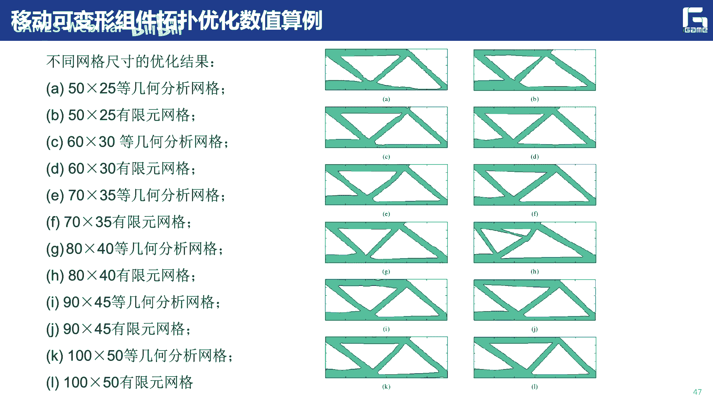

啊这是基于m c的拓扑优化啊，那么最后呢我们介绍一下。

最后一部分，就是这个拓扑优化后处理和这个cd重建。

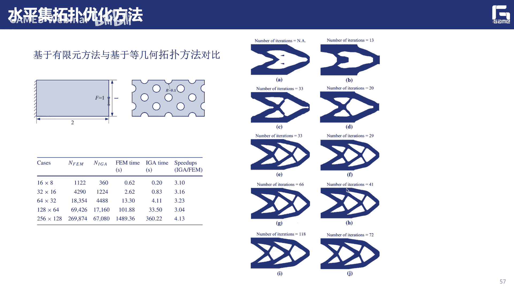

啊这一部分啊为什么要接受这一部分呢。

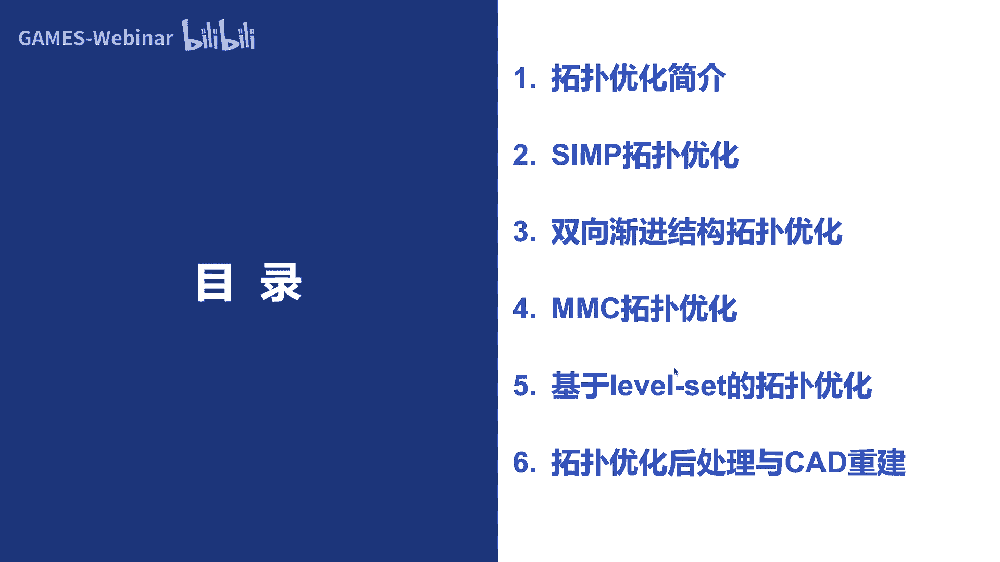

也是像大家可以看到刚刚才呃，无论是这种离散化的啊，就是说像基于这个simple bl啊，leveset啊，它常都是一种演示表达对吧啊，也就稍微就是说simple像simple的话。

他很容易有这种锯齿状对吧，那种棋盘格啊这种现象啊，那么像这个leveset的话，你还要抽取它的这个等值线等值面对吧，啊也是需要这种边界的一些抽取对吧，那掰手段上也是一样的，也是要进行三对吧啊。

但是我最后这个结构优化，拓扑优化出来的这些结果，我还是希望能够啊，能够呢最后导入我们的cad的建模的系统，cad系统对吧，然后呢把它给造出来，把它给造出来，也就是说呢，上次这个里面是需要大量的这个光线。

你和一些后处理一些操作，那么上在我们这个cad领域比较全，过了一个会议，从s spm上啊，2019年呢它的一个best paper啊，就是奥特desk他们公司的一个工作，就是来做这个工作的啊。

就说我怎么样把拓扑优化的这个结果，然后和cad系统能够建立起联系啊，比如说怎么样实现和cd系统的这么一个。

无缝的一个基层啊，那么实际上我们这边呢主要是呃在呃，郭旭老师的这个领导下，我们有一个呃国家重点研发的一个项目，就是来做呃这个自主可控的驼背化软件啊，其中一块内容呢就是要呃。

实现这种cp化结果的一个后处理，还有相应的这个cd重建啊，目前呢也是取得了一些阶段性的一些成果啊，那么第一个呢就是说像这种simple，拓扑优化的一些结果，他很多时候商都是一个锯齿状啊对吧。

还有一些孤岛啊啊啊，有的时候还要还要满足一些约束，对吧啊，那么商业说我怎么样对这么一个东西呃，实现它的cd重建，或者说并且做一些后处理对吧，因为你这样一个东西，你肯定不能直接拿去制造的啊。

不能直接拿去制造的啊，虽然我们就说了这件事情啊，比如说比如说像我们开发的一些软，件的一些功能啊，就是怎么样做一些实体的孤岛一些呃删除对吧。

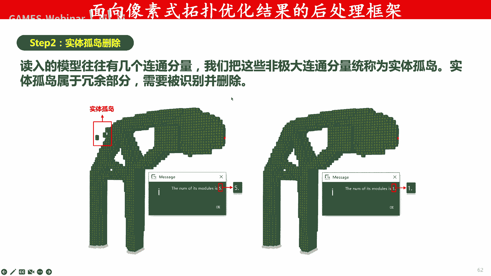

把这些孤立的单元把它给清理掉啊，然后包括一些变表面，可能还有一些除了一些孤立单元，还有可能一些荣誉的一些单元，就是突出的一些呃小的格子对吧，所以像这些格子我怎么样进行删除啊。

这边都是一些我们图形学的一些功能啊，包括一些网格的光线对吧，这么一个句子，窗户肯定不是我想要的，那么我怎么样呃，通过一些绿面体网格的光线对吧，算法，然后来进行光滑化。

啊那么稍这边呢我们也是有一个下了一个demo。

大家可以看一下整个过程，这边比如我先录到这一个相应的一个，拓扑优化的一个结果是吧，那我们怎么怎么样算算买删除相应的孤岛啊，然后做这个线应用的，大家注意，包括一些比较脆弱的地方。

我还可以对它进行一些性能上的加强，把它让它把脆弱的地方把它弄掉啊，包括一些光线是吧，另外一个呢就是这个cad的重建，就是我希望能够我输入一个比如拓扑拓扑优化，这是一个我们拓扑优化的一个结果啊。

然后我经过光线的可能这个样子，但是我希望能够最终能够输出一个，cad的一个表示，那么这边呢我就可以对这个结果来进行，一个cd的重建，然后可以就可以这么一个b rap的边界表示，我就可以把它输入到。

弄到我们这个cad系统里面对吧，然后把它造出来，那么这边我们的一个技术框架的技术路线呢，就是先做光顺，然后三个三角网文化，然后因为我们这边大部分得到了特别化，结果还是呃骨架比较清晰的啊。

然后做这种股价的提取和简化，当然就对于目前我们还做这个工作，就是说如果是那种有这种呃面的这种股价的话，我们也是可以做到目前啊，然后做这种骨架的地面体生成啊，然后生成下的样条啊，然后做一些体细分的拟合啊。

体细分我们下节课会给大家详细的介绍啊，包括我们就说基于体积分，我们就来做这种建模仿真优化的一体化。

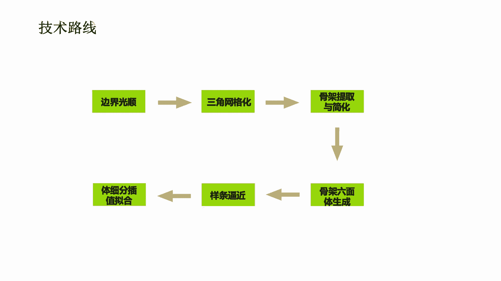

那么这边呢也是有一个相应的demo，啊这边比如一个简单的一个例子对吧，我输输入这么一个悬臂梁的例子啊，你说我们可以做一下光顺啊，然后抽取出相应的这个生成三角网格，然后下面呢我做这个cd重建。

我可以生成相应的股价，而且这个骨架里面的折腾这个骨架之后，我生成了一些呃一些节点位置，这么一个节点的生成，相应的一些网格的单元对吧，变成网格的单元，然后在这些单元上我就可以呃去。

而且我可以进行一些编辑修改增删，包括它的一些连接对吧，都可以做一些交互啊，然后做一些变换啊，啊那就快一点，然后通过这些编辑修改，然后后面呢我就可以生成这么一个控制网格的，初始的控制网格的一个框架啊。

然后后面呢再通过一些投影的拟合，曲面拟合，然后就会得到我最后的这个cad的一个表示啊，cd的表示，啊这是另外一个例子，我们的时间关系我就，这是另外一个更复杂的一些点时间关系呢，我这边就，跳啊。

就基本上我们还是对于这种股价比较，那个明晰的这种技术，我们可以还是可以做比较好的，这个cad的这个重建的，可以把它给重建出来，那么后面呢当然对于这种，如果你有这种一些板啊面的这种结构啊。

我们也是可以给他做做重建。

好那么还有几分钟时间呢，我们就简单做一下总结，我们今天这节课的主要就是给大家介绍了嗯，基于等级和分析的拓扑优化，我们也可以把它简称成这个整体和拓扑优化，对吧啊，等你和拓扑优化啊。

那主要给大家介绍了三种隐私的方法，就是simple的方法，best的方法，还有这种基于live set，基于水平集的这种特别的框架啊，那么也是呃，相应的这个和把这个呃有基于有限元的框架。

和基于登记的框架呢做了一个简单比较，就可以发现呢，基本上特别画出来的结果呢还是都差不多啊，但是呢呃确实就在等几个分析的框架，能够在效率上啊能够得到比较大的提升啊，能够得到比较大的提升。

那么当然我们也介绍了，郭老师提出这个慢慢排啊，移动可别用组件的m c的扩展方法啊，也是和我们可以和我们这个等级和道，来进行结合啊，但我这最近还有一些工作就是做，不仅不不叫m c了，它叫m m v啊。

就说我是移动可变形的孔洞啊，这种这种工作呢也也是目前也有，也做得非常好啊，啊，在网上我觉得也是其中很多的，也是可以和整体和分析啊结合起来，那么当然最后呢我们也是介绍了，我们最近来做的一个事情啊。

就是怎么样能够把拓扑优化的这个后处理呃，和包括cad重建啊这么一个工作，我觉得这个也是呃非常重要的啊，非常重要的就是说我怎么样能够实现啊，拓扑优化结果的可用性对吧，可用性，啊那总额那展望一下的话。

实际上就是说目前呢应该来说，我们所介绍的这种工作啊，包括现在虽然基于等级和分析的拓扑优化的，这个文章啊，非常非常多啊，但是基本上还是以传统的，拓扑优化的思想为主啊，或者在上面啊做了一些呃修修补补是吧。

修修补补啊，或者应用的不同的问题，像多材料的问题啊，啊满足可知效性约束的一些问题啊啊等等啊，就这些方面呢还是比较多的啊，还是比较多的啊，但是我想的基本上都是啊思想啊，还有这么大概这么几个思路啊。

就没有革命性的呃一些突破啊，就是我的一些个人的看法啊，也是12后面呢，怎么样能够把整几个分析的这种特性啊，很好地利用起来啊，也就是说真正的提出一些，就等你的分析自我特性的拓扑优化方法啊，才是目前后面。

我们我觉得是一个非常好的一个方向啊，非常好的一个方向啊，应该来说我觉得还是有空间啊，可以挖的啊，就是说大家可以想想哎，我怎么样把啊登顶盒的这种特性啊，特别是一些比较新的一些整理和分析的方法。

怎么样能够用到和拓扑优化更好的结合起来啊，然后呃不仅是在效率上对吧，在一些其他的一些方面更具有优势，这个也是非常重要的，还有一个呢就是呃，怎么样把我们现在非常火的这个ai机器学习。

比如说和我们的拓扑优化，等，你和top优化进行结合，也是我想的，也是一个非常具有前景的一个领域啊，那么实际上目前让郭老师他们，把这个移动组件啊，还有这些啊，上次和这个g学习，一种学习深度学习结合之后嗯。

在很多的这个效率方面得到了很大的提升啊，很大的提升啊，你说这样的实际上是呃效率上提升了，就是说还是非常重要的啊，天下武功是吧，五五块不扩是吧，所以说就是说呃，实际上就是说这个快还是非常重要的。

因为这时候快的才能真正的在实际中用起来啊，好今天我我这样讲的内容啊，就这么多啊，那么我们下次课呢就给大家讲啊，基于体系分的，我前面也提到了一些体系分的一些概念，那么就基于体系分的这个建模。

仿真优化一体化的这个框架啊，说明下次课的主要内容啊，欢迎大家关注参加好。

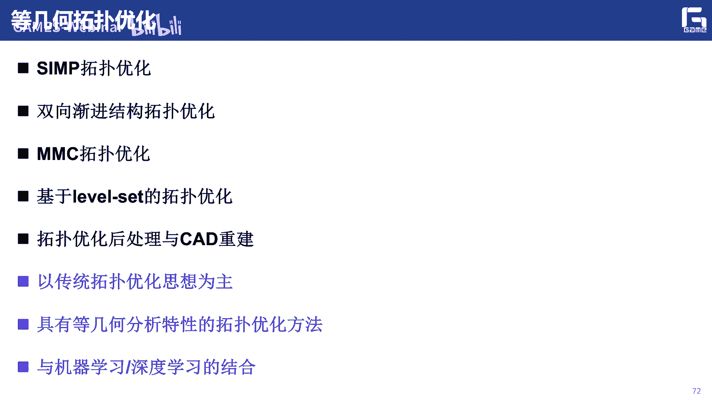