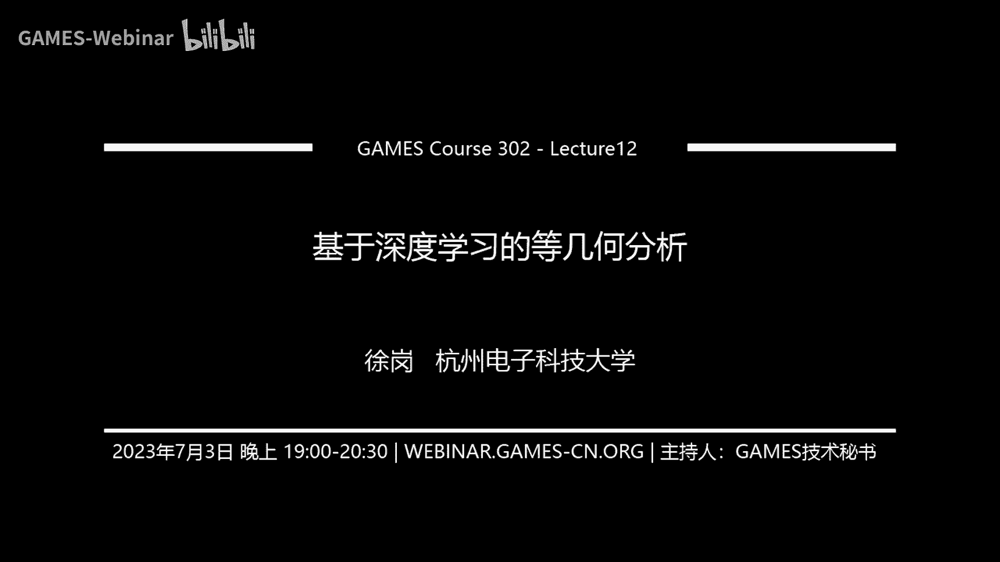
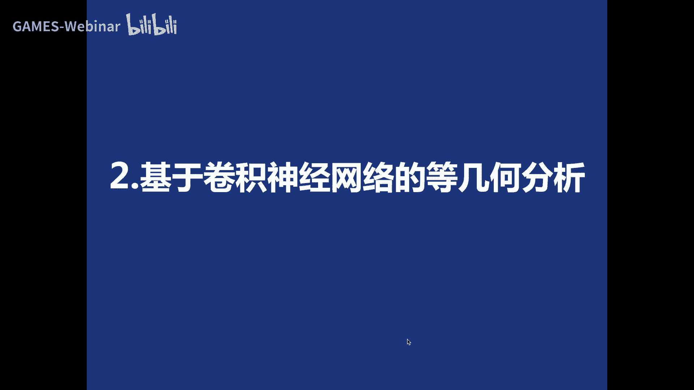
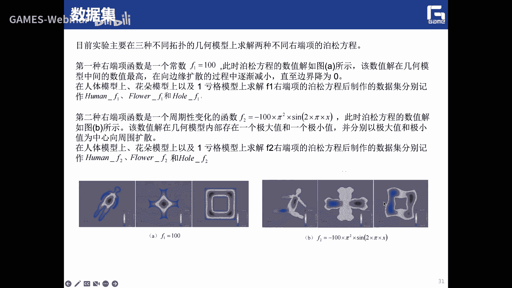
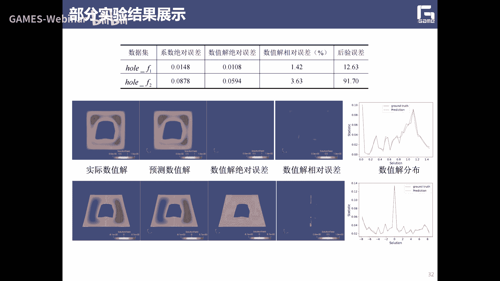
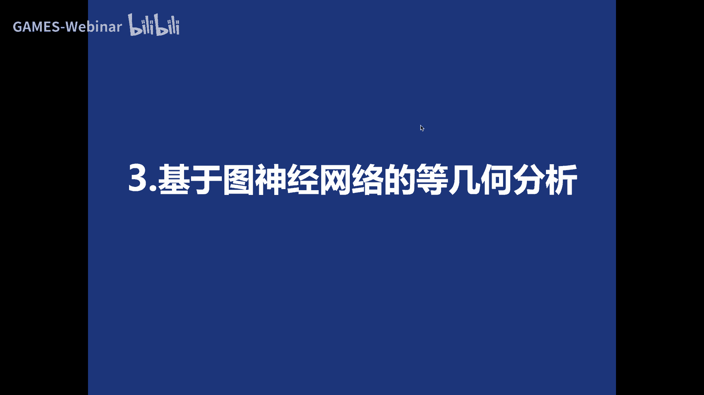
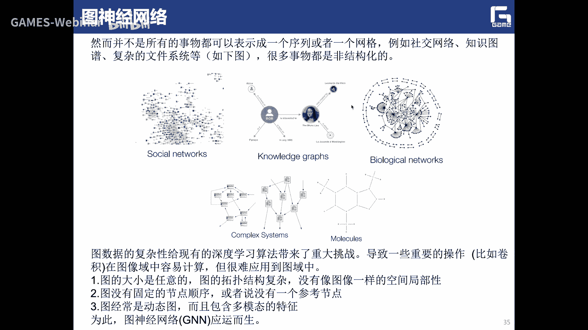
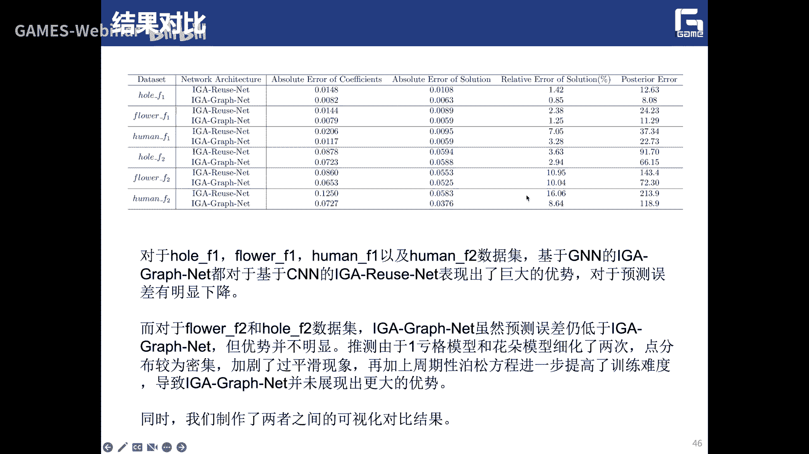
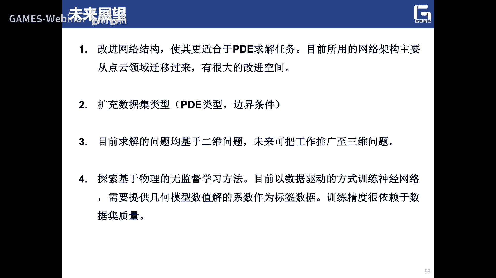
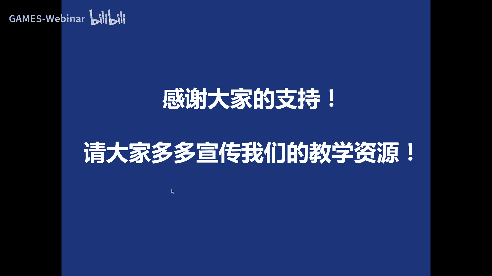

# GAMES302-等几何分析 - P12：12. 基于深度学习的等几何分析与课程总结 - GAMES-Webinar - BV1dM4y117PS

好各位老师各位同学，那么现在开始上课啊。

那么这次课呢也是我们的最后一课啊，关于IG的最后一课第12讲，那么这节课呢主要给大家介绍，这个基于深度学习的工具和分析，然后呢对我们整个的这个IG的课程，做一个简单的一个总结。

那么我们这边呢也是希望能够，把我们等几何分析的这个方法啊，和我们的这个呃大家现在都是非常熟悉的，这个AI能够结合起来啊，希望能够通过AI呃和登记和分析的这个结合呢，能够去解决一些问题。

那么这是我今天会那个讲解了一个提纲啊，首先呢介绍这个呃相应的这个研究的背景啊，然后介绍基于卷积神经网络，就是CNN的这个登记和分析方法啊，然后呢，介绍这个基图神经网络的登记和分析方法。

首先是这个背景啊，实际上我们整个的这部分的内容，我想呢呃应该都属于这个AI for size，的一个过程对吧，一个一个领域啊，应该也是目前呃大家非常关心的一个人啊。

那么air for science是吧，也就是很多时候大家看到的可能是括号里面，这个词啊，就这个AI嗯对吧，我们这个for size这样来写，那其实也就是说呢我怎么要用这种AI的手段啊。

深度学习的人工智能的这些技术啊，然后去解决像这个生物学啊，材料科学啊，化学药学啊，或者力学里面的一些问题，是也就用这种数据驱动的方法去解决啊，里面我们可能用传统的这种技术这种方法啊。

目前这个解决不了的一些问题，解决不了这个问题，应该这应该来说呢，这是一个非常而目前来说是一个非常热门啊，也是一个非常前沿的一个呃一个方向啊，或者一个大的领域对吧，那么像这边呢。

我想呃基本上就是说你可以对吧，把我们传统的呃心路学习里面的一些啊，经典的模型拿来改造一下啊，然后针对这个具体的问题对吧，然后无论是你是做这种呃生物的，这种蛋白质分子这种识别啊，还是说这种材料的优化对吧。

还是说一些药学的一些一些这个药物的，这个筛选啊，这种组合啊啊包括力学的一些预测啊，实际上直接说这次呢就是说呃，和这些问题结合起来，然后用AI的手段，然后去解决它，当然我们这边啊所要关心的啊。

所要关心的肯定就说我怎么样去用AI去呃，做IJ对吧，做IJ，那么实际上IG呢，它实际上就是，我们说一般就是求解一个pd问题啊。

所以说呢我们说呢这边呢可能说的，我们要想解决的就是一个AIFPD，E的一个问题啊，AFPD的一个问题，那么也就是我们传统的这种呃，无论是这种啊计算流体力学的求解，还是其他的一些结构力学啊。

或者其他的一些力学问题的求解，实际上我们最终都把它变成了一个啊，偏分方程求解的一个问题对吧，那么也就是说它包括我们等几何里面对吧，实际上也是需要经过这种啊离散化啊，然后经过网格划分，那么相等。

你等几何里面就是要求做参数化对吧，然后做这种数值的求解啊，或者一些积分啊，或者一些变非法，然后去进行求解，那么实际上这个里面的话啊，这是我们传统的这个套路啊，啊那上市现在呢呃怎么样去解决。

相应的国内是流程仿真，还是其他的一些呃PD相关的一些问题的话，那么我们上也是可以借助深度学习的方法来做，那么实际上从我们整个的层面来看呢，我们实际上是呃，既可以做这种数据驱动对吧。

也就是说我通过一些呃大数据啊，然后从这个呃大数据里面，然后去发现里面的一些规律，然后这样来做对吧，那上面这纯粹就是一个AI层面的一个东西，大家呢我还可以怎么样啊，我还可以通过呃把这个sans啊。

比如说把科学的一些它的里面，也就是说我这个PDA问题里面它蕴含的一些，因为pd它本质上就是一个一个一个sans的一个，问题模型对吧，当我们的PDE上，在我们的数学系里面有个偏移方程，数值解。

或者其他一个呃一门课叫做数学物理方程，是数学物理方程，也就是说实际上PDE，它本质上就是一个数学问题方程，那么解说在pd里面他应该蕴含了既包含数学，又包含物理的一些information，一些信息对吧。

也就是说实际上就是在这个里面我怎么样，如果把它纯粹按照这些物理信息，把它结合起来的话，那么实际上这边呢就是变成一个size的问题对，也就是说实际上我们这边大概有这么几个，这三类对吧。

第一类呢就是说我可能有大量的物理信息啊，也就是说我是想知道我这个整个的这个物理场，它要满足什么样的一些条件，我是知道的哦，我是知道的啊，也就是说呢，呃我还只是含有的一些少量的这个数据啊，少量这个数据啊。

那么上也说，这大部分就是一个类似于cs的问题啊，那么实际这个里面呢呃比较经典的啊，要发在这个JCP的一个工作，这个PIA啊，如果有同学啊，对这个领域领方向有所有所了解的话啊，实际上大家应该可以知道啊。

那么pi呢，实际上就是呃虽然就是物理驱动的一种方式啊，理解物理模型驱动的一种方式，那么另外一个呢就是可以把它称为是一些诶，称为一个一个verse的一个problem，那么也就是说我可能是有一部分数据。

但有一部分的一些物理信息是知道的啊，但是呢就是在这个里面呢，呃我希望通过呃，相当于我鉴于这个AI和sans之间的对吧啊，这不说我有一些data，但有一些就知道一些pyx1些规则对吧。

那么商业说我希望通过两边的结合，能够那我把这个相应的要减的这么一个问题，把它给解出来的，相对来说，这个里面呢呃实际上就是类似于一个反问题，这几个还有一个呢，就是说唉我可能有有个大数据啊。

这个big data对吧，那么但是我没有不知道这些数据之类的，它满足什么样的一些物理的现象，物理的规律是物理的准则啊，那么也就说这个时候呢，我就要靠什么纯数据驱动的啊，实在按照这个数据驱动来做的这个键。

比如要用到一些我们传统这个这个，一些深度学习的方框架对吧，或者CN或者这个unit之类的啊，那么实际也有效呢，呃这个数据和我们这个规则对吧，也就是说他们之间呢是呃，也是有一个相互权衡的一个关系啊。

相互权衡的关系，那么想要只中等裁决，我们可以把它称为一个数据驱动的一个，pd的求解的方法，或者是一个物理驱动的一个pd求解的方法，那么通过数据驱动的pd方方法呢，目前上也是有很多的这个paper啊。

也就是说我输入一些呃，已经已经知道这个数据对吧，然后我把它喂到这个网络里面，然后呃我就可以是通过一个一些训练啊，什么之类的，我要进行测试，然后就可以输出一个相应的一个U，我要求剪了这个。

无论是你的问路场啊，还是这个卫衣厂啊之类的，那么它会满足一定的这个这个lost FX，减到最小对吧，不说这边的这个LOFX是什么啊，是纯粹数据层面的对吧，也就是说这个商就是一个数据驱动的。

EPD的求解的方法，这时候它的精确点就是我们有已经知道了啊，这些已经标注过的，已经标注过的这些标签的这个数据那么大，另外一类呢就是说不是数据驱动，而是物理规则驱动，物理规则驱动的一个pd求解方法。

那么也就是说我最终的这个loss呢，可能就满足呃，我这个微分上只在这个U上对吧，然后他在这个方面等，这个实际上就是说他会要满足这么一点对吧，就是说他不需要任何的这个标签数据啊。

纯粹通过这个物理规则的来来，来驱动这么一个pd的求解啊，那么为什么啊，为什么要用这个AI的方式去解pd对啊，但A有它的这个最大的好处就是什么啊，快啊，那么实际上也要说呢，呃我们传统的啊。

这种IJ还是有限元求解PC的方法，特别是遇到这种大规模的模型对吧，就像这个里面的这个，相应的这个时间成本还是非常大的啊，但是如果如果我们用A啊，用深度学习的方法来做啊，12节说如果把这个模型训练好啊。

那么像我最终得到一个相应的一个输入键啊，还是非常非常快，那么这就是我们需要呃希望为什么啊，为什么要用AI来做，也就是说，我们希望能够借助这种深度的神经网络，能够呃更稳定的啊。

更快速的去解决这些复杂的一些pd问题，pd问题啊，而且呢能够呃节省大量的这个时间，那么商也就是我们这边呢主要是研究啊，主要用这个啊深度学习的方法啊，特别是这个CN和CN来啊。

求解现在的等级和物理方程对吧啊，也就是实际上我们也是可以啊，需要第一个呢，我们这边呢，首先呢我们说呢它就还是一个数据驱动啊，所以说我们要制作大量的这个训练的数据啊，训练的数据。

然后啊才能够去做这个模型的这个训练啊等等，然后在这测试，然后得到最后的结果啊，那么上网，也就是说我们基于这种等你的分析方法来制作，相同数据集，应该还是有它的一些非常好的好处啊。

第一个就是说呃因为它具有这种高阶连续性，对吧啊，也就是说，那么我们通过呃神经网络预测的乐乐姐，在某种程度上应该因为我们是这个网络，是通过要通过这种，光光滑连续的这输入进来进行训练嘛。

啊所以说我最终通过这个AI预测到的这些技能，在某种程度上也是能够保留保留这些光滑性啊，这些特性，还有一个呢，就是我在这个优化这个剪的过程中啊，我两个阶段是不需要交换数据的。

数据交换的时段进行这种格式转换，另外还有呢就是说呃，呃当然就说我这方面呢会呃，不会造成模型的这个精度损失啊，所以说数据集的这个质量会更高啊，那么更利于这种神经网络的训练，所以我们为什么要要做这个问题啊。

实际上我们可以回到一开始我们的初心啊，我们的初心是要做什么啊，实际上我们是去去做解决这么一个问题啊，这个也是和我们呃呃这个一个老朋友，就是这个啊，目前在莱克斯勒大学工作了，查理王教授啊。

啊记得在一次那个SSPM会上，然后一块讨论啊，就想去捡有这么一个问题啊，也就是说如果啊，如果我我我知道了一个在这个模型A上的，它的一个IJ的解，那么我能不能通过一些间接的方法，然后能够知道啊。

在这个兔子上面的啊，这个model这个B上面的这个IG的减，那么首先我们可以我们我们会知道啊，就是这个model a和model b它们具有相同的几何拓扑，相同的几何拓扑，但是呢可可能呢是不具有啊。

不过肯定是不具有相同的形状了对吧，也就是说他们这个呃，这个样条的空间可能是一样的，但是这个控制定点的位置啊应该是不一样啊，应该是不一样的，那么像我们自然界中也存在有很多这种类型，这种的数据数据集对吧。

比如像各种各样的飞机对吧，各种各样的战斗机对吧，各种各样的人啊，那么各种各样的动物对吧，然后同一类动，实际上他们的这个所有的这个拓扑表达，都是一样的对吧，人都有这个视肢啊对吧，这个还有头啊或者躯干对吧。

反正就这样来组成，那么如果我知道的在某一个人能上的，他的这个IJ的解，这个物理法真的解，如果我想知道诶，过来一个另外一个系，一个不同的一个另外一个人对吧，另外一个人啊。

他的这个拓扑和你的这个拓扑是一样的，但是这个体型又是不一样的对吧，这个几何数据又是不一样，那么我怎么样通过这个model a上面的这个，IE的减去得到这个model b啊。

另外一个人他这个呃上面的这个IJ的解啊，这个是我们当时讨论的时候啊，想要解决的一个问题，就是我们不希望在只在在这个model b上，再重新运用IG这个给你分析方法，再再算一遍对吧，我们希望能够诶直接啊。

能够通过一些其他的更快速的方式啊，能够得到啊，这是我们当时的这个初衷啊，当时这个初中然后就是去解决这么一个问题啊，因为你比如说我我得到了一个呃，我知道一个model a。

还有它这个上面的IG的这个这个解，是这个样子的，对吧啊，那么我也知道model b的这个形状，那么我上午可以通过一些影射的方法啊，因为我有一些图形学里面的方法对吧，计算几何里面的方法。

可以建立model a和model b它们之间的一个麦屏，那么如果把这种卖品啊，直接把这个物理场，就这个B上面的物理场，引申到这个model b上面的话，我可能会得到的这个E这个结果。

那么当然这个E这个结果和它上面的真实的，这个ID的解，它实际上是有一个有比较大的这个差别对吧，有比较大的这个差别啊，那么也有说呢，你这种直接map的方法肯定是不行的啊，肯定是不行的。

那么我有一种什么方法可以得到诶，在这么一个model b上面的它的一个解，而且我当时根据这个IJ来做，也就是说大家可以看到啊，就是说如果我用一些现有的方法，和用这种直接map的方法啊。

那接map的方法还不差，还是非常大的，非常大，也就是说实际上我们想想，去解决这么一个问题啊，想去解决这个问题，那么实际上我们当时也是真的，去做了一个工作啊，这个这个工作时呃。

希望呢能够实现这种拓普一制模型的，这个分析的这个重用啊，那么我们当时也是在cad上发了一篇文章啊，发了一篇文章，主要也是说就是我们是期望能够对这种具有，统一拓扑的复杂模型啊。

然后能够在上面实现这种等级和的啊，这个分析的这个虫子啊，分析的一个重，那么上大家可以看到我这个题目里面上，不叫analysis real对吧，还是叫做什么computation啊。

商家叫做计算的这个重用啊，计算的这个重，那么也就是说呢，实际上我们在这个工作里面，并没有实现我们这个最终的这个目标啊，最终的目标我们只是实现了什么计算的出来，也就是说呢只是实现了这种分析的这种加速啊。

分析的这种加速啊，也就是说比如说对这边的不同的这个呃，这个飞机的模型，我可以通过呃一些计算从用的方式，也是我可以在第一个模型上，计算出它的这个基金函数啊，或者其他一些点啊之类的。

这个上面的一些呃信息对吧，我就可以得到一个刚度矩阵，然后去进行求解啊，那么相对于唉其他的不同形状的这个，飞机模型的话啊，飞机模型的话啊，我上就是可以实现一个，最起码可以实现一个预计算预计算嘛。

这样的话实际上就可以实现啊，诶我在这个预计算模型上啊，我就可以去实现他的一些加速，这个最起码我在这个在这个样条的这个，G函数上面，我就不用再重复计算了，那么也就是说呢，我们应该说这个工作啊。

只是实现了计算的重用啊，实现了这个分析的加速啊，那么也是可以发现啊，可以发现就说我在不同的这个自由度下啊，那么我相应的X可以得得到一些，从三倍啊一直到大概九倍的这么一个加速比。

那么无论是对我们这个手的模型啊，这个呃这个飞机的模型，还有这个人的模型来说是那么时尚爷爷说呢，我们通过这么一个东西啊，确实啊实现了这个计算的重用，然后呃实现了这个呃效率的提高，对效率的提高。

但是确实没有实现我们最重的，最重的这个目的就是什么啊，分析的重用啊，也是我能，我们希望实际上通过第一个这个人上面的这个，分析的这个结果对吧，能够哎如果在重新，如果我知道一个这么一个新的这么一个呃。

另外一个人的这个模型，几何模型的这个信息的话，我希望得到在这个人身上，直接可以得到他的上面的这个，IJA的结果对吧，这是我们希望得到，但是我们在以前上确实没有办法啊，确实没办法没有做到这么一个点啊。

没有做到这一点啊，因为我这个模型啊，虽然这两个模型它的拓扑是一致的啊，拓扑是一致的，但可能它们的形状不一样，大家都知道像我在上面求解pd的时候，是和这个物理坐标有非常大的关系的对吧。

那么你在上面求解的时候呢，可能啊，正是因为这个物理坐标的不一不一样了啊，所以说它这个内部的这个，你无论是求解这个呃线弹性问题，还是去写字的热潮热传导问题，现在这个普通方程的话对吧。

那么实际上这个它的周期应该和你的物理坐标，周期分布，和你的物理坐标的这个信息，是有非常大的关系啊，所以说呢，就是这边呢还是没有办法真正的实现这种，分析的这个重用啊，那么我怎么样能够实现这种分析的重用呢。

啊这实际上我们后来就想啊，特别是出现了这个深度学习啊，我就想这个深度学习应该是，可以帮我们去解决这个问题啊，去真正实现分析的作用，也就是说我可以直接在我可以在得到啊，知道啊。

在这个人体模型上这个IP的结果，然后我通过深度学习的技术，就可以知道在其他的这个人体模型上，相应的这个IG的分析的结果应该是什么样子的，就可以去预测对就可以去预测啊，那么实际上这就是我们的这个初衷啊。

为什么啊，为什么要引入深度学习啊，那么我们引入深度学习解决了什么问题啊，就是为了去做这种拓扑一致的啊，模型上面的这个等几个分析结果呢，这个通用啊，那么这是我们一个最初的一个出发点。

也是我们的最终的一个目标啊，那么像我们这边主要做了两个工作啊。

第一个就是呃，记这种卷积神经网络的等一个分析方法啊。

那么卷积神经网络呢有很多同学都非常熟悉的，我们这边就非常简单的过一下啊，也就是说15这边一个CN的一个基本结构呢，就是可能会包括像这个输入层对吧，卷积层池化层，激活函数层和全连接层。

那么实际上在这个里面啊，在这个里面啊，他通过输入一些比如图片啊，文本啊，然后最终通过这些不同的层次，然后最后输出一个相应的一个，预测的一个结果啊，相应的这个预测的结果，那么这个输入层呢。

主要是一个输入的一些数据对吧，比如一般来说我们最常用的一个二维矩阵，像我们的这个图片就是一个二维的一个pixel机，讲述了一个矩阵啊，那么这个卷积层呢，它就是对我们的一些二维矩阵啊。

可是不同的数据窗户的数据，然后和一些滤波滤波矩阵啊，然后做这个内积啊，要说逐个元素相乘，然后进行求和是吧，然后做一个卷积啊，然后完成对这个呃图像的一些局部特征，信息的这个提取，全部特征提了这个。

那么实际上这个最左边的部分，就是我们这个原始的输入数据，然后中间这部分就是一个滤波器啊，就是我们的一个呃卷积核对吧啊，然后呢，右边的就是输出的这个新的，这个二维的这个数据啊。

然后中间的滤波器和数据窗口的做这个内机，实际上就是说我每次滤波器呢，都是针对某一个局部的数据窗口，来进行这种卷积的啊，这就是我们这个卷积神经网络的，所谓的这个局部的这个改正的这个机制，就这样那么少。

我们在增高最更高层，我们可以把这些呃，你所感知到这些不同的这个局部的资源源，把它给呃综合起来，然后我们就可以得到一个全局的这个信息，还有池化层对吧，池化层实际上就是把这个呃输入矩阵。

某一个位置相邻区域的总体的统计特征啊，作为这个位置的一个输出啊，然后这边呢有一些方法，比如全民平均磁化，最大磁化就是啊，然后也说这个里面非常重要的，就是说我怎么样来指定一个值来代表整个区。

实际上就是我能够来做一些，信息上的一些抽象啊，然后后面呢就是一项这个激活函数层，激活函数层，那么啥最基本函数呢，就是我怎么样用这种非线性的这种激活函数啊，然后然后得到这种这边大家都非常熟悉了。

比如这个SIGMD这个挣钱啊，还有这个VLOG这个函数是吧，好，那么全年情呢，就是我怎么样从这个自动的去提取一些，图像的特征，然后把最终的这个结果啊给预测输出出来。

那么实际上我们基于这种CN的这几个分析方法，实际上我们这个解决的啊，就大家呃也还是这么一个，前面我说了这么一个问题啊，就是说我如果知道了啊，在一个模型上，它的这个等级和分析的结果，IT的结果。

我怎么如果给你一个新的啊，拓扑一致的这个这个B样条模型对吧，那么我怎么在它上面，我知道这个预测的这个数字，结果应该是什么样子，这就是我们需要去解决的一个问题啊，那么商人原因说呢。

因为我们这边还是一个呃数据驱动的对吧，说明我们相相应的采用了整个的流程，就是说哎我们是希望啊把这个B样条模型对吧，这边比如有五片啊，有五片，那么上我们就可以把他的。

因为我主要希望得到的是这个每一片上对吧，控制顶点处的它的这个控制系数啊，那么所以说呢我们可以把这个控制零点呃，实际上是啊把他的这个提取出来对吧，然后把它放到一个一个和一个包围盒里面，然后做一个归一化。

归一化啊，那么实际上也就是这边呢，就是我这个控制顶点的坐标值，就把输入未到我的CN网络里面对吧啊，然后通过训练对吧，然后最后会得到一个在这些控制顶点数，比如说对我的啊这些X0Y0X1Y1啊。

都分别对应的又零又一一直到UN对吧，那么在这边我就是把这个效应的这个系数，把它给预测出来，然后呢我就会得到最终的把这个再收集数字，结果呢在可视化出来对吧，可视化出来，也就是说。

实际上就是说我们完全是可以，基于C的一套东西啊对吧，来进行呃，我们实现我们这个IJ的这个VU这边的工作，这个目标，也就是说，我们这边实际上是采用这种数据驱动的方式啊。

数据驱动的方式来训练这个深度的这种啊，点击寻找我的，我洗啊，因为我们目前呃，相应的这个数据集还是非常缺乏的啊，我们当时呃那个呃这个王丹丹同学，还是呃提供了一个流程，然后来生成面向多个不同仿真问题。

并且拓扑结构不同的数据集来做来做，那么商为了生存，最后用于训练的这个数据，我们要制作很多的这个top一致的样条模型，然后呃把我们这个IJ的这个分析的，我们这边的这个框架上来求解下的PDD方程。

然后得到这个数字点的系数啊，作为一个标签的啊，相当于已经标注过的数据对吧啊，那么上它主要包括这么一个步骤吧，就是说第一个就是制作top一致的变态模型啊，因为我是要呃去解决这个分析重用的问题啊。

另外一个呢，就是说对这个变量模型进行归一化啊，还有一个呢，就是我怎么样使用这个登记几何分析的库啊，来求解这个偏移方程，然后呢，根据我这个卷积神经网络的输入输入格式，被相应的标的模型啊。

用IG数据解呢做一些这个呃转换，那么实际上这边呢就是呃一些例子嘛，啊这边比如说像这种1K个模型啊，啊我这边上次这这五个模型都是脱皮子的对吧，而且他们都是有四片的边条呃，曲面来组成的啊。

然后每片样式的控制网格呢都是5×5的啊，那么像我们像这个面呢，我们总共就做了5880个，不同形状的这种带孔的模型啊，像这种，那也可也是可以做另外的一些，通过数据增强的一些技术来进行数据的扩容。

也是可以的啊，像这边的我这个挂着模型，它这里是由五片的变量条模型来组成的，那么他这个上也是呃，呃那个控制网格大小也是5×5啊，接触呢都是市，这边，我们可以总共做了4000个不同形状的花朵模型。

这边是这个人体的模型啊，那么也就是说我们12这边的，无论是卷积神经网络还是这个呃图神经网络，我们上次目前也只是做了这个二维问题，二维问题就是没有做题上的这个问题，那么这边呢这个模型总共有6300个。

不同形状的人体模型，然后就基于这些模型呢，我们还另外还要做一个工作，就是对这些模B2台模型做一个归一化，归一化啊，因为随着这个求解区域的这个呃说话，我刚才说了啥。

他的输出点呢是这个呃不成规律的这个变化啊，那么实际上我们还是希望，能够对这些几何模型呢能够做些限制啊，能够，对它进行规划，也是把这个模型的大小，比如说现在啊零到1×0到一范围内啊。

但我觉得这个也是有可以有有意义的啊，也是有意义的，因为这样呢可以为我们后面的这个，深度学习的这个过程啊，啊提供一个非常可靠的一个数据啊，非常可靠的一个数据，那么后面的就是我们希望。

就是我们可以在这个得到的啊对吧，这几千个变量条模型上面，通过IG我们这边的这个框架来进行求解，然后得到他的一个数字解对吧，所以说我们得到的三，就是这个数字解中的这个控制系数。

我们把这这些控制系数作为这个标签数据啊，用于我们这个CN的网络的这个训练啊，训练啊啊啊，当然我还可以在这个求解过程中，通过一些嗯参数节点啊，或者这个提高次数啊对吧，然后相应的去通过这些加息的操作啊。

来提高这个IG数值解的这个求解的这个精度啊，就在这个精度，还有呢我后面呢还有一个一步啊，就是呃转换格式啊，转换格式实际上也就是说我怎么样能够呃，我需要把这些我们整个的这些不同的。

几千个的这个量产模型里面的控制点力PIG，还有IG数字解读这个要求解的这个这个UI键，或者你训练的这个数据，UI界数据转换成这种矩阵格式的数据，矩阵格式的数据啊，那么这个呢我们也是呃。

也就是说12是把自己变量模型，然后通过规划成这个样子，然后把它放到一个矩阵格式里面啊，矩阵格式里面，因为我们这边基本上这个还是呃，非常容易做到的啊，因为我们这边的这个控制顶点对吧，还是嗯像这个变调。

它基本上还是一个张量机形式嘛，啊那么即使他这个怎么分布，应该来说我还是非常方便的，可以对他再做一些排序，然后把它能够嵌入到呃一些矩阵里面啊，然后我们把它变成这么一个矩阵格式之后，唉，上对吧。

就是上就可以把它看成是像素了，就说每个矩阵的一个元素就是像素了啊，那么也就是说我整个的这个矩阵啊，或者整个变量模型，就可以看作是一个呃一幅图片是吧，一幅图片啊，这样多，这当然是可以啊。

当然是可以通过CN这种框架模型，然后去进行这个训练进行预测，那么我们这边基于C的这个用的这个网络节目，主要是这个unit3价啊，那么比如说它实际上是呃对，但unit肯定都知道啊。

还包括用的unit加加是吧，因为这三家上是在对这个unit unit加加的，这个更呃更好的一个改进吧，啊那么它它也是一种基于编码解码的啊，这种结构的一个声音的一个网络啊，那么这个这个编码器模块呢。

它是可以通过多次的卷积和池化操作啊，可以将这个我们这个图像特征啊，逐步的缩小图像化，然后提高这种高纬的这个特征，那么在减缓的阶段呢，我们通过反面积啊或者上采样啊，然后让这个特征的尺寸呢逐渐的变大。

然后恢复到恢复到这个原始的这个，图像的尺寸啊，然后我们这边呢，也是可以通过一些跳机的一种融合啊，然后来嗯融合这种编码器模块的，一些底层的特征啊，那么上unit3家，它采用的是那种全尺度的这种调节。

比如说可以捕获啊，这种全尺度下的这个底层的细节啊，还有它的一些高层的一些语义的一些信息啊，当然在解码器中呢，你也可以通过融合来自这个编码器底层和，阳等分那些特征图，还有编码器底层那些特征图的来做啊。

那么上次我们也是做了多个测试，就发现可以呃，因为这几个网络模型我们应该都吃过啊，还是发现这个原来的三家，还是在这个预测的精度方面还是最好的，而且呢这个相应的这个网络参数呢，也是比较少啊。

提高了这个相应的这个计算的这个效率，此外呢，我们还引入了一个自注意力机制的一个模块啊，那么也就是说呢这个资金机制呢，我们上也不不再将这个注意力，聚焦在这个少量的特征上。

而是更关注这个特征它们之间的这个关系啊，他们之间的关系，还有更好的这个捕捉特征之间的相关性啊，那么实际上就是说这个交错的这个，注意力机制啊，就这个rs sa，它实际计算是计算所有的这个像素点啊。

两两之间的这个权重，那么他会在这个从这种全局方面呢去呃，在这个模型训练侧重进行参考，然后来提高这个CN模型的这个预测的这个能力，那么这边呢就是我们整个的啊，整体的一个网络架构图吧。

啊那么长爷爷说我们通过把这个控制顶点，通过一些规划，还有转换成这种矩阵的形式，对吧啊，矩阵格式啊，然后就可以把它应用到我们整个的，越南的三角网络里面，这边只是一个矩阵的一些尾数啊。

那么这边呢当然通过也是一些上传线下载项，还有它的一些呃跳转的一些connection，对跳转一些连接啊，这样子啊之后呢我就可以预测出啊，通过这么一个unit3家的模型。

预测出我最终的啊相应的在控制定点处啊，如果是一个新的模型对吧啊，控制点出他的这个现象的这个期数，那么实实在很多的这个呃深度学习模型里面，非常重要的就是我怎么样去呃设计我的loss function。

就是这个损失函数对吧啊，虽然我们这边呢呃，第一个呢就是我们30，可以把这个呃对应的数据点之间的误差，平方的均值啊，也说这个均方误差作为我们的这个loss function，是吧啊。

那么然后在这个里面可能会有一些问题，就是会有大量的这个零啊，也就是说这个像我们如果采用这个LMSE的，这个老师的话啊，他的这个均方误差里面，它就包含了很多这种填充零的，这种误差来计算啊。

那么会他上也是会参与这种传播啊，还有更新这个网络参数啊等这些过程啊，还有一个呢就是说呃，可以把这种系数的误差，来作为这个损失的这个函数啊，因为这个函数呢它只衡量你这个预测的系数。

还有IJA这个数字解系数之间的，这个L弯的这个距离啊，另外呢像我们也是可以呃，把这种网络预测的数值解和IJ数值减的，这个误差呢作为这个选择函数啊，那么实际上这些呢我们说呃。

实际上这些呢我们说还是一个什么啊，基于一个数据驱动的对吧，基于一个数据驱动啊，那么，我们最终的实际就是，我们可以把这两个前面的两个函数，一个LU对吧，是个系数的损失，还有数值解的损失。

把它两个呢加权起来啊，然后得到一个呃一个老实的老实，当我们进行测试的这个指标呢，就是我们可以通过相对误差啊，我们具体会讲了，就是说实际就是我预测出来的和我真实的啊，然后这一个呃相对的一个比较好。

啊也就是说我们这边呢可以看一些例子啊，就是说这边呢我们主要就这些数据集嘛，对吧啊，人家说主要是有这么几个数据集，然后上面呢我可以在上面做训练啊，然后这边呢就是我在F1。

就是说如果是右端的这个常数就DU等于F，如果F这个它是一个常数，我得到这个数字点啊，就是这个样子吧，然后如果F2，如果我是求职，求职，初中和这个三有相关的这种周期的函数，相关的话啊，扩大到这个数字解啊。

就是就是是是是这个样子对吧啊，然后我们可以看一下一些结果。

看一下一些结果，那么商业说，最左边就是我的实际的这个数字点啊，实际的数字点，然后右边呢是我预测出来的这个数值解啊，预测出来这个数字点，然后这边是数字解的一些绝对的误差，还有数解的相对的误差啊。

那么包括它的数值解的一些分布，就是蓝色的是我的ground truth，然后这个黄色的就是我预测出来的，应该还说还是比较吻合的啊，还是比较吻合，整个的数值相减，相对的误差大概在呃，1%和3%左右啊。

只要我们最最差的，我记得啊，也就是在5%左右，基本上还是可以提供来做一些参考啊，做一些参考，这边我只放了一些部分的这个实验结果。

那么这是我们基于这个呃CN的是吧，卷积神经网络神经网络啊，那么后来呢，我们呃也也有一个下一届的一个同学，做了一个工作，就是基于这个电影，基于这个图图神经网络，来做这么一个等级和分析的一个问题，为什么呢。

因为我发现就是特别是这种多片的，复杂的模型啊，这是和我们这种图的这种结构啊，还是非常非常类似的啊，非常类似的啊，也是我们希望能够把这个图网络的个技术啊。

能把它运用起来，也就是说实际上对于这种结构化的数据啊，无论是语音还是AI图像啊，然后包括这个文本上，他都是一些非常简单的一些，序列或者网格的数据啊，图片或者数据就是这种结构化的数据。

我们上次用这种卷积是C来做是非常方便的啊，因为它和矩阵都非常类似的对吧，但是实际上我们有很多的呃很多的这个数据啊，就说你实际上很难就可以把它变成，变成一个矩阵对吧，实际上是像我们的一些社交网络啊。

知识图谱啊，还有一些复杂的这种文件系统啊，而这也让他都是一些非结构化的数据，也就是说呃它们之间的连接关系啊，相互关系是非常复杂的啊，然后也是把他的这些节点啊，都把它连接起来起来的话啊。

上就可以变成了一个呃非常复杂的一个图是吧，或者叫超图是吧，那么像这种图数据的复杂性啊，实际上是给这个现有的这个深度学习啊，然后再来也是带来很多的挑战，也就是说实际上一些比如在这个呃CN里面。

一些比较重要的操作，像卷积，你在这个呃图像上有比较容易做对吧，但是在这种图形里面可能就比较难了啊，那么也就是说这个图呢，你如果用CN的方法去解决图的问题啊，算是比较困难啊，所以说这个图的第一个呢。

就是因为这个图的拓扑结构比较复杂，没有像图像一样的这种空间的局部性啊，还有一个呢就是图呢，它是没有特定的一些节点的顺序，或者说没有一些参考的一些节点，第三个呢就是图呢它经常都是一些呃动态图。

而且包含这种多模态的一些特征啊，多模态的一些特征，因此呢呃怎么样把，这个声音能够进行改造提高对吧，然后让它适用于我们这种大规模的这种超图的，这种数据啊，那么上就是后来就出现了这种图神经网络。

就是我们的建啊，建也就是说它是主要一个想法呢，就是我通过呃用消息传递，或者领域聚合的一个机制对吧，嗯比如说我我输入一些呃节点对吧，然后这些节点呢，这些input它会连接成一些呃top原图对吧。

然后我通过他们呃邻居之间的一些加权的，一些新消息对吧，一些这种信息嗯，然后我通过这种神经网络的信息，然后上我就可以把他的这个信息呢来实现聚合，得到这个节点上新的一些信息是吧啊。

包括一些连接节点的一些信息的变化等等啊，然后三元说呢，这样的话这是啊可以就可以解决啊，出现这种呃复杂的超图数据的这种训练，还有它的一些预测。

那么像我们前面的啊，用的这个CN的这种呃等级和分析重用的啊，分析重用的这种网络的缺陷是什么啊，第一个呢就是说我们还是在前面那个工作中，我完全把控制顶点映射到一个M乘以的，二维矩阵里面，他上次也是呃。

通过一种相当于通过一种间接的方式，把这种控制顶点呢，输入到这种卷积神经网络里面啊，也就是说它这个里面伤势就大家可以看到啊，我是把它相当于一个包围盒，一个一个盒子对吧，或者一个东西把它放到里面。

然后我对它进行归一化，然后进行这种计算，它的下标啊或者之类的对吧，也是他起码上手包含很多的这种零元素，也说像是包含很多的荣誉的信息，就是大量无用的信息，也就是说这个冗余的这些控制顶点呢。

实际上还是会影响会影响他这个卷积的速度啊，还有这个准确率，另外一个呢就是说我这个上市，如果你做这种复杂模型的话，他这个控制顶点的个数会急剧增加的啊，也就是说虽然我们现在只是做了二问的问题。

实际上我们也是希望能够去做题的问题的，如果你做题的问题上，这个东西影射到二维矩阵的这个过程，就会非常复杂，而且对于每个模型啊，它的控制电脑坐标呢又都是不一样的啊，也说因此都需要一个隐私文件来完成。

还有第三点呢，就是说实际上啊这个控制零点对吧啊，让他如果是只有一片啊，但你可以把它理解成一个矩阵对吧，一个张量机形式对吧，但是如果是多片啊，你这么一个万达黑暴力的对吧，把它放到一个包围盒里面。

然后对它的顶点进行一个排序，然后把它使它变成一个，变成一个M乘N的一个结构对吧，实际上这是一个感觉还是挺没没没，就是比较暴力的一种方式去做了对吧，但其实呢呃如果啊，如果我们抛开抛开这个呃种包围盒。

这种方式对吧，然后说我只是纯粹的去看它的什么啊，纯粹的去看它的控制定点之间的，这个连接关系的，实际上这些控制电源开源，它的这些连接关系，连接关系它本质上是不是就是一个官，就是一个无向图，对吧啊。

而我们说这个图神经网络，它恰好就是用于呃处理这种非结构化数据的，这个网络的架构啊，也就是说我们这个图结构，它是更适合表示这种多片的边条的数据啊，也是而且呢并且很非常容易对吧。

把它扩展到这种呃呃三维空间的三维模型啊，就体的模型也是可以的，而且呢，由于我们对于这种拓扑一致的变量模型来说，它的这种连接关系对吧，就是这个片和片之间的连接关系上，是非常固定的啊，非常固定的啊。

也就是说我们上次可以共用啊，同一个啊影射的一个文件，还有一个呢就是说变态性函数，我们都知道它具有局部修改的性质对吧，就这个局部支撑性啊，局部支撑性啊，那么也就说相邻的控制顶点之间商。

它是这之间的关系还是非常呃关联性非常强的，对不对啊，而像我们说这个图卷积呢，它正好就是一个关于淋浴节点的一个操作，能够非常有效的啊去领域中啊，提取相应的这个信息啊，那么基于以上几点考虑。

基于以上几点考虑，所以我就安排了一个学生啊去做了，后面现在找工作啊，就是这个IG grab light，所以说就是为了去改变基于这个CN的这种，等级和分析的方法啊，然后我们提出了基于图神经网络的一个。

新的等级分的方法，那么这是我们整个的一个框架吧，就是说呃i g a graph nec这个框架也说，我就给你一个B样条的model model，然后我通过这个控制零点啊，他们之间的这是他的控制零点对吧。

还有他的间的一些零件的一些关系对吧，然后主要商务可以抽取出它的一些这个，特征出来啊，它的一些特征出来，然后我通过这个基因，我通过这个基因，实际上我就可以呃，预测出它这个IG的这个数字解的一些系数。

然后最后呢再把它可视化出来啊，可视化出来啊，也就说了，这样的话我就不通过，不做什么啊，不做相应的这个呃，把它嵌入到一个包围包围盒里面，包围盒里面是吧，也就是说这样的话实际上是可以，非常方便的对吧。

就基于我们这个graph的这种信息，然后去实现相应的这个操作啊，嗯然后我们这边的主要贡献，第一个就是提出了基于这种图神经网络的，等级和分析的框架，Ig graph net。

能够在具有这种复杂边界的to b字模型上，快速预测这种连续光滑的这种IG的，高精度的数字点啊，还有呢我们也是也是比我们俩还，本质上还是一个数据驱动的一个方法，所以说呢我们也是支持了相应的这个。

适用于图形网络的等级分析的数据集，然后增加了这个初始特征，然后来强化这个它的特征的变化能力啊，那我们这边的这个网络架构呢，主要是结合这个resnet v two，然后架构。

然后改进了point transformer的一个结构啊，并且使用了呃，适用于我们这个地理空间边界问题的一个，现在的这个loss function，这个也是我们还上还是需要去制作数据的啊，制作数据啊。

那么因为这边的制作数据呢，就是说呃，虽然前面那个数据我们也是可以用的对吧，但是我还是希望能够有一些新的数据啊出来，然后来做这些问题，那么我们只是采用了这个IG graph net。

里面说出来了主要的这个图神经网络的模型，主要是对基于这种resnet v two所改进的一个，point transformer的一个模型啊，然而pter transformer呢。

它实在点云处理里面是非常重要的一个方法啊，那么实际上他在这个分类的问题还有一些啊，模型分割，还有一些语义分割方面的，主要是都表现的非常好啊，也就是说上学说他在对于这种不做这种。

局部信息的能力是比较强的啊，是比较强的啊，所以说呢他实际上也是对我们的这个问题啊，这个国家的问题啊啊还是有非常高的，这个适配性啊，适配性，那么上这个pa transformer呢，它主要有两个优势吧。

第一个他就说对于这种点对计算，是他们这个相应这个注意力方面呢是比较好的，也就是说向量这个注意力呢，它能够调节这个单个通道的特征，还有呢这个庞德传法，他上次引入了一些这种啊坐标位置一些编码啊。

然后呢来可以实现这种非线性的多层的感知啊，你看我们这边的位置编码上，对我们这个支出率机制啊有个非常重要的作用，可以让这个它的算者能够更好的去适应啊，这个世界中的一些局部的一些结构啊。

而且呢这个位置编码这个德尔塔，它对于这种注意力产生这个分支啊，还有这个特征转化的分支啊，都非常重要啊，那么这是就在这个点云这个方呃，一些工作里面，他用的这个方式传输方面的成，它可以这样去表示它啊。

这边具体的我就我就不去诶展开了，实际上就是说呃，我因为在我们这个的这个问题里面啊，我们这边条的这个数据啊，还是和这个基因非常契合啊，我们也是非常方便，可以把这个朋友的transformer的这个这个。

这个思想把它用进来，把它用起来啊，那么实际上是在精英里面，非常有一个非常特殊的现象，就是这个不过平缓就是over motion这么一个问题啊，也就是说我它主要指的是，我进行这种多次的这种信息传递之后。

它的这个节点之间的特征啊，它会逐渐的去相似或者一致性，从而导致我这个节点的区分性会降低啊，比如它通常会呃会第一个会呃，会导致第一个信息的丢失啊，那么另外一个呢就是说在过度平滑的条件下呢。

它这个节点之间的这个特征呢，会变得比较相似而相似啊，然后呢，就是这个节点分类或者拟合的性能也会下降啊，也会下降，严重，使得最后的你如果这种多层的这个基因，可能是这个节点分类的能力下降。

从而这个节点特征啊不具有这个区分度啊，不就有区分度啊，所以说我们这边呢，就是在这个图神经网络下面啊，引入了这个产茶的这个连接的比机制啊，也就是说呃，这个深层单元的特征。

可以通过浅层单元的特征和传单函数相加，可以得到，然后可以呃使得这个信息啊，在我们这边的这个网络结构里面，可以更好的进行传播啊，这样呢就可以减轻这个特征的这个，我motion的这么一个问题啊。

然后促进节点之间的这个信息的这个流动啊，那么上这个resnet v two呢，它就可以将这个集合函数都移动了，这个选择成之前，然后形成一种预激活的一种效果啊，从而可以保证我前向传播和反向传播。

这个过程中，这个信息啊都是畅通无阻啊，可以实现这种，恒等的这种影射对吧，那么商，也就是说我们这边就是我们整个的i j graph，net的一个整体的一个网络架构啊，也说我输入一个变量模model。

然后呃通过一些嗯他的一些查查单元对吧，然后通过MLP，然后然后在这个这个框架里面，我上就是通过一些，所以如果还有个pa transformer啊，啊，以我的他的一些这个呃也产生了一些单元对吧。

然后进行预测东西来做，然后最后呢我就会得到预预测的一个解啊，然后我们这个里面呢就主要是是创新点呢，主要是结合了RESNET呃，这个，啊这个re resnet v two的这种传输form层。

然后构建构成中间的这个产生单元啊，然后这个数部分，数字部分都是由一些mp从来组成的啊，当然我们也是构造了相应的新的一些啊，预测的一些函数啊，那个loss function来进行预测啊。

啊这是我们整个的这个框架的介绍啊，就是这样子啊，那么所以呢。

我们后面呢就可以来看一下一些结果啊，看下一些结果啊，当然我们这边呢主要就是和我们前面提出的，这个CN的这个方法对吧，IJ原用时net和来进行对比啊，来进行对比啊，通过这些比较呢就可以发现。

无论这个孩子从绝对误差上还是相对误差上啊，这个i j graph都可以呃得到一定程度的提升啊，提升的提升啊，那么对于这个预测的误差呢，还是有明确的兵线的这个下降啊。

明确的下降就可以看一下图吧，这边就是一些实际的数字解啊，数字数字数字节的结果分布图是这样子啊，这边是我们C预出来突出来的啊，这边是这个界预测出来的啊，J预测出来的，那么实际上就大概通过呃。

我这边呢也是把CN的预测值，预测值和JA的预测值对吧，还有相应的它这个蓝色的是ground truth，这把这么多画画出来一把呢，还是这个JA的这个结果是吧，更接近啊，更能够覆盖对吧，它相应的这个。

管理处事的这个分布，然后下面呢就是它的这个相应的呃，绝对误差和相对误差对吧，只要这个隐形方面呢也是可以看出来，这个基因得到的误差呢会更小一些，那么当然我们也说可以。

因为前面和那个都是呃同一个拓扑结构嘛对吧，也就是说我们实际上也是可以呃，去求解相应的这个呃top一致的这个分析，重要的一些问题对啊，这是我们得到的一些结果，另一边就是它的这个呃一个比较啊，一个比较实际。

就从这这边对吧，他也可以看到这个这个蓝色的框架上，就是这个基因预测的值对吧，还是肯定要比这个啊红色的这个CN预设的字段，更接近这个关于初始，这边是更多的一些例子啊，我这边就不叫做。

那么这边呢就是也是更多的一些例子吧，只要我们也是可以从这个数值上的东西，可以去说这个问题，就可以发现确实基因啊，他在呃一些误差方面啊，这个对吧，像这边也是非常明显的啊，这边都是红的比较多啊。

那这边我们得到基本上就蓝色的。

这个区域更多一些，那么实际上也就是说我们来来来展望一下的话，就是说第一个我们先总结一下，就是我们商呃对于把这个深度学习啊，特别是我们的深度神经网络对吧，和我们的这个呃等几何啊结合起来啊。

实际上是啊确实是可以结合的啊，因为这是在好像在计算，无论在计算数学还是计算力学里面啊，目前啊都是一些呃非常热点的研究的方向啊，像计算力学里面对吧，那大公郭老师他们就专门几月份啊。

专门有一个数据驱动的这个计算力学会议，对吧啊，那么实在计算数学里面啊，这个也是有很多的一些工作，就是我怎么样用深度学习的方法，像这个PIN实际上就是基于这个事情来做的，对不对，来来做这种呃。

深度学习的方法来求解PDE对吧，那么我会说IJA，它本质上也是去求解一个PDE，当然我们说的这些深度学习的模型，当然也是有这个应用的这个空间的啊，应用的空间的，那么实际上我们这边主要解决了这个问题。

我们说还是有意义的，就是说就是我们希望通过啊，对于这种拓扑一致的模型的数据集对吧，我给你在一个模型上的呃，如果已知在一个模型上IJ的解啊，那我怎么样知道在其他的这种呃top1的模型呢。

比如各种不同的飞机上，他的这个分析结果什么样子的啊，那么通过就可以通过这种呃，深度学习的方法去解决这个问题啊，那么也就是说呢，我可以实现真正可以实现这种分析的重用对吧，分析的重。

那么实际上这个呃对于我们，做后面的什么优化为就是形状优化，透露优化也是非常有价值对吧啊，因为很多的优化它就需要多层迭代，你每一次迭代的时候都需要重新计算一下呃，这个数字解对吧，重新记一下计算。

用IG的方法来重新算一算，算一遍啊，那如果我们能够对于这种诶拓扑一致的啊，特别是对于形状优化问题来讲，如果能够在上面通过呃，这种A深度学习的方法来进行预测是吧，那我觉得这个就是可能在效率上有极大的提升。

极大的提升，所以说这也是我们的将来的一个工作啊，第一个就是说我们可以去改进网络结构，让它更适合于这种PDD求解的问题啊，当然目前我们所说的这个网络架构啊，主要还是从我们这个典狱的这个领域啊。

这个借鉴过来的对吧，还是有很大的一些改进了一些空间的啊，还有一个呢就是说怎么样，因为我们本质上还是一个数据驱动的一个框架，是怎么样去扩充相应的这个呃，这个数据集的类型，然后去求解，包括pd的类型啊。

边界条件啊，这些对吧，也是非常重要的啊，也是目前我们只是验证了这个方法是可用的啊，还有一个呢就是我们目前所求解的问题呢，还是主要是面向二维问题啊，未来呢还是可以把这个线程工作，怎么推广到三维。

还有一个呢就是我刚才说的啊，目前还是我们继续是一个数据的，对吧啊，对于一个数据驱动的一个呃，呃有监督的一个方法啊，但目前我后面还是可以考虑，把我这个PDE方程，这个德尔塔U等于F啊。

这么一个记忆物理的方式啊，能够把它考虑进去，然后呢做一个什么啊，这种基于物理的这种无监督学习的这种方法啊，也就是说，像目前我们这种以数据驱动的方式来训练，申请，网络上是需要提供用几何模型。

数字解的技术来作为这种标签的数据啊，像最终的训练的这个预测的精度，很依赖于你这种这个数据集的这个质量啊，数据集的质量啊，当然我们未来的还是可以探索这种，基于物理的信息的规则的。

基于物理规则的这种无监督的学习方法啊，啊这个我觉得也是目前已经有人这样来做的啊，那么当然了我们就可以了，就是怎么样去呃，看有没有野性的一些思路，好吧这就是我介绍了，就是说呃我们的主要两个工作啊。

就是说这个是基于CN还是GGN啊，那基于基因呢可以看作是基于CN的一个推广啊，主要是用深度学习方法来求解，相应的解决相应的什么啊，分析重用的问题，分析重用的问题啊，你说我们不仅仅是啊。

不仅仅是去解决这个怎么预测解的问题，而是预测啊具有相同拓扑结构的模型，我知道一个模型上的一个解之后，那么对于其他的模型，它的这个啊数字解IG的数字键怎么样的，我通过深度学习的方法确实可以做得到啊。

就我想呢，大家呢主要是来给大家介绍这么一个一个工作，那么最后呢我想还是做一下课程总结啊。

像我们前面呃以上的11次课啊，11次课刚刚好，这这次是第12次啊，第12次，我觉得12也是一个非常非常重要的一个数字，对吧，我们一年有12个月，实际上就是说啊，那么我们12次课。

就相当于把我们整个的这个呃整理和分析的，这个课程的内容啊，就给大家介绍完了啊。

那么我们这边呢来简单总结回顾一下啊，我们讲了哪些内容啊，那么第一个在这个内容方面上，我们总共有12讲对吧，那我们第一讲的是给大家介绍了这个CE啊，与登记的分析，主要是面向给大家介绍了这个等级和分析。

提出了这个被子对吧，和我们这个CADCE的呃，无缝融合的问题对吧，来提出了这个分解分析背景，第二部分呢主要是给大家建了这个呃，在等级分析里面非常重要的一个基础啊，就是我们的计算几何方面的基础啊。

就是这个曲线曲面具体的建模部分啊，那么第三部分啊，第三部分呢主要就是唉，呃给大家介绍了这个有限元分析和网格生成啊，因为我们还是希望能够让大家了解对吧啊，这我等你分析提出的背景之后，他是怎么样啊。

后面的有限元之间的关系，和网格生成之间又是什么关系啊，那么像我们第四讲和第五讲呢，主要是给大家来介绍了，这个等你的必中非常重要的一个啊，计算几何领域的啊一个问题啊，就是啊面向IC的计算与参数化啊。

那么像这个里面的啊，我们很多的国内的学者，在这方面做出了非常多的这个贡献啊，啊发展论文也比较多啊，那么主要是这个计算机的参数问题，实际也是他就是嗯，相当于我们有限元里面的网格生存问题啊，可以这么讲。

那么后面的678呢，主要就是介绍了这个求解器这一块啊，9。7这一块，主要就是呃播送问题的求解框架对吧，还有现代性问题的求解，以这种超弹性问题的求解啊，但我们现在这也是给大家介绍了。

我们课题组的一些新的工作啊，包括这个gift的方法，还有这个登顶盒的推理法，那么后面两讲啊，就第九讲和第十次课，主要给大家介绍了这个呃结构优化方面的啊，包括等级和的形状优化，还有等几何的拓扑优化啊。

因为这些部分呢我们就说大家可以发现啊，总结分析确实在这个形状优化方面，有它这个天然的优势对吧，有它天然的优势啊，那么实在top优化方面也是嗯，也是有他这个非常重要的优势对吧，那么商也是后面呢我们说了算。

在优化这块，应该还是有大量的可以自动做到这个东西，可以去做啊，那么在上节课也是第11刺客的时候呢，给大家介绍了啊，我们课题组基于提起提分的这个，理论方面的贡献，然后呃提出了一个基于体系分的等级和建模。

仿真优化一体化的框架，并且它给出了一个基于体积分的这个，躯体建模的这个工具，对吧啊，也就是说我觉得啊，就是说体积分，应该它是我们连接我们复杂的几何，具体的建模和等几个分析的，一个非常重要的一个桥梁啊。

一个桥梁啊，那么我觉得啊，后面啊，如果我们要做这种啊变形实际问题的复杂，模型的这种整体和分析的啊，无论是这种仿真的问题还是优化的问题来讲啊，我就觉得提分啊应该是一个非常好的一个工具。

因为它呃既简单又容易实现啊，然后它的整个的呃建模能力也是比较强对吧，那么最后一讲就是我们今天这节课介绍了，这个基于深度学习的啊，这种啊分析分析啊，主要是解决了什么啊，分析重要的问题啊，分析重要的问题啊。

这就是我们整个的这12集课的这个，课时的安排就是占用了这个求解的，讲解的这个内容啊，相应的这个我呃这个视频啊，我们都呃我们已经放到了这个呃，哔哩哔哩这个网站上对吧啊。

我们game是团队的同学呢也是非常给力啊，在这方面呢也是对我的视频做了剪辑啊，应该说呃前面几次课吧，特别是呃我记得是第三次，第四次课啊，特别是因为应该也是由于网络的原因啊。

还有我的本身这个呃电脑的这个原因啊，可能这个在一些直播效果上确实不怎么好啊，啊但是后面啊我们还是其实做了一些改进啊，应该说后面几次课的效果呢，应该这个直播的这个我们这个音质啊。

还有换画面方面应该会好一些啊，不是没有关系啊，就大家还是有这个PPT啊，有个slides可以看啊，希望大家应该不会造成太大的影响啊，太大的影响啊，就，大家后面可以，我们等我们的12次课的视频。

应该都会放在这个呃这个网址上面对吧，大家可以后面的就是继续学习啊，包括也欢迎啊，多多传播，应该我们说整个整体和分析发展的趋势啊，这边我还是想讲一讲啊，主要就是说啊，已经从传统的二维问题到三维问题。

从静态问题到动态问题对吧，从这种线性的问题到非线性的问题，然后从这种多种单种材料的仿真，到这种多种材料的仿真，甚至拓扑优化问题对吧啊，然后从这种宏观的结构的这种仿真，到这种微观的对吧啊。

比如这种点阵结构的这种仿真优化问题对吧，然后从这种单场到这种多长耦合的啊，或者流过耦合的一些问题对吧，从这种串行的计算到这种变形的计算啊，那我们课题组也在做这个，就是说怎么能够通过GPU。

通过并行的方法，能够提升这个整体和分析处理的效率啊，还有一个就是我怎么样啊，通过固化空间共发的样条空间啊，到这种灵活的推广对吧，就像gift应该是起到一个典型的一个代表，还有一个呢就是说啊。

怎么从这种传统的求解到这种AI的预测，这是今天做的是吧，还有一些呢就是说啊，我们还是希望最后能够有一些好的软件平台啊，特别是一些开源的源软件平台能够出来，然后去从理论研究到软件平台。

但是现在我觉得应该无论是质疑还是就说，影响登顶盒分析发展了一个非常重要的一个，就是说怎么样能够在我们的实际的产业里面啊，实际的工程问题里面，能够啊让整体和去真的去发挥作用啊。

却比确实啊能够发现啊整体和分析比有限元，在某些方面啊有它特殊的一些优势啊，虽然我们在从理论上对吧，包括从一些圆形的一些实现上，我们可以说等几何确实有优势是吧，但是啊，怎么样能够让我们产业界的人士。

能够去认可他啊，能够去呃更多的使用它啊，我觉得这个应该是我们做登记和分析的，这些同行的需要后面去啊，努力的一个非常重要的一个方向，非常重要的一个方向啊，这边是我总结到目前登记和分析发展的趋势吧，对吧啊。

这个趋势我想还是客观存在的，还是客观存在的啊，比如说等你和你家的发展，也是确实也已经进入了深水区啊，这种深水区，比如现在上次发在SMAP上一些论文对吧，如果你只是单纯的做这种二维的啊，分析的问题啊。

实际上可能是比较难发表的啊，目前我觉得其实看的也比较少啊，但是啊就说我怎么样能够做到三维，也是非常非常重要的，当然对于整体的分析来讲，还是有一些open的一些问题啊，怎样去解决啊，怎么样去解决啊。

然后就是说比如说我怎么样去啊，怎么样去呃，构造这种适合等几个分析的，最优的样条模型对吧，然后啊我怎么样去实现这种复杂具体的造型啊，特别是像我们体育课方法，比如在这些起点啊级别的说的这些连续性问题。

特别是几何连续问题，我怎么样去定义它啊，这都是需要去解决的理论性的问题对吧啊，还有一些比如说三维三维结构化题材的话，拓扑的构造问题，实际上这个就是和我们这个网格深层理念啊。

这种高质量的结构化的六面体网格的生成啊，就是它这个区域的剖分top的构造啊，是非常相通的啊，非常相通的啊，这个应该也是挺难的，一个问题是，还有一个呢就是说啊，带有裁剪曲面边界的这种体操方法。

然后这个呢我觉得也是可能是至于呃，目前跟你的分析发展了一个，非常重要的一个的一个因素啊，还有呢像这个啊，等几何在这种七天期间出的收敛性啊，理论上那些分析啊，包括像一些CFD里面的啊。

一些怎么样把登记和用起来啊，那么实际上这个也是有很多人在关心的啊，包括一些软体机器人啊，什么超凡性材料，非线性动力学问题的求解啊，虽然我们做了一些初步一些工作啊，但我相信还是有很多工作的值得去做的啊。

包括我们的拓扑优化，形状优化问题里面的一些啊呃一些方向吧，我觉得啊，可能怎么样能够从整体和的角度，真正的去解决啊，目前这些结构优化中的一些问题，而不是说把我们传统的一些优化的方法，拿来用一下啊。

那么也就是说怎么样进一步的彰显啊，等几何的这个优势，我觉得是啊，目前这个结构优化啊，特别是基于登顶非的结构啊，我们优化里面需要迫切的去解决了一些问题啊，那最后呢还是就是这种三维复杂登记分析。

工业软件研发啊。

这个前面我已经提过了啊，我这边就不多说了，那么最后呢还是感谢啊各位老师啊，各位同学的这个支持啊，特别是这12次课的陪伴啊，那么也是刚刚10月大概三个月是吧啊，三个月啊。

那么也也是希望大家多多宣传我们的一些呃，这些教学的这个资源啊，比如说如果你在这个课题组里面的同学啊，师弟师妹啊，如果想学习的，你分析啊，他说可以来学习我们这边的呃，这些呃一些视频的一些资料啊。

包括哪些PPT的一些资料啊，最后还是希望能够，大家呢，还是非常希望大家能够在等，你的分析这个领域啊，能够不要离开对吧，不要离开啊，能够扎一下心啊，这个扎下心来对吧，然后沉下心来去嗯。

解决我们等解和分析里面啊，所面临的这些，刚才说到的这些观念的一些科学问题对吧，然后去解决实实在在的问题啊，然后呃多多去进行相应的一些软件的研发，软件的开发啊，然后最好开源对吧。

然后让我们整整个国内的这个整体和分析的，这个生态呢啊变得更好变得更好啊，我觉得这是对我们无论是对我们国家啊，目前解决这些卡牌的这些问题对吧，工业软件里面的问题都是非常有益的啊，都是非常有益的啊。

也就是实际上就是说怎么样去建立呃，相和这个生相应的生态，我觉得是最重要的啊，最重要的，好吧，我们今天的这个直播就到这儿啊，呃那么我们后面呢，会把现在的这个PPT和这个视频的这个资源啊，都整理好。

放在网站上，然后再次感谢大家，这么呃这么长这个时间的这个陪伴啊，然后里面呢肯定会有呃，无论是我讲解的这个内容啊，还是讲解的这个呃各方面的这个能力啊，还有相应的对吧一些呃其他的好，还有一些无。

无论这个网络啊，还有各方面的一些问题啊，肯定会有一些不足之处，也请大家多多原谅啊，多多原谅，多多指正。

