# GAMES302-等几何分析 - P1：1. CAE与等几何分析简介 - GAMES-Webinar - BV1dM4y117PS

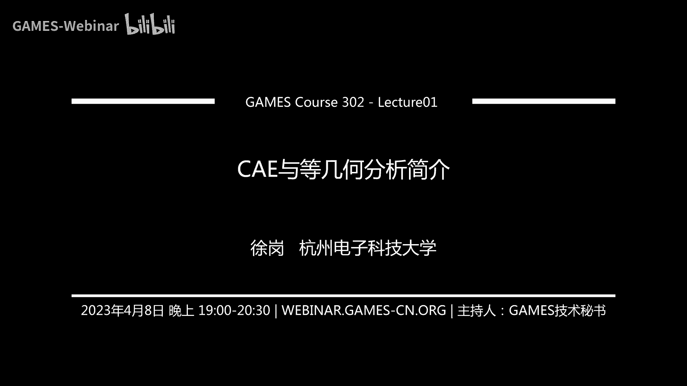

我们正式开始啊，首先感谢各位老师，同学们来参加我们整体的分析这个线上课程，这个属于我们的线上课程叫做games 302，也非常感谢我们games平台啊，给我们这么一个机会来介绍呃。

等几何分析相关的一些知识，应该来说等几个分析，从2005年由美国三院士，他们秀士教授提出来之后，目前无论是国外还是国内，实际上还是非常缺少这么一个等级和分析的，一个非常系统的完整的成体系的这么一个教程。

虽然这个国外一些这个网站上也有一些，或多或少的一些资源，但我想的还是不能满足，我们这个特别从这个低年级的同学的一些，学习的一些要求，所以当时呃刘玉刚老师打电话给我啊，那我就非常快的就答应。

我觉得这个无论是对我们登记和社区来讲，还是我们c e社区，包括工业软件的社区来讲，都是一个非常好的一个事情，我们这个等级和呃这么一个课程，我想它的意义啊，就是我觉得不仅仅是让我们这个各位同学啊。

能够深入了解这个等级，和分析它背后的一些知识点对吧，包括他的一些理论基础，计算方法，应用前景，那么我想呢可能还会有一些附属的一些产品，包括像我们这么希望呢，我们经过这14次课的这么一个讲解啊。

最后能够形成一套完整的一种现象的视频课程，然后呢我们还基于我们课题组的这个i game平台，就是说希望大家能够在这igame平台上，能够发挥自己的聪明才智，贡献自己的这个代码能力。

然后呢最后形成我们一个关于ig a的啊，等几何的一个非常好的一个开源的一个平台，那么有了基于这么一个平台啊，当然我们可能会对这个平台，我们也有一些助教，会对这个平台做一定的整理啊之类的啊。

那么我们希望最后能够是一个非常好的一个，系统性的这么一个开源的一个ig的平台，当然我们这个这个开源平台，应该会在下周六之前，应该就会给大家在github上开放，也欢迎到时候同学们提出一。

些宝贵的意见和建议，让我们这个平台呢能够更加完善，也是我们也希望能够举全国之治啊，能够为我们这个等你和开源软件平台呢，大家都来贡献一份力量，那么最后呢，我想呢也是希望能够形成我们一个i j的一个。

非常好的一个书面的一个教材的一个，主要主骨干的一个内容，我们希望通过这么一个东西啊，能够为我们的这个相应的啊，这个i j的社区呢贡献这么一个，书面的一个教程，这也是我们后面的一个打算啊。

你看我想从我们这次课能够啊，能够呢呃有这么些附属的一些成功，那么我们今天的第一次课，我想呢还是给大家介绍一下，我们整个等你的分析，作为一种数值计算或者计算领力学领域的，一个非常重要的一个方法啊。

目前来看已经是一个非常重要的一个研究方向，他的呃背后的一些背景知识，包括他和c之间的关系是那么c啊，谈到c e呢，我们也不能不谈前面的整个的这个c d c e，包括一些结构优化啊。

我想到这些方面的一些背景的一些知识，一些基本的概念呢，我们还是需要进行介绍，需要进行介绍啊，然后呢给大家简单的介绍一下等级和分析，它的一些基本思想，然后包括我们一些课程的一些讲究。

这是我这次课的啊一个主要的一个提纲，也就是说呢，首先呢给大家介绍这个产品数字化设计，仿真优化，全流程，全流程的这么一个全周期的啊，它的一个各个阶段的一些基本概念的一个介绍，那么分别对应于啊。

我们就说数字化设计，就是我们的cad数字化仿真cae，那么结构优化这部分，那么第二部分呢会给大家介绍等几个分析，他提出的这个背景，它的基本思想，包括它的这个典型的这个应用。

最后呢介绍一下我们整个课程的这个安排啊，安排情况，首先介绍一下这个产品数字化设计的呃，这个cad的这个阶段，那么实际上大家都知道整个的这个产品，可能有些同学都比较了解，那我这边呢。

呃实际上就列出了这么一个整个的一个流程，我们整个的产品数字化设计，产品数字化设计实际上只经过了这么几个阶段，第一个就是属于这个几何建模对吧，也就是说我们的cad软件，来对你想要设计的这个产品。

来进行一个几何外形上的建模，那么像我们在这个c基地里面，我们也要把它叫做几何造型，那么实际上这个里面用到了一些基础的理论，就是我们的必要条对吧，包括其他的各种各样的样条理论。

以及最后形成了我们最后的这个，nb的这个标准对吧，nb的标准，那么经过这么一个cad的建模，实际上就能够大致的啊，能够把这个设计者他想要设计一个什么模型呢，把它这个就可以建模出来。

当然这个里面会涉及到各种各样的，复杂的一些运算，比如我们cad中面临的非常平静化的一个问题，就是求教的问题对吧，也就是我们这个呃曲线和曲面之间的求交，曲面和曲面中的求交。

所以说这个里面的一些拓扑优化的啊，就是里面的一些布尔操作的一些问题，那么我们这个造型啊造出来之后，它是不是就真的满足我们后面的实际的应用啊，这个里面实际上就是说还是存在疑问的对吧，那么实际上这个里面呢。

就是需要用我们的这个下一步来通过物理仿真，来进行仿真验证测试啊，看一下你设计出来这个外形，是不是满足我们后面的一些真正的这个，物理场景里面的这个性能的要求，那么这个里面呢就是我们要进行物理仿真是吧。

那么这个里面所对应的软件呢，就是我们啊非常重要的cae软件，那上生意软件它非常重要的一个地方呢，就是常用的方法就是有限元方法，那么有限元方法，有限元方法它实际上啊非常重要的。

就是需要把前面的这个用cd软件，通过样条表示形式表述了这些光滑的曲面，需要把它离散化离拆成小单元对吧，因为我们有限元呢，这个圆实际上就是指单元的这个意思对吧，那么这些小的单元呢需要进行划分。

这也就是实际上对应于我们周围的网格，生成的这个过程，网格生成的过程，那么通过物理仿真，通过物理仿真啊，是不是就是就ok了，实际上就是说可能在这个里面，可能在这个里面还会出现呃一些呃。

不符合我们这么一个条件的啊，这么一些物理性对吧，也就是说我们需要对我们前面的这个，几何建模啊进行一些修改优化，那么这个呢就涉及到所谓的这个top优化诶，我这边好像出现了异常，啊没问题啊。

那么实际上就是说通过这个物理仿真，我们实际上就是想看一看对吧，是不是满足我们这个呃，真正实际场景中的这个需求对吧，如果他不满足，所以我们要进行下一步就是这个结构优化，结构优化，或者说我没希望啊。

在你初始的这个设计上进行进一步的优化，让它能够在性能上达到更好啊，那就是我们后面的这个结构优化的问题，这个里面会包括大概三种优化，就是我们所谓的尺寸优化，形状优化和拓扑优化，那么这个里面的时候。

对应的就是我们的一些优化软件，优化软件，那么通过这些优化软件，实际上我们就可以得到一个呃形状最优对吧，尺寸最优，拓扑最优啊，也就是说材料最优的这么一个优化软件啊，这么一个优化的一个结果。

那我们把这些结果呢再去做啊，这个一些制造把它给造出来，那么这个里面就包括这个剪裁和真诚是吧，特别是我们随着这个3d打印，实际上他的是非常强大的，实际就是可以把我们原来没有办法造出来的。

特别是拓扑优化的一些结果，我现在就可以通过3d打印对吧，把它给造出来，他这个里面我会涉及到非常一些，高端的一些技术，也是我们国内也有很多老师啊来研究这一块，比如像数控和3d打印这方面。

那么实际上这个里面都是这些技术，都是属于我们cm cm软件的一个，非常重要的组成部分，那么实际上这就是我们整个的数字化产品设计，仿真优化，制造了一个全流程啊，这么一个制造全流程。

也就是实际上在这个里面大家可以看到啊，这个里面我在几何阶阶段，我用的是样条对，是那种有精确的数学表达式，大家都知道这个呃它是有参数形式的表达，那么在物理仿真阶段，我用的是c e软件有限元分析啊。

我需要把它离散成单元，就说它是一种近视的离散化的一个表示，那么结构优化呢，我就是在这个有呃，实际是在网格的这个基础上来，传统意义上来讲啊，我是在这个网格系窗来进行结构优化。

实际上这个里面我最后得到的还是一些，离散的一些表示，也就是说在整个的这个流程里面，实际上啊，实际上呃他的这个数据表示的这方面啊，这个阶段与他自己不同的这个表格形式上，这实际上是给我们整个的呃。

产品数字化设计仿真优化的这个全流程嗯，造成了非常大的这个挑战，非常大的挑战，这也是等级和当时提出来的，一个非常重要的一个原因，非常重要的一个原因，那么我们上也可以通过下面这个图呢，来进一步啊。

看一下里面的一些技术上的一些问题啊，也是这个里面我会涉及到一些，啊涉及到一些呃cad的，比如说cd的建模工具对吧，然后我需要把nervous的解析表示，把它进行离散化，然后形成这个网格生成工具啊。

通过网格生成工具，然后离散成网格得到啊，通过这个离散的网格对吧，我在上面进行一些呃p d e的求解，p d e的求解是吧，然后得到一些离散的一些数字解啊，数字解在这个离基于这个离散的数字解。

我可能需要通过一些设计优化的工具啊，来进行呃top优化或者形状优化对吧，那我最后得到的还是网格是吧，但是我希望我可能我是有时候，我是希望我优化的时候的结果需要cd表示的是。

这个时候我还要需要进行什么c a d重建对吧，然后呢得到这个以cd形式来表示的，这些结构优化的这些结果对吧，然后再把它输出出去，实际上这个里面啊，实际上这个里面也有大家可以看到啊，我既有解析解。

又有离散结对吧，而且在这个过程中啊，我最后你最后优化的结果，可能还要进行这个cd重建，然后才能够得，才能够得到我最终的这个最优的一个一个，cad建模的一个结果啊，比如说通过这个流程呢。

实际大家可以看到啊，我在这个目前呢在各个阶段，我使用的这个表示语言呢都是不一样，那么下面呢我们就在分别为各个，给大家介绍一下各个阶段，它的一些基本的一些概念，也就是说第一个就是呢就是这个cad。

那么什么是cad啊，什么是cad，实际上传统意义上有的在有些教科书里面啊，他是把这个d啊，那么前面这个c和a代的这些人，就是computer的对吧，就是让计算机来辅助是吧。

然后这个里面呢非常重要的这个d啊，一开始呢实际上是有这么两个版本，一个叫做drop d，这就是放样的意思，放样的意思，因为在最开始这个样条啊，比如说我们这个c g d啊，就是计算机辅助几何设计g啊。

就是gemini计算机辅助几何设计里面，它实际上啊这个非常重要的概念叫做放样啊，特别比如说像一些造船啊，一些这个企业里面，他们就叫做放样啊，也就是说实际上我就是说通过一些这种线条啊，形式来进行放样啊。

那么有的时候实际上就是，大家也可以这样来理解啊，但是目前来看就是说这个c说到cad还是这个d，应该代表这个design的这个意思啊，那么实际上是在1984年，1984年，这个gra和simon。

他们这就给出了一个cad的一个定义，那么他就是认为啊这个cad啊，它实际上就是说，怎么利用我们计算机的这些操作系统，然后去辅助的这个用户去进行这个设计的创造，修改分析和优化。

也就是说实际上在他们的概念里面，这个cad啊，这里的c a d，实际上就是可能到我们这个后面的这个c e i，仿真的流程，分析的流程和优化的流程都概括起来是吧，有时候实在他们的概率片里面。

实际上我优化也是一种设计啊，实际上这个也是有一定道理对，那么实际上对于这个cad啊，我或者从软件和技术上来讲，我们都可以把它可以分为二维，2。22为半对吧，还有三维，那么商这个所谓的二维和三维。

大家都非常容易理解对吧，二维商就是一些二维图纸，二维图纸或者一些二维的一些平面的一些造型，那么二维半啊，实际上就是可以看作，是介于二维和三维之间的啊，也就是说我比如说我是一些物体啊，啊很多时候啊。

我都可以把它理解成是通过二维的一个，造型的结果，通过一定方向的，比如少略或者其他一些操作得到的，那么这种情况下，我们一般把它称为是2。5倍是吧，或者二维半的问题，那么这个cad的基本的技术，这个里面。

其实非常重要的，大概有这么一个三点，是在1991年的，他这个总结出来的三个东西，那么山这个地方就是图形学啊，这个伤害是非常重要的啊，因为你没有图形学就没有显示，没有显示，实际上你整个的呃。

这个辅助设计也就无从谈起了，所以图形学应该对cad的发展，起了非常重要的推动作用啊，特重要的推动作用，另外一个呢就是我们的这些设计的工具啊，认识分析规则还是一些编码等等，另外一个呢就是我们的样条。

也是我们几何建模啊，几何建模啊，也就是说这个，通过这些样条的数学的理论，实际上是为我们cad建立了一个非常重要的，数学和几何的这个基础，那么这边呢就是一些例子啊，就比如说大家看到这个左边这个图对吧。

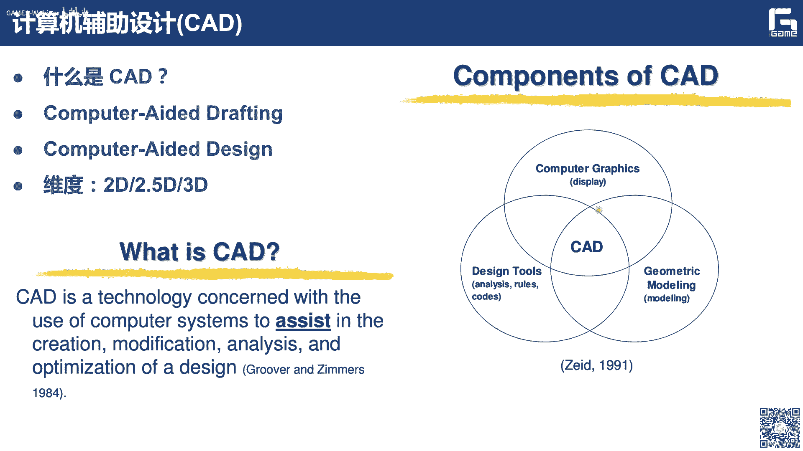

我觉得这个图非常有意思，我这边首先声明我这边的ppt的一些图啊，可能是借鉴了就网上的一些图片啊，包括一些电子书啊或者之类的啊，还有一些网上的一些资源啊，那么这边如果有些地方没有注明啊，还请大家谅解。

那么山这边的这么一个左边这个图，我觉得是非常直观的，实际上它这个呢实际上就是对吧，大家可以看到它具有这种二维的，这种齿轮结构的设计的一个呃平面的图纸啊，然后呢实际又是我们可以看到它三维的这。

那么你这个三维的样子，双子你可以把它理解成是一个真实的齿轮是吧，也可以把它理解成，上次就是在我们这个cd系统里面，在我们cad系统里面，它显示的这个三维的这个样子，那么实际上来说大家也可以看到啊。

从二维上啊来说，他应该还是很难去直观的想象，它整体的结构对吧，但是我通过这种三维的爆炸图，就可以非常清楚直观的去理解啊，它的整个的这个设计的组成对吧，然后对它进行编辑修改的也是非常秀，非常方便。

那右边呢，当然这个呢就是一个呃类似于一种汽车的，那么这边呢是另外的一些地方，就是现在实际上是无论华为还是中心是吧。

他们上次在这个芯片方面遇到了很大的困难，遇到很宽，其实啊呃在很早以前啊，在他们这个电子行业，芯片行业啊，就有一些一个词也叫cad啊，也叫计算机辅助设计改造，计算机辅助设计，我记得我们航电以前啊。

就专门有一个就叫做cad锁啊，但这个锁呢它是在然后是在电子系那边的，电子学院那边的，也就是说呢实际上啊就这个cd啊，这个计算机辅助设计在电子这个芯片那边，他们是老早就用起来了，这么一个这个词。

那么像是对于他们来讲，他们这个设计啊可能不是呃像汽车一样，只是简单的外形的设计，而是整个的这个这些pcb板的对吧，这个线路板的，他们这个一个整体的布局布线的设计啊，这些呢实际上就是对应于我们的一个。

现在也是非常重要的一个软件，叫做eta软件，异地利人也是目前非常卡，不是一个地方是吧，那么30e d a呢，它实际上就是电子设计的一个自动化软件，自动化软件软件，所以呢我想着这个c d和e d a。

实际上在某种意义上也是相通的啊，也是相通的，那么cd的这个理论基础是什么啊，cd的理论基础是什么，然后他的这个理论基础就是样品。

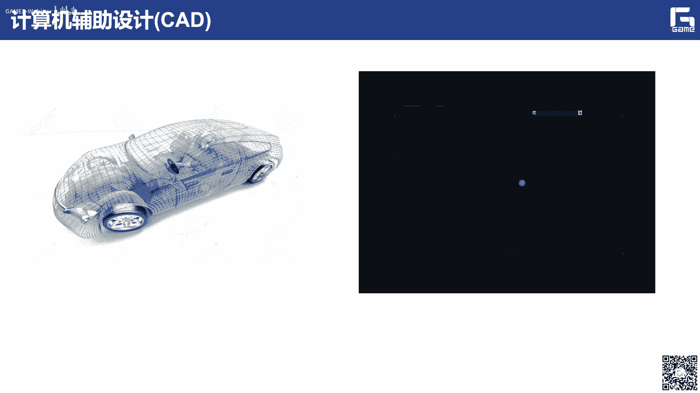

就是样品，那么样条再往前追溯啊，它实际上就是一个参数表达对吧，参数表的形式，也就是说呢大家在这个高中的时候都学过啊，实际上我这个参数曲线比如一个圆对吧，我就可以把它表达成它的xy坐标。

都表示关于一个c它的一个参数x，比如cos in c的y等于sin c的，这是一个圆的参数表示，那么实际上就是说对于任意一个呃，自由曲面或者自由曲线来讲啊，我对这个曲线上每一个点我都可以用啊。

把他的这个xy坐标，都表示成关于右侧位的形式，那么实际上这个表层右和位之后，他怎么来表示呢，啊，这边呢，无外乎我们这边是采用了一种特殊的参数，标准形式，叫做控制顶点控制网格的这种结构是。

那么这种参数表示形式它来源于什么啊，最开始的基础是北约是吧，就是这个波伊斯坦基，巴基斯坦基12是巴基斯坦提出来的对吧，没想到过了将近100年之后被北约啊，这个教授啊，然后用来作为我们这个生意积累。

非常重要的一个理论的基础，理论的一个基础，也就是说通过这种北人变样条啊，然后最后推广到这个nervous，这种有力的表达啊，我们就可以建立一整套的计算机辅助几何设计，也就是这种自由曲线。

曲面造型的一套的理论基础是吧，就是以这种控制顶点作为一种工具的，一种造型的一个工具，也就是说啊，你要对这个曲面来进行造型编辑修改的话，你只要去移动这些绿色的红色的这些小球，比如说我们这个控制顶点对吧。

这边应该是一个双三次的啊，一张北的曲面，那么通过移动修改这么16个控制顶点啊，那么我就可以进行呃对这张曲面的一个修改，那么这是非常重要的，cd的这个理论的数学的一个基础，那么有了这个基础。

实际上我就可以利用控制网格，控制顶点这一套啊东西啊，来进行各种复杂自由曲面的这个建模啊，那么这是我们大致介绍，让大家了解一下这个cad啊，因为我们这边可能有些同学呃，是低年级的同学啊。

如果有高年级的同学或者研究生呢，我想应该如果学过相关的过程，应该比较熟悉的啊，大家可以呃跳过，那么下面呢实际上就是介绍一下这个，什么是c e c e我前面讲了这个啊cad啊，我你设计出来。

比如刚才的这个无论是这个船的模型啊对吧，还是下面这个类似于70的模型啊，它实际上应该和我们想象中的这种，船的模型和车的模型，或者实际中实际工程在用的模型，是完全不一样的对吧。

那么为什么我就我们最后造出来的船造了，其实是现在这个样子啊，实际上这个里面它是进行了，进行了大量的仿真优化啊，也就是说就是我们下一个阶段就是c一的阶段，那么这个c e这个e代表什么意思呢。

就是engineering，实际上就是我们计算机叫做计算机辅助工程，那么这个乍一看好像给我们，啊给我们这个仿真好像没什么关系啊，实际上我觉得我觉得呢这个c e啊，他应该是一个更广义的一个东西。

更广义的东西，那么这个c一的定义啊，实在1999年的时候啊，这个韩国这个韩国韩国教授，这个李坤厚啊，是我们cad领域非常著名的一位教授啊，他已经他应该是担任了很长时间了，我们这个cd杂志。

应该是我们cd领域最好的一个期刊了对吧，cd杂志的主编，但我记得2006年我们在呃呃杭州啊，举办了这个第一届还是第二届的，这个中日韩的这个会议的时候，当时这个呃李教授也是来到杭州了，来了。

当时我们这个是，我们我所在的那个博士生的课题组，就浙大的c a基地，这课题组举办了这么一个会，当时我是怕他从这个酒店接到这个会场，因为他当时是cad的主编，我就跟他说这个cad杂志呃。

是我们这个非常向往的对吧，就是大家都觉得，这上面的指纹上的质量还是非常非常好的，这个边界非常复杂，然后这个领域他是非常儒雅的一个人，他说的这是我的工作啊，我觉得很多的学者啊，实际上就是对于这种。

因为这也是一些学术的兼职上没有任何报酬，然然而弹呢，还是本着一种非常负责的态度来回答这个问题，我觉得很多方面都是值得我们学习的，那么要说他在199年给出当中的一个定义啊，就是呃来分析了这个cd几何啊。

就是说这个c e，他应该也是我们计算机这个系统对吧，来去分析你所建模出来这个cd几何，能够能够让这些呃用户去仿真，并且呢去研究啊，这你说当前的这个产品，它如果在真的在用起来。

它整个的行为呃性能是怎么样的对吧，然后呢，我怎么样去对你初始的这个设计进行验证啊，进行呃这个优化是吧，这实际上就是我们这个呃，c e它的一个基本一个出发点，也就是说c呢，就是需要在这个产品的研发过程中。

需要利用计算机进行这种建模啊，及性能的这个仿真的分析，那么这个性能仿真的这个内容呢，大家涉及到我们这个产品啊，一个是产品对吧，也可能是各个系统的他的这个力学性能是吧，包括你的各种的形变啊，弹性形变。

塑性形变啊，它包括它的一些这个应力啊，还有他的一些热血的一些性能，它的热传导的一些性能对吧啊流动的一些性能，包括一些升学的对吧，一些噪声的控制啊，还有他本身的一些躁动的特性的一些性等等啊。

实际上都是属于我们这个c e这么一个，这么一个范畴，那么实际上是它的一个主要的主要的一个作用，我想就是它可以替代大多数啊昂贵，而face这种物理降解的实验，也就是我们以前呢，如果没有这么一个c软件对吧。

没有我们计算机来进行辅助仿真的话，你就需要啊做大量的这个物理法，物物理的样机的这个实验是吧，比如华为我跟他们也交流过上，他们说一呃，还是有的时候真的要是去虽然很多的手机，然后去看一下我当前的这个设计。

o不ok啊，但实际上这样的话这个成本还是非常大的，那我们也现在有了数字化营养机啊，有了c e软件，那么就可以取代这种传统的物理样机的时间，当然他肯定是一个多学科的对吧，而且是对我们这个力学方面的知识的。

要求的是非常多，非常这个，重要啊，那么比如说像这个计算力学，固体力学，流体力学，生物力学和断裂力学等等，现在是卡了吗，那我可能要要要换一下信号，现在怎么样，现在怎么样。

大家可以看到吗，大家可以看到吗，不好意思啊，就这个，我这边的网络好像是有点问题，是不，大家可以听到吗，好的啊，有有同学说可以可以听到是吧好，那我就开始了，继续，实在不好意思啊。

我们讲到刚才讲的这个c e就卡掉了，看来这个是c e对这个流量这个计算的资源，特特别还是需求比较大的，那么也就是说为什么为我们刚才讲到了，这个为什么要用要用这个c e啊，为什么要用c e啊。

那么实际上我们这个播音这个，比如这边我举这几个例子啊，比如说在这个波音777的研发过程中，我们采用这个c e的数字化样机技术啊，实际上是节省了这个大量的这个物理的样机的，试飞的次数。

那么仅一次试飞啊就获得成功啊，然后呢你如果用这个物理样机实验的话，每次这个物理样机的这个实验呢，需要花费1亿美元啊，需要花费每1亿美元啊，有些图有的同学说可以了，那我就继续讲啊，如果没有同学的。

所以呢大家可以刷新一下看一下啊，那么比如说在这个汽车工业啊，汽车领域里面，我们把这个cae软件啊，用到这个汽车的这个呃测试啊，仿真里面呢，我们可以让这个新车啊这个开发周期啊，有原来的5~66年啊。

5~6年啊，缩减到现在的这个1~2年啊，缩小了1~2年，那么美国这个拉萨的这个喷气推进实验室啊，我们这种c e技术啊，啊成功的实现了这个火星探测器容器号，机遇号在红星的这个软着陆的仿真分析啊。

那么12就是说呃因为在火星上嘛是吧，你去对它进行修改啊什么的，也是非常不方便的对吧，嗯实际上就是说呃仿真结果呢，他实际上预测到了就是如意，由于这个呃他们这个上火星上面这个风啊，他们之间的这个作用啊。

然后呢是这个翻滚的可能性啊，呃这个进行得到了这个避免啊，改进的技术方案，从而保证了最后的这个登录的这个成功，就是说可以大家可以看到啊，我通过这种数字化，通过这种数字化啊。

特别是这种呃仿真的这个数字化对吧，实际上我就可以节省大量的这个物理成本，所以我觉得现在都在提出的经济啊对吧，商业，也就是说我们已经从原来开始的这种产品设计，建模造型的这种呃数字化啊。

已经啊已经呃转到对我们这个数字化政府对吧，啊特别在浙江在在推动这个数字化改革，我觉得实际上这方面呢也是可以呃，节省大量的人力和物力是吧，实际也就是说我们的数字化上，一开始我们上次在这个呃工业软件。

也就是说在我们的这个数字化产品设计里面呢，已经老早就用起来了啊，那么像我们怎么样，在这个真正的我们这个人的实际生活，就是社会呃层面对吧，社会层面去实现完全的这个数字化呢，也是有非常重要的意义。

所以呢大家是应该是啊非常容易理解的对吧，那么实际上就是说这个c e的范围啊，c e范围，实际上我们就是有这种呃传统的这种显示的，这种动力学的分析啊，实际上在我们这个pro e里面呢。

实际上这个方面呢是比较好的，那比如说像其他的ss啊，卡提亚拉斯啊，这个里面这是主要主流的，就是这个像这个有限元对吧，它实际上在这种固体力学的分析方面呢，做的比较好，还有一些这个热传导问题。

另外一个呢就是cf里，也就是我们这个计算流体力学，计算流体力学啊，上次他们在这种流体仿真理方面呢，呃也是有非常大的这个应用的一些前景啊，这些代表性的软件，就像这个flint。

还有这个phoenix c f s等，那么这边呢我还给出了一些例子啊，这边比如说这边就是一些v4 的六缸发动机，爆发了这个压力的分析，还有这种整车碰撞的这种模拟仿真模拟等等。

这边呢是一个c e的一些典型的应用啊，就是说比如说飞行过程，它的表面的压力的分布。

包括这个飞机的他的隐身的特性的分析，包括一些垂直起降，飞行器的流畅的流程的分析等等，我现在呢都是可以，通过我们c的这个技术来进行仿真，包括一些其他的非常有意思的，像这种大型的建筑结构的强度的校核。

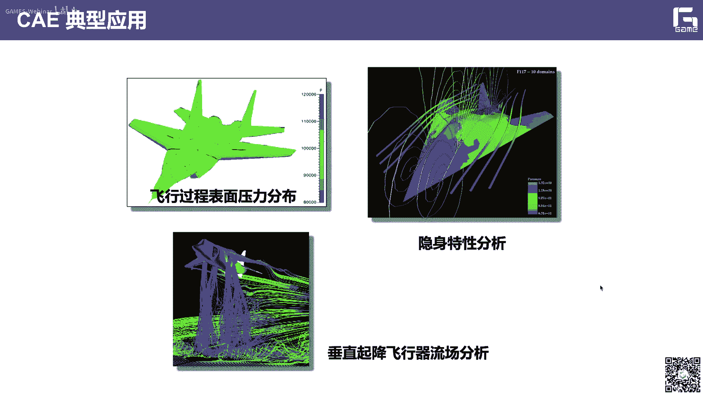

比如像我们一些呃这个桥梁的，他的一些这种振动的，一些性能的这个仿真分析啊，实际上是对我们这种数字孪生啊，目前比较火的一个概念对吧，也是非常重要的一个呃一个技术，也就是说在数很多的这个数字。

孪生的这个场景里面，我们facebook会涉及到大量的计算力学等等，里面的一些一些技术，然后里面的核心呢就是我们的c1 ，包括一些芯片的一些散热的这个性能啊，还有像这个鱼啊，游动的一些特性的分析等等啊。

那么实际上这些都是可以看到我们这个c e1 ，些典型的应用，这边因为时间关系我就不介绍不介绍。

那么实际上是我们c e领域啊，c e或者c e啊解决问题的一个一般的过程啊，啊可以啊分为这么几个，第一个就是物理模型啊，然后呢，从这个物理模型怎么转换成相应的数学模型上，这就是一个呃，大家呃。

可能大部分同学都参加过这个，数学建模竞赛对吧，就是一个数学建模的一个过程，然后我怎么样把这个数学模型对吧，把它转换成一些数值模型啊，数值模型啊，然后通过数值计算得到相应的结果，实际上这个里面啊。

这是整个上面的一个，就是我们整个的一个流程对吧，那么实际上后下面的，就是一些用到的一些关键的技术啊，比如说像这个前处理的工具，数字求解的工具和后处理的工具等等啊，那么上这个里面就相对于我们的网格建模。

网格生成对吧，还有就有相应的数字的计算啊，包括后处理就是相当于我的一些可视化，还有误差的分析等等，那么下面详细解一下，像这个物理模型啊，啊我们在建立物理模型生活，就是。

怎么样把这种自然和工程设计中的各种问题啊，比如像这种cfd啊这些问题啊，还有载荷的这种结构的问题啊，还有这种动力学响应的问题啊，我怎么样把他的物理模型给建筑，然后我通过这些物理模型。

下一步又叫建建数据模型对吧，比如说我怎么样把这种呃物理模型，把它的可以描述这些物理模型的数学表达式，比如像这个流动方程啊，挨着方程啊啊这个结构受力的平衡方程啊，便于协调的方程啊，能够把它给抽象出来啊。

要说这个里面实际上说呃，就会涉及到各种简化对吧，各种简化就是我在各种假设下，我怎么进行简化，然后得到相应的这个呃一些数学和物理方程的，所以大家呃如果是数学系的同学都学过，有门课就叫做数学物理方程对吧。

也就是说数学和物理很多时候都是呃不分家的，对吧，不分家的，那么有了这个数学模型啊，也就是说通过啊对物理模型简化所得到的数据，目下面我就可以得到相应的这个数值模型对吧。

也是我们把不便于分析求解的这些数据模型，把它转换成电力求解的计算模型啊，也就是说我怎么样把偏微分占住，一些常用的一些数学的一些技巧了对吧，转换成常微分，或者我一般解非线性问题，我都要通过迭代。

然后每一步都是一个线性问题等等啊，这就是一些数值模型对吧，那你在搞好这个数字模型之后，后面就是一数值计算的问题，数值计算的问题，比如说包括这种大型的呃方程组的这种求解。

包括各种各样的这个矩阵的分解的方法对吧，还有一些常规方程的解法，这种非线性方程的这个迭代的解法等等，那么实际上最后呢，就是我怎么样把你数字计算的结果，能够进行校核，并且运用到这个物理问题的面对吧。

一般来说我最后得到的这么一个计算的结果，无论是它的误差等等也好啊，12是和我真实的物理实验肯定是有差距的，对吧，那么这个时候我怎样通过这种呃，cee仿真的结果，能够对你的实际的工程里面的问题来进行指导。

来进行解释，或者来进行后面为提供了后面的优化，来提供这么一个参考啊，也是非常重要的一个过程，我们刚才讲的，实际上就是说生意里面会会涉及到，会涉及到很多的技术，会涉及到很多的这个技术啊。

相对于三个不同的阶段对吧，前处理工具实际上就是网格生成这个工具，可能目前的这个cae前处理工艺可能都不信任，仅限于网格生成，还包括我的c d的各种章几何的处理，因为我们前面用cad软件。

你建模出来的这个这个cad呃，这个表示啊可能会有大量的裁剪曲面，各种各样的呃狭缝对吧，各种各样的这种自交，没有裁剪好的，还有各种各样的交错啊，这个各种都可以啊，实际上是反而这个方面呢也是非常复杂。

非常困难的一个问题啊，这也是检验我们国产cad软件啊，一个非常重要的一个一个标准，就说你能不能对这些cad几何处理的好，因为处理好这些章几何，这些不好的几何是我我后面的这个网格生成。

也是非常重要的一个前提和基础，那么这是前处理工具是吧，比如说目前应该来看，这个前处理应该是一个更加广义的一个东西，那么当然后面呢，我会涉及到这个数字求解器是吧，也是我怎么样对你建立的这个数字模型。

进行求解，那我们又要传经典的有限元的方法，有限体积的方法，有些拆分的方法，包括现在我们这次要讲的等级和分析的方法，应该都属于我们数字求解的这么一个过程，让另外后面呢我们还有后处理的工具对吧。

比如说像这些科学计算可视化啊，也就说我怎么样把c仿真的数据来进行，可视化出来呃，然后更加直观对吧，并且呢从这个可视化的结果里面，我能够得到一些他的呃，发现里面的一些规律对吧，然后呢容易我知道啊。

后面的一些优化，包括一些误差的分析啊，我想的也可以，都是属于后处理这部分的，那么实际上就是说网格生成啊，网格生成实际上是对呃，复杂c e的计算的成败呢是非常重要的，也是一个网格的好坏呢。

它可以决定这个计算的精度效率乃至成败对吧，实际上是这个在整个分析过程呢，大概是80%左右，目前的网格生成，也是一个非常重要的一个领域啊，然后我们无论是国内外，都有很多学者去研究相应的这个各种鲁棒的啊。

高质量的网格生成的方法，我们有专门的这个网络会议啊，第一次全国网格生存会议是在2021年啊，在杭州啊，有没有浙大和我们航电共同举办的，那么今年呢会在这个7月中旬，在大连理工大学举办啊，网络生动会。

也欢迎各位感兴趣的老师的同学参加，那么像网站生成的话，对于这个c f d里面它也是非常重要的啊，因为这个里面它会让涉及到大量的这种，众多的这种呃几乎众多的这个模型啊，而且呢特别是像这个e d a里面啊。

就是我们这个电磁结构啊，手机的这种芯片里面，它的这个尺寸宽度呢是非常大的啊，它会涉及到，比如像刚才演示的这个一些动网格的，一些问题啊等等，那么像生意方法这一块呢，我想就说可以分为这么几个方法。

比如像有限元啊，应该是我们c e最最经典，最最重要的一个方法啊，他上是求解的问题呢，呃范围是比较广的，也是商用的这个技术呢也最成熟的，在很多的这个商业软件里面呢啊都包括进去了，像s啊等等。

那么还有另外呢就是像这个有限差分法，因为他是原差分码的，上次比有限元要早得多了对吧，因为他实际上就是把我怎么样啊，我在求解一个p d d p d e的时候，我怎么样对这这个呃离散化对吧。

所以呢它一般来使用这个结构化网格，结构化网格，那么实际上呃这个方面呢，它的建模计算更加简单，但但是呢他更适用于一些形状比较简单的，一些问题啊，那么特别是一些流动性的一些问题。

但是很多商业软件里面集成的就比较少，那有限体积法，就是在cfd里面是用的是比较多的啊。

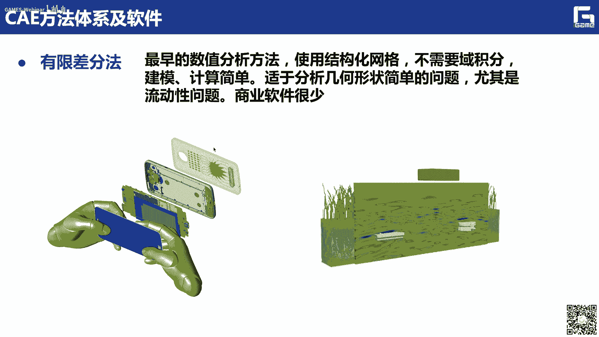

那么实际上是被大多数的这个呃流体，cfd的这个软件呢，所采用的这种有限体积的方法，当然我们这边呢也不是属于我们一个，主要建设的一个范畴，大家知道就可以，还有一个呢就是边界元法啊。

但是边界元法呢发了很多论文啊。

但是真正的能够作为商用的还是比较少啊，他就说他基本思想呢，就是我仅仅在这个边界上来划分网格，然后通过一些呃边界积分对吧，呃来进行纠结，但他还也会涉及到一些问题啊。

就是一些边界上的一些其余积分的一些问题啊，当然它比较适用于这种声学问题啊，还有这种波的传播的这些问题等等，那么在这个科学计算可视化方面呢，就是我们后处理这个阶段呢，实际上就是说呃我们大概有这么几种类型。

三种类型对吧，一种是标量场，矢量和张量层这些cee仿真的工具啊，那么也就是说我们这个c e后处理的实际就是，怎么样借助我们图形学可视化，可视分析，数据挖掘人交互，还有这种多学科的交叉理论。

我们把这个cee仿真所产生这种多变量，多维度，多元多模态，这种物理场数据，你这种，图形图像的形式啊直观地展现出来，并且借助我们这种交互式的这个图形系统，从大量这个呃这个生科学试卷中。

提取出一些有价值的信息出来啊，这就是我们科学计算可视化需要解决的，那么这是刚才讲的cad和cae啊，啊我们这个时间过得很快，可能刚刚才这个耽误了一点时间，我们可以适当延长个十分钟左右啊。

那么下面呢介绍一下这个优化这部分啊，然后我们这个优化呢主要介绍就是结构优化，结构优化，像这个里面主要涉及到三种优化啊，就是尺寸优化，形状优化和拓扑优化啊，那么尺寸优化。

实际上就是说应该是最下面这个图对吧啊，应该是最下面这个啊，也就是说我这边呢三就是我说的尺寸呢，就是比如说像这个呃它的一些粗细对吧啊等等，我来寻找这种最优的设计参数的组合啊，还有一些厚度啊。

参数这个材料啊，还有尺寸啊这些优参数来进行优化啊，嗯也就是我刚才说了，这个仿真不是目的对吧，我们目的就是为了去优化，你最初的这个cad设计啊，比如这边呢我就会涉及到这么一个尺寸形状。

那么形状优化呢就是对你现有的这个设计，现有的数模的形状来进行一个优化啊，那么它让适用于这种详细设计的阶段啊，比如像这个例子呢，就是用我们这个等几何的技术来进行，优化出来的结果啊，就大家都知道这个呃。

一个扳手的一个最优的形状，我们用大家平常用的都是这种形状对吧，但是他为什么会是这种形状呢，啊为什么会有这种会这种形状呢，那么实际上我们就可以让电脑来帮我们来算，对吧啊，比如说我有初始的一个设计。

我有个初始设计啊，然后我通过一些施加一些载荷，施加一些边界条件，然后呢我进行仿真求解，然后进行这个形状优化，而且我们等几何的技术呢，可以直接在这些控制顶点上进行调整修改，进行优化。

然后就会得到我们最后的哎，这么一个优化的一个模型，就是大家可以发现这么一个扳手的模型，后面实际用的这个模型是非常非常接近的对吧，这就说明我们这个呃以前的这些老师傅啊，通过个人经验所设计出这么个扳手呢。

是符合我们这个物理性能的要求，也是非常了不起对吧，所以说我们有了这么一个呃形状优化的啊，结构优化的这些技术啊，像我们就可以把这些技术啊，都可以封装在一个黑盒子里面是吧啊，实际上也就是说。

即使你没有一些老师傅的这些经验，你也可以借助我们这些软件啊，优化软件，然后可以得到一个最优的这个设计出来，那拓扑优化展最近也是比较火的，特别是我们打工的郭旭老师啊，在这方面做的非常开创性的一些工作。

那拓扑优化三，就是一种具有创新性的这个概念设计的技术，也就是说我怎么样啊，在满足你的物理性能的要求下，能够呃得到一些最好的一些材料的分布啊等等，从而达到轻量化啊这么一个目的，当时他和我们最近的这个这个。

这个3d打印基础是一个天然耦合的对吧，因为以前的这个剪裁制造。

主要是你是很难把这种复杂的这种拓扑结构，把它造出来的啊，但现在我们有了这种3d打印，特别是金属的3d打印啊，能够使自主补齐，对这种复杂的拓扑结构啊都可以造出来是吧，就说你以前很难想象。

我爸一定要这么一个类似于摩托车对吧，可以把它给提起来对吧，现在我通过这种轻量化的技术，轻量化技术，这样就可以把它给啊进行一个很好的一个，结构优化的一个结果，也就是说现在我们正常通常就是把它叫做这个。

创成式设计，传统式设计啊。

那么传统式设计呢，三就说也说我一招输入一些参数，这个我们这些算法就可以自动的进行调整判断，直接直接得到一些最优化的设计啊，这边就是用我们这种脱皮化，来得到一个桥梁的一个结果，还有其他的。

比如说西洋一些这种鞋垫对吧，还有其他的一些零件的一些结构，我都可以用拓扑优化来得到对吧，比如像一些已知的模型，也就说你很难想象，就说呃在满足这个力学性能下，他追求的结构是这个样子啊。

那么这看起来非常漂亮，就满足我力学性能，还节省材料对吧，也就是实际上是我们以前的这种传统老师，老司机，老师傅实际上也是哼哼，很难去想象啊，它的最大结构竟然是这样，也就是说它和我们身体打印对吧。

上次和就当是最后我们说啊，现在这个我们叫做仿生学，仿生学啊，也说上你在通过一些拓扑优化的一些结果啊，拓扑优化的一些结果啊，和我们比如这个骨头的里面的材料的分布，也是这个纹理是非常接近的啊。

也就说明实际上是这个自然界的优胜劣汰啊，也是满足了一些科学上，包括呃这种仿真啊，优化计算上的一些天然的一些要求，对啊，这也是非常有意思的一件事情，那么最后呢说一下这个软件对吧，工业软件也非常火。

然后像呃，最近每年我们都有这个科技部的重点研发，都有一个工业软件的一个专项是啊，12是我们前面讲了这个设计cad仿真，cae优化对吧，实际上这些软件或者工业软件基础软件，实际上是呃。

我们整个的这个智能制造产业的一个核心啊，也就是说呃现在商是因为这个国际形势对吧，当时这些软件呢是非常重要非常重要啊，也是国家也是越来越重视，也就是说，但是目前呢95%应该是依赖进口。

面临一些卡布这些威胁啊，而且呢核心技术不足，进行国产替代呢迫在眉睫，而且呢我们当然刚才也看到了啊，像这些设计仿真类的这些工业软件，或者这些技术，实际上它不仅不单单需要力学对吧，不单单需要计算机啊。

而且呢他应该是把我们这个计算机和力学呃，然后呃和物理对吧，和我们的这个数学啊，都是一个需要多学科的交叉的去进行支撑，那么c后处理软件，我们国外的这个呃这个非常多对吧，国外的这个非常多啊。

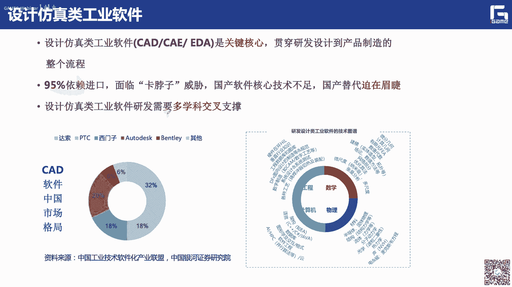

像这个paravue啊，像这个vt care，大家都应该都用过，但是我们目前应该来讲，这种我们国产的，自己能够可控的这种c e获取的软件平台啊，还是呃比较少还是比较少，而且目前的这个cae仿真的数据啊。

已经它的规模非常大，可以达到tb的量级，然后呢格式也非常多样，包括这种结构的流体的声学的啊，阿拉伯，而且呢这种实时的交互的体验的要求也更高啊，也更高，特别是目前我们无论是cad啊。

还是c e还是我们后厨人员，实际上是对这种云端化啊，原画也是非常呃重要的啊，也是非常重要的，也是大家目前非常关注的啊。

怎么样做这种啊，云化的，这种轻量化的后处理的技术也是非常重要，另外在这个优化方面啊，这种拓扑优化软件实际上是当前主流的，像比如说像这个era的啊，其他的也包括他的inspire对吧，那么像这个西门子啊。

好多desk assets啊，啊卡缇亚里面都都集成了一些拓扑优化，结构优化的一些技术，但是呢目前应该来说目前应该来说还是啊，我们这个自己自主可控的软件还是非常少啊，当然我们也是在这方面呢，来来呃。

这个呃多努力吧，然后这个里面会涉及到很多对吧，因为像特别化这些基本上都是服务于我们航空，航天的一些高端的一些应用，那么实际上是对这些功能的，它是严格禁运的，而且后面这个泄密的这个呃。

危险的也是比较比较大，那中间的比较大，那么也是存在这种卡脖子的反手，国家真的是越来越重视啊，我们从2017年确立的，要集中突破工业软件产品，然后到2020年啊，那么到2021年，阶段计划。

包括到现在啊也有不断的有些新的文件出来啊，新的文件出来，应该说我们工业软件呢啊非常重视，应该我说前途呢也是非常光明的，也就当然，我也这边也是希望我们这些年轻的同志们啊。

能够投身这个工业软件的这个大潮中去对吧，不要老是盯着这些互联网企业啊，然后能够有些情怀，为我们工业软件的突破呢贡献自己的一些力量，好前面讲了那么多啊，实际上就是怎么样，就是把我们的这个呃产整个的产品。

数字化设计与仿真优化的全流程，他的字里面设计的一些背景，一些概念对吧啊，包括一些潜在的一些应用的一些场景，给大家应该是做了一个综合性的啊，非常粗略的一个介绍啊，当然里面有些观点可能不大的。

还请大家多多指正，那么下面呢我再花一点时间来介绍一下这个呃，我们这个整体和分析，等你的分析啊，也是我们这次课啊的一个主题对吧嗯，比如说为什么为什么会啊，要提出等你的分析这么一个技术啊。

那么像我们前面讲到了啊，咱们可以再回到这个图啊，包括下面我们看一下这个图啊，这个图的标题叫做c e z e的语言鸿沟问题，对不对啊，那么这个语言鸿沟来自于哪里啊。

我们说cad我们建模是用nervous解析表示参数，表示亮点表示是吧，它是有严格的精确的数学表达式，是一个无限精确的对吧，是一个解析的表示啊，然后呢我要通过网格生成离散网格，也就是说无论你离散成网格。

然后来做有限元啊之类的，p d d的求解对吧，也就是说你无论怎么离散，你总是有误差的，对不对啊，而且在后面你要还需要进行后期的各种的这个，数据的交换啊等等啊，就在k前，我以一条光滑的曲线是吧。

那么无论你啊你算成100段还是1000段对吧，你或多或少肯定是有误差对吧，那只是大大小的问题，是大小的问题，那么桑杰说这个里面呢呃这个还好啊，误差很在这个里面会还会产生一种语言的鸿沟。

就是说我c1 d的语言是nbc语言，然后你c a e和优化的语言是网格语言，是离散化的语言，对吧啊，那么商业说大家在用各种软件的时候都知道啊，我cd我我可能是pro e是一种数据格式。

auto cad是一种数据格式对吧，3d max又是另外一种设置数据格式啊，pro e又是一种另外的数据数据格式，然后我这个转来转去的时候，里面会涉及到大量的数据格式的转换啊。

当然虚拟转换里面会不可避免的，出现一些误差啊，所以说我们也有一些公司去专门研究，我怎么去实现这些格式的转换啊，这也是一个非常重要的一个课题了，比如大家来看啊，比如大家来看啊。

一般呢我c e d输入的数据对吧，我们会不会给大家讲这个曲线曲面建模啊。

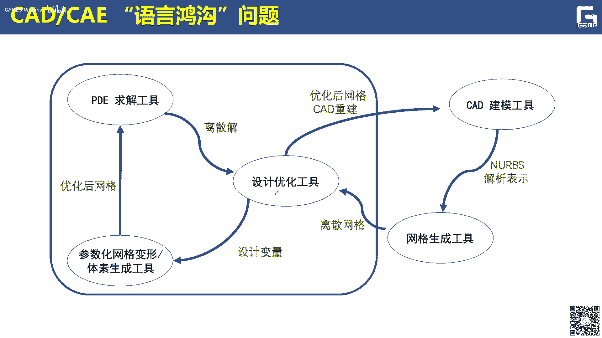

那么大家知道那边讲到那边就知道我这个呃，一般比如说它是一个变量条，那我又控制电缆的个数啊，有接触有节点限量的信息，有控制顶点的xyz坐标，这是我的cad的格式，是这样的对吧，而你通过这个cae仿真。

所输出到的这个物理场的格式是什么呢，那比如说一个off的格式，它可能就只有xy z坐标，然后每个网格顶点上对吧，它的x y z坐标，再加上他的第四维的这个分量，就是它的这个物理分量是吧，你求助的。

大家可以看到你的cad数据和c e的数据，它的格式是完全不一样的，是完全不一样啊，所以说这个里面呢会带来一些问题，就是我刚才讲的啊，你通过网格生成啊。

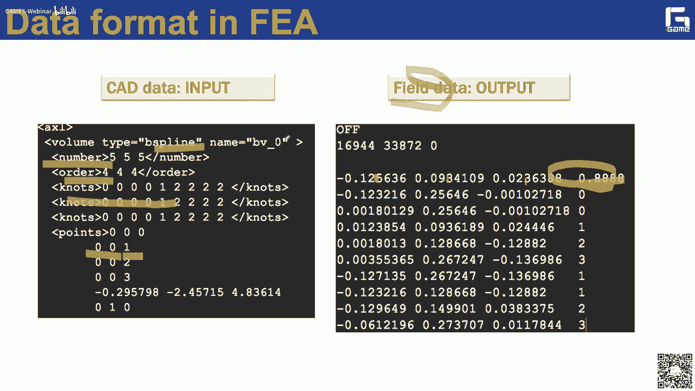

会带来误差对吧，而且这个误差你后面经过呃这个结构优化，会得到一个类似于如果是提速的方法呢，会会得到一个提速表示对吧，那你这个提速表示呢，你也不能直接把它导入cd系统，但需要进行cad的重建啊。

这个方面也需要一些工作去做，然后呢去得到相应的这个呃，就是你优化结果的cad表示啊，所以说这个里面会涉及到很多的，增加很多的工作量，增加很多的工作量，这是三的这个语言鸿沟问题，那么这个语言鸿沟啊。

一个是离散误差，实际上比如说对我们一些特殊的一些仿真问题，比如说像一些翘的问题对吧，翘反正问题啊上去说，虽然你这个误差很小啊，但是翘他对这种误差翘的仿真问题，对这种误差的这个敏感度是非常高的啊。

他会非常大的去影响啊，这些呃法院的这个精度，那么另外一个呢就是带来的效率问题啊，像我们前面讲过的啊，啊，无论是在这个我你如果是因为数据的并不一致，所以说你要进行网格的生成对吧。

在这个里面还要去进行前面那些前处理啊，特别什么几何的分解啊，几何的修复啊等等啊，包括一些网格的操作啊，这会带来很大的这个工作量，很大的工作量，另外一个效率还体现在什么呢，啊。

就是说比如说我这边来做一个空客的，a380 的，a380 的一个机翼前缘的一个优化，设计的一个结果啊，就是这个这个结果对吧啊，我需要得到这个结果啊，那么我需要进行啊这个设计域的网格划分啊。

然后进行拓扑优化，然后进行结果的提取，进行再进行这种诶边界的边界的处理，尺寸的优化等等啊，然后呃得到我最后的这个cad模型，这个优化结构的cad模型啊，实际上这个里面你会用到大量的啊，可能不止一个的哎。

商业软件这边的实际上就是中了三个对吧，按这个ob抓，还有这个hle match和卡迪亚，也就是说实际上呃，这个是对你这个我们这个工程师的工作，带来了很大的这个工作量，也就是说会也会引起这种呃效率的问题。

那么也有说实际上你说我怎么样去呃，弥补这种语言鸿沟对吧，就是我非常重要的一个需求啊，也是我怎么样去实现啊，几何建模，物理仿真结构优化的数据，表示的真正的一致性就成为大势所趋啊，大势所趋啊。

实际上这么一个需求啊，最终几何建模，物理仿真结构优化的数据表示一致性，这么一个需求，也曾经在一篇论文论文里面啊，被列为cad面临的十大挑战之一，然后我们中望对吧，我们cd里头企业提出了奥运y这个c x。

对于奥运one的一个概念，但是他们的概念上是，目前还不涉及到等级和技术，但我想啊，就是说他们也是呃也是有这个需求对吧，也说什么样真正解决这个c d c e的语言鸿，沟的这么一个难题啊，事实上是啊。

目前啊我们需要迫切解决了这么一个问题，那么为什么会为什么会出现这么一个问题啊，让我们也要去思考思考对吧，那么实际有限元是f1 ，实际上在上世纪40年代提出来的，而我们真正的样条北约这一套东西提出来。

是在七里面提出来的，也就上这么两个方向，它实际上是一开始是啊各自孤立发展是吧，也就是说做有限元的人可能对呃样条啊，计算几何啊，这些是不甚了解啊，那么研究计算机的人，可能对有限元呢也是不熟悉的。

也是不熟悉的，但后来我们这个时钟时钟池老师吧，应该是提出了样条研修仙缘的这么一个方法嗯，但是呃在他的这个方法里面啊，他还是就是说把原来的这个行函数，哪个档次基函数换成了什么样条函数。

换成的样条函数上是并没有完全解决，就是说几何建模，物理仿真结构优化的数据表示一致性的问题，比如说他那个样流有限元，本质上还是需要进行网格划分的对吧，还是需要进行这种离散的网格剖分的，然后等几何呢。

就是在这么一个形式之下被提出来的啊，比如说是在2005年由美国商人认识他们，修斯教授提出了二手脚没trignice，这么一个方法，把它翻译成啊，现在应该是国内比较认可的一个啊，翻译叫做等几个分析啊。

当然也有一些老师把它翻成了同几何分析啊，但意思是一样的啊，但好像目前这个用等几何啊的比较多比较多，那么它的基本思想是非常非常简单的啊，非常非常简单的，也就是说，既然你能用样条这么一个数学语言。

来描述你的几何的外形对吧，那么你能不能用样条语言，样条语言来描述物理场呢，嗯当然是可以的，对吧啊，无外乎对吧，我就是比如他这个标量场对吧，我就把那个控制顶点的那个啊x y z对吧，你再加一个w。

那么这个w这个分量啊，就是再加上这个呃这些样条基函数啊，加权求出来的就是你的物理层的结果，这也就是说这样的话，所以说我这个控制顶点对吧啊，上去可以把它看成一个，比如四维或者更高维的控制顶点。

就是x y z w啊，然后后面再是一些基函数的一些线性组合，然后我想我就通过这么一个方式呢，我就用同一种语言，是不是我就是实现了对吧，用同一个数学语言来表示，你的几何外形和物理场。

当然这边啊一个非常重要的一个概念啊，就是说我现在的这个计算单元，我的计算单元已经不是那些小的三角形或者，三维文件，就是小的四面体了啊，我的计算单元就是我的节点区间所对应的，曲面单元或者体单元。

因为我大概知道样条它是定义在节点区间上，对不对啊，那么我每一个节点区间，比如说从0~1啊，它在你的这个曲面上，都对应于一个一个小的面片子面片，对不对，一个曲面片对吧。

那么这个曲面片就是等你和里面的这个呃，计算待遇啊，我想这是啊等几何和有限元，它之间最最本质的一个区别啊，包括和样条演演员，它最本质的区别就在这儿，在这儿就是我的计算单元不一样，我的计算单元不一样啊。

也就是说这样这样这样来看的话啊，这样来看的话，实际上我就说我可以啊，通过cad建模，我得到一个nervous的一个b rap，也是我的边界表示对吧，有了这个边界表示之后，我通过体参数化对啊。

我通过其他的话会得到它的一个nervous的，一个呃体单元的一个表示对吧，那么在这个体单生换上，将就我的作为我的计算域，然后呢来进行呃，等级和通过等级分析方法来进行pd的求解，最后得到一个什么啊。

用nervous是表示的一个物理场，懂lovers表示的物理差，那么我这个nervous表示的物理场和我的，你原来的这个nervous也是一致的呀对吧，只要我在这个nervous通过呃。

基于这个nb表示的那个物理场，然后来我进行相应的这个设计优化，那么而且我设计优化的时候，比如你做形状优化的时候，我这个优化变量，直接就是我初始设计的控制零点，对吧啊。

也就是说就像你原来编辑你的这个曲面形状，一样的来优化你的这个优化顶点，来优化你初始的这个形状啊，这样的话是不是更更简单，更直接更明了，对不对，也就是说这样的话呃，我就可以把建模仿真优化。

都在同一个样条空间里面得以解决啊，实现了他们之间真正的一致性，真正的这个一致性，特别是在后面的，我想在优化上就有，特别在形状优化上比它更先天的这个优势，那么这样的话，实际上就是说我在整个过程里面啊。

如果你是去剪一个表面的一个一个问题的话，实际上你都不需要生成网格了对吧，不进行不需要进行题材的化是吧，但是对于结构的问题，我还需要进行体态的话剧，我需要把这个呃边界表示的内部中一样流体，把它给填起来啊。

这个我还是需要的是吧，但是你如果是求解一些表面的，比如翘的问题的话，实际上你完全避开了这么一个过程，关键关键匹配的这么一个离散化的一个过程啊，也就是说我在整个的大家大家大家看到。

我在每一步所有的这个哎都有nbs对吧，比如说实现了他们这个语言的真正的一致性，那么我们再回过头来看，相应的这个在i j一里面的，它这个数据表达对吧，你相应的原来的cad数据还是这样的对吧。

控制顶点的个数。

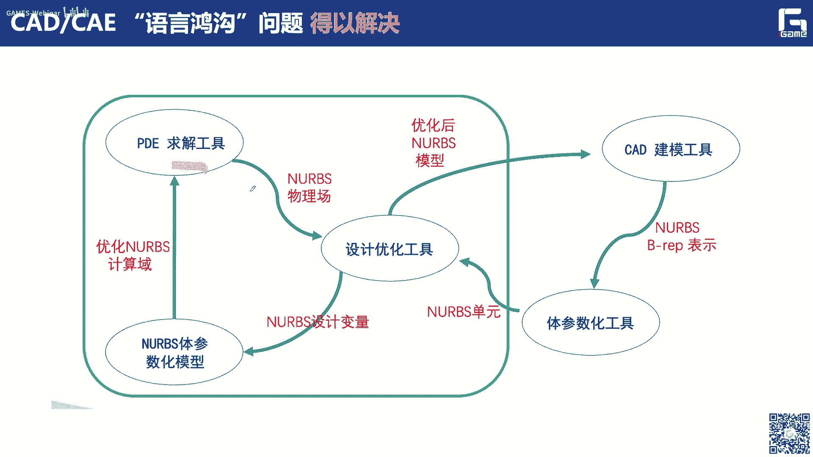

这个结束节点向量信息，控制顶点的xyz坐标，那我最后通过等你的分析方法，所求得的这个c一的数据啊，比如你的这个温度场对吧，你还是这样表示的对吧，还是控制变量的个数阶数啊，然后节点向量的信息啊。

还有控制顶点的x y z坐标不同的是什么，是不是多了第四维的一个分量啊，多了第四位的一个分量啊，那么这个第四位的这个分量就是来控制什么呢，啊来控制你的这个field，也就是说实际上这样的话。

大家可以看到，是不是我的cad数据和你的cad的数据啊，是不是就完全一个格式了啊，我原来还是一些离散网格对吧，报复格式op j格式，现在的话就完全就是都用样条，方方程式本来进行表达。

那么所以我们来看一下这么一个等几何啊，等你和和有限元的它这个区别区别对吧啊，就在这我刚才说了。

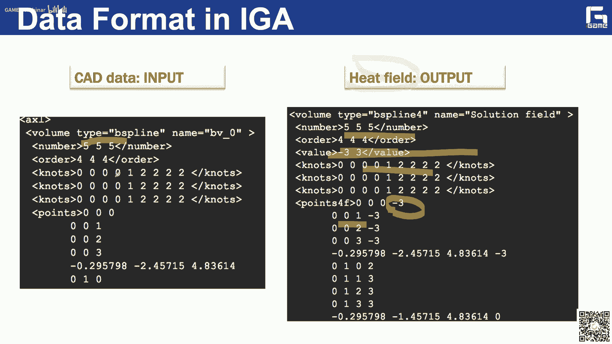

当它本质的区别啊，最最本质的区别应该是第二点就是计算专业啊，当然大家如果能够理解到呃，把这个第二点理解透了啊，我想你就上去掌握了，等你后的精髓了啊，真的精髓了啊，就大家可以后面后面可以理解一下。

什么是节点区间所对应的子面片啊，大家回去再翻一翻，我们的这个样条的这个课本啊，然后看一下这个节点圈，对应的纸面片是什么东西啊，然后就可以，我想呢就可以从本子上理解，我们这个登记和他的一个呃基本思想啊。

核心思想，但我们大家都知道样条我可以插入节点，我可以生间提高次数对吧，而且呢插入节点提高次数都是保持几何不变的，对吧，哎这也是非常好的一个呃一个一个一个性质，实际上有限元它是不具有的是吧。

那么我们可以在更从更高层次上去分析一下啊，去分析一下我这个等级和和有限元对吧，他们呃之间会有哪些优势呢，啊等于相比于有限元，首先第一个啊，我的cd的几何和你的物理场c e飞机的集合，对吧。

是在同一个样条空间里面啊，避免了数据交换的问题，而且呢我是在精确的cad几何上进行仿真的求解，对吧，不存在任何的几何离散的误差，对吧啊那么对于我们某些问题是非常重要的，这一点啊，另外呢。

而且我的物理仿真实际是它是一个保持的cd，减了光滑性和高阶性质是吧，类似于我们这个高阶单元一样，或者高阶的一些方法一样的对吧，他在某些方面上是呃是这样子，另外一个我想这两点非常重要，大家还是要呃。

呃也是要把这两点好好好理解一下，第一个就是说精度的提高，我怎么来提高精度的啊，也是我在同样的自由度下，可以达到比较高的精度，大家可以想想为什么对吧啊，因为它是高阶嘛对吧，而且比如说原来为一张曲面对吧。

不用4x46个控制定点就可以啊，高精度的去表示一张曲面，对不对啊，但是你原来可能需要几千个呃，三角网格才能达到这个精度对吧，你如果是同样的自由度呢，如果从几千个控制定点呢，那我这个先用这个c e。

反正求解的精度肯定高了嘛对吧，当然我觉得非常重要的啊，这个下面这一条更加重要啊，就是说在同样的啊，同样的这个精度下，需要较少的自由度，需要较少的自由度，它带来的是什么呢，效率的提高。

还是刚才那个那个例子对吧，我同一个曲面，我用控制订单表示，只要4x46个控制定点就好了啊，但是你用三角网格可能要几千个自由度，那你这个带来的这个效率的提升，是非常非常明显的啊。

虽然我们在呃前面的研究工作里面，包括很多同样研工作都证明了这一点啊，在很多问题里面，它的效率提升是非常非常显著的啊，另外一个就是我刚才讲的就是这种加息啊，局部加息操作的能够精确的保湿即可啊。

而且最后一点我觉得也是非常重要的，就是说在后面的结构优化啊，无论是在形状拓扑优化过程里面，我是直接可以把你初始设计的这个形状，比如说你初始的这个cad的这个控制病变，作为优化变量，作为优化变量啊。

也就是说我最后输出的这个优化的结果，结构这些结构优化的这些结果，我就直接可以导入啊，cd系统啊，cd系统啊，就是避免了在这在需要对前面，这个像这种体术化的一些操作一样，还要进行cd的重建啊等等对吧。

所以这样的话呢，我就啊也是它一个非常重要的一个优势啊，也就是说上面这些优点应该决定的，等你的分析在某些特定的应用场景中，应该说具有这种先天的优势，应该等你的分析从20057年提出来啊。

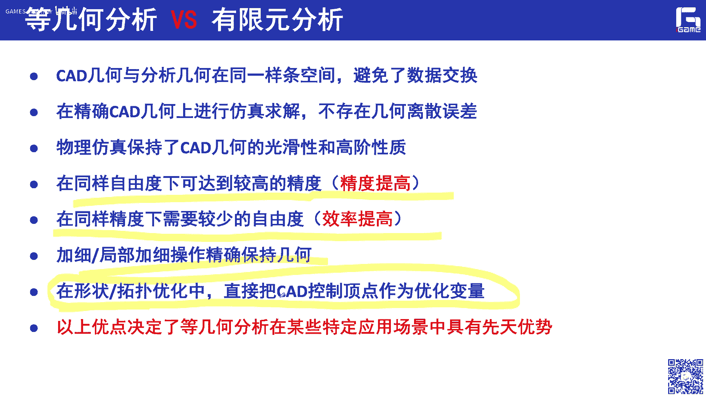

应该说中间3年从2005~2008年啊，这这3年应该相关的论文啊是非常少的，非常少嗯，那2008年呢只有八篇啊，只有八篇，那我恰好呢也是2008年博士毕业啊，然后在那个王一平教授的推荐下。

然后去法国音乐啊那边学习，等你和刚好他们登记和那边的，就有一个欧盟的一个fp cv的一个项目，就是来做登记和这件事情啊，那么商也是集中了欧盟的一大帮这个大咖啊，然后来做这件事情，那么像他们呢。

我想就是说实际上就是说能够把等级和呃，你推到一个新的高度啊，可以大家可以发发现就是说从那以后呢，这个相关的论文呢就是越来越多了啊，越来越多了对吧，到现在啊，这是我去年我统计到了2021年的数据了啊。

当时应该还是只是，应该只是到10月份啊，他应该就在我们这艾斯维尔这个数据库里面啊，应该就有600多篇的和ig相关的这个论文啊，应该是目前应该经过这么十几年的发展对吧。

10年的发展应该还是呃目前的在这个计算力学，计算几何啊，包括啊计算数学啊领域，一个非常热的一个一个一个研究方向，当然这个发展趋势我后面也可以讲，因为时间问题我就跳过了，实际就是现在啊。

应该大家的关注的热点都开始了。

一些简单的啊一些问题啊，然后越来越关注一些复杂的一些问题，这边呢就是一些一些应用啊，一些应用啊，比如说在汽车模冲压模拟啊，他上次可以看到一个呃敲的问题啊，比如说在同样的这个进度下。

可以节省一半的这个时间啊，一半的时间啊，这边就是一个留过我的问题啊，当然这个也是可以回答，就是刚才为什么我说呃，在加息过程中可以精确保持几何有用对吧啊。

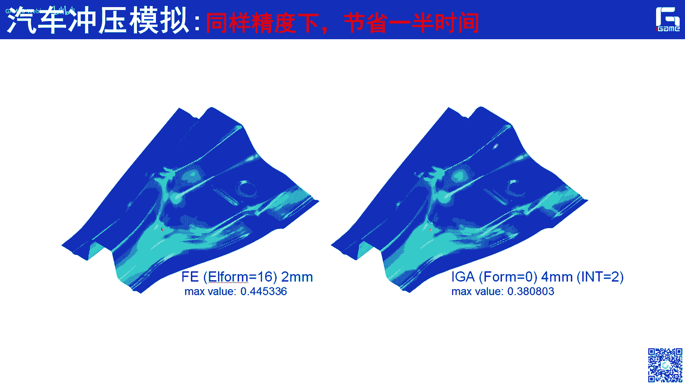

因为这边，比如说这个浅色的部分是我的流体部分啊，since的部分是我的固体部分对吧，我在得到这些仿真结果的时候，我可能需要进行加息对吧，嗯那我加息的时候呢，嗯我在等你和这个框架里面啊。

正是因为样条我在做这种加气的时候，它是可以什么啊精确保持边界的啊，所以说在这个六体流体和这个固体啊，公共的部分啊，公共的部分实际上是我是可以精确保持不变的，对吧啊，如果你用传统有限元。

可能就会呃出现一些缝隙啊什么之类的，可能就不会不会满足后面的一些，仿真的一些需求啊，所以说这是呃就是我插入节点啊，这个边界经常保值，对应的ig呢在这个刘沃国里面会有天然的优势。

那么这边是一个非常有意思的问题啊，这边就是我们呃呃在这个心脏瓣膜闭合仿真。

模拟的一个流口合的一个卧底一个问题，就我这个心脏瓣膜啊做到这个血液的冲击对吧，那么实际上是呃这边呢这个整体的优势呢，还是非常明显的啊，嗯那么在同样的精度下，这个有限元花费的时间。

大约是等几个分析的500倍啊，那么也就是说有些人需要500多个钥匙啊，我们等你和啊，只要用一个小时呢就可以把它给放的出来，那么这边呢是一个接触问题啊，接触问题的仿真啊。

为什么接触问题里面等几盒也有优势呢。

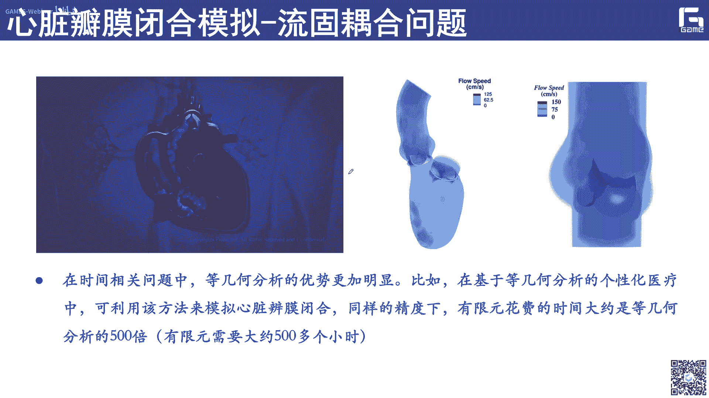

啊其实也非常容易理解对吧，因为接触的地方啊，我是如果用等几盒的话，然后我就可以保持两个接触面对吧，它精确保持不变啊，你如果用一些无论你离开什么三角网格啊，还是四边形网格，还是其他的一些网格表的形状啊。

你会在握手总有误差嘛对吧，那么基于我们等你和这个框架下，我在这个接触的地方也是可以啊，精确保持不变的，上次这个也和我们刚才那个刘文和，是一个同一个道理对吧，另外呢还有一些像这种铁电材料。

相场模型的一些计算啊，那么12是呃等体和呢也是有它的优势啊，为什么呢，因为在这个问题里面啊，它会涉及到一些高阶导数项的一些计算，高阶导数项的一些计算啊，那么当我们用传统的这种c0 的。

线性的有限元的方法，也是很很难去把它给，很高精度的啊，把他给仿制出来的啊，那么我们和浙大航空航天学院啊，这个老师有王杰教授合作是吧，然后把等级和用到了这种铁电材料，相场模型的计算里面啊。

我就发现了这个精度上啊，还有它的性能上啊，那么会有很大的这个提高，也就是说登顶盒呢非常适用于这种啊，对这种高阶导数的一些呃计算的一些场景啊，那么这边呢我们是把它呃，这个等级和弄到这个这边。

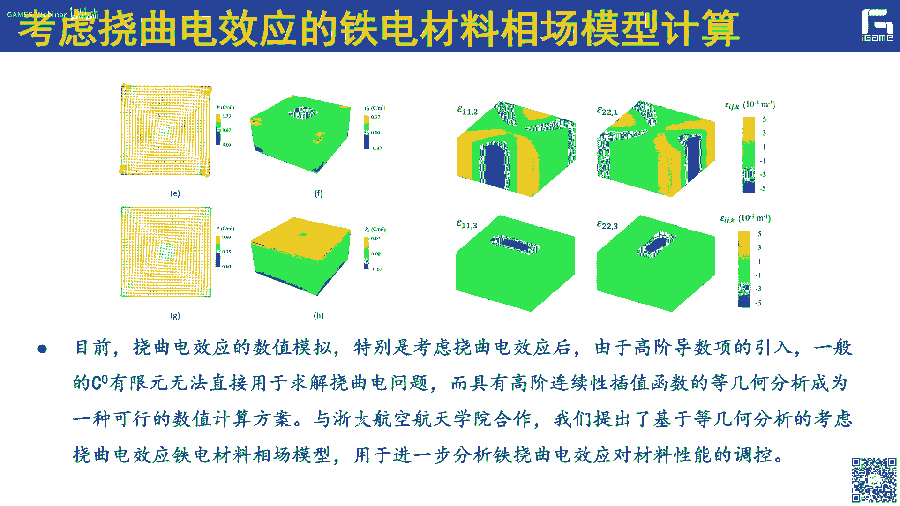

这个视频放不出来，放入到这个软体机器人的这种招弹性的材料，的非线性的动力学模拟出来，模拟仿真里面，比如我们也可以这边类似于一个桥梁吧对吧，我们这边是加一个1000牛的一个力。

就类似于风力啊或者什么之类的，然后设计设计拿了一些材料的属性，然后我就可以把这种受力情况啊，因为现在我们是做了一个非线性的动力学的，一个仿真，它的这个在不同时刻的构型和位移的分布，把它给计算出来。

而且这个在计算效率上啊，这种结果在计算效率上，比传统的有限元的一些方法呢，要提高了60~70倍左右，60~70倍左右，那么我们在这门课本里面，后面的课程里面，也会有专门更加呃细致的给大家讲一下啊。

这个等级盒是怎么用在这种非线性动力啊，这种超弹性的材料的方式逻辑里面，啊这边是一个超短线的一个翘的一个方向，啊我刚才讲的就是另外一个。

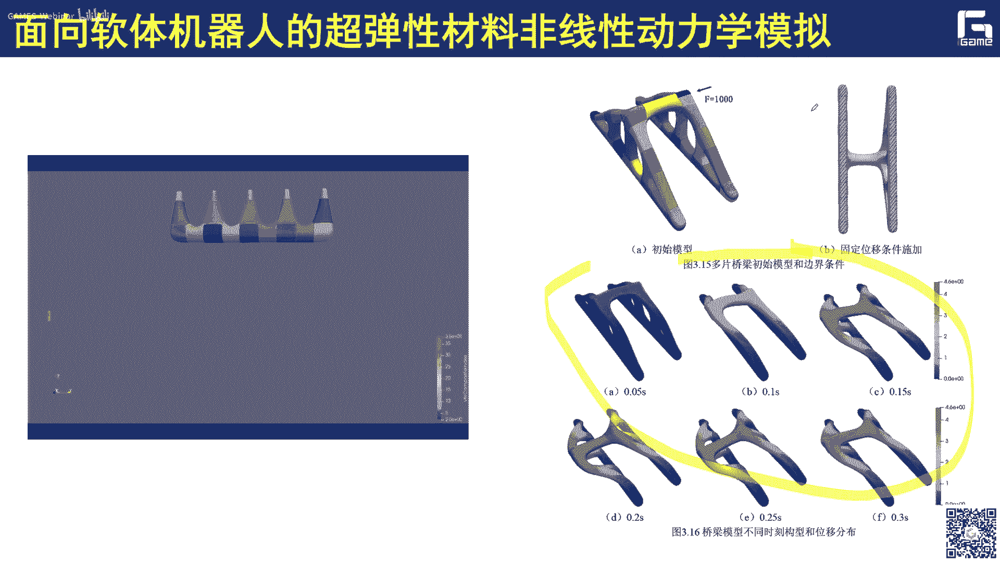

还可以把这个等级和用到一些形状和拓扑，优化问题，这个时候呢你的这个是所有的优化变量对吧，所有的优化变量就是这些控制顶点，就是这些控制顶点，这要是给我们后面的这个呃，优化呢也是带来了很很很多的便利性。

好这是我就是给大家介绍一下这个等几何，简单介绍一下等级和它的提出了这个背景，就说为什么要做等几何呃，提出登记和这么一个事情对吧啊，它的基本思想是什么，大家可以发现它的基本思想非常简单对吧啊。

就是说我上就是打控制零点是吧，这一套东西不仅仅控制控制形状，我要控制它的这个物理场的呃，这些仿真的这个结果啊，那么这个很遗憾对吧，等几何不是我们呃搞计算几何的啊，同志们提出来的。

而是做计算力学的这个修士院士取取出来的，所以说为什么为什么啊，我也我当时也也思考了很好，我觉得还是学科交叉的重要性，因为我们不了解啊，我们当时确实不了解这个有这个需求对吧，如果我们要想要知道a。

我需要把这个cd和cd的数据啊，要实现无缝融合，五真正大一统啊，那我觉得我们也是可以讲出了对吧，这么一个案列出来，那么正是因为我们这个修士教授是吧，他了解里面这个需求啊。

所以呢他啊可以想到这么一个单体分析，思想，然后开辟了这么一个新的方向，我觉得这是学科交叉啊，真的非常重要，所以也希望同学们能够再进入，可不仅仅就是去学习自己本领域的是吧，也可以听听其他领域的一些报告啊。

真的会或多或少都会有一些收获，那么最后呢再给大家介绍一下呃，这个呃后面的这个课程的安排啊，因为大家可以看到我们整个课呃，安排了14次啊，安排了14次啊，但是这个里面可能有些地方我会做一些调整。

相应的这个内容呢呃这个一些整合啊之类的啊，那我们下次课呢还是要给大家啊更，从细节上给大家啊深入的讲一下这个曲线，曲面躯体的建模的一些基础啊，因为我们这个整体盒呢啊，它真的就是说用是样条。

是它的一个非常非常重要的基础是吧，所以这边呢我还是想给大家呃仔细讲一讲啊，这个相关的一些理论基础，如果呃有些同学对这方面非常熟悉了啊，可以跳过啊，可以跳过，那么后面的话还是给大家想给大家讲一讲。

这个有限元的框架，有限的框架，因为等几何的框架和有限的框架，基本上还是非常类似的，无外乎就是它的表达形式上，还有他的这个呃计算的这个单元啊，这些格式上可能会有些不同啊。

然后后面呢会呃也可以介绍一下网格生成啊，包括呃面向等几个分析的网格式呢，就是这个平面参数化和体参数化的问题，包括后面一些简单问题的求解，像这个泊松线弹性啊，超弹性啊，那么还有配点法，包括形状拓扑优化。

以及我们最近做了一些工作啊，基于体系分的这么一个建模，仿真优化一体化框架，还有这个深度学习的这个，把这个ai放到这个文具盒里面啊，这是后面的一些课时的安排啊，课时的安排。

那么我们整个的后面会有一些编程的作用，这次应该是没有啊。

我们这次主要是做一个宏观的啊一个介绍，那么我们下一次啊应该会有一些编程的作业，就基于我们课题组的igame平台啊，后面呢我们也会把这个平台啊开源开源出去啊，里面会基本上会涉及一些呃。

会给大家提供基本的一些数据结构，特别是网格的啊，也会给大家提供一些样条的啊，一些一些呃一些类的一些定义啊，包括啊一些求职的算法，求导的一些算法啊，加戏的我准备作为给大家作为一个作业吧，让大家去实现啊。

那么应该应该下周吧，就是我们本应该很快就会给大家呃发布出来，大家呢也可以事先呃先这个浏览一下，看一下这个结尾，整个我们整个框架啊，应该还是结构还是非常清晰，非常简单的啊。

也是希望大家能够多多这个给我们一些输入啊，做出一些输入啊，然后我们可以看到一些输出的一些结果好吧，就是说希望能够大家在这个平台上能够，做出自己的一些贡献，我们希望能够把这么i game平台对吧。

呃如果里面能够集成进你的一些，比如实现的一些代码啊，或者一些呃呃新的算法之类的啊，那也是非常一件事的，这是自豪的一件事情啊，那么我们这门课呢也是呃，有我们那个徐金兰老师和呃谢金啊，我们优于博士。

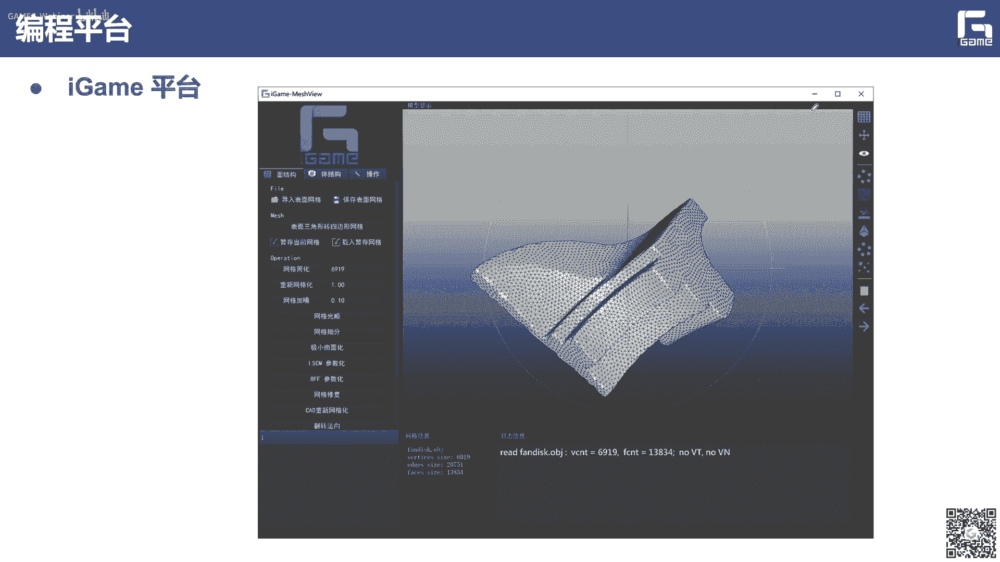

还有王宁啊，作为助教，大家有什么问题，都可以在这个我们这个qq群里面提出来啊，由他们呢来给大家做出解答，然后实际上我们登顶盒是有一个微信群的啊，如果大家感兴趣的，可以扫码，然后加入我们这个输入交流群。

当然我这是我的微信号的这个二维码，大家如果愿意啊，相互认识一下，也欢迎啊，加一下我的微信，好我们今天的这个专业，我想就是呃就是如果对这个曲线曲面啊，建模部分啊，有不熟悉的同学啊，大家可以呃先预习一下啊。

特别是北泽学院里面，还有样条的一些基础理论等等，好我们今天这节课就到这儿啊，不好意思，中间因为网络的原因啊，这个断了几分钟，看大家群里有没有一些问题啊，我们可以留个几分钟时间和大家交流一下。

啊有有刚才有同学反映群的二维码过期的啊，不好意思啊，我这个疏忽了那个，我等会儿发到两个群里面吧，啊谢谢，啊刚才有同学问i game支持linux系统吗，目前都是支持的unix mark。

还有这个windows，我们都有同学在用，还有同学问有没有一首一些推荐的书籍吗，包括样条的这个曲面曲曲线曲面的一些知识啊，这个我们后面可以给大家推荐一下，i g a会取代f一吗，这是一个很好的问题啊。

这是一个很好的问题，我只能说ig是有限元的一个有益的补充啊，就是说对于某些问题某些问题啊，ig是有它先天的优势啊，先天的优势啊，但是啊如果想短时间内取代有线源，还有很长的路要走啊。

我觉得可以上目前一些商业软件啊，无论是up还是其他的一些软件啊，包括这个，autodesk对吧是啊，包括西门子吧，然后都是在这方面都有所布局的啊，有些甚至都已经写到插件里面。

也就是说我觉得写的插件是一个非常好的一个，一个做法啊，有一个做法就是说当有人说等你和啊，实际上是可以作为呃i g的一个有益的补充，也就是说如果某些问题，你想用等级和你用等级合，但是你也可以用有限元吗。

啊这个也是不是说已经是对吧，嗯有你为我哼，我想就是说i j啊，应该如果是真正取代有线源，还是有很常用的角度啊，包括呃怎么样实现这个体态的化，包括对一些流体啊，他这种复杂结构的仿真啊。

还有各种各样的问题吧，应该还有很多的问题啊，技术的一个难点值得去攻破，有同学问这个，等你和面对的共性难题是什么，我想还是体参数化的问题吧，对吧嗯方也有说呃，目前实际上是如何用有限元。

那么四面体网格的生成，已经是非常非常成熟了啊，应该都是问题不大的，感觉非常稳定很棒对吧，我总是能够生得出来，但是就是说呃对这种呃有裁剪曲面组成的表，面对吧，那么我只要它的内部啊生成这种体的表示。

特别是样条体的高阶表示，目前来看应该还是比较困难，因为我后面也会讲，它实际上是和我们六面体网格的生成啊，有点共通的地方，有点共通的地方，所以就是说这个应该我想问一下，是它的一个呃非常重要的一个瓶颈问题。

而阿根平台目前还没有开源啊，我们下周的某一天应该就会了，等你和有些人是如何结合的啊，其实这也是一个非常好的思路啊，所以在很多的比如像一些流过耦合问题里面，他们就是把这种固体的那种等级核来做。

那么流体的部分呢是有限元，传统有限元方法或者有限体积法来做，那么因为等你和如果在做流体呢，还是有一定目前还是有挑战的啊，那么实际上目前来看呃，这也是一个比较好的一个思路，就特别是就是说我把两者的长处。

能够都结合起来，i j可以和深度学习结合吗，呃可以了啊，我们已经前面有一些工作了啊，我们也有一个硕士生，还有篇论文发在c基地上，就是来做这个呃，基于深度学习来做ig的这种呃计算模型生成。

当然也是可以考虑的，分块结构轮对面体网格啊，当然当然等几个试用啊，但是我还是需要把它这种呃，分块的这种力面体网格，把它转换成样条体，i game平台可以和matlab联动吗，目前目前没有这方面的考虑啊。

我们还是希望能够直接基于啊，c加加来做来进行开发，但是你可以把你的matlab的结果把它输出出来，实现就是两者的数据的这个一个呃一个接口啊，这个应该是没问题，基于深度学的js p i a那种吗。

嗯类似吧，但是我深入细节，我后面会有一次课会会给大家讲啊，到时候我再仔细讲，好已经8。40了，我们这次课就到这儿吧，我们这次在线的人数已经将近1000人了嗯，非常感谢大家的关注啊。

