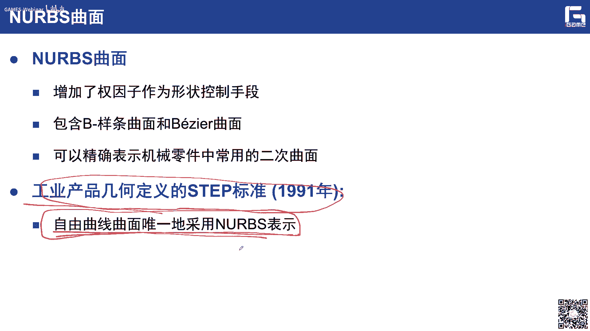
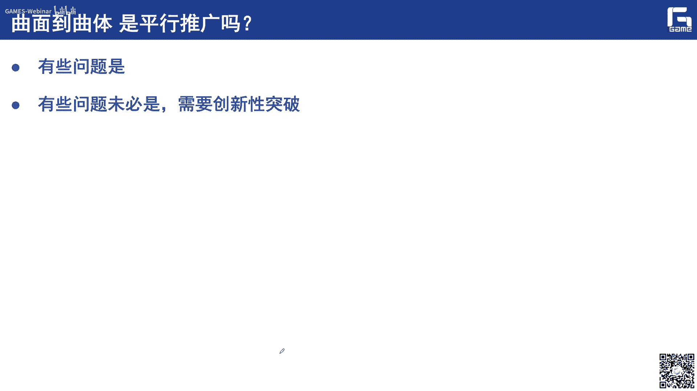
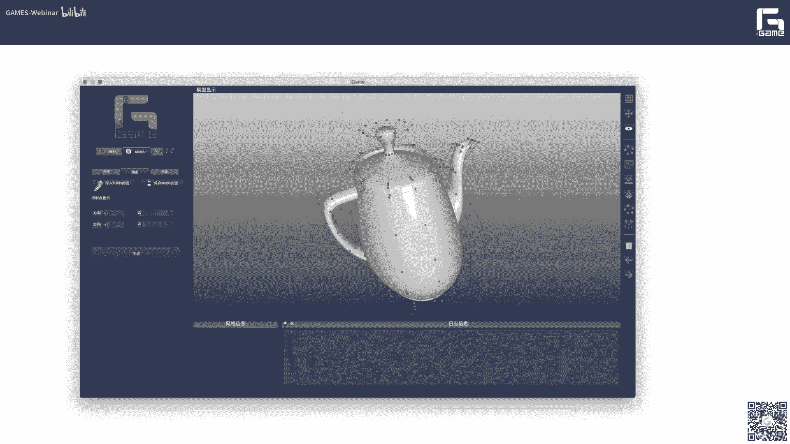

# GAMES302-等几何分析 - P2：2. 曲线曲面曲体的建模基础 - GAMES-Webinar - BV1dM4y117PS

好各位老师同学，那么第二讲呢正式开始，我们前面的第一讲呢，已经给各位啊介绍了我们这个等级和分析，它相应的提出了这个背景啊，特别是我们这个c d c e一些背景的知识，那么我们这次课开始呢。

就给大家讲一些比较基础的细节的这个内容，你们知道呢等几何呢，它实际上呢是啊用和几何表示同样的样条语言，去表示我们的物理场对，这是它的一个核心的一个基本的一个思想，所以说这边非常重要的一点就是关于样条。

也就是说我们这个曲线曲面，具体的一些基础知识就显得非常的重要啊，非常的重要，那么所以我们的第二讲呢就给大家介绍啊，这个曲线曲面躯体它的理论基础，并且呢基于我们呃航电i game cs这个igame平台。

然后呢给大家介绍一下啊，相应的一些实现，我们相应的这个代码，还有框架呢，应该会最晚在后天周一呢就会发布给大家，到时候我们也会在qq群里面通知大家，那么实际上就是说这个曲线曲面躯体啊，它的这个建模的基础。

对我们这个整个的cad是非常重要的，那么正是因为啊登记核实现了c a d和cae，他们之间的这个无缝融合是吧，也就是说统一表示啊，所以说样条呃这部分的理论啊，这部分的知识啊。

应该对我们这个等级和也是非常非常重要，这是我今天介绍的这个提纲，首先呢给大家介绍这个几何形状的参数表示，然后呢分别介绍曲线曲面躯体的造型理论啊，及相应的一些算法，最后介绍我们i game几何内核。

这边我列出了一些参考教材，那么是非常经典的一些教材，特别是这边的两嗯两本外文教材，外文教材一个呢是reno book，lovers呢，实际上就是我们非均匀有理，b条那么一个简称啊。

实际上这number book呢是啊，我们应该说我们这个呃c g d领域，非常经典的一本啊教程，它里面呢不仅仅介绍了基础的理论，而且呢相应的这个代码的实现也都有啊，一些基础算法的代码实现都有。

我想大家可以借助他的这本呃书啊，来根据深入的学习，但我们时间有限对吧，就一个半小时，所以说呢我们也只能介绍一些里面最重要，最基础的一些呃理论和算法，那么这两位作者呢也是非常有名的。

也是担任我们cad的前主编，当然这本书啊这本教材也有相应的中文版本，是由北航的赵刚老师啊翻译的啊，那么大家也可以去看看有没有可能不可能买到，然后呢第二条啊。

第二个这个教材呢是关于close and surface和c g d，所以我们也c a g d啊，就这个计算机辅助几何设计，这个国际期刊的前主编furry，他这个写的啊，这个写的也是深入浅出。

大家呢也可以作为一个重要的参考，另外这边呢我还推荐了三本中文的教程啊，第一个就是我们浙大c g d课程组啊，由王国瑾老师，王国哲老师和张建明老师编写的，计算机辅助机和设计这本书。

那么这本教材呢相对呢要深一些，更加的偏这个科研方面啊，比较适合于这个呃高层次的研究生啊，去参考去参考，那么还有一本呢是这个计算机辅助设计，与非均匀有理b样条，那么这本书呢是由北航的施法中老师写的啊。

因为它里面写的呢也是非常的有条理，非常的经典，非常的经典，此外呢还有我们大工的王，王仁宏老师所介绍的这么一个计算机和教程，那么这是我推荐的一些参考教材，大家感兴趣的可以去购买，或者这个参考一下。

应该在图书馆里面的，应该也都有。

那么下面介绍这个几何形状的参数表示。

那么我们一般来说这个计算机辅助几何设计，里面非常重要的就是参数曲线曲面，那么为什么要采用参数表示啊，这边呢就需要给大家介绍一下，实际上我们这个呃整个图形学里面非常重要的，一本也一部分啊。

就是关于这个曲线曲面造型，那么它里面的理论基础的。

实际上也是我们c g d的一个，理论基础的一个核心，那么c g d这么一个词呢，实际上是他最早是在1974年，由这个巴西和这个bified，在美国，犹他大学的一次国际会议上提出来提出来，那么ua大学。

大家知道这家腾讯学领域非常著名的，就是那个犹他茶壶是吧，实际上就是在犹他大学的这个诞生的，那么从1974年之后呢，这么一个c a g d的这个词呢，也说开始一门独立的学科属性，那么实际上在7年的时候。

这个英国forest，刚才那个教材里面的这个汪国昭老师啊，是我在浙大的导师啊，那么汪老师呢在呃70年代末，80年代初呢，也在英国的forest这边的课题组呢进行访问啊，进行访问。

那么他给出了1c7 的另外一个的名字，叫做计算几何，计算几何，那么这个计算几何呢，实际上我们在国内几个同学可能也注意到，我们身上有一个非常重要的啊，非常重要的呃一个呃一门课叫做计算几何啊。

它是由北京理工大学的周培德老师啊来介绍的，这本书的名字叫做计算机和算法设计分析应用，其实我还看过里面的一些内容，它实际上啊就是是呃，主要是介绍我们的一些几何的一些算法，比如求教啊啊。

还有一些三角剖分啊啊这些，也就是说实际上啊实际上也是计算几何，在有的时候他还是会，会包含这些内容是吧，所以说我们这边呢呃还是基本上就是大家呢，还是沿用计算机辅助几何设计。

比如c e d的这么一个学科的这种名称，那么为什么会有这么一个学科的，这个是出现对吧啊，因为呃随着这个因为航那个当时啊，无论是航空还是汽车，这个现代工业发展都是非常迅速，那么实际上在这个里面啊。

在这个里面非常重要的啊，就是说我怎么样去在计算机里面去表示，我这些工业产品的各种各样的几何形状，就显得非常重要啊，就显得非常重要，那么实际上从大类来看，我们可以把它分为这么两大类啊。

第一个就是由这些初等的解析曲面，比如像平面啊，圆柱面啊，球面啊，圆环面这些组成的啊，实际上这个这些呢，在我们机械零件里面是显得出现了非常多的啊，经常会碰到对吧，那么第二类呢实际上就是有这种复杂方式。

自由变换的曲面，我们把它叫做叫做自由曲线曲面，也就是说呢它的形状呢是可以由用户来设计的，可以自由啊，它的形状是自由的啊，是自由的，比如说像我们这个飞机啊，汽车啊，传播他的这些外形啊。

这些车身表面等等对吧，那么实际上这些你如果用单纯的这些解析曲面，去表示它是非常困难，是非常困难，所以说呢我们迫切需要迫切需要一种呃，具有优良性质的这种自由曲线，曲面的这个表示啊，这也就是说呢。

我们要要要提出这个相应的这个方法，那么实际上这个几何外形的这个计算机，表示方法呢，也就是说是人们当时一直在寻求的，一直是在寻求的，从一个形状的一个怎么样去表示它，在数学上去表示它是非常重要的啊。

因为我们不仅仅要用哪来表示形状对吧，可能在后面的一些数控加工，也是在制造里面悟性的计算，就是物理属性的一些计算啊，包括有限元对吧，实际上都是会诶用到啊，他的这个几何形状的这个表达。

也说他的这种表达的方式啊，就显得异常的重要啊，异常的重要，那么商是在这种外形信息的计算机的表示，分析和综合中核心的问题，我就说在计算机里面，怎么样去表示这些外形的情况，第一个我们有这么几点要求。

第一个就是我首先这种表示，要是适合我们计算机来处理对吧，来处理，另外一个就是要有效，可以有效地满足这个形状，表示和几何设计的要求对吧，我们后面要进行这个形状的这个修改对吧，编辑那么要满足这些信息。

还有另外一个就是我要这些信息啊，我能够便于在各个系统里面进行这种信息的传，递，产品的这个数据的交换，对吧，那么实际上这个也是非常重要的啊，非常重要的，那么实际上是大家都学过这个高等数学啊。

那么包括解析几何对吧，然后大家都知道这个无外乎在从数学上来讲，它我们对一个形状无法乎就这么三种表示，第一个就是显示表示啊，显示表示没错，我是可以任何一个形状，我都我都可以把它表成y等于fx的形式啊。

那曲面就表示成z等于f x y的形式，也就是说我这个x和y坐标呢它是确定的，比如说像抛物线或者什么的，比如y等于x的平方或者等等等等对吧，那么实际上就说这种表示显示。

表示它的这个横坐标和纵坐标之间的关系，之间的关系是非常明确直观的对吧，但是呢它不能够表示多次取经，另外一个它也不利于你进行编辑修改对吧，大家我很难去预测对吧，我如果修改了这个fx的这个表达式。

最后这个曲线的形状变成什么样子了，我不知道啊，我很难去预测是吧，嗯另外一个呢就是隐私表示啊，就是比如说像一个圆，我可以表示成x平方加y方等于一的形式，这是一个单位圆对吧，那么这种隐私表示呢。

它实际上是这种坐标之间的对应关系，更加不直观了，对不对，但是它有个好处，就是我可以非常容易做一些内外的一些判断，对吧，比如说在啊求教啊或者一些问题里面啊，它是有着先天的优势啊。

所以我们后面有很多呃学者去研究，我怎么样做影视化，比如说把这种后面的这种参数形式进行隐私化，因为为什么要做隐私化，因为我就可以对这个求教问题就可以进行简化，还有第三种啊，也是我们就是说呃比较关注的一种。

就是参数表示，参数表示爷爷说呢，当然我就是参数表示的核心思想，就是我把这个呃y这个几何形状上的这个x y，z坐标都写成啊，关于另外一个参数啊，比如t的表达式，比如参数曲线，那就是把这个它的x坐标。

y坐标和z坐标都表示，关于一个变量t的一个表达式啊，这个时候我没说呢，这个t就是我的参数对吧，也就是说我给你一个t的值，我就会在这个曲线上算出一个对应的，一个点的位置来。

那么如果我把这个t的直径就做一个便利对吧，所以说我就可以得到一整条曲线的形状，也就是说呢它实际上就是我们所谓的参数表示，那对于曲面也是一样的对吧，那就是有右位两个方向，右位两个方向啊。

也就是说实际上啊实际上啊在这三种方式里面，我们计算机我们里面啊我们采用哪一种，就是我们在计算机辅助几何设计这个学科里面，我们采用哪一种啊，就是第三种参数表示形式，参数表示形式，那么有了。

但既然我们可以用参数这种形式去表达，其实我们也有很多的这个呃工程师啊，包括学者来研究了这方面的问题，就大家可以发现，实际上当时很多的我们这个呃，计算机辅助几何设计。

也是c e d这个学科里面的很多的这个进展啊，都是由我们的一些工程师提出来的啊，工程提出来的，也就是说他们的时候呢实际上是非常接地气的，非常接地气的对吧，因为他们来源于实际的工程的需求。

他在63年的时候，美国波音飞机公司的弗格森啊，这不是曼联的主教练啊，他是这个姓氏一样的对吧，他首先提出了我用这个曲线，曲面呢用参数方程来进行表示，那么它实际上是最早引入了这个参数的，三次曲线，并且呢。

呃给出了这个弗格森双三四，曲面片的一个构造方法，也是我通过这个呃曲线的组合，还有在这四个角点处的，啊在这四个角点处的这个位置矢量，还有一些切矢量，我就可以构造出一个表达式来。

然后呢呃构造出相应的这个弗格森patch，弗格森主页面，那么这是最早的，在63年呢，他就提出了这么一个思想啊，就提出了这么一个思想，那么实际上是参数表示的原理呢非常简单的啊，非常简单的。

比如说一条直线对吧，直线也可以看到是曲线的一种特殊情况啊，那么我们比如考虑这么一条直线段，从连接p0 和p的一条直线段，那么它的参数表示非常简单对吧，那我就是呃变形可以写成一减t乘以p0 。

加上t乘以p一的形式啊，这障碍只是它一个向量表示一个矢量表示，对不对啊，那它的每个分量对不对，我也可以就可以写成这种形式对吧，x y z分量都是可以写成关于t的一个函数。

那么我有了这么一个t t的参数表示之后对吧，一个学表示我对于呃这个在零一区间内，零一区间内任何点，一个点数一和一个t处的这个字，我都可以在这条直线上找到一个对应的点对吧，如果在计算机里面进行渲染。

进行画的时候，那我就可以把这个零一这个区间进行离散化，对吧，你可以分成50份，100份也好，然后呢我就可以变成相应的啊这么一个，曲线占了一个离散的表示，离散的表示，这也是为什么计算机学科啊。

我们要学离散数学对吧，实际上这个里面非常重要的，就是说要大家要学会离散的思想，因为计算机它只能0101来表示，那么这是一个曲线的比较大啊，曲线的比较直线的参数形式非常简单对吧，那对于一般的三维曲线啊。

一般的三维参数曲线对吧，实际上我也可以把它表示关于一个参数显示，对吧啊，那就是说我这个x t y t，z t可能就不是简单的这个呃，关于t的一次多项式函数的对吧，可能是高次的啊。

甚至还有可能不是多项式的对吧，你可以删一口3亿的啊，也是可以的啊，也是可以的，那么实际上对于参数学非常简单，有有的朋友想了，那就是多项式嘛，也就是说我对这个x t y t啊，这个就写成u了。

u都可以变成p成，关于u的一个多项式函数对吧，多项式函数啊，那么相应的这个给你一个参数，u0 上面的这个点呢，我就可以通过一些算法啊，把它把它给求职出来，当然是可以的啊，但这个会出现什么问题啊。

大家可以想一想啊，也就是说对于我们编辑曲线来说，首先它是不直观的，对不对啊，也就是说如果我修改在这里的ai，我要对它进行修改，那么大家最后的最后的这个呃曲线的形状啊，你修修改里面的一个比如ai的值之后。

它这个曲线的形状变成变成什么样子了，我无法预测，无法预测对吧，所以说他对我们cad来讲应该也是不怎么好用，不怎么好用，那么当然我们可以去总结一下啊，总结一下这个参数。

曲线参数表示呃这种显示的这种呃表示对吧，它表示的优势有哪些，第一个啊，首先它是显示对吧，不像影视那样，我xy之间的关系都不明确对吧，也就是说对于每一个参数值啊，给你一个t的值。

我就可以直接去计算曲线曲面上的，这个对应点的位置对吧，而且呢我刚才说了啊，我们可以采用这种离散化的方式啊，可以非常方便的把这种参数表示的这种外形啊，分别方面的，可以转换成这种多边形的逼近表示对吧。

多边形的逼近表示，那么有了这个多边形边界表示之后啊，多边形标记表示之后，我们就可以在呃计算机里面啊，通过open gl对吧，这个语言就可以把它给绘制出来了，对不对啊。

还有一个呢就是这个曲面上的一些几何量，计算更加简便，因为它是参数解析的参数形式嘛对吧，所以说一些微分几何的一些属性啊，微分几何呢实际上就是把我们这个微积分，后面这个几何啊，它的内蕴几何啊结合起来啊。

比如说我怎么样去计算它的法向曲率，车离线曲率线这些属性的话，实际上我都是可以非常方便，因为我有了这个显示的参数表达嘛对吧，我都可以对这个t啊求导啊之类的这些方法，这些方面都是非常方便。

还有一个我想也是非常最重要的一点啊，最重要的一点就是特殊形式的参数，曲线的参数表示的这种外形控制非常直观啊，非常直观啊，那么比如说我们后面要讲的这个北的b样条，nbs啊，包括呃这些曲线曲面表达。

我们说呢，它都引入了一个叫做控制多边形或者，控制网格的概念，控制网格的概念，也就是说我通过修改这些控制网格，控制多边形的呃，中在这些控制顶点的位置，我就可以实现对它的这个形状的一个修改，对吧啊。

别说对这种特殊形式的所谓特殊形式，就是我这个x t y t z t啊，我采用一些特殊的形式进行表达，可以呢啊实现非常方便的这种外形控制，也就这样了，他就可以把我们这种参数表示的这个优势啊，可以集大成啊。

既可以是显示表达，可以方便求职对吧，几何量又计算简单，另外呢形状修改呢又非常好啊，所以说我们后面重点给大家介绍的啊，就是这么一类啊，有控制多边形这种形式来表达的这种曲线曲面，具体的他的这个，所以呢。

我们会首先给大家介绍。

这个曲线造型的一些理论和算法啊，曲线造型的一些理论和算法。

我刚才讲了这个参数曲线，我们非常大家首先可以想到的就是密集形式，对吧，就这种ai乘以这个t的多少次方的形式，我们刚呃我刚才提了，首先它不利于进行交互的啊，形状的设计啊，另外呢它是一种代数形式。

几何意义不直观对吧，几何意义不直观，不利于数值计算啊，因为对于高层来讲啊，这样他就需要求什么t的多少，比如十次方，实际上对于这种高密吃的这种数字计算，是对于计算来讲也是不稳定的对吧。

大家如果呃写过相应的同学都都应该有体会，有体会啊，那么后面我引入这个北约啊变量条之后，大家可以发现他就是把这种求职啊，都变成了一个地位递归算法，所以说呢它就非常稳定的，计算机是非常喜欢递归算法的。

对不对啊，那所以我刚才就讲了，说我们能不能考虑换一种奇函数，不用密集啊，不用密集，而用其他形式的奇函数啊，就是这里的b r n t啊，叫做关于闪现函数，有了这种形式表达之后呢。

我实际上就可以引入这种控制多边形形式，这边的2021223就是我的控制顶点对吧，那么连接依次相连，就组成了一个控制多边形，有了这个控制多边形，如果我想修改这条曲线的形状对吧。

这条粗的就是我的这个最后的这个参数，曲线的形状，如果你想修改它的这个曲线的形状，我只要移动这些控制点的位置，比如你可以把这个点移到这里来对吧，那相应的这个控制都变形了，就变成这个样子对吧。

那么这个形状就会变成什么样子啊，就就会过去对吧啊，所以说啊，所以说就说我通过引入了一种特殊的参数形式，表示就可以啊，就可以实现啊，这种啊非常好的这种交互修改啊的这个功能。

所以下面呢我们就给大家介绍这个北热曲线啊，北交曲线比如曲线，它实际上就是由我们这个比塞尔提出来的啊，一个法国的工程师是雷诺汽车公司的，提出了一种非常有趣的，有呃也是非常有用的一个呃。

不曲线曲面的构造方法，那么他在672年的时候呢，依靠这么一个理论基础，理论基础啊，开发了一套这个自由曲线曲面的造型系统，行为叫做unity unit or，也就是说刚才大家也看到了。

我只要移动这个控制顶点的位置，就可以方便的修改这个曲线的形状，而且这种曲线形状的变化是什么，是可以预测的啊，也就是说这个它的曲线形状的变化，是随着控制多边形的变化而变化的啊，而且这个控制的变形的变化。

实际上是也是或或多或少体现了，我最终这个曲线的这个形状的变化，那么应该说这是一个非常开开创性的一个贡献，开创性的一个贡，那么实际上在比北山呢还要稍微早一点啊，法国雪铁龙啊，这个金融工这个汽车公司啊。

这个企业目前还存在，对不对啊，这个得卡斯特罗啊，盐城独立研究发现了一个同样的方法，但他这个追问结果呢是呃一直没有发表，但是在国际上大家还是呃承认了，这个得开始多种方算法呢，它的这个地位啊。

啊它这个里面的相应的求职算法啊，并不是叫做呃后来并没有命名为北的算法对吧，而且命名为了这个decastle的算法啊，decastle的算法，那么the castle的呢是去年去世的。

相应的我们c基地的这个期刊呢，也出专门出现了，也出版了一个呃特刊啊，一个专辑来纪念他啊，来纪念他，那么有趣的是啊，在10年前就在2013年的这个s p m会议上，就是我们这个实体与物理造型。

这个soli男的被commodity这个会议上，也是我们cad里面的一个呃，比较重要的一个会场啊，the castle啊获得了当年的北大奖啊，北大奖当时我记得是在法国的第一种啊，当时我也去了。

那么当然这个得看得castle了，因为身体原因，那么在20世纪80年代中后期，实际上，大家都知道卡地亚这个系统是卡特亚这个系统，它实际上是美法国达达索公司的啊，也是广泛采用了北塞尔方法来进行这个呃。

呃曲线曲面的这个建模啊，曲线曲面的建模主要是大家可以发现啊，就说在当时这个cad里面呃，像法国的这个学者工程师，实际上社会我们c g d的这个发展，做出了非常重要的贡献，非常重要的贡献。

那么就再来大家来看一看啊，这个北折曲线它是如何来定义啊，它是如何来定义，也就是说一条n次的这个北色曲线啊，它是可以表成二体啊，这边是一个求和的一个符号，就是i从零到a相当于我这边有n加一项，对不对。

然后说这个n加一项呃，加起来啊，n加一项加起来啊，那么这个i呢i呢就是我的控制零点，这个b i t呢就是我的奇函数啊，g函数，当然这边的这个r阿巴阿迪都是加粗的啊，为什么加粗啊，因为他们是矢量啊。

也就是说他们比如说要空间曲线的话，那就是有x y z3 个分量，三个分量，那么这个b i t呢，就把它称为叫做巴基斯坦基函数啊，巴基斯坦基函数，那不崩三也是一个法国人啊，也是法国一个法国人啊。

上次大家在高中的时候都学过那个，二项式展开对不对，就是a加b的n次方展开，我可以写成什么啊，也就是说也可以写成一个cn i，a乘以n减i b乘以a的形式不，这就是一个a加b的n次方展开，就是它对不对啊。

那么实际上是波因斯坦基函数啊，也是呃非常容易记对吧，然后你就是把这里的a把这里的a换成什么啊，一到t b换成t，那你最后得到的就是这个b b i n t对吧，那么这个cn i就是什么。

这个cn i就是我们大家非常熟悉的二项式系数，二项式系数二系数啊，所以说我这边可以问大家一个问题了啊，那我问你就说如果我这边有n加一项对吧，那么这n加一项波斯坦基函数，加起来等于多少啊。

加起来等于多少啊，很显然应该等于一，为什么啊，因为我把这个a换成一减t，b换成t他们这两项加起来是不t就消掉了，变成一了，那一的n次方是不是一样啊，是不是一样啊。

所以说我这边的n加一项就加起来就等于一了，对吧，好上市啊，我跟你说呢，这是波因斯坦的奇函数一个性质对吧，就是它的n加一项奇函数加起来等于一，那么像这么一个性质，也为我们这个比值曲线呢。

也奠定了一个非常好的一个理论的一个基础，那么波伊斯坦也是一个也是一个是吧，也是一个法国人啊，非常著名的一个数学家，他实际上在数学领域做出了非常多的贡献啊，实际上是这么一个巴基斯坦基函数唉。

他是什么时候提出来的，是在1912年提出来的，1912年提出来的，那么如果有些数学系毕业的一些同学呃，学过这个b一论，所以大家都知道啊，在学b一论的时候，我要证明我要证明对吧啊。

就是说这个我任何一个连续函数，都可以通过一系列的这个波基斯坦多项式，进行一个逼近啊，他在里面的一边呢，这个就用到了波斯坦多项式，对多项斯坦多项式就所谓了，我们同为是分析的基函数是吧啊。

所以说啊大概开到1912年是吧是吧，咱带了过了五六十年之后啊，应该60多年之后啊，60年之后啊，又用到了我们cad领域啊，成为我们这个整个cad建模的一个非常重要的，一个理论的一个基础，对吧啊。

所以说数学是非常重要的啊，别说你当时的一个成果可能提出来啊，你你并不能预测它它到底这个东西有什么用，有什么用对吧，可能带了几十年之后或者几百年之后，大家就发现诶这个东西，所以在这个地方可以用上。

那么实际上我们可以去证明啊，这个这个波基斯坦基函数啊，它的一些性质，第一个就是非负性啊，非负性，也就是说我这些波斯坦基函数啊，他每一个波音时代进函数都是大于等于零的啊，非非性啊，另外一个单位抛分性啊。

就我刚才讲的啊，这n加一个奔四的减函数加起来等于一啊，加起来等于一，而且它在两个端点处啊啊就是在零和一的地方，它的值呢也是一啊，而且呢它可以证明对吧，通过求导啊什么之类的，我可以就可以证明。

他在u等于n分之i的地方啊，他的就是可以取最大值的啊，去对大值，另外还有一个满足的就是对称性啊，也就是说我如果把这个t和一减t的这个，地位啊换一换啊，那么实际上就是它可以变成另外一端的一个。

贝斯基函数啊，所谓的对称性，另外一个呢，还有这个我们非常重要的叫做递归的定义啊，也就是说我一个n次的巴基斯坦基函数，可以表示成啊，可以表示成两个n减一次的，boy sin基函数的线性组合啊。

也就是说它前面的系数分别是什么呢，就是一减u和u，所以说有了这个东西，实际上就是我可以在求职的时候就非常有用了，对不对啊，我就可以推导出来，我呃如果想求关于本的曲线上，任何一个点的位置对吧。

我后面大家可以看到我通过对csl算法上，它就变成了一个递归算啊，递归算法，也就是说呢，正是因为波伊斯坦基函数，它这么一个好的性质啊，才为我们这个整个的求值啊带来一些好处，那么怎么说呢。

正是因为玻璃生产经含数学性质，我们也可以相应的去推导出北热曲线，它的一些性质啊，第一个就是什么啊，端联产值，端联产值，因为它在零和一的地方值都等于一嘛啊，所以说很自然的啊，这个北热曲线是插值两个端点的。

对不对，还有一个对称性，也就是说我可以一减t和t的地位换一下，所以说他这个控制顶点的这个地位是啊对称的，对称的，另外呢还有这个端点切线，也就是说我这个呃北的曲线，它实际上是和啊这个控制多边形的啊。

首条边和最后一条边啊是相切的啊，是相接的啊，这个也是非常容易去证明的，非常容易证明的，比如说这个里面就大家可以看到，虽然我的cg里面不会涉及到太多的呃，高深的数学啊，有时候只要大家掌握什么啊，微积分。

数学分析高等代数这两门课啊就可以了啊，就可以了啊，如果即使是微分几何，也商也是这个这个微积分啊，微积分在几何上的一个呃一个推广，对不对，所以说啊，所以说呃，包括后面我们整体盒里面也是一样的啊。

基本上还是就是设计了，这这两门基础和数学课的知识，另外一个就是突破性啊，那我问你大家一下这个图标线有什么意思啊，然后拿图标线，就是我最后生成了这条北条曲线啊，一定是位于我这个控制多边形的。

这个图包里面啊，就这个阴影部分，这个里面阴影部分这个，我首先问大家，这个有什么好处，它的好处当然是有对吧，就说我给你的这个控制的变形，我就可以知道这条曲线不会跑到这个控制，都变形到外面去。

控制都变形到外面去，对不对，这个是对于我这个形状的控制，造型是非常有用的，对吧嗯，还有一个是什么啊，为什么会有突破性，为什么会有图标性，也就是说这条曲线的北侧曲线的这个突破性，这个性质是从哪里来的。

哎就是从什么这个北热巴基斯坦基函数，它具有什么单位剖异形，单位剖分型对吧，所以说呢就是说这个里面呃，也是我所有的波波斯坦基函数，加起来是等于一的，并且每个分式战机函数都是大于零非负的啊。

所以说我最后你所生成的这条北调曲线，因为他是什么啊，因为每条这条裙子上每个点的位置都是什么，哎这就控制顶点的线性组合嘛，啊不是这些控制点的奇函数的组合得到的嘛，对吧。

所以说这个点不会跑到这个凸包的这个外面去，啊，外面去对吧啊，所以说这个是呃非常重要的啊，非常重要图包性啊，另外一个呢就是几何不变性啊，几何不变性，我想这也是什么参数，不仅仅是北热曲线的一个性质。

也是我们所有的参数，曲线曲面这种参数表示的一个好的性质，具有几何不变形对吧，也就是说，这个你所生成的这条北热曲线的这个形状呢，仅仅于控制多边形跟形状有关，与坐标系是没有关系的，也就是说。

无论你这个坐标原点放在这个零零的地方，还是放在一一的地方对吧，只要你这个控制多边形的形状不变，你所生存的这个北泽曲线的形状位置行吧，它就在那儿对吧，比如说它的形状呢是发生改变的。

可能它的位置是发生改变啊，但是它的这个形状肯定是不发生改变对吧啊，所以说这就是他的这个呃几何不变性，我们就说几何不变性，这应该也是这个参数表示的一个它的一个优点，另外第六个呢就是叫做变差缩减减缩减性啊。

变差缩减性啊，那个变差缩减性什么意思呢，啊也就是说就是当这个控制的外形啊，是一个平面图形的时候啊，那么这个如果一条曲线啊，如果一条直线啊和这条曲线啊，这条比如这条北条曲线相交。

那么这个与这条曲线相交的个数对吧，但是现在是两个对吧，它肯定不会多于这条直线啊，与这个控制对面形的交点的个数，这个实际上在很多场合里面呢，也是非常有用的啊，也是非常有用，那么这边呢我就列出了一个呃。

波斯坦基函数的一个一个图啊，就大家可以看到，确实是满足我刚才提到的这个基函数的性质，对吧，这是一个三次的巴基斯坦基函数啊，总共有四个基函数对吧，3+14个一个两个三个四个。

那么它实际上是满足我们的性质的，比如说在任何一个点处，他们加起来都是等于一的对吧，那么下面呢给分别给大家介绍，一个非常重要的一个算法，就是你得开始漏的算法，也对class命名了这么一个开始了的算法对吧。

那也就是说叫做我们叫做北泽曲线的求职算法，北德曲线的求值算法啊，这个非常重要非常重要啊，那么商我们也可以把它叫做割角算法啊，割角算法也说这是一个什么问题啊，咱就说我如果给你一个u的值。

我希望计算在这条北的曲线上啊，比如说当u等于0。4的时候，它所对应的在这条曲这条北的曲线的对吧，它所对应的这个点的位置在哪啊，我就算出来是在这儿对吧啊，那我怎么算我怎么算，我们说用密集的方法的话，呃。

你做直接带进去啊，如果把它求职真的就是密集的一套东西，那一套方法对吧，所以说我一正是因为诶北热曲线啊，它有一个非常好的，就是一个递归求职的一个算法，就得靠的算法，所以说他的求职算法实现起来呢非常稳定。

非常稳定，计算机呢非常喜欢非常喜欢，也就是说这边我们就简单的以这种二次，二次呢就三个控制节点对吧，那么它的三个g函数分析是一减u的平方，26x1减u，还有u的平方是吧，那么实际上说我可以啊。

我可以通过一些啊组合变形对吧，那我可以写成这种形式，大家可以看一下，我就可以写成一减u乘以这一部分，这一部分又可以写成什么呢，1-6乘以p0 ，1-6乘以p0 加上又乘以p1 ，我们刚才知道的呃。

这实际上是一个什么，哎这不就我们前面讲的那个线段的参数表示啊，这个线段是什么啊，是不是就是p0 p一样对吧，所以说啊所以说p0 p一啊，我所对应的就可以求出这个点啊，求出这个点啊。

就是我们的p10 p10 p10 ，那么，那一个cu是什么呢，上市就上市连接p1 p2 的这条线路对吧，我把我把这个u等于0。4带进去，我会得到p11 这个点对吧，那么我两者合起来是什么，就是什么。

就是嗯把p10 和p11 这条线段呃，它的参数表示得到了，我最后把u等于0。4算进去，我就可以得到p20 这个点，而p20 就是我们这条腿的曲线，在又等于0。4的地方，它所对应的这个点的坐标变动坐标。

这就是是吧，一个递归算法啊，为什么叫dv啊，因为我每一次是不是大家，我都是一个线性组合是吧，就1-1乘以p u p p p啊，问为什么叫做割角呢啊大家看一下，我把这两个点把p10 和p21 连起来。

我是不是相当于就把这个p1 ，这个点出的这个这个角给割掉了，对不对啊，给割掉了啊，所以要做一个高脚上啊，搁角上，那刚才在这个评论里面有同学说诶，这是也有也要开发算法啊，对是叫开发算法啊，那么商。

也就是说我们如果把它推广到一般形式啊，一般形式啊实际上就像开花一样，对不对啊，那我就是可以啊，可以啊，给你任意一个n次的别的曲线，它上面的任何点的位置啊，但现在现在变成了一个三次的一个贝塔曲线，对吧。

有四个控制对面，那么它在上面就是说你要看要割掉，不不是割据呃，割掉一次了，对不对，再要割掉三次是吧，一次两次三次啊，然后最后求出p30 这个零，p30 这个零，那么实际上啊这么一个算法啊。

这么一个算法我们说呢哎递归求值对吧，非常非常简单啊，有时候如果把它写成c语言c代码的话，c语言的代码的话也是啊非常简单的啊，也是非常简单，就五分钟这么几行就可以算出啊，给你输入这个控制多边形。

输入你的次数，根据这个呃u的值我就可以算出啊，在这条曲线上，这个呃u的这个值所对应的，这个c这个点的位置，那么这个里面的这个啊就中了一个二重循环，for循环，我就可以通过这个dj算法就可以把它修成。

所以说大家可以看到啊，计算机呢是非常喜欢这个递归算，这边这个动图呢，三就是演示了哎我这个曲线导入任意点的，它是怎么慢慢通过这种高脚算法，我把所有这个曲线上所有的点，它直到把它给电力。

那么而且大家可以发现啊，大家可以发现我这个通过这个对car算法，我可以发现这个北条曲线啊，它具有一个呃抛分的一个性质啊，抛分的一个性质啊，旁边的性质就是说，比如我在这条曲线上把这条这个点啊。

比如又等于2/5啊，或者u等于0。5，这个地方呢这个值啊把它求出来之后，这条北条曲线呢就会分成两段对吧啊，一一段是这个，另一段是这个，那么这两段曲线呢啊，实际上也可以表示，可以转换成比这曲线的形式的啊。

比如说我可以把这条曲线分成两段，每一段就是表示了，比如从0~0点五这个参数区间啊，它的治疗曲线段它也可以写成这个呃北辙形式，那么它的控制多边形呢就变成了啊，这么一个啊四个供电所组成这个风格练习，此外。

啊这是它的一个北热曲线的这么一个，剖分的性质，而且我们可以证明，当你这个跑分次数足够大的时候啊，这个控制多边形啊，可以作为这个北泽曲线的一个逼近，什么意思呢，啊就说我应该查出这么一个点呢。

如果我在这边如果再进行进一步的割脚啊，那我这个控制的边形啊，啊会是不是这个分的段数会越来越多啊，相应的这个呃相应的这个控制流变形，这个次数这个会越来越密对吧，那么这个割角的这个多边形的。

慢慢的他就会逼近逼近于我这个北侧曲线啊，收敛于最后这个极限，它就会收敛于我这个北德曲线啊，这个是可以从数学上严格证明它，那么这边呢就是用我们这个北折曲线所绘制的，呃一个呃汽车的一个模型啊。

汽车的一个模型，比如他的一些一些轮子啊，还有这些轮廓啊，我上都可以用它来进行表示，那么这是北热曲线啊，那么北条曲线有哪些缺点呢，啊第一个啊就是说他不能表示精确表示啊，精确表示圆啊，精确表示圆。

那么为什么原重要，实际上我们前面讲的就是说，实际上就是说呃对于这个机械领域里面，源是非常重要的啊，就是大家它会涉及到很多圆孔啊，很多孔啊，很多布尔运算，对不对，那么这个布尔运算所产生的这个圆的。

这个这个数目是非常多的啊，而在精细领域剧呃，有些专家讲呢，它就是分为原曲线和非圆曲线，由此可见这个圆啊在机械里面是多么的重要啊，所以说我们希望能够精确表示圆，但是呢北热曲线它是一个多项式啊。

参数多项式形式对吧，我们知道圆的精确表达是什么啊，就是x等于sin t，y等于cos t，你如果把引入半角公式啊，那么实际上啊实际上就可以变成啊，就可以变成啊x把x和y这个分量都写成关于。

关于这个t的这么一个表达式对吧，关于t的一个有理表达式，有理表达式，所以说也就是说我们用北的曲线啊，实际上是你是没有办法啊，精确表示圆的啊，因为你要表示圆，我这个需要分子分母上都有t才可以啊。

非常呃都有t才可以对吧啊，所以说呢我们要讲精确表示圆啊，还有像这个圆锥曲线啊这些等这些曲线的话啊，所以说呢我就像抛物线啊，还有双曲线椭圆啊，这些的话我就需要引入这个游离曲线。

也要也要说到引入这种游离表达啊，也就是说，这就是我们引入这个游离曲线的一个原因，那么有理呢，其实呢我就也非常简单，我就实际上就是，我可以在分母上引入这么一个表达式。

那这个表达式的这里的w这个东西是什么啊，是什么，为了全啊，也就是说它不是一个向量，不是一个矢量，它只是一个值，是一个值，是个全值，但它所采用的基函数还是伯恩斯坦基函数啊，上次大家可以看到它的。

这时候相当于我的这个pi的奇函数变成什么呢，唉是不是就变成了这一部分，对吧，所以呢我们就把这个叫做游离，波伊斯坦基函数啊，或者叫做整个曲线呢，叫做n次的一个游离的北热曲线啊，北热曲线。

那么有了这么一个表达会带来什么好处对吧，也就是说它这个基函数，我们可以把它写成这种形式，就是刚才我讲的对吧啊，这个i就发生了变化，就形成这种情况会带来什么好处啊，我刚才说了，它就可以精确表示圆了啊。

精确表示圆弧了，那么比如说这么一个啊，就是我们啊通过啊，用一个二次的游离北的曲线，所表示的1/4圆弧啊，那我这个权益值需要诶，进行一些合适的一些选择对吧，当然这个全因子啊也是可以作为一个什么啊。

作为一种形状修改的一个手段，然后我通过呃，通过取不这个对这个权限值取不同的这个值，然后就可以得到就可以得到，当然这个北特曲线它啊刚才讲了，除了能够不能够精确表表示圆，当然游离北的是可以的啊。

另外一个呢就是它是不具有局部修改的性质，就说当你移动这个曲线了一个控制顶点的时候，这个整条曲线的形状呢都会发生改变对吧，因为这个控控制顶点它是融入到了啊，融入到了他的美。

这个所有的这个全整体的一个表达式理是吧，你如果想表示一个复杂的形状的时候，你可能用到这个次数啊，控制顶点数目就比较多，也就表示你用的这个次数就比较高对吧，我可能需要用十次的，我可能需要11个空点点。

就要用十次的一个被动曲线，那你这个计算呢虽然是递归啊，但还是有些不稳定对吧，那么实际上我也说，这个时候你就需要将多条北的曲线，光滑拼接起来啊，就算变成了北斋样条了啊，但是呢你光滑拼接。

我又希望他能够满足一定的连续性啊，约束对吧，所以说这个要满足，比如c一或者c2 连续啊，但是这些条件呢你又很难去，很难去这个呃去呃去让他去满足，就是说这个还是挺复杂的啊，挺复杂的。

那么也就是说我们能不能啊，有另外一种新的形式啊，既有什么哎整体性质啊，就要既能克服这个北京的这个整体性质啊，又能够表示对吧这种复杂形状对吧，而且呢我算是分段的啊，我每一段上又是北热对吧，又是分段的。

而且呢它的这个连续性的，可以自动得到满足的啊，那么呢就是后面呢就出现了这个b样条，然后加快点速度啊，那个嗯有点迟了，那么监管这个叫做b样条，那b样条实际上是由报在1972年给出的。

关于b样条的一套非常标准的算法，这个is fred在1974年，把这个b样条理论应用于我们造型里面，提出了变样条曲线曲面的这个概念，也就说他几乎是继承了这个被本章方法的，一切优点。

又克服了这个呃被切方法存在的一些缺点啊，而且成功的解决了这个局部修改的这个问题啊，这能而且在修改的时候呢，又可以保持啊，每段这个曲线之间的这个参数连续性啊，这边是中间的这个就是cr对包。

那么这边呢就是一个必要条曲线的一个例子，就是说虽然它是一个三次的必要条曲线，对不对，虽然它是一个三次的变调曲线啊，但是他这边控制顶点你看有八个对吧，有八个对吧啊也有说呢，哎按照我们前面这个北调曲线的话。

它应该是有14个控制变量，为什么只有八个了，对吧啊，因为这边是有存在多段存在多段，那么变条曲线它怎么定义的啊，他怎么定义的，应该说它的定义啊，它上是一条分段连续的一个同样是曲线啊。

也就是说如果他是一个n次的啊，那么它的这个参数连续性是n减一次啊，而且它的定义呢与一个非常重要的概念，就是节点向量是密切相关的，对吧啊，我上节课也讲了，讲这个这个节点向量。

在我们登记和分析里面也是非常重要的对吧，因为等级和分析里面的计算单元，就是节点协调所对应的这个纸片片，那么定义在这么一个节点向量，那么结合节点量是按照这个递增排列的对吧，呃它是按照这个比如u0 u1 。

一直到u n加k加e上的一个开次开次的，我的k加一键的就有n加一个控制顶点，也就是说这个节点向量的数目和它的次数，还有它的控制力量的个数之间，是有一个对应关系的啊，这个大家要知道啊。

那么它的这个变量曲线呢，就可以写成这种形式啊，那么这边的这个r i呢还是控制顶点对吧，那么这个n i k u就是我的第二条基函数，我们的b2 条记函数啊，那么如果啊如果一个零次的啊。

也就是一阶的变调性函数，他如果在他的这个u是在这个阶段，这是一个阶段区间了是吧，ui和ui加一这么一个阶段区间内，它是等于一，在其他的节点区间内，它都是零啊，这是一个零次的，那如果一次的或更高次的呢。

那更高次的一个k次的一个变调奇函数，可以通过k减一次的嗯，变调奇函数通过一个也是线性组合的形式，对不对啊，来得到来得到啊，那么爷爷说，爷爷说，实际上我这个呃变样条曲线。

它也是有一个什么啊递推求职的一个算法，对不对啊，也就是我们的b样条基函数，它也可以通过这种地雷求职的来实现，那么这个变量进函数大家就可以看到了，哎比如这个零次的，那么它在零一这个零一这个节点区间呢。

它都是一，对不对啊，那么一个一次的，那么它在0~2上面啊，0~1或者1~2之间，它你看它就是一个线性的，对不对，因为它是一次的嘛，就是线性，而且他在期间其他的区间上呢，它都是零，其他的区间就是零。

这也是为什么我的变量曲线会有一个局部性啊，会有局部修改的性质，因为它在其他的地方都是零，也就是说你如果修改这条哎，这个参数区间里面的啊，这些参数区间里面的控制顶点的话，对其他的呃曲线段上他是没有影响。

对不对啊，也就是说他这个局部修改的性质，是通过呃这么一个来来来得到的啊，那么这边呢就是一个二次的对吧啊，一次呢就是线线性的对吧，直线那么二次的就变成曲线了，特切换数，也就是说大家通过刚才这些呃。

变调奇函数的这个啊b2 条基函数的这个图图，这个图形代数上就可以看到对吧啊，它就有局部的自己的这个性质，而且呢每一个批次的奇函数都是两个p减一次，基函数的线性组合啊，这是我们的递归算啊。

而且呢这个g函数是什么决定的，是由节点向量，也就是说不仅仅是由次数决定的，除了次数，节点向量也非常重要啊，非常重要啊，所以说变调定函数变量条这种形式，它比较本质上是一个分片的多项式形式对吧。

分片的多项式，大家看一下这个吧，就是分片的样式啊，而且它具有什么单位抛抛分享，也就是说在每一个的这个呃t的地方，它这个所有的变量全加起来也是等于一的啊，也是也就是这个变调曲线也是具有这种突破性。

所以说对于这种变调性函数的求值上，对我们变调曲线啊，或者曲面呢，它的这个求职算法呢就反显得非常重要的啊，那么呃因为时间关系呢，我这边就呃略过了啊，然后这边也是这个the number books啊。

这本书里面他的这个呃c语言的这个代码啊，也就是说正是因为有了这么一个奇函数之间的，这个递推关系啊，所以说我就这么几行代码就可以求出啊，就可以求出这个b样条件函数的这个值，你输入它的它是第几个键函数啊。

所对应的这个u的值，还有它的次数，然后它的这个节点向量的信息，然后我就可以输出说输出这个变量进函数在啊，这个优秀的啊，所以说第二个变态奇函数在这个右侧的，它的值等于多少啊，你们通过这么一个求值算法呢。

就可以把它求出来，它也是一种啊递推的一种算法对吧，当然对于求导啊，也是啊，也是可以通过递推算法来实现啊，为什么要讲求导啊，啊因为我们后面加登记和分析的这个呃，一些特殊的一些物理问题修剪的时候啊。

因为我们要用到这个钢头矩阵啊什么的，它里面的一些填充的时候就会用到啊，求职和求导啊，那么就是求导的话，这对于一个呃，批次的对吧啊，一个一个变压器函数，它的这个k阶的这个撇开阶的导数怎么算啊。

就可以通过来算啊，当然也是可以写成p减k的一些，线性组合的一些形式，那么这个是先用代码，这两位跳过了，大家呃，可以课下再看一下他这个代码的一些属性啊，包括我们把这个i game。

那个相应的这个样条库公开之后，大家也可以参照里面的这个实现了，来进行进一步的这个理解，原来说正是因为变量条基函数的这些性质，所以变调曲线啊，它也是具有这个呃图包性和几何不变性啊，图包性和几何不变性啊。

类似于这些性质都是一项，而且它有什么呢啊，就是说如果啊如果这个它的节点啊，是重节点的话啊，而且重复度是呃开加一的时候，这个变调曲线啊，它就退化成了一条北热曲线，也就是说边条和北热之间。

它们是有着某种天然的一个联系的啊，天然联系就刚才讲的这个局部性对吧，当你移动这个控制链的时候，大家看到其他这些部分啊，这些部分这个形状都没有变，对吧啊，也就是说它只会影响这个曲线的一部分。

而不是整条曲线，那么相应的啊，相应的我要计算这个变调曲线，某一个参数点的物理坐标的话，那么实际上你要首先你要首先要找到哎，你这个呃右啊，你这个右他在哪个节点区间里面啊，在哪个节点区间里面。

比如说把这个spa你要把它找到，找到之后啊，大家在找到非常简单，我中一个二维码就可以了是吧，找到之后，我就可以通过这个呃g函数的地位求值，然后通过这个它的这个曲线的表达式，就可以找到这个曲线上这个点。

那么这是b样条了对吧，刚才讲了啊，b样条大概它是设多项式对吧，你没有办法精确表示这些圆锥曲线啊，所以后面呢我们要把它推广到有理形式啊，这边就变就会有所谓的这个nb啊，为什么提出来。

那时的全称就是非均匀是吧，now uniform rational b spine啊，非均匀有理的变量条，非均匀有理，非均匀是什么非均匀啊，我的节点向量非均匀对吧，我可以是呃均匀的。

就是01234567是吧，也可以是00。512这样的非均匀的对吧，比如说这个节点区间啊，有长有短啊，这个非均匀，那么有理呢，就是我这个像这个尤里被带变量条一样啊，尤里北大一样，后来主要是在分母上呢。

通过一个权益词来进行这个曲线的控制，当然我最主要的目的，就是为了让这个样条能够表示什么啊，圆锥曲线和一些二次曲面，那计算这个nerous呢也是一样的啊，也是一样的，无论外乎这边也就是引入了一个呃。

一个权益值嘛，这个相应的会有一些修改，那么实际上对于我们这个呃全因子，也是可以作为一种形状修改的一个手段的，啊，啊我可以通过调音调节这个全因子，来修改这个曲线的形状，那么这边呢就是我用这个。

那不是曲线来精确表示这个圆弧啊，我是20，用了三个120度的圆弧来表示正圆的，大概是前面是讲的这个曲线啊，那么后面讲一下曲面，那么有了曲线上曲面呢就呃就比较简单的啊，就比较简单的那啥曲面。

我也是可以呃进行参数表示了，对不对，无外乎它的这个定义域啊，参数域就变成了这个呃两个方向，一个是右方向，一个是v方向，我曲线只有一个方向对吧，因为曲面嘛它是这个面片对吧，所以我有两个方向啊。

那么三你要求进入求职的话，那么就是我要求的，当这个参数坐标分别是u和v的时候，它对应的这个曲面上就这个点的位置在哪儿啊，我就我就是带着这个表达式上就可以，当然这边是一个呃平面的一个参数表达对吧。

那么对于所有的任何意义的一个呃，空间的一个参数曲面，它的xyz坐标都可以表示成，关于右和位的一个参数表达式是吧，是一样的，那么实际上是最早出现的一种参数表，大曲面呢就是控制局面啊。

这我们这个sgo up里面有非常重要的，这个孔思讲啊，孔子讲实际上就是以他的这个名字来命名的，名字来命名的啊，那么它实际上就是说我给你四条边界曲线，我通过一些超限材质的方法。

就可以构造一个呃参数曲面的一个描述方法，描述方法嗯，这是他首先提出来的，而后面我们当然可以把这个前面的这个，北折曲线的定义推广到北热曲面，对吧啊无外乎呢就是增加了一个参数方向，增加了一个参数方向对吧。

一个常数方向，胃有胃，也就是所有的我这个呃，变成了两个方向的奇函数，b i m u和b i键位对吧，控制零点呢啊会多一些对吧，然后也就是说我一个方向有m加一个，另外方向有n加一个对吧。

比如说我总共的是什么啊，就是m加一乘以n加一个啊，那么也就是说这些m加1x1加一个，控制零点，通过规则就变变成了一个控制网格对吧，比如一个3x3的，就这么一个控制网格，33次啊。

那就是变成4x46个控制顶点对吧，那么这边就有这么一个控制网格，16个控制顶点啊，那么你把上我们也是可以通过decll算的对吧，计算某一个参数点呢它的物理坐标啊，也就是说呢实际上就是说呃。

我输入相应的这个方向的次数，还有这个你所要求职的这个这个呃，参数指标的值，然后我希望我希望得到输出这个s这个曲面上，这个点的s的坐标对坐标值啊，那我就不通过得开这个算法，然后呢就可以把它给求出来。

然后这边就是一个白色曲面对吧，这个蓝色的呃，黄黄色的这个这个控制网，就他的线就是就是控制网格对吧，这个绿色的和红色的，就是就是它的这个控制顶点啊，控制顶点也是你修改这些曲线的呃，控制顶点的这个形状。

就可以修改这个曲面的这个形状，当然了他也是满足了，比如这个曲面它是插值四个角点，是插入四个角点的啊，这个曲面它与控制的变形是相切的啊，也是具有这种呃剖分的算法，通过一些类似于decolor的算法对吧。

当然我刚才讲了，他和曲线一样也是不足，就是全局性和这种呃需要光滑拼接的这个问题，对，就是属于这个张量金的张量基的这种定义是，那对于这种变量曲面，也是可以通过这种张量积的定义呢来完成啊，来完成啊。

无外乎呢这边这边呢还是我们的必要条基函数，变量奇函数，当然它具有这种局部性质对吧，然后通过了这些呃，北的曲面的这个次数确定之后，这个相应的控制顶点的数目呢也就确定了，那么对于这个变量曲面。

要计算这个某一个参数点的物理坐标啊，也是可以转接手机首页，找到相应的这个呃节点区间对吧，然后计算相应的这个基函数的值，然后呢再把它带到这个表达式里面啊，那我们就可以把它给，所以说这边呢就是一个例子啊。

我觉得这个也是挺重要，就是说呃我可以通过一个6x6的控制零点，来实现一个双三式的变量取景，对不对啊，这边呢实际上就是大家可以看到我这个a b c，这是a b c，我就选中不同的节点向量啊，我可以。

所以相对于同样的空的网格啊，因为它的你的节点向量不一样啊，所以呢你这样条空间就不一样对吧，你的g函数就不一样啊，虽然控制网格是一样的，那么你最后生成了这个曲面的形状呢，确实就是不一样的啊，不一样的啊。

比如说这个我是采用均匀的节点向量啊，那么所构造的这个曲面是这个样子，也就是它是只是诶没有产值这个边界，对不对啊，然后你要让它产生边界需要怎么样呢，啊就要设置重节点，设置重叠点啊，如果设置重节点之后。

它就产生边界了啊，而且呢呃这边呢是呃和这个节点向量是一样的，但是我修改了最大这个控制顶点的这个位置，控制点的位置，就大家可以看到我形状发生变化的，就是红色的这一部分啊，红色的这一部分对吧啊。

也就是说实际上在我们等你的分析里面啊，同事的这一部分啊，就是对应于我的啊，某一个节点区间所对应的纸面片，就是它就是红色的一部分，所以说你对它的形状进行修改的话，对他的这个控制零件进行修改的话。

它的形状只有它的形状发生了修改对吧，其他部分都不变啊，也就是说这个算是非常重要非常重要，就是说要么等顶和分析里面，它的计算单元是什么，和有限元不同的最大的不同对吧，包括电流有限元最大的不同。

它的节点它的计算单元是什么啊，就是我的节点区间所对应的死面片啊，就是这一片这一条片就是我的这个计算单元啊，这个我想到后面呃，大家这点一定要知道啊，我一定要知道，否则后面对我们这个整个的等你分析的学习啊。

啊都是至关重要的，那么所以就是后面和我们那不是曲线一样，后面就呃呃可以把这个nobody的曲线把它推广了，这个nobody是曲面啊，那是曲面，当然这种那么是这种表达，他在91年的时候。

也成为我们整个工业产品几何，定义的一个style标准啊，一个4米标准，也就是说目前的整个的这个数据格式啊，无论是这个r g e s啊，还是这个比如代购啊，这个这些。

他在这个里面都是采用了这种nb的这种表示，也就是说即使你的所有的全因子都是一啊，他这个全因子的一部分呢，还是在啊，还是呃，你需要把它，把它这个在数据格式里面进行定义啊。

嗯那么相应的我们也可以通过这种啊算法，来计算这个note曲面上，他们一个参数点的这个物理坐标，那么因为那不是曲面吗，它是有理形式对吧，所以他就可以通过啊，这外面这控制网格来完整的表示一个啊，一个正秋。

正秋嗯，好前面上讲了这个曲线和曲面曲面对吧，我们下面介绍一下这个躯体啊，为什么要介绍躯体的啊，因为我们等你和对于三维问题来讲啊，三个问题我们来讲，我们需要在这个书包的内部用一些样条体对吧。

比如说这个躯体样条躯体把它给填充起来啊，那么前面我们曲线是只有一个参数方向，曲面两个参数方向右和v对吧，那躯体呢，那上我就可以要定义在具有三个参数方向的。

参数区间上啊，参数空间上就是我们这个u v w u v w，然后在图形学里面呃，也不是说以前没有涉及到躯体啊，如果有的同学知道f f d，f f d就这个自由变形的话啊，自由变形的话啊。

那么实际上我们这个呃里面就是通过躯体对吧，第二条躯体来驱动啊，这个啊物体的变形，相当于我把这个数模啊嵌入到这个样条体里面，然后通过修改样条体的位置举行改，修改这个物体的这个形状，物体的形状。

当然f f d呢最早是在86年有c的bug，在c grf上个提出来的，目前也已经集成到了我们很多的呃，这个动画的一些商业软件里面，那么三就是这个就非常容易理解啊。

非常容易理解我的这个to see it对吧，我通过这个三和参数方向，我就可以通过张量积的形式来进行一个躯体，这个时候啊，这个时候啊他相应的这个控制网格对吧，这边比如说是一个呃，这边就是一个5x5。

再乘以五，这边总共有125个控制顶点，来控制这个躯体的这个形状，控制这个躯体的形状，当然我们也可以对吧，按照他的这个把他的等差面画出来对吧。

具体的等差面画出来，那么对于这个群体呢，我们上也是可以有一些构造方法啊，包括后面我们讲参数化的时候也会讲到，就是说第一个比较简单，就是这个cos王雷，cos王力啊，那么相应的他这个求职呢上也是呃。

通过我的什么哎，给你六个边界曲面，我怎么样去构造内部的控制顶点啊，然后啊去构造相应的这个躯体，相应的这个躯体，那么实在很多时候这个躯体的理论啊，是完全可以有这个曲面的啊，曲面的这个这个这个呃情形啊。

啊把它给推广出来的啊，比如说像这个躯体之间的这个参数连续性啊，躯体之间的参数连续性啊，也就是说比如说c一连续啊，那比如在这个cos这个方向上，我就可以让他这个这样显示，对不对，然后通过一系列的推导。

就比说他的这些控制顶点之间这两块啊，具体之间他们要满足一定的关系的话，那么它的控制顶点呢应该控线是吧，应该满足一定的这个呃一些线性的一些约束啊，这波是和和我们取名的情形呢是大同小异。

应该是一个平行的推广啊，但是在很多时候在很多时候啊，在有些时候有些问题未必是，比如说啊，我们要知道曲面它有这个几何连续性对吧，那么呃比如说呃像这个曲线的话，我这个切平面连续就是g一连续。

曲率连续就是接二连续，对于曲面呢也是一样的啊，就是比如这个切平面连续对吧，就是g一连续，但是这些几何连续性啊，如怎么样推广到躯体上去啊，那么上次对于我们曲线曲面来讲，我们有切向啊，有曲率啊，有脑力啊。

或者其他的这些内蕴的一些，微分几何不变量是吧，那么对于气体有没有啊，怎么去定义它，那么特别是在七点的地方啊，所谓七点呢，就是说我这个在六面体网格上的去掉，就是在六面体网格上，我从一个点出发啊。

应该是有是有六条边的，对不对啊，也就是说如果再从一个点出发，他有了七条边啊，五条边啊，那么这就是起点，那么在这些七点，比方我怎么样去定义它的几何连续性啊，结合连续性啊，实际上这个里面呢。

我想还是需要一些理论上的一些，创新性的突破啊，目前应该还是没有，那么此外此外我们这个呃，后面呢给大家介绍一下我们这个i game几何内核，i game几何内核啊，那么我们也会应该最迟这个后天嘛周一啊。

右边的研究生呢给在这个github上发布，然后到时候也会把这个地址呢发到这个群里面，发到群里面，然后有这个呃可以大家呢可以这个同步一下啊，然后编一下，这是我们这个这个界面啊，嗯非常简单。

因为我们这个是把里面一些比较核心的算法，把它剔除掉了，只留了一些求职啊，呃求导啊，这些上啊，包括一些可视化的一些一些代码，也是希望能够大家在这个代码上，能够发挥大家的聪明才智。

能够在上面呢来进行一些呃输入啊，来进行一些输入啊，这边呢我们实际上就是分别给出了曲线，曲面和具体他的这个构造的一些算法啊，那么你可以通过输入它的控制点数目啊，包括次数次数啊，后面那个p的版本。

我已经让这个啊眼镜蛇加上去的啊，然后你可以去生成一些控制是吧，而且你我们提供了一些交互的手段啊，你可以修改这些红色的控制顶点，来进行交互的这个修改啊，交互的修改，这边是一些渲染的渲染的一些东啊。

这边是一个主要窗口啊，这边是一些菜单啊，然后还有一些对话框，那么后面我们整个等几何的一个，比如这个求解pd啊，仿真啊，这些算法呢也是不是可以在大家后面的，可以在这个框架下来进行完成嗯。

那我们这边首先介绍数据格式啊，我们这边是什么插ml的格式啊，然后刚才有些在比如同学在评论区也问啊，这个是什么格式的存储的啊，实际上就是啊这种格式，比如说我和曲面对吧，然后它的水源输入池的次数啊。

3x3的，它的空间的个数4x4，然后节点向量的信息啊，这边就是一个北热曲面的，这样就是对吧，因为它前面几个都是重的，那么因为它都，所以呢这个呃全因子也都是一对吧，那肯定是一个北热曲面。

那么这边呢就是它的控制顶点的这个信息啊，xyz坐标啊，然后对应于这样子，我就对应定义了一个呃，4x4这么一个三次的百折曲线的一个信息的，都存在在这，阿拉斯这边有多个面片了啊。

那么下面的这个像我们这个里面，这边是一个呃一些内的一些定义啊，我们这边就定义了一个basis，就是呃那么实际函数的一个基函数一个定义啊，那么包括一些构造函数对吧，因为构造函数呢我们说这个变量调机啊。

ng它实际上和它的次数节点去掉，还有它的权相关是吧，所以说我们这边也是啊懂了，然后这边就是我准备要找到这个确定这个参数，u它所在这个节点区域的这个缩影对吧，然后去求所有的在这个右侧的这个参数点啊。

这个又出了他的这个基函数的值，然后呢再计算这个参数点u，它的所有的这个非零奇函数的一阶导数值，就是这个函数，这边我们上次对于任意导数都是可以求导嗯，嗯包括得到控制点的数目啊，他的这个节点啊。

节点数的顺序啊，它的次数啊，一些返回数函数对吧，还有他的得到它的节点限量的信息啊，啊这边也是有的，就是它的这个次数和这个序列是私有变量啊，那么我们通过定义这么一个类呢。

就可以定义相应的这个边条奇函数这么一个类，嗯那么这个b样条基函数呢，我们也定义了一个一个父类啊，就是个几何这么一个父类啊，那么我们后面所有的这个curve surface volume啊。

都是由通过这个几何这个父类呢，来派生出来的啊，派生出来的啊，所以我这边定那些虚函数，虚函数啊，就是说一些，比如我怎么样根据一个参数点，去计算它的物理坐标的点是吧啊，得到他的这个索引号啊，这些啊。

然后主要进行求值，还有它的导数的求求解导数的值，因为我们后面在这个呃，这个等级和里面的这些都会用到，那么这边就是一个客户对客户的一个类客户，这个类呢它是从这个结了呢来来继承下来的啊，那么西安这边就是呃。

和一些构造函数的一个客户上，有40控制零点几点去掉，还有没有控制点的位置是吧，来来来进行一个构造啊，然后我怎么样求值它的物理坐标啊，还有它的这个索引对吧，还有他的这个导数啊。

那我这边呢都有相应的这个函数，那具体函数的实验呢实现了，到时候大家去呃看一下代码，我这边只给大家过一下这个类的这个定义啊，然后这边是一个surface surface，surface刚才讲了。

就两个参数方向对吧，所以叫呃这个又何谓对吧，又和未相应的这个参数呢就会多一些啊，就会多一些，但是基本上啊基本上这个基础函数还都是一样，那么后面就是volume，后面valume就是要有三个参数方向对吧。

三个参数方向，那么就是这个u w，那么相应的这个三个方向的参数简单序列，那么怎么样，求职对吧，还有求导，这个具体的实践大家可以在呃后天吧，嗯应该可以，我们到时候把这个呃现在的地址发到群里。

大家这个pos下，那么有希望的大家可以啊，我们啊我刚才忘了写这个作业的这个事情啊，呃我们这次的作业啊，我等会要发到群里吧，能让同学呃就是实现一下，我们这个啊b样条曲线的啊，b样条曲线的这个节点插入算法。

节点插入算法，也就是说通过我们啊，通过我们这个呃这边提供了这些类啊，即函数的类曲线的特别曲线的这个类，然后来实现这个变量其他插入算法啊，也就是说你呃比如在从0。5到一，这个呃从0~1这个节点区间内。

我希望插入一个节点，比如u t等于0。5啊，t等于0。5啊，那么相应的这个变调曲线的什么，控制顶点的数目就会增加的，对吧啊，那么控制链的数目增加了，但是这个曲线的形状是不变的啊。

那我现在需要让你把这个控制零点呃，数目增加之后，他陷入了这个整个的呃，我插入了这个控制顶点啊，多出来控制顶点，它这个表示会变成什么样子，这个大家实现你大家可以看一下，也参考资料也是可以的啊。

因为这个我们呃样条插入啊，我们这边是没有讲的，大家可以看一下相关的资料，然后去理解一下，然后基于我们这么一个呃样条的库啊，样条的这个这个代码呢，然后呢去进行相应的这个实现，好总结的话，总结一下的话。

今天我们就主要是给大家介绍了，我们面向整理和分析的啊，特别是曲线曲面躯体造型的一些呃，基础的理论知识，还有包括它的一些相应的一些呃，一些发展的一个历史对吧，发展的历史让大家知道啊。

就是说第一个学员大家要理解，为什么cad系统里面我要采用啊参数表示对吧，还有另外一个呢，就是说呃，我c d系统里面采用了哪些特殊的曲线，曲面的参数表示啊，北的表示不能表示，那不是表示啊。

他说为什么要采用这些，有哪些好处，它相应的定义是什么啊，和哪些有关，和我们贸易斯坦基函数和二项式展开有关系，对不对啊，你说我们通过这些呢，实际上就是说可以啊，理解我们整个的cad建模的这个基础。

那也是我们后面这个等几个分析的学习啊，啊奠定了一个非常好的一个基础，这个也是非常必要的啊，非常必要，那我们下节课的内容啊，下节课的内容是关于给大家介绍，这个有限元分析方法。

还有相应的一些网格生成的一些基础知识，设置知识的一个介绍啊，啊为什么呢，因为我们等你和分析啊，虽然是利用了样条的质数对吧，它在本质上还是一种数值计算的方法，也是和有限元的，实际上是它的基本思想。

还是有非常大的这个相关性啊，我们还是也是希望同学们能够通过理解有限元，他的这个基本思想来理解啊，我们等你和它的基本的这个框架，好，我们还有几分钟时间可以进行一些简单的交流，看同学们有没有什么问题。

刚才有同学反映，这个声音比画面，快很多嗯，嗯确实会有些网络延迟啊，对也有可能是我们的画面的这个太大，有些人会讲到什么程度啊，我想我可能只能讲到这个基本的思想，还有基通过一些例子，然后大概大概讲讲。

应该也不会讲到太细太细，就让大家理解有限元它的这个核心思想是什么，对通过这种单元的部分，在每个单元上通过一些施加一些边界条件来诶，怎么样做到，基于迭代法的增量有限元啊，应该不会讲。

nb组合曲面现在面临的问题呃，应该是note 10，现在应该是在几何造型里面，应该是比较比较经典嗯，经典的一个一个一个做法了对吧，也非常传统，也成为我们的一个标准嗯，当然现在有很多这个船一个经历。

有很多新的一些造型的曲面造型的一些方法，比如踢像条是吧，踢墙角，那么像这样条件已经集成了很多，像这个犀牛啊，很多这个商业软件里面是个商业软件里面，那么实际上我们这个等几何分析的出现。

等几何分析的出现以呃，他也推动了我们计算几何一些呃，理论的一些发展啊，特别是呃比如提出了一些非常新型的一些，样条的一些表示啊，比如像美国他们提出的叫做一个u lu样条啊。

那么上它就是既满足造型的这个需要啊，又满足我这个等级和分析的，这个呃特殊的一些需求啊，包括一些线性王冠啊啊他的一些局部插入啊，还有诗和分析啊啊这些一些性质，像中科大李信老师也提出了一些。

像这个适合分析的t样条啊啊等等，或包括s样条啊，那么像这些我以来都是我们这个啊，等你的分析啊啊虽然来源于我们cg里，来源于样条啊，但它反过来又推动了整个样条呃领域啊。

曲面造型领域的这个新的发展的成果的产出，课程会用到tm他们应该不会用的，我们嗯我当时打字没有涉及到tm都不分类了，就兴趣的同学可以去学习啊，啊非常感谢大家嗯，我们虽然这个今天是周末的下午对吧。

有很多同学可能要出去，那个周末出去外面看那个呃，放松一下，但因为今天晚上确实有非常重要的c cf，一个活动，所以没办法，然后临时做了调整，但我们今天上线的人数还是还是不少的，北泽和变量条。

还有实际应用场景，就是我刚才讲的，实际上就是说就是应该是变成他们这些最大的，这些应用场景了啊，就是关于建模这一块啊，如果还要说有其他应用场景商也是有的，比如在这个路径规划里面啊，路径规划里面啊。

商业有些地方也是用到的这个样条来表示，包括其他的一些不进行造型啊，包括在医学里面也有很多地方用到的样条，本人这一套东西，比如像这个医学图像的注册啊，配转啊，这个里面也用到了，我们呃某些基于样条的这种。

比如自由变形的方法，是这种非刚性的配置对吧，实际上里面也用到了很多样条的东西，也就是说不仅仅是在这个造型里，放在画面，其他的地方上，也是有一些实际的，看大家还有没有问题，没有问题的话。

我们这次的直播就到这，非常感谢大家，希望大家也是能够多多关注，我们的qq群和微信群是吧，然后我们这个会嗯可以及时的啊。

