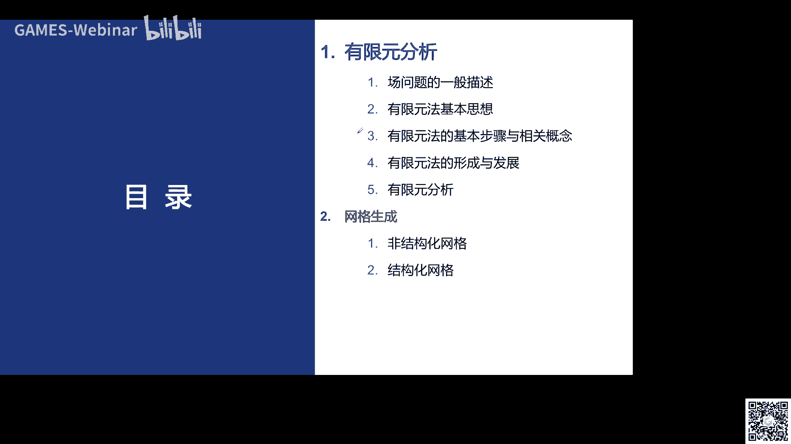
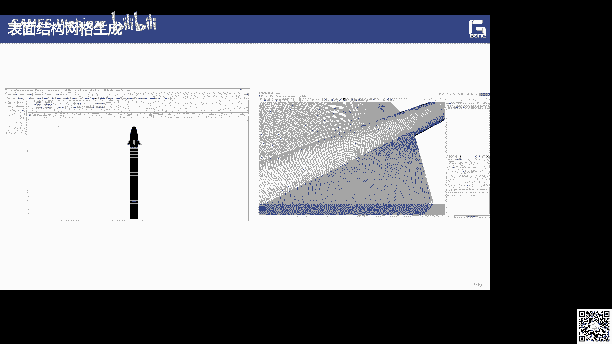
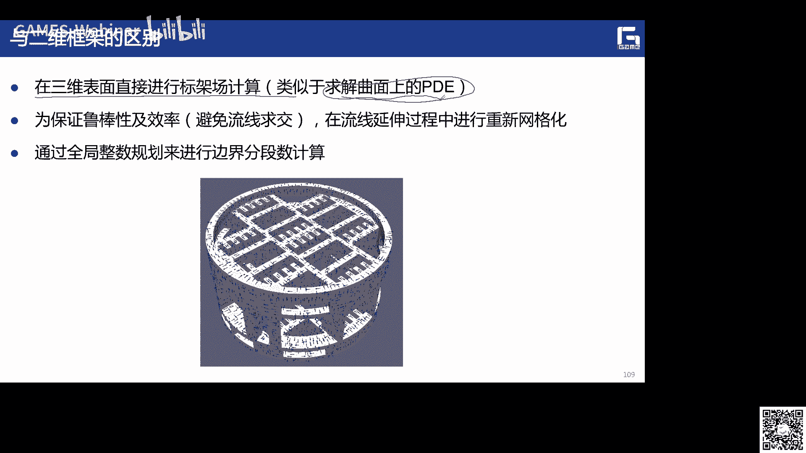
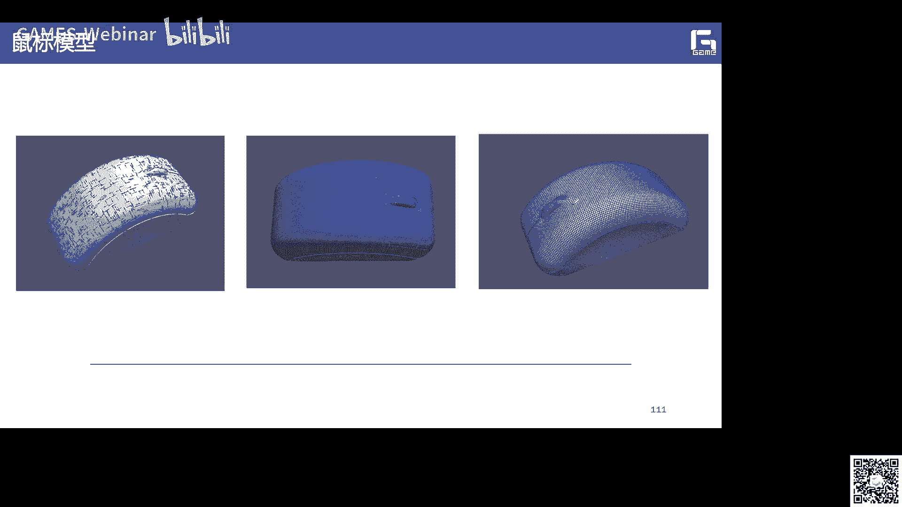
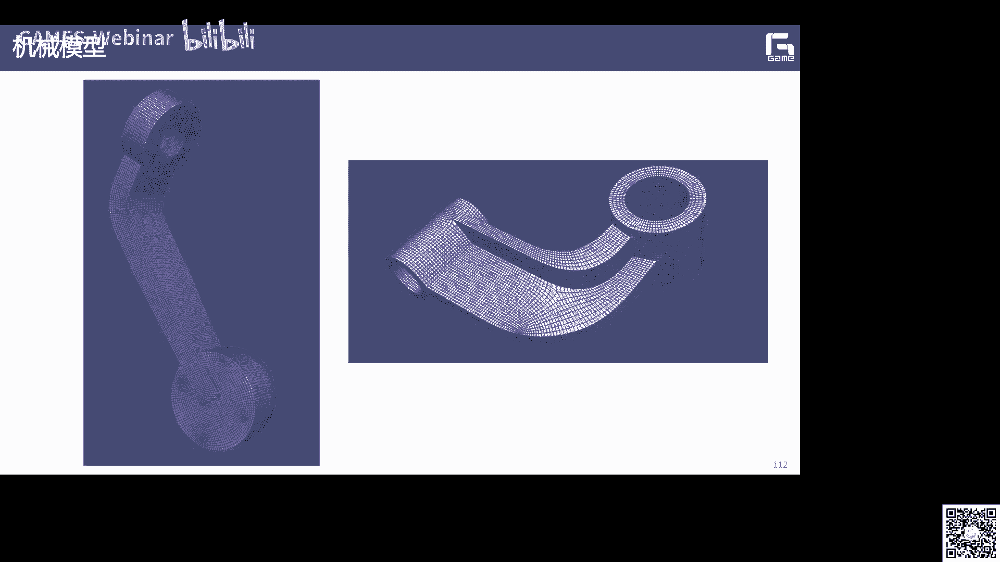
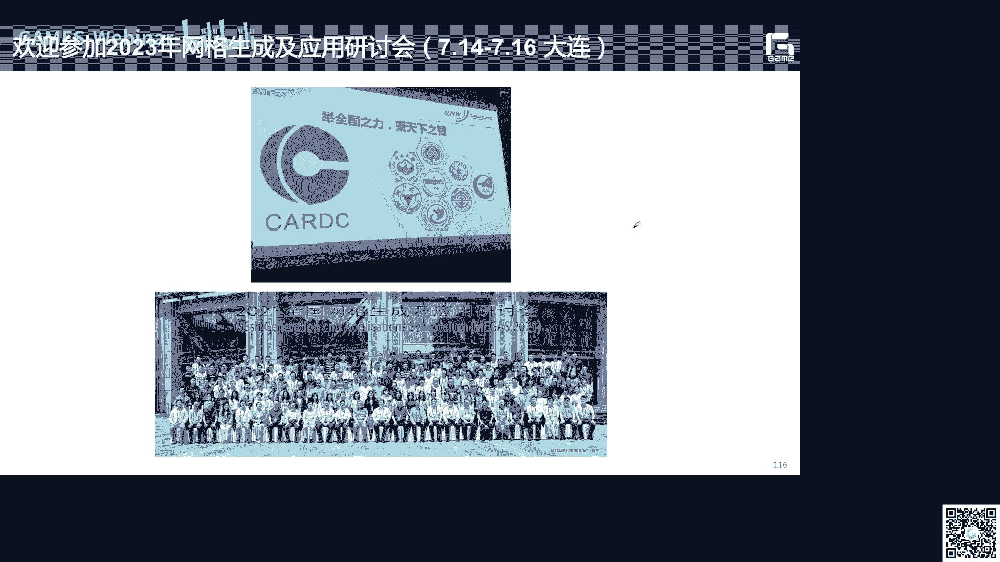

# GAMES302-等几何分析 - P3：3. 有限元分析与网格生成 - GAMES-Webinar - BV1dM4y117PS

好那我们现在开始吧，我这个画面因为那个格式的原因，我现在用的这个w ps。

所以呃可能稍微有点那个没有铺满整个画面，那么就先先这样吧，非常欢迎大家来参加，我们这个第三讲的这个课程，也是我们第三次我们说等几何分析呢，它是有限元分析的一种呃，推广对吧，那么实际上也就是说。

我们这边呢也是非常有必要给大家介绍一下，这个等几何分析啊，他的一些基本的概念啊，基本的思想，那么啊不对啊，是有限元分析啊，他基本的概念和基本的思想，那么有限元分析呢，实际上是在我们cae软件里面。

是非常重要的一个呃一个方法，那么网格生成呢是有限元分析了，一个非常重要的一个前面的一个基础，所以我们也会在这边呢简单的给大家介绍一下，这个网格生成的啊，一些基本的方法，还有一些大概的这个分类。

包括介绍一下我们在呃，特别是结构化网格生成啊所做的一些工作。

这是我今天给大家这个介绍的这个提纲啊，那么首先呢再给大家介绍这个有显性分析啊，它里面这个物理仿真编制问题，一般描述是什么样子的，然后啊介绍有限元方法的这个基本思想，包括他的基本被步骤和相关的概念。

包括这个有限元方法，他提出了这个历史发展的这个历史，那么在网格生成方面呢，我们主要给大家介绍这个非结构化网格和。

机构网格这两个字，那么实际上在工程和科学里面的，我们经常会碰到一些典型的一些问题，典型的一个问题，比如有一类问题呢，他想上是可以归结成一些呃，有知已知的一些单元体的组合，比如在我们的一些材料力学里面的。

箱梁的结构啊，建筑结构里面的一些框架结构啊，还有这种行架结构，像我们这些问题都是可以把它呃进行离散化，进行作作，作为一个离散系统对吧，像比如这边呢就是一个呃，就是一个平面的一个呃行架结构。

它长这边呢是由六个啊，承受轴向力的感的单元组成的啊，这六个大家也能看得出，这是一个一个一个一个，我六也是这个怎么想这么一个感单元，组成这么一个离散系统，我们是可以求解。

但是如果像这么一个的一个v3 系统，你很难是手工把它给解出来啊，所以说呢就需要依靠我们这个计算机啊，来进行把它进行求解，这是我们的第一类问题，就是离离散的问题啊，当然另外还有一个就是称谓是连续的问题。

就是我前面给大家讲的这个p d e对吧啊，也说第二个问题呢，它实际上可以建立他们这个应遵循的一些，基本的方程啊，基本的方程也就是说包括这个微分方程啊，有相应的这个边界条件，包括这个弹性力学的问题。

热传导的问题，还有电磁场的问题等等啊，由于建立这些基本方程啊，所研究的对象通常是一些呃，无限小的一些单元啊，那么所以这类问题呢我们称为是连续的系统，不是离散系统或者叫做物理场场的问题啊，场的问题。

那么实际上啊，就是说我们虽然啊，这可以可把我们的这个呃一些物理的仿真的，一些问题，把它抽象成一些基本方程，对吧啊，这就是一个建模的过程，也是在这个建模过程里面，实际上我已经做了很多的假设和近视了啊。

但是呢即使啊这样啊，就是你写这么一个基本方程，由于这个边界条件的限制呢，你也是很难得到它的精确的一个解析解是啊，也就是说通常只能够得到很少数，非常简单的一些计算预算，或者这个区域上的一些精确的解解。

但是对于很多的实际的我们这个工程问题啊，还是无法给出他的一些精确的解啊，精确的解，那么像这种物理的问场的问题，一般表示我们把它称为叫做变质问题，对编制问题，那么对于这种编制问题啊。

我们一般说是有这么两个非常重要的东西，第一个就是微分方程啊，也就是说我这个方程呢怎么去建立，还有另外呢就是我的边界条件啊，边界条件啊，比如说为什么把它称为编制问题对吧啊，那么实际上就是说墙上。

这个在比在这么一个arma这么一个区域里面啊，它在它的内部要满足一定的微分方程，我们叫做pd方程对吧，在这边界上要满足一定的边界条件，比如说像这个这里可以边界条件，或者一些弥漫弥漫边界条件对。

那么实际上也就是说呢，我们这里的a和b 12级，我们可以把它看成是啊，对于和右相关的一些微分算子对啊，我们还说我们这个u呢，就是我们想要求去求解的一个，未知的物理场的一个函数，未知的物理场的函数。

那么三个这边呢我们会碰到各种各样的草对吧，比如在弹性力学里面，我们碰到就是应力场，比如热传导问题里面，我们说的是温度差，那么电磁学问题我们是电磁场对吧，包括在流体力学里面，我们说比如一些流程是一些流程。

那么实际上也是说这些卡呢，你可以是一些标量啊，比如像那个温度差对吧啊，也可以是一些矢量场啊，这个位移啊，应变啊，应力等等啊，也就是实际上这个理在这个里面啊，非常重要的一点啊。

非常重要的一点就是说我是怎样去求解，相应的在这个任意区域上，它的这么一个呃偏移方程pd一的一个解啊，我刚才说了，上次在很多情况下我们是没有解析解的对吧，也就这就要求啊。

我们可能需要进行额一些离散的一些假设，然后去进行求解，也说去求解这种一般的这种编制问题啊，实际上我们是有一些方法啊，啊第一个比较经典的方法呢，就是我们叫做差分法，差分法啊。

也就是说它也是需要这个离散这个求解域，当然这个离散的这个求解域，它可能就类似于用我们的一些是差速的方法，这种方法也说，这个时候呢我们是把这个微差分呢变成微分啊，也就微分呢我是精确的求的对吧。

那商也就说大家都学过，就是说呃微分音上，很多时候可以看到差分的一个极限，对吧啊，也就说这个微分，比如说我可以呃呃du，可以写成u i减去u i减去回来的，这个称谓的东西啊，除以德尔塔u上。

也就是这个上去，我们就是就是微分的一个近似啊，然后再求解相应的这个代数方程组，代数方程组，也就是说这个时候呢他这个要求的这个边界，我一般以上的要求也是一个规则的边界，然后对与这种几何形状特别复杂的时候。

它的精度呢就比较低了啊，就比较低了，另外一个呢就是称为是等效的积分法啊，这个时候我们也比较独立，这样这种加权余量法，或者这种呃泛函的一些变分的一些方法，因为这个时候我的整体的场函数呢。

我就是用近似的函数来进行代替，然后呢，我再把相应的这个呃微分方程和定解的，这个等效积分的转化成某个泛函的变分，然后去求解相应的机制问题，机制问题，当然就是说他上次也是和我们呃，前面讲的也是一样的啊。

他就是比较适合于这种简单的一些呃，区域上的一个求解，对于复杂问题呢也是很难去纠结，那我们这边呢给大家介绍这个有限元方法啊，有线方法他的思想就我们后面会讲，就是说实际上他就是对我整个的求解意义。

进行离散啊，然后我用分片的连续的函数，这个函数你可以是线性的，也就是高阶的啊，一些或者多项式来近似的去整体物质层函数啊，因为你求解了这个物理层的函数，它可能不是多项式的对吧啊，可能是一些超函数。

或者一些和sin和sin 3角函数，来表示的一些精确点啊，也是这个时候呢我们上就需要进行，然后最后呢再把它归为一个求解线性方程，的一个这么一个问题，那么它的一些优点，就是我的节点呢是可以任意配置啊。

边界适应性好不一定是要求这个规则边界，对不对啊，从后面可以看到，那么而且呢适应于任意的支撑条件和载荷，就是和偏见对吧，而且这个计算精度啊，和你这个网格离散的网格呃的多少，还有它的这个单元。

你是用这个三角形单元结构化的，还是从非结构化的，它的形态是有关系的，而且呢精度呢是可以可控的对吧，就是我可以你如果想达到比较高的精度，可以在这个地方增加自由度，也是局部加息啊等等。

那么所以呢我下面就介绍一下这个有限元方法，这边我们很多的内容都都是接那个参考了，像这个有限元分析及应用，就是回应老师的这个呃，这本教材里面的一些内容，那么实际上就是说这个有限元分析的，这个力学基础呢。

呃实际上就是在弹性力学里面对吧，而且他求解呢，这就是用我们这个所谓的加权的产值法或者，泛泛函机制的原理，他的主要的思想就是就是离散，就是离散，数字离散，但最后形成了这个载体呢。

就是我们那就是大家非常非常关注的c e软件，就是有限元分析软件，那么它实际上它实际上这个有限元方法，它实际就是基于变分思想发展起来，一种求解我们p d e方程，的一种数字计算的方法啊。

采用这个以计算机作为手段，然后分片近似对吧啊，然后逼近整体，也就是说它的基本思想就是历史法加分辨地四，唉，历史法是我们的这个变分的对吧方法，然后分片近似的，然后我就是作为它的一个表示。

然后就可以去求解相应的这个比例方程，你要说首先它的这个就是说，我首先要把这个物求解域计算域对吧，离散成一些互不重叠，然后通过节点啊，就是我们的节点相互联系的一些值域啊，比如说三角形单元。

那么这些顶点就是我的节点是啊，也是原始的这些边界条件，也可以就被转化成这个节点上的一些边条件，然后做过程呢就是我们的网格射程是，那么在这个单元内，我再去选择一些简单的近似的函数，来分配的bk啊。

来毕竟这些未知的求解函数啊，就是分片近似了啊，那么实际上具体做法呢，就是在一些专业，选择一些合适的节点作为求解函数的差值点，然后把这些微分方程的变量，改成有各个变量和导数的节点值。

就选用了插值函数组的这个线性表达式啊，最后呢再作为把这些哎奇函数对吧，这么个节还包括每个节点上的值，每个ui，然后把它做一个，先把一个组做做成一个组合对吧，然后就会得到这个相应的这个近似解对吧。

然后我在每个单元上做了对吧，然后呢我再把这些呃所有的单元上，我都把它组合起来，然后就形成一个刚度矩阵对吧，然后建立相应的这个有线圆的方程，就是我们的刚度方程嗯，然后就可以把他的呃。

那么我的我的这个未知量是什么啊，就是我这些节点值嘛，节点除了这些要求的值对，就说做的代数方程组，然后我通过一些呃求解线性系统呢，就可以把这些节点处的这个物理场的值啊，把它给求出来，啊。

也就是说实际上就是说，从这个例子也可以看出来，我们看这个图对吧，我刚才说了，就是说这是一个非常简单的我差分的对吧，因为差分呢他要求比较规则的一些网格，就是我用这个有限差分法是吧。

实际上就是说我是只能进行这种规则的划分啊，也就是大家可以看到它实际上在一些边界上上，他就说这不适如解与复杂的这个求解欲，对不对，所以他这个主要是误差还是比较大的，但是我如果用有限元方法对吧。

用有限元方法，它的就可以允许我这个单元可以是不同形状的，可以是三角形四边形，而且他们这种单元的这种拓扑连接关系，也是可以随意的对也是可以随意的啊，所以说呢我们采用一些网格生成的技术。

可以就可以把这个模型啊啊，进行任何的这种复杂几何形状的这个剖分是吧，剖分，所以这个相应的这个离散的程度呢，也是比较高的对，那么首先在这个里面就是有些人他非常重要的，就是分片对吧，分成很多单元。

然后进行近视对吧，他这个呢是我们说有限元方法的一个一个，核心问题，那么实际上这边的非常重要的就是一个，就是它的这个差值函数不怎么去设，我们一般人来说test function对吧。

这个test function就是我们所谓的态函数啊，那么这个斯坦函数呢，像在我们等结合里面也有对吧啊你说我怎么样，毕竟这些真事件啊，这个时候我们一般是采用的就是一些呃，dj的多项式函数对吧。

dj多项式函数啊，什么这里对吧，就这样来做，那么当然就说我在进行，比如这边你可以看到是一个一维的，一个有限元的一个问题，一维的有限问题对吧，那么你可以认为就是说呃，我如果这个分片数是吧，我这个折线嗯。

但是段数越多越好对吧，分的段数越多越好，那么这样的这个精度就会越高对吧，精度的越越高，也就是说实际上是对我们整个的这个求解域啊，我只要这个单元上的近似函数，它满足我们这个呃收敛性。

那么随着这个单元尺寸的这个不断的缩小啊，这个它的近视节呢最终会收敛于我们这个位呃，这个问题的这个精确点，实际上在有限元这个领域的，神像机，已经进行了一个有理论上的非常好的一个证，那么实际上在这个里面。

我们想我们说呢，最后呢非常重要的就是这个矩阵的装配问题，刚度刚度矩阵的装配问题，因为我们最终要形成一个矩阵表示啊，然后从我们这个计算机的来求解，这种大型的线性系统是吧，因为你到达之后。

可能呃你的这个未知量，还有你的这个机油度可能会非常高的啊，可能达百万或者上亿吧，10亿都有可能，所以说这个时候呢我怎么样呃，去求解这种大型的线性方程组啊，这个也是我们c e软件一个非常重要的一个呃。

一个研究的一个方向，那么实际上就是说在有限元方程的建立里面呢，我们也有很多不同的方法，常见的有三种方法，第一个就是直接刚度矩阵的这种装配方法，还有这种变分法，还有加强铲子吧，就是我们的加料金方法啊。

那么可能有些同学学过这个等级的分解，就很多说我们说加点金是一个非常重要，就说我怎么样通过分部积分对吧，然后用呃通过一些边界条件对吧，然后把它转换成呃通过一些高斯积分啊之类的，然后进行来做对。

那么刚才讲了啊，刚才讲了，实际上这个里面我们说有些方法，它的基本思想呢，呃就是说第一个非常重要的就是求解约的离散，离散那些有限的单元，然后单元和单元呢在节点处相互连接对吧。

也就是说我像这个把原来的这个连续的呃问题，把它求解于中，有一样的单元即可来进行近似的代替啊，另外一个非常重要的就是我们说的，为了查查函数，新函数或者我们称为位移函数啊，然后这个呢。

它实际上就是来表示我这个单元节点上的，它的物理量的啊，它是物理量的，那么然后基于我们这个整个的，你是不呃这个线弹性的问题，还是非线性的问题啊，还是其他的一些类型的问题对吧。

pd然后去建立这个单元节点的这个平衡方程啊，就是我们的单元的刚度矩阵啊，然后呢在借助于这种矩阵表示，把我们这种所有单元的刚度矩阵呢，把它组合成一个整体的刚度矩阵啊，那么这个时候我们就会得到一组。

以节点的物理量，也就是说我的为未知量，为自由度的一个线性方程组，线性方程组，那么在引入这些边界条件的求解，这个方程呢即可，那所以这个里面非常重要的一些呃一些概念啊，就是我们这边的，比如第一个啊。

就是第一个就是单元的概念，单元的概念啊，有这个阴影部分，就是我们可以看到四五对吧，把这个区域进行离散啊，进行分片近似对吧，那么一部分它这边每个三角形呢，就是我的一个单元，就一个单元。

然后我们这些单元的顶点啊，每个顶点这些呢就是我们所谓的节点对吧，所有节点，那么你在这这些节点上啊，可能会有一些荷载一些，比如沿着x方向的力，沿着y方向的一些力或者一些位移啊，这些就是我们要求的。

那么实际上我们可以看一些例子，比如第一个例子就是一个呃，第一个词就是我们把它看一下，这个在离散系统里面啊，在离散系统里面它的结构来怎么来离散啊，比如说这么一个问题啊，这个问题呢实际上就是说呃。

这边我们有应该是一个一维的一个感单元对吧，有一维的一个问题啊，一维一维有限元的一个问题，那么我们这边节点呢有1233个节点啊，那么你的单元呢你可以理解成有两个单元，一和二对吧，一和二。

那么这两个这两个单元啊，这两个单元我们这些就就不失一般性对吧，我们就只看这一个单元，一个单元，那么对于这个一的单元，它它要杀的是有有几个节点啊，两个节点节点一和节点二，对不对啊。

那么就可以把它这个节点处的位移呢，用一个向量来进行表示啊，就是右移位移u2 v2 对吧，然后这个节点力的向量呢，我们也一边就在这个节点处，我沿着x和方向分别作为一个节点力对吧，节点力就说嗯可以对吧。

也就在这个第一个阶段的话，我有fx 11对吧，这个分量还有f y11 对吧，那么在这个电脑也是相应的有这么两个分量，那么少，我们如果假设在这个节点一啊，沿着这个x方向的，就沿着这个方向的这个位移啊。

这个u一它是等于一的，其余的节点节点呢它的位移全是零啊，这个时候我们就可以算出来啊，它的轴向的压力，这个f一啊，f一它等于什么啊，就这么一个表达式，其实这个a啊，这个a啊它就是它的横截面面积啊。

然后e呢就是我们的这个材料的一些模量啊，然后呢，这个西格玛，就是我们应该就是求的这个应力了啊，然后它上市后面这个夹角对吧，c也是有关系的，那么这边呢就是我们可以看到啊，我们说的就是f1 。

它就可以表示这个形式，那么实际上这边我们可以啊，这边可以说呃，那么节点一着重于单元一上的力，在x y的分量，我们就可以还可以进去，把它写成这个f y11 对吧，那么可以写成k211 对吧。

然后呢f1 sunset是这样，我们可以这样写吧，然后呢，我们这个这个相应的，我们把这个f一的表达式代入到这个里面对吧，然后就会得到这个东西，然后相应的f x1 a呢也可以写成就是k1 ，k11 啊。

然后写成这个形式，而我们说在在这个节点二上，在这个节点二上，他的这个呃这个方向呢好在一这个节点处，它应该是大小相等，方向相反对吧啊，所以说你这两个啊，这两个它只是大小相等。

就是说f y21 和f y11 啊，应该是，大小相等，方向相反对吧，就这个a那么f x21 和fx 1 e呢，它应该也是大小相等，方向相反对吧，那个时候这样我们商有这么几个记号。

就是我们这里的呃这几个小k对吧，我们这边可以把它统计写成这个k i，j e的形式，它就这个e呢就是代表啊，第一个单元的第j个自由度所产生的，这个单位的位移啊，就是在其他就是自由度上的位移是零的时候。

在第二个自由度上受到力啊，我们把这个东西呢就通常称为是单元的，刚度的系数，高度的系数，那么这是单元分析对吧，所以说我们后面的，因为我们最后的我刚才说的就是，很多时候我们就是要用计算机来求解。

所以计算机的比较偏爱于这种，比如这种矩阵的表示对吧，然后我就用矩阵的表示，然后之后才再去求解，一个大型的一个线性系统啊，大型的一个线性系统啊，所以说就说如果节点一沿着x方向的位移。

u11 等于一区域节点位全为零时，那么单元一在x y的节点分量，我们可以写成阵容对吧啊，包括这个在这个节点二处也是可以这样写对啊，因为这个u一等于等于一嘛啊，所以说我是不是可以写成矩阵。

可以写成这种形式啊对吧，就是f x1 d等于啊，因为这边是一，其他都是零嘛对吧，七阶段位是位移是零嘛啊，所以我是不是可以写成这种形式对吧，而fx一就等于k11 对吧。

然后f1 y一它就等于k21 k21 啊，反正就是说啊这个时候啊它变成零，v一变成一了，对不对啊，然后所以呢我就可以把整个的呃，这么一个它们之间的关系啊，就把这四个关系啊，把它写成这么一个哎。

矩阵的一个乘法的一个形式，是矩阵的乘法的一个形式，有了这样一个形式之后啊，就这样一个一个形式之后啊，我们还可以在其他的对吧，其他的这个呃一些单位的系数，也可以把它求出来对吧啊。

所以说呢我们会就会得得到这样一个，就是在这个单元一它的节点的力平衡方程啊，就应该是这样子啊，就应该这样子，那么有了这个呢，就是实际上我们也是呃，有了节点一的这个节点力的啊，力平衡方程。

这个东西我们也可以相应的类似的啊，写出在节点二处，它的节点类的平衡方程就是这个对吧，我们有了这两个节点处了，我们现在就要对它做一个什么啊，整体的分析啊，也说着用于这个每个节点上的这个节点力啊。

它应该是平衡的啊，应该是平衡的，也就是说我所有的这些节点力额加起来，也是在这个减出它的位移，是它的是这那么外放音箱呢应该是这一，然后我们把呃和前面的这个推导结合起来，对吧啊。

我们现在就说哎怎么样把这个东西写起来，那相当于就是要加起来，那就加起来啊，那么实际上就是说大家可以发现啊，这对于我们的第一个单元和呃，第一个节点和第二个节点对吧，他应该满足这两个，所以啊类似的啊。

类似的我就可以呃把这个节点力平衡的，把前面的两个加起来对吧，然后把它就可以把它写成这么一个，作为每个节点节点的平衡，通过一个公式我就可以把它写成这种形式，形成这种形式。

而我们说刚才有个假设就是右1v1 ，它是都是呃，因为这边都是固定的嘛，所以u一等于零，v一等于零，u3 等于零，v3 等于零啊，所以说你这样一来的话，实际上我就可以变成什么东西啊，变成什么东西。

也就是说我们如果把这个边界条件，代入到这个整体方程里面，代入到整体方程里面对吧，我刚才说了，这个整体的矩阵，就是我们的k这个西格玛等于二，啊啊啊就是我的是吧啊，右边向对，然后这边呢就是我的自由度是吧。

我要求的这些位移嘛对吧，稍微要求的是什么，这边呢它它这个节点出了两个对吧，那就可以写成代入这个整体方程，就会得到这么一个啊这么一个式子啊，因为这我没说又一位三位位移，这两个节点是固定的啊，固定。

那么这样的话呢，实际上啊实际上我们就可以得到了，呃呃呃你这么一个例子来看一下，就说我对于这种一维的有限元，他在这个节点单元是吧，它是怎么样来进行整体的这个矩阵的刚度，矩阵的这个整合的啊。

那么下面我们再看另外一个例子啊，就来给大家说明一下，像我这个在，如果在所有的我所有的假设都是精确的话啊，我上这个有限元方法，它可以得到我和我们这个解析解啊，同样的一个解啊，同样的也同样的解啊。

所以说呢就是说我们这个呃可以说明啊，这个有限元它确实是有道理的对吧，是有道理，那么这个例子呢就是啊我们来看一下，就是说等截面直杆在这个这种作用的拉伸，就是我们这么一个直杆对吧，在它自身的作用下。

它的拉伸的一个情况，这边我们假设这个单位的感长的这个重量是q，他的这个感长的是l是l啊，支撑的重量是q对吧，截面面积是a这个弹性模量是e啊，弹性模量是一，那么三，我们就是说对于在这个上面。

我有一个单元的变化，就尝到一个变化，dx就是它的面源对吧，就是一个离散嗯嗯那么大家可以看看，就是我用过这种材料力，材料力学的方法也解决的方法来做，就是我们考虑这么一个微段的一个dx上面。

它的内力等于什么对吧，他应该就是它的重量乘以l乘减去x是吧，然后d x的生长就是这个呃这是什么，就是ax和我们的这个膜材料啊，还有它的这个面积面积有关的对吧，然后这样子，那我们把这个n的表达式代入进来。

就得到它对吧，那么这个x界面的位移，实际上就是对它来做一个求一个积分对吧，对它求一个积分啊，然后就会得到，然后就会得到这么一个表达式啊，这个表达式，然后我们把这个德尔的这个表达式，代入到这个积分里面。

然后对x轴下积分，这样就会得到这么一个，也就是说s界面的时候u的位移对吧，我上就等于一个e a分之q lx，减去二分之x平方啊，那么我们根据有了这个位移之后，大家都知道这个应变对吧。

它上就是d u对x求导，就可以是这个贝拉对吧，然后应力它应该就是我们这个呃，呃弹性模量乘以这个这个应变对吧，所以应该就是它就是它，那么实际上这样的话就是我们在材料类，材料力学里面。

通过一些解决方法就会得到这个东西，那么所以说我们得到这么一个位移的表达式嘛，对吧，位移的表达式嘛啊，然后说如果我取三个三个三个分段对吧，你要等段分成分成每一段都是三分之l，整体长度是l嘛。

那么说在这些地方啊，在这些地方啊，一个是三分之l，还有一个2/3 l，还有三个还有l的地方啊，他现在这个这个可以这个u啊，它像我们可以把它给算出来是吧，也就是说你把这个s代表这个u的表示。

这边就会得到这些东西啊，这是我们用材料力学一些解析的方式，把它把它求出来的，把它求出来的对吧，所以大家可以发现就是它是有解析的解，那如果我们用有限元这个有限元法来求解，求解这种直干的拉伸问题。

但也是可以的啊，当然我们这边就是涉及到结构离散的对吧，这也就是说我就假设可以把这么一个杆呢，把它分成很多段是吧，很多段啊啊先做一个离散化是吧，然后呢我这个外在盒子集中在这些节点上。

这个每一个分段的这个地方集中这个节点上啊，然后上来每个节点处，都会受到它的执行的重力的作用，相当于把这个重力的平衡到这个，每个每个节点上面啊，每个节点上面，那么也就是说在假设这个线能源这个l上面呢。

它的这个位移呢是一个线性函数啊，我们就可以把它写成这个u，x等于x加b的形式对吧，那么我在分别的单元上又分别是可以求出，在这个ui减在这个节点地方和这个节点处，它的分别的都可以把它写出来对吧。

带到这个里面上，我就可以把这个u求出来，相当于我把这个a和b呃，它的表达式求出来就对吧，嗯相当于什么，相当于我通过这个条件，还有这个条件，我就可以把a和b啊解出来对吧，a和b解出来啊。

然后可以可以得到这么一个要不要动不动，那么有了这么一个表达式之后，有了这么一个表达式之后，相应的我也可以就输入相应的这个应变，还有它的这个应力出来，然后这样的话我们实际上就是他们这个呃。

所有单元上面的这个n大n，我都可以把它求出来啊，那么求出来之后呢，我们就可以做一些单元的分析，单元分析也是他应该要满足一定的力的，对每一个比如像第二个节点对吧，一个往下压力，还有一个往上的力对吧啊。

也就是说他这个应该要满足这么一个力的，平衡方程力的平衡方程啊，我们就可以得到，那么我们把这个内力啊，还有这个位移的关系带入到这个里面，带入这个里面，也就是说呢我们实际上就会得到这个，所以得到这个。

那我对每一个单元，每一个节点我都会有这么一个方式对吧，所以说我们下面的需要就是要把呃，把这个ui求出来对吧，ui求出来啊，那么这个number i呢，它就是这个长度一个比值吧，也就是说我们这种节点位移。

表示这么一个平衡方程，实际上它应该有n个方程，未知数呢也是n个对吧，未数也是n个，我们把这个解释方程，就可以得到这个呃节点的一个位移啊，得到一个节点的位移，那么实际上是这样的话。

我们就会得到一个整体的分析和求解的，一个过程了啊，也就是我们得到这么一个平衡方程之后啊，然后我们说比如显示现在有三个节点对吧，三个节点啊，就是我们这个l一等于a l2 等于a l，三也等于a嘛。

就常驻就是a嘛，就等分的这三个三个节点，然后这样的话我就会把它分别带进去对吧，因为我们u0 是假零的啊，所以说我就会当i等于一的时候，我就会得到两倍的u一减去u2 是吧，减去u2 。

因为number i呢它是两个长度嘛，两个长度相比，是也是等于1l2 除以l一等于一对吧，所以number 91，其实我就会得到这么这么这么一个表达式对吧，当i i i i等于i的时候呢。

我把它带入到这个里面，也会就会得到这么一个一个平衡方程是吧，平衡的底约一个方程应该等四，当i等于三呢，我就会得到它对吧，你要这样的话，我是不是就得到了三个方程，三个未知数啊。

就是u1 u2 u35 的未知数，对不对啊，现在呢我就可以通过三个方程，三个未知数就可以把这个通过求解一个呃，三元一次三元一次的一个线性方程组对吧，就可以把这个u1 u2 u3 把它给求出来啊。

那分别呢就是得到这些，然后这个大家可以看一下，右一是5/2，u2 是8/2对吧，u3 是9/2啊，那么324和我们前面呃，用这个不用这种离散单元方法，用这种材料力学的这个公式推导出来的啊。

推导出来了也是5/2，8/2和9/2，对不对啊，所以说啊所以说就说呃有些人单元法，只要我在所有的假设都是精确的话啊，所有的这个影片，包括里面的这个求解过程都是精确的话，那我实际上就会得到和我们这个。

材料力学啊，这个理论上得到的这个呃解析解啊是啊，精确点就是说在节点处呢，它是完全相同的一个一个答案，这也是实际上从从理论上，就是我们通过一个这么一个简单的一个，小的例子对吧，来给大家啊说明一下。

就是说这个啊有些眼法啊，确实啊是可以啊，嗯后面这个理论上的解呢，它是比如说如果你这个所有里的这个假设啊，这些计算都是精确的，它是可以收敛到这个精确点对吧，那么商业说有些人单元方法的一个。

基本的基本概念对吧，比如说它这个里面，所以这就是说第一个就是你所研究问题的，这个数学建模对吧，你要首先把相应的这么呃，比如像一个力学问题啊，就是平面的应力问题啊，要把相应的这个呃p e啊。

或者这个里面要建模出来对吧，就是我们的数学物理方程要把它建模出来，然后呢来做一些物体的一些离散对吧，就像这个要生成这些呃，有限单元的有限单元对吧，所以说只要网格化啊，然后呢再对每个单元做一个单元分析吧。

里面的每个单元做一个单元分析，前面我们只是举了一个什么啊，一些一维的单元的对吧，那对于二维单元也是一样的对吧啊，二位单元也是一样的，然后呢再把这些每个单元分析好之后，再把整体的每个单元。

你得到的伤也是一个局部的刚度矩阵，对不对啊，然后乘以一个，乘以一个人等于一个什么东西对吧，然后再把这些刚度矩阵把把它组装起来，然后得到一个整体的分析和纠结啊，然后呢求解之后呢。

就会得到在整个的这个物体域上啊，它每个节点处的啊，只是吧，这就是我们要求的，那么商也就说呢就是这样的话，就是我们最后呢再把这些结果呢，进行可视化对吧，进行后处理，然后来看一下他评估一下对吧。

它整个的这个应力的分布啊，或者这个呢是什么样子的，因为这边的实际上会涉及到一些呃，基本的一些概念啊，第一个就是单元的概念，就是我们讲的对吧，但我想大家经过刚才我讲的这个呃。

一个刚才前面的这个例子应该理解了，就说什么是单元对吧，也就是说实际上就是呃就刚才讲了，我们这边有对一维的一个星元，这边我有两个单元吧对吧，一和222个单元对吧，那么它上就是我把这个原始结构离散后。

满足一定几何特性和物理特性的最小的结构域，另外还有一个呢就是节点的概念对吧，这边我们说有三个节点，123啊，三个节点还有节点力的概念啊，就是节点内的概念，就是我们这里的f y也就是四分两个分量对吧。

也就是单元和单元间，通过节点相互的作用的这个呃相互作用力对吧，还有节点在荷的力量，就是外力的原因啊，节点在荷的问，就我们这个x x2 和y，然后这边呢是我们施加的，所以刚才这个求解的时候，我们算xy上。

就是在我们的右边向，原料实际上是这个节点啊，节点是我们有限元方法里面，非常重要的一个概念对吧，相当于没有等级和里面的这个控制点控制点啊，其实这个说法可能也不是特别正确，应该是等几何里面的，就说。

可以理解成控制点，也可以理解成，就是说上次在我们呃有限单元法律，是我们等级和里面的，就是那些纸面片的对吧，那些那些角点对吧，那些角点或者它它内部的一些东西啊，就说实际上就大家也可以回去。

如果对大家对等你和呃有所理解的话，可以想一想啊，就是有限源和等级和里面的就这些节点啊，单元啊，他们之间的定义区别在哪，区别在哪，要在有限元里面的是相邻单元的这个作用，它是通过节点来进行重叠的。

而这个边界呢是不传递力的啊，然后实际上也就是说我们这些离散的时候，我们是要说希望对它的节点要有，一些一些一些一些要求啊，一些要求，那么实际上就是说我们这个，我们这边呢会有一些呃单元的类型。

就是说我们对应于有相应的一维问题，二维问题和三维问题对吧，那对于同一个问题，我又像这个呃一维的杆的单元啊，比如这个对吧，它的几点数就是二对吧，几点自由度就是一，你比如说还有一些二维的量的单元对吧。

它的节点数是二，但节点处的每个节点自由度呢是三啊，是因为它是两单元啊，那么还有一个平面单元，平面单元对吧，这边的节点数是三，那每个节点处呢呃它的自由度是二，因为平面四边形啊也是一样的啊，节点数是四啊。

而自由度等是二，但还有相应的比如二维的轴对轴对称的问题啊，啊板翘的单元啊对吧，这个时候他的节点数还是四啊，但是它的每个节点数它的自由度就变成三了啊，就变成三了，啊还有四面体单元对吧。

四面体单元就不对应我们的三维问题，那么它的节点数就是四面体呢，它应该有四个顶点，每个顶点数它的自由度是三，还有一个呢就是我们所谓的这个新函数，插值函数对吧啊，那么三就是说这个呢。

它是就是说我在每个节点处对吧，你最后的这个组合你可以是线性线性组合对吧，加起来是吧，那么但是呢你也可以是非线性的对吧，有一种高阶的性函数也是可以，那么那么等级和里面的就是采用样条函数。

number g函数，所以我的新函数对也受伤，就是因为我们后面呃要特别在有线里面，还要用这个要求积分啊之类的，所以我们一般要采用多项式型的也算，你最少也是个线性形式吧对吧，a x加b的这种形式啊。

还是说上级如果是高阶的话对吧，那么伤势和这个真实体会更加的接近，这也是非常容易理解，也就是说实际上这个我们所谓的新函数，插值函数啊，最后呢实际就要把它表达成什么啊，各个节点位移就一直产出奇函数的和。

就这种大家学过这个后面那个样条孔，这个曲线这些定义也是类似的，对吧啊，就是ai的时候我的差值基函数啊，然后ui的时候，在这些每个节点处的这个这个位移对吧，那么相应的整个的位置位移长。

就可以通过这种方式把它给组合起来，就大家实际上是在回过头来看，就说我这个有限元法它整个的收敛的准则对吧，比如说我影响这个有限元解的误差有哪些啊，第一个我想就是离散误差了。

也就相当于就是说比如说这边这个例子对吧，如果你这边这种直边的单元啊，直边的单元啊，我可能精确的是这个氧是弯曲的对吧，像这个一样对吧，因为我直接单元可能就是这样对吧，那么也是你无论在你的本来输入区域。

是这个弯曲的区域，但你这边是一直变的，这个本来和你的相差的形状啊，相当就比较大对吧，所以说你在上面再用多少的自由度，你得到的这个解嗯，也是也是和你实际想要的这个精确解，也是相差很大的对吧。

比如说这个离散骨传导，我想影响也是很大对吧，这也是我们等几何的一个优势体现的一个地方，那么比如说你这边可以诶提高次数对吧，提高次数慢慢提高次数就可以在这地方，最起码在这个地方。

我是可以后面这个输入的这个几何边界，非常接近，那么另外一个呢，还有就是我们的这个位移函数的这个误差，位移函数的误差，而且我们说的在这两个东西，我觉得应该是还是呃我有非常大的观点。

就是我的离散误差和位移位移函数的误差，位移函数误差，还有一个呢，就是说我在相对有限求解的时候时候，特别是变分法或者加点积分方法的时候，我会涉及到一个求解积分的问题对吧，为求解积分。

你不如a到b fx的一个积分，你在求解这个积分的时候，你是不可能用解决的方法去求解的对吧，一般我们要把它解用什么，比如高斯积分法，然后去算是吧，然后相当于高斯积分法的事情呢，就是说呃我在这个区间内。

我有一些高识点，还有高速点啊，那么fx在a和b的b的这个积分呢，就是可以标成这个fx在这些积分点处的啊，积分点处的一个一个一个线性组合的一个形式，但它前面呢也是有一些比如系数嗯，也系数。

那么实际上就是说呃这个东西呢，就是说我对于多项式啊，一般来说我是可以做到做到精确的啊，就是说确实是它是可以精确的，但如果你知f x是其他一般函数的话，就可能不精确了啊，虽然也是有的时候呃。

我在这个积分的时候也是有点误差的，还有一个误差是什么呢，就是施加边界条件，施加边界条件啊，比如说很多时候你施加的呃，在我们这个pdd里面，你试下这个编辑条件和可能和你的物理模型。

还是真正的你的受力的这个问题啊，嗯这个物理模型它还是有很大的区别啊，还是有很大的区别啊，所以这个里面是呃，影响这个有限元，他这个求解精度的一些因素，当然相应的我可以有一些解决办法对吧。

比如我既然是离散五杀，我就可以增加这个单元的网格数量对吧，你说222个单元，那我可以用呃，比如20个单元对吧，你先用这个离353呢就会少了，那么另外一个呢就是我可以刚才讲的。

就是我们这个新函数就可以用高阶多项式，就像登记和一样，那么实际上就是说这边呃，呃还有一些就是收敛性收敛性的问题啊，就是我们说啥登顶盒里面，就是我用这个二次的二次变向条和三次变向条。

你最后画出来这个收敛曲线它是不一样的是吧，好像这个在我们有限元领域，他们确实是有一些理论的一些成果的，就说这个收敛做个做个收敛速度啊，收敛性应该是呃这个次数啊，q加一对吧，in的q加一次吧。

就是他应该是要满足这么个关系啊，然后实际上是这个里面呢，就是让我们这个位移函数对吧，嗯也是提出了一些准则，第一个就是它应该包括一些常见的应变是吧，还有包括这个单元的一些呃刚性的一些位移，对吧啊。

也就是说这个单元内部呢必须连续，相邻单元间的这个位移呢应该要要协调，要满足一些协调性条件啊，协调性条件啊，这边呢我就不不仔细展开了，那么商有限元方法，有些方法呢，呃我刚才讲。

大家也通过一个例子可以看到了对吧，我说有些方法求解和我这个数学解析求解，确实啊，如果在没有任何的这个这个误差的话啊，继续计算都是精确的话，这样的我可以得到相同的解，相同的解对吧啊。

也就是说上最早呢他是在5556年的时候呢，在纽约啊这么一个三个大牛对吧，这四个，然后在这个纽约举行的航空学会年会上啊，他上就是把我们这种矩阵的位移方推广了，求解的呃，平面的应力问题。

他们就把这种结构的划分成一个，三角形和矩形的一些单元，然后一些近似位移函数来求得甘单元刚度矩阵，三就是应该有衍生出这些思想，那么在60年的时候，cd实际上在他的这么一个论文里面。

首次提出了这个f e m这么两个词吧，说是替代这个有限元的这么一个术语，啊他们后来有很多力学家和数学家，在这方面呢做出了很多好的工作，特别是数学方面啊，但我们的我们国家啊，我们国家在这个力学方面。

包括计算数学方面，也是为有限发展的方法的，这个发展呢提出了很多贡献，尊重人的贡献对吧，嗯像特别有钱，比较有名，像对比啊，前立行前立定西先生，钱伟长先生，还有芬芳先生啊，那么我们说在计算力学领域呃。

呃好像有一个就是潜力西讲，那么在计算数学领域啊，我们有一个冯康讲啊，冯康讲，像我们这些前辈呢，都在有限元的这个发展里面呢，做出了非常大的贡献，好刚才给大家讲就简单。

就是也不是简单了，就是介绍了这个有限元方法的一些基本思想呃，还有一些相关的概念是吧，给大家通过这些基本实验也就可以，我想通过一些简单的例子，大家要理解第一个呃，理解这么几个事情啊。

第一个就是说他基本思想是什么啊，就是离散对吧，就是离散啊，那么在这里面我们通过一些简单的例子，给大家说这些矩阵啊是怎么算呢对吧，然后什么，然后最后是怎么组装的啊对吧，我们想通过一些简单对复杂的例子。

也是也是类似的问题对吧，无非是呢就是说呃我们这个简单例子，我可以把它呃首推出来对吧，但是复杂的例子可能不行，就是需要我们写程序啊，通过这个软件，然后把它给呃编写出来，是另外一个呢，就是大家理解。

就说我有些人虽然是一个离散表示，但我在任何金属，它和我们这个解析表示精确的数学解，我是可以退回去的，然后就退回去，所以说呢就是说我们说有腺癌，它是有它的这个非常好的一个道理啊，那么下面呢就说非常近。

这个我们再简单介绍一下这个网格生成，网格生成啊。

因为有人说有些人里面非常重要的一点呢，就是说我给你物质在我的仿真里面对吧，我给你一个问题，然后我实际就是需要把它呃，这个区域离散成很多小的单元对吧，然后通过一些私下的一些边界条件对吧。

然后通过计算机把最后把这个呃，相应的这个物理解啊，把它给求解求解出来并可视化出来啊，所以说从这个到这个这个中间的过程啊，就是我们所谓的这个网格生成，网格生成，那么一般来说就是。

实际上是把这个区域来进行网格化，进行网格生成啊，上次和我们同学啊，因为可能我们这个群里面有很多呃，然后这同学都是来自于图形学领域了，就是说要和我们这个数字几何处理对吧，啊和网格处理啊是非常相关的啊。

首先从顶底层的这个数据结构上是非常相关的，对吧，非常相关的啊，但是啊网格生成这个问题啊，这个问题啊实际上是在计算力学里面，它来源于有限元对吧，来源于有限元啊，而我们在这个图形学里面进行网格处理了。

这些方法我们叫做数字几何处理，这些方法实际上是来源于什么啊，来源于扫描仪是吧，因为有人说从上世纪90年代的时候，我们这个三维扫描仪上是越发展的，要这硬件发展的很快，所以说我要做一些什么啊，逆向工程啊。

逆向工程啊，然后我得到一些点云，然后怎么进行点云的重建，网格的重建是有网格重建，然后我要怎么进行这个网格的这个光顺对吧，然后重新网格化是吧，网格的简化，网格的变形是吧，网格的参数化啊。

那么实际上这些内容呢，我们说都是来源于扫描是吧，来源于逆向工程啊，那么实际上是在我们说真的我们这边要讲了，网格生成，它实际上是来源的这个背景更早对吧，来源于有限元，来源有限。

那么也就是我们一般的一个网格生成的过程啊，一般来说就说我我应该讲就是说第一个啊，我要轩的把顶顶点网格化对吧，然后我怎么样去设置一些他的这个，顶点的数目啊对吧，然后我把曲线网格化是吧，曲线网画。

然后呢再把这个曲面网格化，然后我这边可能要通过一些mos，还有一些网啊，这个呃它的曲面网格的一些处理啊，然后呢再进行做这个题的网化，提到网格化啊，然后呢再去进行一些质量的评判，所以说在这个里面啊。

在这个里面也会涉及到很多的啊，第一个就是我曲曲线我怎么进行离散化，有曲线了，3万之后，我又怎么样去生成这个曲面表曲面的网，那么这个曲面网格我也是二维的平面的网格，也可以是三维表面的网格对吧。

那么到了三问题就变成了这个体网格的生成，这边又既包括了这种啊，是我们四面体网格对吧，又包括了六面体网格啊，现在还是有这个混合网格啊，包括这个多面体网格啊，那么实际上这个里面呢会涉及到呃。

很多的这个网格生成的问题，包括他的这个这个网格的表达呢都是不一样，这边上去我们我们就是呃，我借鉴了一个一个p p t啊，就他这个里面总结的非常好啊，他上就把我们一些网格生成算法呢，就第一个从大的群。

我分成了这个9号网格和非9号网好，那么在这个交网络分布里面呢，我我我每一种又分成了，相对于这种三角形四面体啊，那结构化我也有三角形四面体，那么非结构化里面也有三角形四面体，还有这个四边形六面体对吧。

那么这个相应的方法啊，相应的方法比如像结构化网格生成里面啊，他这个比如我有影射的方法啊，还有几何分解的方法对吧啊，那么像在这个映射的方法里面，我既可以用这种椭圆p d e的这种方法对吧，用pd的方法。

还有利用一些超限卡子的方法啊，还有一些这个双曲的方法等等，这边都是问我们影射的方法，影射的方法，所以说我给你个区域，我怎么样把你这个参数域里面的网格，能够很好的把它引申到一个任意的一个扭曲的。

一个区域边界里面啊，这个里面常用的很多的这个变频调和，或者一些调和方程，拉普拉斯方程啊，这个类似于椭圆方程啊，这些pd的方程，然后去去去求解的这个商务，在我们等几盒里面也有用的，对不对啊。

那么实在这个几何分件的话，在于说我把一个复杂的一个边界，一个区域，我怎么把它进行一个几个分解对吧，如果分成多块的啊，我这个多快乐呢，我可以用一些比如标价厂的方法对吧，然后呢又可以用一些啊类似于中轴。

中轴面的方法，还有一些什么啊扫掠的方法啊，包括这些子域这个这个呃影视的方法等等啊，大家对于这种非结构化的，我就给编的可能就有一些其他的，比如像这个前沿推进的方法啊，deoy的这个方法啊。

deoy 3角化对吧，嗯那么像对于这个呃四四边形和六面体的呢，我可以分为呃直接法对吧，又可以分为间接法啊，那么这个直接反弹这边呢就是一些，比如像这个对偶的一些方法，就是我给你边界。

我直接从内部把它生成出来对吧，还有一些呢就是一个组合的方法，就是我可以两个三角形合并成一个四边形啊，通过这种间接的方法去生成，应该说这个图啊，基本上啊应该把我们这个网格生成的啊一些，几个不同的方法。

对一些不同的方法都总结的很好，总结的很好，那比如说这边我们先讲讲这个比如三角形，三角形的三角形三角网格的生成啊，还有这个四面体网格的生成呃，最简单的一个就是呃这个，前沿推进啊，前沿推进啊。

实际上就说这个问题对吧，就是说我如果给你这么一个区域，我希望把在这个区域内部生成一些网格对吧，那这个前线推进的思想呢，就是我先啊把它把它连起来，插值对吧，先离散是吧，然后离散之后呢。

然后呢我每一个单元我怎么往里推对吧，往里推，这个时候呢我往里推的时候对吧，我需要考虑到这个单元和单元之间的干涉问题，然后我就去怎么连的问题啊，这个时候呢我就需要通过一定的准则，一定的方法。

然后把它给给往里给啊，渗透出来，渗透出来，这边呢就是我们有前沿推进出的，当然还有一个就是大家这个图形学里面，非常著名的得到三角化对吧，有它生存的话，可以表保证什么哎最小角最大化对吧，这么一个问题啊。

所以他送的这个质量的，三角网格的质量还是挺高的，就是在这个四边形和这个对面体方面啊，对面体方面面我们也有这个直接法和间接法，那比如这么一个对吧，我们希望能够在这个边界上，我能够在它内部生成四边形对吧。

嗯你实际上如果看成是把这个看成一个边界，把它看成一个边界，把整个看成一个边界的话啊，因为这个是三吗啊，这是六对吧，每个每个都是有呃六段，然后这个对面的分成三段对吧，然后这样我通过超限差值。

主要我就是可以生成内部的这个呃，四边形网格了，当然还有一些就是比如像那种少略对吧，我生成这个一个面，然后我可以把这么一个呃三个问题，把通过这些扫略的方式，通过少要充个六面体网格清一咳。

还有一些就是类似于block block，就是说我能够把这个物体啊，用分解成一些小的块，但目前这种分析分法呢，就是说呃很多呢都是还是通过这种人工交互啊，通过手动，然后我怎么样能够把这些分块结构啊。

把大哥能够分出来，然后呢在每一块再用超限杂志啊，或者其他的这个呃一些p d e啊方法，然后再去进行生存啊。

这边就是一些分块的方法对吧，也是目前的分块，大部分都是手工完成的啊，那么后面呢，我们也希望能够通过一些自动化的方法，能够来自动分块啊，这也是我们后面的一些目标，然后这个里面的实际就是。

我可以通过一些非常简单的啊，因为它这个它满足一能断出了好多约束，所以我就可以生成这种高质量的四分零，但你可以对他这个就是因为它的本质，它是一个扫略结构对吧，然后我们我们团队吴海燕老师。

他在呃博士期间做的做了很多问题啊，就是我怎么样能够把一个物体对吧，可以分解成一些可以扫六的一些一些部件对吧，你把它识别出来，识别出来之后，然后就可以用扫描的方式去生成，相应的六面体网格。

然后也说我有一个呃圆面，然后有个目标面，然后通过一些少量的方式就可以把它生成，另外还有一些呢就是类似于中轴了，就相当于我可以把这么一个平面区的中轴线啊，把它给抽取出来对吧，然后我通过再通过一些诶。

因为中轴是什么啊，中轴上的点就是我这个什么啊，最大内最大内切圆的这个圆心所在的点对吧，然后我通过遍历这些，然后就可以得到这个区域的这个中轴，中轴啊，通过这个中轴，我通过一些队伍操作对吧。

我就可以设成这么一个平面区域的四边形网格，破费了，那么这是中轴的一些思想是，那么实际上是我们可以看看一下，就是说在我们这种非结构的跨界，或者说非结构，就是说它不是那种真正的这个呃，都是同一个点出发。

他只有四个四条边对吧，比我们这边网络这样的，我们说如果所有的顶点啊都是这种点的话，它就是一个结构化的四边形网对吧，但是有些地方呢它可能是度数为三，或者度数负-5的，有他有这种起点的啊。

可能呢就是需要一些特殊的一些分块，特殊的一些分块啊，比如这边呢是就是用这个嗯，属于一个间接法的一个方法，就是扣帽子方法啊，他实际上就是说类似于前沿推进啊，然后我给你一个背景网格，然后我通过一些合并啊。

或者什么操作对吧，我可以慢慢的从外边界往往里面来进行推进，这一层一层推进数据，最终呢就可以通过背景网格，然后通过这种前沿推进，生成整个区域的一个四边形网格的一个表示。

也就是说这种间接法伤对于结构网格生成，结构网格生成，特别是四边形还是六边形网格是什么，我没删除，我们可以啊，行可以总结一下对吧，我们最近也做了一些工作啊，那么我认为啊，我认为啊。

就是说实际上就是说一个呃一些他的金标准啊，第一个就是要全自动啊，我不需要进行手工的去进行这种呃分块对吧，手工的进行分块，最好能够自动的这个分块啊，自动化的这个分块啊，然后呢鲁棒性要好，鲁棒性要好。

就说我对于这个你的背景网格的要求啊，还有不能那么高对吧，然后对于这些几何的要求也不高，然后对于任意的复杂的例子啊，我都能够生存的出来啊，然后生成的网格质量要高对吧，也就是起点的数目啊。

就这个度数不为四的这一点啊，它的起点的数目要少是吧，然后呢呃这个雅各比对吧，这些值呢要要要尽可能的接近一啊，而且呢它能够满足我们很多的一些计算的，特殊的一些要求对吧。

比如说像这个cfd里面正交性啊这些要求啊，还有一个呢就是说呃，要怎么样精确的保持一些边界的cd几何对吧，也就是这个里面呢，我们就有这么三个非常重要的指标，就是它的所谓的全自动鲁棒性，还有高质量啊。

高质量，那么实际上是这个在这四个里面，我想最重要的就是一个大块的区域破分对吧，也就是说就能够非常好地实现，这种大块的区域颇丰，然后我们才能够得到一个非常好的一个，高质量的网格。

然后这边呢我们最近在做一些工作，就是啊标价场引导的一些区域，部分区域破分也就三个，而且这些区剖分的问题啊是可以用到啊，趋于剖分的结果是可以用到，我们等你和的啊，什么参数化问题的啊，也就是我们下次课啊。

就会给大家介绍这个偏向等几何分析的，平面参数化和体参数化的问题对吧，主要是我们这种大块的扣分，在我们参数等几个分析的参数化问题里面，也是非常重要的一个关键的瓶颈的一个问题啊，那么下面的就对着。

我们在这方面做了一些一些小的工作，第一个就是我们提出了一些基于标价厂的，二维区域全自动四边形网平网格生成的框架啊，比如说我要对这么一个区域啊，我有一个外边界，一个矩形对吧。

还有一个那两个内边界也都是两个圆形，就相当于这边是两个孔啊，我希望在这些部分啊，我能够生成出四边形网格出来啊，那么主要的一个思想，就是去在这个区域上来进行这个呃，拉普拉斯控制方程的求解，然后能够。

首先在这个边界上对吧，我先设置一些他的一些变量厂对吧，然后呢能够在它的内部呢，我希望能够得到一个反映它边界的几何特征，覆盖整个问题的一个矢量场啊，并且结合这个矢量场与标价场呢。

他们之间的一个有一个有色关系，我们可以把现在这个矢量场转换成标价长啊，比如说我们可以通过在上面啊，通过一个得到一个时量产，然后通过求解一个p d e，得到它内部的一个这个问题，遇上了一个矢量场。

然后通过这个矢量场呢，我就可以把它转换成标价上，通过一个隐私的关系对吧，然后通过这个分析这个标价场的其结构啊，就可以发现诶，我这边呃哪些点呢，我这个七点在哪对吧，可以发现在这个边上的变压场转的比较。

然后我可以自动找出这些缺点，这些红色的啊起点也是在这个区域里面呃，我们找到了八个七点对吧，八个七点，那么根据这八个起点生成出发对吧，那我可以去研究出现在的这个蓝色的流线啊，蓝色的就是我的流线。

那么通过这些流线和七点等，我，你看我是不是就可以把这些区域都分割成了，一些大块的大块的这个四边区域对吧，大块的四边区域啊，通过这在这些四边区域上，我通过一些有设法对吧，你可以用控制方法对吧。

创业产值的方法也可以用pd的方法，然后就可以生成这种呃高质量网格对吧，这样我每一块都生成上我整个的这个区域呢，也就生成了这个计划，实现网格就生成对吧，最后呢我就会得到它内整个的一个高质量的结，果。

我们是他发现这个起点收入比较少对吧，网格质量还是可以的，那么像我们这边这个控制方程呢，就说是摆出这么一个条件，就是说啊这是一个拉普拉斯方程啊，拉布拉斯方程啊，比如这个拉布拉在这个啊mia的内部啊。

我应该要满足啊，满足呃这么一个level的方程是吧，然后呢，在我这个边界上，没有满足相应的这个dd的边界条件，就垂直吧，还有他的主页板边界条件，那么当我通过这些交叉厂或者成为这个标价厂，对吧啊。

我可以来设置相应的编辑条件，然后呢通过这个初始的场啊，通过求解刚才的pd方程，我就可以求得什么啊，相应的内部的矢量场，然后再把这个矢量场转化成像的边界层，通过这个标量场，我再去去去识别。

去找到相应的这个缺点对吧，然后就可以找到这么两个起点，我就可以送到大块破分，四边破分，然后对这些视频破分上，我再去生成相应的这个视频网，那么这边呢就是给出了我们的一些结果。

就发现这个实际就是呃这些不同颜色，红色绿色蓝色，就是我们就生成了这个四边区域的破分对吧啊，然后这次就是我们通过生成的，最后的这个网格啊，应该来说这些网格还是满足了第一个，我这个闲置的破分这个全过程对吧。

我都是自动的啊，自动的通过标价厂去去引导的啊，去诱导出来的一些啊四边网格的这个区的破分，另外这个这个起点数目也比较少啊，质量也相对比较高，他们还可以做这种多约束的去传这种分解。

就是我可能呃比如在这个自行车内，我希望你是我生成的网格对吧，它它它能够沿着这些红色的这些约束对吧，红色的约束啊，这网格呢，那么以这些红色的点作为我的这个呃，约束的边界啊。

那么实际我们也是可以通过变量的方法去生存，这边就是呃我通过这个呃变化体，这个呃是那个分区对吧，那你看到这个分区啊，实际上也是把我们这些红色的约束，作为这个区域的边界啊。

让你生出来的网格呢自然也是满足这些呃，都结束了对吧，就说实际上我们在这个里面呢，会会碰到一些问题不大问题，就我们原来呢就就是希望能够生成所有的，这个是所有这个区域啊，都是四边的啊，都是四边的啊。

那么实际上这个里面会带来一个问题，就是说呃第一个就是快速太多了啊，比如说咱这边就是我们呃，生成了一些一些区域的部分，对于这个模型，还有这个模型，生成了一些区域的普遍四面具的部分。

就发现这些有非常密的对吧，非常这个的啊，但是你可以做一些区域的简化，但你简化出来可能也也未必是我们想要的啊，像这个也相比也是非常密的是吧，要说与现有的一些商人里面，手动抛分所得到的结果相差还是比较大的。

那么还有一个呢，就是说我怎么样去满足你的尺寸约束啊，网格走向的约束啊等等啊，那么实际上我们后面就就就就想一想，就说可能也未必啊，你生成的这个四边区，生成这个区域都是四边的，都是四边的对吧。

那么我也是可以允许啊，你是这种t型区域的抛竿，或者也就是说只要是2~6边区域，我都是可以的啊，为什么是2~6边的我都可以啊，后面会讲啊，因为为什么二道里面会会，就得到2~6边的话啊。

因为在在我们上对于这种比如两边的三边的，一直到右边的啊，我们都是啊，只要给你这个区域的边界之后啊，边界这个离散段数之后啊，我们都有一个呃，都可以用包办法去生成内部的这个，四边形网格的啊。

那么我们实际上是有这么一个结果的啊，就是理论一个结果是呃，前面别人论文发表的一个结果，就说嗯主要是n大于等于二，小于等于六，我都可以通过一些显示的模板，把它给构造出来啊。

所以说呢我们就可以可能说就是不仅仅呃，只要求我生成这个区域都是四边区域啊，也可以是非四边区域啊，非四边区域就说2~6边的区域呢都是可以啊，你说这样的话，像你说我把整个的这个约束啊就把它加快了。

包括我也可以把一些尺寸的约束啊等等，把它加到这个里面啊，这个里面它就变成了一个什么啊，变成了一个整数规划问题啊，然后去求解，因为我要得到上面的分段数，这边我就跳过了，有时间关系。

那么也就是说我通过这些分段数的计算对吧啊，实际上我最后得到的，原来我认为四边区域的话啊，比如这么一个这些东西是吧，还有这些绿色的，这些都是我要满足的一些约束，对吧啊，如果是都是全四边区域的部分的话。

会得到这么一个结果，就前面那个方法是，但是如果我们是要求啊，是要求存这种非四边的对吧，22~6边的都存在的话，我最后的得到这个区域破分，你可以发现我这这边又是一个t字结果，对不对。

这边也有一些梯度结构是吧，然后我继续说这个剖分的，这个是不是就干净了很多啊，比如这个跑分三，是非常接近于我们这个用商业软件进行手工的，这个跑分的时候，他得到的这个区域分。

而我们这个部分呢是通过我们标价上诱导出来，一个自动化的pop是吧，有时候可以发现上市这两个呃，还是这个它的这个芯片结构，也已经是干净了很多了啊，也非常容易理解对吧，那么基于这么一个分辨结构在上面呢。

我就可以用我们的一些啊，2~6变的这么一个呃，没办法对吧，没办法，就可以构造出相应的这个六面四面体网格出来，四面体网格出来，那么这边呢就是构造出来这个一些网红们，可以发展，这个质量呢还是挺高的。

嗯这边是更多的一些例子啊，就是说我们正是有允许他这种非，四边区域的这种剖分啊，所以我们都会得到了这个区域剖分的结果呢，啊还是挺好的，而且我们说呢这些啊，四片区域或者非四边区域的抛喷啊。

我们上后面也是可能啊，应用到我们这个什么啊，等级和分析里面，作为参数化的一个非常重要的一个工具，这边是一个例子，就是因为我们，而且呃这边呢还是还可以满足这个边界的一些，尖锐特征，对吧，就看下。

比如像这个美女，他这个尖锐特征的，这个也是也是得到了很好的满足，而且使用了这个基点的数目呢也是比较少。

啊这边是另外一些更重要一些结果，其实我们原来的是都是把从中，先从三维生成二维，然后再返回三维是吧，中了一些影射的方法，但是后面我们想就是这个标价上的框架，是不是可以直接在身为表面的计算进行分区呢。

啊当然也是可以的，对吧啊，为什么为什么要走这个路线啊，因为你如果是比如我们一个多亏格的模型，特别是封闭的模型也是很难嗯，大家都做做过一些，如果做过一些网格参数化问题的做法，知道了吧对吧。

你必须要切一刀才能做一些网格参数化对吧，然后呢再去再去生成这个传统化的网格啊，而且你这个时候说产生这个扭曲啊，其变可能还是嗯还是非常严重的啊，所以说这个标价厂的机器。

是不是可以直接在三维表面计算平均分区呢，啊我们都能当然也是可以的对吧，这样呢这个时候呢，呃，我们就是说直接在三维表面进行，变压场的计算啊，并且就这个就类似于求解一个曲面上的pd对吧，我们如果有同学呃。

学过一些计算数学的同学都知道，我求解曲面上的p d e，和求解这个平面上的pd一啊，这个相应的这个求解的框架都是不一样的啊，都是不一样的啊，而且在这个里面，我能保证这个算法的鲁棒性和效率啊。

我们在流线延伸过程中，我们要进行这个重新网格化的过程，然后呢，再通过这个全局的整数规划，来进行这种边界分段式的计算啊，是现在我们一个区域分界处，它的这个一些呃。

相容性的一个问题是，这边就是我们啊直接在三维模型表面来进行，三维标量场的计算，上一边加上对吧，然后得到了这个分区，就我们也是可以允许这种t字的，非四边的这个结构存在，然后生成相应的这个视频啊。

四边形网格啊也会得到比较好的结果。

啊而且我们这个在保持尖锐特征方面呢，也是有比较好的一些结果的呈现。

这边是一些例子啊。

对其网格射程，现在呃是我们国内也是非常关注的一个方向啊，因为它确实是第一个，就是它是连接我们cad和cae的啊，特别是在有限元这个框架下，一个非常呃重要的一个步骤对吧，重要的一个步骤。

而且现在网格生成属于前处理的过程对吧，然后在这个前处理里面，你可能不仅仅是单纯的网格生成的算法，还有一些章几何的一些处理的一个，给一些方法对吧，一些问题啊，这个也是非常重要啊，这个也是非常重要。

另外一个是网格生成里面特别是抛分啊，这些对我们整体和内鱼来讲，也是一个非常关键的一个步骤，非常关键的一个步骤啊，像我这个呢我说我们说呢在网格生存啊，现在关注的人也是很多的，包括我们国内。

特别呃也是没有这种自主可控的，网络生活的引擎啊，然后最近几年啊，最近几年，特别是在我们这个数字风洞工程的这个，这个支持一下啊，我们这个绵阳这个气动中心啊，在唐宇飞老师的带领下啊。

像我们也是把我们全国的几个做网格的啊，一些优势单位聚集在一起啊，然后呃实际上在网格领域呢，也是先做了一些相应的一些软件平台，比如这个n w grade star是吧啊等等啊，那么在2021年的时候呢。

我我我们一个呃浙大和的行列啊，一块联合举办的，全国应该是最近的第一届的一个，网格生成的即用的研讨会，当时参会人数呢也是将近了300人啊，那么今年在2023年呢，我们在大连有大连理工大学呃。

雷达老师这个承办的呃，这个网格生成及应用研讨会呢，会在7月14号到16号啊，在大连召开啊，也欢迎感兴趣的同学和老师啊，多投稿，然后特别是一些呃企业的单位啊，如果你像这个占座也是非常欢迎。

好今天我就给大家介绍这么多，主要介绍了这个网格生成啊，这有些人分析啊和网格生成啊，那么三嗯，也希望呢就大家通过这次课能够理解啊，我们这个优先要分析它的基本的思想，是通过一些简单的例子啊。

然后知道我这个一些简单的语言分析信息，我应该怎么去做对吧，这对我们后面理解登记和分析的呃，这个求解过程呢是非常有帮助的啊，那么说网格生成的是原先分析非常重要的，前处理的步骤啊。

那是不是我们等你和就不需要网格生成了啊，那么我们前面也说过了啊，其实不是的对吧，那么我们后面就会给大家介绍，面向等级和分析的这个呃参数问题啊，所以这个参考问题三，就是和我们有限元分析的网格生成。

是类似的问题，而且里面他们可能最终呢都啊殊途同归啊，同归变成了一个什么大块颇丰的一个问题，大块颇丰的一个问题啊，也就是说实际上我们实际上说，有些人里面的这种特别是结构化混合生成，和我们登顶盒里面的呃。

特别是参数化啊，无论是这个平面传送化还是体操的问题，最后都变成了规矩，成了一个呃，现在目前大家非非常关注的一个大块颇丰啊，也说我怎么样通过一些，自动化的一些技术能够实现这种大块的部分。

进而为我们高质量网格生成，还有等级和分析的参数问题啊，提供一些呃非常好的借鉴啊，非常好的一个工具啊，这是我们呃目前大家都非常关注的一点啊，那么这个方面既有我们既可以从理论上，然后做一些呃做一些推导对吧。

又可以什么啊，又可以从一些比如b站场上这些方面呢，来做一些工作，来做一些工作啊，应该说我觉得这这两个不止这两，这两个大的这个路线，我觉得都是非常有希望啊，都是非常有希望的，好后面还有点时间啊。

看我们这个呃线上有没有一些同学，有没有一些问题，我们可以交流一下，今天因为是用了这个w ps，因为里面有些公司啊，他中国中那个ppt就又乱掉了，因为时间的关系来不及改了啊，用w ps来放啊。

所以可能没有全屏啊，而且大家谅解，就是我这边是全屏的，但是肯定在你的那个画面上，不是没有全屏，看大家有没有问题需要交流，有限元方法到底是基于理是吧，还是加滤镜啊，我的，我的理解就是离吃法。

它实际是一种变分方法的对吧，加六金山我们有加六金有限元对吧，所以说我觉得加热金，应该是有限元方法的一个子集，而力有限元呢是通过理财方法推导出来，还有同学问这个i game view安装等会给视频教程呃。

群里已经有同学这个安安装成功了，而且我们已经把那个安装的一些环境啊，还有这些都都已经呃放到我们这个github上面，大家按照那个上面的要求来一步步来，我想应该是没问题，因为有些同学已经在群里就说的。

运行是可以安装成功了，对说到这个i game will啊，说到这个啊，i game will，就是呃，我们后面呢也是希望大家能够把i game好用起来，我们现在已经把这个i gmv。

给我们这个开源的这个样条库是吧，已经放到了tt hub上，那么也是希望能够可以在上面呢能够做些输入，但也希望大家在使用的过程中，如果有一些bug啊什么之类的，可以给我们提一些a小。

这个2~6边区域都可以的，这个模板生成四边形广告模板生成论文，有的，不压产生成网格的，我们这个论文应该是有的，为啥非得非得划分为这个四边形三角形不行吗，三角形单元当然也是可以啊，就是四边形网格单元。

它实际上有的有些就是说可以有非常好的呃，呃，在有限元单元计算里面，有非常好的一个性质对吧，因为有些三角形单元你如果划分的话，它实际上只在某些方面，它无论是计算的精度啊什么之类的啊。

是啊嗯要比这个三角形要好，其实也非常容易好，非常容易理解对吧，剩下的人应该都是这种杂乱的对吧，除非你是高智能的三角形，但四边形如果是以高只能四边形的话，它实际上就是会和我们这个情况是。

非常就是沿着形状特征来分布的，对不对，还有一个就是四边形，它的一些计算里面，它实际上就是自由度比较少嘛啊，而三角形的自由度就可能比较多，所以在计算效率上也是有区别，br厂的网格生成这个文献也非常多。

那么我们也有发表的一些文章，好如果大家没有进一步的问题，我们今天的这个直播就到这儿啊，再次感谢大家，祝大家周末愉快，我们下次课会讲，这个登记和分析的参数化的一些问题，因为下次是五一假期啊。

到时候会不会上课，还还那个呃，到时再定吧，再通知在群里面再通知啊。

