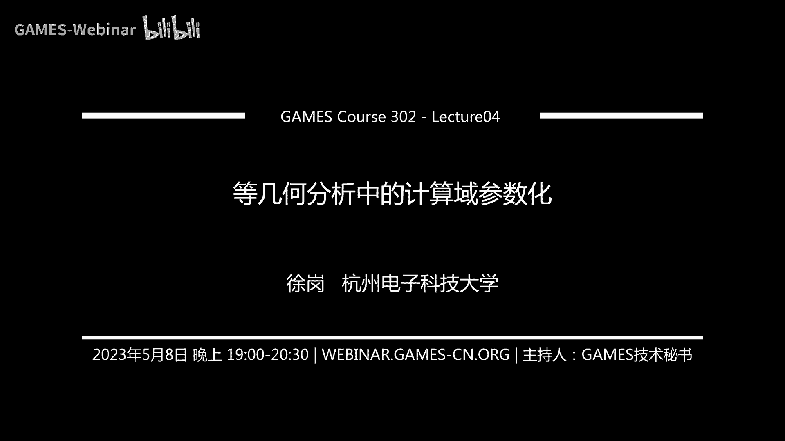
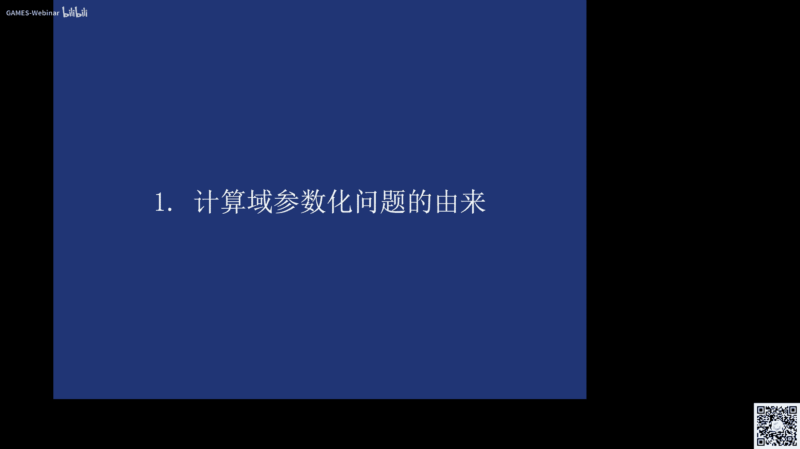
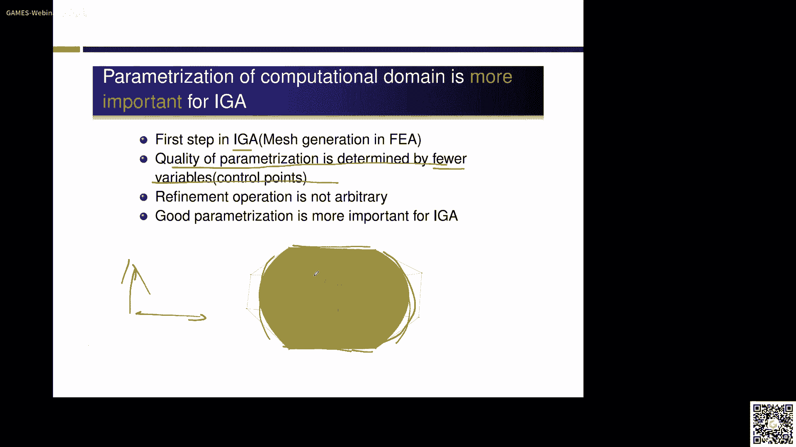
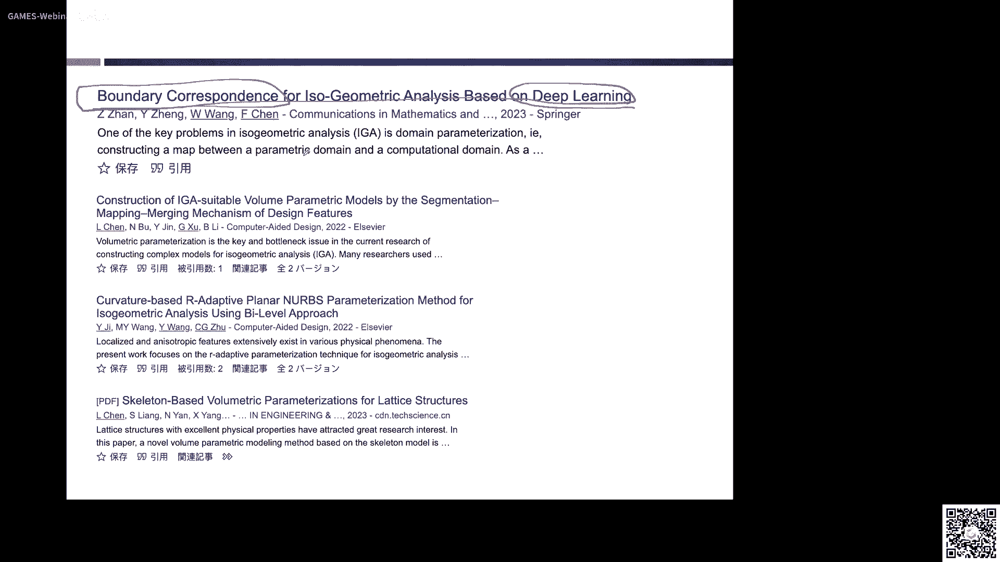
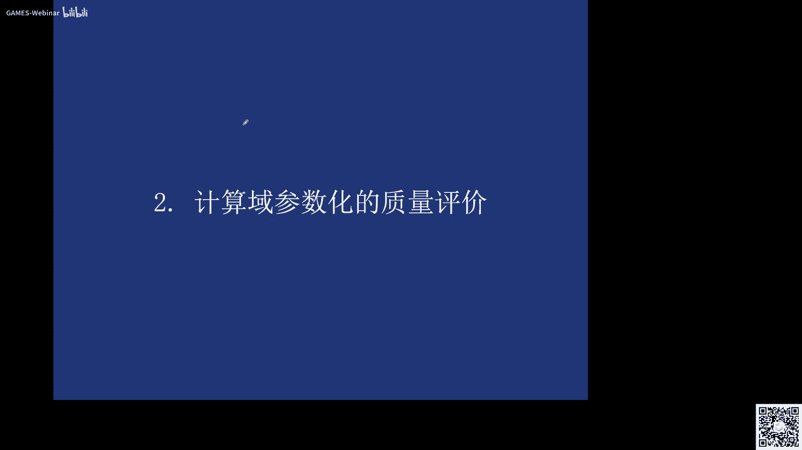
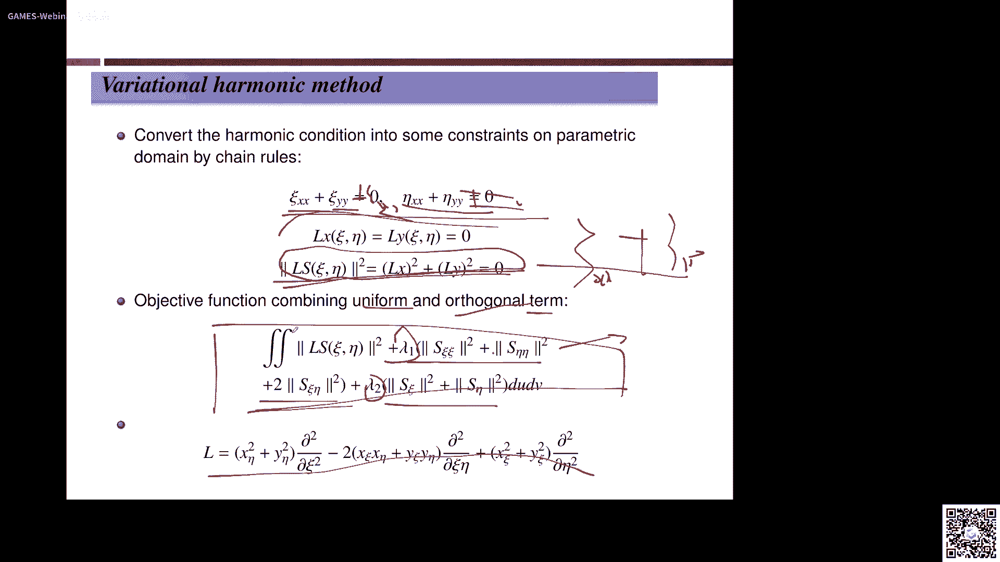
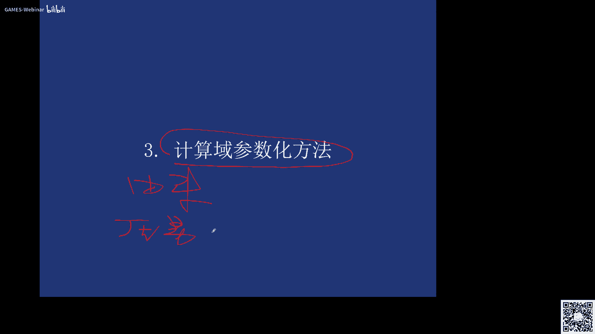
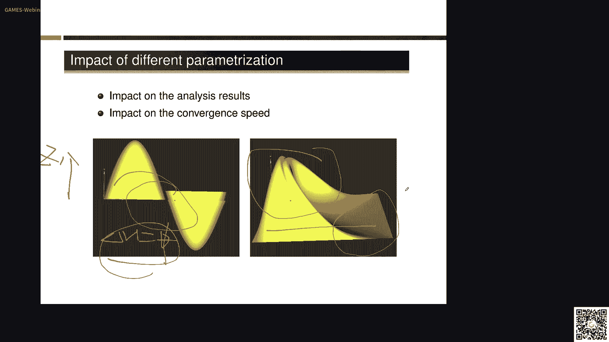

# GAMES302-等几何分析 - P4：4. 等几何分析中的计算域参数化 I - GAMES-Webinar - BV1dM4y117PS

啊各位老师，各位同学，大家晚上好，那么我们现在正式开始，刚才有那个评论区，有同学说我们这个噪音底噪有点大啊，可能确实是就我现在用的是苹果系统啊，我不知道为什么打开这个o b s这个直播软件。

他这个风扇就转得特别厉害，这个这个还请大家见谅，那么我们这次课给大家介绍，这个登记和分析中的计算与参数化，那么前面，几次课啊，前面三次课，我们上次分别给大家介绍到这个等级和分析的，这个它的一些背景对吧。

还有这个曲线曲面躯体建模，以及这个有限元分析和网格生成，那么呃因为五一假期的原因啊，我们也有这个两周没有见面，那么上一次为什么要给大家网格生成啊，实际上就是说，也是为我们这次课做一次铺垫。

通过上次课的学习啊，大家已经知道，网格生成是有限源里面非常重要的一个，前处理的步骤啊，那么对于等几何分析来讲，是不是就是啊没有这么一个前处理的步骤了，或者不需要这么一个前处理步骤，实际上是不是的啊。

那不是，也就是说呢，等级和分析呢也是需要一个前处理的步骤，那么这个前处理的步骤呢，就是我们这里的这次课要讲的这个，计算与参数化的问题啊，计算与传统化的问题，这是我今天呃所介绍的四个装部分的内容啊。

首先介绍呢这个计算与参数化问题的由来，那么然后呢介绍这个计算与参数化的，它的质量评价，那么它和我们这个呃有限元分析里面啊，有限元方法里面的这个网格，生成它的这个呃质量评价有哪些不同。

最重要的呢是我们的第三部分，也就是说这个计算域参数化的构造，在这一部分呢，我们要将重点介绍一些呃计算预算的话，呃构造的一些方法啊，当然主要是呢还是我们课题组这边的一些工作，那么最后呢给大家讲一下啊。

这个计算与传统化这么一个研究方向啊，他的一些开放性的问题还说呢，希望能对大家的注意，以后做研究啊，能够有所启发，那么首先介绍第一部分。

就是说这个计算域参数化的由来。

那么我们实际上是在前面也给大家介绍的啊，这个等级和分析的主要思想啊，他就是啊用和这个cd系统同样的表示啊，就是这个nb表示啊来表示同样的这个几何，还有相应的这个物理场，从而呢可以实现这个几何建模。

物理仿真，他们真正的从这个数学意义，也就是说这种呃数学空间上的一一字表达对吧，那么实际上在等级和分析里面啊，我们再来回顾一下啊，那么实际上它的这个计算单元啊，实际上是比较能够体现这个等几何和有限元。

它们之间的这个本质区别对吧，也就是说在等银河里面的这个计算单元，是我的这个样条奇函数的定义域，也是我的节点区间所对应的纸面片啊，也就是说的这个节点区间呢，它实际上就是如果回到我们的物理遇上啊。

他就自然对我们这个计算域实现了一种呃，大块的颇丰啊，那么这个大块铺分所形成的这个每一块啊，就是我们这边所谓的什么啊计算单元，计算单元对不对，而在有限元分析里面呢，我们的计算的m就是呃小的三角形。

或者这个三维问题的就是四面体是吧，那么所以呢，就是说在传统的有限元的方法里面啊，有限元的方法里面，我们希望实际上是从cad到这个有限元，我们还是希望能够把，还是需要把这个cad的这种解析的表达对吧。

这种nerous的表达，把它通过网格生成这个阶段来生成离散的网格，然后在这个离散网格上面呢，摘一种有限元方法来进行仿真分析对吧，得到你所想要的这个物理层，那么这个呢是它的一个主要的一个流程，对吧啊。

也就是说同样这个网格生成呢，是在里面只占了一个非常重要的一个地位，那我们说对于等级何来说，是不是就没有了网格生成这么一个步骤，实际上也不是的啊，也不是说也就是说呢，商是对于特别是三维问题来讲啊。

对于等级和i j来讲啊，实际上你还是不能直接在这个cad上对吧，因为我们现在这个cd系统给大家的都是什么，边界表示，边界表示，对，你说也是不能在这个边界表示上直接做什么啊，这种ig的。

除非你做翘的问题啊，或者一些一些表面的一些问题对吧啊，但是如果你要做一些结构的问题，这种需要一些实体表示的话，需要一些实体表的话可能就不行，可能就需要我通过什么啊一些体量化方法。

把它内部的液体能来给填起来，所以说呢这就是呃，也说等你和它同样需要这么一个呃，参数化的一个一个步骤对吧，怎么这么一个步骤呢，呃也是对应于我们等你和里面的这么一个，前处理的步骤，那么爷爷说呢。

当时这两者之间呢，我们说在有限元里面这种离散的网格对吧，而且等几何里面，等你和里面我们是用光滑的刀妹啊，光滑的区域使用样条来表达的这种形式对吧，那么实际上在有限元里面这个网格的质量，它的quality。

实际上也是一个在有限元分析里面，是一个非常重要的一个a9 对吧，非常重要的一个a9 ，那么啥在我们图形学或者在有些人里面，都有一些方法，就叫做比如叫remix对吧，就重新网格化，重新网格化上。

也就是说可能我原来给你的这个网格这个质量，它的这个节点的分布是不均匀标，哎你们说呢它的质量或者一些雅各比啊，又有小的单元，又大的单元大小不均不均匀对吧，可能还有些退化的三角形啊。

那么像这些呢在我们仿真的时候呢，是也是或多或少会产生一些影响对吧，那么我们通常通常需要可以用一些，重新网格化的一些算法对吧，这个如果大家学过前面的这个，数字几何处理的课程啊。

那么实验就应该付晓明老师对吧，也应该也给大家介绍了啊，里面的一些重新网格化的这些呃一些一些技术，那么实际上这个重新网格化呢，就是我来怎么样来提高这个他的一些呃，网格的质量对吧。

实际上这个在有限元里面呢也是非常重要的啊，那么对于等级和来讲啊，我这个网格质量呢又体现在哪呢，这个呢大家可以想一想啊，可以思考一下，就是我这个呃对于等级何来讲，这个网格的质量体现在哪啊。

三也是我们自然是15，是计算与传统化的这个质量，也就是说，实际上是在我们修士院士的这个书里面，他已经提出来了啊，对于等级合来讲，它面临的最大的一个挑战，就是我怎么样从边界信息啊，再把它的内部啊。

用一些三维的样条参数化表示，能够把它给填起来啊，这也是因为我想的就是，等你的分析发展到今天啊，至于它能够呃广泛应用的，非常重要的一个瓶颈问题，那么也就是说在等级和分析里面它的计算域啊。

对于二问题的就是一个什么啊，平面的一个b样条曲面对吧，就像这么一个区域，它就是我们的一个计算域啊，它就是我们的一个计算域，它就是平面的一个呃变调曲面对吧，这些白色的材料控制网格对吧，那么对于三维来说。

他的这个ig里面的计算域就是一个什么，一个有是有了右位，还有w3 个参数方向的呃，一个变量条体，变量条体就是等级和的计算与那么相应的啊，对于爱问题我们所得到的这个solution field。

就这个这个物理场对吧，我所得到的二维的数虽然它是个标量场，但是如果把这个标量场和我的这个计算意义，把它组合起来，你所得到的算是一个什么啊，我们后面也会有个例子，就像是一个什么啊，空间的一个变量调曲面。

也有说我这个平面的是吧，只有sy分量来表示它的什么计算域，那么另外一个高度啊，z的分量就是来表示这个什么啊，它的物理场，那么对于三维问题来讲，它可能就是一个比如类似于这种带颜色的啊，一个变量条体啊。

也就是说这个变量条体它的控制定点呢是什么，是有这个思维的，四维的一个一个一个一个向量的一个表示对吧，它的第四维的这个分量呢，就是来控制它的这个物理层这个分布，那么这是在等几何里面。

他的这一些基本的表示啊，就是说实际上大家一定要去理解，这么一个问题啊，把这个表示啊，就等你和他一些特殊的表示，要把它理解好啊，这样的话，你才能够真正理解这个登记河的这个精髓啊。

那么为什么我们说这个在等级和分析里面，这个计算域的参数化啊。

就显得特别重要啊，就显得特别重要啊，呃实际上我们说呢第一个啊，像这个呃计算域的这个参数化，实际上就是我们这个什么，有限元分析里面的网格生成的过程对吧，咱没时间呢是等价的，那么为什么它显得尤为重要呢。

因为我们前面讲过啊，等你和为什么会带来效率上的提升啊，是因为它的什么啊，他的这个嗯这个自由度啊，要比有些远呢来的来的更少对吧啊，那么所以相应的人呢我这个参数化的质量，它实际上最终是由什么来决定的。

唉三就是也是这个内部的控制中间，比如说对于这么一个区域，它上市由我们就是一个平面的计算域，对吧啊，他这个平面的计算域最简单的，你可以就他的理解成是由我有呃四条变长曲线，这是一条这是一条，这是一条这条啊。

这么四条变调曲线对吧，围成了一块这么一个棕色的区域啊，那么这么一块中色区域的话，你最后要把它会变成这个b样条表示对吧，变量条表示啊，实际上这边的话大家都知道呃，如果我给你了这个四个边界的。

它的这个这条曲线的话，像这个这个样条曲面的什么，他的这两个方向的这个节点信息对吧，也就确定了，那唯一不确定的是什么呢，唯一不确定的就是这四个绿色的控制，顶点的位置，对不对啊。

也就是说只要对于中午给你这么一个区域来讲，这四个控制顶点的位置，你是可以任意放置，你是可以任意放置，但是不同的放置的对不同的放置的方式，可能会带来什么不同的这个参数化的，这个结果对吧。

那么你相应的这个参数化的质量呢，呃也就不一样，所以说呢就是我们这边我这边想说的是，就是说就是因为在等你和里面，他的这个呃进度唉比较少是吧，所以说呃它的质量是完全只有这，比较少的自由度来确定。

所以说就是这四个控制零点的具体应该怎么放，就显得比较重要对吧，另外一个呢就是在等几何里面，在等几何里面，它的这个，加戏也要说细化的，为什么要做加戏，就是为了为了提高这个仿真的自由度对吧。

哎为了提高这个仿真的这个呃精度对吧，我需要增加这个自由度，所以呢就说我需要对它进行加一，加息呢，对我们样条来说，我可以进行什么节点的呃，插入对吧，我让这个节点区间变多对吧，那节点区间多了。

你现有的这个控制顶点的这个数目也就多了，对吧嗯还有一个呢就是说我可以升阶升高次数，升高刺激的话也是可以增加自由的对吧，因为大家知道这个北站曲线一个三次的，他有四个控制点，你如果把它升高到五次。

那就有六个控制顶点啊，比如说控制顶点数目，你的自由度数目就多了，那么你后面做仿真，它的精度就高了对吧，嗯所以说但是这个它和有线里面有什么不同的，有宣言里面它也有可以增加最多的方式对吧。

我也可以插入小的呃，把这个三角形进行细分对吧，给一个变成四个或者一个变成三个对吧，那么这种细分的加息的这种操作，它实际上在我们这个有线网格里面，相对来说是比较任意的，对不对，但是对于等几何来讲。

你不能任意对吧啊，特别是基于numbers的话，哎你只能说按照这两个方向啊来加对吧，来增加自由度，来插入节点或者是升高次数，但是说但是说对于我们这个呃，等你等级和分析里面的话，你上是不能够任意的加息。

我们当然后面有一些可以局部加息，比如我基于这个t像条啊等等这些来做对，这个也是可以的啊，但是呢这种任意的加息的方式呢，确实是没有像有些人那样来的这么自由对吧，来得那么自由，所以说呢我们说呢。

实际上就是说这个好的参数化，对于等级何来讲呢，就显得更加的这个重要啊，更加的重要，那么刚才讲的实际上是给你啊。

一个封闭的一个平面区的边界啊，这边都是呃同一个区域，同一个区域是它的这个边界信息啊，都是一样，都是四条标标条曲面的曲线对吧啊，那么实际上对于这个平面的时候，大家非常容易理解对吧。

我给你这个呃边界之后上这块区域，我就我就给定了对吧，但是这个区域内部它这个参数化怎么构造啊，就是不一样了对吧，也就是说你的孔子零点可以是这样，非常高质量的对吧，这样均匀的啊，毕竟是垂直的这种分布对吧。

你也是可以这种非常低质量的对吧啊非常集中，都都集中到这儿来了对吧，可能还会产生一些自交啊什么之类的对吧，也是可以这种对吧，他们所带来的是吗，虽然这两个区域你就会得到一样的。

但他为什么这个区域的参数化是不一样的对吧，所以说这也是为什么，我们在呃等级和谐分析里面啊，在ig里面把这种呃他的这个钱处理的过程，就是说啊网格生成的过程把它称为是什么啊，计算与参数化的这个过程啊。

这么一个东西，你还说呢我这个区两个区域啊是一是一样的啊，但那个区域内部的参数化呢是不一样的啊，这个这个不一样是由什么来带来的，是由这个内部的控制电缆的分布所带来的，那么这我们可以就是根据这两个呃。

平面参数化的这个结果，也是它的控制顶点的这个分布的这个情况，去是去算一些问题对吧，就算一个算一些等级和分析的问题啊，比如这边我觉得应该就是呃在这个两个区域上，分别算了一些呃。

他的这个呃呃一个热传导的一个问题啊，然后我会得到这么一个减曲面，我们叫做srs surface对吧，这是就是刚才为什么说，我们说对于二维问题来讲，我用i g a得到了这么一个标量场的表示。

和它的这个计算域复合起来，实际上就是一个空间的三维空间，的一个变道曲面，对不对啊，大家可以看到这个高度啊，这个高度这个z实际上就是它的这个什么啊，温度场的这个大小啊，越高说明这个地方温度越高啊，越低。

这边低呢就温度越低对吧啊，就大家可以看到，就是说我基于左边这个参数化的结果，所得到的这个温度差对吧，它的分布是这个样子啊，应该说它是比较贴近于我们要解的这么一个，p d e的这么一个方程的啊。

毕业这么一个方程，那么如果基于我们这个右边这么一个参数化，质量比较奇怪的啊，比较奇怪的这么一个，在这么一个参数化上去做相应的这个pd的求解，我最后得到这个solution surface啊。

啊是这个样子，为什么是这个样子的啊，因为它的参数化是不好的对吧，也就是说它实际上是在他的这个右半部分的，自由度是非常少的啊，可以说是没有的啊，所以说你最后剪出来的这么一个。

得到这么一个solution surface啊，它它只能是这个样子啊，怎么是这个样子，当然我可以怎么做啊，我可以加戏啊对吧，我可以这边如果增加一些自由度对吧，增加一些自由度。

然后这边呢就他可能就会变成变成这个样子，变成这个样子就大家可以看到啊，虽然虽然对于同样的这么一个区域啊，我我用的什么控制顶点的数目是一样的啊，但是这个控制电缆的分布不一样对吧。

那我所带来的这个呃他的这个仿真的结果啊，计算的结果啊确实有非常大的不同，而且这个不同啊，不仅仅体现在它的分析的这个精度上，而且还体现在它的什么啊，他这个收敛的速度上，对它的收敛率，收敛效率啊。

也是有这个呃比较大的这个影响，所以说呢就说这个等级和分析里面啊，这个参数化啊是一个非常重要的一个问题啊，大家也通过这个例子呢也可以看得到对吧，也就是说如果我们把这个物理场的，比如它的这个等级线啊。

变量当中一些颜色银色啊之类的把它画出来啊，这是野核对吧，哎这两个结果是一样的对吧，就大家可以看到唉这个它的呃，基于我们这个左边的这个参数化，均匀的参数化所得到的结果呢。

就比较呃比较贴近我们真这个真实的点对吧，但是基于这个差的参数化，我得到的这个解呢就比较非常奇怪对吧，和我们这个千丝线的，还是有比较大的这个距离啊，比较大的这个距离，那么这就是说呢。

我们通过这么一个简单的例子来说明一下，就说这个呃等几何的，他的这么一个，他的这个参数化呢对这个等级和分解啊，它这个影响啊，那么让我们在2013年的时候，就说这个发表了cad上一篇论文。

我们也是对这个计算与参数化质量，对分析结构的影响呢写了一篇论文啊，在有些同学呢可以去去查一下，这个时候我们也是对相应的这个商务问题，也进了一些调研啊，就是说如果你这个呃体的这个控制网格。

是这种正规的分布对吧，而另外一个体操的话呢，它的控制网格是一个呃比较一个，奇怪的这么一个分布的话啊，奇怪的一个分分布的话啊，实际上还是会有些对，他最后的结果呢是有比较大的影响对吧，包括它的收敛效率。

所以说既然这个计算与参数化啊，计算与参数化对我们这个呃，最后的这个这个这个影响呢，等你的分析这个球也影响是非常大的对吧，所以说那怎么样才能够去构造一些嗯，好的这个参数化，来满足这个登记和分析的要求啊。

就，变成了变成了呃，我们这个呃这个这个问题里面比较重要的呃，我们等你的分析里面比较重要的一个问题对吧，啊，原油商我们先从一般来说，我们就先从简单的这个问题开始对吧，我们就先来看这个平面问题。

二维问题就是说给你一个，四边的对吧，四条边界曲线bbq啊，然后我怎么样构造这个内部的这个，绿色的控制顶点对吧，然后去呃生成一个适合我们等几何的一个，参数化的结果啊。

就是我们这个问题呢可以这样这样来来来说啊，这样来说，那么三对于这二位问题上来讲，那对于三个问题上就说过，如果给你呃六个啊，对于体的问题，大家想看什么问题啊，也就是说如果我给你六个，对吧。

如果是六个边界曲面，这个计算域的边界曲面，我怎么样找到里面的一个最好的一个题材的话，也说这个体的一个最好的控制顶点的分布啊，控制网格，然后来呃呃来作为我这个计算有的传统化，比如说我们这边呢。

呃所未知的这个变量的就是什么，就是啊内部控制点的变量变这个分布是，当然这个计算与参数化问题啊，它确实啊还是呃目前来说，对于这个三维复杂问题来讲，我想我们还是可以把它称为一个open的一个问题。

open的问题你说他并没有真正得到彻底的解决啊，特别是对于这种啊有裁剪曲面的对吧，复杂拓扑啊，我怎么样去构造这种适合分析的参数化，目前仍然呢我觉得还是有非常大的空间呢，值得大家去探索，上次呃，自从这个。

我们这个一些参数化工作提出来之后啊，后面有很多人都来follow呃，follow对吧，后面也是这个先生的论文呢也是非常多的，我这边基本上就是只统计了这个，17年之后的话，后面还有很多很多论文出现啊。

但是我们大概把它分一分的话啊，可以把它分为这么四大类，我想目前应该还是还是应该就这么四大类吧，第一个就是说我怎么样去面相分析，来构造一些最优的传统化，对吧嗯，也就是说实际上这边会面临一个问题。

就是说我们刚才讲到。

刚才讲到就是说呃他要分布的均匀，要正交是吧啊，那么实际上对于特定的一个问题来讲，比如dotu等于f，我要在这个区域上求解这么一个pd 1，实际上就是说我这个控制顶点，是不是越均匀越好呢，嗯可能也未必啊。

可能也未必啊，我们只能说保证了他对大多数的问题是好的啊，就要求这个均匀啊，正交啊，这些条件对吧啊，但是对于某一个特定的问题来讲，未必均匀正交啊，就是好的啊，就是好的，那我们后面呢呃应该是比如下次课啊。

在呃呃给大家讲完这个整体核桃，它的一些基本的修甲框架之后呢，我们要给大家介绍一下，这个最优参数化这边的一些工作啊，然后这个里面就在这个有限元里面，也有类似的工作，他们叫做r ref啊，r版本就这个r加。

那么在二维方面的三，就是我觉得它应该叫做和这个remix啊，什么之类的，这个r开头的吗，应该是差不多啊，方言说，就是怎么样能够让这些控制顶点重新定位，对吧啊，然而对于某我的某一类问题啊，他这是最优的啊。

它是最优的，那么还有另外一个类的工作呢。

就是说哎我通过一些拟合的思路啊，通过一些拟拟拟合的思路啊，既然我直接构造啊，比较难对吧啊，那能不能通过一些拟合的思路来构造这样的呃，这个呃提样条的参数化呢啊当然是可以的对吧。

当然这个这个里面他们的输入呢，一般都是一些边界的一些三角化啊，那么来我怎么样去通过一些比如呃，类似于polly cuba啊，或者其他的一些股价啊之类的啊，然后我怎么样去呃，构造相应的这个体参数化的变量。

体的这个参数化的一些工作，实际上这个里面啊这个里面呢呃非常重要的啊，重要的工作呢，啊，我们这个美国这个克莱基梅隆大，学的杰西卡教授课题组呢做了很多重要的工作，在这方面还有一个呢。

呃就是说我直接直接反对吧，啊我直接从这个样条的这个边界啊，去构造适合分析的这个传统化，然后这个里面呢我可以把它分为两大类，将就是分别对于我的二维问题和商务问题，就是说平面参数化和体参数化的一些问题。

但目前我家的这个相当于这个等级和参数化的，论文呢应该也非常多了啊，我觉得可能总共加起来，我觉得也有也有上百篇了吧，可能会超过100篇了啊，那么对于这个呃，特别是最近几年应该也是呃现实中也比较多啊。

那么上我们在202011年也就12年前了，发了呃，第一篇这个关于这个呃等几何里面，这个参计算与传统化的一篇论文啊，目前的他他也已经达到了啊235次啊，235次啊，那么我们相应的也代先生这个体上的话啊。

方面呢也也发表了一些工作啊，现在的这个太尹树木呢，也是应该都是我这个发的论文里面呃，排名最靠前的这个动物的，大家都超过了100次啊，那么，实际上啊实际上就是说这边我列出了一些，就是从2年以来啊。

就是引用我们的一些一些文物的文章啊，相应的这个算数化的一些工作啊，比如像这些呃中科大清华莱老师啊，他们把这个呃t h b样条，就这种结带的多层次呃，样条把它用到这个题材的话里面，这是22年发表的啊。

包括这个黄健老师啊，我们一块合作的一个工作啊，就是我们通过这种，b形式的这个polly cube或者polly square的这种思想，在这种派系结构的简化，像这个厦大的曹曹娟老师啊。

他们把这个tcb一样调用到这个登记盒里啊，还有一些类似于这种发函数的方法等等，也都是发在一些像semi啊，c g d啊，cad啊，这这上面啊，这边的不接电了啊，这边是一些。

比如啊啊最近今年的工作也是有的啊，比如说还有这个像陈老师把这种呃，深度学习用到这个登顶盒的这个参数化里面，他们主要是解决什么呢，一些边界对应的问题也是如果给你的意思，一个蜂蜜蜂蜜的一个曲线啊。

蜂蜜的一个曲线我怎么样啊，我怎么样去找到相应的最佳的这个角点啊，最佳的角点我怎么找啊，是呃呃就是所谓的这个边界对应的问题，边界对应的问题，好这是我们第一部分啊，来给大家介绍我们这个等级和啊。

里面这个计算与参数化它的由来啊，它的由来啊，就是大家呢我也想到应该对这么一个问题呢，现在呢应该有了一个基本的理解对吧，基本的理解，那么下面呢我们介绍一下这个啊计算与传统化，它的这个呃质量评价就是什么。

到底什么样的一个参数化，它才是好的呢，啊它才是好的呢，啊我们非常希望去呃去找到这么一个答案对吧，唉那啥我们在1年的时候，我们提出了这个适合分析的这个参数化的。

这么一个概念对吧，像我们这边的主要的这个思想上，是来源于这么三点，第一个就是说我最后的这边的四个控制顶点，它的位置怎么放啊，那么第一个呢就是他应该满足这么一个条件，叫做这个体，也是说呢。

我最后形成的这个编导曲面的这个等参线，这个等差结构啊，他应该啊他应该是呃没有自交的啊，也就这些绿色的线对吧，和黄色的线啊，他们这些资产是应该没有支教的啊，也就是说我从参数域到这么一个物理句。

他们之间应该是一个什么啊，一一影视楼，one two one的一个一个一个一个影视才行对吧，比如说是凭第一个没有之交啊，那么这个等拆线这个大家应该理解了，你看那就是我对这个右方向和位方向分别。

比如这个采亚马，比如这边我采用了，比如是比如说是20分对吧，这边也是20分啊，那我就就会生成新成这些黄色的和绿色的，这个等拆线对吧，那么这个jective也就是说这个单色啊，这个他的这么一个要求。

就是要求我这些就反映的就是我这等菜业呢，它不能有支教啊，为啥不能自交呢，因为我后面求等于和呃，分析里面的我就要用到一个雅克比变换，我需要从这个物理域把它变换到参数域，然后在参数域方面的求积分是吧啊。

如果你这个变换是有直接的话，也就是说你这个两个比呢可能就不大于零的，可能就是啊对吧，小于等于零啊，这样的话实际上是对于我们这个嗯是有问题的，是有问题的，对于我们后面的基转，另外一个呢。

就是说我希望最后这个形成的这个等参线啊，这个绿色的线和黄色这个等餐结构啊，啊就是我这边不行的一些小块吗，选择单元吗，这样小的单元呢应该它应该是越接近越好啊，实际上这个也有反映出来。

就是我们这个呃在等个几何里面，它的这个计算单元啊，是啊，最好大小比较一致才比较好对吧，实际上这个对我们和在等级和在有限元里面呃，踏上也是比较一致的啊对吧，也有这个要求，另外一个呢就这样。

等产业呢最好是相互正交的啊，也就是说是相互垂直的啊，比如这边的这个黄色的线和绿色线啊，我这边的最好对称的都是90度才行，90度才行，那么有了这么这么些要求对吧，有了这么些要求。

那我怎么样去求解这么有问题呢，也就是说我怎么样由你给我的这四条边界曲线，我去构造内部的这个呃，内部的这四个控制顶点的，那么怎么样把它转换成数学模型，或者计算机的一些算法对吧。

恰好有的同学啊仔细想一想就可以想到对吧，嗯这三个条件如果把它合在一起，就是一个什么约束优化问题对吧，约束优化问题啊，也就是说我无论是非线性约束啊，还是非线性优化也好。

我总是可以把它变成一个约束优化问题对吧，我的约束是什么，哎约束是什么啊，就是我这个injective对吧，就说没有直销，这是我的约束对吧，那么我的优化是什么啊，优化就是什么啊，每一个单元尽量的均匀对吧。

尽量均匀，这就是我的目标函数啊，啊然后呃这些等参线尽量的自交对吧，这也是我的另外一个目标对吧，也就是说这样的话，就是我就把这么一个适合分析的参数化的问题，把它转化成了一个约束优化问题，约束优化问题。

但是对于约束优化问题来讲，我们来一般来讲的话，一般都要什么有什么啊，初始节啊，初始节特别对于这个非线性这个约约束来讲，对吧，那么我这个初时节怎么来构造的啊，怎么来构造的啊，实际上是。

如果大家对这个c e d比较熟悉的话啊，都都知道的啊，都知道的啊，上次我有四条边界线，边界曲线我怎么样去构造一个曲面，最简单的方法是什么啊，就是超限差值啊，特别是这个控制的什么超限杂质的方法啊。

cos上是我们前面也在介绍这个曲线，曲面建模的时候，也给大家介绍过了，对吧啊，cos是上次在我们cad基地里面，是做了非常重要的一个贡献，就是以他的名字来命名的，这么一个控制超限产值的方法。

超限材料方法三，就说我给你呃，四条边界曲线，我怎么样去构造啊，相应的曲面模型啊，这种超限差值的思想来做啊，但当时他那个那个思想呢，他这种什么啊一个解析的方式对吧，也就是说无论你这四条边界曲线呃。

是b2 条也好，还是其他的参数曲线是什么，sin cos引发的，其他的参数曲线来号主要是参数表示的，我都可以，我都可以来生成这么一个公式曲面对啊，但是我们对于我们等于和来讲呢，我们这边的是什么啊。

就是一个给你的边界呢都是b样条模型啊，所以我们这边呢呃可以怎么来做呢，可以怎么来做呢，实际上就是我们可以用把这个控制的方法，进行推广啊，当然啊我们将来讲一下，首先来给大家讲一下。

这个就是说呃怎么样才能保证它的一映射对吧，啊一映射，那么如果是一个应用设呢，呃就要买这个东西啊，就这个雅各比啊，这个雅变怎么算的呢，啊，就是我们如果假设这个b样条曲面，平面的变调曲线。

它是一种张量积的形式对吧，这是它的表达式对吧，但他对u的一阶偏导，对x方向，还有对u u的偏导y方向啊，对v的一些片段x分量，对v的偏导的y分量，它们形成这么一个矩阵啊，叫做雅克比矩阵啊。

那么这个雅各比矩阵的行列式啊要大于零啊，如果这么这个变平面的变量曲面，它满足这一个条件的话啊，满足这一个条件的话啊，那么我们说这个f u v啊，就这个平面的变量曲面它就是没有直角的。

所以形成这个等差结构就不会有直角的啊，所以说啊所以说啊这是一个什么，就是它的一个约束，我们前面讲的对吧，那么具体来讲的话，如果我们把这么一个它的这个呃，雅各比矩的行列式，就是雅各比的值。

把它让算按照这种一去运算对吧，去运算，然后我们可以知道这个求导的一些公式对吧，通过第二条的一些理论都可以把它推出来啊，上我们就是说呃如果按照账来算对吧，因为它是2x2的一个矩阵。

它的行列式呢也也比较容易写出来对吧，那写出来之后呢，我最后呢实际上这个东西啊就是这个东西呃，我是把它可以把它通过一些整理啊，按照一些b样条的一些公式啊，啊我实际上就是可以把它写成什么。

把它这个b样条曲面的雅各比的行列式啊，的值啊，它的算法呢写成一个圆，形成一个战斗机变量的形式，那么无外乎就是它的这个次数都升高了，一个是2p减一次，2q减一次对吧，因为这边是两个，你看两个求导相乘嘛啊。

所以说他这个肯定会次数升高了啊，那么我这边呢gi键就是我的这个控制系数对吧，那么实际上这样的话我就会得到一个条件，实际上就是说我们对于边条或者北京，我们前面也都学习了对吧。

它都有一个叫什么图包性质对吧啊，也就是说如果我要想让gf键这个东西大于零，我只要让什么啊，我是不是只要让这个g i g大于零就可以了啊，为什么啊，因为第二条函数它满足突破性的，也说我睡了这个图函数啊。

加起来都等于一的，当然都是大于零的对吧啊，也就是说如果jj都随着j i j都大于零，那我这个键呢肯定也是大于对吧啊，所以说这样的话呃，只要我想就是只要让这个什么j i j啊，它大于零啊。

然后我最后生成的这个编号曲面呢，它就是没有自交的对吧，没有自交，比如说我们我们进一步把这个条件，可以把它放松是吧，还有一个就是我们呃说呢，什么样的一个一个东西它才是好的对吧，这个平面参数化才是好的呢。

啊这个参数化的这个计算机参数化才是好的呢，还有一个非常重要的就是在我们有限元里面，就那个刚度矩阵的条件数，刚度矩阵的条件数啊，也是一个非常重要的一个指标啊，那么也就是说我最后把每个单元的刚度矩阵。

把它装起来啊，单元的刚度矩，主要你的声音形成一个整体的一个，刚度矩阵对吧，那么这个整体刚度矩阵它装我可以把它什么啊，这个条件数条件数把它给算出来，就是可能是dio是吧，这个条件数它实际上是表征矩阵稳定。

就求特征值了，就是表征矩阵稳定特性的一个，非常重要的一个标志，你如果条件数说是越大的话，就说明你这个矩阵后面求解起来越不稳定，而且呢啊对，特别是对于比如这个求这个线性方程组啊。

这些数字计算的一些求解器啊，它的呃你如果用一些迭代的算法的话啊，可能这个呃收敛的速度也是比较啊，慢的也是也是对他有影响的啊，所以说呢，呃这个条件数量也是非常重要的一个指标啊，实际上目前就这个像这个呃。

中科大的陈发达老师啊，他们课题组做了一些参数化的工作啊，也是就说怎么样，我通过一些嗯优化了一些方法对吧，我融入到这个最后形成了一个刚度矩阵的条件，数尽量的少对吧啊，12是在2014年的时候啊。

奥地利这个这个，约翰开普勒大学的这个啊波特教授啊，波特教授，波特ut，实际是在我们cg里面比较，也是比较有名的一个课题组啊，在他们课题组呢提出了一个呃做了一个工作啊，它实际上就是说。

研究了我这个计算域的参数化啊，包括它这个节点的分布，对这个等级和里面，它的数值稳定性的这个影响啊，那么他们里面的一个主要的一个结论就是说啊，我这个最后形成了这个高度矩阵的这个条件数，高度矩阵的条件数。

适合我们这个计算域的参数化，包括它的这个节点的这个分布啊，是有比较大的这个关系的，那么也就是说呢，他给出了一个他的一个条件数的一个上限，一个上限啊，那么我们当然后面这样了。

有了这么一个理论上的一个一个支撑的话啊，像我们说的，就是说可以根据这么一个理论支撑来去哎，优化对吧，来让我们这个就来给我们做一些指导，就说我怎么样去构造一些最好的这个参数化啊。

那么这边的一个非常重要的呃，你看这边的h1 h2 ，实际上就是说呃是他这个两个方向啊，形成了这个这个这个单元的这个大小啊，单元的大小啊，也就是说h一乘以h2 对吧。

呃如果我要让这个这个东西我要尽量的小嘛，而尽量小，让它尽量的大对吧，那么要尽量大，也就是说什么呃，大家都知道，有技能可以让这个h一和h2 尽量的相等对吧，也就是我最后申购这个单元要尽量的均匀啊。

见到的均匀，也就是说30前面我们提出的这些标准啊，再通过这么一个工作啊，实际上就是得到了一些验证对吧，得到验证，也就是说这边他给的一些原则对吧，比如说我在两个方向的这个偏导数的，这个这个模对吧。

他尽量要相等啊，而且这个他们这个偏导数求导的，尽量是要接近90元，一说我们前面提的，我们在11年提的工作就是要尽量的正交，对不对，尽量的正交啊，另一位，另外一个呢，就是说我这些小的面积的这些单元呢。

尽可能要避免啊，尽可能面避免啊，而且呢就是说呃，就是他们这个单元之间的面积的方差啊，要尽量的小，对a h的小说，尽可能这个单元之间呢它们之间要尽量均匀，尽量均匀，也就是说呢大家有兴趣的话。

可以去看一下这个这篇论文啊，开这篇论文，这篇论文给我们做参数化呢是一个非常重要的，我觉得是一个理论方面的一个支撑，那么所以呢我们后面要给大家讲一下，就是说这个计算与参数化的一些方法对吧。

好我们刚才讲了啊，一个是要求什么啊，没有正交对吧，没有自交，另外一个呢就是这个呃这些等参单元啊，要尽量的越均匀越好对吧，还有一个呢就是说我这些等参单元，这个等拆线要尽量的垂直，尽量的正交对吧。

如果我们把后面两个作为我的目标函数，把前面的这个无没有自交，就是这个j i j大于零对吧，作为我的这个约束，我就可以用一个呃最直接的一个想法呢，就用这个约束优化的思想呢去求解对吧。

约束优化的思想去求解啊，但是对于这种约束优化的问题非常重要的，里面呢就是要求什么啊，要有一个初始节啊，那么初始节我们这边用什么方法啊，就用一个我们这个furry，我也起了cad的主编。

在99年提出了一个叫做离散的一个控制方法，一个离散的超限材质的方法啊，那么这个这个想法这个问题是什么呢，实际上就是说啊，如果我给你的这个边界的这些控制顶点对啊，这就是我边界的控制定点对吧。

这些啊给你这边界的控制边界，我希望我参数化，上次就是希望把这些绿色的控制链，把它构造出来对吧，那最直接的就是这种离散的控制方法啊，这个离线的控制方法呢，他上次也用超限杂志，它你可以看成是沿着右方向的话。

我做了一些线性插值对吧，就这一步对吧，另外呢沿着v方向我又做了一些线性差值啊，把他两个加起来，但加起来之后呢，肯定多了多了这些东西啊，多了这个东西我多了，结果又减去什么呢，又减去什么呢。

减去就是我这四个角点啊，他们之间的一个一个一个一个组合啊，一些信息啊，这样的话就不多了，然后就嗯构造出来的就可以啊，形成这么一个呃内部的一个参数化的一个结果，但这么一个但它是一个非常简单的一个方法。

对不对，它里面没有任何用到任何优化的东西啊，就是一些线性的计算，线性的计算，你若简单的东西吗，你得到了对吧，没有免费的午餐，你说到了这个参数化质量，对于一些轻音可能就会有问题。

比如这边你看控制网格就自交了，对不对啊，因为这边它是一个all的边界，对吧啊，然后你就用这个用这个离散的恐龙方法，来促使构造一个一个一个一个传统化的话，它就可能会产生直交了啊，会产生直交了。

当然我们也是可以把这么一个呃，离散的孔子的这个曲面上的这个工作对吧，把它推广到这个到体上，也说我有六位三个方向，那么无外乎呢就说我这个推广的话对吧，我这个推广的话就会啥也不是那么直接的对吧。

也不是不直接，我要考虑啊这么八个交点的位置啊之类的啊，还有他的一些一线性插值对吧，那我八个角点的位置我都要把它给考虑进去，那么所以整体上显得要要复杂一些，要复杂一些。

所以我们给出了一个就是叫做离散的孔子的，一个体的构造啊，也就是对全面曲面的一个过一个一个推广，要是有的话，这个东西的话，就是说给你呃边界的六个六个曲面啊，六个边界曲面它的控制顶点。

我就可以通过这个离散的孔食疗方思想呢，我就可以把内部的这个控制电脑，它的初始位置啊构造出来，那么后面我们就说这个问题的描述啊，实际上对于我们这个体的体的这个方式呢，就是这个问题的方式呢。

就是说哎我给你边界的六六个变量曲面对吧，我怎么样构造出内部的控制定点啊，让他能够满足我们前面所提的一些条件对吧，所以说你最后生成的这个呃压态体呢，它是应该是没有直接的啊。

然后呢呃这个这个质量呢应该是呃比较高的，就主要是呃这个等差单元，甚至这个单元啊要尽量的均匀，并且等三线的要尽量的垂直是吧，所以说我们就可以把这么一个问题，变成一个约束优化问题啊，约束优化问题。

那么这个约束优化问题啊，这个约束优化问题啊，那我这个当然这个约束就是我刚才讲的，就是这个亚比个别的控制系数，这个j i j k要让它大于等大于零对吧，嗯那么其他的两个指标啊，那么这个均匀性和正交性。

我尚可以通过这些它内在的一些能量函数，作为一个近视，那比如说这一项啊，应该就是和这个正交性相关的，增加线相关的啊，相互垂直啊，增加线性相关，那么这一项就是和它的这个均匀性相关的啊，均匀性相关的。

有同学说诶，这个东西怎么会和这个呃正交性相关的啊，因为正交的话应该就大家应该知道，我应该是这两个方向的，它的点击等于零，对不对啊，就说明这两个两个向量是正交的对吧，那么点击等等我可以把它放松一下。

就说哎这个东西它应该是小于等于什么和c的，什么这个模平方加上这个它的平方啊，到1/2的，所以这个我们我们是知道的对吧啊，所以说我就放松了一下啊，把这个等于零这个东西啊，点击等于零。

这个东西啊把它放成这个样子啊，也就是说我通过呃这么一个约束优化问题，也是我们目标呢就是让这么一个能量函数啊，因为它是一个体重的问题对吧，所以它有三个传送方向啊，这么一个流量函数啊，最小啊。

并且要满足这个控制系数j i j k的待遇，然后通过这么一个求解，这么一个约束优化问题去求得啊，我这个内部的控制点的，它这个分布，这么约束呃这个优化的这个方法对吧，当然我们可以进一步的啊。

进一步的把它推广到这么一个呃多块的清洗啊，多块的清洗，而且我可能要求这个呃每一块之间比，这一块和这一块之间，不要满足一个c一连续性啊，所谓c一连续呢，就为虽然这个和我们这个啊。

曲面里面的这个c一点零呢是一样的对吧，不外乎呢就是说嗯这个表达更复杂一些，更复杂一些，这就是对连着这个可c方向，它对可c的一些偏导呢是相等的啊，那么这就是我们说啊，这是我们是一个c一连续的变调。

blog变二条体对吧，嗯也是我们前面讲过啊，就是说从曲面推广到躯体啊，呃有很多的这个问题啊，可能都是一些平行的推广啊，但是比如像这个c一连续这个问题啊，是个平行推广是吧，但是可能对于其他的问题。

还有某些问题并不是那么直接的啊，我们后面也会提到，那我想在后面花点时间啊，可能再给大家介绍一个这个我们在g cp上啊，做了发表一个工作，叫做变温调控的一个思想来做的啊，因为今天可能这个时间关系。

就是说呃，我们可能参数化这一部分呢不会完全讲完，那后面留的部分，剩下部分呢我们可以下次跟他来继续讲，那么这个变更调和，这个思想是来源于来自于哪里的啊，来自来源于什么的啊。

上去说我们主要是啊来自于这么一个结论啊，这么一个结论啊，也就是说呢如果啊如果一个影射啊，这个西格玛如果这个影射它是调和影射的话，那么它的阴影是它的阴影是，也就是说从p到s的这个区域的这个影射。

这个阴影色对吧，它就一定是one two one的，就是一一对应啊，一对应啊，也就是说实际上我们有了这么一个结论的话啊，我们说等你合里面，不就是希望能够生成这种一一映射吗，就没有直角吗，对吧啊。

那我是不是只要满足对吧，只要满足呃，让这个西格玛是调和就可以了，对不对啊，也就是说实际上这个问题就变成了，我怎么样构造这个s，我怎么构造这个呃，这个s它内部的一个控制顶点对吧，那他最后设置这个参数化啊。

对应于也就是说从西格玛到p啊，这个颜色是调和的，是public的，就mapping就可以了，对不对，那么这么一个东西，也就是说我这个p是对应的对吧，我是知道的对吧，也就是说是是我的边界曲线来决定的。

边界曲线嗯，确定之后，我这个参数预算就确定了，它包括它的节点向量啊，次数啊，这些信息就确定了对吧，所以说后面的问题就变成了诶，我怎么样找到这个s它的内部的这些控制定点，对吧，让我最后形成了这个影射。

从s到p的影射，它是一个调和影视啊，那s到p的影射呢我就可以三，就是如果这个参数域是可see it对吧，see it，那么s4 p到到p的色调音色来说，coc对我这个物理空间的这个坐标。

x和cc对我这个位置坐标啊，这两个参数方向对吧，也是要满足德尔的cos x y等于零，带的it x y等于对，有人说这样的话，所以因为目前大家都知道诶，我知道s我对我有这么一个表达式，对不对啊。

像我如果知道s，我对cca的求二阶偏导是是比较容易的对吧，但我这样反过来我是coc对x求y角偏导，我怎么来求，我怎么来求啊，所以说呢这边呢就会转化成了这么一个问题啊，转化成了这么一个问题。

那么转化成这么一个问题之后啊，转化成这么一个问题之后啊，我们那怎么样能够把它把这么一个对吧，这么一个模型，这么一个pd把它转换成我们一求解的方式呢，啊，所以我们这边呢，就需要把这边的这个调和条件啊。

把它转化成在参数域中的一些约束，对不对，一些约束啊，那么我们这边叫主用的用到的是什么啊，就是链式法则啊，就是链式法则，也就是说我可是对x的求导对吧，我可以把它变成是什么啊，把它倒一倒是吧啊。

在这个链式链式链式法则都都都学过的，我这边就不仔细推导了，那么实际上我通过推导之后呢，我们就可以把前面的这个东西啊，这个东西把它转换成，这个样子也就是说原来是这样子对吧，我把它转化成这个样子。

那么这样的，它实际上就是对于我们x对coc的这个求导啊，这个东西加起来，然后再u对对，u呢，实际上就是也是我们这个啊，x和y的这个分量对吧，你可以把它看成这个样子啊，也就是说像这样的话。

它上去变成一个什么啊，非线性的一个方程，对不对，非线性的一个pd一是吧，原来你如果对x y的话，看成一个线性对吧，但是如果我通过一些呃，那是法则啊，也类似于这个雅阁比吧，变换吧。

然后我得到了最后我得到了这么一个东西啊，双子变成一个非线的一个东西对吧，那么当这个思想啊，这个思想在网格生存里面也有啊，也有通过网格通过调和影射啊来做啊，但是我们这边的一个创新点是什么呢。

啊实际上就是说我们可以发现呢，实际上是在一些比较凸的地方，或者比较凹的这个边界的地方，它的这个单元啊还是不是那么均匀对吧，还是会产生一些呃面积，这个相差比较大的这个情形比较大的情。

所以后面呢我们呃商又做了一些创新啊，或者又做了创新，那么我们就是把呃前面的这个啊，特别是这个面积对吧，均匀性对吧，我们前面不在，所以说这个这个这个能量对吧，就是我的这个呃参数化的这个，均匀性相关的对吧。

这个能量，这就和我们这个参数化的这个正交性相关的啊，正交性相关的啊，那么我们就把这些呢，和我们前面的这个就这个东西啊，把它合在合在一起，就会变成了这么一个新的目标函数是吧，新的目标函数。

也就是说我们把这个均匀度量，和这个增加的度量啊，这两个能量函数放在一起，然后前面有个系数对吧啊，然后呢这个呢就是我们前面这个调和条件的，调和条件的放在一起是吧，那么这个l是什么啊，我们讲的。

那么这样一来的话啊，这样一来的话，我们实际上就是说啊，又变成一个一个一个优化问题对吧，我我就可以先用这个控制方法，去构造一个初始的啊，然后再用一些比如梯度下降之类的优化的方法。

然后去纠结这么一个非线性优化的一个问题，然后去纠结好，当然这个速度上效率上还是呃有待提高的啊，但是他最后的结果上确实会会比较好啊，会比较好，比如这边就是呃是这种离离散的控制嘛，就是初始构造的对吧。

就因为它的边界应该是什么样子的，就其他的三个边界还好，都是直的对吧，但这个比这个边界就就特别的凹对吧，特别的复杂啊，稍微比较复杂，那么实际上对于这个边界的话，你如果用这个控制方法直接来构造的话。

就可以发现有大量的制造区域是吧，这块区域和这块区域对吧，这都是自交呢是边比较严重的比较严重的嗯，那么对于这些自交的这个区域，我怎么样区别啊，那利用我们这个变频调高的方式对吧，大家可以看到。

就是说我可以生成这么一个传统法，那么像这个传统化，实际上就是说诶在这些呃地方，我上次是啊避免的指教了对吧，所以说，可以有效的避免地方直角，那么这玩意这是另外一个地址啊。

它的边界实际上是我们这边都看不出来了对吧，它的边界是什么样子的啊，这边边界三就是像这样对吧，像这个就是这个区域的边界是这样子的对吧，你如果用这个直接用控制方法来构造，去构造这么一个啊一团糟的一个东西啊。

一团糟的一个东西啊，也就是自交也更加严重了啊，更加严重了啊，那么用我们的这个变温调控方式，然后去构造啊，那么上去会可以有效的去避免这种支架啊，避免这种直角，当然我们也是可以啊，可以把这么一个一些结果。

把它怎么推广到这个呃体的情形啊，体的情形，当然对于体的情形的话，我就有有三个三个方向了，对吧啊，也就是说我这边呢这个，那更复杂了对吧，那就应该就是cos x对x的二阶偏导，coc对y的二阶偏导。

还有coc对z的二阶偏导对吧，然后艾特也是有三项对吧，都给你，那么还有一个什么，可是还有另外一个方向对吧，第三个方向啊也是要有这这三项加起来啊，所以说这边我也有有三个三个等式才行是吧。

那相应的把它转换之后呃，通过这个链式法则对吧，还是通过链式法则来做，我现在这个这个l啊，这个表达式啊，这个l前面的这个东西就更加复杂了，更加复杂了是吧，这个没有也是把它给简写了一下啊。

有一些记号和一些记号啊，比如a所以就是这个a2 a3 减去2x，那么这个a这个a一有什么啊，就是他们你看交付需要巨大的就是s队科技，他的这个点击他的点他的点，然后它会直接点。

所以说呢就是说呃如果对考虑三个问题，现在这个调和条件，调和影视的条件呢会呃更加的复杂啊，更加的复杂啊，当然这个推导呢还是还是能够推导出来的啊，那里面啥也不难啊，又到了啊。

大家看到就是一些就微积分的一些知识对吧，那么有了这样之后呢，我们就可以把这种呃二维的，二维的这个呃一些能量把它推广到三维对吧，那么比如这个就类似于我们我们这个，均匀性相关的啊。

那么这个呢就是我们这个增加性相关的啊，增加性相关的啊，那我们来去求解现在体上的问题，比如说我们搜一天用这个第三控制方法，将构造内部的这个呃压桃体的这些控制顶点，然后通过求解这么一个非线性优化的问题。

来得到内部的这个解，来得到这种高质量的t3 化的结果，这边也是给出一点，这就是我给出了一些对吧，边界的六个六个曲面对吧，就是相应的边界的曲线是可以看出来，可以看出来啊，这通过控制方法所构造出来的啊。

就很不均匀，质量比较差对吧，那通过我们的方法得到的就是两个一起，那我们在相应的在上面进行这个呃，等几何的求解对吧，大家可以到就是在这块上他这个呃嗯记住了，肯定是没有我们想象的那个样子对吧，像这个的话。

就是和我们这个真实的这个简单更加接近啊，更加接近这边是它的一些呃，那么我们说样条曲面，我们是有等差线对吧，那么样条体呢我们是有等差曲面了对吧，嗯那么这是对于其他的一些例子啊，就输了一些边界曲线的是吧。

就用库存的方法来做啊，然后用我们的方法来做，那还有点时间，你可以再继续往下讲一讲啊，那么这刚才讲的这个调和对吧，调和一个方法啊，变分调和啊，为什么要变分调和呢，我们就记住了这个调和的这个条件啊。

又送了一些优化的这个变身优化的一些思想啊，所以我们把它称为一个变温，调和的一个方式来做，当然现在目前的话我们所考虑的对吧，我们都假设呃我给你的这个边界都是都是参数，都是给定的对吧，都是给定的啊。

当然这也是我们一个本质的一个要求啊，就是说呃我给你边界曲线，给你边界曲面对吧，我希望把内部的这个呃控制里面把它构造出来，然后再得到一个没有自证，没有自交的啊，就是相等参与结构。

相互垂直的等差结构比较均匀的呃，一个呃计算域的参数化的结果对吧，但是有的时候呢，我的这个所给你的这个边界曲面或者边界曲线，它自身的这个参数化就不好，啊比如说这边就是一个大家都知道对吧嗯。

我对于同样的一条曲线啊，同样的一条参数曲线，我可以有多种的参数化的方参数化的形式，对不对啊，像这个圆对吧，像这个圆我可以用sin cosin，我也可以用这种nb表示来进行表示，对吧啊。

那么对于样条曲线啊，同样是样条曲线也是一样的，也是一样的，对吧啊，我既可以是一种啊这种非圆弧的参数化形式，也可以这种弧长参数化的形式对吧，这种非弧长参数化的就大家可以看到啊，就在这一部分它是非常密集的。

但是在这一部分它就是非常稀疏的对吧啊，应该说如果你基于这么一个参数化的结果，去构造这个呃，无论是平面的参数化还是体的参数化的话，你所构造出来的内部的这个呃参数化的结果，它的均匀性啊，特别是它的均匀性啊。

是不是很难达到对吧，是不是很难达到，所以说我们这边呢就就想就想啊，我能不能对我的这个边界参数化来进行优化呢，但是可以的对吧，所以这边就是我们这边这个工作的一个，主要的一个想法。

就是说我可以对左的边界来进行重新参数化啊，重新参数化啊，就是类似于我们对什么网格来进行重新网格化，一样的啊，来进行网格化一样的，你说我怎么样，哎我这个边界还是这条曲线对吧啊，但是呃它的参数表达变掉了啊。

通过这么一个参数表达的一个变换变换，我就它最后生成的这个这些曲线，这个它的参数化是非常均匀，就变成一个什么啊，我们所谓的弧长参数化啊，弧长参数化，那么怎么样来做的啊。

怎么来实现这种真正的边界的重新参数化的，就大家首先要要记住，要知道这一点，就说我在呃通过重新参数化啊，那么这个原始的这条曲线通过重新上的话之后，它的形状是不变的啊，这个大家一定要知道对吧。

它的形状是不变的，外形是没有发生变化的，变化的，只是什么指标的参数表达，变化的只是它的参数表达对吧，那么我们这边怎么来做呢，啊，实际就是就是我们这个叫做曲线参数化或者，曲面重新参数化的这个思想啊。

那么商这边我们的目标就是来构造一个最优的，mobile重新参数化变换，重新到呃最优的一个mobile变换，来对这个边界曲面或者边界曲线来进行，重新参数化，然后来得到一个高质量的一个等差结构啊。

但是呢在这个过程里面，它的这个边界的几何呢要没有发生任何改变，所改变的只是它的这个参数表达形式是吧，那么这个mobile是纯新人的话，实际上就是这里啊这个这个框框里面的这个啊。

就是相当于就是说啊我原来的这个nb是曲面，那是曲面对吧，是这样来表达一个这个有理的，差账机的一个形式，对吧啊，那么c i j是我的控制顶点那么多，i j是我的全因子，然后a i p d j。

q是我的两个方向的这个奇函数对啊，那么我现在做mobius变换，mobile重新三分化怎么来做的呢，就是把我这个的u和v分别啊换成下面的啊，也是u呢，我让它等于这个东西，we呢让它等于这个东西。

也就是说用的是关于coc的一个表达式，可视的一个表达式，v呢是关于a的一个表达式，那我们把这个变换呢就是非常著名的一个变化，叫做啊bob变化啊。

大家知道这个有个叫莫莫比五代mobile stream是吧，但在这个末末古时代就知道了对吧，就是一个蚂蚁在上面爬，怎么样，也也也也你也爬不到尽头对吧啊，就这个mobius带对吧。

那mobius变换的重新重新开的话呢，也是就这样来定义的啊，啊也就是说我就可以把这个u呢换成关于coc的，dlv呢，换成一个关于呃a它的一个表达式对吧，然后我把它带进去之后。

把它带入到这么一个r u v里面对吧，那我i u v是变成了一个什么啊，关于r c a的一个表达式对吧，那么这个表达式那肯定发生变化了呀，那它距离变成了一个什么样子啊，具体变成什么样子啊，实际上。

我们可以证明啊，我们可以证明就说把这个u换成这个表达式啊，v换成关于艾特这个表达式之后，我们会得到一个新的nx曲面啊，我们会得到一个新的，那是曲面，那么这个新的那是曲面。

这个新的那是曲面和原来的这个number曲面，iu v，也就是说这个arc it和这个i u v，它具有同样的什么控制零点啊，但他的全日制和节点向量发生了变化，发生了变化。

那么这是一个非常重要的一个结论，我们是可以把它给推导出来的啊，也就是说通过这么一个mobius变换之后，我可以实现这么一个重新参数的过程啊，那么我这个重新参数化之后，会得到一个新的novs曲面。

这个nova曲面它呃，和原来的模组曲面具有同样的控制顶点，但是具有不同的呃全因子和不同的节点向量，也就是说全意识和静电计量发生了变化，那么这个权意识变成什么字呢，啊这个这个上面加一个帽子啊。

就是我新的权益值对吧，它会变成这个形式，那么这个kl呢，就是和这边的这个阿尔法和贝塔，相关的一些东西啊，bt相关的一些东西就变成这么一个啊，所以说这样的话我们就可以有我们的目标了，对不对啊。

我们的目标是什么啊，我们希望来对这个边界曲面的这个参数化对吧，来来进行一个优化，那优化的目标是什么呢，让它这个边界参数化，边界曲面的这个参数化呢更加的什么啊，均匀它的等等，三角和光大的均匀对啊。

所以说啊我们这边的自由度是什么呢，唉你这种优化的变量是什么呢，唉是只有这里什么阿尔法和贝塔，也就是说我怎么样找到一个，最好的阿尔法和贝塔啊，然后经过这么一个mobile重新参数化之后啊，我得到一个新的。

那不是曲面，这个那不是曲面，它的等差结构更加的均匀，更加的均匀啊，这就是我们的目标对吧，好有了这么一个东西啊，有了这么一个东西啊，实际上我就我们找到了这个问题对吧。

也是我怎么样找到一个最优的阿尔法和贝塔，但我最后的冲击参考结果呢能够存在均匀，那均匀怎么办呢，啊那我们有也可以给出一个呃目标函数来，那么这个目标函数就是和我的这个等差结构的。

均匀性均匀度量相关的一个目标函数啊，有了这么一个目标函数之后，我们就上就是我怎么样找到最好的阿尔法，贝塔来满足，来优化这么一个目标函数就ok了啊，那么下面呢给大家看一个例子对吧。

这边就是说比如说是呃我边界的啊，兰博是曲面啊，这是我初始的这个边界的，这个它的一些参数化的结果对吧，就可以抬到来，这里比较挤啊，比较容易啊，但这边比较稀疏是吧，这边比较稀疏啊。

那么通过这个mobile重新参数化，找到这个呃阿尔法和贝塔之后，然后我最后得到这个b界参数化的是吧，他就肯定要比这个来的均匀是吧，来的均匀啊，那么基于这么一个基于这么一个边界的，重新参的话。

来构造相应的这个题材的话对吧，那么所得到的呢也会更加的这个体，这个等差面对吧，行政结构也更加的均匀，更加的均匀，这就是我这个最后整个的这个体态化的，它的控制的一个金额对吧，控制的这个金额啊。

所以大家可以看到这个控制定点还是挺多的，在这个例子对吧，这边是另外一个例子啊，这边那个例子大家看到这部分，他的这个初始的参数化也是比较，也是比较这个不均匀的对吧，这边比较挤对吧。

但我最后的这个结果啊就显得比较均匀啊，通过这么一个重新上的话，相应的在上面来来构造下一个这个呃，提倡法就可以，好吧，那后面的内容呢，我们呃就是下面这个，就是我们变成这个复杂拓扑的这个平面。

遇上我怎么要来构造现在的这个呃，汽车有的传统化啊，这是我平发展在这个c8 比，2018寸的这个位置，因为时间关系呢，我这边就呃就不往下进行了，我们就就停到这儿对吧，那么后面的这点时间呢。

大家看有什么问题啊，我们可以交流一下，就大家可以看到啊，首先我们通过这节课让大家来理理解，就是说啊等你和这个计算与传统化，它具体的来来呃，是来做什么问题对吧啊，他是怎么由来的对吧。

那么这个质量是什么要求对吧，我刚才说的这么几点吧，第一个就是说它的呃，这个等差结构不能有自交啊，另外一个就是它的等差结构啊，要形成这个单元啊，等参单元啊要尽量的均匀大小尽量的均匀啊。

然后这个等差线或者等菜面要尽量的垂直啊，就两个参数方向或者三个参数方向的这个图，它就要尽量的垂直对吧，还有一个我最后形成了这个呃，某个问题里面的这个刚度矩阵，组装起来的刚度矩阵。

它的这个呃条件数要尽量的小啊，要尽量的小啊，这个也是一个更更高深层次的一个指标，然后我们介绍了基本上就是呃呃三种吧，计算与参数化的方法，第一个方法就是约束优化的方法对吧，约束优化的方法。

我们可以把这么这些呃财通化要满足这些指标，变成一个约束优化的问题对吧，第二个呢就是这个变温调和的方法啊，那么为了满足这个1~1映射，我们利用了一个调和，隐私的一个优美的一个性质啊。

然后把它转换成一个啊也是一个约束，有约束问题，然后来纠结对吧，然后呢我们又研究了这个，又又又给大家介绍了这个边界的重新参数化，也说你这个边界它的这个等差结构不均匀啊，那么我怎么样啊。

能够通过一些重新参数化的方法，让边界的这个等差结构呢来到均匀啊，来到均匀，这我们也主要是这么介绍的这三个方法，三个方法，但后面呢我们还有其他方法呢，呃包括啊这个复杂的一些情形啊，包括一些开放问题啊。

我们下次课啊，下次课再给大家介绍，因为我们本来也是安排了两次过了啊，就是计算与参数化这一块啊，一个是平面上的话，一个是体操化，但我这边呢就是呃为了就不重复吧，我我是把它放到一个一个一个完整的。

一个系统的一个ppt里面来给大家介绍。

好后面大家看大家有没有什么问题需要交流的，这边有同学问高阶精度也不行吗，嗯我的理解你说的就是那个呃，如果控制零点分布特别不均匀对吧，就就像刚才那个问题，就是说他如果到了，他如果到了这一侧对吧。

哎他如果到了都集中在这一侧啊，那我上这边是没有自由度的对吧，所以说我最后得到这个结的可能是这种情况，可能是这种情况，确实会出现这个这个这种情况的啊，确实会出现这种情况的，即使用高阶。

我们以为这边已经是高阶精度了啊，有同学问控制顶点不在计算单元上计算的量产，准确吗，准确的啊，就是说我们虽然这个控制点确实不在，我们这个呃实际的雾面上，对吧啊，但是我最后的呃这个屋面上这个量产。

我最后是就是把它又把它转换到这个控制顶上，来算的啊，所以说他们之间，控制顶点和我这个屋面上的这个单元的位置，我们是有一个什么隐私关系的，对不对啊，通过g函数这个来进行影射的啊。

少爷说他可能没有像有些人那么来的直接啊，但它里面呢确实也是有一个关系，可以找得到的啊，这个是啊，没有问题，奇函数没有差值性，为什么控制点的量产要差值，这个问题我没有特别明白。

我想应该你和前面的那个那个那个这个问题，应该是类似的一个问题对吧，也就是说实际上是我虽然我们这个啊，波斯坦基函数变量基函数。

它没有像这个拉格朗日基函数那样有差之性，对吧啊，但它中间呢是通过一个呃控制定点，和这个这个曲面，这个雾面他们之间建立了一个影射关系啊，通过这个引线关系来完成的，而且准确来说这个影子关系应该是参数域。

比如说我这个呃，casu和为了这个参数域到我的s y空间，这个隐私关系来完成的啊，而不是而不是通过什么啊，而不是通过这么一个，就你说的这么一个差值，这么一个概念来来实现吧。

啊干同学们还有没有问题需要交流的，啊有同学问适合分析要求，空中网格也不能自交吗，这是一个很好的问题啊，也就是说控制网格自交并不一定代表，它的参数化真的会自交啊，因为他们两个之间是没有一个一个。

一个一定一定会计较的这么一个关系的啊，但是我可以通过一些约束对吧，因为他们控制网格和这个孩子，好像和前面那个同学问题也是类似的问题，就是我的控制网格的呃，空中网格和我的曲面上的这个雾面的这个点呢。

它是有一个隐私关系的对吧，你说空中网格自交并不一定啊，并不一定你的参数化会提交啊，所以说啊所以说就说即使空中网格直接了，我可能也是能够进行pd求解的啊，但我并不觉得空中网格增加了它这个参数化嗯。

还是适合分析的，如果同学们没有其他的问题，我们这次的直播啊就到这儿，我们下次再见啊，应该是周六晚，周六晚上七点钟。

