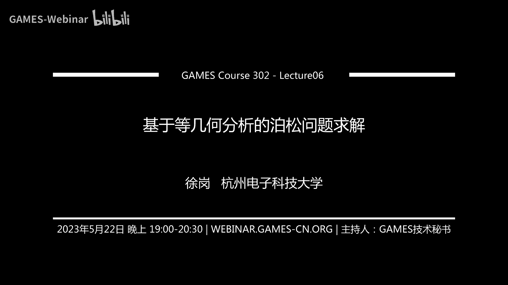
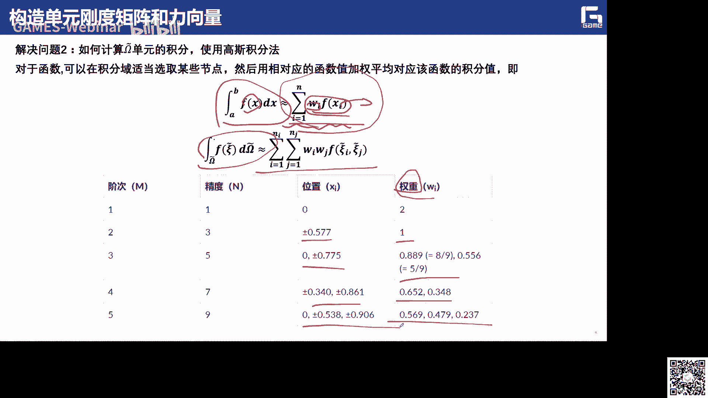
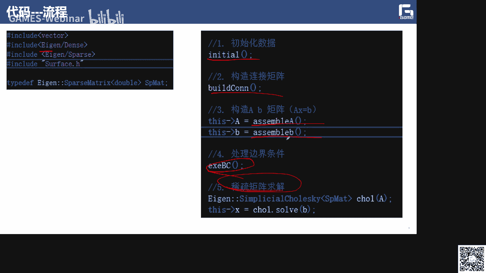
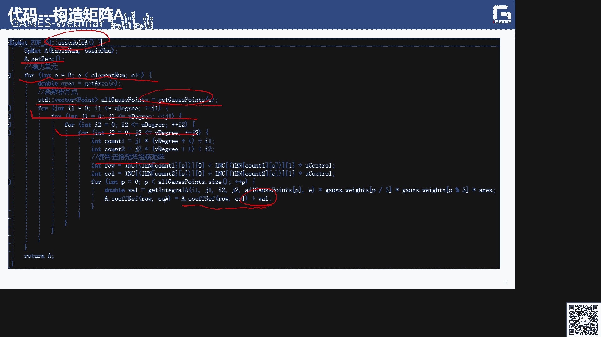
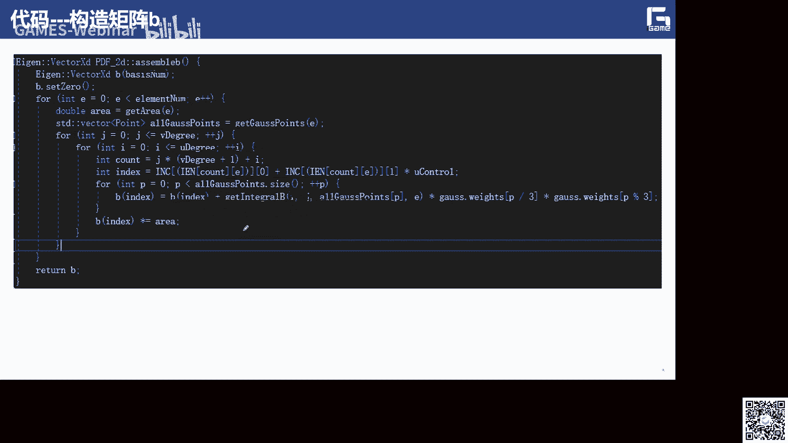
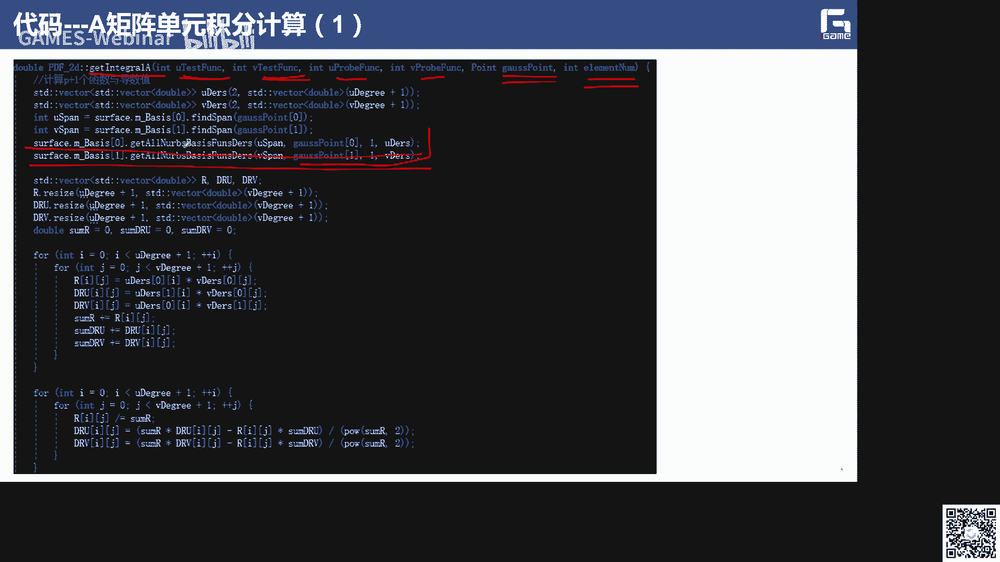

# GAMES302-等几何分析 - P6：6. 基于等几何分析的泊松问题求解 - GAMES-Webinar - BV1dM4y117PS

好各位老师各位同学，我们现在开始上课。

那么这次课呢给大家介绍，基于等级和分析的播送问题求解，我们前面几节课呢已经给大家介绍了呃，整体和分析的一些相关的一些知识，但是并没有呃，切入到就说怎么样利用等级和分析方法，来进行这种pd方程的求解。

或者一些力学问题的求解对吧，那么下面的时间就是我们会给大家来介绍，怎么样都是一种整体和分析的这个这些方法啊，整体和分析的方法，然后去求解相应的呃热传导问题啊，力学问题啊等等啊，那么播出问题呢。

应该是我们p d e里面最简单的一个，椭圆形的一个问题对吧啊，所以说呢我们这边呢就啊准备一波送问题，作为一个切入口来给大家介绍这几个分析的，他的基本的思想流程啊，包括在这个时刻里面呢。

我们也给大家付了相应的这个代码啊实现，然后让大家呢能够有更深次的这个了解，希望通过这次课的学习啊，大家能够对等几个分析啊，去求解相应的p d e啊，或者相应的力学问题啊，这物理物理法制问题。

然后有一个基本的一个了解了，然后呢能够自己开始动手去e，可以去写一些相应代码，因为我们在前面的那个开源的一个样条的，一个呃框架里面，就i games里面已经给大家提供了一些样条的一些，基本的一些功能啊。

它包括求职啊，求导这些啊，我不知道呃，没有同学去深入的去去看过，我们这个给大家开源的这份代码啊，12是基于我们这次课的学习，然后再结合我们前面的所介绍的这部分呃，嗯这个这个给大家开源的这个代码。

实际上大家知道就可以去实现啊，怎么样利用等级和分析的这个方法。

去纠结相应的一个pd的问题啊，所以这就是我今天介绍的一个，基本的一个提纲啊，首先呢介绍啊包装方程它的一个基本的定义啊，包括项链的加点金的思想啊，然后刚度矩阵的装配啊，包括这个特别是单元单元刚度矩阵里。

还有它的一些边界条件的一些装配啊，然后呢还包括呃这个等几个分析的r型细化啊，这个是我们课题组这边呃早期做的一些工作啊，我们也希望能够呃基于这个波松方程啊，基于波动方程，然后怎么样来啊。

对我们的这个呃参数化啊来进行优化啊，实际上这个r型细化呢，是和我们这个相应的这个s型细化，p型细化，k型细化相对应的一种呃一种细化方法，也就是说呢，它的最终的目的就是为了去呃提高仿真的精度。

那么首先是给大家介绍一下，这个非常简单的一个热传导方式，就是泊松方程它的一个历史啊，反正就是波动方程，很明显，就是说他肯定是啊，我们这个，波松他提出来了这么一个方程啊，波松呢是我们是啊。

是法国非常著名的一个数学家，几何学家和物理学家啊，让他在相应的这个领域都做出了非常大的贡献，而且这个波动方程呢，应该也是我们p d e里面啊，特别是计算数学里面最为常见的一种啊。

他经常利用在应用在这些像这个啊静电学啊啊，机械工程，还有理论物理对吧，方便啊，那么最简单的一个波动方程定义啊，首先我就是说比如说我要去求这么一个five啊，那么相应的这个five的这个定义。

现在这个five我怎么样才能够去呃去实现啊，去实现这么相应的一个啊求解啊，如果就说它的右端项是零的话，我们一般也把它称为是拉普拉斯方程啊，那么如果你引入相应的这个呃一些边界条件啊，或者一些立场的时候呢。

我们就有了这个thirtify等于f对吧，那么当然我们也可以把相应的这个这个问题啊，推广到相应的这个电厂啊，磁场啊，以及现在的一些呃热传导问题，就是热场的一些分布啊，那么实际上求解这么一个问题。

求解什么问题，实际就是我给你边界的边界条件对吧，那么我这个边界的这个边界条件，它在内部啊，不再满足这个呃这个原函数f的这个前提下，它相应的里面的这个，比如电场的分布是什么样子，磁场的分布是什么样的。

热场的分布怎么样子啊，那么像这样的我都可以去进行求解啊，那么上求解这么一个方程啊，就如果大家学过呃一些偏微方程数值解的话，我们大家都知道啊，里面会这个有一些格林函数的方法对吧。

也有一些分离变量的方或者特征线的方法啊，当然我们这边这边给大家讲的课是啊，从这个计算力学的啊，计算力学的这些角度呢啊去了解，去去进行求解对吧，那就是我们有限元的这个框架的去进行求解。

那么有限元的这个框架呢，它就是说就是说怎么样能够，把这个求解域来进行剖分对吧，然后在上面进行呃一些把它把这么一个pd啊，转换成一些线性系统的一些求解，当然实际上就是说在我们图形图像领域啊。

波动方程也是啊非常有用的非常有用的对吧啊，但最简单的比如像这个图像的一个呃，这叫融合问题吧，啊，也就是说实际上就是说，我希望能够来把这个蒙娜丽莎的这部分啊，眼睛啊，嘴巴这一块对吧。

换成哎这幅油画中的这个这个情况啊，但如果你只是把它的像素啊，pixel picture都这样去去做的话，你肯定有非常明显的这种结划痕对吧啊，均衡就会非常明显对吧啊，但是如果啊如果我在这个边界的地方。

让他去满足一定的边界条件，然后来进行一个呃非常自然的过渡，那么这就是去求解一个相应的一个波动方程呢，呃得到的效果就非常好啊，非常好啊，那么上在图形学里面，我们也有相应的一些工作对吧。

那图形学里面非常相应的工作就是什么啊，就是播松重建对吧，也就是怎么样对点云进行重建的时候，我怎么样去呃，去求解一个相应的一个隐私的一个表达，然后实现对这个点云的一个呃，三角网格的一个重建。

那么商业知识也是在图形里面呢，也是非常重要的一个应用是吧。

那么实际上有人说我们如果在，在我们等几何里面啊，我们就比如就考虑一个相应的在一个，那不是体上，或者那不是一个计算器上，然后去求解相应的一个偏移方程，热传导方程啊。

那么相应的这个strong form它的这个形式啊，就是这个形式啊，就是这个形式，那么像这么一个形式啊，这么一个形式，我们说f呢就是我们的什么啊，右端向应我们把它一般称为热传导的原函数啊。

它一般也是一个标量值，那么要求的呢就是这里的什么啊，又这是我们所谓的温度场，温度场，它这个温度温度长u呢，他应该演示从我的物理域到我的一个标量场，一个呃一个一个影射对吧啊，但这边有个习俗，比如说这个k。

它实际就是我们所谓的热传导率啊，热传导率啊，那么它就说在这个好mega的内部，我需要满足这么一个等式，这么一个方程的对吧啊，那么在这个边界上呢，我也要定义一样用的一些边界条件啊，因为这个边界条件啊。

我这边分为这么几个边界啊，第一个比如说就是我们的dd clay边界啊，td啊啊，然后这个纽曼边界啊，纽曼边界还有这个罗宾条件的这个边界对吧，那么杀就是说呃在这些边界上啊，我相应的比如用它要满足什么啊。

g啊，这个a要注意把这个固定的温度的长长值，对吧啊，或者一个函数值是，然后呢啊包括热通量啊，这个h啊啊这个在这个在这个罗宾面前的，我才要满足一些，比如像这个啊，等于父辈来乘以六减去ui的东西啊。

那什么比如说是周围对流界的一些温度啊，那么这个贝塔呢，就是我的对流传热的一些系数啊，当然我设计的三个边界啊，把它呃求一下病啊，我家就会得到，就是说我整个区域的这个边界啊，去个区域的边界。

那么这是呃一个热传导方程，它的一个基本的一个定义形式，就是这样子的啊，就是这样子，那么我们的目标当然就是求解这边的u了对吧，求解这边的u了啊，当然我们不可能去把他的这个精确点求出来的，啊。

对特别是对于任意的区域来讲，或者任意的这个边界条件来讲，可能对于某些特殊的区域啊，给你一个呃特殊的一个原函数f，我这个u呢它是有精确解的好，那么一般呢是，我们一般呢也是可以拿这种情况来来作为。

我们它的这个啊等几何方法，你得到这个数字点是不是呃精度高不高，那我们可以通过来进行验证对吧啊，那么实际上就是为了定义，为了去求解这么相应的一个wake，form的一个热传导方程的话。

我们上就是这边的要定义啊，这么呃两组函数啊，两种函数，第一组函数呢就是有一些啊试探险来组成的啊，那么在生产这个这个f呢，它实际上就是说在我首先就要满足这个，强形式的一些地理边界啊，就这是吧啊。

那么三也说在这个空间内，我要呃呃里面呢它满里面的u啊，它满足这么一个东西啊，买这种东西，那么上去在这个h one空间里面，h y h一空间里面呢，也就是说实际上我最后得到的我是这边定义的。

所定义的这个试探解，定义的这个斯坦解就是什么啊，就是啊就有一个平方可积函导数的一个呃，一个平方可积函数，那么si呢，我们希望最后所求得的这个物理场u啊，物理场u它是，他是在这个fi里面对吧。

他是在这个fi里，那么另外一组函数呢我们把它称为是test function，就是测试函数啊，那么实际上这个里面呢，我们如果把这个就前面的这个wake phone对吧，就这个两边啊。

这两边同时乘以二边角，并且积分对吧，因为我我严格意义上我要满足这个东西对吧，那我就可以把它写成弱形式啊，那就说啊如果这两边我同时乘一个vg啊，感染max是我在第一个那个试探函数里面的，对吧啊。

然后在这个区域上来进行积分，那么它应该等于什么f乘以好啊，乘以w然后在这上面进行积分对吧啊，也就是说这样我们就得到相应的一个呃弱性啊，我们会得到这么一个东西对吧，会得到这么一个东西。

那么这么一个东西的话，我下面要进行求解对吧，那么我实际上就是说我可以把左边这部分啊，来进行这个分部积分，分部积分，大家分部积分还记得吗，啊对吧，所以说这个啊可以回忆一下这个分分部积分。

他这个怎么来算的啊，它是怎么来算的，那么小，就用这么一个非分母积分之后啊，我会得到一个结果，就12件事是吧，哎这个也这个样子啊，就是说大家可想要就说呃后面看一下，可以自己推导一下。

就说我怎么样通过分部积分，我是怎么样把这么一个上面这个式子啊，一这个式子啊，把它推导成二的啊，那大家可以后面的自己试着飞了一下，试一试，那么实际上就是说呃因为我没说呢，就说这个边界对吧。

上有人说我把这么一个东西，通过分部积分可以转化成啊下面这个等式对吧，啊，而这个边界条件我们说这个这个在边界上啊，这套在这个套上是吧啊，它有三个边界对吧，d a r啊，那么在不同的d n r上。

它又满足不同的边界条件对吧，所以说我们当然可以啊，把它写成三部分对吧，把它写成三部分的积分加起来啊，把这三分与积分加起来，因为我们把这三种编辑条件对吧，也就是说他在这个地上啊，他啊等于不等于零对吧啊。

那么在这个a是这个边界上对吧，它是等于这个东西等于h啊，然后在r这个边界上，它啊这个这个又对n p的偏导啊，这个你的法向量这个导啊，它等于这个东西啊，所以说呢我我就可以把它哎，把它都写成这个形式对吧。

那么我们说如果把上面这个式子，再代入到我们前面所推导的这个方程里面啊，所推导的这个方程里面就会得到这个东西啊，或者这个东西还有同学说，为什么你把这一项移到了，啊这一项移到了这个左边去了，左边去了对吧啊。

这一项为什么啊，因为我们要求的是什么啊，我们要求的是u啊啊，而且刚好是在这个边界条件上，刚好在这个平台里面，它还有u对吧，所以说呢我们就把这一项移到右边去对吧啊，这边上是完全和右没有关系的。

和右没有关系，未知量没有关系的对吧，所以说左边就是和右这个有关系的，右边就是和这个右脑没有关系的啊，然后我们就得到了啊这么一个格式啊，这么一个格式，那么我们说呢我们还要要把它弄成弱形式是吧。

要么就成弱形式啊，那么实际上就是说我们啊一本的一个一个，就可以把它给这个问题就变成了这么一个问题，就是我们怎么样在fi里面找到一个u，让他满足呢这么一个关系啊，那么这个a大那个u是什么啊。

就是前面我们所定义的啊，所定义的这个就这这个对吧，它左边的这个东西啊，这个式子啊，然后l大l啊那个是什么啊，就是我们这个右边向啊，就右边的这个式子对吧，右边那个是，那么实际上我们这个这个这个东西啊。

那个满足它就是它满足一个交换的是吧，而且呢就大多是大于零，b接要满足这么一个条件啊，那么所以后面的问题就是说我怎么样去去求解，这么一个热情的，这个通过把强行视频热行词之后，我怎么样去求解这里的u呢。

啊这里用呢，所以我们这边呢呃，给它一个非常经典的一个方法，就是所谓的这个加热金方法啊，加热金方法，加强军方法的一个主要的思想呢，就是说我怎么样构造这种呃，有限维的这个近视啊，有纤维的近视，也就是说。

实际上就是我们怎么要把这种有限维的问题啊，有限维的问题能够能够转换成，能够转换成这个呃，把无限维的问题能够转换成这种有限维的问题，对吧啊，那么也就是说我们已经定义了一些空间对吧啊。

那么实际上我们说的再等几分钟，我们这有限维呃近似是定义在哪里的啊，定义在这个呃numbers的这个样条空间里面对吧，这个样条空间啊，所以说呢我们这个这个啊，你所谓的这个这个空间里面的这个omega。

就这个四函数，还有它相应的这个数字解对吧，这个u它都要表示这种nba的形式是吧，关于这种样条的这种形式，比如说这个a i x就是我的奇函数对吧，然后si呢就是我的这就是我的什么啊，这个系数对吧。

这ai x呢也是在这里面也是这个奇函数对吧，也就是他们俩呢呃一个是函数，哎呦我的这个解呢它们的表示形式是一样的啊，都定义在这么一个nb空间里面，那么是空间里面，那么实际上就是说呃di的就我的系数。

所以我们这边要求的是什么啊，就是di，也就是说这个di呢，就是我们要求的这个未知的量，未知的量啊，所以说后面我们大家就可以看到，我是怎么样通过加点音方法啊，把这么一个呃把这么一个p d拨通方程对吧。

把它转换成关于di的一个呃一个线性系统啊，一样一个线性系统再进行求解，连说相应的我还是刚才那个热形式，就这个样子对吧啊，我们也有说呢，我希望能够在这个找到一个呃数字点uh。

那么他应该等于vs加h那位是在这个里面对吧，啊，当然就说呃因为因为在边界的里面呢，啊它有呃呃要满足一些条件嘛，所以说一般都是领导或者或者一些常识对吧啊，也就是说实际上我们就可以啊，就可以上来定义啊。

就是一部分是这个位置这个东西啊，另外一个是介词这个东西就会加起来，就是说一部分呢是和边界化的一部分，和内部相关的啊，那么如果我们把上面的这个呃，uh和这个这个没给他们带进去啊。

那实际上就是说啊他们都是no不是表达吗，都是那么表达，然后把这个相应的这个表达式对吧，就是前面的这个好没给h vs啊，还有这个啊那个with jh对吧，因为他这边我们这个相应的表达式都有了。

然后我们就可以把它带入到，刚才那个弱形式里面啊，就这个弱势形式里面，然后我们就会得到这么一个东西对吧，找到这个，那么得到这个之后呢，啊得到这个之后呢，实际上就是大家可以看到我这个所有的这个呃。

呃项里面我都有这么一个，这个sci对不对啊，这么一个ci还是这么一个东西啊，所以说这样的话，我实际上就可以把这么一个项啊，把它给提出来，把它给提出来，把它给提出来之后呢，把它写到括号外面去。

然后就变成了这个东西，这种东西我刚才说了，我们要求的是什么啊，是dj是吧啊，有人说实际上有人说对任意的这个常数c i，任意常数c i，因为它是一个呃叫做测试，叫做试探函数嘛，试探函数试探的一个量对吧。

也对于所有的这个c i的话，他对于所有的政策啊，他都满足这个这个东西啊，所以说呢我我主要也是说对三，对于我每一个每一项，就是i从一到n1 q的这个每一项，这个ci前面的这个，后面这个系数应该都等于什么。

应该都要等于零，对不对啊，都要等于零，说这一部分，应该都等于零，他才满足对任意的sci它这个东西等于零对吧啊，所以说呢我就会得到这么一个等等式对吧，所以说我有左端和右端啊，而且右端我都是已知的。

那左端呢我是未知的，就这个dj是未知的，dj是未知的对吧，那么也有说了，这样的时候画的话，如果我们把这个呃aa这个东西对吧，也就是说这部分啊，把这个东西啊写成一个呃，一个一个一个一个矩阵的元素类型。

k i键对吧，然后左转向右转向写成f i的形式对吧，连说呢我就会得到一个什么啊，一个矩阵k然后里面的这个元素啊，每k键呢它就是这样来定义的啊，就是在这样来定义的，这就是这个对吧，那就这也就这个这个东西。

我是可以写成一个矩阵形式的，对不对，然后这个可以写成一个向量形式的对吧，因为大家可以看到我这个i从一到人，我是相当于我有a e q的等式的n e q等式，然后我把这个dj把它求出来对吧。

然后实际上我们这里的k f d对吧，d就是围绕为求的未知变量，就是我们的啊位移矢量对吧，然后k呢我们把它称为是刚度矩阵，k呢我把它称为是刚度矩阵，然后f，然后这个f就是我们这个力的矢量力的矢量啊。

然后我们所谓的最后要求求这个d对吧，要求这个d啊，那我实际上就是我只要求这么一个线性系统，kf等于d对吧啊，当cap这里当然我这边是写成了逆的形式啊，当然你也可以呃，就是说我们可以用一些呃。

对于这种大型的线性系统，我有一些迭代啊，或者其他的一些系数矩阵的，是这个经典的库啊，可以进行调用，然后进行求解啊，也是一般我们这个刚度矩阵care，整体的刚度矩阵k它都是一个稀疏的。

这样的话我们就会得到一个温度场的一个一个，理想的一个离散的一个近似值啊，理想的一个离散的近似值，就这个u h x就我的计算值就这个是吧，就这然后我们的dna呢希望要进行求解求解，当然这个gi呢。

就是相对于那个克里dd cli边界的这个数据，那么所以现在就说呃，大家可以看到就是我整个的思想就是这样子的，对吧对吧，但是对于我每一个比如说高度决定来讲，它的每每个元素我怎么样去，我怎么样来进行求解。

我怎么样来进行求解，进行填充啊，就是后面的这个问题，后面的这个问题啊，所以说呢我们就可以啊，后面给大家讲一下，我这个高度矩阵是具体来怎么来装配的啊，装配的，因为我们大家都知道这个normg函数。

它是都是高度局部化的对吧，它具有局部性嗯，所以说这个拉莫斯曲线啊什么的，我可以去用局部修改对吧，也就是说这个g函数都是定义在某一个，局部区间上的啊，局部区间上的，所以说我们最后得到了这些嗯刚度矩阵k啊。

他也是一个啊带状的一个稀疏矩阵啊，稀疏矩阵啊，也就是说，实际上我们就是说对于整体的刚度矩阵的，它的计算，它的组装，也就是说我们实际上可以把它写成，对这种呃单元的这种基本的解释，我刚才说的。

在我们等级和分里面的单元是什么啊，是我的节点区间所对应的这个曲线，或者曲面上的，他的这个呃曲线段或者曲面片对吧，小的曲面片啊，也就是说这样的话，我们实际上也就是说诶，发现这个等级和里面的这些计算单元啊。

这些基函数，新函数的定义，和我们有限元里面也是有这么一个好的特性的，就是局部化系数化对吧啊，也就是说我们上次可以利用这么一个呃特性，来进行呃，来减少这个呃你的呃矩阵系统的构建啊。

还有他的求解的一些工作量啊，因为它是稀疏的嘛，所以说求解起来也是比较方便，那么所以说我们要可以在一个单元上去求，建立相应的这个单元的长度矩阵k e对吧，这个k e。

那么这个k e呢它可以写成这个这个形式啊，这个形式，那么就是我们刚才讲的，就是和尚是一个一个道理啊，那么相应的这个单元的立向量呢，就可以我有三个三个嘛，然后我就可以把它写成这个形式。

那么我们就可以使用一个数组，来来去更新这个全局的矩阵对吧，因为我原来k i j是这个定义的，比如说我更新的话，我就把相应的这个单元的这个量，这个量把它加上去就可以了啊。

所以说后面的这个问题就是变成了什么，哎我怎么样去计算这个单元的刚度矩阵啊，单元的刚度矩阵，那么也就是说我们这个基函数，实际上它在cd可以边界上都是啊非零的，就是我们假设对吧。

当然我们这个时候呢如果是非零的话，我们就可以要需要引入一些相应的这个boundary，condition的一些一些条件，然后去做啊，所以说啊就说这个时候呢，我也说，我们希望能够把这个边界条件。

能够引入到我们的战斗矩阵里面，你说这样的话，我们整个的全局刚度矩阵，k和立向量f的这个组装矩阵的，这个总体的算法就是这样，就是我读入数据对吧，都是数据，你的边界条件，你的这个计算与你的这个计算机的这个。

参数化的定义，这个控制流量的定义，然后构造相应的这个ie啊，还有这个fcondition的一些矩阵对吧，那么你可以先把我们的高度总体刚度矩阵k，还有这个右边右边的这个向量的这个iphone呢。

都初始化都是零，都是零对吧，然后呢，我计算相应的每个单元的刚度矩阵和历史上去，然后呢对啊，使用前面这两个矩阵，对这个总体刚度矩阵进行填充，进行组装啊，进行组装，然后如果满足我的这个条件。

如果填充好了对吧，填充好了啊，然后我就可以去，当然这边呢就是只是我去一个单元，一个单元来算吧，如果就是等到下一个单元的加一嘛对吧，如果这个e已经超过你的单元的数目了。

那么就是在更新这个开局的f阶段的第二行，让他满足这个这里可边界条件就可以了啊，这是我们整个的呃装配矩阵，它的系统里面呢，呃这个这个做法呢就是这个样子，那么这是整体的这个刚度矩阵的最高的那个。

我如果呃我要看一下对每一个局部上，它的这个单元的刚度矩阵怎么来做的啊，那么它应用的这个立向量它怎么来做，我们下面看一下，那么也就说如果我们把这个没意义，就是我们的一个单元对吧，看到在这个我的物理域中。

就是我们这个曲面上，比如二维问题，就是一个局部曲面上，它的里面的一个单元，那么它的相应的我有一个阴影色对吧，我有一个阴影色，也就是说从这个物理单元到我的参数域的颜色。

建议说从我的样条曲面到我的这个矩形参数域，的一个颜色对吧啊，那么它有个阴影色就是这个东西啊，那么实际上我们是可以定义相应的，雅克比矩阵的啊，就是说啊也就是说如果我们上次个前面两次课，应该也有给大家讲过。

也就是说如果一个曲面从它的定义域，是一个矩形，一个正方形对吧，然后他可以有效的一个二维的曲面，那么天呢这个雅克比的定义啊，雅克比的定义它怎么来做啊，那实际上就是说呃，呃矩阵的雅克比基金就这样来定义的上。

就是x对perc呃，一个参数方向的求导，对y对101个参数方向求导啊，然后x等于另外一个参数方向，y对于另外一个参数方程求导啊，那么这个矩阵的行列式，我们把它称为雅克比矩阵的行列式啊，行列式。

那么为什么要要用到雅克比矩阵呢，啊为什么要用呢，呃呃呃这个雅克比矩阵呢，实际上也就是说我们实际上就可以把这个呃，物理在物理域上的这个积分啊，把它转换成到什么啊，参数域上的积分。

也就是说原来你可能是这个这个地方，你是dx d y，然后我们通过这个雅克比变换啊，雅克比变换再见，是他的什么行列式是吧啊，通过一个亚比和变换，我就可以我就可以把把它变成什么啊，d u d v，啊。

那么所以这边呢是一个非呃，比较重要的一个技巧，也是我们家六经方法的，一个比较重要的一个技巧，就是说我是怎么样啊，怎么样把这种呃在物理意义上的这个积分，把它转换到参数域的呢，我就用了一个雅克比不变换是吧。

雅克比变换，然后这边我用的这个借的，就是我的雅克比矩阵对吧，一个行列式啊，也说这样一来啊，也说对于我的这个区域的内部，还是区域的边界上啊，我都可以去定义相应的一些呃，通过同样的思路啊。

我就可以去定义相应的计算，相应的这个积分对吧，那么这样的话像我就可以去构造啊，去构造相应的单元刚度矩阵和立向量啊，然后就可以把它都转化到了什么啊，把这个积分啊都转化到了这个参数域上啊。

通过这个雅克比变换是吧，那么所以目前有有两个问题啊，就是说我怎么样啊，唉第一个问题就是说我怎么样计算这些呃，呃求值这些基函数和导数对吧，因为我这边可能假设它是nervous嘛啊。

那么我们一般呢就是把这些，那不是把它转换成什么啊，把它转换成这个bez来进行求解是吧，那就不转换成bba啊，那么另外一个呢，呃你还说我怎么样计算上面的这个积分啊，这两个问题啊，那么如果第一个问题就是。

怎么样计算机函数导数，这个我们要知道啊，第一个求值很简单，我们就用样条的那一套知识来进行求，就可以了啊，那么对于这个导数啊，对于这个导数，那么我们可以利用连链式的这个求导法则呢，来进行求导啊。

就我刚才说了，也就是说二对x的求导，可以把它写成r对cos一的求导，然后cos一对x的求导对啊，然后我要求的是什么啊，我要求的是这些角三，然后求一个学常简单的一个线性东西呢，那就可以啊。

那么另外一个就是怎么样来求积分啊，就说我虽然我已经把前面的呃，这个在物理域上的这个积分对吧，物理域上的积分，把它转化成了在参数页上的积分啊，那么在参数上的积分我怎么来求呢。

啊肯定不能说我们一些呃大家学微积分的时候，这个求积分的方式，我们肯定要用什么数值积分啊，数值积分，那么用数值积分的话啊，上到这个里面就是说呃我们这边最常用的啊，包括商在有些人里面也是这样的对吧啊。

都用这个高斯积分法，高斯积分法，那所谓高斯积分法的基本思想呢，就是说fx在a到b上的这个定积分的值，它可以啊用显存就是啊这么形式，也就是说我可以作为这个x i呢是我的什么啊，高斯点啊，高斯点。

也就是说呢我是可以把他的这个积分的值，积分的这个呃定积分的这个计算，把它写成这个形式啊，也就等于i乘以到这么几项加起来，这个f x i呢就是我们所谓的这个高士点啊，高点好看啊啊啊。

mei的w i呢就是我们的这个权重权重也说，这样的话，他们这些几项加起来啊，我就可以啊，这一项呢就可以当做这个积分的一个近似啊，积分的这个近似，那么像这样一来的话，实际上就是说我整个的这个积分的计算。

就非常简单了，对吧啊，那相对于二维积分，曲面上的积分也是一样的对吧，那么曲线预算积分呢也是一样的，那么实际上这边对于不同的词也说你用fx啊，你可以是一次二次三次一呃多次对吧，那么少对于不同的次数。

我们所用的相应的这个呃高斯点的取法对吧，还有这个权重的这个取法定义啊都是不一样，但是它这个规则是呃是定义好的，可以预先定义好的啊，这是我们呃数值积分课上啊，就是数值分析课上就跟大家学的内容啊。

大家学的内容，那么实际上就是有了这个东西之后啊，有了这个东西之后，实际上也就是说我们相应的呃这个呃高斯积分，通过这个高斯积分，我就可以去去算这些定积分的对吧，所以也是可以进行求职了啊。

而且我们是把这种呃积分的计算，把它转换成了什么多项式的求值的，这个计算是吧，而且这个高斯基本上在理论上可以保证，就是说啊对于多项式来讲，这个呃像有的时候可以是画等号的啊。

这个应该也是已经有非常完善的理论去保证它，所以说这样的话，我们就可以把前面那个流程进一步的呃，给完善啊，那么长，也就是说我输入相应的这个数据之后，你不找相应的这个连接矩阵和这个边界条件。

把这个刚度矩阵和右端点都设数据4x0对吧，你点下开始第一个单元，然后计算这个单元上面的单元，刚度矩阵和历史上的矩阵啊，然后你在这些计算怎么怎么计算的，我只循环遍历每个高斯积分点。

然后在这个基本点上我去算每个呃，这个相应的奇函数和导数的这个值对吧，然后你再把这些计算的结果啊，添加到单元矩阵相对应的位置啊，然后呢再把这个带分把它装配到总体的矩阵，对中配的接，那这个单元需要了。

再算下一个单元啊，那么如果所有的单元算完了，那我就得到了对吧，然后呢，我在算这么一个kd，等于f这么一个大型的线性系统，大型的线性系统，然后这样的话，这样的话实际就是把这个输出结果呢。

呃计算结果就得到了，就把这个d又得到了对吧，所以这是我们就整个的一个呃，完整的算法流程图啊，就这样就大家我们从前面的这个推导来看啊，我用等级和分析的方法，来求解这么一个波动方程啊，其实还好对吧。

不是那么复杂啊，所以无外乎就是你要把理解中，就要把从我们要从头至尾把这个整个的推导，你要理解好啊，理解好，那么推导好之后呢，那么你就把这个理解清楚之后，那你又知道我具体是怎么来算的啊。

包括它的这个积分的计算啊，然后呃这个这个对吧啊等等，但是到最后我求解这么一个呃大型系统系统，我完全有一些现成的库来进行调用的，对吧啊，那下面呢我们就可以通过一个看一下一些代码，看一下代码啊。

这边呢我是那个学生啊啊利用这个aa库啊，还有包括我们的一些呃，就是呃应该是这是基于我们的样条的，这个呃定义的这个函数啊，这个那个库，然后呢让他写了一个初步的一个波动方程，求解的一个东西啊。

应该呃他写的应该也没有花多长时间啊，可能花了一两天就写出来了啊，所以我也希望就是我们呃听上课的这个同学，同学们能够试着去自己去写这么一个东西啊，自己去，然后去验证一下啊，写的对不对对吧。

那么也就是说我们为什么叫做ak换一户，我们这边主要是来做这个系数矩阵求解的啊，这边上就是我整个的流程的主函数，学的函数不能及格啊，第一个就是初始化，第二个我怎么构造这个连接矩阵，然后第三个呢我怎么装配。

我就是装配这个刚度矩阵a的对吧，然后这边就是我装配这个右端向b的对吧，然后这边就是我处理编写条件的啊，然后我也说我a和b构造好了之后，边界条件弄好了之后，然后我就是可以把这个a弄到。

我构造这么一个东西啊，这个东西就是我用这个jk对吧，这个这个系数矩阵求解的这个方法，它属于a a a a a里面的函数对吧啊，然后我就可以用它调用这个上午这个函数啊，但是他只有一个参数。

就是我的右端项对吧，也就是说我要切边要求解的就是ax等于b吗，我要求的就是x嘛对吧，所以说这个时候这个x这个x我就可以用它到，来把把它进行求解出来，啊这就是我们整个的一个流程，就是这个样子。

等于说我们这边要写的函数就是12345，啥就五个函数对吧啊，因为这个系数矩阵求解都不是你来写的啊，不是你来写的啊，所以说这个时候我们就可以啊，就可以把这么一个东西啊，把这么一个东西啊。

得给把我们整个这个波动方程的等级和求解呢，就就完成了对吧，所以后面的我也可以给大家看看，就这边的比如这些函数啊，一个是初始啊，怎么建立连接矩阵啊，怎么装配啊，给大家讲一下啊，因为前面那个初始和创业联系。

还边界条件都是非常简单的啊，就比如大家看一下这个诶，我怎么对这个高度矩阵进行装配的是吧啊，大家可以看一下啊，实际上就就这么多行代码就可以完成啊，你说你先把这个矩阵都设成呃，设成零矩阵对吧。

然后便利我这个所有的单元对吧，然后呃得到这个单元的这个面积，为什么得到这个面面积，实际上就是说呃，也是就是和我们计算这个两个币矩阵相关的吧，啊，然后我在啊对设置相应的这个高斯积分点对吧。

得到这个高斯积分点啊，到现在后面大家可以看到我是不是就是对，写了一些循环，三九火焰的右方向为方向都写了一些循环对吧，然后怎么样就是连接进来组装矩阵的对吧，然后我在每一次组装矩阵的时候，我怎么组装的啊。

因为我要组装把这个系数嘛对吧。

他这个组装我每次都加这个值，那么这个值就是什么啊，就是我相应的在这个上面啊，在这个单元上，它的局部的刚度矩阵，对不对，这个字啊，哎这个怎么算的啊，这个怎么算呢，那我就调用这个函数啊，调用这个函数。

那么对于装这个右端下的这个装配，也是一样的对吧，也是前期设置明对吧，也是对每个单元都便利一下啊，然后对取得它的高斯积分点啊，然后对两个方向都来分别算分别算对吧，当然这个里面就说啊，我对这个单元。

这个单元上它的组装的是这个右转向的时候，我调用这个函数啊，主要是调用这个函数啊，所以呢大家是不是可以看到啊，还是比较清楚的对吧，那么就说我怎么样来算那个积分对吧，就是在这个高度矩阵上的每个值的积分对吧。

那么实际上就是说大家可以看看看，一看到他说我有这个test的方式对吧，两个方向test的奇函数对吧，还有这个小要求的啊，包括它的这个高斯点对吧，还有他的这个单元的这个数目啊，在颜色上这个里面的话呃。

我所有的这个样条的曲面的这个求值啊，进函数的求职，我都是调用了我们开源的那个样条。

段子库里面的主，比如说准备要找到区间啊，啊怎么样来它的奇函数的这些导数值啊，这些啊都是调用这个函数对吧，然后然后后面的话就是我对我进行，沿着右方向为方向进行循环了啊，然后我怎么样找到计算的一些积分嘛啊。

对吧，然后后面的话就是我要计算雅克比，为什么要计算雅各比矩，这样啊，因为我要我在这个城的时候，我要是一个雅各比行列式对吧，然后乘以相应的呃，相应的d6 d位对吧，再说把这个物理空间的积分。

把它转换到参数空间上，把它转换到参数空间上，那么这样一来的话啊，这样一来的话，我们整个的这个对吧，就上去说就可以实现啊，它的整个的值对吧，我就可以上去就是这个形式对啊，上次和我们那个公式啊。

应该是对应的公式的，应该是对应，那么这是这一个了，那当时对于这个就是右边右边下的这么一个，它的矩阵单元，这个积分的计算，我们也是按照同样的思路来做对，那么你可以就可以计算相应的这个呃，亚克比这个矩阵。

然后怎么获得这个面上的点啊，然后现在非常的返回值，也是我们这个公式是吧，应该也是和我们这个右端向的这个矩阵的，是类似的，啊那么它对于这个边界条件的处理，边界条件的处理啊，我们也是可以，通过相应的这个。

先有的这个比如说是的，下面是delete的边界，对吧啊，我就可以让他等于一的，那我就可以来进行设置一下啊，那对于其他的边界呢也是同样的思路来进行，有的有的同学说比较卡。

那现在怎么样啊，那就继续往下讲了，好那么下面呢我们再给大家介绍啊，一部分内容就是关于这个呃，整理和分析里面的大型细化啊，我们这个二线细化呢，我们这边基本上也是啊，基于这个不能方程来给大家介绍。

我来给大家介绍，那么为什么要做细化这个工作，为什么要做细化这些工作，实际上就是为了去提高这个仿真的精度对吧，提高这个仿真的精度，你说啥，你说你如果自由度的这个呃，自由度这个比较少的话啊。

自由度比较少的话，那么你相应的呃相应的这个。

相应的这个呃得到了这个解压，它的精度呢就不高对吧好，那我怎么样能够提高精度呢，我肯定要增加自由度的数量啊，那么这对于我们整体分析来说，一个非常经典的做法呢，就是说我可以插入一些节点啊，然后呢去去进行呃。

相应的这个呃增加自由度，也是增加这个控制顶点的这个数目对吧，这就是我们称称为所谓的h系化，h细化，还有一个方法呢就是提升提升高次数嘛，我可以把原来呃一个呃一个比如二次的对吧，原来一个二次的。

我可以把它呃把它升阶升高到三次啊，也是虽然它升高了三次，但他因为二次也是在三次的一个空间里面，对吧啊，所以说它也是可以正确表示的啊，正确表示的，那么像这样的话，就可就可以通过升阶呢来进行完成啊。

中间也完成，也是我们把它称为叫做p系化啊，那么这个h系化p系化这些名字啊，我们都是啊沿用了这个呃，要要那个有限元里面的这个一些叫法，那还有一个就是所谓的这个k系k细化呢，实际就是就是可以把这个嗯。

h化和pc化来把它这个结合起来，结合起来对吧，我看一下这个情况，那么实际上也就是说呢，这边呢我们说呢呃无论是p系化，h细化和k细化，它实际上都是通过增加这个自由度的数目，来得到更好的这个仿真的结果啊。

但是呢不改变它的这个几何对吧，特别是边界的这个几何，边界的这个几何啊，那么所以说怎么样来得到比较好的这个结果呢，唉怎么来找得到，如果我希望啊，如果我希望保持这个自由度的数目不变。

我怎么样去得到比较好的仿真结果呢，啊刚才我们上次我们前面都讲了啊，因为这个计算机的参数化，也就是说它这个内部的控制点的分布，实际上是和他的这个对他有非常大的这个影响，对吧，就说一个结果呢，一个方法呢。

就是说我可以对这个控制顶点的分布，来进行一个优化和优化啊，也就是说呢我的这个计算域的参数化改变了，但是它的边界几何呢还是保持不变，那就保持不变，那么实际上这边呢就是说我怎么样来诶。

来提高这个模型的质量呢，啊，我们这边呢实际上我们把它称为叫做r型细化，r型细化，别说这个怎么样来让这个控制点的位置啊，达到最优，达到最优啊，那么像我们这个最早的一个工作呢。

是不是2011年的这个新mui，上面，我们有篇文章里面，也是深入讨论了这么一个问题啊，比如说我们把它称为是二ref，把它称为是二ref，那么这个二元方面，这个二维方面也就是说我怎么样呃。

我如果给你一个初始的这个控制点的分布啊，然后我怎么样能够呃优化优化这个内部控制，重新定位对吧，重新定位它内部空间的位置，然后所以得到一个更好的这个精确模拟的，这个仿真的一个结果。

这就是我们的一个呃一个需求，就我们把它称为一个r refm一个问题，那么我们当时一个主要的思想呢，就是我们呃借鉴了从形状优化来的啊，比如说形状优化，当然就是我怎么样去优化你边界的控制。

定点边界的这个形状，然后让你最后仿真的这个结果能够最小的，也是，如果这时候我们把无外乎就可以，把边界的控制里，把这个内部的控制里面，当时我的优化变量就好了啊，就好了啊。

但我们这个服务的方法是非常呃经典的，比如像这个梯度下降法来进行纠结，这个相应的优化问题，也就是说你是只要去求解相应的这个，德尔塔这个东西就可以啊，求解相应的这个梯度就可以了对吧，进行估计，连上。

实际上就是说，比如说我们可以看一下这么一个例子啊，做了这么一个问题啊，就是如果你的这个呃右转向是这样定义的啊，所以说啊我们可以通过这个右转向，可以精确推导出来，在这个区域上它应该有一个精确点啊。

就是这么一个这么有这么一个解对吧啊，那比如说在说在这个区域上啊，它的它是一个精确解的，就是这样来定义的啊，那么这个精确解呢，它的呃呃他的这个解呢就应该是这个样子，也是在这个局长，我要在这边的自由度。

就这四个控制零点吗，四个控制零点对吧啊，嗯如果是这样的分布的话，我会得到的这个初始解啊，是这个样子，就是这个样子啊，那么那么如果啊如果对大家看一下，实际上这个点和这个点相差比较大的，为什么。

你看他是这边的上限只可以达到1。84，1。84对吧，而我的精确解释它的最大值是二对吧啊，那为什么呢，啊，因为就是因为他这个呃，内部的控制台分布并没有达到一个最优的，相对于我们这个问题来讲对吧。

所以我们二细化的一个目的呢，就是我怎么样去优化内部的这四个，控制顶点的位置啊，内部的四个控制点的位置，然后可以让啊这个相应的这个访谈结果，这个误差呢更小啊，那我最后通过我们的方法优化出来。

发现最佳的位置啊，对于这个问题最大位置它并不是这个样子啊，然后大家可以看到我最后得到这个检测的，特别是这形状上这个颜色的分布都差不多的，但它这边呢，就大家看到我这边是2。01的是吧，已经非常接近就行了。

大家可以看到我虽然误差还是有的对吧，但是我们这边自由度很少啊，就只有四个自由度啊啊就大家可以看到诶，为什么这个社会的顶点会往中间聚集的对吧，不放中间聚集的就是一，我是因为我这个什么啊，这个剪的特征对吧。

它是内部是凸起来的啊，所以说我这受空间，大家可以看到它都往中间引汇聚了，而不是啊像这样的初始的这个分布对吧啊，也就是说大家可以看到这就是所谓暗系化，也就是说呃我还是四个自由度，四个控制顶点对吧。

作为我的自由度，但是他这四个自由度的位置发生了变化，我们也是可以来提高相应的这个精度，对环境的精度，那么这边这边呢是另外一个例子啊，就是说我相信的这个右端项是这样来定义的啊，那么它的这个精确解。

我就也是可以把它给推出来的对吧，那么他像是这么一个情况啊，这么一个例子啊，也就是说，如果你初始的控制定点是这样分布的话，就它的特征它也是在中间的，对不对啊，那么你所以会得到这个项目这个解对吧。

上也是也是这个误差比较大的，你看只有1。39啊，是吧啊啊，但是如果用按照我们的方法做r细化之后，它最后的最优的分布是什么样子啊，比如说内部的控制定点是这样分布的，更靠近中间对啊，为什么。

因为它中间的特征在这对吧，我们所得到的这个解，看一下这个上限对吧啊，应该是应该是非常合精确点，非常类似，这是它的精确点啊，啊也就是说这是对于我们有精确解的情形，当然我们可以这样来做对吧啊。

如果对于没有精确解的情形呢，啊那我怎么来做，我怎么来做啊，然后我们这边就是也是一个播送问题嘛对吧，也是一个播送问题，大于等于f啊，在边上满足这个条件对吧，然后u s假设u x就是我们这种等级的分析方。

法，做到了这个ig的解，i g的解，那么这边的话，所以说我就说怎么样才能够呃，呃对于这种不知道经验结果怎么来做啊，那么说明呢如果u s是我的等级和的b音节，六五是我的精确解，那我说严格意义上。

它的这个误差e应该等等于又减去又一次对吧，又减去又一次，所以说我相应的就可以定义啊，就可以定义啊啊叫做一个余量函数啊，或者一个作为一个互相误差的，一个一个一个函数啊，那么上去说我可以定义这个r f。

他应该就是这样来定义定义的，ka就是我的这个单元的数目啊，什么可以作为计算单元的一个数目总和，也是在每个单元上，我都可以计算这么一个东西啊，计算这么一个东西，那三就是我是什么。

就是f减去德尔塔u x对吧，嗯所以说呢，而且呢我们会有这么一个理论上的一个结果，就说哎我这个等级和误差的一个二犯，这个误差它应该小于等于一个常数，c乘以这么一个表达式，这么一个表达式啊。

当然hk呢就综合我的，应该是周长的相关的一个东西啊，所以说最后最后我要求解的就是说，我就是变成了，我怎么样去优化内部的控制顶点对吧，让它能够呃极小化这么一个东西啊，为什么要极化这么一个东西啊。

啊因为我的精确误差我是不知道的对吧，我只能来估计我估估计对吧，所以我们把它称为是这个东西，就是一个后验误差估计的一个公公式嘛，啊那么我们当然我们最后的最终的目标呢。

我是希望能够呃去重定位我们内部的控制顶点，让它能够去极小化啊，极小化我内部呃，那个这个呃互相误差估计就可以了是吧，那么三代ui是怎么定义的啊，就完了我们这个波动方程的定义去练的对吧啊。

那么uh是我的中等几个编用方法所得的，这个呃这个这个逼近点逼近点对吧，那么这个uh它怎么来表示的，那么它是用呃以样条的形式来表示了对吧，t i j也就是你的一个控制的系数，或者控制的标量对吧。

那么它也是写成这种w形，我要我我求得求解，通过整体方法得到的就是t i g的值对吧，所以后面的这个我怎么样去计算这个，后验误差呢，所以里面的这个关键就变成了什么。

关键就变成了我怎么样去计算这里dirt uh啊，所以说又一次是它本身是定义在参数上的对吧，但是我现在要求他对物理域的x和y的，两个方向的分量的，它的二阶导数分别等于多少啊，这个怎么来就就变成了呃。

我们这个后验误差比较关键的一个地方，年收本整体和一个非常重要的就是，我要用一个呃同样的一个数学表示，来对他的这个计算域和物理层啊，有人说我这个计算域呢，它实际上就是呃参数化这个形式，还是我这个物理场呢。

他在这个集算域呢，它是呃呃写成这个形式对吧好，也就是说呢我们怎么样来求解呢，像我们就可以用相应的这个，但它有h的这个计算，我就可以用相应的这个链式法则来进行，链式法则来进行。

也就是说我们通过这么一个式子，我们啊实际上就可以得到对吧，那么t对cc的一阶偏导应该等于啊，uh对x的一阶偏导乘以x对付这一边的，然后用h对y的一阶偏导，知道y啊，y队还是在一边。

这是我们的链式法则对吧，链式法则啊，然后另外我对这个呃，这个t对这个艾特的一些开导，他应该等于这个样子对吧，我们要求的是什么啊，要求的是是这两个是吧，uh对s就比较偏导，u x对y的一个不相等啊。

所以说我这边有两个等式，两个未知数，那么求解这么一个啊，先有一元两，二元一次方程组二元一次的一个线性系统，对吧啊，那我就会得到这个东西对啊，那么j呢，就是我们这个呃，两个比行列式的一个一个值对吧。

就大家就这样看到，我这个u s虽然是定义参数域上，但他对这个物理域的一些片段，我分别方便我们分享，方便用链子法则我就可以把它给求不出来，对吧啊，那相对于二阶偏导呢也是类似的对吧。

那也说我这个t给cc的二阶偏导，这对entert 2阶偏导我都可以写成这种形式对吧，当然更复杂一些啊，那么我最后要求的是什么啊，是这两个东西啊啊因为我们那个dirt uh嘛啊，所以我要求的就是啊。

对x一阶偏导和对y的一阶偏导啊，然后来进行求解啊，这位是由两个方程，两个等式，两个未知数，然后就可以把它求出来啊，就是这个形式对吧，我们前面已经把这个u x对x，u x对y的这个叶片的我都求出来了嘛。

然后再给他，把这个前面的这个结果代入到这个等式里面，然后我们就可以得到，但是它有一次它应该就等于这个东西啊，就应该等于这个东西，然后就我们通过这一系列推导呢，他们就知道了这个货延误差怎么来算是吧。

或延误差怎么来算，所以说我们在整体和分析里面，整个这个are u farrefm上，我就可以这样来算对吧，也就是说我可以在这个i j上面来求解，相应的一个等级分析问题，然后计算它的呃后验误差。

估计啊这么一个算子啊，然后呢通过一些呃提速下降法，然后去对它的内部控制电台进行优化，让这个化药物产量更小，然后最后呢我们就会得到一个内部控制内的，最优的一个分布，那么还有一个问题。

就可能对于这种我有这种最小误差，就会用这种呃误差，估计会用误差估计的方法对吧，但是我不知道他的精确解啊，但是我又希望呃能够对它的这个误差，来做一个衡量，我怎么来做，这个也是我们希望能够有一个误差。

一个评价的一个方式来进行求解，那么实际上这样的话，我们实际上就是说可我们给提供了一个方法，也就是说我们如果一个它的真正的误差，精确的误差应该等于啊精确解减去u x对吧啊，e等于u减去u x。

那么从这么一个后验误差估计可以上，我们可以去求解，重新求解相应的这么一个等几何的方，等于有分析的方式来来来建的对吧，也就是说我们可以如果在这个等式的两边，我都是都写一个dirt。

那是不是可以并把它写成diu，减去德尔塔又h啊对吧，那么德尔塔又是什么，不就我的原函数吗，啊，所以说我们就可以写成德尔塔，e等于f减去德尔塔u h f减去大的，又一次我们前面会算了对吧。

经过前面那个推导，所以说这样的话，如果把这个这一项看成是一个右转向，那我现在求解的不就是e吗，不就是e吗，好诶又变成一个新的一个波动方程对吧，新的一个波动方程啊，也就是说通过等级和分析方法。

我们就可以把这个误差呢把它求解出来对吧，那么这个这个误差场对吧，它也是一个必要条表达的，因为他这种等级分析方法来求出来的啊，那就来求出来的啊，所以说这边呢我们就可以，如果你是还是用原来的自由度去算啊。

那么你得到了这个东东西肯定还是精度不高嘛，对吧啊，所以说美还是要可以在上面来进行四加，这个呃h fit来得到一个好的一个逼近，那么这样的话我们得到的东西它更加精确。

但它也是呃呃更加那个就是成本也比较高嘛，但是我们可以把这么一个非常巧妙的，把这么一个技巧，把它用来做这个refly的一个误差的一个，评价的一个方式啊，也说我是e等于u减去u h。

但我两边都呃做一个拉布拉算对吧，那就变成齐了，德尔塔e等于f减去德尔塔有h，而这样子的右边项目是可以算出来的对吧，那么所以我现在就去求这个e e就是我的误差，那我就可以把它进，把它精确的求求出来sb点。

比如说我们这边也做了一个实验啊，就是说这边就是我的计算域对吧啊，然后我通过在上面做了很多加息，人家控制顶点，原来我只有这个16控制零点，现在变成这么密的零点，然后我在上面的这个上面呢。

来求解相应的这个error surface，就是我那个求解那个e小e是吧啊，也就是说精确的我的误差的分布的是这样子啊，我现在求解出来这个啊，error的这个分布呢是这样的，还是非常哎还是挺像的对吧。

还是挺接近的，那么也是我们基于这么一个方式啊，也我也是也是我们对它进行了一个啊，对于呃首先我们在有精确解释上面，我们做了一些测试，就可以发现可以得到非常类似的一个结果啊，非常类似的一个结果啊。

此外呢我们也对这种呃没有精确权的这种方面，也做了一些测试，就发现他比如这边是初始的这个控制，正在分布啊，然后相应的误差比较大对吧啊，而且这个误差比较大的，住在这个地方，是当我通过一个啊创一些ai方面的。

一个迭代之后，就可以发现我这个控制电源，你看原来本来这边是没有控制变量的对吧，所以他误差比较大啊，那么现在的控制点就会慢，就会a就会有优化到这地方来啊，那么这个这个误差呢就变小了，嗯这是另外一个例子啊。

那么除了这个工作呢，另外呢我们在19年的时候也做了一个工作啊，实际上就是我们呃就发现我在做这种呃，阿里翻盘的时候，他经常会产生一些，就是说你只是用这种呃提出下降，是不是去优化的话。

会产生一些自交的一些现象，会产生一些自交的现象，那么怎么样才能够去避免自交呢，啊那么实际上在呃我们上次的做一些，就比如提出了一个叫做变分啊，调和的方法对吧，也说他如果呃满足一个调和隐私的条件的话。

那么它实际上就是可以避免自交啊，那么商也是恰巧我们发现诶，在这个有些人里面上有这么一个工具，就是在做网格生成的时候，它叫做一个whistle map的一个方法啊，那么长就是通过这个影视呢。

它也是可以达到无支交，又让他的又可以让他的这个呃一些节点啊，去呃去满足我的一些意向的一些分布，那么这个分布呢呃整个的这个知道了方程啊，就是这么一个这个方程的诶，大概呢它实际上是和我的这个波动方程。

有点类似对吧，不同的是，我这边会有一个叫做g catheter这么一个东西，gc就是我们班的叫做monitor function啊，这是我的这个主导函数，那么这个monicc function。

它是实际上就是说可以来控制，你这个内部的控制定点，我怎么分布的啊，怎么分布的，那么实际上就是说我们就是基于这个框架嘛，来来做了这么一件事情，所以说这个里面的关键就是我怎么样呃。

来定义这么一个model function啊，我们这边主要给出了两个定义啊，第一个modefunction呢，它是呃按照举例的这个度量来定义的啊，也就是我们发现实际上是说，因为在曲率越高的地方对吧啊。

就是这个比如这一个例子啊，就是说这是一个我平面的计算e，然后我最后得到一个solution surface是吧啊，来作为我的这个物理的解，就是它虽然是必要条形式对吧，它的高度值反应它的物理量的分布嘛啊。

那么实际就是说大家发现发现就说诶他在这个，曲率比较大的地方，但是呃应该是误差也是比较大的，误差也是比较大的啊，所以说呢我们就是把这个曲率这个度量，把它引进引进来，把它引入进来。

作为一个呃重要的一个啊一个一个modic function啊，小伙伴我们主要是用了主曲率啊，那么这个主曲率的义呢，咱们这个微分几何教科书里面都有，非常呃详细的这个讲解的，我这边就不讲。

那么这边呢我们也可以看一个例子啊，这边就是我们的一个计算域对吧啊，然后在这个计算器里面我可以给你呃，呃有一个精确解啊，这就是一个tan h的一个这么一个解就可以发现，就说上次他在这么一个圆的啊。

就是送一个小圆嘛，对吧啊，他在做一个圆的地方啊，也说当等于零的时候，它等于一对吧啊，所以说它的s就是说如果等于这个东西，高度是等于0。25的时候，它会上升，这边跳等于一了啊。

所以这便是会有这么一个非常重要的，尖锐的特征，在这啊，这是他的一个一个精确解对吧啊，那么实际上也就是说如果你初始的这个参数化，初始的工作平台正好分布的话，我就仿真出来的结果是这个样子的。

也就是说这个地方它的物误差，基本上都集中在这儿，对比较大啊，那如果采用我们这个呃，和曲率啊相关的这么一个model function，然后再和这个vismap把它结合在一起啊。

我们就可以让它的控制定点啊，a就沿着这个根本就在这个地方，他的就显得比较密集对吧，有点像理由的，有点像那个各项异性的一个意思啊，各项异性的这个意思，然后这样的话啊，这样的话我对我的这点就这个样子啊。

现在无误差了，也变小了，对吧啊，如果我们进一步迭代啊，进一步迭代最终的结果呢就这个样子，就是文得到回复到这里啊，那么相应的这个呃error是不是也就很小了啊，很小了啊。

所以说就说我们通过这么一个基于曲率的一个，毛利方式来进行这种猥琐map啊，那如果既可以保证无视交，又可以让我的控制点沿着某一个呃呃区域啊，去去聚焦，然后去得到这个精度更高的级啊。

就得是初始的一个patch的一个结构，就是我们所谓的计算单元了，就是我们等几何里面的计算单元就不同的颜色，就是我们的计算单元是因为大家可以呢，它确实呃都是取的计算单元对吧，这如果是中间的那个排。

中间的分布情况，这是最终的这个配置的分布情况啊，大家可以看到他这个呃，就在这边就比较密集了对吧，所以说在这边呢，因为它的特征都在这，绝对不到大都在这，所以说我最后30得到。

可以得到一个嗯比较好的一个分布，然后我相应的这个g可是a对吧，y x就说我这个另外一个model方式，我也可以把它作为一个一个嗯，作为它的一个内部的一个东西，作为它的一个modefunction。

也是把互联物它估计也可以作为一个model function，这样的话，也就是说我可以呃让我的控制顶点啊啊，最后适合的参数化既没有自交，又能够让我的这个误差最小对吧，也就是说我可以让我的控制点。

集中到误差比较大的地方去啊，误差比较大的地方去，刚才我是让我的控制零点集中到曲率这个思路，on surface区别比较大的地方去对吧，好这就是我今天介绍的一个主要内容吧，咱就是说呃第一个给大家介绍了。

我怎么样利用整体和分析框架来进行播送呃，问题的这个求解啊，播送问题的求解啊，大家可以通过这个框架和前面开源的这个，样条的库，然后大家可以试着去写一写啊，看能不能写对啊，看能不能写对啊。

另外一个呢我要给大家介绍了啊，面向这种坡松方程的呃，这个r细化的方法就是阿refer的方法，可能和他的思路啊，基本上就是说啊，也就是说参数节点提高次数对吧，或者这两者的结合都是需要增加自由度对吧。

但是我通过这个ai方面，就是我可以在不增加自由度的前提下，去提高法定的进度啊，所以说他也是一个思路啊，就类似于我们网格处理的remix一样啊，好今天的这个讲座就到这儿啊，可能有所言辞有所言辞。

我们下面呢后面呢争取啊，能够让这个网络环境呃变得好一点啊，因为发现延迟还是比较严重的啊，我实在没有办法，我们下次就考虑我先录好的视视频，先录好了啊，最起码我们在上传到这个网站的视频是流畅。

