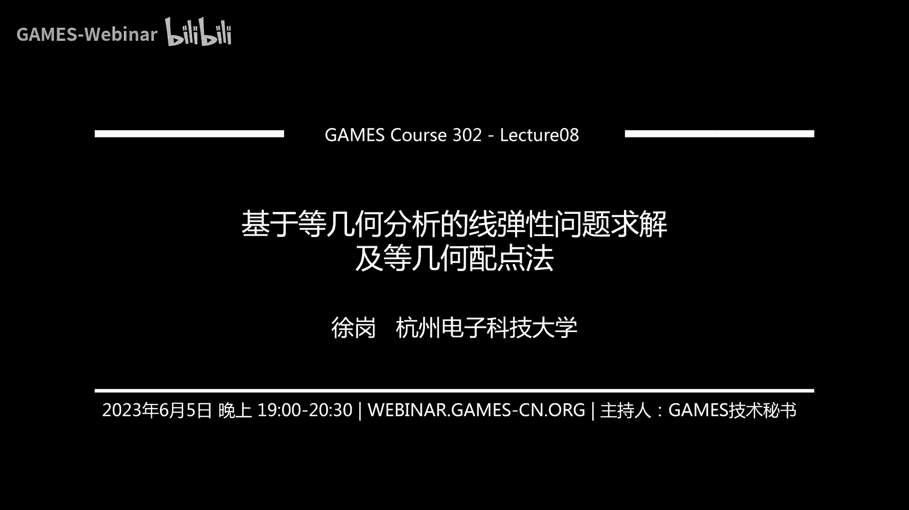
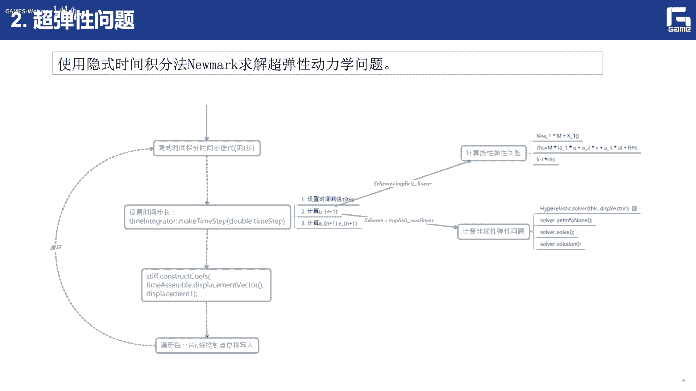

# GAMES302-等几何分析 - P8：8. 基于等几何分析的超弹性问题求解及等几何配点法 - GAMES-Webinar - BV1dM4y117PS

好我们正式开始，没上次课给大家介绍了这个基于登记和分析的，线弹性问题的求解框架，以及包括这个gift的方法，那我们这次呢，主要给大家介绍这个整体分析的超弹性问题啊，主要是一个非线性的问题的求解框架啊。

并给大家的简要介绍一下等级和配件，那么我们这个超弹性问题，它这个超弹性是体现在这个材料上的，其实我们很多的这个真实的这个世界中啊，就是说很多的这个材料啊，包括一些受力的啊，一些条件啊。

这些啊实际上都是非线性对吧，也就是说我们想要前面的呃，上次给大家讲讲的这个呃线性的这个问题啊，我们基本上还是呃做了很多的假设啊，也就是这个在真实的世界中是很少碰到对吧，也就是说实际上就是说。

实际上在真实的这个物理世界中，我们碰到的大部分都是非线性的问题，那么他对于这种非线性问题的求解，应该也是一个非常重要的问题啊，因为很多的场合里面呢，可能用这种非线性的思路啊去做啊，更加的对。

更加的多对吧，那么所以呢我们这次课也是来给大家讲一讲，咱们在这个等级和分析的这个框架下，来求解这些超弹性的问题啊，或者这个非线性的这些问题，那么另外一部分呢是关于这个等级和配电法啊。

像我们前面给大家介绍的这个等几何的方框架，都是基于这个加对经方法对吧，那加对经方法一个非常重要的，就是我需要把一个问题的强行式，把它转换成弱形式，把它转换成弱形式，那么实际上也就是说这种转换啊。

因为我是两边做了一下积分对吧，但我从小在中分部积分啊，这个然后去做啊，那么这样转换下去呢，上网也就是说我就可以啊，哎由于我们这个一些样条啊，这些基函数的性质，那我们就可以把它转换成一个线性方程组啊。

一个大型的线性方程组，而且因为这些基函数的一些性质，只要最后得到的，因为他就是局部性嘛，最后得到的伤是一个稀疏的一个方程组对吧，那么实际上也就是说这样一个稀疏的防空值，是非常容易求求解对吧啊。

这是这一套思路啊，然后当我算积分的时候，还是用什么高斯积分法对吧，所以说我需要在一些高十点上啊去求职就可以，那么实际是在这个里面啊，还是是会呃会带来一些问题，就是它主要的就是效率上的问题对吧。

所以说这次我们为什么呃，后来引入了这个配点法啊，也说了配点法呢，它是就是说不需要从这种强行驶当中，弱形式的这个转换啊，更加的直接，更加的直接，效率呢效率呢也相对比较高，效率呢也效率比较高，那么上这个呢。

就是我们所谓的这个呃等级和配电，那么首先呢给大家介绍一下啊，第一部分啊就是这个啊超弹性。

也就是非线性问题的这个求解啊。

那么刚才讲的实际上是对于我们这种呃，几何的非线性问题啊，通常是发生在很多的实际场景里面对吧，比如说像一些大位移啊这种，还有这种旋转的问题问题啊，就是比如像一些电缆啊啊这种膜啊。

或者这种壳的铁结构的一些元件里面啊，实际上是我们经常会碰到，经常会碰到那么什么，也就是说怎么样对这些文件来进行这种呃，物理法则啊是一个非常重要的问题啊，那么还会我们会涉及到一些呃。

有有限形变的一些问题啊，也就是说实际上这个里面呢就是一道大变形，对吧，你说不仅叫胃也很大，而且这个相应的应变也很大，实际上也就是说在特别是一些金属成型啊，或者一些这个汽车轮胎的一些力学。

一些接触问题里面的啊，我们都可能会发生一些额，有限变形的一些问题啊，有些变形的一些问题，那么另外一个就是材料的非线性，材料的非线性啊，那么实际上这个里面材料行为的特征，它实际上就是说啊我没事。

现实世界中各种各样的这种材料对吧，各种各种各种各样的材料，他们之间啊，比如说这个这个应力和应变之间的这种呃，非线性的响应函数，或者它的一组的演化方程啊，招式啊是是相对来说是比较复杂的。

也就是说我怎么样去呃，像这种粘弹性的一些聚合物啊，还有一些强势函数性的一些材料，我怎么样去描述他们之间的一些材料，非线性的关系啊，我们也有一些数学模型对吧啊，去描述它，这个也是非常重要的。

还有一些呢就是比如像这些啊，稳定性的一些问题啊，也是这些稳定的这个问题呢，实际上就是来源于我这个平衡方程的一些，不稳定性啊，比如像这种翘体的一些屈曲行为，贯穿的一些行为的啊，那么实际也就是说这些呢。

当然就是说它的相应的力学方程都比较复杂，此外呢除了前面的一些和几何啊，形变啊，材料啊稳定性相关的一些问题之外，我们还会有一些，就是像这种非线性的一些边界条件啊，就是它的边界条件可是最先进的啊，比如说呃。

以这种边界产生的非线性为特征的一些问题，还有他比如两个物体之间的接触或者变形，相关的一些载荷相关，也说我们很难用一个线性的一个关系，要去描述他们之间的这些边界的一些相互关系，对吧啊，边界条件啊。

这个也是标准，另外一个就是耦合问题，耦合问题，比如我这个流体和固体的酒啊，就像我们的心血管的，我用这个血液和我的心脏瓣膜之间，他上这个就是我们的一个流过耦合的，一个问题啊，典型的一个牛股耦合问题。

那么也就是说在描述这种不同的这种物理场之，间在相互作用的时候，我们也是通常会碰到很多的这个呃，非线性问题啊，非线性问题，当然我们这边所谓的所介绍的，就是这些非线性的现象对吧，非线性的现象。

实际上就是说我们主要是呃有几何形变，材料稳定性，边界条件啊，还有一些呃不同厂之间的相互作用就是耦合流，固耦合问题啊，这些等等啊，那么实际上对于我们来讲非常重要的啊，非常重要的。

实际上是我们这边的主要是关注的是什么啊，材料的非线性，材料的非线性，也是我们这边的所谓的超弹性的一个问题，那么也就是说这种超弹性的问题上，是他点的是一种非线性的一种弹弹性问题，对弹性力学问题。

好像我们这边的主要关注的就是是材料，非线性中的一个问题啊，他是这是最简单的一个问题啊，那么实际上就是说这类问题的求解，实际上和我们前面讲的线问题是类似的啊，也是总体的框架上是类似。

就是需要进行离散型单元分析啊，这个这些刚度矩阵啊，还有它的整体刚度矩阵的这个装配啊等等啊，但是在这个具体的处理里面的，还是有些不一样的地方，特别是我怎么样把这种呃材料的非线性啊。

把那东西这个东西考虑进去，所以我们这边呢会来给大家先介绍这么几个呃，方程，第一个就是，比如像这个本国方程是什么样子的啊，也就是说实际上对于这个现代性问题，我们的应力和应变之间通常是线性对吧啊。

但是对于我们这个超弹性和非线性弹性的，这种介质啊，这个应力和应变之间啊，它呃这个不再是这种线性关系啊，也说我们实际就是可以写成这种形式啊，西格玛等于d s，当然也可以选择这种增量的形式。

这种微分的这种形式对吧，也就是说实际解说这里的d s和d t，他分别就是我这个呃，相应的这个弹性材料取证啊，实际上这边的元素，python是应该是一个应变或者硬币的一个函数啊，也就是说他们之间呢。

就不再是纯粹是一个什么啊线性关系了啊，线性关系，这也是我们这边非常重要的一点，非常重要的一点，就是说呃从本构方程上我们说呢，它就和这个现代性的问题啊，就是本质的区别，别说如果我们要描述这种物质的形变呢。

我们也一般来说产生会这种形变梯度的，这么一个概念啊，商也就是说我从一个物体x dex，然后经过一定的变形对吧，你可以看成是一个弹性的一个形变，经过一个某一个时时间段对吧。

它就变成了哎这个大x这么一个形状对吧，这是一个超弹性的一个变形，那么实际上也就是说呃这个图呢，实际上就是我们描述了物体经过时间，一个时间段t的一个状态的一个移动，然后呃他这个是怎么变形的对吧。

也就是说我们物体质量，关键标识的是一个大x对吧，然后这是表示它的一个初始状态啊，那么当前运动的时刻呢，就是我们这个mt成为当前的这个boss啊，那么实际上在这个里面呃，它的上就是这个隐私啊。

我可以用一个fifi表示对吧，也就是说我们说所以说这个物体的位移矢量场，用它也是它整个轮廓是怎么变的，我上去就是写成x减去小x减去大x对吧啊，因为这个fix t是什么啊，是我当前的呃这个一个影射嘛。

我当然也可以写成这种形式，看这种形式啊，fxt也说fa是关于x和一个时间t的一个函数，那么这个时候呢，我们需要引入一个所谓的形变梯度的，一个概念啊，它上就是我物体的当前坐标，也就是小x啊。

它相对于初始坐标x大x的一个片段，对吧啊，那么很明显我这个小x对x的偏导对吧，我怎么求啊，还有这样我们可以看到呃，哎小x应该等于什么，应该等于大x加上啊，又dex对不对。

又是关于dex的初始的状态的一个函数啊，你说这样的话，小x对大于x偏多，所以说他肯定也应该等于一个，因为我们这边一般都是一个一个张量，一个专业，一个是0i加上啊又对x的一个偏导对吧。

那么这个东西我们大概也可以写作，也就是说所以呢这就是我们所谓的这个f，就是我们的什么啊，形变的梯度对吧，形变的梯度，那么商这边呢就是我们这个呃，其中的这个形变梯度的这么一个概念啊，所以大家还是要知道啊。

这个比较容易理解对吧，那么也就是说我们常见的这种仓排线的，这种材料模型啊，通常是由这种应变能的这个密度函数，来定义的啊，那么这个应变能的密度函数，它实际上描述了我们这个应变和应力，之间的一个关系啊。

好我们说这个因为面对密度函数，它通常是我们前面的所谓那个形变，形变梯度一个函数，就是这个c和f的一个品一个函数对吧，那么所以我们可以后面可以看到啊，就是说这个应变密度函数实际上就是说啊。

就是定义了我们各种不同的材料模型，我们后面可以看到，它有各种不同的一个函数表示，那么实在这种个性同性的一些材料，我常用表情呢，这边有这么几个标记，好啊，这个大家我觉得还是要了解的啊。

第一个呢我觉得就可以使用这种克星应变，c的不变量表示啊，另外呢还可以使用这种主打r c的，各种轴方向的一些表，兰分之120，兰博三比二四，另外也可以可分离的一种形式表示啊，f我们刚才看到的就是。

我们上上一页slide介绍了这个芯片梯度，对吧啊，当然因为它是一个矩阵嘛，我们实际上是可以呃求它的行列式j啊，j就是这个形变梯度这个矩阵的行列式对吧啊，那么这个c呢是所谓的科学应变啊。

然后使用这个呃形变梯度计算的这个c呢，他应该就是你f t这个f的转置乘以f啊是吧，然后这个科学不变量啊，那么实际上就是我们这个矩阵c的，有三个不变量对吧，三个不变量。

那么实际上就是矩阵c的这个它的g 19，它的这个矩阵c的，这个应该是对角线的元素加起来对吧啊，这个举证的这个积累这个概念对吧啊，然后还有第二遍，第三个不变量啊，那么包括它的行列式相等。

那么这个g呢它就是所谓的格列应变，他应该等于啊，比如说我这个形变梯度的转置成实际就是c点，就按1/2 c一点隔离一面这样点啊，那么主主拉伸我们这边number 1 number 2，那么是什么。

就是行为形状记录这个矩阵经过svd分解啊，说这个矩阵分解之后，这个对角矩阵的对角元素啊，就是这里的number 1 number 2 number 3啊，也就是说我们通过这个来着。

实际上就是大家可以理解，就是其中的一些一些定义吧，或者一些一些记号，这样也是都和前面我们这个形变梯度的，这个这个梯度啊这个相关的对吧，对有的同学说好像三菱要讲过啊，应该是物理仿真那块。

应该是讲过一部分这部分知识的，嗯说明这个同学学的还是比较用心的，那么商业要收我们这边有了这些呃，这些概念之后呢，我们实际上是可以定义各种不同的呃，相当于在这个超传性材料的一些模型啊。

这边是我们列出了四种比较常用的，比较经典的呃，超弹性的材料模型，第一个就是这个分类vk模型会简称啊，vk模型啊，那么他这个fi啊，就这个f和这个这个材料模型之间的关系，是这样是这样定义的啊，这样定义。

这边具体我就不做解释了啊，像这个前面的一些呃name的记忆啊，这些像都是都有个定都有定义了是吧，那么包括这个n x模型啊，这个是应该是比较常用的一个模型啊，那么实际上就是因为它是这样上来定义的。

一个一个材料模型啊，还有这个mi啊，the威力模型啊，他从这样这样来定义，把这个og og og模型啊，他这样来定义也是这边这个图呢，它实际上就是说描述了我的第一个的这个，pk的这个压力。

这个p这边压力啊和他的这个变形梯度f之间，他们之间的关系变变的关系对吧，就大家可以可以看到诶，像这个，如果是线性的对吧，如果是这个旋转线性的为它，这就是线性的关系啊，而我们很多的这个像其他的材料模型啊。

这个模型啊，vk模型和这个n s模型啊，包括这个修改了这个aa什么型，他们和这个压力和他的这个deformation，和这个变形梯度，它们之间的这个呃形变梯度它们之间的关系啊，这不是一个线性关系。

而变成一个呃非线性的一个关系对吧，所以说就通过这个东西啊，我们也是可以理解啊，可以理解啊，它具体的这个形状曲线是什么样子，就我们前面所讲的是本构的方程对吧，本构方程啊。

那么我们下面看一下这个所谓的几何方程，那么几何方程呢，它想就说本构方程式是描述什么的啊，是描述这个形变和应力他们之间的关系，也就是他们之间应该是一个非线性的一个关系，对吧，那对于几何方程来讲来讲的话。

呃，商场是来描述我所谓的这个，形变和位移之间的关系啊，曲面和位移之间关系，那么实际上是在这个线弹性问题里面啊，这个e系统它就等于必有是吧，然后b等于l a，这个这个这个呃是我们在上节课给大家介绍的。

然而在我们实际证过程里面，像这个g就是我们的各类应变，就刚才是不是它是不是这样的，它应该等于1/2，这个斜面梯度的转置乘以斜面梯度矩阵对，然后减去i对吧，这个东西啊，然后待会可以写成这种形式啊。

比如说杀在线性问题中，我们是使用了这个工程的这个应变ip啊，它三个实际上是格林应变界的一个线性部分，这个g啊，然后他忽略了这个应变的非线性部分，基于这现场性里面。

而我们在呃上次如果你是小形变就是问题的话，小小前面问题的话，实际上这个就这个基因的部分，是可以忽略不计的啊，但是如果你是一个大变形问题啊，那么这个这部分啊就可能不能忽略啊，不能忽略，这是几何方程对吧。

当然另外一个还有我们所谓的这个呃平衡方程，平衡方程，所谓平衡方程反而是非常关键的对吧，也就是说实际上你这里面需要满足一些，质量守恒的一些东西啊，也就是说我上我们在这种构型中。

我们需要建立一些局部的未分平衡方面的，一些强形式，强行式啊，也就是说啊我们从对于任意的一个时刻，t物体从一个状态到另外一个状态对吧，从，西格玛到这个cvt他需要满足一个质量守恒，质量守恒啊。

也就是这么一个关系对吧，比如说肉类呢是我们的主体，初始的一个质量的密度，然后肉呢是我物体当前的一个质量密度，因为他们这个时间应该是满足一种关系啊，那么当我们通过一些动量守恒的一些定律，是定理。

我们实际上就可以得到这么一个东西啊，也就说实际上也说我这个物体啊，受到的所有的外界的大小，应该等于这个物体线，动量对这个时间的一个导数啊，比如说我们通过这个呢我们就可以啊。

我们就可以推导出这么一个物体的平衡，这个标红的，这个上次我们呃在我们整个的呃线弹性问题啊，这个啊超弹性问题里面，非常重要的一个平衡方程，当我们后面求解呢，也是基于这个东西啊来进行求解。

但是他他需要满足一定的这个边界条件对吧，一定的边界条件，就是说无论你说这个b0 是什么啊，b0 是什么，就说12是物体，每每每单位受到这个体积力，然后这个呢右上面两点就是加速度啊。

右下面一点就是速度是吧啊，这个沙子后面微积分里面的这个概念是类似，对啊，这个u就是就是那个位移嘛对吧，位移的e导数就是速度啊，两阶导数就是加速度，然后对，就是说还有我们有一些边界上的一些固定的。

一些位移的条件啊，然后呢也有一些就是每单位面积，他受到的一些牵引力啊等等啊，包括这个一些东西是吧，那么上也说这个东西啊，上次我们后面的一个重点需要研究的啊，一个所谓的物体的一个平衡方程。

那么根据上面这个东西，实际上我们就就构造出了这么一个所谓的啊，也是根据这个弹性力学的发展，还有我们动量守恒定律，我们构建了相应的物体动力学的一个方程，的一个形式，对吧啊。

就这个那f就是我们的变异梯度对吧，然后s像我们这边是根据一些东西，我们可以有不同的一些有，因为因为我给你前面不再介绍了，这四种材料模型吧，你对于不同的材料模型，我这个s呢可以有不同的一些表达式啊。

啊所谓这个比如这边s它是比如说就这一个，对吧啊，就这个飘了，克里克服应力张量，然后它三个层面就是我们这个能量密度函数，对这个格林应变的这个导数啊，也就是说我们商也是可以把这么一个东西啊，根据变分原理。

然后进行分部积分对吧，然后得到一个等效的一个积分的一个week form，然后三就会得到这个啊都会得到，而且我们根据相应的这个能量密度函数，就我们前面定义的各种呃材料模型。

实际上我们也是可以求出相应的这个大s，它等于多少，那么具体的推导我这边就不讲了，就这个基本的思想呢，就是这个样子，但是我们刚才不是得到了这么一个等效积分的，一个week form是吧。

然后我们后面实际上就是说哎，怎么样来求他了啊，怎么样来求他了啊，因为我们这他肯定是呃是一个非线性能对吧，因为这边呃就u的二角头就又和u相关的对吧，所以他肯定是一个非线性问题啊，也是我们三。

现在我们需要在ig的框架下来进行求解对吧，啊也是我们怎么样把这种联系方式进行这个呃，根据i j a的方式来进行进行求解对吧，也就是说在呃大家都前面我们都讲过了对吧，然后在这个等级和里面啊。

它的计算单元是什么啊，这就是我的这个这是我的计算域对吧，我的物理域，然而这是这个这边是物理域的参数域对吧，然后这个参数域里面我沿着右方向和位方向，我都有一个节点序列啊，节点序列。

那那个节点序列有节点区间对吧，比如这边是一个呃右方向的阶段区间，这边是v方向节段区间对吧，那么商业说在这个我我就会这两个方向，它就会形成一个小的方块对吧，那么这个小的方块就是我的啊，在这个计算域中的。

它的参数域里面的这个这个节点区间对吧，那么它在物理意义上啊，就对应了这么一小片啊，我说这么一小片高阶的单元，就是我们的i j里面的计算单元啊，也就是说双方就是我们这个呃在等你和框架下。

我们基本的离散的思想呢，呃就是单元离散的思想就是这样子对吧，也就是说像我在各种表示对吧，比如说第一个位移，那我肯定要用这个呃，呃样条numbers的这种形式来表示做ai的，就是我的这个基函数对吧。

右翼就是我的这个控制的呃，系数控制控制的向量对吧，然后我这个斜面的梯度啊，我当然也是可以按照我们刚才说的，就是i等于什么u x对x的偏导是吧啊，那是不是这么这么一个东西啊，我就可以让来求对吧。

那么各类型面对吧，就是我前面讲的这个g它应该等于什么，bl和bn两项加起来嘛，对吧啊，那么b l b n是什么东西啊，我到那就是根据前面我们这个格林应变的，这个g的定义来求他，还有其他的东西。

那么实际上也就是说我们根据这种等几核的，离散化的这种单元离散化的思想啊，还有前面得到的这个平衡方程的这个等效积分，的这种弱形式，然后我们就可以得到这个平方程在ig框架下，它的这个离散化的形式啊。

就是这样啊，就这样哦，也就是我们实际上就是说可以啊，这边a i n j都是g函数的a i a，那么三连时我们都可以就可以把它写成，如果把这一项现在就可以写成m乘以u，那就是加速度对吧，然后加上r这块啊。

等于f为f，那么商也说我们商如果是净利问题的话啊，净利问题的话，呃这个我们说的是呃，呃一般来说这个m的m都等于零了对吧，那二呢就是形变引起的这个内力不是外力对吧，所以说如果你减时间相关的问题。

基本上就是这个样子啊，也是啊，如果是解这种动力学问题，就是这样的，但如果解听了一些问题，可能就只有这两项啊，那么实际上也就是说，我们如果把这种惯性力部分舍去的话对吧，我最后就是什么啊，就是二等于f嘛啊。

所以说我实际上就得到了就是这么一个东西啊，就得到这么一个东西，也是我最后求除了这个本质关系，他应该就是满足啊，根据这个东西来来推导出来，我们就是s它应该等于d g啊，这种。

也是我们代入到这个离散的平衡方程里面上，我就可以得到呃，这么一个开了一个类似于刚度矩阵嘛啊，就知道ko了，他应该等于啊，这个东西它也和我们现在也是一样的对吧，也就是说虽然这边的这个bt啊。

那个b它都是位移函数，但它实际上这两个形式不是不一样的，所以说12 10mm线弹性里面的那种问题，是不能够呃，简单的把它规划成一个线性的一个表示啊，啊你说它本质上啊。

这个方式它是一个非线性的一个一个东西啊，而且这个ko啊它是一个非对称，也是对于我们现代性里面ko，它也可以是一个对称矩阵啊，也就是说对于这么一个非线性的一个问题啊，我们就可以用这个牛顿迭代法。

牛顿迭代法啊，这个很多那个同学估计都比较熟悉的对吧，你说他实际上就说呃，来求解这种非线性方程的一种数字求根的啊，并不是解析求根的方法对吧，解析求根，就是说我通过这种球员公式就给他求出来是吧。

但是对于复杂的问题，我可能不能一下子把它表示出来，那我就用这个牛顿迭代法来进行迭代求解啊，人家说实它就是可以把这个做一个它的展开啊，也就是说它的就是说需要在计算时要求的，含它的啊函数值。

还有它的这个一阶导数值啊，然后先用就沿着这个梯度方向下降对吧啊，然后就可以得到方程的导数的形式啊，也是所以说呢我们就可以，因为我们要求的就是呃对于他这么来求嘛，让它等于零对吧，我们把这个u求出来。

所以所以说就是我们，所以呢要求它的一阶导数了，所以我们得求一下，对它求一导数的话，上，我就可以得到一个所谓啊切线的刚度矩阵是吧，啊，那么商也说这个k t u啊，发等于什么东西啊。

所以说是呃并对它求一下导数就可以得到这个，常言说呢我们上可以把它分成两部分，一部分就是这一部分，还有一个就是这一啊，那么第一个部分呢就是也可以把它按照呃，把d s这个东西改成dg啊。

g就是我们前面定义的那个格林性面目啊，然后12点这样的话，我们就是就是进步的，就可以把它写成一个k dd u的这种形式啊，那么实际上就是说，如果把这个b等于bl加bn进行展开。

我们就可以把这个bd相应的把它给算出来，它具体的表达式是什么样子啊，就稍微复杂一点啊，但是我是rus可以算的啊，你说实际上就是在刚才展开的这一部分，他的第一部分这个ko对吧，他就这一部分对吧。

它算是一个小位移的刚度矩阵啊，也就是说在我们先谈性里面，它只针对这一项啊，只有这一项对吧，那么后面的剩下这三项对吧，剩下这三项他是和我们这个大转型相关联的，高度，基本是在我们在这种超弹性问题里面嗯。

所需要的啊，所需要的，那么实际上对于这个kt的这个第二项啊，kt的第二项就是说，就这一项了对吧，这一项啊，那我们怎么来做啊，也是类似的啊，啊我们实际上就这边呢就是我们这个bl它。

我q他三就是和我的位移是没有关系的啊，所以说我这样就是可以把它推导出来，推导出来，然后我这个m呢就可以把它算出啊，双上线的这个k s啊，或者上一页的演示把它给算得出来，所以大家可以后面再消化一下啊。

可能一下子确实嗯公司有点多啊，公司有点多，也就是说实际上我们根据前面我们要算的，这个k t，它就等于啊前面这个kd加上这个k s是吧，那我们这边偏紧的，把它的算法都呃怎么求解都都都列出来啊。

也就是说所以我们要进行要算的是什么，kt等于等于零，或者说要求它的根嘛对吧，三就是牛顿迭代款的，就我先呃设定一个初始的六个初始啊，初始值对吧，然后把这个kt呢组装起来组装起来啊。

然后呃求出相应的偏偏移量，它应该就等于我们这个东西是吧啊，然后求出来之后啊，我们家建模在再进行迭代嘛，啊也就是说我先固定一个量，是先固定某一步，然后再求下一步再求6n加一啊。

那么说我要求的主外乎就是我这个偏移量，就我这个呃德尔塔u n是等于什么东西啊，那我下一步上也是在拖求什么德尔塔u n加一，我再去算一下u n加二的啊，我向后面就重复复好，我这个234步。

那我什么时候截止呢，对吧啊，就是我达到一定的这个啊迭代的部署对吧，或者达到一定的精度，然后我就可以把它呃停止了，那么实际也就是说初值呢，实际在这边也是呃非常重要的啊，我们这边一般是实数值是零的啊。

那么所以就说怎么样能够找到一个更好的一个，数值设置的方法啊，也是非常重要嗯，所以说我们总体来看，就是说我们在来用我们等几何的框架啊，等几何框架来求解这种超弹性，那精力问题啊，而不是动力学问题对吧。

动力学呢实际上就是最后是随着时间相关的啊，时间变化的一个问题对吧，我们现在还只是一个经济学的一个问题，对于这种经济学的这种问题啊，他怎么有框架是什么呢，啊也说比如说你可以一开始输入一个呃。

烟台的一个几何模型，你可以是二维就是曲面模型对吧，三维就是体的模型，然后你定义相应的这个材料的参数，还有它的一些边界的一些约束啊，然后对它的这个单元进行加加息对吧。

可能因为你刚原来你初始输入的这个模型啊，可能他这个自由度不够对吧啊，可以对他用这个插入节点啊，升阶啊啊来进行增加自由度啊，然后你设置你最后的这个收敛的误差，因为这个东西会涉及到呃，就是你迭代多少次数嘛。

就是你这个说花多少时间对吧啊，然后你设置这个收敛误差，还有这个初始的点啊，初始的这个位置，然后下面呢就是怎么样，哎我要计算这个你的切线刚度矩阵，还有他这个参杂的初始化啊，来来做这点问题啊。

那么来来后面来便秘便利，我所有的这个面片的单元啊，就是我那个不是把error问题分成一些呃，呃呃一些那个小的这个高阶的一些面片单元嘛，这些都是你的计算单元啊，然后我组组装这种单元的切线的高度矩阵啊。

那么啥也说，前面这个切线长度矩阵初始化，这30值一般都设成零了啊，它的元素都设置成零，就包括参差对吧，然后每个单不带对，每一个单元上，后来我组装相应的这个单元呃，切线的这个刚度矩阵。

然后计算这个残差向量对吧，然后呢再组装通过这种单元矩阵的映射对吧，然后组装相应的全局的矩阵啊，然后进行这个求解啊，嗯你说是呃如果啊还没有便利好，那么那么大你继续组装，继续看。

如果把所有的这个呃计算单元我都办理完了啊，下面我就求解相应的这个线性方程，然后把那个位移的这个增量求出来，对不对啊，然后这个周量是不是收敛没有收敛，我在做下一步迭代嘛啊在最大的那个切线高度。

计算机初始化提取，在便利啊，再继续计算，然后再下去，就也就说就这个迭代呢，主要是体体现在这儿对吧啊，停在这啊，也就是说如果收敛了啊，如果收敛达到了你的这个收敛误差了啊，满足你的收敛误差要求了。

然后后面呢我就可以输出分析的结果，然后就结束是吧，也就是说这边的商业就说我们是怎么样啊，大家可以看到我是上，就是还是一个基本的思路是什么，就是把非线性的问题转换成了线性的问题啊。

转换成了线性的问题啊来说，但但是我这边会有一个每一步会有不同，以前就说我是不需要计算什么啊，这个切线的高度矩阵的对吧，商务也说，这边也是和我们前面那个线弹性问题啊，不一样的地方呢。

一个主要的地方就是在这里啊，一个是要计算这个切线的刚度矩阵，另外一个呢就是我需要进行这种迭代的，这种求解啊，迭代的求解，你要说这就是我们啊在等级和分析框架下，来求解这种套弹性的经济学问题呃。

它的一个呃基本的一个套路，啊也就是说实际上这边的话呃啊对吧，我这边有这么几个函数，就是说比如说这是我们那个学生啊，他这个像我们在我们框架里面怎么来做的啊，大家比如读一些xm 4章，就是你的一些模型了。

然后创造一些约束面啊，啊添加一些边界的一些条件啊，对吧啊，然后怎么样初始化构造这个期间的高度矩阵啊，吸收系统啊，然后初始化相应的位移和速度啊，然后进行装这个呃，这个这个这个切线刚度矩阵的一些装配对吧。

然后球鞋位移啊判断收敛啊，所以说啊最后呢把这个位移啊，添加到模型的各个控制顶点上对吧，也相信你求证，就是这个控制定点的这个位移对吧，然后进行处理，进行形变的可视化，这边呢就是给了一个例子啊。

这边就是呃我就我这边会施加一个往下的力嘛，这边就是一个这么一个类似于1/2的，厚壁圆柱的这么一个模型啊，然后我就上面来施加一个往下的一个b啊，然后他这个按照在这种材料分布下。

这种设定它的一些材料属性对吧，那么相应的这种超弹性材料下，它相应的这个变形的效果，这个模型的阶数，因为它是一个volume，是一个b样条体嘛，现在的这个阶数呢就是4x4x3是吧。

那空着点点的数目就是13x2，11x12 11对吧，那么相应的呃，相应的这个自由度的数目是4950啊，单元的数量是16201620，那么是这边呢是就是它这个呃位移的分布，和它的这个用不同颜色标出来了啊。

在位移的分布是位移，大家看到这红的地方，就代表我这个位移位移比较大的啊，像这个这边我都是固定的对吧，所以这边就位移，这就是零了啊，这边现位移比较大对啊，那么这边呢就是相应的这个应力的这个分布，应力分布。

实际上这个大家可以发现，这个应力分布也是符合我们的一些认知的对吧，就说明哎这个红的地方，就这些地方他的这个啊用力用力比较大对吧，他可能受到了压弯曲压压力啊比较比较大，而。

所以这边呢就是用我们这个等级和的框架，来求解的一个呃超弹性的一个问题的一个仿真，那么这边呢就是说我们如果把这种啊，这个上面上面这个模型啊，对它进行加息三次的，反正结果作为一个呃精确点六星啊。

那么上我们可以计算，在不同的次数和不同的单元密度下，它的线弹性和超短线的这个数值的误差，就我们发现这边我们当然尊重了这个呃，有这个l2 的误差对吧，还有这个hy的这个误差啊，那么现在这个收敛曲线对吧。

那么商业兽们可以发现在相同的单元不成下，这个超弹性模型的精度上，是高于我们的线弹性模型的啊，高于我们的线弹性模型啊，而且随着这个单元密度的增加，这个套餐性模模型误差收敛的会更快啊，收敛的会更快。

那么前面的商是给大家介绍的，我怎么样用等几何的在整体的框架下啊，在等等几何的框架下来求解，这种超弹性的经济学问题对吧，超弹性的经济学问题，当然我也可以来来讲什么啊，这个相应的这个动力学问题啊。

动力学问题啊，这我我仿真出来的就是一个超弹性物体的，它的一个运动的一个过程是吧，运动一过程，这可能是在我们通信学里面也有挺多的应用的，对吧，包括在一些机器人上，这个软体机器人领域啊。

我们上也是一开始我们来做这个问题的时候，也是想去解决里面的一些问题啊，也就是说等几盒呢，它因为它自由度比较少对吧，所以它非常适用于去求解这种大变形的问题啊，大变形的问题，那么也就是说商。

如果我们去考虑相应的动力学问题，或者运动方面的一些球员的话，我们必须考虑它的状态变量和变形，但是随时间变化的这么一个过程啊，然后我们有牛顿定律对吧，这个大家啊还记不记得啊，也就是说一个物体运动的方程呢。

我们一般呢是可以表示这种这种形式的对吧啊，这个大m大m就是表示我的质量矩阵啊，也就是上次我与某些的这个体积啊，密度啊是相关的对吧，然后这个c呢就是为了这个阻力矩阵，实际上是与这个质量矩阵和模型的刚度。

是相关的，二就是我们刚才所说的这个初始的，它的载荷的向量啊，与模型的初始的形变大小是相关的，f呢就是这个模型受到的外力的大小啊，当然这个呃右两点和右一点对吧，它分别表示这个位移的二阶导数，一导数。

也就是我们所谓的加速度和速度，这就是非常典型的这个呃，我想301里面可能也讲过对吧，就这种动力学方程它的一个东西啊，也就是说如果啊如果我们把这个v啊，就速度对吧，就是右的e等于v是即为速度对吧。

然后a即为这个u的这个对吧，先给它加速度对吧，然后我们在这个学高中物理的时候，初中物理的时候也是让来记的对吧，也就是说当这个时间在诶tn加一的时候，运动方程会转换成d t n加一的时候。

这个这个相关计算就是这个样子啊，也就说我们上就是把就带把它换成这样子，就是m a n加一加上c位n加一，r u n加一等于f n加一，那么上网要初始的这个条件呢，就可以给它一个初始度。

还有一个初始的加速度啊，也就是说三种来求解，这怎么一个时间相关的一个问题的话，我们有两种方式，两种方式，一个就是所谓的这边这个字打错了，应该是显示的这个时间积分，还有或者影视的时间积分，两种方式对吧。

两种方式，也就是说对于这种显示的这种时间积分呢，它一般就是我计算呃，这个添加一处的啊，就十克添加一处的物理量来说，我只需要天时刻的对吧，上一时刻的物理量就可以了啊，有这个方法呢比较简单啊。

为什么说这也是他为什么称为显示嘛，是吧啊，显示的这个时间的积分计算啊，也就是说如果这个质量矩阵啊，它具有这种对角结构的话，它能够那么显示的基本方法，能非常大的减少这个呃运算量，但是在很多情况下。

这个显示的时间积分的收敛性是与否，上市是和你的部长有很大的关系啊，也就是说如果我保证这个最后计算出来，这个结果是收敛的话，我们需要非常小的不长才行啊，否则呢会对这个帧率啊会有比较大的损失啊。

那么还有一种方式呢就是演示的啊，就是演示的时间积分计算啊，也就是说它在计算，比如t n加一出的物理量的时候呢，它实际上是会依赖前一个时刻t还依赖什么呢，还要依赖一个未知时刻，tn加a的时候的一个物理量。

也就是说实际上在每一个时间步啊，他都需要求解一个非线性方程是吧，而不是那种前面我们说显示的就是直接哎，直接像一个显示函数一样把它给计算出来对吧，不是的啊，他需要求解一个非线性的一个方程啊。

所以呢通常需要与这个前面的这个扭转结带法，相结合啊，相结合，那么这个隐私的时间积分，它的优点就在于这个系统呢，它是一个无条件稳定的啊，不受这个时间不长的这个呃这个限制啊。

所以呢我们而我们在这个超弹性材料的，仿真问题里面，我们通常需要求解一个非线性质的方程组，而且我对这个整个的这个仿真的，稳定性的要求会更高对吧，所以说我们这边都选择了一种隐私的时间，经费法。

也是比较经典的一个new mark的一个方法，来进行求解，来进行求解，嗯所以我们现在后面就讲给大家介绍一下，我怎么要用这种隐私的时间进行反应，慢来求解超弹性的动力学问题啊，超弹性的动力学问题。

像我们也我们说呃，在下一个时刻的位移和速度，之间的这个计算公式啊，我们可以把它写出来，这个比如说下一时刻就是u n加一，它应该等于上一次课的这个位移，加上dt tt乘以什么啊，这一时刻的什么速度。

加上2/2 t和，这个还有这次的一些加速度啊，然后这个下一时刻的速度呢，它等于上一个速度加上大热t乘以这个东西啊，原来说呢我们可以发现下一时刻的位移和速度，实际上是由tn时刻的位移速度。

还有下一时刻的加速度共同决定啊，而我们这边的这个贝塔伽马这些的，都是一些自定义的参数啊，看它有一个相应的一些取得的这个范围，我们相就是可以把前面计算这种位移和速度，的公式代入到我们所谓的这么一个呃。

运动方程里面，对吧啊，然后会是得到一个关于什么加速度，a的一个非线性方程组，我们60通过牛顿迭代法对吧，我们前面要给大家介绍的，怎么要去求解对吧，给你个初始值，然后沿着这个梯度是吧，然后更新。

那么上来求解方程组，就可以获得下一次课的这个加速录制，然后再代入到我们得到下一时刻的加速录制，我们实际上就在说前面的这个公式里面，就会得到什么啊，我们相当于我们得到了什么，得到这个下一个加速度是吗。

我得到这个a减a减1+1之后，我是不是就可以算出u n加一了对吧，上午就可以得到下一刻的这个位移的大小，对吧啊，那么整个运动仿真呢，实际上就是来执行这么一个过程啊，也就是说我们是先算什么啊。

先算a n加一，再算u n加一啊，大家要首先要理解这么一个思路，那么上也是我们最后一班的，都是要算的是它是位移嘛，有因为我要算一得到一个仿真的一个动画，对不对，也是我们常最多功能。

我们可以把这个位移啊把它推导出来，把把这个位移推导出来啊，你说这个a n加一大等于什么东西，也就是我们最后所换的就是u嘛，就是要得到这边的u嘛，也就是说我们这个u啊，这个u啊。

这个u3 就是说呃呃求出来之后，我们说这边的阿尔法一阿尔法一直到六，实际上就是一些常数常数啊，这边呢就是它和贝塔相关的一些，一些是一个是和单推相关，还有这个贝塔和伽马相关，他上去就是一个常数了。

也就是说我们只有前面的公式，我们可以说下一个时间不得解，这是由上一个不接不的时间不得解，和位移的变化量来决定的，对不对啊，也是n加一是有这个对吧，和位移的变化量。

这边不是u n加一减去u a位移的变化量嘛，对吧啊，然后还有上一个时刻的速度，上一个速度的时刻的加速度对吧，还有它的位移变化量相关的，对不对啊，也就是说实际上就是位数量的。

我所以啥是可以转换成u n加一，通过前面的这个方程组，代入了这个物体的运动方程里面，我们就可以关于位移的一个非线性代数，方程是什么，就是这个就这样，也就是说这个方程它实际上是由t个事件簿啊。

n个方程组成的方程组，那我们来求解这么一个呃方程组呢，我们就可以得到每一个时间步的这个呃u啊，看到位移的解，然后我们在每个时间步呢里面呢，呃通过这个牛顿迭代法来求解相应的这个方程。

我们所得到他每一步更新怎么更新的，我这边就不就不仔细说了啊，也就是说，实际上我们在每个时间步的迭代过程呢，实际上就是我基本上就是在在算这个东西，在算出这个东西啊，当然我们呃在每次迭代的时候。

它都有初始值嘛，咱就是上一次迭代的这个收敛值，我们班这位置的初始值啊，也是我们通过高斯积分来计算，各单元的这个质量矩阵m对吧，然后再根据这个控制点的关系，来营造整体的这个呃质量矩阵就可以了啊。

所以说这边呢它实际上就是呃呃列出了啊，列出了我从一上个时代不到下一个时代不，我这个相应的这个关系对吧，刚刚系，然后这个横向同事一个事件簿中，他这个牛顿迭代的过程是什么样子的啊。

我怎么从1u11 直到这个u对吧啊，然后呢这个数下呢我上就是影视时间积分的，它的一个时间步的迭代，它上是有两个类似于矩阵的这种迭代，一样的对吧，比如说横向的是一个实践部中，它是牛顿迭代的过程啊。

然后这个竖线呢这个也是时间积分的，它的时间不的迭代过程啊，就像大家要要理顺这么一个框架，理顺这么一个框架，啊这边我就呃这是总体的一个框架啊，也就是说我先设定一个初始的一个位移啊，然后出设定出收线的呃。

收敛的一个也是误差吧，上上线对吧，包括初始化迭代的次数啊，然后我先计算运动平衡方程的这个梯度对吧啊，然后计算相应的运动方程的残差，计算这个位移的增量啊，然后计算误差，更新我的位移量啊，然后再迭代次数。

然后继续这样一直迭代下去，一直迭代下去啊，然后最后呢，我就会得到额收敛的这个节点的位亮啊，因为它在每一时刻他怎么来做，也就是说如果看这个整体的框架的话，我就先读这个我的这个底层的话，模型的文件对吧。

xm 5的样条表示的一个文件，然后我呃相应的去加一些呃，这个约束是什么样子的，边界条件是什么样子的对吧，然后把这个刚度矩阵啊，还有这个载荷向量啊，这个系数矩阵进行初始化对吧。

然后包括这个质量矩阵的这个初始化啊，然后也是时间积分的初始化，这边呢我要设置这个初始的位移，初始的速度对吧，然后下面呢我就说可以啊，这边他的包括这个装备的主量矩阵啊，位移速度啊，刚度矩阵啊。

这些都可以做一个初始化啊，然后后面呢就是来做一个免试时间积分的啊，时间的一个时间步的一个迭代对吧，我从第七步怎么来来这个移植下设计，当然我这边需要来设置这个时间的步长，设置时间不长对吧。

那么一问我怎么样去构造现在这个系数，然后你在时间过程中，在每一步的时候我就要计算呃这个时间的跨度，计算它的呃，这边就相应的分有两个问题对吧，一种类型是一种也是的对吧，但是它是一个线弹性的一个问题。

那就非常简单对吧，就我们上节课给大家讲的啊，然后如果是非线性的问题，就是要这个对吧，需要进行，如果是超弹性问题嘛，我就要进行这个迭代求解对吧啊迭代求解啊，然后我先算一下这个u n加一。

然后计算先用的这个呃n加一时刻呢，它的加速度速度，还有它的位位移是吧，加速度速度把它算出来啊，然后我再按照这个时间来一次来记，也就是说它上面还有两层啊，就是一在每一个时刻，我是我是一个呃。

我有一个迭代对吧，然后在时间不上，我又有另外一个迭代，那这边呢就是我们给出了呃，我们这个超弹性问题的啊。

来解决这么一个超感性的一个动力学问题的，它的一些结果对吧啊，它的结果大家可以发现我们，所以这里面所有的这个模型啊，所有的这个模型都是通过呃，都是通过这个提样条啊，体系分的样条来表示的啊。

然后通过这种提样条来表示，然后为它的计算单元啊，12是不多的啊，自由度还好啊，这都还好，但我们现在还是没有办法达到一个死死啊，我们这边就模拟了啊，这边像这个比如像类似于一个桥吧，就模型了。

这边我这边给你一个往左的一个力啊，那么这个超弹性的这么一个桥，它是怎么样来来来变形的对吧，发生那种变化，然后这边呢就是一个类似于手的对吧，这个手的一个稳固体啊，那么这个手啊它实际上就是我这个握东西。

它这个里面我给他一些像一些力的边界条件，那么手段肯定是一个超弹性的一个表示的对吧，那么在这么一个超弹性的一个下，它是怎么来来变形的啊，这边三就是类似于咳，呃呃一个恐龙的对吧。

一个他的一个一个周边类似于吃东西啊，或者这么一个一个变形的一个动画啊，嗯这边呢就是类似于一个右下角，这边呢就是类似于一个软体机器人对吧，当然这边画的不像啊，它类似于一个比如抓东西。

或者一个这么一个软体结构，这么一个一个瓷砖的这么一个东西了对吧，来来做的一仿真啊，也就说实际上我觉得就是说呃，我们在相同的这个精度下，相同的这个精度下啊，我们用这种啊等几何的框架来进行求解。

我们也做过的比较啊，要比我们用这种有限元的方法来进行求解呢，要快呃，60~70倍左右啊，60~70倍左右啊，因为说实际上就是说呃为什么对吧，就是我们第一次就给大家讲了对吧，那么等级合着它的优势。

就是说我在同样的精度下，可以用比较少的自由度来进化对吧，所以说呃就会达到比较高的效率啊，达到比较高的效率啊，而且呢我想呃等几何啊，它上是非常适用于这种大尺大变形的，这种现象的这个物理问题的法则对吧啊。

因为这个东西实际上就是和我们这个，用控制顶点来来做变形是一样的对吧，无外乎我这边的控制变顶点，在做编辑的时候要满足一定的什么啊，满足一定的物理规律，要满足我们这个超弹性的这个动力学方程啊。

这些平衡方程啊，这些啊，年度商在有限元仿真里面，对于这种大变形物体，容易出现这种网格扭曲变形对吧。

因为有些人他本质上还是用，还是基于网络单元来做的嘛，对吧啊，而但是呢我们在等几何里面，它就不存在什么离散的一个问题对吧，不存在把这个链条表示的东西，再把等离散成网格，类似变四面体网格。

六面体网格啊这些对吧，所以它它不会出现这种扭曲变形啊，也说不也不会出现这种多次重新划分网格的，这个问题对吧，就是它自然的呃就实现了这个物体的变形，对吧啊，也就是说登记和反制变大变形的物体啊，这种问题啊。

在保证这个较高精度的同时，也避免了这个频繁的一些网格划分啊，提高了绑定的精度和速度，那么这是我们第一部分，第一部分大概花了一个小时的时间，给大家介绍了啊。

怎么样啊，基于我们等几何的框架来求解呃，来求解这种呃超大型的问题啊，包括经济学问题和动力学问题，那么我想通过做一个大致的了解啊，就可能一些细节，还需要大家在课下好好去消化一下啊。

包括我们这边的一些呃一些讲解对吧，也是比较讲解来说还是比较呃，没有没有具体的一些细节问题上，但我想我应该是把整个的呃求解的思想啊，这个步骤啊，这些应该是讲清楚啊，那么希望大家呢在课下啊。

如果真的去从事这方面的研究的话啊，可以或者你想实现的话啊，可以进一步的去学习啊，进一步的去学习，那么或下面呢给大家简单介绍一下，大概花了半小时的时间，简单介绍一下这个整体和配点法啊。

因为我当时呃写这个呃大纲的时候，也是把这份内容写进去的啊，但我这边呢呃可能还是后来发现呢，可能基本思想还比较简单，那我就呃我们在这方面也做了一些工作啊，我们就简单介绍一下，那么我们前面讲过了。

咱就是说这个加勒军方法对吧，它实际上就是需要把一个嗯，强形式转换成弱形式，那么强形式转换成热行，是一个基本的一个手段呢，就是说我两边乘一下，然后做一下积分对吧啊，然后再用这个分部积分或之类的对吧。

做一个通过变分对吧，那把它转换成一个积分的计算啊，通过这个计算积分，然后再把相应的这个呃刚度矩阵啊，这东西这东西把它给组装好对吧，然后进行求解啊，也就是说实际上而几何配电法是一个什么，什么一个问题呢。

它实际上就是说呃我就不需要啊，把强行式转换成热形式了啊，我直接啊在这个strong com上，在这个强行性上来进行求解啊，也就是说它会在这个呃计算有点先显著一些点，然后在这个点进来来求解。

这个方程本身这个前沿的数字键啊，所以说这边非常重要的就是我这些点啊，怎么去选啊，实际上在我们这个c妈咪的这个问论文，文章里面，有好几篇文章都是都是来探讨这个问题的，就是说对于我们这个等级和的配点法。

我怎么配点，我怎么配点啊，实际上是有好几篇论文啊，比如说什么抄收敛点对吧，还有什么这个呃其他的一些一些啊，这个缺点的方式啊，比如说怎么配点，实际是这边非常重要的一个过程啊，啊重要的过程。

那么为什么配点法会还是会得到，是得到了一定的关注啊，那配点法呃一个非常重要的优势，就是它的效率还是比较高的啊，啊就是说虽然配点法它会导致，就是你会得到这个方程组啊，很大很多情况下可能是一个非对称的。

非对称的啊，而且这个相对于你这个边界啊，这个条件的施加，各方面呃都能够呃都还是呃也不容易对吧，虽然我们知道这个呃加入金方法可能不容易，但这个配点法能更难，但是为什么，但是配电阀的一个好处呢。

就是避免了啊，我们说啊家电学方法需要涉及到的什么啊，数字积分的问题，数字积分的问题，因为这个数字积分或多或少的，我们说很多时候呃可能是精确积分，但大部分同年下啊，用这种高斯积分两种之类的。

应该还是有误差的对吧，还是有误差的啊，那么商就是说配点法呢，他三人能够特别是对于这种numbers的这种解啊，你用高斯积分来做就是伤害肯定是有误差的啊，别说12是嗯，我们配点法的。

实际上就是也可以避免的，这种数字积分的问题啊，因为它不需要把这种强行式转换成弱形式对吧，那种积分的方式来进行求解啊，比如说我们说呢，这也是我们配电法，为什么能够减少这个计算开销的这个原因啊。

而而且另外一个呢我想的就是配点法，它本身与这种等几何也是非常匹配的啊，因为因为我们说了这个配电法，它本来就产生了强形式嘛对吧，所以说在这个方程中，因为像这个波动方程啊什么之类的，它通常会出现二阶导数的。

对不对啊，啊我们说在这个加载进方法里面，我把这个前形式转换成弱形式之后，然后就把这个二阶导数就没有了对吧，我用了分布积分嘛，所以说最后在这个弱形式里面，我只有什么一阶导数啊。

只有关于这个t的一阶导数对吧啊，也就说出现这么一个就一阶导数，也就说我在相当于组装这个刚度矩阵的时候，我只涉及到一阶导数的计算对吧，不涉及到二阶导数，但是为配点法，但不需要这种转换。

所以它还是需要这种啊二阶导数的二阶导数的，对吧啊，别人说啊，我们等级和里面选用的奇函数是样条的，奇函数对吧，那么像这类奇函数，它对这种求二阶导是没有什么问题，是没有什么问题。

因为它呃应该是一个就是一个高阶的啊，所以说这边非常重要的就是一个我们刚才讲的，就是在在这个等级和配电化里面，非常重要的一些呃研究的工作啊，都是来研究我这个点配点我怎么选择啊，配点我怎么选择啊。

那么沙这边有这么几种选，这个是什么grava坐标，还有这个demo坐标啊，还有我记得还有一些呃最新的工作，像那个什么超收敛的一些点啊，超凶的点，那么说格瑞这个坐标呢是用的比较多的啊，说的比较多的。

也就是说他这个选择，就是如果给你一些节点向量，cc。cos cos吧，还有些是持币，那么这grey坐标的这个cci他怎么选的啊，就是我们这个配点啊，这个配的点他是怎么计算的啊。

那么cci它上去它都从它的后面的第一个对吧，比如说coc 0，它就是第一个cos 1 cos 2，一直加到这个coci加p，这个p呢就是我们这个呃，你才装了这个这个这个电流供电的这个次数，对吧啊。

然后再取一个平均求一下p啊，也就说这就是我们这个，格y坐标对吧啊它的这个定义的方式啊，我想这个呢就是采用的这个这种方式，才是这种方式，比如说采用这种方式呢，我就可以对这个右方向和方向进行进行。

相应的这个配点对吧，相应的配点，然后通过这次配点的来进行求解啊，然后比如说我们要求解这么一个呃，呃这么一个pd方程对吧，当然是一个线性的一个pd方程对吧啊，那么实际上呃如果假设我们这个整个的区域啊。

用变样条曲面来进行表示的是pi，就是我的控制零点，然后呢我我需要进行配点，但实际就是把前面的这些配点，这个tai j这些配件把它带入到啊，代入到这个4。3里面啊，4。3里面啊，然后就进行啊得到一个4。

5是吧，得到4。5，那得到4。5之后啊，得到4。5之后，实际上就是说我所有的呃，我把这个因为我说的这个数字减对吧，都是和采用这个也是采用这个基函数，这些东西来表示的对吧，也就算我把这个4。6啊，u s。

这是我最后要求的这个物理场的这个物理解，这个u的表示代入到这个4。5里面，代入到4。5里面，然后呢我就会得到，然后就会得到一个线性方程组对吧，我要求的是什么啊，我要求的就是这里的u i j嘛。

就是u i j m啊，也就是说呢我作为这个k的，也是你的总高度矩阵f 16端向右，就是你要求解的这个系数对吧，最近的系数啊，张也说这就是配点法对吧，这就大家看看实在这个过程里面，我是没有涉及到。

没有涉及到从这个强形式转换成弱形式的，是没有涉及到从强行式转换成弱形式的啊，你说不会涉及到积分对吧，你要你要你要嗯说要这个做的做的事情呢，就是选好这个配点，然后把这个配点带入到这个呃这个强形式的。

这个pd里面啊，然后去把它求解对吧，然后也是会得到一个线性方程组的对吧，为什么是一个线性方组，因为它本身这个p p d e这个问题，它就是线性的是吧，所以说这个是没有问题的啊，没有问题的。

然后得到这个东西之后啊，我这边是编写调料链施加的，就是和前面四类似，实际上我们来可以来分析一下啊，来分析一下这个相应的这个来比较一下啊，这个加电机方法和我们传统的这个，和我们现在这个等级和的配电法。

他们计这个计算的时间啊，还是还是有差别的啊，还是有差别的啊，比如在这种1397个自由度下啊，然后加点云网盘用的是2。9秒对吧，我配电话叫0。5秒就可以了啊，然后这边呢是呃3000多个自由度对吧。

用了十秒啊，然后这边呢是这个1。4秒啊，不过是1万 1万多的啊，46秒啊，这五点就是，实际上大家可以看到这个这个加速比加速比啊，还是随着规模的增加呢，越来越增加是吧，那么元元说的实际是配点法呃。

和家具家具进方法相比啊，就是在呃计算效率上会得到一个呃，比较大的这个提升啊，比较大的提升对，然后也说我们商账上，我们也是可以把等级和配点法对吧，运用到前面的这个呃超弹性啊。

动力学啊或者静力学问题的一些求解里面对吧，那外乎呢就是我怎么样来把这种迭代的，这个非线性求解的问题，把它迭代化，然后对吧，就不用那些这个强行知道弱旋式的，这个转换的对吧。

刚才我讲的那个框架里面也是用到了这种强行，直到热旋式的这个转换的，比如说哎，我们也是可以把配电法运用到，刚才那个问题里面的嗯，那么我也是啊，前面的是应该是啊20年毕业的一个学生，一个硕士生啊。

他上就是把这个配点法用到了这种浮雕的，一些建模问题里面啊，他比如说像我这边问题，就是我比如我输入这么一个图像，这边是一个啊毛笔字的这么一个图像对吧，那么我希望能够基于这个图像来生成一个。

类似的诶这么一个形状的一个浮浮雕对吧，浮雕浮雕上，我们大家在很多的呃场合都碰到头了是吧，浮雕是包括一些建筑物啊，一些这个呃上面都有一些浮雕的一些建筑，下面呢我就是就是呢想把这种呃浮雕的问题。

把它转换成了一个pd一的一个问题啊，然后呢我们再用整体和分析的方法呢，来求解这么一个pd问题上来，就是来求解我在每一个像素点上，或者每一个位置上对吧，他相信了这个诶我要偏移多少对吧。

就是我这个z的值要偏移多少高度对吧，多少高度啊，我要升级多少高度来对吧，但大家看一下我采用这种呃，我知道选是一选选一个合适的一个pc的方程啊，我最后建模出来的图标，还是非常挺符合我们这个认知的对吧。

挺符合我们的认知的啊，也是所以因为因为这边这个像素点非常多对吧，人家说呃传统传统的家电性方法，可能这个时间成本是比较高的啊，所以说我们这边呢就采用了一个配点法，来求解这么一个问题啊。

虽然也是得到这个效率上，也是得到的一点就提升，这边就是一个蝴蝶的模型对吧，我这边我做了一个蝴蝶的模型的一个建模，这边是更多的一些例子是吧。

也就是说实际上大家可以发现啊，也说你们把这个等几何的问这个方式啊，啊这么一个框架，上次也是可以运用到很多的这个问题里面，很多的问题里面啊，不仅仅是求解这个pd啊去进行物理性的那方。

则包括我们图形学的一些问题对吧，图形学的一些问题也是可以，只要你涉及到pd啊对吧，也是可以把它呃，和这个等级和的框架结合起来来做一些问题，也是会得到一些有意思的结果对吧啊，因为我们不仅仅做了静态浮标。

我们还做了这种动态的图标，也说他这个base surface就是他这个机机体面，它是呃沿着一呃这个时间啊会做一些呃，按照沿着时间会做一些动力学的一些变形对吧，就是沿着时间。

它会满足一定的物理的变形的一些规律啊，我们也是可以把这个用到我们这边，相当于也是时间相关的一个问题了啊，当然它不是一个超弹性化的一个，一个非线性的问题，对吧啊，我们也对他做了一些仿这样一些求解。

应该说这是这一个，就说呃我们可以发现等几何啊，也是可以用到我们图形学的，其他的一些问题里面，不仅仅是物理防，好基本上我们这次课的内容就到这儿，那么我们主要是给大家介绍了两部分的，这个内容。

第一部分呢就是怎么利用等几何的框架来进行，这个非线性的超弹性材料的仿真，包括静力学的仿真和动力学的仿真是吧，还有呢就是给大家介绍了这个等级和配点法啊，也就是说我在我就可以不把这种啊强行式掌握，弱形式。

用积分的方式来进行转换啊，啊比如说不用这个变分法的这种原理，对吧啊，我说是呢，我直接就相当于在整个的p d e，整个的这个包括我们强行上面，我去合理的去选择一些配点，一些采样点，然后进行这些方程的求解。

好我们这次课呢就到这儿，我们下次课呢准备给大家呢，就介绍这个后面的一些优化的一些问题啊，包括从形状优化开始给大家介绍结构优化，对吧啊，相当于我们这门课，这次课程，这些课程也基本上要慢速慢慢。

进入到我们的后半段了是吧，后半段呃那基本上就是先讲这个形状优化，再给大家介绍的这个top优化啊，然后后面呢再给大家介绍基于体系分的这种，建模仿真优化的一体化框架，包括啊再给大家讲一下。

我是怎么样把这个ai运用到我们的这个呃，等几何里面的啊，还会大家给大家讲一次课啊，基本上还有啊3~4次课的这个时间啊，也希望呢大家呢能够在课下，多多消化我们的这些内容啊。

特别是啊因为等级和目前我觉得还是有很多的，呃这个研究的空间啊，还有很多问题呢，呃需要大家呢这个共同努力去解决，好我们今天的课就到这儿啊。

