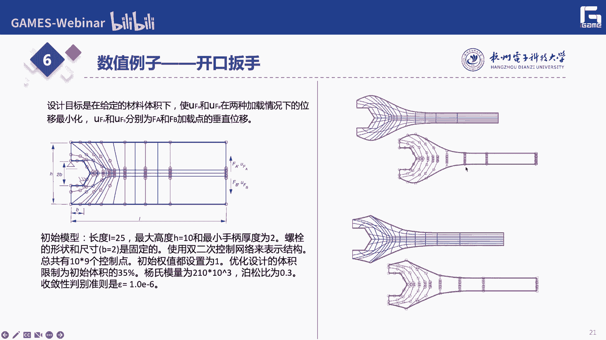
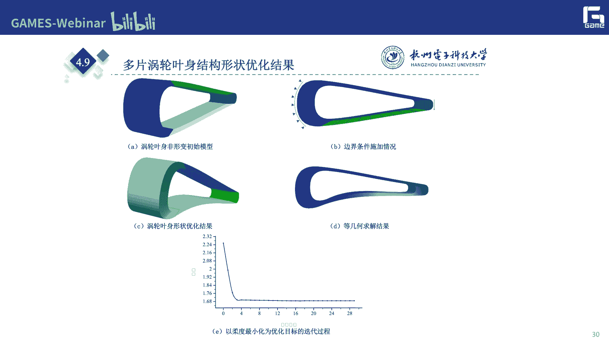
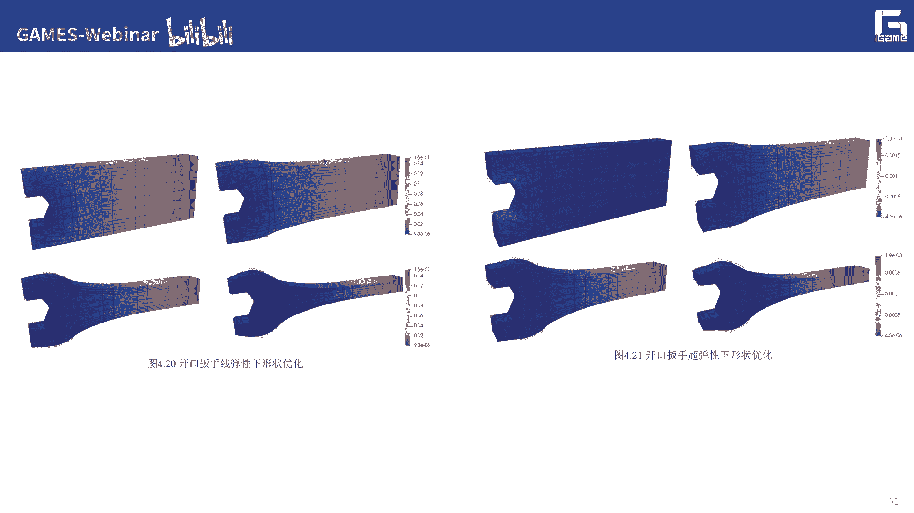

# GAMES302-等几何分析 - P9：9. 基于等几何分析的形状优化 - GAMES-Webinar - BV1dM4y117PS

啊各位同学们，这个来继续上课。

不好意思啊，今天因为第一个那个因为航班的原因，还有那个呃刚才服务器有点，重启的时间太长了，所以后来又重启了一次，那么按照原计划呢，我们今天呢还是给大家介绍下一部分的内容啊，这一部分呢主要就是说呃。

是关于这个基于等级和分析的形状优化，这一部分，我们前面已经给大家介绍了这个呃，登记和分析的求解的框架，我们说等你分析呢，它本质上还是一种有限元的一种新的框架对吧，那么也就是说呢。

它主要还是我们用来做一些数字仿真的，物理仿真的，所以说呢就说我们这个做物理法则呢，当然是为了，就是说去优化我们初始的这个设计啊，初始的设计，那么这个初始设计好不好，对吧啊，12是决定于它呃。

你这个设计的这个外形的，它的物理的性能，物理的性能啊，所以说呢就是说这个物理性能呢，它能不能满足，真正的在我们这个环使用环境里面的，这个一些呃需求对吧，这就要求呢我们来做一些呃形状优化啊，甚至托比优化。

结构优化等等，那么实际上就是说这边的话我们还是希望啊，还是希望能够呃基于等级和分析啊，能够给我们在这个对这个初始设计设计的这个，改良方面呢，能够有一些他自己特定的一些优势对吧。

其实前面我刚开始介绍这个等级和分析的时候，也介绍过了，但实际上基于这个整体和分析的，这个呃形状优化啊，是有它这个天然的这个优势啊，也就是说它可以就像修改我们这个控制顶点。

一样的去呃对他的裤子顶点啊进行优化是吧啊，也说这个用户啊，它实际上就是说不需要再了解我这个形状优化，这个，底层的啊一些他这个优化的技术啊对吧等等，这些也是这个用户，如果你这个软件开发的好对吧。

实际上就是说你如果把这些软件开发的好，你直接让这个用户去指定哪些是固定的，哪些是自由的啊，当然这些都是针对这个控制顶点，而且呢可以去指定或优化的目标对吧，你是呃让它的这个柔度最小还是应力最大是吧。

还是其他的等等一些目标啊，把这些目标呢指定好对吧，然后这个计算机呀，这个c e这个优化软件，它就会自动的把这个你要优化的这个模型的，最优的这个形状，把它优化出来啊，像这样的话。

我想的就是我们一个呃是最理想的一个状态，也说不需要任何的一个后处理的过程，后处理的过程啊，我想这次是不是呢在等于分析框架下啊，这个形状优化确实有它本身的自身的这个优势，是自身的这个优势。

那么我们这次课呢，主要给大家介绍这么几部分的内容啊，第一个就是呃线弹性的形状优化，第二部分呢是这种呃就是三维的情况，就是三维线弹性的这种形状优化啊，最后呢介绍呃。

这个我们前面不给大家介绍的这个超弹性吗啊，介绍呢给大家介绍这个关于这个超弹性的。

这个形状优化的，你说首先呢我想还是要给大家介绍一下，这个结构优化啊，那么结构优化呢，实际上呃是嗯，现在啊是这个优化设计领域，非常重要的一个问题，非常重要的一个问题啊。

而且呢它这个应用的这个应用的这个场景量，现在也越来越多啊，啊包括啊航空航天啊，这个汽车的轻量化设计对吧，这个模具的设计对吧，特别是随着这个3d打印的出现啊，那么实际上就是说我们可以给这个结构优化。

结果呢，也可以更好的把它给造出来，是上去，原来就像这种嗯拓扑优化结构优化的结果，如果没有3d打印的话啊，那么用这种传统的这种剪裁制造，实际上还是比较难的，是比较难把它造出来的。

但是我们现在有了3d打印啊，那实际上就是说基于这种支持增材制造的框架，我还是比较容易能够把我们这个呃这些拓扑优，化结构优化的结果来把它给造出啊，12是结构优化在呃这个国际的，无论是学术圈还是工程领域呢。

现在都越来越受到大家的关注啊，那么像我们国内啊，有一些像这个国学老师团队啊，应该是国内做这个结构优化方面，最有代表性的团队，那么呃刚刚今天上午我们也在北京啊，再开一个就是开源工业软件的会，那么其中的呃。

这个这个开源工业软件工委会里面，下面有一个这个组呢，就是呃结构优化的这么一个c格组，那么也是希望啊能够把这个结构优化，这个能够在某种程度上的进行开源啊，然后呢呃无论是给我们的这个同学们。

还是一些实际的这个厂家用户呢，可以提供更多的一些呃共享的一些资源也说，不过从这个学术上来讲，那结构优化设计，它应该就是以这种力学原理和数学规划算法，为基础通过啊，最优化的方法去改变这种工程结构的尺寸啊。

这就是涉及到尺寸优化对吧，形状形状优化和拓扑的构型，这就是拓扑优化，那么12下面呢也是呃，给出了这边这三个图对吧，实际上也是给出相应的这个拓扑优化，形状优化和尺寸优化啊，那么实际上从北站来讲，特别的话。

他就说我这就去决定我在哪些地方挖苦对吧，然后这些孔的这个连接是什么样子的啊，那么像这个，我觉得他这个还是应该是属于，概念设计的一个阶段对吧，概念设计啊，那么形状优化呢就是说啥。

就说我我想去优化我这个物体对吧，它本身的这个形状啊，我们把如果把这个孔确定了之后，它这个孔啊，要要大概这个孔的形状是什么样子的，或者这个形状，它这个外形的这个边界应该是什么样子对吧啊。

那么这就是这个形状优化，也说它是呃，基本上是一个比较基础的一个设计的一个阶段，那么后面的会就涉及到这个尺寸优化啊，尺寸有关，包括这些特征对吧，这些孔它的半径有多少啊，那么我这边啊上半部分啊。

它这个宽度有多少啊，啊中间这个宽度应该有多少对吧，实际上这些呢都是可以呃，把它作为一些自由的一些参数啊，作为我们的参数变量，带优化的变量来进行优化的，你说啥在这个优化里面啊。

我就是说啊属于就是以尺寸参数的写优化，那么也就是说呢，实际上就是我觉得这三个阶段对吧，也是从这种概念设计到基础设计啊，再到最后就是详细实际啊，我想在最后再满足啊，整个的这个实际场景的这个需求是。

但是呢就是说很多时候呢，这种传统的这个比如有限元的方法，或者基于体术的一种方法，无论来说这个拓扑优化还是形状与化来讲的话，都是需要对这些优化的结果，来进行必要的后处理啊，好像郭老师也带着我们来做一个。

国家重点研发的一个一个课题里面，我们也是专门就是来做这件事情啊，总要对这种像素式的拓扑优化结果，来进行这种光滑化或者cad的重建对吧，或者一些局部的补强啊，那么也就是说12比如像这个simple啊。

这些方法，我这个徒步优化的说来接我，可能有些地方这个都是锯齿状的，这种这种外形啊，或者有些地方还是非流行的啊，非常脆弱的地方对吧，甚至还有些孤岛啊，那么怎么样对这些像素是表述的这种表东西啊。

这这这种形式来进行一些必要的，后期和b站几何的后缀啊，也是非常非常重要的啊，因为这样才能够呃，满足我们后面的一些制造方面的一些规范，还有这个工艺的一些要求啊，工艺的一些要求啊，我刚才讲的就是说。

因为这个结构优化确，确实它可以提供一些呃，新的一些设计的方案对吧，所以呢呃而且这种方案呢并可能比我们原来啊，这些老师傅他自身的这个呃经验啊，来得更嗯更漂亮对吧，然后更更具美观性啊。

而且这个功能性功能性可能也更好对啊，所以说在很多的这个领域都得到了很好的，这个应用，那么我们今天呢当然会聚焦在我们中间，这一阶段就说这个行道硬化这一块啊，那么也就是说呢我是对这个边界形状的边界啊。

外形的边界呢来进行优化来进行优化，那比如就像这个例子啊，这个是商家很多的，无论等级和论文，还有限元的，这个现在优化的论文都可以看到啊，那么比如说我这边呢，就是说我这边口上是固定的。

这是一个叫做开口扳手的一个例子啊，那我的设计目标呢，就是我在给定的某个材料体积下啊，使得这个呃我这两个呃，u fa和ub这两种加载情况下的这个位移啊，要达到最小化啊，那么u fu i b是什么呢。

就是我这个f a加载点啊，还有b加减点数的这个垂直的位移，这边呢我可以设定一些初始的一些边界条件啊，然后我这边呢都是用这个呃，因为是等级和的形成优化，是越这边可以看到是一些控制顶点啊。

然后我去我的优化变量啊，直接就是这边的这个控制顶点，当然你这边可以设计一些一些这个体积的，这个约束啊，杨氏模量啊，还有泊松比啊这些参数等等，包括最后的这个收敛性的判别的这个准则啊，你这边都可以去设计啊。

那么后左边呢就是啊一些优化的一些结果，对一些优化的一些结果啊，那么就大家可以看到啊，就是说基于这么一个初始的一个形状对吧啊，非常简单的一个用户，非常简单可以把它设计出来对吧。

然后这个用户呢只要设定一些边界条件啊，固定的地方，还有这些一些施加载荷的这些地方对吧，这些专业条件，然后计算机就会自动的把这些最优的外形，把它给算出来，把它给算出来，那么这样的话。

实际上就是说呃可以就可以实现啊，我们这种基于等级和的这个外形优化，形状优化了啊，那形状优化的这个问题啊，就是刚才我们说了，在呃这个等级和框架下，它具体是一个什么样的问题对吧，也就是说他应该就是说。

我给你一些固定的边界条件，然后给你受力的条件啊，然后呢呃我的怎么样呢，去优化一些部分的控制顶点对吧，也是咱们等几何的这个形状优化框架里面，它的这个优化的变量啊，就是一些控制键的位置啊。

所以说这也是为什么我们说的在呃，等你和框架下形状油画呢，呃会变得非常的直观对吧，盐酸的形状硬化呢，它实际上是一种通过调整物体的几何外形，来提高产品结构性能的一种方法啊。

那么也就是说在我们等几何的这个框架里面，它通常呢就是以控制点的坐标，来作为设计的变量，以我们这些物理性能的指标，比如说柔度最大的位移，最大的应力啊，为目标函数或者约束函数啊。

然后来构建相应的这个数学优化模型，所以找它最佳的这个形状对吧，几何形状啊，那么实际上也就是说，我们通过形状优化这么一个工具，我们就可以非常高效的去生成这种呃，作为合理的啊这个外形设计的方案对吧啊。

那么稍后在这个里面呢主要分为三个部分，第一个就是我切参数化几何的描述和更新，也是我的设计模型啊，那么这段我在我们这个等级和里面，它的直接竞标所更新，就是以控制顶点为为呃为找工具对吧。

还有一个呢就是呃结构响应的一些分析的，一些呃呃分析的这个这个部分啊，然后这边呢就是我们的分析模型分析分析，比如说我们等几何的框架或者有限元的这个，来解这些结构的问题，结构分析的一些问题对吧。

呃最后呢就是我们的一些比如优化算法，优化算法，在这个里面就涉及到一些数值优化的，一些方法啊，一些方法啊，因为啊虽然我们这边啊，是一个力学方面的一个优化问题吧，它本质上我们还是要把它归结成一些。

数学优化的问题来进行啊，求解啊，当然在我们整体合力框架里面呢，我们这些设计模式，它就是用一些呃控制这个几何形状的一些样条，或者控制网格来进行描述对吧，然后我这个分析模型呢就是用呃，我们等几盒对吧啊。

或者有限元对吧，再来进行数值方法的计算，来进行结构仿真的这么一个计算啊，然后我最后呢是通过一些数学，数值优化的这些算法来控制啊，我这个控制点我怎么移动对吧，来总结移动，然后呢我打一般来来说呢。

这种都是一个迭代的一个优化的一个过程啊，然后呢最后迭代优化收敛到这个机子啊，收敛到这个机子，也就是说一般来说的话，就是说我们可以把这个物理问题对吧，把它抽象成为一个典型的一个数学啊，优化的一个模型啊。

就是我呃需要极小化和一个目标函数fx，让它满足一些呃，比如物理性能满足一些体积的约束对吧，反正我这个控制顶点，我x它的他的这个移动的范围，比如或者或者等等，我只要把它放在一个框框里的啊，给他加一些约束。

那么实际上就是说在呃这些呃，所有的这个形状优化问题啊，我都可以把它分解成这么一个呃，线性或者非线性约束的一个问题对吧，非线性约束的一个问题，那么实际上也是我们这边的这个fx啊，包括后面的这个约束。

我们都有一些可以自由选择的部分，对不对啊，那么爷爷说，我这个fx针对这种不同的这种优化问题，这个优化模型啊，也可以有他自己不同的一些表达的一些形式啊，比如这个fx你可以是柔度是吧，可以是应力对吧。

也可以是呃节点的位移，控制点的位移，包括你整个的这个模型的体积啊，面积啊等等啊，这些目标函数啊，而且呢我很多时候啊这个包括它的这些体积啊，还有最大的应力，用功的时候也可以作为放在这个不等式的左边。

约束里面啊，来来来做，不仅仅是我的目标函数里面，所以说呢我们就可以把一些形状优化的优化，根据它的优化目标对吧，可以让我来分析一下啊，第一个就是比如说柔度啊，是我的目标，那通常来讲呢。

我们希望这个柔度呢能够是最小的啊，因为柔度呢它就称为是结果了，一个应变能，对吧啊，它就是指物体在受力平衡下，它这个存储的这个应变能的这个大小啊，那么热度值越大就飙车了，表示这个物体的这个稳定性就越差。

所以说呢我们希望这个浓度应该是最小的，最小的，那么柔度优化里面呢，就是说我们一般呢就是说呃，希望在呃浓度最小的这个目标还是这样啊，呃应该要满足多什么样的一些，体积或者面积的约束啊。

所以说呢我最终的这个呃优化的模型啊，优化问题的模型就可以写成这样子对吧，那c这是我的刚度矩阵，f就是我的这个呃右边的这个force function是，那么实际也说了，我是上可以把。

因为这个小f就是我这边的柔度啊，f的转之前用，那么你说我就可以了，就可以把，然后v呢就是我的体积对吧，就是说卫星的就是这个呃，你是要体积要达到多少啊，都可以做一些约束放进来啊。

那么沙特站就是呃去捡这么一个优化问题，也就是说我怎么样去呃移动我的这个边界啊，或者买这个哪部分的控制顶点对吧，让呃这个整个结构的它的容度最小，便携满足我的这些力学性能，还有它的一些体积的一些运输。

第二个呢就是这个节点位移对吧，节点位移啊，那么商演员说呢，我那我让这个物体模型啊，在受力达到满足这个受力平衡的这个条件啊，他某一个物理点的这个微量呢，它的这个值啊是是是位置最胃药最强化啊。

那么这个时候呢，通常情况下这个约束呢还是这个模型的体积，有限的面积对吧，但是他还是要求啊，还是要求不要满足，我的这个k等于f这个力学性能，但还有一些比较常用的就是应力应力啊，因为因为我很多时候在。

反而这个会实际工程中用的也比较多啊，就是为了防止这个结构发生断裂啊，那么我们也像这个用户呢，需要想想发展要求减少，这个在容易断裂处的这个城市的这个硬币，对不对啊，也就是说虽然柔度减小。

也能降低它的整个整体的一个平均应力，但是柔动脑往往更关注一个全局的对吧啊，全局的一个内容的一个大小，嗯嗯而很多时候对吧，因为都是因为这个和你本身的这个模型的形状，有关系了啊，因为可以模拟下局部区域。

它可能是应力处理特别大，会超出啊你这个模型的材料，它所承受的这个范围啊，可以说很多优化的问题里面呢，我们也是经常使用这个最大应力最小化啊，来作为我们的目标的函数啊。

但是因为这个最大值最小化的直接数字形式，大家都知道了，就说是一个mi max这么一个表达是吧，像这个大家都知道他这个直接数学形，它实际上是不可导不连续的对吧，所以说呢我们通常会用。

回去会选用这种plog的方法，来建议的这个实现啊，比如说呃，我这边呢就是我的一个应力的一个最大，应力的一个一个表示吧，啊那么cm大概就是一个应力值对吧啊，也就是说商也就是说当这个p呢，它是一个正整数。

也说当这个p足够大的时候，所有用例子中最大值的p次方的结果，会远远大于其他数值，因为所以说我就开p次k后，这个目标函数的值就差不多，等于这个最大应力值对吧，而我而我没说呢，这个东西对吧。

哎这个东西它实际上就是呃啊是可微的对吧，是可微的，可可以求导的啊，所以说为什么要求导，因为后面没有算一些什么灵敏度啊，什么之类的对吧，都要涉及到一些求导的一些计算，所以说呢我们还是还是要求啊。

就是说能够把这个目标函数这个应最大应力，最好换这个目标函数，把它变成发达，变成的一个可微的一个目标函数啊，然后去这样画出啊，所以说这是最大应力的一个目标啊，那么上面我们在很多的优化问题里面。

都会碰到这种类似的问题啊，就是说我要把一个最大的一个，什么度量最小化的问题啊，这个大家都可以拿这个那个思路而来进行借鉴，它还有的就是比如说像这个体积或者面积啊，像这也是这个我们这个模型。

这个一些非常重要的一些指标啊，比如说当然他也是要希望把整个呃，体体积或者面积现在某一个范围内对吧，然后去满足我的这个物理性能啊，或者这边也是这个最大应力啊，我要把这小小把它作为原始条件对吧。

相当于把两个两个两个这个定位啊，换一换换一换啊，那么实际上我们啊，我记得有一次讲这个参数化的平面，参数化的课程的时候，我们给给大家讲过一个方法对吧，我怎么样计算。

就是我这个呃一圈北的曲线或者一圈样条曲线，围城的它那个区域的面积对吧，那如果是一圈这个样条曲面啊，三维空间啊，把它围成了这么一个模型，内部的这个体积会有多少是吧，这个伤也是可以类似的去推导出一个公式来。

对吧啊也就说呢呃有了这个公式，实际上就是我们就可以把它放到我们这个它的，这个优化的目标函数里面啊，然后再去来满足我们相应的一些力学，性能方面的一些约束啊，那么这是第四个对吧。

也就是说这边是我们的优化目标对吧，优化目标啊，那12确定优化目标当然是非常重要的早，因为这个呢他就主要是根据你的目标对吧，你的要求啊来进行设置，那优化目标确定好之后啊。

让我整个的这个优化的模型也就确定了对吧啊，那优化模型确确定之后，后面就是非常重要的，就是我采用什么样的优化算法来进行求解啊，优化算法来进行求解，那么现在我们呃包括我们团队啊，用的最多的方法。

无论是形状有ip，就应该还是这个mma的方法，方法，就是说，然后他就说是一种比较常用的一种，非线性优化的一个算法啊，那么它实际上是对于很多的工程啊，科学问题都可以来解啊，它的基本思想啊也是比较简单的啊。

就是怎么不动不断移动这个约束的一些间接线，来进行非线性优化问题的这个求解啊，那是在在他出现之前，求解这种复杂的肺炎有优化问题，一个非常有挑战性的一个一个一个问题啊，那么伤时他在对198几年提出来的。

这么一个swamp，它的基本思想就是我在每次迭代中呢，调整一些伸缩参数，然后让这个目标函数啊，随着这个迭代步骤的增加而逐渐的这个优化啊，那么这个算法呢可以把这种约束条件，表成我这个间距均线的这种形式啊。

然后呢，我不断的调整这些间接线，来去求解相应的优化问题啊，然后再在这些优势条件时看到一组标记线，那么这些线它是可以呃，以递减的方式彼此靠近吗，那就最后就可以呃，如果呃达到我们的约束优化这个迭代之后。

它能够呃他们之间的距离就非常小的话，我们就可以看到它就是解决我们这个优化问题，但它还是有一些优点和缺点的啊，当然他的第一个优点呢，就是说它可以处理这种复杂的非线性问题啊，因为刚才说了。

就是说呃我们真正的在一些实际的场景里面，碰到的可能都是一些复杂的场景问题啊，特别是我们在这个形状优化，拓扑优化里面啊，那么另外一个呢就是说啊，他这个求解最后优化的这个呃，你到底优化到什么程度是吧。

它实际是和这个迭代次数啊，有比较大的这个关系，有比较大的关系啊，这是另外还有呢就是说对于这种大规模的问题，他的求解效率啊，也带速度啊，还是比较还是比较这个比较快的啊，收敛的比较快的。

但它也是有和我们一些传统的呃，有一些优化问题相类似的一些缺点啊，比如第一个就是说对于某些类型的问题，这个它很有可能会找到局部极小的一些，意识解啊，这个沙子对很多的这种迭代型的这种优化算法。

都会有这个问题对吧，都会有这个问题，另外一个呢就是说对于这种目标函数啊，目标函数变化过于剧烈，或者你这个约束条件的变化过于剧烈的时候，它也是可能会不会发生作用，发挥作用啊。

所以呢这也是呃我们这个所谓的这个mv算法，简单介绍一下，那么实际上也就是说我们最后形状优化对吧，呃问题实际上就是说我也可以看到，我们都是可以，它这个目标函数都可以求导的对吧。

那这个呢虽然最大最大应力最小化啊，他原来可能是不能求导的啊，但是我们对它做了一些改造啊，把目标还做了一些改造，就还是变成一个可微的一个目标函数对啊，所以说我们也是可以去采用这种基于梯度的。

m a 12盘的去求解，相应的前面的几个优化模型，优化模型，那么他下去是把整个的呃，一些问题分解成多个近似凸的子问题啊，然后通过迭代每个子问题得到原文里的解啊，因为现在初优化求解起来是呃比较稳定的对吧。

也是我们有一些比较好对吧，虽然他这个思想还是比较简单，也说我通过移动接近线啊，然后把呃一些问题能分解成多个的，近似的这个值，凸的这个值问题来进行求解，那具体的这个他的做法我就不说了啊。

基本上来说一般来说呃他的这个求解模型啊，比如说是这个样子啊，那么实际上呢就是说我这边呢阿尔法贝塔啊，比如说s键的是我原问题的这个实际变动，阿尔法接贝塔键呢就是指问题的上角往下。

那么这个键呢它实际上就是说呃，呃我把它分解成多个近视凸的子，问题的一些下标嘛啊，而我这边的这个呃a0 啊，a0 a i c i d i l这些东西啊，实际上就是说来，来决定你最终的目标还是什么样子。

是吧啊，那么这个yi啊z啊，这些是新引入的一些变量，然后可以通过求求解方程组求解方程的来结果，小火这边比较重要的就是这个啊，设计变量的上限和下限啊，也说这个呢它实际上是比较影响。

就是mma算法最后求解的这个收敛器啊，也是因为他这个为什么叫移动间接线嘛对吧，他这两项呢，就是就是作为这个移动间接性的这个边界，来进行，啊这边具体的细节我就我就不讲。

也就是说实际上就基于这种梯度的优化算法，进来处理呢，它能够因为我们这个工业函数对吧，可以非常快速准确的计算梯度信息对吧，然后他可以在一些可接受的时间内吧，可以收敛到这个目标函数的极值对吧啊。

但是如果用这种低度低于梯度的算法呢，一般还是要推到这个目标函数导数啊，还有灵敏度的这种计算形式对吧啊，那么呃比如说你用一些牛顿迭代啊之类的，还有计算，相应的还是理性来加快这些收敛的速度。

但如果是无梯度的这种优化算法呢，它迎来来说呃，主要是用于这种不可求导的这种问题啊，或者就是你这个除了过程的这个复杂度，远远大于你这个目标函数，计算复杂度的这个问题上。

那么实际上这类算法呢需要对这个目标函数啊，还有约束函数进行多次的这个计算才行啊，当然相比于基于梯度的这种优化计算呢，还是增加了这个总体计算的这个时间啊，但是优点呢就是简单了啊，不用求导啊。

有时候不需要复杂的数学推广啊，啊这边就说是一些介绍一下这个ma算法啊，ma算法啊，然后刚才讲了啥，我们这边呃在很多的形状优化这个框架里面，基本上还是要求导啊，还是要求导就可就涉及到后面这个呃计算这个。

结构的灵敏度分析的这么一个问题啊，灵敏度分析的这么一个问题啊，你说结构明明灵敏度啊，所求的就是我这个目标函数对吧，无论你是最大的应力最小化，还是呃啊这个柔度最小对吧。

实际上就是说让这个目标函数求这个目标函数，对这个设计变量的导数，求导导数，那么12结构灵敏度，这在很多的这个结构优化问题啊，可保险评估啊，还有参数识别时都都是非常重要的作用。

对也就说说你这个结构流化设计，它你最后求解的呃效率怎么样，收敛的快不快对吧，包括最后的结果怎么样，想都依赖于你在设计，最终涉及了你的灵敏度，分析的这个效率和精度是怎么样，那么三就是对于我们有些人来讲。

求解精度，灵敏度主要就是这种解析的方法，还有有限差分的对吧，比如说求导，就当这种差分来做些半解析的一些方法，半截式的一个方法啊，还有一些呃复变复变函数的复变函数的方法，还有伴随变量方法啊。

那么简易法呢当然是比较早的，但就是说他要进行比较繁琐的一些呃，人类推导才可以，那么上灵敏度的这个数值大小呢，它是就是代表了这个模型目标，你受到设计变量，它这个影响程度，对不对啊，比如说模型的目标函数。

你说的这个设计变量的养成对吧，也就是说如果你这个设计，比如如果这个母的目标函数，对于呃这个控制顶点啊，它应该比较大对吧，让它这么移动啊，然后让他往这个目标是最小，也就是说上次他在最终确定你这个控制点点。

怎么动的，比如说收缩方向对吧，确定这个优化问题，这个收缩方向上会有会极为有效啊，那么当然相应的这个呃这个求求导啊，我这边就不止一点啊，大家可以后面来看一下p p t啊。

然后实际上就是说这边比如这个我的目标函数，对我的设计变量的这个呃出现它的微分啊，或知道的上就可以根据他的一些目标函数啊，或者展开形式啊，直接来进行计算啊，但这边还是会涉及到相应的这个刚度矩阵。

对球技还有一些认识法则，啊，但就是这边还是会涉及到一些相应的呃，一些呃一些技巧吧，啊包括我怎么样用半水法对吧，来把这种呃求矩阵的逆变成这种方程组的求解，对吧啊，然后我怎么样通过一些矩阵计算。

来求得最终的这个导数值啊，那么这边呢就是说我通过这个具体的这个呃，单元短路矩阵，还有它的单元载荷向量的形式是吧，就这种形式对吧，然后相应的我就可以求一下这个单元啊。

线线材线下的这个刚度矩阵和呃和载荷向量啊，他对这个设计变量xi的，他们这个导数形式导数，我们就可以把它给这样写出来对吧，也就是说这边的xi就是我的问题变量，所以说我最终大家可以看到啊。

就是我最终灵敏度的计算，最终表现了我怎么样求这个是啊，就真的这都什么奇函数相关的对吧，一些矩阵的它的求导啊，雅各比的这个求导啊对吧，还有a这些这些求导一些问题，包括实际上这边也还是用到一些呃。

就是需要退一下啊，就我怎么通过这种积分的链式法则对吧，然后能够把它啊推导出来啊，然后呢去算出来啊，比如说我做几个的这个呃，比如b的导数啊，j的导数，g的导数啊，所以我怎么算啊，这个也是可以去推的啊。

那么包括a g函数n对这个s的，它的这个命令组的计算结果我怎么算啊，它也是可以都推得出来吧啊，后面的就是我们说的，就是实际上就是就是说我最终的这个把这个呃，向量的密度求出来之后。

然后我就可以来确定我指甲，整整个的这个某些这个自由度的设计变量，它的这部里面我怎么移动对吧，mac大家可以看一些例子对吧，这边呢就是说我这边应该是这边是固定的啊，这里也是控制了这三个控制定点。

这六个控制点都是固定的啊，然后我这边呢这个c格玛x往上4d对吧，然后这个c c c c和y的往上4d4 ，y x朝着这个方向往这边拉的，现在呢我就是要要求什么啊，要求我我这些呃优化这些控制顶点的位置啊。

然后呢我怎么样来，我怎么样来进行进，让它的整个的这个版的浓度最小啊，浓度最小也是他初始的是这个样子啊，这个你还可以设置一些雅思模量的参数啊，不是免的参数啊等等啊，也就是初始设计，如果是这样的话。

我最后优化出来时，就带着在这个开阔的地方对吧啊，才会变成这样，那也是符合我们初始的这个预期的，那么就大家可以看到，就我在这个等你和框架里面，因为我这边呢我的优化变量就是这些控制定点。

比如说你求导的这个呃，代价上也是也是变变低了嘛，对吧，这也是变小了嘛，就说你这个求导的这个计算各方面上也说呃，你不用求那么多次啊，那你这边比如有四个设计变量，有只求四个四个导数，就像四个定位定度。

那来决定我这个控制顶点怎么移动就可以了，那只是另外一类，就这边是固定的呢，这边是固定的啊，然后这边呢我我我我又优化了目标对面四个啊，然后我这边会往下，那我就最后这边怎么样呃，最优的这个设计啊。

当然这边呢它不仅仅把这个控制点啊放进去，而且把这个呃如果是numbers表示的话啊，他把这个位置还有这个全因子啊，那他这个分子分母都有全因子吗，那么这个全因子商也是可以控制形状的对吧。

那么也就是说还可以把这个控制点和全日制，这两个都可以看作是呃这个自由呃，这个设计变量来进行优化，那么这边呢就是刚才我刚才我讲的，这边就不多说了，对吧啊，也说那就是我们一开始给大家看的那个例子啊。

举了这个例子对吧，就是说我这边开口这边固定啊，然后我这个向上向下，然后这个最终呢呃这个它的受他的这个优化。

这个形状是吧，那么这是二维的这种平面的对吧，现代性旋转优化问题，那啥对于三维来讲其实也是类似的对吧，我这边就就简单过一下啊。

比如说我们这个上次弹弹性力学，三分线弹性的地区，就说是无外乎在我们登记框架里面，就是说我需要在体上来进行计算啊，在体上进行计算啊，那么商业说这边呢我就涉及到一些呃几何方程，平衡方程，本构方程的一些问题。

包括它的一些边界条件的一些约束啊等等啊，这边不讲了，就是前面课本上都给大家介绍过了啊，也就是说我怎么样在登记核的，特别是三维现代性问题里面，我怎么样把这种呃他的线弹性的问题，通过一些变分法对吧。

然后把它写成ku等于f的这种形式，好像这个里面非常重要的，就是说呃我在每个单元上啊，比如说在每个节点区间所对应的这个纸面片上，这个单元上，然后我去计算相应的这个单元刚度矩阵对吧，比如说单元刚度矩阵。

我之后再怎么样呃，来组装起来对吧，那在计算这个单元刚度矩阵的时候，我用了这个等参单元的这个思想是吧，然后我也是我要呃，我要把这种在物理域上的，对这种物理变量的这个坐标的这个积分问题。

把它转换成在参数域上，参数空间上的这个坐标的这个这个积分问题，那么这个形状优化的目标函数是吧，刚才都讲了，就是说相对于三维n也是类似的，你当然是可以是是吧，结构的最小浓度啊，包括最大一个理论小化啊。

还有这个体积对吧，这些都可以作为一个目标函数来进行求解啊，所以说你把这个目标函数呢，它的这个呃就出来之后，我就可以计算相应的这个灵敏度对吧，然后我包括我怎么样来这个里面，来满足一些约束啊。

所以说我们可以看一下，就是说在我们的整个这个呃，等几何的这个形状优化的算法框架，他这边诶你画了一个图是吧，就是说我需要先读取这个模型的几何信息啊，然后确定优化的边界，优化的变量啊。

然后去解决了ig的问题对吧，然后我对每一个设计变量，来计算相应的这个目标啊，对这个这个形状的这个，给我这个几何变量是吧，设计变量呢他这个灵敏度梯度是吧，然后确定你的步长是什么样子的啊。

然后执行一些相应的搜索对吧，也就是说啊然后呢根据这些呃你的步长，然后去确定更新你这个坐标的，控制顶点坐标的位置啊，然后然后再更新几何模型啊，下面呢我就可以再进一步算啊，就是说呃你这个在更新之后。

它的目标函数变成什么了啊，啊目标函数变成什么浓度已经降低对吧，嗯降低了对吧，降低了就是可以啊，如果没有降低，那我就可以说明这个更新的不对对吧，更新太大了或者怎么样，那我就可能要减小，你这个不长是吧。

然后再再再再回来啊，再进步，那如果呃柔度降低了对吧啊，那你这个最终也没有收敛到你的目标啊，啊还没达到这个浓度最小的这个这个目标对吧，没有那我继续回去啊，然后确定优化编辑，这这这都已经确定了。

然后我再算一下呃，再迭代一次对吧，来再求中i j nf来分析一下啊，分析一下，然后再计算相应的这个形状，季度b下去对吧，因为这个时候为什么要，因为他这个里面就变了对吧，为什么变了啊。

因为你这个这个你的形状内部的，这个点的位置啊，什么这些都变掉了对吧，所以呢已经i j求解，相应的以这个目标的值啊，目标函数的值，商业目标的函数的这个东西也变掉了对吧，所以说你在计算这个星上去走。

肯定就是完完全另外一个有另外一个结果是，然后一直在进行这个步长，是执行潜伏的，然后一直这样迭代下去啊，然后这样的话我们就说呢呃就会白城啊，无论是二维还是三维啊，都可以基于这个流程来进行呃。

来进行行动优化啊，那这边呢就是一些呃一些例子对吧，这边比如是一个呃三维单片，还有多片模型，它的形状优化的一些结果，这边就是呃应该是一个单片的，悬臂梁的一个初始的一个模型对啊，就是这边固定。

然后这边往下一个定啊，这是三维的这种自拍的这个控制设计，变量的可能会更多一些，更多一些，好这边呢就是一个多片的1/4代工，你看他刚刚才我们那个二维问题，是非常类似的对吧，外乎就是沿着比如z方向。

我是扫了扫略了一下啊，那像我们最后优化出来的结果，和中二维的这种结果也是非挺类似的，也是挺类似的，也就说实际上这样的话啊，这样的话嗯对于这种多片开门快手啊之类的，我们一场演示会可以得到我们这种想要的。

一些数数数这个优化的一些结果对吧，那么这边呢就是说我是呃一些更复杂一些，也不要更复杂，就说我是不建议是单单片了啊，毕竟是单块，我这边用的多快的，这个变量体可以组成类似于握个涡轮呃，夜深的这么一个呃。

这等级方法来做西装优化的一个结果，这边是一个初始的啊，一个形状是吧，然后我这边设备的边缘试驾的情况下，这边是往下的，然后这边哎我这个固定住啊，固定住啊，那么也就是说呢这样的话呃我要优化的啊。

我要优化的是其他的这个控制链的位置，然后这边呢就是我最终的这个涡轮叶森的旋转，以后的结果啊，那么是基于这个优化后的结果，可以在上面再做等级和仿真，然后看一下呃这个相应的这个对吧。

呃反正效果是不是满足我们这个要求，那么这边呢就是因为我这边是采用这种，柔度最小化为目标的优化目标的一个迭代的，一呃为目标的一个一个一个模型啊，所以说它这个里面它呃这个浓度，它就这个变化也是可以发现。

虽然说一开始呢这个数量还是很快的哦，下降还是挺快的，到后面呢就会慢慢的慢慢的收敛。

那么这是三维的形状优化问题啊，那实际上是和我们这个二维的形状优化的，问题呢是基本类似的啊，基本类似，那么最后一部分呢给大家介绍一下这个，超弹性问题，我们上次课主要给大家介绍，这个所谓超弹性问题，对吧。

他的这个在这个框框架里面，我怎么来进行求导，我怎么我怎么样来进行仿真是吧，那么实际上也就是说如果对于这种超弹性问题，我当然也是可以做形状优化对吧，那如果对于这种超弹性问题来进行形状优化。

和我们呃其他的方法用来也不同对吧，就是我们这边需要讲。

虽然我没在做这种超弹性问题，这种求解的时候啊，这是我们上手给大家看的这个框架对吧，比如说我输入样条几何模型，定一些材料参数啊，因为这边是超超弹性材料嘛，和边界的约束啊，然后分析我这个单元这个加息啊。

设置数量误差等等对吧，因为我要看看我最后的这个动力学啊，还是这个有没有收敛啊，然后计算计算相应的这个枪切线的高度矩阵啊，还有这个一些它的残差，一些初始化对吧啊，便便利变频单元对吧啊，是否收敛。

肯定如果没有对吧，我就继续下去啊，电力并非单元在每个单元上，或组装相应的单元切线刚度矩阵对吧啊，然后计算相应的产量向量啊，还有这个单元矩阵的影射全体集阵对吧，然后是不是编辑结束啊，编辑好的话。

如果就先求解这个全局的这个全局矩阵对吧，然后继续下去，这是我们上次课给大家介绍了这个超弹性，超弹性呃，方便了这个一些问题求解的一个，主要的一个方面对吧，那么实际上在我们刚才给大家看到了。

就是说对于这种呃整体和形状优化的，它的这个优化的关键流程是这样的，这也就是说呢也是呃定义这个优化问题，基本的一些参数对吧，社交边缘条件执行这个i j a的分析，仿真计算向的目标函数和约束对吧啊。

然后进行灵敏度分析，然后确定这个优化的方向和步长啊，然后更新这个控制变量的位置对吧，更新设计变量啊，有没有收敛啊，如果收敛呢是那就输出最终有关结果，如果没有再继续进行执行i及仿真。

在计算新的目标函数和约束，计算新的灵敏度对吧，然后再进一步确定这个优化方向和步长对吧，然后更新试一遍，然后下去，那么这是整个优化的问题模组是吧，所以说实际上就是说呃这边呢我就不说了啊。

上次也是和我们前面是一样的，无外乎现在的我变成了一个超弹性的一个问题，是超难性的一个问题，那么也就是说如果让这个，比如说是达到欧洲最小，作为它的用户优化模型模型啊，就这样对吧啊。

如果是优化目标达到这个最小应力的啊，就是就是这个目标函数啊，这个扇子在我们很多的传达问题里面，都是这样来做的，那最小位移对它的表达式啊，然后这个最小面积最小体积，它的表达式。

那么啥在这里面也是涉及到比较重要的，就是我怎么样去呃，计算你这个呃先超短线问题里面，他的单元刚度矩阵对吧，对这个设计变成这个求导公式啊，上回我要涉及到的这个求导公式，也是这个矩阵的求导是吧。

打个比的求导对吧，还有这个呃即函数的求导是吧，还有这个呃就是控制顶点，对它这个他们直接自身之间的这个求导，这些问题，当然这边呢就是说我这边呢会涉及到一些啊，这就控制顶点对吧。

还有这个全因子的就是全灵敏度的问题是吧啊，也就是说说你是不是考虑这个，只考虑控制链的位置啊，啊还是考虑这个全因子的优化，要不要考虑进去啊，比如说如果两个都考虑进去，你不能这样算啊。

如果是只考虑我的控制键的位置啊，那你可能是这样算，这边呢就我也把它都列举列出来了吧，那么实际上也是对我们这个超弹性问题来讲啊，那么伤我最终的这个刚度矩阵啊，刚度矩阵12是和位移是相关的对吧。

而且呢这个材料矩阵呢，实际上也是因为它是非线性的嘛，所以它们之间的关系呢不需要现代性，那么那么那么线线性材料，那么呃那么直接对吧啊，也说他是没有办法呢，直接有这个应力应变计算来得到。

就会相就说呃使得这个位于导数计算过程中呢，呃无法适应这种超弹性的这种材料啊，也就是说上就说这种求导的计算，在这种非线性问题里面，我们只能用差分法来求这个位移的导数，那差分呢大家在学这个微积分的时候。

都应该都理解了对吧，所以说发展整个的这个参数域区间，来进行离散化，然后我把这个呃，求微分的这么一个连续微分的问题，把它变成一个呃差分的一个问题，通过导数啊，点了这个前后相的插上，来求得这个导数的近视啊。

啊把这个近视呢作为我们导师一个逼近，也是我们这边呢，实际上是用了一个呃中心差分法来求一阶偏导，就说做一个它的展开啊，它的展开啊，然后这样的，这个我又对x的这个偏导的一个逼近形式啊。

就是这个啊这个我通过前面的这个颜色，也有一个u xi加在x等于这个ui简单啊，这个东西，那我要求的是什么啊，我求的这个啊，所以说呢，我如果实际上就是可以把它写成这个形式，你要这样呢。

我们实际上就可以把这种位移啊，对设计变量的偏导呢，带入不同的这个目标函数的导数里面，然后求得各个设计变量它的灵敏度的这个数值，然后来推导这个呃，前面的四种不同的目标函数嘛，它的这个导数形式是什么样子。

那么他这边呢比如柔度啊，还有这个位移啊，对这个这边导致清晰，我都可以把它解析的，把它写出来啊，那么实际上我们这边还有还有还做了一件事情，就是说实际上也是类似一个多分辨率的一个，一个思想啊。

反正后面应该我们也会给大家介绍啊，给大家介绍，就是说呃基于体积分的这个建模，仿真优化，一体化框架里面也有用的这个细分的思想对吧，像我们这边呢也是用一下，就是说啊我的设计模型啊，可能是触网啊。

为什么是出网格，就是我可能觉得没有必要啊，一定要用那么多的控制零件，都做过我的设计表面，但是我的仿真的模型也是我做i g计算的，这个模型啊，是西网课的这个系网格来干嘛的，就是来计算这个灵敏度的啊。

而且这个他们之间的这个灵敏度呢，它是可以传递回去，有的，虽然我是在这个细网格上来进行仿真啊，然后把这个出网格呢作为我的呃，控制控制网格对吧，有个设计的网格啊，但是呢就是说我这个，在新网格上。

每一个控制电，它能敏度是可以传递到这个出网格的，这些控制点数的，它的灵敏度，那这个呢是没有问题，也就是说实际上我们通过这种传递啊，我们这边也是给出了他的这个灵敏度，传递的一个解析的一个公式。

是解析的公式啊，那么通过这种解析的这种公式啊，我上就可以求得啊，在这个原来这个出网络上，它的相应的这个呃灵敏度怎么来更新啊，这边来更新啊，但是它之间呢基本上还是一个非常简单的，线性啊的一个关系啊。

偏硬的关系，那后面也是看一些例子啊，这边又是一个二维的悬臂梁模型啊，因为它是形状优化中比较简单，也是比较经典的一个例子是啊，那么像这边呢他就给出了这个问题的这个定义，还有边界的这个受理条件。

他这边形状优化的目标呢就是我在体积约束下，怎么能荷载讲的这个垂直位移啊，啊能够最小化啊，最小化啊，那么它也设定了现在的这个量的长度宽度啊，高度变化的范围啊，就是我这个形状变呃，设计变量你不能变化太剧烈。

是太那个啊，还有它的相应的一些，杨氏模量啊等等啊，这边呢实际上主要采用了两种方案来进行测试，优化啊，那优化的设计变量呢，就是模型上面积的上边界的六个控制点啊，这边的六个控制点就是它的这个设计变量是。

然后方案一的它的优化目标呢，就是我最终的这个悬臂梁的面积啊，不超过最大面积的70%啊，那么这是这一个啊，那么这边的实际他就给出了一些啊对吧，因为我优化的变量就是上面的六分点。

所以比如说它的最后的这个优化的一些结果，优化的结果，那么这边呢就是在这个整个的优化过程里面啊，整个内化过程中它是全平梁形状，叠在叠在里边是一个位置对，也是可以发现我把这个位移值作为我的形状。

这个优化的目标也是可以做到，这是另外一个，就是这个呃带孔薄板的平板的一个例子啊，也是我们在呃经典的计算力学里面，比较容易通道的一个例子对吧，他的这个模型呢，就是一个中间带孔洞的一个大型板。

然后板的这个四面受到向外的这个拉伸力啊，但是这个受力和模型啊这是对称的对吧，是对称的啊，所以呢就是说可能只能对这个，我们只要对这个板的这个1/4来进行建模，缓存，就变成这个样子就可以了。

那么像其他部分呢，就是如果是一个呃里面有个孔的其他部分呢，你就是呃都可以对线的来做就行了啊，那么像这个里面呢，我们这个目标呢就是说呃在面积约束下，它的柔度最小啊，柔度最小。

然后我们也是测试了对这个问题来做了呃，我们主要用了两片的样条曲面模型，来构建相应的这个cd模型啊，然后呃对这个设计变量和约束来也是设置了啊，我们上去是为了检验我们在多片模型下，这个形状优化结果的啊。

这个正确性，并且测试这个不同这个体积约束啊，对平板形状优化的呃这个影响，比如说大家可以看到，他上这边确实是分成了两个面片，面片一和面片，二是，那么也就是说在第一种约束下啊，在第一种约束下啊。

我们实验就是说我们还是大家可以发现，就是5s得到一个比较类似于一个一个圆孔的，这种结构啊，这也是比较符合我们的这个预期的，就是这个例子啊，另外一个这边就是一个，类似于圆角版的一个例子啊。

那么我们这个优化的变量呢，也这边是就它的这五个控制定点，就是我的这个优化的变量啊，也是我优化的边界是吧，优化的这个边界，然后这边30表示成了三个，那个是曲面片，那个是曲面片，那么。

就大家可以发现我这边呢就是说实际上在，线弹性下和在这个超弹性下，它这个形状结果的这个优化的这个情况啊，优化的一些情况区别呢区别不是太大啊，不是太大，但还是还是有些稍微稍微的一些差别啊。

那啥就是大家可以看到，就是说我在通过这种优化，通过这种优化确实是在这个呃尖锐的部分，他本来初始是这样的对吧，也是这边是应力比较大的，应力比较大对吧，我可以通过这种优化，让他这个应力啊变变得小一些啊。

而且呢让它这个地方尖锐就会变得更加的光滑，总体来说还是还是有效的对吧，也真的会变得更平滑，像这种设计的还是非常有效，可以减少像这个尖锐地方的一些应力集中啊，那么从这些图的这个应力分布上。

我们也是可以看到嗯，应力在这个优化过程中是减少了，而且分布啊它会变得呃这个更加的均匀，那这个后面再看一下，比如这个呃体积量的这个模型，体积量的认为这是一个三维模型，也做了超弹性的这个优化问题啊。

超弹性的这个优化问题，也就是说它是一个实际是一个侧面，它是一个t是一个梯形结构的一个量模型，也是我们这个优化目标呢，就是在这个体积约束下到最小化，这个才这个模型的柔度啊。

来提高这个整个结构的抗压能力了啊，然后这边呢体积量左边这边是固定的啊，这边是固定的，然后上面呢受到相应的这个力对吧，相应的这个力啊，然后这个力均匀方便在上面面的上面啊。

然后我们这个4g模拟实际上是用了一个，那不是铁来进行构建对吧，那么设计编呢就是下表面的12个控制定点啊，这边下表面的12个控制点来作为设计变量，然后这边为什么才出这模型，实际上也是对这个模型。

我们是有参考的一些呃一些例子，只要我，而且我们通过一些等几何的这种优化分析，求解之后，发现呢，也是像我们也是比较符合我们这个预期的啊，符合预期的，就是说实际上就是说我们三就是可以看到啊。

这是最终优化的结果嘛，啊最终我通过迭代一词，两次迭代五次迭代数，它最终优化了这个结果变成这个样子，那么三节说呢，三我整个的这个柔度的这个数值对吧，你看也是从这个400多下降到100 100左右。

100左右，那么包括相应的这个仿真的结果啊，相应的仿真的结果啊，这边就是呃优化前的，这是优化后的对吧，仿真的这个结果啊，那么上次通过这个仿真结果，也可以看到这个优化后模型的这个位移啊。

还有它这个硬币都是啊明显降低了啊，明显降低了啊，再说呃应力的上限从这个对吧，大概是900亿，下跌到370，你说三句就表明我整个结构啊，它内部存储的这种应变能是减少是减少的啊，也是相同边界条件下。

这个优化后的模型可以承受更大的压力啊，更大的压力，这是我们形状优化的目标嘛对吧，这边的商就是给出了就是我在线弹性访问下啊，它的这个形状优化的啊，左边是这个呃位位移了这个方程的结果。

这边是那个应力方程的这个结果啊，那后面呢是一个就是说带孔平板的一个例子啊，啊这个开口扳手模型的一个例子，开口扳手一个模型的一个例子，那么这个开口扳手呢，它是我们前面呃也也给大家看过了。

实际上就是说在线弹性材料下啊，现弹性材料下，是这个是这个结果啊，那个结果也这是我初始的这个形状啊，那么当然它的这个边界条件怎么设置的，就是说我这边只要控制定点都是固定，这边这边应该都是固定的啊。

然后我优化的呢就是这这些红色的啊，或者一些直接点的空，这些位置，你说这个红黑色的这个框点呢，就代表设计变量啊，红色的这个框点呢是代表联合变的啊，也就是说这些红色的点是随着什么啊，这些蓝色的点啊而变化啊。

而真正的我的优化的变量是这些黑色的，这些点啊，反正因为这边呢我是固定的对吧，然后这边往往上，那么实际上也就是说这些红色的点是跟随的，伴随的也多，有一个规则，我们定义了一些规则，它具体怎么跟着怎么变对吧。

我们这边是给出了一些规则，然后让它怎么样去变这个动，也就是说这边的山，就是这边呢给做了一个，分别在给出了这个线弹性材料下，它的形状优化的结果，还有在这种超弹性材料下，形状优化的结果恰好是前面的。

就是说呃实在六次迭代后基本上就收敛了啊，所以说实际上在现代性材料六次迭代后，就收到了555非线性分析材，超载性材料的话，它五次迭代后才收敛啊，你说像我们这边展示的模型呢，也是分别迭代一次，两次。

三次和最后一次迭代的结果啊，就是这边呢是分别展出了相应的这个呃，在不同迭代的情况下，它的这个优化的一个结果，这个体积约束的是变到了原来的1/3啊，比如说我们最后的优化结果上。

也是大家可以看到在我们这个满足这个约束下，上次达到了，得到了这个符合我们这种bl的这种结果，满足了我们的优化目标啊，发出来的优化目标，比如这边实际上就是说呃，呃主要介绍了一种对吧。

基于这种超弹性材料的一种形状优化的框架啊，那基本的框架和这种线弹性的还是类似的啊，但是不同的是，因为我这边是非线性问题啊，所以说我在这个无论是求导啊，还有其他的一些呃框架的一些元素的一些，计算方面啊。

我和线弹性还是有的比较本质的一些区别啊，也就是说当我们给大家讲的，就是我在不同的目标函数下，他这个灵敏度相应的怎么算啊，然后我怎么样根据啊对吧，根据中这种多分辨率的性质啊，也就说我的呃设计网格啊。

我的设计的变设计的这个表示，和我的分析分析和呃仿真分析的这个表示，他们之间是有一个呃可以灵敏度传递的方法啊，也是这样的话，我上就是我的设计变量呢就不用那么多啊，为什么要要要让设计变量不用那么多呢。

因为呃我们呃要达到比较高的这个登记和分析，房子的精度化，仅仅仅用呃，刚才那几个控制定点还是还是不够的，对不对啊，就是说我们还还是肯定要对他做一些加息啊，等等的，那你加息了之后，相应的这个控制点的这个。

设计变量的数目就增加了对吧，设计变量的数目就增加了啊，那么我怎么样，在这种不增加这种设计点的数目的这个情况下，对嗯，然后来进行这种设计优化，我就能够保证我最优化的结果是合理的对吧，所以我觉得这种呃。

到分娩的思想也是挺好的一个事情啊，而且我样条表是天然的对吧，天然的就是这种事情，我通过无论是局部的，无论是插入节点还是中间，我都是可以保持呃这个那个形状保持不变对吧，精确表保持不变，就是啊。

所以说我就可以在呃相应的这个下面，这个框架下来进行这种多分辨的计算啊，求解，可以大大，至少我可以大大减少我优化的这个成本啊，因为我相应的这个设计变量求导，你先因为这个少了嘛对吧，想想那个求导啊。

各方面的这个计算优化这个方面的计算的，实际上就是说也是这个成本呢也是大大降低了，啊，你说这是我们今天主要给大家讲的主要内容啊，主要还是讲形状优化对吧啊，形状优化啊。

那么我们也是通过一些例子啊给大家展示了啊，就是说在整体和分析的框架下啊，确实呃要比有线源框架啊，形状优化可以，你可以更方便对吧啊，因为我们基于这个等几何的框架，我就可以把形状优化的问题。

优化的这个问题变成上，直接对我的控制定点来进行优，它的位置来进行优化的一个问题对吧，我们前面也讲过多次，这三句相当于就是说哎我给你一个黑盒子，黑箱子对吧啊，你只要给我电解条件，给我受力啊，它的固定啊。

还有这些材材料参数啊等等这些边界条件，然后我就可以去优化出它最后中的这个位置，在哪是吧上，也就是说呢，这是一个非常重要的一个根据合的一个一个，根据合的一个思路啊。

也是根据和大优势的表现了一个，后面呢我们可以对他的这个呃拓扑优化啊，来进行讲解啊。