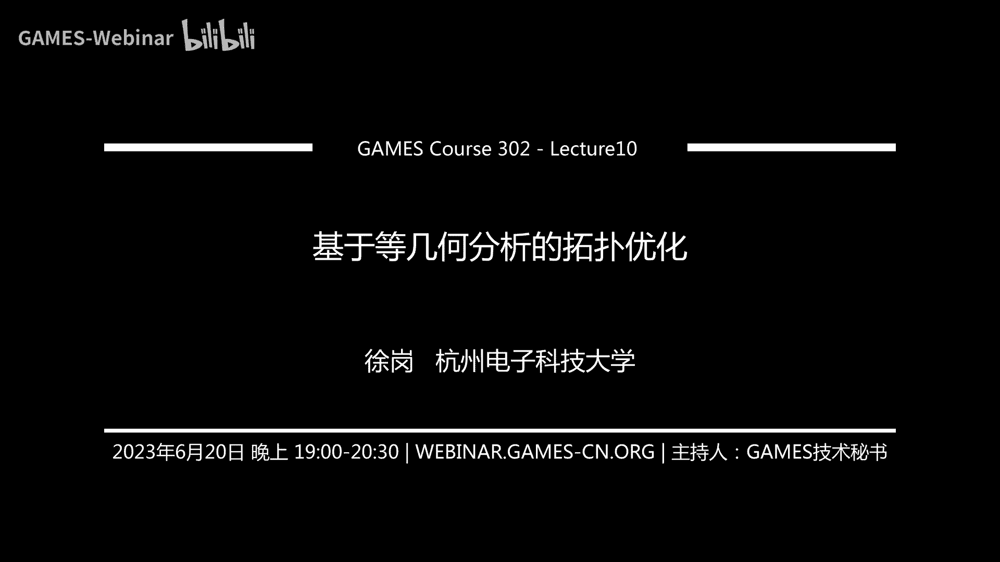

# GAMES302-等几何分析 - P10：10. 基于等几何分析的拓扑优化 🏗️

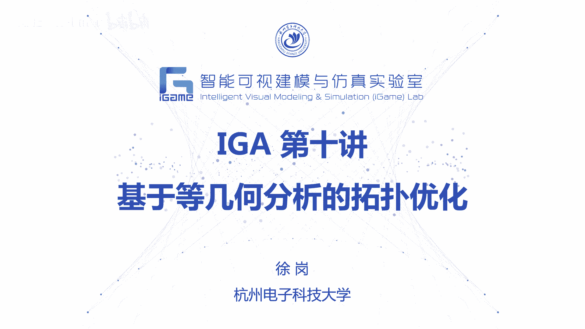

## 概述


在本节课中，我们将学习基于等几何分析的拓扑优化。上一节我们介绍了基于等几何分析的形状优化，本节我们将探讨拓扑优化的基本概念、几种经典方法，以及如何将等几何分析的优势融入其中，实现更高效、更精确的结构优化设计。

---

## 什么是拓扑优化？🎯


拓扑优化是结构优化的一个重要分支。我们上节课介绍了形状优化，它主要优化模型的外形。而拓扑优化的目标，是通过改变物体内部材料的分布，来获得最佳的力学性能。

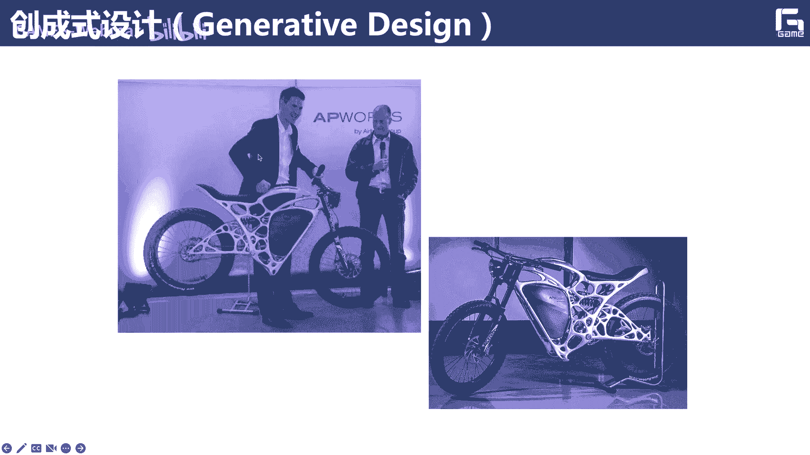

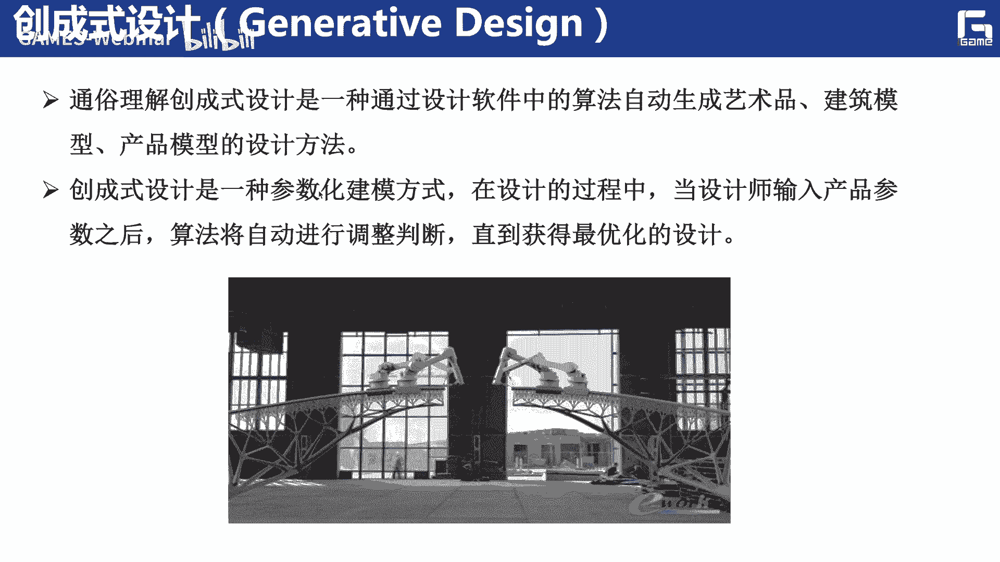

拓扑优化与创成式设计紧密相关。用户无需理解复杂的数学原理，只需指定边界条件、设计空间、目标函数和约束，计算机软件就能自动计算出最优的材料分布和拓扑结构。这使得拓扑优化成为一种强大的概念设计工具。

例如，赵州桥的结构，与通过拓扑优化计算出的最优材料分布惊人地相似，这说明了经验设计与科学优化结果的一致性。

以下是拓扑优化的一些应用领域：
*   **工业设计**：如摩托车车架、自行车零件、鞋底的轻量化设计。
*   **航空航天**：飞机隔板、机翼、直升机部件的结构优化。
*   **建筑设计**：生成新颖、高效且美观的建筑结构。
*   **个性化定制**：结合3D打印技术，实现复杂结构的快速制造。


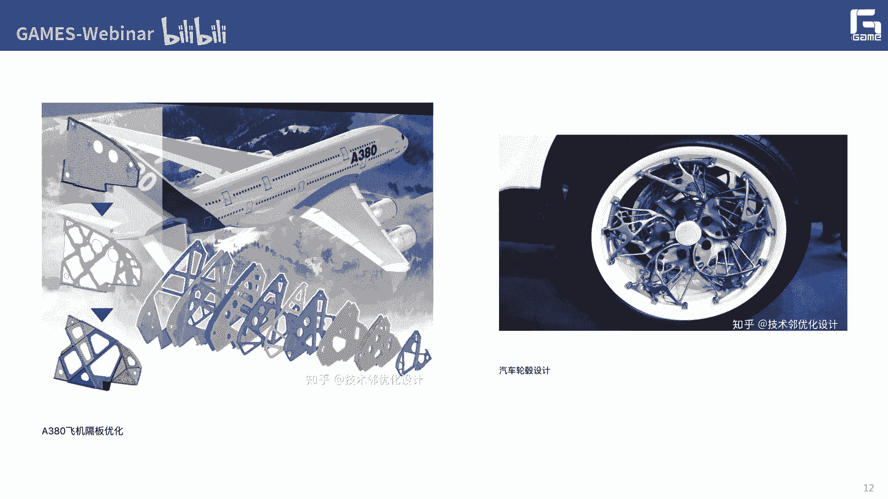

---


## 拓扑优化的数学描述与挑战

我们可以将一个简单的悬臂梁拓扑优化问题类比为“乐高积木”问题：在一个由200个格子组成的设计域中，放置60个积木块，如何摆放能使最终结构的刚度最大？

这是一个**离散优化问题**。从200个格子中选60个，可能的组合数量极其庞大（约 `7×10^51` 种）。直接求解这样的离散优化问题非常困难。

一个常见的思路是进行**松弛**，将离散的0-1优化问题（表示有无材料）转化为连续的优化问题，即让每个单元的“密度” `ρ` 在 `[0, 1]` 区间内连续变化。这大大降低了问题的求解难度，也是后续许多经典方法的基础。

---

## 经典拓扑优化方法


上一节我们了解了拓扑优化的基本思想和挑战，本节中我们来看看几种主流的、经典的拓扑优化方法。

### 1. SIMP法（变密度法）📊

SIMP（Solid Isotropic Material with Penalization）方法是目前应用最广泛的拓扑优化方法之一。其核心思想正是上述的连续化松弛，并引入惩罚因子来迫使中间密度值向0或1两端聚集。

**公式描述**：
单元的材料弹性模量 `E` 与伪密度 `ρ` 的关系通过惩罚模型建立：
`E(ρ) = E_min + ρ^p * (E_0 - E_min)`
其中，`E_0` 是实体材料模量，`E_min` 是一个极小的数（避免奇异），`p` 是惩罚因子（通常 `p≥3`）。当 `ρ` 为中间值时，其贡献被严重惩罚，从而在优化中倾向于被消除。

在等几何分析框架下，控制点上的密度值 `d_k` 通过样条基函数 `N_k` 加权组合，得到空间中任意点的密度：
`ρ(ξ) = Σ N_k(ξ) * d_k`
这使得灵敏度过滤具有天然优势，能有效抑制棋盘格现象。

**优化模型**（以最小化柔度为例）：
```
min: C(ρ) = U^T K U = Σ (ρ_e^p * u_e^T k_0 u_e)
s.t.: K U = F
      V(ρ) / V0 ≤ f
      0 < ρ_min ≤ ρ ≤ 1
```
其中，`C` 是柔度，`U` 和 `F` 是位移和力向量，`K` 是刚度矩阵，`V` 是体积，`f` 是体积分数约束。


**等几何分析的优势**：
*   **计算效率高**：所需自由度远低于有限元法，计算速度可提升约一倍。
*   **抑制棋盘格**：样条基函数的局部支撑性起到了天然的过滤作用。
*   **结果更光滑**：优化出的边界质量更好。

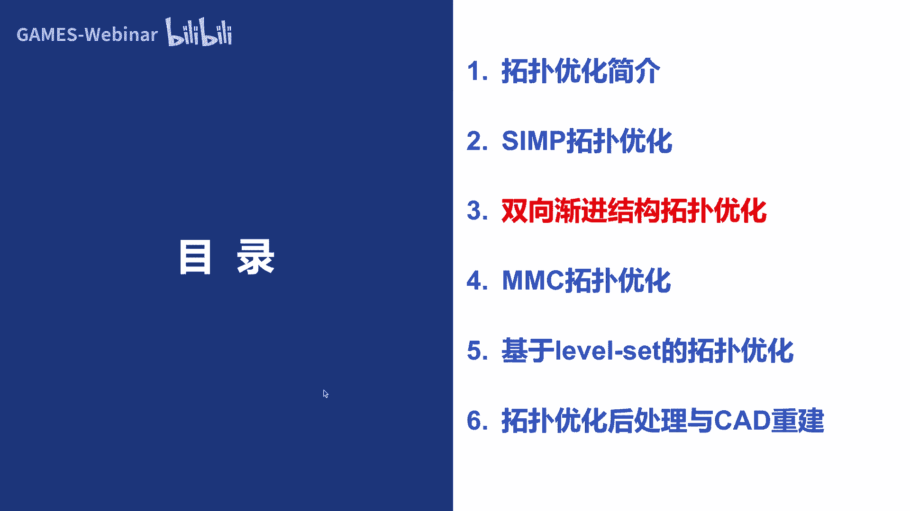

### 2. 双向渐进结构演化法 (BESO) 🔄

BESO方法采用一种**渐进演化**的思路。它通过逐步删除低效的材料单元（空单元）和添加高效的空单元（实体单元），使结构向最优拓扑演化。

其优化模型与SIMP类似，但设计变量 `x_e` 是离散的（通常为0或1）。关键在于计算每个单元对目标函数（如柔度）的灵敏度 `α_e`：
`α_e = -∂C/∂x_e`
灵敏度低的单元对结构性能影响小，优先被删除；灵敏度高的空单元则可能被恢复为实体。

在等几何框架下，单元灵敏度可以通过控制点灵敏度的样条组合解析求得，使得BESO的迭代过程更加稳定和高效。

**算法流程简述**：
1.  定义初始设计域和参数（目标体积、进化率）。
2.  进行等几何分析，计算单元灵敏度。
3.  根据灵敏度排序和进化率，更新单元状态（删除或添加）。
4.  判断是否满足体积约束和收敛准则（如最近10次迭代目标函数变化很小）。
5.  若不收敛，则返回步骤2；否则，输出最终拓扑。

### 3. 水平集法 (Level Set) 🧭

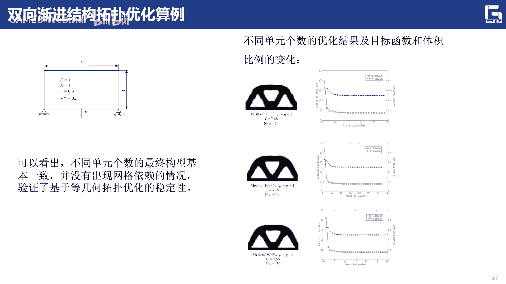


水平集法采用**隐式几何描述**。它将结构的边界描述为一个更高维函数 `Φ(x)` 的零水平集：
`{x | Φ(x) = 0}` 为边界，
`{x | Φ(x) > 0}` 为材料外部，
`{x | Φ(x) < 0}` 为材料内部。

结构的演化通过水平集函数 `Φ` 随时间的运动来描述，其演化方程（Hamilton-Jacobi方程）为：
`∂Φ/∂t + V_n |∇Φ| = 0`
其中 `V_n` 是边界法向速度。

传统的水平集方法计算量大。参数化水平集法将其与等几何结合，用样条基函数组合来表示水平集函数：
`Φ(x, t) ≈ Σ φ_k(t) * N_k(x)`
这样，优化变量变成了系数 `φ_k(t)`，将偏微分方程求解转化为系数优化问题，效率大幅提升。

**等几何分析的优势**：
*   **计算加速**：相比基于有限元的水平集法，计算速度可提升3-4倍。
*   **边界光滑**：直接得到光滑的隐式边界，便于后续提取。

### 4. 移动可变形组件法 (MMC) 🧩

MMC方法由郭旭老师团队提出，它建立了一种**显式几何描述**的新范式。其思想是在设计域内放置一系列具有明确几何参数（如中心位置、长度、厚度、方向角）的基本结构组件，将这些几何参数作为设计变量。

每个组件由其拓扑描述函数 `Φ_i(x) < 0` 来定义内部区域。整个结构的拓扑由所有组件的布尔运算（通常为并集）构成。优化过程就是驱动这些组件移动、变形和重叠，以找到最优布局。

**等几何分析的优势**：
*   **设计变量少**：优化变量是组件的几何参数，数量远少于单元密度变量。
*   **结果直接可用**：优化结果本身就是由参数化组件构成的显式几何，易于导入CAD系统。
*   **易于施加几何约束**：如最小尺寸、对称性等约束更容易在参数层面实现。

---

## 拓扑优化的后处理与CAD重建 🔧

无论采用上述哪种方法，优化结果往往不能直接用于制造。SIMP法结果存在锯齿和灰度单元；水平集法和MMC法需要提取边界。因此，将拓扑优化结果转化为可用的CAD模型是一个关键环节。


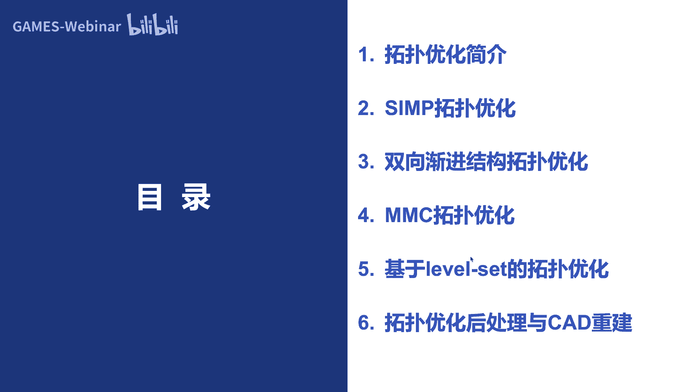


以下是后处理与重建的一般步骤：
1.  **结果光顺**：对离散的优化结果进行网格平滑，去除噪声和孤立单元。
2.  **边界提取**：从光顺后的网格或隐式函数中提取三角网格表示的边界。
3.  **骨架生成与简化**：对于杆状、梁状结构，提取其中心骨架线。
4.  **参数化CAD模型重建**：基于骨架或边界网格，生成参数化的样条曲线/曲面（如B样条、T样条），重建为BREP格式的CAD模型。

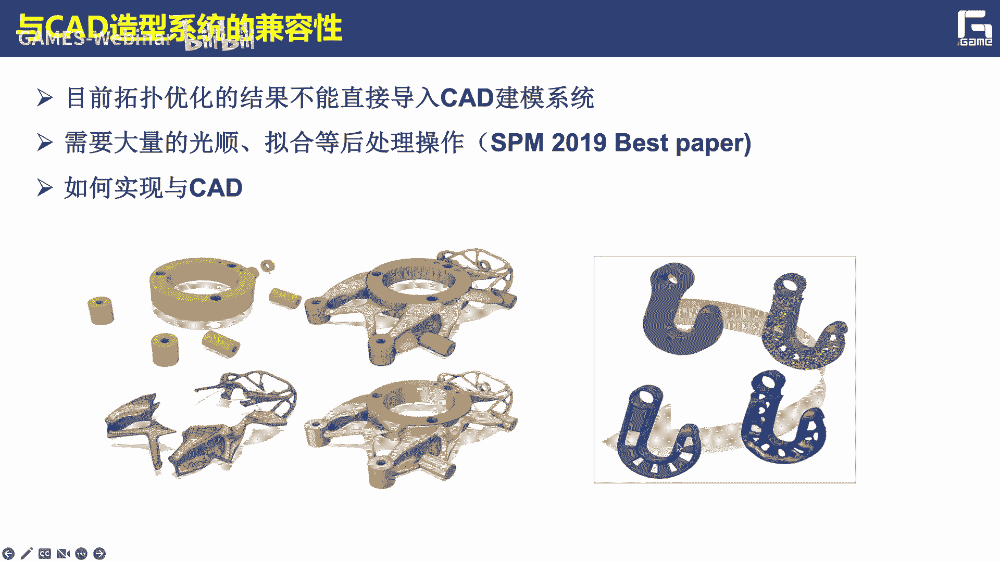

这项工作实现了从“优化结果”到“可制造模型”的桥梁，是拓扑优化走向工程应用不可或缺的一步。


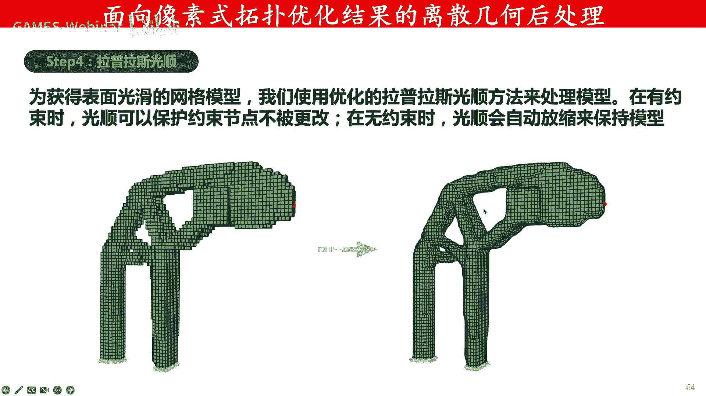

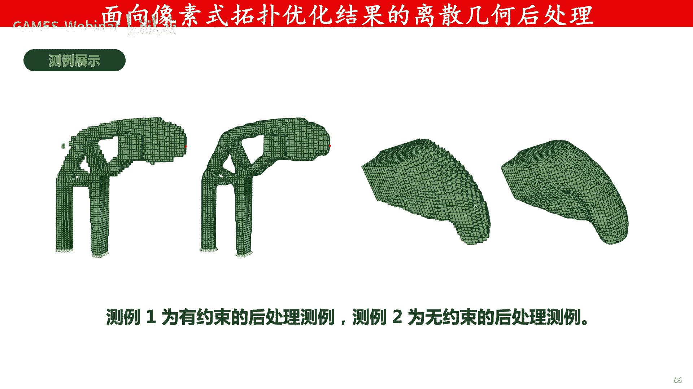

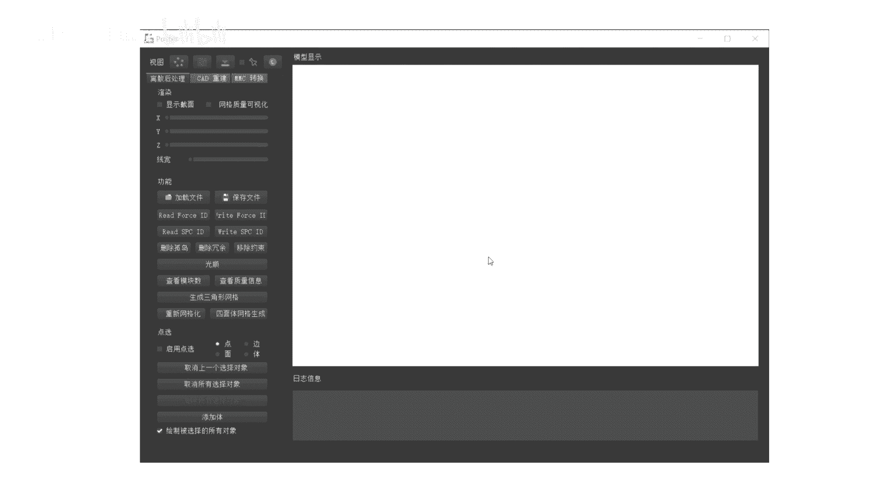

---


## 总结与展望

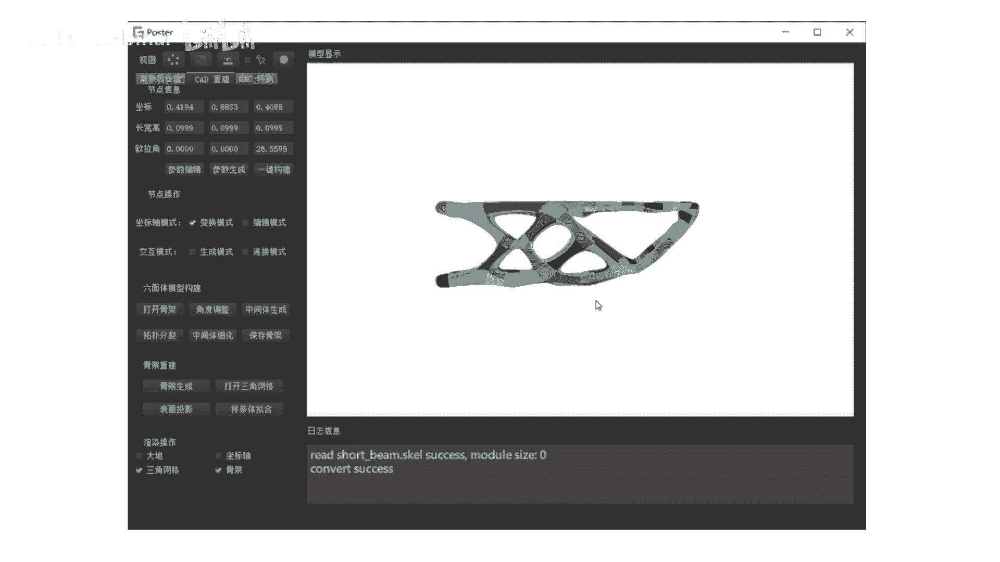

本节课我们一起学习了基于等几何分析的拓扑优化。我们首先了解了拓扑优化的概念和应用，然后深入探讨了四种经典方法：**SIMP法**、**BESO法**、**水平集法**和**移动可变形组件法**。可以看到，将等几何分析融入这些框架，主要在**计算效率**和**结果质量**上带来了显著提升。

目前大多数工作仍是在传统拓扑优化思想中引入等几何分析。未来的研究方向包括：
*   **开发具有等几何分析特色的新方法**，而不仅仅是效率提升。
*   **与人工智能/机器学习结合**，利用AI加速优化过程或生成新颖设计。
*   **深化后处理与CAD/CAE集成的无缝流程**，实现真正的设计-仿真-优化-制造一体化。


拓扑优化作为创成式设计的核心，随着等几何分析等先进仿真技术的融合，必将在高端装备设计和个性化制造中发挥越来越重要的作用。