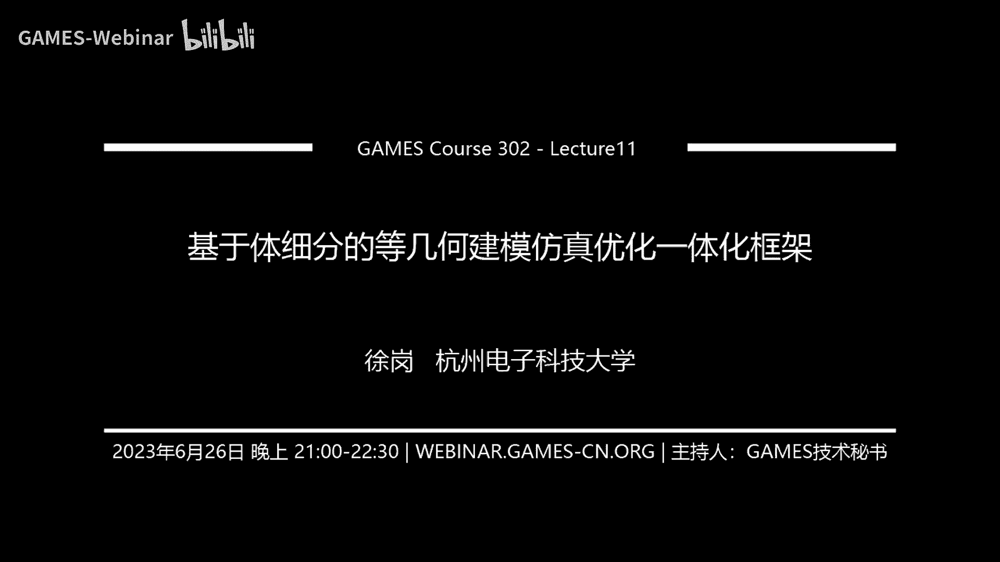
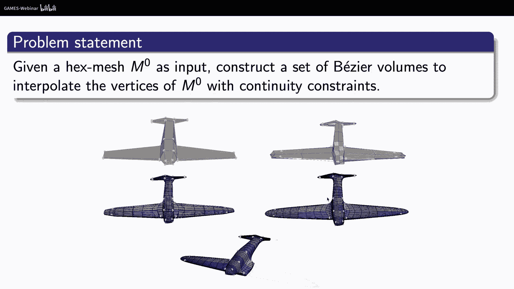

# GAMES302-等几何分析 - P11：11. 基于体细分的等几何建模仿真优化一体化框架 - GAMES-Webinar - BV1dM4y117PS

好我们正式开始，啊不好意思啊，今天因为这个出差来北京啊，所以这个时间上有点晚了，那么就是说我们这次课呢，主要给大家介绍这个基于体系分的啊，等几何建模与仿真优化一体化框架啊。

实际上前面我们也是给大家上过十次课了是吧，上说十次课，我觉得基本上应把我们这个等级和分析的一些，主干的一些内容给大家介绍完了啊，给大家介绍完了，所以说呢我们呃，后面呢可能还有大概两次课的时间啊。

啊就给大家介绍一下这个呃比较高级的一部分，以上就是我今天汇报的这些内容，应该是给呃在一些呃其他场合呢，或者会议上也都那个讲过啊，可能有些老师同学或者已经听过了，如果如果大家觉得这个已经听过的话。

这样就是也可以呃这个选择性的听一下啊，那么我们呃应该我记得，像在这个GDC的会议上啊，还有在这个呃山东大学，包括浙大，还有中科大呃，呃大大工啊，这几个学校应该我记得应该都讲过啊。

我们这个呃体系分的这个工作啊，那么也是呢我这边呢也是把这部分工作啊，作为我们呃这个灯球课程的啊，其中一部分，那么我们这个这个这部分内容呢，主要是介绍我们基于我们在体系分方面的，一个呃一个贡献。

然后把怎么样把体积分啊，作为一个非常重要的一个工具，和我们的啊躯体建模啊，仿真啊，物理仿真，还有这个结构优化呃，能够把它连接起来，形成这么一个基于体系分表示的啊，这么一个建模。

仿真优化的一个一体化的一个框架啊，那么实际上就是说呃，主要是有这么三大部分内容啊，第一部分内容呢，就是介绍这种基于体系分的复杂取题建模啊，复杂取题建模这部分啊，第二部分介绍基于体系分的高精度。

IG物理仿真啊，那么第三部分呢，介绍这个基于体系分的IJ形状啊，这个拓扑优化方法，那么实际上这三部分啊，这三部分啊，我想最主要的这个部分呢，应该是在这个躯体建模这一块啊，就是这个基于体系分的啊。

复杂具体建模这一块啊，然后这一块呢也是主要就是给大家介绍了，就是这个介绍一些体系分的一些基础知识啊，包括我们怎么样把这个体系分啊，作为一个公工具啊，然后能够和我们的这个呃等以后啊。

这个领域呢啊它具体是怎么结合起来的啊，我想这个呢是最重要的啊，那其实后面的这个基于这个IJA物理仿真啊，包括它的形状特别优啊，方法呢实际上就是四九是来的比较顺其自然啊。

那么实际上我们在前面介绍有两次课啊，实际上给大家介绍了面向整理和分析的这个，参数化的工作对吧啊，参数化的工作啊，实际上就是说包括这个平面参数化和体，参数化啊，那我们说呢参数化呢。

实际上就是可以看作是有限园里面的这么一个，网格生成的这么一个过程对吧，网格生成的这么一个过程啊，那么也就是说，等几何是不是不需要网格生成的啊，不是的对吧，它本质上还是需要类似于一个高阶网格生成的。

这么一各阶段对吧啊，所以说在我们等级和里面的非，一般都把它称为是叫做呃这个参数化问题啊，参数化问题，那么实际上也有说等几何分析啊，等几何分析啊，它不仅仅不仅仅是把我们这个CGD里面的，这个曲线曲面啊。

这些基础的知识是吧，相当于这么一个老的原型领域啊，把它应用到一个新的方向，就是这个计算力学里面啊，也就是说它不仅仅是给CGD啊，开辟了一个一个新的新的一个方向啊，而且呢实际上也是给我们这个计算几何。

提出了一些更新的一些问题啊，更新的一些问题，比如说这个复杂具体建模的这么一个问题对吧，啊，比如说我怎么样啊实现啊一种方便的啊，直观的这种具体建模的功能啊，也说特别是对于这种复杂形状的物体。

我怎么样能够实现，实际上是一个非常重要的啊，对我们的一个分析来讲啊，因为我们无论在大部分的这个结构啊，一些计算啊，仿真啊方面方面，我们还是希望能够实现对吧，呃这种躯体的直接建模啊。

因为像呃我记得是前面几年啊，就是说啊经常有这个计算力学的同学来问我说，徐老师啊，有没有我想做一个等几何的问题对吧，我这个求解器基本上都已经写好了啊，但是我想做一些更复杂的一些模型啊。

或者我想自己去设计一些理，而不是只是用那个力这个计算力学呃，里面比较经典的一些benchmark的一些例子来做，对吧啊，我想做一些更复杂的任意的形状的这种例子啊，那我有没有一些这种躯体建模的工具啊。

那其实就是当时确实比较少是吧，嗯很多时候你需要很多很多的这种，要懂很多的这个计算机和样条方面的知识对吧，你才能够写这么一个程序啊，然后呢去把啊这个相应的这个还有因为你复杂，具体嘛你肯定是要多快的对吧。

然后我这些怎么去设计啊，什么等等啊，都是还挺挺复杂的一个问题啊，那么实际上这也是我想在一定程度上，也是限制了这个等级和分析的发展对吧，等几个分析的发展也是我怎么样实现呃，这种面向登记和分析的呃。

这种复杂群体建模的要需求啊，实际上就显得非常的重要啊，非常重要，那么实际上我们这边呢，主要是做了这么一个问题，就是说啊，给我们一个复杂拓扑的一个六面体的控制网格，我怎么样去基于。

就像我们这个右下角的这么一个，类似于兔子的模型对吧，比如说我们图形学中常用的一个例子啊，就是说我怎么样能够去构造相应的一个样式的，群体的表示呢，啊那么这就是我们想呃，现在来做了这么一件事情啊。

就假设我们已经有了这么一个呃，复杂top的六面体的控制网格，我怎么样去构造相应的样条，具体的表示，所以这边有两个关键词，第一个是复杂对吧，另外一个就是这个top复杂对吧，那top复杂三角也有外服。

我肯定是多快的才能够去完成啊，然后呢又能够实现这种来带动啊，或者之类的这种复杂的这种拓扑啊，那么实际上这边有这么几种方法啊，那么实在我们体操的话里面，我们在前面给大家讲过啊，就是说目前这种全自动化的。

高质量的六面体网格的生成啊，目前应该还算是一个呃对圣杯问题对吧，或者是一个平静的问题啊，一个开放性的一个问题啊，那么实际上我们呢就在21年的时候做的，这个工作啊，就是说啊目前上是相对于像这种八叉树啊。

这种方法相对来说比较暴力，比较鲁邦的这种方法还是比较呃，可以做到自动化的对吧，那实际上也就是说我们可以曲线救国啊，曲线救国，比如说我们可以先利用这种八叉树的方法，去生成一个初始的地面体网格对吧啊。

然后它所形成的这种其结构啊，什么叫做奇异结构啊，实际上也就是说在我们的一般的大大多大，大家的这个认知里面，这个绿面体网格，它肯定是在大部分的地方都是什么，从一个点出发对吧，应该和它相邻有八个cell。

就是八个体的单元对吧，然后应该有六条边对吧，应该有六条边啊，但是可能会在一些特殊的地方，它可能嗯不是满足这个数量的要求的啊，就是出现所谓的奇异点对吧，那可能从这个点出发，可能不是有六条边了啊。

可能是呃有有七条边，五条边对吧啊，那么也可能不是八个八个单元了对吧，也可能是五个单元，四个单元四对吧之类的六个单元，所以说这样的话呃这个这个地方点呢，我把它称为是七一点啊，那么相对而言，也就是说我。

我实际上是我知道这个奇异点来讲啊，咱对于曲面，二维的曲面的情况来讲就就可以了对吧，但实际上对我们这个体网格，特别是六面体网格的而言的，它还有一个叫做起义线的概念对吧，起以线的概念啊。

也就是说从沿着这条曲线啊，他上次和我们一般的这种规则的，情况也是不一样的，是吧啊，那么双爷爷说呢，呃如果我们把这些奇异点奇异线画出来啊，就把它连起来，就会得到一个相应的奇异结构，只要大家可以发现。

就是说呃，如果我用传统的这种基于八叉树的方法，让它在它的表面啊，或者表面附近会有非常复杂的这种气息结构啊，那么这边呢就是我这个不同颜色，就是我的这个这个这个作为一个技术型，或者这种快也好，对吧啊。

正是因为他的呃其实结构非常复杂，所以说啊所以说它相应的这么一个呃，形成了这个分块也是块是非常多的对吧，那么上我们算一下它的各种指标，无论是这个平均价格比还是最小雅各比的。

实际上就是它的指标都是质量都是不高的，不高的啊，像我们这边呢，就是说呃用了一个曲线救国的一个思路，也就是说我可以先用巴萨树的，基于巴萨树方法，先生成一个初始的一个六面体网格，但是它质量不高对吧。

但是我可以用通过一些拓扑简化的一些方法，把这么一个不好的唉，不是一个复杂的一个拓扑的东西啊，把它简化成这种区域结构啊，比一个比较比较干净的啊一个器结构啊，然后这样的话我就会在上面生成网格。

就会生成一个高质量的一个网格，实际上就是说这样的话，我们会得到一个非常质量，高质量的一个呃一个一个一个拓扑结构，对一个起结构，而且它的快速大家可以看到啊，我这个快速都比较大了，现在的快速还比较少对吧。

而且相应的我这个质量，无论是它的这个平均价格比还是最小雅阁比啊，这样这个质量呢都会得到比较大的提升啊，那么而且他这个地方的快速，已经从原来的2万5000多块，减少到了134块。

那啥我就可以记着134块来进行，来进行什么啊，来进行这么一个它的一个呃题材化，或者一些cad的一些重建，对吧啊，也就是说实际上的话，这后面我们通过这种拖布简化的方法啊，来得到的，这种结构。

实际上是非常适合于我们登记和分析的啊，都没有分析的，那么也就是说我们这边的主要是采用了一个，基于加权排序的一个方式啊，也就实际上我们考虑了在拓扑简简化前后，他的这个相应的一些一些比较啊。

那么实际上就是在这个里面啊，在这个里面我们非常重要的一点啊，非常重要的一点呢，就是说呃，我们实际上不仅仅考虑到我这个，我要去删除哪些大块，删除哪些块对吧，少在这个里面，我不仅仅考虑到他的这些呃宽度啊。

这样我先删除这个宽的，现在是小窄的，我也考虑到它这个呃拓扑简简化，前扣他的这个拓扑，这个对哪些啊，删掉哪些快对我的拓扑的这个信息啊，它是有用的，那么这边呢就是我做了一个演示啊。

这个实际上就是我我现在呃输入的啊，呃这么一个原始的奇异拓扑结构，现在看到这个快速是非常多的对吧啊，快速是非常多的，现在我就可以做一些这个拓扑的这个简化啊，top的简化。

这边就是我显示了之后的简化之后的图片结构，它这个快速啊就是少了很多，是少了很多，那么像这么一个这么一个分块啊，实际上也是非常适合我们来做这个呃题材的话，说出这种问题对吧，但我们说的这还是一种。

基本上是一种呃曲线救国的一个思路，也就是说我们还是需要对它的内部做这种拓扑，划分对吧，而现在呃上次对做这种top划分来讲的话，呃上还是比较困难的一件事情啊，特别是这种全自动的。

高质量的这种拓扑区域的划分，那么实际上我们呢这边呢就是说啥，还有一个解决方案就是什么呢啊，我们可以利用细分建模的这个思路啊，细分建模的思路只要在大家如果学过通讯学，都知道，像这个细分曲线曲面啊。

在我们这个图形学里面是非常经典的一种，建模的方法对吧，特别是在这个动画造型领域啊，实际上是呃非常重要的啊，因为它这个建模起来非常简单，它的基本思想呢，就是说我给你一个初始的控制多边形。

或者一个初始的一个粗糙的控制网格，我按照一定的这个细分规则对吧啊，也是每一步我这个插入新的顶点啊，插入新的面对吧，那么这些新的顶点的插入都是满足一定的，事先规定好的这个规则是吧啊。

那么插入这些新的顶点之后啊，我再重新生成这些曲线啊，就变最后对吧，我听过一次两次，三次或者无穷多次之后，就会得到一条光滑的曲线对吧，或者一张光滑的曲面对吧，也就是说实际上这个上次我们在呃。

计算机呃领域里面是非常喜欢的对吧，实际上它就是一个可以看着理解成一种递归嘛，对吧，一种递归，所以说实际上是计算机呢，他是非常喜欢这种递归实现的对吧啊，递归实现，而且他这个实现起来也非常稳定对吧，鲁邦啊。

那么十二十细分曲线曲面对吧啊，特别是细分曲面，在我们整个的动画领域是大行其道啊，也是非常重要的一种做这种角色的建模，三维建模造型的一种方法，那么曾经也获得获得过什么啊，奥斯卡奖之类的对吧。

那么实际上就是说我们在想，就是说能不能啊，把细分曲线曲面这一套东西推广到体啊，也是形成一种新的建模方法，就是呃体系分啊，体系分好，大家都知道细分曲线曲面，它实际上是突破了我们传统的这种变条。

这个北约numbers这种拓扑上的限制，对吧啊特别是对于细分曲面来讲对吧，我可以实现这种任意拓扑的这种局面，的这种建模啊，那实际上我们如果啊要想回答回答我们的初心，想去解决这种复杂具体建模的问题的话。

就说我能不能实现这种呃气氛躯体的造型呢，啊当然是可以的啊，而且我们也不是第一个来做这件事情的人，来做这件事情啊，那上对于我们cc细分啊，实际上是他的co clark对吧，这个细分啊。

实际上是在我们图形学里面，是非常经典的一种行为方式啊，啊那么它的呃实际上在正规的情况下，就对应于我们的三次变样条曲面啊，三次变量曲面也说他在正规的regular的地方啊，规则的地方都是c two的啊。

都是C2连续的啊，那么上啊只是在七点地方，它是这个呃G的对吧啊，也就是实际上就是说呃，在这个我们的这个cc细分这个规则里面啊，实际上是它是对应于和我们的这个，regular case的话。

后面的样条三次B样条是紧密联系在一起啊，紧密联系在一起啊，而且呢对于这个cc细分曲面，我们有一个非常方便的啊，非常经典的一个极限点公式啊，极限公式啊，也就是说我初始的这个控制网格上的这个顶点。

我按照呃任意识的无穷多次的细分之后，他最终的这个极限点的位置在哪儿啊，这个实际上是可以可以推导出来的啊，可以推导出来的，也就是说我实际上是可以通过呃一种啊，显示的极限公式啊，但是这个显示的节点公式啊。

就是和我们细分一次或者新顶点，新编点和新变点是有关系的啊，所以说我通过这么一个非常简单的一个公式，就可以算出来最终这个vi这个初始的控制节点，它最终的这个节点位置在哪，我是可以通过这个显示的基本公式啊。

把它给算出来啊，也就是说这是对我们呃细分的领域，是非常重要的一个一个理论上的一个贡献啊，理论上的贡献，那么我们刚才讲了，实际上做这个cc体系分cc提分并并不，我们并不是第一个来做的啊。

那上次在1996年啊，啊那么那时候呢这个就提出了，我用这个体验方法来做这个自由变形对吧，哎，那么自由变形实际是最早是那个，1986年的时候有CD burger对吧，提出来的啊。

也是一集升到我们很多的这个动画的，这个建模的这个商业软件里面是吧，那么商这边呢他就是把这种呃FFD啊，自由变形和体积分结合起来，也是我用体积分呢作为我这个嵌入了一个空间，然后来做这个自由点电型。

主要来做这个用处啊，那么这个应该是第一次啊，把这个提分这个东西提出来啊，那么说到了02年的时候，在will computer这个这个期刊上呢，呃我们那个巴甲啊，还有我们我们特训学里面的几个。

非常著名的学者对吧，还有我们的学，我们中科院计算所的徐国良老师啊，提上上对我们这个六面体网格的细分模式，也是提出了这个呃，做了一些相应的这个规则啊，学习相应的这个工作，那么上这个这个工作。

也是我给你一个初始的一个六面体网格的，粗糙的一个模型，我按照一定的规则细分，然后就会得到一个光滑的一个体的表示，那么杀了它的细分规则呢，呃和这个曲面相比啊，新闻曲面相比当然是复杂了很多了，复杂了很多了。

也说我实际上就是说呃，我要比如我也是需要去，怎么样生成一些新的单元点是吧，新的这个面点，新的边点啊，啊你看我都有一些呃计算的一些公式，计算的一些公式，当然这个具体代表什么意义，我这边就不仔细讲了啊。

那比如说对这个SL点对吧，对这个CE点，实际上他就说我对于每一个绿面体的这个SEL，我都要查到一个新的一个save点，第三点是什么呢，就说是这些呃，在这个cell里面所有点的这个平均啊，重心在哪里啊。

那么在那个面点啊，P面点新面点呢它是对于每一个fish啊，原来的每一个这个fish上面，他都要呃插入一个新的面点啊，这个新的面点就是C1加C2，加上这个C1C2。

就是哎就是原来这个计算出来的这个SL点啊，比如说你因为我对于每一个每一个面来讲，一般来说肯定是我有两个对应两个CEL，那么这两个CEL都有两个SL点对吧，C 1c2。

然后这个A呢就是这个这个face的这个重心啊，这个中心对吧，相当于这个呃你如果是个四边的对吧，那就是呃这是个点的加权平均，那么所以呢就是他就做了一个计算公式啊，但它对于新的边点啊也是一样的啊。

那么你得到这个三三重点之后，你就可以把它按照一定的连接把它连起来啊，你这个连接呢，我也是有一定的这个相连的一些规则的啊，这样的话我身上就会得到一个新的，一个六面体网格，那么这个新的六面体网格呢。

肯定比原来的这个呃六面体网格呢，也是在这个单元数目要多了对吧，一般来说就说肯定是要乘以八了啊，那么大了之后呢，我再插入新的顶点啊，新的顶点啊，这个形变新的顶点的这个更新的商。

就是我可以根据呃这边的一些像这个SL点啊，face fs点，还有这个新编点啊，包括你这个初始的这个新景点啊，然后做一个做一个除以八，然后做一个平均，只要这样的话，它相应的这个呃我对这个所有的这个顶点啊。

也就做了一个更新，所以说这边就是他的这个cc细分规体系，分的规则，这边就简单介绍一下啊，有新人也可以呃，课下再在此好好的这个研究一下啊，那么实际上我们说刚才对于这个曲面来讲，我们有一个显示的极限的公式。

对吧啊，那么现在我们上就是说，我们希望能够把这个曲面啊啊，这个情形弄到这个推广到体上去，对吧啊，所以说对于这种呃cc体系分，我们是不是有相应的，这个呃极限公式呢啊，这个是我们也是想找到的一个答案啊。

但是非常遗憾，就是我们找了很久也没有找到啊，那么实际上是在，我们在同时做这个工作的时候啊，因为我们这个工作也是开展，也是他们的5年前起步，然后来做这个工作的啊，那么在这个那一年的这个pg上啊。

刚好也有一个呃一个团团队，他们来做做了一件事情啊，就是我当时对于这种cc体育分的这个AY6S，就是这个求职的这个运算啊，那么这个求职的这个运算在这个里面啊，商就是说呃他这个他商就说啊。

虽然给出了一些求职的算法，但是没有给出一个显示的极限的公式啊，实际上这个在我们这个用起来，还是感觉是缺了那么一点东西啊，那么实际上我们就做了这个工作啊，给周边几个节点公式。

实际上是在推导这个节点公司的一个，非常重要的啊，就是我希望能够得把呃啊，如果啊我这个这个从一个一个点出发啊，他的这个相应的这个边的这个数目啊，相当于从这个点出发的这个value，它的度数对吧，是N啊。

也就是说从这个点出发，我有一条边的话啊，那么它相应的诶在这个起点的这个地方啊，起点在这个地方，它的这个面数，还有它的这个单元素啊，分别应该是多少呢啊，那么当我们首先要去解决这么一个问题啊。

首先解决再解决这么一个问题啊，那么解决这么一个问题的话，如果我们记这个E啊，他就是呃就是在这个起点数啊，这个以这个度数数N的这么一个起点数，它的是这个，他的这个面的数目是E的话啊。

然后这个cell的这个数目是F的话啊，那么上次我们可以啊把在这个呃，把这个也在这个起点地方啊，我们可以放一个球啊，放一个比如单位球对吧，那么它在这个单位球的地方，大家就可以看到哎。

我这个球和我这个绿面体相交啊，包括啊和这个点起点出发的这N条边相交，我在这个球上就会形成这些红色的点对吧，在这个球面上啊，然后我这个面相就面和这个球相应的，就会形成形成一些什么啊曲线对吧，这些弧线啊。

然后这个cell相调呢我就会形成什么唉，形成这个三角形曲面球面上的三角形啊，也就是说实际上也是，我如果在这个起点地方放一个单位球，然后想我就会实现对这个求单位球的一个，球面三角化对吧，球面三角化。

而这个球面三角化它的这个边的数目对吧，这个边的数目恰好就是什么哎，在这个起点处，它的这个什么面的数对吧，那么它的这个三球面三角形的数目，这是什么哎，就是这个shell的数就是F对吧啊，然后这个什么啊。

顶点的数目就是呃它的valence就是N对吧，那么实际上也就是说在这个球面三角形上，我们上是有一些理论的一些结果，就是我们有一个所谓的欧拉公式，欧拉公式，那么这个欧拉公式呢。

它就代表了就是说呃我们算是有F减一，加N等于二，还有那个3F等于2E对吧，那么实际上这样的话呃我上这边我有什么哎，两个等式，两个未知数对吧，那我就可以把这个E和F把它给求出来，把它给求出来。

也是说我可以算出来啊，这个相应的这个fish的数目啊，在这个度数是N的这个起点处，它的fish的数目应该是三乘以N减二，然后这个SL的数目对吧，SL的数目应该是二乘以N减二是吧，二乘以N减二。

也就是说有了这个东西啊，三我也说我们就可以把这个在这个起点处，它的这个所有的face的时候，SL的时候我都可以写成N的表达式是吧，这我们就做了这么一个推导，然后有了这么一个结论，这么个原理之后。

商业说啊，因为在这个因为我把这个所有的起点的情况，我都可以把018的考虑进去嘛，对吧啊，所以说我这些都可以把它写成显示的，就是J从一到32-2对吧，二乘以N减2C23就是它的面的数模啊。

还有这个SL的数据对吧啊，这是因为这个推导，我们才可以把它写成这样子啊，那么所以我们这边一个主要的结果呢，就是这样子啊，就是也就是说给你一个初始的六面体控制网格，那么这个六面体控制网格上他这个顶点啊。

他最后的这个机械的位置在哪，他最后的这个节点位置在哪啊，我就可以通过这么一个显示的公式，把它给算出来，那么在这个公式里面啊，大家可以到N就是我这个顶点处的，它的violence是吧，它的度数啊。

那么其他的像这个vi111啊，F2-1啊，CJ1啊啊MG啊，这上都是它的什么啊，细分一次后的它的，顶点新编点新变点和新CD啊，新SL点，那么商也就说呢，呃我最后的这个vi的这个接线的位置。

实际上是和我细分一次之后的，他的这个网格的这些呃，呃你所插入的这些这个新景点，新编点新变点CCEL点是有关系的对吧，那么商也就说呢，我们无论如何，反正我们是把这个它的显示的节点公式，把它给推导出来。

把它给写出来了是吧，嗯当然我们也是可以去啊证明它啊，那么证明呢主要是要对它的这个细分矩阵啊，也就是说细分矩阵的三，就表达了我这个细分一次之后啊，比如细分NA次和细和细分N加一次。

它的这个顶点之间的这个关系啊，那我都可以用这个细分矩阵的来进行表示啊，实际上就是去分析啊，这个细分矩阵的他的一些特征值特征向量啊，那我就可以去证明它啊，去证明它当有了我这么一个节点公式啊。

我就可以做这么几个事情，第一个就是我可以做这种啊样条体的逼近，也就是说呢我给你做一个，给你做一个cc体型分的啊，它的样条曲病也是说我给你一个，除了控制网格啊，我可以得到唉，我根据这个说到空中网格。

我得到了最后的这个cc题里面的极限题啊，我可以用一些样条体的快去逼近它啊，那么实际上这也是呃非常呃非常重要的一个啊，另外一个呢我还可以做这种呃样条体的差值啊，给你一个初始的一个控制网格。

或怎么样去用一些样条体啊，去查值这个初始的控制网格的顶点啊，那么首先第一个问题啊，就是做这种CC提升的北的BC啊，实际上也是啊，去间接回答了我们刚才提出的那个问题啊。

就是说给你一个粗糙的路面提供的网格啊，我们啊希望呢通过这个节点公式，我们可以算出来啊，对于这个控制网格上的每一个单元对吧，每一个六面体单元，我们都可以构造出相应的一个北热体来对吧。

如果我对每个单元都构造出一个相应的本热体，那么这些本热体最后会形成一个样条体的，一个表示啊，那么这个样条体呢，恰恰就是这个cc体积分极限体的啊，一个一个逼近啊，一个样条逼近啊，一样的逼近。

而且呢我们说呢他和这个曲面的情形类似啊，这对于体的这个情形呢还是可以通过啊，还是可以通过呃，在正规的地方对吧啊，他是C2联系的啊，那么在这个起点的地方啊，比如这边他就是一个起点，是由这个点出发对吧。

他肯定就就不是一个我们river的一个点对吧，在这个点的地方，它是一个C0连续C里面去，那么12元说呢，我们也是通过这么一个极限公式啊，就可以实现啊，就可以实现啊，一个什么啊。

体积分和我的这个三次B样条体对吧，三次B样条体，它们之间的一个天然的一个联系上，我们就把它给建立起来了啊，也就是说只要你给我一个任意一个复杂的一个，里面体网格，我都可以构造出一个它的一个呃北的表示来。

或者样条表示来，作为它的相应的一个呃极限体的一个呃，样条逼近啊，样条必进啊，所以说呢这我觉得呢，就实际上是给我们等几个分析啊，建立了一个非常好的一个呃理论一个基础啊，包括一个建模的一个工具。

也是呃非常有用的，还是有用的，非常有用，那么这些北的对于每一个六面体网格单元，这个比较体呃，它的控制网格怎么来怎么来确定的呢，啊实很简单，我就可以通过一些模板啊，通过一些模板啊。

那么实际上对于我们这边呢把它称为一些mask，相对于这个regular的地方呢，呃这个模板是别代表什么什么意思呢，这里4221这些东西啊，就代表诶我要构造这个内部点的话。

它实际上是可以通过一些相邻区域的，这些初始的控制网格上的点呢，呃这个加权平均线性组合得到啊，那么这些4221呢，这些就是8442呢，这些都是呃这些相对于这个顶点处的，它前面的这个系数啊。

然后再除以所有的这个系数之和，对吧啊，这样就是表明了，我都是可以通过一个线性加权，线性组合的方式啊，从初始的控制网格的顶点，得到我的这个本热体的控制定点啊，那么相对于我的age point。

this point和corner point，我都是可以通过这种max的方式啊，线性的一些言码或者这种模板的方式，可以去进行构造，所以说这种构造呢是效率是非常高的啊，效率非常高的啊。

这是刚才是对这个reg的地方啊，那对于这种a reg的地方啊，那实际上也就我用我这集团公式嘛，我也是可以给出现用的这个模板的对吧，大家可以看到像这个地方就是一个期限的，那么商这边呢它就是一个七。

那么上次对于这些呢，我也是可以用这些模板来进行构造，来进行构造，嗯那么啥我这构造出来，构造出来我所得到的这么一个样条体的逼近，样条体的逼近12时差在什么呢。

这个大家可以发现发现它在regular的地方啊，都是蓝的，那蓝的又代表它是零误差对吧，误差是零的啊，为什么啊，因为它的regular的地方，它就是和我们的三次变量条是一样的啊，是一样的啊。

那么但是在这个起点附近啊，在起点处他还也是蓝的，对不对，那么这正是起点对吧，这是起点是什么，像这些缺点的话，它也是蓝的，为什么是蓝的哎，因为我们是有了什么唉，精确的显示的几点公式对吧。

也就是在这个基点地方，它的误差肯定也是零啊，那么误差有误差的地方在哪呢，就在这个基起点附近对吧，附近哎不是在七点离晚上七点附近，它确实呃不是不是蓝的对吧，有些绿的红的啊，就说明这个地方是有误差的啊。

是有误差的啊，为什么会有误差啊，那因为就是在这些起点地方啊，不是在七点钟就起点附近的地方啊，那么它实际上是没有做到一个呃嗯，一个精确的一个转换对吧，还是只是一个逼近的一个表示啊，逼近的一个表示。

那么商人说我们有了这么一个工具啊，这么一个理论的一个基础，实际上我们就可以做这些事情，对不对啊，就是说给你一个任意复杂的一个流媒体网格，我都可以构造出一个复杂具体的一个模型。

来一个样条样条体体的一个模型来是吧啊，那么上次给我们的这个复杂躯体的建模啊，特别是等你和分析应用里面的提供的，有一个非常好的一个工具出来对吧，也就是说你看这边啊这个快速兔子的模型，快速爱好对吧。

建筑成了一个这么一个玩这个码的这个模型，实际上它的这个快速就非常多了啊，也就12，你最后这个六面体网格你有多少个单元，多少个快，我最后的构造出了这样条体这个躯体模型啊，它也有多少个快，多少个快啊。

多少个具体，那么这是第二个工作啊，就是做那个样条曲子的逼近的对吧，当然我们也是可以呃，可以做差值这么一个工作啊，也就是说如果给你一个初始的六面体网格，我们也是可以构造出一个这些体系分的。

这么一个极限提出来或者一个验钞提出来对吧，去插值，你这个呃给你的这个初始流媒体网格的顶点啊，啊为什么啊，其实很简单对吧啊，五这样一铲子嘛就说明什么，唉，你这个你是我，我就想我。

就我就要使得你这个初始的这个立面体，控制网格的这个顶这个呃M0的顶点，初始的这个控制顶点是你的什么极限，零对吧，这样子就可以查值了吗，啊是我的几点就可以了吗，你如果把它作为你的几点点的话。

我们不是有几点公式吗，啊，那你说我是不是，我就要去构造出一个新的控制网格来啊，我从这个新的控制网格出发，然后按照这个cc提分的规则，我最后会得到一个极限体对吧，这个体积分的一个极限题。

那么最终这个极限体验体是查，是你初始的这个空中母M0的对吧，为什么可以实现查资，因为我就假设这个M0的这个控制顶点，就是我的极限点对吧，就是我的极限啊，所以最后你如果把这个控制网格啊。

除了控网格作业修改作业更新，那么你从这个新的库存网格出发做细分，你就会查出这个原来旧的是吧，控制网格的定位，所以这个应该是比较容易理解的嗯，所以说这边奶茶就是这个问题就变成了，我怎么样呃。

去修改这个相应的初始的这个控制网格，让它呃最后的这个极限提示，查自我个初始的这些这个这个控制网格的，对不对啊，也就是说啊本来的话你如果只是做cc细分啊。

我通过这么一个模型出发，经过几次C才能得到这么一个光滑的，这么一个极限题对吧，但这个极限体它是相当于说尾缩掉了，往里面缩就缩进去了对吧，其实大家都知道这个CCC新闻曲面的，是往往里面缩的啊。

那么实际上就不对了，对不对啊，但是我我怎么样去让它能够产值呢，哎那我就把这个初始的控制网格做一些扰动嘛，啊做一些扰动嘛，做些修改啊，那么我从这个新的控制网格出发，通过一些C行为。

我最后得到的就可以查到这个初始点的，对吧啊，比如说我们能够做这件事情啊，最根本的最本质的原因是什么啊，就是因为我们有了这个显示的机械能公式对吧，正是因为有了这个显示的基因能公式啊。

我们才可以对他的这个控制网格，我这个一撇F撇C撇对吧，我做一些修改，这些更新啊，大家可以看一下，我这个最后得到的这个未撇对吧，跟未平这个东西我怎么来的，我我不就是把这里的这个VI0，作为我的极限点吗。

写到分母上，对不对，你看我我这个这个未撇的更新，是不是就根据我原来的那个呃，积攒公式的更新来更新出来的啊，所以呢就说其实很简单啊，其实很简单对吧，也就是说我们只要用了这么一个类似前面的。

这个简单公式对吧，那么我把这个vi无穷变成VI0，我这个乘过来让我最基本的控制顶点，这个vi做更新对吧，那我不就是这个表达式啊，就是这个表达式啊，所以说呃所以说这边非常重要的一点啊。

就是啊因为我们有了这个极限的公式，那就是一个显示的一个极限的公式啊，所以说我们才能够去做这件事情对吧啊，而且你这个控制网格的定义，你这边是有一些自由度的对吧，实际上你没有必要嗯。

还是能够有一些灵活的一些操控的啊，这边呢就比如说给出了一些例子对吧，这就是我们初始的一个呃控制网格，我们希望生成最后的这个极限体，它要查着这些蓝色的控制定点对吧，要查这些蓝色的控制定点啊。

这边呢就是我根据以显示的机电公式，通过push pg的这个操作啊，对这个初始空间做了一个扰动啊，变成这个样子啊，那我在这个基础上然后去进行这个体积分对吧，然后我就可以得到一个呃极限体去查。

实现我这个产值的要求啊，大家可以到我不仅仅是在表面进行差值的，在这个体的内部，我也是实现了这个差值对吧，我也是实现了差值啊，那么因为我们这边是做了什么啊，体系分，对吧，当然我们这边我刚才讲了。

你上次对于这么一个同一个初始的，那个控制网格，我如果调整前面的这个number的mu啊，伽马这些不同的这个型号参数啊，我上是可以得到不同的这个卡子的，这个效果是插值的，这个效果。

啊这是prospect的这种操作啊，当然还有一个操作呢，就是啊基于这个PIA的啊，像我们浙大这个力宏伟老师，在这方面做了很多的这个工作啊，那么PA的基本的思想呢就是什么啊。

也就是说我知道我最终的目标在哪儿对吧，嗯我也知道我现在的位置在哪对吧，然后呢我就调整我的控制零点的这个位置啊，然后我每一次调整呢，就都去根据我这个到你这个目标的这个距离，去进行调整对吧啊。

然后慢慢一直涨跌了下去对吧，相当于我差多少，我补多少啊啊如果多了，我再回来对吧，我再退回来啊，这是上一次依次进行迭代啊，实际上就可以实现这种惨的效果，这就是P的这个基本的思想啊。

那么那么像pi里面非常重要的就是我要知道，我要知道我的目标在哪，对不对，我要知道我的目标在哪啊，但是呃以前我是不知道的对吧，以前我是不知道的啊，但现在我有了什么极限的公式对吧。

嗯我就知道了嘛啊因为我知道我最后的目标，我的目标在哪，就在极限点呢，就在极限点啊，啊所以说我有了这个节点显示的基本公式之后，我就可以很容易把它写出来对吧，然后我每一次调整这个初始的控制网格。

这个怎么来调整呢，哎无外乎我就说哎，我知道我最终的目标是是这个东西对吧，然后我比如说我每一次都这样调整，我这个初始的唉，初始的这个控制链的位置减去对吧，第K次细分下它的这个呃，他的这个这个这个节点。

这个节点位置是吧，上次他们这个就是那个DK嘛，就我迭代的那个偏移的样子对吧啊，当然你要定肯定要定义一个就是什么啊，一个中止的东西对吧，也就是说我每一次我的控制点怎么来更新呢，对吧。

我每次就是未K加上DK对吧，也就是说你这个目标哎，你这个目标离目标多少啊，我就去补补偿多少啊啊啊，我这就是慢慢的相互拉扯，相互拉扯，他就说呢肯定会迭代，收敛到最终的这个极限点的地方啊。

就是我这个V0的这个地方是吧，就是出于这个黑化的，啊这边也是一些效果对吧啊，那么这是就是说，如果呃给你的一个初始的控制网格对吧，如果你用传统的CD里面，那肯定是往里面缩的对吧啊。

但是如果我们用这个pi的方法啊，我们就可以实现这种查这个操作啊，查这个操作，当然我们还可以做做一件什么事情呢，做这种材料的建模啊，材料的建模啊，也就是说实际上就是说呃对于体来讲。

就是说无论你在内部怎么产值，反正都在体内部嘛对吧，体内部，但是我可以给这个铁呢赋予第四位的属性对吧，也就是除了我的XYZ空间的这些坐标，我还可以给他一个材料的一个属性啊，材料的属性。

那么这个材料的属性呢，实际上就是说可以呃实现就是我在某些部地方，比如我我希望地方唉这个地方要硬要硬一点，别的地方软一点，对吧啊，我希望在这个顶点处，我希望要产出一个红色的一个材质属性啊。

那啥我就可以什么啊，同样的也是可以基于我们这种嗯，体建模道思路对吧，来实现啊，这种材料啊，材料的这种建模啊，材料的建模实时，这个在很多呃很多的实际的一些都有是有用的，对吧啊。

无论是在这个3D打印啊啊还是对吧，这些里面都是非常非常有用，当然我们也可以做一些比较，就我们和前面提了两种方法嘛，然后我们还有一种方法就是要用这种butterfly啊，有的同学如果知道呃。

学过细研究过细分曲面，大家知道butterfly这种碟型细分也是非常重要的，一种材质的一种细分方式啊，我们把这三种方式啊，butterfly pose back pi a都做了一些比较，就发现了。

只要还是这个PRA啊，啊就这种渐进盈亏的这种思路，还是非常这个得到的这个形状还是比较好，就前面我们就做了两个问题吧，实际上也是我们可以把前面两个问题啊，结合起来啊，结合起来也就是说可以做做这件事情对吧。

也就是说给你一个输入一个初始了，六面体空的网格，我就可以构造一些北热体的集合，然后去查资，这个初始控制网格这些蓝色的地方对吧，原来我只是构造的是什么体系分去构造，现在我可以什么，因为体积分就可以用样条。

用北的职业来逼近嘛对吧，所以说当然也是可以啊，可以实现啊，就这种呃样条体的啊，让它体的差值是这个商机来，我们等几何里面也是呃非常有用是吧，当然我们还可以呃，我们说的，当然我们是一个。

主要是来希望去回答这么一个问题，对面向我们学习整几个分析的这些呃同学啊。

特别是我们计算力学背景的啊，计算数学背景的这些同学，他们三可能对计算机和样条这块，算是不熟悉的啊，那么我们怎么样基于前面提出的这些体系，分的这些理论啊，造型的方法产生的方法，怎么样来实现这种复杂的啊。

躯体的模型的这种交互式的构造啊，这个就是我们的希望去解答的问题啊，那么12也就是说呢，我们实际上就是说啊，既然我给你给我一个任意复杂的一个，六面体的控制网格。

我都可以去构造出一个相应的一个，具体模型出来对吧，具体模型出来，那所以现在的问题就变成了什么啊，我怎么样根据我的建模的需求，去实现这种复杂的立面体网格的这种交互的，简对啊，比如说我可以根据按照我的想法。

比如我要造一把椅子啊，我要造一个什么什么模型啊，要做一些，然后然后做一些，让他作为我的计算机来做相应的这个拓扑，优化的问题对吧，那虽然我就说呢是需要做这些交互的，一个六面体网格的，这个构造啊。

这是我们希望来生成，那么像我们这边呢有一个学生呢，呃但目前我们也还在学生这个，后面还有这个师弟啊，你继续来做这件事情啊，就把他这个来优化啊，上次就来做了这件事情，就是说啊基于这种体系分的复杂。

具体的模型的这个交互式的构造啊，这边就包括一些像这种股价节点的边际啊，他的这个角度的调整啊，我这个中间体怎么插值生成啊，拓扑分裂的一些方法，然后总体积分呢来自然来生成提分，来生成具体模型。

包括我对它做它的质量，通过一个填充的方法来，来对他做一些单元的质量的优化，这些过程啊，啊那么12这边呢，我们这个绿面提节点的这种嗯构造的方式，对吧啊，我外乎就是我可以通过这种旋转平移啊对吧，缩放啊。

还有沿着某个方向进行缩放啊，对吧啊，然后包括它的一些拓扑的分类啊，我原来一块可以分成两块四块啊，然后呢还可以啊做这种拉伸对吧，然后我从一块六面体网格，我怎么样来来进行呃，我怎么样来来生成多个这么发达。

把它拉出现拉伸出来嘛，像这个这个一样对吧啊，包括一些删除它的链拓扑，连接的这个关系的这个删除啊，这些在我们实际上都可以通过呃，定义一些规则吧，啊还有包括通过这个编程呢来进行实现啊，来进行实现。

啊那么商战的话我们还可以做一些呃，就是说模型的一些拼接对吧啊，比如说我原来这边我这边比如有两个嘛，一个现在的模型，还有个椅子的模型啊，我通过这种骨架节点的拼接啊，实际上我就是可以实现啊。

可以实现这种多个模型的这种，啊拼接包括他们的融合，对吧啊，然后我最后得到一个复杂的一个立面体，网格模型啊，当然这里还涉及到一，还是涉及到一些股价的一些结果，检查的一些问题，包括这边的角度一些自动调整啊。

我们也是用了一些优化的方法啊，练出来怎么样啊，这我这个立方体啊，它能够自动的去对齐啊，自动的去对齐，这个也是非常重要的一个啊，选用的一些优化的方法去进行优化啊，包括中间体单元的一些连接和构造对吧。

我们也是可以通过呃一些，比如充电从从那个情况啊，我怎么我怎么样来做，怎么样做这种做法的划分啊，正对的情况对吧啊，然后像这种需要拓扑分裂的这种情况是吧，好像这种会怎么样去做，包括这些拓扑的分裂啊。

我们也是给出了一些相应的一些套路啊，方法模式啊，然后包括这种这边就是一个竖的特步的，也就是我给你的这些初始的这些节点对吧，我怎么样能够把他们节点连起来啊，很好的连起来，这边既涉及到优化啊。

又涉及到一些一些分裂啊，这些问题啊，还有我希望保持一些尖锐特征对吧，因为大家都知道这个提分，它最后生的都是光滑的啊，都是光滑的，但可能我们在一些建模问题里面，我希望能够保持原来的一些尖锐的这些特征啊。

那我怎么样能够呃把它可以保持住啊，也是希望我们这边呢能够做到的啊，你看我们这边呢也是可以把这些细分规则啊，稍作修改就可以呃，把这边尖锐特征啊，把他给保持住啊，实际上是这边呢就可以。

也是嗯对我们这个cad建模也是非常重要对吧，因为很多的cad它模型它都是要保持住这些，包括对吧，我们也可以实现这种pi的差值的提升对啊，包括这些单元质量的提升啊，我是因为在因为像这些地方。

你如果但随着这种拉伸啊，什么之类的去生成的话，上来这些地方就是单元，你看它有一些扁平的一些单元，这边的价格比呢可能就不高了啊，那么对于这些地方我怎么进行处理啊，让我们也是有一些方法啊。

就可以通过插入城的这种方式啊，这边就给出了一些例子吧，啊这边就是我给你的我我们的一些对吧啊，初始的可以通过这些拖拉什么的，去给你构造一些初始的顶点对吧，然后我去生成一些中间过渡的模型。

然后根据这个模型去生成相应的这个呃，体积分的一个模型啊，这边也是一样的对吧，像这种复杂的模型，我们都可以通过我们的这个框架来实现，交互的修改，交互的建模，然后去四个模型，然后去搜索相应的这个题的模型。

这边也是更多的意思，就是这边你可能呃教我自己构造出来的，可能就只是这边的这些模型对吧，这个模型，然后呢，我们通过一些中间这个链接连接的这个生成啊，呃拓扑的分裂啊，修改啊，我们就可以生成这么一个呃。

类似于一个已知的一个模型，然后再通过它通过体积分的方式，然后去生成相应的呃最后的这个样条，具体对研究，实际上我们也是呃去呃，比较完整的去实现了，相应的呃这么一个基于体系分的一个呃，复杂样条。

具体模型的交互式构造了一个框架啊，那么大家可以看一下这个力，这边应该是有一个，视频，啊那我就只能这样放，这边的实际上我们就是可以呃，呃开发了这么一个软软件框架啊，软件程序框架啊。

这样的话大家可以通过这个这个demo，大家就可以看到啊，我通过这种交互的这种修改拉伸啊，然后拖出对吧啊，就可以实现这么一个椅子的一个键盘。

嗯大家可以看一下这个，习惯你就说大家可以看到，我就想就可以构造出这么一个，像这个就是我们通过举了这个，初始的公路网络之后对吧，我们就可以构造出啊，都按照我们的方法去生成这么一个样条，曲体的一个模型啊。

样条曲体的一个模型，啊所以万一我这边就不演示了，我们到时候也会把，这个视频给大家看一下，那么实际上这个就是前面讲了一部分，我们用了一个小时的时间给大家讲的这个呃，基于体系内的这种复杂区的建模啊。

因为这也是我们主要的一块一个部分啊，主要的一个部分，所以大家可以看到，我就通过这种体系分的这个理论啊，特别是极限点的这么一个理论的一个结果啊，我就可以实现啊。

基于提分了这么一个复杂具体的建模啊，只要大家有了这么一个工具之后，就可以去实现相应的一个，这个复杂物体的这个特别具体的这个建模，对吧啊，上如果你要对这种复杂的等级和分析啊。

这个模型来进行这种相应的处理的话，我这样就可以通过这种方式呢去去去实现啊，那么大家可以看到啊，就是说实际上是我当然有了这种体分，表示后面之后我就可以后面就可以继续提分，还是这种高精度的这种等级和分析的。

一种物理仿真了，对吧啊，那么沙这边呢呃也还是相应的比求解线的，三维的这个线弹性的问题，是线弹性的问题啊，那么这边呢我就不仔细讲啊，啊也就是说实际上就是我们有了呃，提分了这种这套表达之后，我啊。

我们这边的三就可以来去来实现相应的这个，登记和分析求解器的这个开发啊，比如我可以通过这种等级分析方法去呃，做相应的这个线弹性的这种仿真对吧，还有这个热传导的这个仿真对啊。

也说十二十也说不仅仅啊以后我们做这个呃，在我们的统计和分析论文里面对吧，你嗯可能呃很多计算力学同学做的这个例子啊，都是相对比较简单的啊，我们就是二维问题啊什么之类的对吧，但是有了我们这么一个工具之后。

实际上我们就可以实现对这种一个呃，复杂模型啊，我们也是有机会去做了啊，然后我们也可以去分析一下，它的一些相应的收敛性，就可以发现啊，就是在这些起点的地方啊，恰巧也是我们这种等级的飞机来仿真的时候。

它的误差比较大的这个地方啊，因为在这些地方它的连续性啊确实是不高的，当然我们也是可以基于这种体积分，来做这种形状和拓扑优化，对吧啊，那么前面我们两次课啊，都给大家介绍了相应的这个理论啊。

还有这个怎么样求灵敏度啊对吧，相应的这个迭代优化求解啊之类的啊，这边我就不详细讲了啊，上爷爷说呢，我们有了这么一个体温表示之后，我们就可以实现对这种呃，复杂模型的这种形状优化对吧，像这种形状优化。

虽然也就是说我们这里是这个地方，我们同学们带你看过多次，也就是说然后在我们登记和分析里面，非常在行政区划有非常重要的一显著了，这个优势对吧，我就可以直接把这些蓝色的控制顶点，当成我的设计变量对吧。

你只要去优化这些蓝色的控制顶点就可以了啊，就可以了啊，实际上这个里面的话我想是可以实现啊，就可以实现我们这个等于和呃，特别这个形状优化的一个非常功能啊，特别和我们这个体系分结合起来之后啊。

我们就可以做这种复杂模型的这种形状优化了，对吧，来我只要把这个初始的控制网格啊，当成我的这个呃设计变量就可以了，啊此外还可以做top优化对吧，top优化，那么这个我们上次也给大家介绍。

当然我们也是可以基于体积分，来做这种登顶盒的，这个拓扑优化是，但这个相应的文本可以也去呃，算一下相应的这个灵敏度啊对吧，这些的实际上都是有显示的这个计算公式的啊，显示的这个计算公式的啊。

而且呢我们可以实现这种呃，多分辨率的这个特别优化，也就是说呃因为很多的时候啊，就是我这个仿真的代价是比较高的对吧，也是我做这个分析的代价是比较高的，所以说这样的话，我实际上就可以在呃。

比较嗯粗糙的这个题模型上对吧，题目形状来做什么，来做等几何的计算，然后我再比较细的啊，比较高分辨率的这个模型上来做这种什么啊，拓扑的优化啊，来做这种灵敏度的这个计算，因为灵敏度计算相对比较简单对吧。

因为我在做分析的时候，你要需要去纠结一个大结论，线性方程组啊，实际上这个里面是比较比较慢的对吧，所以说呢也就是说而且体育分呢，他恰就说我每一步细分一次，就是从粗变细，从粗变细了。

这也就是说实际上这个过程呢，本来呃这个提分它就是蕴含了一个非常自然的，一个多分辨的一个表示啊，所以说我就可以在比较细的层级上啊，比较粗的层级上来做分析，来做本体和分析是吧。

然后在比较新的程序上来做优化啊，来做挖洞啊，那么实际上就是说呢，这呢我觉得是一个啊非常天然的一个结合，也是这样呢，也是去可以高效地实现这种特殊优化啊，也是这样，一来的话，我上我们就可以说啊。

比如说这是我输入了一个六面体网格对吧，然后我就可以得到他的这个呃样条表示对吧，样条表示，然后我在上面是在一些边界条件去算一下，他这个数字集，那我而且呢，我就可以在不同保留不同体积的情况下。

他最后剩这个生成的这个拓扑优化了，这个结果什么样子啊，这边呢就是它中间变化的一个过程，啊，也就是说实际上是以前的这种拓扑优化的方法，都是基于什么worker的，都是基于提出的啊。

那现在我们有了这个提问表示，实际上就是说你不去，不一定，你的这个单元的排列都是非常正规的是吧，都是横平竖直的啊，现在你可以允许有这种起点的这种这种排列啊，之类的对吧，所以说实际上应该说呢应该更加的自由。

更加的复杂，更加的方便啊，那么这边就是一个白手的一个模型，就是我这个这边是呃关路这边算是固定的对吧，然后我这边是加一个往下的力，那么它中间的这个拓扑优化的过程是什么样子。

包括它的一些这个材料的一些分布对吧，这是另外一个例子哈，咱也说呃，在很多的原来的忘机，这种VOX的这种拓扑优化里面呃，你是很难保持住一些特征的约束的，几何约束的啊，比如像这边这边是一个。

相当于我挂在一个柱子上对吧，挂在两个螺栓上面啊，实际上也是说，然后这边是对于这个模型来讲，我是有两个孔的对吧，如果这边两个固定，然后这边往下压一个往往下的力，那么它最后的拓扑是什么样子的，就算了。

就这样子啊，但是我希望能够在这些呃圆孔的地方，我希望能够精确地保持几何啊，那么像这是以前的这种基于VOX的方法，是无法做到的，是无法做到的，但是因为我们现在用等级和嘛对吧。

它是本身就是一个精确的几何表示对吧，所以说你在说你在挖的时候，是不会影响这个这个红色的这个孔之外，这部分集合的对吧，所以说你我们最后得到的结果也是很好的，去保持住这些特征的一些约束啊，特征的约束。

我想这也是等你和基于等级和分析的，这个拓扑优化它的一个非常重要的一个优势，当然我们也是和这个vocal方法，可以来做一些比较，就是说在不到保留不同体积比例的这个情况下。

我们上得到的上面是这个基于握手的方法，下面是记我们登记和分析方法，就可以看到它中间形成的这个拓扑结构对吧，也是不一样啊，也是不一样，啊这边是更多的一些例子啊，啊大家比如我输入模型。

然后这边是这这像这些模型，我都可以用前面那些建模的方法去，来来来来来来进行交互的建模，对不对啊，然后我去试驾一些变形条件，然后进行二阶的求解，然后去做一下呢top优化啊。

然后得到的结果还是比较符合我们的认知的，对吧啊，这边我们和也和传统的这种商量的结果，说的比较，这边这个图啊，右边最右边这个图就是上软的这个结果啊，然后这边呢呃是我们的一些结果啊。

这边我们的边界条件就是我这边四个圆孔，这边应该是fixed，应该是固定的对吧，然后往上拉，这边上面这个圆孔往上拉，那我最后优化出的结果，和这个商量的结果也是非常接近的啊，也是非常接近。

那么当然这边非常重要的，就是我们可以非常好的去什么，来保持这些圆孔处的这个形状啊，大家看到事实上是没有发生任何改变的，对不对，或者现代特征更能够保持得住啊，但是你如果用这种VOX的方法。

实在这些地方你还是很难去去保证，怎么做到这一点，这是另外的一个例子，另外一个例子对吧，那么这边呢实际就是我呃，我是往下的，然后这边的八个孔模式固定啊，那么像我是在这些孔的地方，我做了很好的保持。

然后最后得到这个拓扑优化的结果，实际上是演示，和我们这个商量的结果也是非常接近，好这就是我们这次课的一个主要的内容啊，我想最重要的还是给大家介绍了体系分对吧啊，特别是基于体积分的这个复杂具体的建模。

它里面涉及到的一些理论基础和方法的，方法的一些一些框架啊，那么应该我的理解就是说，整体和分析啊，整体和分析我想看呃，和这个区分，应该是有着这个天然的这个联系的啊，天然的一个联系的啊。

那么我觉得这个提分啊，应该是连接我们的这个呃等级和分析啊，和实体建模的啊，一个非常重要的一个强调对吧，因为你要做这种复杂问题的等一个分析啊，你肯定要去这种复杂具体的建模对吧，因为你复杂问题肯定就是。

我这个形状表达上是比较比较嗯比较复杂的，对吧啊，所以你肯定要做这种复杂区的建模，这样才行啊，也就是说呢我觉得就是体积分啊，真的是非常重要啊，我觉得他应该是呃，在未来的等级和分析发展里面啊。

应该占有比较重要的这个证，也希望同学们能够多去看一看，学一学啊，没说啊，你如果想做这种复杂的等级和分析的问题，我觉得提分的是一个非常重要的工具啊，特别是我们啊基于我们前面的这个节点公司啊。

还有这些理论的框架对吧，所以说给你一个六面体网格控制网格，然后就可以生成一个相应的一个，具体的一个表示压条，具体的一个表示对吧，那么说，而且我们也有这么一个交互建模的一个，工具对吧，通过一些拉伸。

通过一些省略啊，通过一些生存啊，也说我们实际上也是可以实现这一点，此外呢我们也是可以，当然可以根据这种积分，来做这种高精度的仿真计算对吧，还有做这种多分辨率的形状和拓扑优化，我就提分了。

它自然本身它就有一个非常好的这个呃，拓扑优化这个多分辨率的性质啊，多分的性质，所以呢他在这方面呢，也是非常自然的一个一个结合啊，好，这就是我们今天的这个主要的这个呃，讲述的这个内容啊。

就是基于体系分的啊，等级和建模仿真优化一体化框架啊，那么少也是我们可以在这么一个框架里面啊，去实现啊，啊这个几何建模物理仿真和形状拓扑优化的啊，表无去无数据表示的一致性，对不对啊，而且在这个过程里面。

特别在这个形状透明化过程里面，虽然说我们可以也是避免了重新呃，生成网格这么一个波一个过程对吧，而且自动运行的一个多分辨的一个性质啊，那么这就是我们今天讲课讲述的主要内容啊。

啊当然我们也是基于我们的提供框架，开发了相应的这个呃基于提分的建模，仿真优化的一个软件平台啊，那我们今天的这个课呢就到这儿啊，我们下次课呢呃应该是我们的最后一次课啊，我们首先呢会给大家介绍了。

我们怎么样把AI的技术啊，深度学习的技术和等级和啊分析啊结合起来啊，我们在这方面也是做了一些呃，出彩的一些工作啊，做了一些初步的一些尝试啊，这个方面呢给大家介绍一下啊。

因为目前来看这个AI for science啊，也就是说把这个深度学习，把AI啊和我们的这个数字仿真啊啊，甚至优化这些问题结合在一起啊，都是一个大势所趋，大势所趋啊，因为它确实可以在这个计算法。

可以呃可以接受很多的这个成本啊，那么这是我们下次课的主要内容啊，有时候下课呢除了介绍这个内容呢，我们也是希望能够对我们整个的走几个，分析的课程做一个呃前面的一个总结啊，也是作为我们最后一次课啊。

然后作为一个总结课啊，然后基本上定在就是下周一，7月3号晚上七点钟啊，那么特别感谢啊，就是各位老师，各位同学啊，这么总共是12时刻对吧啊，一直来的这么一个关注啊，来特别感谢你们的支持啊。

我们也是希望呢我们呃在game这个平台下，所形成的这些教学的这个视频的资源啊，这个PPT的资源啊，这些呃资源啊能够为我们后面的这个学生对吧，特别是这个研究生啊，能够提供一些比较好的这个学习的资源啊。

我想呢呃就是也是啊特别欢迎啊，各位老师各位同学能够多多宣传啊，多多宣传啊，你说你以后的学生啊，或者这个师弟啊，师妹啊，如果想学习登几个分析的话，来推荐我们这边的一些这些教学的这个资源啊，教学的资源。

也是很特别希望就是大家能够，把我们这个等几个飞机这个领域，能够发扬光大啊，不能发扬光大，好，这相当于我们的倒数第二次课，我们总共有12次课啊，我们下面一次课是我们的最后一课啊，好我们今天就到这儿。

已经很晚了啊，非常不好意思啊，大家再见。

