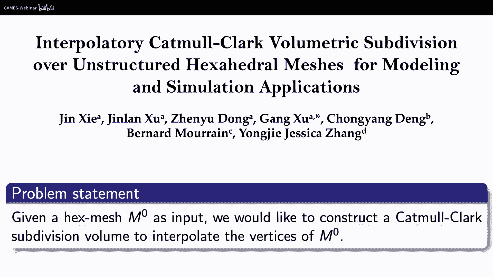

# GAMES302-等几何分析 - P11：基于体细分的等几何建模仿真优化一体化框架 🧱

## 概述

在本节课中，我们将学习如何利用**体细分**技术，构建一个连接几何建模、物理仿真与结构优化的统一框架。这个框架旨在解决等几何分析中复杂实体建模的难题，并实现从设计到分析再到优化的无缝流程。

---

## 第一部分：基于体细分的复杂实体建模 🏗️

上一节我们介绍了面向等几何分析的参数化工作。本节中，我们来看看如何利用体细分技术实现复杂实体的直接建模。

等几何分析不仅为计算机图形学开辟了新方向，也为计算几何提出了新问题，例如复杂实体建模。对于计算力学的应用而言，能够方便、直观地创建任意形状的实体模型至关重要。

我们的核心问题是：给定一个具有复杂拓扑的六面体控制网格，如何构造相应的样条实体表示？这里有两个关键词：**复杂**与**拓扑**。复杂形状通常需要多块拼接才能完成。

### 曲线救国：从八叉树网格到拓扑简化

目前，全自动化生成高质量的六面体网格仍是一个挑战。我们采用了一种“曲线救国”的思路：
1.  首先利用八叉树方法生成一个初始的六面体网格。这种方法相对自动化，但生成的网格在表面或附近会形成复杂的**奇异结构**（即不满足常规连接规则的点或线），导致分块多、网格质量差。
2.  然后，通过**拓扑简化**方法，将复杂的奇异结构简化为更干净、规则的结构。经过简化，网格块数大幅减少，网格质量（如平均雅可比比、最小雅可比比）得到显著提升。

以下是拓扑简化过程的要点：
*   我们采用了一种基于加权排序的简化策略。
*   该策略不仅考虑删除哪些网格块（如先删除宽块），还考虑了简化操作对拓扑信息的影响。
*   简化后的分块结构更规整，非常适合进行后续的体参数化或CAD重建。

### 细分建模：从曲面到实体

另一种解决方案是借鉴图形学中的**细分建模**思想。细分的基本原理是：给定一个粗糙的控制网格，按照预设规则递归地插入新顶点和新面，经过多次迭代后得到光滑的曲线或曲面。细分方法（如Catmull-Clark细分）突破了传统B样条的拓扑限制，能实现任意拓扑曲面的建模。

那么，能否将细分曲面推广到实体，形成**体细分**呢？答案是肯定的。体细分并非新概念，早在1996年就被用于自由变形（FFD），2002年则有学者提出了六面体网格的细分规则。

Catmull-Clark体细分规则简述如下（`C`代表体单元，`F`代表面，`E`代表边，`V`代表顶点）：
1.  **计算新体心点**：对每个六面体单元，计算其所有顶点的平均值作为新的体心点（`C_new`）。
2.  **计算新面点**：对每个原有面，计算其两个相邻体单元的体心点（`C1`, `C2`）以及该面重心的加权平均作为新面点（`F_new`）。
3.  **计算新边点**：对每条原有边，计算其相邻面点、体心点及边中点的加权平均作为新边点（`E_new`）。
4.  **更新旧顶点**：根据其相邻的新体心点、新面点、新边点及自身位置进行加权平均更新（`V_new`）。
5.  **连接新网格**：按照规则连接所有新点，形成细分一次后更密的六面体网格。

### 体细分的极限点公式：连接理论与应用的桥梁

对于Catmull-Clark细分曲面，存在一个**显示的极限点公式**，可以直接计算初始控制顶点经过无穷次细分后的极限位置。这个公式对于理论和应用都至关重要。

我们成功地将这个公式推广到了体细分。推导的关键在于分析奇异点处的局部结构。在一个度数为 `N` 的奇异点处放置一个单位球，该球与网格相交会在球面上形成一个三角化。利用球面三角化的欧拉公式，可以推导出该点处的面数 `E` 和体单元数 `F` 与度数 `N` 的关系：

*   **面数公式**: `E = 3 * (N - 2)`
*   **体单元数公式**: `F = 2 * (N - 2)`

基于此，我们得到了Catmull-Clark体细分的**显示极限点公式**。该公式表明，初始控制顶点 `V_i` 的极限位置，可以由细分一次后产生的新体心点、新面点、新边点及新顶点线性组合得到。

有了这个极限点公式，我们可以实现两件重要的事情：

#### 1. 样条体逼近

对于给定的六面体控制网格，我们可以为每个六面体单元构造一个**三次B样条体**。所有这些样条体拼接起来，就形成了对体细分极限体的一个样条逼近。在规则区域，该逼近是C2连续的；在奇异点处，是C0连续的。

样条体控制顶点的生成可以通过预定义的**模板（Mask）**高效完成。模板定义了如何从初始控制网格的顶点，通过线性加权组合得到样条体的内部点、边点和角点。

#### 2. 样条体插值

我们希望构造一个体细分极限体，使其精确插值（经过）初始控制网格的顶点。利用极限点公式，这可以通过反向求解实现：将初始控制顶点设为目标极限点，反推出一个经过“推拉”扰动的新控制网格。从这个新控制网格出发进行体细分，得到的极限体就会插值原控制顶点。

具体方法包括：
*   **Push-Pull方法**：直接根据极限点公式调整控制顶点。
*   **渐进迭代逼近（PIA）方法**：迭代调整控制顶点，使其极限位置逐步逼近目标点。极限点公式在这里用于计算每次迭代的“目标”位置。

此外，我们还可以在建模时为实体赋予**材料属性**（作为第四维坐标），实现材料的梯度分布建模。

### 交互式复杂实体建模框架

结合样条体逼近和插值技术，我们开发了一个**交互式复杂实体建模框架**。该框架允许用户通过直观操作（如拉伸、旋转、缩放、拓扑分裂、模型拼接等）来构造复杂的六面体控制网格，并自动生成对应的样条实体模型。

框架功能包括：
*   骨架节点的编辑与角度自动调整。
*   中间过渡体的生成与连接。
*   拓扑分裂与融合。
*   尖锐特征的保持（通过修改细分规则）。
*   网格单元质量的优化（通过插入层等方式）。

有了这个工具，即使不熟悉计算机几何和样条理论的计算力学研究者，也能方便地创建复杂实体模型，用于后续的等几何分析。

---

## 第二部分：基于体细分的高精度IGA物理仿真 ⚙️

上一节我们介绍了如何利用体细分进行复杂实体建模。本节中，我们来看看如何基于这些实体模型进行高精度的等几何分析物理仿真。

拥有了体细分表示的实体模型后，我们就可以在此基础上开发等几何分析求解器，进行物理仿真，例如：

*   **三维线弹性力学分析**
*   **热传导分析**

与传统的简单模型分析类似，我们可以直接利用样条体作为分析域，进行等几何分析。分析结果表明，在模型的大多数区域都能获得高精度解，而在奇异点附近，由于连续性降低，误差会相对较大。这验证了基于体细分模型进行仿真的可行性，使得对复杂实体进行等几何分析成为可能。

---

## 第三部分：基于体细分的IGA形状与拓扑优化 🔧

上一节我们介绍了基于体细分模型的物理仿真。本节中，我们来看看如何在此基础上进行形状与拓扑优化。

### 形状优化

在等几何分析中，形状优化具有天然优势：**控制顶点可以直接作为设计变量**。基于我们的体细分模型，我们可以对复杂模型进行形状优化。优化过程只需改变控制网格的顶点位置，无需重新生成网格，实现了设计与分析的无缝衔接。

### 拓扑优化

我们同样可以基于体细分表示进行等几何拓扑优化。通过计算灵敏度并迭代更新材料密度场，可以在样条体参数域内实现拓扑的演变。

体细分自带**多分辨率特性**，这为高效拓扑优化提供了便利：
1.  **在粗层级进行分析**：在较粗的体细分层级上进行昂贵的等几何分析（求解大型方程组）。
2.  **在细层级进行优化**：在较细的层级上计算相对简单的灵敏度并进行拓扑更新（如“挖洞”）。

这种“分析在粗层，优化在细层”的策略，可以显著降低计算成本。

### 优势：精确保持几何约束

基于等几何的拓扑优化有一个显著优势：能够**精确保持几何约束**。例如，在优化过程中，可以要求模型上的某些孔洞或尖锐特征保持不变。这是因为等几何分析使用精确的几何表示，在优化迭代中不会“侵蚀”这些预设的几何特征。而传统的基于体素（Voxel）的方法很难做到这一点。

我们通过多个算例（如悬臂梁、MBB梁、连接件等）验证了该框架的有效性，优化结果与商业软件结果吻合，且能完美保持指定的几何特征。

---

## 总结

本节课我们一起学习了基于体细分的等几何建模仿真优化一体化框架。

*   **体细分**是连接等几何分析与实体建模的关键桥梁，其**显示的极限点公式**是理论核心。
*   基于此，我们实现了**复杂实体的交互式建模**，为等几何分析提供了模型来源。
*   在此基础上，可进行**高精度的物理仿真**（如弹性力学、热传导）。
*   进一步，可开展**形状与拓扑优化**。体细分的多分辨率特性支持高效的多分辨率拓扑优化，并且等几何方法能**精确保持优化过程中的几何约束**，这是传统方法难以实现的。

本框架实现了**几何建模、物理仿真、结构优化**三者数据表示的一致性，避免了传统流程中网格重生成的环节，形成了一个完整、高效的设计分析闭环。体细分技术在未来等几何分析的发展中，将扮演越来越重要的角色。