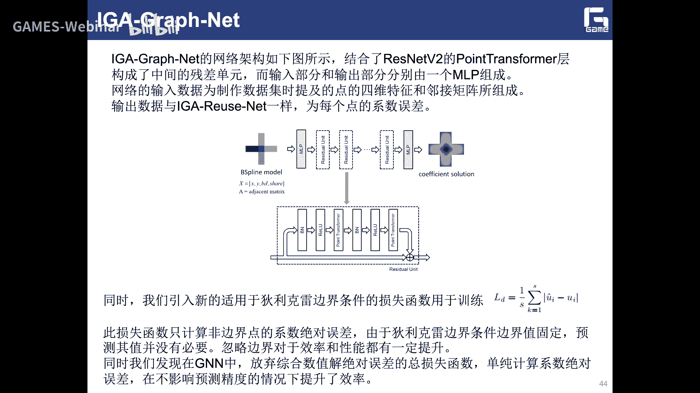

# GAMES302-等几何分析 - P12：基于深度学习的等几何分析与课程总结 📚

在本节课中，我们将学习如何将深度学习技术与等几何分析相结合，以解决拓扑一致模型的分析重用问题，并对整个等几何分析课程进行总结。

---

## 研究背景与动机 🔍

上一节我们介绍了基于体积分的等几何建模与仿真一体化框架。本节中，我们来看看如何利用人工智能技术来增强等几何分析的能力。

等几何分析本质上是一个求解偏微分方程（PDE）的过程。近年来，**AI for Science** 成为一个热门领域，旨在利用人工智能技术解决科学计算中的复杂问题。具体到我们的领域，即 **AI for PDE**，目标是利用深度学习更快速、更稳定地求解PDE。

传统的等几何分析或有限元方法在求解大规模复杂模型时，计算成本高昂。而深度学习模型一旦训练完成，其推理速度极快。因此，我们希望借助深度神经网络来解决复杂的PDE问题，节省大量计算时间。

基于等几何分析生成训练数据集有其独特优势：
1.  **高阶连续性**：等几何分析本身具有高阶连续性，有助于神经网络预测出光滑的物理场。
2.  **无需数据交换**：在优化和求解阶段无需进行繁琐的格式转换。
3.  **高精度数据**：生成的数据集质量高，有利于神经网络的训练。

我们的核心目标是解决 **分析重用** 问题：已知在一个模型（Model A）上的等几何分析解，如何快速预测另一个**拓扑一致但几何形状不同**的模型（Model B）上的解？例如，已知某个人体模型的应力分布，预测另一个不同体型人体模型的应力分布。直接通过几何映射得到的结果误差很大，因此需要更智能的方法。

---

## 基于卷积神经网络（CNN）的等几何分析 🧠

首先，我们介绍基于卷积神经网络的等几何分析方法。CNN是一种擅长处理网格化数据（如图像）的深度学习模型。

以下是CNN的基本结构组件：
*   **输入层**：接收输入数据，通常是二维矩阵（如图像像素）。
*   **卷积层**：使用滤波器（卷积核）在输入数据上滑动，进行内积运算，提取局部特征。
*   **池化层**：对局部区域进行统计（如最大池化、平均池化），实现特征抽象和降维。
*   **激活函数层**：引入非线性，如ReLU函数。
*   **全连接层**：整合特征，输出最终预测结果。

我们的工作流程如下：
1.  **数据准备**：生成大量拓扑一致但形状不同的B样条模型，并使用等几何分析求解PDE，得到控制顶点系数作为标签数据。
2.  **数据格式化**：将控制顶点坐标归一化并嵌入到一个二维矩阵中，将其视为“图像”输入CNN。
3.  **网络训练**：采用 **U-Net3+** 网络架构，并引入了自注意力机制模块，以更好地捕捉特征间的全局关系。
4.  **损失函数**：结合了**系数损失**和**数值解损失**，以同时优化预测系数和最终物理场的精度。

实验结果表明，该方法能有效预测新模型上的物理场，相对误差通常在1%到5%之间，验证了其可行性。

---

## 基于图神经网络（GNN）的等几何分析 🕸️

虽然CNN方法有效，但将复杂的多片B样条模型强制嵌入二维矩阵存在冗余信息多、扩展至三维困难等缺陷。因此，我们进一步探索了基于图神经网络的方法。

图神经网络专为处理**非结构化数据**（如图、知识图谱）设计。对于多片B样条模型，其控制顶点及连接关系天然构成一个**图结构**，这与GNN的应用场景高度契合。

以下是采用GNN方法的优势：
*   **自然表示**：直接利用控制顶点作为图节点，片间连接关系作为边，无需暴力嵌入矩阵。
*   **易于扩展**：可轻松扩展到三维体参数化模型。
*   **局部性匹配**：B样条的局部支撑性与GNN的邻域聚合操作原理相通。

我们提出了 **IG-GraphNet** 框架：
1.  **图构建**：从B样条模型中提取控制顶点（节点）及其连接关系（边），构建图数据。
2.  **网络架构**：基于 **ResNet-v2** 和 **Point Transformer** 改进，引入了残差连接以缓解GNN中常见的过度平滑问题。
3.  **特征增强**：增加了位置编码等初始特征，以强化网络的特征提取能力。

与基于CNN的方法相比，IG-GraphNet在预测精度上有明显提升，误差进一步降低，证明了图结构更适用于表示复杂的等几何分析模型。

---

## 未来展望与课程总结 🚀

基于深度学习的方法为解决等几何分析中的分析重用问题提供了新思路。未来工作可以从以下几个方面展开：
1.  **网络结构改进**：设计更适配PDE求解特性的网络架构。
2.  **数据集与问题扩展**：扩充数据集类型，求解更广泛的PDE类型和边界条件，并将工作推广到三维问题。
3.  **物理信息融合**：探索基于物理规则的无监督学习方法，减少对大量标签数据的依赖。
4.  **应用于优化**：将该方法集成到形状优化、拓扑优化流程中，极大提升优化效率。

---

### 课程总结 📖

本节课是我们《等几何分析》系列课程的最后一讲。我们一起回顾了整个课程的知识体系：

1.  **引言与背景**：介绍了CAD/CAE无缝融合的愿景及等几何分析的提出背景。
2.  **计算几何基础**：深入讲解了曲线、曲面的B样条/NURBS建模。
3.  **有限元与网格**：阐述了等几何分析与传统有限元法及网格生成的关系。
4.  **等几何参数化**：重点探讨了面向分析的几何参数化这一核心问题。
5.  **求解器框架**：详细介绍了泊松问题、线弹性问题及超弹性问题的等几何求解框架。
6.  **结构优化**：展示了等几何在形状优化和拓扑优化中的天然优势。
7.  **体积分方法**：介绍了基于体积分的建模-仿真-优化一体化新框架。
8.  **深度学习应用**：探讨了AI与等几何结合，实现分析重用的新途径。

等几何分析的发展趋势正从二维走向三维，从线性扩展到非线性，从单场仿真迈向多场耦合，并从传统求解转向AI预测。然而，仍面临诸多挑战，如复杂三维模型的参数化构造、裁剪曲面的处理、工业软件研发等。

希望本课程能为大家进入等几何分析领域打下坚实基础。感谢大家一路的陪伴与学习，期待各位能在该领域深耕，共同推动其理论发展、软件生态建设及工业应用。

**课程视频与PPT资源已整理发布，供大家持续学习与参考。**