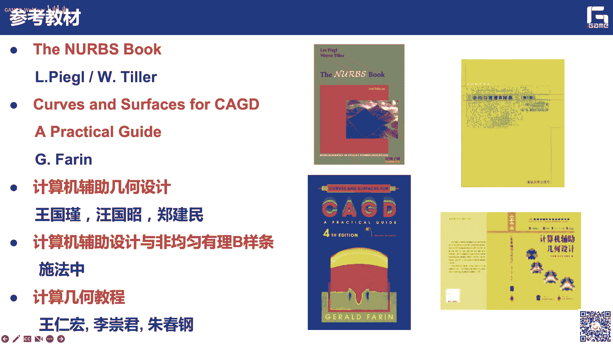
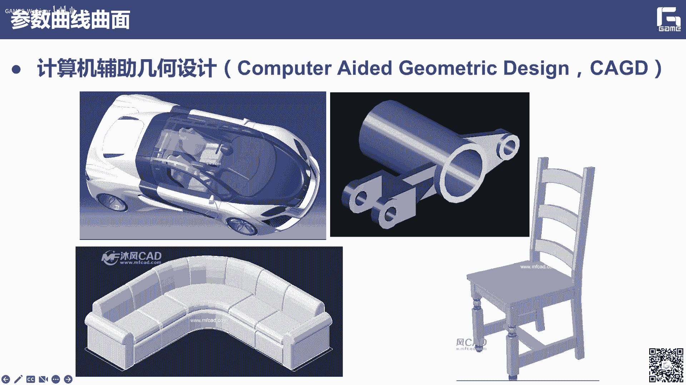
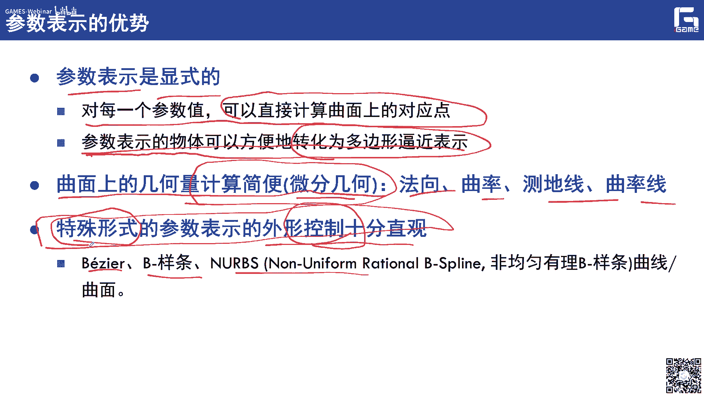

# GAMES302-等几何分析 - P2：曲线曲面曲体的建模基础 📐

在本节课中，我们将学习等几何分析（Isogeometric Analysis, IGA）的几何建模基础。等几何分析的核心思想是使用与几何表示相同的样条语言来表示物理场，因此，理解曲线、曲面和曲体的样条表示至关重要。本节课将详细介绍参数表示、贝塞尔曲线/曲面、B样条以及NURBS等核心概念，并简要介绍iGame几何内核的实现框架。

---

## 概述 📖

上一讲我们介绍了等几何分析的提出背景及其与CAD/CAE的关系。本节中，我们将深入探讨其几何建模的理论基础。具体内容包括：几何形状的参数表示、曲线造型理论（贝塞尔曲线、B样条、NURBS）、曲面与曲体的造型理论，以及iGame几何内核的简要介绍。

---

## 几何形状的参数表示

在计算机辅助几何设计中，参数曲线曲面是核心。参数表示的核心思想是将几何形状上点的坐标（x, y, z）表示为另一个（或几个）参数的函数。

参数表示相较于显式表示（如 y = f(x)）和隐式表示（如 F(x, y) = 0）具有显著优势：
*   **易于计算和离散化**：给定参数值，可直接计算对应点的坐标，便于计算机处理和图形渲染。
*   **几何量计算简便**：便于计算切线、法向、曲率等微分几何属性。
*   **形状控制直观**：通过引入控制多边形/网格等概念，可以实现直观的形状编辑和预测。

一条三维参数曲线可表示为：
**C(u) = (x(u), y(u), z(u))**
其中，u 是参数。

对于曲面，则需要两个参数 (u, v)：
**S(u, v) = (x(u, v), y(u, v), z(u, v))**

---

## 曲线造型理论与算法

上一节我们介绍了参数表示的优势，本节中我们来看看几种具体的参数曲线表示方法。

### 贝塞尔曲线

贝塞尔曲线由法国工程师Pierre Bézier提出，其核心是通过控制多边形来定义曲线形状。移动控制顶点可以直观地预测和修改曲线形状。

一条 n 次贝塞尔曲线定义为：
**C(u) = Σ_{i=0}^{n} B_{i,n}(u) P_i**
其中：
*   **P_i** 是控制顶点（矢量）。
*   **B_{i,n}(u)** 是 n 次伯恩斯坦基函数。

伯恩斯坦基函数定义为：
**B_{i,n}(u) = C(n, i) * (1-u)^{n-i} * u^{i}**
其中，C(n, i) 是二项式系数。

伯恩斯坦基函数具有以下重要性质：
*   **非负性**：在参数区间 [0, 1] 内，B_{i,n}(u) ≥ 0。
*   **单位分解性**：Σ_{i=0}^{n} B_{i,n}(u) = 1。这一性质保证了贝塞尔曲线的凸包性。
*   **递归定义**：高次基函数可由低次基函数组合得到，这引出了高效的德卡斯特里奥算法。

基于基函数的性质，贝塞尔曲线具有以下几何特性：
*   **端点插值**：曲线经过第一个和最后一个控制顶点。
*   **端点切矢**：曲线在端点处的切矢方向与控制多边形的第一条边和最后一条边一致。
*   **凸包性**：曲线完全位于其控制顶点构成的凸包内。
*   **几何不变性**：曲线形状仅取决于控制顶点的相对位置，与坐标系选择无关。

#### 德卡斯特里奥算法

这是计算贝塞尔曲线上点的稳定递归算法，也称为“割角算法”。

以下是算法的递归公式（对于给定参数 u）：
**P_i^r(u) = (1-u) * P_i^{r-1}(u) + u * P_{i+1}^{r-1}(u)**
其中，r = 1, ..., n；i = 0, ..., n-r；且 P_i^0(u) = P_i（原始控制顶点）。

最终，**P_0^n(u)** 即为曲线上对应参数 u 的点。

### B样条曲线

贝塞尔曲线是整体曲线，修改一个控制顶点会影响整条曲线，且不能精确表示圆锥曲线。B样条曲线通过引入节点向量和分段定义，克服了这些缺点，同时保留了局部修改性和参数连续性。

一条 k 次 B 样条曲线定义为：
**C(u) = Σ_{i=0}^{n} N_{i,k}(u) P_i**
其中：
*   **P_i** 是控制顶点。
*   **N_{i,k}(u)** 是 k 次 B 样条基函数。
*   节点向量 **U = [u_0, u_1, ..., u_{m}]**，其中 m = n + k + 1。

B 样条基函数由节点向量和次数 k 递归定义：
*   **零次基函数 (k=0)**：
    **N_{i,0}(u) = { 1, if u_i ≤ u < u_{i+1}; 0, otherwise }**
*   **高次基函数 (k>0)**：
    **N_{i,k}(u) = (u - u_i)/(u_{i+k} - u_i) * N_{i,k-1}(u) + (u_{i+k+1} - u)/(u_{i+k+1} - u_{i+1}) * N_{i+1,k-1}(u)**

B 样条曲线继承了贝塞尔曲线的凸包性、几何不变性等优点，并新增了：
*   **局部支撑性**：每个基函数 N_{i,k}(u) 仅在局部区间 [u_i, u_{i+k+1}) 非零。因此，修改一个控制顶点 P_i 只影响该区间对应的曲线段。
*   **强凸包性**：曲线段位于定义该段的 k+1 个控制顶点形成的凸包内。
*   **与贝塞尔曲线的联系**：当节点向量两端出现 k+1 重节点时，B 样条曲线退化为贝塞尔曲线。

### NURBS曲线

为了精确表示圆、椭圆等圆锥曲线，需要将 B 样条推广到有理形式，即非均匀有理 B 样条。

一条 k 次 NURBS 曲线定义为：
**C(u) = Σ_{i=0}^{n} (w_i * P_i * N_{i,k}(u)) / Σ_{j=0}^{n} (w_j * N_{j,k}(u))**
其中，**w_i** 是与控制顶点 P_i 关联的权因子。

通过调整权因子，可以精确控制曲线的形状，特别是能够精确表示圆锥曲线截面。

---

## 曲面与曲体造型理论

理解了曲线之后，将其思想推广到更高维度，就可以得到曲面和曲体的造型理论。

### 贝塞尔曲面

贝塞尔曲面是贝塞尔曲线在二维参数域 (u, v) 上的张量积推广。

一张 (m, n) 次的贝塞尔曲面定义为：
**S(u, v) = Σ_{i=0}^{m} Σ_{j=0}^{n} B_{i,m}(u) B_{j,n}(v) P_{i,j}**
其中，**P_{i,j}** 构成了 (m+1) x (n+1) 的控制顶点网格。

其性质（如凸包性、端点插值等）是曲线性质的直接推广。求值也可通过两个方向的德卡斯特里奥算法完成。

### B样条曲面与NURBS曲面

类似地，B样条曲面是B样条曲线的张量积推广：
**S(u, v) = Σ_{i=0}^{m} Σ_{j=0}^{n} N_{i,p}(u) N_{j,q}(v) P_{i,j}**
其中，p 和 q 分别是 u 和 v 方向的次数，各有一个节点向量。

NURBS曲面则是NURBS曲线的张量积推广，具备了精确表示球面、柱面等二次曲面的能力，并成为工业标准（如STEP、IGES）中几何定义的基础。

### 曲体

对于三维实体域（常用于等几何分析求解三维问题），需要引入三个参数方向 (u, v, w)。

一个 (l, m, n) 次的 B 样条曲体定义为：
**V(u, v, w) = Σ_{i=0}^{l} Σ_{j=0}^{m} Σ_{k=0}^{n} N_{i,p}(u) N_{j,q}(v) N_{k,r}(w) P_{i,j,k}**
其中，**P_{i,j,k}** 构成了三维控制网格。

曲体在概念上是曲面向三维的延伸，但在某些方面（如复杂连接处的几何连续性定义）仍存在理论挑战。在等几何分析中，曲体用于填充三维物体的内部，其参数坐标空间中的“单元”即对应于物理空间的六面体子域，是IGA的计算单元。

---

## iGame几何内核简介

为了帮助大家实践，课程提供了 iGame 几何内核（一个简化的样条库）。该内核包含了曲线、曲面、曲体的核心类定义，支持求值、求导等基本操作。

以下是核心类的简要说明：
*   **`Basis` 类**：表示 B 样条基函数，存储次数、节点向量等信息，提供求值和求导函数。
*   **`Geometry` 类（基类）**：所有几何对象（曲线、曲面、曲体）的父类，定义虚函数接口（如求值 `eval()`）。
*   **`Curve` 类**：继承自 `Geometry`，表示 B 样条曲线，包含控制顶点列表。
*   **`Surface` 类**：继承自 `Geometry`，表示 B 样条曲面，包含两个参数方向的信息。
*   **`Volume` 类**：继承自 `Geometry`，表示 B 样条曲体，包含三个参数方向的信息。

该框架的数据存储采用自定义的 XML 格式，记录了几何对象的次数、节点向量、控制顶点及权因子等信息。

---

## 总结 🎯

本节课我们一起学习了等几何分析所需的几何建模基础。我们从**参数表示**的优势讲起，深入探讨了**贝塞尔曲线**的定义、性质及德卡斯特里奥算法；然后介绍了具有局部性的**B样条曲线**及其基函数递归定义；接着扩展到能精确表示圆锥曲线的**NURBS曲线**；最后将曲线理论推广至**曲面**和**曲体**，并简要介绍了实践所用的 **iGame 几何内核**。

理解这些样条表示是学习等几何分析的关键第一步，因为它们不仅是几何描述的工具，也将成为后续物理场离散和分析的基函数。下一讲，我们将介绍有限元方法的基础知识，以便更好地理解等几何分析的数值框架。

---
**作业**：基于提供的 iGame 样条库，实现 B 样条曲线的节点插入算法。即在给定节点向量中插入一个新节点后，计算出新的控制顶点，并保持曲线形状不变。