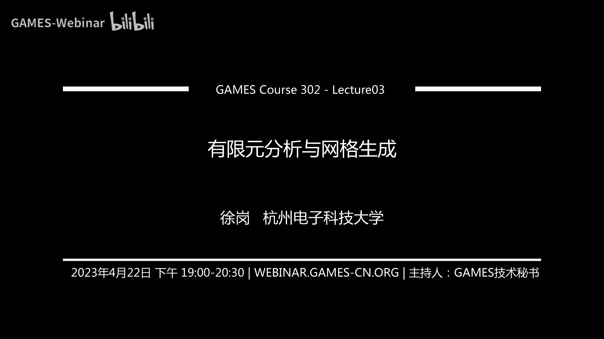
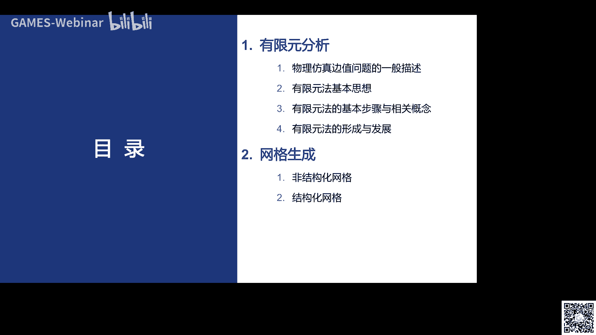
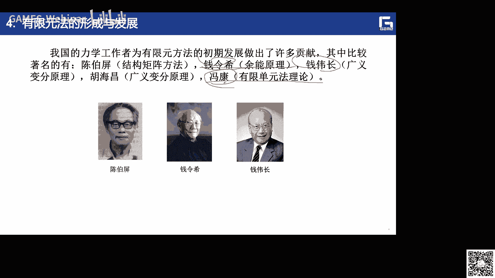
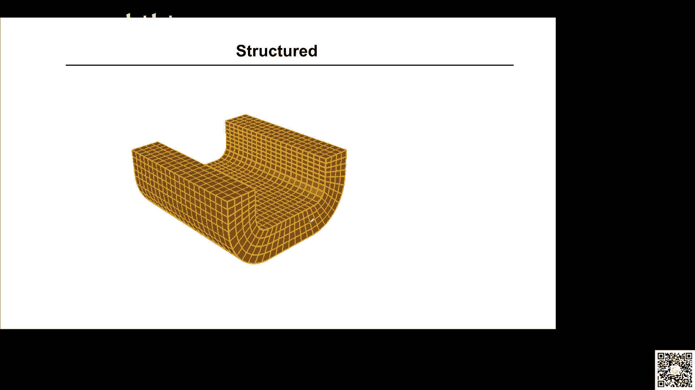
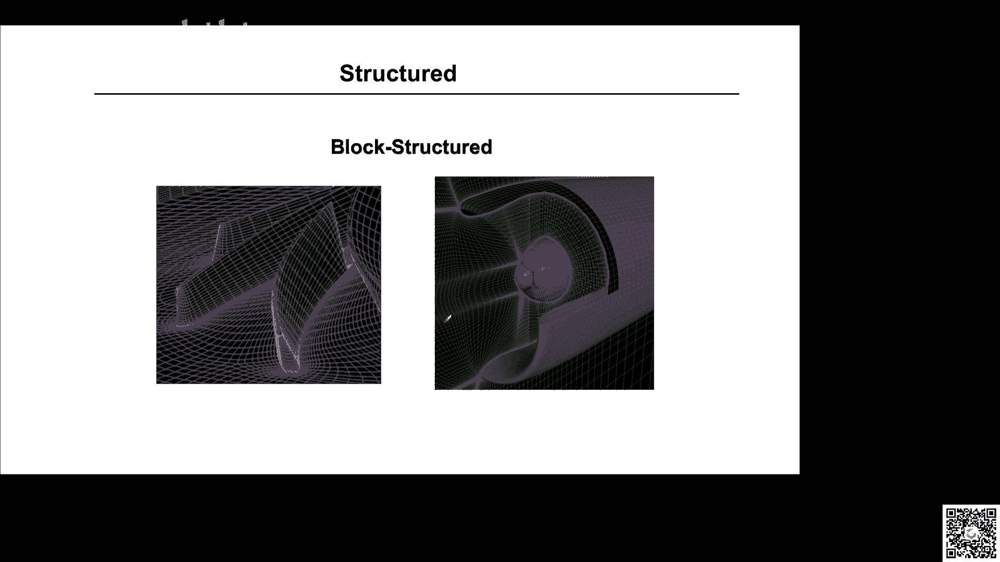
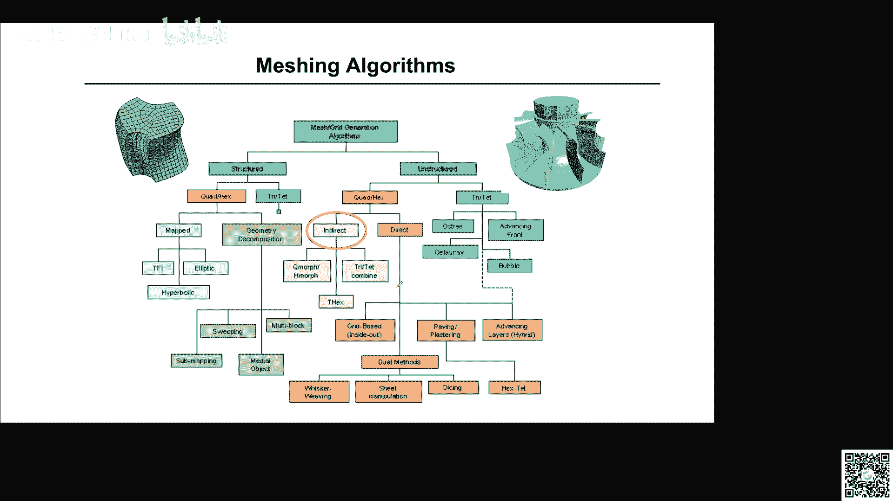
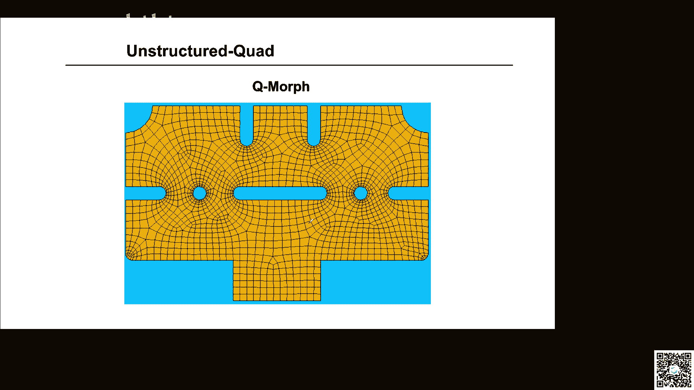
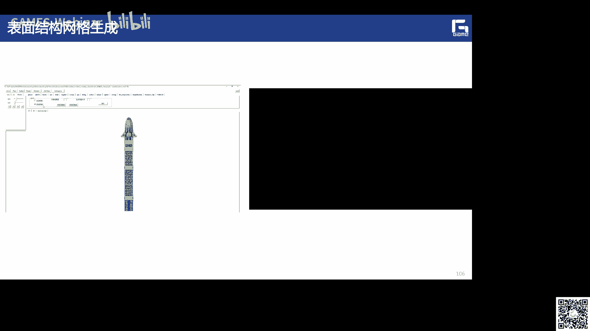
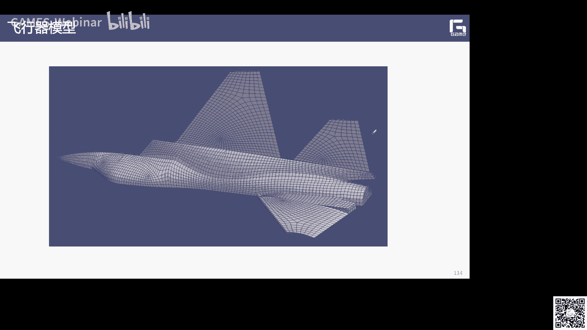

# GAMES302-等几何分析 - P3：有限元分析与网格生成 🧩



在本节课中，我们将学习有限元分析的基本思想、核心步骤以及网格生成技术。有限元分析是计算机辅助工程（CAE）中的核心方法，而网格生成是其前处理的关键步骤。理解这些内容，对于后续学习等几何分析至关重要。

## 概述：物理仿真与边值问题

在工程与科学中，物理仿真问题通常可以归结为两类。

第一类是**离散系统问题**，例如桁架结构，可以看作由已知的杆单元组合而成。这类问题可以直接离散化求解。

第二类是**连续系统问题**，也称为**场问题**。这类问题需要建立其遵循的基本微分方程（PDE）及相应的边界条件。这类问题一般称为**边值问题**。

一个典型的边值问题可以描述为：在区域 Ω 内部，物理场函数 **u** 需满足微分方程 **A(u)=0**；在边界 Γ 上，需满足边界条件 **B(u)=0**。这里的 **u** 可以是标量场（如温度），也可以是矢量场（如位移、应力）。

对于这类边值问题，通常很难获得精确的解析解。因此，需要发展数值方法进行求解。

## 有限元方法的基本思想 🧠

有限元方法是基于变分思想发展起来的一种求解偏微分方程的数值计算方法。其核心思想是 **“分而治之”** 和 **“分片近似”**。

基本步骤如下：
1.  **求解域离散**：将连续的求解区域 Ω 划分为有限个互不重叠且通过节点相互连接的小单元（如三角形、四边形）。
2.  **分片近似**：在每个单元内部，选用简单的近似函数（通常是多项式）来逼近未知的物理场函数 **u**。
3.  **单元分析**：基于问题的控制方程（如平衡方程），建立每个单元的刚度方程，将单元节点力与节点位移联系起来，形式为 `{f}^e = [k]^e {u}^e`。
4.  **整体组装**：将所有单元的刚度矩阵按照节点连接关系组装成整体刚度矩阵，形成全局线性方程组 `[K]{U} = {F}`。
5.  **引入边界条件并求解**：将已知的边界条件代入方程组，求解得到所有节点处的物理场值 `{U}`。
6.  **后处理**：对求解结果进行可视化与分析。

上一节我们介绍了有限元方法的基本思想，本节中我们通过一个简单例子来具体说明其求解过程。

## 有限元方法示例：一维杆单元

考虑一个简单的一维杆单元，有两个节点 i 和 j。

*   **节点位移向量**：`{u}^e = [u_i, u_j]^T`
*   **节点力向量**：`{f}^e = [f_i, f_j]^T`

假设节点 i 发生单位位移（`u_i = 1`），而节点 j 固定（`u_j = 0`），此时在节点 i 上产生的力 `f_i` 与材料属性（弹性模量 E，横截面积 A）和单元长度 L 有关。我们可以定义**单元刚度系数** `k_{ij}^e`，表示在第 j 个自由度产生单位位移时，在第 i 个自由度上引起的力。

通过推导，可以得到单元刚度矩阵 `[k]^e`，它将节点力与节点位移联系起来：
```
{f_i \choose f_j} = \frac{EA}{L} \begin{bmatrix} 1 & -1 \\ -1 & 1 \end{bmatrix} {u_i \choose u_j}
```
即 `{f}^e = [k]^e {u}^e`。

对于由多个单元组成的结构，我们需要进行整体分析。以下是将单元刚度矩阵组装成整体刚度矩阵的关键步骤：

1.  将每个单元的节点位移向量 `{u}^e` 扩展为与整体位移向量 `{U}` 维度一致的向量。
2.  将每个单元的刚度矩阵 `[k]^e` 中的元素，根据其对应的整体节点编号，“对号入座”地叠加到整体刚度矩阵 `[K]` 的相应位置。
3.  将所有单元的节点力向量 `{f}^e` 也组装成整体节点载荷向量 `{F}`。
4.  最终得到整体平衡方程 `[K]{U} = {F}`。

通过求解这个方程组并引入边界条件，即可得到所有节点的位移。

## 有限元方法的核心概念 📚

以下是有限元分析中涉及的一些核心概念：

*   **单元**：区域离散后满足一定几何与物理特性的最小结构域，如一维杆单元、二维三角形单元、三维四面体单元。
*   **节点**：单元的连接点，是求解未知量的位置。
*   **节点力**：单元之间通过节点传递的相互作用力。
*   **节点载荷**：作用在节点上的外部力。
*   **插值函数（形函数）**：用于在单元内部近似真实场函数的基函数。通常表示为 `u(x) = Σ N_i(x) * u_i`，其中 `N_i(x)` 是形函数，`u_i` 是节点值。
*   **刚度矩阵**：描述结构刚度特性的矩阵，建立了力与位移的关系。

有限元解的精度受多种因素影响：
1.  **离散误差**：用简单几何单元（如直边三角形）逼近复杂几何边界产生的误差。
2.  **位移函数误差**：形函数对真实解逼近能力的不足。
3.  **数值积分误差**：在计算单元矩阵时，采用高斯积分等数值方法带来的误差。
4.  **边界条件误差**：施加的边界条件与真实物理模型之间的差异。



提高精度的方法包括：增加网格密度（h-细化）、采用高阶形函数（p-细化）、使用更精确的积分方案以及更合理地施加边界条件。


## 网格生成技术概述 🕸️

网格生成是有限元分析前处理的核心步骤，目标是将复杂的几何区域离散成适用于数值计算的单元集合。其背景源于有限元分析的需求，与图形学中源于三维扫描的“数字几何处理”既有联系也有区别。

一个完整的网格生成流程通常包括：曲线离散、曲面网格化、体网格化以及最终的网格质量评估。

网格生成算法主要分为结构化网格和非结构化网格两大类。





以下是常见的网格生成方法分类：



*   **结构化网格**
    *   **映射法**：将参数域（如单位正方形）的规则网格映射到物理域。常用方法包括椭圆型PDE法、超限插值法、双曲型方法。
    *   **几何分解法**：将复杂区域分解为若干简单的、易于映射的子区域（分块）。方法包括扫掠法、中轴法、子域映射法等。
*   **非结构化网格**
    *   **三角形/四面体网格**：前沿推进法、Delaunay三角剖分法。
    *   **四边形/六面体网格**
        *   **直接法**：从边界直接向内部生成，如铺砌法、对偶法。
        *   **间接法**：先生成三角形网格，再合并成四边形网格；或先生成四面体网格，再转换为六面体网格。



高质量的六面体网格生成被认为是挑战，其“黄金标准”包括：**全自动**、**鲁棒性好**、**网格质量高**。其中，**大区域剖分**是实现高质量网格的关键。

## 基于标量场的自动化四边形/六面体网格生成

我们团队在自动化网格生成方面做了一些工作，核心思想是利用**标量场**来引导区域剖分。

基本框架如下：
1.  **求解标量场**：在目标区域上求解一个拉普拉斯方程 `∇²φ = 0`，并设置适当的边界条件（如狄利克雷条件），得到一个光滑的标量场 `φ`。
2.  **分析场结构**：分析标量场 `φ` 的等值线和临界点（如鞍点、极值点）。临界点通常对应网格剖分所需的**奇异点**。
3.  **生成分区线**：从奇异点出发，沿着标量场的梯度线或特定流线生成分区线，将复杂区域分割成若干个简单的子区域（如四边形区域或2-6边形区域）。
4.  **子区域网格化**：对每个简单的子区域，利用映射法或扫掠法生成内部的高质量四边形网格。
5.  **整体组装**：将所有子区域的网格组合，得到最终的整体网格。

该方法允许子区域是2到6边的多边形，而不仅仅是四边形。通过求解一个整数规划问题来确定各边界的离散段数，可以得到更简洁、更合理的区域剖分结果，且奇异点数目更少。

此方法也可直接应用于三维曲面，通过求解曲面上的PDE获得标量场，并在曲面上直接进行分区，从而避免了将曲面参数化到平面可能带来的扭曲问题，能更好地保持模型的尖锐特征。




网格生成是连接CAD与CAE的关键环节，也是当前国内工业软件研发的关注重点。在等几何分析中，虽然不再需要传统的“网格”，但面向分析的**几何参数化**问题，其本质——如何将复杂区域分解为高质量的参数化块——与结构化网格生成中的“大区域剖分”问题殊途同归。




## 总结

本节课我们一起学习了有限元分析与网格生成的核心内容。


我们首先了解了物理仿真中的边值问题，并深入探讨了有限元方法的基本思想：通过离散求解域和分片近似，将连续的偏微分方程问题转化为离散的线性代数问题求解。我们通过一维杆单元的示例，具体说明了单元刚度矩阵的推导以及整体刚度矩阵的组装过程。

接着，我们介绍了作为有限元前处理关键步骤的网格生成技术，概述了结构化与非结构化网格的主要生成方法。最后，我们分享了一种基于标量场引导的自动化四边形/六面体网格生成框架，该方法通过求解场方程自动识别剖分结构，能够生成高质量网格，其思想对于解决等几何分析中的参数化问题也具有重要借鉴意义。


理解有限元的基本流程和网格生成的概念，将为后续学习等几何分析奠定坚实的基础。在下节课中，我们将探讨等几何分析中的参数化问题。