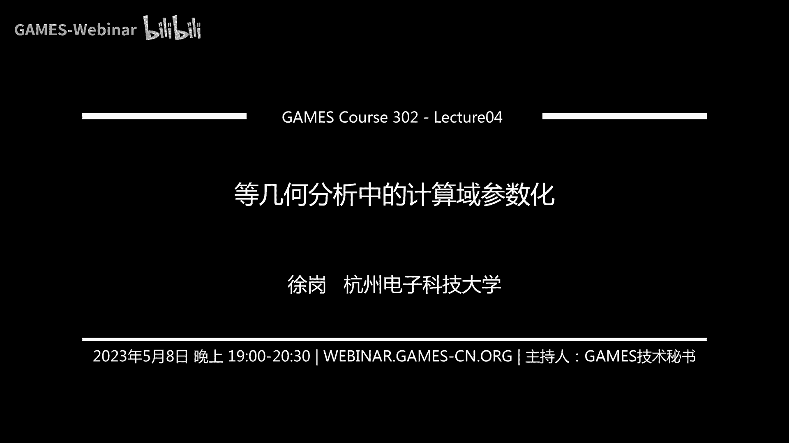

# GAMES302-等几何分析 - P4：等几何分析中的计算域参数化 I 🎯

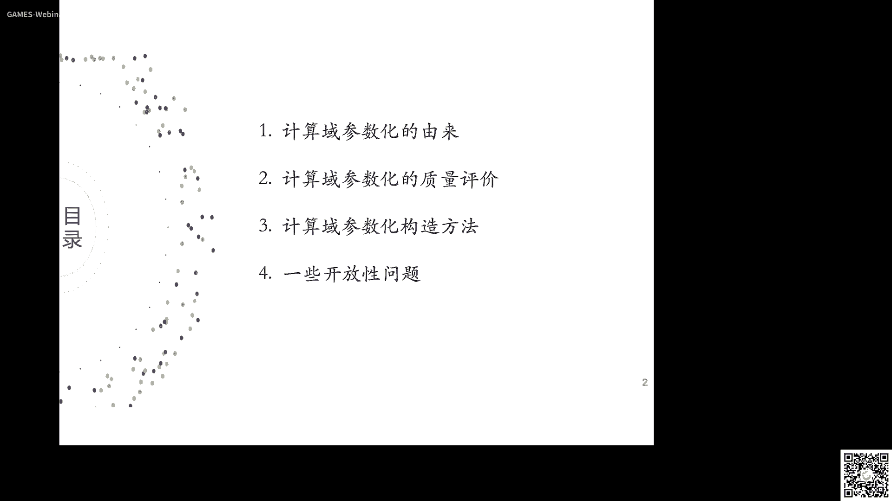

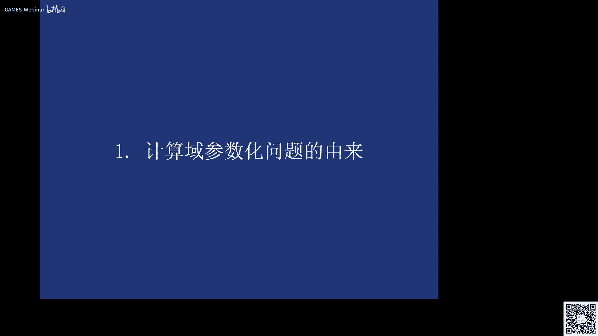

在本节课中，我们将学习等几何分析中一个至关重要的前处理步骤——计算域参数化。我们将探讨其重要性、质量评价标准以及几种核心的构造方法。

## 第一部分：计算域参数化的由来 🔍

上一节我们介绍了有限元分析中的网格生成。本节中我们来看看等几何分析中对应的前处理步骤。

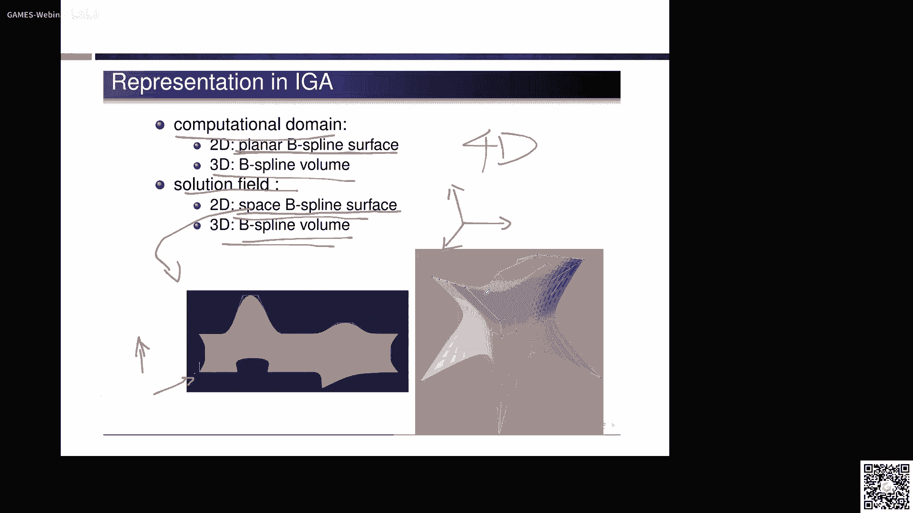

等几何分析的核心思想是使用与CAD系统相同的样条表示来描述几何和物理场，从而实现从几何建模到物理仿真的无缝集成。在等几何分析中，计算单元是样条基函数的定义域，即节点区间对应的参数片。这与有限元分析中使用三角形或四面体等离散网格单元有本质区别。

对于三维实体问题，CAD系统通常只提供边界表示。为了进行等几何分析，我们需要将实体内部用三维样条参数化表示“填充”起来。这个过程就是计算域参数化，它等价于有限元分析中的网格生成步骤。

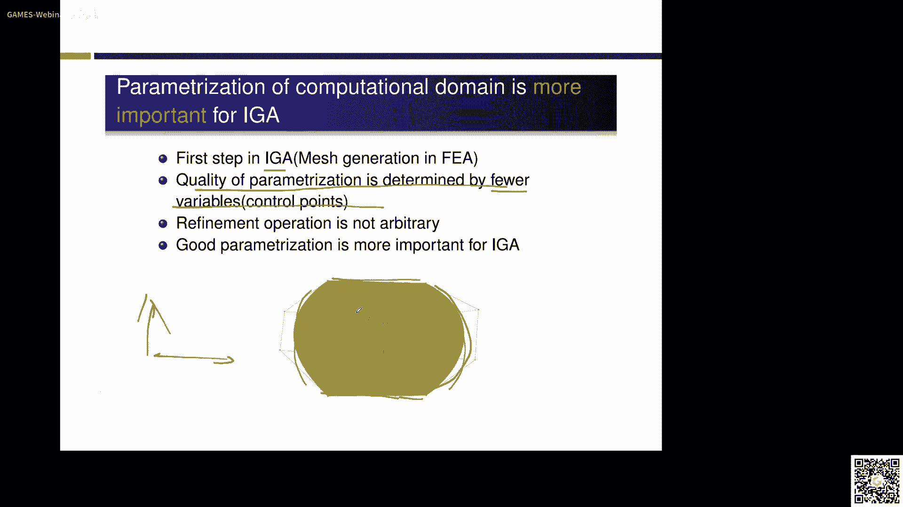

为什么计算域参数化在等几何分析中尤为重要？原因在于等几何分析的自由度通常比有限元更少，因此参数化的质量完全由相对较少的内部控制顶点分布决定。此外，等几何分析中增加自由度（如节点插入或升阶）的方式不如有限元网格细分那样自由，因此一个高质量的初始参数化显得更加关键。

以下是一个直观的例子，说明参数化质量对分析结果的影响：
*   给定一个相同的四边平面区域，其边界曲线固定。
*   通过不同的内部控制顶点分布，可以构造出高质量（均匀、正交）或低质量的参数化。
*   在这两种参数化上求解同一个热传导PDE，得到的解场（温度分布）差异巨大。
*   高质量参数化得到的解更接近真实解，且收敛速度更快；而低质量参数化得到的解则扭曲失真，精度和效率都较差。

因此，如何构造适合分析的、高质量的计算域参数化，成为等几何分析领域的一个重要研究课题。

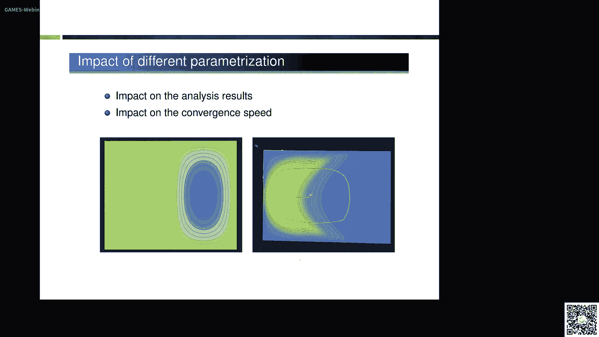

## 第二部分：计算域参数化的质量评价 📏

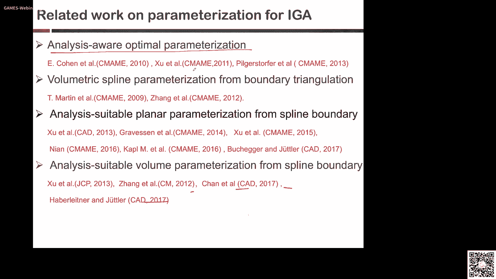

既然参数化如此重要，那么什么样的参数化才是“好”的呢？本节中我们来看看其评价标准。

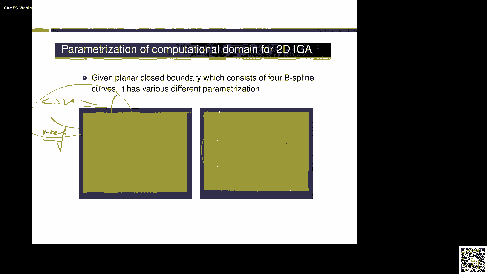

一个适合等几何分析的计算域参数化应满足以下三个核心要求：

1.  **一一映射（无自交）**：从参数域到物理域的映射必须是单射，即参数域中的等参线（面）在物理域中不应相交。这保证了雅可比变换矩阵的行列式处处为正，是数值积分稳定的基础。
    *   **公式描述**：对于平面B样条曲面 `S(u,v) = ΣΣ N_i,p(u) N_j,q(v) P_ij`，其雅可比行列式 `J(u,v)` 需满足 `J(u,v) > 0`。

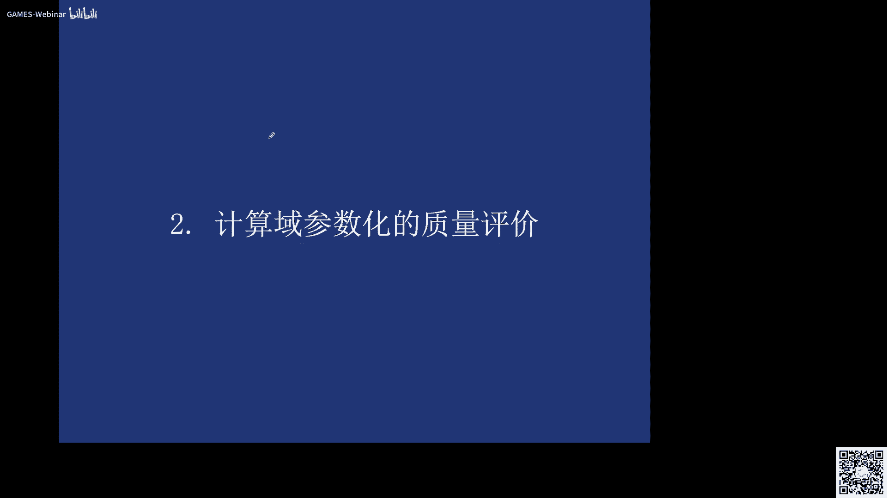

2.  **单元均匀性**：参数化生成的等参单元（即计算单元）应尽量大小均匀。这有助于提高数值精度和稳定性。
    *   **目标**：最小化所有等参单元面积的方差。

3.  **等参线正交性**：不同参数方向的等参线应尽量保持正交（垂直）。这通常能带来更好的数值条件数。
    *   **目标**：最大化等参线切线向量之间的夹角接近90度。

此外，从数值分析的角度，整体刚度矩阵的条件数也是一个高级评价指标。研究表明，参数化的质量（均匀性、正交性）直接影响刚度矩阵的条件数，进而影响求解器的稳定性和收敛速度。

基于这些标准，我们可以将构造高质量参数化的问题，形式化为一个带约束的优化问题：
*   **优化变量**：内部控制顶点的坐标。
*   **目标函数**：最小化不均匀性和非正交性的度量。
*   **约束条件**：雅可比行列式（或其控制系数）大于零，保证无自交。

## 第三部分：计算域参数化的构造方法 🛠️

了解了问题定义和质量标准后，本节我们探讨几种具体的参数化构造方法。求解上述优化问题需要一个良好的初始解。

### 初始解构造：离散的Coons方法

对于给定四条边界B样条曲线的平面区域，一种简单直接的初始参数化构造方法是离散的Coons方法。其思想是对边界控制顶点进行双向线性插值。

**算法思路**：
1.  沿u方向对两侧（v为常数）的边界控制点进行线性插值。
2.  沿v方向对两侧（u为常数）的边界控制点进行线性插值。
3.  将两次插值结果相加，并减去四个角点插值结果以避免重复计算。

该方法计算高效，但生成的参数化质量可能不高，在边界复杂时容易产生自交区域。该方法可以推广到三维，用于构造六边界曲面围成的体的初始参数化。

### 方法一：约束优化方法

这是最直观的思路。我们将质量评价标准直接建模为一个非线性约束优化问题。

**问题形式化**：
*   **优化变量**：内部控制顶点 `P_ij`。
*   **目标函数**：`E = α * E_uniformity + β * E_orthogonality`，其中α和β是权重系数。
*   **约束条件**：`g_ijk > 0`（雅可比行列式控制系数为正）。

使用离散Coons方法的结果作为初始解，然后采用梯度下降、序列二次规划等优化算法进行求解。此方法可以推广到多块参数化并满足C1连续性要求。

### 方法二：变分调和映射方法

该方法基于调和映射的一个优美性质：如果一个映射是调和的，且其边界映射是微分同胚，那么该映射本身也是微分同胚（一一映射）。我们利用这一性质来保证无自交。

**核心思想**：
1.  我们希望找到从参数域Ω到物理域S的映射 `σ: Ω -> S`，使其是调和的，即满足拉普拉斯方程 `Δσ = 0`。
2.  通过链式法则，将物理域中的拉普拉斯方程 `Δ(x,y)=0` 转换到参数域中，得到一个关于控制顶点 `P_ij` 的非线性方程。
3.  为了同时优化均匀性和正交性，我们将调和条件与均匀/正交能量项结合，形成一个新的目标函数进行优化。

**优势**：该方法理论优美，能有效避免自交，尤其在边界凹凸变化剧烈时，相比初始的Coons方法有显著改善。此方法亦可推广至三维体的参数化构造。

### 方法三：边界重新参数化

有时，给定的边界曲线/曲面本身的参数化质量就很差（例如分布极不均匀），这会严重影响内部参数化的构造。边界重新参数化旨在优化边界的参数分布，而不改变其几何形状。

**关键技术**：Möbius重参数化。对于NURBS曲线/曲面，对其参数进行Möbius变换 `u' = (α u + β) / (γ u + δ)`，可以生成一条新的NURBS曲线/曲面。关键结论是：**新旧曲线/曲面具有完全相同的控制顶点，但权重和节点向量发生了变化**。

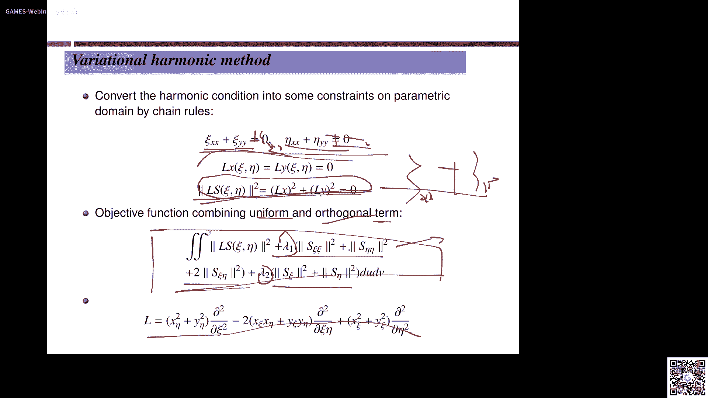

**优化过程**：
*   **优化变量**：Möbius变换中的参数 `α, β, γ, δ`。
*   **目标函数**：最小化边界自身等参结构的均匀性度量。
*   **结果**：得到参数分布更均匀的边界表达，在此基础上进行内部参数化构造，能获得整体质量更高的计算域。

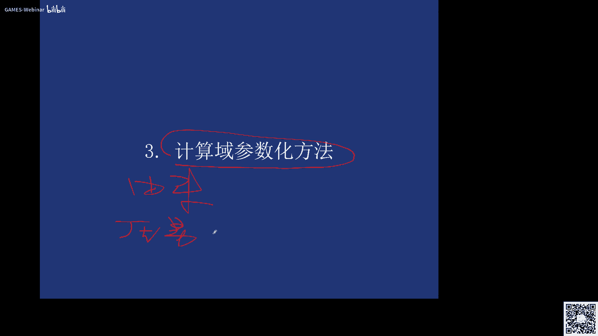

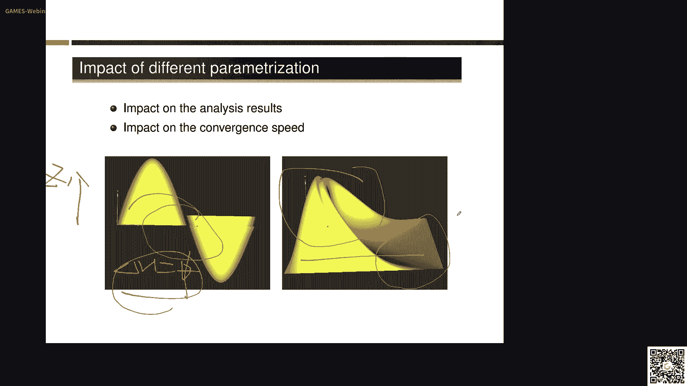

本节课中我们一起学习了等几何分析中计算域参数化的由来、重要性、质量评价标准以及三种核心的构造方法（约束优化法、变分调和映射法、边界重参数化法）。这些方法是实现高质量等几何仿真不可或缺的前处理步骤。