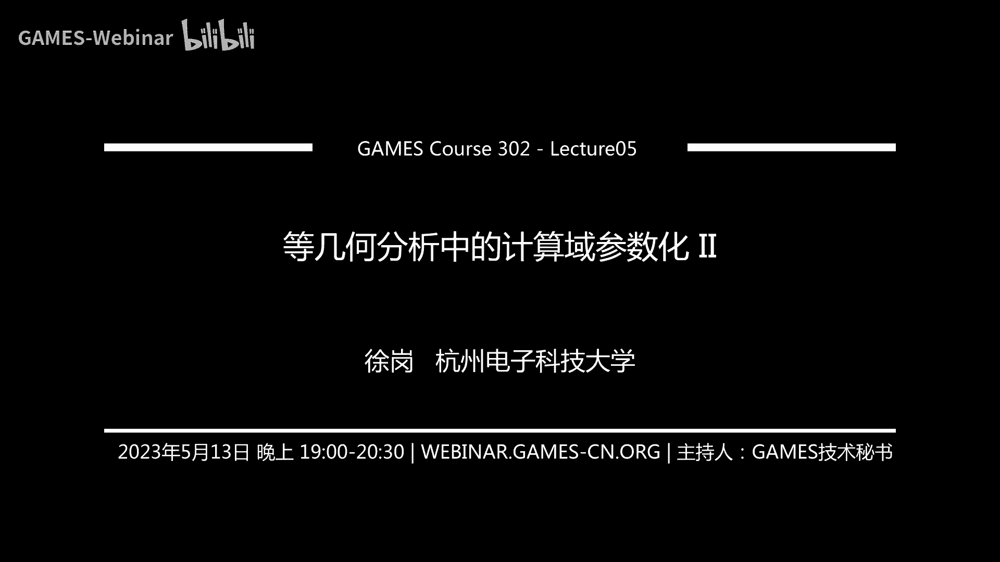
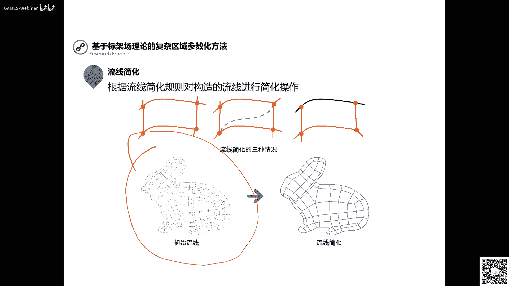
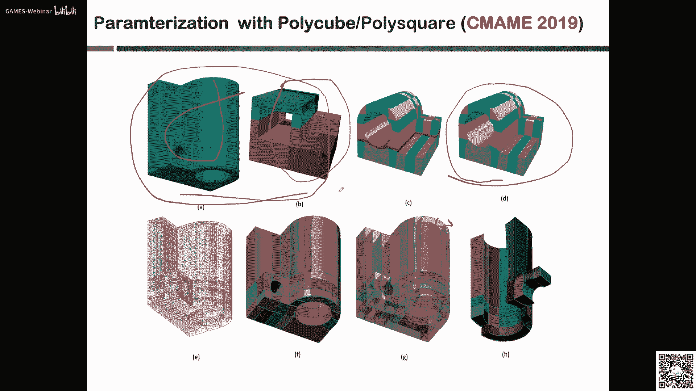
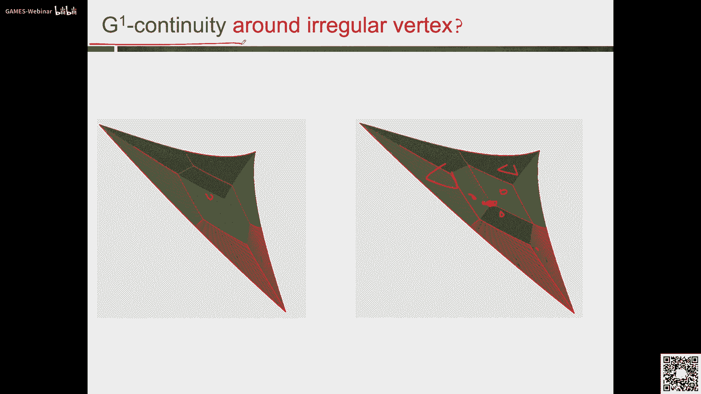

# GAMES302-等几何分析 - P5：5. 等几何分析中的计算域参数化 II - GAMES-Webinar - BV1dM4y117PS

一个介绍，我们上次课呢给大家介绍了呃，这个就是面向整体和分析的，这个计算与参数化的这部分内容啊，上节课呢给大家介绍了这一部分啊，那么我们今天呢就要把这个剩下的部分呢，内容呢给大家这个这把锁。

那么上节课呢主要给大家介绍的就是说呃，就为什么啊，要做这个计算与参数化这么一件件事情，然后呢给大家介绍了这个计算域，参数化质量的一些评判的标准对吧，还有呢，就是我们这个计算与传统化的一些方法啊。

一些方法，那么这边的一些方法呢，就是包括啊一些这个用手绘画的方法，变分调和的方法，对吧啊，还有这个，这个边界重新参数化的方法啊，那么实际上大家通过前面一次课的学习啊。

应该对我们这个呃面向整体和的这么一个区域，拆分化这么一个问题呢，有了一个大致的一个理解，那我们这次课呢就把我们后面的这部分内容啊，主要是面向一些复杂区的一些传统化的，一些工作给大家再介绍一下。

包括里面啊这个参数化这个问题里面，所面临的一些开放性的一些问题，我们也想给大家呃这个呃介绍一下啊，让大家呢包括对后面这个研究问题的选择啊，啊也有一些这个这个嗯体会。

那么首先呢我们介绍这个基于股价的这么一个，平面区域的参数化，那么实际上这个工作呢是我们团队许金南老师，在博士期间啊，因为徐老师呢是这个科大，这个陈华莱老师和邓建松老师团队啊，嗯毕业的啊。

所以他在博士期间呢，就做了一部分这个等级合同分析啊，这个参数化方面的一些工作啊，那么他的这个基本的思路啊啊非常简单啊，他说我们说的就是对于这么一个平面区域，啊，说明对于我们一个平面区域。

我们啥时可以先构造出他的这个呃，股价的出来啊，然后呢对这个股价进行一些简化，进行一些简化，根据这个简化呢，我在这个股价的这个信息呢，就显得比较简洁对吧，然后根据他的一些分支的长短啊，或者一些规则。

然后进行这种区域的剖分啊是吧，它上面引入这些，这样呢我通过这个区域的剖分对吧，然后呢再，这些东西啊，然后包括根据这个曲率啊，或者一些骨架圆半径的人做做一些这种扣分，这样我就可以把这么一个呃符的这部分。

一个区域啊，分成一些小的去对吧，然后呢，再对这些小的区域分别进行这个呃，参数化的构造，那你可以用我们前面讲的一些这种呃，离散的控制方法来进行构造啊，也可以啊，也可以通过一些呃把我们前面讲的对吧。

对单块啊一些约束优化，或者其他的一些方法来进行这种高质量的控制，都是可以，那么首先呢这边呢呃实际上也就是说我们前面，你如果只是如果对这么一这这块区域对吧啊，就这么一个平面参数域啊，平面计算域。

如果你把它当做一个区域来进行，技术参数化的构造，实际上是非常困难对吧，因为他本来这个o啊这些都比较复杂的啊，那么现在呢我就可以哎大家嗯进行分解啊，分解成一些小的区域啊，然后呢。

再对单个的区域进行这种参数化的这种构造，那么首先这边的这个骨架是什么啊，让大家呃如果学过前面的一些课程，我想里面会有给大家介绍一个叫做中轴的概念，对中轴的概念啊，什么是中轴，对啊。

中中轴的话实际上就是唉，就是啊和我的这些边界点啊相切的，我可以构成一个内切圆对吧，那些这些内切圆的圆心啊，它就会形成这么一个呃一些曲线段啊，那我就可以呃就构造出这么一个中轴出来啊。

当然这个中轴它可能在某些局部区域，是还是非常复杂的，它实际上是很难用于我们这边的这个区域分解，对吧啊，区域分解，所以说呢后面呢我还需要对他做一些简化啊，做一些简化，然后比如说就简化成这个样子啊。

讲完这个样子，这样我们就可以把它用起来，把它用起来，那么做了一次这么一个简化之后啊，做这么一个简化之后，后面的我就是需要进行这个呃区域的分解对吧，啊区的分解，那么这边的这个区域分解它是怎么做的啊。

他怎么来做的呢，啊他上也是宝，这是我们中轴上的一个分支点对吧，一个分支点，然后这是一个内切圆的一个圆的一个虚线啊，然后这个虚线呢实际上就是说呃，他这边会有两个相切的点，p一和p2 。

那么像我这边的这个区域的分割啊，我就按照这个p一和p2 的，p一和p2 的这两个点呢，作为我的两个这个呃分割点分割点，然后呢我就可以把这俩连起来啊，这样的话这就会分出一个子区域出来对吧。

就这块区域好用的一个字取出来，那么这样的话上，也就是说可以就可以完成我这个区域的分解好，那么这边是一些一些例子对吧，像这么一个类似手动模型啊，那就把它可以通过这个中轴路信息。

把股价的信息啊把它分成啊这么几块区域啊，一个是这个还有这些松子的区域都喷出来，包括蝴蝶的模型对吧，它也是可以按照这种思想的啊，把它分解成一些子虚，那后面的实际上就是。

我只要对单块来进行参数化的构造就可以了啊，就可以，也就是说刚才说了，实际上是对于这些模型，我们是很难用片单块的这个，参数化去进行构造的对吧，所以要进行这种区域的分解啊，那么像我们后面讲的这些方法呢。

都是呃基于这种区域分解的思想，来做这个参数化啊，那么这边是一些一些例子啊，就是说这边呢比如说我用呃，对于这么一块区域种调和影射啊，那我们前面讲的这个变回调和的方法。

还有我们这个讲的一个啊非线性优化的方法，还有这个就是这个呃建良老师啊，他们提出的这种基于股价分解的方法啊，那么他们之间呢做了一个比较好，可以发现对于简单的几个还可以对吧，就是两个方可能区别不大。

但是如果对于后面这两个复杂的模型啊，复杂的模型可能就会被产生诶，对于我们这个，如果你是只用单片的这种非线性优化来做啊，他是龙的质量还算还是还是还是挺，还是不怎么好对吧啊，而且他这个优化的时间啊。

各方面实际就是成本呢也是比较高的，成本也是比较高的啊，那么说对于对于这个，我说若是我们这种分辨的方法的话啊，分配的方法用国家分配的方法啊，那么我们说到的这个结果呢，包括质量啊，还有这个时间上。

我想应该都是嗯嗯会得到比较大的提升，比较大的提升，当然我们也可以基于这两个结果对吧，一个是呃非线性约束啊，约的约束优化的方法啊，还有这个基于股价分解的方法，可以在上面去纠结相应的呃一些pd对吧。

然后我们可以来比较一下他们的误差，比较一下他们的午餐啊，可以发现啊，就是说嗯，就是说我们在这个基于股价，这种多片的分解方法，那我们会得到精度更高的一些结果，精度够高的一些结果。

那么这边呢是基于股价的这么一个，平面区域的传统化啊，三但对于某些更复杂的一些模型对吧啊，是用这种基于股价的方法呢，可能还是有一些局限性啊，还是有一些局限性，那么后面呢我们呃就做了一个工作啊。

就是说我们怎样去对这种任意拓扑的，这个二维区域啊，二维计算域来进行这种区域的参数化的啊，我们这个是在2018年啊，一个semi上的一个工作啊，那么像我们这个呢，实际上就是首先提出这么一个问题啊。

就是就是说我给如果给你一个呃，平任意拓扑的平面区域对吧，它的这个边界呢，是我们的一些样条曲线来组成的啊，就这个不同颜色的这个红的蓝的，绿的这样条曲线就分段了啊，那我怎么样把内部它的这个这个这个这个区域。

用一些小的啊，第二条曲曲，曲面片或者北热曲面片把它给填起来啊，就是如果说白了就是这么一个问题啊，就是这么一个问题，那么对于这么一个问题啊，对于这么一个问题，那么我们怎么样啊，怎么样去去去做呢，啊。

但我们希望最后得到的还是一个高质量的一个，参数化啊，实际上我们这边呢主要就是呃，就是想的就是说呃我最后得到的这个参数化的，我们期望的这种方法需要满足哪些，哪些满满足哪些要求啊，需要满足哪些要求。

我想第一个呢就是说呃首先是要保边界啊，就说啊我输入这个是一个样条的边界对吧，样条的这个啊二维的边界，曲线的边界，那么我更希望呢，就是我们最后生成的这个参数化的结果呢，肯定要精确保持这个边界啊。

否则这也背离了我们这个等几何的初衷对吧，等几何的初衷上手，包括后面也有一些一些呃一些课题组，然后提出了一些呃，无论在这个法则求解方面等等方面啊，基于这个等几何的这么一个思路来做的，提出一些新的方法啊。

但是很多时候人就可能在保边界，或者各种方面的都是呃放松的一些要求啊，所以说呢我想呢就是说很多就是还能，或多或少呢我觉得和等级合的初中啊，还是有所有所偏离的，有点偏离，那么第一个就是要保变电商。

我觉得这也是我们整体核呢提出的，一个非常高的一个要求啊，非常高的一个要求，另外呢我们希望呢能够啊能够达到一种呃，自动达到自动达到一种嗯，免疫性的一个一个一个要求啊，连续性的要求，比如在它的内部呢。

我们新闻还是呃不仅仅就是虽然是高阶的对吧，但不仅仅是c0 ，连续的c0 就是嗯嗯前面讲过吧，那就是位置连续对吧，位置连续，我们希望最起码要达到c一或者g一啊，这种更高阶的。

可是c2 或者g2 的这种联系是吧，g2 的联系啊，那么研究生呢，我们希望它能够自动的去满足我的一些，连续性的一些要求啊，当然我希望最后这个分割曲线啊，就是说我就是我这个每一块这些蓝色的线对吧。

这些蓝色的线就是我每一片的这个这个，边界线嘛，也就是我们把它称为一个分割曲线对吧啊，分割曲线，那么我希望这些分割曲线，它也是要是一个自动化的构造的一个过程啊，而且大家我最后生成的这个参数化的结果呢。

还是应该是有一个满足我的单色性啊，他的这个嗯这个片的大小比较均匀啊，啊对吧，然后我这个等差结构要尽量的垂直啊，啊那么这些要求这些要求，也就是说我怎么样才能提出一个呃好的一个方，法，一个框架来。

然后去满足这些要求啊，就是我们我想这就是我们一个好的参考方法，他说嗯他要有的一些一些一些一些这个性质，这样啊，那么我们这边呢首先提出了一个叫做呃，通过一些呃我想叫做呃local global。

还是global和local的那个思路啊，就是我从先去呃全局去考虑问题，然后呢再考虑局部的一些构造啊，那其实这种思路在我们图形学里面也有一些呃，相应的类似的做法对吧，比如在网格的参数化里面啊。

呃可能这个我就不知道，这个刘刘利刚老师，在以前在这个一些这个几何处理的课里面，有没有讲啊，他他们上提出了一个非常呃非常有影响力，非常大的一个方案，就是一个local global的一个网络参数化的呃。

一个思路对吧，那我们像我们这个框架呢，我们的思路呢是以我们觉得可以成为一个呃，global local一个思路啊，也就是说我是怎么样的先考虑呢，就是说怎么样能够把这些区域内部的，这些蓝色的线啊。

就这些分割线我先能够构造出来，分割出来啊，我完成这个区的分割之后，实际上我后面的工作就相对比较简单了对吧，相对来说比较简单了啊，那么所以呢我们就提出了这么一个框架啊，那么这个框架主要有这么事故啊。

第一步呢，首先我就是为了生成一个高质量的一个呃，区域的参数化啊，所以呢我需要进行一些呃，进行一些这个预处理啊，这个主要是我在对我的编辑啊，特别是一些比如间谍啊，这个曲率比较大点的地方呢。

我希望能够把这个边界这个给你的这个边界，然后c这个，那个那个对这个边界进行分割一下啊，那么第二步呢就是也是非常重要的一步啊，我觉得第二步呢就是我怎么样去呃，把这么一个二维区域，它的内部的这个拓扑划分啊。

就是说它的拓扑信息啊能够构造出来，top划分也构造出来啊，主要是目前嗯这也是我们结构化网格生成啊，无论就包括像这个四边形网格或者六面体网格，里面非常重要的对吧，我怎么样能够去上层这种拓扑划分啊。

那么第三步呢就是说我根据你划分出来的，对吧啊，这么这个拓拓扑信息啊，我怎么样能够来生成啊，这个高阶的这个曲面片的它的这个水划分啊，他的风格啊，就是我这些蓝色的线我怎么去构造对吧。

也就是说即使我把这个内部分成一节top，那么这个蓝色的线，它的形状到底应该是什么样的啊，那么山我们这边呢主要是做了一个呃，全局优化的思路来做啊，全局优化的一个思路来做，那么这个全局优化的思路对吧。

那么我如果把它做好之后呢，那么实际是呃后面呢就相对比较简单了对吧，相信说我每一片我怎么来构造，高质量的那一部分片的这个产品化啊，分配的产品化，那么这边呢我们主要是用了一些啊，局部优化的一些思想啊。

局部优化的一些思想，那么通过这个例子啊，我们也可以看一下，就是我们的基本的一个流程啊，首先呢也就是说我要把给你的这个边界啊，在这个区域是一个有两个quick的对吧，咱这个中字对吧，在这边有两个洞啊。

那么它是两个规格的，那么商，我就说怎么样，能够把这个边界再做一些预处理啊，分成一些呃，边界比就是这个红色蓝色，绿色就是我的分段曲线对吧，可能你原来给的这些取代信息啊，并不是并不是这里这样分段的啊。

但是为了生存，最后生成高质量的参数化的结果呢，我还是希望能够做一些预处理，然后得到呢呃一个离散的就是折线啊，也说我可以把这些呃北的曲线的这个收尾端点，这个首尾相连，然后就成了一个多边形的边界嘛。

折线然后通过这个折线，我通过一些嗯是变形网格生成的一些结果，并且网格生成方面的一些结果啊，来来方法来做啊，但我们这边这个方法呢，主要是基于一个突分割啊，还有用的一些模板的方法啊，近视图分割。

还有模板的方法来做的啊，然后把这些啊相当于我就可以啊，给你输入的这个多少有多少段对吧，然后就可以把它内部分成拓扑信息，把它构造出来了啊，构造出来之后，下面我们就说的就是一个全局优化的思路。

也就是说虽然你这个内部的拓扑划分，我知道的对吧，但这些蓝色曲线的这个形状嗯，应该是什么样子才是最好啊，那么这边呢我们就用了一个全局优化的思路，然后去构造这里的分割曲线，就是这些蓝色的蓝色的线啊。

通过这个全球化的思路得到这些蓝色的线之后，后面我们就是可以对每一片啊，来枯燥鲜艳的参数化，当然我们这边呢为了生成高质量，对名片呢，我们也做了一些局部的优化，包括我怎么样去满足呃。

整体的比如一个c一的连续性啊，包括在七点，除了g一的连续性，我们这边都有一个有所考虑啊，然后最后呢我们就可以得到一个唉相对比较高，高质量的一个一个参数化的一个结果啊。

那么这就是我们在18年的新版本上面的，这个文章，他得到他的这个基本的这个思思路和框架，就是这个样子，那么首先就是预处理对吧，那么像我们这边呢，就是啊做了一个北大的提取啊。

然后这个北大的提取实际是呃计算力学的人，就是在等你和分分析求出之后呃，他们他们说说其实一共一个词啊，就是说实际上这个在我们计算几何里面，是非常非常经典的一个做法对吧，也就是说任何一条呃变调曲线。

那么是曲线，我都可以把它转换成这个北的曲线段对吧，或者尤里边的曲线段的一个形式对吧，那么12这个里面呢，我就他这些转换前后，他们之间的控制关系，顶点的关系，我可以通过一个矩阵转换了。

就可以把它实现对吧啊，但我另外一个呢就是说呃可能我有些曲线对吧，它有些地方曲率曲率比较高啊，或者有些尖点啊，有些拐点啊之类的啊，所以这个时候呢我需要对它进行这个呃，进行把这个曲线来进行一个分割啊。

比如这么一段曲线，我希望能够在这些呃，这个曲率比较高的地方分成两段，对，恰好我对我后面这个参数化的质量的构造呢，就比较方便非常方便，那么我们这边对应了这个北泽西非的这方面呢，我们用了呃。

应该是我的博士生老师啊，不说了，我王昭老师，浙江大学王国章老师说提出了在1984年啊，提出了什么叫做这个啊汪氏公式啊，汪氏公司那个三，就是呃在这个我们c计算机和领域啊，就国际上非常有名的一个专家。

这个嗯，run goldman在他的呃计算几何的这个书里面提出了，就是呃你把这么一个公司啊，就是这个本人离散的方法呢，把它称为啊忘了formula one formula啊。

那么就是我们这个汪国涛老师啊，他在1984年提出了一个北京曲线细分的，这么一个公式，就说我怎么样啊，给你一个解析的光滑的一个北的曲线，或者怎么样来进行分段对吧，那么因为这个离散化呢。

在这个顶部的这个球交的这个复制里面，是非常重要的啊，非常重要的，所以我们这边呢也是借鉴了这个公式，来进行这种啊，北大曲线的这个分这个这个细分啊，当然这个细分呢，我们不可能分成很多的这个折线段啊。

就可能嗯也通过一条可能分成两段，三段就差不多了啊，那么也是通过我们这些预处理呢，实际上就是我们后面这个高质量的这个，参数化的构造呢，提供了很多的，更打开了一个更好的一个基础啊，那么经过这些预处理之后。

我们后面就说怎么样来进行这种啊，呃拓扑信息的这个错误划分的这个构造对吧，top划分的这个构造啊，那么这边呢我们主要就是第二步了对吧，你说我怎么样能够去得到这个离散的这个，这个边界之后对吧。

离散的边界之后，我怎么来生成里面的这个这个四边形划分啊，四边形划分啊，那么这边的这个思路呢主要是利用了一个呃，一个一个一个突分解啊，近视图分解的一个思路啊，那么实际上这个边呢我就说呃。

我们首先先勾到这个离散的边界对吧，然后就是把你就提取了这个本的曲线的首尾端，点，把它依次相连，就会得到这么一个离散的一个折线对吧，离散的一个折线啊，然后作为一个第三直线，如果有洞的话对吧。

我还可以首先要把这么一个独联通的区域，把它转换成一个单连通的，我就可以我现在插入一些一些点嘛啊，插入一些点，把连起来就可以变成一个单连通区域对吧，那么后面的就是我们用的这个，近似图分解的方法啊。

也说对于这么一个单联通的区域，我们可以呃，通过一些通过这么这篇文章里面，这个近视图分解的这个算法，我们就可以实现啊，对这个区域的一些呃区域的分解，那么当然这个区域的分解呢。

就是我的每一个区域它都是近视图的啊，所以近视图呢就是它有些区域可能不是啊，严格凸的啊，不是严格凸的啊，啊为什么要用近视图啊，因为你全部都用严格图的话，你可能就是说得到了这个分块的时候要非常多，对不对啊。

所以大家都可能应该了解这个凸的这个，多边形的一些定义对吧，to的多边形的一些定义啊，比如说如果你都是这种呃这种呃，如果这种严格图的话，你会得到很多的这个区域的，这个最后的这个分开的区域啊。

所以我们这边这种近视图啊，主要是现在16年的这个这个一个韩国人啊，他们提出了一个a c d的一个分解fs啊，fs，那么有了这么一个近视突，分解的一个结果之后呢，后面呢我们就可以啊。

对每一个分割后的这个近似的突区域啊，我们就可以用这个相应的哎，相应的这个模板法啊，这边我们也主要是采用了呃，2015年发展，在这个应该是ug上面，发表了c d f上面的一个一个没办法。

然后他就提出了对于任何一个区域啊，无论你是四边的还是五边的还是三边的，主要是从二到右边的这个区域啊，给你这个每条边上的另一个的这个曲线的，这个离散化之后，它里边的这个四边形网格啊，都可以通过一些呃。

固定的模板把它给生成出来啊，那么实际上这个，我觉得这是一个非常好的一个工作啊，12是为后面我们很多的这个呃，四边形网格的生成的，打下了一个非常重要的一个基础，就是模板啊，就是模板啊。

而且他们最后构造出了这个边界，构造出来这个边界，他们所生成的这个通过他的模板数据连接，它可以满足什么啊，起点数目更少啊，起点数目更少是最少啊，不是更最少的啊，那么这是一个非常好的工作。

我觉得啊既非常简单又非常实用，而且他们的代码呢也都开源了啊，严重，实际上就是说我们通过这么一个得到的什么，这个突分割这个子区域，像是它基本上我们都可以把它看成是呃，就是说22~6边的这么一个区域啊。

那么所以后面呢，我们就可以用这么一个模板法啊，这么一个基于python，这么个方式去生成里面的这个四边形网格，生成四边形网格构造对吧，而且我最后得到这个起点数目是最少的啊，是最少的。

那么有了这么一个次次课呢，我这就是可以得到啊，这么一个呃，区域的内部的这个四边形网格的跑分对吧，破分，而且我最后得到了这个所有的这个起点啊，它的这个度数啊都是三或者五七点的，度数是三个货物对吧。

也就是说我生成的这个四边形网格里面啊，要么是度数是四的，就是我的regular这正规的这一点对吧，都是度数为四的啊，那七点呢要么就是三，要么就是五啊，那么实际上就是这个这个东西会保证什么呢。

啊这为我们后面生成这种呃g一的啊，这种平面参数化，也就是满足基于连线的这个平面参数化呢，呃电的一个非常好的一个基础，最大的一，那么实际上就是我生成这个网格的话，它我我只是现在过构造出了top信息嘛对吧。

所以说我们还可以，也可以用一些类似于拉普拉斯光线的一些方式，来进行对这个生成的网格来进行光顺对吧，我通过一些迭代的方式来做啊，这边我就不多介绍，那么上次我把它构造之后呢，就是后面就出问题了。

我现在只是构造了出了什么啊，构造出来只是这些黑这些黑色的线，就是只是这些什么啊，直直边对吧啊，因为我们对于在传统化问题里面，实际上就是一个高阶的对吧，就说这些蓝色的线，我怎么去去生成的啊。

就这些蓝色的线我怎么去生存，我现在生成的只是这些直边的这些线对吧，那些这些蓝色的线我怎么去生存，就是后面我们这个全局优化所要解决的问题啊，需要解决的问题，也就是说这个里面我们刚才讲了。

就说一个好的一个参数化的方法，它在它应该满足哪些要求啊，第一个呢就是说呃它能够实现这种啊，内部满足内部的联系连线的要求对吧，你最起码也要c一或者g一吧对吧，另外一个就是说还是要这个这个分割曲线。

能够自动化的构造啊，所以而且呢就是说这些patch的，我生成的这个就是每个蓝色的这些边界曲线，所围成的每一个每一个不同的patch对吧，他们之间的patch的这个面积啊啊什么error问题嘛。

就是面积对吧，他应该是尽量的啊大小一致啊，大小一致啊，所以说呢我们我们说的就是说呃，我们先看最后一个问题，就是我怎么样才能够达到这种，让那个patch的这个面积啊，尽量的一致啊，尽量的这个相等啊。

尽量的相等的啊，那么我们后面呢就提要，要首先要解决这么一个问题，好解决这一问题啊，然后这个问题我们当时我在做这个工作的时候，当时我们也查了很多文献，因为好像当时也是很少有人去来做这个问题啊，就是说呃。

我给你一个区域的一个边界的一个b样条，表示对吧，那么有这这些这么多条变样条曲线或者，北的曲线所围成的这块平面区的，它的这个呃这个面积它怎么来算啊，怎么来算啊，那么我们实际上要是找到找到很多。

也好像也没有找到一个类似的一个一些公司，或者一些类似的工作啊，那么我们在我们这个工作里面呢，实际上就是呃去做到这件事情，去做到这件事情，那么上我们就最后推导了一下，就是给出了啊，对。

给出个对于一个由n个n段背的曲线组围成的，这么一个平面区域，他最后的呃这个面积啊，最后的这个面积表达可以写成这个形式啊，那么这个公式呢，它里面的这些呃这些量啊都是什么啊，都是和我的这个边界北的曲线的。

它是什么控制顶点相关的一些量啊，那么像我们可以通过一些呃推导呢，就可以得到这么一个结论啊，得到这么一个结论，那么有了这么一个结论之后呢，我们实际上就处理觉得这也是挺好的对吧，就是说我可以。

然后给你边界的这么一个n条的北的曲线，我就这个它所围成的这个区域的面积，我可以用一个显示的公式把它给算出来啊，把它给算出来，那么商这样我们就可以来去解决我们的问题了，对吧啊。

就是我们可以用一些全局优化的思路，然后去解这么一个问题啊，也是我们的目标啊，我们的目标啊，第一个就是均匀性啊，也说我这些蓝色的曲线，它所围成的这个面片的面积啊，这个应该尽量的一致对吧。

所以说呢呃我多少块是知道的对吧，我总的面积也是知道的对吧啊，那种的面积，就是我刚才用那个公式就可以算出来啊，然后除以一个n就可以了是吧，那么每一块的面积和这个n的面积要，所以说要尽量的尽量的接近。

或者平均面积要尽量接近就好了对吧，我们也是以这个来作为我的一个均匀性的，就这个碳纤大小尽量一致的，均匀性的一个度量啊，那么另外一个呢就是我这个曲线啊，它这个对这个分割曲线这个蓝色的线。

它的这个这个形状呢要尽量的对啊，要尽量的去尽量的好啊，那么简单的好，那我们就说啊，采用了一些这个和曲线相关的一些能量函数，主要就是它的一阶导数和二阶导数的这个范式，呃。

加起来这么一个一个内在的一个能量啊，那么上涨了就它的一个意义，就是一个y或者是什么啊，曲线这个蓝色的曲线非常的短，这个蓝色的曲线它的这个上面那个曲率啊，就是尽量的简单的对吧，你不能弯来弯去了是吧。

也就这样的话，像就是说我们这个对于这个分割曲线的，它的形状的一个要求，另外一个呢就是说哎，这个分割曲线，它们之间的应该也应该满足一些什么啊，这个，在这个焦点地方，他应该满足一些这个连续性的一些要求啊。

特别是呃气象连续啊这些一些要求啊，那么我们上就是这边的，就是我们的三个目标函数啊，那么有了这三个目标函数呢，那么就大家一贯的做法对吧，就是把这三个目标函数加权，然后去纠结这么一个优化问题就好了。

优化问题就好，那么这样的话实际上就是说诶，我就给你一个边界的这个北热曲线，围城融合区域对吧，它的面积我们可以算啊，然后我就会优化出来这些蓝色分割曲线，我知道它的拓扑信息了，拓扑分割就是这样子的对吧。

但这些蓝色的曲线我怎么怎么怎么构造，就是我们前面这个优化的空间，去这个框架去进行优化，然后呢就会得到它内部的一个呃大小均匀对吧，满足我的一些连云要求的啊，这么一个内在的啊，这么一个一个构造啊。

那么有了这些分割曲线的构造之后啊，分割曲线的构造之后，实际上我们后面就比较简单了对吧，我们现在就是把这个全局的问题给解决了对吧，那么实际上就是后面就是局部的问题啊，就是我这每一小片尾的它的传统化。

怎么去进行构造啊，怎么进行构造，那么所以说我们我们第四步呢，就是我做来这种用这些局部优化的这个思路，来做这种高质量的这个分片的这个参数化啊，分片的参数化，那么我们的第一步就是我们的第一步啊。

就是说我们首先啊，我们还是希望他要去满足我的呃，在这个边界组织吧，它要满足我的一些正交性的一些要求啊，也是我们首先要构造他这些呃，比如这些绿色的线是我在这个边界上的对吧。

边界上的绿色的点是我边界上的这个控制零点，对吧啊，那我首先要够先构造这些蓝色的控制点啊，那么这些蓝色的控制链接嘛是什么要求呢，啊第一个就是正交，就是所以说明就说诶边界两层的啊，就是这是一层这一层对吧啊。

那么也就是说这个蓝色的中式的，还有这个绿色的，他们要尽量的在一条线上，并且呢或者这个边界尽量到垂直才可以啊，然后这是我们的一个一个一个出发点啊，那么后面呢我再通过一些局部的c一的这种。

内在能量减小的方法，然后去构造什么啊，去构造这些红色的啊，这些红色的控制点点啊，那么这些红色的控制权，我这个就是要满足我的c连续性啊，另外一个呢就是我让他的这个每个patch啊，啊。

它的这个自己内部的这个参数化的质量要高啊，才可以啊，然后得到之后呢，我们再可以找到这些呃，可能你最后剩下的参数化可能某些嗯，因为如果这个边界比较奇怪啊，或什么之类的啊，还是有一些是无效的一些看法啊。

那我们可以通过一些方法把它找出来，然后呢再对它进行一个恢复，或者进行一个呃整体的一个优化，这样来做，那么首先呢，就是我怎么样在这个regular的这个区域啊，我实现呃这个c一的连续性约束啊。

然后在这些起点的地方啊，我刚才说的就是我们这个起点呢只有度数是三，或者度数是五的这个地方对吧，然后来实现这种基因的连续性的这个构造，那么当我们在边界上的正交性对吧。

那么正交性实际上就是他们这个两个切向对吧，应该相互垂直对吧，相互垂直也说他不在这个点击为零吗，所以我们这边用到一化的，我就是让他们这个点击啊，从这个尽量的小啊，尽量小啊，采用这么一个优化的这个思路啊。

那么所以呢我们后面的就是相当于啊，相当于我怎么样去在满足我的c e连续性的，这个条件下啊，我去让他们这个呃尽量的嗯，这个相应的控制顶点啊，在这个分割群上，它这个相应的这个偏移啊，尽量的少量的少是吧。

我们就通过了得到这么一个一个优化函数，那么对于这个基因连续性啊，基因连续性啊，什么叫做基因连续性啊，那么对于曲线两个曲线来说，记忆连续呢就是在这个点数，如果是基于连续的三，就是指他们的什么啊。

切向连续对吧啊，切向连续，那么期间来学，也说他们的这个切线方向是一致的，但可能在这个地方，除了这个偏导的大小不一致对吧，那么对于曲面来讲的话，可能就是在这个点的时候。

他可能这边有三张曲面或者五五张曲面对吧，五张曲面就是在这个曲面出来，它有什么切平面，连续切平面连续对吧，这个基连续在这个里面，就是在我们这些高质量的，这个就像这个汽车车身啊，这些曲面的构造里面啊。

g一或者g2 ，平时g3 的都有着非常高的一个要求，非常高的要求，嗯嗯那么我们实际上这边呢，我们希望能够在这个平面单动画里面呢，我们希望在这些啊起点的地方，就是这边的这个起点就是p00 对吧。

那这个点的地方，因为从这个点出发，我这边有五条边对吧，所以它是一个起点，在这个起点地方呢，我希望能够达到g一连续啊，那我希望能够达到g一连续，那么这么一个基连续我怎么能够达到呢。

啊实际上我们在计算几何里面有一些呃，呃可以把可以把这个显示的约束啊，把它给写写出来啊，也就说呢首先呢哎我从呃，我这些控制顶点啊，就是从p00 s包括s一对啊，s12 这些绿色的绿色的点啊。

还是s14 s13 啊，啊这些他们之间呢呃要满足一个关系啊，就这么第一个线性关系上，也就是说呢就是这条边啊，这条边可以写，要写可以写成它的呃，周围的一些边的线性组合的一些形式啊，就是这个条件对吧。

但这个阿尔法和贝塔呢我们是呃有一些嗯，通过一些规则可以算出来，这是我的第一个基于连续的一个约束条件啊，是这个样子对吧，参数的几何意义呢是这样子啊，另外一个呢就是还有一个要求，还有一些要求啊。

对对就是合伙的这个p一和s一对吧，这是我的p1 ，这是s一对吧，他的呃就是相当于在这个点的周围，它的这些边啊，他应该也是要满足啊，要满足一些一些一些一些约束的，就是四条边啊。

四个向量它们之间的也要满足一定的约束条件，就这个约束条件啊，那么实际上我们可以把这些约束条件，可以把这些约束条件都写成一个呃，按照最后编程写成一个线性系统的一个限制啊，那么写成这个现象系统之后呢。

我们可以发现诶这边就是我的我要求的嘛，对吧啊，就是我这些呃蓝色的点对吧，是我的自由度，蓝色的是我的自由度，我要求的就是这个p113 p112 ，p111 啊，是啊我啊这些对吧，蓝色的点是我要求的。

因为其他这个红色的点对吧啊，是固定的对吧，然后这些呃绿色的点也是固定的，而是通过我们前面的什么这个全局优化，求出来的对吧，所以我要求的就是在这个起点周围，说的那个蓝色的这五个点啊，对于我们这个例子来讲。

那么这蓝色这五个点呢，实际上就是一个，我们可以把它写成一个5x5的矩阵啊，再乘以五个向量嗯，这么一个分量向量对吧，然后呢回到这个右边向右变向呢，当然也是和我们的一个这边的一些信息，相关的对吧。

所以说我最后得到的会得到这么一个呃，一个线性系统啊，但这是对于这个起点的度数是五的情况对吧，那对于我的起点度数是三的情况呢，我就变成一个3x3的一个协议是吧啊，只要我们可以证明可以证明啊，对于这种呃。

等七点数目和三或者七点数目归位的情况，我们可以证明这么一个类似的一个线性系统，就是它和阿尔法一贝塔一，阿尔法二贝塔尔瓦和贝塔三等相关的对吧，这是一个对角的，但不是完全不是完全对角的这么一个矩阵。

它这个它是存在唯一解的啊，它是存在唯一，也就是说它的矩阵它是可逆的啊，这是可以的，但是存在唯一解，这个我们可以把它证明出来啊，因为比较简单吧，都是3x3或5x5的啊，那么我觉得他这个统一的一个表达。

所以说啊我们前面通过这种top划分，我所得到的我们这个起点数目什么啊，特步划分所得的这个节点数目都是要么是三，要么是五对吧，没有没有这个呃六啊或者七的情况对吧，所以说呃所以说我们最后得到了这么一个解了。

这个基于连续性这个题我们是可以求解的对吧，所以它就形成一个诶非常好的一个闭环啊，非常好的一个闭环，那么有了这个之后呢，我们上学我们后面不可以啊对吧，我们得到联系约束的这些呃。

这个两层的控制定点把它构造出来的对吧，那内部的控制定点我怎么来求呢，内部的红色的一点对吧，那我就可以通过一些能量低要发的方法，并且满足局部联新联系的就是这些，我现在就是把蓝色的对吧，还有这个棕色的。

绿色，绿色的，我们这些都都求出来了啊对吧，现在可以看下面的任务，就是把这些红色的点把它给求出来啊，红色的点把它给求出来啊，那么这些红色的点头像就是说啊，我通过这么一个演示，我们前面的一个呃能量是类似的。

就我们上节课讲到这个内在曲线的内在能量，曲面的内在能量是吧，类似的，然后去求解啊，而且这个求解呢，我们也是可以把它能量极小问题，把它变成一个线性系统的问题啊，进行求解啊，求解也是非常快的。

然后构造出个红色的这些点之后呢，那么后面呢实际上就是说我们就说怎么样去，因为可能有些地方还是呃无效的传统化对吧，对于一些特殊的一些例子对吧，所以后面呢我们要做一个检查。

把这些呃特别有自交这些地方的这些patch，但是参数化啊，把它给找出来，然后呢就是一个恢复，所以说呢我们上节课讲过了，上次，对于一个北的曲面来讲对吧，他的这个参数化，他的这个参数化呃。

它的这个参数化的这个雅各比，我们实际上是可以把它写成一个什么啊，形成一个2n减一，2n减一次的这么一个一个更高阶的这个呃，本人了这么一个表达的形式对吧啊，所以说我只要让让他的雅阁比有剑就可以了啊。

比如说我这个雅各比啊一定是什么啊，大于它的最小值，大于它的最大值对吧，所以说我只要我要让这个雅克比大于零，我只要让什么啊，不知道让这个最小的这个价格比啊，这个阿尔法二言里面，这个系数里面最小的那个值。

是最小的那个值是什么啊，大于零的就可以了，对啊，你把它给放松一下啊，那我们这边怎么来解决呢，就怎么来做的呢，这样就是啊用了一个，用了一个对数的这么一个一个发函数的类似法，函数的一个做法啊。

来去优化它的一个亚克力啊，有人来的感啊，然后最后呢就可以得到一个有效的一个，参数化的一个结果，我们这边是一些例子吧，啊这边就是我们呃通过一些呃北热曲，把一个边条转化成一些北的曲线的组合对吧啊。

然后可能做了一些北大的细分啊，得到这么一个边界的一个北的表示，这是你的输入对吧，通过这个输入，然后我把这首尾相连，会得到一个离散的啊一个折线的一个表示，然后通过我们这个四边形网格的划分。

特别粗糙的视频形网格划分对吧，通过通分解啊，假设模板啊，我上就可以得到这么一个内部的拓扑划分，通过这个脱口范围呢，然后我再通过一些呃，通过这个全局优化的方法得到，构造出这个最优的这些蓝色的分割曲线。

对吧啊，这些蓝色的分割检验，确定了三个我每个片的形状已经，所以说那后面呢就是我对每一个呃小的面片，我怎么做到一个高质量的战法问题啊，然后呢把它做出，当然我们也和那个许昕兰他们。

在那个15年的这个工作对吧，做了一个比较，就是他们基于国家的怎么分割啊，能分到他们分的快速比较少对吧，所以相应的这个质量的方面啊，嗯那我们要呢要比他们更高一点，当然这是另外一个。

就是这个类似于兔子头的一个例子啊，反观念，我觉得还是就是怎么样把这些内部的这个，蓝色曲线啊，把它给构造出来啊，构造出来这边是更多的例子，包括一些数值方面它的区别呃，三用雅各比啊。

还有这个形成的刚度矩阵的条件数啊等等，我们这边都给他做了一些比较，那么这边呢我就因为时间的关系，我这边就呃就跳过了啊，有兴趣的同学呢可以去仔细的看一下，我们的那篇论文。

是发表在18年的新版本上的一篇论文，那么实际上有人就做了这个这个工作之后啊，做了这个工作之后啊，我们说基于这种呃，四边形网格生成的这种图分解，加这个分析的方法啊，是不是最好的了啊。

像我们上次课就不要试试那个呃，第三次课就是讲那个有限元和网格生成的时候，我们提出了一个就是基于标价场引导的，那么一个区域分解对吧，我上次就说，那我们当然也可以把这么一个该大厂引导的，这个这个东西啊。

缺平原的话，中到我们这个整体合的参数化里对吧，参数化，所以说这个这个相应的这个框架呢，就应该是这个样子的，所以说我首先也是啊模型编辑的转化对吧啊，那么最后呢，你先然后呢构造一个类似的一个背景网格。

三角形的背景网格，也得到三角形的方法来做对吧，然后呢我生成这个呃内部的，基于这个背景网格去生成它内部的一些这个呃，对单场对战场或者一些小量相当场对吧，那么根据这个标价厂的这个这个区域，分解的这个方法。

我得到它的起点，生成它的流线啊，做一些流线的简化啊等等啊，然后我就可以把这个区域内部分成一些呃，比较高质量的一些事件形区域，对吧啊别说这样的话，我会的，我会得到一个什么啊。

和我们前面基于这种突分解的方法相比呢，就是我在这个边界上，它首先是没有七点，而且在这个边界处呢，它可能会满足一些奇这个垂直的一些要求对吧，然后呢我得到这么一个四边区的划分之后。

我就可以和我们前面那个方法一样，对对每个分块我就可以来做，也就是说我们这边呢这些分割线呢，就是我们这边所生成的这些流线对吧，就这么流线啊，所以说把这种标价厂的这种区域划分的收入，应用于我们这个等几何的。

这种复杂区的传统化啊，分享的是一个非常自然啊，那么这边呢我虽然也是类似的，因为我需要对它的边界来做一些微处理对吧，然后呢呃我们通过这种呃给到三角化，甚至要生成一些背景网格啊。

因为我在这个三角文化网格上来，去剪一个相应的呃求解线的第二场，就是通过求解这么一个拉格拉斯方程，然后得到他的一个旋转最小的一个标价层，对吧啊，那么通过这个标价场啊，我们就可以进行这种适量场的这个求解啊。

质量场求解，那么这个我也跳过了，因为我们那这个已经讲过了啊，他这个里面要构造要这样，我这边要想说一下，就说我你最后初始通过初始的流线时，剩下的可能是一个比较复杂的，一个相对比较结构，对吧啊。

一个同步划分啊，当然这个脱口划分可能不是，我们因为这个骗术太多了，对吧啊，我们商这边可以做一些呃拓扑结构的一些嗯，简化啊，拓扑结构的一些简化，然后呢就可以把它简化成这个样子啊。

大家可以发现有一边有一些盐，是有一些比较窄的区域，但我们是确实是假化不掉的啊，假发不掉的啊，而且呢像这些区域，比如像这个里面这边还有个小的，在一边切一点对吧，它类似于这种。

像我们可以关键可以通过一些光圈啊什么的，变成变成一个商家的一个起点啊，这样的话实际是对于我们，这个这个地方呢它这一块的这个参数化呢，我们可以生成一个呃比较高的一个参数化对吧。

因为你如果把它一个分成一片的话啊，他这个角点的位置啊，你可以选择对吧，但如果你变了变成这个样子啊，这里面他说我们这个边界这就是垂直本人啊，就垂直的，所以呢，我觉得这也是一个能后面需要改进的一个地方。

那么这次我们就是可以通过，基于标价厂的方法来做，当然是可以啊，那是可以啊，但是如果我们想把这种对战场的方法，把它推广到三维啊，比如说我要做这种大的六面体块的划分啊，目前我想这个无论是在图形学领域。

还是在网格生成的这个方向上，实际是都是一个非常呃困难的问题啊，也是啊一个圣杯的问题对吧，那么当我们可以退而求其次啊，我们家也是在19年的时候有一个工作，就是呃home。

这个上海理工大学这个成龙老师一块合作，包括浙大的黄金老师一块合作啊，把这种poly cube或者poly square的意义在思想啊，用到我们这个面向等几何的这个额，财产化问题里面啊，财产问题里面啊。

实际上是这个poly cube的实在，我们很多的对面体网格生成啊，特别推行学里面是嗯非常经典的一个方法了啊，所以说你说我给你一个数模12 十，我可以生成类似的这么一个类似于豆腐块的。

豆腐块的这么一个polly cube的结构对吧，poly cube的结构，那么有了这么一个结构之后呢，我就可以把这么一个模型分成一些呃，非常说明一些大的六六面体块对吧，大陆六面体块。

那么对面每个六面体块我来再去做相应的呃，相应的这个这个呃相应的这个参数化的构造呢，就比较简单了对吧，就比较简单了，那么实际上这个里面非常重要的一个问题啊，非常重要的一个问题是什么呢。

啊就是说我怎么样才能够去构造出这么一个polo。

那么实际上就是说怎么样才能够拨到这个，play队伍来，并不是一个简单的一个问题，特别是对于这种高质量的这个poly cube，这个构造，高质量的这个pop的构，那么我们这边就是为了生存。

这种高质量的课本呢，我们提出了一些也是类似于一些，优化的一些思想啊，优化的一些思想啊，也就是说怎么样能够尽量的让这个polo quipolo，cube的这个立面几块要尽量的少啊，要进量的少。

那么我们这边呢主要就是说能够希望能够唉。

比如说我们能够把这么一个六的一个block block，这么一个东西把它转换成一个四个四个block，四个blog对吧，那么实际也就是说呢这边为什么会有六个block，因为因为这边的这个高度。

和这边的高度不一样对吧，所以有时候我会额外引出这么两个blog，快来吧好，所以我都如果通过一些优化，能够让他们这个高度相等，那么这样我不就可以就分成四块了吗，啊分成四块。

就是这时候的一个一个一个基本的一个思想，好这边具体的我也不讲了，就是说像我们最后的三，就是也是把它变成中的一些呃发呃，基于这个有向图的一些简化的一些问题啊，然后把它演示归结成了一个约束。

为优化问题来做啊，优化约束优化问题来做，所以说大家可以看到，就是说比如说对于这个模型，这是相应的play game结构是吧，然后呢我最后生成了这么一个东西，所以红色的就是我可以通过一些简化的方式。

可以把它优化掉的啊，可以把它优化掉啊，那么我通过这么一个呃派系结构的简化，然后就可以得到啊，这么一个啊一个六面体块的一个划分啊，就刚才那个例子也是，这里面随着这个红色的这一块啊，都是我可以简化掉的啊。

也是通过这些呢，我实际上就是会得到一个更加干净的，一个六面体块的一个分割对吧，还有呢就是说啊，上我们就可以基于这些分割来生成相应的这个，呃体参数化的一些结果，提倡的这个结果。

相当于我对这边的每天和快手都可以办的，要办的构造是什么啊，我的躯体是我们前面前面第二节课给大家讲的，这个具体结果对吧，每一块我都要把它构造成一些样条体，一些样条体来做才行。

那么现在上这个工作会有哪些问题呢，我想第一个呢就是说啊伤身上的这些快吧，这个还是有些复杂对吧，而且他在有些地方，比如一个圆环的地方，它可能我是没有必要生成，你看这边它算生成的应该是八块对吧。

唉那么商业就是说这些小的块啊，就这边可能它都是一个呃，不是是一种是一个退化的流变体的对吧，有这四个地方，那么12，你说我们实际上对这些地方，可能是没有必要的啊，没有必要的啊。

所以说我们呢就嗯嗯后面又做了一个工作，就是发表在这个啊22年的这个18米上面啊，主要也是和黄健老师的一个课题组，他们合作的啊，那么主要是把这个名叫做close form的这种poly square啊。

把它用到了我们这些i j的这个参数化里面啊，特别是平面参数化里面，那么我这边这个呃closed form的police quare，它实就是把我们这个标价厂的技术，就前面我们讲的这个标价厂的技术。

把它演绎出来啊，这样的话呢，我们说所以说你得到了这个politude的结构呢，就会扩展到一个更加一般的一些结构就破了，终于十close form police scribe，比如这就是一个二维问题对吧。

如果圆环移动这种精确的poly square，你你可能会生成这种这种的一些结果对吧，那么其实这边就是一个交点对吧，然后你也说你最后剩的呢，它可能是一个三角形的三角形的一个结果对吧。

这样的话不就变成一个退化的四边形了吗，啊所以你知道生成的这个高质量在这些地方，它的参数化结果肯定是已经退化了，质量不高了对吧，质量不高的啊，上次对于这么一个角，我们可以把它放松一下。

就相当于种but close form的这种东西啊，三就说我们对于这个我只要中间插入一个，就可以成功一个四边的一个对吧，四条边对吧，这一条边这条是两条边而已对吧，那么有这样的话，我相信这么一个结构。

它实际上它的内部是没有什么啊，没有期限没有期限的是吧，而且呢它更加的这个一般性，更加的灵活对吧，要是我最后生成这个质量呢也是比较高的啊，比较高的，而且呢他有这个特别是一些边界的这个角点啊。

还有这个有趣方面的，他都会表现的会更好哦，表现的会更好，那么所以说我们整个的这么一个框架怎么的，整个的一个框架就是实际上我们说的就是说啊，比如说我先生成一些嗯，怎么样用这个b形式的poly cube。

来生成相应的参数化呢，比如说我首先要要做一些这个cut的一些generation，是再上传一些这些切了，把它切成这个生成一个东西对吧，然后在上面呢来生成一些相应的工作，计算下的标价厂啊。

然后基于这个标价场引导的这个东西啊，或生成相应的这个police quare啊，就类似于这么个豆腐块一样的对吧，那一个一个结构就是它的一个结构，然后呢我在我在生成相应的patch，生成相应的patch。

就是这个变量上啊，就是这个配置，那我但是我生成这个东西啊，可能会诶不是那么干净啊，特别像这些地方是不是那么干净，所以说我这边呢，还是做了一个拍摄结构的一个简化，它写个结。

就简化结构呢就可以简化成这个样子啊，叫成这个样子，所以说这个样子，我觉得就是应该是一个对于这个模型来讲，我觉得是一个最优的一个结果了啊，大家我呃，是不是应该不能再想出其他最后最好的这个。

分割的结果了对吧，这种这种四边结构好能看几个四边形，那么有了这么生动的判决之后呢，像我们后面呢对于每一个呃，每一个patch，我就可以构造这样的，这个ig的这个传统化就可以了啊。

这就是我们这个工作它整体的一个流程啊，整体的一个流程，那么这边呢是呃一些比较的一些例子啊，就是这边呢是我如果用这种传统的这种，exact form的这种place square。

所以生成了这个patch的一些划分对吧，这是基于我们的这个close form的一个方法，来生成的这个划分对吧，大家可以看到这种退化的对吧，这个这里还有这里对吧，包括这儿啊，对吧。

实际上这还有这个地方对吧，这些地方嗯，我实际上都都是已经呃相对于这个结果来讲，对吧啊，大家可以比较一下，我这个这边这个右边的这个结果对吧，它生成了这个呃参数化结果呢，这个质量会更高会更高啊。

那么当我们相应的这个如果把它等拆线，或者这个网格线把它画出来，大家也可以看到啊，就在比如这个区域对吧啊，还有这个区域啊，让我们这个这边都是垂直的对吧，哎这边呢是退化的啊，所以说在这个地方呢。

它的生成的这个呃质量会更高啊，采用我们的方法，那么我们也相应的和在上面的来求解了，相应的这个这个pd的方程，然后比较了他们的一些误差对吧，可以发现啊跟我们这种close form的说的误差了啊。

现在都是一个数量级，但他大概对于这个例子来讲，大概它的误差也小了一半，那么对于这种派系的简化对吧，page的简化，我家这边也是给出一些结果，就说这是呃构造出来的。

就是没有简化之前的就可以看到这个patch啊，这个相应的这个分割线啊，还是不怎么好对吧，那么我提示中，利用我们这个简化的算法所得到了这个分割呢，就嗯非常的好啊，我想在这个分割应该是对这个模型来讲。

也一个最优的一个分割了啊，包括包括这些例子啊，包括这些例子，那么基于我们的算法呢，就可以去呃生成一些相应的一些，比如二维的平面的参数化的一些结果对嗯，首先生成的这些四边形网格的质量都是挺高的。

当然我们也可以来来做相应的一些二维问题啊，是三维问题，三个问题就是我们这个体操动画对吧啊，比如说这边呢实际上就是用我们的方式啊，用我们的方式来做的一些方法对吧，来做了，生成了一些初始的一个结果对吧。

那么这些红色块呢，实际上就是在我们这个快速简化里面的，设置方法里面的，可以把它给简化掉的啊，可以把它给简化掉的啊，这是我们说明了最后的简化的结果，就是这个例子，那么后面两行啊。

那第三行就是我们的它的一些自由式的，拆分化的结果啊，那么后面两行是我们在19年的那个，c mi上的这个工作啊，它所生的这个配置大家可以比较一下对吧，比较一下啊，就可以大家发现我们身上这种快速啊会更少。

比如这个例子，我们这边生成的block是39块对吧，39块blog啊，这边是55个啊，那么对于这个例子，我们是59个，虽然是35个啊，而且相当于我们现，因为呃。

这边我就说不是说那种严格的那种political对吧，它允许这种标价厂引导的这种形式，所以你看它可以类似于扫略的，可以当一直扫过来，然后去找来来来来生成相应的这个参数化啊。

但是实际上我们在构造这种商业化的时候，可能呃你是可以把它看作是单块对吧，甚至我可以把它看成一个类似于扫略体的一个，构造的方式来进行构造建构造，那比如这边是39块对吧，39个blog。

那么这边呢我们只有只有这四个block啊，为什么啊，因为在这个眼镜的这个两个支架这块啊，你看他这个快速是非常多的，我们上次就是支架这一块上，就是只有一就一个blog是一个blog，连上是正义。

这两个blog，我们可以，完全是基于这种省略的方法去进行生成啊，少量的方法来进行生成，这是对于我们这个呃体操的话，我们这边主要做两个工作，主要做的这么几个工作对吧，第一个就是呃把这种police。

power cube的一些思路啊，用到我们这些局面向ig的这个动画里面对吧，对于我们体能，我们前面的包括这个约束优化的这种思路啊，还有这个变化调控的思路啊，我们这都是做过相应的这个体参数化的一些工，作。

体制化的工作啊，那么目前集中化还有哪些问题呢，还哪些问题呢，啊，就是我说后面呢我们这个面向等几何的这个三，重量方面啊的一些开放性的问题啊，我们也是想和大家一块做一个交流啊，一块做一个交流。

火药面临的第一个挑战性问题有哪些啊，就是说实际上我们前面可以用把这种呃，用这种polka的这种思想，是可以得到一些质量还可以的，一个参数化的结果对吧，分化的结果。

但是polly cube它有一个问题对吧啊，并不是说对于所有的对于所有的这个呃模型啊，它都存在一个political pub结构啊，或者并不是说对于所有的模型，我都可以非常鲁棒的。

非常稳定性的啊去生成相应的pluv结构啊，这是基于polituo方法，它的一个呃主要的一个局限性啊，就在这儿对吧，所以我们还是想啊，还是想能够有一个方法它能够做啊，完美的解决。

在我们这种三维结构化题材的结构化，这种结结构化的这种体化的拓扑公道问题，那么像我们说的这么这么一个问题，它实际上就是归结成了一个什么啊，就是我们的六面体，六面体的这个呃。

大块六面体的这个呃突破分的一个问题对吧，突破分的一个问题，那么另外一个问题呢就是体参的话，在这种呃71。71编出的这个，几何连续性的问题啊，比如说我们刚才看到了，这对于我们这个平面参数化来讲啊。

也就是说对于我们曲面的题型来讲啊，他在起点处的这个基于连续性啊，g2 连续性啊，这些几何连续性我们实际上是有非常成熟的，非常经典的一些约束条件来进行，来来可以做的，对不对啊。

但是对于我们啊对于我们这个呃体产生化来讲，对于躯体的这个方法来讲，我怎么样去保证在这些7。7编出的联系啊，我想目前呢还是一个非常重要的一个理论，一个问题啊，此外呢就是对于这种带有这种唉，裁剪曲面的边界。

这种体参数化方法是我刚才讲了，上次一个好的参数化方法，我们还是希望能够啊能够精确保持边界啊，即使你这个曲面的边界对吧，你这个呃模型的边界它是一个裁剪曲面啊，那么我们还是希望周围生物的体内化。

如果能够保持实质这些财产协议，那是最好的，但是可能这个游戏关于理想化了啊，关于理想化了，可能实际上就是说最后呃，这确实一个是一个非常难的一个问题，非常难的一个问题，可能我们可能还是要呃退而求其次对吧啊。

可能不是完美的一个方法去解决啊，但是我能够在工程问题里面能够把它用起来啊，演示好的啊，演示好的，另外一个呢就是说我们啊，虽然我们说体上化是为了干嘛，对吧啊，是为了能够把它这个题材化的结果啊。

或者这个计算与传化结果啊，能够用什么后面一些啊力学的计划，特别是一些结构力学方面的一些计算，对吧，嗯嗯但我们现在的基于的一个我们的输入呢，就是我这个输入的这个边界，它都是cd表示，都是这种局。

那不是曲面的表示啊，所以说我才期望能够，生成相应的这个曲面的这个参数化嘛对吧，去获得体的参数化，但是如果我们能够有一种非常好的，基于这种躯体的复杂模型的造型的方法，那更好啊。

当然我们后面呢这个也为此刻啊，或者大家介绍，我们最近把这个体系分和这种一些几何的呃，交互的一些构造结合起来了啊，来做这种呃，可以实现这种复杂躯体的或者模型的造型啊，造型。

那么实际上对于我们这个一般的题材上，问题就是我希望能够哎构造一个给你呃，模模型的边界对吧，我能够构造出一些呃好的高质量算法，结果希望它在一些内部漆的地方，我能够满足基于连续性啊，之类的这些一些要求啊。

当然这就是变成我们刚才讲的，就像这就变成了我们一个呃一个非常重要的啊，一个一个空间区域的大块，六面体分解的这么一个问题啊，对面体分解的这么一个问题啊，也就是说我怎么样去啊。

目前当然也有一些工作在我们这边，体网格生成里面啊，我可以用标价厂来做啊，但是你看到就是说可能目前很多的这个模型，也就仅限于像这么简单的模型啊，相对于稍微复杂一点的模型啊，我怎么样去呃抽取他的这些企图啊。

构造这些扣分啊，边界线啊，边界曲，边界面啊这些东西呢，实际上就是说目前还是要依赖于一些手工的一，些交互的操作啊，当然就是说理想化的方式呢，就说我怎么样去从啊，这个这个有个标价厂的方法，能够像啊。

现在比较成熟的这个像这个平面表面上啊，目前啊按照我们课题组的这个经验啊，目前应该这些应该都问题不大了啊，那么商务，但是对于这种体的拓扑的划分，拓扑的构造啊，及标价厂的这个引导的这个思路啊。

目前还是呃不通过一些说一些交互啊，还是比较难的啊，当然如果能够通过一些轻交互的方式来实现啊，这种top的分割啊也是可以的啊，还有一个呢就是说呃一些就是我刚才讲的一些，理论上的一些问题对吧。

理论上的一些问题啊，就是现在比如说这种啊基联性我怎么定义对吧，比如说我基连性的这些呃regular的地方啊，就是说对于六面体网格来讲，就是说我从一个点出发，我应该是有几条边，六条边对吧啊。

那么它旁边应该有呃，呃这个点旁边他应该有八个对吧啊，八个单元，八个六面积单元对吧，有多少个面啊，那么实际上他这些面和面之间，线和线之间边和边之间啊，我怎么样去啊，满足这些基于连续性啊。

这个对于这个ranger的地方，我想它应该是比较简单的，应该就是我们这个，曲面情形下它的一个简单一个推广对吧，但是啊但是在这种呃奇异编的地方，或者起点的地方，我怎么样去定义相应的这个记忆连续性啊。

就是一个嗯比较困难的一些理论的，一些问题还是存在的啊，比如这就是立面体网格嘛，但是蓝色的就是它的一些期限对吧啊，那么当然这个期限的这个交点地方，就是它的缺点对吧，那么在这些起点的地方。

还有沿着这些区域线的地方，它的几何连续性，那我怎么样去进行定义啊，对吧，这边就是这个六面体网格的这个立面体网格嘛，这边是它的一个企业结构，对吧啊，这应该是一个比较质量比较高的一个，里面体网格了，对吧啊。

那对于这么一个质量比较高的流媒体网格啊，如果我不找相应的这个体三化表示，或者去体表示的，那在这些期限的地方啊，包括在这些起点的地方，我怎么样去去满足相应的一些，连续性的一些要求呢，啊连续性的这个要求。

这就是我们要先解决一下这个问题啊，咱也就是说呢啊对于原则，其曲线的切一边的地方啊，我想着应该就是可以，把我们这个在平面参数化里面，这种基于连线的约束，可以把它就在这个七七点的这个地方的约束。

可以把它推广啊，我想这个问题应该是不大的，像我们在这方面也做了一些尝试，也做了一些尝试啊，但是啊但是啊就是说如果在起点的地方，我怎么样去，去定义它啊，应该是比较难的啊，这是其一线的地方对吧。

这就是我的呃呃一呃一些期限嘛对吧啊期限嘛，那么在这个期限的地方，我怎么样去定义相应的这个呃，这边商是呃一个类似也是四面体的对吧，它上有这么有有这么几块躯体啊，把它连接对吧。

然后这边呢就是这个内部的检查我的起点对吧，这边有些气边啊，气边为什么起边啊，这边啊因为对吧，因为这边是度数是三的嘛啊，那么实际上它这边实际上就是这三这三块是吧，三块他们算是沿着这个7。7边。

这样去延伸出来的啊，延伸出来的，那么实际上对于在这个期限的地方，它的几何连接，我想可以啊，把这个在这些节点就是平面型下，他起点上面一条件运输条件接连人也是条件，帮他做个推广，应该就可以。

但是啊但是就在这些起点的地方啊，有这个地方我尽量去定义它的记忆与连续性啊，不像这还是一个挺复杂的一个问题，对吧啊，这边讲解我们这几块这几块blog它在这个点处啊，在这个点处这边应该是有三块吧啊一块两块。

三块四块啊，四块这么一个躯体，然后拼凑了这么一个一个一个图形，对吧，嗯嗯但我这边是把这个绿的这块把它挖掉的啊，那么就在这个七点出，我怎么样定义它的这个低频线条件啊，那么如果能是显示的啊，那更好，对不对。

那么12也说了，这边呢我们讲就是给大家介绍一些相应的呃，这个，我们面向登记和分析的参数化问题啊，他面临着目前面临的一些理论上一些困难啊，包括一些一些最新的一些工作，目前也比较多啊。

当时上节课我也给大家列出了，我们引用后面的篇，最早的那天啊，做这个面向i g a参数化问题的一些呃，22年和23年的一些paper对吧，大家可以看一下目前大家都在关心哪些问题，我想后面的一个至于啊。

我想这个整体何往前继续发展，特别是嗯推向这个工程实用啊，一个非常重要的一个一个点呢，就是这个呃面向根结合的这个，计算与参数化的一个构造啊，然后也是和我们面向有限元的一个，网格生成引擎的啊。

这个研发是相对应的啊，这也是我们我们课题组一直在在努力的方向啊，我们希望能够呃第一个就是直接建模对吧啊，我们希望可以提供一些这种基于躯体的，这种直接建模的工具啊，另外一个呢就是间接建模啊。

我们希望通过可以类似于网格生成，可以通过边界啊生成内部的这个呃平面参数化，还或者体三化也好啊，我们希望能够去呃提供这么两个工具，来方便我们，特别是啊计算力学学科的这个老师和同学啊。

来从事登顶和方面的一些研究也研究啊，那么实际是对于这个等级和的实际工程应用，也是有比较大的这个应用类型呃，这个这个价值和意义，但是我们希望在在不久的将来吧，能够把我们这些工具啊能够实用化。

让它成为呃这个面向根据盒的一些非常重要的，一些前处理的工具啊，前处理的工具啊，当然我们也在做，就说啊相应的后处理对吧，也就是说可视化这一块，也就是我们通过整体和分析方法所所得到的，这些c e的数据。

仿真的数据啊，是不是我用传统的这些可视动方法，这个标量场啊，啊矢量场啊，还有这个呃大量草啊，这些数据啊，我都可以用传统的方法来来进行渲染的啊，当然是可以的对吧啊，但是里面也是可以提出一些新的啊。

面向这些新的这些呃等几何的这些法，对数据的一些高阶可视化的一些方法啊，我们也是啊前面做了一些工作，比如说登顶盒呢，实际上我想呢作为一个新的一个cee，仿真求解的手段，对吧，嗯确实给我们无论是做前处理啊。

做计算几何啊，还是可视化的一些联名老师呢，都提供了一些新的一些可以挖掘的，一些方向来做，好像这边是有延迟比较大啊。

