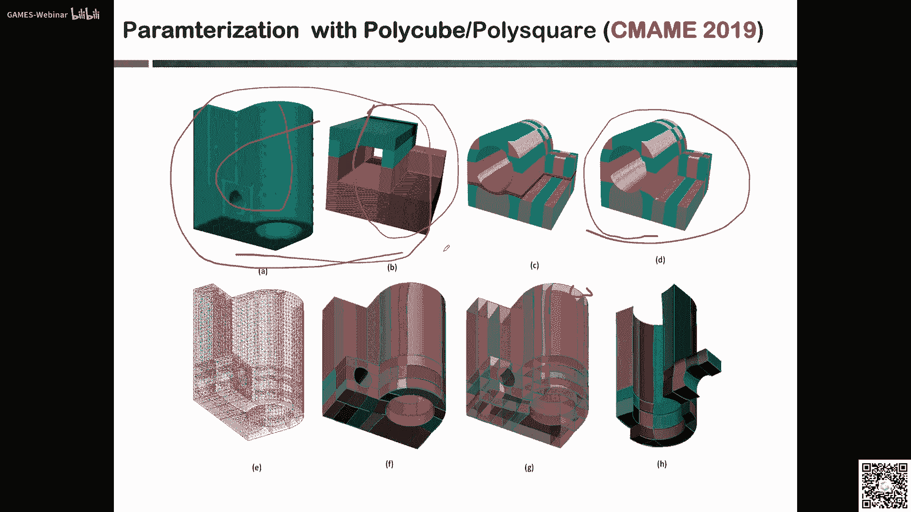
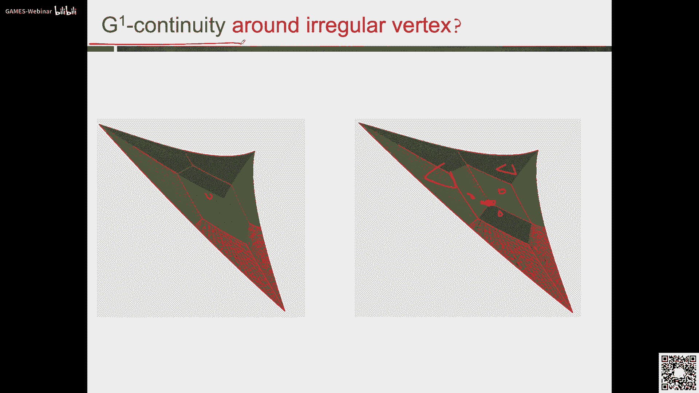

# GAMES302-等几何分析 - P5：5. 等几何分析中的计算域参数化 II 🧩

在本节课中，我们将继续学习等几何分析中的计算域参数化方法。上一节我们介绍了参数化的基本概念、质量评判标准以及一些基础方法。本节中，我们将深入探讨面向复杂区域的参数化技术，包括基于骨架的分解方法、面向任意拓扑二维区域的参数化框架，以及三维体参数化的初步思路。我们还将讨论该领域目前面临的一些开放性挑战。

---

## 基于骨架的平面区域参数化 🦴

上一节我们介绍了单块区域的参数化构造。然而，对于形状复杂的平面区域，直接进行高质量的单块参数化构造非常困难。本节中我们来看看一种解决方案：基于区域骨架进行分解。

该方法的思路是，首先提取平面区域的骨架（或称中轴），然后根据骨架信息将复杂区域分解为多个简单的子区域，最后对每个子区域分别进行参数化构造。

以下是该方法的基本步骤：

1.  **骨架提取与简化**：计算区域的中轴。中轴是与边界至少有两个切点的内切圆圆心的轨迹。原始中轴可能非常复杂，需要进行简化以获得更清晰的分支结构。
2.  **区域分解**：根据简化后的骨架分支点及对应的边界切点，将原区域分割成多个子区域。每个子区域形状相对简单。
3.  **子区域参数化**：对每个分解得到的子区域，应用上一节介绍的变分调和映射或非线性优化等方法，构造高质量的参数化。

通过这种“分而治之”的策略，可以有效地处理复杂模型，并得到比直接全局优化更高质量、更高效率的参数化结果。

---

## 面向任意拓扑二维区域的参数化框架 🔄

基于骨架的方法对于某些更复杂的模型仍存在局限性。因此，我们需要一个更通用的框架来处理任意拓扑的二维区域。本节中我们介绍一个旨在自动生成高质量、分片参数化的系统框架。

该框架的核心目标是：在精确保持输入样条边界的前提下，自动生成内部的分割曲线，并最终得到满足一定几何连续性（如 G¹ 连续）、片元大小均匀的高质量参数化结果。

整个框架遵循一个“全局-局部”的解决思路，主要分为以下四个步骤：

1.  **预处理**：对输入的边界样条曲线进行必要处理。例如，在曲率过大或存在尖点的位置将曲线细分，并将其转换为Bézier曲线段表示，为后续步骤奠定基础。
2.  **拓扑划分构造**：将离散化的边界多边形，通过近似的凸分解算法和模板法，生成内部的四边形网格拓扑结构。这一步确定了区域将被分成多少块以及它们之间的连接关系。
3.  **分割曲线全局优化**：上一步得到的是直边网格，而我们需要的是高阶的样条分割曲线。本步通过求解一个全局优化问题来确定这些分割曲线的形状。优化目标包括：使各面片面积均匀、分割曲线本身光顺、以及在交点处满足几何连续性条件。
    *   **面积公式**：对于一个由 *n* 段Bézier曲线围成的区域，其面积 *A* 可以通过其控制顶点显式地计算出来。
    *   **优化问题**：最小化目标函数 `E = ω₁ * E_uniformity + ω₂ * E_smoothness + ω₃ * E_continuity`。
4.  **面片局部参数化构造**：在确定了所有分割曲线后，每个子区域都是一个由四条Bézier曲线围成的四边面片。这一步对每个面片进行局部优化，构造其内部的参数化。具体包括：
    *   构造边界附近的控制点以满足正交性要求。
    *   在正则点处施加 C¹ 连续性约束。
    *   在奇异点（度数为3或5的顶点）处施加 G¹ 连续性约束，这可以转化为一个小型线性系统求解。
    *   通过最小化内在能量（如拉伸能）来求解内部控制点。
    *   最后检查并修复可能存在的无效参数化（如雅可比行列式为负的区域）。

该框架能够全自动地处理任意拓扑的二维区域，生成高质量的分片参数化结果，在质量和效率上均优于单块优化方法。

---

## 从二维到三维：体参数化的挑战与初步思路 📦

将参数化从二维曲面推广到三维体是等几何分析走向实用化的关键，也面临着更大的挑战。本节中我们来看看体参数化的思路与当前面临的开放性难题。

一种主流思路是借鉴“多立方体”方法。其核心思想是，对于一个三维模型，先生成一个与之大致对应的、由多个立方体块构成的简化结构，然后将原模型参数化映射到这些立方体块上。

以下是基于多立方体方法的体参数化框架：

1.  **多立方体构造**：这是最关键的步骤。目标是为输入模型生成一个高质量的六面体块分解。这通常通过求解一个标量场（如调和场）来引导生成，并可能需要进行复杂的拓扑简化以优化块的数量和结构。
2.  **块内参数化构造**：对于每个六面体拓扑块，将其参数化为一个三变量样条体。这可以看作是对二维面片参数化方法在三维空间的推广。

然而，体参数化目前仍存在诸多开放性挑战：

*   **鲁棒的拓扑分解**：并非所有复杂模型都能容易地生成高质量的多立方体分解。如何鲁棒、自动地生成三维区域的大块六面体拓扑划分，仍是一个“圣杯”式难题。
*   **几何连续性理论**：在三维情况下，如何在奇异边、奇异点处定义并施加 G¹、G² 等几何连续性条件，缺乏成熟的理论框架。
*   **裁剪边界处理**：如何使体参数化精确保持由裁剪曲面定义的复杂模型边界，是一个极其困难的问题。
*   **交互与实用性**：目前高质量的体参数化往往需要一定的人工交互或引导。开发轻量级交互工具或更智能的自动算法，是推动其工程应用的关键。

尽管挑战巨大，但体参数化是连接等几何分析与复杂工程仿真不可或缺的桥梁，也是当前研究的热点方向。

---

## 总结与展望 🎯

本节课中我们一起学习了面向复杂区域的等几何参数化方法。

我们首先介绍了**基于骨架的分解方法**，它通过提取并简化区域中轴，将复杂区域分解为简单子区域分别参数化。接着，我们深入探讨了一个**面向任意拓扑二维区域的自动化参数化框架**，该框架通过预处理、拓扑划分、全局优化和局部构造四个步骤，能够生成高质量、满足几何连续性的分片参数化结果。最后，我们将视野扩展到三维，介绍了基于**多立方体思想的体参数化**初步思路，并讨论了当前在鲁棒拓扑分解、连续性理论等方面面临的重大挑战。

计算域参数化是等几何分析从前处理走向实际应用的基石。从二维到三维，从简单到复杂，该领域的研究不断深入。未来，开发更强大、更自动化的参数化工具，特别是解决三维体参数化的核心难题，将是推动等几何分析在工程领域广泛落地的关键。