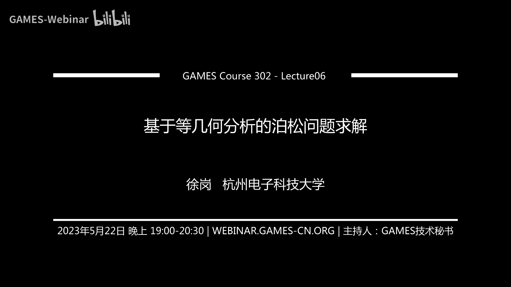
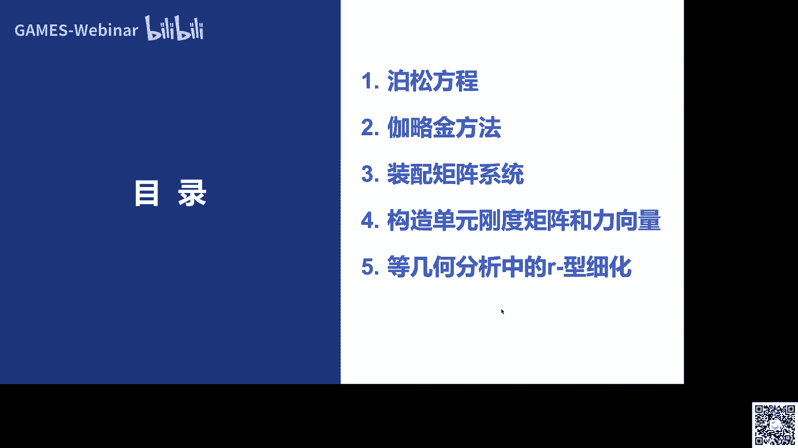
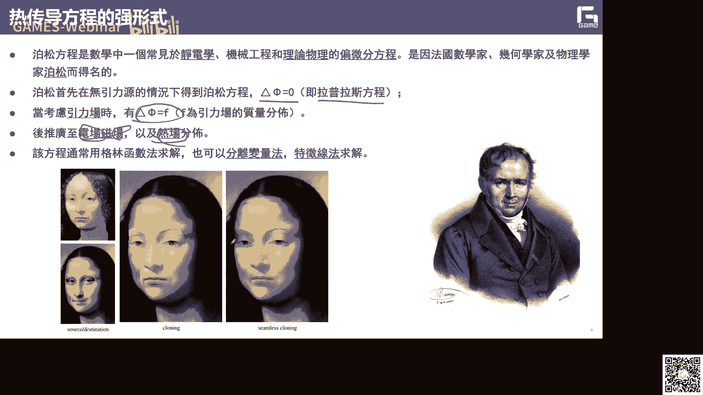
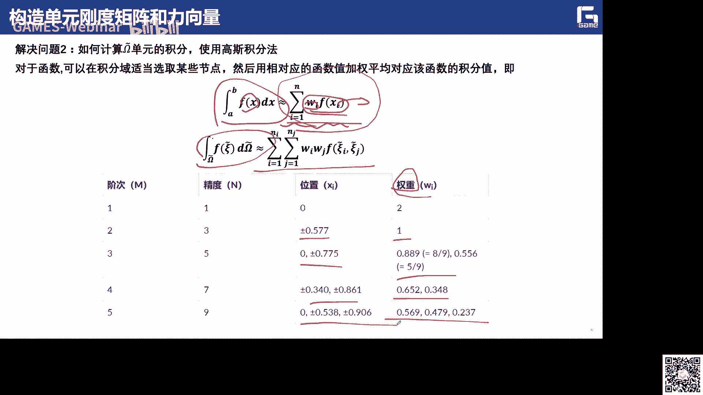
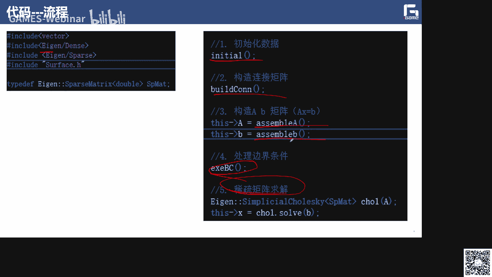
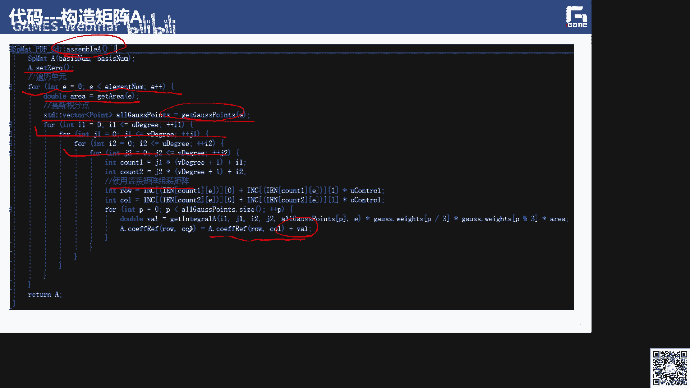
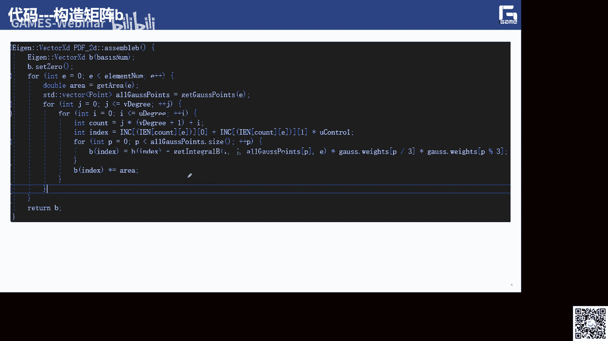
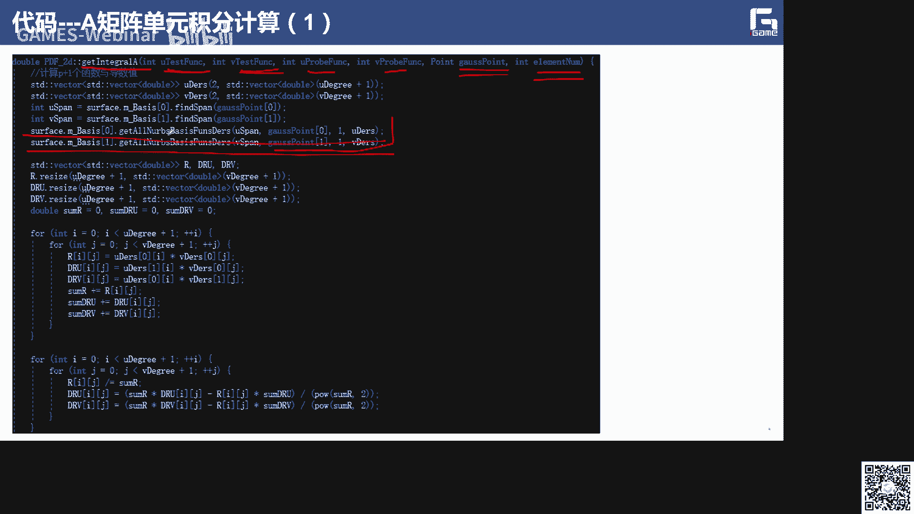
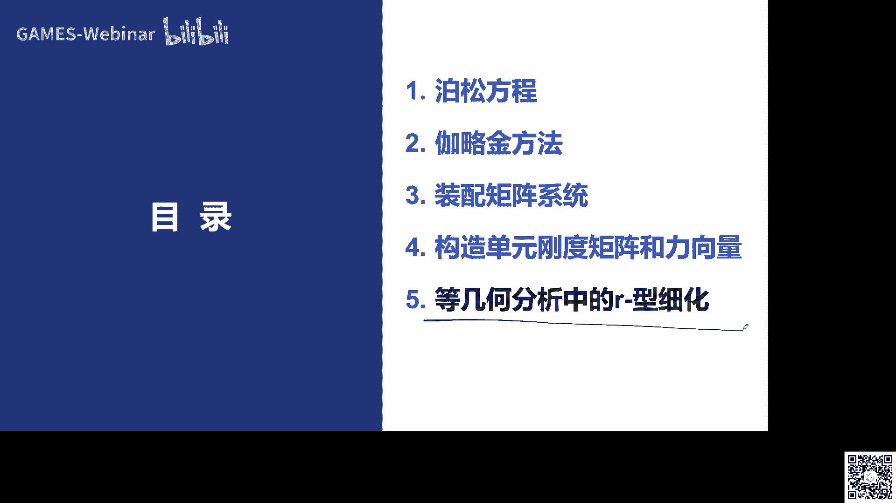
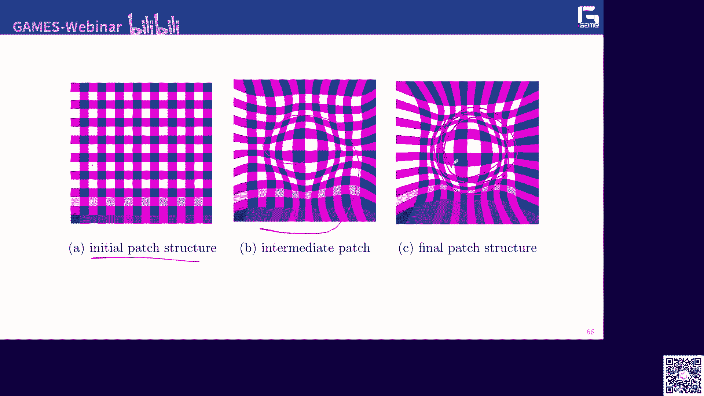

# GAMES302-等几何分析 - P6：基于等几何分析的泊松问题求解 🧮


在本节课中，我们将学习如何使用等几何分析方法来求解泊松问题。泊松方程是偏微分方程中最简单的椭圆型问题之一，广泛应用于静电学、机械工程和理论物理等领域。通过本次课程，你将掌握等几何分析求解偏微分方程的基本思想、流程和代码实现，为后续求解更复杂的力学问题打下基础。



## 泊松方程简介 📖

上一节我们介绍了等几何分析的基本知识，本节中我们来看看如何将其应用于具体问题的求解。泊松方程是法国数学家、几何学家和物理学家泊松提出的，其最简单的形式是求一个函数 φ，满足 **Δφ = f**。当右端项 f 为零时，该方程称为拉普拉斯方程。引入边界条件或力场后，方程变为 **Δφ = f**。该方程可用于求解电场、磁场及热传导等物理场的分布。

在图形学领域，泊松方程也扮演着重要角色，例如图像融合和点云重建（泊松重建）等。



## 热传导方程的强形式与弱形式 🔥

实际上，在等几何分析中，我们考虑在一个计算域上求解偏微分方程，例如热传导方程。其强形式定义如下：

在区域 Ω 内部，满足方程：**-∇·(k∇u) = f**

其中：
*   **u** 是待求的温度场（标量场）。
*   **k** 是热传导率。
*   **f** 是热源函数。

在边界 ∂Ω 上，需要定义边界条件，通常分为三类：
1.  **狄利克雷边界 (Γ_D)**：**u = g**
2.  **诺伊曼边界 (Γ_N)**：**-k(∂u/∂n) = h**
3.  **罗宾边界 (Γ_R)**：**-k(∂u/∂n) = β(u - u∞)**

整个区域的边界是这三类边界的并集。

我们的目标是求解 u。通常无法获得精确解，因此需要数值方法。为了定义弱形式的热传导方程，我们需要引入两组函数：试探函数和测试函数。

试探函数空间 **S** 中的函数需要满足强形式的狄利克雷边界条件。我们希望求得的物理场 u 属于 **S**。

测试函数空间 **V** 中的函数在狄利克雷边界上为零。

将强形式方程两边同时乘以测试函数 v（属于 **V**），并在区域 Ω 上积分，得到：
**∫_Ω (-∇·(k∇u)) v dΩ = ∫_Ω f v dΩ**

对左边进行分部积分，并代入三类边界条件，经过推导，可以得到弱形式方程：
**a(u, v) = l(v), 对于所有 v ∈ V**

其中：
*   **a(u, v) = ∫_Ω k ∇u · ∇v dΩ + ∫_Γ_R β u v dΓ**
*   **l(v) = ∫_Ω f v dΩ + ∫_Γ_N h v dΓ + ∫_Γ_R β u∞ v dΓ**

问题转化为：在空间 **S** 中寻找一个 u，使其满足上述弱形式方程。

## 伽辽金方法：从无限维到有限维 ➡️

伽辽金方法的核心思想是将无限维问题近似为有限维问题。在等几何分析中，有限维近似定义在 B 样条空间 **N** 中。

试探解 **u^h** 和测试函数 **v^h** 都可以表示为 B 样条基函数的线性组合：
**u^h = Σ_{j=1}^{n} d_j N_j + u_0^h**
**v^h = Σ_{i=1}^{n} c_i N_i**

其中 **N_j** 是 B 样条基函数，**d_j** 是待求的系数（未知量），**u_0^h** 是处理非齐次狄利克雷边界条件的部分。

将上述表达式代入弱形式方程 **a(u^h, v^h) = l(v^h)**，并利用 B 样条基函数的性质，可以得到一个线性方程组：
**K d = F**

其中：
*   **K** 称为刚度矩阵，其元素为 **K_{ij} = a(N_i, N_j)**
*   **F** 称为力向量，其元素为 **F_i = l(N_i)**
*   **d** 是待求的未知系数向量

求解这个线性系统即可得到系数 **d**，进而得到近似解 **u^h**。

## 刚度矩阵的装配与数值积分 🧩



由于 B 样条基函数具有高度局部性，整体刚度矩阵 **K** 是一个稀疏矩阵。其装配可以基于单元进行。在等几何分析中，“单元”是节点区间所对应的曲线段或曲面片。

整体刚度矩阵和力向量的装配算法如下：
1.  读入数据（参数化定义、控制点、边界条件）。
2.  初始化全局刚度矩阵 **K** 和力向量 **F** 为零。
3.  遍历所有单元：
    *   计算当前单元的单元刚度矩阵 **K_e** 和单元力向量 **F_e**。
    *   根据单元的局部自由度编号，将 **K_e** 和 **F_e** 添加到全局的 **K** 和 **F** 中。
4.  处理狄利克雷边界条件，修改 **K** 和 **F**。
5.  求解线性系统 **K d = F**。



计算单元刚度矩阵和力向量时，需要计算积分。这涉及两个关键问题：
1.  **如何计算基函数及其导数**：利用 B 样条到 Bézier 的转换以及求值算法。
2.  **如何计算积分**：使用数值积分方法，最常用的是高斯积分法。





高斯积分法的基本思想是将定积分近似为加权和：
**∫_a^b f(x) dx ≈ Σ_{i=1}^n w_i f(x_i)**

其中 **x_i** 是高斯点，**w_i** 是对应的权重。对于高维积分，可以采用张量积形式。





在等几何分析中，积分是在物理域上进行的，但基函数定义在参数域上。因此，需要通过雅可比变换将物理域积分转换到参数域：
**∫_{Ω_e} f(x) dΩ = ∫_{[0,1]^d} f(x(ξ)) |J(ξ)| dξ**

其中 **J** 是从参数域到物理域的映射的雅可比矩阵，**|J|** 是其行列式。

结合高斯积分，单元矩阵的计算流程为：
1.  遍历单元上的所有高斯积分点。
2.  在每个高斯点上：
    *   计算 B 样条基函数及其在参数域上的导数。
    *   利用链式法则和雅可比矩阵，计算基函数在物理域上的导数。
    *   计算被积函数值，并乘以高斯权重和雅可比行列式。
3.  将所有高斯点的贡献累加，得到单元矩阵。

## 代码实现示例 💻

以下是基于等几何分析求解泊松方程的核心代码流程框架：

```python
# 主函数流程
def main():
    # 1. 初始化
    initialize()
    # 2. 构造连接矩阵
    build_connectivity_matrix()
    # 3. 装配刚度矩阵
    assemble_stiffness_matrix()
    # 4. 装配右端项（力向量）
    assemble_force_vector()
    # 5. 处理边界条件
    apply_boundary_conditions()
    # 6. 求解线性系统 K d = F
    d = solve_linear_system(K, F)
    # 7. 输出或后处理结果
    output_results(d)
```

其中，装配刚度矩阵和力向量的函数会遍历所有单元和高斯点，调用计算基函数、导数、雅可比矩阵等子函数，并按照上述流程进行累加装配。

## 等几何分析中的 r-细化 🔧

为了提高仿真精度，通常需要增加自由度。等几何分析中有几种经典的细化方法：
*   **h-细化**：插入节点，增加控制点数量。
*   **p-细化**：提升样条次数。
*   **k-细化**：结合 h-细化和 p-细化。

这些方法都会改变自由度数量。而 **r-细化** 的目标是在不增加自由度数量的前提下，通过优化内部控制点的位置来提高精度。其基本思想是：保持边界几何不变，重新定位内部控制点，使得对于特定问题，数值解的误差最小。

一个早期的 r-细化工作将内部控制点作为优化变量，使用梯度下降法等优化算法，最小化后验误差估计量。后验误差估计量定义为：
**η = (Σ_{k=1}^{n_e} η_k^2)^{1/2}**
其中 **η_k** 是单元 k 上的局部误差估计。

对于泊松问题，局部误差估计与 **|f + Δu^h|** 相关。因此，优化问题转化为：寻找最优的内部控制点位置，以最小化全局误差估计 **η**。

计算后验误差需要计算 **Δu^h**，即近似解 **u^h** 的拉普拉斯算子。由于 **u^h** 定义在参数域上，需要利用链式法则将其转换到物理域进行计算。

此外，还可以通过求解一个辅助的泊松方程来更精确地估计误差本身。考虑误差 **e = u - u^h**，对其两边同时作用拉普拉斯算子，得到：
**Δe = f - Δu^h**
将右端项视为已知，求解这个关于 **e** 的泊松方程，即可得到误差场的一个高精度近似。

r-细化的另一个挑战是优化过程中可能产生自交的参数化。为了解决这个问题，可以引入变分调和映射或 Winslow 映射的方法。这类方法通过求解一个椭圆型偏微分方程来生成光滑且无自交的映射，其中可以通过监控函数来控制内部点的分布密度。

常用的监控函数包括：
1.  **基于曲率的监控函数**：在解曲面曲率大的区域布置更密的控制点。
2.  **基于后验误差的监控函数**：在误差估计大的区域布置更密的控制点。

通过将 r-细化与这类保证无自交的映射方法结合，可以在优化控制点位置、提高精度的同时，确保参数化的有效性。

## 总结 📝

本节课中我们一起学习了基于等几何分析的泊松问题求解。
*   我们首先回顾了泊松方程及其弱形式的推导。
*   接着，介绍了伽辽金方法如何将问题离散化为线性系统 **K d = F**。
*   然后，详细讲解了刚度矩阵和力向量的装配过程，核心在于单元计算、雅可比变换和高斯数值积分。
*   最后，我们探讨了等几何分析中的 r-细化技术，它通过优化内部控制点位置来提高计算精度，并介绍了避免参数化自交的监控函数方法。



通过本课的学习和配套的开源代码，希望你能够理解等几何分析求解偏微分方程的基本流程，并尝试动手实现简单的泊松求解器。