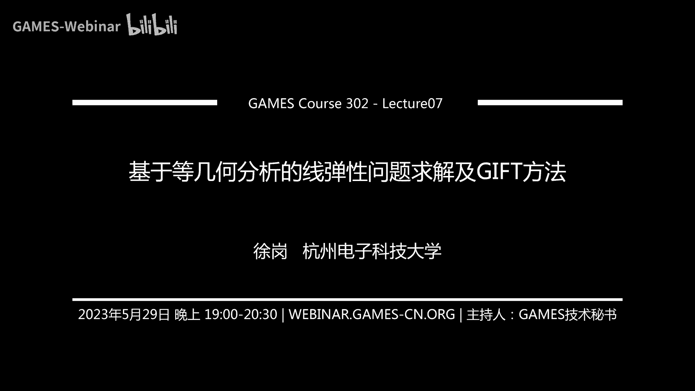
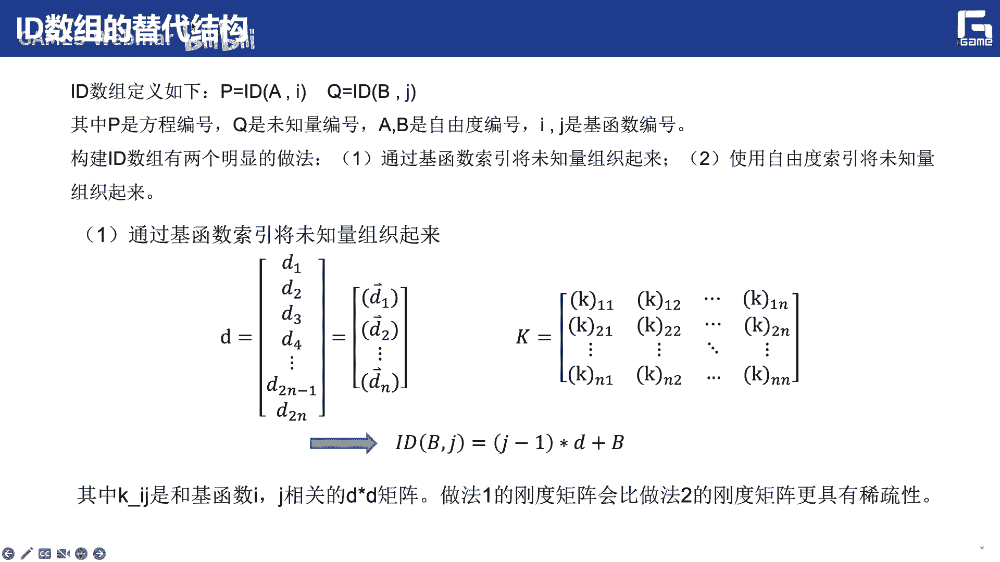
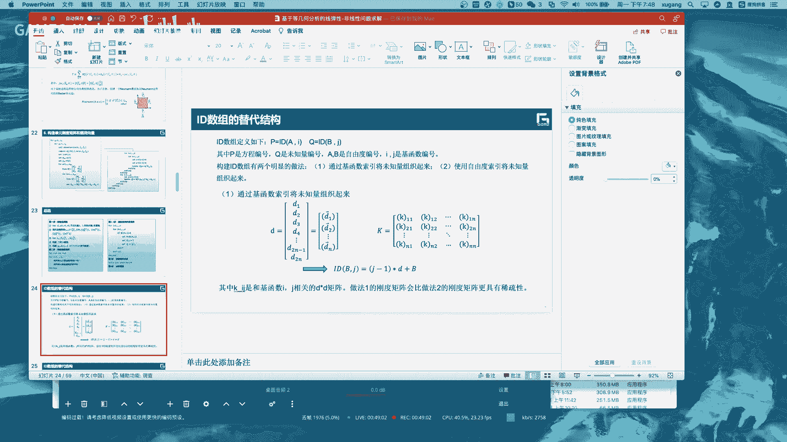
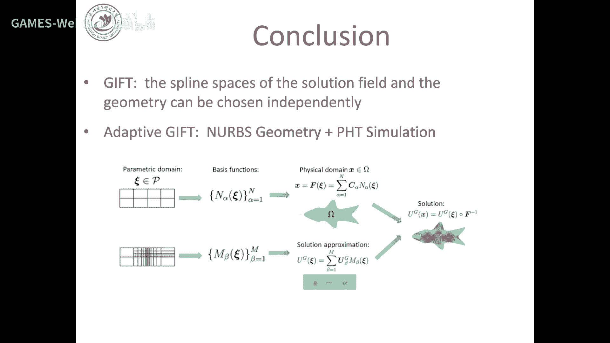

# GAMES302-等几何分析 - P7：基于等几何分析的线弹性问题求解及GIFT方法 🧮

在本节课中，我们将学习如何基于等几何分析框架求解计算力学中的经典问题——线弹性问题。我们还将介绍一种名为GIFT的新型等几何分析方法，它通过解耦几何与物理场的样条空间表示，提供了更灵活的求解框架。

## 线弹性问题的等几何分析求解框架

上一讲我们介绍了基于等几何分析的泊松问题求解。泊松问题是椭圆型偏微分方程的经典代表，尤其在热传导领域。然而，许多同学可能具有力学或计算力学背景。因此，将等几何分析与力学背景联系起来，学习如何求解线弹性问题，显得尤为重要。

线弹性问题与泊松问题在本质上有很多相似之处。因此，基于等几何分析的求解框架也非常接近。本节将梳理线弹性问题等几何分析的主要流程，其核心思想与上一讲类似，也可视为对上一讲内容的复习。当然，线弹性问题与热传导问题也存在一些区别。

### 问题描述与基本记号

线弹性问题在计算力学中具有悠久的研究历史和重要地位。等几何分析在求解此类线性问题时具有显著优势。等几何分析利用高阶连续的基函数，能够获得高质量、连续光滑的应力场，同时保持精确的几何描述。

本节主要讲述二维线弹性问题的求解，仅涉及二维计算域。向三维问题的推广是直接且简单的，大家可以在课后思考。

首先，我们引入一些基本记号。在二维问题中，空间维度 `d = 2`；在三维问题中，`d = 3`。
*   `u_a` 表示位移向量 `u` 的第 `a` 个分量。
*   微分用逗号表示，例如 `u_{a,b}` 表示 `u_a` 对 `x_b` 的偏导。
*   重复下标表示求和，例如 `u_{a,bb}` 表示 `u_{a,11} + u_{a,22}`。
*   对于非对称张量 `A`，`A_{(ab)}` 表示其对称部分，`A_{[ab]}` 表示其反对称部分。因此有：
    *   `A_{ab} = A_{(ab)} + A_{[ab]}`
    *   `A_{(ab)} = 1/2 (A_{ab} + A_{ba})`
    *   `A_{[ab]} = 1/2 (A_{ab} - A_{ba})`
*   `σ_{ab}` 表示柯西应力张量的分量。
*   `u_a` 表示位移向量的分量。
*   `f_a` 表示单位体积的体力。
*   `ε_{ab}` 表示工程应变张量。

线弹性问题的本构方程遵循胡克定律，即应力 `σ` 等于弹性系数矩阵 `C` 乘以应变 `ε`：
`σ_{ab} = C_{abcd} ε_{cd}`

### 线弹性问题的强形式与弱形式

线弹性混合边界问题的强形式描述如下：寻找一个位移函数 `u`（从物理域 `Ω` 映射到 `R^d`），使其在区域 `Ω` 内满足平衡方程：
`σ_{ab,b} + f_a = 0`
在狄利克雷边界 `Γ_D` 上满足位移边界条件：
`u_a = g_a`
在诺伊曼边界 `Γ_N` 上满足应力边界条件：
`σ_{ab} n_b = h_a`
其中，`Γ_D` 和 `Γ_N` 共同构成整个边界 `∂Ω`。

为了将其转化为便于数值求解的弱形式，我们引入试函数 `u` 和权函数 `w`。通过两边同时乘以权函数 `w` 并应用分部积分，可以得到线弹性问题的弱形式表达式：
`∫_Ω w_{a,b} σ_{ab} dΩ = ∫_Ω w_a f_a dΩ + ∫_{Γ_N} w_a h_a dΓ`
其中，`σ_{ab}` 通过本构关系与 `u` 的应变相关联。

我们可以定义双线性形式 `a(u, w)` 和线性形式 `l(w)`：
`a(u, w) = ∫_Ω w_{a,b} C_{abcd} u_{c,d} dΩ`
`l(w) = ∫_Ω w_a f_a dΩ + ∫_{Γ_N} w_a h_a dΓ`
于是，弱形式可以简洁地写为：对于所有在 `Γ_D` 上为零的权函数 `w`，寻找 `u` 使得 `a(u, w) = l(w)` 成立。这实质上就是虚功原理：内力虚功等于外力虚功。

### 向量记法与材料本构关系

为了简化并降低阶数，我们将张量写成向量形式。应变向量 `ε` 和虚应变向量定义为：
`ε = [ε_11, ε_22, 2ε_12]^T`
`δε = [δε_11, δε_22, 2δε_12]^T`
应力向量为：
`σ = [σ_11, σ_22, σ_12]^T`
弹性系数矩阵 `D` 是一个 `3×3` 矩阵，其元素 `D_{ij}` 对应于 `C_{abcd}`。

对于各向同性材料，其材料系数 `C_{abcd}` 可以用拉梅常数 `λ` 和 `μ` 表示：
`C_{abcd} = μ (δ_{ac}δ_{bd} + δ_{ad}δ_{bc}) + λ δ_{ab}δ_{cd}`
其中，`λ` 和 `μ` 与杨氏模量 `E` 和泊松比 `ν` 有关：
`λ = (E ν) / ((1+ν)(1-2ν))`
`μ = E / (2(1+ν))`

由此，我们可以写出应力和应变之间的矩阵关系 `σ = D ε`。

对于二维问题，通常有两种经典假设：
1.  **平面应力**：适用于薄板，其厚度方向应力为零。此时 `D` 矩阵为：
    `D = E/(1-ν^2) * [[1, ν, 0], [ν, 1, 0], [0, 0, (1-ν)/2]]`
2.  **平面应变**：适用于厚度方向尺寸远大于其他方向的物体，如大坝。此时厚度方向应变为零。`D` 矩阵为：
    `D = E/((1+ν)(1-2ν)) * [[1-ν, ν, 0], [ν, 1-ν, 0], [0, 0, (1-2ν)/2]]`

### 基于伽辽金方法的离散化

为了将弱形式转化为大型线性系统进行求解，我们采用伽辽金方法进行离散化。这与有限元法的思想一致，即在有限维子空间中寻找近似解。

我们使用相同的样条基函数 `N_A` 来近似表示位移场 `u^h` 和权函数 `w^h`：
`u^h = Σ_{A=1}^{n} N_A d_A + g^h`
`w^h = Σ_{A=1}^{n} N_A c_A`
其中，`d_A` 是待求的位移系数（自由度），`c_A` 是权函数系数，`g^h` 用于满足非齐次狄利克雷边界条件。

将上述近似代入弱形式 `a(u^h, w^h) = l(w^h)`，并利用双线性形式的线性性质进行整理。由于该等式必须对任意的权函数系数 `c_A` 都成立，我们可以推导出最终的线性系统：
`K d = F`
其中：
*   `K` 是全局刚度矩阵，其元素 `K_{pq} = a(N_A^a, N_B^b)`，这里 `p` 和 `q` 是通过自由度 `a, b` 和基函数索引 `A, B` 组合得到的全局方程索引。
*   `d` 是待求的位移自由度向量。
*   `F` 是全局载荷向量，其元素 `F_p = l(N_A^a)`。

### 单元刚度矩阵与载荷向量的计算与装配

接下来，我们需要计算每个单元（即参数域中的节点区间所对应的曲面片）的局部刚度矩阵 `K^e` 和局部载荷向量 `F^e`，然后将它们装配到全局系统 `K` 和 `F` 中。

局部刚度矩阵的计算公式为：
`K_{pq}^e = ∫_{Ω^e} (B_p)^T D B_q dΩ`
其中，`B_A` 矩阵由基函数 `N_A` 的导数构成，用于计算应变。在实际计算中，我们通过等参变换和高斯积分在参数域中进行数值积分：
`K_{pq}^e ≈ Σ_{g=1}^{n_gp} w_g (B_p(ξ_g))^T D B_q(ξ_g) |J(ξ_g)|`
这里，`ξ_g` 和 `w_g` 是高斯积分点和权重，`|J|` 是从参数域到物理域的雅可比行列式。

局部载荷向量的计算类似，对于体力项：
`F_p^e ≈ Σ_{g=1}^{n_gp} w_g N_A(ξ_g) f(ξ_g) |J(ξ_g)|`
对于面力项（诺伊曼边界），则在相应的边界上进行积分。

装配过程通过一个索引数组 `IEN` 来实现，该数组将局部自由度编号映射到全局自由度编号。伪代码如下：
```
初始化全局刚度矩阵 K 和载荷向量 F 为零
for 每个单元 e = 1 to n_elem:
    计算局部刚度矩阵 Ke 和局部载荷向量 Fe
    for 局部自由度 i = 1 to n_loc_dof:
        获取全局自由度编号 p = IEN(i, e)
        F(p) += Fe(i)
        for 局部自由度 j = 1 to n_loc_dof:
            获取全局自由度编号 q = IEN(j, e)
            K(p, q) += Ke(i, j)
        end for
    end for
end for
```
最后，处理狄利克雷边界条件（通常通过修改矩阵 `K` 和向量 `F` 实现），并求解线性系统 `K d = F` 得到位移解 `d`。

### 等几何分析与有限元分析的主要区别






回顾整个求解框架，如果熟悉基于伽辽金方法的有限元求解线弹性问题，会发现整体流程非常相似。最主要的区别在于：
*   **基函数**：等几何分析使用B样条或NURBS基函数，而非有限元的拉格朗日多项式基函数。
*   **计算单元**：等几何分析的计算单元是参数域中的节点区间（二维为矩形片），映射到物理域后是一个曲面片，而非有限元中简单的三角形或四边形网格单元。

这使得等几何分析能够在保持几何精确性的同时，利用高阶连续的基函数获得更光滑的应力场。

## GIFT方法：几何与物理场解耦的等几何分析 🎁

在介绍了经典的等几何分析求解框架后，本节我们来看一种其扩展方法——GIFT。GIFT旨在打破等几何分析中几何与物理场必须使用相同样条空间的限制，从而提供更灵活、高效的框架。

### GIFT的基本思想与动机

经典等几何分析的核心思想是使用相同的样条空间来表示几何和物理场。这带来了几何建模与仿真分析的无缝集成，但也存在一些约束和问题：
1.  **不必要的约束**：几何模型可能使用高次（如四次、五次）样条精确描述，但物理场仿真可能只需要二次或三次样条就已足够。强制使用相同的高次样条会增加不必要的计算成本。
2.  **样条空间限制**：等几何分析要求物理场与几何使用相同的样条空间。然而，CAD系统主流是NURBS，而仿真领域可能希望使用具有更好数学性质的样条（如T样条、PHT样条），或定义在非多项式空间上的样条。在不同样条空间之间进行精确转换通常非常困难甚至不可能。

GIFT方法的基本思想是：**解耦几何表示与物理场表示的样条空间，但保持它们具有共同的参数域**。
*   **几何映射** `F`：定义在样条空间 `S_1` 上，将参数域 `Ω_0` 映射到物理域 `Ω`。
*   **物理场** `u`：定义在另一个样条空间 `S_2` 上，但同样是定义在同一个参数域 `Ω_0` 上。
*   **最终解**：物理场 `u` 通过几何映射 `F` 复合到物理域上，得到 `u ∘ F^{-1}`，作为物理域上的解。

这意味着，几何可以用高次NURBS表示，而物理场可以用低次B样条、甚至是非均匀节点分布的样条来表示。两者在参数域中具有相同的定义范围，但节点划分、次数可以不同。

### GIFT的优势

与经典等几何分析相比，GIFT具有以下优势：
*   **灵活性**：物理场的表示与几何解耦，可以根据仿真需求独立选择最合适的样条空间（次数、节点分布）。
*   **局部细化**：在GIFT中，可以对表示物理场的样条空间进行独立的h-或p-细化，而保持几何表示不变。这更符合仿真中自适应细化的需求。
*   **计算效率**：由于几何映射不变，其雅可比矩阵等量可以预先计算，提高了积分效率。
*   **兼容性**：可以直接利用现有CAD模型的NURBS几何，同时使用更先进的样条（如T样条）进行仿真，无需进行困难的几何转换。

### 数值算例与分片测试

研究表明，GIFT方法在许多情况下能获得比经典等几何分析更小的误差。例如，在一个泊松问题中，当几何采用非均匀节点分布而物理场采用均匀节点分布时，GIFT的解误差更小。

一个重要的验证是**分片测试**。这是计算力学中检验一种数值方法能否再现常应力/常应变状态、从而满足收敛性必要条件的标准测试。通过分片测试意味着方法具有一致性。

研究证实，在大多数情况下，只要参数化不是极度扭曲，GIFT方法都能通过分片测试，达到机器精度。这为其工程应用提供了可靠性基础。

### GIFT框架下的局部细化

GIFT的一个强大应用是实现物理场的局部细化，而无需改变几何。例如，几何仍用NURBS表示，但物理场用支持局部细化的PHT样条表示。

具体流程如下：
1.  在参数域上求解问题，得到GIFT误差分布。
2.  根据参数域上的误差图，识别需要加密的区域。
3.  仅在表示物理场的PHT样条空间中对这些区域进行局部h-细化。
4.  在新的样条空间上重新求解GIFT问题。
5.  重复此过程，直至满足精度要求。

这种方法实现了真正的、独立于几何的物理场自适应细化，效率高且灵活。

## 总结

本节课我们一起学习了两个主要内容。

首先，我们详细介绍了基于等几何分析框架求解线弹性问题的完整流程。从问题的强形式和弱形式出发，通过伽辽金方法进行离散，推导出最终的线性系统 `K d = F`，并详细讲解了单元刚度矩阵、载荷向量的计算、装配以及边界条件的处理。这一框架与有限元法思想相通，但以精确的几何描述和高阶连续的样条基函数为核心特征。

其次，我们介绍了GIFT方法。它通过允许几何和物理场使用不同的样条空间（同时共享参数域），打破了经典等几何分析的约束。GIFT提供了更高的灵活性，支持独立的物理场局部细化，并能兼容更多样的样条类型，在保持几何精确性的同时，优化了仿真分析的效率和能力。



理解这两种方法的核心思想与异同，对于深入掌握等几何分析及其在现代工程仿真中的应用至关重要。