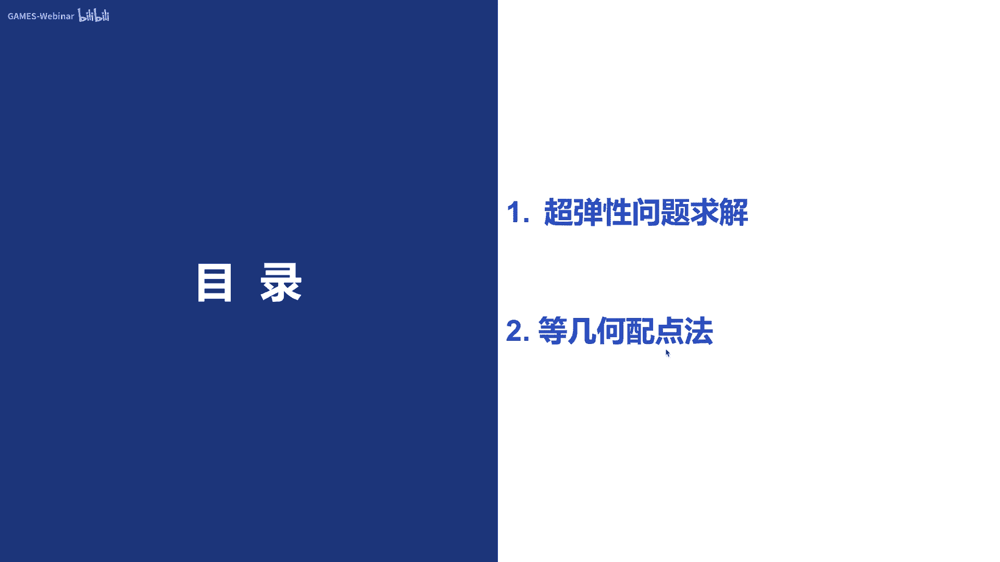
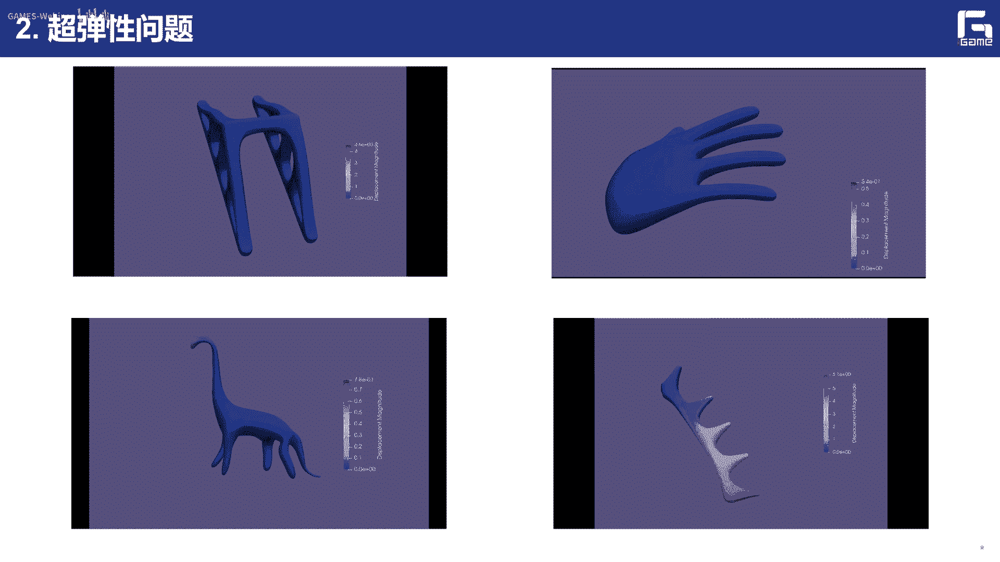

# GAMES302-等几何分析 - P8：基于等几何分析的超弹性问题求解及等几何配点法 🧮

在本节课中，我们将学习如何利用等几何分析框架求解非线性超弹性问题，并简要介绍等几何配点法。我们将从超弹性问题的基本概念和求解框架入手，然后探讨其在静力学和动力学中的应用，最后了解一种更高效的求解方法——等几何配点法。

---

## 概述 📋

上一节我们介绍了基于等几何分析的线弹性问题求解框架及GIFT方法。本节中，我们将探讨等几何分析在超弹性（非线性）问题求解中的应用，并简要介绍等几何配点法。真实世界中的材料行为和受力条件大多是非线性的，因此求解非线性问题至关重要。此外，传统的伽辽金方法需要将问题的强形式转换为弱形式并进行数值积分，而配点法则提供了一种更直接、有时更高效的求解途径。

---

## 第一部分：超弹性问题求解框架 🧱

### 非线性问题概述

在真实的物理世界中，我们遇到的大部分问题都是非线性的。这包括几何非线性（如大位移、旋转）、材料非线性（如超弹性、粘弹性）、稳定性问题（如屈曲）、非线性边界条件（如接触）以及多物理场耦合问题（如流固耦合）。本节课我们主要关注材料非线性中的超弹性问题，这是非线性弹性力学中最基础的一类问题。

### 基本方程

求解超弹性问题，需要理解几个核心方程：本构方程、几何方程和平衡方程。

#### 本构方程

在线弹性问题中，应力（σ）与应变（ε）呈线性关系：**σ = Dε**。而在超弹性问题中，这种关系是非线性的，通常可以写成增量或微分形式：**dσ = D(ε) dε**。这里的弹性矩阵 **D** 是应变（或其它变形度量）的函数。

为了描述物体的变形，我们引入形变梯度 **F** 的概念。它表示物体当前坐标 **x** 相对于初始坐标 **X** 的变化率：

**F = ∂x/∂X = I + ∂u/∂X**

其中，**u** 是位移场，**I** 是单位矩阵。

超弹性材料模型通常由应变能密度函数 **Ψ** 定义，它是形变梯度 **F** 或其相关度量（如右柯西-格林应变张量 **C = FᵀF**）的函数。几种常见的超弹性模型包括：
*   **Neo-Hookean 模型**
*   **Mooney-Rivlin 模型**
*   **Ogden 模型**
*   **Fung 模型**

这些模型描述了应力（如第一Piola-Kirchhoff应力 **P**）与形变梯度 **F** 之间的非线性关系。

#### 几何方程

几何方程描述应变与位移之间的关系。在线弹性小变形理论中，我们使用工程应变 **ε**，它是位移梯度线性部分。对于有限变形问题，则需要使用格林应变张量 **E**：

**E = 1/2 (FᵀF - I) = 1/2 (C - I)**

工程应变 **ε** 实际上是格林应变 **E** 的线性部分。在大变形下，**E** 中的非线性部分不可忽略。

#### 平衡方程

平衡方程源于动量守恒定律。对于物体的运动，需要满足局部微分形式的平衡方程（强形式）。通过变分原理和分部积分，可以将其转换为等效的积分弱形式，这是有限元和等几何分析求解的基础。对于静力学问题，平衡方程简化为内力与外力平衡：**R(u) = F**。

### 等几何离散化与求解

在等几何分析框架中，计算域由样条（如NURBS）精确描述。物理域中的一片高次单元对应于参数域中的一个节点区间。

位移场 **u** 用样条基函数 **Nᵢ** 和控制顶点系数 **uᵢ** 表示：**u = Σ Nᵢ uᵢ**。形变梯度 **F** 和格林应变 **E** 都可以基于此位移表达进行计算。

将位移表达式代入平衡方程的弱形式，并进行离散化，可以得到离散系统方程。对于静力学问题，最终形式为：

**K(u) u = F**

其中，**K(u)** 是刚度矩阵，但它现在是位移 **u** 的函数，因此方程是非线性的。这与线弹性问题中 **K** 为常数矩阵有本质区别。

为了求解这个非线性方程，我们采用牛顿-拉弗森迭代法。该方法需要计算切线刚度矩阵 **K_T**：

**K_T = ∂R/∂u**

在一次迭代中，位移增量的计算式为：

**K_T ⁽ⁿ⁾ Δu⁽ⁿ⁾ = F - R(u⁽ⁿ⁾)**

**u⁽ⁿ⁺¹⁾ = u⁽ⁿ⁾ + Δu⁽ⁿ⁾**

切线刚度矩阵 **K_T** 可以分解为两部分：**K_T = K_d + K_s**。**K_d** 与小位移刚度矩阵相关，**K_s** 则与大变形引起的几何刚度相关。迭代过程持续进行，直到残差 **F - R(u)** 满足收敛容差。

以下是超弹性静力学问题的等几何求解流程：
1.  **输入**：输入样条几何模型，定义材料参数和边界条件。
2.  **细化**：通过插入节点或升阶，增加计算自由度。
3.  **初始化**：设置收敛容差、初始位移猜测（常设为0），初始化全局切线刚度矩阵和残差向量。
4.  **单元循环**：
    *   遍历所有计算单元。
    *   在每个单元上，计算单元切线刚度矩阵和残差向量。
    *   将这些单元量组装到全局矩阵和向量中。
5.  **求解**：求解线性方程组 **K_T Δu = Residual**，得到位移增量 **Δu**。
6.  **更新与判断**：更新位移 **u = u + Δu**。检查残差是否收敛。若未收敛，返回步骤4进行下一次迭代；若收敛，则进入下一步。
7.  **输出**：输出位移、应力等结果，并进行可视化。

### 实例与比较

通过一个厚壁圆柱模型受向下力作用的例子，展示了超弹性分析的变形和应力结果。研究表明，在相同单元离散密度下，超弹性模型的求解精度通常高于将其简化为线弹性模型的精度，并且随着网格细化，误差收敛更快。

等几何分析在处理大变形问题时具有优势，因为它使用光滑的样条基函数，避免了有限元中因网格扭曲而需要重新划分网格的问题，在保证精度的同时提高了计算效率。

---

## 第二部分：超弹性动力学问题 ⏱️

上一节我们介绍了静力学问题，本节中我们来看看动力学问题。物体的运动方程可以表示为：

**M ü + C u̇ + R(u) = F(t)**

其中，**M** 是质量矩阵，**C** 是阻尼矩阵，**R(u)** 是内力向量，**F** 是外力向量，**ü** 和 **u̇** 分别是加速度和速度。

对于时间积分，有显式和隐式两种方法。显式方法计算简单，但稳定性受时间步长限制，需要很小的步长。隐式方法（如Newmark-β法）无条件稳定，更适合求解非线性动力学问题。我们采用隐式Newmark-β法。

在Newmark-β法中，下一时间步（n+1）的位移和速度通过当前步（n）的量表示为：

**u_{n+1} = u_n + Δt u̇_n + (Δt)² [ (1/2 - β) ü_n + β ü_{n+1} ]**
**u̇_{n+1} = u̇_n + Δt [ (1 - γ) ü_n + γ ü_{n+1} ]**

其中，**β** 和 **γ** 是参数。将这些关系代入运动方程，得到一个关于 **ü_{n+1}** 的非线性方程。同样使用牛顿-拉弗森法迭代求解。得到 **ü_{n+1}** 后，便可更新 **u_{n+1}** 和 **u̇_{n+1}**。

动力学求解框架包含两层循环：外层是时间步推进，内层是每个时间步内的牛顿迭代。等几何分析在此类问题中同样高效，得益于其用较少自由度实现高精度的特性。

---

## 第三部分：等几何配点法简介 ⚡

前面介绍的伽辽金方法需要将强形式的PDE转换为弱形式并进行数值积分。本节中，我们介绍一种不同的方法——配点法。等几何配点法直接在PDE的强形式上求解，无需弱形式转换。

其核心思想是：在计算域内精心选择一组配点（Collocation Points），然后要求PDE在这些点上严格成立。对于未知场 **u**，我们仍用样条基函数展开：**u = Σ Nᵢ uᵢ**。将展开式代入PDE，并在每个配点 **ξ_k** 处赋值，就得到一个线性方程组：

**L [ Nᵢ (ξ_k) ] uᵢ = f(ξ_k)** 对于所有配点k

其中，**L** 是PDE的微分算子。求解这个方程组即可得到控制顶点系数 **uᵢ**。

配点法的关键在于配点的选取。常见选择有：
*   **Greville 坐标点**
*   **Demko 坐标点**
*   **超收敛点**

例如，对于p次样条，Greville坐标点 **ξ_i** 定义为节点向量中连续p+1个节点的平均值。

配点法的优势在于：
1.  **高效**：避免了数值积分，计算量通常小于伽辽金方法。
2.  **直接**：直接处理高阶导数，而样条基函数的高阶连续性正好满足此要求。
3.  **与等几何契合**：非常适合等几何分析中使用的光滑基函数。

当然，配点法也有挑战，例如得到的系统矩阵可能不对称，施加复杂边界条件相对困难。但对于许多问题，特别是线性PDE，它能显著提升计算速度。配点法也可与牛顿迭代结合，用于求解非线性问题。

配点法的应用不仅限于物理仿真，还可用于图形学任务，例如基于偏微分方程的浮雕建模，通过求解一个PDE来生成从图像到浮雕表面的高度场，取得了良好效果。

---

## 总结 🎯

本节课我们一起学习了以下内容：
1.  **超弹性问题基础**：理解了非线性超弹性问题与本构方程、几何方程和平衡方程。
2.  **静力学求解**：掌握了在等几何分析框架下，使用牛顿-拉弗森迭代法求解超弹性静力学问题的完整流程，包括离散化、切线刚度矩阵计算和迭代求解。
3.  **动力学求解**：了解了如何将隐式时间积分（Newmark-β法）与等几何分析结合，求解超弹性动力学问题。
4.  **等几何配点法**：认识了这种无需弱形式转换的直接求解方法，了解了其基本思想、配点选取方式以及相对于伽辽金方法的潜在优势。

等几何分析为处理非线性、大变形问题提供了强大而精确的工具，而配点法则为进一步提升计算效率提供了有前景的途径。