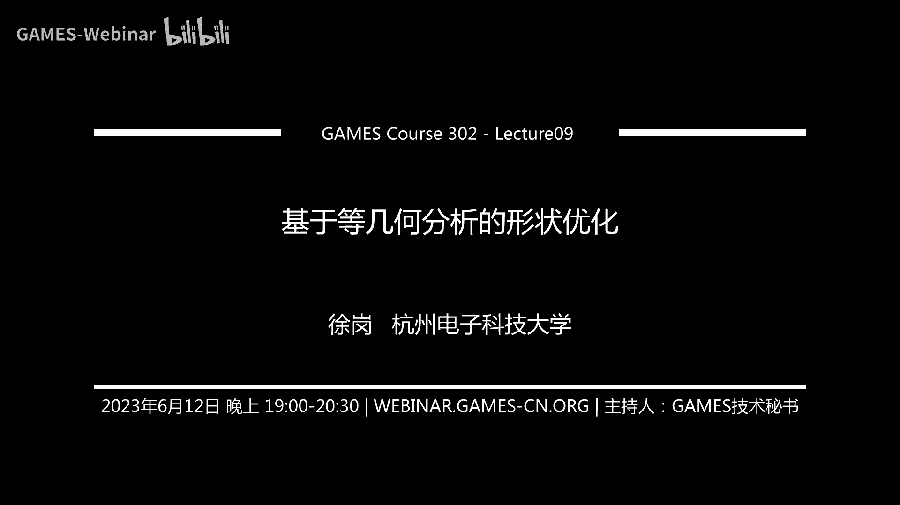
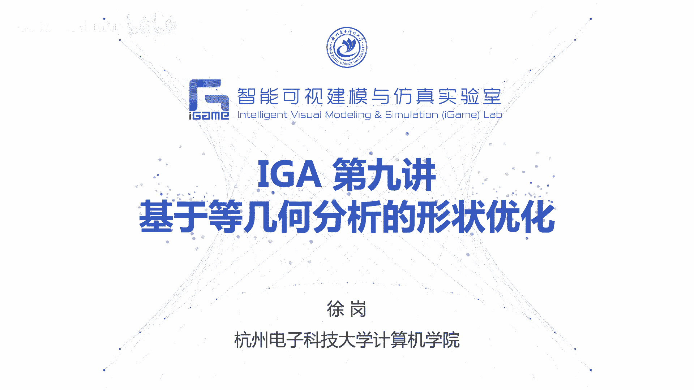
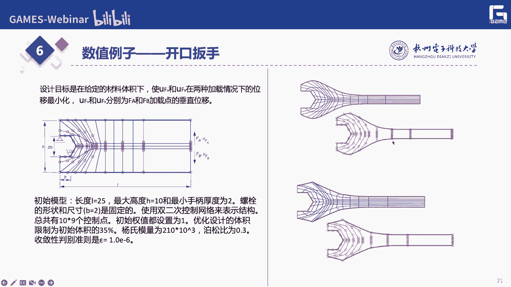
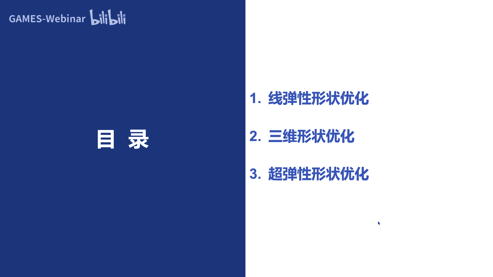
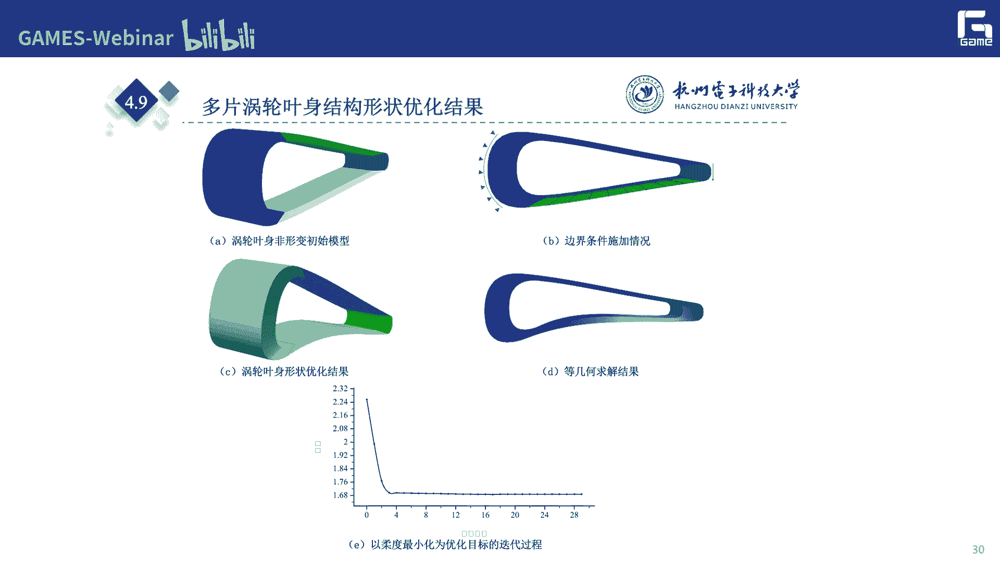
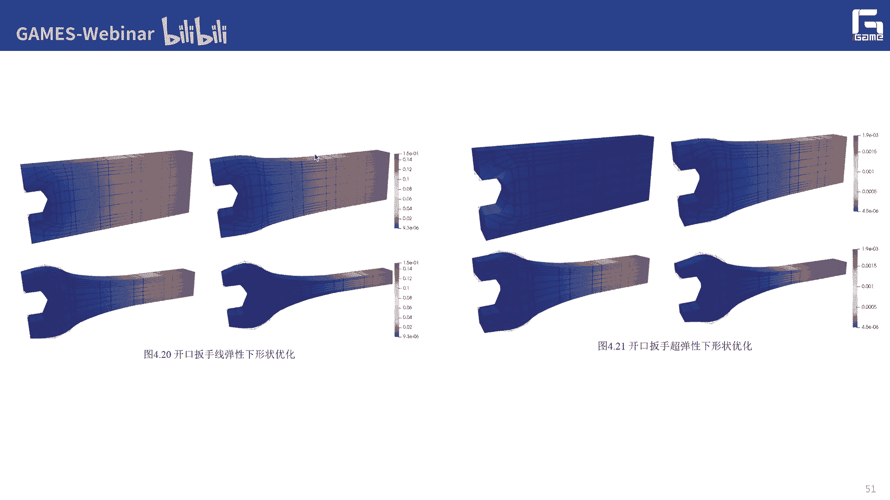

# GAMES302-等几何分析 - P9：基于等几何分析的形状优化 🛠️

在本节课中，我们将学习如何利用等几何分析框架进行形状优化。我们将从基本概念入手，介绍线弹性和超弹性问题下的形状优化方法，并通过具体例子展示其应用和优势。




## 概述 📋

等几何分析不仅是一种用于物理仿真的新框架，其核心优势还在于能够无缝集成设计与优化。形状优化的目标是通过调整物体的几何外形，以改善其物理性能，如刚度、应力分布等。在等几何分析中，优化变量直接对应于描述几何形状的控制顶点，这使得优化过程变得非常直观和高效。

上一节我们介绍了等几何分析的求解框架，本节中我们来看看如何利用这个框架进行形状优化。

## 结构优化简介 🏗️

结构优化是优化设计领域的一个重要分支，广泛应用于航空航天、汽车轻量化、模具设计等领域。特别是随着3D打印技术的发展，优化结果可以更容易地被制造出来。结构优化主要分为三类：

以下是结构优化的主要类型：
*   **拓扑优化**：决定材料的最佳分布，即在何处保留材料、何处挖空，属于概念设计阶段。
*   **形状优化**：在拓扑确定的基础上，优化结构边界的精确形状，属于基础设计阶段。
*   **尺寸优化**：优化结构的详细尺寸参数，如孔的半径、梁的厚度等，属于详细设计阶段。

传统的有限元方法在进行拓扑或形状优化后，往往需要对结果进行复杂的后处理（如光滑化、CAD重建）才能用于制造。而等几何分析框架有望简化这一流程。

## 等几何形状优化问题定义 🎯

在等几何框架下，形状优化问题可以直观地表述为：在给定边界条件（固定、受力）和材料参数下，通过调整部分控制顶点的坐标，使得某个物理性能指标（目标函数）达到最优，同时满足一些约束条件（如体积限制）。

因此，一个典型的形状优化数学模型可以表示为：
```
最小化 f(x)
满足 g_i(x) ≤ 0, i = 1, ..., m
      h_j(x) = 0, j = 1, ..., p
```
其中，`x` 是设计变量（即控制顶点坐标），`f(x)` 是目标函数，`g_i(x)` 和 `h_j(x)` 是不等式和等式约束。

## 常见优化目标与数学模型 📊

根据不同的工程需求，可以选择不同的物理量作为优化目标。

以下是几种常见的目标函数形式：

1.  **最小化柔度（最大化刚度）**
    柔度是结构在受力平衡下存储的应变能，值越大表示结构越柔、稳定性越差。优化模型通常是在体积约束下最小化柔度。
    ```
    最小化 c = u^T * f
    满足 K(x) * u = f
         V(x) ≤ V0
    ```
    其中，`c` 是柔度，`u` 是位移向量，`f` 是载荷向量，`K` 是刚度矩阵，`V(x)` 是体积，`V0` 是体积上限。

2.  **最小化关键点位移**
    优化目标是使结构在特定点处的位移最小。约束条件通常也是体积。
    ```
    最小化 u_i
    满足 K(x) * u = f
         V(x) ≤ V0
    ```
    其中，`u_i` 是指定位移自由度上的位移。

3.  **最小化最大应力（应力集中）**
    为防止结构断裂，需要降低局部最大应力。但最大应力函数 `max(σ)` 不可导，通常使用 `p-norm` 方法进行光滑近似。
    ```
    最小化 σ_pnorm = (Σ (σ_i)^p)^(1/p)
    满足 K(x) * u = f
         V(x) ≤ V0
    ```
    当 `p` 足够大时，`σ_pnorm` 近似等于最大应力 `max(σ)`，且函数可微。

4.  **最小化体积/面积**
    在满足应力、位移等性能约束下，最小化材料的用量。
    ```
    最小化 V(x)
    满足 K(x) * u = f
         σ_max ≤ σ_allow
    ```
    其中，`σ_allow` 是材料的许用应力。

## 优化算法：移动渐近线法（MMA） 🔄

确定了优化模型后，需要采用合适的算法进行求解。对于上述可导的优化问题，基于梯度的算法效率较高。其中，移动渐近线法（Method of Moving Asymptotes, MMA）是一种广泛应用于工程优化问题的有效算法。

MMA 的基本思想是在每次迭代中，用一组可调参数的近似函数（移动渐近线）来逼近原问题，从而将复杂的非线性规划问题转化为一系列较简单的凸子问题。通过迭代求解这些子问题，最终收敛到原问题的最优解。



MMA 的优点在于能处理复杂的非线性约束，对于大规模问题收敛速度较快。但其缺点也可能陷入局部最优解，且对目标函数或约束变化剧烈的问题可能效果不佳。



## 灵敏度分析：优化的“指南针” 🧭

基于梯度的优化算法（如MMA）的核心是计算目标函数和约束函数对设计变量 `x` 的导数，即灵敏度。灵敏度反映了设计变量微小变动对目标函数的影响程度，决定了优化搜索的方向和步长。

在等几何框架下，设计变量是控制顶点坐标。以柔度 `c = u^T * f` 为例，其灵敏度计算需要用到链式法则，并涉及刚度矩阵 `K` 对设计变量的导数。通过伴随变量法等技巧，可以高效地计算出灵敏度，而无需对每个设计变量进行昂贵的有限差分计算。

灵敏度分析是连接仿真分析与优化迭代的桥梁，其计算效率和精度直接影响整个优化过程的成败。




## 二维与三维线弹性形状优化案例 💡

了解了基本原理后，我们通过案例来具体看等几何形状优化的效果。

以下是几个典型优化案例：

*   **悬臂梁优化**：梁一端固定，另一端受向下力。优化上表面控制点，在体积约束下最小化柔度。优化后，梁的形状从矩形演变为类似抛物线形，根部加厚以承受更大弯矩，尖端变细以节省材料。
*   **开口扳手优化**：模拟扳手卡住螺母的工况。固定开口内侧，在扳手两端施加反向力。优化目标是使两种加载工况下的位移最小。优化后，扳手非受力区域的材料被移除，形状更高效。
*   **三维涡轮叶片优化**：基于多片NURBS曲面构建的叶片模型。固定叶根，在叶身施加气动载荷。优化目标是最小化柔度。优化迭代过程显示，柔度迅速下降并最终收敛，叶片形状得到显著改进。

这些案例表明，在等几何框架下，用户只需设定边界条件、载荷和优化目标，算法便能自动驱动控制顶点，得到性能更优的几何形状，实现了设计与优化的直接联动。

## 超弹性材料形状优化 🌊

前面的讨论基于线弹性材料。对于橡胶、生物组织等超弹性材料，其力学行为是非线性的（应力-应变关系非线性和大变形）。这给形状优化带来了新的挑战，因为刚度矩阵 `K` 本身是位移 `u` 的函数。

在超弹性形状优化中，由于问题的强非线性，位移 `u` 对设计变量 `x` 的导数很难解析求出。因此，常采用中心差分法等数值方法来近似计算灵敏度。
```
∂u/∂x_i ≈ (u(x_i + Δx) - u(x_i - Δx)) / (2Δx)
```
虽然计算量增加，但依然可以有效地驱动优化过程。

此外，为了平衡优化效率与分析精度，可以采用**多分辨率**策略：使用较粗的控制网格作为设计变量（优化模型），使用较细的控制网格进行高精度仿真（分析模型）。两者之间的灵敏度信息可以通过解析的映射关系进行传递。这样既能减少优化变量数量、降低计算成本，又能保证仿真结果的准确性。

超弹性优化案例如“带圆角的板”优化显示，优化后应力集中显著降低，应力分布更均匀，证明了该方法对改善非线性结构性能的有效性。

## 总结 🎓

本节课我们一起学习了基于等几何分析的形状优化。我们了解到：

1.  等几何分析为形状优化提供了天然优势，**设计变量直接是控制顶点**，优化过程直观，无需繁琐的后处理。
2.  形状优化问题可归结为**有约束的数学规划问题**，常见目标包括最小化柔度、位移、应力或体积。
3.  **移动渐近线法（MMA）** 是求解此类问题的有效梯度优化算法。
4.  **灵敏度分析**是驱动优化迭代的关键，需要高效计算目标函数对控制顶点坐标的导数。
5.  该方法可成功应用于**二维、三维线弹性**以及**超弹性非线性**问题的形状优化，并通过多分辨率策略平衡效率与精度。



通过等几何形状优化，我们能够将一个初始设计，在给定约束下，自动优化成物理性能更优的最终形状，实现了从“仿真验证设计”到“仿真驱动设计”的重要跨越。