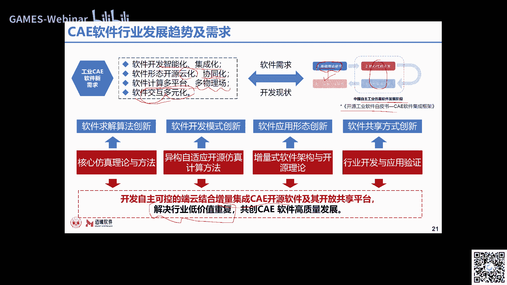
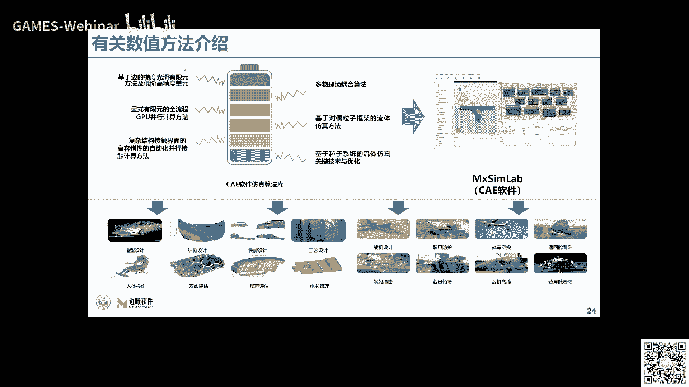
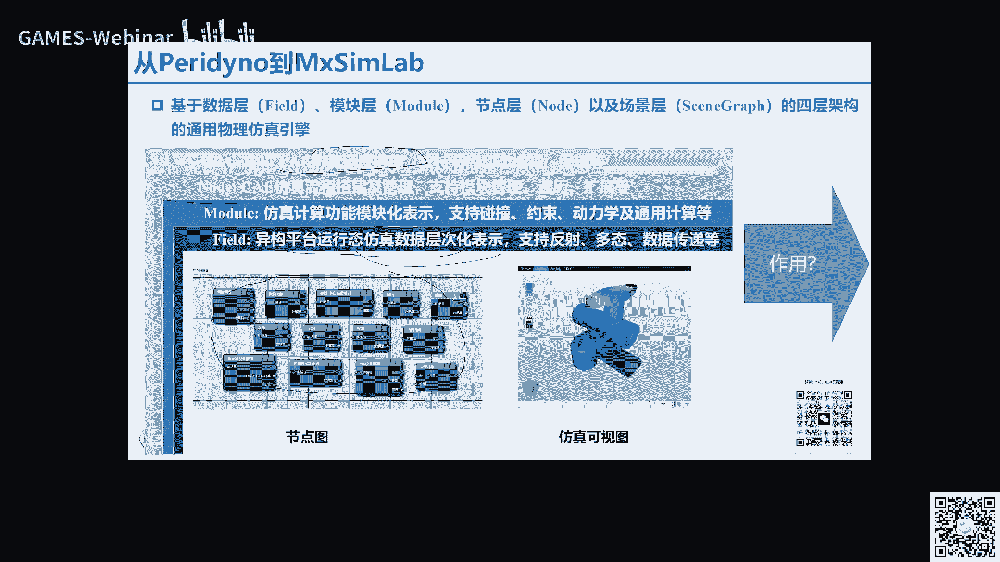
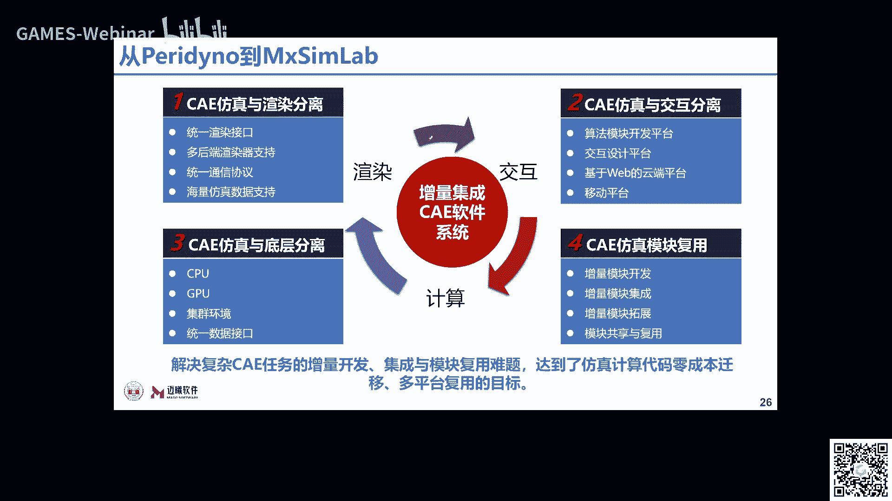
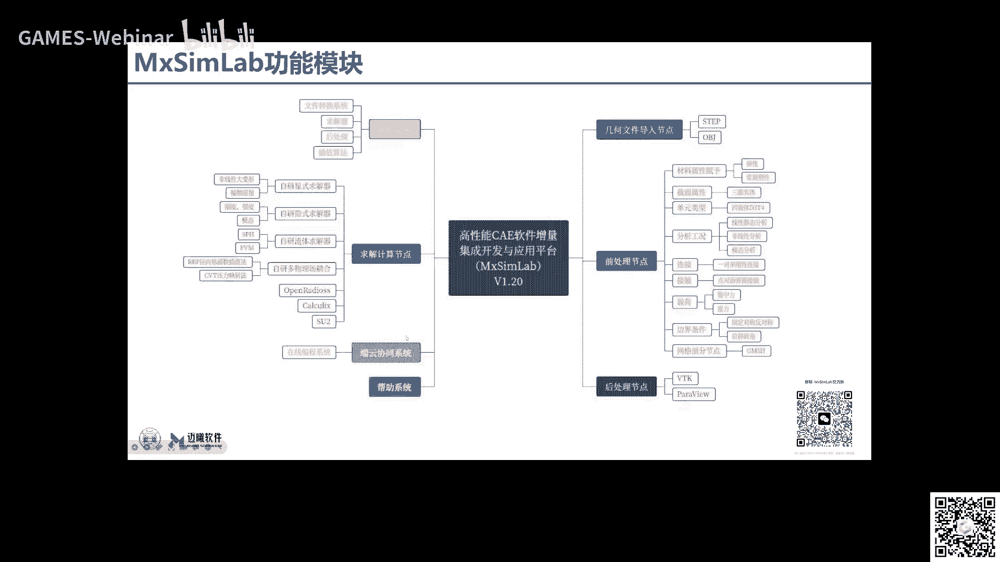
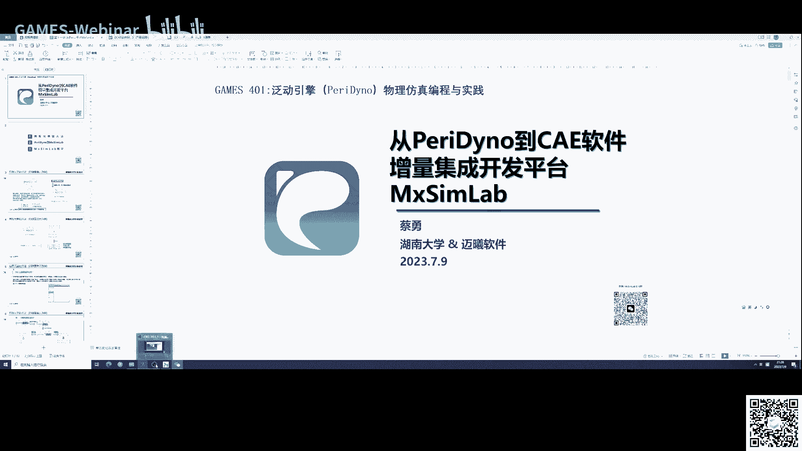

# GAMES401-泛动引擎(PeriDyno)物理仿真编程与实践 - P11：11. 从PeriDyno到CAE软件增量集成开发平台MxSimLa - GAMES-Webinar - BV15M4y1U76M

好尊敬的各位网友，这个各位同学大家好，那么我们又如约来到了我们game401晃动引擎，物理仿真编程与实践这门课的啊，应该算是我们整个课程的最后一节课啊，呃前面我们围绕的PANO和呃，基本的这种物理仿真。

这种编程算法啊，但我们的C1呃基本的一些理论和算法，包括C1E的一些基本的知识点都进行了讲解，那么我们今天呃，难道我们呃，本次本文这么课程的最后一节课是啊，主要是跟大家介绍从判断那到啊。

我们自己所开发的一个呃，C软件的一个增加集成开发平台mesh sim nel，那么主要还是分为三部分，第一部的话还是因为在上节课，我们主要是讲的，有些人的一个基本的力学的一个理论，就是这个弹性力学理论。

那么在这节课，我们还是再简单的跟大家介绍一下，这个有限元的一个基本方法就是如何啊，我们从前面讲的力学理论，到我们有校园是怎样的转化过来的，那么第二个是讲的从这个PANO到match nel。

我们具体做的一些工作啊，第三部分就是基于这个matheme level这个软件，来进行我们这个软件的一个呃，简单的一个介一个介绍和一个教学，那么首先我们还是呃讲一下，有些人基本的一个方法。

那么为了这个便于理解，我们以最简单的一个弹簧单元为例啊，首先我们来看一下一个弹簧的一个力学，分析的原理，当然这个会用到我们上节课呃，所讲到的一些弹性力学的一些基本的理论啊。

呃就是我们在屏幕中看到的这个弹簧系统是吧，一个弹簧系统它的这个左端是固定的，那么在右端呢收到了一个力F，那么它就会产生一个德尔塔的这样的一个啊，生产量对吧，我们知道弹簧设计就会升就会升就会生产量。

那么这个力和这个它的生产量之间啊，我们在上节课讲过，其实他们之间会有一个一定一定的关系对吧，如果是属于弹性变形阶段的话，我们说它的这种关系的话，其实还是一种这个线性的这样的一个关系啊。

线性的这样的一个关一个关系，那么这种关系就是我们讲的复合定律，让我们在上节课也讲了这个复合定律，哎，那么它是我们弹性理论中一个最基本的一个，一个定理啊，它是描述就是我们的固体材料在受力之后。

那么材料的应力应变啊是吧，就是在我们上节课所讲过的物理方程啊，它们之间是乘这样的一个线性的一个关系啊，线性的一个关系，那么对于弹簧的力和位移的关系，其实就是中间F是等于K乘上一个代号是吧。

就是说K是我们弹簧的刚度的一个系数啊，刚度的一个系数，那么这个其实就是相当于描述我们弹簧变形的，一个物理方程是吧，大家还记得吗，我们在啊在上一节课的时候，其实跟大家讲，我对老公说。

描述应力和应变它们之间关系的这个方程，我们就叫做是物理方程，那么在这样一个系统中，其实我们是基于这样的一个端点的一个描述，对吧，我们说它的右端的这个点受到的一个力F，那么在有左端这个点它是被固定住的。

那么关于这种一个关于端点的这个描述，我们就回回回应到在有些人中，那么在有限言中，我们为了进行规范化的描述对吧，大家回忆一下，我们讲有限元中是有节点和单元的，这样一个概念是吧，节点和单元的这样的一个概念。

那么我们就可以把整个这样子的一个系统，我们就不是基于端点是吧，端点是我们讲的物物，这个物体它本身的一个几何的一个特征，我们把它描述为基于节点对吧，节点就是我们在有限元分析中，用到的一个体系啊。

单元和节点这样一个体系，这样的一个模型，用节点来进行这个弹簧的描这个描述，那么我们就说整个在这样子，整个一个系统中对吧，这前面这个弹簧系统中就包含有两个节点对吧，一个是它右端的这个端点。

我们把它定义为一号节点，那么第二个是在左端的这个啊，不在左端的这一个端点，我们定义为一号节点，那么在右端的这个我们定义为2号节点，那么定义完这两个节点之后，我们呢。

如何用基于节点对我这个单元来进行描述的，就是我们放在有有限元中对吧，我的节点进行描述的话，那我就说在节点上，就在一号和2号这两个节点上，他们分别有位移对吧，我用U表示。

那么U1就代表的是一号节点的位移啊，那么U2就代表的是2号节点的位移，那么对应的它有节点力是吧，它也有节点力，那么对于F1啊，这代表的是我一号节点上面的力啊，那么还有F2。

代表的是我2号节点上面的节点力对吧，那我们这样子就基于节点，将我们整个弹簧的这种物理状态，我进行了一个描述对吧，它的位移和它的一个节点力，那么有了这样的一个机遇，节点的这个描述之后。

我们就可以构建出一系列的这个方程数了是吧，我们所经看这个最上面的这个方程，最上面的这个方程是吧，这上面这个方法方程，那么第一个方程就是F2对吧，就是我要算F2，那么F2我们前面不是说他的这个力是等于K。

就是弹簧系数乘上一个带的，就是它的一个生产量对吧，那么它的生产量第二的其实就是等于什么啊，就是等于U2减去U1，所以说就是K乘上U2减去U1，就等于F2，那么同时我整个弹簧系统，它是一种平衡状态是吧。

它是一种平衡状态，那我们就是F1加上F2，它是等于零的啊，它是属于一个平衡状态，就是说它是等于零的，那么我们有了这个方程，我们就可以把它吓退位，到下面这个方程对吧，就是K乘上U1减去U2是等于F1。

因为F1加上F2等于零嘛，所以F1是等于负的F2的，那么F2是等于这么多二，F1等于A负负的F2，就代表这个位移要反向嘛，就是这样子的，那么对于像这样的一个方程组啊。

描述我们整个节点的这个呃这个方程组的话，我们通常在有些语言中，我们会把它写成矩阵的形式，写成矩阵的一个形式，那么就把这样的一个方程，就把它转化为这样的一个矩阵的形式，那么它就包含有我们把它定义一下。

像前面这一个就是由弹簧的这个呃，呃这谈这个这个弹簧的刚度系数所构成的，这个K对吧，我们就把它组成的这一个矩阵充分是矩阵系数，然后再就是节点位移啊，再就是节点力，那么像这个其实就称之为是弹簧的一个平。

衡方程啊，或者是它的一个刚度方程，其实像这一个方程虽然看起来很简单，但是以后啊，就大家以后再有兴趣，对有序员进行更这个更详细的学习的时候，就发现，其实我们队有序员的分析，最终都是归纳于一个K乘上一个U。

等上一个F对吧，我们对于弹簧来讲，它是这样的一个平衡方方程，或者叫做刚刚刚度方程啊，其实在有些人经常讲刚度方程也会比较多，因为我们经常会把这个矩阵有这个系，有这种材料相关的。

它的一些物理特性所表征的这一个矩阵，我们称之为刚度矩阵啊，称之为是刚度矩阵，那么就是K乘上U等于F，也就是说我们不管是多么复杂的，有些人问题，其实他最终都是归纳于去求这样的一个方程组。

求上K乘上U等于F啊，这样子一个方程组啊，那么当然这里为什么要强调矩阵的形式啊，为什么要强调矩阵的形式，其实这主要是为了什么，主要是为了在计算机中啊，对有些人来讲，有些人它是一种很好计算机去编程的。

所以它很好的可以在计算机中来进行编程的，一个实现啊，当然了啊，这另外一个方面也是为了我们去写啊，去没去描述，去写我们整个计算过程的时候，能够比较方便的，能够准确的把它给诶表示出来是吧。

要不然我们用一堆的上下标啊，会一堆的公式啊，其实看起来也比较烦，比较繁琐，而且你从公式从到计算机的程序，其实这种思维转变是比较大的，但是我从这种矩阵的形式到我计算机的程序，转化其实是比较容易的啊啊对。

还有我们下面这个二维码啊，这个magic level的二维码，这个是我们需要有个games的一个，交流的一个QQ群嘛，然后因为我们这节课主要讲magic m nel。

所以我又建了magic nel的一个群啊，大家有兴趣可以加入我们这个群啊，哪个呃，另外一个的话，其实大家都知道，有很好的一个矩阵计算的一个软件，叫做MAD level对吧，这么像MAD level。

所以其实在啊，我们很多时候在做一些算法研究的时候啊，像像像我们在做一些很多算法研究的时候，其实我们一开始会用MADLIB，来进行一些算法的研究和实现啊，等基本的原理啊，和这些算法的推导都结都结束之后啊。

我再会把呃这种麦就把my dl的这种程序，把它翻译成这种C或者是fortune的，他的一些程序的一些呃这些语言的一些格式啊，这个是我们讲的矩阵的一个形式，那么前面我们讲的是一个弹簧系统对吧。

那如果是两个弹簧系统呢，就是比如说我们对整个系统中，我们讲的单元是吧，那么对于怎样子这样子一个弹簧系统，它有两个弹簧是吧，有两个弹簧的话，那我们就可以进行节点的编号，其实这个节点的编号啊。

这个节点的编号，其实就类似于是我们有限原句啊，构建一个有限元分析模型的这样的一个过程啊，比如说我们首先对它对它的节点进行编号对吧，就是有ABC它的三个端点是吧，ABC3个端点。

那么把这三个端点我们把它分明定义为一号，2号三号这三个节点，同时的话我把第一个弹簧，这种比较细线代表的弹簧，和这个出现所代表的这个弹簧，我是分别定义为第一号弹簧单元，和第2号弹簧单元是吧。

就是我对就是说我这样子一个系统，我这样子一个两个弹簧的系统，在我的有限元的这样子一个模型里面，它是包含有三个节点，两个单元的，这样子一个有限元分析的一个模型好，那我们在对于这样的一个模型来进行一个。

力学的一个分析对吧，那我们前面讲过，我们有序员分析的时候，是针对每一个单元独立分析是吧，每个单元独立的分析，然后再把它先离散嘛，再把它合并，那么所以我们首先分析一号单元对吧，一号单元就把单独的拿出来。

那么同时我们在分析2号单元是吧，2号单元，那么对于一号单元来讲的话，它有一号节点和2号节点对吧，那么它分别在一号节点和2号节点上面，分别都受到了一个位移和他的一个力，和他的一个执法力FR1是吧。

和他的一个内力FIR，那么对于2号单元是吧，2号单元的话，它也是由2号节点和3号节点所构成的，这样的一个弹簧单元，那么在2号节点上面，它就分别收到有我们一个是这个内力，FIR是吧。

同时有一个这个F2这个外力对吧，大家注意到啊，这里有个外力F2，它是加在了我们这个B端点，那么对于有渲染模型，就是加载到我们2号节点上面来了，那么再一个就是说它在三这个节点上面对吧。

也受到一个执法力fr3啊，这样的几个例和位移的这样子一个做一个作用，那么我们分别对这两个单元啊，一号单元和二单元去构建它的平衡方程，就跟我们前面单个系统平衡方程一样对吧，那么这些构建跟前面是一样的啊。

跟前面是一是一样的，跟前面单个单元是一样的，也构建出这样的一个平方平衡方方程，那么对于2号单元，也同样的去构建它的平平衡方程是吧，也得到它的平衡方程的表达式是这样子的。

那么构建成一号平衡单元和2号平衡单元之后，我们前面讲的这是两个离散的过程是吧，就是分别去算一号单元和2号单元，但最后我们是要去形成1+1，这算完个体之后又把它合到一起，去形成一个整体的一个平衡方程是吧。

所以这个是我们就是要思考的一个问题是什么，我们思考的问题是，我们为了能够方便地计算和我们这个编程，能够方便地实现这个计算机编编程，我们如何去构造一个整体的一个平衡方程对吧，那我们就需要把这两个方程。

我们分别拎到这里是吧，那我们分别都把它写成矩阵的形式对吧，这是一号单元的啊，这是一号单元的，这是2号单元的，我们分别把它写成矩矩阵的形式，然后我们再在一个系统里面去进行主张，大家注意啊。

在前面这在车上面这些部里面，我们都是在每个单元的内部啊，在每个单元自己的系统里面去组去去完成的，那我们接下来就把它放在一个系统里面，来进行组装啊，那么这个时候我们就需要进行一个扩充啊，进行一个扩充。

那么扩充的方法是什么呢，扩充的方法就如大家在pp上面看到，就是我们在相应的位置上去加零去嘉陵，也就是说我们首先要知道你要扩充数多大，扩充数多大对吧，那么对于我们整个这样的一个系统来讲。

我是有三个节点对吧，我是有三个节点，那就代表我是有U1U2，还有U3对吧，只有三个节点和三个D啊，那对应于这边是一个1×3的列阵，这是个1×3的列阵对吧，那么计算来讲，我们就知道我们的这个刚度矩阵是吧。

刚度矩阵它肯定是一个三三的是吧，是个3×3的，我们的每一个单元，他自己所得到的是一个2×2的，也就是说如果说我要把它扩成一个整体，那我就需要把这个2×2的这样子一个矩阵。

把它扩充为一个3×3的这样子一个矩阵，那么我采用的方法就是说比如说对于一号单元，我扩充到3×3的话，那么我就把我扩充的部分，我就全部放零就可以了对吧，我就全部放零就可以了，那它对应的位置是吧。

它对应的位置是U1U2，FRE和F2都是在上面，那么对应于这个刚度系中这一块的话，它也是属于在它的右上角啊，根据它的节点中方也在右上角，好在它的左上角，那么对于2号单元同样是吧，他也一开始是个2×2的。

我也要把它库存是3×3的，那么也是采用在它我扩充的部分去加零是吧，我在扩充的地方去填充零，那么对于2号单元来讲，它对应的位移是U2和U3是吧，它有着对应的是U2和U3，在下面这两个地方是吧。

在下面这一个部分，那么对应于它的刚度系数的话，我们去计算它的一个下一个坐标的话，其实它就属于在这个右下角啊，在这一个部分，当然对于它的力的列阵，我们也放到这里来，那么通过这样的一个扩充。

我们就把整个这样子一个一号单元和2号单元，全部扩充为一个3×3的这样子，一个大小的一个矩阵的形式，那么我们进行组装，那么组装就很容易了，那么组装的话，我们就根据我们前面讲的弹性力学的一个叠加。

原理类似啊，叠加原理是类似的，那我就把这两个相加，就把这两个加到一起啊，加到一起来就行了，加到一起来之后，我们就得到了整体的这样子一个平衡方程啊，就是我们这里是两个单元独立的平衡方程对吧。

然后我进行一个组装，主先进行扩扩充，扩充为整个系统所要求的一个大一个大小啊，所以说要求的一个大小，那么控制完之后把它累加累加之后，就得到我们整体的一个平衡方程的一个系统啊，得到我们整体的一个平衡方程嗯。

那么这里就体现出什么，这里就体现出我们有限元的一个思路对吧，我们首先是计算单个的单元，然后再把它组装在一起啊，当然这里提示的是说在我们整个这个系统中，这个FIR和F啊，这个I2嘛就是我们中间这个点。

因为中间这一个这一个点，我们是把它它是这个2号节点，是既属于一号单元啊，它又是属于在2号单元的，那我们在用的时候，其实都会在两个单元里面都会重复计算，单元二对吧，但是它形成了内力，这个FI是吧。

代表的内力，内力，其实它是一个作用力与反作用力的一，个关系是吧，就是我分到两个节点上面去，弹力的大小一样，但是它的方向是不一样的，所以这个时候它的合力就肯定还是为零的，合力肯定还是为零的。

那么有了这个就得到了我们这个整个系统，整体的一个平衡方程是吧，整体的一个平衡方程，那么接下来就是说我们怎么去求对吧，怎么去求解这样的一个平衡方程啊，求求解这样的一个平衡方程，当然在这个里面。

我们就说这里有很多的一些未知量对吧，我们就要去分析这个里面呢它的未知量是哪些，以增量器是哪些对吧，我们构建这样一个方程组之后，我们要去求解啊，我们过这种方式要要要去求求解，求解的话。

那我们就需要找到它的未知量，或者以及它的一个已知量对吧，那么对于未知量和已经那个这个考虑，就是要考虑到我们上节课所讲过的边界条件，大家记得我们上节课讲过，整个系统它是有边界条件的是吧。

他有位移边界条件或者是力的边界条件，那么对于像整个这样的一个弹簧系统，我们就要分析到它的边界条件，有哪些是有哪些对吧，那么很明显，首先我们可以得到的是，你看在这个系统里面分析一下。

是两个系统价值串联在一起，然后第一个弹簧它的由它的右端点是吧，它的左左端点是固定的，第二个弹簧它的右端点是固定的，那么对应于我们整个整个我们的有限元的系统，我们说它对应的节点分别是一号节点。

2号节点和3号节点对吧，那么很显然是不是，A点就是一号节点和3号节点，因为它直接是固定住的嘛，是固定住的，所以说它的位移可能是为零的是吧，这个就是我们的已知已知量，能找到的已知量之一是吧。

就是它的位移是为零的，那么我们找到这样一个已知量之后，我们在在我们的整个的平衡方程组，方程组里面去体现的话，其实我们采用的就是一种划线的一个方方法，所谓换线的方法是什么意思呢，就把我们和U1和U3。

因为它都是等于零嘛对吧，他都是等于零，那我们就把能涉及到跟它相关的一些行和列啊，就全部都把它删掉对吧，那我们就因为它的计算都是为都是为它，这两个是为零，那我们就把它对应于的第一行和第三行。

第一列和第三列啊，我们都把它删掉啊，都把它删掉，删掉完之后，我这样子，我这样子一个整体的平衡方程，其实就变成了简化的一个方程，那其实如果说因为我们这个很简单，是个3×3的啊，是个3×3的很简单。

但实际上我们在有序员，大家如果有兴趣去写个有序员的程序，那如果说你是一个很庞大的一个系统，但是你需要你采用的这种方法其实也是类似，当然有有几种方法，我们这里介绍的是划线的一个方法。

那就是说如果说我们在边界条件里面，已知有哪些位移是为零的，那么我们我们就把这一个位移啊，它所带它所对应的这个行和列就是一号位移，就把一号一第一行和第一列3号位移，就把第三行和第三列全部都把它删掉啊。

对应的在整个方程组里全部都把它删删掉，然后我再去求接下来的一个把剩下的方法，把剩下的值再构建出一个简单的一个，有缩减之后的这样的一个方程组对吧，然后我再进行求解，那么在这样子在这个系系统里面。

我们把这U1U3之后都把它删掉之后，我们就可以得到它是吧，那么得到它之后，我们大家想想我们就可以得到哪一个位移了，有了它之后，因为我们在这个里面UR对吧，UR是不是以这个F2我们是已知的是吧。

F2是已知的，因为F2就是说我们加载在2号节点上面，这个外力F2我们是知道的，就是我们加载的一个力的边界条件是吧，这个F2我们是已知的，那么同时K1和K2，这个是我们弹簧的物理性能，谈它的这个这个。

它它它的这个它的这个系数对吧，也就是K1和K2我们也是知道的，那我们就可以从这里就可以得到，U2是等于F2乘上K1加上K2对吧，K1加上K2，那么有了这样的一个计算之后。

我们首先三个节点上面的位移就都得到了是吧，三个节点上面的位移我们就都得到了，就是说第一号节点它的位移是零对吧，它是固定的，第2号节点我们计算出来的，它的位移是等于这么多。

第3号节点它的位移也是等于这么多，那也就是说我们基于节点的描述的话，它的第一个位移的变量，三个位移变量U1U2U三全部都得到了，那么接下来我们就再看它力了对吧，就是在123上面，他们所受到的力的情况啊。

所说的力的情况，那么有了这个力的情况之后，我们就可以反带到什么，反带到我们这个方程里面来是吧，反带到我们这个方程里面，把U1U2U三我们都带进来，带进来之后我就进行计算计算，我就可以分别得到。

我又把它给带到这个里面去是吧，把这些我都可以带到这个里面去啊，都带到这个里面去，那我们就可以得到什么F21和FR3对吧，它的这一个值啊就都可以得到，那么这另外一个DFR是已知的嘛，是我们的边界条件。

也就是说通过这样的一个计算的话对吧，通过这样的一个计算的话，我们就把这三个节点预约123，三个节点上面的力和它的位移啊，我们就全部都求解出来了啊，就就调解出就全解出来了啊，我看到有同学说这个太专业了啊。

这个这个这个确实啊，因为这个是从这个呃，应该说是算是有几层的一个啊进阶吧，首先我们是从你要理解最基本的一个弹簧的，一个力学的一个系统对吧，它的基本力力学，传统的力学采用复合定律来进行。

弹簧系统的一个计算，然后我们又把它上升到在我们讲的，在CA分析中常用的有些人的分析对吧，我们就有有限元的方法来进行一个记，一个记一个计算，那么对于有些人来来讲的话，我们就要把它划分为有限元。

我们所讲的有限元计算的模型，那么有限元计算的模型的话，它就是用节点和单元在我们前面课都讲过是吧，来进行模型的一个表述，那你的你把整个的这个模型计算完之后，那你就要把你所有的这些节点上面的未知量。

都通过这样的一个过程都把它计算出来啊，都把它计算出来啊，虽然说这个啊其实弹簧系统嗯，其实算是比较简单的，但是啊不管是我们以后多么复杂的，有些人他的基本的思路啊都是跟这个是一样啊。

都这个是一都跟这个是一样的，那么对于像整个这样的一个计算的过程啊，如果说我们用有限元的程序来实现啊，如果说我们用有限元的程序来实现的话，其实它的一个呃程序的这种模，这种模这种模块化还是比较强的啊。

首先我们要去构建，比如说我们在里面会用到的一些，基本的一些变量，我们要分析出来对吧，比如说我们在这个里面，每个弹簧源就是每个弹簧单元，就算站着，每个弹簧单元是吧，它是有两个节点，两个节点所构成是吧。

中间的这个就是弹簧的单元，那么我们前面已经分析了每个单元的刚度矩阵，就是在刚度系数，刚度系数嘛就是这样子一个2×2的一个矩阵，那么整钢的一个矩阵是N乘N对吧，整体的刚度矩阵就是N乘N。

这个N就代表了我整个节点的个数对吧，对于我们前面前面的我们是两个弹簧是吧，两个弹簧是有三个节点，所以说它整体的刚度矩阵是3×3，所以我们前面讲过，我们在进行刚度矩阵组装的时候。

我们要把这个2×2的这个刚度矩阵，就把它扩充为是一个3×3的这样子，一个刚度矩阵啊，扩充为3×3的这样子一个刚度矩阵，那么它整体的一个结构方程或者是平衡方程，就是K乘上U等上等于F对吧，这个是我们讲的。

就有关于有限元计算的一个基本的思路啊，和他们涉及到了一些变一些变量等等，我们先把它理理理，把它理把它理出来好，那我们再进行呃这个单元这种程序计算的话，其实就是采用完全模模块化的这种计算的。

这种编程的方式对吧，我们首先会涉及到一系列的函数的编写，比如说我们第一个函数是用于计算，我单元的刚度矩阵啊，对第一个单元刚度矩阵，当然对于弹簧原来讲，它的刚度矩阵的形式是固定的对吧。

就是说我们前面我们发现一个问题对吧，我们对于前面是两个单元，前面是两个单元是没错对吧，但是每个单元，它的刚度矩阵的形式是一样的是吧，就是跟它的单元工作，其跟他的这个弹簧，这个这个这个弹性系数。

这个弹簧的系数是像这个K是相关的，无非就是说我不同的单元它的K的取值不一样，但是它的形式是一样的对吧，所以我们就可以构建出像这样子，一个计算单元刚度矩阵的一个函数，非常简单，输入是K对吧，输入是K。

就说你输入是你当前这一个单元的这一个呃，系数，这个系数，然后我返回的就是你的这个单元刚度矩阵啊，这是他的第一个函数，那么对于整体的刚度矩阵的形式对吧，整体的单元刚度矩阵。

就是我们如何把我每一个弹簧的刚度矩阵，K小小K每一个单元的刚度矩阵小K是吧，然后我要把它组装到我的大K，就是我整体的刚度矩阵，就是把我的小K对吧，要组装到这个大K啊，因为没办法搞粗细啊。

所以我就把它放大小K对吧，把它组装这个大K里面去，那么我们对于像这样的一个函数，我们就是输入的就是他的小K，以及它的这个两个节点的编号对吧，一号对于每个弹簧不是有两个节点吗，I和J是吧。

两个节点的编编号，那么我们有了这个小K以及它两个节点的编号，我们就可以在它对应的这个大K里面，找到它的这个位置是吧，其实这个单元这个函数实现的就是这个，这个函数实现的就是我们这一步对吧。

就是我们这一步啊，就是就是这一步是吧，就是它就实现的是这一步，就是如何把这一个小K和这一个小K对吧，每个单元的单元刚度矩阵，组装到我这个整体的单元刚度矩阵来是吧，那么它是需要一个I和J是吧。

就是它的两个单元，它的两个节点啊，它的两个节点的编号啊，去计算它的位置啊，就是我这个位置应该在哪个地方，我是通过节点的变化来进行计来进行计算的啊，这个在哪里，比如说我这个字应该放放在哪里。

应该放到这里了对吧，它是其实放到这里了，它是通过计算得到啊，他通过这个节点的下标计算所得到的，所以这个就是我们在这一个函数所做的一个工，一个工作啊，然后再就是我们对于载荷是吧，对于载荷的一个节点。

载荷的一个基于一个计算对吧，那么这里的话其实就是我们等于说Y是等于，K乘上U嘛，很方便是吧，我K是一个矩阵，U是一个列阵，那么K乘上U，只要他们的这个呃，能够满足一个计算的一个关系。

那我就直接U就等于K乘K乘上U对吧，那我得到这一个Y，就是说我的输入就是我的单元，刚度矩阵的K是吧，和我这个单元的一个位移，U就得到了每个单元的一个节点的一个列阵啊，它也是一个1×2的对吧。

连节点的列阵，那么我们在进行实际应用啊，其实它的程序就很简单，这样子其实就把它编写完成了，其实非常非常非常非常简单，那么编完这个程序之后，我们再进行计算啊，就是我们进行实例计算，那比如说我们对像这样子。

也是有两个弹簧所构成的一个系统对吧，那我们又有英语有些人来进行分析啊，他要得到的是整个系统的刚度矩阵，按节点二三的位移，节点一的支反力和每个弹簧弹簧的内力对吧，那么我们对于像这样子。

一个有两个弹簧所构成的系统，我们也可以去构建啊，去构建一个有序的一个模型，而构建一个有效的一个某一个模型，那么首先去离散化对吧，就是我们要去画，就是类似于我们前面讲的，有需要里面去画网格啊。

那我们就可以列一个这样的表啊，大家其实在有些年代去写程序，都会习惯用中文笔表格来表示，那么第一个是我们的单元啊，就是一号单一号单元，那么一号单元它是有两个节点是吧，它的第一个节点是一号节点。

第二个节点是2号节点，那么第二个是第二个单元单元，第二行是首先是element number是吧，就是单元的编号是2号单元，2号二号单元的话，它的第一个节点是二，第三个节点是三对吧。

它的三第三个节点是三，那么这个就是我们整个有限元的一个模型对吧，我们就用简单的这个一个数字啊，去描述了我们这样的一个物，物物物理的一个模型，大家发现没有，其实这个也是有限元分析方法的一个好处对吧。

他把一个当然我们这里弹簧系统是很简单的，但其实是不管是多么复杂的这种几何形状，我们在以前都讲过通过网格划分之后，其实他都是通过这种单元编号节点编号是吧，就把我整个模型都把它表达出来了啊。

就把我整个模型都把它表达出来了，那么我们对于这样一个系统，我们就可以去调用我们前面的单元，前面编写的程序来进行计算对吧，首先我们要正式形成计计，计算每个单元的刚度矩阵是吧，那我就很简单。

我就把每个单元的刚度矩阵，其实在实际调用中它是一个循环嘛，是个for循环，那我们首先因为在这里讲的第一个单元，他的这个系数K1是等于一一百是吧，第二个单元K它的系数是等于两等于200。

那我要计算第一个单元的单元刚度矩阵，就把100带进去是吧，就得到了K1就是第一号单元刚度矩阵，那么第二个在计算第二个单元刚度矩阵的话，就把它的系数传进来200，这可以得到第二个单元的单元刚度矩阵是吧。

就是K2啊，简单的代入进去就得到了，那么得到之后我们再计算它整体的刚度矩阵，那么这又是一个for的循环，其实它是一个这样的一个顺序的执行的模式，对吧，那我们要去执行这个过程。

我们首先要去构建一个这个整体刚度矩阵出来，就是N乘N的一个整体刚度矩阵对吧，那么它是有三个节点，所以说它的大小是3×3的，我们首先形成一个这样的，就是一个零元素的，这样的一个3×3的刚度矩阵是吧。

全部是零的一个3×3的刚度矩阵，然后呢我们再去我们再去那个，然后我们再分别去调用，我们组装的这个函数是吧，第一个你看第一个的话，它的输入第一个单元输入是K1是吧，就是一号单元的刚度矩阵。

那么它的两个节点是一和二，那么带进去计算，就可以把它得到这样一个形式对吧，这这这个形式就把看大家看吧，就把第一号单元的这个刚度矩阵就把它啊，就是把它给计算的已经进来了对吧。

那我们接下来再把第2号单元的K2，把它的把它的刚度矩阵也把它计算出来对吧，也是调用这个函数啊，大家发现这一块对吧，那么这一块就是属于K2，当然中间这一个300，370是属于K1和K2。

就是100+200对吧，100+200是300，是他们累加重合的这一个地方，那么通过这样子的一个执行就得到了什么，就得到了我们整体的一个刚度矩阵啊，就得到我们整体的一个刚度矩阵。

那我们接下来就要引入边界条件是吧，引入边界条件，那么对于这一个边界条件啊，对于这一个系统的边界条件，那我们就要去找它有哪些边界条件是吧，那我们首先来看，首先他在这边啊，最左边的这一个端点。

它是怎么样是固定的是吧，左边这个观点是固定的，左边这个观点是固定的，那么也就是说他的U1，第一号节点的位移是为零的对吧，U1是等于零的，那么对于2号这一个节点，2号这个节点属于在系统内部的一个节点。

所以说他受到的肯定是一个力的一个作用，力与反作用力的一个关系是吧，但是它的力是为零，它的合力是为零的，所以说F2它是等于零的，那么还有就是F3，F3是受到的一个外在外地P，那么在前面这个外力是等于15。

是把这个题目中给出来的，就P等于15，那么也就是说在这个里面，我们知道F3是等于15，那我们接下来就可以把怎么样把这些边界条件，再带入到我们的这个整体的这样的一个，平衡方程里面去是吧。

整体的这样子一个方程里面去，那就说U1变成零了对吧，哎反变成零了，F35，对不对，带进去之后就得到了这样的一个方程组，那么在这样子一个方程组里面，它是有三个位置位置量，这样子有三个方程所构成的。

这样子一个是有三个位置的，F1U2和U3，我们就可以求解了对吧，因为要不然的话我们是这样子，一个由三个方程所构成的一个方程组，但是我们是有六个位置量，那我肯定求解不出来对吧。

我六个位置呢我肯定是计算不出来的，因此我们就要引入边界条件啊，把我们已知的边界条件带带进去，那么带进去之后，我们就发现只剩下三个位置量了，那么这个时候整个系统就变成可以求解的对吧，那我们就可以把它寄。

把它给计算出来是吧，那我们就可以把它计算出来，当然在这个时候我们前面讲过，我们不是说这里有U1吗，这个U1是等于零吗，所以我们可以把整个方程组简化一下是吧，可以把整个方程组简化一下，引入边界条件。

把第一行和第一列都删掉，因为这个U1是等于零对吧，就把第一行和列都删掉，我们就只剩下来这一个，2×2的这样的一个方程组了是吧，2×2的这样子一个啊，有两有两个方程构成的这个方程组。

那么通过这个方程组大家很简单，可以看到我们可以得到什么，这个这个下面左右下角这个方程组，我们就可以算到什么，可以算到U2和U3对吧，首先我们要把K第一行和第一列全部置为空，就这相当于是把它删掉啊。

就把他删，把它把它把它给全部作为空，那也就是说对于我就是说，在原来的这个方程组里面，我只取什么，只取第二行到第三列和第二行到第三行，第二列到第三列的右下角的这个方程组，构建出一个新的这个矩阵啊。

但这个属于MATLAB的一个编程的规则规则，也就是说得到这样的一个方程组，然后我就进行求解是吧，求解，我们直接用一个反一个除号啊，就可以就算得得到另一个反斜杠，就可以得到U啊，就说我这是F吗。

就是在这个里面就把它清空一下，在这里这是K嘛对吧，这是K这是U这是F啊，那么在MAD nel里面，我要求U我就直接用U等于K除上F啊，就得到了U，或者我们也可以写这样一个指令是吧。

U等于AMY就是把K乘上一个逆，就是它的一个逆，再乘上一个F，那么得到的也是U，那我就计算优势等于这么多啊，就算优势等于这么多，那么接下来就请一个后面的一些计算对吧，我们UU1我们前面知道它是等于零的。

它是边界条件是吧，U2和U3我都计算得到了，那么我接下来就是计算AF了，因为K4已知的优势已已知的对吧，那我就把F1计算，F就等于这么多嘛，我所有的力就都计算出来了啊，所以这个就完成了我们整个有限元。

计算的整个过程啊，整个过程当然这个只调用这些方程来计算，所以这个就是用一个弹簧的单元，跟大家讲解了，有限元基本的一个计算的一个流程啊，当然更复杂的往我们后面讲，我们还可以去讲等差单元啊，包括三角单元啊。

四边形单元啊，四面体，六面六面体啊，但限于这个课课时的时间有限，我们啊后面这些如果大家有兴趣，可以大家进行自学啊，但基本的思路都是这样子的啊，那么这个就是整体的一个有限元计算的，一个程序啊。

接下来就是当然没有，这是整体计算的一个流程啊，这些子程序都是有对应的一个，只是去调用这些子程序是吧，就大家可以发现我们就可以嗯，不管是怎样子的一个弹簧系统啊，对于这一个弹簧系统。

还包括我们前面做啊讲解的那样子，一个是两端固定的这样的一个弹簧系统是吧，两端固定的一个弹簧系统，甚至是可以是三个弹簧对吧，很多个弹簧啊，这种弹不管是多么弹多么多么复杂的弹簧系统。

其实我们都可以通过这样一个类似的f em对吧，有需要的一个计算的流程对吧，我们都可以计算得到啊，都可以计算得到，都可以计算得到它的一个解出来，那么关键的就是我们要学会去构建他的，这个有限的一个模型对吧。

节点和单元之间的一个关系，学会去分析它的边界条件是哪些啊，把边界条件找找准了，有些人的模型你建立正确了，那你就可以用这么简单的这样子几个函数啊，就可以完成一个复杂的一个，弹簧系统的一个计算啊。

完整性的一个计算，那么这个就是我们讲的有学法的一个基础啊，有宣法的一个基础好，那么好了，我们就相当于是前面呃利用了这个，算上上节课的时间，我们可能也花了大概有两三个小时的时间。

从啊弹性力学到有些人的基础跟大家讲了一下，大概有序员是怎么实现的对吧，然后我们接下来又回到了我们这门课啊，更谦虚的这种物理仿真引擎啊，和编程方面的一些教学对吧，我们首先来看一看啊。

就我们是如何从PANO啊，并为我们从一个物理缓存的引引擎，变成我们一个做4A1仿真软件啊，我们具体做了一些哪些事情啊，哪些事情，那么首先我们来讲一讲，为什么我们要来做这样一个事，情。

为什么要来做这样一个事实事情，其实这样一个事情的关键啊，就是我们想要去开发一个满足于增量集成的，ca软件的这样的一个框架出来，因为其实现在在啊我们在前面也讲过啊，ca应用的一些领域啊，和它的一些优点啊。

缺点等等，其实在未来来讲，对于CA软件开发，它其实更多的是朝这种智能化和集成化，以及这种开源的云云化和协同化啊，所谓的这种协同化，就是说我要做到啊多人或者是多部门，多工程师之间的一个软件的一个协同开发。

那么对于软件的这种形体形态的话，其实它更多的是关注于啊，我们比如说要做到一个计算平台的一个多，多平台的一个支撑对吧，做到在不管是在手机端呀，在IPAD呀，或者在平板呀，在笔记本啊，呃这种工作站呀。

平台的一个啊多屏的一个适用性，以及满足我多物理场仿真分析的一个需要，就他希望有一个平台把我们讲的这种结构厂啊，电子厂啊，生产啊，把各种厂之间能够耦合耦合起来，当然还有就是软件交互的一个多元化对吧。

就我们要有多种交互的一种形，一种形一种形形式啊，另外其实根据啊，我们我们国家刚刚颁布的这个，开源工业软件的这个白皮书啊，啊其实这个里面讲的CA软件集成框架来讲，我觉得里面的有个分析啊，也是非常正确啊。

你们讲过我们自主C软件发展的一个阶段，其实就提到，其实对于我们自主的学习软件发展来讲，前面我们的理论研究基础，其实啊还是研究的比较充足的啊，但是我们从理论研究到产品级的工业软件，因为我们其实在前面讲过。

目前来讲我们国内的工业软件是比较少的，我们国内的工，这种工业软件是比较少少少的是吧，主要是用的国外的这种工业软件，那么这里面就包括有要经历的一个必经闭源，要经过的一个阶段的话。

就是核心代码的一个开发是吧，软件核心代码的一个开发，以及软件的一个集成的一个封装，那么围绕着这个软件代码的开发，和软件基准的封装，我们要思考的一个问题，就是说有没有一个快速的一个平台。

能够帮助我们能够来做这样的一个事情啊，那么基于这样的一个思路啊，就我和何晓梅老师当然也是依托于我们啊，有一个国家对文化计划的一个支一个支撑，我们就来做这样的一个增量集成的这样一个，CA软件。

那么我们的想法也是能够去解决，在CA软件行业中一种低价值的一些重复，也就是说大家可能很多人，包括大家在上课的啊，各位同学可能很多人都想是来尝试着想做一些，所以软件的一些开发。

但是我可能有一些琐琐碎的工作，我我我不想重复去做对吧，我只想做我自己所感兴趣的这一个部分，对，完全可以用我们的平台来解决这样的一个，重复劳动的一个呃问题。

来保证我们学习软件一个高质量的一个发展，那么其实呃呃从另外一个角度来讲是吧，也是希望能够满足在这种不同任务驱动下啊，不同任务驱动下对CA软件的学习，开发应用的一个多层次的一个需求对吧。

相信大家啊上了这么几节课之后，肯定对于这些软件都有一种这种蠢蠢欲试的，这样一种想法对吧，都想来尝试一下，就说也同时在思考，我在ca软件中我能够去做怎样一些工作对吧，如果说啊我们是为了这个学习和科研。

是为了学习和和和科研是吧，那我可能是想啊去做一些软件开发的一个工作，比如说我想自己去搭建啊，梦想面面向每一个行业的一个C软件对吧，那我希望能够有这样的一个快速的，一个极集成的一个平台。

能够因为我们前面讲过ca软件分为像前处理啊，就是我们画网格向边界条件的加加载呀，然后到求解，然后再到后处理是吧，各个呃流程，那么我我希望能够快速的一个平台，帮我能够把这个流程快速把它集成在一起。

第二个我可能只是想做一些软件应用啊，比如说我想用cad软件啊，去做一些具体的一些分析对吧，那么这个时候就需要有丰富的一个软构件，其实有更丰富的C软件的功能模块跟你去使用，就要用我们前面讲的弹簧系统对吧。

其实它反复利用的几个函数，就是那么几个函数，一个是单元刚度矩阵阶段的函数，一个是单元刚度矩阵，整体刚度矩阵组装的一个函数，一个是我们一个呃，这个利益计算的一个函数对吧。

那么通过这样子三个简单的这一个函数，我们就可以完成一个非常复杂的一个，弹簧系统的一个计算啊，那么我们就希望有这种平台，能帮我们做一个事情，当然还有比如我们做一些科普性的学习对吧，就是我很好奇呀。

我尝试着去做一做啊，常我我我我，我尝试着自己去搭一个仿真的流程啊，等等之类的是吧，那么第二个场景啊，比如说有有同学对软件开发很感兴趣兴趣，当然在C这个行业里面，比如说我们已经有了一个求解器啊。

比如我已经开发了很好的一个求解器，但是呢但是CE分析是包括有这个前处理，求解器和后处理，我有求解阶段是没有前处理和后处理，怎么办对吧，那我就希望有这样一个平台，能够提供前处理和后处理。

把我的求解器集成进去，能够快速的完成一个完整，ca软件产品的一个开发，当然或者或者说有有有有有的同学说哎呀，我有很好的一些算法，我想去实现一下，比如说我想去研究一个单一个，我们前面讲过的一些。

而一些物理方程的一个算法，本构方程的一些算法，或者是单元计算的一些算法对吧，那我希望有一个平台，能够能够帮助我快速的实现和做一些测试啊，那么这个是从软件开发的一个层面，那么第三个是从软件应用啊。

这个应用就分为很多种，比如说在空在工程中唉，我有一些模型，比如说唉我现在要去算一个啊，去一个一个汽车或者是高铁的一个什么模型，我有这样一个模型，但是我没有软件啊，我要去找一个软件来算。

第二个就是说我可能要去测试不同软件的计，算结果啊，就是我一个模型我想用不同的软件去算啊，比如说用开源软件去算呀，啊用我自己开发的软件去算啊，用商业软件去计计算，我想去对比它的一些计算精度和计算效率啊。

那我在想我有没有一个快速的这样的一个平台，能够把这些软件都集成到这个平台上面来，那么我的模型可以很快的，在这几个软件上面进行一个测试，得到结果对吧，那么这个也是我们的一个这个，这个它的一个场景之一。

当然第三个也是我们的一个想法对吧，我们如果说能提供出一个很好的一个，开源的平台，那么通过大家共同的努力，那么我们是否也是有可能是能够去替代是吧，在有些场景中也能够去替代一些商业软件好。

那么具体的一个实现啊，为了满足这样一个功能，cad软件的一个功能，其实我们就是说围绕着PANO啊，piano前面何晓伟老师已经讲讲了很多课，我们就不再去讲，它其实是一个开源的一个增量集成的。

一个核心的框架是吧，它的一个主导的概念就是一种拖拽式的增加，集成了这样一个概念，一个概念，那么我们团队其实就围绕着看这个这个panel，我以及C1仿真的一个需求，我们首先是对于仿真数据域的一些扩充啊。

仿真数据就说我们在仿真计算过程中，比如说要涉及到一些单元呢节点啊，或者一些材料的数据等等是吧，那我们都要在这个panda，你把这个数据域要把它加入进来，同时呢当然更重要的。

我们加入了很多panda的一些load，或者这些model对吧，它的一些节点，那么做了很多这一核心算法的开发与实现，当然这种开发与实现都是基于panda dao所来，他的这样的一个平台的框架来实现的。

做到一个高可复用性的这样子一个啊，这样几个目就这样子一个目标，那么当然也做了一些软件的一些跨平台啊，和一些啊软硬件的一些自适应的一些工作，但这个就是比较琐碎的，那么最终我们就完成了整个从ca软件前处理。

求解器，后处理等软构件的开发与集成，然后就形成了我们在这节课讲的Mac sim nel啊，这样子一个ca软件的这样的一个平台，它我们称之也是一个开源的一个底座啊，就从一个增量开发的一个框架。

变成为一个适用于ca软件开发的，一个开源的底座，当然在这个期间，我们也做了很多供应工程应用的迭代啊，在很多场景中，我们也进行测试和一些一些应用的迭代，那么具体的一些算一些算法，其实我们融入了很多。

但这个我们就比较专业和有限相关的，我们就不再去呃很详细的去讲，但通过这些这些集成之后。

也使我们能够满足非常复杂的一些cc，仿真分析的一些需要，那么其实它整体的一个框架啊，其实跟呃，其实这个是完全跟PDL的架构是一样的啊，其实首先最开始我们讲的是有它的一个啊，它是四个层次对吧。

首先我们讲的材质运行它数据啊，这个大家在何老师前面也讲过，只是说在这个里面我们加入了很多，过门C仿真所需要的一些数据，加入到这个里面来，再一个就是我们在mod在model层是吧，那么在model层的话。

我们主要是各种仿真计算功能模块的实现是吧，我们各种功能的一些实现，当然在load在load的话就是具体的一些功能啊，具具体的一些功能等等，做我们到后面啊，可以跟大家啊再去也演示我们软件的时候。

我们再去讲解啊，再去讲解，那么在上面就是我们整个仿真场景对吧，就像这个一样，其实我们就把整个CE分析啊，就大家前面我们讲了各种理，各种理论，各种计算的流程都把它分解成一个个的节点，那么有了这些节点之后。

我就可以在这样的一个场景中，搭建出能够满足我所需要的这样子，一个C1仿真的这样的一个流程出来。

嗯当然这样子做完之后就也是得到了啊，也是基于PDA的一个先进性，这把我们就做到了C1仿真与渲染啊，就是我所以仿真计算与渲染的一个分离啊，这个是用到了我们PDA的这个仿真计算和渲染，两套独立的管线对吧。

这个以前和姚何老师在以前也讲过，但跟大家也介绍过，那么再就是C仿真与交互的一个分离，再就是cf仿真与底层的分离，仿真模块的一个通过这些分离，保证了我仿真模块的一个高考复用性对吧，高考复用性啊。

这个都是我们PANO它所具备的一个U1个优势，只是说我们在magic nel中，我们把这些优势很好地继承了下来，然后集成到了我们这样子一个啊。

maxim lab这样子一个平台里面来啊，这个是我们整体的一个框架啊，整体的一个框架，当然这个的话啊也是JPL的一个或筹码，只是说我们在这个里面，在他的这一块里面，我们加入我们一些仿真算法库是吧。

加入了一些仿真算法库，但是其他的这些模块层，其实还是完全继承了PANDEO它的一个啊，准备了一些思想啊，通过这样的一些开发之后，其实我们就面向于各种的科研的场景应用啊，都有一些很好的一些呃。

哎每每每每个应用的人员不同任务啊，都会有很好的一个应用的一些这个方方式，好了我们最后再来回到我们整个软件上面的啊，首先我们整个软件的话也是在这个呃，进行开源的，我们是在gay在这个git上面开源啊。

那么我们的网址是在这里啊，我们网址是在这里，然后大家啊有兴趣的话，可以在这个在这个这个马云上面，把我们这个词啊代码把它下载下来，然后我们整个网页上面也是，有非常详细的一个说明啊，有非常详细的一个说明。

教大家一步步怎么去编译啊，当然如果是有些同学觉得，如果编译觉得太麻烦啊，或者说在编译啊，在安装使用过程中有什么问题的话，那可以加入到我们这个群哦，我们max level的这样的一个呃。

扫这个码加入到我们这个微信群里面啊，加入到我们群里面来进行随时的啊，我们主要的一些研发人员，我都拉到了这个群里面，我们可以随时进行一些交流和一些讨论啊，进行交流和一些讨一些讨论，好，那我们目前的话啊。

因为整个的这一个啊meim lab的话，其实它的编译的一些流程和思路，其实跟判断呢也是非常类似的，所以我在这节课里面，我就不再去跟大家去讲解一部，怎么去去进行编进行编译的。

那么目前我们整个呃呃整个平台的话，我们包含了几几大块啊，首先是啊我们在求解计算这一块，其实我们包含了有自己所研发啊，就是我们华就是湖南大学，我们自己团队所研发的一些啊，显示动力学的求解器啊。

影视求解器和流体的求解器，和多物理场的一些求解器，当然我们也集成了很多的一些开源的，这些软件进来啊，当然这里的话啊，比如说像这个啊，现在国内Y非常主流的这样一个显示的一个。

开源的切割机叫做open radio啊，他以前是必然的啊，就是今年才开始开源，那么可以用来做这些汽车的碰撞啊等等，这样的一些仿真分析分析，第二个就是开利克斯啊，这个也是一个非常成熟的这样的一个开源的。

一个有线的一个软一个软件，还有我们这个流体计算的一个软件叫做SU2啊，当然如果说大家有有需要，也可以基于我们这个Mac level这个平台，把自己想要的一些自己的求解器啊，或者是开源的求解器。

能够融入到我们这个平台里面来，因为融入到因为我们这里面同时也提供了，我们看到有很好的前处理的节点，和后处理的一个节点，也就是说你的前处理就我们前面讲过，包括画网格啊这些唉，往这些有有限元模型的建立啊。

模型的读取啊等等，那么我们都是可以在我们前处理节点里面，把它完成出来是吧，把它给把卖给嗯，嗯就是说都可以用我们这个这个节点，也就是说如果说你只是去开发求解器的话，你就去真假求有器这一部分就可以了。

那么你的前处理和后处理的节点，你都可以直接来用我们所提供的这些模块，就可以了，当然我们也有几何文件的导入是吧，像S像step和OBJ，目前我们是支持的这两种，大家大家有兴趣的话，也可以继续向欧洲向。

像这种OCC啊，把其他一些像IG或者接一些开源的库啊，把其他的一些几何文件读入的，这些也把它加到这个里里里面来，那么我们有了这样的一个节点之后，我们就可以把一些呃几何的一个。

cad的一些模型能够读入是吧，导入到我们这样的一个里面来，然后再进行一个C的一个分一个分析，当然我们也有我们的帮助系统，然后啊这也是继承了PARADIO的话，我们也有我们目前的一个单元协同的一个系统。

但这一块还在完整的一个开发中，还不是那么的玩那么的完善行。

那么这个就是我们啊，整个软这个PPPPT这一块啊，那我们接下来就是教我们软件这一块，那我们整个软件的界面大家看一下，其实跟PDA，如果大家前面已经用过PDD的话，其实跟PDA首先在风格上还是有一定的改。

一个改变，因为我们还是这对于C1工程师，他们所习惯的一个界面，借钱了一定的修改，但是它整体的一些布局啊等等之类的，跟这个呃呃拍照的还是很类似是吧，那么在这边的话，我们呃增加了这样子这样子一个节点数啊。

就是我们所有所开发的这些节点，我们都放在这里面，大家可以去找，可以去找的，大家可以发现包括有钱处理啊，包括单元计算后后后处理啊，包括有各种文件信誉系统，包括材料，包括各种求解器啊，包括渲渲染啊等等。

当然在这个上面也有一些插件性的哦，我们是支持比较好的一些插件式的一些开发，也就是说大家如果要基于my simon，来做一个事情的话，比如说你想自己在这里增加一个节点进来的话。

那么你可以采用插插件的形式是吧，或者是采用这种像前面PYL开发的，我们基于代码开发这种都是可以的，那么这种开发的模式啊，其实跟拍大脑是完全一样的啊，所以我们在这节课就不去重复讲这种模式啊。

那么着重讲一下，我们这个软件可以做哪些功能是吧，做哪些功能，那么首先我们来看一下，比如说我们要做一个完整的，有些人的一个分析对吧，我们讲的完完完整的有限元的一个分析，那我们首先是要进行前处理是吧。

前处理要解决的一个工作，就是从CAD模型到CA1的一个模型，那么在这里的话，我们就涉及到用cad模型的一个网格的划分对吧，所以我们这里会有一个网格的一个，设一个设置，但是在这里的话。

其实我们首先在这个节点，因为我们开发了在这里有个网格这个项目，这个模块，其实这一个模块的话是目前我们所开发的一个，画网格的一个引擎，那么在这里的话主要是有两个节点，一个就是进行网格的一些设置。

那么在网格设置里面的话，首先就有一个文件的这个路，这个路径是吧，在这个在这点的话，主要就是要啊这个这个文件其实是讲的你的C，你的cad模型的这个文件啊，比如说我们在在这里啊连接出来。

那么他这两个节点这一个网格设置，这个节点主要是把你的cad的模型把它传入进来，然后再去选择你所要采用的这样一个，网格剖分的一个引擎，比如说我们这里集成的是一个开源的引擎，是基于是GMASH啊。

是开源的这个GMASH这个引它是开源的一个软件，那我们就可以选择我的这个软件的一个路径，一个路径啊，那么在这里的话，接下来就是一个网格引擎，就是进行网格剖分，那么它所传入的就是说把我们网格设置。

相关的参数传入的网格引擎来进行颇丰啊，我们来试一下，首先我们有个网格的路路径，就是这个我们这个模这个模型的路径啊，我们模型应该是啊，比如说我们就用这个呃Impact dec的这个STP吧。

用pad用pad1这个模型，然后我自己的话，然后大家可以看这里提示，几何模型已经导入成功，但是我们这个视角啊，等这个软件还在不断的，我这种玩这种进行完善啊，大家发现在这里的话。

我们就可以把我们这个几何模型已经传入进来，对吧，那么这个时候其实它还是几何模型，就是cad的一个一个一个模型，那我们接下来进行网一个网格的部分，那我们在这里的话。

首先要指定到我们所采用的这样的一个开源的，这样一个破风的引，这个引这个引这个引擎，那么引擎完之后，在这里我们就可以选择一系列，与这些网格的参数，我们这是个实体模型是吧，实体模型的话，那我就要画网格。

是画题画体网格，那么体网格的话，那我也是选择的是用四面体网格，那么当然还有其他的一些参数啊，但这些参数我们可以默认都不去管它，你就选择你是体网格还是面网格，然后你是体网格，你就选择四面体网格就可以了。

然后最重要的就是网格的大小对吧，就是你画这样一个模型，你用什么网格的大小把它把它给画，把它画出来，比如说我们这里把最大尺寸，最大值都设为一个六对吧，但这个你可以根据你实际的需要。

如果你的网你的网格尺寸比较小，那么它的网它这里离散出来的网格数量就很多，那么需要的这种内存的空间就比较大，然后计算量也会比较大，那如果说但是它的精度就会比较高对吧，如果说我的网格尺寸选的很大。

那么它的计算比较快，但它的精度就会比较低啊，那么在这一点的话，我们就点一次保存啊，点一次点一次保存，那么其实像这个对吧，我们整个网格的这一个啊，这我们在有限里面，我们网格这一块就可以搭建完完成了是吧。

那么对于网格搭建完成之后，我们接下来就讲过，我们要做很多的一些啊，有效分析的一些前处理对吧，那么在有限分析前处理的话，我们这里有两种模式，一种这也是体现出我们这个架构的一个，成属性啊。

一种就是我们可以用这种一个大的前处理的，一个这样的一个大的节点，那么大家会在这个大的节点里面，我们就可以把我们在进行有限分析里面，所需要的像一些材料啊，截面单元工况啊，载荷啊，边界的这些设置啊。

我就都能够在这里把它设置完成是吧，那么这个就是在前处理，那么在前处理计算完，在前处理完之后，我们说在有些人里面有前处理完之后，接下来就是要进行求解是吧，那么求解的话，我们在这里有很多的一些集成了。

很多一些求解器是吧，比如说一些开源的求解器和资源的一些求解器，那么在这个求解的这个过程中，其实比较关键的就是，我们首先要生成一个计算，求解的一个稳一个文件，比如说我们这里在这里。

我们打算用我们自己研究的这个影，这个隐私求解是吧，这里也有隐私求解，那我们首先就要把我们在前处理所完成的这些，哎这些设置啊，全部要通过我们这样的一个计算文件，输出的一个节点啊。

说出来这计算文件的这一个节点，通过这个节点就能够得到一个我们这个求解器，能够独处的一个CV1的一个计算的文件啊，这是得到一个计算的文一个文件，所以说它的一个连接关系，就是说把钱处理的一个数据据集是吧。

生成的通过这一系列所生成的一个数据数据集，传到我们这个计算文件输出的这一个节点，那么我的计算文件做出这个节点，它会生成一个计算文件，生成这个计算文件之后，它就会把这个计算文件传递到我们的自研的。

这个解器里面来，那我自研的这个球也接上，就会读取这个计算文件是吧，我然后我计算完之后计算怎么办，我们计算完之后就要进行后处理，那么在后处理，我们就是说就是要对它的结果进行查看对吧，我们后处理的查看。

基本上是基于VTK的文件来进行，这个显显示的，所以我们首先要去你把这一个，因为我这个求解器它计算完之后，其实就会得到一系列的VTK的一些文件，那我就需要把这些VDK的文件。

又传递到我进行VDK文件解析的，这样的一个节点，然后解析完了之后，我们再在这个云图里面把它渲染出来，就在我们这边这个窗口要看到我的一个节点，那么大家可以看到这个其实就是我们整个流程。

CA仿真的一个整体的一个流程是吧，其实在前面的在这1234这四个，其实在这四个漏这四个节点，这个流程就是对应于我们有限元分析的前处理，那么在这里对应的是我们的求解，后面就对于我们所有的后处理。

那么大家就可以根据自己的兴趣，来增加自己所所研究的一些成果进来是吧，比如说我们在这个求解，我不是用的这一个求解器对吧，那比如说我是用的第三方的求解器，就是我计算完之后，我不用我自研的求解器。

那我是用的这个开源的operator的这个求解器，那我也可以把我的文件录入进是吧，把文件路径链接到我们的这个operator，这个里面来啊，链接到我的这个文件里面呢，那他也是可以来进行计算。

也可以输出是吧，其实所以说这是我们比较我们这样的一个，增量集成平台，它的一个比较灵活，它的一个灵活性，也就是说，如果说你的兴趣点是去开发一个求解器，那么关于前面这些其他的前后处理的节点。

你都可以去用我们的这些节点就可以了，你就自己把接口定义好，把它连接起来就行了，如果说咱们啊，咱们很多很多很多同学都是搞图形学的是吧，学图形学的，那如果说你对这个网格颇丰非常感兴趣是吧。

你的网格颇丰感感兴趣，那你也可以去开发你的一个网格，破分的一个引擎是吧，去开发你一个网格破分的一个引擎，那么你的你就可以把你网格播放的引擎，把网格再传递给我们的球员起来用啊。

所以这个就是体现出我们这样一个平台的，一个优势，但在这个里面我们在网格引擎这一块，我们还要进去，把我们的这个数据把它输出来一下啊，这个是我们当时考虑到这个网格颇丰的一，个独立性。

我们就要把这个数据集把它单独输出来，好说出来我们就有了这个网络，我们引进的数学期，我们就可以传入到我们这一个这一个数据集，里面来啊，那么我们有了这个之后是吧，有了这个之后，我们到了这个。

我看一下这个就是我们整个的一个计算流程，这个是，好现在就已经进行了，我们现在就让整个流程开始开始，开始执行起来是吧，开始执行起来，前面刚才刚才调查出来的，是说我们的网格数据处理对吧，就是我们的网络。

我们的网格已经得到了，在网络我们的网格已经画，已经画画完了，那我们在这里，比如说，首先我们要去定义，我们这个分析物体的一个材料，那就是在这个前处理，在这里我们首先要定义它的一个材料。

那么在这个材料这里的话，比如说我们首先选择的材料类型，比如说我们就说是一个我们前面不讲的，都是弹性材料吗，那么弹性材料，我觉得这个弹性，就是各有各项同性的一个材料啊，设置它的一些呃随便设啊。

这我就我就随便就随便测的，是他的一个材料的一个参数，比如说养一个阳性模量和一个波升比啊，一些产业产品的一些参数啊，然后我们把它保把它保存下来，那么这里就会有我们这样的一个材料出，出现了对吧。

然后我们再就到它的截面，截面的话，其实就是说定于你的这一个模型，因为在我们要让ca1的这个求求解器认识，认识到你的这些网格，它是些什么网格对吧，那我们就要告诉C1的这个切割器，我的这些数据及这些网格。

它所对应的一个截面，其实它是一个三维实体的这样子一个啊，它是它是一个三维实体的这样的一个截面，所以我要创建一个属性是吧，然后上去一个属性之后，我就把这个材料把它确定赋予到啊，赋予到我们这个上面上面去。

这边呢就会有一个这就赋予的，我们整个的这一个啊上面去，当我们在这里可以把我们这个把它输出来啊，就我们这个界面大家大家可以看到我这个几何，当然刚刚在前面忘记给大家看这个了啊，看其实大可以。

大家大家可以看一下，其实我们现在整个模型它其实是一个网格模型，大家大家注意注意到没有，因为我们比如说在这里啊，我们在这里是前面，在我们前面没有进行网格剖分之前，如果说我们把它显示出来。

其实它是个几何模型是吧，但是我们经过网格剖分完之后，大家可以看到，其实它是一个已经变成一个网，一个网购模型了，当然如果说我们把几何模型和网格模型，同时显示是吧，大家看一下，如果我同时同时来显示这一个啊。

这些限制啊，哦不不不，这个不能点掉，这个不能点掉，这也不能点掉，同时显示大家可以看一发，现网格和实体之间，其实他们有些地方也没有完全重合是吧，其实这就代表着我们C1和这个，CAD模型的话。

他们之间其实有一定的这种物，这种物这种误差在在这个里面的是吧，他这种近似计算的这种这种形式啊，但我们继续回到回到这里来啊，还是到这个节目这个地方来诶，请处理建筑材料，是没有，但是。

简介我们再重新来一次啊，好吧，这前面我们再把这些材料参数再把它设置，把它把它设置一下啊，前面可能给我冲掉了，等一下好用到这个材料数据，然后我们再设置它的截面数据，好截面数据在这里截面数据有。

然后我们创建它的属性，把它的这一个材料啊，洁面这里也赋予成功，然后接下来就是我们它的单它的单元对吧，我们前面讲过单元的话，因为我们的网格是四面体的形式，但是四面体形式在计算的话。

其实是有很多种单元计算的形式，就是如果大家也这也是体验的，如果说你是做一些这个单元算法的开发，其实你可以在这里开发一个单元算法，然后把这种把刀倒进来，但像这些我们就不去改变了，我们就默认的还是用D3。

T4这样的一个单元来进行计算，把这些单元赋予成功，然后接下来就是一个工况啊，当然工况这一块的话，我们都不用去管它，因为我们要做的其实就是一个这样子一个信，一个一个这样的一个线性经济学的一个分析。

信息经济学的一个分析，所以在这里涉及到一个求解器的一些，选一个一个选择啊，这些我们都不管，就创建了一个工况，然后公告完之后，我们就去定义它的一个边界吧，边界就我们上面讲过我哪些地方是固定的。

因为我要分析它，它肯定不可能是一个完全就是一个这种嗯，空白的嘛是吧，就是一个自由体，那比如说我正在把它的这两端，我把它固定起来啊，我这里加一个边界呃，加一个边界，我们可以把它给固定起来。

我首先选选它的一个面对吧，选它的一个面，比如选择这个面，哦对对对对对对对对，BC选一列载荷类型，我们选它的一个面，单面全全全选，让我们选择这个面好，把这个面都把它选都，把它都把它选上。

然后同时我们把它转到这边来，把这个面也选上好，这就把这两个面选上，然后我们就把这两个面上的节点我们给他哦，这个是呃，这个是加载荷，不好意思，我我搞错了，这个是加载荷载荷就是说我们要给他加。

给他加载一个力对吧，我们比如说我们在这个上面这个表面，我们给它加加一个力，好在上面这个表面我们给它加一个力，加一个集中力，集中力的话，我们就说是沿着F3，比如说沿着FZ方向的一个100的这样的。

一个集中力，那么这个就是我们就创建了一个，载荷进来啊，找一个创成功啊，这啊这创建创建的一个载荷，然后最后就是给他增加一个约束对吧，增加一个约约一个约束，比如说我们把这两边把它给约束住啊。

约束住来把它限制住好，新手做之后，我们把它这边把它全部把它固定，把它给固定，然后我们也给它增加一个边界，赋予好，做完之后做完这些之后是吧，做完做完这些之后，我们就可以来进行一个，计算文件的一个输出。

一个输一个输出对吧，然后接下来就可以到我们这个求解啊，我们就可以让他开始来求解啊，TK的证据，这个一下就算完了对吧，我看一下啊，大家看一下，我把这些不必要的隐藏起来啊，把这个前缀都隐藏起来哦。

这个不要这个也不要，这个要不要这个不要看，大家可以看一下，其实这个就把我们前面再加上这样一个力，受到这样一个集中载荷的话，它的这样一个求解的结果就把它计算出来的啊，其实就是说我们可以用这样的一个平台。

可以搭建出这样子一个比较啊，灵活的这样子一个ca分析的一个流程，那么大家可以根据你的喜好啊，你自己的这个兴趣，你的研究点也可以加入一些新的节点进来，如果说你只是去做这些哎求解器的开发呀。

那你可以去复用我们做前处理的这些节点，就达到这样的一个增量开发的，这样的一个模式啊，当然我们也可以把整个流程，我们也可以把整个流程做到更加的，而且这种细化是吧，比如说我们从网格颇丰开始。

我们前面讲的前前处理不是一个大的，包含所有的这些嘛，但如果说你你的兴趣是开发里面的某一类对吧，那么我们也可以用这种比较灵活的，这样一个形式来进行搭建，比如说我的材料这一块。

我用单单单独的材料这一个模块是吧，我的截面我先把它全部拿出来，我的截面还有我的工况对吧，我们前面所用到的一些工工况，还有载荷，还有边界条件，对不对，载荷边界条件工况，其实像这些我们都都可以嗯。

在前面还是把画网格对吧，我们的网格设置后，画网格的引擎对吧，都拿过来，然后再把我们的这个VDK后处理的文件解析，然后再次云图的渲染对吧，都拿过来，那么其实像这里的话，我们把它分一下。

我们也可以用这种更加小的这些节点是吧，更加灵活的节点来完成一个工作，那么对应于在这里的话，其实就是说我把它排下序啊，还排成这样子就很好理解，很理解，也就是说其实在这一块就是我们的前处理是吧。

中间这一块的话，中间这一块的话就是我们的求我们的求解啊，当然这一块其实都是前处理啊，前处理这都是前处理，都是前处理，都是前处理，都是前处理对吧，包括我们的文件的输出啊，文件的输出，文静的输出对吧。

这都是属于前处理，然后我们求解器这一块的话，其实就属于在哪去了，这里对吧，我们求我们求解器就是在中间这一块，然后这就是在后处理对吧，那我们也可以说去年这样子，一个把这些全部连起来是吧，一样的。

中牌也是在这里把这个数据集要导出一下，这是最大的，我们现在这，啊这个数据还没有，主要是我先不管吧，就后面这些是吧，全部把它连起来，这种数据集连起来，并且边界到载荷嘛载荷，然后再到我的MC文件生成。

再到文件数，再到文件啊，再到我的这个输出对吧，这是我的输出，其实我也可以用这样的一个流流流程，也可以达到我们前面一样的仿真的一个过程啊，里面大家看到我进到每个里面来，其实我定义的这个窗窗口。

跟我前面用这一个大的，用这个大的节点节点的窗口其实是一样的是吧，其实用这个大的节里面是一样的，我对应的每个小的在这个是好处，就比如说你在这个里面，你自己开发了这样的一个功能，那就把它删掉是吧。

你删掉之后，你把你的开发的功能放到这里来进行替代，就可以了啊，所以这个就是他的这样的一个优势啊，当然还有就是说再跟大家再简单演示一下，比如说我们讲的另外一个场景对吧。

你要去集成一些比如说开源的一些软件进来，那比如说我们在集成一些开源的软件进来的话，比如说我们集成的是这个啊，我们要用operators是吧，用open radius的这样子，一个开源的这样子一个技能。

哎呀多多多弄的一个技能，我先删掉一下啊，然后其实也也是一样的啊，像这个的话，OPERRADIO的话，这个是我们所开发的一个节约点，那么这个节点的话，它就是用来去调用我们open radio的这个求解器。

那么在这个里面，我们要用到我们其他的一些模块，比如用到一个文件输入的一个模块，那么这个所谓的文这个文件输入的一个模块，就是说我可以把我的一些绩效文件，输入到我的开源的这个切水器里面来对吧。

我增加这个切水器里面来，然后open radios算完之后，我就要去对它结果进行分析对吧，比如我这里又开，我自己又开发了一个节点，因为open rider是它的一个求解器，他的介绍文件不是VDVDK的。

所以我们又开发了一个节点，把它求解器的一个文件转换为VDK，那么有的VDK之后，我们就可以用我们前面这个VDK，解析和云图渲染的节点对吧，就可以在我们的这个系统里面里，对你的计算文件进行查看。

比如说这就是整个流程，那么在这个里面的话，我们在这个节点，在这个节点我们要去定义我们的这一个，当然你也可以把它改成是默是默认有的，我这里是为了演示，就是我们去选择是吧，选择这一个哦，不我们的在我们这。

我们电脑里面所安装的这个open radio的求解器，在什么地方对吧，就把这些我们要去把它给选好，我先把这些求解器选好啊，好有这样子我们把它的求解器都定义完之后，我们接下来就可以去选我的输入文件啊。

比如说我这里有有一个文件，我要用or用这个operator进行求解，那我就可以把我的文件，把它这个文件输入的这个节点，顾名思义嘛，就是把文件把它传入进来嘛，嗯再找啊，稍等啊，找一找那个在哪里加点丝啊。

比如说我们用一个我们有个气囊的吧，用一个气囊的文件吧，因为气囊的文件给大家演，给大家演示一下，大家看一下，我把我把文件进传进来之后，其实他这个时候就已经自动的调用了，这个ODIOS。

在进行这样子一个开源软件来再进行求解了，这个是我们整个一个求解的一个过程啊，当然这个大下面有用，会对应的提示啊，现在用open the dose进行求解的计算，这个是我们的这个求解节点再进行解析啊。

这个就是我们算完了一个结果啊，这个比例我再调一下，我们以前有一个自动调整的那个功能，但是在这个版本里面更新的时候，出现了一点问题啊，出现了问题啊，像这个其实就是模拟的一个气囊的，一个撞的一个过程。

我们要看它的一个结果的话，比如说在我们的平台里面也可以直接去看啊，直接看到它的一个结果，它其实是一个动态的一个过程，看到没有，就是模拟的，大家我们汽车里面不都是有气囊吗，对吧。

那么当这个汽当这个汽车发生碰发，这个发生碰撞之后，当这个汽车发生碰撞之后，这个气气囊的展开是怎样子的一个过程，像这个我们就可以在我们这个软件里面，进行一个方便的一个实现啊，这种开可以用可以用开源软件。

可以非常方便的实现这样一个过程对吧，这个是反方向放啊，那么整个计算就是这样子的，模拟它整个爆炸的一个过程是吧，整个爆炸的这一个过程，那么大家就可以发现，我们用我们这样的一个平台的话。

我们就可以非常方便了是吧，非常方便的去调用其他的，像这样一些开一些开软件对吧，但我们也可以去调用像这种啊KX啊，或者是我们还有这种开这种流体计算的，我还能计算到哪里去了，都会长的啊，多独立厂的。

我们流体的这种这种这种，s u two的这些求解器啊，其实都可以在我们这里面方便的来使用，那么如果说你也有你想用的一些求解器，那么也可以基于我们的平台，把你的取水器可以集中精难，但是像文件啊。

像后像后处理这些啊，就可以来复用我们的这些就可以了，那么你就只需要去开发一个节点，把你的切水器给调用进来就可以了啊，所以这个就是我们整个max level，目前所做的一些功能，当然未来的话。

我们目前整个团队也在做一些，更加细细化的一些功能啊，比如说我们做了一些，因为目前现在做增量开发，前面那个何耀伟老师也讲过，一个就是基于代码对吧，我们可以复制一个空的一个工程。

然后你去进行基于模板进行修改就可以了，第二个就是基于插件系统，那么目前我们团队也在做一些，更加细化的一些功能，比如说我们在这里可以有一个空白的节点，那么在这个空白的节约点里面。

我可以基于Python进行一些RR1R一R，进行python2次开发，那我就直接可以在拍在这一个界面里面，用Python完成整个节点，比如说我在这个节点上完成某一个呃，方程组的求解啊。

或者是完成我某一个单元的计算啊，我就在这里可以直接去去完成这样的一个，真正开花就可以了，另外的话我们还在整个啊单元单元结，结合这一块，我们团队和何小何，何嘉伟老师团队，也尽量的会想把它做得更好一些啊。

当然对于这种库的这些复用的这些呃，呃这些软控件我们也在逐步的在完善啊，呃具体的一些加一些一些应用啊和交流的话，还是希望大家如果需要可以呃加入到哦。

在马云上面下去，在这个仓库里面去下载我们的软件啊，或者是加入到我们这个群里面，跟我们进行有呃更多的一些呃交流啊，那么我们整个的这一个嗯，我们的整个的这个game，401。

这门课就是半动引擎物理仿真编程与实践，我们整个课程就上到这里了，应该说从前面最基本的PYTHO的架构设计，设计，到基本的物理仿真算法，到我们C1的算法。

到这个magic level的一些开发和一些情况的一些介绍，和应用的一些方法等等，希望也是希望这门课程给给大家一个，从物理仿真到ca仿真的一个启蒙和启，发的这样子一个作用吧。

啊好那我们的呃今天的这门课就上到这里了啊，谢谢谢谢大家啊。

谢谢各位同学好。