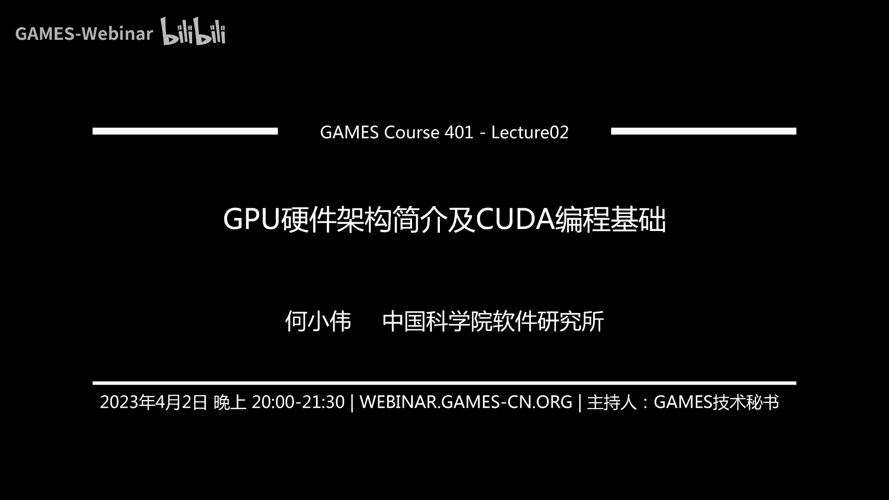
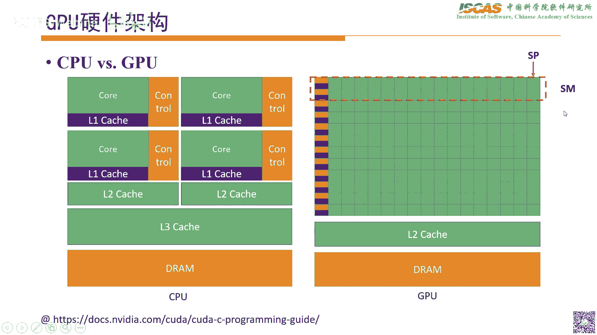
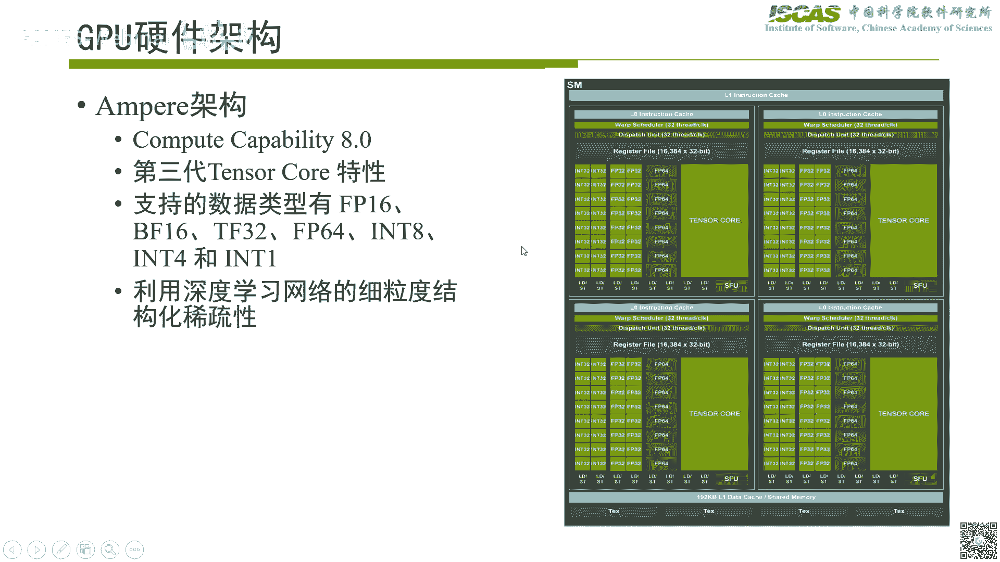
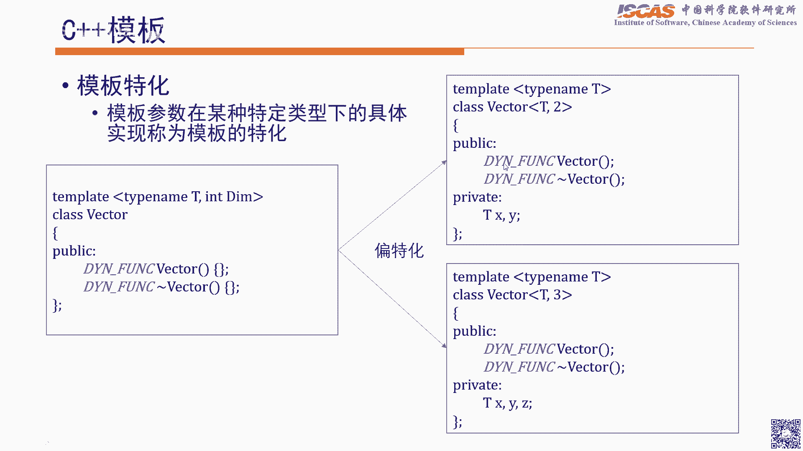
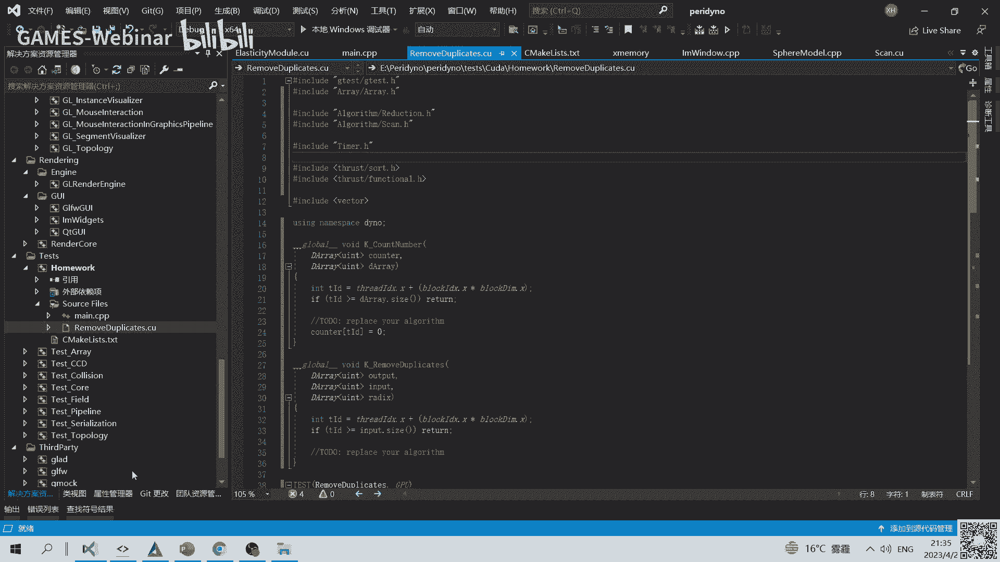
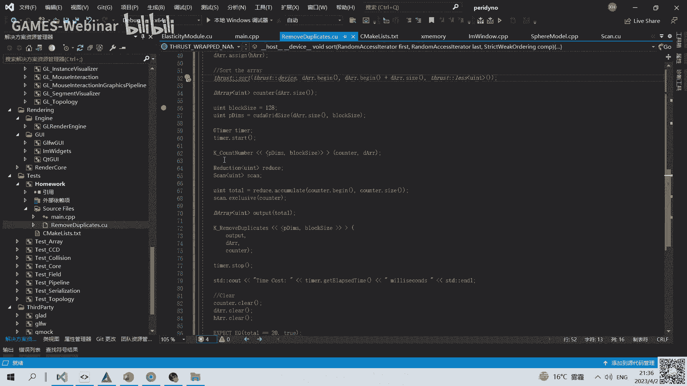
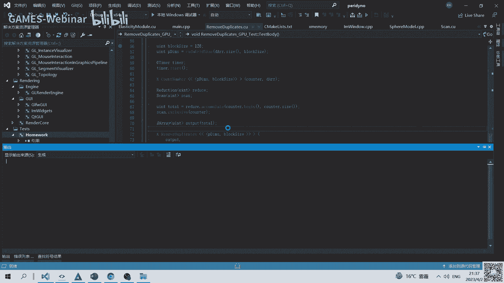
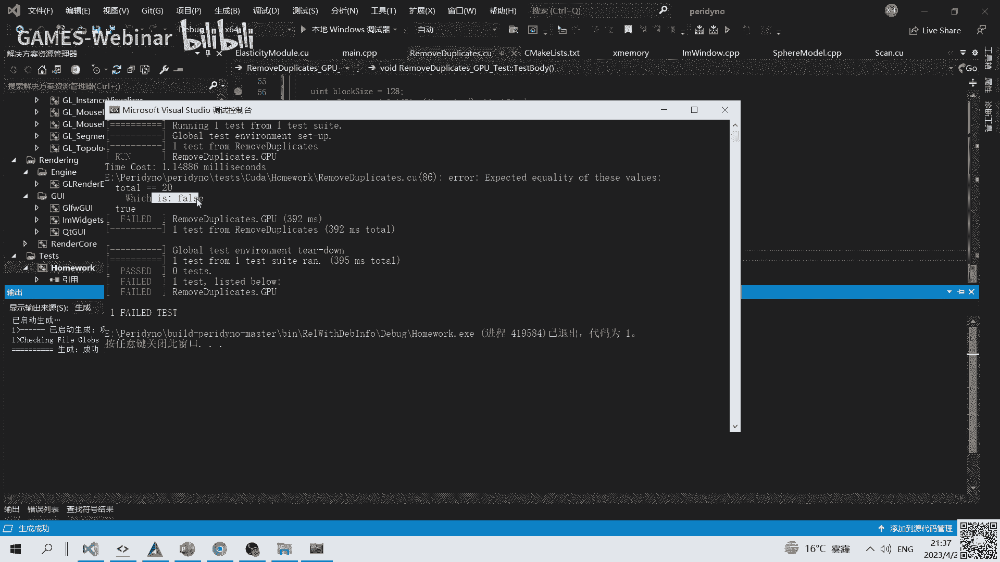
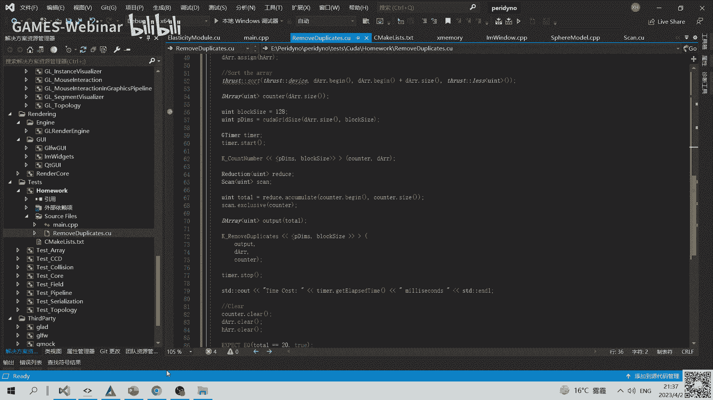

# GAMES401-泛动引擎(PeriDyno)物理仿真编程与实践 - P2：2. GPU硬件架构简介及CUDA编程基础 - GAMES-Webinar - BV15M4y1U76M

嗯行这样我看八点了，那个这样，要不我们就开始了。

然后上周的话应该主要讲了，就是这个系统怎么搭建啊，然后但凡大家对这个系统有个初步的认识啊，然后因为这个系统里面就会着，这里边会包含大量的那个呃gpu相关的一些代码，然后包括并行的一些实现。

所以这样的话就这节课主要还是给大家呃，普及一下，就是怎么去gpu来做一些算法的研发，那其实是这样，现在gpu的后端的话其实比较多啊，就是呃比如像那个kda是一种，当然还有open c啊。

或者或者是那个挖坑等等啊，就是包括dx等等，就这些实际上都可以，然后但是呢总的来说呢是这样，就是挖坑相对来说还是更容易上手，所以呢就这次课呢主要还是以马克为基础啊，就比以扩大为基础啊，就扩大比较简单。

也以扩大为基础，来介绍一下那个呃gpu的一些硬件架构，然后呢以及基于就是说gpu怎么用呃，扩大这个并行编程语言，然后来实现一些呃一些并行的一些算法，然后呢，因为之前好像上次的好像反映，那个网页有问题啊。

这是我调了一下，当然有问题后面也可以反馈一下，这样到时候再看一下啊，然后呢接下来我们就开始啊，就是啊这次的话主要讲几方面，一个呢是会首先会讲一下就gpu的一个硬件架构，然后这个跟啊就是我们了解一下。

就是跟呃，我们以前所认识的就cpu到底会有哪些差异，然后第二个呢就是主要讲一下就是基于这个gpu，然后呢这个呃我们实现算法来说，它整个的一个编程模型是什么样子的，然后当然接下来会介绍重点讲两个呃样例。

然后这两个样例呢是这样，就是实际上用的会非常的普遍，就是如果后面你写仿真算法的话，就是其中一个就是归约算法，然后第二个呢是前缀和算法，这两个算法其实几乎在每一个防御算法里面，可能都会涉及到。

所以呢就基于这两个，就是呃非常普遍的这两个算法来讲讲，就是说gpu啊编程到底需要注意哪些哪些问题，然后当然最后呢就是会讲一下，就是c加加模板的一些相关的东西啊，其实主要也是为了让这个算法更加通用。

然后最后就是呃会讲一下，这个这个算法的一些应用的一些场景，主要主要实际上是这个前面两个，就是包括算法和前缀和算法，就是scan这两个算法的一些典型应用场景啊，然后呢来了解。

就是说这个东西到底会有哪些的一个用处啊，然后接下来我们这来我们来看一下啊，就是整个gpu硬件架构的这么一个一个发展，然后这个呢实际上是以英伟达的这个，gpu的架构为主线。

然后呢相当于列的这么一个发展的一个路径呢，然后总的来说呢是这样，当然其他时间点是非常多啊，然后这里边实际上笼统的可以分呢，实际上分成两个阶段，实际上第一个阶段呢是在呃，相当于左边这个2006年以前。

然后这个以前，为什么说是把这个作为一个时间点呢，因为实际上是在2006年以前呢，是这样啊，当时显卡其实也有也叫gpu，然后呢，但是呢呃之前的显卡主要是用来，就是说比如玩游戏的时候用来做图渲染的。

所以呢它实际上是一个专用的一个图形处理器，所以它一般来说主要是为了做图形渲染，然后当然其实它里边也包含一些，就是说嗯就是呃可编程的能力，因为比如说它实际上就是最最早的话，它其实是一个固定管线。

但是后来的话就是啊其实特定的阶段，它实际上也是可以编程的，但是总的来说呢，它其实很多功能呢还是固化的，所以呢为啊这本质还是为图形服务的，所以这样的话，实际上就整个到2006年以前啊。

这都是呃称之为这个传统传统gpu的这么一个，一个时代啊，然后但是到2006年呢，就这里实际上是一个标里程碑的一个事件，就是呃其实就是英伟达发布了一个test tesla的，这么一个呃一个图形架构啊。

就是这个通用计算的一个架构，然后这个架构跟以前的架构，会有一个什么差别呢，就是以前的gpu的那个处理器，它主要是用来做图形渲染相关的，它很就是很难去，比如说做一些通用计算。

比如说这个时候我要做一个访问计算，那这样的话以前的那个很多很多的那个硬件，实际上是可能不太不太方便或者不太支持的，然后这样的话就是到了这个tea架构停车之后呢，他实际上就是把这个那着色器模型。

或者是这个计算模型呢进行了一个统一，那这样的话也就是说这个计算模型可以用来计，算，就是除了图形渲染以外的其他的一些任务，然后当这里也还有一个很重要的，就是因为以前的话啊。

大家如果看过学过open gl的话，也知道就是以前要编程的话，必须是用比如写这个协定language，当然像是比较典型的，像这个呃gsl或者是h i s l这种，然后这样的话实际上是需要把这个呃脚本。

其实类似于脚本的形式啊，然后发给这个图的那个这个gpu，然后呢相当于它编译完了之后，然后呢去执行，所以这个东西总的来说还是不太不太方便的，包括调试啊啥的，其实很很麻烦，所以这样的话。

实际上那个特斯拉架构发布之后呢，它实际上就在直接在编程的方面，就直接支持c语言的一个编程，这样的话对于很多以前，比如说对孙语言比较熟的话，其实是相对是比较友好的这么一个过程，那当然这个再往后的话。

到2010年的话，实际上就是呃随着那个飞米架构的复建之后呢，它实际上就是呃更进一步的完成了，这个gpu的通用计算的一个架构，然后他这个实际上基本就逐渐越来越成熟了，就相当于从以前的专用的图形处理器。

逐渐的转化，演化成了一个相当于一个通用的一个一个计，算计算的一个架构，然后当然这个后面的再往后的话，实际上就是总的来说大同小异，但是呢其实会有一些差别，就比如主要体现在可能这种呃。

kindle就是这种core的那个变化，比如扩大core，它可能就是要有些像菲米架构32个，然后到开普勒的话，比如是三一百92个等等，然后当还有其他的，就是可能性能上等等会有些差别。

然后当然总体来说其实变化不太大，然后当然到了后来，因为就是整个欧美知道就过去十几年的话啊，深度学习其实发展的非常快啊，所以这样的话到2016年之后，这个帕斯卡这个架构出来之后呢。

他实际上就是呃他特特别的针对这个深度学习，这个任务啊，然后呢就是相当于对他进行了一些支持，所以呢，这里边就是到后面这个瓦瓦瓦特架构之后呢，它实际上就引入了一个叫tea pot，这么一个一个呃计算单元。

然后这个单元，实际上本质主要是为深度学习服务的，然后当然另外还有一个比较啊，有啊就是这个比较特殊的一个地方，实际上是他对那个以前的这个扩大core，进行了一个拆分，因为传统的扩大core里边。

它其实包含了呃整形计算，以及它的浮点型计算的那个两个单元，但是呢到啊后面的价格之后呢，对它进行了一个拆分，这样的话实际上整个就是可以更有效的去利用，就是呃他每个每个单元的一个计算能力，然后当再往后的话。

实际上整个还是也是一些不断的优化，调整或者加速等等各方面的一些变化吧，所以整个实际上就是这个实际上就是，整个是差不多能看清楚，这个gpu的一个发展路程啊，到时候，所以对于有些可能一开始就直接就是接触的。

就是哭大，或者是啊现在比如说大家都用a i啊，就是去训练模型的时候，真的可能对于这个呃以前的这个，他这个历史不太不太清楚，所以这样的话整个啊这块就讲一下，然后当然这里边后面我具体再介绍一下。

这是每一个到底是有什么差异，首先这样就是我们还是来看一下，就是传统的那个图形架构啊，就gpu的架构到底是什么样子的，就是这个是这样，一般如果学图形学的，一般肯定是都会讲的，实际上就是一个传统渲染管线里。

设计的一个内容，然后他当然包含几个阶段了，就是因为传统渲染管线，它其实最主要的一个特点，就是它很多的功能实际上是固化在里头的，比如说一般来说最重要的两个，实际上就是包含一个呃顶点着色器。

然后还有一个天然着色器，然后这两个东西干什么呢，就是因为我们知道渲染的话，实际上它的一个输入啊，对一般来说就是比较基本的一个几何单元，可能就是一些呃离散的点，然后呢或者是一些线段。

或者是一些比如三角面片，然后就这些呢几何单元输进来之后呢，相当于是要经过这个顶点着色器，然后呢对比如说对这每个顶点它进行赋值，或者是比如说颜色计算，或者法向计算这个系列的。

相当于在顶点的层面去完成这个操作，所以这样的话也就这个顶点热射器这个单元呢，实际上只支持，就是说相当于顶端左侧这个这么一个功能，然后呢，这样的话，实际上这个东西就在传统的内存管理里边。

这部分这个计算单元，它是不太可能用来被用来做其他的一些，比如计算任务的说，这样的话再往后的话，比如是一个裁剪啊，影面剔除啊，这等等的一些操作，那当然这个整个这个做完之后呢。

到后面这个片源处理器这个阶段呢，相当于是啊这个就是图形图形学里边学的，就是所谓的就是工程化的一个过程啊，就是把输入的那个点，然后其实是一些呃，基本几个单元转换成一系列的一个像素，因为我们看到这个屏幕啊。

它其实是有一些像素构成的，所以这样的话就需要把一些连续的图源，变成一些离散的点，然后呢，最后呢对每个离散点做一个光影啊等等，这一系列操作，然后这些操作的话，实际上其实也是在这个啊，片源处理器列表去完成。

当然最后完了之后，相当于就是说它会根据这个深度缓存啊，或者那个遮挡剔除等等，这一系列的算法，就相当于最后会把每个片尾送到，就是说他一个真缓存里头，当然这里边会包含真缓存，里面其实包含两个结构。

一个是那个z buffer，还有一个是rgb buffer，rg buffer其实就是我们看到的那个显示器啊，就比如看到那个屏幕，它其实就是一个rgb buffer，其实就是相当于它其实就是可理解为。

就是一个带三通道的，就是r这代表红色，红绿蓝这三个通道的这么一个颜色的一个图像，然后呢还有一个那个深度缓存，这个深度缓存，主要就是用来做片源轴色的时候啊，比如说他要体现前后的一个遮挡关系。

那这样的话就有这个深度缓存之后呢，它实际上就相当于可以辅助，就是说你有些片源进来之后呢，就是被遮挡的那个时间，就不需要输送到那个平面，所以整个实际上是这么一个流程，所以这个是整个管线啊。

就在刚刚讲的2006年以前的那个啊，传统的这个呃，呃gpu里边这个实际上是固化下来的，当然这个东西随着后面的那个就是20年，你们tea架构提出来之后呢，这个东西就发生了一些变化，就是呃因为本身这样。

刚才讲这个有个最主要的一个问题，就是你很多的一个计算单元，它实际上那只能固化，用来做特定的一个处理任务，那这样的话就是这样，我们就要通用这个通用计算任务的话，它实际上它的那个任务的类型啊五花八门。

所以这样的话就啊一个比较好的一个呃，就比较理想的一个状态，肯定是，我希望就是说他们每个计算单元，可以根据我们的需要去去做，就是说相当于去执行，我们按我们的需求去执行特定的一个任务。

所以这样的话实际上就是到后面，就是逐步演化成了，就是我们现在所看到的这个啊，就是叫通用的gpu的这么一个一个架构，然后呢那我们来看一下这个，其实右边那个图代表的，实际上。

就是我们现在看到的一个通缉p c，1r一个架构啊，然后它其实和cpu的一个架构呃，其实也非常像，就是我们知道首先就看左边那个cpu的架构的话，其它主要包含哪几种东西啊，就是一个呢就是最最最核心的。

其实就是它的一个计算单元，就是相当于他实际上去执行指令啊等等，都是在这些库里边去执行，比如像这个cpu它包含了四个core，那这样的话就是实际上就是可以，比如说多线程去执行啊。

然后这样的话整个计算的过程中呢，就是指令的控制啊，然后包括那个数据存取的话，需要依赖，比如这个控制单元，以及当然还有他因为这样的整个cpu的话，他为了保证这个整个呃数据访问啊，以及整个计算的效率的话。

它需要有多级缓存，比如说有l一就是一级缓存，二级缓存，三级缓存，那这样的话就可以减少这个数据访问的那个，这个延迟，所以这个实际上整个是一个cpu的架构，然后其实我们可以看到就是说呃，比如像左边那个图。

可以看到其他cpu的架构里头呢，它整个计算单元跟那个控制单元，你发现其实是一对应的，也就是这样的话，其实有一个专门能力控制单元，去协助你的整个所有的一个计算，所以这样的话。

他其实可以处理更加复杂的一些任务的一个流，就分更加复杂的一些逻辑运算，所以这个是一个cpu的一个特点，然后接下来我们看一下右边那个gpu的一个架构，然后呢其实你可以看到它很多的单元，其实它也是有的。

比如像绿色这一块，它实际上都代表的是他的一个计算单元，然后呢像黄色那个其实他也有控制单元，同时呢也有各种的缓存，比如说呃这个一级缓存，垃圾缓存，当然还有那个嗯显存比较大的一个线程啊。

但是他的那个不一样的地方，就在于发现，你发现就是他整个比如说它的控制单元啊，它其实跟它的计算单元并不是一一对应的，也就是说什么意思，就是他一个控制单元可能要去控制，比如说这里有十哎，应该是几个啊。

这需要有十几个的这个计算单元，所以这样的话也就他相比于cpu来说，它其实它所对应的这个控制单元，计算单元实际会更多，那就正是基于这么一个特点呢，就是也会造，这就导致了就gpu那个整个运行的逻辑。

跟cpu实际上会有一个差异，就是说整个cpu，比如说他因为他的那个控制单，相对来说比较简单，所以呢就是说它实际上比较适合于那种啊，计算密集型的，因为我们可以看到它整个计算单元非常多。

但是它的控制逻辑单元，它实际上非常比较相对cpu来说是比较弱的，所以他比较适合这种计计算密集型的一个任务，然后呢，对于这种比如说有大量的这种逻辑判断的，这个法是cpu的一个优势啊。

然后当然这里边整个就是呃我这里圈出了一块，然后这个呢实际上相对来gpu来说，其实就叫一个呃流逝的一个多处理器，然后呢，他每一个他的那个绿色的一个计算单元呢，它实际上是一个对应的，实际其它绿色的一个。

实际上代表着它实际上实际执行的这么一个，计算单元啊，所以这个架构呢，实际上是构成了一个gpu的一个基础啊，所以后面的话我们会具体讲，就是呃一个所谓的这个流式处理器。

以及跟他的那个流式多处理单元，是一个什么概念啊，然后这个实际上这个右边那个图啊，实际上就是代表了一个流逝的，流逝的多处理器的这么一个结构，然后啊当然这个结构是这样的。

不同的gpu里面实际实际上会有一定的差异，就是说因为本身不同的那个呃架构的话，它实际上为了兼容不同任务吧，稍微有一定的调整，但是总的来说实际上就是从就是tesla发布之后啊。

就大的那个结构实际上基本都固化下来了，就是比如说这里边包含几个最重要的东西，就是首先就是一个流式多处理器的话，它包含肯定是这样，它包含多个的一个独立的一个处理器，然后这个处理器相当于实际上就是。

比如这里有八个显示八个的话，实际上它是每一个他可以去独立的去执行，这个这种运算指令，然后呢，当然这个扩的那个数量就是这个sp的数量，当然每个价格可能不太一样，就刚才讲这个有可能分别架构，比如32。

cp价可能是192，当然这个其实不重要啊，就是实际上就是，因为这个本身也是为了兼容不同任务，然后做了一些债务的一个调整，然后呢除了这个之外，因为整个计算的话，它相当于需要接收指令。

那这样的话就需要有一个指令的一个收发器，也就上面就是这里黄色标的这一块，这块呢实际上相当于是从，比如说他从cpu里边接收到一个分类调用之后，它实际上需要就把那个课程调用转换成。

比如说这个gpu能识别的一个一个指令，然后呢这样的话去分发到这个每个扩张表，具体去执行，然后当然除了这个之外，因为执行的过程中呢实际上会有用到，比如说因为我们知道那个除了算法，你还有数据是吧。

这样的话就需要就是说在呃它每个寄存，就是每个处理器里边实际上会有寄存器，当然这个寄存器是每次上每个处理器是特有的，然后除此之外呢，就是还有比如说像一些需要的memory，这个新的memory。

实际上是所有的这个呃处理器相当于是共享的，所以这个这个实际上就是整一个的一个呃，也是构成，相当于实际上是gpu里面最核心的一个计算单元，相当于是一个构成整个gpu的最重要的一部分。

所以这样的话后面我们再看一下，就是呃具体到比如说某个特定的一个架构，因为这个是最早发布的，就特斯拉架构，然后呢这里边实际上就是刚才讲到的，其实那几个基本都是有的，就比如这个中间那个实际上是它的一个呃。

扩大扩就是它的一个核心的一个处理器，然后当然除此之外呢，这里还有一部分就这个实际上是用来做，就是说比如说一些呃，比如说数学运算，比如像三角函数，sin，sin等等的。

这些特殊的函数的运算的是这个这个处理器，然后当然除此之外的话，其实就刚才讲到的，比如寄存器，当然这里你发现寄存器的数量啊，就一般来说gpu的技术数量其实都很小，就是他跟那个比如说跟我们通常理解的。

比如内存多少个g啊，多少个那个啥，这个其实不太一样，你说它所以它一般来说可能，比如说像这里表示多少个beat，就是呃，所以就是说而且这些寄存器，它实际上是所有的那个core，它实际上是共用的。

就是也就是说你比如你一个q占用太多了，它实际上会挤压，就是说其他扩的那个计算器的一个数量，那当然除此之外呢，还有就是像呃呃敞亮的一个catch，然后包括视频的catch等等，然后这里还有一个很重要的。

就是前面来讲就是有一个shadomemory，但shadomemory其实要比整个要比寄存器要大，但是呢其实也相对来说还也不太大，就是要比整个显显存实际上要很小很多。

当然这两个其实最大的一个好处就是后面会讲，就他们其实在他们的他们的存取的一个速度，实际上是非常快的，然后呢我们再到这个，比如说这个费米架构的话，其实总体差不多，但是呢你发现它其实主要多了几个东西。

就是一个呢就是他的指令的一个呃收发器，它其实你发现它有两组，他跟以前那个就通常只有一组，这个不太一样，所以这样的话它其实具有更强的一个指令，说他的一个能力，但他的扩的数量其实也呃相当于也增加了不少。

然后呢同时你可以看到库里边呃，其实每个扩的话，它其实就主要就包含一个浮点运算单元，以及它的整形逻辑运算单元其实主要是这两个，但后面其实刚才讲了，后面实际上整个在新最新的一个架构里边。

其实这两个东西就进行拆分了，所以我们看那个安培架构里边，你可以看到，就是嗯除了就是说这个标准的一些结构以外啊，就是最核心的就是你会发现它里边的这个呃，计算的那个核心，这就是中进行了一个拆分。

就是以前的话统一这两个东西，就是int跟float这两个东西统一合在一起，实际上就叫一个扩大扩，然后呢到最新的架构里边呢，实际上这两个东西就变成了啊，独立的一个计算单元，那这样的一个好处。

就是因为以前的如果合在一起的时候呢，它主要是这样，它不能同时处理整形，那就是说int和float这两种运算，所以这样的话就需要呃，就是比如说你这个时候有一个call，你在计算浮点运算的时候。

你相当于你接下来有一个整形运算的话，你需要去等待，然后这个相当于拆了之后呢，就可以更有效的更充分的去利用，就是说他们不同的一个运算能力，也就是说浮点型跟整形，它可以同时去进行一个一个计算。

当然其实还有更其他的一个特点，就是因为它整个为了支持ai啊，就是各种深度学习的算法，所以这里边实际上就引入了这个啊tensor core，然后这个东西主要是为了支持深度学习，但更仿真啊。

反正我们可能现在呃这块探索可能相对比较少，然后呢主要还是生活区为主，然后同时它可以支持更丰富的一些数据类型，就因为比如说像因为通常我们知道这个int啊，一般比如说是32位的话，实际上就是一个四个字节的。

但是有的时候很多时候呢就比如说或者浮点型，然后我们实际上不需要那么高的啊，就是其实可能比如说我不需要32位的精度，其实就算了，这样的话我可以用半精度的，或者是甚至甚至是比如说int可以用八字。

也就八个币投四个币，甚至有一个beat啊啊这等等，就这一系列的就是呃较低精度的一些数据，然后去计算就相当于获得更快的一些效率，所以这个实际上就是主呃，就这不同的一些架构上的。

那就不同gpu的架构上的一些一些差别啊，但是呢整体对于我们理解这个呃，整个怎么去用这个gpu去编程啊，其实关系不太大，就是因为它整体的逻辑上的架构。

实际上在第一代实际上就已经确定了，所以接下来我们就看一下，就是用这样的一个硬件架构，我们具体啊就是怎么去做一个算法的一个研发，那就根据前面的那个就是呃可以看到，就是说实际上就是我们如果买了个显卡之后啊。

其实可以看他实际上可以分成三个层次，就是首先就是你看到的，这是一个整合的一个一个gpu，然后呢这样的一个整个gpu呢，它实际上是由一系列的呃，叫流式多处理器来构成的，然后呢这个流多处理器呢。

实际上可以独立的执行一些批量的一些任务，然后当然具体的执行的任务呢，又是依赖于就是里边的，具体的每个计算的一个单元就行，所以这样的话，实际上一个gpu你可以看到它实际上一个三层，三个层次的这么一个结构。

就是从整个gpu到呃流式多处理器，然后到当然是到流式处理器，这么一个三层的一个结果，那对应到我们的软件模型啊，就或者我们的编程模型的话，实际上也是分成三个层次，就是比如说我们现在。

相当于针对一个特定的任务啊，实际上首先我们可以对它进行方块，就是，然后当然块所有的块组成了，类似这样的一个grade，当然这个grade可以是一维的或者是二维的，三维的，实际上都可以。

因为这个实际上取决于你的一个任务，比如说你做的是一个呃，打个比方是s p h的流体的粒子的，那个流基粒子的一个流体模拟的，这样的话实际上只要一味的，但是比如说你是一个欧拉的流程呢，实际上有可能是二维。

当然有可能三维啊，这实际上这个取决于，就是说你具体的一个问题的一个描述，然后呢这breed里边的每一个块呢，实际上就是因为是这样，就是我们知道这个sm，它实际上它的扩的那个数量是有限的。

所以呢你不可能说你任意大的一个任务，你进来之后，我直接都可以塞到这个里边，实际上这也不现实，所以呢实际上是对他需要按照block那个形式，相当给他分块，然后分分块之后呢，实际上每一个块就可以塞到。

就是这个流失的多处理器里，投sm里头去，相当于让他去具体的一个去执行，当然具体执行的时候，就实际上就是会进一步的会拆分成，就我们叫做一个线程，就是每个线程的话，实际上对应的就是一个呃。

这个流式的一个处理器，然后具体去执行他的一个一个指令，然后呢那我们来看一下啊，就是呃结合刚才的那个这个结构，我们看看就是说具体到某个算法的话，就怎么去理解啊，就是这里假设我们有这么一个简单的一个问题。

就是呃如果我输入两个数组，然后呢，我相当于需要把这两个数组里边的那个，逐个元素的把它加起来之后，然后存到呃第三个数组就乘到c的这个数组，然后当这个东西在cpu里面啊，其实这个很很容易啊。

就是其实就两行代码可能就搞定了，就是你输入一个数组，然后呢你写个for循环，然后相当于把a跟b对应的，每个i的元素的a跟b加起来之后，你放到c，然后因为这个东西。

实际上整个它实际上cpu的话是一个串行的，所以它会依次的从0~1到二，一直到最后的n相当于逐个元素的，是把所有的元素都处理一遍，然后当这个东西实际上你会发现就是这样的话，因为其实效率很低啊。

就是因为其实你发现，就是因为他们两两之间其实相互独立的，也就是你在计算零的时候，它其实一它其实并不影响一的计算，所以这个时候呢实际上比较适合于用gpu来计算，当然这里边其实我们先来考虑一种。

比较简单的情况，就是说因为我们知道这个gpu的扩的那个数量，实际上是有限的，然后我们现在一开始，我们如果假设就是呃如果是你的问题，就是你这里也有，因为有个数字嘛，你这个n的那个数量，如果打个比方。

你是小于呃，小于你的扩大的那个或者那个数量，那这个时候什么意思呢，就是也就是你每可以为每个元素相加，你相当独立的分配一个线程去做，那这样的话其实怎么啊，怎么就写代码的话，你怎么去做呢。

实际上这个就比较简单，就是你只需要根据你向他获取他的那个一个，因为这个是扩大的一个呃一个代码，然后它其实这里边像global，是它的一个特定的标识符，然后呢这里边输入三个数组之后呢，你实际上具体的说。

比如说你分配了n个线程，因为你现在扣的数量是大于它的那个呃，数组的数量的，所以你完全可以分配n个，就是n个线程，然后呢每个线程去算一个，相当于算一个元素，就针对的，比如第二个线程。

你可以把这两个氧量加起来，所以这个问题实际上就比较简单，就是也就是说你每一个线程相当于独立的去，可以去计算这里的呃一个元素，那当然现在问题就变成就是说另外的，比如说那如果我们现在输入了一个数组之后。

它它的数量远远超过这个，比如那个扩大扩的那个数量，然后这个时候我们应该怎么去做，然后这里实际上就呃要介绍一个概念，就是啊有个叫wap的那个概念，这个是gpu特有的，实际上就是因为我们知道就是gpu数量。

比如像这个这个sm的，他的那个里边的cos呢，就是包含了差不多32个呃，差不多32个扩吧，那这样的话如果超出这个的额数量的时候，因为我们知道就是具体执行的话，实际上是需要依赖这个破局执行的。

也就是说我现在如果是32个线程，那这个正好是一对应，比如说每个扩只是一个线程，但是呢现在问题如果打个比方，我现在已经超出了，我只有33个了，那这个时候怎么办，这个时候实际上就要对它整个进行分组。

所以呢比如这里边我有一个block，因为block的那个它允许最大的话，实际上是1024个线程嘛，然后这个时候如果是它的线程数，比如说大于这个流式处理器的，多处理器里面扩的数量的话，他接下来怎么做呢。

它实际上就需要对它进行分块，比如这里边呃，里边比如说这里输入的那个数据是72，然后这样的话就是对应的到它的扩的那个数量，或者一个wap的那个数量啊，他其实是相当于32，所以这样的话就需要给它分成三块。

然后呢，这样的话每一块，它其实它的数量实际上就是一个32的，这么一个呃一个值，然后当这里边比如72，它你发现它分成三块的时候时候，它其实是少一部分，就是啊比如像最后一个wap。

它其实你发现它只有八个元素，那这样的话，这个时候它实际上会自动的给它后面去填，就补充完整，就是自动的选择上，都会变成一个32的一个整数倍，所以这里比如对72的话。

他会也就是他在这个rap的那个schedule，或者那个指定的分发单元里面，它实际上会去处理这个事情，就是你一个指令就一个kernel调用进来之后呢，它会根据你的那个调用的那个小区的一个，线程数量。

然后对他按照以rap为单元进行啊分块，然后呢接下来就是美实际上执行的时候，实际上是把每一个rap，一个rap逐步的送到这个呃多呃，这流失的处理多处理器里边去执行啊，所以当然这里边就是呃。

也就是说我们那这样的话，其实其实告诉我们，就相当于就是你如果去呃去准备数据啊，或者是分块的时候，最好这一段实际上就是相当于是，最好是这个wap那个数量的一个整数倍，比如说wap数量32。

那你应该是32乘以n，这样的话，实际上可以保证那个他那个最充分的一个调用，不然的话你相当于后面多出一块的话，实际上会造成比如说你前面有八个计算单元，你实际上在运行的话，后面比如说有24个。

可能实际上处于闲置的这么一个一个状态啊，然后呢接下来我们看一下，就是说那结合这个概念，我们看看这gpu到底是怎么怎么工作的，就是比如说我这里首先在cpu里边，我们创建了一个kernel。

然后呢它对应的如果会有呃，有五条指令，四条五条指令集啊，当然这个指令集我们先不管他到底是干什么的，就是就假设它包含了，就是从0~4这么五条指令集，那我现在创建一个任务呢。

就是比如说他的那个可以分成三个wap，然后呢每个wap实际上在gpu里的执行的，实际上是独立执行的，因为是这样，它其实不能确保，就是你一定是比如说你buff领先执行map一后执行。

或者这个实际上是不能保证的，因为gpu的话，他这个整个进去，它首先它是这样，它可以保证就是说你因为你所有的指令啊，这个因为对，这个是得确保你的整个算法是正确的，所以就说同一个wap里的指令。

他肯定是顺序执行的，因为不然的话你这个零不执行，直接执行一的话，你整个计算结果是不对的，所以它实际上它只能保证的就是说你同一个wap，在比如这个sm里头，你相当于是顺序执行。

就比如说你这个指令零执行完了之后到一，然后到2~3到四，但是呢你看不同up之间啊，其实你发现它其实它整个是乱序的，那这个是什么原因导致的呢，其实就是因为每个指令，它实际上都是有一定的延迟。

然后呢另外就是它指令之间啊，就是呃它实际上相互之间呢又是独立的，所以呢也就他执行的时候需要等这个指令，所有的所需要的那个，比如他需要依赖定的数据准备，也就等他的那个数据都准备完了之后。

他才能执行这个指令，所以这样的话就是你会发现如果不同的指令，它比如说它的延迟不一样，那这样的话他需要等待的那个时间不一样，所以也就是说比如说你这个wap 0的第一个指令，你这会儿已经执行完了。

然后呢嗯接下来就比如执行第二个指令的时候，他因为需要依赖一个数据准备的时候，他这个处于一个等待的一个状态，所以这个时候，那如果是其他的一个wap的那个指令，比如他有指令零，他已经准备好了。

那这个会优先去执行这个map一的一个指令，所以这样的话，整个这个呃也就这里边你会发现有个特点，就是呃因为它相互之间啊其实相当于相对来说，它其实因为是独立执行的，就是所以这个时候你一定要注意。

就是说他们之间的那个数据啊，就一般来说不能相互依赖，就是你不然的话会导致就比如你你wap 0的数据，你要依赖wap 1，你这样的话会导致他整个那个计算结果，有可能会出现问题，或者会整个会有可能会卡死。

然后呢这里边就前面刚刚讲的就是，就是因为这样，就它实际上最后是分成一个一系列的wap，去执行嘛，所以这里边怎么去保证整个执行的一个，那最高效的这么一个状态的话，其实这里有几个问题需要解决。

就是一个就是叫所谓的那个wap divergence，这个问题需要处理，第二个呢就是呃延迟需要去隐藏，然后这里当然延迟主要是包含两部分啊，就是一个是它的一个算算术指令的一个延迟。

第二个呢是一个他的memory指令的一个延迟，然后也就是说你整个因为是这样，就是什么状态下肯定它能运行的最高效，肯定是这样，实际上就是说，也就处理器一直处于工作的一个状态，也就是它不存在。

就是说闲置的状态，那这样的话肯定它的效率是最高的，所以这样的话我们就需要解决这两个问题，然后呢让gpu尽最大可能的相当于去呃，呃就是满腹的去去工作啊，那么这里边首先我们来看一下，第一个问题怎么去解决。

就是，就我们先来看一下这个rap这个什么概念啊，就是因为我们写算法的时候，通常会有很多的这个分支结构，就是比如说有一分二四，然后或者是有这种for循环外循环等等，那这种结构会有一个什么特点呢。

就是因为他其实呃比如说他到某个指令之后，它实际上会分叉，分叉之后呢，他可能有一部分指令实际上是执行的，有一部分的实际上是不执行的，比如像下面这个下面这个结构，如果我们专门的呃，就看中间这一块钱，其他的。

因为实际上每个实际上都是一样的，就是啊对所有的，因为它其实所有的线程其实都没什么差别，但是呢对于中间这一块，因为它有一个bios的剪头，然后这里呢其实你会发现，这是因为这个t i d代表的。

实际上是它的一个线程啊，当然我这里标的是0~3角，实际上我可能只画了16个16个格子，就是我们假设它实际上就是一个wap里的，就是因为这样一个wap，它其实是执行的时候是是去一起执行的。

他也就是说一个wap里的所有的那个指令，它必须是一样的，所以这样的话，也就是说你可以看到这个分支结构的时候，比如他如果到了if，那这样的话对于零的线程，零个线程的话。

那实际上就是呃这里这个条件就判定就成立了，所以这样的话他会去执行这个，比如这个a等于100这么一个指令，然后呢这个时候对于这个你可以看一下，比如后面有个第一个线程，然后呢第一个线程的话。

实际上在判定这个条件的时候，它实际上是不成立的，那也就这个时候他对于这个指令，它实际上是不能执行，但是呢因为呃前面讲，就是如果你一个wap的那个指令啊，其实它必须是一样的。

就是你你不管就是说它是那什么什么结构，什么分叉结构啊，虽然你即使它不执行，但是呢对于这个一的这个线程啊，它虽然就不执行，但是他这个地方还是需要去嗯往前，就因为他诉讼指令的时候，他送的还是这一条指令。

所以呢实际上只是说你这个零执行了一步执行，同样的比如你后边二执行了啊，三不执行等等啊，所以这样的话你会发现有一个什么问题呢，就是嗯你可以看到差不多有一半的那个线程，是处于这个等待的一个状态。

就比如说像这一块儿，针对针对这个上半部分的这个if的这个分支，有一半的线程实际上处于一个等待的一个状态，所以这个整个就会导致就是你相当于gpu，比如说你有一半处于闲置状态的话，你的整个运行效率啊。

就差不多就会呃极大的受到一个影响，那当然到后面那个那else那个部分，其实也是一样的，因为到else的话，其实你的这个零的这个线程，实际上它实际上是不执行的，因为它这个if语句。

它实际上我觉得els以及它实际上进不去，但是呢到一的那个线程实际上就进去了，所以呢你发现到后面那个部分其实也是一样，就是啊这个时候呢，相当于变成了你偶数的一个线程，它实际上处于这个等待的一个状态。

然后呢基数线程处于一个运行的一个状态，所以整个就是相当于也是造成了一半的那个啊，call的那个，相当于他处于一个闲置等待的一个状态，所以呢这样的话，其实会极大的降低这个运算的效率啊。

然后接下来我们就看看，就是说这个问题应该怎么去解决啊，然后当然这个解决办法其实很简单，就是因为我们讲的就是一个wap里的那个，所有的线程啊，其实尽可能的，实际上是要保证他的那个计算的啊。

一个指令是尽可能是一样的，所以呢这个我们怎么做呢，实际上就是那我们是不是可以，就是说比如说我们给它分成几个wap，然后每个wap呢其实进入不同的一个分支，比如说我对于rap 0，比如说0~32个线程。

那这样的话我让他去执行上面那个指令，然后那这样的话实际上这个执行完了之后，下面那本所有的这个指令都不需要执行的，是整个实际上就这个wap实际上就可以直接跳过，跳到下面那部分，继续去执行。

所以这样的话就可以提升整个仿真的一个啊，就计算的一个效率啊，然后当然对于就是说第二第二个瓦盆，那这样的话就是你你相当于是if的这个这部分，实际上它不需要去执行。

那这样也就在后面那个你只需要else这部分，相当于指定区去执行这个，所以这样的话整个就是可以保证，就是说你同一个wap里边，你这个怎么计算的那个指令是一样的，也就是他如果是要跳的话。

他相当于统一的跳过去，然后你如果要执行的话，统一的执行，所以这样的话就可以呃比较好的去保证，就是说你相当于你的整个计算的一个单元里头，你的计算的处理器里头尽可能的被填满，所有的一个一个一个指令啊。

所以这个实际上就是呃降低这个web divergence的，一个最关键的一个地方，就是实际上就是保证就一个wap里面的，所有的计算指令尽可能的一致，然后呢，这样的话就是呃增加就整个呃运算的一个。

存储量事件，那当然这里边就是还有刚才讲的，第二个比较重要的概念，就是延迟的一个隐藏，就是呃因为就是这里，当然我讲我先讲一下这个延迟什么概念，就是呃其实像不管是运算还是这个，就是比如说我们要取数据。

它实际上都是会有一定的需要，消耗一定的一个时间的，然后这里边做了一个统计，就差不多，就比如一个运算指令的话，差不多是10~20个一个周期，然后呢这个时候如果你要去取一个。

比如说你从啊显存里边去取一个数据，那这个延它这个延迟实际上就非常大了，就差不多会在400~800的这么一个时钟周期，然后那这样的话会导致整个计算的话，就是你如果有大量的这种取数据的操作的话。

就整个计划会时间会被这个取数据给卡死，所以这里边就必须得，因为你可以看到它实际上整个gpu的计算啊，就是你发现他整个计算的主要瓶颈，实际上就是在这个呃memory的，那个取取数据的这么一个过程里边。

所以也就是说我们就需要用一定的手段，就是把这个过程的造成的那个影响给它降下来，然后当然这里边就是有一个很重要的一个概念，就是叫它实际上就相当于这个，比如这对应这个流式多处理器啊。

实际上是衡量他就说他工作的一个状态，就是他叫奥特曼，他占有率是这样，也就是刚才讲的就是你一个吧，你相当于他实际上是以rap为单元，不断的去执行的，所以呢你比如说我们最理想的状态肯定是这样。

他无时无刻的呃，就相当于都有wap去填充它的一个呃计算，所以这样的话，就整个它实际上就可以保证，满负荷的一个工作啊，但是呢实际上就是你如果比如说存在这种，额较大延迟这种举止的这种操作的话。

这个会导致就是说你你比如说你现在有三个buff，然后呢你现在三个wap可能都需要去取地址，那这个呢可能到比如说执行到某个阶段之后，然后呢，有可能后面可能都处于一个等待的一个状态。

那这样的话再往后可能就会闲置，然后呢需要等待三个wap里面的所有的指令，它比如说它的所有的数据都准备好了之后，然后再往后执行，那这样也就是说整个它的计算效率啊，会降得非常的一个低啊，所以这里边提高这个。

所以这里是这样提高这个东西的，整个有两个办法，就是呃一个呢是这样，就需要尽可能的，相当于是增加这个vip的一个数量啊，然后呢第二个呢实际上就是，相当于就是说你要降低，整个就是取这个数据的一个延迟。

所以这个是解决这个嗯，嗯就解决就是说提高计算效率的一个，最关键的两个两个地方啊，然后我们后面来看看，就是说这个具体是怎么去理解这个东西，就首先是这样，就是呃刚才讲为什么会有延迟这个概念啊。

就是因为是这样，你比如说你现在对于这么一段代码，就是当这个很简单，其实就相当于是取了一个他的一个线程的id，然后呢你根据那个线程id，然后呢你相当于取两个呃值，然后呢给他做一个乘法的运算啊。

然后当然这里边最耗时间的，实际上你可以看到它实际上是在这个地方，就是a t i d，然后对应到汇编代码的话，其实你发现它其实有两个指令，就是呃，首先就是相当于从t a t i d里边去取一个。

直到计算器里边，直到那个另外一个计算器里边，然后当这个剩下的那个，相当于把这两个再乘起来，这个应该是主要是运算啊，所以这个相对于来说，他的那个延迟并没有那么高，然后我们就看这个呃。

然后我们就看看下面那个图啊，因为其实前面讲的就是如果是那个你取值的话，就是你去取数据的话，你的延迟的周，你的那个周期差不多会在400~800，所以就说他整个会比计算的，远远超出计算的那个延迟。

所以这里边我假设就是就在这里，是这样，就不是按400平方反应，不然就不好画，所以这里我就假设他画了16个周期，就是比如我取一个指令周，他需要等待16个周期之后才能呃去，相当于是把这个数据取到。

然后进行下一个指令计算，说这样的话，就是你可以看到就是说呃，我比如说我现在有多个wap，那这样的话每个wap实际上可能都需要去，因为不同就是一个block里边的那个所有的wap。

它其他的计算计算的那个任务可能都差不多，所以这样的话其实每个wap进来之后呢，他第一步可能都需要去取地址，就是比如说所以他有两个指令，就是第一个要取这个a里的数据，然后这个时候呢。

他这两个实际上都处于一个等待的一个状态了，就是因为它这里边取得有数个周期的话，他需要等到16周期都完了之后，才能进行那个哦，这个应该是后面那个标错了，应该是i2 。

所以才能到这个r2 的那个指令的一个执行啊，然后这个时候他也就那比如这里边他会呃，对于这个wap 0来说，它实际上就处于一个闲置状态了，就那这样的话gpu就没法再往后去运行了。

然后呢这个时候他就把它给挂起来，挂起来之后呢，他会去看第二个，那这个d w e这个也进来之后，第二个rap一也进来之后呢，它其实也是一样的，就是他也要去取地址，然后这个时候到第三个周期之后呢。

他依然也处于一个等待的一个状态，所以这样的话他也需要把这个给挂起来，所以逐渐逐渐的你会发现，就是他就是从0~7之后啊，他其实因为都需要去取地址啊，所以整个实际上就是他如果是针对这个。

比如说他有16个颜值周期的话，他这里边就需要去七个有呃，差不多有八个wap，那八个wap的话才能保证，就是说比如说这个对d这波w7 这个啊，他进来之后，然后这个时候他其实也处于等待。

但是再往后的话你会发现就在这个w0 ，就是它已经相当于是呃，就相当于从等待状态到了一个完整的一个状态，然后这样的话实际上就可以继续往后执行了，所以整个就是延迟隐藏到底是个什么概念，它实际上就是需要通过。

就是说你需要通过大量的这个map数量，就是来掩掩盖，就他这个中间的一个等待的这么一个过程，因为不然的话你如果打仗这里只有一个wap，那你会发现，就是说他这里的两两个周期执行完了之后。

它中间可能要等待总代，差不多14个14个周期，所以这个对于那个占用率来说，实际上是非常低的，所以这个时候就是需要通过尽可能多的，让它相当于分配更多的一个rap来来，就相当于是掩盖它的一个一个隐藏呃。

就相当于他的那个呃养性啊，就相当于它取值的一个延迟，所以这里边其实就很多人会发现就是什么意思，就是并不是说gpu运算的一定会比cpu快，其实得记住这么一个概念，就是cpu就gpu快，之所以快。

它其实是因为它的扩的一个数量比较多，但是呢如果你现在打个比方，你现在的问题啊就是呃很小，比如你可能就是几十个或者或者几个，甚至于啊这样的一个数量，就是计算的一个规模，然后这个时候你去用g p u的话。

你会发现因为它整个它的延迟就是非常的大，然后整个会发现就是它实际上它的运算效率啊，其实并不比cpu来快，然后只有也就是说只有当，就是说你的问题的规模，你的运算数量上去之后，这样的话。

其实他通过这个延迟隐藏的这么一个机制，然后才能保证，就是说实际上因为因为再往后的话，它实际上它整个运算量就上来了，这样的话就可以保证，就你整个计算是逐渐的把那个效率给提上去，所以这里边就是有几个建议。

就是呃对于这个解决这个延迟隐藏的，这么一个问题，就是呃首先就需要去尽可能去调整，它的那个block的一个一个现成的数量，当然前面来讲，就是你要尽可能的让他这个线程的数量，是这个wap的一个整数倍啊。

因为不自然的话就避免可能最后一个wap，它有一部分，实际上是相当于处于一个闲置的一个状态，当然第二个呢实际上就是呃，你要保就避免这个block的那个数量啊太小，因为太小的话你的buff数量不够。

所以呢我也就没法保证，就是说你相当于解决你举止，比如说你去一个新的memory和gloomy global memory，你去旗帜的时候，你们没法保证，相当于你有足够的wap数量。

去掩盖他的那个呃取值的一个呃延迟，然后当然还有，就是要尽可能的让那个boss那个数量啊，就是要尽可能远大于这个啊，流失多处理器的一个数量，因为其实这个问题也是一样的，就是因为流式处理多出一些。

他其实可以并行的去执行所有的那个block，所以这样的话你这个数量太少的话，它其实有一部分的那个流多处理器，其实也是处于等待的一个状态，当然最后就是啊对于最佳的一个性能，因为这个其实你会发现。

就是它很多东西可能都会影响整个运算的一个，性能啊，所以这样的话实际上就是呃针对每个显卡，你可能需要就尽可能多做一些测试，就是呃来发掘，就是说可能最佳的一个一个配置。

然后呢前面讲的就是一个延迟隐藏的一个概念，当然就是呃通过其实调整一个啊，wap就是通过调整那个相当于blood那个数量等等，就这个可以一部分的去降低这个延迟的，这么这么一个影响。

当然还有一个很重要的一个东西，就是实际上还有一种办法，就是直接通过就是多级这个多级缓存结构，来降低这个呃存储器，那就是memory的那个呃，那个相当于在指定的这个影响，然后这里边就是我介绍一下。

就是现在gpu啊包含几个呃典型的一个存储器，就是首先呢是这样最快的，实际上是你每个线程它都特有的，就是每个core它里边都特有的，就是它叫寄存器，然后这个寄存器呢，实际上相当于就是说他他数量也是这样。

他数量比较少，但是呢它效率非常的高，就是因为他呃可以相当于满足，就比如说一些呃，比如临时变量的一个额分配啊，或者这样的话其实可以加速整个整个计算，然后当然就不同的结构它可能也不太一样。

比如有二五的或者其他的一些数量的，然后呢，这个因为考虑到就这部分其实数量比较少的话，其实g p u里边还有一个概念，就是它叫local memory，然后这个memory什么概念呢。

就是如果当你的寄存器，比如说你分配的时候不够了，那这怎么办啊，因为他这个时候你也不能说你这个县城，要不要整个程序你跑不了，所以他这个时候实际上会分配一部分local memory。

那这个memory实际上它整个并不是呃一个一级缓存，它是这样，是从它实际上是从比如说他从global memory里边，其实它相当于映射了一部分进去，然后呢，这样的话就给你的感觉好像跟计算器是一样的。

但是他这个效率实际上是比较低的，所以这部分呢实际上是要要慎用啊，然后当然还有一个比较重要的概念，就是gpu里面有个叫需要的memory，这个学校的memory呢实际上是所有的block，实际上是共享的。

就是也就你一个block里面的所有的线程，其实都是可以共用这一部分写的memory，当然它的数量其实也不大，但是呢它的效率会非常的高，当然其他的是一些那个比如像产量寄存器啊。

因为他这个那常量的那个memory，其实主要是因为它有可读，它只是可读的，那就是他实际上只读的，所以这个时候会有一定的局限性，也就是说比如说你要用常量的话，你相当于你要编译阶段。

你就相当于把这个东西给分配好，当然还有纹理的，那么这也是制度的，这个其实主要是用来渲染的时候用的会比较多，然后当然最后呃最通用的，然后我们用的最多的其实就是以global map。

这个实际上跟内存是一样的，就是呃相当于显存，对应的实际上就是一个一个内存，所以这个这个显存呢，它实际上它的那个数量会比较比较大，然后呢一般来说我们用的时候，肯定也是优先先分配在这个地方。

然后呢再利用就是比如说利用这个呃写的memory，或者利用寄存器或local memory，然后去去加速整个程序的这么一个过程，所以这个实际上就代表了一个g pu的一个，多级的一个缓存结构。

然后呢实际上我们在写算法的时候，就需要依赖这个呃，它不同的这个memory的一个特性啊，然后相当于去尽可能的去发掘它的那个，提升效率的一个点，然后这里我们就看一下。

就是呃不同的这个memory到底它有什么啊，就在效率上啊，我们可以看一下它有什么差别，就是所以其实我们可以看到它，这里面哪几个东西就最快的，就是全寄存器，那肯定是最快的，然后当然也是最好用的。

然后但是他前面讲了，他最重要的一个问题就是额数量非常的少，就是你比如说你只有定义这种标准的，比如说int float或者double等等，这些一些标准类型的话，你可以用这个存器，但是呢你如果这个时候。

你要定一个比较大的一个数组啊，这个时候因为是在寄存器的结构，它不支持这种数组，所以这个时候他其实可能会定义在，直接就定义在这个look memory。

其实刚才讲的他no mary其实是映射到了一个global memory，所以他这两个的那个效率其实差不多，就是差不多是在，所以你可以看对比的话，其实差不多这两个唱两个数量级。

然后当然shield mary的话其实也很快，所以就是呃，也就是实际上在我们写算法的时候啊，就是因为shener要比这个呃，register要比寄存器实际上要大很多，这样这样的话。

也就是说我们在实际上写算法的时候，尽可能的用企业的memory，因为这些memory一方面它实际上相对来说比较大，第二个呢其实效率很高，然后呢对应到具体的那个代码的话，其实我们可以看一下。

就是呃它其实就是这么一个分配的一个模式啊，就是当然就是刚刚讲就是包括呃一些标识符，就比如希尔的，你如果是写代码的话，你想分配新的memory，必须前面加一个希尔的，然后呢或者是那个global的话。

长期就有个device啊，就是还有就是呃常量的话，你必须得按那个，这是当然这是库大的一个规范啊，就是你必须得按constant这么一个呃标识符，然后它每一个实际上会有一个还有生命周期。

然后你发现就是呃首先是这样，他的那个寄存器的话，它的生命周期实际上只在县城内是有效的，然后像包括那个local memory其实也是一样的，然后呢share memory实际上是在整个blog。

其实是所有的block实际上是共享的，然后当然最后比如像后面的global以及constant，这个答案是整个great的啊，这个实际上也就整个应用程序里的。

它实际上都是可以用用这些啊这些啊memory的，然后后面呢我们就看一下，就是呃就结合这个一些具体的2米角来讲一下，就是怎么用这些，就是各种的相当于是多级缓存结构啊，然后包括那时隐藏这些技术啊。

然后呢怎么提升，或者是通过提升那个呃，这个流流处理器的占有率啊，然后呢相当于怎么来提升这个效率啊，首先这样我们来看一下这个一个具体算法，就是第一个是一个叫归约算法，然后这个算法其实很简单。

就是其实你相当于输入一个数组，比如说你从a0 a1 ，然后呢到a n，然后当然你的输出的话，其实就是输出的话，其实就相当于是你把所有的这个书的这些书啊，做一个归约操作，然后当然这里边呃。

这个符号其实就代表一个约操作，但它它可以是比如说是求和或者是求最大值，或者是求最小值，然后将这个是其实都可以，也就是说你用不同的那个操作符，它算出来的实际上是不同的一个结果。

然后当这个东西在比如说你还是刚才讲，就是你如果cpu算的话，其实还是很简单，就是相当于串行的，比如你从第一个元素开始，然后呢到第二个元素，然后呢你逐步相加，然后呢到第三个元素相加组件。

最后把所有的元素给加起来，实际上它整个是一个创业的操作，所以这个呢它的复杂度实际上就是呃，实际上具体的加法指令啊，或者是运算指令，它实际上就是一个n，你输入如果是n的话。

实际上就只需要n减一的这么一个操作，实际上就做完了，所以对应到比如说这里的得一个c i代码的话，其实也是一样的，就是你写一个for循环，然后整个这个计算就完成了，但这个时候我们来看一下。

就是到gpu之后啊，我们看看怎么来处理这个这个算法，当然这里边因为这样他之所以可以用来做gpu，并行的话，因为这样的话，它实际上肯定是存在一定的并行的一个特性的，就是说呃，它相当于它相互之间有一些计算。

是可以独立的去完成的，那这里边我们看一下，哪个计算就可以独立的去做呢，就是首先就是我们可以看一下，就是两两之间，因为他整个最后最后的，它实际上是把所有的加起来，那所以这样的话我们实际上可以。

所以这个东西进行分组，就比如前两个我们算一个值，然后呢逐步的去把两两的算起来，算完之后呢，当然我可以一层一层的，最后给他逐步的算到最后啊，然后这个哦这个可能哦下面那节可能写错了啊。

其实这个后面那几个好像没写，就是其实应该是求和的一个操作，那这样的话最后相当于我们就可以得到，就是一个总的一个求和的一个结果，所以整个gpu的话实际上也是依赖这么一个啊结，构就相当于从最顶层。

因为这个实际上就是一个二叉树了，然后你会发现就是每一个指数的话，那其实完全可以独立的去进行计算，然后这样的话对应到一个gpu的一个代码的话，其实这里啊这个其实比较简单，就是如果是啊还是跟前面一样。

我们假设如果说我们县城的数量，如果是比较，就是数据的数量是小于线程的数量的时候，我们看怎么来做呢，实际上就是我们每一个线程对应一个数据，然后这样的话就两两相加，然后也就比如从第一层开始，然后呢我1+2。

然后3+4，5+6，7+8等等，这样的话就可以从八个再减到四个，减到四个之后呢，然后再是两两相加，然后最后逐步的就把这个一层一层的，把这个东西给加到最后的一个远处。

然后这样的话实际上就完成了一个标准的一个，呃叫库大写的一个代码，然后左边的那个代码的话，我简单讲一下，实际上就相当于就输入一个数组，然后呢它对应的一个数组的一个长度，就是它有个n。

然后将这个thread a d d x呢，代表了它的一个线程的一个id，然后呢就这里边其实有个重要重要的东西，就是它实际上需要有一个计算一个偏移量，就是因为比如你算第一层的时候，它实际上就是呃。

相当于他只是他实际上就比如1357，它实际上是需要去计算的，因为它实际上只需要在第一个线程里边，它算第一跟第二这两个元素，然后当然到后面的时候，你会发现他这个时候呢是变成了啊，从第一个县城。

然后到第五个县城，那就是相当于就是变成了就是呃呃，呃第一个线程到第三个线程，然后呢这两个需要相加，然后呢第五个县城跟第这个第七个线程啊，然后这样的话需要相加，所以这个时候实际上就是你具体哪个线程。

去执行这个操作啊，所以这里边实际上就有一个呃偏移的这么一个，一个操作，相当于是保证，就相当于是让你具体到某一个线程去去算，当然这里边的问题啊就是也比较多，就是呃首先当然第一个就是呃。

因为你这里边你这个数量啊，就是直接用的线程的话，因为刚刚前面讲的就是你扩的数量是有限的，所以这个第一个问题肯定是这样，你怎么去呃，处理更大的这么一个，那规模的一个数据量的一个一个计算。

然后当然这里边就是也比较简单，就是那我大不了，就是比如说因为其实这样的整个呃gpu的话，它其实你一个问题进来之后，你可以对它进行分，就是按block的那个形式去进行拆分，然后当然这里边就是好。

这里写有写的有点问题，就block 3，因为是它一般小于零，小于等于1024，所以呢实际上就是你如果你的问题的一个数量，如果大于这个1024的话，那这样的话你就需要对它进行拆分，就是比如按照1024。

当然你这个具体标和size是多少，你可以自己定，就是比如他主要是有1024以下的都可以，比如51225892562128等等，实际都没问题，然后呢也就这样的话，实际上你就需要按照那个就是block。

然后给它拆分成多a多个，然后呢每一个block呢，就是给他送到一个流失多处理器里包去计算，然后呢当然它局部的就可以得到一个呃，相当于规约的一个值，然后呢这些值都算出来之后呢。

当然你可以把这些值汇总汇总完了之后呢，你相当于再比如说你再用一个block，然后呢对它进行计算，那这样的话其实可以解决，就是呃相当于就是说你数据量，比如说你超过一个block限制的这么一个大小的。

这么一个数据应该怎么去处理，当然这里边其实第二个比较重要的一个问题，其实就是一个延迟的一个呃，如何降低这个延迟的一个问题啊，就是当然这里边就需要呃，相当于是用到一个呃写的memory。

因为前面的话其实这个算法，这个算法的话其实没有用的memory，你发现它直接比如他这个地方取地址的话，实际上直接都是从global memory啊去取地址，然后globe memory的话，这样的话。

他们差不多会有很大的一个延迟的一个开销，所以这里边就是需要，我们第一步要做一个什么事情呢，就需要相当于是从比如这个灰色的，它实际上代表的是global memory。

需要从global memory里边，把他那个数据依次的给它，取到对应的这个shared memory，然后这个新版的memory，相当于就是实际上你可以理解为，其实就是bloom memory里边。

在他的那个数据，在这个新的mary的一个一个镜像的一个拷贝，然后这部完了之后，你可以看到就后面所有的一个操作，实际上就是基于这个其他的memory来做的，就是那这样的话。

因为他也就是他的那个存取的开销啊，差不多快100倍的话，也就是后面的那个计算啊，可以就可以极大的提升它的一个啊一个效率，就是因为他这样的话就是可以减少它，因为就比如说取数据的时候的一些。

等待的一些也开销，所以左边那个代码实际上就是相当于，比如这里被我声明，就是它需要有一个cl的这么一个标识符，然后呢就声明这么一段啊，就是共享内存，共享内存啊，供养险吞噬啊啊啊，然后这个生命完了之后呢。

相当于就是把这个数组就是global，因为这个传进来的实际上一般都是在global memory，然后把global memory的那个数据，然后呢考到这个学校的memory里头，然后考完之后呢。

那接下来就是呃，相当于就是逐步的对他这个呃进行就两两，其实跟前面就一样了，就是相当于两两求和，比如说然后呢相当于在一层一层的从上往下，然后最后呢相当于算到最后一个一个值。

当然这里边你会发现其实这里边还有一个问题，就是呃你会发现这里边有一个，就gpu这是实际上这个gpu特有的一个地方，就是因为这里我只画了八个线程，然后呢呃实际上就是如果是你，比如这里是32个线程画满的话。

就是这里边就会有一个问题，就是它实际上会带来大量的这个啊，叫bank conflix的这个问题，然后这个我们看一下，就是后面我讲一下这个这个什么概念，就是因为gpu的话实际上是这样。

他为了保证就是说他那个呃访问的一个高校啊，所有的那些memory，它实际上是被划分成了大小相等的一些，我们叫一些bank，然后这里当然这里可能标错，就是实际上从011直到31。

然后这个东西实际上你会发现他跟那个wap，实际上是一一对应的，然后呢另外就是它实际上它的连续地址空间啊，实际上是这样，从0~1啊，其实是连续的，就是比如这32个字节跟这三个字节。

32个b词实际上是连续的，就是这里这是连续，然后这个完了之后呢，他又从这里开始，然后呢相当于是这么一个一个排布，然后呢，这样的话就是但是他们之间的有一个特点，就是呃如果是就比如说我现在有32。

32个bank，然后呢这里这是我有32个线程，然后依次去访问这32个呃bank，那这个时候效率是最高的，因为他们之间这个时候就不会啊发生冲突，就是但是呢如果我现在碰到另外一种情况，比如说打个比方。

我们现在我不知道什么原因，然后呢可能导致就是说我所有的那个线程，然后呢，可能就需要去访问同一个bank里头的一些数据，那这样的话会导致就是说你相当于是，比如说我这个第一个线程去访问了，那在后面那个32。

30个线程去访问的时候呢，他就需要在后面排队等待，然后这样的话也就是把原先一个，比如我原先一个指令，我相当于把三就是32个数据，我可以都都取出来的这么一个问题，就变成了。

比如说我想当每个线程要逐步的去去，这里边的一个数据，也就这样的话，你相当于32线程就变成了一个创新的，这本来是应该并行执行，32线程，变成了一个串行的一个这么一个操作。

所以这个实际上就是这个写的memory，比较特殊的一个地方，所以呢就是说也就是你设计算法的时候，要尽可能的去避免呃这样的一个问题发生，所以这里边就是，具体这个时候怎么去做啊。

就是前面那个比如说呃因为这里只画了八个，我假设就是呃1~4是一个wap，然后呢4~8是一个wap，然后那这样的话，其实前面的话你如果两两去取的话，就有可能会导致他的那个相当于就是呃，因为那个相当于冲突。

然后造造成的这个比如说顺序去取，就是比如说你呃这两个线程你在做了，比如一跟二，这个时候你已经在计算了，然后这个时候你如果五个六也是计算，然后这个时候比如一跟五，它访问的是同一个bank的时候啊。

这个这个时候你相当于它就会变成一个串行的，这么一个操作，所以解决这个问题的办法其实也很简单，就是这样的话，实际上我那怎么办呢，我相当于是把呃，就是说那比如我这里是前四个对应的一个bank。

然后面对应的另外那个呃四个bank，所以这样的话，我相当于是把这前四个相当于去计算的时候，我第一个线程我相当于可以跟第五个去计算，因为这个你会发现，它虽然比如说对应的是同一个bank。

但它其实对应的是两条不同的指令，也就是说我第一个线程去计算的时候，就是它相当于先会去取第一个呃，比如这里这个bank对应的这么一个额数据，然后这个时候呢取完之后呢，然后他还会去取。

比如说这个bank的数据，就是说虽然他两个实际上就是有冲突，但是呢它因为它整个执行也是顺序的，所以这个实际上就不会造，造成这个整个那个bank conflicts，所以说这样的话就是怎么吃。

也就是说后面的话也是一次的，就是这样的话，就是逐步的就把剩下的那个操作做完，然后呢也是两点，当然这个后面的计算整个是一样的，所以这里边整个改动的话，你看这个代码其实主要做了一个什么改动。

就相当于是把以前按照就两两，就是前后两两相计算的，这个就变成了就是按照好rap，一般就是就按照相当于啊对半分，然后相当于按照block，然后呢呃取bar，然后这样去去处理。

然后这样的话就可以尽可能的避免就是，就是共享显存，然后相当充足的那么一个问题啊，当然除此之外还有一个好处，就是你会发现这样的话，就是他因为他所有的线程实际上都挨在一起了，就比如1234。

他这四个线程实际上都挨在一起，然后挨在一起的话，他其实可以保证，他的那个指令是尽可能是一致的，也就也就是说尽可能的提升了他的那个啊，相当于整个gpu的一个占占有率，是这样。

然后讲了前面那个我们后面再看一下，就是另外一个还有一个算力啊，就是呃叫一个前缀和的这么一个算力，然后这个算力跟前面的那个其实差不多，就是输入的话也是从零到n这么n个一个数。

然后当然输出的话就稍微有点差别，就是他因为主要相当于是要呃，相对需要前去的一个计算，就是比如a0 的话，它当然是本身，当然a一的话到a的一的话，它需要相当于把前面的那个所有的数据。

然后跟他做一个这个操作，然后当然到最后的那个数据的话，实际上就是从a01 直到a n啊，所有的那个数据得得操作起来，然后这样的话我先讲一下，这里边这个思想是怎么去做的，就是嗯这里其实有个经典的一个算法。

时间当然就1999年，这个本来是提出来的，然后他其实就是从它包含两个阶段，就是一个呢是从啊从底向上的这么一个阶段，然后这个阶段呢，实际上他用了一个二叉树的这么一个概念，就是呃相当于逐步的从底下。

相当于因为把比如说把底下那个元素啊，实际上都当做一个叶结点的话，它实际上是可以完整的构建出，这么一个二叉树的，然后呢从底向下的过程呢，它会逐渐的去把这个值，就是因为是这样。

这个前任何操作相当于需要把前面那个数据啊，就跟后面那个数据，然后相当于操作完了之后，然后呢要存到后面，所以这样的话他先创建它的，比如说从叶子节点先去创建它的那个，就是相当于他的那个内部节点。

然后这里呢实际上就像比如我这里，假设是两求和操作，所以这里比如两两之间求和求和完了之后呢，再往上也是两两之间求和求和完了之后，当然这个到最顶上的话，其其实就代表的是所有的这个叶子节点的一个。

一个所有的这个求和的一个结果，然后呢，这个你会发现就是最顶端的那个叶子节点啊，它其实就是我们要的这个最后面那个，因为这样我从前往后求和的话，最后一个呃，这个点实际上应该是存在。

相当于是整个数组的一个求和的一个结果，所以说你相当于如果你看这个结构的话，其实你发现如果是你单独拎出来数的话，它其实这个值应该是放到这个最后，然后当然其实我们额外的，我们可以看一下它那个结构。

还有一个什么特点呢，就是你如果你再去看他的两棵子树的话，就是呃一个是他的左指数，一个是右子树，因为你如果看这个指数，当他这个36当当包含，包含的是在前面八个元素的一个一个和，然后这里的100。

相当于包含的是这里边的那个，八个元素的一个和，那也就是说你可以看后面那部分，就假设啊，如果我们这两部，就前面的部分跟后半部分已经独立排序，就是计算完了，那这样的话，你可以看一下后面那个最后那个元素。

就是我现在按照那两颗指数线去呃，先去操作，那这样的话操作完了之后，你会发现它缺一个什么东西，就是它实际上就缺这里的一个值，这个36它实际上没有算到这个呃，又把这棵子树里头，所以呢。

也就是他接下来会有一个向下的一个操作，就相当于需要把左子树的这个包括，以及因为它上面因为也是需要有一部分，相当于要累加到呃这个叶子节点里边，那两个值需要逐步的相当于又从从上往下。

相当于把这个东西给算下来，所以具体是怎么做的，就是我们来看一下，就是嗯接下来就是从呃，从从上到下的这么一个过程啊，首先就是这里边需要第一步就需要去替换掉，就是100 136。

最最root那个节点里面那个值，因为它这个只替换成这个代表什么意思呢，就是它代表的就是我这个节点需要加到，比如说底下叶子节点里面，到底需要加加上啊多少，比如像这里边最顶上那个叶节点，因为它已经136了。

所以它实际上并不需要，就加到这个底下的每个叶子节点，然后呢对应的就是那这个叶子节点，其实也就这个中间的一个节点，其实也是一样的，因为它这个36，实际上并不需要加到这里边的，因为它实际上是一个总和。

但是这个36要加到啊，右边的那半颗子树里头，所以这里边有个操作，就相当于他需要把这个零呃副导这里边，然后同时把这个36跟零加起来之后，因为这两个他的就是这里左边这个节点，以及它的附节点，这两个是对应的。

实际上是都需要加到其它的右子树的，那个所有的这个叶子节点里头，所以一次的话实际上后面也是这么一个操作，就是你相当于比如说你这里的再往下的，好像把这个灵庙附到这，然后把十十跟零加起来之后就放到这儿。

然后这个地方呢也是一样的，就是你把这个36，就原来那个36就要放到这里边，然后呢同时两个加起来之后呢，要放到这个后面这个地方，那我这个地方可能有点又有点搞错了，就是应该是哎我看一下啊，因为这个36。

然后这个是36+42，36+42，然后这个才是78，所以这个可能就因为左边这个，实际上还是那个42，然后就这样完了之后，然后呃因为这个36完了之后，是加到这里边才能没错。

所以这里36+42之后才是才78，所以这样的话一层一层再往下的话，实际上才是最终，比如说到这个这一层，然后再往后的话，实际上就是你可以看到就变成了一个0136，10 15等等。

就一直到120这么一个一个操作，那么所向的话，就完成了整个前序和的一个所有的啊，就是先从下到上，然后从上到下这么两个两个过程啊，然后呢对应到我们这里来看一下，就是如果对应到整个gpu的一个实现里边。

那我们继续来看一下，这是啊怎么实现呢，其实也是一样的，就是呃从global memory里头我们相当于创建了一个数组，然后这个数字完了之后呢，当然这个第一步，因为这个主要是为了降低这个延迟的一个响应。

就是延迟的一个开销，就是取值的延迟开销，所以这样的话第一步就需要把从globe memory，我给他呃，取值啊，去这个数据到一个shamemory，然后完了之后呢，就两两往上那个逐渐的去计算。

然后计算完了之后，第二第二个阶段，实际上就是从上往下的这么一个过程，就是相当于从这个零，然后到这，然后呢零跟这个原来那个值相加，然后放到这里边，然后呢，这样每科指数呢，依次递归迭代的去完成这个操作。

然后当到最后的话，就是也是恢复出这么一个那个数据，然后当这个前面，因为是讲的是一个二叉树的一个结构，它实际上实际做的时候，它实际上是不需要额外的分配空间的，因为它可以在原地的。

那相当于就原来那个数组里边就去完成这个啊，整个所有的那个计算的这些任务啊，然后到这里边就是还是就是我们来看一下，就是呃就是以这个为一个基础的一个版本，我们看看它里边有哪些问题。

当然首先第一个还是因为他的那个就整个在，如果放到那个gpu里边去算的话，就是呃他的那个，gpu的占有率时间还是比较低，因为你可以看到就是呃如果是按最紧张，就是当然底下的还好，因为底下的话其实两两之间。

当然你可能只有一半的处于闲置的一个状态，当然你看上面的话，其实这样的话就是你会发现越往上，他整个闲置的概率就越高，就是它前置的线程数量会越来越多，然后呢解决这个问题，当然其实也呃其实这跟前面是类似的。

就是怎么做的，那这样的话，我因为比如说我实际上不需要顺序的，比如说从每个元素都分配一个线程，我其实比如说我对对于最底下这一层呢，完全可以，比如说我隔比如隔一个数据给他分配一个线程，那这样的话。

比如第零个线程处理的实际上是地理，第相当于第一个数据，然后第一个线程实际处理的第三个数据，然后依次这样的话，也就是说可以降低它，整个就是说闲置的这个线程的一些开销，然后当然这里除此之外。

还有一个比较重要的一个东西，就是呃memory就ban conflict，就是主要还是memory banconflict的这个问题啊，然后这里的问题就是跟前面的，可能稍微有点不太一样的地方。

就是因为是这样，它其实是一个二叉树嘛，这个二叉树的话，你会发现就是它越往就是它越往上的话，他其实它相互冲突的可能性会越来越大，就是因为比如说像这里边啊，你你可以看一下，就是如果是按照唉我看一下啊。

哦这里应该是，哦这里有可能标错，这里线程应该是一样的，就是也是32 32 32 64，因为他wap的那个数量跟那个地址是一样的，然后这里边就是你可以看一下，就是有什么问题呢。

就是比如说我现在在去取这里的一个，wap的这么一个地址的时候啊，然后比如说我这里有一个，还有我看看，好这里是这样，就是还是假设我们现在有一个32个一个wap，就相当于它包含了一个32个线程。

然后呢这里32个线程是这样，就是你如果去取地址的时候啊，其实就相当于，比如说因为你按照这里的结构去取的话，你会发现就这个线程应该是他要取两个，就一个呢是第零个，第二个呢是取第一个，然后呢。

这样第一个线程呢，就是这里是取第三个跟第四个，所以你到这里之后，你会发现就是对这一个wap它其实取地址的时候，比如说它是会跨越这个wap以外，它实际上就到了，就是我下面标的那个是地址啊。

所以这里边可能有点混乱，就是实际上就相当于你去第零个线程是取得，实际上是第零个地址，然后呢这个时候你第16个线程啊，第16个线程你实际上会去取第32个地址，然后这个时候你会发现。

这个零的地址跟30个地址，这个时候实际上是这两个是处在同一个bank，conflicts，那就相当于处在同一个bank，然后这个时候你会发现，就是因为他所有的这个线程啊，就0~32，就是31，是这样子。

0~31，这个线程的实际上都是处在同一个wap里头，那这样的话，也就是说你在执行第零个线程的时候，那你这个时候同时去执行第16的时候，你实际上是需要去等第零个线程，相当于执行完了之后才能继续往后去执行。

所以也就这个时候会造成一个什么问题呢，就是你相当于前一半，你在执行的时候会阻塞，后面一半，就是16~31这个线程的这么一个执行，那这样的话就是会造成大量的这个一个，就是线程运行的一个等待。

然后呢也就这里边解决这个问题，答案其实也比较简单，就是那这怎么办，就是因为其实相当于前面我们可以看到，它实际上就是这个主要是因为零跟16，实际上就是有一个呃，那这个时候我们怎么办呢。

我们相当于可以对它做一个偏移，就是相当于wap之间，就是我们这里因为是这样以rap为呃，就是相当于给他呃32，就是按那个他的那个相当于他需要memory啊，底下的学memory按32为单位。

然后呢相当于两两之间呢，我们给它插了一个32个bit的，这么一个数据进去，相当于这一部分数据实际上是空的，然后也就是说我们在取32个数据的时候呢，给他放到这个33的这个地方。

那这样的话实际上你会发现就是零跟16啊，他们这个时候去取值的时候，他们实际上就处处于不同的一个b，然后也就这个就可以解决，这个就是bank冲突的这么一个一个问题啊，当然具体代码的话。

其实这里边会有就是panama，其实会有一个叫呃scan，这么就call里头会有一个can的算法，然后大家感兴趣的话，可以去看一下里边具体怎么去呃，解决这个问题，相当于这里边实际上最核心的时间。

就是这里边需要有个offset，然后呢去给这个需要的memory，相当于可以增加一个偏移量，然后呢保证就是说你0~31个线程，它取值的时候呢不会取到同一个bank，然后接下来就是这里边很呃，就这样。

就假设我们现在已经写完，前面的那个算法之后啊，后面我们就是呃如果到具体应用的时候，我讲简单讲一下，就是这里边应该呃有些还有哪些额外的呃，一些需要去做的一个地方，就是这里主要就是涉及到c加模板。

编程的一个问题了，就是因为实际上这里边主要问题在于，就是我们通常写算法的话，可能比如说我们写完一个算法之后，就是这个时候如果存在一个什么情况，比如我们针对那个int，我们写了一个呃就是规约算法。

然后呢这个时候我们现在又进来一个float，比如我们可能也需要写一个归元算法，那这个时候呢我们不想，比如说我不想再重复写一遍啊，所以这个时候就需要依赖这个c加，加的一个模板。

然后呢这样可以减少我们整个编码的工作量，然后呢整个模板的话其实主要包含两类啊，就是一个是啊模板函数，就是它的这个声明的过程，实际上就是他以template打通，然后当然啊包含整个一个类型名。

就是type nt，然后当然就是哦后面这个应该也是t啊，然后比如说那个包括后面就这个函数名称，然后呢以及后面的一个电脑类型，然后当然还有函数，还有模板类，它其实也是类似的一个声明的一个形式。

然后呢当然声明完了之后呢，额外的还会有一个定义，就是啊比如左边那个实际上是一个函数呃，模板的这么一个定义，幽默哪个呢，实际上是一个函数类的这么一个定义，然后呢具体做的时候呢是这样，就是啊，因为像以往。

比如说我们不考虑这种函数模板的话，那这样的话我可能需要针对每个，比如说打个比方前面那个求和的一个函数啊，我们可能需要针对每一个都需要写一个呃，写一个实现，然后呢比如针对int或者floor。

我们可能都单独写一个，那这样的话就是有个问题，就是很多时候，我们的算法可能是需要去啊去更新，比如我们算法的效率，我们发现以前的算法效率偏低之后呢，我们可能要改进已有的算法。

那这个时候你如果是按遗忘的这种做法，你可能每一个算法你可能都需要去更新一遍，那这个实际上对于工作量来说其实会增加不少，那这个时候如果用模板的话，就是相当于整个就把呃，因为其实这里边是这样。

所有的函数的实现啊，就可能基本都差不多，但是呢唯一不一样的地方，可能就是他的那些类型，可能实际上就是需要替换掉，所以这个时候就很比较方便的，用这种函数模板的形式，比如说就是对于这个int和float。

然后就给他替换成模板，然后呢这个时候这个模板设备完了之后，然后具体我们调用的时候呢，这个时候有编译器，它会根据比如说我们传入的这个类型，比如说它是int或者float或者double。

那这样它实际上会去做一个，实例化的这么一个过程，也就是这个过程，实际上不需要我们自己显示去做，就编译器相当于就可以去帮你生成，就这个模板函数的各种实例，然后这样的话就可以减少整个我们的一个。

编码的工作量，然后当然这里边其实还有一个需要讲一下的，就是打个比方，如果我们现在碰到的是某一种类型，这种类型的是这样，可能是自定义的类型，或者是这样，我们还有一种需求呢。

有可能比如说我们现在这个求和操作，我们可能就需要针对特定的类型，我们需要去做一个特定的一个实现，那这里边实际上这个时候，就是我们需要怎么去做呢，就是这个就涉及到一个啊c加加的一个模板。

的一个特化的这么一个概念啊，就是这里我举了一个就是vector的这么一个例子，就是比如说我们通常说明一个模板，那这里边我们生命的一个模板，然后它包含啊，比如它的一个类型，然后它的一个维度，然后呢。

这里边你可以看到它的里边的一个结构啊，它其实也不包含任何的一个数据，那这个时候我们比如说我们可能需要针对呃，比如三维空间，那我们需要定位一个三维的向量，或者二维空间的定义，一个二维的一个向量，然后呢。

其实你可以看到右边，这是二维空间的向量和三维空间的向量，它其实它的那个包含的数据是不一样的，就是vlog空间呢，其实只包含那个x和y这两个量，然后呢当然三维空间的话实际上主要包含三个，就是所以这样的话。

也就是说我们需要对特定的模板做一呃，一些特殊的一个处理，所以这个过程实际上叫一个特化的，这么一个过程，也就是说我们相当于可以对某些呃，它的一个参数类型，然后做显示的一个特定的这么一个定义。

然后在当然这里边其实有两种概念啊，这个是全特化，全特化的话相当于我相当于里边的餐，这个模板参数里面啊，就是他所有的参数相当于都显示定义它类型，然后呢接着相当于去呃，相当于去做它的一个实现。

然后呢当然后面还有一种偏特化的，然后这样特化的完了之后呢，就是这里的呃是什么概念，就是因为以前如果我们不做特化的话，就比如用编译器去决定的话，这个时候他会相当于它默认的，可能就会生成这样的一个结构。

但是呢这里边它如果是识别到了，我们已经做特化了，那就这里边比如说我们输入的，如果是以后声明的，比如说一个float 2啊，flow 2这么一个类型的，这样的话它实际上会以这个定义，然后去替换掉。

就是说他编译器相当于默认生成的，这么一个结构，然后当然就偏特化的话，其实呃就我们可以对某一部分去做处理，就是比如说这个相相当于这里的定义一个类型，一个维度，那比如说我们相当于类型的话。

我想还是保留它作为一个它的一个，相当于作为它的一个参数模板，然后呢这个时候我们对如果是二维的，比如说对于三维的，比如这个特定的参数需要去做特化的话，实际上就相当于就是可以做偏特化。

也就是对于特定的一部分啊做特殊处理。

然后这是c加加的一个比较特呃，就是用模板来比较方便的一个地方，然后呢这里有有了这些东西之后啊，然后我们看看就是针对前面那个规则算法的话，就是有什么好处啊，就是这样的话，实际上就是比如说我们针对不同类型。

实际上我们只需要写这么一份代码，然后这个代码当然是也是在库里边也是存在的，然后呢这里边我们可以声明两个两个呃，模板参数，就比如一个类型，这个类型呢可以包含。

比如说是int或者float或者double等等啊，然后各种类型都可以，然后只需只需要保证就是这个类型，它实际上就是呃，就相当于它规约的那个操作是合法有效的，其实就可以，然后当然除此之外呢。

就是因为我们叫飞跃算法，其实有很多操作符啊，所以这样的话其实对于他的操作符呢，也可以以一个类似模板函数，这么一个形式给他传进来，然后比如说我们现在是求和或者是求啊，求机或者是求那个呃。

比如说是求最大最小等等啊，那这样的话可以函数的形式给藏起来，也就后面所有的你会发现就是那这样的话，就是所有用到这个比如参数类型的那个地方，实际上都用这个模板参数给它替换掉。

所以有了这个之后呢，实际在实际调用的时候啊，就是那编译器会根据你的，就比如说这个输入类型，比如说我输入的是一个，就是某个特定的一个数组，然后呢，比如这个时候我希望它是一个求和的一个模板，参数参数。

然后呢这个时候他去调用这个的话，实际上就会呃根据这个模板的参数的这个类型，然后进行进行进行求和一个处理，那当然额外的还有比如说像求最大值，求最小值等等啊，这一系列的一个操作。

那接下来的话就是我们结合前面讲的，我们来看看，就是说那个具体有哪些应用啊，就是呃包括前面的规约算法，以及比如说呃求个前缀和的算法，以及就是说刚才讲的那个啊，模板的那个那个一些操作。

然后看看具体在场景里边怎么用的，就首先我们来看一下，就是第一个场景就是是一个领域，就s p h里面的一个领域，球领域查找的这么一个操作，就是因为这sb它实际上每对于每一个点，他需要去计算。

就是他处在这个点周围到底包含哪些啊，哪些点，然后呢，这样的话需要把他们的那个i d，实际上需要给它记录下来，然后记录下来之后呢，后续比如说我这个时候需要去计算它的压强，或者就像他的一个密度等等。

这个时候可能都需要用到，然后呢这样的话对应到有个特有一种结构，就是这个实际上就是c加加里边的话，如果我们以c加加里cv的这个概念来描述，这些东西，实际上就相当于，它其实就是类似这样的一个结构。

它实际上就是一个vector里边再嵌套一个vector，也就是说心里边呃，privector对应的实际上就是你呃粒子的一个数量，然后呢里边的mtor就是你相当于每个数量，你就每个例子啊。

它其实呃包含相当于它领域的一些i d，啥也就相当于他也是可以存在一个vector，但这个结构就是呃虽然可以满足这个需求啊，但是这里边会存在一个什么问题呢，就是就他那个碎片化会比较严重，就是这样的话。

就是实际上你去用这个结构的时候，你会发现非常的非常的慢，因为主要是这样，你你发现就是呃每一个vector，因为这样你如果在呃内存里边，你去分配一个vector du vector。

它的那个在内存里边是连续的，但是呢你里边再嵌套一个vector之后啊，就是相当于这个比如它内存的vector，他的那个数据它可能是在整个内存空间呢，实际上并不连续，它是相当于是分段的。

所以这个时候呢就是你去取地址啊，或者取数据的时候，就会造成可能大量的一个miss，所以呢就严重的会拉低整个计算的一个效率，那这里的话就是我们信号就是在就是pdate呢。

实际上这样就是引入了一个叫release，这么一个结构啊，然后这个结构它什么意思呢，就是因为前面讲，就是你因为你实际上你要提升这个效率，主要还是要解决他的那个，碎片化的这么一个问题啊。

所以这样的话实际上我们希望做的什么呢，就是把就是所有的数据，尽可能的在一个比较大的一个连续的空间里边，给它给保存下来，就是或者开辟出来啊，所以这里边就是这个结构里面就包含三个结构。

就是其实其中最中间的那个实际上就代表了，就是实际上你要存的那个实际的比较领域的id，这个实际的一个数据，然后但是呢这里边针对每一个，比如说你针对每个例子，每个例子它其实有多少的领域的一个数量。

然后这样的话就把它保存在，比如针对第零个例子，他这里边比如说它需要有有两个那个呃，相邻的那个id，然后需要去保存，然后呢这个所以所以说这个前两个对应的，比如是d的一个例子。

然后呢后面两个对应的是第一个例子生，所以就是你可以看到所有的粒子，它对应的这个id啊，实际上都是保存在一个连续的一个空间里头，然后呢除此之外呢，当然这里面还有一个y的一个结构。

就这个实际上就跟c加里那个，s d l的那个结构就比较像了，就是因为它还有有需要有一个指针去，比如说去呃，代表它到底哪个是一个表图，所以呢针对这样的一个结构。

我们需要怎么去啊分配啊，就是那这里实际上就需要用到，就是前面讲的就是一个啊reduce，以及跟以及一个scan的一个操作，然后这里边假设我们现在已经知道了，就每个例子它对应的一个领域啊。

有比如说有啊起这么一个数组传进来，比如说第零个数据，它第零个例子它也需要两个空间，然后呢去纯它的一个领域的一个例子，然后呢比如第一个是也是两个，也就这个时候，我们需要相当于第一个要做的是什么。

就是相当于把所有的做一个求和，求完和之后呢，我们要知道诶这里一共需要多少呃，呃数据，然后呢去把所有的这个领域的那个id，存到一个大的一个数组里头，所以这里面你可以看到，就是你这个数组进来之后。

实际上第一步要做的，实际上就是叫一个去累累计求和的一个操作，其实就相当于是要统计里面，到底需要多少个元素，然后这个完了之后呢，接下来还有一个，就是因为前面还有一个辅助的一个结构，需要告诉每个例子。

它的就是相当于每个粒子对应的一个领领，领域列表，它相当于它的起始地址跟它的啊结束地址，所以这里边实际上还会有一个skin的一个，一个就是呃前聚合的这么一个一个操作。

然后这样的话这个结构实际上就是用来辅助帮，就是每个去相当于是你标每个粒子，然后去对应的去找他的那个起始的一个呃，列表的一个起始地址，以及它的一个结束的一个地址，当然完了之后后面是一个实际分配空间。

比如包括后面一个list的这么一个结构的一个，初始化的这么一个过程啊，所以呢这里针对这个结构呢，实际上就我们可以看到，就是里边就有包括reduce啊。

包括skin这两个算法的实际的一个，应用的一个场景，当然这里面还有一个场景，当然也比较常见的，就是比如说我们现在已经输入一个结合模型，然后那里边可能会有一堆的点，然后呢这个时候我们可能要做一个什么事情。

就是我们需要去求他的一个bbox，那这里边实际上就是主要，就是根据书的这些顶点，实际上就是相当于去算他的一个啊最小边界，然后当然包括啊这个上面那个是最大边界，然后下面那个是最小边界。

然后根据这两个边界呢，然后相当于是呃，实际上就得出了你相当于需要的一个bbox，然后这个是针对哪种表，比如说你数据量比较少啊，那这个实际上也没必要，就是比如你可能进来就是一个box，那你去再去算box。

你可能只有几个点，你cpu算也比较快，但这个时候你如果是输入了，可能是100万个或者是甚至更多的，那这样的话就可以用这个gpu的这个算法，然后呢整个可以高效的去计算他的一个bbox。

但这里面最后还要讲一个，就是呃一个驱虫的这么一个场景，就是这个呢实际上在，比如说我们有时候做拓扑更新啊啥的，实际上会非常常见，就是呃这个问题这样的，比如我现在假设输入了一个数组啊。

然后呢我们希望就是保留就是不重复的元素，然后把重复的元素都给它去掉，然后这里边也是结合前面的那个两个算法，怎么去做，当地这里第一步，实际上要做的是一个排序的这么一个工作，就是呃首先就是按照从小到大。

当你从小到小学，这都完全也没问题啊，就是你可以按日语的那个升序或降序去排，拍完之后，这个时候实际上就是需要去做一个什么事情呢，就是我们需要去统计，就是到底哪哪哪几个元素是呃。

相当于是呃跟其他元素是不一样的，所以这里面你可以看到，就比如从这个申升序排列之后呢，实际上这个元素你第一次，比如你从左往右走的时候，你第一个元素实际上他是第一次出现，那所以这个时候我们给它标记为一。

然后这个时候导第二个元素的时候，他因为已经出现过了，所以这个时候呢实际上给他标记零，那按这种方法呢，我们就可以统计到底里边包含几个，就是相当于是独立的几个元素，就是比较101啊，这里边当然还有二等等啊。

所以这里边就是每个标记一的那个地方，其实代表的是一个啊不重复的一个元素，然后这个完了之后，当然接下来还要做的就是一个东西，就是相当于你呃需要去求和，因为你将的话就是需要额外的开辟一个数组，然后呢。

把这个相当于把对应的一个数据给他存下来，所以最后的话实际上会有一个额外的一个数组，比如这里边有应该是七个，然后这样的话就相当于把这个一起加，用，那个相当于规约求和的这个操作，然后相当于给他加到一起。

然后呢，然后当最后一步实际上就需要就是呃，有一个exclusive skin，然后相当于是把这个东西，因为是这样，就首先是这样，你相当于前从前往后需要呃，相当于把这个东西依次累加。

累加完了就得到这么一个数组，然后这个数组呢再结合就是排序完的那个数组，然后相当于把要把对应的这个元素啊，相当于要给它放到这个，你新分配的这么一个数组里头，所以这个呢实际上也是用到了就是这里边一个。

但这里这个里边是用到了一个呃，叫reduce这么一个操作，然后这里呢用到了一个scan的一个操作，然后当然这里边就是呃，也是为了这样，加深大家对这个gpu整个编程的一个理解。

所以呢就是现在开源的舱里边呃加了一个样例，就是大家也可以把这个当做一个啊作业，然后可以去试一下，然后呢，就是包括前面比如说怎么去用邪恶的memory呀，然后怎么去分配blog等等，可以都去试一下。

然后这样我讲一下。

就是呃这个样例怎么去呃去做的，然后哦这里实际上就是呃这个开源仓的话。

实际上现在有一个新的分支。

然后叫homework 1，然后这里边你如果把它check out出来之后呢，然后呢你再重新用，比如说上上次讲的，比如用c mc，然后重新生成一下之后，然后你这里就可以看到在test里头。

然后就可以看到这么一个样例，然后这个案例里边我简单讲一下，其实就是啊输入一个比较大的一个数组，然后刚一开始以为是初始化的话，实际上是在呃cpu列表是完成的，然后完了之后呢。

相当于把他数据好到一个g p u g pu，完了之后，当然根据刚才最后一页就是讲的这个这个排序，排序完了之后，然后当然后面有两个算法。

这里是留空的，就是呃哪两个算法留空呢，一个是啊这个算法。

然后呢还有一个是这个算法，其实这两个是留空的，然后呢留给大家自己去，可以去当练手，可以去试一下，然后呢前面就是呃每个算法当然有些输入了，就是当然这个整个结构就已经定义好了，然后呢这里边无非是要去填的。

就是相当于是把这里边的，就是刚才讲的那个算法，就相当于把需要把它填到这里头，然后呢最后保证你相当于运行起来之后，当然这里因为整个是用那个啊，google的那个g test来做的。

所以这样的话你可以对结果进行一个验证，比如说你这里相当于因为正常的话，我这里按照这个结构书的话，它其实应该能得到啊，20个不一样的一个元素，所以就最后那个数组啊，就这个数组输出的这个数组的话。

其实应该是相当于它的维度是20的一个维度，所以你需要能保证，就相当于最后这个跑起来是正确的，当然现在的话你应该跑的话应该是不对的。

就是他应该会反馈错误对，所以这个是不对的，所以就是等大家把这两个填完之后。

就是这样的话就可以正确运行的话，应该就可以保证正确的结果，当然这个其实仅仅是一个练习的一个一个作用，就是当然也不做检查，所以大家有兴趣的可以去写一下，然后这样的话也正好是加深。

就是前面我们今天前面主要讲的这几部分的，一个一个呃印象吧，首先我今天要讲的主要是这几部分嘛，所以就是对整个gpu，然后它主要的一些特性，然后需要注意的地方，然后大致都过了一下。

然后剩下的话看看大家有什么问题吧，然后需要的话也可以讨论一下啊，嗯还有问题吗，没有的话，要不我们就今天就差不多就到这啊，反正其他的反正有什么问题的话，也可以在群里边，qq群里边可以再讨论吧。

