# GAMES401-泛动引擎(PeriDyno)物理仿真编程与实践 - P4：4. 刚体动力学并行编程与实践 - GAMES-Webinar - BV15M4y1U76M

那我们开始吧。

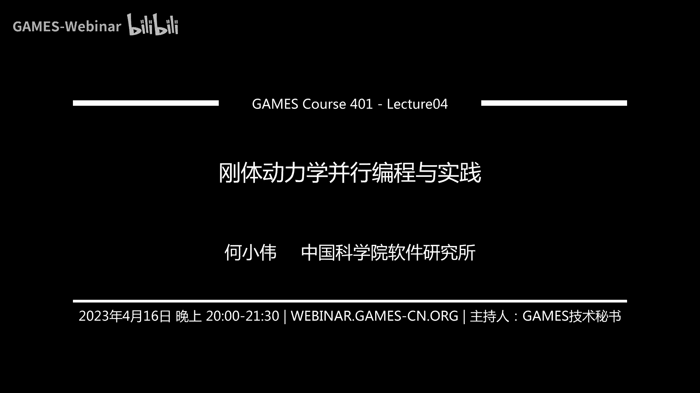

这几次课之前，要不索性这样，我们花几分时间，要不先看看，因为前面已经讲了几次了，然后先看看大家有没有问题，然后正好有问题的话，针对前几次课那些有什么问题，可以咱们一块讨论一下，当然要没问题的话。

我们可能直接就往后讲了，我们看一下，因为之前可能讲的时候，有些东西可能过得比较快，然后当时有可能不一定能吸收的一部分，然后这样的话，有问题我们课前可以讨论一下，那行，我看好像没什么问题是吧。

我们今天就开始讲，那个纲领动力学相关的一些内容，然后从这次开始的话，主要还是基本开始讲，纺针相关的一些算法，然后以及就是说他们相关的一些技术，但因为这里面其实是这样，其实你发现就是不论哪个算法。

其实他就是不论比如你不论钢体，或者流体或者形变体等等，它其实涉及的方法非常的多，所以这样的话，其实就是如果我们所有的都讲一遍的话，其实也不太现实，所以就这里边我们。

我的一个想法就是还是侧重一些共性的一些，一些技术或者是一些基础，就是一些相对来说比较基础的一些技术，所以这样的话就是后面比如说去做拓展，或者比如说去看其他论文的话，这样的话就是也相对会更容易一些。

所以就不陷入就是我们具体的一个一些技术点，所以这样接下来就是讲一下，就是这次课的一个大纲，然后主要其实分几部分，然后一个是钢体动力学的一个基础，然后这部分呢。

因为其实之前王老师那课里边应该讲的是比较清楚了，就是基本就是相当于包括比如说那些基本的那个状态的量，比如类似于这种钢体需要的一些物理量，就应该都讲过了，然后这边这个就可能过得比较快了，然后第二个呢。

是接下来实际上就是这次课主要重点要讲的，可能就涉及到整个比如说我们现在，单钢体其实都比较简单了，然后如果针对的是一个场景里面有很多钢体，那这个时候呢，实际上就是我们比如说我们希望用GPU来并行压缩。

所以这里边需要解决的那些问题，所以呢主要当然笼统讲当然碰撞检测跟那个动力求解，所以这里当然碰撞检测的话，分两部分，一个是宽阶段的，然后第二个呢是窄阶段的，然后到后面就得会讲就是每个阶段到底在做什么事情。

然后最后是一个场景演示的一个东西，所以首先就是简单回顾一下，就是钢体动力学的一些基础吧，然后当钢体动力学实际上是更简化的话，其实可以理解为比如说我置点啊，当置点的话这个东西就是因为它实际上就是有一些。

呃就是它实际上是一个简化的一个模型，因为实际实际我们现实中实际上不存在这个东西的，因为它假设就是说你不存在质量，然后呢就具有一定的质量，但是不存在体积或者形状，然后这个时候呢当然也就不需要考虑旋转啊。

所以就是说对于一个置点的一个运动，呃它所需要的一个物理量其实比较简单，其实主要不会包括比如说像这里边像有这个质量，有位置有它的那个速度啊或者加速力，然后这些当机是基本的。

比如高中物理里边应该都已经学过了，那这个如果也就如果我们已经知道这些物理量之后呢，然后接下来实际上要做的就是，那怎么让这个置点动起来啊，那这里边实际上就是我们最常见的就是，实际上就是牛顿第二定律就是。

呃它标准性当然就是质量乘以它的加速等于力啊，然后你可以看就是当它积分它的一个离散形式，就实际上就变成就是说你相当于delta t时间步里边，它比如说它跟这个后面m就f除以m的话。

实际上就是相当它一个加速度，这样的话就是你delta t时间里边应该它更改多少速度，然后呢去更新它的一个速度，速度完了之后当然进入去更新它的一个，呃一个位置，然后也就这个东西就是因为整个是要。

呃因为我们实际上是一个时间序列，所以这样的话整个在时间片上啊，就需要对它呃分分片，就是比如说我们初始化的时候，呃它这个三个状态变量比如它包含它的位置，它的速度，它的呃一个初始的一个力。

然后这样有了之后呢实际上就往后的话，其实一步一步的去更新它的整个运动的一个状态，然后包括它的力其实也是在运动中啊，逐步的去去调整，所以就是说反映在它的那个运动轨曲线上的话。

其实你可以看到就这样的话就在外力作用下，实际上它会比如说它会形成一下它的一个运动曲线，当然这个东西就比较简单了，就是就是相当于这个离散的就是连续的一个方程，它最终转换成就是我们如果这样去实践的话。

你会发现实际上是都离散成了一堆离散的一个状态，就是比比如说第零的时刻，比如第LT的时刻，2DLT的时刻，然后每个时刻呢相当于需要区分，然后不断的去更新它的一个运动状态。

然后这样的话最终就形成了它的一个完整的一个运动轨迹，那对应到这个我们再拓展一下的话，实际上就是相当于刚提起整个思路，是一样的，但是呢这里为要更复杂的就是什么呢，就是钢体因为它包含一个旋转。

然后旋转跟平移啊，当然有很多东西相似的，就是其实你发现就我们下就下面列的那个物理量啊，其实发现你也是一对应的，因为我们比如说质点里边有一个质量，当然就是说钢体的话，因为跟质点不一样。

就是的地方在于就是说钢体因为它是有形状的，所以呢就这样的话，它实际上就是它的质量，包括它整个那个去更新的时候，我们一般来说用它的那个质量指针，因为它实际上包含可能是xyz三维的一个方量。

就三个方向的一个分量，所以这里一般用这样几个人去替代这个质点的一个，因为它整个是有一个在形状上有个分布的，所以它不是单纯的就集中到某一个点上的一个质量，然后呢当然这个对应到就说它的那个转动的话。

就是这个质量对应到它那个转动那个量的话，实际上有一个矿星张量，然后这个当然张量什么概念其实就像刚才应该讲过了，然后它实际上这个爱代表，因为就是说你从直观的去理解就是你的质量越大。

你相当于去改变它那个平移就是越困难，其实转动的话也是一样的，就是你这矿星张量如果越大的话，你就越不容易让它发生旋转，所以这个两个概念实际上差不多，然后呢对应的就是如果是平移的话，它有个位置坐标的话。

对应到这个旋转这个空间里边，它其实就会有一个旋转指针，或者是这样也可以是四轮组，然后这两个东西是等效的，就是这两个东西可以一一的一个互相转换，然后呢同时比如说那个这个位置啊，或者这个旋转要更新的话呢。

就涉及到它的一个平移的一个速度，然后当然这里边如果转动的话，它有个角速度，然后对应的就是再往后的话，实际上你要去更新它的速度和角速度，要分别是需要计算它的那个平移加速，以及它的那个角速加速。

但这里边你发现有一个不太一样的地方，就是什么，就是因为像平移整个它实际上是个限应空间，限应空间什么意思，就是它实际上就是比如说你限应空间里边，你去做它的那个算它的速度。

它实际上是可以直接通过它的那个位置求导，然后可以算出来的，但是呢就是在转动空间里边这个不一样，转动空间这个东西其实一般来说不能直接，因为它不是一个限应空间，不能直接说我对这个旋转指针啊，直接求个偏导。

比如它里边是一个T的函数，就会偏导或者去求偏导，这样一般来说不太对的，所以当后面会具体给出那公式，然后当这个之前应该也讲过了，然后当然所以这里边实际上就是有一定的差别。

就是因为主要它其实不是一个跟这个平移，它的限应空间其实不太一样，当然最后涉及到还是外力，就是一个是平移的一个外力，当然这个旋转的话主要是它的一个扭矩，然后在扭矩的作用下，它实际上会发生一个旋转。

然后这样的话其实就是整个钢体的运动状态更新，所以你发现跟支点其实是很类似的，就是相当于也是比如说你在外力的作用下，当然这里主要分两部分，一个外力作用下你要去更新它的一个平移的一个速度。

然后还有一个就是相当于你的一个中心点的一个位置，当然那个旋转那部分也是一样，就是你需要在外力作用下，当然外力这个时候旋转因为是就是，因为像钢体它是有挺状的，所以它的那个外力实际上是作用过来之后。

它实际上比如说打个板子，你作用在不同点上，它实际上产生的那个扭矩是不一样的，所以这个时候实际上需要考虑它的那个旋转的一个姿态，然后包括这个整个进到它的那个光线张量的时候。

也需要把那个旋转的那个信息考虑进来，当然后面那两个方程你看其实就是比较相似了，就是相当于脚速度的话需要它的那个脚加速，然后就是相当于乘上一个时间片，然后再就跟进它的一个脚速。

然后但是在后面那个就很奇怪了，就看着很不一样，就是实际上就是因为那个刚刚前面提到，就是旋转空间它不是一个线影空间，所以就是说它整个比如说它那个旋转的那个时间导速，它实际上就是要更复杂一些。

所以这里边实际上它需要两个四元组相乘，就是这个是当前的一个脚速度，然后呢然后同时因为这个脚速度是一个三维的一个向量，所以跟四元组我们叫是一个四维的一个向量。

就是这样的话就这个两个相乘的话三维向量需要补一个零，然后这样的话才能把这个两个乘起来之后，然后去更新它的一个四元组，然后四元组完了之后再回过来就进入了旋转，所以这样的话其实就不断的整个也是不断的迭代。

就相当于你从一个初始的一个状态，然后到比如说到L2T第一个实验部到第二个实验部等等，然后再往后就逐步的更新了，然后这个过程看着很简单，但是实际做的时候就会比较复杂，因为主要复杂在哪。

那就是主要体现在就是，因为如果我们现在打个比方不考虑外力，这个东西它实际上你用任何的机能方法其实都可以去实现，你比如欧他去增啊不管显示引子其实都比较简单，但是呢实际上这里边的一个问题就在于。

实际上很多时候我们这个力包括这个扭矩这个实际上是不知道的，所以呢也就是比如里边包含大量的钢体的时候，我们是需要去计算，就是说这个力包括它的扭矩到底是多少，然后有了那个之后才能进一步的去更新那个状态。

所以呢整体的话就是你看钢体动力学的一个，板砖里边的一个流程它其实就包含，几步啊当然在这里边核心的你可以理解为，其实就在算钢材的力或者扭矩，当然当然不同方法可能不一样啊。

如果是基于速度层面的那可能直接算的那个力跟扭矩，当然如果基于位置的话有可能直接是更新位置了，这个东西其实有一定的一个差别，但是就笼统的讲它其实主要分为两个阶段。

就是首先第一步实际上就是要去做一个碰撞检测，就是我们要找出来到底哪一两个钢体之间，它相互之间发生了一个碰撞，然后呢这个碰撞检测做完之后呢也就是这个时候，碰撞触点之间然后相当于通过建立一系列的约束。

然后呢相当于这个时候然后进一步的去求解，然后使得最终就是满足一定的一个约束的一个状态，当然这个后面我再会细讲，然后这里边就是第一阶段的话其实会进一步的拆分成，就是两个更小的步就是一个叫宽阶段的。

宽阶段的主要一个目的其实就是为了加速整个，方向检测的一个计算就是相当于我预先给它剔除掉，就快速剔除掉哪些不太可能发生碰撞的这些物体，然后完了之后相当于再把潜在的有可能发生碰撞的这个物体。

然后呢进一步的去做方向检测，然后最终找出这个触点，所以这个呢图实际上是代表了一个完整的一个方向检测，就是钢体仿真的这么一个完整的一个流程，那接下来就是我们就是每一步我们再具体来看一下到底在做什么事情。

首先就是第一个是叫宽阶段方向检测，然后这个检测里边，就这个阶段就是这次课主要讲的主要包含三部分内容，一个是包围核，就是第二个呢是空间华分算法，然后另外就是最后因为空间华分算法的话其实包含几类啊。

就是比如说CPU是更适合的或者GPU更适合的，然后呢因为这次课我们主要讲的还是面向GPU，然后怎么能开发出一个高效的这么一个并行计算的一个一个算法，所以这样的话就针对这个最后层次化包围核这个结构。

然后呢重点后面我会去讲就是这个叫Linear BWH的这么一个算法，然后它实际上是在GPU上运行的一个算法，然后它主要包含的主要像莫顿码，然后包含怎么并行构建，然后怎么并行变力等等这几部分内容。

然后接下来我们每一步我们再看我们就看一下，就是首先就是我们来看一下什么是包围核，就是其实包围核的一个主要的一个目的是做啥呢，就是相当于它其实主要是为了快速剔除掉不太可能发生的碰撞的一个物体。

然后这样的话就是可以进一步降低计算量，这个怎么理解呢，就是比如说这里图上画了几个，就是这个几个几何体，然后我们如果现在打了比方我们先两两之间我们直接就两两之间就开始算。

那你发现就是每一个物体它实际上都包含了非常复杂的一个几何结构，那这个时候你如果相当于你直接就是这个复杂的几何体之间就去碰就做碰撞检测的话，那这个计算开销实际上是比较大的。

因为你相当于比如你这个你这个汽车实际上都可能有离散程打的地方，离散程很要网折的话，那你实际上会包含大量的那个比如说边边检测点面检测等等的这个开销会比较的大，那这个时候怎么做呢。

就是我们希望就是把这个模型简化成一些比较常见的，然后呢运算比较快的一些简单的几何体，就跟比如说杰克斯克我们讲的就是像有这种ABB，然后ABB什么概念呢。

其实就相当于它整个就是找它这个物体的一个最小的一个紧直包络，然后当这里边有个特点就是它整个这个边它实际上是跟轴对齐的，所以叫axis align，所以就是比如说跟XYZ当三维方向，其实还有一个Z啊。

它实际上是跟这个XYZ三个方向，它整个边是对齐的，然后这种结构会有一个什么好处呢，因为它实际上它整个上次和我们也提了，它实际上只需要两个顶点就可以整个定义这么一个ABB的结构，然后另外计算的时候呢。

它比较的话实际上它也只需要用坐标去比较，所以整个计算非常的快，然后呢第二种结构，当然这个有一个不好的一个地方就是，因为它整个是必须得是轴对齐的，然后呢也就是说整个它有可能对于某些特定的结构。

比如像这个叶子，它实际上有可能不会特别的紧致，那这里边当然如果要做的更加紧致的话，实际上就可以用中间的比如这种OBB的这个结构，就相当于对于ABB做一个旋转，然后呢比如说它有些方向啊。

比如像这个叶子它沿着这个斜线方向，它实际上是比较长的，所以这样的话可以定义一个这么沿着斜线方向的一个长方体，所以这种呢就是比较适合于，就是相当于那种比较狭长的这种结构。

然后呢就是这样的话可以增加那个碰撞检测的一个精度，然后当然还有一种也比较常见的，实际上就是叫所谓的包围球，就是相当于就它定义一个这个包含这个物体的一个最小的一个球体，当然这里边其实是这样的。

从计算角度来讲呢，实际上最简单的应该是这个ABB，因为这个无论后面的两个实际上都还是都有一定的一个计算量，所以呢就是后面实际上就是最左边的理论上用的是最多的，所以后面的话我也是结合这个ABB来讲。

就是怎么用这个结构来做空间加速啊，然后这样的话就是我们也就是说这个时候，我们如果打个比方对每一个，每个物体都定了一个ABB的话，它实际上就相当于把原来那个物体就简化了，简化成了一堆ABB的box。

那也就是我们可以事先我们就相当于这个时候去判断的话，我们就不需要就是说我们对里边的每一个几个的单元去做判断，而是直接对它的那个bonding box去先预先的我们去计算一下。

比如这个牛跟车它两个之间它的bonding box如果是不可能发生相交的话，那也就意味着你就它里边内部任何的一个点也不可能说跟这个汽车发生碰撞，然后其实同理的话也是类似就是比如你做别的对的话也是一样的。

当然这个呢，你发现比如右边的两个，它如果这个bonding box发生碰撞了，那这个时候呢才需要进一步的去检测，它实际上到底在发生在哪个点发生碰撞，然后呢，也就接下来的话，实际上定了这个结构之后呢。

实际上就我们将来就需要用一些算法，然后呢，怎么能把这个碰撞的那些对给它快速的给找出来，就是比如像这个云跟这个叶子，它已经发生碰撞了，那这个它也就是说它有可能存在进一步需要检测的一个可能性。

然后这样的话就我们需要把这个东西给记录下来，所以这里边就是传统的，比如说像CPU里边用的比较多的实际上就叫做这个有一个叫排序扫描线算排序扫描算法，然后这个是什么意思呢。

就是就是相当于如果我们现在对于每个物体已经定义完了它的那个ABB的一个包围核，那也就这样的话，就是它其实在每一个方向上啊，比如说因为它整个这个三维结构啊，所以这样的话，比如说我们可以沿着先我们先看啊。

比如沿着X的方向，那这样的话可以把这个每个Bunnybox的起点跟终点实际上都投影到比如这个X轴内方向上面，然后这样的话就是所有的这个Bunnybox的那个它的起点跟终点都投影过来之后呢。

它首先要做的一个呢，是什么呢，就是需要对，根据这个起点跟终点，然后做一个做一个排序，所以这样的话就是也就是整个排序完了，之后，然后接下来再去找找这个潜在的那个通常对的话，其实就这个就比较简单了。

然后具体做的时候怎么做呢，就是这里需要有一个其实它第二步实际上就叫一个扫描的一个算法，就是第一步是排序排序完之后，第二个实际上一个扫描扫描怎么做呢，实际上就是它就是从最左边，比如打个比方从B0开始。

然后这个时候呢，哦，对这个就是有有那个我看那个直播间里有问那个GPU上台语扫描不太合适，对，这个我先讲啊，就这个因为是刚才讲就是实际上是一个CPU的一个算法，然后呢。

在后面逐步的因为最终的话是实际上我们会去讲那个GPU的一个算法，所以这里我只是先给大家科普一下就是有哪些算法，然后这样的话就是如果我们具体做的话，就如果按CPU上啊，这个来做的话。

实际上就是你发现就是要怎么做呢，首先就是说我们这个点就是按照顶点的就这个刚才排序的那个顺序啊，从左边开始逐个的去便利，然后这个时候如果当你碰到就是说某个Bounding Box的一个起点之后呢。

你需要把这个东西加到那个有个Active List里头，然后这个时候呢，就是你再往下到下一个点，这个时候你发现B1，他其实也是一个他的一个起点，然后这个时候呢。

就需要把这个B1也要加到他的一个Active List，然后这个时候再往下的话，实际你发现就是如果到E0了，就是E0代表的什么呢，就是你已经相当于是你一个Bounding Box。

其实相当于你一个物体已经相当于他的一个区间就已经结束了，然后这个时候呢，他实际上要去判定一下，就是你比如说你一个结束的一个点，这个时候出来之后呢。

你要去判定一下就是这个Active List里头到底包含哪些起点，也就是这里边所有的这个起点跟这个你最终这里出现的那个实际上是发生碰撞的，就比如你这里边已经有两个，然后呢，这里又有个E0之后呢。

实际上跟前面的两个点是相当于他有相交，那也就意味着就是你这个，这个时候就里边B1的这个代表的这起点的这个物体啊，跟这个，最后那个那个终点这个E0这个实际上是会发生，就是有可能会发生碰撞。

所以这样的话就是也就是说从左到右，然后逐步的这么去完成这么一个过程，然后把潜在的这个碰撞队，然后也就是说沿着X方向的那个碰撞队就可以找出来，当然这里边就是X方向做完之后啊，其实还不够。

就是因为标准的那个这个扫描排序算法的话，排序算法算法其实要做三遍，就是一个是X方向，然后完了之后就需要对整个把它投影到，因为比如像这个这两个物体，你看在X方向其实它是相交的。

但是呢你发现其实是在Y方向的，其实是不相交的，所以这样的话其实需要在XYZ三个方向分别去做一遍，然后这样的话最终才能确定就哪些可能是一个潜在相交的一个碰撞队，但是呢这个其实刚才那个直播间里有同学问了。

就是，说了其实这个东西不太适合CPU实现，然后这里边为什么这个不太适合，主要有两个点，一个呢是，你发现这里边需要有一个active list，然后这个东西你发现它实际上是一个动态的一个结构。

那极端情况打个比方，我们可以假象假设一下，就是比如这里边我们有一个特别大的一个物体，然后这个时候呢，就是说也就是说你跟他跟所有的物体都相交，那这个时候会导致你整个active list的这个。

数据结构会非常的大，最终有可能比如说你，因为我们知道那个GPU里边它其实整个，无论继承器也好或者是memory也好，其实它其实都比较小，也就是这样的话实际上都不太就不太适合这个。

算法其实是在那个CPU上去运行，然后当然这个因为就不太适合在GPU上去运行，当然这个因为整个这种算法的效率实际上就如果是，按那个复杂度来讲它实际上是比较高的，所以呢一般来说就是GPU的那个。

在CPU的一些引擎上用的可能比较多，比如像Bleed它比如像，它有个叫BTX sweep3的这么一个实现，大家有兴趣可以去看一下，然后呢接下来我们看一下就是，那如果我们现在比如说那个我们。

我们希望是做一个并行的这么一个算法，那有什么数据结构呢就是来做这个事情，那其实最常用的其实就是叫有个均匀网格，然后均匀网格什么意思呢，就是我相当于其实就是就这个图画的那个就相当于我。

假设我分配一个足够大的一个这么一个空间，然后这个均匀的一个网格，然后它覆盖住所有的这个物体，然后呢覆盖住了之后啊，它实际上接下来就是怎么做呢。

就是它相当于它会去判定就是每个物体跟这个背景网格的那个格子点，到底跟哪个格子点相交，然后呢它在那个格子点记录一下它那个ID，然后这个时候，然后它再进一步的如果去矿产检测的时候。

它相当于就是比如说这个比如这个苹果，它跟这个周围的那四个格子点相交了，然后就也就是它在这个格子点上会记录一下就是这个苹果的ID，然后呢同时它会后面去怎么做呢。

相当于它要这个时候它相当于它要去找可能相邻的那个格子点，然后呢去判定就是说这个相邻的格子点有没有可能是也是落在这个这个里面，然后但是这种方法呢，就是当然其实非常适合CPU并行来做啊。

就是因为它整个你发现它实际上一个它的那个整个存储空间它是连续的，这个其实是比较高效的，然后呢，第二呢，其实整个计算你发现它其实也完全可并行，但是呢，这里有个问题。

你发现就是因为我这里特意画了一个特别小的一个物体啊，就是你发现其实就是，当如果你物体跟这个网格格子点啊，就比如大小类似的话，那这个实际上还好，就因为这样的话，你可能撑死。

比如这个像这个苹果可能撑死占的是四个格子，但是呢，如果像比如说有物体有可能会特别大，那这样的话，它实际上会占的那个格子会非常的多，然后也就是它实际上并存在。

就是说它也就是它整个这个在跟那个格子点相交的时候，这部分跟比如你同样的，你一个线程去处理这个牛一个数据之前一个线程处理这个苹果的话，这个实际上不同线程之间的那个计算量差别都会非常的大。

所以这个时候也就是说它实际上就是它整个负载不是特别的均衡，所以呢，就是说而且包括其实你发现就是还有一个什么问题呢，就是因为实际我们就是实际上就是说很多物体在空间中的排布啊，它可能不一定那么均匀。

比如打个比方我在特别远的地方，然后呢有可能也有一个物体，然后这个时候你如果要分配一个特别大的一个网背景网格去把所有的那个钢体都覆盖住，那这个可能存储开销会非常的大，所以这种结构呢。

实际上就是也就是说它比较适合这种物体尺寸单一，然后分布比较均匀的，比如打个比方就是在一个封闭的一个容器里边，我们比如做一些流体模拟啊，或者做一个钢体的一些颗粒的模拟啊，所以这样的话实际上是比较适合。

但是对于像比如说有些就是分布的比较广，然后呢又从比较稀疏的结构实际上不太适用，所以这里边其实就牵扯到另外一个最后一个我们要讲的这个结构叫做呃层次化的一个包围核，然后这个是什么概念呢，就是。

因为本账我们实际上就是算法复杂度，因为我们知道就是一个是它整个计算的复杂度，我们要要保证它那个降下来，第二个呢，还有实际上是一个呃纯储的一个开销，实际上就尽可能的要低，所以呢。

实际上这种结构实际上它一个好处其实就是相当于是把因为原先致密的这样的话，其实又造成大量的浪费啊，所以呢，就相当于用一个自适应的这么一个二叉数的一个结构，然后呢，把一个空间进行划分，所以比如说我们可以看。

就是说首先就是它这个呃，我们先从就是说从那个CPU的实现角度啊，怎么去看这个问题，就是我们先看一下，就是实际上一开始它肯定这样，就是它分配它也是一样的，就是跟军网的也是一样。

它分配一个足够大的一个包围盒，然后呢，把所有的包围盒所有的物体实际上都包在里头，然后呢，接下来它要做的呢，实际上就是对这个空间进行划分，当然这个因为是一个二叉数结构，所以这样的话。

比如说它需要在中间切一刀，然后呢，把两边就是把物体就是里边所有物体批成两半，就是批成左边N1有一个呃相当于这里有一个Body Box，然后呢，在右边有个N2的Body Box，然后呢。

里边相当于就是各包含一部分的一个钢体，然后再进一步的就是那比如N1的进一步的，因为它它发现里边它还有两个，那这个时候实际上它可以再进一步的细分，然后这样的话就后面再拆除两个。

就是当这个时候其实已经到每个节点已经到一个，相当于已经到一个物体了，这个时候就不需要再细分了，就是也就是说这个就结束了，然后当后面的呢，因为有三个物体，然后它实际上也是主要主步的去划分，然后呢，这种呢。

你发现它整个存储开销实际上就比较低了，就是因为它整个基本是属于一个跟物体的数量对应的，这么一个线性的一个开销，当然你发现它整个可能就是计算的开销要比军网可能要稍微大一点，但是呢，总的来说就是说。

因为这里边怎么去降低这个开销呢，就是说计算开销，那最理想的肯定讲你这个数尽可能的要就是平衡，就是相当于就比如你从根据点，因为怎么查找的时候，它实际上肯定都是从根据点开始，然后呢，逐渐往下变力去查找。

然后这个时候呢，你怎么让尽可能让这个数成为一个平衡差数，然后这样的话，就它这个深度啊，整个实际上是基本的就每个叶子件深度尽可能保持一致的话，这个实际上是是对于整个查找那个效率啊，实际上是比较有有帮助的。

那接下来就是，主要问题就是什么，就是因为刚才你发现就是刚才接号那个过程，实际上就是从根据点开始，然后呢，在逐步往上去构建啊，那这个时候你发现GPU它肯定没法这么去做。

因为GPU如果你实际上包含可能有几千个线程的，这样的话，我不可能说每个线程，我相当于我先去构建这个根据点，然后呢，其他的这个时候我都等着，然后等他更新完之后。

然后再去进一步的再去相当于去更新他的一个子节点，所以这个肯定是不现实的，所以这里就需要依赖一个，就是说我们相当于怎么去并行的快速去构建这个这么一个层次化的一个包围核的这么一个一个算法。

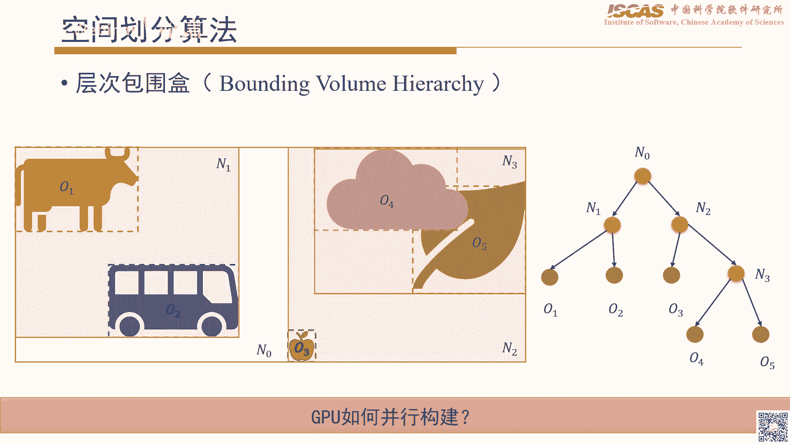

所以接下来我重点讲一下有个叫Linear BVH的这么一个算法，然后看看它具体是怎么来做的，然后当这里边就是需要先讲一个概念，就有个基础的概念，就是这里有个叫莫顿马的这么一个一个内容。

然后需要先先讲一下，就是他到底什么意思，就是，因为我们知道就是其实是这样，比如不论二维还是三维，他其实比如像以二维为例的话，他其实比如一个点，他实际上分为两部分，一个比如他的X的有个索引，然后呢。

以及他的一个Y索引，然后这个时候呢，其实就如果打个比方，因为比如像前面均一网格，我们知道那个整个在存储空间里边，就是你不关了，不论是你是自设定结构，还说是均一的这种网格，其实在显存或者在内存里边。

它其实都是线性的，就是因为他最后最后，因为他都是有一个取值的一个地址，也就是这个时候也就是相当于，你不论什么分别结构，他最后都会拉平，那这个时候如果我们现在，比如说我们的空间的结构。

它有可能是一个二维的，或者是有可能是三维的，那这样的话我们怎么能让，就是说，呃，就比如说离得近的那个物体啊，就是说在空间排布上，离得也近可能的一个一个近，就是在内存的排布上，就空间上比较近的。

我们怎么让在让他在内存上也离得比较近，然后这个为什么要这么做呢，因为我们知道就是，整个GPU他去寻址的时候，它实际上是它是一块一块就去了，就相当于他比如说他一次有，32个线程来进来之后呢。

他会连续的去比如说去取32个数据，所以也就是这个意味着什么呢，就如果你的数据是在空间上整个是连续的，那这样的话你整个就是，呃，你说去取数据的时候，你发生那个miss的那个概率就可能性会相对来说是比较低。

所以这样的话就是说这里边其实就在就是说针对这个有这个问题的话，实际上这个莫德马就主要是干了一个事情，就是我怎么把那个空间上就是离得近的，呃，相当于让他在内存里边实际上离得也尽可能的一个，呃。

尽可能的比较近，所以他整个一个思路就是比如说我现在有两个坐标，就X坐标跟Y坐标，那X坐标当比如说01234啊，当然这个如果单纯的我们看这个X，这肯定没问题的，就是你发现就是。

他整个就是肯定是线性就是连续存储的，但是呢，这里边如果涉及到比如说他是二维的一个坐标，然后这个时候他还有一个Y坐标，那这里边有一个什么问题呢，就比如说对于这个，呃，01就这下面这个啊。

就是001的这么一个位置，然后这个时候你发现，他实际上是跟，就如果因为我们知道那个均一网格或者矩阵的话，就是一般的存储就是你要不列组之后要不行组织，然后比如行组织的话，你比如你先存好，那这个时候你发现。

就是这个点，就是01这个坐标跟，006坐标实际上是离得比较远的，因为他实际上需要在整个上面第一行所有的数据完了之后，他才能取到这个这个坐标，所以这样的话实际上整个就是，在查找01的时候其实不太。

就是他的连续性其实不太好，所以也就是说这个时候莫顿马，这个时候他怎么做呢，他实际上就是按照位就是比如从最低位开始，然后他实际上就交错的去去构建他的一个ID，然后比如说你可以看这个比如000。

然后呢首先他比如第，最低位的那个X的0，放到这个最右边，然后呢其次接着下来是Y的那个0，然后那个然后再往后其实就是X的这个第二个0，然后再是Y的这个第二个0，所以这样的话逐步去把这个。

也就相当于他把X跟Y这个，安位啊把这个所有的那个，ID实际上都给打乱了，然后这样一打乱之后呢，你发现这个整个结构就变成了就是，以前比如按行存和按列存的这个就变成了。

它实际上是一个Z字形的这么一个一个结构，就是这个背景的那个一条网格线啊，他可能不是特别清楚，但也能看出来就是，他实际上就相当于这个00完了之后到01，然后01之后他实际上就不是到到10。

然后10之后呢实际上他不是到20，他实际上就直接就到了这个1，1就是11的，是这个是01的这么一个位置，所以就你发现就是那这样的话，就是这个点跟这个点啊，离这个00这个实际上都比较近了。

也就是他都是存在他的一个附近，也就这样的话，实际上把整个空间的一个离的比较近的，其实是在整个内存或显存上的那个，相当于也也会变得就是比较靠近，然后那这样的话我们就具体来看一下，就是。

我们看一下就是说具体到那个针对钢体，这个任务啊，就是因为还是一样的，就是我们假设现在已经有个背景的一个ID，啊，行好，然后这个时候就如果打个比方，我们现在有这里我画了四个三角形。

然后对应到其实就是说每个三角形，实际上都有一个ID坐标，就是比如这个是012，就220，然后呢这样的话其实按照默敦马重新排序之后，你发现就是啊，他这原来的顺序可能就不一样了。

他实际上就是按照这个折线的那个顺序，实际上就整个会把这个四个三角形给他拉平。

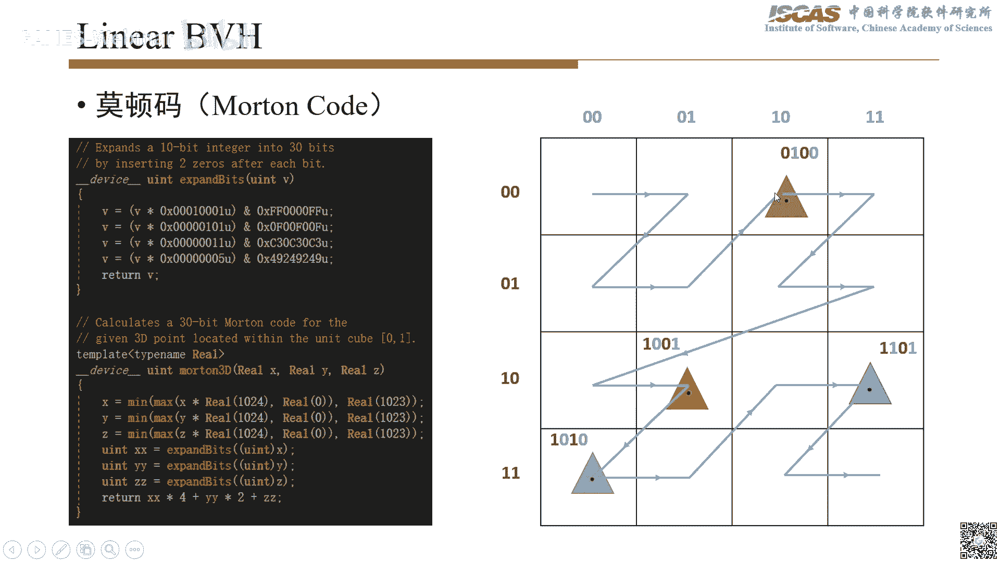

拉平成一条就是说一个线性的一个结构，然后呢，这个结构对应到就是说，存储空间里边存储空间里边的话，那就变成了就是首先这个绿色空间是放在第一个的，然后呢其次就是这个呃橙色的这个三角形。

然后再往后的话实际上就是这个，灰色的，然后再往后其实就是这个棕色的，然后呢，其实你可以看到就上面那个对应的，他的那个默敦马其实也是从从小到大的这么一个排序，就是当这个是因为排排过序之后的排过去之后的话。

实际上就相当于是他是从小到大，然后有了这个结构之后，然后我们看一下这个有什么好处呢，就是接下来我们实际上就可以利用这个，这个默敦马这个排序之后的这个默敦马，然后呢。

直接就相当于我们从这个默敦马就可以把这个二叉数，就是这个空间的划分的那个二叉数只要构建出来，然后整个构建过程怎么做呢，实际上就是我们是逐位的去把这个相当于把这个元素进化分，比如我们这个是根据点。

因为是这样，它包含了所有的物体，就它包含了四个三角形，那这样的话，我们去颇分的时候就当然我们一般是沿着X切或者沿着Y切，那这个时候比如我们可以看一下这个第一位这个零是对应的是，Y的那个最高位。

那这个时候实际上是沿着这个Y这个方向，它要去切一刀，然后切一刀呢，你发现它实际上在，它实际上在哪个地方会切一刀呢，实际上相当于是它从零到一，然后发生变化的那个地方，实际上它需要给它拆成两部分。

因为你看后面的那三个实际上都是一，就最高位啊，最高位都一代表的什么，就它现在整个空间上面了，就是如果我们按中间划分的话，它这个在下面的三个实际上是在一块的，然后上面那个三角形呢。

在另外一半的那个空间里边，所以这样的话完了之后就变成了就是两个子节点，然后呢，其中一个子节点呢，带包含了一个三角形，然后呢，另外一个子节点呢，就包含它其实就包含三个三角形，当这个完了之后呢。

就是我发现就是这个左边那个子节点，因为它整个空间里边实际上只包含了一个三角形，这个时候实际上就不需要再进一步的细分，然后呢，接下来要细分的实际上就是，对于这个三角形相当于。

因为刚才实际上是按第一位最高位置切的话，那实际上就Y方向就切了，就是相当于进行了拆分，然后接下来的话，实际上要在X方向，就因为下一位第二位的话，实际上是对应的是X轴的这么一个标志幅，所以这个时候呢。

第二次再去进行剥分的话，实际上就相当于是这个时候需要我们去看那个第二位，就001，然后我们找一下就是哪个地方是它第一次发生变化，就是前两个0都是一样的，那后面那个1呢，说明它也处在了不同的一个空间里头。

那对应到这里边呢，实际上你发现就相当于在这个位置，就是01就是10就是XID的01跟10之间，接下来相当于下面这个空间相当于1分2bar，1分2bar之后呢，其实你发现就是左边左节点呢。

就是变成了两个包含了两个那个三角形，然后右边的就一个三角形，然后这样的依次的话就是主位的，就相当于对这个整个空间进行，就是划分完了之后，当然最后的话就要保证相当于每一个叶子节点。

实际上都是包含这么一个三角形，这样的话整个一个就是层次化的这个RX数，实际上就变就相当于去构建出来了，然后对应到如果我们把这个刚才分叉的那个地方，我们用这个连线给它连起来。

那实际上就你发现就是每个节点其实就包含两个子节点，就是根节点然后变两个子节点，然后这个下面的红色那个节点呢，中间内部节点然后进一步的变成两个，然后主件呢相当于就变成了这么一个，一个二叉数的一个结构。

然后呢这个结构我们后面看一下这个有什么一个特点，其实它在算法里边其实有个专门的一个名称叫做，有序RX的那个压缩潜缀数，然后然后我们看一下它的那个特点主要包含几点，一个呢是这样你可以看一下它的内部节点。

因为这里画那个橙色的代表的那个内部节点，然后这个绿色的是代表的一个叶子节点，也就是它的那个如果按照刚才那个方式，因为它实际上是从根节点其实基本是一分为二，一分为二往下这么分下来的。

所以这样的话实际上它的那个内部节点的那个数量啊，实际上是跟那个叶子节点它存在一个关系，就相当于是它正好比叶子节点去少一，所以这个数你不管怎么涨啊，它其实最终都是变成一个相当于是内部节点有n减。

就如果叶子节点是n个的话，内部节点其实就是n减1的这么一个数量，然后这个有什么一个好处呢，就是这样的话其实就可以很方便的去控制，就是说你最终因为你这个比如你去构建这个树啊，到底需要多少存储开销。

因为我们知道GPU的话最理想的状态就是我们需要，我们可以预先的知道比如说我们打表，我们创建一个结构的时候，我们预先知道它整个所需要的一个分配空间，分配的一个存储空间，如果我们先可以计算出来的话。

这个是比较理想的，所以呢，就是说你发现这个结构就比较适合GPU就是去做存储，因为它整个开销的话其实就是一个2n减1的这么一个开销，然后除此之外呢，其实还有一个特点呢，就是呃。

因为这里边需要定义一个就是因为后面算法需要呃这个标准符啊，就是有个叫delta ij的一个叫做最长公共潜坠，那这个什么意思呢，就是像大它其实就相当于比如说你对于任意的一个呃。

几就是说比如连续的这个从i到j啊，从i到j连续的这么所有的叶子节点里边，他们的公共的潜坠代表什么呢，就是比如像从0到3，你可以找从最高位开始找啊，然后找到他第一次出现不一样的地方。

比如这里边你可以看第第三个位，它实际上不一样了，所以这样的话，他其实他的最长最长的公共潜坠什么呢，其实就是代表了00所以呢，这个内部节点，他的最长的公共的潜坠实际上就是00，当然类似的。

你也可以去找那个别的就是当根捷点实际上是没有的，就因为根捷点，他其实每每一个就是每一位实际上就是因为他每一个那个这个都不一样，然后呢，比如像这个节点，你可以看一下他那个0跟1这样的。

他的那个对应的那个二进制，也就是这个时候呢，你发现就是前三个实际上都是一样的，所以就是他整个最长的公共的一个潜坠呢，实际上就是0000，然后这里边有一个什么特性呢，就是如果我们现在讲打个比方。

就是已经知道了，就这个比如这里我们标记一下这个0到4之间的一个最长的公共潜坠，然后这个时候我们如果假设我们现在对于这个爱就是这个爱跟介于内部，我们任意取两个他的一个元素，然后我们再去看他的公共潜坠。

他存在一个特点，就是他内部任意的两个就内部任意一个几区间，他的最长的公共潜坠实际上是要大于等于这个相当于是你开始就是说你定义的那个IJ这么一个区间，然后这个怎么理解啊，就是你可以看一下。

比如说还是以这个第二个这个节点就00最长公共潜坠是实际上是00吗，就是比如他有四个元素，然后这个时候你可以看一下，如果你中间你取另外一个任意一个子空间，比如说你是0跟1，你发现他是000。

然后或者1跟2，你发现这个00啊，就其实其实也都是满足大于等于这个公共潜坠的一个就是相当于就是整个区间的公共潜坠的最长公共潜坠的这么一个特点，然后或者是一个后面的23，他也是00。

然后这个有一个什么好处呢，就是也就是说我们如果现在要计算一个内部节点啊，他的最长的公共潜坠的话，我们实际上只需要去计算他的第一，他的一个首节就是他第一个元素以及他的一个最后的一个元素。

那这样的话其实就代表了一个这个节点，他内部节点的一个最长的公共潜坠，所以这个呢，特性呢，是比较重要，因为不然的话，如果我们打个比方，因为我们知道就是，通常我们要去求这个最大值或最小值。

你发现我们可能要所有的都变了一点，那这个开销实际上是挺大的，就是我不可能我到根捷点里边，我相当于把所有的页子一点我都变了一点，那这个其实开销，也就是说你相当于越往上的话，整个开销越大。

这个对于GPU其实不太不太适用，所以这样的话，其实就也就是说我们现在如果对于每一个内部节点，我们要去计算他包含所有元素的那个公共的最长，就最长的公共潜坠的话，实际上我们只需要算第一个元素跟最后一个元素。

那这样的话就可以很快的能算出来，然后接下来我们看看就是说有这个特性之后啊，就是我们怎么去并行的去把这个这个Rx，Rx去构建出来，就是因为前面讲到就是整个Rx实际上如果我们按照CPU的这个去理解。

就跟他实际上就是我们需要先去做建这个根捷点，根捷点完了之后呢，我们需要找到那个拆分的那个位置，然后呢一分为二，然后呢逐渐往下的去构建，那这个时候你发现如果按照这个思路去做的话，那肯定是不行的。

就是因为发现你如果比如我们现在并行的去做啊，就是比如我，我现在想分配比如七个线程，每个线程独立的去相当于去构建他们，这个时候你发现。

因为他整个子节点你发现他实际上是依赖于他的一个负节点的这么一个内部的一些计算，所以这个时候实际上就是按照CPU的这个传动的那个方法，我们发现其实这个是不太可行，然后所以这里边有几个需要要做的。

就是你如果要做到并行的一个肯定是这样，我们希望是一个从底向上的，就是比如说我们现在有七个的叶子节点，那这样的话我们知道他肯定哦，这里有八个叶子节点，那这样的话其实他的那个内部节点啊。

就是也就是实际上他就是因为是这个叶子的数量减一嘛，所以这样的话我们就理想情况肯定是对于每个内部节点，我分配一个线程，然后去构建他的一个，内部节点，然后呢，同时我们在构建过程中的是希望就是说我们消除掉。

就是比如我即使我不知道他的那个负节点构成什么样子了，那我们一样也希望就是说我们对这个整个我们当前在构建的一个内部节点不受影响，所以这是我们比较理想的一个一个状态。

那这里的就是说要实现这个就是这里的就比较巧妙的一个地方，就linear BAH这个这个方法就是怎么去解决这个问题的，就是他主要是这样，他利用了就是这里边的一些特性，首先呢。

实际上就是因为假设比如叶子节点刚才讲了就叶子节点的那个，长度啊，因为他实际上是n的话，因为我们已经知道了，就是内部节点，他的数量肯定是n-1，那也就这个时候我们可以预分配。

比如n-1个n-1长度这么一个数组，然后呢，去存他的一个内部节点，然后这样的话，你发现他实际上两个数组，比如说那个一个数组，他当然是n长度为n的，然后呢，是用来存所有的叶子节点，然后呢。

额外的要分配一个数组呢，去存他的那个内部节点，然后他的数量是正好是n-1，然后还有一个特性呢，就是他假设就是他所有的根节点，就是是位于这个你新分配的这个ri数组，就是存内部节点的数组的第一个。

也就这样的话，这个好处就是你相当于因为我们这种所有的那个，比如说我们便利的时候，我们肯定要知道这个你的根节点在哪，所以这样的话，就是你相当于如果把根据的放在零的话，那也就默认的实际上就是零。

那进来的时候，我们就是从零开始，然后逐步的去往上去找，然后呢，另外就是还有一个特点，就是他假设就是说相当于他在划分的时候，就是他相当于是比如说对零这个节点，他给他一分为二的时候。

他把他的那个左孩子跟右孩子的那个相当于也是两个内部节点，这两个内部节点呢，分别存在了他分割位的左边跟分割位的一个右边，然后最后还有一个特点，就是你发现就是如果按照这么去分的时候，因为你发现整个分割点啊。

就是他分出来的，实际上他的那个叶子节点，他要不就是相当于一段区间的一个结尾，或者就是有可能一段区间的一个开头，所以就是说你发现就是任内部的任意一个节点。

他实际上他的那个对应的这个就这个内部节点那个位置啊，他实际上是有可能是他的那个其实肯定是这样，他的要不就是他的一个左端点，要不就右端点，比如像这个三，他其实是对应的，就这个区间的一个右端点，然后呢。

像如果是四，那实际上对应的是这个区间的一个左端点，所以你现在发现你每一个节点，你后面看的话实际上都是一个这个特性，然后这个特性有一个什么好处，你发现就是整个实际上一对上的，就是你从叶子节点啊。

到那个上面那个根节点，他整个就内部节点，他整个排序啊，你发现是一对上的，就是比如这个叶子电子，他是从零标到七，然后这个跟那些内部节点呢，实际上也是从零到七，然后呢，接下来我们有这些假设之后。

然后我们看看就是说具体怎么去把这个，就是说相当于这个二叉数给他去构出来，就是整个过程的分为几步啊，就是首先呢，是这样，就是因为你这个时候你去考虑问题的时候，你就不需要去管。

就是因为我们现在就假设我们就就是对某一个内部节点，我们直接就三，然后这个时候你，你也不知道这个根节点是什么样子，或者他的中立节点什么样子，或者他的子节点什么样子，其实你都不知道。

所以这样的话就是这个时候去够的话，其实主要要干的一个几个事情就是一个呢，就是你需要因为前面有个特性里边是这样，每一个内部节点，他肯定是他的一个端点，所以这个时候你首先第一步你要去做的是。

你相当于需要把他的一个内部节点的另外一个端点，你需要给他找出来，比如对于这个三，他因为这个三实际上是他的一个结束的这个这个位置，然后这个时候你需要去找的是这样，是他的一个起始位置，然后呢。

这个找完之后呢，那第二步要去做的呢，实际上就是，需要去计算他的左右子数的一个分裂的一个位置，然后也就是他中间到底哪一个地方，他实际上就会相当于给他分成两部分，然后这个分裂前面也讲了怎么去判定呢。

实际上就是去找到就是因为比如说我们用第一个元素跟最后一个元素啊，他实际上就是可以计算出他的一个最长的那个公共权贵，然后呢，也就是说你下一个位下一个比特位，他比如说他第一次出现不一样的那个地方。

那实际上就就代表着这个从这个位置就开始需要对他进行划分，那所以整个这个过程呢，实际上就包含三步，当最后的话其实就是去构建这个a b b啊，就这个整个因为这样，如果是你这个区间你知道了，然后呢。

你接下来你如果把分裂位置知道，那也就这个时候你就知道，比如三呢，他的他的叶子节点，他到底他的子节点啊，就是他到底是左孩子跟右孩子到底是在哪个地方呢，这样的话，实际上整个所有结构有了之后呢，后续的话啊。

实际上就可以去构建整个a b b的那个数a b b数，当然就a b b的那个binding box当然包含不光是包含叶子节点啊，因为还包含那个整个那个内部节点的a b b其实也需要去构建出来。

所以接下来具体我们讲一下，就是看看那个整个过程怎么来来做的，就是首先第一步实际上就是啊，构建过程的话，其实就是第一步我们需要去确定一个搜索方向，就这个什么意思呢，就是啊，因为每一个内部节点他存的位置。

呃，前面讲了就有可能是他的一个结束的位置，也有可能他啊，开始的位置，那在这个时候我们怎么去确定他到底是结束还是开始呢，实际上就用，就是需要依赖于这个，最长公用钱队的那个信息。

这个delta其实就是因为这个是代码力的写法，就是这个delta实际上就代表了这个两个元素的两个元素组成的一个趋近的一个最长公用钱队，所以比如我们这里来看一下这个有这个三，然后呢。

那三其实他实际上这样他实际上需要判定一下，就是跟他相邻的两个元素，他组成了一个区间的一个最长公用钱队，比如说他这个时候他三要跟四去这个区间计算一下，那这个一算呢。

他实际发现就是他整个最长公用钱队实际上就是对应的实际上就是相当于这个他们副节点的这个公用钱队，那另外就我们再来看一下，比如三跟，他的比如三跟二，他的最长公用钱队，那实际上就是什么呢。

实际上至少要比三这个节点的公用钱队要大，因为这个其实前面有个特性，就是你内部这个任意的区间要比他整个这个内部节点就是此区间要比他整个完整区间的那个最长公用钱队是要大的。

所以说这个时候你发现就是你如果用比如说这个减去这个，你发现这个时候其实可以就用，可以用他的符号来判定到底是朝比如说你应该这个时候应该是朝左边搜索还应该朝右边搜索，然后比如对这个例子的话。

你发现就是爱跟爱跟爱加一，这个他实际上就是相当于是这个他的因为这个跟节点和最长公用钱队实际上是要小于这个三这个内部节点的非常空前，所以这个时候一减的话，实际上你发现是小于应该小小于零了，小于零的话。

实际上就是负一，不一的话就代表什么意思，就是你需要向左边，那也就意味着就这个第三，这个位置就是实际上是相当于整个内部节点的一个相当结束的一个端点。

所以这个时候你需要往左边去找到底他另外一个其实的一个位置在哪，然后呢，接下来第二步实际上就是需要去找那个左端点，然后左端点那这里边就实际上还一样，就需要用到就是，这个特性就是因为你。

你比如说你这个时候你就可以看一下，你如果打个比方，你这里没有去找完，就是你如果已经找到这个点了，那这个时候你其实你发现就是，因为这里边其实就我们先看一个特点，就是，因为是这样。

就是你相当于比如说你这里边的一个最长的公用钱队啊，就是跟这个的最就是比如三跟四，因为他实际上是属于比如他的父姐，那个负节点的左右的两个，谁是相当于他左右的两个孩子吗，所以这样的话也就你发现就是。

就是说如果你往左边去找的话，就什么时候应该就是肯定是出了他的一个区间的话，就是你应该去看，就是因为这两个如果是合在一起的话，他的最长的公共钱最正好是相当于他的一个负节点，所以呢。

这里边如果我们现在比如说我们现在往左找找到比如超出这个位置，代表什么意思呢，就是你是实际上你这里边的那个元素跟比如说你这个三对应的那个元素，他组成的这个最上空钱对他甚至有可能要比这个三跟四这两个他的功。

他的父姐眼的那个最长钱队啊，甚至要比他还小，那这个就代表了他你实际上已经越界了，所以这里边实际上去整个去找的过程中去，就是说需要确保就是你从三，比如说逐渐逐渐去往左边去搜的时候。

你要确保就是说这个过程中啊，就是就是说你这个区间组成的一定是要比这个就是他的负节点对应的这个实际上是要要要要大的，实际上是，所以这样的话，其实就整个算法其实在做一个什么事情。

就是相当于找到第一个正好就是依然是要比他的负节点那个钱对要大，那这个就代表了他实际上是他的一个其实位置，那这样的话，这个端点实际上就就找到了，嗯，然后那个这个端点找了之后呢。

然后接下来可能就要第三步的话，实际上就是这个其实就相对比较简单了，就是因为其实这里边就是比如说我们这个零到三啊，这个这个区间已经有了，那实际上剩下要做的其实就相当我们，呃。

因为是最长的共同钱对其实是比如说这个其实就可以算了，比如说按零到三，他最长目前对其实就零零，然后这个时候呢，我们要去找的实际上就相当于是我们第一。

就是下一个正好出现就是说比如说他的那个位出现变化的这么一个位置，然后这个时候就是整个算法的话其实也是在呃就这代表那个算法，然后他第一步需要去算的就是相当于因为你整个起点跟终点有的时候。

你相当于需要算一下这个节点的，这么节点的那个相当于最长的共同钱对，然后这个有了之后呢，然后整个你去找的时候就相当于你逐步的要去找到某个位置，然后使得他就相当于是说，因为比如说你这个你如果是左标。

比如说这个时候你相当于比如他有个左子数，然后左子数的话，这个时候他实际上他的共同钱对实际上是要比那个他的负节点是要大的，然后呢，当然如果你加上那个右子数之后，他两个跟负节点应该是一样的，所以呢。

就是你应该找到某个位置，然后呢，正好比如说你跨过这个节点之后，然后他的右边的右子数的某个节点进来之后，你发现他正好就跟那个负节点一样了，那这个就代表这个肯定是有分裂的一个位置。

所以这里边就是整个这个这个代码实际上计算的是这么一个过程，就相当于是找到对于比如说对于这个位置，然后相当于第一个他的位不一样的那个位置，然后这个有了之后。

接下来就是实际上就是后面的应该就相对来说就比较顺畅了，就是当整个构建b a b d其实也是一样的，就是我们也需要并行的去构建，就是那这样的话也不是说从顶向上，就是我们也还是依然是一个从底向上的一个算法。

因为就通过前面的这么一个构建过程，他其实他们整个的那个关系就已经建立起来，就是比如说他每一个节点他对应的左右左右孩子的，他那个子节点他的那个位置，他实际上都知道的就是然后呢，包括他的分裂位置。

然后以他那个端点，他的那个区间这个实际上都是知道的，所以就这个时候呢，接后面在我们再往后去构建的话，其实就是，当然肯定就是我每个叶子节点，首先就分配一个线程，就是这样的话。

就是首先我们要做的就是相当每个叶子节点，我们先把他的那个a b b去构建出来，然后这个当这一步其实没任何问题，因为整个所有的那个叶子节点实际上都是独立的，就他们之间的整个计算相互之间实际上不冲突的。

然后呢，再往上一层就是我们一层层往上看，就是再往一层上一层的，因为这个时候我们实际上已经是已经知道了，叶子节点的那个a b b。

然后这个时候我们要去做的实际上就是相当于是计算他们的负节点的那个a b b，然后我们知道计算负节点的a b b需要依赖两个东西，就是比如说像这个这个节点你去算的话，他实际上必须要知道。

就是说你左左左孩子的那个a b b以及右孩子a b b去够都构建完之后，他才有可能去计算这个，相当于才有可能去计算这个负节点的这个a b b，那这里边就会存在一个问题呢，就是如果因为还是一样的。

就是我们整个并行计算的话，就是他实际上是每一个就是他实际上他每一个页节点，他实际上他都是希望去把他负节点的去构出来，然后但这个时候你发现就是如果比如说你第零个线程第一个线程。

这个时候你同时去构建这个他负节点的那个a b b，这个时候你发现他存在冲突，就是因为有可能实际上就是说你比如说他如果同时去执行的话，你其实你不太去能保证就是他另外一个节点啊。

就是他那个数据是不是已经准备好，所以这样的话实际上就是也就是我们这个时候就对于比如说我们他去比如说有两个线程，他同时去处理这个他们的负节点的时候，这个时候我们要有一个互持操作。

就是不让他们就相当于同时去计算，也就这个时候呢，就是说比如说像针对这个节点，他实际上就是比如第一左边那个线程，他已经在计算了，那这样的话我们需要把右边那个节点就是需要把它阻塞，然后也就这个时候呢。

他其实不去计算啊，就是然后这个算完之后呢，然后当左边那个已经算完了，这个就可以退出了，然后其他的你可以看一下也是类似的，就是如果有相当于有冲突的时候，就是或者是这样，你这个时候你有可能只计算了一遍。

就比如像这个你这个时候呢，因为他比如说你计算四的这个他的a b b，他实际上是要依赖于这个7，啊不这不是这个7，就这个实际上是对应的这个两个，就左边那个a b b跟右边的a b b。

但这个时候右边的a b b实际上也还远远没到那个，构建出来的那个时候，所以这个时候他实际上就是我们这里我们用颜色标了一下，就是这个黄色代表的什么意思呢。

就是代表的就是说你已经相当于有一个孩子的那a b b，我们已经知道了，然后呢这个时候我们在等待另外一个孩子的那个a b b，比如说这里边那个0他已经左边那个已经知道，但是呢a右边那个其实不知道。

然后比如像这个2那个地方也是一样的，2代表的相当于是他第二个线程相当于他的那个a b b，有可能知道，但这里边其实顺序有可能不一定啊，就是因为比如说像尤其像这个。

比如说这两个线程他有可能是第一个线程也有可能啊，就是第一个比如进去之后，然后第二个呢就是左边那个应该就需要给他读过掉，所以这样的话就是我们再往上一层，就是往上计算一层的时候你发现就是。

他有一部分的那个页子节点他其实就包含了一部分就是他孩子的一个信息，但是呢有部分呢可能也没算到，比如像这些其实还没有算到，那这样的话需要逐层的去往上去计算，然后当最终相当于把这个所有的那个都覆盖掉。

然后呢这个时候再往上算的话，其实思想就类似就是因为比如说这个前面已经算过的，就是到这个时候那这个时候就不需要去执行了，就是所以这里用灰色去标记一下，就是相当于比如说你这个1的这个就这个节点啊。

这个节点相当于他其实左边那个已经算过了，那这个左线程实际上就直接可以退出了，然后这个时候呢他右边线程再去算的时候，你发现他这个时候就没有阻测了，就是也就是他没有其他的线程在同时去处理这个节点。

那这样的话实际上他就可以去计算他们的ABB，然后同时因为什么呢，就是他左边孩子的那个ABB，他是已经告诉相当他已经告诉他们那个副节点，然后这个时候也就他具备了就是相当于去算完整的那ABB的一个能力。

也就他左右的ABB实际上都知道了，所以这个时候他这个1这个线程啊，他其实就相当于最终去完成了这个副节点的ABB的一个构建，然后当这样构建完之后，他实际上整个线程这个就结束了，所以就可以退出了。

所以整个这个这么一个操作，你会发现啊，就是他其实每一个内部节点，他其实被访问的次数正好是两次，也就是说他左边相当于他左孩子跟右孩子，他他线程到底哪个我们先不管。

就是实际上他肯定是这样有两个线程正好访问到这个他的一个当前节点，也就是左边一个左孩子的对处理的线程跟右孩子处理的线程都访问过了之后，他才真正的能去算他的内部节点的那个ABB，也就是说这样的话。

就是逐层的就是这样，你类似于这样的方法，逐层逐层往上去计算，当然最终的话就相当于就用到根节点，根节点的话实际上就是，有那个用户问这个是Atomic Max，然后这个我在后面会讲啊。

就怎么在框架里边怎么用那个原子操作去处理这个东西啊，就是怎么去判定，就是说怎么去保证就你这个每个内部节点正好被两个线程访问，所以这里边有一个有个代码，就是怎么去处理的呢。

实际上这里有个叫Atomic CAS，这行代码什么意思呢，就是因为首先这样就是这里有个标记啊，就是每个内部节点实际上都有一个标记，然后这个标记呢，初始的时候都是0，那也就代表什么意思呢。

就是初始的时候其实没有任何的线程去访问这个标记，然后呢，比如说当一个左孩子的一个节点，这个时候比如他这个时候去访问了，那访问的话，这个时候他进行了一次这个计算，然后一次计算完了之后呢。

他返回一个原始的一个值，就是相当于他因为他原来是个0啊，然后这个时候就是说你因为处理一遍了之后呢，这个时候你可以退出，然后呢，等到下一个你再进来的时候呢，下一个进来的时候，因为这个时候。

他实际上已经是相当于是1了，然后这个呢，他接下来实际上就是在这个时候，你他这个odd因为已经1了，他代表什么意思，就是代表其实你已经访问过一次了，然后这个时候你再有一个线程进来之后。

那必然代表着他相当于另外一个孩子节点，已经有线程在处理了，所以这个就具备了，就是说你一个相当于内部节点，然后同时被两个线程已经处理过了，也就是你左右的两个那个ABB实际上都已经有了，所以再往后的话。

你就可以去把这个弄算出来，就是这个时候比如说他左孩子的那个ID，然后包括右孩子那个ID，然后对应的那个，ABB，然后这个时候都可以取出来，然后这个代码的话，其实可以在这个代码就是可以在这里面去看。

然后这个有了之后，然后当然整个就是左右孩子的那个ABB都有了之后，然后这两个东西emerge之后，然后这样的话就得到的是一个负节点的ABB，然后整个就是再往上的话就相当于就一层一层。

当然最终的话实际上是一个根节点的一个ABB，然后这样的话就整个这个层次化的这个，就是层次化的一个包围和结构，这样实际上就已经就构出来，然后这样再往后的话就是有了之后。

我看那个有人问那个负节点的ABB总是小于，子节点也可以实现，我没懂什么意思，就是还有就是感觉直接用Atomic Max Min好像也可以，这个不太行，就是因为Atomic Max Min的话。

它实际上就是当然这里边也可以是可以，就是无非就是什么意思呢，就是你如果这个地方用Atomic Max Min的话，那就是什么意思，就是代表相当于是会存在大量的一个重复，那怎么做，就是比如说这个。

那我们这里现成就假设不退出了，就所有这里灰色的那个现成了，就相当于一直执行，这当然也没问题，就比如你这个现成完了之后不退出，然后接着往上执行，然后不断的用那个原子操作，但这里边设计一个问题。

就是你可以想象一下，就比如说这个时候，如果我们是一个平衡的一个比较平衡的，你把它说你这个时候到根节点了，那我们现在底下还有大量的那个现成在处理，那这里边你发现实际上会造成这个比较大的那个冗余。

就是你比如你这个第0个现成，你也要算到这个第1个根节点，然后第1个现在要算到根节点，然后因为你是原子操作，然后这个时候你还会存在一个排队的一个情况，就是比如你这8个现成同样去处理的话。

就是你相当于需要排队等8个现成全都算完之后，然后相当于才最终把这个结束，所以这个只能说就是说你用Atomic Max跟Min也可以实现，但是呢这样的话其实效率不是不是特别高，构建的时候物体分布越密集。

阻塞就越多，我不知道你这个指的是针对哪一部分，你指的是Atomic Max Min还是那个，因为是这样如果用Atomic CS这个东西是，因为有很多的现成有大量的现成，就是实际上你已经处理过一遍的话。

实际上是会退出的，所以这个其实不太存在就是太多的阻塞的这么一个过程，那接下来我们就往后再往后的我们看一下这个，并行的一个便利就是因为，其实通过前面的那个，其实通过前面的那个相当于过程的话。

实际上我们整个那个就素结构其实已经有了，然后当接下来的话我们要做的其实就相当于，比如我们进来了一堆钢体或者进来了一堆那个ABB，这个我们需要去查找就是到底哪些叶子节点。

然后跟这个比如跟这个钢体发生碰撞了，或者跟这个ABB发生碰撞了，那这个过程整个当然就是，因为整个这个结构的话，它其实第0个元素存在着根节点，所以这样的话我们其实一般来说就是从0开始。

从0这个数组就内部节点的第0个元素开始，然后呢往下逐步的去找，然后当这里边我就不太细讲了，就是相对来说比较容易，但是呢也需要注意的一个地方就是这里边有几种策略，就是我这里写了一种呢是地规。

地规什么概念呢，就是这个以前比如说CPU里边写算法的时候，大家应该也写的比较多，就是比如说我相当于是写一个地规算法，然后呢到0的时候呢，比如到某个节点的时候呢，比如说分叉然后到左节点右节点。

然后比如说左边节点也进一步相交了，那这个时候呢我再调一个地规算法，那这样的话也不是说不能实现，但是呢这样的话会导致大量的那个，GPU的一个divergence的这个问题。

就是因为你会导致就整个就是说相当于你用地规，因为首先地规这个整个效率就比较低，就是一般来说就是GPU算法里边尽量少用了，因为它不断的会有这个函数的跳入跳出的这么一个问题。

然后呢所以这里边一般比较理想的实际上就是用循环，就是整个把一个地规的算法，然后给它展成一个循环的一个算法，当这个展成循环的话需要依赖一个类似于这样的这么一个结构，然后这个具体的话也可以直接去看一样。

简单马力吧就是看怎么实现，然后当然这个站呢比如说那个你怎么让它就是说更高效的，比如说去比如说你是用shared memory也好，或者是用计算器当小的话你计算器也可以，但是一般来说就是这个数大了之后。

其实一般不太现实，所以一般可能就实际上直接分配一个数组，然后这个时候或者用shared memory也行，然后当然这个shared memory的话，你主要要注意的就是你尽量不要产生这个。

就是bank conflict的那个问题，然后整个就是说前面这个做完之后呢，实际上我们现在就应该是得到了就是一系列的这个潜在的那个碰撞队，就相当于是说我们就ABB跟ABB之间就发生碰撞。

但是呢实际上就是他们具体是不是发生碰撞，这个我们还不清楚，所以实际上就要第二阶段我们要做的一个什么事情，就是叫载阶段的一个方向检测，然后主要包含的几部分就是一个是我们一个就是会讲一下那个什么是接触。

然后第二个呢就是主要重点讲一下那个分离轴定理，然后最后还有就是接触流行什么概念，那首先我们看一下就是什么是接触接触的话，笼统的讲就因为我们现在整个针对的是一个三维空间。

那三维空间笼统讲实际上接触实际上分为三种类型，一个是点接触，一个是线接触，一个是面接触，那这里边你发现就是就是我们实现程序实践啊，跟现实中实际上是有差别的，就是如果我们是现实中的话。

一般来说大量的实际上都是面接触，当然线接触也有，但实际上就是点接触一般非常的少，因为主要是这样，就是为什么点接触非常少的，就是因为其实你不管任何的一个物体，即使你一根针啊。

其实你比如说你碰到某个物体之后，它其实都会产生一个压力，然后这个它实际上肯定是存在一定面积的，所以这样的话，其实你不管任意小的物体，它其实最终应该都是一个面，因为不然的话，你如果是一个点接触。

因为点的话其实没有没有面积啊，所以这个时候你其实你稍微产生一点压力的话，其实都会导致它整个压强会非常的大，那这个实际上在现实里边是不太，其实不太合理的，所以一般它都会变成一个面。

然后当然但是因为我们这个在实现上来讲啊，实际上来讲就是线跟面这两个接触，实际上都不太好做，所以呢，一般我们做的话，实际上统一的都把不论是线接触还是面接触，最终呢，实际上都统一变成一个触点。

就相当于都变成一个点接触，所以呢，比如说像左边那个两个BOSS，比如如果接触了，那你发现它实际的接触面积很大了，就是比如说就是这个画红，标红的这整个一个线段啊，但是呢，这样做的话。

这个东西整个很像不大会处理，就是一般来说，那这样我们的常规的做法就是比如说把它转换成一些点，当然这个这里只画了一个点，但你也可以转成多个点，然后这个具体转成多少个点。

这个在后面那个讲接触流行的时候会具体再讲一下，然后呢，这样的话，就是我们实际上就是我们需要用一系列的那个触点去代表相当于你这个接触的一个线或者接触的一个面积，然后呢，这里边就涉及到一个触点。

到底怎么定义，然后比较标准的触点，其实就是主要包含几方面内容，一个就是这个触点的位置，就是你接触之后啊，他到底是在哪个地方，然后产生了接触，这个位置需要标记，然后第二个呢，当ID啊。

ID这主要是用来标记不同的那个触点的那个ID，然后呢，还有就是这个这个打错了，因为这个是法线方向，反应方向的话，实际上就相当于因为这里边就涉及到，因为你接触之后呢，比如或者穿透了之后啊。

你需要把这个东西给他相当分离，那这个时候就是你需要找一个方向，就让他尽可能的就快的那个去分离，所以呢，这里边需要定义一个反应方向，最终的话，这还有一个就是穿透的那个距离。

就是你比如两个物体相当于发生穿透之后，他们这个穿透的距离到底多少，那这个决定着就是我们要施加多少的力，或者要校正多少的那个位置，然后相当于把才能相当于把这个穿透给他修正掉，所以这样的话。

就是实际上就包含主要就是说如果针对独立的触点，它实际上就包含这几分的内容，但呢，当然这里边触点其实会有一定的歧义，这是什么意思，就是因为其实你不同算法，你其实去找触点的过程中。

你发现其实你可以定义不同的方式，因为因为现在我们不是严格的，比如说就把这个接触的所有的面积都给他找出来，比如整个线，那如果你现在给他离散成一堆那个触点的话，那比如说我们大便，我们也可以。

比如说以这个上面那个正方形的那个下边为参照，然后这样我们可以找出这两个触点，当然我们也可以，比如说我们找出两个对角线，这样也没问题，然后在这里的就是不同的触点，这种算法，那我们需要注意什么呢。

就是一定要注意，就是说比如说因为我们整个实际上是一个时间序列，就比如你钢体整个跑起来之后，它实际上是一个动态的一个时间序列，那这里边我们要尽可能的，就是说你整个策略是要一致的，就是你不能说。

比如说一般来说不存在，就是说你比如说你左边，你比如某个时刻你用的是左边那个策略，然后下一个时刻你又用的是右边的策略，那这样的话就会导致一个问题，就有可能会，因为你实际上你即使在防穿透的时候。

它其实不太可能说你相当于彻底的把这个东西一次性就修正完，因为它即使你比如说你修正了之后，它依然有可能存在一定的误差，那这个时候你如果这个触点的那个类型，比如触点的生成的方式，你不断变的话。

就有可能导致你整个相当于整个仿生，计算不是特别的一个问题，所以呢，这样的话就怎么来保证，就是说至少就是说你从一个实现上来讲，就是相当于让它尽可能的保持一致，那这里边我们就可以用一个比较普遍的一个算法。

就叫分离轴定律，然后这个什么意思呢，就是比如我们现在考虑这个左轮那个图，就假设比如说有两个物体，那分离轴定律什么概念呢，如果两个物体比如说，它没有发生碰撞，那这个时候呢。

实际上我们肯定是可以找到一条直线，然后呢，正好从他们两个物体之间给它穿过去，然后呢，反过来呢，如果我们现在比如说啊，如果我们现在可以找到一条直线，然后呢，可以将两个物体分开的话，那这个时候呢。

实际上这两个物体肯定是没有发生碰撞，所以比如像右边那个图，这个已经发生碰撞了，那这个时候你实际上你不管怎么去画这根线啊，它其实你都不太可能把这个两个物体分到两边，所以呢。

就利用这个特性的实际上我们就可以很方便的来做，整个来做碰撞检测，就是这个相当于是就比如两个几何体，它们是不是存在焦点，然后它整个，思路呢，就是实际上就是我们，因为结合它那个定理啊。

我们实际上就需要做的就是我们相当于先确定一个分离轴的一个方向，比如这里有个L的一个方向，然后呢，确定这个方向之后呢，然后接下来要做的实际上就是我们需要把这个左右。

比如说我们要检测的两个物体相当于给它投影到这个分离轴上，然后呢，看它们的投影是不是相交，所以主要就是这么一个目的，但实际计算的时候，这个就是你可以看下面的公式啊，然后呢。

实际计算的时候计算的一般用的是比如说它两个中心点，比如C0-C1，然后它这个中心点你投下来之后，如果你发现就是它整个中心点投下来之后的那个距离，它大于就是说比如说你这个用C0跟它的那个这个脚点啊。

比如它最离这边最远那个脚点，这个投影加上这个C1跟这边最远那个脚点，这两个的距离和要比它这个也都大的话，那这样的话，它肯定是不会相交的，所以整个实际上就是。

整个计算的时候实际上就相当于下面的公式代表的意思，就是你整个中心点的投影减去这个中心点到它最就是靠这边最近的那个脚点的那个距离投影，以及这边就是它两个物体相当于这个对角的那个一个投影的一个一个距离。

和然后呢，只要它大于零，所以它肯定不会出现那个穿透的那个情况，然后那这个时候实际上光一条线肯定不够啊，就是因为比如说我们某个方向，这个其实跟那个排序扫描算法其实一样的，就是比如说我们这个方向可能做了。

但是呢，它有可能其他方向依然有可能发生碰撞，那这样的话实际上就是标准做法，就相当于我比如说我针对这个两个物体，比如X四周，它其实是每个物体它其实都是有一个local的那个坐标啊。

比如说这两个local坐标肯定是垂直的，比如说这个左边那个物体有U0跟V0，那这样的话，我们这个分离轴就需要针对这个U0方向判断一下，然后V0方向判断一下，然后当然就是另外那个也是一样的，就是这样的话。

整个四个方向如果你都判定完了之后，那这个肯定就不会发生碰撞，当然实际计算的时候，这个你会发现这里边点程啊，各种操作比较多啊，就实际计算的时候要更简单一些，因为这样的话。

其实我们实际上可以做那个对整个物体可以做一个旋转，就相当于比如说，我们相当于可以把两个物体都旋转一个方向，就让左边那个物体恢复到它一个初始的一个旋转的一个状态。

就让左边那个物体比如说它跟那个XYZ这个轴对齐，然后这个有一个好处呢，就是什么，你发现就是那这样的话，其实就是左边那个物体，它其实计算的时候啊，就是说比如它跟右边那个物体，它计算投影的时候。

你发现它直接就是它的那个相当于X0的那个半长的一个坐标，然后包括那个Y0半长坐标，那这个时候就是大量的减少了这个点乘的一个计算，然后也就是这样的话，整个计算规模实际上可以比较多的给它降下来。

但这里边就是，前面因为那个是个二维的一个物体，两个物体之间的一个碰撞，二维的那个碰撞的话，实际上我们只需要就是说它的那个四个，四个就是说它的那个坐标方向，坐标的方向其实判定完了，其实就可以了，但是呢。

就是对于三维的那个物体，其实就没有那么简单，就是为什么这么说呢，就是因为三维的物体里边，比如说你打个比方，你即使把这个UVW，就比如说你左边那个物体的三个坐标方向，跟右边那个物体三个物体的坐标方向。

实际上你都判定完了之后，它依然有可能发生碰撞，主要原因什么呢，就是因为打个比方，你就这个box你往这边，因为这个图我画的不是特别好，就是只要你把这个box往这边移，它其实可以移到某一个状态。

就是它正好这两个边，比如左边那个边跟右边那个边离得非常的近，同时呢，它是斜的，然后这个时候呢，你用这个三个主轴方向去分离，这个实际上是分不开的，所以这里边对于三维，三维的情况。

其实还需要额外的去处理九种情况，就代表什么意思，就是相当于因为比如说相当于是像这条边跟这条边，跟他们两个边垂直的这么一个方向，依然也需要进一步的去判断，那这样的话，每个物体，它其实有三个方向。

三乘三的话，正好是九，所以呢，对于三维的情况，实际上额外的要去处理这九种情况，所以它一共是6+9，15个分离轴，然后呢，也就是这15个分离轴，你都去判定完之后，那这样才能真正的去判定。

就是说这两个比如这个box跟box之间，它实际上不会发生碰撞，那再往后的话就是我们看一下，就是如果一旦就是说，已经发生碰撞了，那个这个时候，我们怎么去做，因为前面那个也讲了。

就是我们实际上就是在实现的过程中，就是我们一般是把复杂的，比如像线的接触跟面的接触，转成了点的那个接触，但是这里边点的接触呢，实际上就是最简单的，我们可以理解的，就比如打个比方，我们现在就就做一个点。

因为一个点其实最简单的，那但是这里边如果我们只剩下一个点，会有会有什么问题呢，就是你比如说上面那个box跟下面那个box，然后呢，你如果是每次检测的时候，你只找到一个点，但这个点有可能位置随机的。

那因为比如说打个比方，它两个特别平的时候，它有可能比如这个点，但也有可能是这个左上这个这个点，然后当然也有可能右上或者是右下，然后如果，如果这么去做会有一个什么问题呢，就是它实际上就针与针之间。

它因为它可能这个触点它会跳变，就是你有可能从左边跳到右边了，那这个时候它其实会来回的，有可能会震荡，所以整个比如像这个box，它有可能支撑不住的，它最后会可能不断的抖抖的抖的，可能就掉下来了。

所以这个是如果是简单的，我们单触点啊，就像对于这种问题单触点的话，这肯定是不行的，所以这里边其实就涉及到一个接触流行的，这么一个概念，就是相当于是我们实际上要用多个触点，去近似的表示。

比如说一个一个接触面或者是一个接触线，然后这样的话才能稳定的去支撑，比如说上面的一个box也好，或者一个四面体也好，所以这样的话，其实才能保证整个仿真计算的一个稳定性，那这个整个接触流行的怎么去算呢。

就是实际上这里边当然方法很多了，就是，是这样，就是这里边我讲的这个ABB啊，那个其实是这样，就这个整个是通用的，因为你即使不管麦，哦那个这个问题是这样，问题是在载阶段这个还是对ABB不是match。

然后实际上是这样，如果你是去做match的话，因为最终实际上都是转换成标准的单元，比如说你用四面体的一个网格，那最终转换成实际上就四面体的四面体之间的那个碰撞检测，然后呢。

或者是你用用的是一个六面体单元，那实际上也是六面体单元和六面体单元，或者三角形网格的话，其实就三角形三角形，所以这里边我实际上整个举例啊，就是举例的话还是用这个，就这个相当于是一个box去举例，然后呢。

整个实际上这部分内容就是拓展到其他的那个几个单元，其实是一样的，然后所以那这里边实际上就是我们相当于，比如说对于任意的这个单元的话，比如我们进来了任意的一个这个多边形，那这个时候我们怎么去做呢。

就是实际上这里边就需要用到这个SH的，当然这个算法其实蛮多的，就是也不是单纯的只有这一个算法，其实也有很多其他的算法，就是可以去找，就因为我们最终的一个状态肯定是这样的。

就是比如我们进来了任意一个多边形的，这样的话实际上就需要把这个多边形，跟比如跟底下那个图案，他们的那个焦点相当于是需要都给它找出来，然后呢这个过程怎么去做呢，就是这个SH的那个算法。

它是它的一个思路就是它实际上就是，比如说我们现在这个是红色的那个，相当于是我们的一个裁剪多边形，然后这个裁剪多边形呢，那这个时候我们实际上去做的时候，其实就逐条边逐边的去裁剪。

比如说它相当于是从最左边那条边开始，然后呢这个时候把底下的那个目标的那个多边形，需要裁剪，相当于把比如说这个左边的给它去掉，然后呢只表了右边的，然后这个处理完了之后呢，然后相当于再去下一条边。

然后呢在裁完之后，然后接着在下一条边这个整个是这么一系列，然后把所有的边都处理完了之后，然后这个时候呢就整个这个点，实际上就所有的触点就找出来了，那这样的这个具体展开我们看来怎么来做的。

就是比如说我们以第二个图，然后这里边实际上就引入了一条线，然后呢相当于把它拆分成了左边跟右边，然后呢左边就代表着相当于我们要去掉的那部分，然后呢右边就代表着它要保留的那部分。

所以这样的话实际上就是相当于就是，我们去做的时候就是需要对于这个，被裁剪的这个多边形，相当于也是需要去逐边的去编立，比如这里我们假设从这个端点开始，然后这个时候呢对于这条边我们去看判定一下。

就是它这个两个端点处在内部还是处在外部，然后当如果这个比如你发现这个端点处在内部了，你这个端点是需要保留的，同时我们需要去判定一下，比如这条线跟这个裁剪的那个线条是不是相交。

那如果相交的话这里边实际上就需要新生成的一个顶点，然后呢也就依次我们这么去做，然后也就相当于依次就把那个，我们看看就哪些顶点是需要保留，哪些顶点是需要删除，那比如这个内部的实际上都是需要保留的。

然后当然到最后，比如到最后的时候，比如它这条边，那这条边再去处理的时候，你发现跟第一条边其实是存在一样的情况，就是相当于它实际上横跨了这个裁剪的这个线的两端，也就那这样的话。

外部那个顶点实际上是要给它去掉，然后呢相交那个顶点要增加一个，相交那个地方要增加一个新的一个顶点，然后当最终完了之后的话，实际上就组成了一个新的一个多边形，所以整个其实就这么一个思路。

当然就是在GPU上去做的话，就这个东西，因为你发现这个过程它实际上是个动态的过程，所以在GPU上去做的话，你不能说我动态的去分配一个空间，所以一般来说就是针对，所以为什么我们前面讲那个。

比如四面体单元六面体单元等等，就是四面体六面体等等就类似这种，因为这样的话实际上整个你发现，就它实际上复杂的那个结构，实际上最终都是转换成了基本的那个，一些结构单元，那基本结构单元的话。

那实际上我们事先就知道，就是说我们比如说我们需要分配多少个点，去存这个新生成的一个点，这样这个空间实际上事先我们可以知道的，也就这个时候就不需要，就是说相当于动态的，就是去在运行的时候相当于去分配空间。

然后那这个那个讲完之后呢，就是实际上你这个时候你触点都已经有了，然后有了触点之后，最后的话实际上我们就需要去做动力学求解，然后因为这一部分呢，实际上就是设计东西有点多。

所以呢这样我讲一下最基本的一些概念，然后呢剩下的就是大家有兴趣的，可以具体的看去看一些文章，所以那整个就是如果我们现在已经触点知道了之后，我们现在实际上可以看右边那个图啊，就是他对应的实际上会有两个点。

就是你同一个触点啊，对应的是有两个点，就是你比如说你左边那个位置，他相当于在左边那个钢体的那个相当于他的那个空间里边，他对应的他有一个坐标，然后呢他比如他这个坐标是用R0表示，然后呢他对右边那个钢体。

他其实也会有一个相对的一个坐标，然后呢相当于用他的那个R1来表示，然后呢这个时候你发现这个这个触点，在左边那个物体的那个如果是搭在他的运动空间下面，他的那个速度啊。

就是实际上可以用下面那个第一个公式去算的，就是因为整个速度他代表其实相当于包含两部分，就是一个平移速度，还有一个是转动速度，然后这两个合起来之后呢，就是代表的就是这个触点位置。

相对于左边那个钢体他的一个运动速度，然后呢同时相当于比如说，他相对右边那个呢其实也是一样的，也就是也可以用下面那个公式呢，去计算一个相对于右边那个钢体，他的一个相对的就是他相对于右边钢体的一个速度。

然后这个时候呢这两个触点，实际上就是他同一个位置，但是呢他你发现他形成两个速度，那这两个速度要满足一个什么特点呢，就是，其实你发现就是用这两个速度一减之后，然后呢我们去看一下他那个法线方向啊。

就是点乘n，其实就代表的就是说这两个触点，就这个触点的那个两个速度，相当于在法线方向的一个相对的一个速度，那这个时候如果是我们发现，如果他这个时候相对速度是大于0，那这个意味着什么呢。

意味着这两个物体啊就是，就至少在这个触点层面，他接下来在下一个时刻他实际上是分离的，所以这个时候呢实际上我们一般来说，不需要额外的处理，因为他接下来肯定是分离的，所以不需要去施加力量。

进一步的比如说给他去推开，但是呢还有一种情况就是，比如说这个时候你发现他们那个，速度是小于0的，那小于0代表什么呢，就是比如说他可能右边那个物体，在下一个时刻有可能会都会穿透进去。

那这样的话他要做的就是需要，他去防止这个穿透的那个发生，那也就这个时候我们要去做的一个，要实现的一个目的就相当于是，使得他这个比如说小于0的时候，我们要给他修正回去，修正成正好等于0。

那等于0的话呢就下一个时刻他实际上，因为是一样的运动速度嘛，所以下一个时刻也不至于说出现一个，穿透的这么一个情况，当然这是最基本的一些概念，然后呢这个东西怎么去做呢，就是所以我们实际上就是对于。

比如说前面讲的这个相对于，就是如果存在相对运动速度的时候，我们实际上要去做的就相当于是要，保证他的那个在下一个时刻，他的那个触点就是相对运动的速度，是等于0，所以这个时候我们如果把这两个。

踢进去踢进去之后呢实际上就可以，进一步的就是比如左边那个，但是这个就这个带撇的那个是，代表这两个是最新的一个速度，然后这个新的速度实际上目前我们，不知道的，但是呢这两个速度要满足一个特性。

就是我们比如说我们计实加了力之后，他在下一个时刻显示，就是说他们之间的一个相对速度是，等于0，所以这两个东西，踢到这个公式里之后呢，我们再整理一下呢，实际上可以就变成下面那个形式。

就是这个整个整理过程我不讲了，就是实际上大家可以推导一下，比较简单，实际上就把这个n，然后相当沉到里边，然后呢把v跟w这个移到后边，实际上就可以了，这里边那个好像有一个那个小错误。

就这个这个速度是这样的，这个撇去掉的，因为这个实际上是上一个时刻的速度，所以这里边实际上我们要做的，就相当于是要需要去保证，就是也就是下一个，时刻的那个速度啊，也就是需要。

保证就相当于他整个JACOBI，跟他的那个速度正好乘起来，是应该是等于，实际上应该是等于0，所以这个是我们的一个求解的一个目的，然后但是光有这个东西，其实现在算不了，因为我们现在实际上并不知道。

他的那个力是多少，所以下一步的话，我们就需要看看这个力，应该去怎么施加，因为你只有施加了力之后，才能实现这样的一个，这样的一个目标，所以就是接下来我们就去看一下，就是这个力应该去怎么施加。

就是我们看右边那个图，就是因为我们现在不知道的，但是这里有个要求，就是因为你整个接触力，接触力其实对于这个系统来说，它属于内力，也就是他我们的一个要求，就是你的内力，按理说是对整个系统是不做功的。

就是打个比方，你现在比如放了一堆盒子在地面上，你这个不应该就是，如果你内力做功会出现什么情况，就是可能他过一会，他可能自动就爆了，那这个实际上是，这个就说明可能整个，算法实现不太稳定。

所以也就是说我们要求整个内力，是不做功，那内力不做功的一个，当然这个你怎么样可以让内力不做功，这个其实有很多形式，所以这里边实际上我们就，施加了这么一个形式，然后这个形式就相当于是。

Lambda乘上前面有一个Jacobi的转制，然后这个代表的就是，我们要求所有的力就符合这样的一个形式，然后这个形式我们可以验证一下，就是他是不是符合，就是这个对这个整个系统不做功的，这么一个要求。

所以我们比如说把这个力的那个形式，T到这个公式里头，就F点成这个V，然后T进去之后，实际上就相当于就变成了，就是因为里边左边那个部分，实际上做转制之后，实际上就可以把这个Lambda放到前面。

然后就变成Lambda转制成以这个J跟V，然后这个J跟V的话，实际上就是前面已经讲了，这个时候因为你实际上是要求符合，它始终符合它这个J乘V等于0，所以这里边就可以验证，就是说这个J跟V正好等于0。

那再往后的话，你发现就这样的话，就整个力乘上这个速度，它的做功的那个量，你发现它实际上就正好等于0，所以也就是我们这个时候就是，当然这个F实际上是设计出来的，就是你当然你别的那个形式，其实也没问题。

只要能类似于符合，就这个要求其实都可以，那然后有了这个形式之后，那这个时候实际上我们这个公式里边，就包含两部分了，就是一个是前面那个一个约束，然后第二个呢，当时这个是动量方程。

然后相当于是质量乘量它的那个加速，然后正好等于那个它的那个受力，然后这个这个实际上是有一个尿定律，但是呢这个公式还有一个问题呢，什么意思呢，就是它实际上它的那个音边，就是它的那个公式的数量。

跟它的那个位置量实际上不相等，所以这里边我们需要怎么去做呢，就是进一步给它转成一个可解的一个方程，这个时候我们需要对它进进离散，就首先那个速度的那个坑导数啊，它实际上就需要转成就是这个离散的一个形式。

然后这样的话就比如V减去那个，比如最新的V减去上一个时刻的V，然后除以一个T，然后把这个东西给它带入到这个下面的公式里头，带入下面公式之后呢，实际上就相当于就是进一步的。

我们可以给它化简成就是把这个M给它移到右边，然后呢这个V这个T也移到右边，然后这个V也移到右边之后呢，就变成一个也就是我们这个最新的那个速度，因为这个速度是不知道的，新速度我们其实不知道。

我们已知的只有这个当前的速度，以及比如说当前的一些质量啊，当然力也不知道，然后呢这个F呢实际上也是F是知道的，假设这个是外力啊，然后这个J当然J是知道的，然后那个T也知道的。

那这个时候我们其实发现这个V撇不知道，那这个时候我们实际上是需要把这个V撇，实际上是要给它给它消掉的，然后呢这个怎么消呢，就是需要把这个公式实际上是要替换到这个J乘以V撇的。

这么等于0的这么一个公式里头，那这个替进去之后呢，你发现就是在展开，其实就变成了这个J乘以上一个时刻的V，然后加上后门的一系列的一些项，然后这个在进一步化简之后，就是把这个λ。

因为这样的话实际上这个V撇这个位置量，就当就是下一个时刻的未知的那个速度，实际上我们给它消掉了，消掉完之后呢，实际上这个时候位置量就只有这个λ，那这个λ其实就代表的每个触点的。

相当于它的一个受力的一个大小，然后也就这个时候它的那个位置量，只有这个受力的那个一个大小，然后这个时候你再化简一下呢，实际上就可以变成就是，左边那个你发现就全都已知了，然后那个位置量是0的。

然后左边的是它的那个系数矩阵，然后呢右边呢实际上也是一个已知的一个项，然后这样的话就变成了一个标准的，就是ax等于b的这么一个限应方程组，然后呢这个限应方程组其实就很好解了，就是你可以用JACOBI啊。

或者搞SIDER啊，或者等等啊，其他各种的公有题组等等都可以去解，那最后解完之后呢，实际上就是，我们就可以去更新它的那个速度，然后更新它的那个姿态，就这个量出来之后，它那个力道也就知道了，知道之后呢。

实际上就是更新它的，这里有那个速度跟角速度的更新，这里公式没写啊，其实前面应该是有的，然后呢速度跟角速度更新完了之后呢，下面接下来就进一步的去更新它的，因为我们得到了。

这个时候我们就得到了一个新的一个速度，以及新的一个角速度，然后这样的话就是用新的速度跟角速度呢，你可以进一步的去更新它的一个位置，位置以及它的一个旋转的一个姿态。

所以这样的话整个钢体的这个动力的求解的话，这样其实就做完了，但这里边其实当然还有一些问题，就是前面没讲，就是因为前面我们实际上是假设它这个数点正好在表面啊，那这个肯定是没问题。

但是这样很多时候实际做的时候，你发现是很有可能它实际上已经发生穿透了，那这样的话，实际上我们就需要额外的就是把它给校正过去，因为这样的话，你如果光靠那个表面那个速度就比如你约束。

它这个触点的相对速度等于零，这个是不够的，所以这里边如果是已经发生穿透，这个时候我们需要怎么去做呢，就是两种方法，一种的是基于速度的层面，就是我们假设我们还是去算力，然后呢通过力再去更新它的那个姿态。

那这个时候呢，其实我们可以加上一个偏移量，然后这个偏移量呢，就是代表什么意思呢，就是相当于比如因为这个时候如果已经穿透了，它有些约束其实是不满足的，所以这样的话，我们就相当于需要施加一个惩罚项。

这个B其实就代表一个惩罚项，然后呢，当这个惩罚项的作用是什么呢，就是它它的作用实际上就是希望，比如它在下一个时刻正好，比如说它通过力的施加，然后呢使得它这个两个触点，就是这个这两个物体移动一定距离。

然后正好是在分离，所以这样的话，实际上这个B就代表这么个意思，但是实际做的时候它不会那么精确，所以呢这里会有一个，北它的那个参数就是它差不多0到1，你可以去调，就是单密如果是0的话。

这个整个是完全不起作用，然后当然如果是1的话，你正好是相当于施加到最强的一个一个状态，然后呢，也就是可以用这种惩罚力的那个形式，然后相当于给它在穿透之后，然后相当于给它相当于给它反推出去。

然后呢使得它那个下，比如说在后面逐步的去分离，当然还有一种方法呢，就是也是最近几年可能做的比较多的，就是基于位置的一个方法，基于位置的方法的好处，当然就是相对来说，因为它实际它实际上它没有说它。

先计算力，然后再从力去更新这个速度加速度啊，这个这个过程，它实际上直接就调整速度，所以呢对于这种穿透，已经穿透的这种实际上是比较友好的，所以这个当然这里设计的内容比较多，然后对这部分有兴趣的。

大家可以去看看，就是说比如说像英伟达那个paper，然后包括像ABD他们做的那个，其实也可以去参考一下，然后当接下来的话，主要那个因为前面主要讲了穿透，然后实际上钢体里边，除了穿透之外。

还有其他的很多约束，然后后面的那些我就这样，我就只介绍一下，然后不讲就不具体讲怎么展开了，就是因为它每一个实际上思路是一样的，就是实际上它也是需要把这个约束转换成，其实这里最核心的。

相当于是这里边有一个JACOBI的计算，实际上都需要去计算那个JACOBI，所以这个具体的公式，就JACOBI怎么算的话，实际上就是大家可以去参考那个书，所以就是后面有几种约束。

我过一下就是一个就是摩擦力，因为那个除了穿透之外，我们实际上还需要去保证，就是说比如正常在现实世界中实际上两个物体发生接触之后，如果它是在平动的话，平动的话，那像这样的话它实际上会产生一个摩擦力。

然后你会发现摩擦力的这个约束，其实也是类似，然后这里边为什么等于零，就是实际上你真正去做的话，这个实际上这个东西是有可能达不到的，就是为什么这个约束是零。

所以这里边实际上你可以理解是一个最大能量耗散的一个原理，就是实际上摩擦实际上本质上是一个能量耗散，也就是说那你如果要能量耗散到最大的话，什么时候呢，实际上就是比如说这个两个触点。

它这个相对运动速度正好等于零的时候，那这个时候实际上它的那个摩擦，就它的那个能量耗散实际上是最大的，所以这个摩擦整个实际上它的作用就是最大化的去，耗散掉这个能量，然后但是因为实际上摩擦的那个力的大小。

它实际上会受一个约束，就是我们知道这个，比如库洛摩擦力它有个限制，就是你的切向的摩擦力，它实际上是要小于等于你的法向的摩擦力乘上一个摩擦系数，所以就这个时候你前面虽然你的约束是等于零。

但实际你做的时候你发现，因为受这个条件的约束的话，你这个实际上你的摩擦约束，它是有可能不一定等于零这个条件，有可能不一定能实现的，只是说它尽可能的去降低它们的相对速度，然后尽可能的去耗散它的一个能量。

然后除了这个摩擦之外，其实如果是比如说我们现在针对的是多体移动，但还有一些其他的一些约束，就是比较常见的，就是像这个，比如类似这个球窝叫Bore and Socket Join，这个是一个球窝。

然后这个球窝其实它是有，因为这样它整个在中间是连上了，就是它位置连上了，但是它那三个旋转的那个角度，它其实是可以动的，所以这样的话它其实正好有三个自由度，然后呢当然还有第二种呢，就是实际上类似于活塞。

活塞的话它其实有两个自由度，一个呢就是它伸缩方向，它可以运动，然后呢还有就是它沿着这个伸缩方向，它的那个也可以进行转动，所以这样的话对于活塞呢，实际上会有两个自由度，然后当然最后那个比如像门的荷叶。

这叫Hinged Joint，它实际上正好是只有一个自由度，所以呢当然这三个就是这三种情况，基本囊括了应该是大部分的那个约束的，就是说比如脚链啊，或者是大部分的那个多体力的约束类型。

因为其实本质上你相当于实际上可以通过，就不同的这个约束来组合出一些更复杂的约束，所以接下来我把这几个约束的那个类型，就是它的形式可以简单讲一下，就是首先是这样，活塞的约束的话实际上就是。

这个是那个球窝的约束，就Body-and-Joint，Body-and-Socket的那个约束，然后这里边实际上它的约束形式很简单，其实就是相当于因为它整个要求就比如说，比如说它相对于这个第一个物体。

它有一个参考点，然后相对第二个物体也有个参考点，然后它要求两个参考点正好重合，就是也就是这个时候，你发现X1加上R1这个点，跟这个另外那个点正好重合，但是这样的话实际上就是。

你发现这个地方正好有三个方程，那三个方程的话实际上就减掉了三个自由度，所以也就是说你这个六自由度的，原来减掉三个的话，实际上就变成一个三自由度，然后这个其实就是。

就是这个Body-and-Socket的交换，就是这么一个数学上的一个描述，然后当然这里实际上做的时候要更复杂，就是因为实际做的时候，它不光有这个距离约束，它实际上还有一些，它虽然说这个有三自由度。

但是它每个自由度的话，实际上还会有一些就是额外的限制，比如说打个比方你这个角度，你比如说你像人的那个肘关节，你比如说你转动的话，你不可能180度360度旋转的，所以这样的话实际上会有额外的约束。

去限制它的一个角度，那这样的话，其实就是我们后面看一下，就是你也可以额外的结合，其他的一些角度上的约束，然后来去进一步的去补，补偿就是这个就是说这个球窝的这个约束，然后呢接下来我们看一下。

就是这个活塞的那个约束，活塞的约束的话，其实就两个自由度，那这样的话，其实它只允许就是说沿着这个地的那个方向，比如沿着它那个这个方向运动，然后另外还有就是沿着这个R0。

就是沿着这个红色那个双向箭头的这个方向转动，然后呢这个约束的话，因为我们知道它实际上只沿这个地的方向运动的话，那也就是它这个它的切向，就这个地的那个切平面的那个方向，它实际上不允许动的。

这里边的也就是说实际上就是有需要引入，整个它的定义的话就需要引入两个切线方向，就一个是N0一个N1，也就是说这两个，比如说这两个那个锚点，它们之间的那个在这个这两个N0 N1这两个方向。

它们的运动实际上是给固定住，然后呢除此之外呢，实际上就额外的还要有一个东西就是，因为这里边实际上你还需要约束住两个，因为它只有相当于沿着这个方向就是能运动，那实际上你还要约束住另外那个两个方向。

所以就这里边实际上额外的会有两个东西，就是这个地这个地代表的，当然就是实际算的时候，这里一般来说你这个地是，因为它这个是视野坐标，你实际上是相当于你需要先存到那个物体坐标，然后呢再算出来这个地。

然后这个时候这个地有了，就比如你用上面那个物体算的这个地，然后这个时候也就相当于你要去约束另外两个方向，就是也是一样的就是，比如说这个U1跟V1，比如下面那个方向，然后也就是它们它跟这个地。

它们之间必须是正交的，这样才能保证就是说你这个物体，就是说相当于你不会相当于是沿着这个，往U1或者V1这个方向去倾斜，所以这样的话实际上对于这个两自由度的话，其实就两部分约束。

一个是它的那个距离约束相当于平平动的约束，然后呢还有一部分是转动的一个约束，但最后那个还就那个，其实就是你发现跟那个活塞就是比较类似，其实唯一不一样的就是它角度约束是一样的。

因为它其实也是沿着相当于这个，就相当于也是只能沿着这个方向去转动，就也只能沿一个方向去转动，然后呢另外其实它还有一个要不一样的地方，就是因为它的整个那个距离约束，它其实三个约束。

就是它也就是说它整个地的方向是不允许横向的去平移的，所以这里边就是实际上它那个，一共实际上你发现有五个约束，所以这样的话它实际上只剩下一个自由度，然后这个就用来比如去做这个门的这种荷叶啊啥的。

就这或者是其他的一些就是单自由度的一些脚垫结构，然后可以用这样的一个来做，然后这个这部分呢主要是点一下，因为这个展开讲的话东西太多了，所以后面那个以后就是反正这样，我们代码里的以后呢也会开源出去。

大家有兴趣的可以到时候再去看，然后接下来主要是我演示一下就是今天讲的。

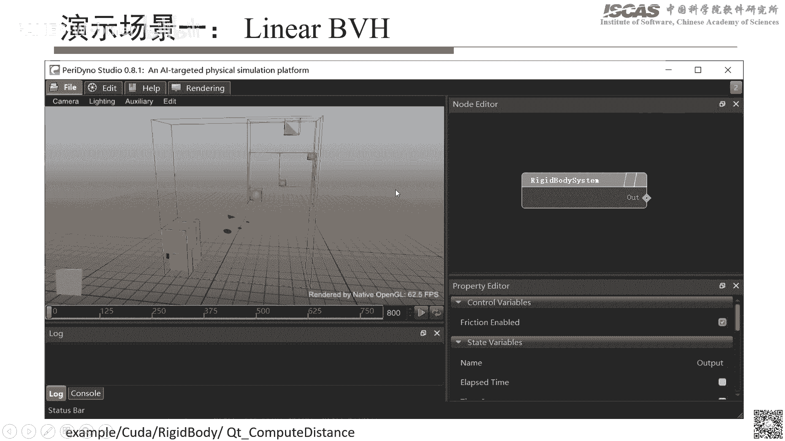

其实前两部分就是一个是那个Linux BVH，然后还有一个就是就是相当于窄间端方向检测的那部分内容，让我把这个打开一下，但这里是搭了一个简单的一个结构。

然后呢就是把这个构建的那个BVH那个结构，重复化的那个BVH结构呢实际上给它可视化出来，然后这个目录呢是在这个也是在Rigidbody下图。

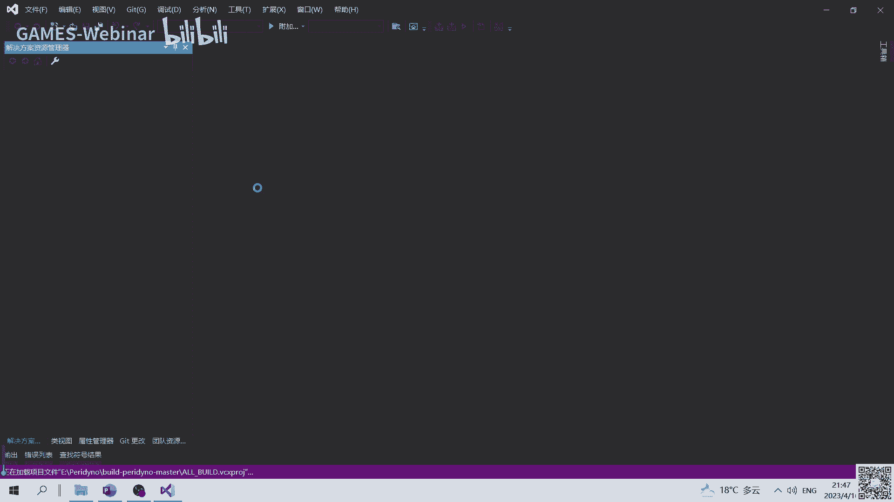

然后呢底下有个叫Qt-LinuxBVH的这么一个example，然后这个呢，打开之后呢，实际上就是看到的其实就刚才图里的那么一个界面，然后这里边我这样我先讲一下那个代码，就是这里边在做一个什么事情呢。

其实整个逻辑呢，跟上次课最后讲的实际上是一样的。

就是相当于我创建一个场景，比如这里边其实就创建一个场景，然后呢把场景给设进去，然后完了之后呢，就场景里边需要有几个东西啊，一个呢就是我需要创建一个钢力动力学的一个求解器，然后当然这里边每一个。

实际上就需要给它添加一些基本的一些单元，然后比如说像添加一个box啊，添加一些球啊等等啊，就这些，然后添加完了之后后面有一部分，就是这里额外写了写了一个模块，其实主要是用来去计算，就是相当于把这个。

因为这个整个Linear BVH它的结构啊，这是不能直接用来合成化的，所以呢，这里边额外有一个模块就是叫做，构建那个Linear BVH的这么一个结构，然后，然后相当于把它构建出来。

相当于把所有的那个AABB。

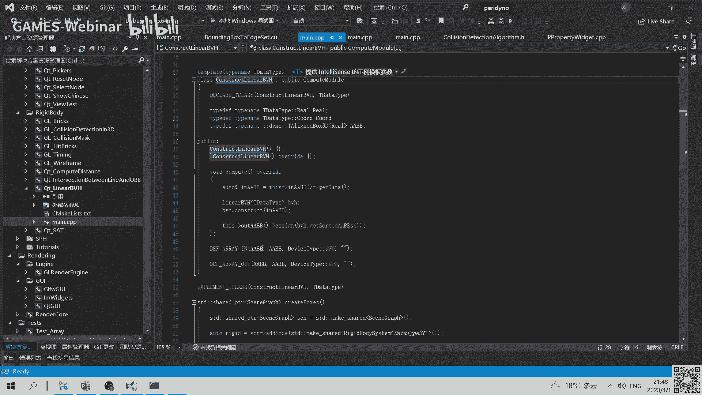

然后先给它导出来，就是因为它输入的话实际上是一个钢体的。

实际上是一个钢体的那个AABB，然后呢钢体AABB输进之后呢，它会就是说利用这个，这里有个Linear BVH的那个类啊，然后用它去构建完了之后，然后这个时候呢，你可以有这么一个接口叫。

GET缩写的AABB，然后这样的话就是包含内部节点，以及它的叶子节点的那个所有的AABB，其实都放在一个竖足里头，然后这个竖足呢，就作为一个输出的这么一个接口，然后呢给它导出来，然后这个导出来之后呢。

后面还有几个模块需要去做，因为直接的AABB结构，跟我们那个可实化的那个需要的结构不一样啊，所以呢这里边需要给它转换成一个，线框的这么一个结构，所以这里边你可以看到就是，这个Bunnybox算完之后呢。

先给它输入到那个，叫Construct Linear BVH这么一个类，然后呢它会输出一个AABB，然后呢每个竖足，然后这个AABB竖足呢，然后进一步的需要传给这个叫Bunnybox的那个。

作为AG-SAT的这么一个模块，然后这个模块呢会转换成一个，就是我们渲染支持的一个数据结构，然后最后的话其实就是一个边框的这么一个，渲染的一个模块，然后最后整个显示出来的话应该。

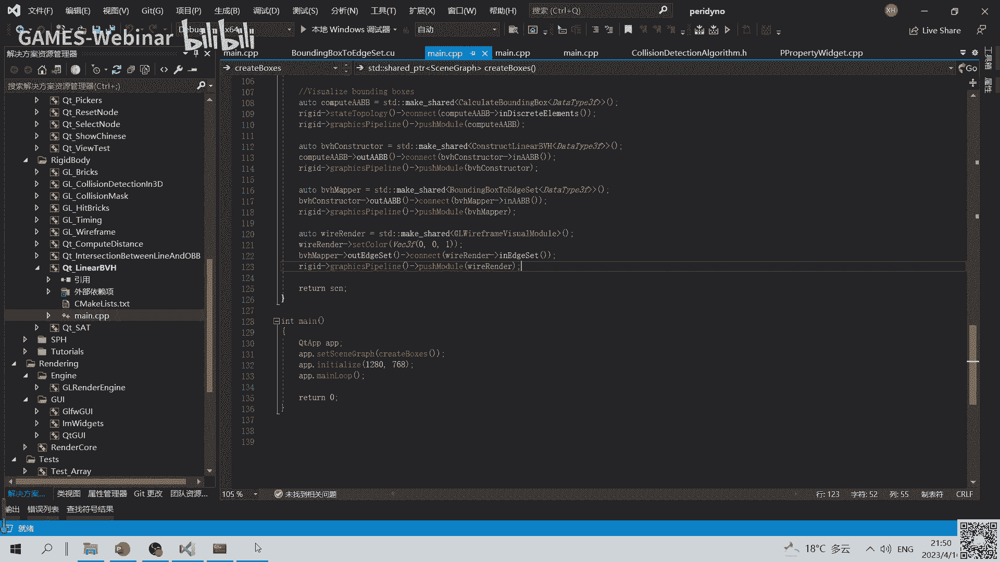

稍等啊这个好像还没出来，这回应该出来了，所以最后的话实际上就可以看到，就是类似这样的一个结构，其实是一个层次化的结构啊，就是你可以看到就是从最外面的话，最外面的话实际上就是一个最大的一个AABB。

然后呢它包含了所有的那个相当于物体，然后呢接下来就是在足层就相当于是一个二叉数结构，然后呢逐步二分，然后呢将比如说分成这一部分，然后分成上一部分，然后接下来比如这两个物体呢，其实因为它还包含两个。

然后进一步的就分成上半跟下半，然后这里边也是一样。

然后这里边就是点进去之后呢，其实这里边也可以看到就是。

它里边有个整个计算流程，就是这个是整个渲染流程，就是它跟那个计算没有关系，就是点渲染管线里边，它其实就包含几步，就是首先就是，就是这个输出是一堆离散的一堆钢体。

然后这些钢体需要去计算它每一个钢体的AABB，然后算完之后呢，需要去构建那个Linear的那个BH，然后最后呢转换成渲染支持的这么一个数据格式，然后最后整个渲染出来，然后整个动起来之后呢。

那也可以看到就是，它实际上是动态更新的，就是因为它整个也是GPU上，就是它相当于输入变了之后，它实际上是会不断地重新的，再去计算这个AABB，然后当然这个，这么做的好处当然就是也可以比较方便的去。

看看它比如说哪个是不是过电错了。

这个也比较方便去调试，然后这是一个，然后呢还有一个Demo呢是，就是SAT的这么一个Demo，然后这个主要是针对了窄阶段的那个波浪检测，然后搭了一个Demo，然后去用来去测。

因为比如说像前面场景里边有一些，比如说像有一些Box，或有一些球，或一些四面体等等，那这些之间呢，我们实际上也需要去。

检测它的那个所有的那个触点。

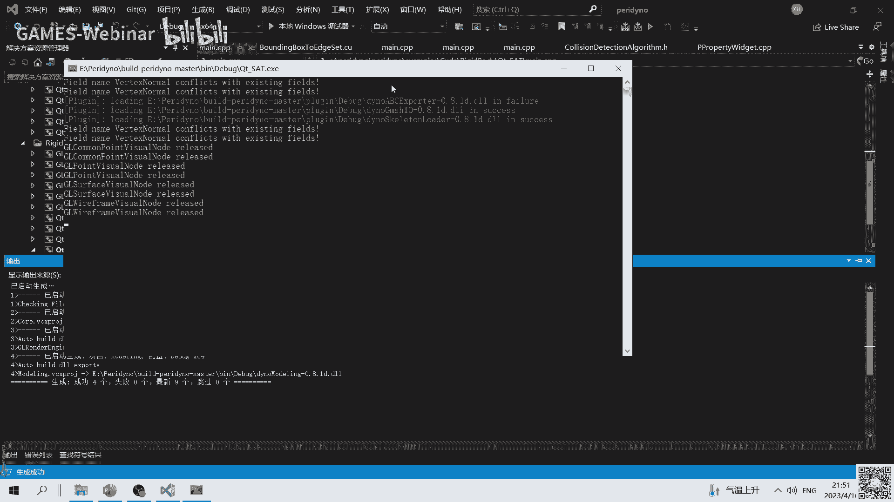

所以这里呢就搭了一个，这样的一个Box，两个Box实际上。

然后这样我稍微调一下这个。

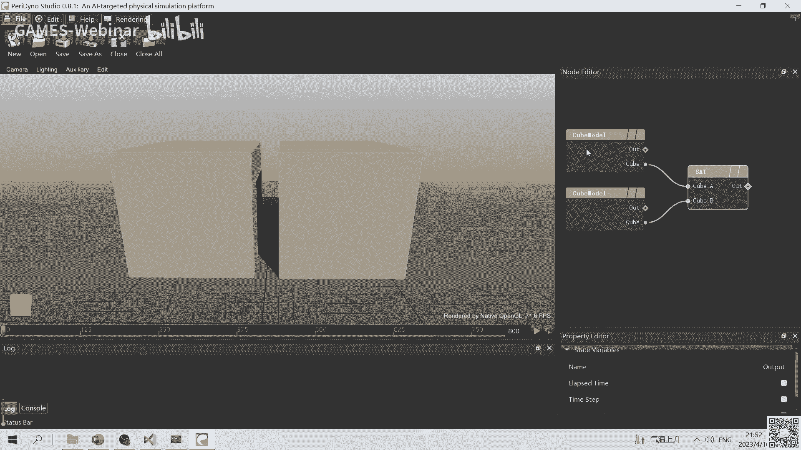

透明度反正的话看不太清楚。

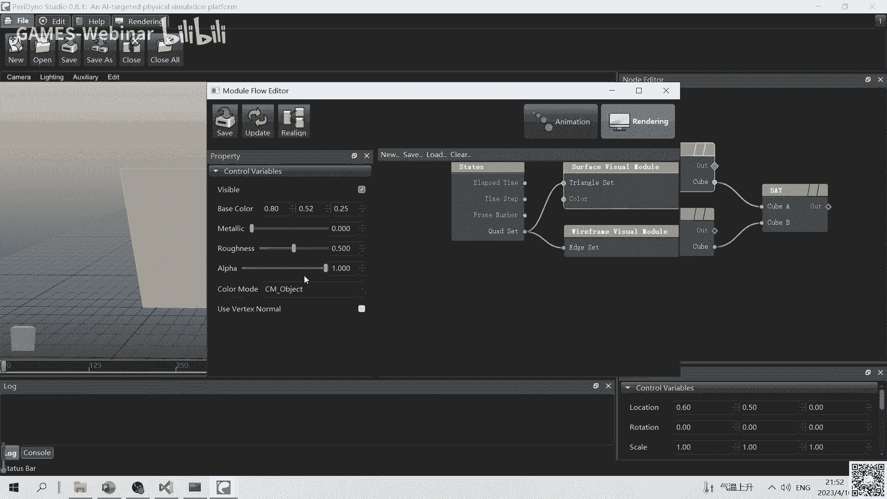

所以这里给它调成一个半透明的结构。

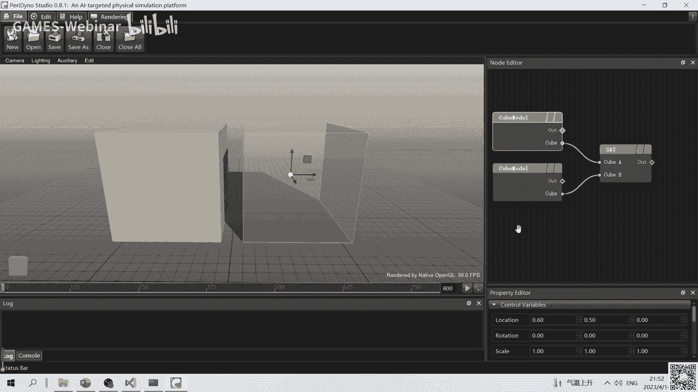

然后这样的话就可以看得比较清楚，好了然后这个调完之后呢。

实际上就可以，比如对这个物体做移动，移动之后呢你可以看到就整个，它实际上它的那个接触的那个流行，实际上包含多个触点，实际上都可以看到，然后当然这里边如果想看得更清楚一点的话，其实可以把Box给它关掉。

然后那这样的话实际上只看到那个，检测出来的那个接触的那个结构，就是它包含四个点，然后当把这个连起来之后，实际上就是一个多边形，然后这个东西整个也可以对它做移动，移动的话你发现就是它会跟着。

相当于是实时的去更新它的那个，整个相当于它的一个接触面，然后当然这里边其实也可以去，调一些其他的就比如说放啊，放的话其实你发现它，调完之后也是会跟着去动，然后还有就是旋转，旋转的话其实类似的。

就是旋转完了之后，当然其实它就是因为现在实际上，最多只是八个点，所以也就是说这里边实际上旋转了之后，这个正好是八个点，然后因为这个是主要是Box和Box之间的话，它是八个点其实差不多够了。

但是如果是更复杂的一些结构的话，可能有可能不一定够，所以这样的话其实就是在GPU里边，因为刚才也讲了，就是GPU里边我们尽可能的，因为实际上所有的数据结构，应该是一般都是定常的，就是动态的那个长度的话。

其实GPU其实不太一般，所以就是尽可能的用一些基本结合体，然后来去表示一些更复杂的一个结构，然后这样的话其实就是。

整个无论效率上或者实际上，其实会都会更方便一些，然后当然还有一些其他的。

这个像这两个主要是针对今天讲的，两方检测那部分，当然其他的就是还有一些，比如说钢体的碰撞的一些Demo，然后大家有兴趣的话。

大家也可以自己去搭一下，那这样今天我讲的就是。

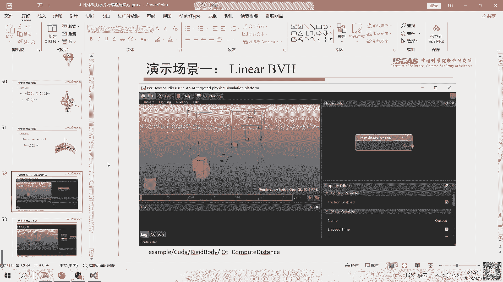

后面那个是第二个场景，然后当然还有一些，补充材料或者大家有兴趣的话，也可以去看一下，然后今天我讲的差不多就这些，然后看看大家有什么问题，然后也可以讨论一下，所以今天整个讲的还是会更偏基础一些。

因为不然的话，线路道太细的一些算法层面的话，容易就是，就容易迷失方向，行那我们看看还有没有问题，今天好像有点晚了，嗯，那后面反正这样。

因为有兴趣的话，其实可以因为这里边实际上，比如说像这里的，这里场景实际上测的只是一些情况，其他的情况的话，有的感兴趣的话就自己可以去搭，就是无非就相当于自己写一个，这个，比如说这个计算的模块。

然后调用一下，当然有些算法你可以自己实现，就是当然可以借助这里可视化的一些手段，然后呢自己去测各种各样的一个几何体，之间的那个，这个碰撞啊或者是钢体动力学等等，实际上都都可以。

会啊就是我看那个有个问题是工业上会，直接用复杂mesh去直接做，做检测吗，这个肯定是会的就是，因为实际上工业里边的那个要比就是，我们这个比如讲的可能要更多，就比如比如像以仿真为例的话，就是比如像。

典型的比如有四面体单元六面体单元，或者是这样其他的一些单元，其实也有可能也有，就这样的话实际上就是可能不同的，但是最终肯定是转换成一些基本的，一些几何体就是你不太可能就直接拿。

一个任意复杂的一个结构来做啊，就是你比如说你像表面网格一般来说，我们就转成三角网格或是四边硬网格等等，那也就最终肯定是变成一些，基本的那个单元之间的碰撞检测，所以就是你发现就是所有的比如我们。

前面展示的各种距离计算啊投影啊，等等啊这个东西实际上是都比较，都是比较通用的，也就是说你用到复杂的结构里边，其实也会用到这些工具就是，一些实际上就是一些基本几何单元的，那个计算的一些工具。

讲的要不我们今天的那个，课我们就到这吧，然后剩下的有问题的话，到时候大家也可以在群里边，一起来继续提问啊，行那先这样大家拜拜。

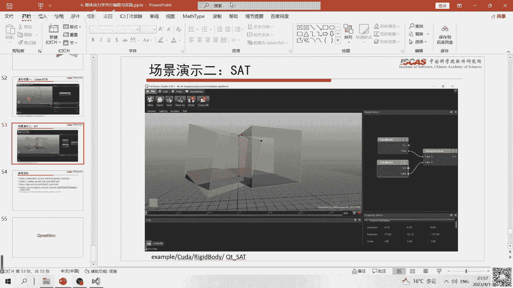