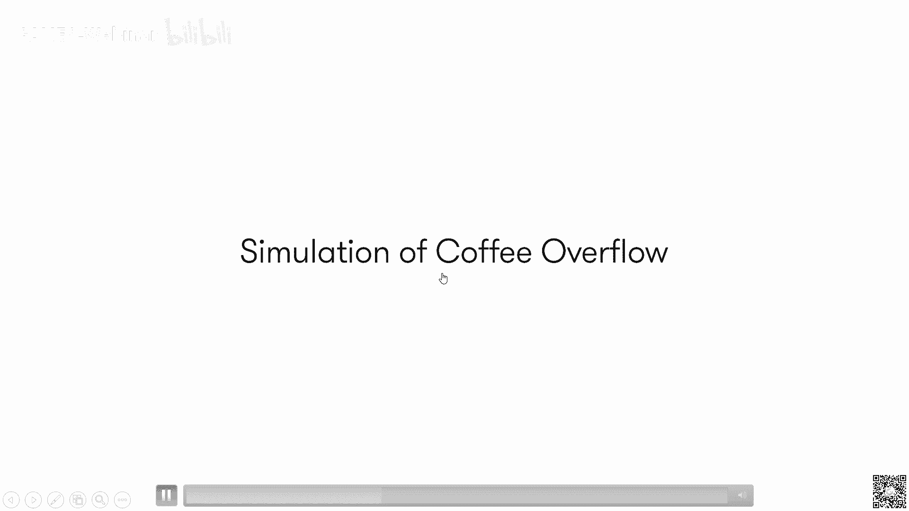
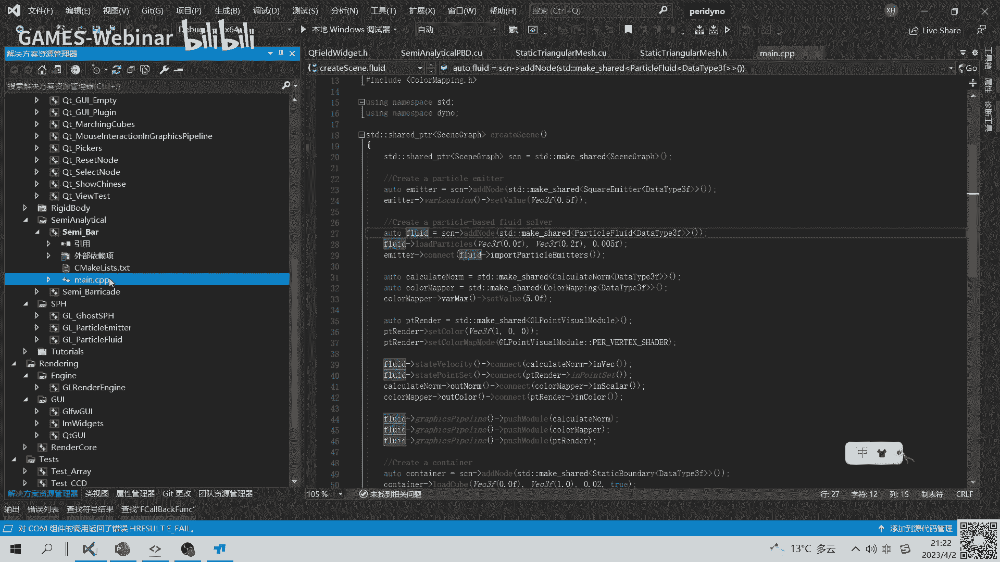

# GAMES401-泛动引擎(PeriDyno)物理仿真编程与实践 - P5：5. 光滑粒子动力学(SPH)并行编程与实践 - GAMES-Webinar - BV15M4y1U76M

我看时间差不多了，那那我们开始吧。

然后因为这次的话主要还是讲一下，那个跟sth相关的呃一些基础理论啊，然后以及流体仿真就怎么g s p h，因为当时那个流体仿真方法挺多啊，就是也不单纯的s b h，然后这次的话主要以s b区为基础。

然后讲讲就是流体仿真里边到底需要，就是说比如说需要模拟哪些呃，嗯哪些像，然后呢以及就是说整个基于gpu去做的话，就是大家应该怎么去做呃，然后整个大纲呢是这样，就是包含几部分。

就是首先还是讲一下s p h的一个基础，然后呢就是主要是针对啊，这次主要针对是这个粘性不可压缩流体的模拟，然后呢我们来看看，就是说到底比如说里边包含哪哪几部啊，然后这样的话就是每一部分。

然后到底涉及哪些内容，然后会过一下，但是因为这次主要是还是涉及的数学公式啊，可能会比较多啊，就是我尽量讲的通俗易懂一些，但是有可能有些呃有些部分可能还不不容易，那么理不那么容易理解的话。

就是呃也可以在课后再进的去看，比如相关的一些论文啊或者paper，然后这个当然最后也会给出一些呃，就是进一步的一些资料，然后有兴趣可以去读，然后当然最后还是就是说演讲一下。

就可以演示一下一些相关的一些场景呃，然后首先就是这样，我们来看一下s p h的一个动力呃，就光滑粒子动力学，它整个s b h的全称叫smooth party of，hydrodynamics，然后呢。

实际上中文的翻译的是叫光滑粒子动力学，然后呢它其实跟比如说跟像有些人啊，跟npm其实是等效的，其实也是相当于一种用的，大家用的比较多的一种，用于就是做物理仿真的一种方法，然后呢当然这里边其实不管是这样。

你是有限元也好，还是s p h也好，其实这里边最核心的大家都在解决的一个问题，其本质是在解决什么呢，是在解决，比如说呃，就是说现在我们现实中点进一个，连续的一个立场，实际上就是不管任何的初始方法。

它首先就要面对的就是说，实际上因为你是用计算机去呃模拟，你相当于整个物理的一个力学的一个现象，所以这样的话你首先要做的就是，你怎么用计算机，相当于怎么对这个连续的厂啊去做一个离散，然后离散完了之后呢。

那这样这样的话，就比如说那个因为比如像运动控制方程，一般来说就是以以偏圆方程的形式去表示，那这样的话里边的物理场你怎么表示，然后呢除了物理场之外，比如像这个呃通用的这个f物理场，它其实包含很多。

就有可能比如说是它的密度场，或者是它的温度场，或者它的压强场等等，这都可以，然后这样的话就是呃到离散的空间里边，因为我们知道计算机的存储空间是有限的，那这样的话实际上它只能是在离散的空间。

或者离散的一些点上面，然后去存储对应的一个一个量，然后呢这些存完之后呢，就是说那下一步的其实要做什么呢，其实就是说因为你实际上是你要用离散的点，进一步的去呃恢复你这连续空间。

比如说因为你存的是离散位章才有的一些值，那你怎么用这些值进一步的去算，比如说呃其他位置，比如你没有存到那个值，你怎么去算，然后呢还有除此之外呢，比如说你这个像呃这个物理场里边。

你比如说你要去算它的一阶导数，这个倒三角实际上是一阶导数的，就实际上是一个梯度的这么一个标标啊符号，然后呢还有就是除了那个一阶导数的话，比如还有二阶的这个两个两个倒三角，实际上是呃等效为一个拉普拉斯。

一个张拉普拉斯的一个算算符，所以呢相当于这些，就是说你在这个离散表示基础之上，然后呢怎么进一步的去，比如说去呃计算它上面的梯度啊，它比如说它的二阶导数等等啊，就这个实际上是各种的数值物理。

模拟的一个方法，而且各种设置方法，其实都要解决的一个核心的一个问题，然后呢这里边那我们看一下就是啊，因为每个方法其实他的思想上可能不太一样啊，但我们所以所以这里边我们来看一下。

就ph就是在解决其前面说的那个问题，它的最核心的一个思想到底是什么，当然首先第一点，因为它整个是用例子来表示的，比如像左边那个图啊，就是说我们知道那个连续空间里边，它实际上就是里边整个是填。

假设它填满了啊流体，那那实际上它最核心的，实际上就需要把这个啊计算域，就是相当于这个百分百和一里的那个计算空间，需要给它离散成一堆的一些离散的成一堆的点，然后当这里买四片区一个最大的一个特点。

就比如跟有线源，或者跟那个呃欧拉网格法最大的特点是，你会发现它粒子之间它在每一个时刻，它实际上不存在一个固定的一个拓扑连接关系，的，就是什么意思呢，就是就是他们比如说这个你任意选一个点。

它跟它的领领域啊，它们相邻的那些点，他们之间是不存在一个连，比如连接的一个键，它这个东西不是固定的连接，而是在整个动态的过程中，相当于实际上不断的需要去维护，重新去计算这个。

所以这个实际上它是跟就是欧拉法也好，或者跟那个呃有限元法这个最大的一个差别，有些人我们知道就是它拓剖分满了之后，它实际上是有一个拓扑结构，就是说比如他顶点哪个顶点跟哪个顶点之间呢，需要连接在一起。

这个是有限元的一个呃呃基本概念，但是呢s p h里边其实是没有这个连接的，这么一个概念，也就是说整个计算的时候，需要不断的去重构它的一个领域关系，就是它运动完了之后，它需要根据当前的一个状态。

去更新它的一个领域，然后呢根据新的这个领域进一步的去算，比如上面的一些物理量，或者是他的一些比如说一阶导数，二阶导数等等，那基于这样的一个特性呢，就是s p h实际上就是为了计算啊。

它实际上就呃呃有这几个基本的一个要素，就是首先第一个实际上是叫核函数近似，因为前面讲的就是说你相当于所有的那个点啊，比如说啊，比如你所有的物理量是存在一些离散的，那个点上，比如像右边那个图表示。

实际上你就是说你存在存的都是这些，比如说这些啊圆的这个中心点上其实才有值，那这样的话我比如说我对任意一个点，那怎么去计算它的那个值呢，它实际上就需要用到一个叫核函数近似的，这么一个一个方法。

然后它本质上你可以发现，它实际上就是一个加强平均的这么一个概念，就是这里边有包含几部分，就是一个呢是你需要知道它到底是哪个领域，比如这个i这个点，他的领域到底到底包含哪些点。

比如说呢这个像这个灰的那个圈里边的，所有的例子，就代表它的一个领域，嗯然后呢除此之外呢，就是因为这个你你发现其实这个它的领域啊，跟比如说你要计算的那个中心点，它的位置实际上是不一样的，所以呢，这个时候。

其实说你要去反映这种位置的一个变化，因为不可能说你相当于离得远，离得近，其实相当于整个贡献一样的，这个实际上是不太合理，所以呢，实际上这个时候就需要引入一个叫核函数的，这个叫w的，实际上是一个核函数。

然后这个好像如果一般的形式是这样的，就是它满足几个特点啊，就是一个首先它满足这个支撑，颈椎支撑的这个概念，景支撑什么意思呢，就是你比如说他那个相当于他那个值是有界的。

就是比如说你超过这个呃k跟h那个半径之后，他再往外的话，它它相当于他那个值是零，那这样有什么好处呢，就是你实际上去呃模拟的时候，你实际上就不需要去考虑你所有的那个例子，你只需要去考虑。

比如说你爱这个附近的那些点，那这样的话也就整个就不至于就是说出现，就是你需要大量的存储开销，或者是你把所有的例子考虑一遍的话，这个复杂度实际上是比较高的，所以就用这种方法的话。

相当于就这个整这个景致支撑这个概念的时间，就相当于整个给你的计算量就给你降到，就是你只需要考虑附近很小的一定范围内的，那个一个计算，当然还有一个很重要的一个就是啊，叫做规矩化条件，就是因为你这样的话。

实际上你啊前面就第一个就是前面讲的第一个，实际上是一个加强平均的一个概念，那这样的话你实际上你要求，比如说你这个w实际上是有一定的那个呃，属性的，就是说你不然的话，你这个w你任意的答案。

那这样也就你算出来，只可能跟中间就跟原始值可能会有偏差，所以这里边就要求，就是说你比如说你在这整个支撑域里边，就这个圆啊，就园内的这个权重求了，就整个积分积起来就正好是满足一。

那这样的话就是使得就是说你也就呃，就是你去算的时候就不会出现，就是说呃即使你用一个常量的一个场，你去算的时候，有可能比如说你这个不规划的话，会导致你整个值可能算的就不对，那这里边就是我们就后面看一下。

就是这个形式到底是怎么来的，就是为什么会出现这么一个呃，就这样的一种形式，然后呢以及看看他就是说这么表示之后啊，他到底啊比如说它是不是存在误差，然后呢他的那个精度怎么样，所以这样理解这个概念呢。

就是我们看一下，就是这个公式，就是呃它实际上也是一个积分形式，其实你没，你会发现跟前面那个加强平均是一个概念，但是这里边是有一个函数叫做这个德尔塔，这个德尔塔是个脉冲函数啊。

然后呢这个是以前比如学过那个，因为这个一般会在就是在波普啊，或者一般会讲这个东西啊，就卖中韩路有个什么概，有什么特点呢，就是比如说啊你这个f是一个连续的场，然后这个时候你用一个脉冲函数积分的话。

他得到的正好是相当于是中心点的那个值，也就这个时候，你相当于就是说你用任何一个脉冲函数，你去呃跟就是另外一个函数去做那个呃积分，求积分的话，得到的相当于是正好是那个中心点的那个值。

那所以就整个s p h实际上都是基于这个理论，然后去进步拓展开来，但是脉冲还是我们知道他有个特点，就是它相当于是在零的那个点啊，就是说这两个x y等于x j啊，正好重叠的时候，比如说正好中心的那个位置。

它是无穷大，但是呢他只要你一旦离开，那个x2 跟j x j一旦是不是就不重合，他这个是等于零，那这个我们知道在现实中，这样的函数实际是不存在的，也就是在计算机中表示里边。

你不可能表示一个无穷大的一个函数，所以呢也就实际上就是s p h，其实整个就是从这个脉冲函数去做拓展，就是把这个脉冲函数给他拉平，就是你原先比如说这个中心点，它有一个特别高的一个风，然后相当于给他拉平。

然后变成一个相当于比较缓的这么一个，一个刻度函数，但这样的话一拉之后呢，你会发现其实这个东西就跟上面那个啊，它其实不是等价的，就是它是存在一定的误差的，所以这个呢实就实际上也就是我们后面。

比如说啊不管去做任何计算啊，就是那个标准的物理量的那个计算也好，或者梯度啊，那个散度等等计算的时候要明白，就是说spa去整个它实际上它就算了，说，它是存在误差的，就是所以这个时候你一定要特别注意。

就是什么时候我们需要去考虑这个误差，然后呢去啊，就或者比如我们某些情况发现结果不对的时候，或者我们是不是有可能哪个误差，有可能没考虑到啊，所以这个这样的话，实际上进一步的实际上就是再往后离散的话。

就把这个积分形式呃变成一个离散的形式，那这个实际上就得到了，就是s p h那边，就是你到处都能看到的这么一个，它的一个基本形式啊，也就是说相当于它的中心点，就是或者任意一个点的那个值等效率。

就相当于在领域的一个积分求和这么一个概念，当然这里边整个就是啊除了这个w之外呢，还有一个就是它的一个体积的一个概念，就是当然这个体积实际上就是在算的时候，一般都是因为我们就是实际做的时候。

就是它的质量一般都是假设啊，就是都戴在每一个粒子上，然后呢它相当于每个粒子带质量是恒定不变的，然后呢，这个时候也就是它的那个密度，是需要实时的去计算，所以这个时候呢其实它的体积也要去计算。

那这样的话就也就是说还有一种形式，就相当于需要把这个啊体积表示成你的质量，除以它的那个密度的啊，这么一个一个形式啊，然后这两个形当然是等价的，其实你会发现很多paper里边他怎么写的都有啊。

所以这个其实没有关系啊，那那讲完就说这个它的基本形式之后，实际上就是啊对于其他形式呢，其实基本都是按照这个前面那个基本形式，推导出来的，就是你相当于也就比如你现在要去算的，它的一个一阶导数。

就是相当于它的项目它的一个梯度，不这样的话，实际上整个实际上就把这个梯度，这个你相当于类似t到这个被击的那个向里头，然后也就这个，实际上就等效于你去算他的那个梯度，但是呢直接就这么算，其实是有问题的。

就是一般来说你并不知道这个f的场的梯度，是什么样子，其实这是你不知道的，所以这个时候呢要做一个分部积分，分部积分怎么做呢，实际上就是这里有两项啊，就是这个实际上高数里的一些内容。

就是你如果把外面那个基本符号，以及一个db给它去掉的话，你发现实际上就是相当于你下面那项，给它拆一下，就是正好是等于啊，哦这个地方好像写词写有一个符号稿，写合同写错了，这个应该是个呃。

上面那个应该是个减个减号啊，所以这样的话实际上正好是这一项拆完之后呢，正好相当于是等于上面那项加上，就第一项加第二项的一个求和，所以说这样的话其实就是变成了，就是也就是说把原来这个f前面那个梯度啊。

其实可以给它挪到，你发现可以挪到w，因为这个w一般来说是我们自己设计的，所以这样的话实际上计算的时候会非常的方便，然后这个时候你发现其实可能还多了一项，就是什么意思呢，就是后面那一项就第一项没问题啊。

第一项的话，你直接就是按照标准那个前面那个离散，其实发现你给它离散下来就行了，但是呢，后面那项这个其实就比较特殊了，就是因为它虽然是一个体积分的一个概念，就相当于这个整个梯度啊。

实际上是在呃相当于整个内向是在梯度里边，然后这个呢当然你用一个散度定理，散度定理的话，实际上就可以把原先一个体积分，就是说我整个是在这个体上啊，积分的一个量，转换成一个面上的一个积分的一个量。

然后这个时候实际上就是它第二项可以变成一，个从体积分转换成一个面积分，然后这个时候呢你会发现这一项，如果啊，就是说我们现在假设他整个这个支撑域，实际上是满的，就相当于这样的话，他整个也就是说他正好。

他所有他整个支撑域里面填充了所那个啊，相当于包含的粒子是其实比较全的，也就是它整个正好是一个圆形的，这么一个支撑域，那这样的话你会发现就是这个w这个函数啊，在它这个边界那个地方。

因为它整个边界它正好是那条灰线的，这个是它的一个边界，但这样的话你会发现在这边界那个地方，正好是等于零，所以呢也就是说如果是这个呃，你比如说这个支撑域它不跟任何的啊。

比如说固体边界或者表面边界相相交的话，那后面那项正好应该是等于零，所以整个这样的话，你会发现，如果是对于内部的，比如说一些物理量的计算，就离的表面比较远的一个一些点的，那个计算的话。

实际上整个只需要第一项其实就可以了，但是呢如果这个时候你打个比方，如果你某个例子正好是处在，比如处在那个表面，那这样的话这一项啊，你会发现它实际上不等于零，所以这个时候呢需要额外的一些呃处理。

然后额外的相当于一些那个，边界条件的处理的方法，然后去解决这个问题，所以这个后面我们会回，还会回过头来再讲这个问题啊，因为这个实际上是也是目前在整个s p h的，这个研究里边。

其实是一个非常关键也比较难的一个问题，所以这个整个相当于有一项边界积分，要单独的去处理，然后这里边所以就是针对前面的，你会发现就是现在整个s p h这个呃community啊，它存在哪些问题。

就是呃然后因为这里边这样，之前有一个叫spark的组织，然后因为也是发现，就说s h其实也是遇到一些瓶颈啊，就是整个发展的时候，所以呢他就对之前的一些工作呢，整个做了一些总结。

然后呢把几大挑战呢列了一下，主要包括就是像稳定性也大，稳定性是其实是一直以来s p h都被呃，呃其实不是稳定性，就是是那个精度问题，就是精度啊，稳定性啊，咳咳咳，这个其实稳定性其实这几年其实。

其实就相当于各种方法的那个出现之后呢，实际上稳定性这方面其实实际上已经好很多了，但是呢啊其实目前还有一个主要的一个问题，就是可能它的精度是这样啊，比如说比起有些远，而且还是要要低不少的。

所以这个也是相当于是其他的，比如现在沿线的方法，然后诟病s p h的一个主要的一个方面，然后呢除了这个之外呢，就是前面讲到的，就是因为它存在这个边界的那个问题，就是因为他整个在边界如果如果被截断的话。

它会导致就是说整个精度会降低，然后当然还有就是自适应的问题，然后以及耦合的这些，其实都是目前s b h存在的一些比较难的问题，所以针对这个问题呢，实际上就是这个spark组织，他呃他设了一个奖。

就是叫其实以这个s b区那个发明人，这个叫旧的发明人，他也相当于立了一个奖，就是相当于表彰，就是说在前面几个方面，如果是解决的有些重大突破的话，然后呢相当于他会授予这这这么一个奖，那也就是上面说明。

就是这里这几个也是目前啊，相当于这个整个研究s spa去这方式块啊，相当于比较前沿的，然后当然也是目前呃现存的，可能有问题的一些点，然后呢，大家也可以就如果是后面去做这方面的话，也可以从这个角度去入手。

然后看看有没有可能从哪个方面，我们去突破里边的一些关键的一些难点，然后接下来就是重点来讲一下，就是呃怎么用s p h去做那个粘性，不可压缩流体的一个模拟，然后这里首先我们来看一下它就是什么是粘性。

不可压缩流体，然后当这里边主要是包含呃两部分，一个呢就是呃其实其实看看名字就能看出来，就是一个是当然不可压缩性，不压缩性有什么概念呢，就是看比如看左边那个图，就是你看那个比如说你是呃海呃，海里的水。

或者是你杯子一杯水啊，它正常情况它是体积是不太可能被呃，相当于你在重力作用下，或者你即使用很大的力去压这个呃，流体的这个介质，它实际上它的体积变化很小，所以这其实就是它的一个不可压缩的，这么一个特性。

当然除了这个之外呢，还有一个很重要的就是它的粘性，粘性的实际上就是直观理解，就是比如像你的牙膏，你的蜂蜜，然后你你你去摸的话，可能会觉得黏滋滋的，然后这个跟水跟水是明显不一样。

那说明实际上就是像蜂蜜的粘性啊，它实际上要比这个水要要大，所以呢实际上这个就是呃做的时候，相当于比如我们可以调整这个粘性，然后呢去模拟一些比较黏的一些流体，那这个时候我们比如说。

我们现在是相当于要在数学上，怎么去描述这两个特性啊，我们来看一下，就首先我们看一下这个不可压缩性，其实前面讲的就是他不可压缩，主要特点体现在就是你相当于你用不同的压力，你去压的时候。

它的整个体积是不会变化的，比如像这个这个场景，你要相当于你用三种不同的，就类似于千斤顶，你比如说你用三种不同的这个呃，这个重力的东西，然后压在上面，它整个体积啊，比如这个流体的整个体积是保持恒定的。

所以呢这样的话，就是说整个是从数学上怎么讲呢，实际上也就是说对于里边，我们如果任意选定一个区域啊，就是它体积不变，其实等效于什么呢，其实等效于它里边它的密度它是不变的，也就是它的密度是肯定的。

也就是你不管用多大的力去压，它的密度都不会发生变化，那这个就是这个特性，然后我们看看后面怎么来做计算啊，就是我们看看就是说我们再进一步的，就是这里边其实有用到一个很重要的一个定理。

就是叫雷诺的那个诉讼定理，然后这个定理什么意思，就是其实假设我们现在有一个物理量，这个q然后是代表任意物理量，它比如当然它也可以是温度或者可以是压强，或者是其他的等等，各种物理量都可以。

然后呢这个定理呢，就是说它也就是它描述的是什么意思呢，就相当于，比如说我们现在任意的框了一个这个控制欲，然后这个控制域呢，它里边肯定包含了一个一些物理量啊，就是它区域内是含有一定的物理量的。

然后呢整个区域内物理量的含量，这代表它的一个总含量，然后他们那个变化的这个率啊，实际上就用这个公式来表示，就这里它相当于你怎么积分起来之后，然后它随时间变化，那它实际上就是呃相当于它的。

就这个大地是代表一个物质导数啊，就是相当于你它会就是整个里边那个量，是会跟着这个啊，是所以相当会随着时间变化的，所以就它那个变化率就除除以d t呢，就代表它整体的一个变化率，那他这个变化率受几方面影响。

一个呢是他自身可能就是说它有可能会呃，减减大或减小，然后这个比如说像你最值得，最值得的一个例子啊，就比如说呃你相当于马路上有个窨井盖，然后这样的话你这个窨井盖，它实际上它的水会沿着那个窨井盖给流出。

所以就这个时候呢，你发现它整个里边是呃里边的水是不断的，是减少的，然后当然除了这个之外呢，还有一项就是所以这个刚刚说的这一项，实际上就代表了一个自身的一个变化率，就是你本身你会随着时间变化。

那你当然也可能增多，也有可能减少，当然除了除此之外呢，还有一项是沿着这个边界，就是它有可能会流入或者流出，所以这样的话，就整体就是你相当于自身的总变化率，它实际上包含两部分，一部分是你自身的变化率。

加上你流入流出的一个变化，但这两个合在一起呢，实际上就代表着一个，相当于是这个整体的一个变化率，那这个东西就这个雷诺输运定理，到底有什么用呢，然后我们来看一下，就回过头来看看。

就是说那个呃不可压缩的那个流体的特性啊，就是怎么怎么得到的，就是或者是这样，就是我们怎么去推导这个流体的不可压缩性，那这里如果我们把前面那个q，我们假设就是啊用这个密度给它t进去。

那这样的话实际上就是这里边整个积分呢，就内部那个积分他记起来的话，实际上就代表这个，比如这我们这里选一个更简单的，就比如说一个立方体，那就代表着他的一个立方体，然后这里有假定这个立方体就不随时间变化了。

就这样的话，它实际上这个整个立方体的那个总里边的，总的那个质量，实际上就相当于是这么一个积分，然后他的那个变化呢，就是说当然如果你是不可压，那就代表他这个整个实际上是不会变的。

然后呢他这个时候它分主要的变化，主要是体现在两部分的，一部分，就是因为它自自身它的那个密度呃的一个变化，然后呢还有一部分就是相当于通过这六个面，有可能会流入流出，所以呢这两部分的和。

实际上等效一个总的一个变化率，然后这里边你发现就是把这个东西啊，就因为这个这个实际上是一个表面积分，实际上也可以进一步转换成一个体积分，那就这个实际上也是散度定理啊，就是从上面那个转换到这个梯度。

然后把这个呃rogue u给它，就是放到那个一个梯度算子里边，这样这个就变成一个散散度了，这个所以这样的话就整个就是从一个表面积分，就变成一个体积分，然后这两项一合到一起之后呢，你会发现就他的总变化率。

实际上就跟下面这一项实际上是一样的，然后这里边有个特点，就是这个v，实际上我们去就是我们去选这个v的时候，实际上是可以任意选的，就是你因为它不可压缩性的一个特点，就是你相当于任意一个区域。

它其实都是不可压的，所以这样就代表了什么意思呢，就是那你如果这个左边那一项，他就是说他的那个呃不可压缩，因为它肯定是要要求是零嘛，所以这样的话也就是左边内向等于零，等效于什么的。

等效于你相当于就是这个背肌的那个像的，里边的那两项的一个求和，实际上应该等于零，当然这里还就是相当于等效第二个条件，然后这个时候如果我们再进一步假定啊，如果比如说我们现在要做的是一个水。

因为水的话其实它有一个特点，就是它一般来说任意，就是我们可以认为它比如说任意一个点呢，它的那个密度啊是肯定的，就是比如可能就是1000啊，正好1000那个它密度1000kg每立方米啊，那也就这样的话。

实际上它相对于时间那个偏导数，它实际上是等于零，所以它这个如in正好等于常量，所以这项如果等于常量的话，你会发现整个就是把这个roll，实际上就可以去掉了，然后最后就等效，也就相当于它的一个呃。

这个u代表它的一个速度，然后相当于这样的话是最后等效上的速度的，一个散度是等于零，所以呢也就是这个ro等于恒定的一个常量啊，其实最后你发现用零和数，用定理呢实际上就可以等效的得出。

就是说相当于它的密度是常量，以及它的散度是呃等于零，这两个条件是是等价的，那这样的话就是也就是说这个时候我们哦，这个还没到那个，那就是所以这样的话，实际上就是我在后面会进一步讲，就是看看。

就是说因为图形里面就有两套两套方法，就是一套是基于这个row等于常量，然后去做约束，然后第二套呢是用这个散度等于零，去做一个不可压缩的一个求解，然后这里我们先把那个粘性这个讲完。

就是后面我们再来整体的来看，就是啊粘性以及不可压缩性，两个就是呃它代表到底就合在一起之后啊，应该是一个什么形式，然后当然这里边就粘性的话，其实跟啊不可压缩性就不太一样了，就是呃其实左边那个示意图。

其实就代表了一个粘性的概念，就是它的原理就是产生的原理啊，它不像那个不可压缩性，它是比如说它是相当于是我们选了一个控制欲，然后呢实际上它的体积不变，然后但是粘性的你就发现它的主要是由于。

比如说你可以看这两个板之间啊，就是说比如上面那个板运动之后呢，它不同层之间它实际上会带着相互运动，然后呢这个时候你不同层，比如上面那层它运动的快，然后呢中间那一层啊。

它运动的实际上他的那个速度是比较慢的，然后呢正是由于比如说这样不同的一个呃，运动的那个呃就是速度的一个那不一样，然后呢就会产生这个粘性，所以呢整个它的一个力啊，粘性的一个力，实际上就下面那个公式。

就是相当于没乘上一个呃，呃相当于它的一个速度的一个偏导数，然后相当于也就是说你会发现它的整个大小呃，这个粘性力啊，它的大小分为两部分，就是受就是受两部分影响，一个是它有个粘性的一个系数。

就是比如像我们不同的那个材料，就比如像蜂蜜啊，或者是像其他的一些啊水啊，或者像那个呃牙膏等等，你会发现这个东西都是不一样的，那这个不一样的，主要就体现在这个粘性的这个系数，然后这个mu就不一样。

然后当这个缪其实有可能不一定是一个常数啊，它有可能是一个比如说跟时间变化率啊，其实有关系的一些一些量，那这样的话有可能是对一个动态的，然后呢除此之外呢，其实它会跟就是说你的那个速度的一阶的。

那个啊导数其实是有关系，所以呢整个实际上是由这两个来啊，相当于去最后计算你的一个一个力，当然这个例你最后进一步的就是说，你相当于，比如说我们选定一个计算控制欲之后啊。

然后实际上它可以他的那个整个受到的一个呃，就就相当于是某个他整个相当于不同的那个，因为它实际上利施加到这个空置域之后呢，实际上有两呃六个面，然后呢不同的面的话，它实际上会呃由于它的压力差。

最后会产生一个加速度，所以呢最后实际上在n s方程里边，最后算的是这一项啊，所以呢整个最后导，把这两个就是不可压缩性和粘性，这两个组合在一起之后，你会发现其实最终完整的组成的，我们要去求解的。

实际上就两部分，一个就是它的一个不可压缩的一个条件，就是这里是啊，这两个是前面讲的，其实是等价的，你可以去求解，它的一个散度等于零的这么一个条件，也可以去求解，比如它的密度等于敞亮的这么一个一个条件。

然后呢除此之外就是我们知道，因为整个流体的运动的，这样的话，其实就是每一个质点，它实际上要受几个外地的一个影响，就是不可压缩条件，它主要是受压力的一个作用，那这样的话也就这个时候，你相当于要计算一部分。

根据它的压强去计算他的一个压力，然后呢除此之外还要去计算一部分，它的一个有像左边那个受他的那个粘性的影响，然后相当于是受相当于受他的一个年轻，下一个，影响产生的一个力的作用。

所以这样的话整个主要的是两部分，那最后一个重力重力这部分其实比较简单，就是你可以就是一般来说，直接都可能就显示处理了，然后直观的来讲的话，其实这个年就不可压缩和粘性的话，其实就是你可以看这个图。

就是不可压缩性，代表就是但如果是等于零的话，就代表着什么意思，就是它流入流出正好是一样的，然后呢就是如果是像大于零或者小于零的，那说明它实际上就是有一部分是流入了，或者留一部分流出。

那天肯定是意味着就本身它这个呃质量，就是它的密度会啊相当随着变化，然后呢，当然粘性的话其实跟他的剪切率实际上有关系，就实际上就需要计算到剪切率，来跟来更新它的一个一个速度啊，那后面的话我们就具体讲。

就是说那个呃，具体怎么来算，就是，怎么来求解那个粘性不可压缩流体，然后这里主要是这样，就是当然不同的那个方法会有一定的差别，然后实际上啊当然首先这样最左边第一步，一般来说所有的方法都需要。

就是你肯定是需要，因为这个是s p h的基础，所以你肯定是需要去先做一个领域查找，你确定相当于，比如说你跟你中性粒子相邻的那些粒子，到底是哪些，然后当然后面的呢，其实不同的方法可能会不太一样。

然后这里我只说一个大家用的比较多的一个，就是基于这个算子分类法的这么一个方法，然后算子分类法什么概念呢，就是它相当于把把下面整个n s方程，他其实就分成了几步去做。

就是他把粘性跟比如说跟这个粘性跟这个压强，这个实际上分成两步，就是除了压强之外的，其他的所有的那个像它放到了，比如说它放到了一个叫预测的这一步，然后这一步呢其实就会相当于比如把重力，把粘粘滞力。

然后呢以及表面张力等等的，这所有的项目实际上都更新完，更新完了之后呢，然后这个时候你会发现，它可能就是说它的不可压缩条件，它实际上没有满足，那这个时候在他去补一补，就是不可压缩条件的那个求解。

那这个时候整这一步完了之后呢，整个流体的不可压缩性实际上就满足了，然后在这个再往后呢，实际上就更新这个粒子的一个位置，所以整个就分为这么几步，就是这两个实际上会有一个顺序啊，然后完了。

当然之后是相当于是个例子的这么一个，更新的一个状态，然后呢这里边就是我们再看一下，就是呃首先第一步啊，就是这是所有的方法的一个基础啊，然后呢，呃其实相当于是一个例子领域粒子的一个查找。

然后主要的方法有两类，就是一类呢是基于哈希网格的这么一个方法，就他就是他就空间哈希哈great其实一样的，就是它的一个核心的思路呢是这样，就是它分为几步，就是首先第一步的话。

它需要把呃所有的例子就是假设啊，就是这里空间分布了这么些例子以后，它实际上需要分配一个足够大的一个网格，然后能把这个所有的粒子给覆盖柱，然后这个时候就有可能需要注意的一个地方。

就是一般来说就是实际去做的时候，就是呃我们需要就是它的那个例子的一个间距，一般来说是是跟设定的是啊，正好是相当于粒子的一个支撑域半径，正好这样的一个好处，就相当于比如说后面会讲。

就是说你这个时候你去查找的时候，你只需要去算你最近的，比如说二倍的话是33个格子，然后三维的话正好是27个格子，然后呢这一步做完之后呢，实际上第二步要做的，实际上就是相当于你需要去统计一下。

就是因为正好你会发现我格子跟这个呃呃粒子，实际上是有个对应关系啊，所以这个时候需要根据这个呃粒子的这个位置，然后呢相当于给他分配到就对应的格子上，比如说你像啊水面画的一些格子，然后呢去看看。

就是说哪些例子是处在这个格子一里，然后呢这个确定完了之后呢，接下来一步需要做的实际上就是创建一个索引，就是相当于就没有怎么呃在第二次课我们讲，就是呃你去创建的那个所有的那个，因为其实像这样。

你每个格子里可能都需要呃，一定的空间去存储它的一个例子，但是呢，这个时候你尽可能的让这些存储的那个数据，要保持连续，所以也就这个时候你分配存储这个粒子的，这个空间啊，肯定是一个连续的空间。

就是所以这样的话你要记录一下，就是有一个索引的数组，这个索引数组干什么呢，就是你要记录一下，就是你每个格子对应到你相当于存的粒子的，那个相当于它的一个起始位置在什么地方，然后有了这个之后呢。

相当于当然你这个呃后面相当于你就可以去算，就是比如说你它到底是哪哪个范围，这属于比如说第零个例子，然后呢3号后面的是第一个例子，它相当于从这里开始，那正好是他的这个范围，就正好属于。

就是说呃每个粒子特有的一个一个范围，然后这样的话也保证了，就是比如说它所有的这个例子，它实际上都是连续存储的，也就是说尽可能的去减少，就是说gpu比如去运算的时候啊啊，去取数据的时候。

有可能会存在就是取不着的那个那个可能性，然后这一步完了之后，当然后面就是呃，最后一个其实就是一个领域搜索了，相当于是呃你要去确定每一个例子，它跟它相邻的到底是哪些例子，然后呢。

因为已经相当于前面我们已经建立了这个例子，跟格子间的一个一一对应的一个关系啊，所以这个时候实际上我们首先做的，就是去找它相邻的，就是我先要确定啊，就这个例子它处在哪个格子，然后呢。

把这个格子相邻的那几个格子给它找出来，然后呢这是进一步的，我们去把格子里边存的那个例子，然后一一的去做一下判断，就比如它是不是落在这个，他比如他的那个h的这个一个支撑与半径一里。

所以整个实际上这个是相当于基于哈希福利的，这个啊这么一个领域查找的一个方法，当然这个方法有个不好的地方，就是呃如果是对于比如开放的一个场景啊，就这个钢铁里边其实之前提的是一样的，就是如果你是开放场景。

那这个方法其实很容易会导致你显存的，其实可能会溢出，就是你比如举办情况，你可以可能一个例子你会飞得特别远，那这样的话你要开辟那么大的一个空间，然后只是为了把飞得特别远的那个例子，书盖住的话。

这个实际上得不偿失，所以这个时候就是呃各有呃，就是对于内容的场景啊，就当好处，前面那个方法是它比较高效，然后当然不好的地方就是它存储的开销呃，有可能会比较大，然后极端的情况可能会导致那个显存溢出嘛。

所以这样的话实际上对于呃这种极端的情况，一般就我们还是推荐，就是用这个叫啊空间就bb h的那个策略，当然就上那个钢铁的时候讲了一个叫linda，linda b h的，然后其实这个方法就很适合于。

就是做这种稀疏分布的这个例子，的一个领域查找，当然整个方法它其实也分为几步，就首先就是呃这是第一步的话，可能跟钢铁不太一样，就是因为粒子的那个计算支撑域，它实际上就是它只需要跟中心点。

以中心点为那个圆点，然后呢相当于给它扩一个，就是它以它的一个支撑域为为半一半的边长，相当于构建它的那个a b b，然后这样的话实际上就是第一步需要做的，就是把每个例子的一个a abb。

相当于给它构建出来，然后这个ab正好是能覆盖度它的一个支撑语，然后有了这个之后，当然后面那个跟上次课讲的是一样的，就是直接可以用之前的那个方法，就是可以把这个所有的a b b构建成一个。

二叉树的一个结构，然后建完了之后，当然剩下的就有一个查询那个啊步骤啊，就是相当于你想根据这个a b b的这个，碰撞的一个关系，然后呢进一步的去把这个粒子在就是计算一下，就是比如跟他的那个距离。

处在它只剩一半径一里的那个粒子在保留下来，那这样的话整个领域的那个查找，其实就就完成了，然后接下来就不可压缩性的话，其实主要有刚才讲有两种方法，就是呃一种呢是呃约束它的一个密度。

是等于一个恒定的一个密度，然后这个方法呢比较典型的实际上就是p啊，叫p p t就是基于位置的一种方法，然后呢第二种方法呢，就是呃是基于这个投影的一个方法，然后它实际上就是呃等效率。

相当于求求解它的一个散度等于零，然后前面讲这两个方法，实际上就是在于特定的条件下，实际上是等效的，然后接下来我们就看看意思，看看，就是说每一种方法它应该怎么去去解，这个不可压缩的那个条件。

首先我们看一下这个记忆位置的一个方法，这个方法其实好处是呃其实比较简单，因为它整个实际上基于位置来做的，当然就其实稳定性也会比较好，所以呢这个是大家用的也比较多，然后他的思想呢是这样。

就是整个它相当于就是把这个密度等于这个，常量的这么一个条件，转换成了一个约束去求解，然后当然从这一步到下一步，这个比较简单，实际上就是嗯你稍微移向下，然后相当于就把它变成了一个，约束的这么一个条件。

然后呢这里的roll其实是就是用sdh来做的话，实际上就相当于用它的相邻的这个质量，以及它的一个核导函数，然后呢实际上就可以给他给算出来，但这个时候如果一旦发现，比如说这个条件不满足啊。

那就比如它不等于零的时候，那这是这个时候他要怎么去做呢，就是他需要去更新它的一个位置，就是相当于他需要不断的去调整它的位置，使得他最终相当于满足这个约束，等于零的这个条件，然后这个约束就这个更新。

它是用的实际上是一个泰勒展示啊，就是首先从第一步的话，假设啊，就是说他们现在，当然我们现在一开始不知道这个dd x等于多少，然后呢，实际上我们的目标是相当于我们要找一个dx，最终使得它等于零。

那这样的话我们可以把这一项实际上是按照呃，就是泰勒的展示给他展开，展开之后呢也就相当于它分成两部分，就近似，等于相当于前面那项是你初始的那个那个位置，那个相当于对应的那个值。

然后呢当然后面还有想其他的一个一阶导数，然后一阶导数乘上你的德尔塔x，你可以理解为一个部长，就是它的一阶导数乘上一个它的一个步长，这样的话也就你相当于沿着你用这个图表示啊，实际上就应该是沿着。

比如说你这个从x0 开始沿着某一个方向呃，往前运动一定的距离，然后呢逐渐使得他当最终，当然这个因为是这样，你这个一步它其实不太可能一次就能到啊，最终需要那个治疗，所以一般这个迭代的那个过程。

但这里边其实一步的话就等效于，就是你往往你那最终的一个目标点，相当于在靠近，然后这个时候就是说这个点x x，当然就是你发现就有几种策略，就是啊有几个需要确定的一个点，就是一个呢。

你这个方向你要确定到底往哪个方向走，因为你不然的话，比如像这个是，那正好应该是这样沿这个方向走，它实际上是呃，它的整个呃约束，是相当于它是靠近你的那个最终的解解的，但是你如果这时候反向了。

你朝着反方向走，那这个你是不可能收敛的，你只会越来越远，所以呢你这里北方向就是一般是第一位的，就是你一定要一开始要先确定一个方向，然后呢确定方向之后，然后这个时候你再进一步的去确定，就是你的那个部长。

这个兰姆达实际上代表它的步长啊，就你到底移动多少，所以呢这里边一般比较常见的，比如像那个呃，因为打这个paper，它实际上就是它在用的一个策略，实际上就是它假设它的方向。

实际上就是代表他的一个梯度的方向，它就沿着梯度方向，因为我们知道沿着梯度方向去走的话，他肯定是可以下降的，只能说你这个下降的那个路径，它可能不一定是最快的，因为我们知道像这个东西。

你你沿着这个梯度下降的话，比如尤其是往外的话，它其实是呃比较慢的，然后这个时候当然如果你直接一步到中间，那肯定你你选的那个方向肯定是最合理的嘛，所以这里边实际上就是整个p p t的这个，机遇的一个思想。

实际上就是相当于，他基于这个梯度下降的一个策略，然后呢找梯度下降的一个方向，然后呢，进一步的再去求他这个兰姆达的一个步长，然后呢这样的话把这个dx t到呃，前面那个公式之后呢，它实际上就得到一个呃。

这个等式就是呃相当于cx加上雷姆的，后面当然有个平方，然后这个东西移项之后，你会发现，就是那我们因为整个是要约束这个等于零，所以这样的话一移项之后呢，实际上这个连大i实际上是可以算出来的。

当然这里边有一个比较特殊的要注意的地方，就是因为整个这个c的那个梯度啊，它有可能是有可能是等于零，因为这个实际上是在程序里边，有可能是不可避免的，就是很多时候都会都会出现这个问题。

所以这里边必须得要加上一项这个ep索隆，然后这个就相当于是一个极小的一个一个量，然后为了防止就是说你这个左边那一项，出现零的时候被零除，那这样整个你可能整个计算后面可能就就崩了。

嗯所以整个核心的思想就是p p t那个思想，你会发现其实比较简单，然后整个计算呢其实也不复杂，其实相当于就是你算一下那个布场，然后根据那个贴图方向，然后呢，这样的话，实际上就可以通过逐步的调整它的位置。

然后最终使得它满足约束等于呃呃相当，最后实实现约束，这个呃就密度约束的这么一个条件，当然这个坏不好的地方，后面后面我会讲，然后这里我们先来看一下，就是另外一种思路，就是如果我们是用。

比如说基于投影的方法来做的，那投影的方法跟呃，继位的方法就可能就不太一样了，它实际上投影的方法，它解决的本质它是要去更新的，是它的一个速度，它不是直接去更新它的一个位置。

然后他它实际上是在它的速度更新啊，完了之后，然后进一步的，他才会去改变那个每个粒子的一个一个位置，所以整个呃就是从思路上来讲，其实也是一样的，就是我们现在假设啊，比如我们现在这个呃我们当前那个状态。

比如说他的那个呃施坦度的零那个条件不满足，那这个时候我们要做什么呢，就是我们需要去找到一个它的一个速度的改变，量大的u u假设啊，呃是它的一个速度改变量，使得这个速度更新上去之后呢。

就是新的那个速度能满足，这个散度等于零的这么一个条件，那这个更新量怎么去做呢，这个就是呃跟那个啥，就跟ppt球可能就不太一样了，然后这里边就是我们假设，每个粒子上都存了一个压强。

那实际上就是说他的那个速度，实际上就是通过它的压强力来算的，就是压强那个梯度，然后当然除以这个roll那个分，值得的就是除以r，然后呢上面有个dt，就假设但比亚特p的时间布里边，它的那个速度的改变量。

实际上是这么一个一个量，所以呢这样的话就是最后得到的，也就是说这里我们再移一下项啊，最后其实就可以得到下面的一个标准的，一个叫压强波动方程，然后它主要包含两部分，就是左边实际上是一个叫拉普拉斯算子。

然后呢右边那一项呢实际上是它的一个散度的，散度的内向，然后嗯这两个合在一起呢，实际上就是一般来说去，就等效于要去解一个线性方程组，然后呢把这个p就是他的那个压强长，相当于也就每个粒子上的一个压强。

我们要给他算出来，算出来之后，当然这个再反过来，我们就相当于可以用这个压强，然后呢去更新它的一个速度，然后速度完了之后，当然这个不给压缩条件实际上就就满足了，然后但是这种方法呢有一个呃。

就是如果直接这么去离散啊，其实会有一个问题，就是，就之前那个很多那个cs那个工作里面都提到，就是你如果直接这么去离散的话，它会出现很严重的一些抖动的一个问题，所以这里边呢就是呃更理想的一种方法。

就是我们这边叫做就相当于是呃，后面会讲有叫一个变分的一个框架，怎么去解决这个问题，然后呢这里边就需要引入一个概念，就是首先左边那个压强不同方程，它实际上啊如果是从能量的角度来讲，它实际上是可以等效成。

就是右边那个形式，就是这个实际上是哦这里可能少了一个平方，它实际上是一个ro那个u减二，robt那个这个后面一个平方项，所以然后这个是一个标准的一个energy的那个能量。

所以这两个实际上就是如果是变成能量之后呢，那我们实际上就可以用很多的，就是能量框架里边的一些方法，然后呢去解这个问题，然后呢我们就讲一下，就是，就是用怎么用变分法去去解决这个能量的那个。

呃约束优化问题啊，都多，后面可能都少了一个平方的那个，像就是啊这个其实都是二次，然后这里边就相当于其实它里边有一项，就是这个dela p，我们现在因为呃还不清楚，所以呢这里我们假设就是呃用的是一个。

nonlocal的这么一个策略，就是我们假设它中间这个就两两粒子之间，实际上都存在，比如说某个虚粒子，然后这个时候呢，我们相当于就是我们可以去更新它的，那个速度呢，我们实际上就是用类似于差分的一个策略。

就不是直接按照s p h的一个策略去分析了，所以这样的话实际上就是按照差分的一个策略，就是我们把两两粒子之间，就p i和p g之间的那个一个压强的梯度，实际上就直接表示成了，就是说相当于呃两个压强的差。

然后呢除以它的一个呃距离，然后最后当然还存在一个法向啊，然后这样的话就把这个东西记进去之后，然后呢给他一展开，然后呢展开之后，然后就变成了呃，因为整个是能量的一个一个形式，然后你需要去求解那个最优化。

这个相当于最极小值的话，你相当于需要针对这个p，然后算他的一个一阶偏导数，然后这个时候一展开之后，实际上就变成这么一个形式，然后这个形式跟前面那个亚洲模方程，直接离散的话。

就是会有很大的一个不一样的地方，就是这些项实际上就每一个像，就因为这个左边那个部分，实际上是一个拉普拉斯的一个算子，然后右边那项呢，实际上是代表了一个呃散度的这么一个算子。

然后这里边其实最大的一个差别就在于，这里边的一些系数啊，其实你发现可能会不太一样，然后这里的啊alphi啊，其实就代表的就是相当于整个有个权重函数，然后给它加合到一起。

然后当然这里边其实还有一些要处理的，一些点呢，就是呃就是因为是这样，就是前面讲的就相当于你的例子，实际上有可能处在不同的位置，比如你处在最内部啊，就是那这个实际上是标准的，其实你不需要做任何处理。

然后呢其他的所有的情况，实际上额外的需要去做补偿，就是比如说你一个粒子，处在了一个自由表面的一个网格，那这样的话你外边的粒子实际上缺失的，所以这个时候就如果你直接去解啊。

比如这里边左边那个方程你不做任何的处理啊，那这样的话，他整个线性方程组实际上是不可解的，因为它的系数矩阵它实际上有可能是极易的，他解不了，所以这里边一定要去把这个边界条件给施加上。

也就这个时候相当于我们假设呃，它外表实际上是存在粒子，然后呢就是这个时候呢我们用虚粒子给它补齐，补齐完了之后呢，相当于再去进的去，相当于去计算这个毫发的，这个就是前面那个系数，然后相当给它截断。

然后当然后面的比如说像固体边界的条件，以及就是说这种还有更复杂的，像这种三项的，比如它存在可能是一边是固体，然后呢同时有流体以及它的呃呃气体，这种这种实际上是更为复杂。

所以呢这里边啊因为这个公式比较比较多啊，所以呢更细的大家直接可以去就看，paper里的那个公式怎么去讲，然后这里我就不展开了，然后呢这个方法就是跟ppt的这一个方法比，有一个什么好处呢。

就是因为p p t的话，其实它约束的是一个密度等于零的，这么一个条件，所以呢它在模拟，比如像这个现象，这个实际上是一个叫fish bone的，这个就是非常有意思的一个现象。

就是比如两个水水柱打到一起之后啊，它实际上会产生什么呢，就是你会发现它会分离出很多，就是类似于鱼刺这样的一些小的那个毛刺，然后这个现象其实非常难模拟，就是如果仅仅是用位置约束的话。

他这个下来之后很可能是啊直接就是一个平的，然后甚至有可能就是一些，就是像这种长长条形的这些东西是不太好出，所以呢也就这个时候，如果是用那个呃基于投影的一个方法，这个时候我们相当于去约束他整个散度等于零。

那这个才能保证，就是它相当于出现类似于这样的一些，鱼骨状的一些一些特征，那接下来我们就来看那个粘性啊，就是粘性其实跟不压缩性能比的一个，最大的不一样的地方，就是你可以看这个它其实有一些叫做这个。

实际上叫做calling的一个现象，就是比如说你相当于蜂蜜，然后掉下来之后啊，它实际上会产生这样这种打转的这个这个现象，然后这个现象实际上是这是因为粘性呃，它有相当于解了之后。

然后他才会出现这样的一些比较有意思的，这这么一些特点，然后整个求解的时候呢，一般我们现在用的比较多的是两种，就是一种呢是左边这个方法，它实际上就是他这个实际上是一个啊。

就是叫x s p h里用的一种方法，然后这种方法呢它其实比较简单啊，就他就假设因为粘性的一个核心的一个作用，它实际上就是去衰减呃，比如说是衰减粒子间的一个，相对相对的一个速度，但至于怎么衰减。

你其实都可以，就是所以呢就像x x s p h这种方法，它实际上直接就是衰减它们的相对速度，那我这里比如画一个图，就假设我们现在uu i这个例子啊，它的速度是等于零，那这时候如果你施加粘性的话。

它直接是会沿着这个j的，就这粒子的这个速度的一个反方向，给它施加一个啊衰减，然后这样的话，实际上你会发现它整个实际上，就是它法向和切向，因为如果我们把这个速度啊给它做个投影啊，做个投影的话。

实际上它整个你会发现它法向的速度，就是沿着这两个粒子的那个方向的一个法向，以及他的那个切向的速度实际上都被衰减掉了，然后这个呢对于就是产生前面的那cording，这个效果实际上是比较致命的。

就是因为像这种转起来的话呢，它其实主要起作用，就是因为它切向它相当于有切向的一个力，然后才能保证它相当于最后相当于掉下来之后，它啊相当于能转起来，然后所以这里边还有一种模型呢。

就是呃他这个时候相当于我们就是对于法向，我们假设啊，就是呃呃就是这个时候呢，我们就要把它分成两部分，就是一部分是法向的，一部分是切向的，然后我们假设他的那个法向的那个部分，实际上是不动的。

就是然后呢只去衰减它的一个切线哦，这个时候我说错了，应该是只去衰减他的那个法向，然后呢他的切向这个实际上是不动，就这样的话，实际上就是也就是说它绕着这个ai这个例子，它旋转的那部分，我们假设给他啊。

尽可能给它保留住，所以这样的话好处实际上就是可以保证，就是出一些比较啊。

就类似于cooling啊，那bulling这样的一些一些效果，当然这里边其实还有一个问题要解决什么呢，就是呃即使前面那个问题给他做，就是相当于我们即使是按照法院跟切向，这么给它拆了。

其实就是在解粘性不可压缩流体的时候，还存在一个问题，就是因为我们现在用的是一个啊，算子分裂的这么一个方法，然后这个方法有个最大的问题，就是你不同的像他其实去求解的时候。

他的那个顺序实际上会影响他的一个访谈结果，比如说像右边那个图，我们展示的就是说我们如果打个比方，我们先去解这个粘性啊，先去解粘性的话，就是你发现就是他下来之后，整个就是呃。

在后面解完这个不可压缩的那个条件之后，它这个粘性的那些效果实际上就彻底消失了，就是粘性是对应的，类似这样coding这样选转这种效果，然后当然反过来，如果反过来的话，如果我们这个时候。

如果我们先解他的那个不可压缩。

然后再减粘性，然后这样的话，其实你会发现就是呃。

它粘性的一些特性才保持住了，但是呢他不可压缩的那个条件，就是说你会发现它底下其实摊的会比较快啊，这个实际上就代表他的那个不可压缩的，那个条件，实际上啊保持的没有特别好。

所以这个时候也就是说我们需要解决什么问题，就解决，相当于实际上不同的，像他们之间有可能会有冲突。

然后这里有一个比较呃合理的一个方法呢，实际上我们就相当于呃，那我们比如说我们在相互间冲突，那我们是不是可以通过不断的迭代，比如说我们迭代粘性，求解器以及不可压缩求解器的啊求解。

然后呢是他自她最终同时保证，就是说他年轻的约束以及不可压缩的一个，有的时候同时能够满足，所以这个工作的实际上就相当于是，我们相当于利用迭迭代的一个策略啊，然后呢最终相当于同时尽可能的保证。

就是不可压缩性和粘性的一个条件，然后当最后啊不同的那个迭代的步数，其实会对整个他的那个行为时间会有一些影响，就是当然整个迭代越多，他肯定经常开销会越大，但是所以这里边实际上也可以存在一个呃。

可以存在一个平衡，就是如果我们比如说效率优先的话，我们可以少迭代几步，然后如果我们是呃效就是效果优先的话，那这样的话实际上我们可以增大迭代步数，然后去模拟更有意思的一些呃。

一些就是粘性不可压缩流体相关的一些现象，然后前面讲的就是，这里边还有一个很关键的一个问题，其实就是边界的一个缺失的问题，然后这个东西怎么理解，实际上就是假设我们现在这个支撑域，如果正好跟。

它的边界正好是相交的，那这里边你会发现就什么问题呢，就是它实际上很多例子啊，实际上是就丢失了，就是因为你这个时候你是积分的话，因为我们一般采样的话，就是一般我们只采这个计算域以里的一个例子。

就是计算以外的，一般就是说我们相当于除除非特别处理啊，其实以外的实际上是没有例子的，那这个时候呢，如果你按照前面那个积公式计算的话，就是就前面我们讲那个，就比如梯度的那个李三话，它其实包含两项。

一项是呃内部的，然后一项是实际上的边界积分的，那这个时候如果你再看，我们再看这个边界积分的一项，它其实包含两段，一段是这个呃弧线的这一段，其实这段没有没有问题啊，就这段的话，因为它其实还是零。

然后呢其实有问题的那一段主要在哪呢，就是主要是在那个红色的这条线的这一段，这条线的问题在，然后红色六条线的话，因为它实际上是在一个呃，整个支撑域的一个内部，然后这个时候你去积分的话。

你会发现就他这个w啊，就是包括他的梯度的那个w，那个梯度实际上相当于都是啊不等于零，所以这个时候呢，其实这里边你如果直接把这一项，就是后面那一项，你直接把它约掉的话，这个相当于你是少算了呃很多内容。

所以针对这个问题呢，实际上我们后面会讲就是几种策略，当然一种呢是比较常见的，目前就是很多实际上都是去采那个嗯粒子边界，就是嗯相当于他把比如说他把这个固体边界，或者是我们需要考虑的这个边界。

实际上也是类似的，就是把它拆成一堆离散的粒子，然后呢，让这个例子呢，实际上统一的参与这个整个流体模拟里边，这是目前比较常见的，然后当众呃方法的一个不好的一个地方，就是因为当你需要采样采样的话。

整个肯定是你不仅耗费大量的那些计算开销，同时呢就是说你可能要啊额外的那个引入，就不少了一个存储开销，所以这里呢就是我主要简单介绍一下，这是呃另外一种方法，就是我们其实比较理想。

我们希望的实际上就是因为很多场景是这样，你导进来之后呢，实际上是它没有粒子的，然后呢一般就是我们比如cad软件建模之后嘛，它实际上呃它就相当于类似一个表面网格，那我们有没有可能。

比如说我们导进了一个表面网格之后，直接就相当于跟跟这个流体，就相当于直接做那个流固耦合的，这么一个比一个耦合的一个计算，那这里呢就需要用到一个，相当于是一个办解释的这么一个方法。

然后我们先来看看就是常规的做法是怎么做的，就如果常规的以前的方法的话，一般是这样，比如我们假设现在底下那个粒子消失之后呢，它实际上就是它会引入一个一个像，就是叫做代长相这个项目。

实际上就是比如说以前那个分母啊，因为总之这整个s p h的话，它是满足一个规那个规律化的一个条件的，就相当于这个v j跟w i j，它整个积分积起来之后应该是等于一，然后这个时候他发现。

如果这个相当于削了一部分周，它不是一了，那这个怎么办呢，它实际上就是在分母那个地方，哦这个后面内向这个f i没有，其实分母那个地方，实际上就是相当于是把呃他的那个积分，实际上做了一个规划。

就是它假设这一部分积起来之后，相当于处在那个分母里边，就相当于这样的话，实际上就是对应的把这个f i，实际上它的每个值啊，你发现它呃实际上是等比例的给他调高了，但这种方法呢其实会有一个什么问题。

就是他没法就区分，就说你这个例子，比如说是处在一个表表面的，就是说这个流体表面，还是说固体表面，你这个实际上没法区分的，比如那个气体表面的那个位置，其实就是你比如像这里画的那个情况。

就是像上面那个其实离气体表面的距离，我们假设跟下面那个粒子，离固体表面的距离是一样的，那这个时候你如果去算的话，你会发现就是它整个不论是密度也好，或者是那你根据密度你去算他的那个呃压强。

你发现其实都是一样的，那这个其实肯定是不符合常理的，这个什么原因呢，就是呃我们按直观理解，你发现其实正常，应该你比如你一个净水压的压强从上到下的话，实际上是一个从不断的一个呃，增加了这么一个过程。

但是所以这样的话，你直接用这种方法去做，他算出来那个值应该是一样的，那也就这种方法其实没法有效的去处理这种，这种不同的一个边界的一个情况，那这里边就是说我们看看，就用这种办解释的那个方法怎么去处理。

那这样实际上这里核心的当然肯定是，要把这个缺失的那一部分我们给它呃，怎么相当于intro的部分，正常的话你相当于是需要一个体积分嘛，但这里我实际上我们最核心的是这样，我们看看有没有办法。

把这个体积分的这个呃部分，然后转成一个表面积分，就是比如因为这个表面我们前面讲就是知道的，就是你赢了一个cad表面网格或者三角网格呢，你这个表面是已知的，所以这里边就是我们看看怎么去推导。

这个当然首先是整个积分域，当然这也分两部分，一部分是流体内部的，那流体内部的其实就很简单，因为这个啊前面已经讲了，就整个相当于你粒子实际上是对流行，内部肯定是会离散的，所以这部分人没任何问题。

然后当然其实这里面最核心的，就是外面那一部分，就是这里标的那个黄色那部分啊，然后这部分的话，因为我们实际上就是里边，我们假设我们现在不采样例子，那你这样的话，实际上你是不可能说通过体积分的那个形式。

然后给它把它给它算出来，那这里边就是我们看一下，就是有什么办法，就是把下面那部分呃给他，相当于也是类似于，就是转成一个表面积分的那个形式啊，然后这里边我们因为是这样，如果打个比方，我们现在这个f的函数。

因为我们现在我们现在去积分的，实际上是一个被积的，实际上是给f f f函数，当然如果我们假设，如果f选的是一个任意的函数，这个时间这个这个目标是不太可能实现的，因为啊也不存在是任意的一个函数。

就可以转换成一个从体积分，就可以转成一个表面的一个积分，这实际上不现实，除非比如说你是一个那个这个函数，一开始就你能表示成一个它的一个导数，那这样的话是通过散射定律是没问题的。

所以呢这里边其实我们就考虑，就是如果对于特定的函数假设啊，某一类函数实际上是可以啊，比如说像有一些叫啊，它实际上就是它的函数，可以表示成它的一个半径的这么一个一个函数，所以对于这类函数呢实际上比较特殊。

那这类函数如果打个比方，任意的函数都可以表示成它的一个叫radio的那种，这种形式的话，那这样的话，其实它相当于我们就可以把这个整个内部，就f这一项加上w，因为w它本身就是一个这个函数。

就相当于他只跟那个它的半径有关系，他跟他的那个他也就是它沿着这个方，就他沿着那个半径那个方向，它只沿着这个方向变化，它也就是它整个比如说它半径r一样的，那个地方，所有的那个值是一样的。

所以对于这样的一种形式呢，实际上就是我们可以把它转换成，从一个体积分啊，转换成当然我们利用那个球面坐标的那个公式，然后就可以把它变成一个球面，球面的这么一个积分，然后这个这样再进一步的话，你会发现。

就是当然这个我们可以去找它的一个原函数啊，就gr它的原函数，其实这里表示成它的一个大g，所以这里这样的话其实就变成，你会发现整个积分的话就变成了两部分，一部分呢是相当于下面那个弧，就是这个h。

所以下面那个弧这个弧当然其实没问题啊，就因为整个式等于零，所以直接就消掉了，所以呢另外一部分其实就是，相当于是这条黑线画的这一部分，那这一部分的话其实就是比较容易了，就是因为我们实际上有。

相当于我们有那个呃表面的一个三角网格，就是我们三角网格进来之后呢，实际上我们可以对三角网格上的一个，任意的一个三角面片，然后呢利用这个函数去计算，然后这里面你发现这个r当然这肯定可以算了。

就r上面的任意一个点，然后呃以及它上面那个值实际上都可以算，所以就这里边就是可以用这种方式的话，实际上就可以把以前的一个下半部分的一个呃，体积分呢就实际上就表示成了一个面积分，然后这个面呢因为进一步的。

比如如果是拆成一堆的零散的一个三角形，那，那这样的话就是我们相当于可以把利用，比如每个三角形上的一个积分，然后那比如说针对这个三角形，那这样的话它实际上可以表示成，就是说它的一个值以及它的一个二面角。

这个我们一个s代表它的一个二面角啊，然后这样的话实际上就用这个二面角，那当然它等效的实际上是这个球，因为它这个三角形投影到这个球上，这个欧米伽s，所以这里边我们有一个欧米伽s，就是二面角的计算公式。

相当于我们利用这个二面角，乘上这个这个g的那个公式，然后就可以算出这一部分的那个贡献，那这样的话，我们也就是如果我们对任意一个三角网格表面，三角网格进来之后呢，我们相当于每个三角网格我都积分。

积出来之后呢，实际上这个外面的一部分实际上就可以，那相当于整个体积分实际上就算出来了，就是这个时候你会发现，这也不需要我们去把这个外面的部分采成一堆，离散的一个例子。

然后当然这里边就是比较复杂的一个地方，就主要在于就是说呃，你这个三角网格跟这个球的那个交界面，实际上情况比较多，就是呃这里我们列了九种情况，就是因为他有可能是跟那个三角板，就是跟那个球不相交。

当然有可能是比如有是这样的一些呃，特别复杂的一些形状，然后所以这里边，为了简化计算的话，实际上我们都给他呃，需要给它统一拆成，就是说一些基本的一些图源，就是因为直接像这么复杂的那个图片，这个是不好算的。

所以相当于我们就是给它需要拆成啊，相当于基本图案主要是有两种，一种是半弧，然后还有呢是像这种三角形，因为三角形的话就比较容易啊，然后还有就是弧形的话其实比较容易，所以整个所有的情况呢。

实际上你会发现都是相当于通过这种弧形啊，以及这个三角形的这个运算，当然每种情况他可能那个包含的那个形，那个形象不一样，所以呢这里边那个拆成了九种，然后当然具体的那个算法的话。

其实在这里类里边有详细的说明。

然后也可以看看一下里边的那个一个实现啊。

然后所以这里边就是后面有一些展示，就是就是这个好处，就是你发现就比如像以前的话，你这么一个模型，因为它其实主要包含很多特别尖锐的那个角，然后这个尖锐的角呢，实际上就是你用粒子去离散啊。

一个呢当然其实存在这个额外开销，这一方面，其实还有一方面呢是这样，你接个例子，在特别尖锐的地方，你怎么去离散，其实这个有时候是有歧义的，就是，会存在一定的一个这有误差，所以呢用这种方法的好处。

就相当于我们直接就用网格进来之后呢，实际上就不需要对这个嗯，就表面网格就是转成一个体，然后甚至有些有有些网格啊，实际上你是没法转成一个体的，就比如像后面的，像这种啊，特别这个呃细的，就比如这种电线杆。

这个电线杆，实际上有时候你很难，就是说你采样成一个对均匀的一些离散点，那接下来就是我们讲一下那个本文张力啊，就是因为，然后表面张力的话，其实就是你可以看左边那个图，就是呃它比较有意思。

它实际上它的主要作用就是你比如说你在空中，你放一个水滴，然后如果无重力的情况下，它实际上是会把这个水形成一个标准的一个，一个球啊，直观的其实就这么理解啊，然后当然它这个东西整个会跟呃。

它实际上它的力的大小实际上会跟曲率有关系，然后这个，然后这个表面张力的话，实际上它有这个张力的作用之后呢，实际上比如说你像有一些水生的一个生物，他直接在表面张力的那个作用下呢。

实际上可以在表面上去呃运动，然后它相当于不会存到一个随地。

然后这里边就是啊比较常见的定义，表面张力的一个形式啊，就是它有几项就是一项呢，当第一项代表的是它的一个强度，就是你表面张力大啊，比如说它可以是一个恒定的一个一个常量，然后呢除此之外呢。

就是因为表面张力主要是主要的作用，它实际上就是相当于你把一个原先的不规则的，然后最终实际上会收缩成一个球，所以他跟他的那个曲率是有关系的，而这个箭头画的好像有点偏差，就是它实际上是跟它的曲率有关系。

也就是你的曲率越大，它的那个表面张力实际上就会越大，当然最后还有一项就是他那个受力的一个方向，它实际上会沿着呃，就是它的合力的一个方向，它实际上当然就是说你如果把它拆解一下。

它会沿着这个表面的两个切面的一个方向，但它的合力的方向，实际上最终会沿着这个表面的法线的一个方向，然后相当于比如说你一个凹的那个物体，然后最终相当于给他一下嘛，某个方特定的一个方向给它收缩。

然后这是表面张力的一个标准的一个定义啊，这个会有什么困难呢，就是因为我们知道那个s b h实际上，它整个实际上就相当于是一堆离散的一个例子，所以这样的话它其实它的表面的那个定义，实际上是存在歧义的。

就是比如像对于这里边我们画了一堆的例子啊，就是你其实可以你就说你怎么画，实际上你都可以认为它的是它的一个表面，所以这样的话就是你这计算的时候，我们肯定不能说我们这个表面可以随意定感。

一半的话会导致就是说比如你针一针之间，你因为你的检测就是你去，比如说你计算这个表面的一些误差，导致相当于会有不断的一些闪烁的这个问题，所以就是说在实际上在粒子法里边啊，其实你发现呃。

其实你是很难真正的去定义这么一个，精确的一个一个表面呃，当然你可以比如说你去找一对靠近表面的例子，那这些例子呢，其实你发现它如果不断的运动的话，它这个东西会很敏感，就是因为它有可能稍微位置一动的话。

它其实就有可能从表面粒子变成，不是表面粒子这么一个状态，这样的话其实对于整个表面张力计算啊，他就你发现它不是特别的啊稳定格啊连续，所以针对这个问题呢，实际上就是更好的一种办法。

实际上我们叫做这个啊叫defuse的，叫做漫射边界的这么一个思想，就他主要他为什么这么做，因为我们知道就是呃基于这个，比如说那个二维平面这种表面张力的定义啊，它实际上是一个数学的一个概念。

它也就是它整个表面是实际上是没有体积的，那没有体积的话，对于s p h来说，这个比较困难，就是因为sp是整个实际上用粒子来分布嘛，所以这样的话实际上并不好计算，所以呢就是一个想法。

就相当于是我们把原先的啊，不带这个厚度的这么一个表面给它扩展一下，扩展成一个带一定厚度的这么一个表面，然后这个表面有什么特点呢，就是它实际上就相当于有一个呃，整个相当于从里到外啊，它或者从外到里。

它实际上是一个连续变化的一个曲线，然后假设他比如说内部是一，然后外部是零的话，那这样的话实际上它是从0~1，变化的这么一个曲线，然后它整个宽度呢它实际上可以用一个w，比如说来控制，然后呢有了这个之后呢。

实际上就是我们可以在这个这个表面啊，我们去定义它的一个能量，然后呢也就是这样的话，我们整个把以前通过比如说通过去举例，去计算这个表面张力的这么一个方法呢，就把它转成了一个能量约束的这么一个问题。

就是使得它能比如能量最小，那我们可以看看这个公式是什么意思，就是直观的看，因为它怎么算的，是一个梯度啊，就是c的一个梯度，然后你如果是把这个东西，你对照着这个图来看的话，你会发现有两个。

就是首先如果他彻底的在流体内部，比如说那这个实际上它它是等于零的，还有一个呢你会发现如果他彻底在流体的外部，它实际上它能量也是等于零，所以你会发现他只有在这个表面，处在表面的这一代上面啊。

其实你会发现它才真正的有能量，所以呢你就发现你这个，所以这个能量实际上就造一个表面能，所以为什么它叫表面能呢，实际上就是你发现他他的那个值，实际上只在表面附近有定义，当然这个它值最大的那个地方。

你如果对照这个曲线，你会发现，它实际上一般来说在正中心的那个曲线，它的那个只是最大的，因为它的斜率最大，它斜率最大的话，也就是它在正中间的那个地方，它的能量最大。

然后呢这样的话也就我们把以前的这个按照呃，就是曲率去计算，因为曲率的话你如果没有显示表面积定义的话，这个其实不太精确，然后不太好算，那这样的话就转成了类似于这样的一个积分，的这么一个形式。

然后这个形式实际上就比较适合用，s p h来做了，因为我们知道sp去整个是一堆粒子，粒子的一个一个离散，所以这样的话比如说它势必会有一部分粒子，它实际上是会落在比如说这个区域里。

然后呢我们相当于实际上整个约束的话，实际上就相当于我们去计算，比如说每个粒子的那个一个它的一个能量，它的一个表面能，然后呢利用这个保命能，然后去驱动这个每个粒子的一个一个位置。

然后最终使得它比如说整个区域，就朝着相当于他曲率最小的曲率，相当于最小的那个位置，然后去收缩，然后当然这里边其实你也可以验证一下，比如说你如果一个例子，然后处在最靠近里边，那处在最里边的话。

你会发现这两项啊，就是啊包括他的那个领域，实际上这个时候实际上这个等都有零，也就是说你发现这个这个力，它实际上只是针对这个靠近这个表面的，那些粒子，它才会起作用，然后呢。

如果对于比如说离这个表面特别远的，那些地方的例子，它实际上是不受影响的，所以这个其实跟以前的那个表面张力啊，就是形式上你会发现就是差不多，只是说他的那个点的定义呢就会变成了。

就不是说我单纯的是某个呃窄带上，而是相当于它放宽之后，是有一定厚度的这么一个区域，然后呢相当于有一个表面能量的这么一个定义，然后呢这里边就是其实还有一个比较呃，就是说如果拓展到更复杂的一个情况。

就是因为刚才讲的这个这个情况，实际上只是比如说我们现在外面是气态的，里边里边液态的两项的来这里吧，实际上还有一种情况更复杂的，就比如我们现在针对的是这种三项的一个情况，那三项的情况。

那结合就是简单的这个呃，我们处理这个办解释的这种方式的话，其实就可以把三项情况给它拆一下，就拆成两部分，就是因为其实这里面我们目的还是一样的，就是我们这个边界，我们就是假设我们不希望。

就是说把这个拆成一堆例子，当然采用粒子肯定没问题啊，就是采成例子的话，直接就很直观了，就直接把上面那个方法，直接就是在气体粒子上算一遍，然后固体力量再算一遍，实际上这个其实就行了。

但是这里边我们想希望做的呢，就是我们还是就是说，我们单纯的就引入一个表面网格，我们就直接就可以计算它的一个表面张力，然后呢当然包括两部分，一部分，就是由于流体这部分而产生的一个，表面张力作用。

然后呢另外还有一个一部分呢，就是由于固体的那个存在，将它也有一部分表面张力的一个作用，然后当然这两部分的相互影响啊，它实际上呃因为每一项它实际上都有一个值啊，就是啊这个值呢。

实际上是控制每一项的一个强度，然后这个强度呢，它实际上会影响它的一个摩擦角的一些作用，就是比如说这里边你流体的作用强了，然后固体作用弱了之后呢，他整个会相当于是会相，当于这个摩擦角会更大一些。

所以我们来看看，就是说怎么针对这样的一个情形来呃，就是来计算他整个一个表面张力，当然那个呃液体内向实际上不需要讲了，然后这里边实际上主要需要讲一下的，实际上就是呃固体面向，然后因为固体内向的话。

实际上就是啊直接按照前面那个离散啊，其实因为它有两部分，一部分呢是啊这个公式我可能那个少了一部分，所以直接可能就给出这个了，然后前面可能还有一个推导的，然后这个在论文里是有的。

然后这样的话实际上它就变成两个，就是一个分子的一部分，然后一个分母的分子上占这个东西，其实比较简单，因为这个东西，你发现它完全就可以利用散度定理，就是因为这个c整个实际上是一个常量。

那这样的话实际上就后面那一项啊，整个完全就可以按照散度定理，然后时间就可以转换成一个表面积分，就是就是这个第一项，实际上代表的分子的那个转换的这么一个过程，然后呢这里边其实比较关键的，实际上是第二项。

然后第二项的话，当然这里边其实可以把怎么做呢，就是因为这里边主要有一个xy跟x j的这么，一个一项，然而这一项跟后面那两个呢实际上要乘到一起，乘到一起之后呢，实际上也可以转换成。

类似于就是跟前面处理那个固体边界，这个半解积分的时候的一个形式，你会发现最后的话，它实际上你会发现它只跟他的那个半径有关系，就是跟粒子r跟j的那个距离有关，它跟其他东西是没有关系的。

所以这样的话其实这个公式啊，实际上就是很方便的，就正好就是转到了，就是我们前面处理物体边界的时候，这么一个一个函数，然后当变成这个标准形式之后啊，后面的话实际上就可以按照前面的那个策略。

一样去一样去处理，然后呢基本处理之后呢，其实就可以用来去模拟哪种呢，就是比如像这里，因为这里导入的实际上是一个呃表面网格。

这个实际上里边没有做任何的采样，然后呢这样的话其实就可以做这种，比如说流体跟这个表面网格，然后当然外面的因为其实不需要去呃离散的，因为空气那个我们假设实际上也存在一种粒子。

所以这样的话可以去处理这种三项的这种材料，就是呃气固液这个交界面的那个地，方的一些表面张力的一个计算。

然后当然这里比较典型的，当然比如像这种啊，还有这种眼泪的一个模拟，它实际上也是相当于是呃流体跟这个脸颊，然后呢以及空气相互作用之后的这么一个结果，然后呢整个理论部分，那个前面我觉得讲的应该差不多。

然后接下来这样我演示一下程序吧，就是啊有几个案例，就是啊左边这个实际上是带表面张力的，这么一个不可逆不可压缩的流体的一个模拟，然后又问那个实际上是一个耦合的这么一个。

一个计算，然后我展示一下那个程序，然后大家有时间的话，可以在自己可以再去试一下，这里边主要是包含两个目录，一个呢是在以前的，有一个因为这个是以前我们就开源了，就是有sk去底下的，然后这里边包含。

包含几个样例啊，一个是相当于有个发射器的这么一个样例，然后这个样例呢主要是展示的是怎么通过，比如说我们啊添加一个发射器，然后呢去模拟那个这个这个流体啊。

嗯比如像这个场景，它实际上然后就加了一个发射器，然后呢他那个相当于产生粒子之后呢，然后相当于底下当然加了一个边界，然后这样的话就是整个运动起来之后，然后相当于撞到边界之后呢。

然后他又啊可以看到一些流动的一些效果，然后这个其实比较简单啊，其实主要是一个基于p p t来做的，就是这么一个测器，然后它这个好处当然是比较比较快，然后这里面也没有加任何跟百分张力啥的。

相关的一些一些像啊，其实也没有加，然后呢，其实这里边另外还有一个就是像这个bar的那个，那这个bar的实际上就是。

呃就这个这个样例。

这样我简单讲一下这个场景吧，然后因为这里边呃有各个模块。

可能需要后面需要再调一下。

就是。

因为这个场景主要是这样，这个没有qg那个截点图，可能流程上看不太清楚，所以呢实际上这里主要包含几部分，一个呢就需要把这个例子载进来。

载进来之后呢，然后后面接一个实际上就是第一部分啊，就是你看整个构建的过程，实际上这里边会有一个载入粒子的过程，然后当然这个发射器没有用啊，然后后面其实就是一个流体的一个呃，模拟的一个求解器，然后呢。

再往后实际上就是啊有一些可视化的一些手段。

就是因为我们可以看到，就这里边显示出来的那个，比如说你到后面，你看它撞到啊这个例子，这个呃圆柱的一个边界之后啊，其实你会发现它整个显示的是一个椭球的，它不是一个标准的一个球。

然后这个主要是用到了一些实力，渲染的一些技术，就相当于它会根据它的那个形变的一个呃趋势，然后相当于给他斩了，就最后渲染成一个扁平的，比如靠近固体边界的话，它实际上是一个扁平的这么一些效果。

然后呢你可以看到就是说它它整的跟呃气态，就是它实际上有三项，就固体液体和气体，然后它会形成的一个摩擦角，然后当这个摩擦角是可调的。

然后还有一个场景，其实就是就是这里有一个叫barric的，这么一个一个样例，然后这个案例其实就是刚才跟paper里的，就是ppt里是类似的，就是相当于引入一个表面的一个三角网格。

然后呢直接跟流体做啊交互的一个计算。

然后这个场景呢是这样的，就是呃有一个发射器，然后呢这里边在一个流体的求求解器，然后呢，再往后当一些是一些可视化的一些模块啊。

然后你可以看到就上面有个求解器呃，就发射器，然后完了之后呢，相当于会跟底下那个表面网格，然后这个表面网格，你发现就实际上不需要去进一步的做例子，的一个离散，然后直接就可以跟呃流体。

然后进行那个交互的这么一个作用啊，当然最后我这里也需要演示一下，就是因为其实发现这里边其实整个demo都比较散，然后呢呃我说一下有一个呃qt的一个样例，然后这个样例呢是这样。

就是因为我们现在整个相当于每一部分，实际上都可以作为插件，然后给它载进来，然后这样的话比如说我们需要用到哪一部分呢，呃以插件的那个形式，然后把它加载进来，然后当这个具体的在会在到第二次课去讲。

这个东西怎么去用啊，然后只是说这里边呢嗯我演示一下，就是比如这里边先加载了几个，就是包括粒子粒子系统的，然后还有一个就是半解释的这么一个一个策略。

但还有一些建模跟交互的，然后所以这个样例跑起来之后呢。

实际上，这个可以看到就一会儿可以看到，就这里边相关的一些内容呢，实际上就被加载到这个啊ui里头了。

就你可以看到上面其实跟这个是对应的。

就是呃比如说这里有个particle system，那这里当然有一些呃快捷键啊，然后这个快捷键当然这个是为了方便，然后呢相当于预制在里边的，然后还有呢就是比如像那个建模的，有一个有一个模块。

当然还有就是交互的一个模块呃。

然后有个库啊，当渲染的是一开始就内置就有的，所以这样的话实际上我们就可以，比如说呃我们现在打一遍，我们现在算法已经开发完了，那这样的话，我们实际上就可以利用一些现有的一些模块，然后去构建。

比如各种各样的一些场景啊，所以这里我可以演示一下，比如说呃就刚才的那个啊一些，就是比如例子跟咱们网络交互的这么一个场景，然后这样的话，比如说我这时候我可以先啊载入一个，比如载入一个发射器，然后呢。

当然这里需要有个流流体的一个处理器啊，然后呢，这样的话就是因为这里边就是每一个节点的话，就是实际上是有一个输入输出的这么一个要求，比如像这个节点流吸水器的话，它需要当这个可选的，就是比如我合理。

这里我可以选择，比如说一个发射器作为它的一个输入，然后呢，这个时候我比如说我们可以调整一下，它的那个位置，然后这样的话就是跑起来之后呢，你可以看到，就是这个流体可以从这个发射器里边。

然后呢发就是呃生成出来之后，然后呢进入到这个求解器，然后呢对整个这段的动力学进行一个模拟，然后这个完了之后呢，就是当然比如说我们发现啊，有些可能参数不太合适的，那这样的话我们可以去调节它的呃。

啊比如这个这么比如我们可以调它的一个数哦，哦这个我不知道为啥就不能改了，应该是可以改的，行我改，比如改成五，那这样的话实际上就可以发现，就是他改完之后，你可以啊看到实际上不一样的一些效果。

但这个显示的话，因为那个颜色映射的一个问题啊，当然这里边也可以把比如说那个显示的颜色，就是包括那个粒子大小可以改的稍微大一点半，看看不太清楚，嗯对然后这样的话可能好点。

然后当这个你发现这个可能就没什么意思，如果单纯只有一个这样的一个节点的话，所以这里表示实际上我们可以再用，比如说引入一个呃固体边界的一个东西，就这里有一个呃，但这个节点我们现在是临时的。

因为你可能还后面还需要去去调，然后这个载入来进来之后呢，我们可以比如说载入一个表面网格，那比如说就还是按照刚才的那个那根管子，因为这个载入可能稍微有点慢，所以需要等一会儿，然后这个载入进来之后呢。

当然就是呃后面还需要接一个，就是相当于我们需要把这两个相互作用的话，我们额外还需要一个节点，然后这个节点比如说是需要啊把这两个给他，就把流体的那个节点跟固体边界那个节点，这两个需要连接起来。

然后连接起来之后呢，然后这个它们之间相互的一个作用呢，实际上是在后面的一个节点去完成计算，然后呢相当于把当然这个制造完的结果，它会反馈到前面那两个节点，当然这个现象因为整个固体是呃静态的。

所以这固体是不会动的，然后那个相当于流体呢，实际上会遇到这个边界之后呢，实际上会相当于是那调整它的一个位置啊，所以这个我们重新跑一下之后呢，你会发现就是你可以看到，就是他撞到那个边界之后。

然后就产产生了有回弹回弹，当然这个可能效果不一定好，然后这样的话你可能需要不断的去调整，比如说它里边的这个一些啊速度啊，或者是各种的问题，这个暴露哪些属性的话，实际上是可调的，当然也是因为是你。

比如说你每个节点去开发的时候，你自己啊设计好，就是你希望哪些参数啊，或者哪些属性使用户可以去配置，所以这样的话，它会在下面这个控制的那个面板里面去显示，然后呢去进一步的去调整它的一个一个属性。

那当然这里边就是，然后到这里比如说这个好处，就是说还有比如我们现在打个比方啊，就是因为我们如果是做研究的时候，我发现有时候可能是我们某些算法模块，比如说我需要去更新，或者说我们现在新研发了一个算法。

那这样的话整套流程它实际上是很多，是不需要动的，然后这个时候我们需要做的是什么呢，就是我们可能需要对于里边的某个算法模块，因为这个实际上是组合之后的一个模块，所以这里边比如说我们需要把这个模块。

比如我们换成新研发的一个模块，比如说这个给它改成一个基于p，p t的一个一个方法，那这样的话整个我们可以把这些呃，需要的那个属性可能需要连上，然后呢这个连完之后呢，实际上你会发现整个流程是一样的。

然后当然里边因为整个耦合这个制作模块改了，然后呢这样的话你可以诶，哦可能少一个少连了一个属性，他们step可能忘了连错了，然后重置一下，重新进下之后呢，你可以看到就是呃，诶这个好像那个不知道为啥有点卡。

可能是我电脑卡了，然后这个实际上整个就是表面张力已经去掉了，相当于是用了另外一个算法，就是直接基于p p t的这么一个算法，然后呢也可以跑一样的一个一个流程，所以就这个时候就说。

我们如果把各种的算法模块，我们事先就是开发好了之后呢，实际上就可以相当于比如说就是借助这个ui，然后呢相当大各个模块给他配合起来，然后去完成一些更为复杂的一些，一些一些任务啊。

然后当然整个这个除了这个之外呢，当然其实比如说我们也可以呃额外的呃，因为这里边其实整个具备哪些功能，实际上跟你暴露哪些接口是有关系的，所以这个地方其实，比如说我们这里还暴露了一个。

比如说我们可以输入一些初始的例子，那这样的话我们现在也就整个流程的话，实际上我们不是说我们从呃啊，从发射器去创建的，那这个时候我们可能比如我们需要是从，比如说我们相当于是从一个初始的一个形状的。

这么一个boss。

那这样我们就可以去调里边boss的那些呃，呃属性啊，然后比如生成我们想要的这么一个一个形状哎，然后呢就这里边比如说呃，我们进一步的可以把这个box给它采样，采成呃，就给它产生一堆粒子。

然后当这个粒子的间距可能需要调一下，就调成0。005，然后这个完了之后呢，我们后面，但是后面因为这样，就这里边每个输入是有类型限制的，所以就如果说类型不搭的话，他可能是连不进去的。

所以这个时候就是呃因为我们内部写了一个呃，预设的一个转换的这么一个东西，然后需要相当于因为还有一个是这样，你这里的状态变量实际上是可以输出来的，输出来之后呢可以连到呃这个转换器。

然后呢这个转换器呢就可以呃，最终连入到这个流体的这么一个求解器里头，所以这样的话整个实际上就是流程，你发现就是不是从呃呃相当于发射器生成的，然后这个时候你也可以直接从按这个，比如说按你创建一个模型。

然后离散，然后离散完了之后，然后再进行仿真，所以这个我们跑一下的话，实际上也是一样的，嗯我把那个呃当然前面因为有一些显示的，我给它关一下，诶，像，哎我不知道现在为啥有点卡了，是的，我开的那个电脑行。

这个没关系，大家可以自己去试一下吧，因为那个我不知道现在电脑为啥卡了，然后这样的话实际上就是相当于呃。

我们可以就是借助，就是说我们预制好的一些各种各样的模块，然后呢去创建我们想需要我们需要的一些场景，然后整个我今天讲的差不多就这些。

然后后面的话是呃一些扩展的一些资料，然后大家有兴趣的话，就包括比如说像呃无网格方法的以及s p h的，以及那个呃连续建筑力学的一些扩展，阅读的一些资料，然后有兴趣的大家可以去看一下，今天我主要讲这些吧。

然后看看大家有什么问题啊，行主要那个这几天咳嗽一直没好，然后，呃可以把流体server和钢铁sover统一计算吗，这个看server，就是我们现在在新在做的是可以的，但是我们现在开源出去的。

包括我们以前做的确实不太行，就是因为这里边本章这样的，就看你这个问题是怎么去描述了，就是因为像传统的缸体，就是一般实际上它这个跟连续的力学啊，它实际上是两两套概念。

所以呢这个东西按以往的这种建模方式的话，那可能是没法统一在一起的，但是呢所以就是如果比如说你这个时候，你把钢皮你也建模成，就是说这种连也把它当做一种连接的力学啊。

只是说他的那个steam可能是特别大的那种场景，那这样的话实际上你也可以把这两个统一起来，喜欢的要不，今天我们就先到这。

好的好的。