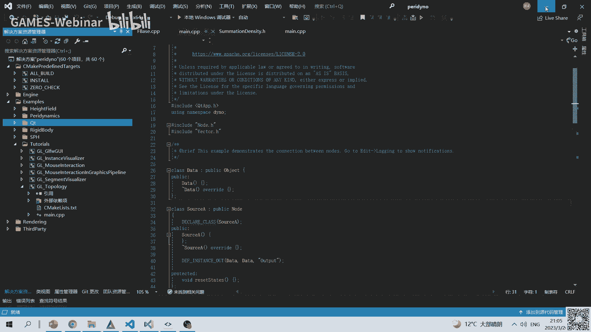

# GAMES401-泛动引擎(PeriDyno)物理仿真编程与实践 - P1：1. 物理仿真及PeriDyno开源引擎架构简介 - GAMES-Webinar - BV15M4y1U76M

行那这样吧。

我们开始吧，今天晚上那个呃晚了几分钟啊，那个不好意思，这样因为那个这个系列是这样的，应该是四开头的，然后主要还是注重就是开发为主，说这样的话就是我们会设计设计一些，就是说编程实践啊。

然后呢可能跟前面几个系列可能稍微的差别，就是主要还是注重实践，就是当理论会穿插在里边，我们会去讲，就是因为这401的话主要还是讲物理仿真，然后因为前班的话，实际上包括那个啊黄梅老师啊，以及那个胡阳明。

也就应该都讲了一些基础理论了，所以这样的话就这期课的话，我们不会嗯展开讲那么多的，那个就是仿真相关的技术理论知识，然后呢实际上就是还是以实践为主，将的话就在实践里边穿插着。

就是我们需要掌握的一些相关的一些知识，然后会会呃融到里头了，所以这样的话实际上就是理论跟实践，实际上是一个相互交叉的这么一个一个过程啊，所以这里边因为现在之前，我们相当于也是有一个自研的这么一个系统。

所以整个那是呃，会以我们自研的一个系统为基础，然后去讲就怎么就是说去啊，当然就是说你如果没完成以前，完全不这个没有怎么接触过，其实也没有关系啊，就是这样的话，就是从第一课开始，我们可以逐步的去看。

就是说怎么去把这个系统搭起来，然后后面逐步去研发一个，比如说具体的一个访问算法，然后整个大纲都是这样的，就是呃诶这是第一次是吧，哦这个我可能那个啥了，这个位置调错了，就是呃整个安排的是这样的。

就是一共是有13讲，然后呢是这样，就是前八讲是我来讲，然后后面呢有五讲，是那个湖南大学的那个蔡文老师，然后这个课程是这样，我说一下为什么这么设计啊，就是因为其实我们知道就是仿真这个东西啊。

虽然我们现在做的就是，咱们是就相当于这个方向的图形这个方向，但是呢实际上仿真这个就是，从常就是从大的范畴来讲的话，实际上在工程领域应该是用的非常的多，然后呢其实这个发展历史也很悠久啊。

其实其实如果从理论上来讲，你可能几百年前就已经就各种流体力学啊等等，这些力学理论都已经逐步的成熟，然后呢相当于当然后面是计算机出现之后呢，逐渐出现了数字模拟，所以这样的话就是呃这个课程整个会结合。

就图形这边的物理仿真跟工程领域的物理仿真，然后呢，因为其实我们发现就是很多东西呢，就工程的仿真跟物理就是图形里边做的仿真啊，就是当然图形里边，主要还是以视觉摄效果为主啊。

然后当然跟工程里面可能有一定的差别，但这个主要也是因为体现在，就是说你整个计算资源不足的情况下，像我们这样，往每一头可能会有稍微有一点的一个偏倾斜，但是最终的话实际上我们实际上呃。

一个理想的情况肯定是这样，就是工程仿真，跟这个我们所谓的一个同学学里做的，一个视觉仿真，这样的话应该是能最终能融合到一起，就是说我们既希望是，既能达到工程网的那个精度。

同时呢又能达达到这个呃图形里的视觉，仿真的一个一个效果，所以这样的话就是最理想的一个状态，所以这里边整个就是图形仿真，就是图形领域的仿真，我来讲的呢主要是八节课，然后第一个呢主要是讲可用物理仿真。

就咱们这个开源的那个引擎的一个一个，引擎架构的一个简介，然后呢另外主要就是呃因为我们知道，反正那个计算整个他的那个计算量非常的大，所以呢这样的话整个会议呃，gpu以及扩大编程为基础。

然后呢讲如何就是利用一些并行的一个计算，然后来加速整个呃法律计算的过程，然后当然这个估计就是整个呃，这里边会包含涉及到，就是说一些建图形学里面常用的，就是这几何工具啊，包括数学原理啊等等，就这些。

然后当然后面三次，主要是针对具体的一个防御算法，就是第四讲，主要是这样刚体动力学相关的，就包括并行编程啊，以及一些实践的一些呃算法，然后当第五讲主要是讲s p h，就是呃光滑粒子动力学就这一块。

然后这一块的话，因为其实相对来说，就是其实sp相对来说比较简单的，如果一个简单算法，对于就是咱们新入门的那个同学的话，还是比较友好的，然后第六讲的话主要是结合，因为那个呃像我们自己一些研究的内容的话。

会讲金像动力学相关的一些内容，然后当然第七哦这个有个错别字啊，第七跟第八的话主要就是一些扩展的内容啊，然后呢因为这个系统呢其实除了算法之外呢，其实也相当于也最终的话是希望能把，就是说我们自研的算法。

然后最终将它组合起来，然后来做一些有意思的小的app，说这样的话主要会涉及一些插件啊，以及扩展功能，然后呢最后因为是这样，就是呃其实gpu编程的话不单纯枯打啊，就是他其实能用的呃，后端的语言其实非常多。

就是包括比如welcome open cl，或者是那个呃比如说h l s l等等啊，就这些实际上都有，所以呢这里边就第八讲，主要会稍微做一定的那个拓展，然后去讲啊瓦肯的那个编程。

以及其实这两个跟扩大挖坑不大，其实呃大的那个逻辑上其实会发现非常的像，但是呢实际上你具体做的时候啊，主要因为他们语言上的差异，会导致就是说你实际编程的时候，感觉这两个东西呃还是不太一样的。

然后后面几个主要是那个蔡文老师就讲的，就是呃从有限就是说通过讲有限元，然后来呃讲讲就是说基于这个开源的系统，怎么去做后面的一些应用啊，啊这个是整个整个课程的一个安排啊，然后呢就这一次的话，实际上就是呃。

因为主要是讲就大的一个一个呃大纲啦，然后这样的话主要是也可能安排，然后呢还有物理仿真的概述，然后以及物理仿真引擎的概述，然后当然因为是这样，就是咱们还是希望就是对于就是说。

不论是你现在已经掌握到什么程度了，所以就是比如说你现在完全不，这可能是一个小白的一个程度，这样的话其实也希望能这个课程能入门的，所以这样的话，有些东西我们讲的可能会，一开始就是讲的会比较细一些。

尤其比如一些工具的运用啊，也是也会设计一下，这样的话，因为我觉得，就主要对于这个新入门的同学来讲的话，可能大环境还是比较困难的，这样的话就是我把整个过程可以呃，在这次课里面会演示一下。

然后最后的话可能会讲，就我们这个系统的一个架构，然后当然还有一些仿张力的一个展示，然后呢这里有一个那个课程的一个呃，咱们的一个qq群，然后当然里边如果涉及到有一些具体的编程上，或者是其他的一些问题的话。

然后呢也也可以加入这个群，然后里边有几位我们的一个助教啊，然后有什么问题的话，也可以请助教，到时候那个请他帮忙，然后呢在嗯另外我说一下，就这个课，就是因为主要还是相当于基于一个开源的系统，来来讲，说。

这样的话就是里边可能会涉及到一些，就是说呃方方面面可循，需要的一些背景知识，所以我讲一下这个课呃适合的呃那个对象，然后首先是这样，就是因为我们这里边啊做仿真，大家如果以前如果有些了解过的。

可能会知道这个东西它涉及的东西非常的多，所以呢就是呃相当于这里边，就比如适合那种哪种同学来来做，就是说比如说他希望有一个能快速上手，这么一个科研平台，然后这样的话就是他比如说也不需要去搭建，太多的。

就是说跟法律没有相关不太相关的一些内容啊，然后第二个呢，就是因为本整个我们还是基于开源的，这么一个平台，所以里边有可能会有一些不太完善的东西，就是比如可能有很多bug呀或者啥的，那对于这种就是需要。

就是说可能对这个有问题的，有一个有一定的容忍度啊，就是就允许就比如你出现问题之后呢，你呃会有就是呃希望去怎么去解决啊，然后当然还有就是呃因为整个做仿真的领域啊，就是其实这个方向总的来说做的人其实不太多。

就做图形里边你相比人工智能的话，其实相对来说人还是比较少的，所以呢其实通过这些课程呢，也是希望比如有些同学可以找到，就是说跟我做的这个方向比较契合的，一些小伙伴，这样的话大家可以一起来做。

所以呢比较适合这样的一个一些同学来来学习，然后当然最后呃我想说一点，就是因为整个仿真的话，他对数学跟物理的这个基础的要求，还是比较比较高的，所以这样的话比较适合，就是说呃呃学术语基础比较好的。

然后同时呢因为整个还是因为是偏向图形呢，这样的话对于几何直观比较强的这个同学，来来学习这些课，然后那个我说一下，就是说啊，当然这个其实反之就是对那些不太适合的，就是呃实际上因为现在尤其搞深度学习的话。

很多人学的可能不是c或者c加加，然后对python的话可能比较了解，但是因为c和c加加整个它实际上是一边语言，所以他其实对于编程的一个那个能力，要求相对来说会高一些，所以呢就是说如果c跟c加加。

你以前没怎么学过的话，可能会呃觉得这个上节课或者包括后面的，如果有一些作业的话，你做起来的话非常的痛苦，所以这样的话其实可能会嗯对这个课程，可能不太适应，然后当第二个就是我刚才也讲了。

就是对于整个数学公式啊，就包括那个呃因为数数学要求还是蛮多的，所以这样的话你如果对于整个数学，比如你看就头疼的话，这样的话就是可能会比较难受，然后最后还有一个就是，因为整个我们还是一个开源平台。

这样的话里边还是说，就是有很多不太完美的地方，就是啊就是这里边如果想是去找一个成熟的，一个反对的解决方案的话，就是这个课其实也也不太适合，然后呢接下来我们就开始讲一下，就是呃整个呃我们开始我们这次课。

然后我先讲讲背景，就是物理仿真到底是一个什么东西啊，这是当然通过其实前面102，103以及201的话，如果学过的话，应该有一个初步的一个概念了，当然这里边我如果我们把这个东西，层次放的更大一点啊。

其实可以理解为，就是，因为比如说我们我们就看我们身边的这么一个，就比如我们这个地球啊，你其实可以看到，就是比如从这个图上可以看的话，它其实从最远古的，比如说那个早期的，比如说呃相当于那会儿。

因为早期的话实际上也不适合那些猪猪啊，所以最多的好像都有一些微生物或者啥的，其他一些低等的一个生物，然后你发现，就是随着这个整个地球的不断演变的话，其实上就是有一些逐渐就发展出了，一些高级的一个智能。

然后从比如说那个后来的恐龙时代，然后到现在我们就说这个呃，呃相当于这个人类的一个诞生，所以这里边实际上蕴含的应该是有两条的，一个主线，就是一个你会发现就是呃整个地球的环境，实际上是在不断的一个变迁。

所以这个呢实际上就是从哲学角度来讲，就是实际上可以理解为，相当于是我们的一个物质世界，相当于是在不断的一个变化，然后第二个呢，实际上在物质基那个世界基础之上呢，你可以发现就是啊这个就是智能的一个形成。

自动的形成的话，实际上是是物质世界基础之上，然后呢在受环境影响之后，然后逐步形成形成的一些智能，然后这里边当然就你发现不同的环境啊，这个孕育的那个智能形态实际上是不太一样的，比如这个水铝的。

你发现可能是这种鱼啊，或者这种这种生物，然后当然陆地的话是各种的多种的哺乳动物，然后包括人类啊等等，就这种，所以你发现这个呃如果从这个角度来讲，实际上就是我们的世界呢，就分为就是说物质世界以及精神世界。

这么这么两个就笼统讲啊，其实分为这么两个概念，所以呢就是这两个，就是说当我们从研究角度来讲呢，其实就分别针对的，我们就说是物理仿真以及人工智能，当人工智能前几年其实研究的非常的多啊。

所以然后实际上就是呃，但是整个人工智能赖以生存的一个基础，实际上是我们的一个呃物理仿真的一个，研究的一个对象，实际上就是我们周围的一个物质的一个环境，然后呢我们具体的我们再来看一下。

就是呃整个就是首先我们看看那个人工智能啊，到底在解决哪些问题，就是实际上是我们的精神世界里边的，一些一些内容，就比如说包括那个像运动啊啊痛觉，然后呢比如感啊感觉，然后语言理解听觉等等，视觉啊这些等等。

都是人工智能理解的这么一个，就研究的一个范畴，所以它整个解决的是我们精神世界里边，我们所考虑的一些东西，然后但是呢，实际上物理仿真更多的是研究什么呢，是实际上是研究的，我们赖以生存的这个一个。

客观的一个世界里边的一个一些内容，然后比如说像呃，比如说我们这个海洋和火焰汽车等等，这个实际上都是符合物理规律的，一些客观的一些存在，然后呢我们需要去研究它的那个物理规律，然后以及他的那个行为特征等等。

当然龙头讲这里边可以分为，比如是有流体，然后有钢铁，当然有柔性体啊，就大类的话，就在这个当然是图形那里边比较长的一个呃，常见的一个分类，当然如果工程里的话，这个非常分的会非常的一个细。

然后所以整个这个实际上都是一个物理仿真，要研究的一个范畴，相当于就是说我们用计算机去模拟，这个整个这种物理介质的一个一个力学行为，然后呢这里边我们再看看这个物理，法律到底是能干什么。

然后当然这里边呃我们这就是其实学图形的，很多，很多同学呢是这样的，最初因为很多其实喜欢玩游戏啊，所以呢通过玩游戏呢，反正觉得诶这个挺有意思，所以呢很多其实是从呃开始玩游戏，然后逐步的对图形有了一些概念。

然后呢当然最后再细分的话，就要图形里面可能有渲染，有仿真啊，或者有几何等等各个方向，那那我们这里边就来看看这个图形里边，这个物理仿真到底是能做什么呢，我们想象一下。

就这对于这个比如这个命运二这么一个游戏，里边，如果没有物理仿真的话，会出现一个什么样的一个场景啊，就是这里边实际上很简单，就是呃比如说玩过射击游戏，你呃你比如往前走的话，比如这里有堵墙。

那如果这里边你不用仿真对它做约束的话，这样的话你会发现，当然有很多职业就穿墙穿进去了，那这个就是对于很多玩家来说，哎呀就觉得这个游戏就可能太假了，那所以这样的话实际上物理仿真去模拟的。

应该是就是说把真实的一个力学行为，实际上赋予到了一个呃，虚拟的这么一个一个世界里边，所以比如这里边你在虚拟的世界里边，你这样跳一下之后呢，也不会说你一下就飞出，飞到了天上啊。

当然这个跟你的游戏设定其实是有关系的，然后实际上就相当于是把真实的物理的一些呃，属性，就赋予到了一个呃就是虚拟的一个世界里边，所以物理反正整个干的实际上就是就是他做的。

实际上就相当于是这么做这么一些内容，然后当然这里边游戏的话，实际上你是从一个呃上帝视角去看，就是说这个整个游戏，但反过来其实你可以想一下，如果打个比方啊，有一天呃你醒来之后呢，你发现如果是有人告诉你。

就是说你这个呃世界实际上可能并不是真实的，然后他也有可能你可以想想，有没有可能说咱们这个世界，实际上也是一种模拟出来的一个结果，因为这个呢实际上在中西方的科幻世界里边，其实科幻的包括电影啊。

里边其实出现的也非常多，然后包括今年那个三体的这个呃，那个呃电视剧啊，里边其实也反映了这么一种呃思维，就是说呃如果打个比方，就是说咱们可能是呃，有没有可能出现一种更高级的一个外星的生物，然后呢。

实际上整个地球那有可能是呃，外星更高级生物里的一个一个，测试的一个一个训练场，比如说我们可能就是里边的一个火机，那对于这样的一个情况，如果存在的话，那我们这里边需要解决的到底是哪些内容，那也就是说。

实际上相当于我们整个所所周围所处的环境，实际上可能就是一个模拟的一个结果，它呃它可能符合某种的物理规律，但是呢它实际上这个规律呢可能是在呃，相当于外就是外，就是外面的更高级生物里边的一个实验场里边。

模拟出来的一个结果，然后当然这里边你可你可以看一下，就是以前如果看过这个啊，黑客帝国的这个电影的话，它其实就是反映的这样的一种哲学思想，就是啊当然这个故事的一个背景。

其实发生在比如几百年之后或者几十年之后，我们的这个地球可能是出现各种各样的，就是呃原因啊，导致这个整个地球不适宜人类生存之后，然后呢整个机器他统治了这个世界，然后机器统治世界之后呢，相当于那这样的话。

整个人类它实际上就已经没有，它赖以生存的空间了，然后呢他在一个虚拟的世界里边，就是重新创造了一个人类，人类赖以生存的这么一个数据，就是虚拟世界，然后当然这样的话就是怎么能骗我。

就是说你呃对于这个里边生存的人来说，他让他相信，就是说你活在的，实际上是一个真实的一个世界里头，那这样的话就需要把整个就是除了，就是说你整个人人类的一些精神世界里边的，那个ai的这个东西模拟完了之后。

他实际上要再造一个，就是说跟真实世界一模一样的，这么一个物理的一个世界，所以这里边思想完全就需要通过物理，仿真的一些技术，需要把我们周围赖以生存的，比如说刚刚前面看到的山川河流啊，空气啊等等。

就这些行为，然后相当于需要在计算机里边去模拟出来，所以呢这里边实际上就是这么一个场景呢，就是当然这个是这部电影里边最后那个救世主，然后到到达，说白了就更外层的一个世界，里边看到的一个场景啊。

它实际上就是机器统治人类之后，就这么一个场景，然后它相当于你如果从用我们现代的一个技术，来去理解的话，其实你发现相当于他需要哪些东西呢，需要比如说可能需要大量的超级计算机。

然后呢以及就是说我们整个各种的算力，然后来把就是呃我们这个世界里面，涉及到的各种物理介质，然后相当于给它模拟出来，所以这样的话就实际上就是涉及到，当然这里可能扯的就比较有点比较远。

然后也就是说实际上就是，然后相当于就是说这样的话，就是如果我们需要再造，就是说的近一点，我们再造一个，比如说我们一个小的试验场景，实际上就需要各种各样的软件算法，以及呢硬件的一个设备。

然后呢去把这个场景给它整个搭起来，那我们再来我们看的细一点的话，实际上那整个这个过程的话，实际上就需要啊，因为前面讲的可能就是你各种各样的那个呃，力学的一个材质呢，实际上需要不同的算法去做。

那把这些所有的算法综合起来，然后呢在一个系统里边去给搭建起来，那就需要依赖什么东西呢，实际上就是需要依赖，依赖整个物理仿真引擎这么一个一个概念，那物理仿真引擎如果对于我们来说，就是离得比较近的啊。

它到底能来能用来做什么，就是首先第一个实际上就是呃打个比方，我们以前可能呃是可能是一个初学者，那这样的话实际上以前我可能啥技术都没有，那这样我可以呃如果想实践一个算法的话。

就是我实际上可能就不知道从哪入手，那这个时候如果有物理网络引擎的，可以为我们提供一个基础的一个交流，加的一个功能，那第二个呢，就是如果我比如说对于做仿真算法的一个同学。

然后他的研究的主方向可能是一个访问算法，那这样的话他如果不想去写，比如说跟渲染啊，ui或者导入导出等等相关的一些，就是说跟法律无关的一些事情啊，他如果不想做的话，那个物理仿真引擎的能干的事情。

就是可以为就是这样的一类群体可以帮他解决，比如说这个跟法律无关的一些基础的一些算法，然后当然还有一个就是，这个应该是大家深有感触的，就是如果后面做的比较多的话，打个比方，如果是审稿人的意见回来了。

就是很有可能会出现，就是说这个审稿人让你跟呃，其他的论文做一下对比，然后这个时候呢呃当然对于做研究人啊，这个东西非常的头疼啊，就是很多时候就会就会出现，就是说那这个我肯定大部分同学是不愿意做的。

那这个时候如果我这个仿真引擎里边，可能如果是已经集成了大量的，其他的那个算法的话，那这个时候就这个事情就很容易实现了，就是可以相当于你可以直接调用啊，其他的那个算法，然后呢做进行对比。

所以就是说仿真引擎这个能做什么事情呢，一个就是提供一个技术的一个，脚手架的一个功能，第二个呢就是实际上跟仿真无关的，这个功能模块，因为这样的话就是包括渲染ui以及导入等等，这些算法的话。

实际上就直接可以调用现成的模块去去完成，然后呢，最后的话当然最主要的也是因为法律算法，它会集成大量的，就是呃就是各种各样的一个算法，然后呢也就是说可以用，比如说我们需要应用的时候，或者做横向对比的时候。

不同功能的，包括它的效率啊，包括它的精度等等，需要做对比的时候呢，实际上可以调用不同的算法模块，然后去啊，辅助我们去做各种各样的一个对比实验，那通常也就这样，就是一个，那我们来看一下。

就是呃通常一个仿真引擎啊，它包含会包含哪些东西，就是呃当然这个图大家其实也不一定要，这会儿就需要去了解了，就是当时我主要简单过一下，然后呢有个大概的一个意识就行，因为这个架构图的话。

其实主要是为了相当于给里边的一些技术，模块和技术内容进行分类，然后呢使得它条理更清晰，所以这样的话通常来讲就是呃这个一个仿真图，可以，它比如像我以我们现在的那个啊，piano这个系统为例的话。

它会包含几个层次，就是首先最底层的话实际上是有一个硬件层，那这个实际上主要是跟比如cpu跟gpu，或者是跟那个数据存储啊，比如说我们的硬盘和内存打交道，这么这么一些api，然后在这个基础之上呢。

就会有各种各样的一个数据结构，比如说有包含数据库啊，然后包含图形接口以及碰撞检测算法，这些通用的啊这些算法，然后去用来支撑，就是说比如用上层的一些啊，比如仿真算法也好啊，或者是交互交互的一些算法。

或者是渲染的一些算法，当然这里面最核心的实际上就是，因为作为一个仿真物理物理仿真的引擎的话，最核心的实际上主要是不会包含各式各样的，这个呃仿真的一些核心算法，比如说像会有有有有限元的。

就是或者s p h的钢铁动力学的这样，动力等等啊，然后当然除此之外的话，就是为了因为我们这个整个研发的话，我们也不太可能说我们所有的都是呃，从基础开始学习，说这样的话，就是我们上层的话。

需要对这个所有的算法进行管理，然后这样的话就是在上层会包含比如场景管理，模块管理等等这些东西，然后以及一些ui，因为比如我们需要把这个研发的算法，然后通过一些可视化的手段，然后把它给啊展示出来。

所以整整体来说就那个架构图的话，包含不同的一个层次，但是这个跟游戏性情警情里边会包含内容，可能会稍微有一定的偏差，然后这里也是，因为就是说整个游戏引擎跟仿真引擎，它所面向的那个呃对象。

或者他整个研究的一个问题呃，有一定的差异，所带来的那个架架构上的一些不一样的地方，然后接下来就是我们来看一下，就是说嗯以这个系统为例的话，我们怎么就把从相当于从一开始，相当于就是从搭建场景。

然后呢到最后，然后把这个程序整个运行来到最后，比如我们怎么基于这个平台之后，相当于呃进一步的去研发一个新的算法，然后这个整个流程我们可以看一下怎么来做，所以这里边我把整个过程分为了三部。

就是因为当然这里边我们现在这个系统呢，实际上主要是啊windows和linux两个平台为主，然后当然是啊，有时候可能用的是mac系统的话，可能这样的话就有可能目前不太支持。

所以呢这里边我主要是以windows为例，来讲一下整个开源系统就怎么去搭建这个场景，然后呢每一部里边呢会依赖不同的一些工具，就是比如像构建阶段，主要是需要依赖这个d这个一个工具。

然后呢在配置阶段呢会依赖，比如c make以及呃view studio code，当然这个东西其实跟每个人，个人的偏好有关系啊，就是有些同学可能会用其他的一些一些工具，也完全也可以。

然后这里我只是以这个为例呢，就是把这个整个场景相当于去啊，整个可以串一下，所以这样的话就是嗯，至少就是说这个流程应该是以前，就是说我们应该是比较成熟的，就中间可能相对来说问题会比较少。

因为开源的系统通常来说还是稳定性方面，有些可能会没有那么稳定，这样的话就如果用一些新的工具的话，中间有可能会出现一些意想不到的一些问题，然后到最后整个开发的话。

我们目前推荐实际上是以比如studio为主啊，当然比如说用g4 z啊什么，其实应该也问题也不大，然后呢接下来我们看一下，就是说这个整个一个配置啊，因为这个我们现在整个所有的仿真的话，是需要依赖gpu。

当然整个房子算法实际上这样，就如果对于性能没有要求的话，其实完全用cpu，比如说我就用c加加写一些，那那个串行的代码其实也可以，但这里推荐的话，实际上是有一个显卡的这么一个电脑。

然后当然那个系统的话就是如果windows平台的话，是啊windows 10啊，我的windows 11，这应该都没问题，然后另外就是显卡的话，呃我讲一下这个东西，就是呃当然目前主流的。

比如说像最新的可能四零系列，但这个系列可能会比较贵啊，所以呢就是对于如果想买这个显卡的同学，可以找个几个系列，然后呢这样的话其它的性能力方面可以保障，同时呢，就是呃价格方面又相对于来说是可以接受的。

然后呢另外就是整个扩大，因为这个如果是有呃，英伟达的显卡为基础去开发的话，这里就需要一个依赖一个kda的这么一个sdk，啊clean的话呃，现在mn这是哪个clean c l i o n。

这是哪个平台吗，还是什么意思啊，因为目前的话我们这边实际上主要还是呃，就是我现在ppt列里列的那个，就包括我们当然有文档啊，上面会推荐的一些配置，然后呢呃以那个为主，然后当然其他的平台大家可以去试。

然后有问题的话，其实也可以反馈回来，然后我们可以到时候到我们住那边住假啊啥的，可以帮助你们可以去试一下，就是因为其他的这个平台，我们确实没有那么多精力啊，把所有的平台都去测一遍。

然后呢接下来我整个演示一下那个呃，就一步一步看看，就把这个系统啊怎么去搭起来，然后首先呢是这样，第一个就是需要用到的就是一个git，然后这个git主要是用来做一个版本的一个控制。

然后呢如果以前对这个大家对这个不了解的话，其实可能就没有一个概念，就是他其实主要能用来干哪些事情呢，就是实际上一个呢，就是相当于就因为你写代码的话，其实相当于包含不断的会去修改，比如说其中的某些代码。

所以这里边就需要有一个呃，你的修改记录的这么一个呃文件，所以呢实际上就是这个git，主要是会把你每次的修改，然后都给他记下来，然后呢万一比如打个比方，你在中间某一次出现错误的话，这样你可以去回退到。

比如说某就是以前的一个正确的一个版本，所以这个是他其实非常有用的一个地方，这样的话可以保证就是说呃，你实际上是不断的去迭代的，去把你的代码去向他最后去完善啊，然后还有一个就是主要是分支跟合并的。

这么一个功能，然后这个东西主要用来干嘛呢，就是啊这个如果是一个，你只有一个人开发一个系统，这个东西可能其实意义不大，但这个问题大概就是，我们现在面对的是一个大型的这个一个系统。

比如说是一个几十个人参与的，这么一个大型的一个呃软件，那这样的话，其实每个人可能他开发的，实际上就是里边的一个模块，然后这样的话就需要不同的人开发的一个扣的，就是去合并，然后去管理。

然后这样的话就需要用到git里边的分支，以及合并的一个功能，但是后面我会去可以具体去演示啊，到底怎么去操作这些内容啊，然后还有当然就是主要会是为了可追踪，就是你这样的话。

就是说也就是说你多人去开发的每一个节点，实际上都可以被记录下来，也就是中间比如如果某一个研发人员，他写了一个bug进来之后呢，那这样的话你就可以定位的啊，这里可能是谁写的bug。

然后呢去逐步的去把这个东西去定位出来，之后去修复，然后这里呢就给出了一个直观的一个示意图啊，就是d它到底是做一个什么样的一个事情，然后这里边上面那个黑色的条线啊，实际上是代表的一个主线。

就是相当于你一个系统研发的一个呃主版本，然后这个主版本呢你可以看到，就是说它有一些可以报一次，它其实会有一些黑色的那个那些点，那些点是什么意思呢，就代表了实际上就是你每一次的就提交。

比如说你当前做了一个备份，然后这个点就会记录下来，然后相当于代表了你当前的一个状态，就是你整个研发的一个状态啊，然后这个状态呢就是你每提交一次，它会记录一个节点，然后这个节点呢就会永久的记录下来。

如果打个比方，你出现到后面，你发现后面出现错误了，然后这样的话你可以直接回退到中间任意一个，就是你有记录的这么一个点，那这样的话就是你如果后面出现了问题的话，你回退到前面正确的一个呃节点之后。

然后可以把这个呃，相当于把那个节点的一个代码恢复出来，然后呢再逐步的去修复，就是后面出现的一些错误，然后当然这个过程中，如果比如说新的那个研发链参与进来之后呢，他就可以干什么呢。

就是可以从你的某个节点里边呃做一个分支，然后这个分支出来之后呢，你会发现它实际上整个研发过程是并行进行的，就是说你像这样的话，就是新的功能的研发，它实际上是并不会影响啊，主分支的这么一个研发的一个进度。

然后当然当然等它，比如说新的一个到某个节点之后，这个新的功能研发完了之后呢，那比如到这个五这个节点的话，那它相当于又可以和就是说主分支，然后合并到一起，然后呢就是这样的话。

这个新的研发的功能呢也会进入到主分支，然后逐步去往后进，再进一步的去迭代，所以你发现整个g的其实主要就是为了方便，就是说这个多人研发，然后协同管理的这么一个一个工具，然后它里面会包含很多的这个呃。

不同的这个命令，就是他其实主要是，但这个大家如果对这个有兴趣的，可以详细的，其实看下面有个链接啊，然后这里边会包含非常详细的一个讲解，然后这里边我主要讲一下，就是跟咱们这个系统相关的。

就是说怎么去构建这个系统相关的一些指令，就是首先最重要的是一个去打点，去搭建这个系统的时候，用到的就是这配置环境的时候，就初始化一个的一个，环境的时候用到的一个指令，就是呃当然这里包含两个。

一个是初始化，第二个是克隆，那初始化代表什么意思呢，就是你如果现在是，你相当于是第一次创建这个工程，那这样的话，你需要用到的实际上是一个初始化的一个指令，但是你大部分时候我们那我们也做研发的话。

一般可能会基于人家的一个开源代码，那这样的话实际上我们需要做的，实际上是把人家的这个仓克隆到本地，然后来来去进行进一步开发，所以这里边主要就是用克隆，比如说这个克隆，然后呢去把比如说我们这个现有的两个。

当然这里边我们包含了两个层啊，一个是github上，但是考虑到因为是这样，就是给他汉堡，好多同学可能就连不太上，就是他因为需要代理去啊去连，就是，所以这里边我们就额外的会有一个，马云上建了一个仓。

然后马云的仓的话效率还可以，然后另外这里边有个指令可能需要注意一下，就是如果直接用命令行的话，需要必须把这个recursive，这个指令必须得加进去，因为这里边会包含到里边会设计很多的子模块。

然后如果没有这个模块，那就这个recursive这个指令如果不加进的话，它里边儿子模块是没法克隆克隆下来的，说这样的话，就整个生成的时候会因为缺少子模块，然后导致他整个编译不过。

所以这里边可能有一个需要注意的，其实就这个地方，然后呢这个下来了之后呢，剩下的实际上就是在我们开发的过程中，可能就需要用到，就是说呃比如说像give them remote，就是添加远程仓。

然后呢包括fetch上呢是实际上是获取远程仓，然后呢以及poor push，就是拉从相当于从远程仓里边同步，把那个内容同步下来，拉到本地，然后呢以及push呢是把本地的一些更改。

然后呢是推送到一个远程的这么一个长的，这样的一些一系列的一个指令，然后另外就是还有很多的分支的，管理的一些功能，确实比如说哎现在有一个主仓，然后这样的话如果是想研发刚才讲的，想研发一些新的功能。

在这里边就需要去呃创建一个新的brunch，然后当然包也包括就是不同分支的一个切换，然后呢合并等等啊，这样一系列的一个功能，当然这个指令因为是这样，就是实际上他ga的指令非常多。

然后呢一般像我其实也不太记得住，所以呢就是呃实际上做的时候一般会推荐，就是说用g u i去做这些东西，然后但是后面我演示的时候，也主要就是简单演示一下，就这这几个指令。

但是大部分的那个也是我直接用g v i去演示，到底怎么去去做各种的那个get的一个管理，然后所以这里边可以看一下，就是这样，我说一下，就是当我这里边主要是呃我事先拉了一下，就已经拉好了一个仓。

然后呢比如这里把如果你装了git之后呢，这里边有一个命令行的这么一个一个ui，然后呢接下来要怎么做呢，实际上就也很简单，就是也是就这里边就敲入get clone，然后就刚才的那个recursive。

然后然后刚刚就这里了，当然这里边有个后面有个呃有个地址啊，然后这个地址的话实际上就是在哪呢，就是你如果比如说跑道就这个我们这个层，然后它这里边有克隆下载，里边你点一下之后呢，它里边会有一个呃。

这个这个类似于网址这样的一个东西，然后把这个网址然后贴到这里边，然后这样的话整个这个克隆的这个过程，实际上就就已经完成了，然后当然因为我已经克隆过了，我这里就不演示后面怎么去做了，然后克隆完了之后呢。

在后面会有什么东西呢，就是，就是正常应该这样有一个这样的一个目录，就是他叫paradio，然后呢里边进去之后呢，实际上会有这么一个目录结构，然后这样我对照着这个ppt讲一下。

这个里边每一个到底是哪个目录，里面包含什么东西啊，当然这个吊地的这个轮管，它这个实际上是那个d的这个工具，然后它用来记录一些就是临时文件，是用的一些一些内容，然后呢当然这个c mac这里边其实是会包含。

就是说它的一些就是我们提供的一些，比较用来方便的创建样例啊，然后创建那个library的一些脚本，然后呢另外就是第二个呢实际上主要是这个data，然后data主要里面会包含各种各样的数据。

比如说o b j文件啊，或者是那个各种模型文件等等，都会放在都会放在这里头，那还有就是第三个一个example的话，实际上会包含各种各样的一个样例，比如说当然这里有三个目录。

现在啊就一个主要是不同的目录，就是针对的实际上不同的gpu的一个后端，然后包括像扩大的挖坑的，然后当general的是各个平台通用的，然后在后面的话就是有一个external。

然后这个external的话刚才也讲了，就是就是杠杠recursive那个指令，如果不用的话，就这里边的所有的子模块有可能就拉不下来，然后就会导致你这个编译的时候，就因为确定模块编译通过，然后呢。

再往后的实际上就是这个python，是因为呃跟c加加的做一些绑定用的，然后后面的source里面就包含这里面仿真的，所以就整个引擎相关的所有的一些核心库啊，就是比如说这个最底层的是有个call。

就是最核心的一个库，然后当然还有动力学的啊，仿真算法库，然后还有访问框架，这个费沃克是一个访问框架，然后但是后面就包含交互的建模的，插件的跟渲染等等的，就这一系列的这个啊这些不同的一些库啊。

然后都在各个各自的文件夹里头，然后当然这里面还有一个就是测试的，就是因为其实测试主要的作用就是用来，就是说，因为我们知道就是大型系统列表，会包含非常多的一个代码，然后呢也有很多的算法模块。

所以这样的话就是呃需要保证每一个，就是你比如说你一个算法，其实里边好可能包含了很多部啊，然后但是这样的话，你实际上很多时候，我们需要对每一步需要去做单独的一个测试，所以这里边会包含各种各样的模块测试。

然后呢或者是某个一些某一个，比如某个具体的一个步骤等等，就这些啊去独立的去测试，这些一个一个礼拜的一些模块，所以呢这个东西实际上测试，对大于系统来讲的话，实际上是非常重要的，就是因为这样的话可以保证。

就是说你比如说中间的某一部分代码，被别人改了之后呢，实际上因为你尤其代码多了，你比如说几10万代码之后呢，其实你不太可能说每一行代码你都记着，然后呢你你去相当于把里边去修复过来。

所以呢一般来说都是通过这个测试样例，然后呢我们整个跑一下，然后看看这个结果是不是对来反推，就是说呃比如当前这个版本，是不是所有的那个呃上网模块，是不是都是正确的，说这样的话。

整个实际上就是你克隆下来之后呢，实际上啊，这个系统会包含所有这样的一些文件夹啊，然后呢后面我们就开始讲一下，就是啊这个gt就怎么去用啊，然后当然这里边有一些我常用的一些g u i。

就是啊比如像那github的那个desktop，然后搜索three啊，那这里边因为我们这边用的是一个smart git，所以呢我一会儿会以这个为例来讲讲，就是说怎么用这个呃git来。

比如说进行这个呃版本管理，然后这里边我们先看一下它整个呃smart gt，它包含就是会包含哪些东西啊，就是一个最左边的那个，实际上就是这里是包含了所有舱，就是比如说你克隆下来一个仓之后呢。

它实际上它会出现在这个地方，然后这样的话你双击一下，比如点双击一下之后呢，同时它在下面呢会出现，就是说你所有的一个分支，然后呢这里边在呃右下角的话会实际上会包含，就是说你比这里的点m的文件。

因为这里每个分支里吧，它其实都是各种各样的记录，就比如那个时间点改了哪些文件，比如这里边就像这个地方，就可能有很多的这个文件的更改，然后你点那个文件的更改之后呢，它其实在下面那个地方会显示。

就是说你左边跟右边的那个修改前和修改后，这样的一个一个视图，所以这样的话就是这里边可以比较方便的，就是可以查看，就是说你这个文件到底改了哪些内容，然后呢就是说这个时候你如果出现。

比如说中间改了哪个地方有问题的话，你也可以定位到这里边，然后去给他做回退，然后当然中间那个是一个呃，就是其实前面看到有个类似于分支啊，这种结构，就是你看这里黑色那条线，实际上是一个主的一个分支。

然后呢其他的那个就是其其他颜色的，实际上是一那就是说你fork出去啊，不是不是你现在新建了一些新的一个分支上，包括一些合并的这些呃结果，然后这样的话就可以在这里边，其实可以看到整个就是说呃一些合并啊。

分叉的一些一些结果，然后比较直观啊，然后呢这样的话我用一个呃新建的一个苍老，我演示一下这个东西到底怎么怎么来用这个，然后这个是我新建的一个，当然里边现在什么东西都没有啊。

它实际上就只有两个read me的这么一个文件，然后呢同时它这里边包含一个主的一个master分支，然后这个master分支呢相当于就是你的一个主版本，然后这个时候如果打个比方。

我现在是呃有个新的一个功能模块需要去开发，然后同时呢刚才讲的我现在也不希望，就是说我去影响原来的那个主分支的话，这里边你就需要去创建一个新的分支，所以这里边就是你可以爱的一个新的一个分支。

搁这里边你随便取个名字，这些都可以啊，然后那个爱了，这样的话就是新创建了一个分支，然后你可以看到就是他新创建的分支啊，其实从因为如果你从mata算出来，这样的话，他这个分支的内容跟你这个原来的那个分支。

实际上是一样的，然后它实际上只是说在两个不同的一个，分叉里头，然后这个时候呢你可以因为你可以在里面看到，就是说他如果啊这里边没有加粗的话，它的active分支这里其实还有个概念。

就是它的active分支是就是你啊就是粗体显示的，实际上是你当前的一个工作分支。

所以这样的话你所有的更改啊，就比如你这里边这样，这里边进去，你所有的对里边的文件的一个更改的话。

它其实都会在你的active的那个分支里吧，去呃去调整，所以这样的话就如果你现在需要做的，实际上我不想去改这个主分支啊，所以我需要给它切出来，所以这里边会有一个check out这么一个一个命令。

然后它对应的当然就是get out，get的那里边的一个check out指令，然后这里边切出来之后呢，这样的话实际上就是你呃所有的改动呢，实际上就不会影响到原来的那个master分支啊。

所以这里边就是如果我对他，比如我新加一个文件，就这个我随便加了，然后这里不要不要再加一个test。txt，这个加了之后呢，你会发现就这里边会提示你就是有一个更改，然后这个更改呢。

就相当于实际上你是新增了一个文件，然后这个时候如果我们改完之后呢，怎么做呢，就是这里边我需要点一下这个右键，然后呃点提交，提交完了，然后这个呢，当然就是你提交的时候需要有个注意的地方。

就是这里边需要输入一个信息啊，就是比如说这里是个first commit，就第一次提交，那这样的话你提交完了之后，也就是说你这个就完成了一次更改，然后呢并对这个结果做了一个一个记录。

然后但是这个时候记录完了之后，他其实还依然还留在这个原来那个分支，所以这个时候比如你现在就看这个呃文件的话，其实你是可以看到这个文件，但是呢你这个比如说你给它切回来，你再给它切回来之后呢。

你会发现实际上这个文件就就没有了，那因为实际上你所有的更改，它实际上是不会对它的主主分支，对他有任何的一个影响，所以这个时候你如果是相当于，比如说刚才那个新建的分支，你已经把所有的更改做完之后呢。

你想合到这个主分支呢，接下来怎么做呢，实际上就这里边你需要去点中，就是说新建的那个分支，然后呢你点这个你相当于再用一个命令，就是merge，然后呢这个当然就是根据提示啊，你当然可以创建不同的一个方式。

然后这里我们点fast forward之后呢，实际上这样的话就把这个新的那个分支的内容，然后就已经合到了一个主分支，也就是说别这里边如果你新的分支里边，你新增加了一些模块的话，这个新的模块的话。

实际上就可以给你引入到这个呃主分支里头，然后这个时候你再回去看那个目录的话，其实这个这个文件就已经进来了，当然这里边其实还有一些其他的功能，就是可以说一下，就是呃因为这里边你可以看到这里边有两部分。

一个呢就是呃上面叫logo brunch，然后这个logo brunch实际上就是你本地的一个仓，然后他其实对应到有个远程仓，就是这个远程的，实际上就应到就是说你比如说网页上的。

或者是就是说github或者码云上的一个仓，然后这个时候呢其实还有一个功能啊，就还不是还有一个需求，就是很多时候会也很常见的，就是说你哪个地方，你需要和跟多个远程仓需要去同步的话。

那这里边还有一个需要做的，就是呃你这里边需要增加一个远程仓，就是比如说你现在虽然是本地是一个，但是你我现在打个比方，远程有两个，我需要推送到另外一个厂里面呢，就需要在这里边增加，再增加一个远程仓。

然后这样的话就把啊gt那个，比如类似这样的一个地址放在这里边，然后当然这里边我随便演示下，其实也可以，比如把这个copy过来，然后这里边相当于可以再新建一个啊，当然这里边因为婚礼有可能有自己的一些。

密码的一些设置啊，所以这样的话就是你输入密码之后，然后你可以看到第二个，因为这当然这里边两个我设的是一样的，所以其实你发现没什么差别，然后这里边你添加了远程仓之后呢，你这里一定要点一下。

就是你重新拉一下，拉完之后呢，你就可以看到就是它里边的所有的分支，实际上从会被同步到你另外一个啊，就是这个仓里吧，所以这样的话实际上依然会有一个master，所以呢就这到时候这里边你如果现在因为这样。

你现在这个master那个分支，然后因为他现在是跟这个是保持同步的，然后这个时候如果打个比方，你需要去切换啊，然后这样的话，你就需要把那个他的那个track的那个分支，你需要去在这个地方点一下。

点一下之后呢，然后你这里边它会出现，就是呃你看可以看到它有两个远程仓，一个是origin，第二个呢是英语二呢是我们后来新加的远程，那这样的话在两个来回之间就可以切，贴完之后呢。

你可以在不同的舱里边进行相当于同步，所以就有一个这样的一个一个功能，然后当然完了之后呢，其他的就是主要的其他的一些呃修改的，实际上都会在这个地方去去处理啊，然后这样的话就是整个我这部分的话。

差不多演示到这儿，然后后面的话就是再看看别的，然后呢这样的话就是整个这个get啊，这部分就整个代码已经拉下来了之后呢，后面我们要做的是什么呢，就是呃实际上就需要利用这货还往后呃。

接下来的话实际上就需要利用，就是说这个semi这个工具，然后把啊整个系统给它给生成出来，然后因为现在你刚才拉下来完了之后呢，其实只看到一堆源码，它里面没有任何的一个工程文件。

所以这里边就需要利用这个工具，然后它它其实整个过程也很简单，就是你需要做的，实际上就把这里边的那个源码的目录，然后呢同时你这里边设置一个，就是说你想把这个生成的一个工程文件，放在哪个目录需要设置啊。

然后呢最后单点几个，下面就是你configure一下生成一下，然后最后整个工程打开，然后这个过程其实就做完了，然后这样对应的我其实也可以演示一下，就到底应该怎么做的，然后因为这个刚才我已经拉过了。

就是所以我以这个仓为例来讲一下，应该怎么来做的，就是首先就需要把它的源码的目录，因为首先要确认一下，就是他那个目录到底在哪，实际上主要是去找到它，这里边会有一个c make。txt，然后你点进去之后呢。

其实看到就是说一般它的呃根目录的那个c mac，它会里边有这样的一些设置，就是比如他对啊c mac的那个版本啊，比如就这样的一个设置，然后这个呢确定它是一个根目录，然后这个根目录是找到之后呢。

实际上你就要把这里边就是啊复制到这里边，然后呢，同时第二个呢就需要把那个你编译的，就是就生成这个路径，你给他设置一下，然后一般来说就是当然很多时候，可能你你可能把它放到同一个目录。

但是一般来说我们推荐呢，给他放到一个新的一个目录里头，这样的话就是整个会比较清晰，比如比如这里边新建了一个新的一个目录，然后这个设置完了之后呢，你这个时候再去点这个configure的时候。

它会弹出这么一个ui，然后这个ui里边主要是有几个事情要做，一个呢就是你要选择编译器，就是啊这里边当然你跟你本地安装有关系啊，就你这里边装了哪几个，它实际上就会提示有哪几个相当于理解编译器。

然后这里边我们就选那个2019，打个比方，然后2019选完之后呢，实际上另外第二个呢要注意，就是你要选择一个平台，就是啊，因为现在我们的电脑其实都是64位结构，所以一般来说这里边直接就选啊x64 。

然后选完之后呢，就这里边就可以了，然后他可能需要配置一呃，花点时间，然后他那个会根据c mac里的那个脚本，然后呢相当于把整个工程配置一遍，然后当整个配置过程中，如它中间有可能会呃出现一些bug。

就是当然如果出现错的话，你就按照那个提示，然后去把它修复过来就行，但现在我们这个应该是基本都调过的，所以正常情况直接就一次应该应该能过，行，这个这样的话应该呃。

你可以看到这个就是如果configuration那个down的话，这样说明就整个是没有任何问题的，然后也就是说整个是顺利config成功了，然后这样的话，当一当然一般来说你需要就说点啊，多点几次。

点到他这个红色的消失，那就说明彻底的没有任何问题了，那这样的话就可以，然后你可以直接生成，当然这里边就是有几个有几个地方需要注意的，就就我们这个系统里边会包含就是很多选项。

就是然后这个选项其中有一个需要注意的是，这样后面因为我们讲的时候也会提到，就是这里的qt，因为我们需要依赖一个，然后这个qt的配置的话可能就没有那么顺利啊，就是不像那个啊一开始那个可能点一下就行了。

然后这里边如果你把这个选上的话啊，这个时候其实会报错，然后那我接下来讲一下怎么去解决这个问题啊，它实际上主要原因就是因为呃，它里边有个c qt的那个这么个文件，他其实没找着，所以你点开这个的话。

你会发现他qt的目录没找着，所以这里边就是需要去找一下，你qt的那个安装目录，当然这里边qt呃怎么安装呢，我就不讲了，就是网上其实有很多的一个教程，我就直接去找一下那个qt。

然后因为我这个是装在c盘里边，然后qt然后当然这里有很多版本啊，其实啊我们推荐就现在我们用的是呃，13。2跟一四点，这都是可以的，所以这样的话我就以这个为例，然后这里边点进去5。13。2。

然后open这个那是，哦无限啊，对这里边，然后呃，他需要找到m s m s v c的那个对应的库，然后在这里有个lib，有个lib的那个文件夹，然后，然后再点再点这里边的那个qt 5啊。

然后这样的话实际上就可以看到就这个，就这里边有一个qt 5 config，点c make的这样一个一个文件，然后这个文件有了之后呢，你把这个文件拷到就是这个地方，诶这样直接考就行，然后考完之后呢。

重新生成一下，那这个时候应该他整个所有的那个需要的，依赖的那个目录应该都都找到了，找到之后你再点一下，直到他没有那个红色那个出现啊，然后这样的话其实就是呃直接就可以生成了。

生成之后的话其实就是整个在刚才那个目录里，你可以看到就是有一个掉sl啊，sl n的结尾的这么一个工程文件，然后这个工程文件呢，实际上就可以用vc dio打开，当然因为我之前已经呃。

就是在另外一个文件夹里吧，因为已经生成过一份了，所以这里就直接可以打开，然后打开之后呢，就可以看到就是正常情况，应该就可以看到有有这么几个目录结构，就是首先最顶层的实际上就是一个engine。

然后engine里面就会包含各种各样的，这个就是底层，就是这个引擎里边相当于现有的一些库，然后下面是一个example，然后这example主要是一些示例代码，然后再往后的话就是有些渲染。

然后第三方库等等一系列的在，相当于就都放在不同的一个目录结构里头。

然后呢这个有了这个之后呢，实际上接下来其实我们要做的就是什么呢，就是啊，因为其实我们是实际上需要依赖这个系统。

去做开发嘛，所以这样我们来看一下，就是怎么就是呃用这个系统去搭建一个，呃一个基础的一个，一个脚手架的这么一个东西啊，就是所以将当前期我们可以先不设计，仿真的一些内容。

所以这里边就是当然这个c mac的那些。

脚本文件啊，然后包括还有一些就是v vs studio code这些，当然一会会讲的，就是当然包括这个呃，整个用这个系统怎么去调试啊。

我直接就演示一下吧，就是呃所以现在最简单的一个方式。

这样的就是，因为你可以看到就是，就这个目录里的，你点进去之后呢，实际上你可以看到很多的一个样例，然后这里的样例呢就是你比较快的一个办法呢，实际上你去找一个，比如说我我现在打个比方。

我现在先去想新建一个叫类似hello hello这么一个呃，一个新的一个目录啊，然后呢，里边呢就是把一个比如写一些基本的一个，c mc的脚本，比如然后当时写了一个main main的函数啊。

然后这样的话就把这个整个系统给它跑起来，然后呢就我们看看怎么做，就是这里边就可以进进一个这样的一个目录，然后呢我们随便创建一个文件夹，然后，这样的话就一个文件创建出来之后呢。

然后我们可以直接去别的那个呃，去这里边我们可以去复制一个工程过来，就是，比如这里吧，因为它这里边他的所有的那个脚本，它很多脚本其实是相通的，那这样的话它主要包含两个东西啊。

一个是呢实际上是c max脚本，然后呢打开之后呢，其实看可以看到，就是说它里边有包含那个整个工程的一个名称，然后呢，当然它里边有这个这个源代码的那个名称，然后呢当然后面也是一些其他的一个配置。

然后当这里边你拷过来之后呢，需要有一些改动，就是所以呢就是我这里边把这个打开。

然后呢用这个东西看看怎么去改。

哦刚才应该考到这个地方了，对，然后这里边就相当于有一个，就这个是一个visual studio code的这么一个app啊，然后当然这里边就是如果有一些你高亮啊，这个颜色可能不对的话。

这里边有需要装一些插件，就是你比如这里的像一个c加加的，或者是以及c mac的一些插件，你需要去安装一下，装完之后呢，其实就相当于你可以看到它里边的一些呃，根据不同的那个数据结构。

然后它会显示不同的一个颜色，然后呢这个有了之后，因为它其实是从别的考过来的，所以它会跟以前的工程实际上是会会重名，然后这所以这里唯一要做的是什么事情呢，就实际上就是相当于需要把这个名称改一下。

这里我们就改成一个hello的这么一个名字，然后呢其他的实际上就不需要改了。

然后这样的话有了之后呢，我们实际上就可以对这个工程，当然这个是原来那个工程，然后我们重新的点配置一下，因为所有的c mc改了之后，你必须得重新的去生成这个工程。

然后这样的话他才会生效，不然的话在整个view studio里边他其实看不到了，所以那个你相当于重新设置之后呢，它会让你重新载入这个整个工程，然后呢你再去看，就是说，呃你看看example里边它会在。

让我看一下它这个脚本在哪儿，哦在球球里有目录下的。

好像没生效是吧，什么表。

哦这里边可能还有一个要调一下，就是，这样我索性用直接用快捷键吧，就是因为还有一个办法是这样的，就直接因为我们这里边加了一个呃，叫a的example的这么一个宏，然后这个红呢可以。

相当于实际上跟这个是等效的，但是呢它会更方便一些，就是呃我们就不需要写那么多代码了，然后直接就是这里边改成这个之后，然后当然这里边还有一个参数需要去加，就是你需要把就把这个东西放到。

到底是对应到v studio code里面的哪一个呃，文件夹底下，需要去给他调一下，所以这样的话就是当然这里的这个是他们嗯，相当于你需要link进来的一个一个库啊，所以这里我重新生成一下的话。

就应该是在。

哎我看一下我是不是那个。

我关一下重新生。

重新打开看一下。

哦这里看到了对，刚才可能是因为那个vs他没更新，那所以这样的话其实你就可以看到，就他会新创建这么一个工程，然后呢呃里边就会包含一个简单的这么一个呃，就这个讲代码，其实这个讲代码。

其实主要就是创建一个windows的一个界面，然后其他的当然啥也没有干啊，然后这个东西当然编译一下之后呃，这里边很多很多同学，就是如果这个以前没怎么用过的话，他可能直接去点运行的话会报错。

然后因为这个必须得设置一下，把这个东西设成一个作为一个启动项目，然后点这个之后呢，它实际上就会对这个项目进行编译编译，然后相当于最后会弹出一个，g u i的这么一个框，别人可能稍微得等一下啊。

像我们先往后讲吧，后面按理说这个应该是比较快的，但是我不知道是不是因为敢打了，可能需要嗯稍微等个两分钟。

所以这样的话就是整个这边如果跑通的话。

他其实可以看到类似这样的一个一个界面，然后但这个界面里边其实现在几乎是啥也没有，就是因为它主要其实就是一个界面，然后里边现在没有加任何。

跟仿真相关的一个内容，然后呢接下来我们看一下，如果打个比方，要给它加上啊仿真相关的内容啊，其实要怎么做呢，实际上这里边就是呃整个a p p在层面里边，会有一个接口，就相当于需要给它设置一个场景。

然后这个场景呢设定之后呢，它实际上是跟呃，我们现在整个框架，你可以看它其实包含这么几部分，就是首先最外层是一个界面，然后界面里头会包含两部分，一个就是它的一个呃渲染渲染相关的一个窗口。

然后呢另外一部分其实就是一个场景，然后这个场景其实就是，比如说我可能有钢体仿真的场景啊，或者是一个流体仿真场景，然后呢需要在外头需要把这个场景给他射进去，然后这样的话实际上就是在渲染窗口里边。

它实际上利用它的渲染引擎，它的那个视口，这样就可以识别它的它的那个场景，然后最终把它里边的内容啊。

显示到就整个界面里头。

还没出来是吧，所以这样我们先往后再讲一下吧。

就是然后这里边就是整个我讲一下，那个场景将来是怎么回事，就是因为它里边实际上，我们现在用的是一个四层的一个结构，然后什么意思呢，就是它里面包含主要包含四部分内容，一个就是它首先场景它实际上是由。

就是你可以看这个图，它实际上就是由不同的一个节点，然后他去组起来的，然后呢，节点间当然可以通过这个一些数据的传递啊，来传输数据，然后呢同时节点里边，那你可以看到它里边会包含呃，就是各种各样的算法模块。

然后所以里边是一个各种有模块组合起来之后，的这么一个呃一个节点，然后另外就同时节点呢跟模块，它其实都会依赖于就整个呃我们叫那个field的，这里边就是它实际上就相当于需要依赖，比如数据的一个输入。

然后当然也可以有一些数据的一个输出，然后这里边就可以看到，就他有啊这个数据的一个流向，它其实我们现在主要有设计的呃四种流向，一个呢就是节点是跟节点之间的一个传递，就是你比如说一个节点。

你的数据可以输入到下一个节点，然后呢下一个节点呢，其实就可以以以这个数据作为输入，然后呢进行计算，然后还有一部分呢实际上模块内部，模块内部其实也是存在一个数据的传递。

就是可以从上一个模块传递到下一个模块，同时这里边还包含两个比较特殊的呢，实际上就是就是比如说我模块里边算完，那些数据呢，可以通过这个导出。

然后导出到外道啊，刚才那个长期跑友对，所以这个呢实际上就是呃，就是刚才我们搭建的那个hello hello的那么一个空的，有工厂啊，然后当里边就是现在啥也没有，只有就是包含一个空的场景。

然后呢有些ui的一个操作，所以这里边如果你要想对它进行缩放旋转啊，这样的话需要按住那个control，然后呢包括鼠标的左键，中键和右键的时间都可以缩放，当然这里边还有一些呃其他的一些呃功能。

就是比如说像摄像机的呃，这个主要是为了方便，就是说以后比如在调试的过程中，比如说我想通过不同的视角，然后呢去看它里边的一些变化的话，比如这样我们可以就可以切换不同的呃，一个视角。

然后当然就这个主要是camera的一些功能，那还有一些呢就是那跟呃光照有关系的，跟光照有关的，比如说像调它的光影啊，然后呢当然还有一些背景的，然后一些辅助的一些功能，然后这里的主要像相机的相关的。

以及就是说这里去打印一些统计信息等等的，就这些功能。

那剩下的实际上就刚才说的，就是让这个东西就需要去给里边设置一些场景，然后也就是这样的一个场景，你创建完了之后呢，需要给它传进去，然后这个场景呃我简单介绍一下，就是怎么怎么去创建这个场景。

然后它里面包含了哪几哪个部分，到底是用来做什么，首先上数据层呢是这样，就是就刚才看到，就是说，因为它数据主要是用来做输入输出的一个功能，所以呢这里边会包含不同的一些类型。

然后呢主要包含的是包括像呃基本类型，基本类型主要是一些，比如说像布尔型啊，int flow的double等等啊，就这些，但还有比如像呃三维，就是说像一些向量，比如vector 3。

vector 3 b3 f等等，就这些，然后还有矩阵，然后这些呢因为它一个特点呢，是它的数据的规模实际上是呃比较小的，所以呢也就是说他直接可以用来在cpu和gpu之间，时间直接可以传递。

所以呢就是可以用啊，就这里边有两个红，就是一个呢是定义它的一个数据，就是用的fy的这么一个宏定义，然后呢这样的话就是定义完了之后呢，他直接可以在界面里边就可以识别出这个数据，然后呢。

当然通过可以在界面里面去调节它的那个数呃，他的那个值，然后来更改的这个场景里的那个一个值，然后当时还有一个宏定义啊，就是枚举的，后面那个是一个枚举的变量的一个类型，然后第二种呢实际上对于比如说呃。

因为像达比流体里边，它包含大量的那个数据的话，这样的话实际上需要有一个连续的一个存储空，间，有一个buffer，所以这里边就包会包含这个一维数组，二维数组，然后呢比如三维数组等等啊。

它主要是通过类似于这样的一个宏，就define array，然后当然后面如果是二维的话，就带一个2d，三维的话带一个3d这样的一个红来定义，然后此外呢还有一些动态的数组。

然后这个其实就跟嗯c加里边那个str，其实比较像的，然后但是这里的好处呢是，这个s d l可以就是在cpu和gpu之间是通用的，也就是这样的话，你可以cpu里面把这个数据创建完了之后。

直接可以传到gpu，然后呢，就是也用类似于这s t r的这个一个结构，然后当然最后还有一个就是啊，对于太复杂那个类型，就是我们这里边定义了一个，就是说叫实力的一个类型，然后这个类型的就是你可以理解为。

其实就是一个指针，但是呢它跟g u i实际上是联动的，就是它可以从g u r里面去识别这个类型啊，应该就是从那个用途上来讲的话呢，其实包含几类，就是主要是有包含那个呃变量，然后呢输入输出。

然后当然还有状态变量，这个状态变量是节点特有的，是比较特殊的，就是主要用来描述，比如说一个呃物理现象，当前的一些状态用的这么一个一些量。

然后呢这个对应到一个ui里边，其实我们可以看到就是这里边有个场景，就是有个q t field的一个场景啊，这个搭着搭着可以跑一下，跑完之后呢，其实可以看到，就是说它左边对应的是是实际上是代码。

然后右边呢实际上就会有一个创建出来的，这么一个节点，然后这个节点就包含了几个东西，就是下面那部分展示的，实际上是他的那个基本的一个控制变量，然后比如包含布尔型的，int型的，float型的。

以及vector 3的，比如对应的其实就是这最左边的那个四个变量，然后当然它还有就是呃输入输出输入的话，这里边它定义了一个float v，就是一个浮点数的一个数组作为一个输入。

然后当然你可以给定一个输出，然后这样的话，这里边会有一个浮点数数的那个数组，相当于它有一个输出，然后此外呢它这里边定义了一个状态变，但转变因为在下面的截断了，所以这样的话也可以在ui里边其实可以看到。

所以呢也就是说，现在这里边所有的那个数据类型，就是跟ui其实理论上是一一对应的，所以就是可以直接从ui里边，相当于是就是你实际上你定义的数据类型，直接在ui里边，其实就可以去调节所有的那个数据类型。

所以这个是实际上我们目前就是这么去设计的，比较方便的一个地方，也就是说你有些场景因为仿真的是这样的，就是很多复杂场景，就是它有可能你在访的过程中，你比如说我想动态的调一下某个参数，然后呢去看一下。

就调完之后它后续的一些变化，就这样的话就可以不需要我，比如说我去不断的去改代码，然后选完成，也就是我们可以在ui里边去完成这么一个。

一个工作，然后当然模块的话实际上就是类似的，就是有了这些数据之后呢，其实我们只需要做的就是呃，定义一个模块到底需要哪些啊。

控制变量，哪些输入，哪些输出，然后呢对应的就是也有一些样例啊，就是如果你可以把ui打kt那个界面打开的话，实际上就是比如像这里边有一个s p r h b表，用的比较多的就是呃密度计算。

然后它包含比如说啊它的标准密度，然后呢他输入的话，因为还是像粒子法里的，你需要去上密度的话，你需要知道就是说你的领域有哪些例子，然后你本身比如说啊自己有些例子，然后他需要根据领域的那个id。

然后去计算它的那个每个例子上那个密度，所以这里边它会就会有输入，就比如说这里会有一个位置，然后当然还有一些还有一个其他的位置，然后当然还有领域的i d，然后到上面那两个定位是它的父类的定义的。

所以这样的话，它其实所有的那个输入其实就含在这个地方，然后最后呢它会有一个输出，然后这个输出呢实际上就是会价格，根据输入算完之后呢，他会把这个值写入到这个密度的那个数组。

然后作为一个输出，然后节点的话其实也是类似的一个结构，就是在这里啊，唯一不太一样的地方，就是节点里边会有一些新的一些量，就一个就是呃有一个输入，就是你可以整个节点作为一个输入，然后输入到后续的一个节点。

然后这个主要是考虑到有些数据的话，它实际上啊比较复杂，因为你这样的如果太复杂数类型传递的话，这个他的数据太多，就导致他整个呃计算相当于是啊就整个显示啊，它就太冗长，所以呢就这部分。

你可以直接用一个整个节点传进去，这样可以降低这个整个输入的那个连线啊，然后当然除除了这些之外呢，就是节点里边会有呃状态变量以及管线，然后这个管线其实后面我们还会详细的讲，然后这里边有一个样例啊。

我简单的说一下，就是呃这样的话可以加深一下理解，就是这里q t里边打开之后呢，其实可以看到，就这里有个qt connection的这么一个一个样例，然后这个样例，然后这个跑起来的话。

实际上可以看到一个界面，然后呢另外这里边就定了几个节点，就是呃当然这个数据啊，这个数据其实可以用来传递的，然后这里面主要有几个类型，就一个source a那都是从节点里面继承下来的。

然后呢它会输出一个呃这个data的那个数据，然后呢还有一个类型的就是source b，然后呢他也会输出一个贝塔的一个类型，然后当然最终呢会有嗯，还有一个那个定义了一个，第三个就是target的。

然后相当于前两个作为一个source呢，可以连到这个后面那个ta的这么一个节点，所以这里边实际上主要是为了测试，就是各个节点之间的这个两性关系，搭的这么一个测试一个场景。

然后一会儿跑起来的话也可以演示一下，看看就是说讲的是怎么一个效果。

这样可能那个稍微等一下，然后这样我们索性看后面那个样例吧，就是嗯因为比较直观。

然后这个是因为那个是早期的一个版本，搭的一个样例啊，所以现在ui实际上跟现在的那个可能不太一样，诶，我先把这个停一下，但那个应该起来。

对，所以这里边其实可以看到，就是刚才main函数里边创建出来的几个样例，就是可以看到有一个source a，然后呢还有一个类型的source b，然后呢，他他们输出的其实就一个就包含他们自己本身。

然后呢还有就是定义自己定义的一个数据类型，叫data的这么一个数据类型啊，就是当你把这个光标移上去的话，其实可以看到它的类型其实就是一个instance，然后呢后面那个节点呢实际上主要用来接收。

就是说前面那个节点输入的那个数据类型，然后这里边就可以把这里复格，有login的那个选项可以打开，打开之后呢，就是这里边就是可以看到，就是说它整个连接信息啊，就是呃比如说这个给它断开之后呢。

其实可以看到这里有个提示，就是source a里边的这个呃，他的那个那个输出，实际上就从他给的就这样就给它断开了，然后类似的就是你可以看到，就这样的一个提示信息。

就是啊这个这里边主要是为了呃帮助加深理解，就是说它它到底是怎么一个工作机理啊，就当然这里边是这样的，就是因为它这里边定义了一个，source a的数据类型的话，他也就是说对的。

如果你现在输入的是不兼容的那个数类型，我现在给它都断开，然后我们现在如果对，硕士b如果想连到这里的话，它实际上是不行的，所以这样的话就它其实会有一个，你都会有一个类型的一个判断。

就是你必须是同一种类型的，他其实才允许它输入，比如这个数据，但连这个都是可以的，但是连上面的实际上连不过去的，所以这个东西其实也是类似的，说这样的话就是在后面，比如说我们在研发模块的时候。

就是我们需要清楚，就是我们需要啊输入和输出的类型，定义清楚之后呢，这样的话就是呃可以辅助的就是来创建，就是包括后面的场景啊，就是啊对比如说一些不兼容的一些常情况的话，我们实际上就可以事先给它规避掉。

就不至于出现。

比如说你连入一个啊不太对的一个数，就导致了整个程序可能就直接就崩了。

然后呢，所以这里边这个整个这个过程有什么用呢，就是这里的场景其实就有个展示，就是呃比如说我们现在有个流体房的那个场景，他整个实际上就是从呃建模开始，然后到后面的一个仿真，然后前面因为建模的话。

就需要相当于创建一个几何的cube，然后呢生成粒子，然后呢，当然这里边还有后面的话，还有一些呃属性需要去设置，就比如我设置它的初始速度啊，然后包括这个再往后的话，实际上就是呃有一些节点。

就是呃仿真计算的一些节点，然后这个完了之后呢，实际上就可以看到它其实可以动起来，但是呢这里吧当然也呃没有几何边界啊，所以呢另外的话其实我们也可以呃加入一些呃，几何边界的一些东西。

然后呢就让流体跟这个边界发生作用，所以这里边也就这个好处，就相当于整个我们的所有的这个场景，就是说我们的基础模块我们都搭，构建完了之后呢，实际上就可以就利用这种ui的那个形式啊，把就是说更多的场景。

就直接在ui里面就构建出来，就不需要每次就需要去呃，不断的去重复的写代码，所以这样的话，就可以降低整个代码的一个工作量。

所以这里边其实就是很重要的一个东西，就是需要讲一下，就是这个管线到底什么概念，其实就是呃如果以前大家学过图形学的话，可能对这个有一定的了解，他实际上你可以就可以理解为，就一系列功能的这么一个呃。

顺序排布的这么一个执行的一个队列，然后当然这里边我们现在这个管线，它其实不是不是一个简单的一个，线性的一个队列啊，然后它实际上是一个图的一个结构，所以这里边就包含就是呃，包括因为它主要包含两个。

就是仿真的管型和渲染管线，然后这样的话每条网线里边，它其实都会有个入口，这个入口呢实际上对应的就是呃节点里边，它所需要的一个状态变量，就是比如说像如果是一个流体，那它可能会包含比如说它的速度信息啊。

它的位置信息，它的那个其他等等的一些一些厂的一个信息，然后呢，后面呢就是会接一些各种各样的一些模块，然后当然这里模块有可能会是呃，访问计算的模块，也有可能是交互的一个模块。

然后呢这些模块呢它计算完了之后，它实际上会去跟更新它的所有的一个状态变量，所以这样的话就是呃这里有一个机制需要去保，证，就是说你这个数据什么时候更新，所以这里边呃就是所有的数据。

实际上会有一个叫我们叫这个tag的，这么一个机制，就是说你这个数据什么时候更新了之后，我会记录一下，这样的话他会告诉后面的模块，就说我这个数据已经更新了，然后他在后面计算的时候。

如果发现就前面的数据更新的话，它才会重新去计算他理赔的所有的量，但是如果发现就是以以前的量啊，他完全没有动，也就这个时候他实际上不需要去啊重新计算，所以这个呢可以有效的降低整个容易计算，因为不然的话。

你相当于你所有的那个呃计算，一遍一遍都在重复算的话，其实会造成大量的一个计算的一个浪费。

然后这里边就是我以这个缸体的场景啊讲一下，就是这个到底什么概念，就是呃大家如果打开这个qt breaks，这么有一个example的话，其实你可以看到一个有一个钢铁的节点。

然后这个节点呢点进去之后呢，它其实会有两个啊，两个啊就是嗯就是其实可以看到有两个视图，一个是这样的，左边那个就是你点的animation的话，实际上看到的是一个仿真惯性的一个视图，然后点右边那个呢。

实际上是一个渲染管线的一个视图，然后这两个视图有什么差别呢，其实主要体现在呃他的一些算法模块上的差别，就是左边那个主要是因为针对访问计算的，所以呢它实际上这里边比如最后一个。

他会接一个钢铁动力学的一个算法，然后当然前面的也是一些相关的一些也算吧，做完，然后当然后面右边的呢，实际上因为主要是渲染为主的，所以这样的话，它主要其实主要是接的渲染的算法。

然后呢去为了辅助显示，所以这个呢实际上就是你打开的话就是。

然后把之前那个关一下。

这样我直接找一下那个里边那个。

哦这个跑起来，然后这里边儿跑起来之后呢，实际上可以点双击点进这个，这样的话实际上就是可以看到，就是说这里呃，这个左边那个这个，实际上就是一个仿真算法的一个pine，然后右边那个是渲染算法的，跑到那。

然后当然这里边啊之所以是papa呢，它的一个好处呢，实际上，就是因为它里边的模块是可以动态删减的，就比如这里我们可以看一下，就是呃就以渲染这个来看的话。

其实显示几个东西啊，就是一个呢是它的那个整个boss，比如它的表面网格下显出来，第二个呢其实你可以看到它里边有一些触点，然后他以及一些法向。

所以这样的话点点击里边的话，实际上你可以看到它里边有三个东西，分别去显示这些东西，就一个是呃它的那个触点的法向，实际上是用这个模块去显示的，然后还有一个就是呃触点，然后这个是用一个点的一个渲染模块。

然后当然还有表面网格，所以这些呢就是当然可以动态的调，就是因为所有的管线啊，就为什么之所以较为管线的话，其他其实因为它其实都是可以动态的去配置，里边的一些模块，比如说这样的话。

我可以把里边的一些东西给它删掉，删掉之后。

当然我可以加一些其他的新的算法模块，然后这样的话就可以啊，自定义的去把这个呃显示啊，或者仿真的一些需求，然后给他给搭建起来啊。

然后呢整个这个算法模块就是它这么多的模块。

它怎么执行呢，我们这里有一个图，就是首先它整个仿真管线它的运行，这是一个时序图，所以它实际上主要是包含呃，四个部分的逻辑关系，最左边当整个是整个场景啊，然后整个场景呢实际上包含两部，一个是是重置。

重置的话，它实际上会调用后面所有的那个包括节点，然后以及模块里边的模块，相当于把它恢复到它的一个初始状态，然后当然在运行过程中呢，它会不断的去调这个，比如呃相当于take one frame。

然后相当于因为仿真的话，他整个实际上是一步一步的去执行的，所以呢它会循环的去掉这个呃这个函数，然后呢里边具体的话实际上就是它会去调用，就每个node里边它对应的这个呃访量管线，然后但是法定管线里边。

就会包含各种各样的模块啊，然后呢他会不断的去更新这个模块，然后这样的话，实际上就是去完成整个场景的这么一个更新，然后这里呢对应到这个渲染管线的话，实际上是类似的，也是整个场景，然后到节点。

然后最后到渲染管线，然后渲染管线之后会去更新它的那个。

所有的一个一个模块，然后整个渲染它这个流程呢，实际上是这么一个流程，就是说因为这里边我们实际上集成了很多，比如说点线面啊，然后包括实例的一些渲染啊，这些功能模块，所以这样的话就是。

所以相当于就是说它里边儿一开始的话，他会整个渲染的流程，它是相当于会把所有的就是场景里边搭建的，这个渲染的一些模块给他都取出来之后，然后呢对它做渲染的一个操作，然后完了之后当然这里边会有阴影的渲染。

当然呃印完了之后就实例的一些渲染，然后最后当然是就界面相关的，就是整个ui的一渲染，都最终把它都渲染到这个render target，就相当于我们的那个帧缓存，就我们看到那个屏幕上头。

所以这是整个渲染的这么一个流程，然后这里边就是可能很多人不太理解啊，就是这个东西为什么要搞那么复杂，就是为什么就是要搞四层的这么一个结构啊，所以这里边主要问主要目的，实际上就是为了解耦。

所以这里边主要包含三个概念，就是一个是法律计算需要跟数据给他分离出来，第二个呢就是需要更渲染给分离出来，当然最后一个是分交互呢，实际上也需要分离，所以后面我逐步讲逐个讲一下，就是这个到底什么概念。

就是首先就是访问，基本上跟数据这个结构到底什么意思，就是呃我们首先看一下左边那个，它实际上是一个有限元的这么一个仿真场景，就是它里面包含哪些东西呢，就是我们可以看一下，首先它实际上是有一个呃拓扑结构。

然后它实际上就对应到有限元这个场景的话，它其实就是一个四面体的网格，然后呢定义了这么一个网格之后呢，它实际上还有一些其他的一些厂，比如他的有他的那个啊位于场，他的那个呃应变场。

以及它的那个应力应力应变啊等等这些这些厂，然后这一场的信息有了之后呢，接下来就实际上就需要去计算，就是呃更新，比如它里边的场景，比如它的位，它的运动过程中，它的位移实际上是要更新。

然后包音那面实际上是更新，所以呢会相当于有不同的一些算法，然后呢相当于需要把呃拓扑结构以及它的field，他的那个一些厂，然后呢结果他的那个相当于在动态的去，相当于把它给呃运行起来。

然后当然这里对应到一个粒子的一个场景的话，实际上有些东西类似的，比如他的那个场，它其实也会包含可能性应力啊，包括位置啊速度，但是呢它的拓扑结构你会发现其实不太一样，就是如果是s p h的话。

可能其实整个都是particle的基本的一些结构，然后当然对应的算法有些实际上也是相通的，它主要包含，比如可能有像杰克比亚和塞德尔牛顿等等啊，这个算法，那从这两个里边我们其实可以看到啊。

就是呃对于很多各种各样的一个算法，但是算法其实非常的多啊，就是比如说有s p h啊，p p t啊，m p m f e m等等，就这些，但是呢这些算法其实有一些相通的地方，在于，就是说呃很多算法。

它其实可以用相同的数据结构来进行模拟，比如说s p h跟p p t或者s p h跟m p m的，实际上都会依赖于po，当然呢同时反过来呢，实际上就是就是同一呃，也就是说那相当于是比如说你反过来。

你相当于不同的这个拓扑结构呢，其实也可以用同一种方法去模拟，比如说你都是particle，或者是这个表面网格以及提网格，实际上都可以用，比如说f e m去去做啊，然后这个实际上都是可以的。

所以你会发现这里边就存在一个一对多，对多的这么一个关系，那这样的话就也就是说，导致我们如果实际上在真正去写算法的时候，我们不可能不太可能去群举，比如说我们把两两之间我们都去写一个算法。

那这个实际上就会导致大量的冗余，所以这里边我们要做的一个呢，实际上就是把它的表示需要给它单独抽象出来，所以这样的话整个我们现在的系统呢，实际上就引入了一个层次化的这么一个表格结，构。

就是从最顶层的这个点云到编，然后到三角网格，然后到比如说呃四边形网格，四面体网格等等啊，所以这样的话就是可以有效的，就是说把啊各种各样的不同算法，它所依赖的这个拓扑结构，然后给它有机的给整理起来。

然后这样的话一个好处呢也是比较方便，就是说比如不同算法之前他要进行数据共享，那这样的话就可以依赖于这个统一表示，这个数据结构，然后呢做相当于做一个映射，然后呢来进行数据的一个传递。

那有了这个统一的一个表示之后呢，那也就是整个流程啊，就是整个比如说我现在想想写一个访问算法，那这个流程就其实就包含三个步骤了，就是啊，首先第一个我们实际上要做的，就是创建一个top结构。

然后这个结构呢就是就是我们系统里定义的，就是你可以也可以一个电源，也可以是一个四面体网格，然后当然有了这个拓扑结构之后呢，我们在需要在上面定义各种各样的场，然后呢呃比如说这个位置速度体体积等等啊。

然后当然这个厂的定义呢，会跟他的那个拓扑结构实际上是相关联的，就是比如说你如果原先是一个电源，那这样的话，你的所有的那个厂的，那实际上都是定义在电源上，当然你如果原先四面体网格的话。

你有些信息可能会定义在四面体的那个单元上，而有些性呢会定义在那个点上，所以这样的话整个厂的那个定义，实际上是依赖于这个拓扑结构的，这么一个结定义，然后再往后的话。

实际上就依赖这个拓扑结构以及它的一个呃厂，然后呢再做一些就是说运算，然后当然就包括比如说呃从数学上来讲，就可能是比如说梯度散度拉普拉斯算子，然后当然这个也是因为跟你的那个决定的呃，差异性有关系。

所以整个运算呢也会有一些不一样的地方。

然后呢具体体现到刚才的那个管线里边，其实就可以看到，就这里边就包含两部分，就左边那个实际上就对应的是数据层面，就是包含主要两个，一个是他的那个拓扑结构，然后呢除了这个之外呢，其实可以看到。

就比如这钢铁这个场景，他会有质量，它有位置，他得有它的速度，然后角速度等等，就这些一些状态变量，然后除此之外呢，后面的话实际上是接各种各样的这个算法模块，就是也就是整个计算的话，你会发现。

就实际上就是跟呃这个数据实际上就分离开了，这样的话就是我们如果要更新算法，或者是要做别别的一些，就是说呃做替换，比如这样的或者增加新的模块，这样的话就不首先就不影响它整个呃，拓扑结构的一个定义。

就是整个状态变量的一个定义，也就可以直接在后面就调整它的算法模块，然后来呃，同用同一个拓扑结构来模拟不同各种各样的不，同，就各种不同的一个现象，那这里边其实可能就会有一个问题，就是因为我们知道有可能。

这里边接的算法模块可能会非常多啊，然后那这样的话就是呃，其实仿真的算法其实最困难的地方，其实它主要是调试非常的麻烦，那这里边我们需要怎么去做呢。

这里边实际上就需要依赖，就是呃一些渲染的一些办法，那这里边所以涉及到就是整个访问计算，怎么个渲染呢，相当于拆分开来，因为这里边就需要就是结合不同的场景，我们自己去设计一些不同的一个呃，渲染的一个方式啊。

比如像这个场景左边那个，如果我们发现比如说啊他有穿模的那个现象，那这个时候我们可以怀疑，比如他是不是比如触点啊，或者没有算对，那这样的话我们可以针对这个想法的话，我们可以把它那个触点或者他的一个法向。

实际上给它给显示出来，所以呢就是呃这样的话就可以帮助我们去调试，就比如里边有没有可能哪个触点呢。

就没有能找出来，然后导致他这个程序出现bug，所以这个好处呢，实际上就是呃也就相当于我们整个渲染管线呢，其实就可以引入不同，各种各样的不同的渲染模块，然后呢去辅助我们去相当于去那讲的。

就是比如说仿真过程中的一些问题的一个调试，然后当然也也可以包含一些，比如中间过程的一个展示啊，就是逐步的去相当于发现问题，然后最终呢就相当于呃。

设计出一个稳定的一个算法，所以这里面就会包含，就是说这个仿真的就渲染这一块，实际上其实就会包含各种各样的一个啊，用来就做辅助研发的一些功能，就比如说这个啊点线面的这个渲染啊。

然后当然包括一些实例的一个渲染，然后呢以及后面的比如说像半透明啊，或者是颜色映射等等啊，就这些，然后这些东西呢，实际上都是以模块的形式，集成到整个渲染的pnine里头，也就是说可以根据我们的需要。

然后呢去呃调解，就是到底需要去组合，到底需要哪些的那个模块，来支撑我们的仿真算法的一个延长。

然后当然最后还有一部分，就是这里边就主要是那个反正就算跟交互，然后这个东西呃最直观的理解呢是这样的，就是因为我们打游戏的话，你可以看看，就是一般比如说我们需要跟鼠标啊，键盘实际上进行需要有一个交互。

然后当然对于仿真里边，这里最大的一个差异的一个地方，就是比如说打个比方，同样是一个鼠标的一个点击事件，那在仿真场景里边，你有可能你只是想拾取某一个物体，或者另外一种场景，有可能是需要把那个物体的拽住了。

然后呢去点住之后进行拖拽，所以呢实际上就是说每一个呃对每个开发人员，他其实对交互的一个需求实际上是不一样的，所以这一部分实际上就需要对交互的一个行为，进行定制，这样的话就是这里边。

实际上我们也是把这个整个交互的模块，就实际上也是把它模块化了，然后呢跟仿真的模块以及跟渲染的模块，实际上就整合到了一起，然后这样的话就是无论在渲染还是仿真里头啊，实际上都可以用这个交互的模块。

然后来实现一些交互的一些功能，然后呢这里边具体怎么做的，因为这个东西跟以前的那个图形的那个，还是稍微有点差别，就是因为这里边我们需要保证，就是整个交互跟呃跟仿真渲染的一致性。

所以这样的话我们这里边做的呢，实际上就是呃就比如以鼠标这个为例啊，我们像笼统的就把它，从交互空间，比如说我们现在一个鼠标的一个事件，它实际上它的点击事件，实际上在一个二维的屏幕空间里面发生的。

那这样的话我们需要把他这个事件相当于通过，就是因为这个后面那个实际上是一个视锥啊，就是比如说我们在虚拟世界里面看到一个视锥，然后呢，就这个口对应的实际上是交互空间的一个平面。

然后比如它上边那会产生一个点击的一个响应，然后呢我们需要把这个响应呢，就是利用这个结账，当然结合这个相机啊，这个相机我们是知道的，然后这样的话需要把它变换到，就是说它的一个世界空间里边。

就是相当于我们的那个场虚拟场景里边，的一个世界坐标系，也就这样的话就可以把所有的那个计算，然后呢跟呃渲染的那个模块，以及跟那个法律计算模块，实际上就综合起来，然后这样的话就可以实现一个。

整个模块上的一个统一，然后这里就会有一个样例啊，这里嗯在canyon那个代码里边，其实我就不演不演示，然后实际上就是相当于，比如说因为这里实现的，实际上就是一个点鼠标点击，比如说选中了某boss之后。

然后呢给他一个冲击，然后相当于给他呃推远了这么一个过程，然后当然如果有些有其他的一个需求的话，这样的话就是比如我需要现在拽住，然后给他拖拽的话，那这样的话需要重载一下，就是交互的鼠标响应的一个模块。

然后把这个模块给他踢进去。

然后就可以实现其他的一些一些功能，然后这里边最最温暖，最后的话可能还得讲一下，就是因为前面主要讲到三个，就是法律渲染和交互，然后他们之间实际上会有一个呃呃协作的，这么有关系。

当然这里边其实主要是呃复杂的地方，就在单单线程的话，其实呃问题一般不大，因为一般来说单线程的话，你所有的你不论仿真也好，渲染也好，好交互也好，但实际上都是一个顺序执行的。

所以这里边实际上因为我现在这里边，虽然画的是，比如说我先做仿真渲染交互，然后再做渲染，再做仿真，但实际上这个过程没有那么绝对啊，就是因为在单线成立的话，你完全可以比如说你可以先渲染，然后呢啊在交互。

然后再仿真，其实也没有关系，然后它整个呢实际上就会依次的去调用，相应的一个模块，但是这里边实际上复杂的地方在哪呢。

就是实际上在多线程的环境下边会涉及到，就是说三个loop，就是首先是首先是这样的，这个整个g u i它实际上会有一个loop，然后这个loop在做什么事情呢，它实际上会呃去收集。

相当于从界面或者是从一些外设里边去收集，所有的那个交互响应的一个事件，然后这些事件呢实际上它会分发到，比如说这里边我们还有两个呃loop，就一个是仿真的路牌，一个是渲染的一个loop。

然后他需要把那个仿呃，就是ui里边搜集到的一些事件，然后需要分发到那个仿真的一个管线，以及一个渲染的一个管线，但这里边的一个问题在于，就是实际上仿真的管线也好，炫耀的管线。

如果它执行在是不同的这个呃线程下的话，它会导致整个它实际上，有可能会出现一些不同步，然后同时仿真和渲染，就这整个物理引擎它会还会有一个特点，就是它包含就是说这首先是仿真这个部分。

它其实不会包含大量的那个动态数据，比如说可能是几10g甚至几百g的那个数据，然后这些数据呢，同时还它还需要发送给渲染去去进行渲染，渲染引擎渲染，那这个过程呢，其实你会发现就包含大量的那个读写冲突。

所以这里边怎么去解决，就是说因为如果这个里边你不解决的话，就可能会导致就是说你怎么仿真这个路口，你在呃那个计算的时候呃，你可能只计算了一部分，然后这个时候渲染可能就直接就呃进行渲染。

这样会导致整个计算结果啊，轻一点可能就是显示不太对，但是如果是严重一点的，可能整个会导致他的那个程序会导致什么crash，所以这里的我们现在解决一个策略呢，实际上就是首先这里边肯定不能把。

因为肯定是需要引入一个互斥的，这么一个互斥锁的这么一个概念，就是需要打个比方，就是你在写仿真的时候，也就是你在写的时候渲染是实际上是不能读的，只有你在写完的时候才实际上才能才能去读。

但这里边的一个问题就是说，你看你这个呃锁是应该加在什么地方，然后我们现在一个策略呢，就相当于首先你肯定不能加到整个场景啊，因为如果真的加到整个场景的话，你这样的话会导致整个场景，就是因为整个场景的话。

它其实开销还是比较大的，你锁的话，你会导致整个会呃就大量的卡顿的出现，所以我们实际上会把锁，加在具体的一个模块里头，也就是说比如说某个特定的一个模块，我们在写的时候，这样的话就是。

当然其他的可能模块已经准备好了，这样的话就是特定的模块的写的时候呢，只需要对这一块加锁，然后呢这样不影响其他的谋划的一个更新，所以也就这样的话，就两边可以啊，近大最最大可能的比如保持仿真跟渲染之间的。

他们的一个呃相当于互斥的一个，就相当于尽可能的帮他们，相当于发生那个互斥的啊，读写的一个互斥冲突啊。

然后最后的话这里我讲一下，就是因为这第一期因为第一次课的话，主要还是讲讲，就是整个框架的这么一个呃这种概念，所以呢也比较笼统。

里边的很多东西呢，也其实也不需要就是详细的去去了解，就是因为我们在后面的话，实际上会包含具体的一些法律相关的一些例，比如说像后面像这种s p h的，然后包括后面有计算动力学的。

所以就是说相当于对第一次课的话，主要是给大家有个这么一个大致的一个了解。

就是嗯你知道就整个引擎，大概是整个它是怎么搭建的，然后呢里边每一个某块到底怎么去运行的。

所以有一个大致的一个了解，然后当然具体的后面的话会结合具体的案例啊。

逐步的去加深，就比如这个仿真应该仿制算法应该怎么去设计，然后包括渲染算法应该怎么去设计，然后以及交互的，比如说那个你想写个那个拖拽的模块，应该怎么去做啊，然后反正逐步的会加深这个概念。

所以呢这个东西其实也没关系啊，就是前面的讲那些东西如果不太清楚的话，其实我们后面会反复的会去提到应该怎么去做，然后当然这里边我先预告一下，就是因为这里边看到的有些样例。

比如像这个样例，其实我们现在还没开源啊，但是后面的话实际上我们会把啊，结合具体的课程，然后把这些案例给他开出去，然后呢，当然有些东西呢也是嗯到时候也可以提供。

就是说呃一些学习的一些样例，然后呢去帮助大家以后呢，把各种各样的那个啊纺织相关的，一个知识给运用起来了，然后这个是一个流体的一个场景，其实流过耦合的一个场景，然后呢还有一部分，因为是这样。

有一次课我们会专门讲讲动力学，所以呢这个呃有一部分涉及到，就是怎么用这样动力学去求解。

超弹性的一个材料的一个一个模拟。

然后当这个场景实际上就会是综合的运用，比如说是前面讲的那个仿真啊，渲染啊，交互的一些模块，然后呢怎么去搭建这么一个一个interactive，当然这里边主要现在啊没有做到特别快。

因为当时其实有一个性能瓶颈，其实仿真可能还是有一定的瓶颈啊，然后但是总体来说就是说呃，实际上就是这里就涉及到了，就是前面讲的就是呃仿真的模块的一些呃研发，然后当然渲染的模块的一些呃。

当然现在文化一般来说，这个就是尽可能的用现有的其实就行，然后当然有些除非有些满足不了需求的，你可以自己再去额外的补充一些新的一些功能，然后当然还有就是交互的，比如这个交互的一个功能。

然后比如说你脱着衣服啊，然后呢相当于你去拖拽等等这些功能，然后怎么去写，然后这个后面其实我们也会去讲嗯。

那今天讲的其实主要就是差不多这些，然后当然这个，因为我们现在现在这个系统也比较比较庞大，然后呢，我讲的可能也不一定是包含全部的一个东西，所以当然这里边也是我们前期的啊，对这个系统做出不少贡献的一些呃。

呃一些研发人员这样的话就是当然有问题，当然我们群里边有呃，有问题也可以在里边去讨论啊，然后今天我讲的差不多就是这些，然后呢呃因为今天可能有点拖了，就是反正看看也看，大家有问题的话，我们可以简单交流一下。

呃这里的这个场景是有那个rpc的这个场景。

就比如这个，然后这个当然我们在后面会开源，会开出来，然后现在的话因为你看到的那个开源版本，现在里边会没有哦，然后移动平台的话，这里是这样，就是呃我也我讲一下，就是，我们现在的后端实际上支持两个后端。

一个呢是呃扩大的后端，就所以你点进去看的话，这里的呃，比如库里的，它实际上你可以看到两个back and，然后呢一个是呃walking，还有一个是kda的，然后呢。

won的后端实际上理论是支持这个移动平台的，然后在构建的时候呢，这里有一个选项需要大家去注意，就是因为默认的话实际上这个是空打的，然后呢当然如果你要去要用挖坑去写，用移动端的话，你这个要选挖坑。

当然还有一种就是考虑到打个比方，有些同学可能确实没有嗯，就确实没有gpu，这样的话就你可以选择low gpu，然后这样的话就纯粹用c加加的代码去写，但这里边呃也得提醒一下。

就是因为呃这里不ka的那个版本，实际上是最稳定的，然后另外那两版本呢，确实可能会有各种各样的问题，然后大家有问题的话，可以到时在群里边去可以去讨论，然后第三方的库的话主要是这样，就是呃可以看这个目录。

就是这里有个external的那个啊文件夹，然后这个文件夹呢，它里边就是现在实际上里边不需要你，你自己去写下载那个加仓库，就是你可以因为这里边刚刚前面也提了，就是你只要把那个杠杠。

recursive的那个指令加音之后，它会自动的把这个第三方的那个库，给它下载下来，所以这里的比如包含像啊olympics啊，或者是ion fire system等等啊。

就这些这些电话其实会自动的给你下下来，呃s p h的规模，应该理论上实时的话，最高能达到100万的一个例子左右的一个规模，差不多这么这么一个规模，然后mac的话其实还是刚才讲的，就是呃walking。

如果welcome这个后端如果可以的话，mac应该可以的，包括md应该也行，但是这里边还是一个还是一个问题，就是其他的平台我们呃我们这边确实没怎么测，就是所以大家有兴趣的话，可以自己测一下。

现在要不差不多没有问题的话，我们那个要不今天就到这，主要我今天那个嗓子有点不舒服啊，就是你可能那个啥有有点影响那个讲课啊，行那我们今天就就到这哦。

