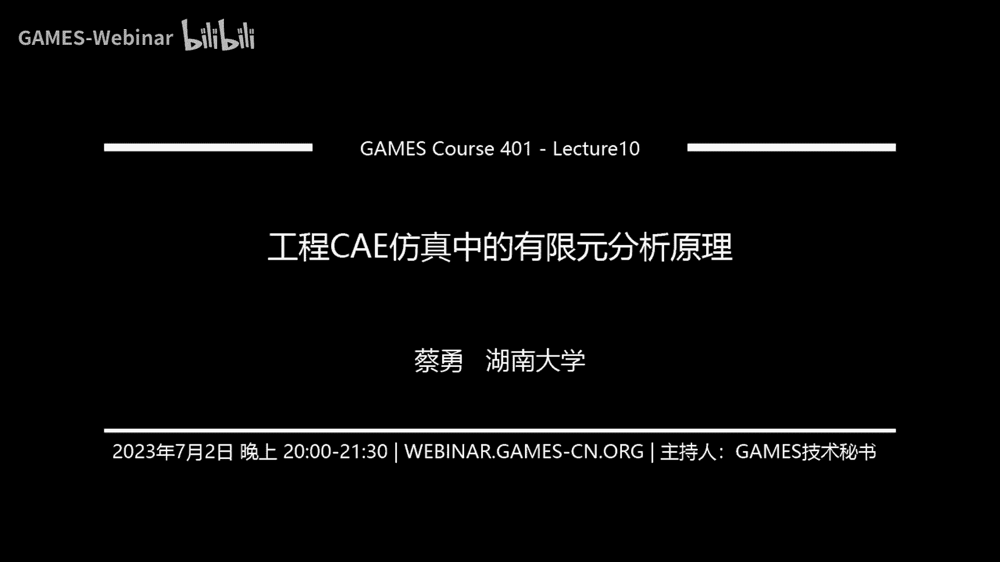
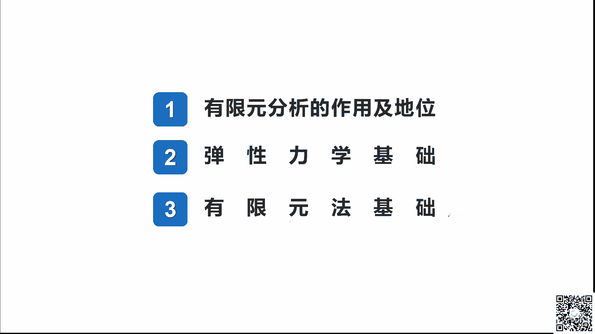

# GAMES401-泛动引擎(PeriDyno)物理仿真编程与实践 - P10：10. 工程CAE仿真中的有限元分析原理 - GAMES-Webinar - BV15M4y1U76M

好各位同学呃，线上的各位网友大家好，非常高兴，我们又在昨天的这个晚上有，在我们games这样的一个在线交易平台上面，大家一起来学习啊，那么今天呃主要想跟大家介绍的是。

工程C1访问中的有效分析的一个基本原理，那么在上一次的话，在上周的话，我们主要是讲解了这个ca软件对吧，ca软件相关的呃，和CE技术相关的一些知一些一些知识啊，类似于是一种科普性的。

和呃介绍性的这样的一个课程一样啊，那么在今天的话，我们主要就讲解一下，有些人分析它的一个基本的原理，就是我们在呃上上上周已经看到了ca技术，它有非常强的一个这种工程分析的一个能力。

那么它背后的一个基本的力学原理是什么，我们今天主要是讲解这一个，那么在下节课的话，我们就会结合我们判断了，和我们继续攀登的开发的match siml来讲解啊，具体的如何用我们这样的一个平台来。

做这样的一个C仿真的一个分析，那么嗯今天的课程的话主要是分为三部分啊，首先第一部分是有限分析的作用与地位啊，当然这个在上节课已经介绍一些，所以这几个是呃快速的过，那么第二个是我们讲的这个有限元分析。

它的基本的一个力学的基础啊，我们是在这个弹性力学的一个基础，那么第三个是基于弹性力学的基础，我们再来介绍一有渲染法的一个基础啊，那么这节课的话相对来讲的话，他的理论性啊可能相对会强一些啊。

理论会相对强一些啊，但是我还是尽量吧，尽量的用呃这种比较通俗的语言吧，就经常用比较通俗的这个观点，给大家来讲解一下，游戏人的一个基本的这样一个原理呃，那么首先的话其实有些人的C1的地位啊。

这个我们在上节课已经讲过了是吧，他主要是啊我们来回顾一下的话，就是他所谓的CA技术，它主要是在这个产品的研发设计过程中，利用这个计算机啊，和数值分析的这些手段，来进行建模和啊性能的一个仿真啊。

当然我们嗯轮廓的来讲啊，在工业软件几个大的几个行业就包括CAD啊，这这这个就是cad的这个啊几何的啊，绘图啊等等，还有CMCM的话就是计算机辅助制造啊，那么我们主要就叫的是CAE计算机辅助工程。

那么它具体在讲就是用计算机来进行建模，以及性能的一个仿真分析，那么我们在上节课也讲过对吧，所以一其实他CA软件来讲，其实它包含的数字计算的方法也有很多种啊，当然这个里面最常见的还是。

有些人分析的方方方法，那么它主要是起源于这个固体力学啊，然后迅速地扩展到了流体啊，传热啊，电池等等的这样的一个其他的领域，那么啊我们在今天可能在我们这个课程上面，主要是围绕着固固体力学来说啊。

但实际上他往流体啊，传染电视来讲，它基本的这些理论呢基本的原理是类似的，那么我们在上节课也讲过对吧，有些人分析的一个基本的的思路啊，这个也是回忆一下，它是利用这种数学近似的这个方法。

对真实的物理系统进行一个模拟，对我们讲的它是一种嗯，是这样的一个近似的一种求解的一个方法，也就是有些人求解的话，它求解的不是一个啊精精确解，它是一种工程中的数字分析方方法，它适合适用于在工程中。

能够解决非常复杂的工程问题，有这样的一个通用性啊，但是它的精度不是百分之百的，它基本的这个原理我们在上节课也讲过对吧，有单元的这样一个概念啊，就是我们讲的有单元的这样一个概念。

也就是说他利用简单而又相互作用的，这样的一个元素，我们称的是element的，就是单元啊，我们在上节课讲过，我们把一个复杂的几何通过网格的划分对吧，划分为三角形，四面体，六面体或者是四边形。

有很多的这种元素，我们叫网格来逼近我原始的这样子一个几何，那么我在计算的时候就是基于每一个元素啊，或者是每一个网格，我们把它们称为单元的计算而去逼近，而无线位置量的这样的一个真实的系统。

那么所谓的有些人的模型啊，它就是指我们真实系统理想化的一个，数学的一个抽象，我们在上节课也讲了这样子，一个梯子的一个例子对吧，我们在这个绿在这个左在左手边，这个绿色的是我们一个真实的系统啊。

是一个真实的信息，这个系统当我们在有序员分析的时候，我们就会用右手边的这个有序员的模型，来进行一个分析和计算对吧，他就是有一些简单的形状，那么在这里的话就是指这种一个个的线段。

来构成我们整个梯子的一个模型对吧，那么单元之间就每个线段和线段之间，它是通过节点的连接啊来来进行一个连接，而且在这些在这个节点上，它是承受一定的载荷啊，就比如说我们说考虑到真实系统，它受到一个力。

其实我们是要考虑到，它最终是加载到我们这个节点上面啊，而且我们每个节点上面，它是具有一定的这个自由度，对我们上节课讲过，有XYZ以及绕XYZ的这样子，一个转动和XYZ的屏动啊，这样子六个自由度啊。

对于我们这样在这样一个三维问题中来讲，来讲的话啊，那么所谓的自由度的话，它是描述我们一个物理场的一个响应的特性啊，对吧，这个就是有些人分析的一个基本的一个原，一个原理，那么他的思路的话。

我们在上节课也讲过对吧，它实现了一个方法，一个方法就是用有限种类的一个标准件，去构造出任意复杂的对象对吧，这个有限种类的标准件，就是讲我们的各种单元感单元呢，这种哦量这种量单元或者是333角形。

这种四边形，这种翘单元，或者是四面体，六面体这种实体单元，然后去构造出任何复杂的一个对象，那么它的一个技术的路路线啊，他其实首先基于是一种标准化的这样的，一个思路啊，标准化求解的这样的一个思路。

也就是说哦我任何复杂的这个问题，我任何复杂的一个问题，我都是进行标准化的分解啊，用这种标准化的go这种基本这种构建，这种单元进行标准化的分解，然后我在这个单元上面进行计算啊，也就是说我在单元进行建模。

那么就形成我具有有限种标准的单元，就是我这个标准单元的这种种类啊，种类它是有限的对吧，我们四面体啊，三角形啊，是这种六边形啊，它是有限的这种标准的单元，另外一个呢，它的整个的分析的路线又是很规范化的啊。

到我们所以到后面的讲解，也就到我们在下节课到下节课，当我们实际机软件来进行分析讲解的时候，大家就会发现啊，为什么我们可以用PANO这样子一个增增量集成，开放式的这样一个平台来做这样一个事情。

也是因为它的整个的技术路线，是非常规范化的啊，是非常规范化的，那么它整个的一个流程是吧，就是从我们上节课学学我们也讲过啊，就从cad的几何到数字模型啊，这里就包括是力学的这个求解啊。

然后再次进行我们这样子一个后处理的一个显，一个显示啊，当然有些人还有非常好的一个特点啊，就是它可以计算机化啊，为什么有些人可以在众多的这种，数字分析方法中能够脱颖而出啊，能够快速的发展。

它计算机化的能力是非常重要的一个原因啊，它可以形成一个标准的一个程序啊，然后构造出开发出各种的一种模块对吧，我们可以构建出各种的前处理模块啊，求解模块啊，或者是各种单元模块啊，这种本科计算的这些模块啊。

然后再形成我们这样的一个软件啊，它是非常符合于我们这种增量式软件的架构，或者是模块化编程的这样的一个思路啊，这是有些人他在啊程序化方面它的一些优点啊，他是不是可以程序化好。

那么这个就是我们呃算学习也算是回回顾一下，我们在上节课说啊，大家我们在上一次的这里讲的这种，关于CAE和有限分析相关的一些知识啊，那我们接下来就从弹性力学的基础讲讲起啊，先从力学基础啊，在这过渡呢。

我们有些人圆的一个基本的一个基础啊，那么我们首先来看一些基础的知识点啊，这个可能会比较简单，但是我考虑到可能大家啊，各位同学可和我们咱们的各位B站的网友，可能我们这个涉及到的每个专业的。

这个基基础不一样啊，所以我还是从一些最基础的讲解，那么首先我们来看这种最基本的，在弹性力学里面，我们最基本的一个定义，我们叫做胡克定律是吧，胡克定律它也就是说我们一个弹性体。

它的变形与外力是成正比的对吧，就好像我们这样子有一个弹簧，我们这样子有一个有这样的一个弹簧，诶，这怎么就放不了算了，就我们这样子一个弹簧，那么它在受拉的时候，这个弹簧就会张开是吧。

就好像我们在右手边这一幅图啊，当这样子是个弹簧的一个模型，当受到一个力拉扯之后，其实它是会有一定的生产量的是吧，弹簧最后一定的生产量，那么在这样子一个在这样子一个呃。

在这样子一个在这样的一个现象过程中的话，那么我们就说这个里面就包含有一个弹性体啊，比如说我们的弹簧其实它就是个弹性体，也就是说它的变形量与外力是成正比的啊，这个大家要记住一点，F非常关键。

就是我们所谓的弹性比弹性力学，它就是说它仅仅只是在这个阶段，就是我的受力和哦不，我的变形和我的外力是成正比的，这样的一个阶段啊，那么在这个里面外力与变形之间的关系，我们用一个F乘上K乘上一个DX是吧。

那么这个叫X的话，我们就知道就是我们整个一个生产量，那么F就是它产生的一个力对吧，就是单一，这个K就代表着我们这个弹性体的一个变形，的一个能力对吧，是弹性系数，把它的一个弹性系统弹性系数。

那么得到的一个曲线应该就是这样子的，就是力和变形量之间它是一个线性的关系啊，是一个线性的关系，当然在我们实际的过程中对吧，有可能如果说我把画笔调出来一下啊，大家稍等我调出来一下，那么其实我们当时实际上。

当我们用很长的一个量，大家不知道小时候有没有玩过对吧，我们拿一个弹簧，我用很大的力气去扯，扯完之后，大家就会发现这个弹簧，是不是他就回不去了是吧，它就产生了一个，就相当于这个弹簧被拉直了一样对吧。

我们在小变形之内，我去拉，拉完之后，我一松开这个弹簧又回到了原来的样子，但是如果说我拉的很很大的力，就把这样一个弹簧就拉直了，其实这就是因为它在后面，它会进入到一种塑性变形的一个阶段啊。

就是我现在画出来的，这个是在弹性变形的这个阶段，也就是说我的力合外力和这个变形是成正比的，而且关键的是什么，当我的外力去掉之后，当我的外力去掉之后，我的变形是可以回到原来的这个样子啊。

就是我外力撤销之后，弹簧的变形又消失了，那么这就是一个弹性变形的一个过程，但是如果说我们的力加载过大，就好像我把弹簧拉直了，那么就涉及到了后面这一个塑性变形的数，数性塑性变形的这样的一个阶段。

那么在竖线变形的这个阶段，首先它有几个以太一的特点，就是说它的力和它的位移之间，它不是一个线性的关系了啊，它不是线性的关系，它可能是这样一个动震荡的，这样的一个很随机的这样的一个关于关系，另外一个特点。

也就是说当你发生了竖线变形之后，你的外地撤掉之后啊，你的这个变形是回不去了啊，就像我把弹簧拉直的，他是回不去了啊，他就保持到现在的这个样子，或者是呃稍微有一点变，有点变形，反正他是回不到原来的那个样子。

这就是说我们从从弹性和塑性，它们之间的一个关系，但是我们在这里，我们首先从学习的简单程度来讲，我们首先从弹性变形这个角度开始学，开始学习，那么这就是逆对吧，关于力的这个概念。

但是这个我相信大家都学过是吧，我们从初中啊，从高中啊，大学啊都会学到力的基本概念，但是我们也来来快速的回顾一下吧，因为后面都会围绕着力来讲，那么力其实它是指的，物体间的一个相互的机械作用是吧。

它的这个作用的结果呢，是指的我们物体的这个形状或者是运动的状态，发生改变啊，发生改变，那么它的一个效应是吧，它的一个效应，也就是说它的这样的一个运动状态啊，等一下啊，这个电脑端的弹出窗口，不好意思。

它的一个效率，就是我们运动的这个状态变变化啊，是一种运动的效应，那我们是进行理论力学的一个研究，因为我们其实关于力力学，我们学过很多的力学是吧，理论力学，材料力学，结构力学到这种弹性力力学。

其实在不同的这种我们在不同的这种假设，或者是在不同的研究的对象哇，我们采用的这种力学的研究的方法，其实是不一样的啊，其实是不一样的，当然对于力来讲的话，有基本的三要素对吧，有基本的一个三要素。

那么就是它的大小啊，方向和作用点，力的大小，方向和作用点，这是它的三要素，那么表示的一个方法，我们力当然是它是有方向的对吧，所以它是一种矢量矢量，那么采用的是矢量计算的这种符号来进行表示。

那么单位制的话，力的单位我们都知道是牛对吧，就是牛顿牛啊，这样子一个力的一个基本的概念啊，那么我们再来看一些扩展的，讲一下我们主要研究的一些对象啊，一些主要研究的一些对一些对一些对象。

那么我们比如说我们研究这种改进结构啊，就像这样的一个改进的一个结构，也就是说像这种结构的特点呢，它就是说它的长度是远大于我的横截面积是吧，长度是远大于这个横横截面面积。

就是它长远远比它的长宽和高都要大一些，那么我们就可以把它看成是一个杆件结构，那么对于杆件结构的研究呢，我们一般是采用这种材料力学进行研究啊，这材料力学进行研究，那么第二种结构我们叫做薄壁结构啊。

薄壁结构大家看到，那么对于薄壁结构常见的，如果说你是一块平的，那我们一般是讲它是一种板啊，是一种这是一种这种板，那么如果说我的这个面是一个曲面啊，像下面这个它是个曲面，那我们就叫它是一种翘啊。

一个是一个板，也是一种翘，但是这两种结构的话，我们都归属于是薄壁结构啊，因为他们在两个尺寸两个方向上面的尺寸，也就是说它的长和宽远高于它另外一个尺寸，就是它的这个高啊，也是它的厚度是吧。

它的厚度也就是它像一个板一样，那我们这个叫叫的是薄壁结构，那么还有第三种结构呢，我们叫做实体结构，那么这个实体结构就比如图所示，非常的清晰是吧，就是我三个方向上面的尺寸。

具有基本上类似的这样子一个大小啊，那我们这就叫做做实体的结构，那么对于薄壁结构和实体结构的研究的话，那我们这里写了个弹代表什么，就是我们这个就会用弹性力学啊来进行研究，用弹性力学来进行研究。

那么对于这种杆件变形啊，如果说我们回到这种杆件变形，以杆件变形为这个特点，我们来这个了解他这种受到各种的外力啊，所产生的一个变形的一个特点对吧，如果说他是受到了一个轴向的拉伸或压缩对吧，那么横很明显啊。

他腕力的特点就是我沿着轴向还有个拉伸的力，或者沿着轴向有个压缩的一个力，那么它导致了一个变形，就是说如果说大家看这个变形的特点，是代表什么，就说如果说我受到一个方向上面的拉对吧。

我比如说受到走向的一个拉力，那么它在轴向的这个方向上面，其实它是伸长的，但是呢同时一定要注意到的话，他在这样子一个横向对吧，在这个跟走向垂直的这样的一个方向，他却是缩小的啊，就是变窄了。

就本来有一个宽宽的这样一个结构对吧，宽宽的一个一个结构，因为这个图画的有点复杂，受到一个例子后，它就会变成一个长的对吧，变长的就是轴向是伸长，另外一个方向就会缩短，那么相当于呃相反的。

如果我受到一个压力对吧，那么我可能就缩短了对吧，但是我缩短了，这其实我另外一个方向它就会变宽对吧，这个是受到它的这样子，一个拉伸和压缩的这样的一个情况啊，另外就是说如果说他是受到了一个。

比如说我们受到一个平面的弯曲对吧，受到的一个弯曲的话，那么它就可能会随着我们这个约束，就是我们支撑点的不同对吧，而产生这样子，一个连续的这样一个弯曲的一个变形啊，连续的这样的弯曲的变一个变形啊。

当然实际上在实际的情况中，这种感性的这种变形，它肯定不也不仅仅，只是受到单一的外力的作用是吧，它有可能是受到一个主和的一个受力，像这样子我既受到有弯曲，中间这里我又受到了有这样的一个力对吧。

那么就产生出这样的一个变形出来啊，这个是它变形的一些基本的形式，也就是说我们在对于这种力学分析的时候，我们就要考虑到它的种类有很多种是吧，一个是轴向拉伸，一个是轴向的压缩，另外另外还有剪切是吧。

剪切剪切，也就是说我们对于这样的一个物体啊，我这受到了两个相对的这样子一个力啊，少相对的这样子一个力，那么他就会在我们这样的这个表面上，会产生一个剪切力对吧，剪切力就是我们在做啊材料拉伸实验的时候。

就会导致我们在这样的一个事件啊，应该找一个那个图片啊，我没注意，就是说受到了一个拉伸，它有减轻力之后，它就会呈45度的这个方向发生一个断裂，还有一种我们讲的变形的形式就是扭转啊，就是牛就是扭转。

就是绕着一个点这样子给他一个扭转，对这样子一个转距的这样的一个加载啊，还有就是受到一个像这种平面的弯曲对吧，就是这样子一种受力和变形的一个情况啊，当然还有一些基础的一些知识知识点啊。

就是我们经常会讲到什么强度啊，刚度啊等等，那么其实所谓的强度呢很简单，它就是我们讲啊，我们这样子整个构建抵抗破坏的一个能力啊，抵抗破坏的能力，也就是说当我这样子一个构建。

当我受到这样子一个很重的一个外力，比如我一个钩子，我上面受到一个很重的一个力，但我这个钩子的这个B它会不会断掉是吧，它会不会断断断掉，那么这个就是通过强度来进行一个评估，当我的强度很足够的话。

那我整个这样子一个感情是不会发生断断裂的，它能够承受得住我这样子这个重物啊，这个就是我们评价的强度啊，这个我们在啊接下来的两节课，包括在下节课我们讲软件使用的时候，会经常讲的强度的分析啊，刚目的分析啊。

模特的分析啊，他们主要是做什么功能啊，这个大家都知道，那么强度就是指构件抵抗破坏的这样的，一个能力，那么还有一个呢我们就叫做它的刚度啊，刚度和强度的区别就在于刚度。

它讲的是我们构建去抵抗变形的一个能力啊，强度就是我有多硬是吧，我有多硬，那么刚度其实你就把它想象成，我有我有多么的这个稳定啊，有多么的稳定，就是我去抵抗并行的这样的一个能力，比如说我像这样的一个支架。

那么我去放一个很重的一个物，那我就要去去去分析诶，我下面这个支架，当橙色这个重物的时候，这个支架它会不会发现很大的一个变形对吧，也就是说他虽然没有断掉，没有断掉，但是它发生了一些形状的变化。

比如说被压被压矮了是吧，被压变形了啊，那么这个就是我们讲的一个刚度，刚度的一个概念，那么还有一个问还有一个概念，我们叫做稳定性分析的一个概念啊，稳定性分析的一个概念，其实它评价的就是说。

我们的构建在保持原有平衡状态的，这样一个能力啊，也就是说我当受到外力的这个加载的时候，我能不能圆始终保持，我原来是已经有了这样的一个，平衡状态的一个能力啊，这个的话我们相对可能提的会少一点。

稳定性能上面会少一点，那么在有限元分析里面，那我们讲的哎呦，不好意思啊，嗯没事，不好意思啊，这个PPT怎么一下子跳过去，好在再回过来啊，大家稍等一下啊，也就是说我们在有在有限语言里面。

其实我们最常见的还是去分析它的刚度啊，和它的强度啊，和他的一个强度，其实这里面都有动画的，但都放不了，为什么，啊这个就是我们讲的一些基本的知识点啊，一些非常基本的一个知识点，好。

那我们接下来看这个弹性力学的一个，研究的对象啊，弹性力学学的一个研究的对象，那么首先我们现在弹性力学是干什么的，弹性力学是干什么的，那么弹性力竭我们前面讲过，它主要是研究这个弹性体在外界因素。

那么这个外界因素就包括外力的作用，温度的变化呀，以及边界的约束等等，它的一个影响上，它内部所产生的应力形变和位移的，这样的一个学科啊，就是说我一个弹性体啊，类似于有个弹簧能保一个弹性体。

它在外界的作用下，他受到一个力，那么它在内部会产生怎样的一些应力啊，形状的变化呀等等的这样的一个学科，就好像我一个弹簧受到外力，它的形状发生改变，会伸长对吧，那么伸长量是多少呢。

那么我们就是用弹性力学来进行一个分析，当然弹性体的话，我们前面以弹簧为例，已经给大家讲解的很清楚对吧，它是只有弹性性质的一种理想物体，也就是说它的这个变形和力是成正比的，而且当外力撤销之后。

变形是能够哦，或或者是也是会撤销，回到原来的这个状态对吧，那么这个就是一种具有弹性性质的，一种理想的物物体，那么它的性质就如我前面讲的，就是，应力和应变之间存在着一一对应的这个关系，其实也就是力和。

因为我们还没讲应力和应变啊，可能大家学学过的，知道，没学过的同学，就还是把它想象成是力和这个变形，它们之间的一一对应的关系，而且是当作用去除之后对吧，它能够回到它原来的这样的一个状态，的一个特性。

那么它的研究对象啊，他的一个研究对象，就包括我们前面讲的几种对象，都要包括板翘啊这种薄壳的这种结构啊，这这种薄壁的这种结构，那么也包括像我们在土木里面地基啊，水坝呀，防土墙啊等等这样的一些实体结构啊。

当然在工程中那就更多了对吧，我们的发动机的这种发动机的啊，这种这种机的壳子呀，变速箱的这种箱体啊对吧，各种汽车的车身啊，其实他们都是啊我们属于一种实体的这个结构，那么其实它相对于杆件结构的这种研究。

它是会作为更为精密的一个研究对吧，我们前面讲的那个楼梯分析楼梯的时候，我是直接用杆单元去简化我那个楼梯对吧，就把原来的一个楼梯转化为几个杆，但是如果说你用弹性力学来研究的话。

那我们就会进行更加精密的一些研究啊，不会说仅仅只是作为一维的一个单元啊，可能用二维或者三维的单元来进行一个分析，那么他的研究的任务啊，研究的任务就是我们要弹性，用弹性力学，我们要研究的任务。

主要是分析结构物和构建，在弹性阶段的应力和位移，去教和它是否具有所需的强度，刚度和稳定性对吧，强度刚度和稳定性我们前面已经讲了，寻求或改进他们的计算方法，采取最优的方案去解决安全与经济的矛盾。

我为什么要在这里把这个研究任务，是这样子来总结啊，就是又又要回到它的一个作用上来讲，其实我也是想跟大家再次回到，我们在上节课讲过讲过的这种C1仿真，就是工业仿真和物理仿真之间的一个区别对吧。

大家就发现在C1仿真里面它的一个目的，我再分析出它的应力和位移对吧，它受到的力和它的变形，那么在物理方程中，大家也知道，我们也能算出它的一个力，和他发生了一个形状的变化嘛，也是一种位移对吧。

但是在工程中我不仅算完之后，我还要进一步的去把它转化为去评价啊，去评价它的刚度强度和稳定性，就是力和位移，我算出来，我要是进行刚度强度和稳定性的评价的对吧，那么在物理访谈中。

我们更多可能啊从很多的场景中，很多的场景中，包括电影啊，游戏啊，可能它更多的是一种哦呃视觉啊，图形上的一种近似对吧，但这里我们就不一样，我们要把它反馈到它具体的一个物理的性能，更重要的就是说。

我们还要去寻求和改进它们的计算方法，也就是什么呢，就是我当分析完之后，我发现刚度不够，强度不够，我一定还需要去改变去进行优化对吧，比如说我的刚度诶，我设计完一个结构诶，我发现这个刚度啊强度有点太低了。

达不到我预期的目标，那我就要改进我原来的这个结构，根据我工业仿真所得的结果对吧，改进它的结构来提高它的强度和它的一个刚度，当然我们为什么说要解决安全与经济的矛盾，对吧。

那么这个是计算机仿真非常重要的一个特点，也是它的一个对照的，为什么现在在工程中啊，在我们比如说在在我所熟悉的，在汽车这个行业中，它的应用非常广，泛，是因为它能够通过计算机仿真的这种手段。

得到一个最优的一个方案，而且而而我不需要去做大量的实验呀，或者是我得到一个非常高的这样的一个，安全的玉玉度是吧，我们为什么说在这种军工以前说在军，但现在也不一样了啊，以前在军工里面。

比如说我们去造一个飞机，造一个坦克，其实我们不太需要用到4A1分析，为什么不需要用啊，尤其是坦克这种对吧，飞机其实是旋翼飞机，我要考虑到它的一个轻量化，它一个起飞的重量，那么坦克其实我不太需要去考虑它。

进行CA分析为为什么，因为我反正我不太追求它的轻量化呀，燃油经济性，因为它这种小批量生产的这样的一个产物，我可以把它的结构做得非常的扎实对吧，根据工人的经经验，本来做的很扎很扎实，那么它的安全。

它的性能肯定是够的啊，对肯定是够的啊，那么这种啊就是我不需要考虑经经济性，那么在实际的民用产品中，那就不行对吧，你既要安全，也要考虑我的经济性啊，那么在材料力学和弹性力学的这个区区比啊，因为我们在呃。

我不知道在在座的各位有没有学这个啊，是工程相关这个专业的，就是我们一起学，可能最开始学理论力学啊，再到材料力学，再到产量，弹性力力学，当然这个简单讲一讲，弹性力学和材料学的一个区别。

因为一般来讲像我们上课啊，我以前读书上课，我们先上的是材料力学，然后再上弹性力学，材料力学应该是到了大三大四，我们才去上这门课，那么他首先对于材料力学来讲啊，其实前面也讲过对吧，我们对这种杆状结构。

它主要是用材材料力学，但是对于这种实体结构，我们就是用弹弹性力学来进行一个研究，那么呃研究的范围呢，弹性力学我们讲的是研究它的这个呃这个啊，弹性阶段这段是吧，但是对于材料力学，材料力学来讲的话。

它还会研究到物理的一个塑性阶段，包括不变啊和疲劳啊啊这个叫什么意思，就是会研究到我前面讲的到的曲线的，这个后面的这个阶段对吧，他发现了这种塑性变形的这一个阶段，那么研究的方法的话。

就是说大家都会有一定的讲，有一定的假设，但是我们在做些力学问题求解的时候，都会有一些假设，那么材料力学的话，它主要是对于应力的分布或者是形状的状态，做一些近视的假设，那么得到的结果呢往往是近视的初等的。

那么只能在一定的条件下来进行使用，就是我们很多一些呃，就是在我们弹性力学的书上面啊，我记忆最深的就是他有一张表对吧，然后在表里面就有一些常用的一些结构啊，受到一些利之后，其实你就用代入代入这个经验。

经验性的公式去进行计算，就可以得到一个近似的一个结果，但是弹性力学就是不一样对吧，他是从基本假设出发，它对物体的应力啊变形进行精确的分析，那么得到的结果更为的精精确，但有时候它也可以用来去教。

和我们产线列举的一个结果，因为它结果更更准确嘛，那么我们在进行弹性力学，这样之后，弹性力学它有几个基本的假设啊，这是我们在进行弹性力学讲后面的一些公式啊，分析的时候，它有几个基本的假设。

那么举分别是它的连续性假设，完全弹性假设，这种均匀性假设，各项同性假设和小并行的这个假设，那么引入这个假设的目的，主要是希望我们能够用数学的工具啊，来研究我们的弹性力学对吧。

因为我们用数学的这种工具来研究弹性力学，那我们来一一的看一下，那么首先第一个我们叫做连续性假设，那么所谓的连续性的假设，它从宏观上他是说我这个物体它是连续的，也就是说我在整个一个物体中。

我的物理量像应力啊，应变呀和位移啊，那么他们都可以用坐标的这个连续函数，都可以表示的是坐标的一个连续函数，就是FX对吧，那么这个X代表是坐标，也就是说我的这个力或者是我的这种啊，伊利啊。

我的sigma啊，我的是sigma西格玛X啊，那么它都是随着坐标的一个连续的一个函数，那么这样子的一个假设的好处是什么呢，为什么我们要把它假定是连续的，那是因为我们在进行计算的时候，进行推导的时候。

我们就可以用连续和极限的概念，来采用我们讲的微积分，微分呢，这样子一些数学的工具来对弹性力学进行研究，对吧，如果说你不是连续的，那么你都是不可都是不可导的，对对对吧，是不可导的，无法去求一个极限。

那么就会非常的困难，所以我们有个连续性的一个假设，那么第二个我们叫做是完全这个弹性，假弹性假设，那么它是指这个当这个物体产生变形的外力，被去除之后，物体能够完全的恢复物这个圆形对吧，这我已经讲过很多次。

这样子的话，当温度不变的时候，也就是在任何一个损失的形状，完全取决于他这个损失所受到的外力，与他过去所到的历史无关，也就是说我任何时候的这个的形状，是因为我这个时候受到的力所产生的一个变形。

而不是说因为我这个形状，是因为我前面那一个时刻，手动的力度是达到的一个结果啊，这个大家要记住，当然它有两个阶段是吧，一个是线弹性阶段，一个是完全弹性阶段，那么对于我们的两个材料参数的话。

我们有一个叫做比例极限啊，线弹性下面有一个比例极限，以及我们的弹性极限，这样子两个值，那么这样子的一个假设啊，我们为什么要做完全这种线性，完全弹性假设的这种假设的话，它能够使得我们的本构方程。

也就是说去描述应力和应变这样子的一个方程，我们的本构方程它是一个线性的方程，它是一个线性的一个方程，这也可以为我们后面用数学工具进行计，算和推导，产生很大的便利性和好处啊和好处啊，嗯那么对于啊单元。

我们在实际过程中遇到的材料，也不一定完全是一些弹性材料对吧，它可能是一些脆性材料，也可能是一些塑性材料，但是脆性材料和塑性材料，我们也可以用弹性力学来进行研究，但是对于脆性材料。

比如说我们就说要求它的应力啊，在没有超过比例极限啊，这是在我这种线性弹性的阶段，那么它可以来进行把它近似为这种完全弹性体，来进行分析，那么对于塑性变形材料，就好像前面我说的。

将你没有超过这个屈服直线对吧，也就是说当你的材料变形，我把它画一下对吧，像我们现在讲的对于塑性材料，它的一个变形，立刻变形，应该是这样的一个关系是吧，当当然在这个地方。

这个啊这个点这就是我们讲的这个屈服极限啊，屈服极限，也就是说当你的整个应力，你的应力没有超过这个区域，直线都还只是在这一个线性这个阶段的话，那么它也可以采用弹性力学来进行研究。

当然你要去分析它超过屈服极限，到了数性变形的这个阶段，那你就可能要用塑性能力这个力学啊，去进行一个分析啊，进行一个分析，那么这是他的第二个假设，第二个假设的意义啊，大家一定要记住啊。

是为了让我们后面讲的本构方程，是一个线性的方程，那么还有第三个均匀性的假设啊，均匀性的假设，那么均匀性的假设，他是说我的整个的物体，是由同一种材料所构成的啊，这个大家也要记住啊，它是由同一种材料。

就比如说我们在汽车里面有一个零件啊，我一个变速箱的箱体，那么它可能都是由柱体啊，有这样的一个金属材料，同一种材料所组成的，这样子的一个好处是什么呢，就是说可以保证我整个物体所有的各个部分。

它都会具有相不同的物理性质对吧，那么由于是同一个材料相同的物理性质，那么我们这样子的话，它这个物体的弹性常数啊，就比如说我的弹性模量和泊松比啊，后面会讲就不会随着位置和坐标和改变，这样的好处是什么。

好处呢，就是我们后面得到一些，比如说刚度矩阵的这种矩阵对吧，它就可以进行一个模块化的表达，模块化的一个表达啊，这个大家后面可以看到它的好处啊，那么我们就可以取物体中任意的一小部分，能够分析。

然后把分析结果运用到整个整体对吧，我们讲的有限元分析，有限元分析是一个整体，我这样这个总体我是把它划分为一个，很多个单元对吧，很多个单元啊，这样子我随便画啊，很多个单元来进行分析。

那为什么我可以说中间的这一部分的，比如我只要去计算某一个单元，然后就可以把分析结果应用于整个物体呢，是因为我们整个物体，它是由同一种材料所构成的啊，这个是我们讲的均匀性的假设啊，均匀性的假假设。

那么还有第四个假设，我们叫做各项同性假设，各项同性假设是说我们在分析的这个对象，它的每一个点在不同的方向上啊，就是说我一个材料对吧，我一个材料我一个材料在不同的方向XYZ啊，在不同的这个方向上。

在不同的方向上，我都是具有相同的物理性质和机械性质啊，那么这就可以保证它的弹性模量和泊松比，这些弹性常数啊，不随着方向而改变对吧，均匀性假设是假设什么，大家总结一下。

均匀性假设是假设我们的弹性材材料参数，不随着坐标变化对吧，不随着XY的我的位移坐标变化，那么各项同性假设是，假设我的弹性模量和泊松比这些弹性常数啊，它不随方向变化啊，它不随方向变化，那么还有第五个假设。

我们叫做小变形假设啊，这个也非常重要非常重要，因为我们到后面去进行计算的时候，我们很多的高阶项我们都会忽略不计啊，高阶项忽略不计，那么高阶项忽略不计的原因，就是我们前面也会有一个小变形的一个假设。

那么所谓的小平行的这个假设是指，当这个物体它受力之后，那么我整个物体所有点的位移，都小于物体的原有尺寸，也就是说我的变形量对吧，我比如说我这样子一个悬臂梁，我这样的一个悬臂梁。

我可能发生了一点点形状的改变啊，发生形状的一个改改变，变成了这样的一个形状，变成这样的一个形状好，那么就或者说我这边这个点A点A点对吧，那么它就变大了，到这个点A1撇变到这一点了，那么它的这个位移呢。

我们当我这画的有点夸张啊，这个其实是比较大的，这种变形的，也就是它的这个位移量都小于物体原有的尺寸，相当于原来的物体的尺寸变量是很小的啊，那么这样子啊我们就可以得到一个什么好处呢。

在我们在考虑物体变形之后的平衡状态，因为我们要构建平衡方程进行求解对吧，我可以直接用变形之前的尺寸，来进行一个近似的代替变形之后的尺寸，而不产生显著的误差是吧，他肯定会产生误差对吧。

因为我比如说我这一个变形对吧，我这一个尺寸本来是从这里变形完之后，变成这么多，他肯定是伸长的，但是我为了简化计算，我还是用原来这个尺寸来进行计算，他肯定会有误差对吧，但是这种误差可以接受啊，可以接受啊。

这就是再次强调吧，我们讲的弹性力学啊，或者是有些人分析他这种近似求解的方法对吧，它是有假设在这个里面的，那么这个是它的第一个好处，那么第二个好处就是我刚才提了一嘴，就是说在考虑物体变形的时候。

那么关于应变和转角的平方向或者是乘积项，也就是说它的高阶项对吧，比如说X的平方呀，或者是X乘以Y啊，这种平方向，那么我们就可以把它忽略不计啊，成这种乘积项或者是X平方，这种平方向肯定忽略不计。

那么这样子的话，我们就能够将弹性力学中的微分方程，把它变成线性方程来进行求解啊，大家有发现这个时候我们前面讲了对吧，我们要确保我们的物理方程是线性方程，那么其实这个小变形的话又是进一步的。

要保证我们在里面形成的，其他相关的一些微分方程的话，它都是线性方程啊，线性方程，所以这个就是小变形的假设，这个弹性力学的五个假设非常重要啊，因为我后面在讲的时候都会反复的讲的A2，为什么会是这样子算的。

那就是因为它有五个假设在这个里面，有五个假设在这个里里里面啊，那么在连续性完全弹性，均匀性，各向同性小变形这五个假设之下，那么我整个的弹性力学问题，就成功地转变为了一个线性问题，好线性问题有啥好处啊。

我一个是求解方面，另外非常关键，我们可以直接利用我们的叠加原理啊，叠加原理，所谓的叠加原理，也就是说我们的一个物体，在这种线弹性和小变形的这个情况下，作用于物，作用在物体上的几组的载荷。

产生的应力和变形的紧总效应啊，可以由单独的每组载荷的作用效用之和，来进行计算对吧，你就算大家看一开始我是一个这样的物体对吧，我既受到了一个外力批，我内部又有我的体力Q。

然后在这边这个策略还受到一个这种非均匀的，这样的一个均布力对吧，均一个均布力，那对于像这样子一个受到一个三项外力作用的，一个三项外力，这种三组载荷的这样子一个问题的求解，我就可以利用叠加原理。

我分别计算啊，分别计算第一个计算，在这种啊非均布面临的这样子一个情况下，面，我的一个呃应力和变形的一个效应，然后再算受到体力Q的一个应力和变形的，计算力，再算受到一个P，他这样子。

一个万历这一个应力和变形的一个效应对吧，然后我再把它累加到一起去啊，就得到这样一个复杂，这样子一个受力情况，下，面的一个整体的一个应力和变形的一个总效应，这是叠加原理，这个后面我们也会用得到的。

那么接下来我们再来还是一些基本概念啊，这个后面我就快一点了，因为前面的五个假设是比较重要的啊，这个我就讲的稍微快一点，那么因为我觉得这种理论课的课程啊，不适合于上的很长啊，时间上久了。

大家觉得很难集中注意力，那我们就把挑一些重点来讲啊，不种这种概念性的，我们就快点过了，那么外力啊我们讲包括体力和魅力对吧，它是指是其他物体啊，对研究对象的作用力啊，就是外部嘛，就是我的研究对象。

外部其他物体对我的注意力，那就是外力对吧，他包括有这种体力对吧，就是说分布在物体，当然这里面有个体力对吧，就是说分布在物体体积内的力，如重力啊，惯性力啊，电磁力啊等等是吧。

那么它是以单位体积内的力来进行一个度量啊，进行进行度量，这是体力，那么它的符号的话，它也是个矢量对吧，它沿着我的力的这个方向，是它的一个极限的一个一个方向，那我们在计算的话，其实它是等于。

如果我们进行一个三个方向的自由度对吧，XYZ3个方向的自由度，我收受到了一个体力，那么它的一个合力就是三个方向的力的平方，在之和再开功放啊，再开根号对吧，就是它的一个核的一个体力。

那么它是沿着坐标的正向为正对吧，还有面积，面积的话就是分布在物体表面的力，其体力是在物体体内的力，命令就是表面能力，比如说我们受到一个流体的压力啊，或者是一个结节处理，那么它是以单位面积啊。

前面是单位体积，就是单位面积所受到的力来进行一个渡衡对吧，同样的也是我们笔试有三个方向，我们进行一个啊累啊，平方累加，再开根号，那么它是以对外为正，那么体力和面力呢它是军事表示。

表示的是单位体积面积上的作用力，所以在考虑平衡条件求和时，必须要乘以相应的体积力和面积啊，这个大家要注意，那么你在写一个有限的程序啊，其实我以前就走过这种弯路啊，我在最开始学的时候啊，在做一些课题。

在写就有线性程序的时候，比如说他说他给的体力和命令是多少，那么我在计算的时候，我就直接把这一个物体所受到的整体力和命令，就是认为是他给的这一个值，但实际上它不是这样子的对吧，那你在求合力的时候。

因为它是指单位面积上的一个力，那么你要乘以它相应的体积，或者是它的面积对吧，体力的话，那你就要以他的单位例乘上它的一个体积，面积的话，就以它的单位率乘上它的一个面积，才是它的一个合力啊，这个大家要注意。

那么再就是内力，内力的话，它的定义的话，是我物体本身不同部分之间的相互作用的力，相互作用的一个一个力，其实大家就把它夹一下，为我把一个物体切开，把一个物体切切开，那么截面两边相互作用的这个力啊。

我把它切开之后，截面两边相互作用的这个力啊，那么这个我们就把它叫做是啊内力啊，就是我在本身这个不同部分之间，我在物体内部内部，不同部分之间的一个作用力啊，物体内部之间的一个作用，一个作用力。

这就是应力了啊，当然前面已经讲了很多是应力啊，相信大家应该也知道应力的概念，让我们回顾一下，其实应力，他这是截面上单位截面积上的一个类离子对吧，那我们就知道它的应力其实是等于A，F要除上A对吧。

F要求上A，也就是说我的力除上我的一个面积啊，除上我的一个面积，那么就是我的应力得到的是单位截面积上面的，一个内力值对吧，那么我们一般的在这种力学里面，我们都是用的sigma对吧。

用sigma这个符号来表示应力啊，来表示应力，当然它是指这种，如果是我是作用在截面法向啊，再比如说我的这个方向法向上面，这个方向上面，反向就是垂直于这个表面的这个方向，我们说是它的法向方向。

我们就称之为是正义里用sigma，那么还有一个剪切下的，就是平行于我这样的一个表面，平行于我这个表面上面的这样子一个硬币的话，我们是用top，我们叫做是这样子一个剪应力是吧，剪应力来进行表示啊。

这是用套这个符号来进行表示，这个我们讲的应力的概念啊，那么对于对应于力对吧，我们前面回应的是力的基本概念，那么应力的话呢其实它也一样的，它也有几个要素，它除了力所有的大小方向和作用点之外。

那么应力还有非常重要的一点，就是它有一个作用面，对吧，它有一个作用面，因为它是指单位面积上面的一个力嘛，所以它有一个一个作用，一个一个作用面，那么不同的这样子一个截面上，就点边上，在不同的截面上。

它的应力呢它是不同的，也就是说我们在这样的一个物体中是吧，我们在这样子一个物体中，如果说是吧，如果说我是受到的是这样子一个情况啊，就是我一个物体两端都送到了一个N对吧。

受到了一个N那么在这里在中间这一点的话，N两个方向N相反的力他就抵消掉吧，那我们就没有力，它就为零，它就没有应力，但是对于像这种情况，如果说我只是一端受力，只有这一段受到的一个力对吧，受到的赢一个力。

然后我要分析它是这一个垂直的这个截面上的，这个利率的话，那我们的这个应力是吧，sigma正，它的正应力就是等于N除上，A就是等于逆除上面积对吧，这是他的正义力，但如果说我要分析在这样的一个斜的面。

上面的一个应力，那么它又跟这个不一样，虽然都是过点P这个截面对吧，都是过顶皮，这个面都截面都要过的皮，但是它的不一样，那如果说我是这种鞋的话，那么斜的话，那我们就要考虑他干两个方向上对吧。

一个是他的正应力啊，就是在垂直的这个方向上面这一个力对吧，有个西格玛，那么还要在平行于这个面的上面呢，我们还有一个力，我们叫做掏啊，他那么他们的一个计算，无非就是我要乘上一个角度嘛。

乘上它的一个角度就是把这个N对吧，把N沿着这两个方向上面进行一个力的分解嘛，然后再去除上我的面积啊，除上的面积，就得到了它在两个方向上面的这一个应力，一个是正应力，一个是检验力。

那么也就是说我们只啊虽然说对于一个物体中，它过了点P，但是它不同截面上的应力呢是不相同的，那么我们为了要分析点P的这个应力状态，我们可以通过P点上各个截面上，应力的大小和方向，采用的一个方法呢。

就是我们在P点取出一个无穷小的一个平，行六面体，然后用六面体表面的应力分量，来表示P点的应力，也就是说我们在实际的分析中，我们会在这个里面，在我这样一个实体结构中，取出一个小小的六面体出来啊。

取出一个小小的一个六面体出来，来进行一个分析，那么取出六面体之后，这个时候从我整个物体中哎，取出了一个小的一个六一个六面体，那么我要分析P点，它的状态的话，就是分析包含PDP点的这样的一个。

微小的正六面体是吧，那么他有些基本的一些啊特性是吧，他首先它有一些能编对吧，对应于三个坐标轴的长度，分别有这种啊pa对吧，就这个长度，然后有PB1，还有PC对吧，这个对应的就是我在三个坐标轴上面的。

一个长度，那么呢对应于这里我们用这个data x啊，就是在X上面我们截取的这个长度为Y上面，解决了这个长度data y，然后再在Z上面几层是data z啊。

那我们就形成了一个我们叫做是data x data，这个鼠标写字不太好写啊，大家注意一下，因为要推直播啊，用那个平板又不太好弄，那么就得到X对Z和对的Z是吧，这样子一个微小的一个六面体。

我们来进行一个分析啊，我们来进行一个分一个分析，然后我们再将每个面上的应力啊，我就分析它六它六面体有六个面嘛，那么我在分析，他把每个面上的应力都分解成，一个正应力和两个切应力。

因为它是在XYZ这样子一个三维坐标系中，那么我对于每一个面，比如说我以这个面为例啊，以这个面为为例，那我们就可以分解成一个，是沿着我这个面的法向，就是Y这个反向对吧，我看的是这个面啊。

大家看的是这个侧面最右边的这个侧面，那么我沿Y就是它的反向有个正应力，就是sigma y，那么同时呢我沿着另外两个方向X和Z对吧，我分别还有两个减一力啊，用减一力toy z x和toy x啊。

Toy x，那么在这个里面sigma y toy z toy x这些下标，那么这些下标都是有明确的含义啊，有明确的含义，那么比如说对于检验力套IJ，比如我们套YX套YZ对吧，那么它总体表示就是套IJ。

那么IJ就分别等于XYZ对吧，那我就组合为XYXZYZXZ是吧，各种组合的这个形式有六有六种，对应于第一个I我们它表示的一个作用力，是讲作用面的一个外法向的一个方向，那么大家就看还是看我讲的这个面对吧。

我们发现YZ和套YX在这个面上面，它的第一个下标都是Y，那是因为它的第一个下标，代表的是作用面的外法向方向，也就是说Y是它的外方向方向嘛，这代表的是Y是吧，那么第二个Z这个J啊，J就指的是逆的指向对吧。

那么我想我们有YZ，那么我们就是这个力分解完之后，就是指向ZZ的，因为我们是把逆向XYZ3个方向进行分解吗，朝Y方向分解了，变成了我们的正义力对吧，朝Z方向分解了。

就变成了我们的toy z这样的一个减一力，那么它X方向分解的这一个力，我们在除上面积就可以得到它的套YX这样子，一个减一力，那么X就是沿着X轴的一个力的方向对吧，这是它的下标的意义，那么对于正应力啊。

SIGMI啊，semi这个里面虽然说我只有一个字母I，但实际上我们这里其实用到了我们后面会讲的，wait法则是吧，warning的法则，那么其实它表示的是IIII，也就是说套X其实它是等于套xx是吧。

它也包含两点，其实是作用力面的法向方向和力的方向，但是因为其实大家看一下套Y他的Y方向，方向和力的方向都是YY是吧，所以说你如果写完整，其实他应该是sigma y y对吧，但是我们为了简写。

我们用这个VOLU法则啊，用word规则，问题规则v o LT word规则的话，那么我们其实旁的简写是sigma y对吧，sigma y啊用一个来进行表示就够了啊，所以这个是我们讲的应力向标的。

这样的一个含义啊，这个也很重要，因为要不然的话，很多公式大家可能后面就看不懂了，就看不懂了，还有就是力的表示对吧，当然我们讲还有力的方向和他的政府啊，它的方向和政府，那么对于印度的政府。

如果说我们在某一个面上面，外法线是沿着坐标轴的正方向，那我们就说这个面上的应力，就是沿坐标轴正方向为正，沿负方向为负对吧，那比如说对于sigma y对吧，它的是沿着X轴的正方向。

那么就说我沿着这个X轴正方向的应力就是正，那如果说我沿着X方的反方向的，那么它就是负啊对吧，负那么相反的嘛，所以这个它的一个正这样子一个啊正负啊，当然这个里面呢我们也要注意啊。

其实对于这种对于这种材料力学，材料力学的这个分析来讲的话，它的政府规定是不一样的啊，这个往后面再讲，在这里，如果截面两侧的物体上的内力和应力，都是成对出现，且数值相等，方向相反作用于你反作用力。

那么采用上去的规则，则则解开则则解开两部分啊，遵守同一个规定啊，这个就是说我们对于呃，两侧物体上的这个力的一个规定，因为在这里为什么要强调，因为对于弹性力学来讲，其实他给我们分析的方法是不一样的。

弹性力学分析，它是假设包大家记得一种这种左右手，左左左手原则，或者是右手右手原则的一个概念啊，也就是说截面上面的剪应力，对于截面上任意一点的举为顺时针转动，那我们就是正如果是一直能转动啊，它就是为负。

那么这个就是我们讲的它的方向啊，当然这里呢就会要讲到一个切应力互等的原理，所谓精力不等的原理呢，前面刚才讲了一下，因为我没这个图不好解释，我们这得解释，也就是说在受力物体相互垂直的两个表面上。

寿命物体相互垂直的两个表面上，它的切应力必然是成对存在啊，比如说我们像这样子这个表面和这个表面对吧，这个表面和这个表面相互处，表面上它有一个套ZX也有个TXZ对吧，也就是它的切应力是成对存在的。

而且它的数值呢是相等的，也就是说大小是相等的，而且两者都垂直于两平面的交线，那么它们都垂直于这个交这个交线，因为它们的方向都是沿着坐标轴嘛，所以说它是垂直于这个交线的，那么方向是共同的指向或者是被啊。

像这种就是都指向了这个交线，同时指向同时背离啊，不能说一个是指向，一个是这个背离的啊，那么对于像这样的一个情况，弹力和弹性力学和材料力学的规定就来了，就不一样，这只要在方向上啊，弹性力学就规定。

像这种情况下面我的力就是相等的，但是材料力学就否是规定你力是相等，但是你的方向是相反的，方向是相反的啊，这里提醒一下大家，还有应力的表述啊，应力的表表述前面我们已经讲过对吧。

那么我们是以一个面来进行解释，但如果说我们把六个分量全部都表示出来，其实它就包含有西格玛X，西格玛ZY和ZAZ对吧，三个坐标轴方向上面的正应力，以及套xy toy这一套ZX这六个量是吧。

为什么没有套YX和套ZY的呀，大家想一想为什么呀，为什么没有了，因为我们刚才讲的是用的切应力互动的原理嘛，这两个都是相等的，我们就没必要了对吧，我就分析这三个就够了。

那么对于这六个量在这个P点是已知的啊，如果说我们说这六个量是否值的，那我们就可以求得，经过该点的任何面上的正应力和它的检验力，也就是说我们通过这六个量，可以完全确定P点的一个应力的状态。

那我们就称为它们是该点的一个应力的分量啊，那么一般来说对于弹性电线来讲呢，它的应力不相同呢，他描述这个战略的房，这些分量的也并不是常量啊，他们一般都会带XYZ的函数，就说我们是在一个微元体里面嘛。

他是不带这个X没有带这个坐标函数的对吧，但如果说我这是一个微体是不带的，但如果说我是放分到我整个的这个题里面，来对吧，那么你在描述里面任何的这一个，比如说另外一个点P的话。

那么你边缘就要用一个坐标的函数来进行表示，对吧，你去表示XYZ嘛，那么它就是变成了一个比sigma，那么这里的话他应该是带X和YZ啊，这两个坐标的函数的，那么我们经常会用这样的一个列阵啊。

来进行应力的表示，大家记住啊，我会用一个sigma，用一个应力的一个列阵，它就包含有三个正应力和三个减一力啊，用这样的一个列阵来进行一个表，进行一个表表示，那么再就是位移和应变啊。

位移和应变呢其实跟应力有点类似，所以我们就快点过啊，那么当然他们表示的物理现象不一样，只是我们表表示的方法有点类似，它是指在弹性体受到外力之后，它要发生变形对吧，那么我们怎么去描述这个物体的变异。

这个形状的这个改变，也就是说我这个物体受到外力之后，它会发生形状的变化，那这个形状的变化怎么去描述对吧，比如说我原来是一个这样的形状啊，我原来是个性这样的形状，那当我发生变形之后。

可能我变成了是这样子一个形状对吧，我形成变成这样的一个形状，那么从这个红色的形状，我们变成这个蓝色的这个形状，我们怎么去描述这样的一个变形对吧，我不是说我看着它变形，我要用数学，用公式。

用这种方法进行一个明确的描述，那么描述的方法有两种，一种就是基于点的位移啊，第二种就是基于体素的一个变形，那么所谓的位移是吧，位移也就是说我们任意一个点，比如说我这个点是吧，我这个点A，我这个点A对吧。

我这个点A它会沿着我的坐标轴对吧，我们始终要考虑一个坐标轴的概念啊，就是XYZ啊，这个三维坐标轴上面，他的位移，在三个坐标轴上面都会有对应的一个位移，是UVW啊，就在X上面产生一个U的位移。

在Y上面打成一个V的位移，在Z上面转成一个W的位移，那么这个时候我们就可以用这种位移来表示啊，我的一个A点的一个位置的一个变化是吧，当位移有两种啊，一种叫做形状有关的位移，就是说它被改变形状。

还有一种就是形状无关的位移，就是说它是缸体育这个位移，那什么意思啊，就比如说我形状改变的位移，就是我这种位移以后红的变成这个男的对吧，那么还有一种情况，就是假设我受到了一个逆之后。

我这一个物体受到一个例子后，其实它仅仅就是说从这个位置，它移动的到了这里，移动到了这里对吧，我的形状并没有发生改变，我的A从这里变量的这个A1撇对吧，哎我确实产生了位移，但是因为他是个钢铁啊。

钢体就是说我没有形变，发生不了形变这个缸体，那么它就没有发生形状，真的只是一个位置的改变，我们把它称作是寻遍无关的这个位移啊，那么关于体术的这个变形，如果说我们用体术来进行表示，这个是什么时候用到。

比如说我们进行解压力啊，角度的变化对吧，我们就是用体术，那么它就有两种变化，一种是长度的变化，一种是角度的这个变化啊，比如说，我们任何一个限速的长度，与原来的这个长度的比值，我们叫做是应变。

也就是说我们对于像这样子一个物体对吧，我原来的长度是这个虚线好，我把它受到一个外力之后，收到一个外力之后，两端的外力之后它变长了对吧，变成这个实现产生的一个DX的一个这样子，一个线性的长度的变化对吧。

那么这个data x除上L啊，data x除上L就是长度的变化量，除上它原来的长度，我们就等于我们的应变，我们就称作是它的这个应变啊，我们是用一用这种IP来进行表示，用IP来进行表示。

那么对应于这个阴历其实是一样的啊，它也同样的会沿着各个方向上面，都有应变的分量，所以有有EUXEPTIONALY和一撇的Z是吧，那么当限速我的长度是伸长时，我说应力是正当缩短时，让它的应力去负啊。

这个就是我们讲的一个应变，那么还有一种情况呢，就是我原来是皮脂相交的一个元素啊，皮子相交的一个元素，也就是说比如说我原来有一个元素，大家看这个虚线啊，是一个虚线，那么他这里这两个元素相交。

这两个线段相交有一个90度的直角对吧，当受到力之后呢，它的形状变成了这个实现的这个形状对吧，那么这个时候原来90度的夹角，就变成了这个角度对吧，它就产生了一个伽马，产生的伽马这样子一个角度的变化。

角度的一个变化，那么这个时候我们也可以称之为，是它的一个检验病，好像这个我们称之为这种长度的变化，我们称之为是它的正应变对吧，那么对于角度的变化，我们就称之为是它的一个简易变。

那么对应于跟我们的阴历一样，它有沿着各同的这个方向，有伽马XYYZ和ZX啊，汤而且它也是同样的，但角度变小时他是呃为为为正啊，当这个角度变大时，它是为负啊，这个是我们有些约束在这个里面的。

再一个我们就来讲弹性力学的两类问题啊，这个我们快点讲吧，我已经讲了一个小时了，我靠你再讲快一点点，那么对于弹性力力学的这一个分类，其实它根据我们研究的对象不同，我们分之为是空间问题和平面问题对吧。

如果说我们分析的是一些呃实体结构，比如说一个啊发动机的一个缸，一个缸体啊，像这种可能是一个空间立体的这样的一个结构，我们通知是空间问题，当然对于一些薄一些薄壁件对吧，薄壁结构我们可以简化为平面问题。

来进行一个分析啊，对前面分一个分析，我们就根据平面的这种或者是空间的这种，问题的啊，这种呃形状的特点啊，就把一些空间问问题，我们可以把它简化简化为是这种平面问题，那么简化为轴。

我们就可以因为我们前面考虑到它的位移呃，应变分量都是有有有六个是吧，有六个当我简化之后呢，我可以只分析它部分的位移分量，应变分量和它的应力分量，那么简化有两种，一边一种我们称为是平面应力问题。

因为我是称之为是平面的应变问题啊，平面应变的问问题，那我们首先来看平面应力问题啊，平面应力问题，那么首先是什么是平面应力问题呢，平面应力问题它的特点，第一个就如这样子，它是一种等厚的一种薄板啊。

大家要注意它这种薄板的一个结构，那么它的特点是什么，就是我是一种薄板的结构，也就是我们前面讲过的薄壁结构对吧，我在两个方向上，不在一个方向上面的尺度，是要远远大于在另外两个方向上面的一个尺度，对吧。

就比如说我的在这个方向上面，在Y方向上面的这个尺寸是要远大于它，在哦不它在Z和X上面，这个尺寸是远大于我在这个呃X方向，就是我的这个方向上面的一个尺寸是吧，他这种薄壁的结构，那么还有一个特点呢。

就是它的体力呢，体力我们前面讲的是作用于体内，而且它是平行于板的正中间面啊，平行于这个中面，那么而且它沿板的厚度方向，我的体力是不变的，那么第二个就是面积，面积呢它只作合于我们板的这个边啊。

只注意我们板的边，那么它平行于板的这个桌面，平行于板的这个桌面，就是我作为这个边上，而且沿着这个厚度啊，它也是不改变的啊，但这就是我的约束也是只作用于板边，也是平行于我这个板的中面，也是沿厚度不变。

那么几何特征就是前面讲课的宝贝结构啊，这个这这不重复了，那么他这种受力的特点啊，就是我们在这样的一些情况下面，就得到它的一个受力的特点，就是说它的外力就是说包括体力和面积啊。

它的约束只平行于板的平面作用，沿厚度呢只是平行于板的平面，就平行于这个板的平面来来作用，因为厚度它是不改变的咳，那么这样子的话就可以得到他任意一个，就是垂直于这个Z啊，大家看就是垂直于这个Z项。

在这个方向，它相关的一个正应力和它的两个减应力，都是等于零的啊，都是等于零的，那我们就可以简简化一下是吧，简化一下，也就是说它的外力不如他的，他在这个中面上面啊，但我们这里说他是在中间这个表面上面对吧。

中间面XYZ上面，他Z的正应力和Z的两个解应力都是等于零的，但是同时我们又不是假设的嘛，它都不影厚度变化对吧，所以就假设在整个保本之内，这都是满足的，都是满足的，也就是说对于平面应力问题。

那么我们要剩下研究的三个应力分量呢，就只剩下了这样子的一个四个西格玛X，西格玛YTOX和toy x啊，单元这两个又是相等的，所以他就只剩下了三个，我们就称之为是平面应力问题，那么它的应力矩阵。

我们前面讲的应力矩阵是六个对吧，那我这里已经删掉三个，划掉三个了，那就只剩下了另外的三个啊，这个就是平面应力问题，可以用这样的一个，就是除掉他的，沿着板后的方向的，正应力和两个减应力都要去掉啊。

只剩下另外两个XY方向面正应力和剪应力啊，那么还有一个跟它相反的，我们就叫做是平面应变问题，那么所谓的平面V面问题我们全部给出来，它是一种很长的一个截面的圆柱体啊，嗯就像这种情况。

就这样子一个很长的截面的样子，对我有一个截面对吧，我有一个截面，但我沿着Z方向对吧，沿着Z方向的这个长度是很长的，就是沿着这样子一个很长的一个长截面，所谓的长截面就是沿着这个方向，我的截面面积是截面。

是不变的对吧，那么像这样子一个问题的话，他的体力是作用于体内，平行于我们这个截面啊，平行于这个截面，那么面积也是一样的，那么约束也是一样的，那么像这种情况下面，像这种情况下面他的这一个情况。

下面我们就是说所有的点对吧，跟前面的平面应力问题就是相相相反，由于它是对称的对吧，它的任何一个截面，它任何一个截面都可以看的是个对称面，为什么任何一个截面都可以看成一个对称面，为什么大家想一想。

因为它很长对吧，很长很长，那么我就可以把任何一个截面都可以看成，是一个对，是一个对称面，那么所有的点他就都只会有XY方向上的位移，而不会有Z方向的位移啊，也就是说它只会有X和Y这两个方向，上面的位移。

他不会有W，它只会只会有U和V，它不会有W啊，它不会有W，那么这个我们就把它叫做平面位移问题啊，因为它的位移都在这个面上面，叫做平面位移，当然习惯在我们跟的架构是。

因为位移其实它跟应变之间是一个关系的话，我们就是平面应变的这个问题，那么在这个时候，平面应变问题呢就跟前面相反的对吧，它因为只在XY这个面上面有嘛，所以说他就在这个表面上面。

它就会有什么垂直于它的反向就会有套，还有西格玛Z，还有这个有这个应变是吧，有这个IP是Z和这个伽马YZ和伽马ZX对吧，它就有应变，所以这个就是平面应变问题，那么再就是我们讲的弹性力学的三大类方程。

三大类方程首先是平衡方程，那么平衡方程是表示着物体内任何一点的一个，微分体的平衡条件啊，那么对于平面应力问题的话，他就是说它的平衡条件，就是说Z面上面的力就跟我们前面分析的一样，正面上面的力。

以及指向Z轴平行的力均为零对吧，我们根据平面应力问题前面分析出来的对吧，这是它的一个平衡条件，那么对于平面应变问题呢，这面上的力是吧，它只有这个它的这个Z方向的这一个正应力啊，它是不为零的。

那么其他的力以及指向于与之平行的力，它均是为零的啊，这个就是平面应变问题，那么这里我们讲的就是，它有一个平衡的一个微分方程啊，平衡平衡微分方程，那么我们在构建这个平衡方程的话。

其实我们也是取一个微元来进行一个分析啊，来进行一个分析，比如说我们在一个物体上面对吧，我们取出这样的一个啊，取这样一个微元微元出来，那么它在这个XYZ在Z方向上面，它有一个增它有一个增量啊。

比如说我们在对一个V有全部画出来吧，那么在这样的一个物体取出了微元之后，他在这个FX和XYZ的两个方向上面，分别有力对吧，那么对应于在每一个表面上面，在每个表面上面都会有什么，我们上面讲过的。

都会有它的一个正应力和他的一个剪应力是吧，每个表面都会有正应力和一个减一个简易力，那么这里给出的是这两个，那么我们就是说沿着在这里，假设说他在这里产生了一个增量啊，DX这样的一个增量之后。

那么对于在这个面上面的这个力，我们就可以用西格玛X再加上一个偏这个MX，Spx dx，又是加上这样的一个微分的，这样的一个偏导的一个增量啊，用增量来进行一个表达，这个表面上的一个力好。

那么对应于从这个西格玛这个Y对吧，到我们在这一到下面这个面也是一样的，我们也会增加出一个增量对吧，也会增加出它的一个增量出来，来进行一个表一个表示，那么这里的话我们就要回到我们前面。

有了这样的一个增量的一个表达之后，我们要用到我们前面的一些假设啊，比如说我们讲到的一个连续性的一个假设，连接线的一个假设，就是我们的应力可以用连续函数来进行表示，对吧，小变形的一个假设。

就是我们变形后的尺寸来代替变形嗯，变形前的尺寸呢变形变形后的一个尺寸，那么基于这两个假设，然后我们再列出它的平衡条件，平衡条件是在我们前面讲过，我们要算它的合力对吧。

合力的话就是应力要承受它的面积和体力，要承受它的一个体积，然后用正向的这个微物理量来进行一个表达，那我们就可以得到，在这样的一个平面问题中是吧，它的X方向的力合列式为零，Y方向的合力是为零。

绕Z的这个这个这个呃转距的，这个是为零的对吧，这个是我们讲的平面问题，它的三个平衡条条件，那么我们就基于这三个等于零嘛，我们再又回到前面的，就是根据这个图啊，根据这个图我们把这一个方向是吧。

把这个方向和这个方向，把FX和FY的逆全算出来对吧，比如说我FX对吧，我X在FX这个方向上面，那我就必然会有西格玛X乘上一个A对吧，然后我还有sigma加上这个偏好PC感，把偏X乘上一个A对吧。

同时我们还要看还有toy x和套XY是吧，这两个简易力他们也要分别乘上这个面积对吧，这样子四个分量啊，这四个分量我们全部列到一起来，就得到一个FX要等于零嘛，就是我们前面讲过的，这个是这边的呃。

是我把它画到这里对吧，画到这里，那么这一项大家回忆一下是吧，这一项其实就对于你就是在这个地方的一个，正应力是吧，乘上面积面积的话就是它的这个侧面积，它的侧面积肯定就是等于把坐标轴画到这里啊。

坐标轴画到这里，那么就是X和Z吗，那么我是沿着X方向的，那么我的面积可能就是在5YZ这个方向，所以是DY加上DZ，那么还有这一项套啊，西格玛X因为西格玛X是沿着X轴的反向，是在这里对吧。

所以说它就是减去sigma xx，那么同样还是乘上这个面积是吧，这是两个正应力所得到的力，我们把它累加到一起，同时我们还要计算这个表面上面的，两个减压力是吧，两个减应力。

那么一个是这个方向上面的这个这个减音量啊，这个应该放缓了，应该是这个方向，这个箭头是在这个方向，那么这一项，这一项其实对于我们在这里的一个解，一个简易力是吧，就他YZ加上之后乘上它的一个面积。

这个时候我要乘算的是下面这个底面积啊，这个底面积，那么这个底面就是DX乘上dz，然后我再去减上上面啊，上面这一项啊，这个是toy x啊，这一项再乘上他的这一个底面积，也是DXDZ，然后把它加到一起。

当然我们还要有个体力是吧，FX它这个内部我们不要忘了，它内部还受到了一个体力啊，体力啊，收到了一个体力FY和FZ，那么FY我们不考虑，因为每一只都没有在X这个方向，X方向只有一个FX这个体力。

然后乘上我的整个体积，那么这三个这些力加在一起，我们要满足一个平衡条件，就是它的合力要等于零啊，合计要等要等于零，那么进行一系列的合并计算，这样我们就不计算了啊，就可以得到这样一个式子啊。

得到这样一个式子，那么同样的对吧，我们有用同样的一个思路，我们也可以向Y方向，那也同样的是等于零对吧，就可以得到这样的一个平衡方程出来，那么这个就是我们得到一个平衡微分方程，那么同时对于这个转转距啊。

围绕着中心点的这个转距，这个一样的，大家想想，你就是考虑所有的这种检验力了是吧，因为我这个就都复刻都不去考虑了是吧，我的啊，这个正应力正应力都是通过这个中心点的，所以说它是不存在的，我就只考虑看嘛。

只是考虑套了，只考虑剪应力的啊，正应力是通过中心点的，体力也是通过中心点的，所以他就没有力矩，没有力矩嘛对吧，所以我们就考虑减应力加在一起，也让它等于零，那么这个时候我们就可以得到这样子，一个公式啊。

当然这里我们要根据我们的最小变形的原理，我们把这个微小的增量去掉对吧，微小的最小变原理，微小增量去掉，就是说这个时候就得到是这样的一个形式，套X等于套YX是吧，那么整合一下对吧。

我们就得到了我们整个的平衡的这个方方程啊，这个具体的解说我们就都不去讲了，这个大家有兴趣的课后可以再仔细看一下啊，那么这个是各种呃，在材料力学和弹性力学和理论力学里面，其实都会有平衡方程啊。

只是说他们表达的方式和他们的研究目标，也是不太一样的，但是整体来讲的话，我们弹性力学的平衡条件它是最严格的啊，这个大家记住就行，他是最严格的嗯，当然有了这样的一个呃呃平衡方程之后呢。

我们也再来看一下一点平面问题，是每个点的一个应力的状状状态啊，其实这个呃快点过吧，有一说我们在这个坐标面上面啊，我们的应力有西格玛YS玛Y和TX，那我求斜面上面的一个应力是吧，就是我只我知道坐标面上面。

坐标面上面的一个应力这三点，那这个时候我要去求这个斜面上面的这个应力，那这个时候我们就可以取出一个三角形啊，也是用这样一个微元体是吧，它包含有这样的几个面啊，就是X面Y面和N面A面，就是这个面嘛。

就是斜的这一这一个面，那我们就先进行一定的这个分解啊，就是沿着它的一个法向上面，就是把我的体力嘛，把它这个上面的这一个力啊，PX就是它斜面上面的这个力，P沿垂直于它的，沿着它的法向分解到XY上面去是吧。

然后分别计算出它的一个方向余弦啊，所谓的方向余弦就是跟他的角度，根据这个角度是相关的，而且他这个斜面ab的这一个长度啊，然后我们再进行计算，其实就是通过一个投影和相关的一个计算的。

一个关系来进行一个计算，同样我们也是要满足这样子，一个平衡的一个条件对吧，那么计算的一个方法其实一样啊，也是把比如说我们算到这个PX啊，算到PEX，那么我们也是去乘上它的一个面积啊，它的一个灭一个面积。

然后再把西格玛X啊，toy x啊，体力啊，在这个方向上面都要考虑进去嘛，就包括PX啊，包括有C啊，西格玛X哎，不贵啊，这个套XY是吧，应该是这个啊啊不不不，t toy x套XY是这个方向啊，包括他对吧。

把这些力全部弄起来，也构建出一个平衡方程，计算的方法就是一样的啊，这个我们就过了，再就是几何方几何方程，那么几何方程的话，它表达的是什么，它表的是我们一个微分体上面，形变和位移之间的一个关系啊。

大家记住前面讲的是平衡方程，现在是几何方程，几何方程表示的是形变和位移，之间的一个关系啊，位移之间的一个关系，也就是比如说我们在一个物体中有个PX是吧，有这样一个有这样的一个有这样子三个点呃。

呃构成了一个体吧，就是呃AP和B构成了这样的一个形状对吧，当P发生了一个位移，就是P移动在P1撇这个地位，第一地方产生了一个位移U是吧，那么在这个方在Y方向产生了一个位移V。

那么它就从P移动到了P1撇是吧，通过这两个位移的作用移到的这个P1撇这里，那么A也是一样对吧，A也是由对应于像这个物体里面，它也是由这个里面，根据我这里面的一个增量对吧，有个位移的一个增量。

也产生了一个U加上这样的一个增量，的这样的一个位移，从这里啊在X方向上发生了一个的位移，在P方面也是一样的，发生了这个位移，就移动端的A1撇对吧，那么对应于这个我们的整个这个pa这个形状。

就通过了这个位移是吧，就变成了P1撇和A1撇这一个形状对吧，就是说这个时候它就发生了一个形变，也就是说由这些位移就产生了一个形变，那么我们如何来构建几何方程呢，跟B1样的，B1样的。

我们就直接就给就给就给出来了，那么其实在这个时候，我们讲的P点在X方向的位移分量是U是吧，那么A点在X方向的一个分量呢，就是要加上U，加上这个由于它的这个位置的改变，它有一个微小的增量是吧。

Data u，所以我们加上它的一个V，它的一个微分项，那么限速PX的正应变是吧，它的正应变很简单呀，它的正应变就是等于它变形之后的这个形状，就是P1撇一撇是吧，减去我原来的形状U就是减去它。

然后再乘上我的整个原来的长度，就是DX是吧，就是我的变形后的存量减去我的这个增量，但DX就等于它啊，当然同理对于BP也也是一样嘛对吧，也就是说我也是用它的一个增量是吧，也是由它原来的这个长度啊。

由它变形之后的这个长度，P1比BB这个B1撇减去PB嘛，也就是由这一项相减，然后除了他原来长度，就得到了它的一个正应变啊，得到它的一个正应变，那么对于这个解应变伽马X啊。

也就是说它表示的是他们之间夹角的变化是吧，就是这个夹角的这一个改变，是这个夹角的这一个改变，那么对一个夹角的这一个改变的话，当然这个类似于是一种啊，这种呃几何问题的一个求解啊，其实它也是一样啊。

就是把我们比如说求这个啊，求求这个阿尔法是吧，求阿尔法这个角度的话，我们求它的一个正弦是吧，tan阿尔法就是等于什么，就是等于这个线段，再除上这个线段对吧，除上这个线段是它的一个正弦的一个值。

那么这一个线段对吧，这个线段这个线条是怎么来的，这一个线段其实就是等于大家看啊，就是等于它整个的这个长度，整个的这个长度减去什么，减去这个位移是吧，减去这个位移，减去这一段嘛。

减去这一段就都等于它这个长度，所以就等于他，然后再除上这个长度啊，这个长度又怎么来呢，这个长度就是等于什么，就是等于我原来的这个长度DX是吧，然后我再加上我的这样的一个增量啊，加上我的这样的一个增量啊。

就可以得到这个长度，那么它的一个探险值就可以得到，又是因为引入小变形，假设就是我变形量很小嘛，那么对于小变形的话，我们的这个正弦值和角度值就是相等的，所以就可以得到它的这样一个值。

那么同样类似的我们也可以去计算出贝塔啊，这个转角的这个值我们也是能够算出来，那么整理一下，我们就把平面问题的几何方程啊，就是通过他们这样的一个变形状，位移和形状之间的关系就可以得到伊布是的。

X是等于U对X的偏导，那么一说Y是等于V对Y的一个偏的，那么伽马X就是等于一个相互的一个偏导啊，当然这个就是它的一个几何方程，这些结论性的我就不去讲了，因为这个就是比较多了，但这里要给出一个关键点。

就是大家要这个要记住啊，这个结论还是跟大家讲一下，就是说我们要记住几何方程它表述的是什么，表述的是形变和位移之间的一个关系，但是呢他之间不是完全的一个充分，必要的一个关系啊，就是说当形变是确定的时候。

那么与形变有关的位移呢它是可以确定的，但是与疾病无关的这种刚性位移，它是没有去确定，它就必须要通过边界条件才能够确定，也就是说什么，也就是说形变和位移之间的关系是位移，确定它的形变就完全确定。

就是我知道了他的UVW这些位移之后，我可能知道它的形变，但是我知道它的形变，我是并不能够得到它的位移的是吧，并不能得到它的位移的，因为它可能会产生很多什么，我们前面讲到的位移对吧，与形变无关的位移。

就是我在发生形状改变的时候，我的位置从A点，整体从我有从这里变化到了另外一个地方，那么这种刚性位移我是不知道的，所以说它不是一个冲锋，必要的一个计算的关系哦，位移可以得到形变，但形变得不到位移啊。

这个大家要记住这点就行了，关于几何方程啊，这个我们就过了，还有一个方式，我们中的物理方程，以及我们讲的本构方程非常重要啊，那么他讲的是应力和应变之间的一个关，一个关系，那么最简单的物理方程。

其实就是我们讲的复合定律是吧，那我们把它延伸一下，就变成一个广义的复合定律对吧，我们讲的材料力学中，我们说这个应力和应变直接关系，是满足一个弹性材料，弹性模量一的一个关系是吧，弹性模量一的一个关系。

那么，那么我们在这个在这个弹性体中，在弹性体中，我们就可以用到我们前面的叠加的原理对吧，就是说因为叠加的一个原理，我们要考虑什么，因为我们说在弹性假设的时候，它是叠加的，那么这个时候我们要考虑。

应力和应变之间的一个关系，那我们就需要将三个应力中，每一个应力所考虑的应力分量要叠加起来，也就是说我这个物体当发生一个变形的时候，那么它其实是受到什么。

它会受到西格玛y sigma z和sigma x是吧，三个应力分别产生作用，那我说到西格玛Y对吧，那我是在Y方向上面有拉伸，但是在另外两个方向上面是有压缩好，我收到这个嘛Z那么我是在Z方向上面有拉伸。

那么在XY方向上面是有压缩的对吧，前面讲过一个方向上面受力生长，另一个方向上面就会减小，那么我们就要考虑将这三个方向，三面力的作用要叠加起来啊，叠加起来之后，我们就可以得到这样的一个形式啊。

这个我们就不去展开去去说了，那我们就可以得到这个应力啊，西格玛二不一不是X啊，它是由这种西格玛XX就是说我Z方向，我在X方向上面的，在哦这个是X方向，我在X方向上的正应力一不行的，X对吧。

它是由西格玛X这样子一个正应力啊，直接导致了我的一个伸长对吧，我拉长了对吧，但是同时呢我的为什么在这里又是减，大家想想为什么它是减，为什么只有C和max是真是是假呀，因为Y和Z这个方向上面产生的应力啊。

它是不会使这个X方向怎么样是变小的是吧，它是会压缩的，所以说它就会减，当然这个前面也会乘上对应的一个系数啊，就是E和mu啊，弹性模量和泊松比这样子一个系一个系数啊，具体的一个推导。

其实也是用的广义的符合定律，进行一个推导的是吧，那我们就可以得到它们之间的这样子，一个整体的一个关系啊，就我们用叠加法，就像我前面讲的这样一个大概的一个叠加法，我们就将六个关系式全部写在一起啊。

就是六个三个呃正应力和三个三个正印表，三个简易变，那么写在一起，我们就构成了它整体的一个本构方程啊，本构方程啊，本构方程就是这么来的，当然在这个里面有些系数啊，这个G我们称为是剪切模量。

那么一是弹性模量，而波斯还有一个波斯比是mu是吧，因为物理方程它是本构方程，是描述我们材料的性这种变形性质的，这就是为什么说大家在做有限元分析，涉及到材料模型的时候，我们就要去输入它的弹性模量一。

以及它的一个波斯比的系数，相关的这样的一些材料啊，这这相关的一些材料，那么再就是整体得到的是吧，当然我们也可以将它进行一个改写啊，进行一个改一个改写，就是用韵力和应力之间相互的一个关一个关系。

那么我们也可以写出用应变来表示的，这个公式啊，这举的是怎么去改变呢，大家有兴趣大家可以去算一下，像这个我是用阴力用应变来进行表示是吧，当然我可以通过应力和应变之间关系，我可以用应应应变来进行一个表。

一个它的第二种形式啊，那么前面的这种复杂的形式呢，我们可以用矩阵的形式来进行一个表达，这就是我们在计算机编程的时候啊，我们讲的一个D几个D矩阵啊，一个D矩阵，我们用矩阵的形式来进行一个表一个表征。

那么在这个里面大家就可以发现对吧，其实在这个矩阵里面，前面的这一块对吧，前面的这一块它对于弹性计算来讲，其实它就类似于是个常量一样，因为它就是弹性模量和波斯米，这跟我的材料相关的，我不管在哪。

在哪一个地方，它都是材料，是，这是我们讲的是它的连续性材料性质是一样的，也就是说，我不管是在我这个材料体内的哪一个部分，其实我的这一个弹性模量，不知道我的这个第一矩阵，第一矩阵它是与坐标无关的是吧。

所以说它是就很好的去计算的这个问题，那么这个D矩阵我们一般称为是弹性矩阵啊，到弹性矩阵它完全取决于弹性，才是E和U，它与位移是没关系的，那么它表征的是我们弹性底的弹性啊，当然我们也可以采用这种拉梅系数。

就是G和X就是他的这种剪切模量啊，他的这个剪应该是G，这讲出来G应该是它的一个剪切模量啊，用他的剪切模量这里写这里写错了，来进行一个表表，进行一个表进行一个表示。

那么最后我们就可以得到它的另外一种形式啊，就是这样子一个请一个形式，也就是说这里的话，我们就得到一个C的这样的一个形式，这样一个矩阵，那我们称为它是个柔度的这样的一个矩阵，那么这里得到的是什么。

是应变等于C乘上sigma乘上应力对吧，那么D的话是等于应变，是等于D乘上一个一部分的乘上一个应变对吧，他们是这样子一个关系，那么很显然C和D就肯定是一个互逆的，这样的一个关系啊。

就柔度矩阵和弹性矩阵是互利的一个关系，当然在我们又回到前面的平面，应力和平面应变问题的话，那么它们的物理方程肯定就会有一些简化对吧，因为我不需要这么多项嘛，对于平面应变应力问题，我们只需要考虑这些对吧。

那么对于平面应变问题，他们对应的不需要的分量我们也可以去掉嘛，就会得到一个简化的一些形式啊，这个我们就快点去过了，大家其实就是把我们全员不需要的分量，把它去掉就可以了。

那么同样对于平面应变问题也是一样是吧，我们只保留我们有需要的，就是西格玛Y西格玛啊，这个Y这个MYX和TXY嘛，这些相关的就行啊，相关的一些就行就行，那么对于这种两种问题对吧。

它的物理方程的总体表达式肯定是一样的，都是等于西格玛乘上弹性矩阵，乘上一个伊斯法形成应变对吧，只是说对于平面应力问题来讲，它的弹性矩阵是它的弹性矩阵，低的表达式是这样子，对于平面应变问题讲。

他的举人谈论矩阵就是这样子，对不对不对，就是说我用同一个方程来进行表示，只是说我的弹性矩阵是不一样，那么单元物理和应变和硬币之间，他们之间也有这样的一个转化的关系啊，就是用这样的一个转化关系。

也可以去得得到是吧，其实这个给大家就是讲一个好处，就是反馈的，为什么说有些是很好编程的，他很好编程的原因也是因为什么，也是因为他们之间很多都可以进行模块化的，求解对吧，你看我对于同一个不同的问题。

但它的表达式是你是是是一样的，也就是说我对于结构化编程来讲，我的模块是一样的，只是说我的输入是吧，我一个输入的是这个弹性矩阵，另外一个输入的是这个弹性矩阵，输入是不一样，但我程序的模块是一样的。

所以说它的编程是非常之方便的啊，好最后再快速讲一下它的边界条件啊，边它的边它的边界条件，那么也就是说我们在进行物体的分析的时候，我们还要考虑到就是我们像这样一个物体，在空间中。

它还会受到外界的给他的一些作用啊，就是说我们把研究对象以外，那其他的物体我们称为边边界，那么把属于连接配上本身，与外界接触的那一个边界面呢，我们称之称为其他物理，称为外界，那么外界与研究对象本身的话。

我们称为边界，那么边界的限制就包括边界的形状，边界所受的外力以及他给的一些线，一些一些限制啊，那么对于弹性类型来讲，其实它的边界性质就两就两类啊，一个就是力的边界啊，一个就是位移的边界，那么力的边界呢。

我们用S这个西格玛来进行表表示，那么位移的边界呢我们用SU来进行一个表示，也就是说大家考虑什么，就是说我在分析一个问题的时候，我这个边界上面是受到了一个力是吧，还是说他给了我一定的位移。

它让我的位置发生了一个改变啊，就是这样子一个也是改变它这样子的一个形，一个形式啊，那么对于这些编边界的话，它也是要通过同样的，我们进行应力和应变的这种分解的计算，把它融入到我们这种合理当中去啊。

所以说我们在这种有限求解的里面，我们就专门有一块的模块，我们是进行力边界和位移边界的一个求解啊，这个我们到啊，下一次我们再讲吧，因为我看今天已经讲了有将近这个两个小时了，两个小时了，我觉得呃。

这样子我们把第三部分有有限元分析的基础，和我们下一章基于mc lab的软件和编程，合到一起来讲好，那我们呃今天的这门课我们就上到这里了啊，非常非常感谢大家。

希望大家我们下周天不见不散哈。