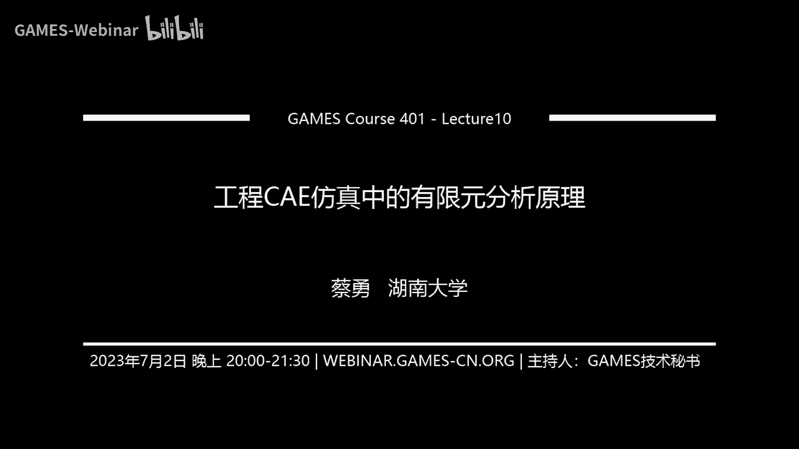

# GAMES401-泛动引擎(PeriDyno)物理仿真编程与实践 - P10：工程CAE仿真中的有限元分析原理 📚

在本节课中，我们将要学习工程CAE仿真中有限元分析的基本原理。上节课我们介绍了CAE软件和相关技术知识，是一种科普性和介绍性的课程。本节课我们将深入讲解有限元分析背后的基本力学原理。下节课我们将结合PeriDyno平台和MATLAB Simulink，讲解如何利用该平台进行CAE仿真分析。

今天的课程主要分为三部分。首先，快速回顾有限元分析的作用与地位。其次，讲解有限元分析的基本力学基础，即弹性力学基础。最后，基于弹性力学基础，介绍有限元方法的基础。本节课理论性相对较强，但会尽量使用通俗的语言和观点进行讲解。

## 第一部分：有限元分析的作用与地位 🔍

上一节我们介绍了CAE技术，本节我们来回顾一下有限元分析的地位。

有限元分析是CAE技术中最常见的数值计算方法。它起源于固体力学，并迅速扩展到流体、传热、电磁等其他领域。本节课主要围绕固体力学展开，但其基本原理在其他领域是类似的。

有限元分析的基本思路是利用数学近似方法对真实物理系统进行模拟。它是一种近似的求解方法，适用于解决工程中非常复杂的通用性问题，但精度并非百分之百。

其核心原理是“单元”概念。通过网格划分，将复杂几何体划分为三角形、四边形、四面体、六面体等简单元素（单元）。计算基于每个单元进行，从而逼近具有无限未知量的真实系统。

有限元模型是真实系统理想化的数学抽象。例如，分析一个梯子时，可以用一系列线段（杆单元）构成的模型来近似。单元之间通过节点连接，载荷施加在节点上。每个节点具有自由度，在三维问题中通常有六个自由度（沿XYZ轴的平动和绕XYZ轴的转动）。自由度描述了物理场响应的特性。

有限元方法的技术路线实现了用有限种类的标准件（单元）去构造任意复杂对象。其求解思路高度标准化和规范化：将任何复杂问题分解为标准单元，在单元上进行建模和计算。这使得整个分析流程非常规范，便于后续用增量式、开放式的平台（如PeriDyno）来实现。

有限元分析的典型流程是从CAD几何模型到数值模型（力学求解），再到后处理显示。它的一个重要优势是易于计算机化，可以形成标准程序，开发出各种前处理、求解、单元计算等模块，非常适合增量式软件架构和模块化编程。

以上是对上节课关于CAE和有限元分析知识的回顾。接下来，我们将从弹性力学的基础讲起，为理解有限元方法打下基础。

## 第二部分：弹性力学基础 ⚖️

上一节我们回顾了有限元分析的地位，本节中我们来看看其力学基础——弹性力学。

首先，我们来看一些基础知识点。考虑到不同专业背景的同学，我们从最基础的概念开始。

### 基本概念与胡克定律

弹性力学最基本的一个定义是**胡克定律**。它描述了一个弹性体，其变形与外力成正比。例如一个弹簧，受拉力时会伸长。在弹性阶段，外力 `F`、弹簧刚度 `k` 与伸长量 `Δx` 的关系为：

`F = k * Δx`

此时，力与变形量之间是线性关系。当外力撤销后，变形消失，弹簧恢复原状，这称为**弹性变形**。

如果力加载过大，超过一定限度，弹簧可能被拉直且无法恢复原状，这就进入了**塑性变形**阶段。在塑性阶段，力与位移不再是线性关系，且外力撤销后变形不可恢复。为简化学习，我们从弹性变形开始。

### 力的概念

力是物体间的相互机械作用，会使物体的形状或运动状态发生改变。力有三要素：大小、方向和作用点。力是矢量，单位是牛顿（N）。根据研究对象不同，力学分为理论力学、材料力学、结构力学、弹性力学等。

### 主要研究对象

工程结构主要分为三类：
1.  **杆件结构**：长度远大于横截面尺寸，如梁、柱。一般采用材料力学研究。
2.  **薄壁结构**：在两个方向上的尺寸远大于第三个方向（厚度），如平板、曲面壳。采用弹性力学研究。
3.  **实体结构**：三个方向上的尺寸量级相近。采用弹性力学研究。

### 变形的基本形式与性能指标

杆件变形的基本形式包括：轴向拉伸/压缩、平面弯曲、剪切、扭转等。实际结构往往是多种受力的组合。

在工程分析中，我们主要关注以下性能指标：
*   **强度**：构件抵抗破坏的能力。
*   **刚度**：构件抵抗变形的能力。
*   **稳定性**：构件保持原有平衡状态的能力。

在有限元分析中，最常见的是刚度分析和强度分析。

### 弹性力学的研究对象与任务

弹性力学研究弹性体在外界因素（外力、温度变化、边界约束等）作用下，内部所产生的应力、应变和位移。

弹性体是一种理想物体，其应力与应变存在一一对应的关系，且外力去除后能完全恢复原状。

弹性力学的研究对象包括薄壁结构（板、壳）和实体结构（地基、坝体、机械零件等）。相对于材料力学对杆件的简化研究，弹性力学能进行更精密的二维或三维分析。

弹性力学的研究任务是：分析结构在弹性阶段的应力和位移，校核其是否具有所需的强度、刚度和稳定性，并寻求或改进计算方法，以最优方案解决安全与经济的矛盾。这体现了工程CAE仿真与物理仿真的区别：CAE不仅计算物理量，还要将其转化为工程性能评价，并用于指导设计优化。

### 弹性力学的基本假设

为了使问题可解，弹性力学引入了五个基本假设，将问题转化为线性问题：
1.  **连续性假设**：物体是连续的，应力、应变、位移等物理量是坐标的连续函数。这使得我们可以使用微积分等数学工具。
2.  **完全弹性假设**：物体变形外力去除后能完全恢复原状，且任一时刻的形状仅取决于该时刻的受力，与历史无关。这使得本构方程（应力-应变关系）是线性的。
3.  **均匀性假设**：物体由同一种材料构成，因此弹性常数（如弹性模量、泊松比）不随位置坐标改变。这使得我们可以分析物体的一小部分，然后将结果应用于整体。
4.  **各向同性假设**：物体内每一点在各个方向上具有相同的物理性质。因此弹性常数不随方向改变。
5.  **小变形假设**：物体受力后，所有点的位移远小于物体原有尺寸。这样可以用变形前的尺寸代替变形后的尺寸进行计算，且应变和转角的高阶项可以忽略，从而将微分方程线性化。

在这五个假设下，弹性力学问题成为了线性问题，可以应用**叠加原理**：几组载荷共同作用产生的总效应，等于每组载荷单独作用效应之和。

### 外力、内力与应力

*   **外力**：其他物体对研究对象的作用力。
    *   **体力**：分布在物体体积内的力，如重力、惯性力。单位是 `N/m³`。合力计算需乘以体积。
    *   **面力**：分布在物体表面的力，如流体压力。单位是 `N/m²`。合力计算需乘以面积。
*   **内力**：物体内部不同部分之间的相互作用力。
*   **应力**：截面上单位面积的内力。垂直于截面的应力称为**正应力** (`σ`)，平行于截面的应力称为**剪应力** (`τ`)。

应力有大小、方向、作用点，还有**作用面**。过同一点不同截面上的应力不同。为了分析一点 `P` 的应力状态，通常取一个包含 `P` 点的微小正六面体（微元体），用其六个表面的应力分量来表示。

对于微元体，每个面上的应力可以分解为一个正应力和两个剪应力。在三维坐标系中，一点的应力状态完全由六个独立分量确定：三个正应力 `σ_x, σ_y, σ_z` 和三个剪应力 `τ_xy, τ_yz, τ_zx`。这六个分量通常是坐标的函数。常用应力列阵表示：

`σ = [σ_x, σ_y, σ_z, τ_xy, τ_yz, τ_zx]^T`

### 位移与应变

物体变形后，其形状改变可以用两种方式描述：
1.  **位移**：任意一点位置的变化。在三维中，点沿 `X, Y, Z` 轴的位移分量记为 `u, v, w`。位移包括与形状改变相关的部分和刚体位移（与形状无关）。
2.  **应变**：描述微线段长度和角度的变化。
    *   **正应变 (`ε`)**：单位长度的伸长或缩短。`ε_x = ΔL_x / L_x`
    *   **剪应变 (`γ`)**：两垂直线段夹角的变化量（弧度）。

一点的应变状态也由六个独立分量完全确定：三个正应变 `ε_x, ε_y, ε_z` 和三个剪应变 `γ_xy, γ_yz, γ_zx`。

### 弹性力学的两类问题

根据研究对象特点，弹性力学问题可分为：
*   **空间问题**：分析三维实体结构。
*   **平面问题**：某些薄壁或长柱体结构可简化为二维问题，包括：
    *   **平面应力问题**：适用于等厚薄板，受力平行于板面且沿厚度不变。特点：`σ_z = τ_zx = τ_zy = 0`，主要研究 `σ_x, σ_y, τ_xy`。
    *   **平面应变问题**：适用于很长且截面不变的柱体，受力平行于横截面且沿长度不变。特点：`ε_z = γ_zx = γ_zy = 0`，位移只有 `u, v`。

### 弹性力学的三大类方程

求解弹性力学问题，需要建立三大类方程：

1.  **平衡微分方程**
    表示物体内任一点微元体的平衡条件（合力、合力矩为零）。对于平面问题，可推导出两个平衡微分方程（以平面应力问题为例）：
    `∂σ_x/∂x + ∂τ_yx/∂y + F_x = 0`
    `∂σ_y/∂y + ∂τ_xy/∂x + F_y = 0`
    以及剪应力互等关系：`τ_xy = τ_yx`。

2.  **几何方程**
    表示应变分量与位移分量之间的关系。对于平面问题：
    `ε_x = ∂u/∂x`
    `ε_y = ∂v/∂y`
    `γ_xy = ∂u/∂y + ∂v/∂x`
    注意：由位移可完全确定应变，但由应变不能唯一确定位移（存在未定的刚体位移）。

3.  **物理方程（本构方程）**
    表示应力分量与应变分量之间的关系，描述了材料的力学性质。对于线弹性、各向同性材料，其广义胡克定律为：
    `ε_x = 1/E [σ_x - μ(σ_y + σ_z)]`
    `ε_y = 1/E [σ_y - μ(σ_x + σ_z)]`
    `ε_z = 1/E [σ_z - μ(σ_x + σ_y)]`
    `γ_xy = τ_xy / G`, `γ_yz = τ_yz / G`, `γ_zx = τ_zx / G`
    其中，`E` 为弹性模量，`μ` 为泊松比，`G = E / [2(1+μ)]` 为剪切模量。

    物理方程可以用矩阵形式简洁表示：
    `σ = D * ε`
    或
    `ε = C * σ`
    其中，`D` 称为**弹性矩阵**，`C` 称为**柔度矩阵**，`C = D^{-1}`。`D` 矩阵完全由材料常数 `E` 和 `μ` 决定，与坐标无关，这为编程计算带来了极大便利。对于平面应力和平面应变问题，`D` 矩阵的形式不同，但方程结构一致，体现了模块化编程的优势。

### 边界条件

求解具体问题还需给定边界条件，分为两类：
*   **应力边界条件 (`S_σ`)**：在边界上给定面力。
*   **位移边界条件 (`S_u`)**：在边界上给定位移。

边界条件需要融入到整体求解过程中。在有限元分析中，有专门的模块处理这两类边界条件。

---

本节课我们一起学习了工程CAE仿真中有限元分析的基本原理。我们首先回顾了有限元分析的作用与标准化思路，然后深入探讨了其力学基础——弹性力学，包括基本概念、假设、研究对象、以及核心的平衡方程、几何方程和物理方程。这些内容是理解有限元方法如何将连续体离散化并进行数值求解的关键。下节课，我们将把第三部分“有限元分析基础”与基于MATLAB Simulink的软件编程实践结合起来讲解。

希望本节课对大家有所帮助，我们下节课再见。