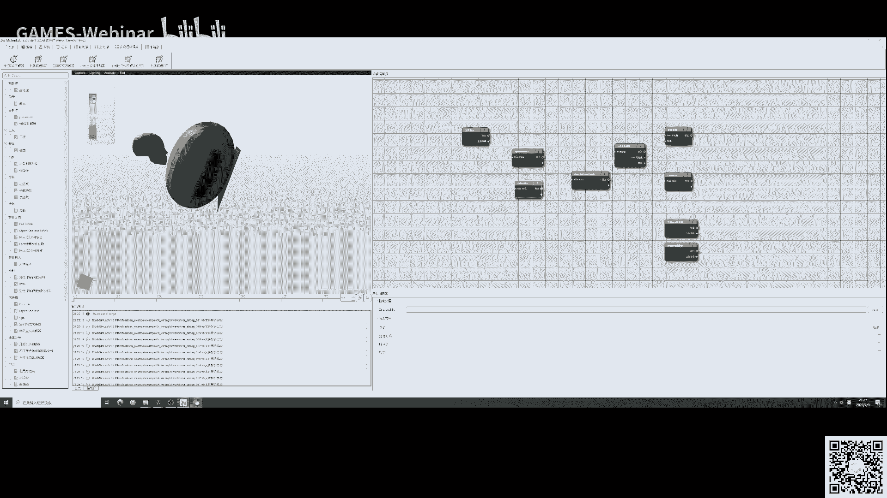

# GAMES401-泛动引擎(PeriDyno)物理仿真编程与实践 - P11：从PeriDyno到CAE软件增量集成开发平台MxSimLab 🚀

在本节课中，我们将学习如何从一个物理仿真引擎（PeriDyno）出发，构建一个面向CAE（计算机辅助工程）软件的增量集成开发平台——MxSimLab。我们将首先回顾有限元分析的基本方法，然后介绍从PeriDyno到MxSimLab的开发工作，最后通过软件演示展示其核心功能与应用。

---

## 一、有限元分析基础方法 🔧

上一节我们介绍了弹性力学的基本理论。本节中，我们来看看如何将这些理论转化为有限元分析的具体方法。为了便于理解，我们以最简单的弹簧单元为例。

### 1. 弹簧系统的力学分析原理

屏幕上展示了一个弹簧系统。其左端固定，右端受到一个力 **F**，从而产生一个伸长量 **Δ**。在弹性变形阶段，力与伸长量之间呈线性关系，即胡克定律：

**F = k * Δ**

其中，**k** 是弹簧的刚度系数。这个方程描述了弹簧变形的物理关系。

在有限元分析中，我们使用节点和单元来描述系统。我们将弹簧的两个端点定义为节点1和节点2。每个节点有其位移 **U** 和节点力 **F**。

*   **U₁**: 节点1的位移
*   **U₂**: 节点2的位移
*   **F₁**: 节点1的节点力
*   **F₂**: 节点2的节点力

根据胡克定律和系统平衡条件，我们可以建立方程组：

1.  **F₂ = k * (U₂ - U₁)**
2.  **F₁ + F₂ = 0** (系统平衡)

由此可以推导出：
*   **F₂ = k * (U₂ - U₁)**
*   **F₁ = -k * (U₂ - U₁) = k * (U₁ - U₂)**

### 2. 矩阵形式的平衡方程

在有限元分析中，通常将方程组写成矩阵形式，便于计算机编程实现。上述方程组可以表示为：

**[ [k, -k], [-k, k] ] * [ [U₁], [U₂] ] = [ [F₁], [F₂] ]**

简写为：

**K * U = F**

其中：
*   **K** 称为刚度矩阵，由材料物理特性决定。
*   **U** 是节点位移列阵。
*   **F** 是节点力列阵。

这个方程称为弹簧的平衡方程或刚度方程。无论多么复杂的有限元问题，最终都归结为求解 **K * U = F** 形式的方程组。

### 3. 多弹簧系统的组装

对于更复杂的系统，例如两个串联的弹簧，我们首先对每个单元独立分析，然后进行组装。

以下是构建整体平衡方程的步骤：

1.  **离散化与编号**：系统有三个节点（A, B, C）和两个弹簧单元。节点编号为1, 2, 3，单元编号为1, 2。
2.  **单元分析**：对每个弹簧单元，分别建立其2x2的单元刚度方程。
    *   单元1（连接节点1, 2）：**K₁ * [U₁, U₂]ᵀ = [F₁₁, F₂₁]ᵀ**
    *   单元2（连接节点2, 3）：**K₂ * [U₂, U₃]ᵀ = [F₂₂, F₃₂]ᵀ**
3.  **矩阵扩充**：将每个单元的2x2刚度矩阵，根据整体节点顺序（1,2,3）扩充为3x3矩阵，新增位置填充0。
4.  **整体组装**：将所有扩充后的单元刚度矩阵相加，得到整体刚度矩阵 **K_global**。同样，将节点力列阵也组装成整体列阵 **F_global**。最终得到整体平衡方程：**K_global * U_global = F_global**。

### 4. 引入边界条件与求解

建立整体方程后，需要引入边界条件才能求解。边界条件包括位移边界条件和力边界条件。

以两端固定的弹簧系统为例：
*   **位移边界**：节点1和节点3固定，即 **U₁ = 0**, **U₃ = 0**。
*   **力边界**：节点2受到外力 **F₂**，是已知量。

引入边界条件的方法之一是“划行划列法”：
1.  将位移已知为0的节点（如U₁, U₃）所对应的行和列从整体矩阵方程中删除。
2.  得到缩减后的方程组，仅包含未知位移（如U₂）和已知力（F₂）。
3.  求解这个缩减后的方程组，得到未知位移 **U₂ = F₂ / (k₁ + k₂)**。
4.  将求得的位移代回原方程，可以解出所有的节点力（包括支反力）。

### 5. 有限元程序的模块化实现

有限元程序可以高度模块化。以下是一个弹簧系统分析程序的核心函数示例：

*   **计算单元刚度矩阵**：
    ```python
    def element_stiffness(k):
        return np.array([[k, -k], [-k, k]])
    ```
    *输入弹簧系数k，返回2x2单元刚度矩阵。*

*   **组装整体刚度矩阵**：
    ```python
    def assemble_global_stiffness(K_global, k_element, node_i, node_j):
        # 将单元刚度矩阵 k_element 组装到整体矩阵 K_global 的对应位置 (node_i, node_j)
        K_global[node_i-1, node_i-1] += k_element[0,0]
        K_global[node_i-1, node_j-1] += k_element[0,1]
        K_global[node_j-1, node_i-1] += k_element[1,0]
        K_global[node_j-1, node_j-1] += k_element[1,1]
        return K_global
    ```
    *输入整体矩阵、单元矩阵、节点编号，实现矩阵组装。*

*   **计算节点力**：
    ```python
    def compute_nodal_force(K, U):
        return np.dot(K, U)
    ```
    *根据刚度矩阵K和位移U计算节点力F。*

通过调用这些模块化函数，可以构建完整的有限元分析流程：定义模型（节点、单元）、计算单元矩阵、组装整体矩阵、施加边界条件、求解方程组、计算内力。

---

## 二、从PeriDyno到MxSimLab：增量集成开发平台 🛠️

理解了有限元的基本流程后，我们回到本课程的核心：物理仿真引擎与编程。本节我们来看看如何基于PeriDyno，构建一个用于CAE软件开发的增量集成平台。

### 1. 开发动机与目标


当前CAE软件发展趋向于智能化、集成化、云端化与协同化。然而，国内自主CAE工业软件较少，从理论研究到产品级软件需要经历核心代码开发和软件集成封装。

MxSimLab的目标是构建一个满足**增量集成**需求的CAE软件框架，旨在解决行业内的低价值重复劳动，促进高质量软件开发。它希望满足不同场景下的多层次需求：

*   **学习与科研**：快速搭建面向特定行业的CAE软件原型，集成前处理、求解、后处理全流程。
*   **软件开发**：
    *   为已有的求解器快速提供前后处理功能，形成完整产品。
    *   为新的算法（如本构模型、单元公式）提供快速实现和测试平台。
*   **软件应用**：
    *   集成多种求解器（开源、自研、商业），方便用户在同一平台下对比不同软件的计算结果。
    *   探索在特定场景下替代商业软件的可能性。

### 2. MxSimLab的实现

MxSimLab围绕PeriDyno开源框架构建，继承了其**拖拽式、增量集成**的核心概念。


以下是开发过程中进行的主要工作：

1.  **扩充仿真数据域**：增加了CAE仿真所需的专有数据，如单元、节点、材料属性等。
2.  **开发核心算法模块**：基于PeriDyno的框架，开发了大量用于CAE仿真的`Module`和`Node`，实现高可复用性。
3.  **实现跨平台与自适应**：确保软件在不同硬件和操作系统上的适用性。
4.  **集成全流程软构件**：完成了从CAE前处理、求解器到后处理的各种功能模块的开发与集成。


最终，MxSimLab从一个增量开发框架，演进为一个适用于CAE软件开发的**开源底座**。

### 3. MxSimLab的框架优势

MxSimLab完全继承了PeriDyno的四层架构思想，并在Model层集成了丰富的仿真算法库：

*   **仿真与渲染分离**：采用独立的计算管线和渲染管线。
*   **仿真与交互分离**：交互操作不影响核心仿真逻辑。
*   **仿真与底层分离**：模块实现不依赖特定底层库，保证高可复用性。

这些分离特性使得各个仿真功能模块能够像“乐高积木”一样，在图形化场景中通过连接节点的方式，快速搭建出复杂的CAE仿真流程。


---

## 三、MxSimLab软件介绍与演示 🖥️

本节我们将进入MxSimLab软件，了解其界面并演示如何利用它进行CAE仿真分析。

### 1. 软件获取与资源

*   **开源地址**：代码托管于Gitee，可通过提供的网址访问并下载。
*   **交流群**：提供微信群二维码，方便用户交流编译、使用问题，研发人员会在群内提供支持。

软件界面风格针对CAE工程师习惯进行了调整，但整体布局与PeriDyno类似。左侧是节点树，包含了所有已开发的功能节点，涵盖前处理、单元计算、材料、求解器、后处理、渲染等。

### 2. 完整有限元分析流程演示

我们将演示一个完整的线性静力学分析流程：

**第一步：前处理 - 几何导入与网格划分**
1.  使用`Mesh Setup`节点指定CAD模型文件路径（如STEP格式）。
2.  使用`Mesh Engine`节点调用集成的开源网格划分引擎（如GMSH），设置网格类型（如四面体）和尺寸，生成有限元网格模型。

**第二步：前处理 - 定义分析属性**
1.  **材料定义**：使用`Material`节点，选择线弹性各向同性材料，设置杨氏模量和泊松比。
2.  **截面属性**：使用`Section`节点，创建实体截面，并将定义好的材料赋予该截面。
3.  **单元类型**：使用`Element`节点，为网格选择对应的单元类型（如C3D4，即四节点四面体单元）。
4.  **工况与边界**：
    *   使用`Load`节点，在模型表面施加集中力或压力。
    *   使用`BC`(Boundary Condition)节点，约束模型某些表面的所有自由度（模拟固定支撑）。

**第三步：求解文件生成与计算**
1.  **生成输入文件**：使用`Solver Input File`节点，接收前处理所有设置数据，生成特定求解器（如自研隐式求解器）能识别的计算文件。
2.  **调用求解器**：将生成的计算文件传递给`Solver`节点（如`Implicit Solver`），开始求解计算。

**第四步：后处理 - 结果可视化**
1.  **结果文件解析**：求解器通常会输出VTK格式的结果文件。使用`VTK File Reader`节点读取这些文件。
2.  **云图渲染**：将解析后的数据传递给`Color Mapping`等渲染节点，在软件主窗口查看应力、应变或位移的云图结果。

**整个流程**通过拖拽节点并连接其端口来搭建，形成一个清晰的、可视化的仿真工作流。

### 3. 集成开源求解器演示

MxSimLab的优势之一是能方便地集成第三方求解器。以集成显式动力学开源求解器`OpenRadioss`为例：

1.  **定制节点**：开发一个`OpenRadioss Solver`节点。
2.  **文件输入**：使用`File Input`节点，提供OpenRadioss所需的输入文件（如气囊展开模型）。
3.  **结果转换与可视化**：OpenRadioss的输出格式非VTK，因此开发一个转换节点，将其结果转为VTK格式，随后即可用标准的`VTK Reader`和`Color Mapping`节点进行可视化。

通过这种方式，用户可以在MxSimLab的统一界面下，方便地调用不同的开源或自研求解器，并利用平台提供的前后处理工具，快速完成仿真分析。

### 4. 平台的扩展性

MxSimLab支持多种扩展方式：
*   **基于代码的开发**：克隆模板工程，在C++层面开发新的功能模块。
*   **插件系统**：开发独立的插件动态库。
*   **Python二次开发（规划中）**：未来计划支持在软件界面内直接编写Python脚本节点，用于快速实现算法原型或特定计算。

---

## 总结 📚

本节课中，我们一起学习了以下内容：

1.  **有限元分析基础**：以弹簧系统为例，讲解了从物理方程到有限元离散化、单元分析、整体组装、引入边界条件并求解的完整流程，揭示了**K * U = F** 这一核心方程的意义。
2.  **MxSimLab的开发理念**：了解了基于PeriDyno构建CAE增量集成开发平台的动机，即解决重复劳动、满足学习、研发、应用的多层次需求，实现CAE软件的高效开发与集成。
3.  **MxSimLab软件应用**：通过演示，我们看到了如何利用该平台以图形化拖拽的方式，快速搭建包含前处理、求解、后处理的完整CAE分析流程，以及如何灵活集成第三方求解器。



本课程《GAMES401-泛动引擎物理仿真编程与实践》从PeriDyno的架构设计、基础物理仿真算法，讲到CAE算法与MxSimLab平台，旨在为大家打开从物理仿真到CAE仿真的大门，希望起到启蒙与启发的作用。


谢谢大家！