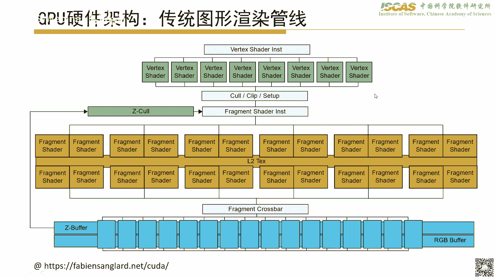
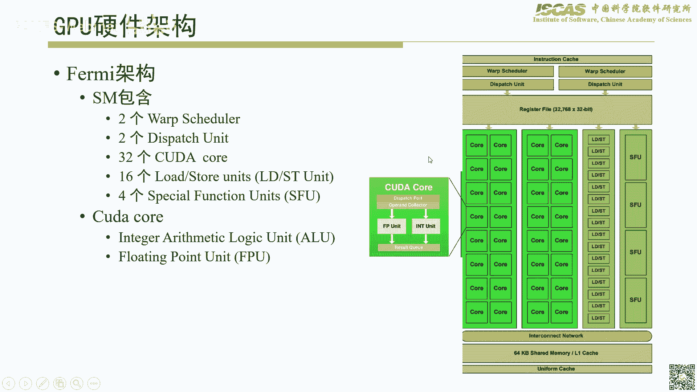
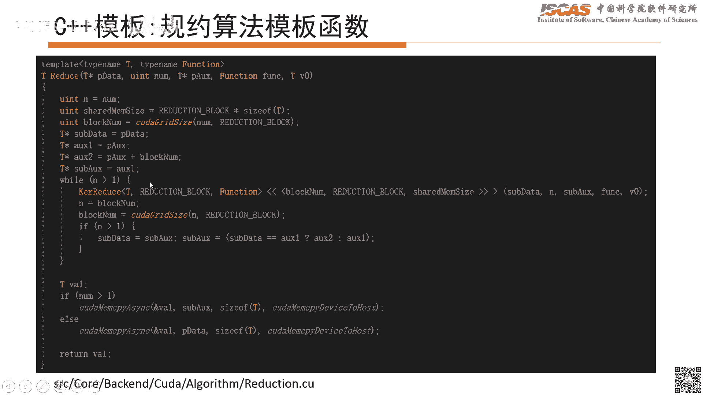
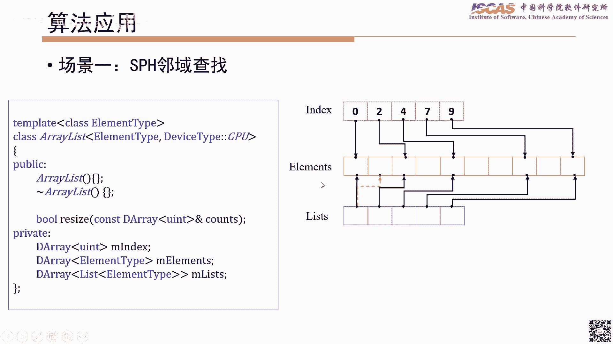
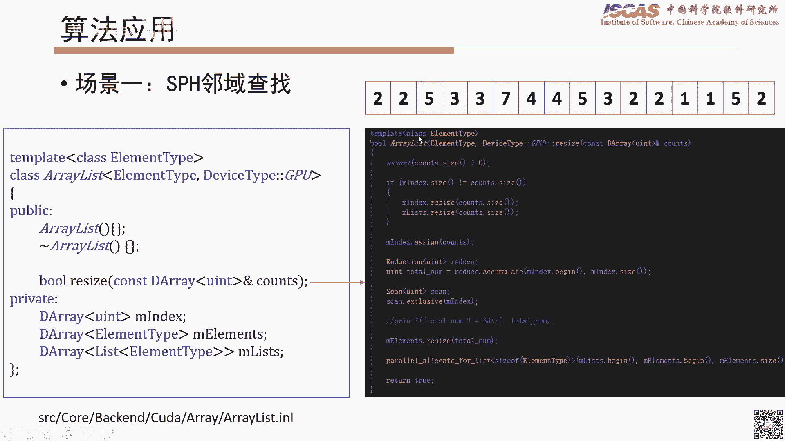
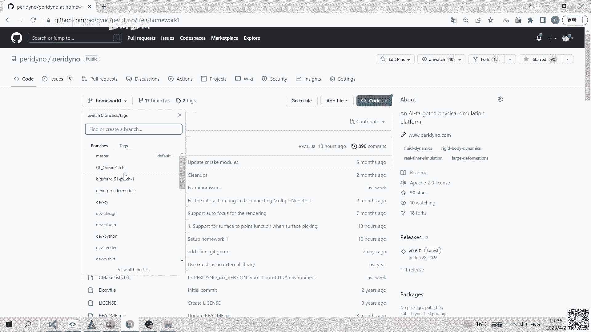
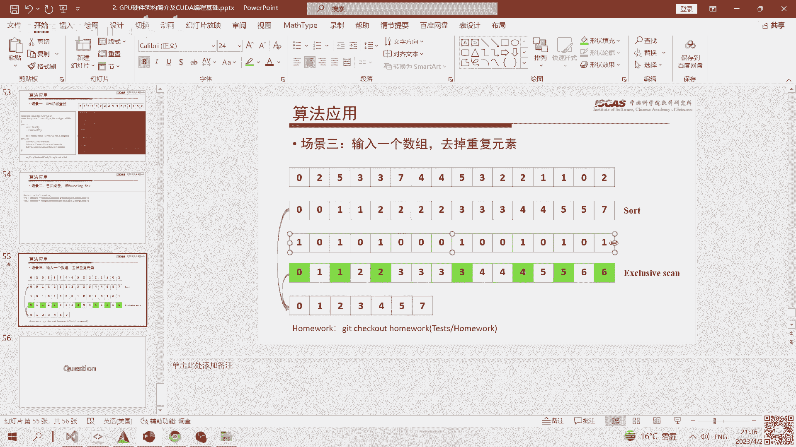
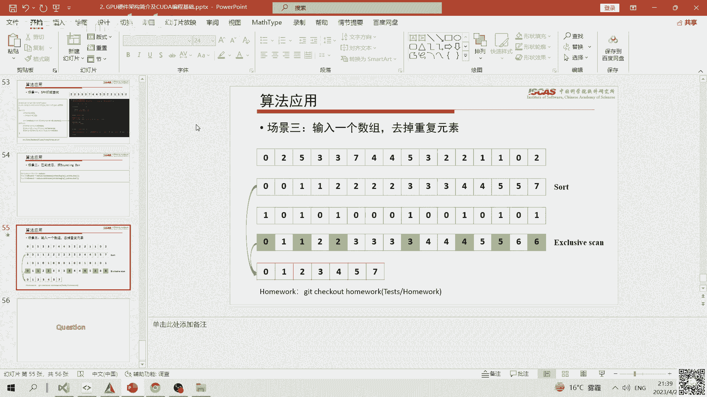
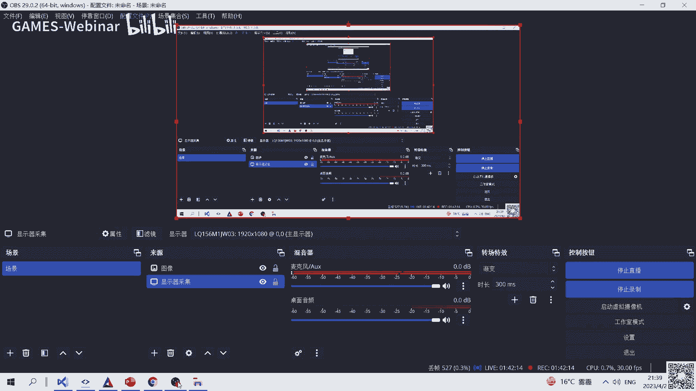

# GAMES401-泛动引擎(PeriDyno)物理仿真编程与实践 - P2：GPU硬件架构简介及CUDA编程基础 🚀

在本节课中，我们将学习GPU硬件架构的基本知识，并了解如何使用CUDA进行并行编程。课程内容涵盖GPU架构的发展历程、CUDA编程模型、以及两个在物理仿真中至关重要的并行算法：归约（Reduce）和前缀和（Scan）。我们还将探讨如何利用C++模板技术使算法更加通用，并介绍这些算法的典型应用场景。

## GPU硬件架构发展历程 📈

上一节我们介绍了课程概述，本节中我们来看看GPU硬件架构是如何演变的。

GPU的发展大致可分为两个阶段：2006年之前的传统图形处理器时代和2006年之后的通用计算GPU时代。



*   **2006年以前**：当时的GPU主要是为图形渲染设计的专用处理器。其功能管线（如顶点着色器、片元着色器）大多是固定的，虽然后期具备了一定的可编程能力，但本质上仍服务于图形处理，难以高效执行通用计算任务。
*   **2006年**：这是一个里程碑。英伟达发布了Tesla架构，统一了着色器模型，使GPU能够执行图形渲染以外的通用计算任务。更重要的是，它开始支持使用C语言进行编程，大大降低了开发门槛。
*   **2010年及以后**：随着Fermi架构的发布，GPU的通用计算架构日趋成熟。后续架构（如Kepler, Pascal, Volta, Ampere）主要在计算核心数量、能效比、以及对特定任务（如深度学习）的硬件支持上进行优化和增强。例如，最新的Ampere架构将传统的CUDA核心拆分为独立的整数（INT）和浮点（FP）计算单元，并引入了专门用于张量计算的Tensor Core。

## CPU与GPU架构对比 ⚙️


了解了GPU的发展后，我们将其与熟悉的CPU架构进行对比，以理解它们的设计哲学差异。

CPU的设计目标是处理复杂的、串行逻辑任务。其架构特点是**控制单元（Control）和计算核心（Core）的比例较高**，拥有强大的分支预测和复杂指令调度能力，以及大容量的多级缓存（L1, L2, L3）来减少数据访问延迟。



GPU的设计目标是处理大规模的、计算密集型的并行任务。其架构特点是**计算核心数量极多，但控制逻辑相对简单**。一个GPU由多个流式多处理器（Streaming Multiprocessor, SM）组成，每个SM又包含大量的CUDA核心（Streaming Processor, SP）。**一个控制单元需要管理多个计算核心**。


这种差异导致了它们各自擅长的领域：
*   **CPU**：擅长处理逻辑复杂、分支众多、串行性强的任务。
*   **GPU**：擅长处理数据并行度高、计算密集、分支简单的任务。

## 流式多处理器（SM）详解 🧠

上一节我们对比了CPU和GPU，本节中我们深入看看GPU的核心计算单元——流式多处理器。

SM是GPU执行计算任务的基本单位。虽然不同架构的SM内部结构略有差异，但核心组件基本一致：
*   **CUDA核心（CUDA Cores）**：执行基本的整数和浮点运算。
*   **特殊功能单元（SFU）**：执行超越函数（如sin, cos）等特殊运算。
*   **寄存器文件（Register File）**：为每个线程提供快速的私有存储空间。
*   **共享内存/一级缓存（Shared Memory / L1 Cache）**：一个SM内所有线程共享的低延迟、可编程的片上内存。
*   **只读缓存**：常量缓存（Constant Cache）和纹理缓存（Texture Cache），用于加速对只读数据的访问。
*   **调度器（Warp Scheduler）**：负责将指令分发给CUDA核心执行。

以Fermi架构的SM为例，它包含32个CUDA核心、2个Warp调度器、64K可配置的共享内存/L1缓存等。而Ampere架构则进一步将CUDA核心拆分为FP32和INT32单元，并加入了Tensor Core。

## CUDA编程模型 🧵

理解了硬件，我们来看看如何在软件层面组织计算，这就是CUDA编程模型。

CUDA采用**分层线程模型**，将计算任务组织成网格（Grid）、线程块（Block）和线程（Thread）三个层次，与GPU的硬件层次相对应：
*   **网格（Grid）**：对应整个GPU设备，包含多个线程块。
*   **线程块（Block）**：对应一个流式多处理器（SM）。一个Block内的线程可以协作，并通过共享内存通信。Block被调度到某个SM上执行，且一旦开始执行，通常不会迁移。
*   **线程（Thread）**：对应一个CUDA核心，是执行计算的最小单位。

在编写CUDA核函数（Kernel）时，我们需要指定Grid和Block的维度。例如，一个简单的向量加法核函数可能如下所示：
```cuda
__global__ void vectorAdd(float* A, float* B, float* C, int n) {
    int i = blockDim.x * blockIdx.x + threadIdx.x;
    if (i < n) {
        C[i] = A[i] + B[i];
    }
}
// 调用方式：vectorAdd<<<numBlocks, threadsPerBlock>>>(A, B, C, n);
```
这里，`threadIdx.x`, `blockIdx.x`, `blockDim.x` 是CUDA内置变量，用于计算每个线程的全局索引。

## Warp与执行效率 ⚡

在CUDA模型中，线程的执行并非完全独立，而是以**Warp（线程束）** 为单位进行调度。这是理解GPU性能优化的关键。

*   **Warp概念**：一个Warp是SM的基本执行单元，通常包含32个线程。SM以Warp为单位获取、调度和执行指令。
*   **Warp Divergence（线程束分化）**：如果一个Warp内的线程在执行时遇到分支（如if-else），并且部分线程走if路径，另一部分走else路径，那么SM必须**串行化**地执行这两条路径。这会导致部分CUDA核心闲置，严重降低性能。
    *   **优化策略**：尽量让同一个Warp内的线程执行相同的代码路径。可以通过重构算法或数据布局来减少分支分化。
*   **延迟隐藏（Latency Hiding）**：访问全局内存（Global Memory）有很高的延迟（数百个时钟周期）。如果线程只是等待数据，SM就会闲置。
    *   **优化策略**：SM通过快速切换执行不同的、就绪的Warp来隐藏这种延迟。因此，**提高SM的占用率（Occupancy）**，即让SM上有足够多的、可切换的Warp，是隐藏延迟的关键。这通常需要合理设置Block的大小和数量。

## GPU存储层次 🗃️

为了优化性能，必须理解GPU的多级存储层次。不同存储器的速度、容量和用法各不相同。

以下是GPU的主要存储类型，按速度从高到低排列：
*   **寄存器（Register）**：每个线程私有，速度最快，容量很小。用于存储局部变量。
*   **共享内存（Shared Memory）**：每个Block内共享，速度快，容量较小（通常几十KB）。是程序员可管理的高速缓存，用于线程间通信和数据复用。
*   **L1/L2缓存（Cache）**：硬件自动管理，对程序员透明。用于缓存全局内存和本地内存的访问。
*   **常量内存（Constant Memory）**：只读，全局可见，有专用缓存。适合存储需要被所有线程频繁读取的常量。
*   **纹理内存（Texture Memory）**：只读，为图形纹理访问优化，也有缓存。
*   **全局内存（Global Memory）**：GPU的显存，容量大（数GB），但延迟高，带宽也高。所有线程均可读写，是CPU与GPU数据交换的主要区域。
*   **本地内存（Local Memory）**：当寄存器不够用时，编译器会将局部变量溢出到本地内存，它实际位于全局内存中，速度很慢。

**编程建议**：频繁访问的数据应尽量放在寄存器或共享内存中；对全局内存的访问应尽量合并（Coalesced），即让一个Warp内的线程访问连续的内存地址，以最大化内存带宽利用率。

## 并行算法实例：归约（Reduce）🔢

掌握了基础概念后，我们来看一个核心的并行算法：归约（Reduce）。归约操作将一个数组的所有元素通过某种二元操作符（如加法、求最大值）合并成单个值。

在CPU上，归约是串行的，复杂度为O(N)。在GPU上，我们可以利用树形结构进行并行归约。

**基本思想（以求和为例）**：
1.  将数据从全局内存加载到共享内存。
2.  在共享内存中，进行迭代计算：第一轮，相邻元素两两相加；第二轮，将第一轮的结果再次两两相加；如此反复，直到得到最终结果。
3.  将结果写回全局内存。

一个简单的归约核函数框架如下：
```cuda
__global__ void reduceSum(float* input, float* output, int n) {
    extern __shared__ float sdata[]; // 动态声明共享内存
    unsigned int tid = threadIdx.x;
    unsigned int i = blockIdx.x * blockDim.x + threadIdx.x;
    // 1. 将全局内存数据加载到共享内存
    sdata[tid] = (i < n) ? input[i] : 0;
    __syncthreads(); // 确保Block内所有线程完成加载
    // 2. 在共享内存中进行树形归约
    for (unsigned int s = blockDim.x / 2; s > 0; s >>= 1) {
        if (tid < s) {
            sdata[tid] += sdata[tid + s];
        }
        __syncthreads(); // 每轮计算后都需要同步
    }
    // 3. 将结果写回全局内存（每个Block一个结果）
    if (tid == 0) {
        output[blockIdx.x] = sdata[0];
    }
}
```
**性能优化点**：
*   **使用共享内存**：大幅减少对高延迟全局内存的访问。
*   **避免Bank Conflict**：共享内存被组织成多个Bank。如果一个Warp内的多个线程同时访问同一个Bank的不同地址，就会发生冲突，导致串行访问。通过调整数据访问模式（例如，使用交错索引）可以避免冲突。
*   **处理大规模数据**：上述核函数每个Block产生一个部分和。如果数据量巨大，需要多个Block，则可以在CPU或另一个GPU核函数中对这些部分和进行第二次归约。

## 并行算法实例：前缀和（Scan）📊

另一个极其重要的并行算法是前缀和（Scan），也称为并行前缀扫描。它计算数组的所有部分和。

给定输入数组 `[a0, a1, a2, ...]`，其前缀和输出数组为 `[a0, a0+a1, a0+a1+a2, ...]`。它有两种形式：包含式（Inclusive）和排除式（Exclusive）。

这里介绍经典的**Blelloch Scan算法**，它包含两个阶段：
1.  **向上扫描（Reduce Phase）**：与归约算法类似，构建一棵二叉树，将子节点的值向上传递并求和到父节点。最终，树的根节点包含了所有元素的总和。
2.  **向下扫描（Down-Sweep Phase）**：从根节点开始，将值向下传递。具体规则是：将父节点的值赋给右子节点，并将父节点的旧值与左子节点的值相加后赋给左子节点。经过这一阶段后，叶子节点就存储了最终的前缀和结果。

GPU实现同样需要利用共享内存，并注意Bank Conflict和线程利用率的问题。CUDA工具包中提供了高度优化的`thrust::inclusive_scan`和`thrust::exclusive_scan`函数。

## C++模板编程与算法泛化 🧩

为了让归约和前缀和算法能适用于不同的数据类型（int, float, double等）和不同的操作（加、乘、求最大值等），我们可以使用C++模板技术。


**模板函数**允许我们编写与类型无关的代码。例如，一个泛化的归约核函数可能如下所示：
```cpp
template <typename T, typename BinaryOp>
__global__ void genericReduce(T* input, T* output, int n, BinaryOp op) {
    extern __shared__ char shared_mem[];
    T* sdata = reinterpret_cast<T*>(shared_mem);
    unsigned int tid = threadIdx.x;
    unsigned int i = blockIdx.x * blockDim.x + threadIdx.x;
    sdata[tid] = (i < n) ? input[i] : op.identity(); // 使用操作符的单位元
    __syncthreads();
    for (unsigned int s = blockDim.x / 2; s > 0; s >>= 1) {
        if (tid < s) {
            sdata[tid] = op(sdata[tid], sdata[tid + s]); // 使用传入的操作符
        }
        __syncthreads();
    }
    if (tid == 0) {
        output[blockIdx.x] = sdata[0];
    }
}
// 定义加法操作符
struct AddOp {
    template <typename T>
    __device__ T operator()(const T& a, const T& b) const { return a + b; }
    template <typename T>
    __device__ T identity() const { return T(0); }
};
// 调用
genericReduce<<<blocks, threads, sharedMemSize>>>(d_in, d_out, n, AddOp());
```
通过模板和函数对象（Functor），我们可以轻松地将算法应用于任何定义了相应操作的类型。



## 算法应用场景 🎯

最后，我们看看归约和前缀和算法在物理仿真中的典型应用。



以下是几个关键的应用场景：
*   **SPH模拟中的邻居查找**：在平滑粒子流体动力学中，需要为每个粒子查找其邻近粒子。一种高效的数据结构（如`CompactArrayList`）使用前缀和算法来分配存储空间，并使用归约算法来统计总邻居数。
*   **计算包围盒（Bounding Box）**：给定大量顶点，需要计算整个点集的轴对齐包围盒（AABB）。这可以通过两个归约操作完成：一个求所有点的最小分量（Min），另一个求最大分量（Max）。
*   **数组去重**：对排序后的数组进行去重操作。首先，通过比较相邻元素生成一个标记数组（不同为1，相同为0）。然后，对这个标记数组做前缀和，其结果即为去重后元素在新数组中的索引。最后，根据索引将元素散射到新数组中。



## 总结 📝

本节课中我们一起学习了GPU并行编程的基础知识。我们从GPU硬件架构的发展与核心特点出发，对比了CPU与GPU的设计哲学。深入探讨了CUDA编程模型，理解了线程、Block、Grid、Warp等核心概念，以及Warp Divergence和延迟隐藏对性能的影响。







我们重点剖析了GPU的存储层次，并学习了如何利用共享内存等快速存储器来优化程序。通过归约（Reduce）和前缀和（Scan）这两个经典并行算法的实例，我们掌握了在GPU上设计和实现高效并行算法的基本方法。最后，我们介绍了如何使用C++模板技术来泛化算法，并探讨了这些算法在物理仿真中的实际应用场景。






理解这些基础是进行高性能GPU物理仿真算法研发的关键。在后续的课程和实践中，我们将反复运用这些概念和技术。