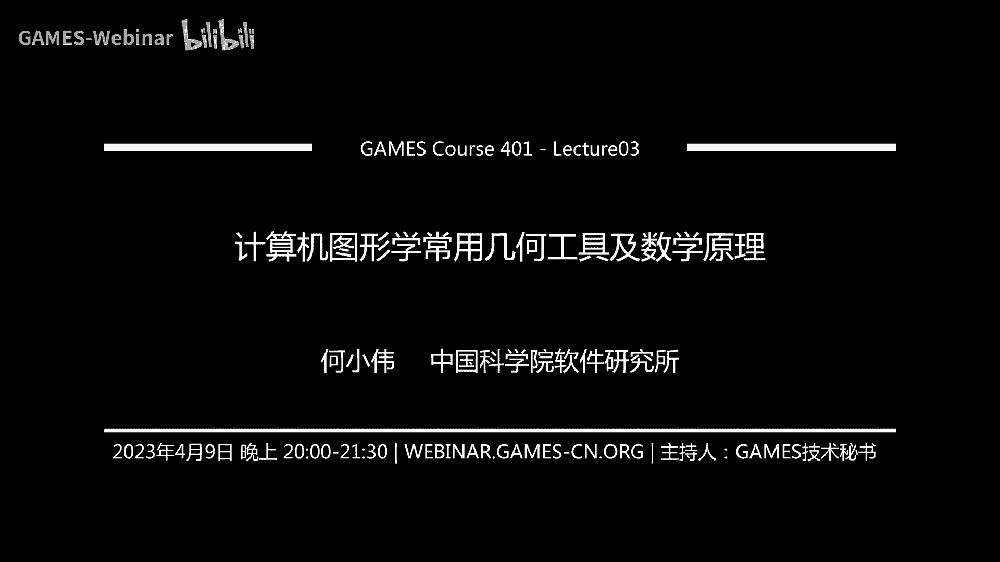

# GAMES401-泛动引擎(PeriDyno)物理仿真编程与实践 - P3：计算机图形学常用几何工具及数学原理 📐

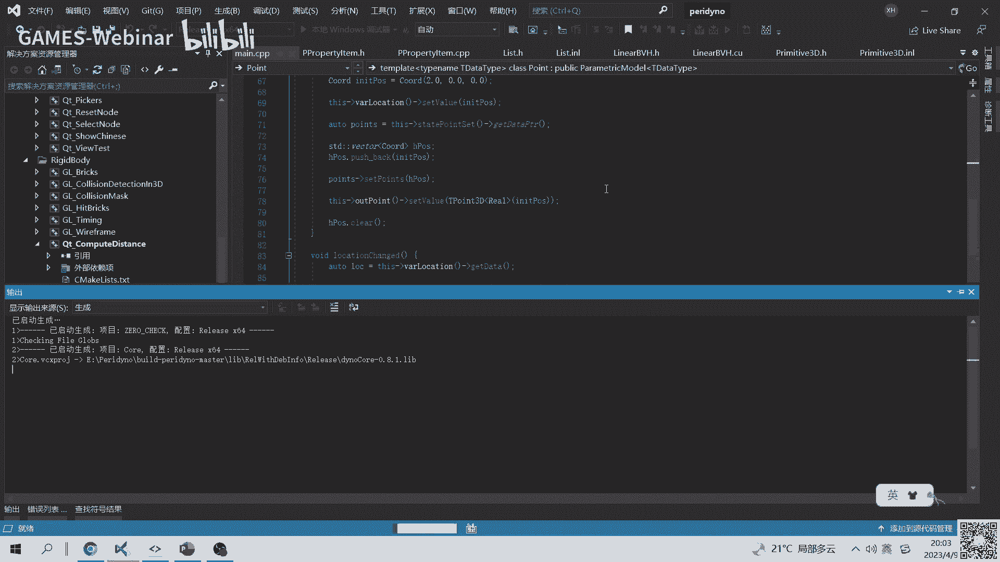

在本节课中，我们将学习物理仿真中至关重要的几何工具与数学基础。主要内容包括向量代数与张量分析的基本概念、三维空间中常见几何图元的定义与表示方法，以及点到各类图元的距离计算和相交测试的核心算法。这些知识是后续进行刚体、流体和弹性体仿真的基石。

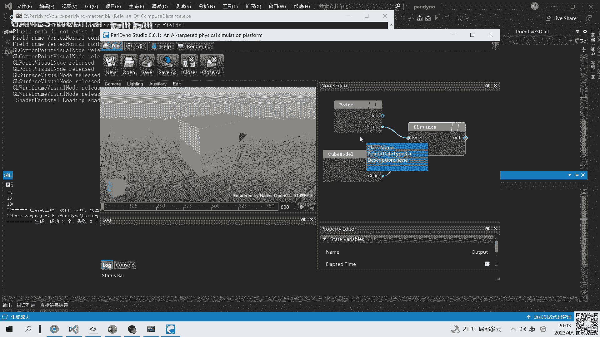

## 概述

上一节我们介绍了编程相关的基础知识。本节将聚焦于仿真中涉及的大量几何基础内容。由于几何学涵盖广泛，我们无法面面俱到，主要讲解与后续课程（如刚体、SPH流体、弹性体）相关的核心几何概念。

为了让大家有一个直观的感受，我们先演示一个辅助程序。这个程序可以交互式地测试一个点到OBB（有向包围盒）的距离计算，通过实时调整OBB的方向并可视化最近点连线，方便我们调试和理解算法。

接下来，我们将从理论基础开始，逐步深入。

## 第一部分：数学基础——向量代数与张量分析

这部分内容是后续所有计算的数学语言。虽然每个主题都足以单独讲授一节课，但我们会快速回顾关键概念和符号，以便后续使用。

### 向量代数基础

向量运算最好与几何直观联系起来理解。以下是几种基本运算：

*   **向量加减法**：`A + B` 或 `A - B`。几何上对应平行四边形法则或连接向量端点的线段。
*   **点积（内积）**：`A · B = |A||B|cosθ`。结果是一个标量，可以衡量两个向量的相似程度或投影长度。
*   **叉积（外积）**：`A × B`。结果是一个新的向量，其方向垂直于A和B构成的平面，遵循右手定则。
*   **三重积**：`A · (B × C)`。其绝对值等于以A, B, C为边的平行六面体的体积。

**注意**：点积满足交换律，但叉积不满足交换律（`A × B = - (B × A)`）。

### 张量分析简介

在论文中常见张量符号。张量可以按阶数分类：

*   **0阶张量**：标量，通常用斜体小写字母表示，如 `a`。
*   **1阶张量**：向量，通常用粗体小写字母表示，如 **`a`**。
*   **2阶张量**：矩阵，通常用粗体大写字母表示，如 **`A`**。
*   更高阶张量：例如，在弹性力学中，应力-应变关系可能用一个4阶张量描述。

**爱因斯坦求和约定** 是一种简写标记法，在实现时非常实用。它规定：当一项中有重复的指标时，意味着对该指标的所有可能值求和。例如，矩阵乘法 `C = A · B` 的分量形式为：
`C_ij = Σ_k A_ik * B_kj`
在爱因斯坦约定下，求和符号Σ被省略，写为：`C_ij = A_ik B_kj`，其中 `k` 是重复的“哑指标”。

以下是张量的几种基本运算（以二阶张量为例）：
*   **和/差**：`C_ij = A_ij ± B_ij`
*   **标量乘法**：`B_ij = λ A_ij`
*   **点积（缩并）**：`C_ij = A_ik B_kj` （对哑指标 `k` 求和）
*   **双点积（缩并）**：`s = A_ij B_ij` （结果为一个标量）
*   **并矢**：`T_ij = a_i b_j` （将两个向量组合成二阶张量）
*   **转置**：`B_ij = A_ji`

**推荐阅读**：黄克智老师的《张量分析》是深入学习仿真数学基础的优秀教材。

## 第二部分：三维空间基本几何图元

本节我们来看看三维仿真中常见的基本几何图元及其表示方法。每种图元我们都从几何表示、代码定义和参数化形式三个方面描述。

### 点 (Point)
*   **几何表示**：空间中的一个位置。
*   **代码定义**：`Vector3f pos(x, y, z)`
*   **参数化形式**：`P = (x, y, z)`
*   **说明**：虽然与三维向量结构相似，但单独定义`Point`类有助于区分位置和方向，并实现特定的几何运算。

### 线性结构：直线、射线、线段
这三者在定义上具有统一性，核心区别在于参数 `t` 的取值范围。

*   **直线 (Line)**
    *   **几何表示**：一个原点 `O` 和一个方向向量 **`d`**。
    *   **代码定义**：`{ Vector3f origin; Vector3f direction; }`
    *   **参数化形式**：`P(t) = O + t * d`, `t ∈ (-∞, +∞)`

*   **射线 (Ray)**
    *   **几何表示**：一个起点 `O` 和一个方向向量 **`d`**。
    *   **代码定义**：`{ Vector3f origin; Vector3f direction; }` (与直线相同，通过语义区分)
    *   **参数化形式**：`P(t) = O + t * d`, `t ∈ [0, +∞)`

*   **线段 (Segment)**
    *   **几何表示**：两个端点 `V0` 和 `V1`。
    *   **代码定义**：`{ Vector3f v0; Vector3f v1; }`
    *   **参数化形式**：`P(t) = (1 - t) * V0 + t * V1`, `t ∈ [0, 1]`

### 平面结构：平面与三角形

*   **平面 (Plane)**
    *   **几何表示**：一个原点 `O` 和一个法向量 **`n`**。
    *   **代码定义**：`{ Vector3f origin; Vector3f normal; }`
    *   **参数化/隐式形式**：对于平面上任意点 `P`，满足 `(P - O) · n = 0`。可化为标准形式 `ax + by + cz + d = 0`，其中 `(a, b, c)` 为法向量。

*   **三角形 (Triangle)**
    *   **几何表示**：三个顶点 `V0, V1, V2`。
    *   **代码定义**：`Vector3f v[3];`
    *   **参数化形式**：`P(s, t) = V0 + s * (V1 - V0) + t * (V2 - V0)`，其中 `s >= 0`, `t >= 0`, `s + t <= 1`。
    *   **重要约定**：顶点顺序通常约定为**逆时针**方向，这用于定义面的正方向（外法向），在碰撞检测中至关重要。

### 体结构：球、胶囊体、四面体、包围盒

*   **球 (Sphere)**
    *   **几何表示**：中心点 `C` 和半径 `r`。
    *   **代码定义**：`{ Vector3f center; float radius; }`
    *   **隐式形式**：对于球面上任意点 `P`，满足 `|P - C| = r`。

*   **胶囊体 (Capsule)**
    *   **几何表示**：一条线段（中心线）`V0-V1` 和半径 `r`。表面点到中心线的距离恒为 `r`。
    *   **代码定义**：`{ Segment segment; float radius; }`
    *   **说明**：在游戏引擎中广泛应用（如布娃娃系统），计算高效且能近似表示长条形物体。

*   **四面体 (Tetrahedron)**
    *   **几何表示**：四个顶点 `V0, V1, V2, V3`。
    *   **代码定义**：`Vector3f v[4];`
    *   **参数化形式**：`P(u, v, w) = V0 + u*(V1-V0) + v*(V2-V0) + w*(V3-V0)`，其中 `u, v, w >= 0` 且 `u+v+w <= 1`。
    *   **注意**：顶点编号顺序影响计算出的体积正负，需要保持一致。

*   **AABB (轴对齐包围盒)**
    *   **几何表示**：分别与XYZ轴对齐的最小点 `min` 和最大点 `max`。
    *   **代码定义**：`{ Vector3f min_corner; Vector3f max_corner; }`
    *   **说明**：计算简单，常用于碰撞检测的初步（粗略）阶段，以快速剔除不可能相交的物体对。

*   **OBB (有向包围盒)**
    *   **几何表示**：一个中心点 `C`，三个相互垂直的轴向量 **`u`, `v`, `w`**（定义局部坐标系），以及在各轴上的半长 `extent`。
    *   **代码定义**：`{ Vector3f center; Vector3f axes[3]; Vector3f extent; }`
    *   **说明**：是AABB的旋转版本，能提供更紧密的包围，但计算稍复杂。其变换矩阵 `T` 包含旋转（`axes`）和平移（`center`）。

## 第三部分：距离计算

距离计算是物理仿真中的核心操作之一。本节主要讲解**点**到其他各类图元的距离计算方法。思路通常是先找到点在目标图元上的最近点（投影点），再计算两点间的距离。

### 点到点
计算两点 `P` 和 `Q` 的向量差，然后求模：`distance = |P - Q|`。实践中常计算平方距离 `distance² = (P - Q)·(P - Q)` 以避免开方运算。

### 点到线性结构（直线/射线/线段）
基于统一的参数化思想。给定点 `P` 和线性结构 `L(t) = O + t*d`（对于线段，`O=V0`, `d=V1-V0`）。

1.  **计算投影参数**：`t = ( (P - O) · d ) / (d · d)`。这里不要求 `d` 是单位向量，避免了归一化开销。
2.  **根据类型截断t**：
    *   **直线**：无需截断，`t_clamped = t`。
    *   **射线**：`t_clamped = max(t, 0)`。
    *   **线段**：`t_clamped = clamp(t, 0, 1)`。
3.  **计算最近点及距离**：最近点 `Q = O + t_clamped * d`。距离 `dist = |P - Q|`。

### 点到平面
给定点 `P` 和平面 `(O, n)`。
1.  **计算有符号距离**：`signed_dist = ( (P - O) · n ) / |n|`。若 `n` 已归一化，则分母为1。
2.  **最近点**：`Q = P - signed_dist * n`（这里 `n` 需是单位向量）。
**有符号距离的意义**：符号表明点位于法向量指向的正面（正）还是反面（负），这在碰撞响应中非常有用。

### 点到三角形
这是一个约束优化问题：在条件 `s>=0, t>=0, s+t<=1` 下，最小化 `|P - (V0 + s*e0 + t*e1)|²`，其中 `e0=V1-V0`, `e1=V2-V0`。

1.  **解无约束问题**：通过令梯度为0，求解线性方程组得到 `(s, t)`。这对应点 `P` 在三角形所在平面上的投影点参数。
2.  **区域判定与截断**：根据解得的 `(s, t)` 判断投影点位于三角形内部、边上还是角点外。共有7个区域（三角形内1个，三条边外侧3个，三个角点外侧3个）。通过判断 `s, t, s+t` 与0、1的关系来确定区域。
3.  **计算最近点**：
    *   若在内部，投影点即为最近点。
    *   若在边区域，则转化为**点到线段**的距离问题。
    *   若在角点区域，则该角点即为最近点。

### 点到其他图元
*   **点到球**：`distance = |P - C| - r`。结果同样为有符号距离（内部为负）。
*   **点到胶囊体**：先计算点 `P` 到中心线线段的距离 `dist_to_segment`，则 `distance = dist_to_segment - r`。
*   **点到四面体**：可转化为点到四个面的距离计算。一个优化策略是：若点位于某个面的“外侧”（即在该面定义的半空间外），则该面不可能是最近面；通过检查点相对于四个面的位置，可以减少计算量。
*   **点到AABB/OBB**：
    *   **AABB**：分别在XYZ轴上将点坐标钳制到 `[min, max]` 区间，得到最近点。
    *   **OBB**：将点变换到OBB的局部坐标系（乘以变换矩阵 `T` 的逆），此时问题转化为在局部坐标系下计算点到AABB的距离，再将结果变换回世界坐标系。

## 第四部分：相交测试

相交测试在刚体碰撞检测等领域至关重要。动态物体的连续运动可以看作一个线性结构（线段），因此**线性结构与图元的相交测试**是许多复杂检测的基础。

### 直线与平面相交
给定直线 `L(t) = O + t*d` 和平面 `(N, D)`（其中 `N` 为法向量，`D` 为常数项，平面方程为 `N·X + D = 0`）。

1.  将直线方程代入平面方程：`N·(O + t*d) + D = 0`。
2.  求解 `t`：`t = -(N·O + D) / (N·d)`。
3.  **特殊情况处理**：若 `N·d = 0`，则直线与平面平行。若此时 `N·O + D = 0`，则直线在平面内；否则，直线与平面无交点。

### 直线与球相交
给定直线 `L(t) = O + t*d` 和球 `(C, r)`。等价于求解方程 `|O + t*d - C|² = r²`。

1.  这是一个关于 `t` 的一元二次方程：`(d·d)t² + 2d·(O-C)t + (O-C)·(O-C) - r² = 0`。
2.  计算判别式 `Δ`：
    *   `Δ > 0`：两个实根，直线穿过球体，有两个交点。
    *   `Δ = 0`：一个实根（重根），直线与球相切。
    *   `Δ < 0`：无实根，直线与球无交点。
3.  根据 `t` 的取值范围（直线、射线或线段），进一步确定有效的交点区间。

## 第五部分：场景搭建与可视化调试

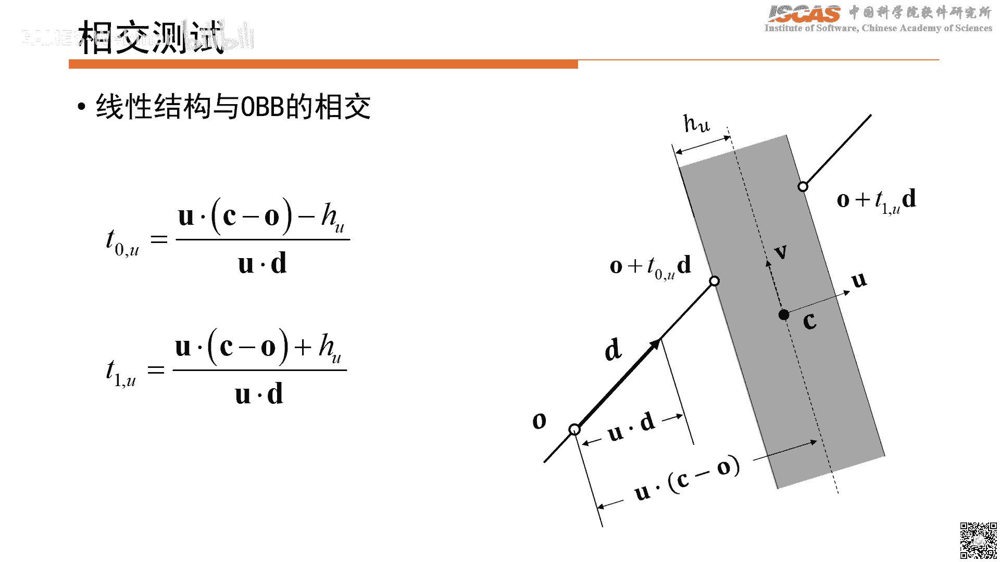

理论最终需要代码实现。在PeriDyno框架中，我们可以搭建可视化场景来直观地调试几何算法，例如本节开头演示的点到OBB距离测试程序。

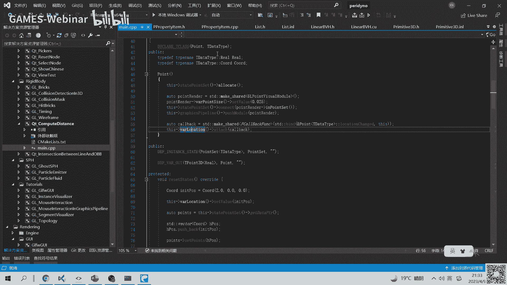

以下是构建此类调试场景的基本思路：

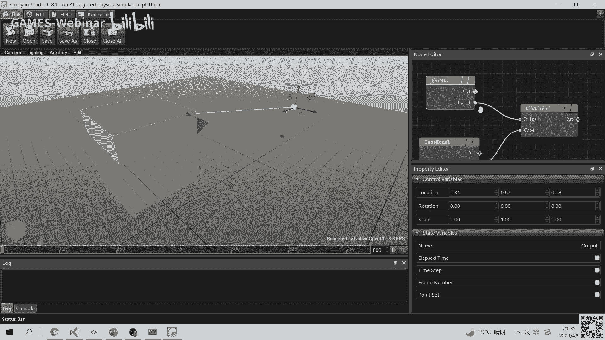

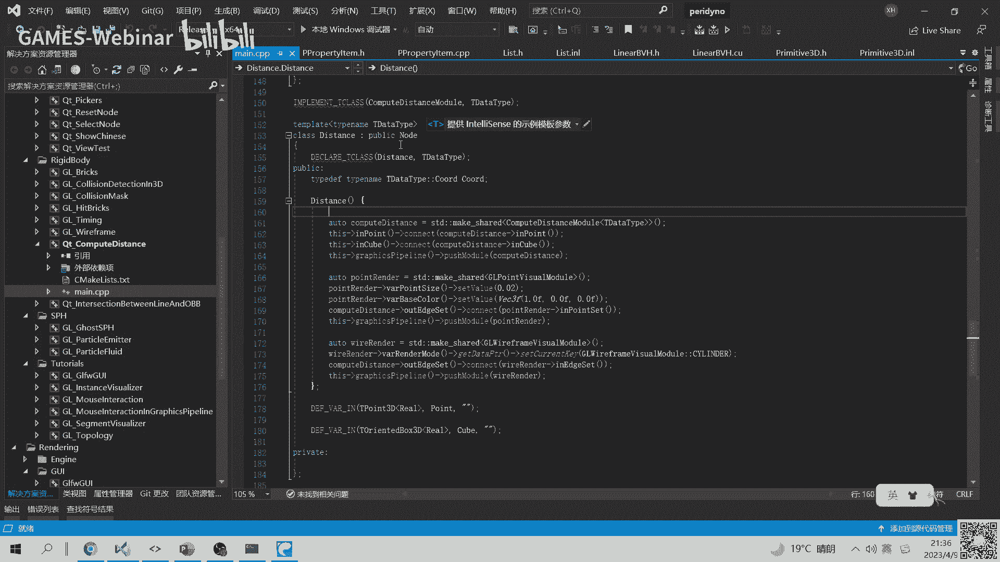

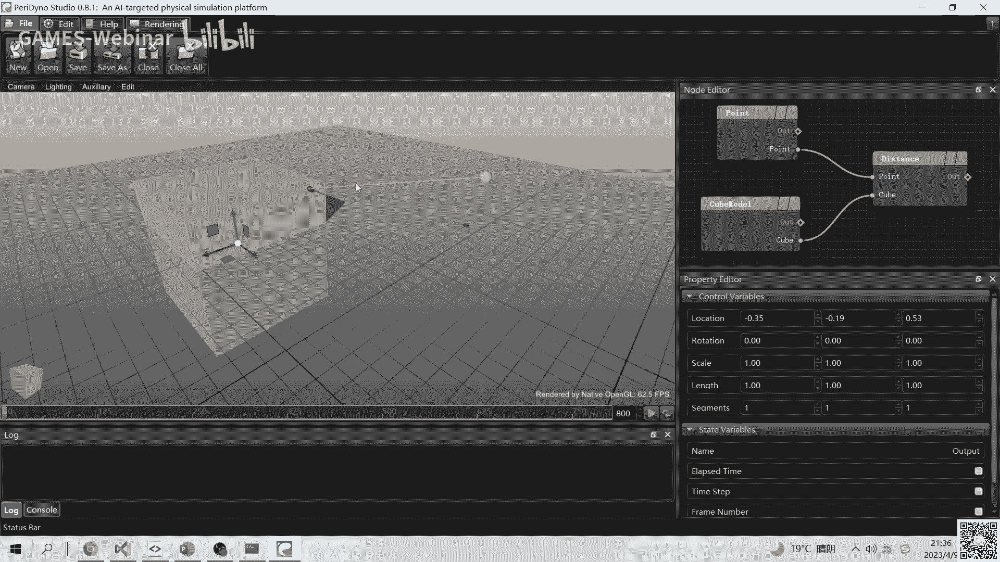

1.  **创建几何图元节点**：例如，创建一个 `OBB` 节点并设置其初始位置、轴向和大小。
2.  **创建测试点节点**：例如，创建一个 `Point` 节点。
3.  **创建计算节点**：编写一个自定义节点，其输入为 `OBB` 和 `Point`，内部实现点到OBB的距离算法，输出最近点对和距离值。
4.  **创建可视化节点**：使用 `Line` 或 `Segment` 渲染节点，将计算节点输出的最近点对连接起来并显示。
5.  **添加交互控件**：通过UI控件（如滑块、旋转器）动态修改OBB的方向或点的位置，观察最近点连线的实时变化。

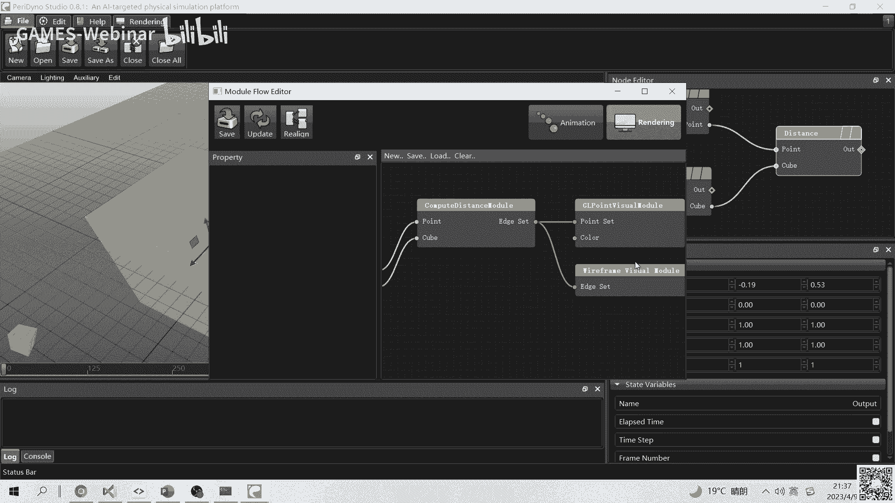

这种可视化调试方法能有效验证算法在各种边界情况（如最近点在面、边、角点上）下的正确性。

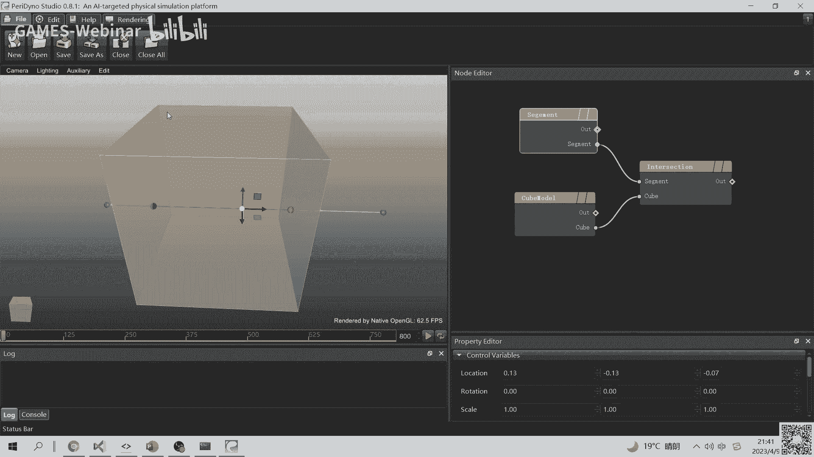

## 总结

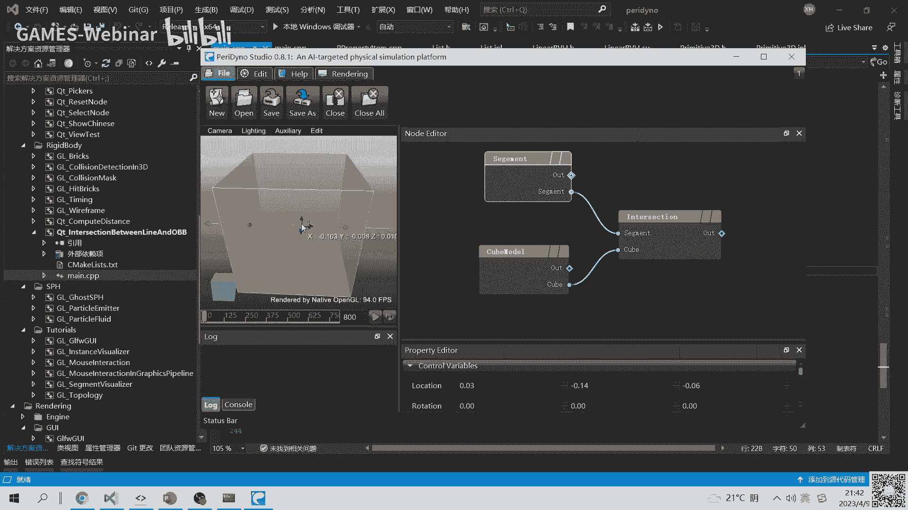

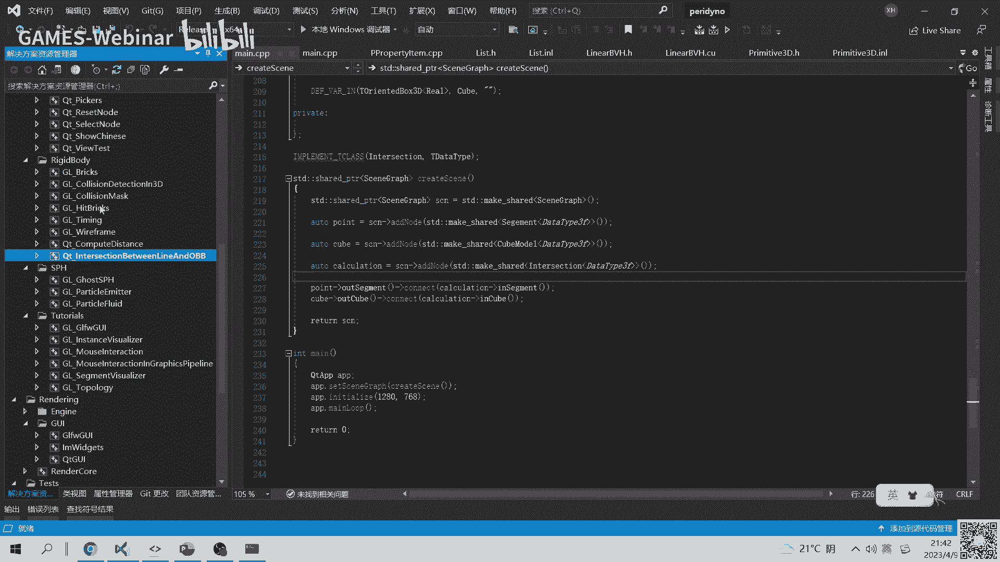

本节课我们一起学习了物理仿真编程中必备的几何与数学工具。我们回顾了向量和张量的基本运算，熟悉了三维空间中点、线、面、体等基本图元的定义与表示方法。然后，我们深入探讨了点到各类图元的距离计算算法，理解了其核心在于寻找最近点和处理参数边界。最后，我们介绍了线性结构与平面、球的相交测试原理，并了解了如何利用可视化场景进行算法调试。

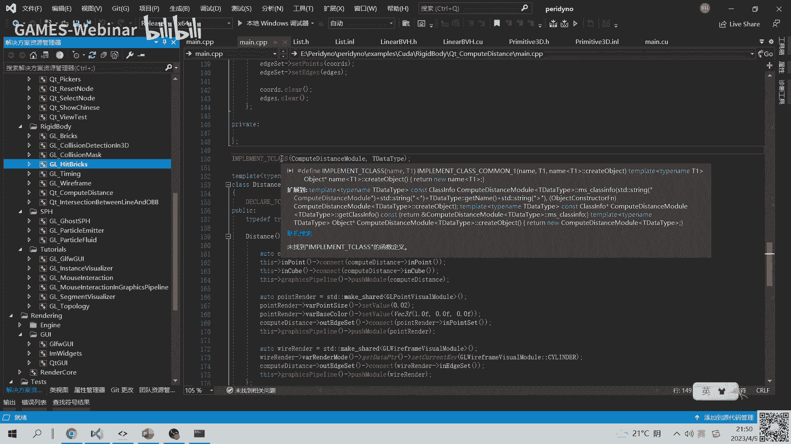

掌握这些基础几何操作，将为后续实现刚体碰撞、流体模拟和弹性体变形等复杂的物理仿真效果打下坚实的基础。