# GAMES401-泛动引擎(PeriDyno)物理仿真编程与实践 - P4：刚体动力学并行编程与实践 🧱

在本节课中，我们将要学习刚体动力学的基础知识，并重点探讨如何在GPU上并行处理包含大量刚体的复杂场景。课程将涵盖从基础物理量到碰撞检测、约束求解的完整流程，并介绍关键的并行加速算法。

## 刚体动力学基础回顾

上一节我们介绍了质点动力学，本节中我们来看看更复杂的刚体动力学。刚体与质点的核心区别在于，刚体具有形状和体积，因此其运动状态不仅包括平移，还包括旋转。

刚体运动所需的核心物理量如下：
*   **质量**：与质点不同，刚体的质量分布用**质量张量**描述。
*   **位置与旋转**：位置用向量 **x** 表示，旋转姿态可以用旋转矩阵 **R** 或四元数 **q** 描述。
*   **速度与角速度**：平移速度 **v**，旋转角速度 **ω**。
*   **外力与扭矩**：作用在刚体上的力 **F** 和扭矩 **τ**。

刚体的运动方程是质点方程的扩展，包含平移和旋转两部分：

**平移运动**：
`M * dv/dt = F`

**旋转运动**：
`I * dω/dt = τ`

其中，**M** 是质量张量，**I** 是惯性张量。更新旋转姿态（四元数 **q**）的公式较为特殊：
`dq/dt = 0.5 * ω * q`

这里，`ω` 需要被扩展为四元数形式 `(0, ω_x, ω_y, ω_z)`，`*` 表示四元数乘法。

刚体仿真的核心流程可以概括为两个主要阶段：**碰撞检测** 和 **约束求解**。碰撞检测负责找出哪些物体发生了接触，而约束求解则计算接触力，确保物体不会相互穿透。

## 碰撞检测：宽阶段

碰撞检测的第一步是“宽阶段”，其目的是快速剔除掉那些明显不可能发生碰撞的物体对，从而减少后续精确检测的计算量。本节中我们来看看实现宽阶段加速的关键技术。


### 包围盒技术

为了加速碰撞检测，我们通常用简单的几何体（包围盒）来近似复杂的物体模型。常见的包围盒类型有：
*   **轴对齐包围盒**：边与坐标轴对齐的长方体，计算最简单。
*   **有向包围盒**：可旋转的长方体，能更紧密地包裹物体。
*   **包围球**：用球体包裹物体。


在并行计算中，**轴对齐包围盒** 因其计算简单高效而被广泛使用。

### 空间划分算法

有了包围盒后，我们需要高效的算法来找出所有相交的包围盒对。传统的CPU算法（如排序扫描算法）不适合GPU并行执行，因为其涉及动态数据结构和顺序扫描。

对于GPU并行，更合适的结构是**层次化包围盒**。它通过构建一棵二叉树来组织空间中的物体，每个树节点存储一个能包围其所有子节点的包围盒。这种结构存储开销低（约 `2n-1` 个节点，n为物体数），且便于并行构建和遍历。

### Linear BVH：GPU并行构建层次包围盒

本节重点介绍一种适合GPU的并行层次包围盒构建算法——**Linear BVH**。其核心思想是利用**莫顿码**将空间上邻近的物体，映射到内存中连续的位置。

**莫顿码**通过对物体中心坐标的二进制位进行交错编码生成。例如，一个二维点 `(x, y)`，其莫顿码 `M = interleave(x_bits, y_bits)`。对物体按莫顿码排序后，空间上邻近的物体在内存中也基本连续。

以下是Linear BVH并行构建的关键步骤：
1.  **计算莫顿码并排序**：为每个物体的包围盒中心计算莫顿码，并据此对物体进行排序。
2.  **确定节点区间**：对于每个内部节点（共 `n-1` 个），算法并行地确定其代表的叶子节点区间 `[i, j]`。
3.  **寻找分裂位置**：在区间 `[i, j]` 内，找到莫顿码的**最长公共前缀**首次发生变化的位置 `k`。该位置将区间分裂为左右子树 `[i, k]` 和 `[k+1, j]`。
4.  **并行构建包围盒**：采用从叶子到根节点的“自底向上”方式并行构建每个节点的包围盒。使用原子操作确保每个内部节点只被计算一次。

构建包围盒的核心并行代码逻辑如下（伪代码）：
```cpp
// 每个线程处理一个内部节点
for each internal node i in parallel:
    // 使用原子操作标记该节点已被访问
    int old_val = atomicCAS(&node[i].visited, 0, 1);
    if (old_val == 0) {
        // 第一个访问该节点的线程（来自左子树）等待
        return;
    } else {
        // 第二个访问该节点的线程（来自右子树）进行计算
        // 获取左右子节点的包围盒 AABB_left, AABB_right
        AABB node_aabb = merge(AABB_left, AABB_right);
        node[i].aabb = node_aabb;
    }
```

通过这种方式，我们可以在GPU上高效地构建出整个层次包围盒树，为后续的碰撞查询做好准备。

## 碰撞检测：窄阶段

宽阶段筛选出了潜在的碰撞对，窄阶段则需要进行精确的几何相交检测，并生成具体的接触信息。本节中我们来看看如何精确检测并处理接触。

### 接触定义与分离轴定理

在仿真中，我们将复杂的面接触或线接触离散化为一系列**点接触**。每个接触点包含以下信息：
*   **位置**：接触点的空间坐标。
*   **法线**：接触平面的法线方向，指向分离方向。
*   **穿透深度**：物体相互穿透的距离。

对于两个凸几何体（如Box）是否相交，最常用的判定算法是**分离轴定理**。该定理指出：若两个凸体不相交，则必定存在一条直线（分离轴），能将它们在轴上的投影分离。

对于两个三维的**轴对齐包围盒**，我们需要检测15条潜在的分离轴（每个Box的3个坐标轴方向，以及两两边组合的9个叉积方向）。对于每条轴L，计算两个Box在该轴上的投影区间，若存在一条轴使得投影区间不重叠，则两Box未碰撞。

投影是否重叠的判定公式如下：
`| (C1 - C0) · L | > (r0 + r1)`
其中，`C0`, `C1` 是中心点，`r0`, `r1` 是投影半径。

### 接触流形生成

对于已经发生碰撞的物体对（如两个Box面接触），仅生成一个接触点是不稳定的，可能导致物体在支撑面上抖动。我们需要生成一个**接触流形**——即一组接触点，来近似表示整个接触面或接触线。

一种常用的生成接触流形的算法是**Sutherland-Hodgman多边形裁剪算法**。其基本思想是：将一个物体（裁剪多边形）的每条边依次作为裁剪平面，对另一个物体（被裁剪多边形）进行裁剪，最终得到代表相交区域的多边形（接触流形）。

在GPU实现中，由于动态内存分配开销大，我们通常针对基本几何体（如四面体、六面体）预计算其可能的最大接触点数，并分配固定大小的存储空间。

## 动力学求解

找到所有接触点后，下一步是求解动力学，计算接触力，并更新刚体的运动状态。本节中我们来看基于速度层面的约束求解方法。

### 接触约束建模

对于每个接触点，我们要求在该点处，两个刚体在接触法线方向上的**相对速度为零**，以防止继续穿透或分离。这个约束可以写为：
`J * v' = 0`
其中，`v'` 是下一时刻的速度向量（包含所有刚体的线速度和角速度），`J` 是**雅可比矩阵**，它编码了接触几何信息。

速度 `v'` 与当前速度 `v`、受力 `F` 的关系由离散化的牛顿第二定律给出：
`v' = v + M^{-1} * F * Δt`
这里，`M` 是质量矩阵，`F` 是总力（包含外力和接触力）。

### 求解接触力

我们假设接触力 `F_c` 的形式为：
`F_c = J^T * λ`
其中 `λ` 是拉格朗日乘子（标量），代表接触力的大小。这种形式能保证接触力作为系统内力不做功。

将力 `F_c` 和速度 `v'` 的关系代入约束方程 `J * v' = 0`，经过推导，可以得到一个关于 `λ` 的线性方程组：
`(J * M^{-1} * J^T) * λ = -J * v / Δt`
这是一个 `Ax = b` 形式的方程，其中 `A = J * M^{-1} * J^T` 是对称正定矩阵。可以使用雅可比迭代、高斯-赛德尔等迭代法并行求解。

### 处理穿透与摩擦

如果物体已经发生穿透，需要在约束方程中加入一个**偏置项** `b`，以在下一时间步内修正穿透深度：
`J * v' = -β * penetration / Δt`
其中 `β` 是一个介于0和1之间的参数，控制修正速度。

**摩擦力**的建模类似于接触约束，但作用于接触切平面方向，并且其大小受库仑定律限制：`|f_friction| ≤ μ * |f_normal|`，其中 `μ` 是摩擦系数。求解时，这通常作为一个锥体约束来处理。

### 其他常见约束

除了接触约束，多刚体系统中还有各种关节约束，例如：
*   **球窝关节**：约束两个连接点位置重合，允许三个旋转自由度。
*   **活塞关节**：允许沿一个轴移动和绕该轴旋转，约束其余四个自由度。
*   **铰链关节**：只允许绕一个轴旋转，约束其余五个自由度。

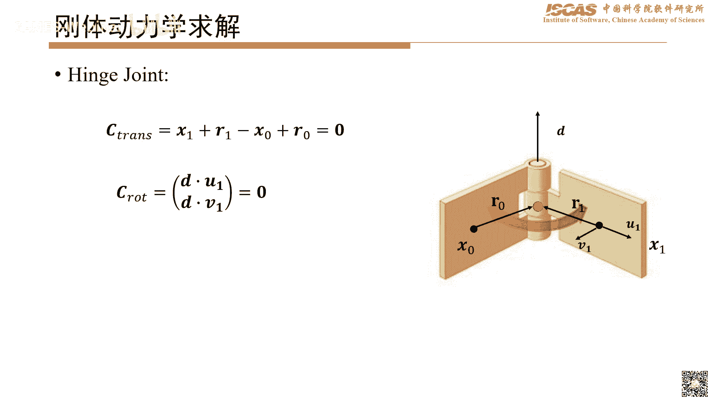


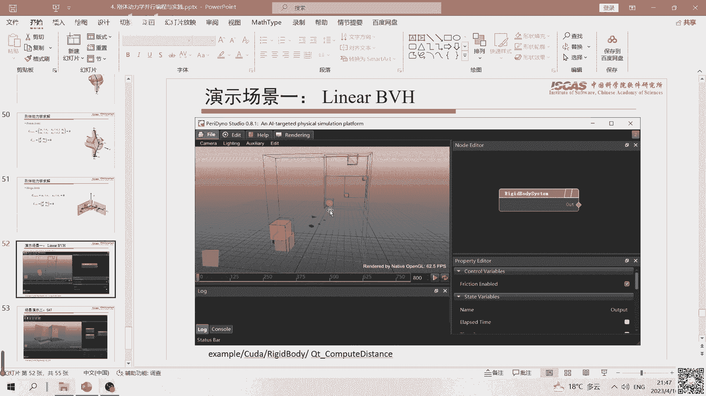


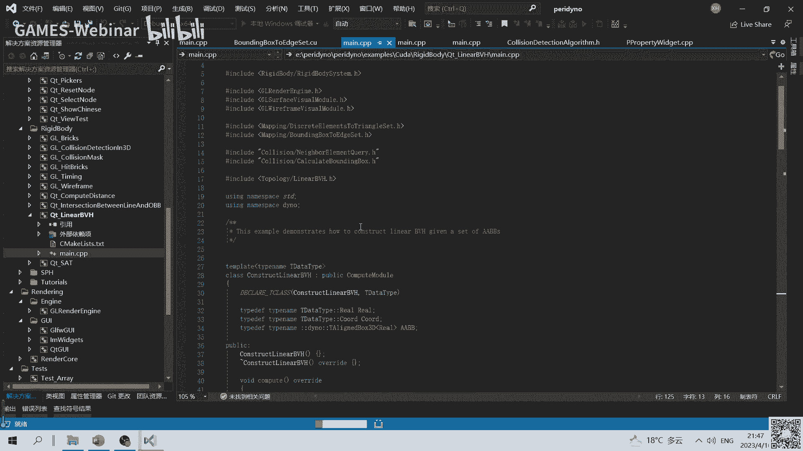

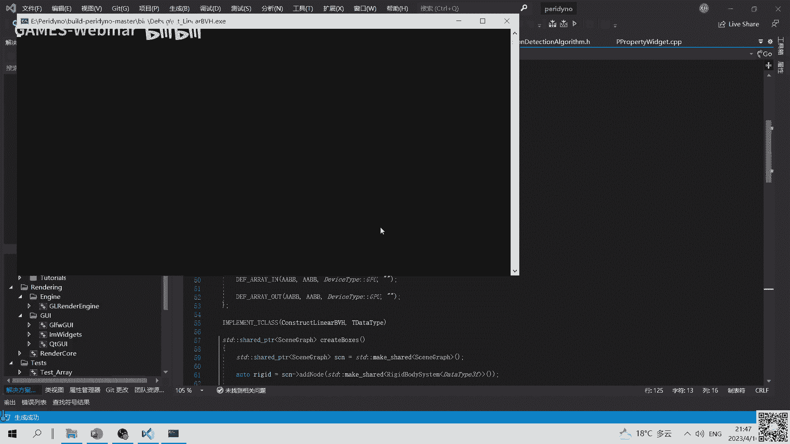

这些约束都可以用类似的雅可比矩阵形式 `J * v' = 0`（或 `= b`）来描述，并集成到同一个线性系统中进行求解。


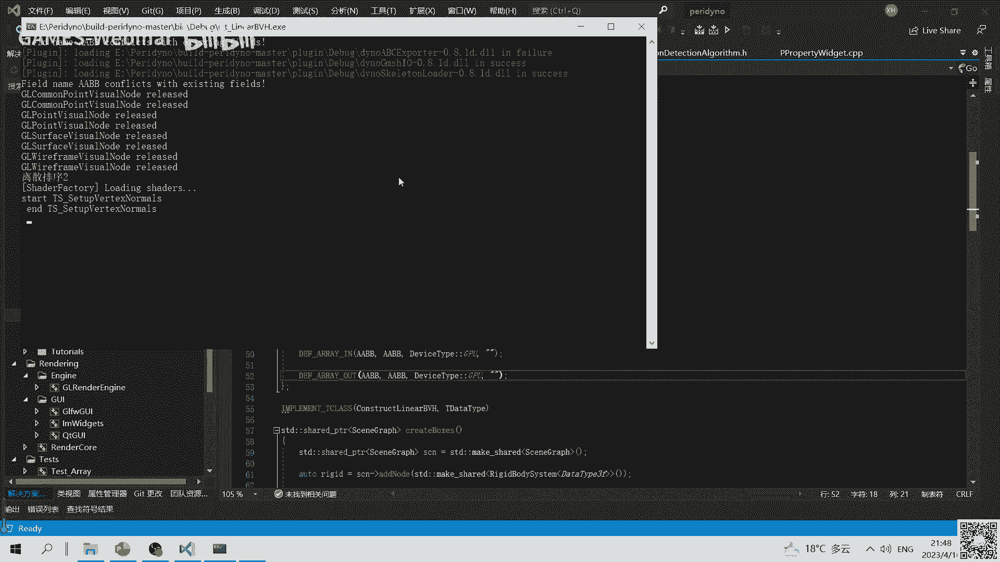

## 课程总结与演示


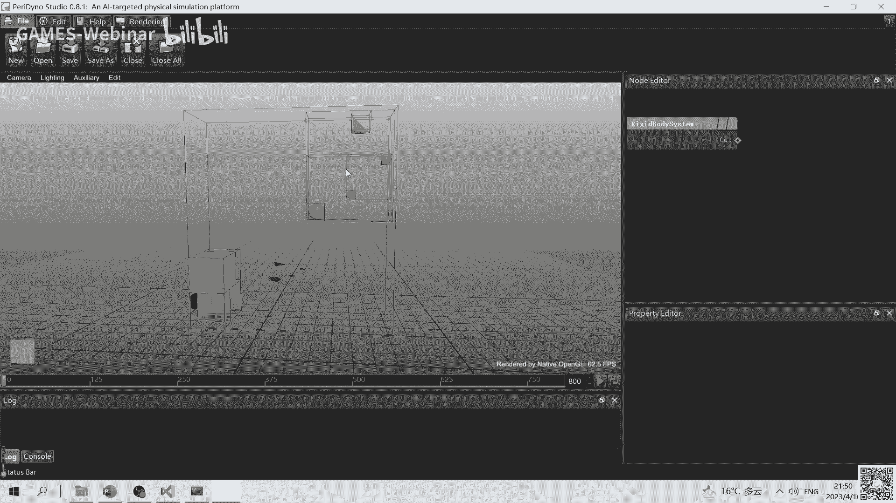

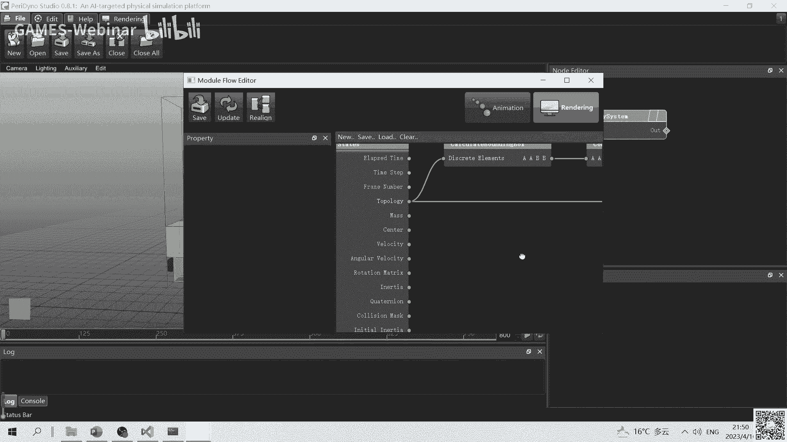

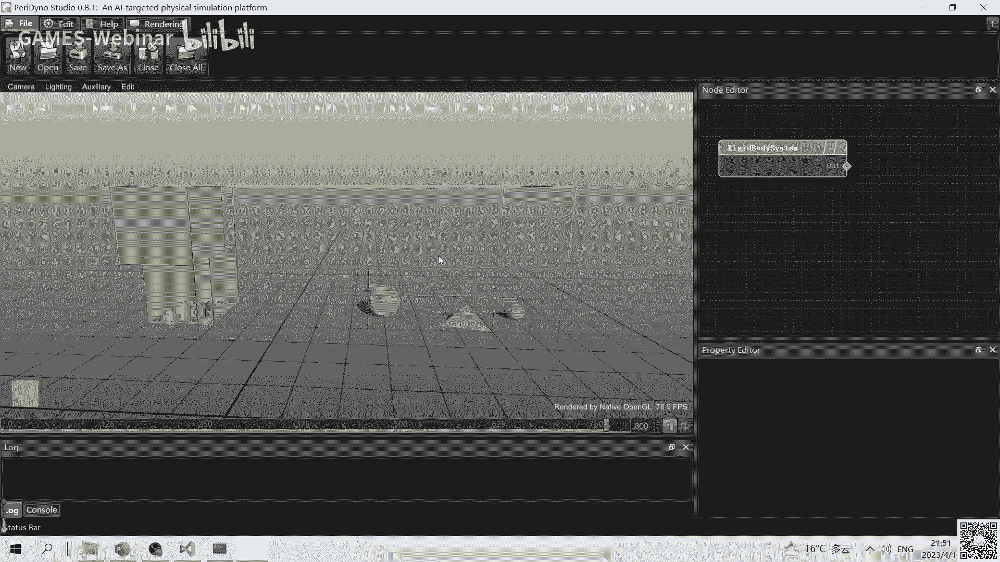

本节课中我们一起学习了刚体动力学并行编程的核心内容。

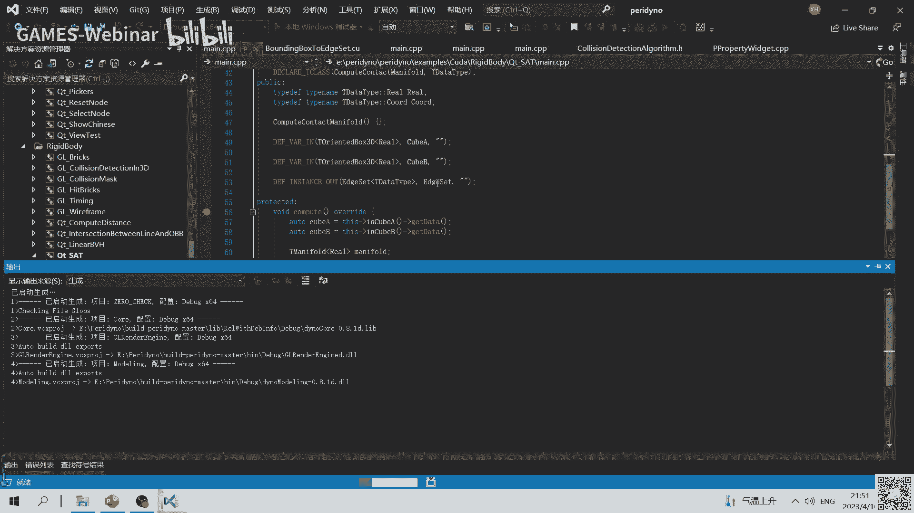


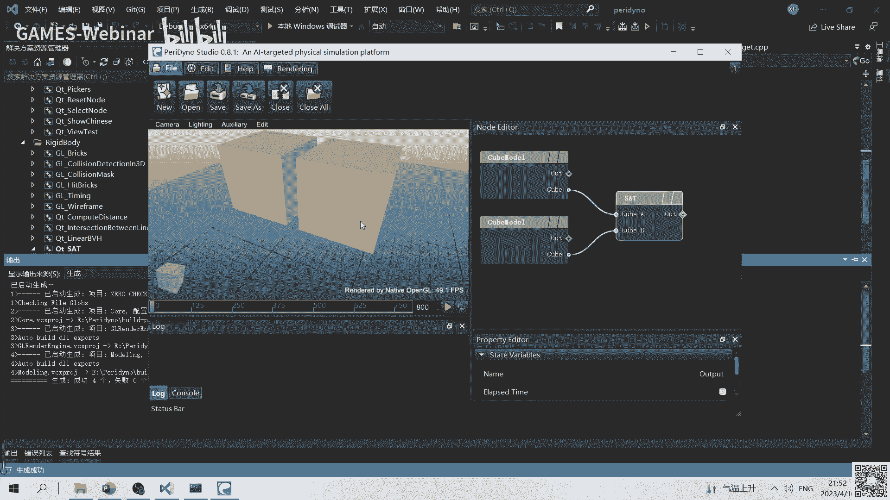


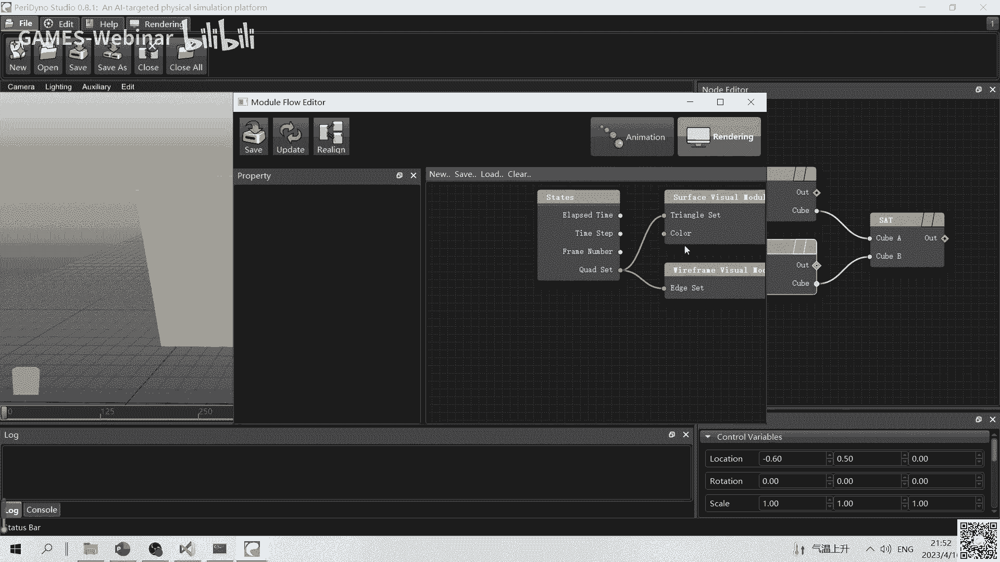

我们首先回顾了刚体运动的基本物理量和方程。然后，深入探讨了碰撞检测的两个阶段：**宽阶段**利用层次包围盒和Linear BVH算法在GPU上并行加速；**窄阶段**使用分离轴定理进行精确检测，并生成接触流形。最后，我们介绍了如何将接触和关节建模为速度层面的约束，并通过求解线性方程组来计算作用力，从而更新刚体状态。

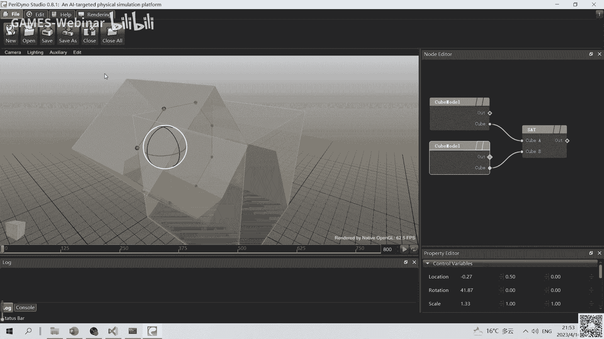

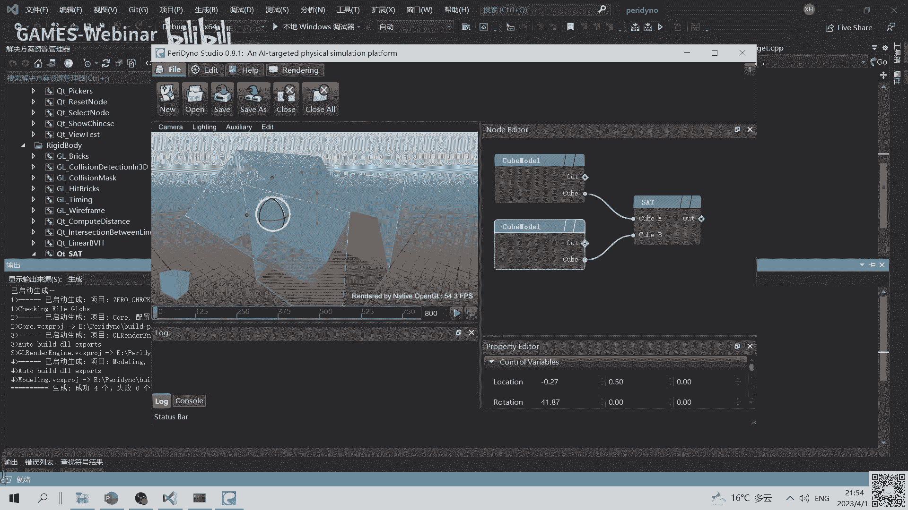

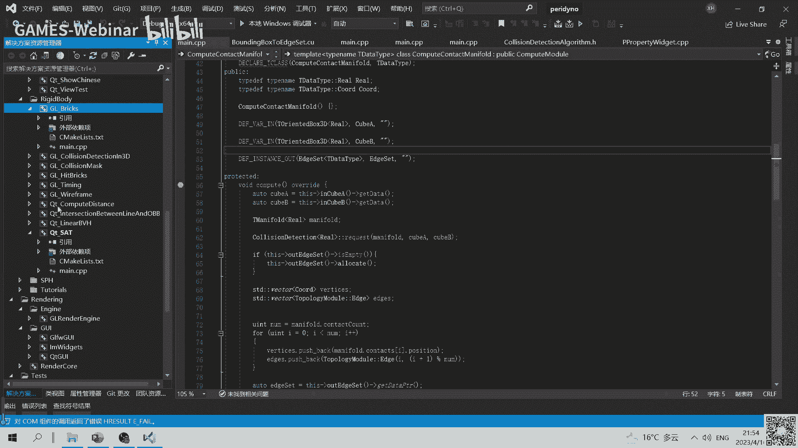


课程还提供了两个核心算法的演示：
1.  **Linear BVH构建可视化**：展示了GPU并行构建的层次包围盒树如何随物体运动而动态更新。
2.  **分离轴定理检测演示**：展示两个Box碰撞时，接触流形（一组接触点）如何被实时计算并可视化。


这些基础技术和算法是构建高效、稳定刚体仿真系统的基石，可以扩展到更复杂的场景和几何类型中。