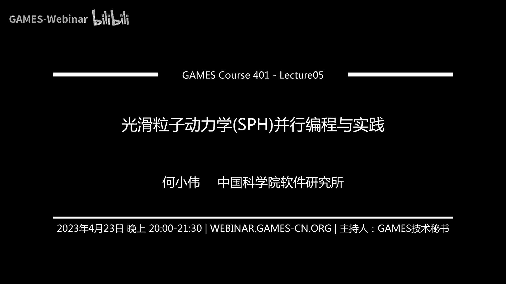

# GAMES401-泛动引擎(PeriDyno)物理仿真编程与实践 - P5：光滑粒子动力学(SPH)并行编程与实践 🧪

在本节课中，我们将要学习光滑粒子动力学（SPH）的基础理论，并重点探讨如何利用SPH方法在GPU上模拟粘性不可压缩流体。我们将从SPH的核心思想出发，逐步讲解其数学基础、离散化方法、以及针对流体模拟的具体实现步骤，包括不可压缩性、粘性、边界处理和表面张力的处理。

---

## 概述 📋

光滑粒子动力学（SPH）是一种无网格的拉格朗日方法，广泛应用于流体动力学等物理现象的模拟。其核心思想是用一组离散的、携带物理属性的粒子来表征连续介质，并通过核函数近似来估算场量及其导数。本节课将系统性地介绍SPH方法，并聚焦于其在粘性不可压缩流体仿真中的应用与实践。

---

## SPH基础理论 🧠

上一节我们概述了SPH方法。本节中我们来看看SPH解决连续场离散化问题的核心思想。

SPH方法的核心在于用离散粒子表示连续场。与有限元法或欧拉网格法不同，SPH粒子之间没有固定的拓扑连接关系，其邻域关系需要在模拟过程中动态重构。基于此特性，SPH计算包含几个基本要素。

### 核函数近似

SPH方法的核心是核函数近似。所有物理量存储在离散的粒子中心点上。对于空间中任意一点，其物理量的值通过对其邻域内粒子携带的值进行加权平均得到。

以下是核函数近似的基本离散形式：

```
f_i ≈ Σ_j (m_j / ρ_j) * f_j * W(|r_i - r_j|, h)
```

其中：
*   `f_i` 是粒子 `i` 的待求物理量。
*   `m_j` 和 `ρ_j` 是邻域粒子 `j` 的质量和密度。
*   `W` 是核函数，`h` 是光滑长度（支撑域半径）。
*   `r_i` 和 `r_j` 是粒子位置。

核函数 `W` 需要满足几个关键性质：
1.  **紧支性**：在支撑半径 `h` 之外，函数值为零。这保证了计算局部性，只需考虑附近粒子。
2.  **归一化条件**：在支撑域内的积分值为1。这保证了即使对于常量场，近似计算也能得到正确值。

### 从狄拉克函数到核函数

SPH理论源于用核函数 `W` 近似理想的狄拉克δ函数。狄拉克δ函数与任意函数 `f` 的卷积能得到该函数在中心点的精确值。然而，狄拉克δ函数在现实中无法表示。SPH将其“拉平”为一个光滑的核函数，但这引入了近似误差。理解这一点至关重要，因为SPH的所有计算都存在固有误差，需要在算法设计中予以考虑。

### 导数计算

在物理模拟中，经常需要计算场量的梯度、散度等导数。SPH通过将微分算子转移到已知的核函数上来实现。

例如，标量场 `f` 的梯度近似为：

```
∇f_i ≈ Σ_j (m_j / ρ_j) * f_j * ∇W(|r_i - r_j|, h)
```

然而，直接这样计算可能不稳定或不精确。更常见的做法是利用分部积分得到另一种形式：

```
∇f_i ≈ Σ_j (m_j / ρ_j) * (f_j - f_i) * ∇W(|r_i - r_j|, h)
```

这种形式具有反对称性，能更好地满足动量守恒。对于更复杂的算子（如拉普拉斯算子），也有相应的离散格式。

### 边界处理挑战

在推导梯度等算子的SPH离散形式时，会涉及一项边界积分项。对于完全被粒子包围的内部粒子，此项为零。但对于靠近流体表面或固体边界的粒子，此项不为零，直接忽略会导致精度下降和边界处的不稳定。因此，边界条件的正确处理是SPH模拟中的关键挑战之一。

---

## SPH面临的挑战与前沿 🎯

上一节我们介绍了SPH的基础公式。本节中我们来看看当前SPH方法研究面临的主要挑战。

SPH方法虽然应用广泛，但仍存在一些公认的难点。SPHack组织对此进行了总结，并设立了以SPH发明人命名的奖项，以鼓励在以下方面的突破：

以下是SPH领域的主要挑战：
1.  **精度**：相比高精度方法如谱方法或高阶有限元，传统SPH的精度较低。
2.  **稳定性**：特别是在模拟不可压缩流体时，需要处理数值不稳定问题。
3.  **边界条件**：如前所述，复杂边界（如自由表面、移动固体边界）的处理仍是一大难题。
4.  **自适应**：如何高效地进行粒子自适应细化与粗化。
5.  **耦合**：如何与其它数值方法（如有限元法、边界元法）进行稳定高效的耦合。

---

## 粘性不可压缩流体模拟 🌊

上一节我们了解了SPH的通用框架与挑战。本节中我们聚焦于本节课的核心目标：如何使用SPH模拟粘性不可压缩流体。

### 控制方程：纳维-斯托克斯方程

粘性不可压缩流体的运动由纳维-斯托克斯方程描述：

**动量方程**：
```
ρ (∂u/∂t + u·∇u) = -∇p + μ∇²u + ρg
```

**不可压缩条件**：
```
∇·u = 0
```

其中：
*   `ρ` 是恒定密度。
*   `u` 是速度场。
*   `p` 是压强场。
*   `μ` 是动力粘性系数。
*   `g` 是重力加速度。

方程左边是惯性项，右边依次是压力项、粘性项和体积力项。不可压缩条件 `∇·u = 0` 等价于密度恒定 `ρ = const`。

### 算子分裂求解框架

在SPH中，常采用算子分裂法来求解NS方程。它将复杂的方程分解为几个可顺序求解的简单步骤。

以下是典型的求解步骤：
1.  **邻域查找**：更新每个粒子的邻居列表。
2.  **预测步**：计算除压力外的所有力（如重力、粘性力、表面张力），并更新得到一个中间速度 `u*`。
    ```
    u* = u^t + Δt * (g + ν∇²u^t + 其他力/ρ)
    ```
3.  **压力泊松方程求解**：求解压强场 `p`，使得修正后的速度场满足不可压缩条件。
    ```
    ∇·( (1/ρ) ∇p ) = (∇·u*) / Δt
    ```
    然后更新速度：
    ```
    u^{t+1} = u* - (Δt/ρ) ∇p
    ```
4.  **位置更新**：用最终速度更新粒子位置。
    ```
    x^{t+1} = x^t + Δt * u^{t+1}
    ```

接下来，我们将详细探讨其中几个关键环节的实现。

---

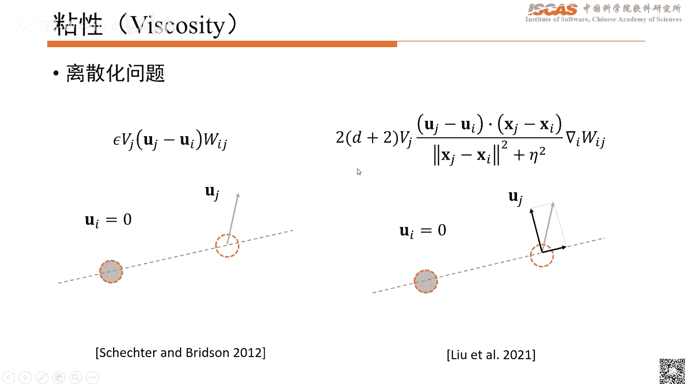

## 关键算法环节详解 ⚙️

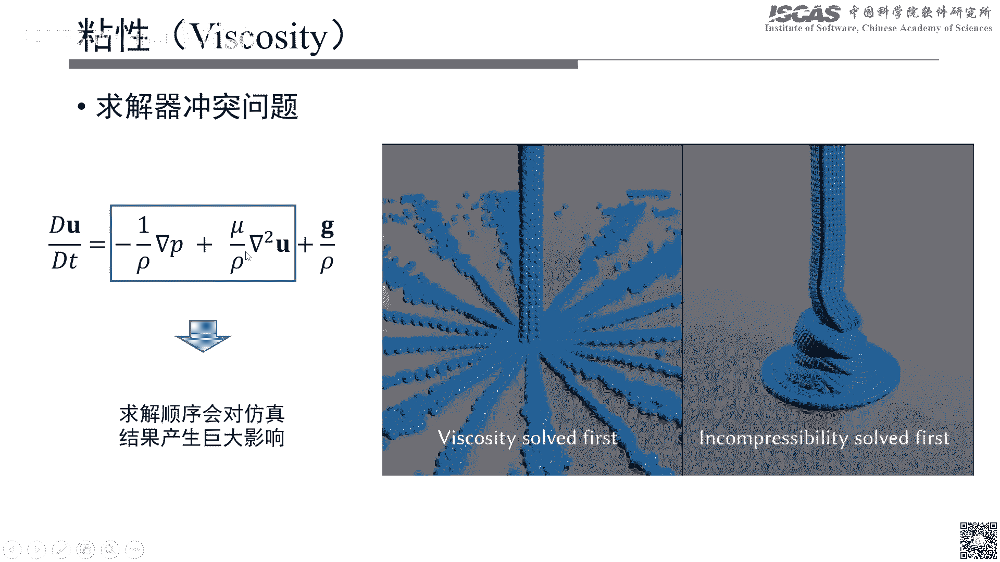


### 1. 邻域查找

邻域查找是SPH每一步计算的基础，其效率至关重要。主要有两种策略：

**基于哈希网格的方法**：
*   **思想**：将空间划分为均匀网格，网格尺寸与光滑长度 `h` 相关。每个粒子根据其位置被放入对应网格。查找邻居时，只需检查中心粒子所在网格及其相邻的26个（3D）网格中的粒子。
*   **优点**：实现简单，对于粒子分布均匀的场景效率高。
*   **缺点**：需要预先分配覆盖整个计算域的内存，对于开放或粒子分布极稀疏的场景可能造成内存浪费。

**基于层次包围盒的方法**：
*   **思想**：为每个粒子构建一个包围球（半径为 `h`），然后利用树形结构（如BVH）管理所有包围球。通过遍历树结构快速查找可能碰撞的粒子对，再进行精确距离判断。
*   **优点**：非常适合粒子分布稀疏或场景开放的情况，内存使用更高效。
*   **缺点**：树结构的构建与更新有一定开销。

### 2. 不可压缩性实现

实现不可压缩性主要有两种思路：基于位置的动力约束和基于投影的压强求解。

**基于位置的方法**：
*   **代表**：位置动力学
*   **思想**：将密度约束 `ρ_i = ρ_0` 视为一个约束条件 `C_i(x) = ρ_i/ρ_0 - 1 = 0`。通过迭代调整粒子位置 `x` 来满足约束。调整方向沿约束梯度 `∇C`，步长通过线性化约束方程求解。
*   **优点**：简单、稳定、易于实现。
*   **缺点**：有时会过度平滑细节，难以模拟某些复杂现象。

**基于投影的方法**：
*   **思想**：从中间速度 `u*` 中减去一个由压强梯度产生的速度修正项，使最终速度散度为零。这导出一个关于压强 `p` 的泊松方程，需要求解一个线性系统。
*   **变分框架**：为了获得更稳定、物理更正确的离散形式，常采用能量最小化的变分框架推导压强力。这避免了直接离散拉普拉斯算子可能带来的不稳定。
*   **优点**：通常能获得更精确的动力学行为，如清晰的飞溅、涡旋等。
*   **缺点**：需要求解线性系统，计算开销较大；边界处理更复杂。

### 3. 粘性实现

粘性力模拟流体内部分子间的动量扩散。SPH中常见的粘性模型有：

**人工粘性**：
*   一种简单的正则化方法，通过在粒子间添加与速度差成正比的阻尼力来模拟粘性耗散。但它会同时衰减法向和切向的相对运动。


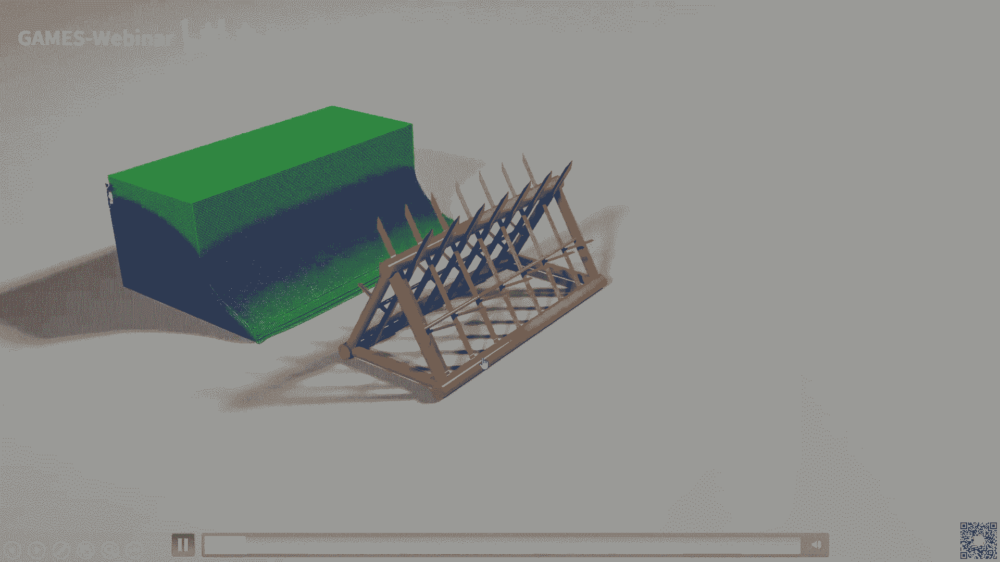

**剪切粘性模型**：
*   更物理的模型，如。它基于流体的剪切应变率张量来计算粘性应力。在离散时，可以构造仅衰减粒子间相对速度的法向分量，而保留切向分量的模型，这对于模拟蜂蜜下落等具有旋转特性的粘性流动至关重要。

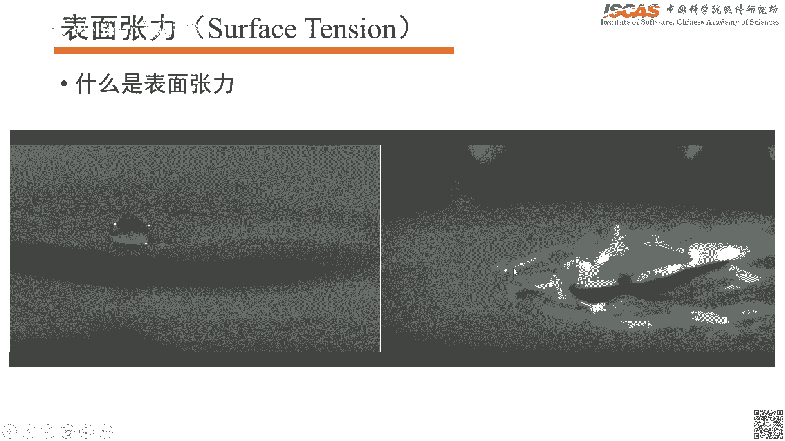

**迭代耦合**：
*   在算子分裂框架中，单独求解粘性和压力可能会相互干扰，影响效果。一种改进策略是在一个时间步内，对粘性求解器和压力求解器进行多次迭代，使两者更好地耦合，从而同时满足不可压缩条件和粘性行为。

### 4. 边界处理

如前所述，边界缺失会导致核近似不准确。常用方法有：

**动态粒子法**：
*   将固体边界也用一层或多层粒子离散。这些边界粒子参与邻域搜索和密度计算，并对流体粒子施加排斥力。这是最常用且直观的方法，但增加了计算量和内存消耗。

**半解析边界法**：
*   **思想**：不离散边界粒子，而是直接对核函数在流体区域外的缺失部分进行解析或半解析积分。将体积分转化为对已知的固体表面网格的面积分。
*   **优点**：内存开销小，精度高，特别适合处理复杂、尖锐的几何边界。
*   **缺点**：数学推导和实现复杂，计算开销可能较大。

### 5. 表面张力

表面张力使流体表面尽可能收缩，形成最小表面积。在粒子法中，精确界定“表面”粒子是困难的。

**连续表面力模型**：
*   在表面附近定义一个颜色场 `c`（如内部为1，外部为0）。表面张力与颜色场的拉普拉斯成正比，方向沿颜色场梯度方向。


**扩散界面法**：
*   **思想**：将尖锐界面模糊为一个具有有限厚度的扩散界面。在界面层内定义一个相场函数 `φ`，其值从-1平滑过渡到1。表面张力通过最小化与 `φ` 梯度相关的界面能来实现。
*   **优点**：自然地避免了表面粒子检测，易于实现，且能方便地处理多相流。
*   **扩展到固-液-气三相**：通过为固-液、液-气界面分别定义界面能，并考虑接触角，可以模拟水滴在固体表面的铺展、浸润等现象。


---

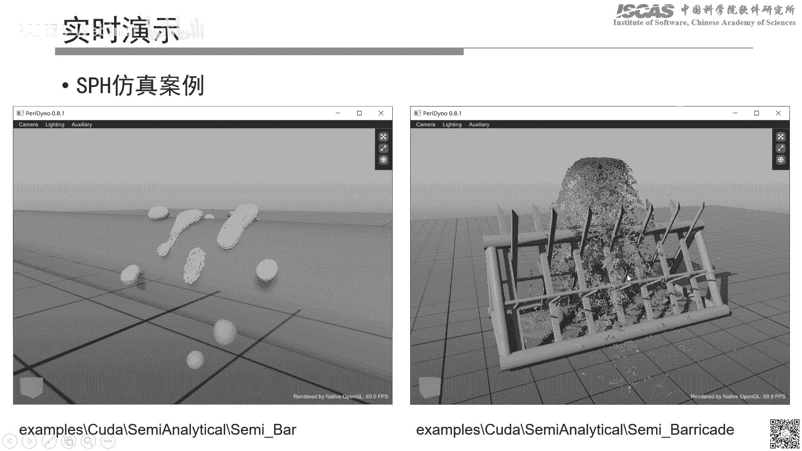


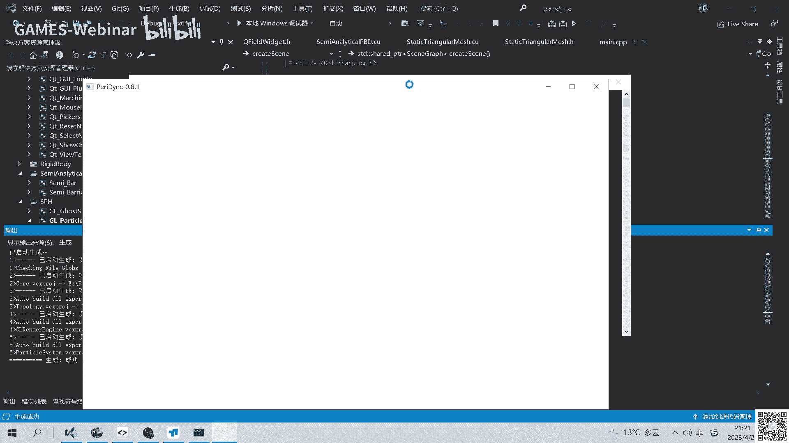

## 程序演示与框架介绍 💻


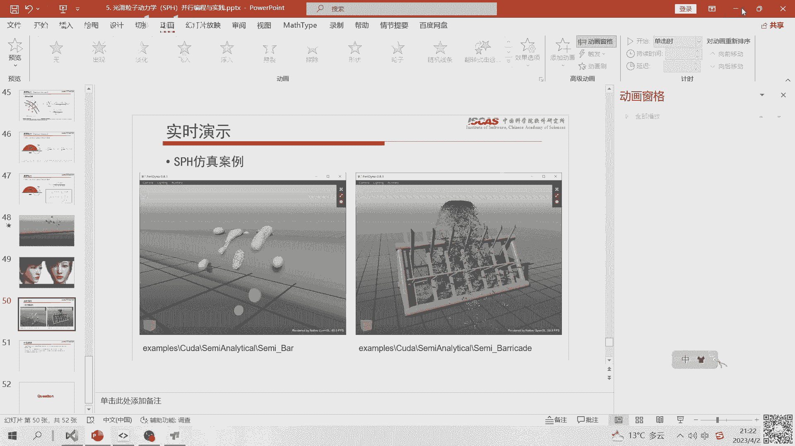


上一节我们深入探讨了各个算法环节。本节中我们通过程序演示来直观了解SPH仿真的实现与泛动引擎的使用。

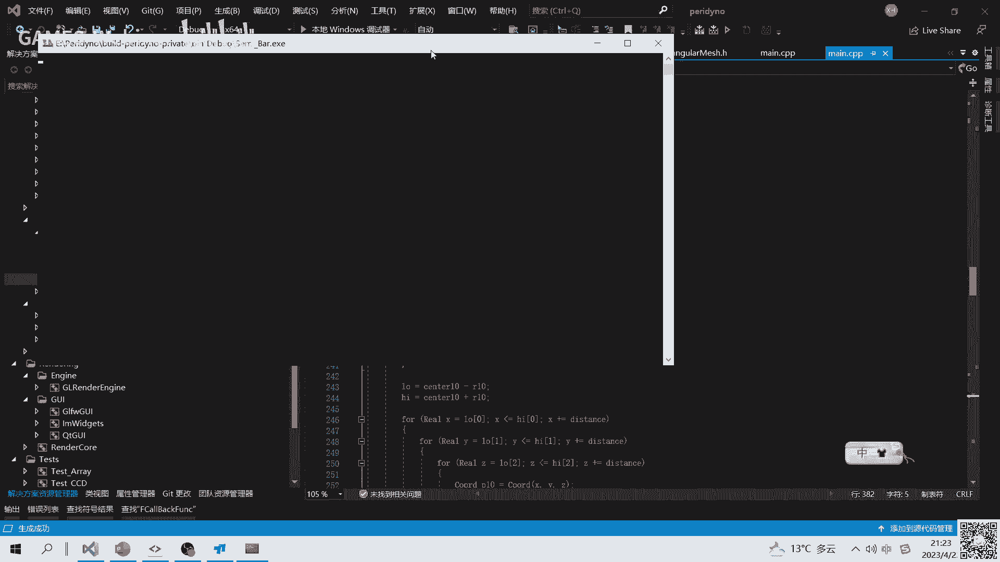

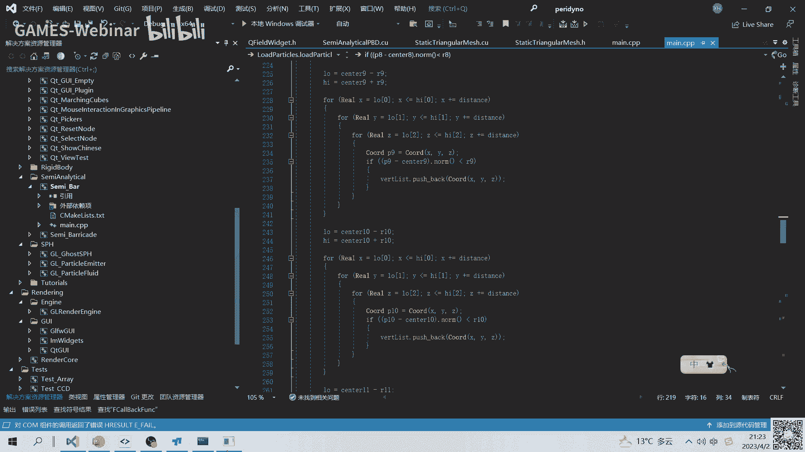


泛动引擎提供了一个模块化的可视化编程环境，用于快速构建和测试物理仿真场景。

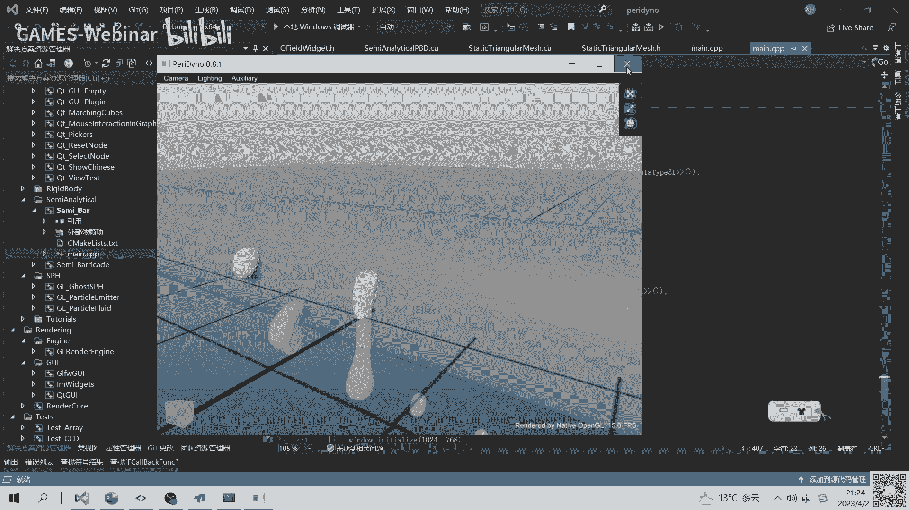


以下是引擎使用的核心概念：
*   **节点**：每个算法模块（如发射器、SPH求解器、边界条件、渲染器）都被实现为一个独立的节点。
*   **数据流**：节点通过端口连接，形成数据流图。数据（如粒子位置、速度）从一个节点流向另一个节点。
*   **属性面板**：每个节点暴露可调参数（如粘性系数、时间步长），用户可在属性面板中实时调整并观察效果。


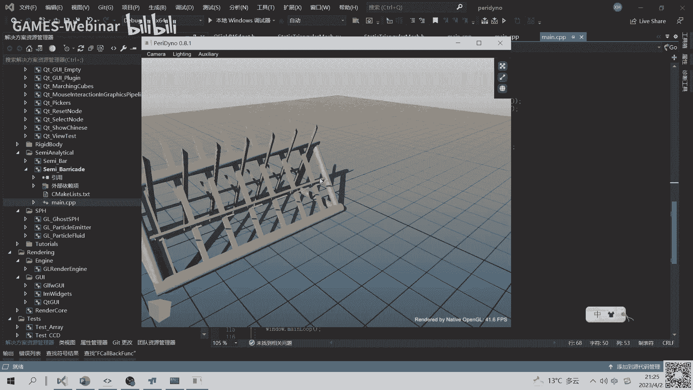

**演示场景示例**：
1.  **基本流体发射**：连接发射器节点、SPH求解器节点和渲染器节点，模拟水流。
2.  **流体-固体交互**：在上述流程中加入一个载入表面网格的边界节点，并将其与SPH求解器耦合，模拟水流冲击管道。
3.  **算法切换**：将SPH求解器节点从基于投影的方法切换到基于位置动力学的方法，观察不同算法的模拟效果差异。
4.  **自定义初始状态**：使用一个生成粒子的节点（如生成立方体粒子阵列）替代发射器，作为仿真的初始状态。


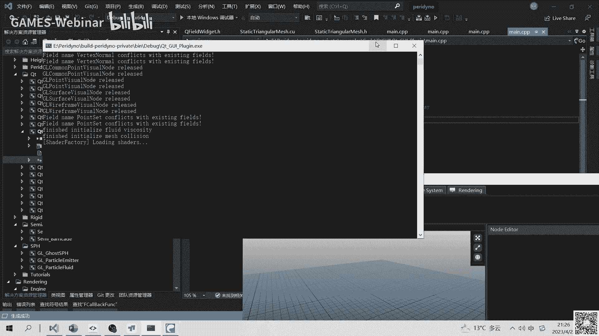

通过这种模块化方式，研究者可以专注于开发新的算法节点，并轻松地将其集成到现有框架中，与其他模块组合以创建复杂的仿真应用。

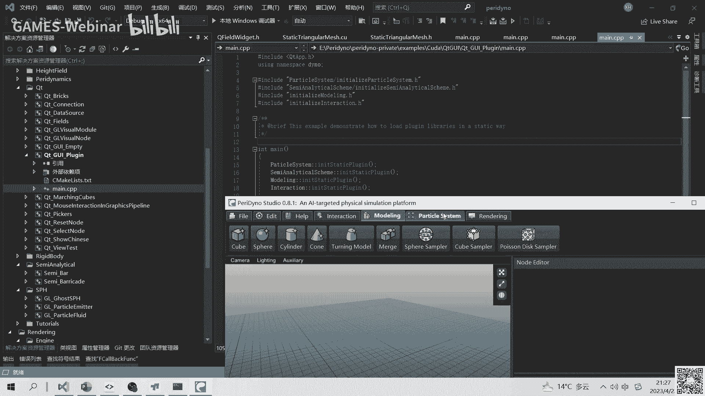

---

## 总结 📚

在本节课中，我们一起学习了光滑粒子动力学的基础理论与在粘性不可压缩流体模拟中的应用。

我们首先阐述了SPH用离散粒子与核函数近似连续场的核心思想，并指出了其存在的近似误差。接着，我们分析了当前SPH研究在精度、稳定性、边界处理等方面面临的挑战。

课程的重点在于如何用SPH求解纳维-斯托克斯方程。我们介绍了算子分裂的求解框架，并逐一详解了其中的关键环节：高效的邻域查找算法、实现不可压缩性的两种主要方法、粘性力的模型、复杂边界的处理策略以及表面张力的模拟技术。

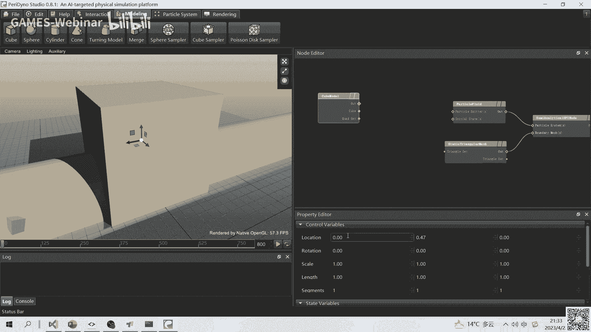

最后，我们通过泛动引擎的程序演示，展示了如何将这些算法模块化并组合使用，快速构建出不同的流体仿真场景。

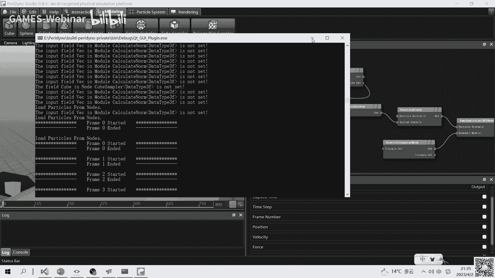

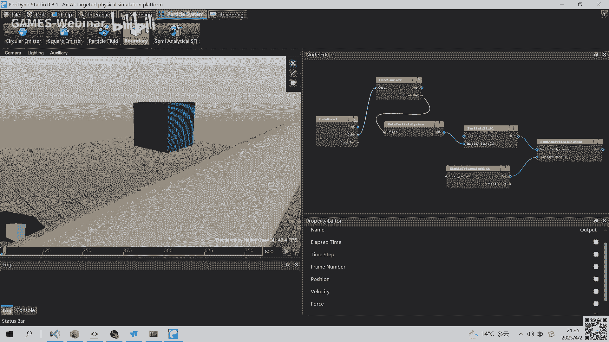

希望本教程能帮助你入门SPH流体仿真，并为你在这一领域的进一步探索与实践打下基础。


---
**扩展阅读资料**：
*   《Smoothed Particle Hydrodynamics: A Meshfree Particle Method》
*   《Particle-Based Fluid Simulation for Interactive Applications》
*   《Weakly Compressible SPH for Free Surface Flows》
*   《A Variational Approach to the Simulation of Incompressible Fluid-Solid Interaction》
*   《A Semi-analytical Boundary Method for SPH with Applications to Flow in Complex Geometries》