# GAMES401-泛动引擎(PeriDyno)物理仿真编程与实践 - P6：6. 近场动力学（Peridynamics）并行编程与实践 - GAMES-Webinar - BV15M4y1U76M

那个诶大家晚上好啊，那个我看时间也差不多了，这样那我们今天课就开始吧。

然后呃，今天这样，主要还是讲仿真相关的一些技术为主啊，所以就是可能今天的一些数学公式，可还是比较多的，所以这个东西反正这样，但是今天讲的呢，就是后面应该我们也都会就把代码开放出去了。

所以呢就是理论这部分，反正就是如果就暂时听不懂也没有关系啊，就是后面也可以对着，相当于对着代码，我们可以回过来了，然后结合今天讲的内容，我们可以挨个的去看一下，然后今天主要讲的实际上就是经常动力学。

然后呢以及呃呃一些相关的一些理论吧，然后当然这个啊，所以这个计量动力学，整个实际上我觉得相对来说就相对别的呃一些，呃仿真方法还是相对比较年轻的，因为像比如说有电源，到现在可能七八十年了。

然后像s h的话可能也是四五十年，但是呢其实经常动力学这个方法，其实呃发展的比较晚，实际上是应该是算1998年美国的cd，实际上他最早提出了这么一个方法，然后当然早期的方法。

其实他跟就是说跟我们传统理解的，比如跟弹簧系统啊什么可能也差不太多，就是当然这里面它有一套完整的，一套理论体系啊，所以呢又跟弹簧系统整合，是有些本质的一些差别，然后当然后面逐步就是呃完善。

然后呢当然也结合就以前就是单纯考虑，就是说类似弹簧这样的模型的话，那其实有很多问题解决不了，所以后面实际上就逐步的去完善，然后呢基于各种后面也会讲，就基于各种各样的，比如说这种pad那个概念。

然后逐步把这个理论就完善，当然怎么啊，图形这个领域啊，图形其实呃做的就更晚了，差不多是应该是14年最早有一篇，然后当然后面呢我们实际上就呃，一直就是基于这个方向，当然一直在往前推。

然后当然我们这边做的就图形领域，整个做这个方法跟工程里面可能有点差别啊，就是从工程里面的话，主要还是以建模为主，然后但是像图形里边，因为我们很多时候强调的就是说，我们啊强调效率啊，强调效果。

所以这样的话实际上就在图形里面，整个会侧重在呃算法为主，所以今天讲的主要也是呃从算法的角度，然后去看看怎么去，当然基于静养动力学这个模型啊，去比如说去怎么去求解这种啊。

就是比如说布料啊或者烧弹性的那个模型，所以今天主要是车重这一块，然后呢给大家做一下，那个包括这个京东降动力学的一些基础，以及一些比较前沿的一些技术吧，然后整个主要是包含几部分啊。

就是当然首先是这样动力学基础，因为这块主要就大家可能比较陌生啊，所以呢我怀疑花花点时间就跟spa一样啊，就是花点时间，把这个一些基础相关的理论讲一下，然后呢就是呃讲讲就是呃就是投影降动力学。

然后以及里边的一个求解技术，在这里边重点要讲的，实际上今天要讲这个半隐式连带啊，连续迭代这么一个方法，然后这个方法主要也是用来求解，就是说啊这种非线性优化问题的一个，我觉得是一个比较有效。

尤其是在gpu上去呃，并行实现非常方便有效的这么一个一个方法，然后到最后有一些常规品牌一个演示啊，所以呢接下来我们首先来看一下这个呃，静阳动力学的基础，然后啊这里面实际上就要讲一下这个。

因为这里呃我们知道就连续性力学的话，其实发展到现在应该很久了，然后呢其实京港动力学啊，这里有个误区，就是可能会很多人以为这动力学实际上是跟呃，比如跟ph啊，或者跟有限元是一个呃。

一个相当于类似的这么一个方法，但其实本质不是竞技场动力，实际上它是一套新的一个理论，就是它实际上是如果要比较的话啊，相当于要根据说我们传统理解的这种所谓的经，啊。

就连续接力学力学理论要相当跟他做一个对照，所以这里我们先看一下，比如说这个左边这个画的实际上是一个呃，在做连续介质力学分析的时候，通常会比较常见的这么一个模型，就是假设我们就是说相当于是取出里边。

任意一个一个微元，然后连续介质力学它是有什么假设呢，它的假设比如他的内力，它实际上是你发现它整个是施加在一个面上的，就是比如像这里取出一个微圆之后呢，他比如说是个立方体的微圆，然后它有六个面。

这样的话每个面实际上都会施加到一个力，然后也就是说传统电子介质力学里边，它的整个理论基础，就它实际上是建立在接触力的这么一个，基础之上，那接触力代表什么意思，就是呃就是说相当于比如说这里有个微元。

然后它跟它相邻的右边啊，如果也有一个微元，那这样的话实际上他们之间产生力，它实际上它是通过接触产生的，那这个你会发现，如果比如说我们重更微观的去看我们这个啊，这个物质的那个组成啊，比如说到原子层面。

到分子层面，其实我们发现很多实际上是就这个面啊，就这个间就比如这个接触面，这个实际上啊从微观的角度来讲，它实际上是不存在的，就是我们知道微观的层面，比如说你只要所有的呃呃就是物体都是由。

比如说都由分子或原子组成的，那这样的话实际上它们之间并不存在，比如说你这个一个比如说这面的一个定义啊，所以就是说实际上这个传统连这种连续性力学，它实际上是一个理想的一个数学模型。

也就是他把整个比如说我们从宏观的角度来讲，我们就可以比如说那个比如说像分子，你比如他接触力，它的接触的那个相当于作用的一个半径，小到就是我们放大放大放大到一个半径之后。

我们相当于认为它实际上其实就是一个啊，相当于比如说距离无限小的这么一个呃，一个距离，那这样的话其实可以理解可以理想化成，比如说我就是在一个面的一个接触的一个呃，相当于这么一个接触。

所以这个实际上就是一个传统连，连续性力学里面的一个理论基础，然后但是这里边就是呃这样的模型，就是有一个什么好处，当然就是那这样的话，整个后续的比如各种偏微方程，实际上都是基于这个理论推导。

比如说我在上面，因为我们假设实际上都是连续的嘛，所以它这里边核心呢，他认为整个所有的材料都是连续的，所以这样的话，实际上就是我们可以用数学的各种高，数里的那种方法，比如说求他的那个偏导数啊。

比如说一阶二阶的神像，这样的话实际上都可以求偏导，所以这里边就是整个传统的这种方法，实际上比较适合于这种处理，这种连续介质，就是比如说他整个拓扑可能不太发生变化的，这种啊。

比如说就是纯粹的一个弹性的一个模型，那这样的话实际上是比较适合，但是呢实际上就是对于比如说很多场景啊，比如说我们有个布料，我们要撕裂，或者是比如说有个那个火山啊，比如或者山川比较崩塌了。

这个实际上涉及到大量的这种非连续，那非连续的话，实际上这个对于这种传统连接力学里边，其实还是有一定的困难，所以呢呃所以98年的森林提出这个模型，它本质实际上是为了解决，就是这种传统这个连续性力学。

就是在建模这种非连啊，就非连续这个问题，说不太啊就是不太方便的这么一个问题，所以呢提出了一个呃降动力学一个模型，所以这里边实际上就是与传统这个就连接力学，最大的一个区别，就是它实际上就摒弃了。

就是以往就是按照面结出这么一个观念，就是他其实际上就是更像的是，就是说它更像一个分子动力学的一个框架，就是他假设所有的枪都不是一个短程接触力，而是一个长程力，就是比如说就类似于这个原子或者分子。

然后分子之间呢，它实际上是通过，比如说一个长城的吸引力或者排斥异，实际上是来相互作用，所以呢这里边实际上就是这两个最大的区别，其实就是用啊叫一个local，跟当local这么两个术语来表示。

就是以前的local就代表，就相当于你实际上所有的东西，都是建立在你一个微软，就是你可以无限逼近，然后呢啊类似于pv啊，就微积分里面的那个无线可以就是无限，就相当于可以无限的趋近于。

比如说你一个导导数无限趋近于零，这么一个啊概念，就是就是说你去求导啊，求导是求导数，比如用微分的那个形式去表示的时候，你的微元实际上可以无限去定小，然后呢，这样的话，nlogo的。

其实就这里边就可能就存在这么一个呃，偏导的概念，它实际上本质上算的，他也不是说他去算计算这里的导数，它实际上就是说他很多时候算的，不是说我中心点，它那个导数是不是存在，他直接就是相当于他建模。

比如说两个222个布置点之间的一个一个力，或者是直接建模它的一个其他的一个物理量，然后通过这样的整个相当于把原来的这种啊，这是基于这个偏微分方程这样的一个形式，转换成了这种积分方程的这个形式来建模。

这个整个就是介质的这么一个动力学，所以这个实际上就是相当于是这两个方法，一个最大的一个一个区别，然后呢这样的话就是我们来举个例子，就是说比如说对于这个我们描述一个物体的，一个一个形变啊，当然以前的话。

那时间就是你比如说你相当计算某一个点上的，那个，他比如说有个形变的一个行星变一个厂，然后你算算他的那个编导数啊，那这样的话在如果是在这样动力学里边，那它实际上它是通过，就是说他这一点跟sp其实非常像了。

就是它实际上它也有一个支撑域的概念，但这个东西但是跟s p又有不太一样的地方，在于就是说他的那个支撑域不要求符合，就是说你比如说你这个支撑域，靠近这个边界的地方，你的那个支撑位的权重等于零。

它这个其实不限，就是这个没有这个概念，但他同样有一个水平级的概念，就是说你相当于比如说对于他那个，类似于这样的一个范围以内的，任意一个临近的一个点，比如说我们要去描述它的这么一个变化的时候。

实际上就相当于比如这里一个形变，那这样的话它实际上是通过呃，比如说它的中心点以及跟它相邻的两个点，这两个点的一个呃，它上面的这个一个物理量，然后呢利用相当这样连起来的这个一个一个键，就是让后面我们提到。

这实际上就代表一个键，就是利用这个键的，这么像他们对于每个零域，就是每个中心点，它周围所有的那个键，它相当于它的这个变化的这个过程的，这相当于对他的一个描述，比如像这个形变的话。

比如像中心点它有一个u的一个位移，然后呢他领域那个点有个u撇的一个位移，那这样的话实际上对应的这个键的话，这个呃这个键它相当于有一个呃，叫这个相当于这么一个一个位移的一个量。

所以呢当然这里边如果你枚举所有的这个纳，相邻的那个支点啊，这样的话整个比如以它为中心点的，这个所有的它的嗯呃变化的量，实际上都可以通过这种形式给它来表述出来，所以就说它其实并不是通过。

比如说我通过中心点算一个偏导数，或者或者算一个那个呃，比如张亮，然后呢，来表示它的一个连续的一个变化的，这么一个过程，而它实际上就是把它变成了转换成了一个两，两之间，就是中心点跟啊领域点的一个啊变化。

然后这样的话实际上通过离散的，你会发现它实际上更像一种离散的一个表示啊，这样的话就把它转成了，就是一堆的一个领域的一个离散表示，所以呢比如说这里的实际上就是，那如果我们对于每一个键啊。

实际上都有这么一个映射，那这样的话实际上就可以定义成，就相当于把这个整个所有的，就是它跟它相邻的所有的这个，而物质点它的那个形变的关系，实际上就可以描述出来，也就是他们之间就可以存在一个。

一定的对应的关系，就是你这个键，然后呢对应的什么样的一个形变，所以这样的话实际上就代表了一个呃销售形，变态的这么一个变形态的这么一个概念，所以这里面就是整个s降动力进场动力学，它其实最重要的两个概念。

就是一个就是叫，就前面说的一个键的这么一个概念，就是一个bb，然后这个bb直观理解就相当于你，然后呢跟它相邻的这个一个物质点，两个之间的一个点，就是他们之间连起来的这么一个一个键。

就是他们这个实际上就代表一个bd，然后呢对应的每个bug呢，实际上它会有一个映射的一个属性，就是比如说你这个bd对应的，比如说你有个形变，那这样的话实际上它有一个映射的一个函数。

然后这个函数呢相当于它实际上是从一个啊，见到到一个n阶n阶张量的这么一个映射关系，所以这里边实际上就是，也就这里边你发现就是呃，也就相当于你所有的这个bd，然后呢就是你有映射关系之后呢。

所以这样的话你整个所有的这个你的映射，实际上都可以这样用这样的一个函数来表示，所以这个东西跟以前的，就是我们知道的那个函数，可能有有一点不太好理解，是它它的自变量，实际上是相当以中心点为那个起始点的。

这么一个键，而且他的那个因变量是属于，就是说你相当于是一个m j的向量，也就是说这样的话，就比如你一个形变的话，你可以把原来的一个比如球形的一个形状，然后映射成一个椭球的一个形状。

当然这个时候你如果想知道任意点的，比如任意一个键呢它的一个变化，那这样的话，你只要比如说你输入一个他的一个键，那它就可以给你返回，返回一个这样的一个啊映射的一个一个结果。

所以这个呢实际上是构成这样动力学，最重要的一个东西，然后当然这里边你会发现它其实没有啊，导数的概念，就是它整个实际上不需要，比如说你这个东西不需要，比如对他这个中心就是说算一个偏导数。

然后呢这里边其实你还有还可以发现，就是它实际上对整个映射的这个呃连续性，实际上没有要求，就是你比如说像通常，因为如果你按中心点去求导的话，你比如说你可能一定你一定是要。

比如说限制你这个函数可能是一阶可导，至少是连续的，那或者是一阶可导，二阶可导，但是呢以这种方式呢，实际上你会发现他两两之间，可以完全没有任何的那个相互关系，就是比如说你这个键跟这个键。

它们之间可以完全是不连续的，所以这个是这种方法啊比较方便的，然后的一个好比较好的一个地方，当然也是他比如后面可以处理各种各样的，比如这种非连续或者碎裂的啊，这种啊这种问题的一个本质的一个原因啊。

那这里边就举两个例子啊，就是比如说这里这个前面讲那个太，就是呃会有哪哪些就是比较常用的这种类型，就是当然最最典型的，就是类似于s p h d的一个权重函数啊，就是比如说你针对任意一个键。

然后呢他比如说他在计算的时候，他到底它的权重是多少，那这样的话实际上它是从一个啊horizon的这么，一个类似于他的那个领域，然后到它的一个实数空间的这么一个映射，然后这个呢，实际上你发现等效于。

就是s p h里的这么一个权重函数，然后跟那个非常像啊，其实就是因为我把这个建议去呃，算一个他的一个模，就是这样的话，实际上等于它的两个物质点之间的一个，一个距离，然后呢相当于利用它的那个距离。

然后算到一个权重，所以对于这个这个这个标量的一个state，实际上等效率就是一个权重函数，当然这里边其实更重要的，实际上就是比如像这种向量的，就是比如说我从一个原始的，就是v形变的一个空间。

然后变换到一个形变空间的，这样的话实际上它就需要有一个向量态，就是比如说你原始的一个某个向量，它初始的位置是一个什么样子，然后呢对应到这个，比如说你形变之后的一个三维的一个一个空间。

所以这样的话其实就是有一个，比如说你去描述这个变形的时候，比如我定义成就是相当于他如果有形变梯度，然后呢我相当于乘上它的一个键，那这样的话实际上就可以表示成，就。

是当这个实际上就是从比如说假设是从连接历，学历表可能引申出来的这么一个概念，就是这样的话可以通过这个方式来定义，就是如果你比如说你这个时候，你整个是一个这种线性的一个形变，那这样的话。

这个东西整的跟连接这力学历表的那个呃定义，实际上是等效的，当然这个如果你是非连续的，那这个这两个实际上是不一定等效的，然后呢就是整个基于这个太难，其他实际上就构成一个，就是我们所谓的一个代数空间。

然后呢基于这个代数空间，实际上就是也可以进行各种各样的一个，代数运算，然后这里边当然就是要注意的，其实就是这里边比如说它对应的每一个操作，实际上它是要包含所有的那个键，它不是说针对的是某一个键啊。

实际上它相当于要涵盖，就是说你比如说你这个中心点，然后它相邻的所有的那个键，实际上都要涵盖进来，所以呢也就这里边比如说你相当于对于两个泰，你进行求和啊，但是这里还要说一下。

就是一般来说就你看paper的话，就是很多它定义态的话，它实际上会有一个比较特殊的一个标记，就是他用下划线来标记，然后这个主要是为了区别，就是连接的力学里边，一般一般一是这就是它比如说它是用啊。

他不带标记啊，所以这个实际上用这个下标呢，主要是标记那个呃，就是跟连接力学的一些量实际上做区分啊，然后但是后面呢主要是这样，如果是有些呃，实际上很多时候也不会容易引起混淆的情况呢。

就是可能这个下标可能就不标了，然后相当于就我们就知道，这实际上就是一个太主要，后面如果带了一个键的话，实际上它相当于就代表一个一个叫降动力学的，一个td一个概念，然后这样的话其实就是对于所有的。

比如你你两个碳的话，它其实也各种有各种各样的一个操作，就比如说你这里边有两个碳a跟b，然后呢这个time呢，比如说它但这个如果是相加的话，它必须它的那个接触是一样的。

就相当于你如果啊a跟b同时属于n阶太阳，那这样的话实际上这两个就可以直接加和，然后呢另外就是也有组合的这个操作，然后干组合操作，这里要说一下，就是呃这个比较特殊，就是必须得要求这个b是属于一阶态。

也就这个一阶t代表实际上它就是一个向量态，就相当于它是从向量映射到向量的这么一个呃，一个函数，所以这样的话实际上才可以，就是啊这个a跟b进行了一个组合操作，然后当然如果你后面那个不是向量的话。

那这个东西是啊无效的，因为你可以看一下它的整个定义，就是所有的td那个映射，它实际上它的自变量都是键，也就是键，它其实在三维空间里边，他其实对应的是一个三维的一个向量，然后二维空间当然是一个二维向量。

然后当这里边其实呃其他的也是跟很多的，就比如向量的代数啊什么，其实你发现类似的就是比如想怎么就算点击，那算点击的话，实际上这里的就是在两两之间，然后呢两两之间相乘，然后还有内积，内积的话。

实际上就类似于你算啊，这个跟向量里边的那个点击是一样的，就相当于各个元素之间让你把它乘起来，然后相当于求和，就类似这么一个一个操作，然后当然这里边就是因为它整个是一个呃。

实际上也是相当于是整个在他的那个领域里面，要做这个积分啊，所以你发现它实际上是一个连续的，这么一个积分，它不是一个离散的一个求和操作啊，然后当基于这个内积的概念呢。

就是进一步的其实可以定义有它的一个啊长度，它的摩尔以及他的那个方向，然后这个方向跟那个呃，以前理解的那个向量方向可能就有啊，就是可能不太一样了，因为它它这个实际上就是他每一个键。

就是你发现它实际上都有一个方向，就因为它实际上就相当于是它是直接要除的，每一个键的就是它的一个呃膜，所以这里边实际上就是它的整个方向代表的，就是比如你像这里表，它实际上每一个见他其实都会有一个方向。

它不是独立的，就是比如说某只是代表着某一个方向，因为它整个实际上是，所以这个你会发现，它实际上有点类似泛函的概念，它实际上是还是一个函数，它不是一个数，它实际上是一个函数。

然后当然后最后一个这个比较重要，就是在后面讲那个呃，就是讲就是其他的那个，比如怎么求解弹性的时候会用到这个非常多，就是呃就是比如说那个a跟b的二阶张量，然后这里的后面比如说算那个叫shape。

就shape tensor等等，这个会用到这个，然后这个实际上本质上就相当于是a其实也是，就是a实际上是个向量派，然后b实际上有个向量，当然对于特定的一个键的话啊，比如说那实际上是aa的那个。

实际上a跟b实际上就是两个向量，然后相当于用这两个向量的缩，并就是给它组成一个张量，就是组成一个二阶的一个张量，然后利用这个张量呢去描可以描述，比如说我这个本就是比如打个比方中心点的。

在他的一个形变的一个状态，或者那个或者是比如应力的一个，受力的这么一个状态等等啊，然后呢后面就具体讲，就是因为主要这里边，其实这个方法主要是处理固体为主啊，就是所以呢这样的话需要其实啊也等效的。

需要去讲，就是这里比比如他怎么去描述这个一个形变，或者是它的一个受力啊，然后这里呢就是整个也会跟呃连线力学，我们对照着来看啊，就是首先我们看连续机械电力学里边的话，怎么去定义这个一个形变。

它实际上它会用一个二阶张量，就是比如说三维空间的话，实际上是一个3x3的这么一个啊一个矩阵，然后呢这个矩阵呢，当然这里的呃实际上它有九个量啊，但是呢就是很多时候，它因为呃如果比如说我们要求它对称的。

它实际上为它实际上就是不同的量，实际上只有六个，它所以这样的话就整个连续介质力学里边，如果你把一个呃这个，比如你把一个球形的一个微元，你给它做形变之后呢，它会形变成一个椭圆，然后这个是以前的。

就是说那个连建筑力学里边的一个理论基础，然后所以这个当然也是，为什么叫logo这么一个概念，也就是它实际上是没法表示，这种非连续的这么一个形变的，然后但是呢就是在这样动力学里边呢。

如果我们现在用的是一个应变态来表示，因为相当于它来表示的话，那因为他直接是用的是当前的一个位移减去，比如说这个呃，它领域里就相当于跟它相邻的这个点的位移，减去啊，本身的一个位移，所以这样的话。

实际上它实际上直接就是用当前的一个位，置的一个状态来表示它的一个形变的一个结果，所以呢这样的话，对于这个你会发现它实际上是不需要，因为它整个不需要求导，所以就这里边实际上他可以去描述任意的这个。

比如说这种非连续的这个一个形变，比如这里边可能有个尖角，那这样的话，你实际上只需要把这个尖角的这个位移，你独立的给它表示出来，就是比如对于比如说他这个尖角，可能是某一个棒的，它形成了这么一个尖。

那这样的话你对特定的一个尖角，就是你可以用特定的这么一个形象去表示，当然这里边其实你发现就是整个这样的话，其实你也看到了，就是它这个存储空间啊，就是实际上是要比这个连接的力学历本要高的，应该是要高不少。

因为这个这样的话，你其实可以看到他跟s p h其实有点像，因为s p h的话其实也是通过领域来描述，比如说那个一个一个平变，或者是一个其他的一个厂的一个变换，所以说这里边实际上就是。

比如像传统的连接力学里边，我们去描述一个形变的话，它实际上只需要六个量，然后我们就可以把一个他的一个形变，就给它描述出来，但是呢对于这种呃进化动力学的话，它实际上这个你描述的精度。

实际上会跟你啊这么离散了之后，你到底有多少件有关系，就是所以这里说你相当于你的键选的越多，那你能刻画的这个形变的一个模式啊，就是整个会越精细，所以当这样的话，整个进去发现就是存储空间，包括计算量。

就是呃如如果我们现在不考虑啊，就是整个求解的那个，比如说各种啊约束优化，或者那个这个这种方法的一个开销啊，单纯的如果仅仅仅是去看他的，比如存储量，以及它的那个呃领域的这个计算量的话。

实际上是要比啊连续介质力学的这个方法，实际上是要高一些的，那这里有了那个硬件的那个呃太之后呢，实际上就是用力实际上也是类似的，就是呃传统的话，其实相当于是也是用一个二阶的一个张量。

就是它对应的就是相当于是一个3x3的，比，二维空间，实际上是一个3x3的这么一个一个二阶张量，然后当然这里边还有一个本构关系啊，就是呃应力和应变之间的一个关系，像以前实际上是也是用一个线性关系。

就是这个c呢代表的是一个保护关系啊，然后这样的话，如果是比如说硬币和应变在三维空间当中的话，是这样呃，我们假设它实际上都是有九辆，那这样的话这个c实际上包含9x9，他会有三啊81个量。

然后去描述这个应力和应变的这么一个关系，然后呢那到了这个呃就是镜像动力学里边的话，它实际上也是有类似的这么一个概念，就是它相当于是它的应变向量派，跟它的应力向量派之间呢实际上有映射关系，当然这里边啊。

有可能还会跟其他的一些呃量也有关系啊，就比如说我现在应变，比如说它可能是跟啊温度或者是跟压强什么，其实都有关系啊，那这样的话也可以把其他的呃一些量，实际上都建模在这个地方。

然后当然这里边就是我们图形里边，我们暂时应该哎没有考虑，就是说比如说像温度啊等等这些啊，所以这里边实际上简化的，实际上就相当于直接是一个应变向量态，跟一个应力向量派的这么一个一个关系。

然后呢整个其实这样的，因为它整个所有的话也实际上是一个，无论应力应变啊，它其实因为都是用积分的方式来表示的，所以它们之间的那些关系呢，呃也相当于就是呃也不是单纯的就是用这个。

比如说一个张量的这么一个形式啊，它实际上这里边就会有多种状的形式，所以这里边你去怎么建模这个，因为实际上这里边就是无论应力还是用电啊，它实际上都有一个呃一个tai，相当于你有个他的一个建造。

它的最终的一个张量的一个关系，所以这里边就是会包含几种典型的这种模型，就是最简单的实际上就叫bd base，然后这个当然是最早就是西林提出，这个方法的时候的，怎么提出来的这么一个方法。

然后这个方法是代表什么意思，就是相当于比如说你的受力啊，只跟你，比如说只跟比如说这个x跟xp他们进行的受力，也就只跟这两个支点，或者只跟这个键有关系，然后同时它的那个大小相等，方向相反。

那这个呢是最简单的一种呃，例子呢就是说精讲动力学最简单的一个模型，然后呢实际上去掉bd base的那个一个方法，然后他这个方法实际上你发现就跟以前的弹簧，实际上就很像了，因为你知道。

如果这里边比如说你连了很多其他的一个弹簧，那不同弹簧之间它实际上是没有影响的，就是你这个弹簧，比如说你跟它相邻的一根弹簧，你的力度怎么变啊，就是说你的那个表格关系你怎么变，实际上跟其他的弹簧没有关系。

所以这个是最简单的一种一种模型，当然更复杂一点，就当时就是这种方法有什么问题呢，就是之前就做，比如说做这种弹性的一个模拟的时候，发现这个泊松比就是他们无法建模，就是比如说呃因为像这种弹簧模型。

我们知道他整个能模拟的这个泊松比，它是叫0。25的一个泊松比，然后抄其他的那个所有的泊松比，它实际上都是没法模拟出来的，所以呢也就这个方法实际上是有一定的局限，所以就是后来就是考虑到这种方法的。

这些问题呢，就是后来就是在07年的时候，这里实际上就引入了就是叫database的这种方法，然后当database呢这里边实际上就直观的理解，就是你相当于你这个比如x和xp之间的这个呃，受到的这个力呢。

就不光是跟你这个本身这个这两个键之间的，就这两个点之间的一个他之间的那个键有关系，他甚至跟比如说你跟x跟x这个点相邻的，所有的这个键实际上都有关系，所以这样的话，实际上用这种模式呢就可以去建模。

就是说比如说其他的一些补充，比如说这种嗯，比如0。1，0。2等等，就是各种的不同比的现象，应该就可以建模出来，然后这里边就基于t的，其实也有两种的，有两种不同的一个类型，一个叫ordinary。

ordinary代表什么意思呢，就是它整个连线的一个方向，实际上还是沿着这个就是他那个受力的方向啊，它实际上还是沿着这个x跟x撇的这么一个，连线的一个方向，然后这个方向如果是这种方式会有什么好处啊。

就是你会发现它整个角动量肯定是守恒的，当然这个动量呢，其实也可以很容易地保证了守恒，因为这样的话你只需要比如说你把这两个力，你这个加和，然后给他那个两根，就相当于你算x的时候。

你把x撇的那个力你给加上去，也可以保证他的那个角动量守恒，所以啊这角动量和动量，实际都可以很容易的保证手环，当然还有一种就是比较复杂的，就是有可能你这个最后算出来那个力，它实际上并并不一定。

沿着这个x跟x撇的这个一个连接方向，所以对于这样的模型其实比较复杂的地方，就在于就是有可能你可以设计，虽然这个t这个你这个应力啊，你可以随便的去设计，但是呢你有可能设计出来的那个模型。

你可能比如说他的那个角动量不守恒，或者它是它的动量不守恒，那这样的话整个实际上模型可能是从啊，如果是我们是从，就是说从合理性的角度解释的话，可能这个模型实际上并不合理。

所以这里边其实就是其实会有一些限制，当然具体的呃有就说有哪些约束的话，其实之前cing paper也给出了一些，就是呃定义这样的话，就是怎么去约束我们去设计这个设计这个t，然后呢就有了这个。

比如说各种各样的这个力的那个，那就应力的这个呃就是定义之后呢，实际上就是后面那几个动量方程嘛，这个实际上就差不多了，就是实际上你会发现这个跟s h其实也很像啊，就是比如说整个中心点它受到的一个加速度。

其实这个整个实际上就是一个牛顿第定律啊，就是你如果前面再乘上一个呃一个，比如说这个i点的这个一个体积呢，实际上就相当于是一个它的一个质量，然后乘以它的一个加速度，然后呢。

等效率就是它受到的一个啊内力加外力的质和，然后呢这个当然就是离散啊，就是如果离散之后，因为这个呃，虽然他这个连它其实际上也是一个连续空间，然后呢但是实际上计算的时候，我们需要把这个领域做运动比赛啊。

相当于我们有限的点去描述它的这么一个应力，应变的一个状态，所以这个通过离散呢，我们相当于可以把它表示成一个离散方程，所以呢你可以看到就是整个它，比如说它是整个中心点的那个，受力的一个状态啊。

它实际上就是跟他相，跟它相邻的这些键其实都有关系，就是相当于比如跟它相邻的所有的那个键，对这个中心点会施加一个力，然后在这个力的作用下，然后呢产生运动，所以这个实际上是这样动力学的。

这个整个动力学的一个方程，当然这里边就是其实比较复杂的，其实就在于就是因为前面讲的就是这个t啊，这有可能就是比如说就是你你建模的时候，这个呃你没法保证其他角动量守后，动量动量守恒的话。

这个东西实际上去求解的时候可能会比较困难，然后同时呢，就是有可能就是你设计出来的这个东西，因为如果你这里边相当于如果是我们两两间，假设是连的是一个弹簧，那这样的话整个这个球体还是比较方便的。

但是呢这个时候如果我们要建模的这个，超弹性的一个模型，比如说它可能实际上是不是应力和应变之间，它实际上不一定是单纯的一个线性关系啊，所以这样的话，整个怎么去高效的去求解这个方程呢。

实际上就变得非常的一个关键，然后像以前就是工程的领域里边，他解这个东西，因为那个像早呃，差不多56年前吧，因为我们当时看到的时候，基本都是用显示方法去解，所以呢这个时候他其实对他整个时间不长。

因为他其实他的剑非常多啊，就是他整个对时间不长的约束非常的强，就通常可能会要求十的-6，-7，甚至甚至更高的这么一个时间不长的一个约束，也就是这个导致他整个呃相当于进场动力学，整个求解的效率非常的低。

所以呢后来就是这里边实际上就是很关键的一，个，就是我们需要怎么去，相当于比如说我们图形里边，我们希望比如说我们用的是一个大时间不长，那假只要能保证在大时间不长，下面去求解这样一个方程，依然能保证稳定。

所以后面我就主要去讲，就是呃投影这动力学的里边的一些嗯，相关的一些技术，然后呢看看就说我们图形里边怎么去解决，就前面说的那些问题啊，然后这里首先就是我们来看一下，就是呃其实就是比如说像这样的一个嗯。

积分方程，它其实包含两部啊，就是一个呢就是它的一个呃位置的数，就相当于第二个实际上是一个速度更新，速度更新就相当于相当于需要结合，就是说比如上一个时时刻它的一个速度，然后呢结合当前的一个内力外力。

然后呢就根据当前的一个质量，然后呢去更新到它的一个速度，然后这个速度完了之后呢，实际上就可以把它呃，就是进一步的去更新它的一个位置，然后这个当然是比较标准的一个呃，积分的一个形式啊。

然后这个形式就是实际上是可以转换成，如果打个比方，我的内力跟卖力，实际上都可以表示成一个保守力的这么一个，其实假设都是保守力啊，那这样的话实际上这两个保守力，实际上都是可以表示成一个能量的啊。

相对于这个y的一个偏导数的，相当于它的一个导数，所以这样的话实际上对于任何的这种，如果是弹性问题啊，就是不管是线弹，应该是超短性，实际上这样的话实际上都可以表示成一个约束，优化的一个问题。

就是当然这里约束是比如说你要考虑碰撞的，这样的话会有约束，如果你不考虑碰撞的话，实际上完全是一个无约束的这么一个优化问题，所以这里边就是包含两部分，就是这两个可以转换，其实是等效的。

就是相当于第一项是一个动啊，这部分是动量的动量的啊，建模动量的部分，相当于就是你比如说你在积分的时候，你相当于你临时更新了，那么到了某个临时的一个位置，然后呢，这个时候你相当于在最终的位置。

跟他的那个临时的位置之间呢会有一个偏差，所以呢建模的实际上是一个偏差，然后还有一部分就是因为像比如像内力啊，或者外力等等这部分产生的弹性，弹性的一个势能，所以呢整个实际上就是对于这个弹性的，求解的问题。

比如说像前面的那个呃，像动力学这里边的，比如像这个问题啊，他这个问题整个实际上也是完全是，就是我们可以给它转换成一个能量约束的约束，优化的这么一个一个问题，那这样的话。

就是我们实际上就是可以用各种各样的，就是如果我们这个变成了一个优化的问题的话，实际上我们也可以呃用各种各样，就是说整个约就是呃，数值最优化里边的那些方法，然后来来去求解，当然这里边用的最普遍的。

比如如果是非线性问题啊，用的最多的可能大家嗯应该也都听过，就是实际上就是牛顿法，然后牛顿法当然就是啊也非常有效，就是对于解一些啊，因为它整个收敛性非常快，它实际上是二次收敛的。

就是那相当于比如说我们现在已经知道了，它的一个动量的啊，运动控制方程表示成，比如这里假设啊就是f x等于零，那这个时候我们怎么去找，就是说他这个x对它的一个啊，他的根呢怎么去找，那实际上就是相当于我们。

相当于对他第一步需要做一个线性化，然后那个线性化什么概念，实际上就整了，就是一个类似于泰勒展示，就是一阶泰勒展示了，就是我们比如说现在选了一个初始点，是在x0 这个位置。

那这样的话实际上就是用泰勒展示的话，就可以表示成相当于在x0 附近的一个呃，线性近似近似，就是呃就相当于比如它的初始位初始点，然后呢加上它的一个一阶导数，然后呢乘上一个呃不长。

然后再比如说我们这个x最终要解的，实际上相当于是要移动多少位置，然后相当才能保证它相当于跟这个y等于零，这个呃这个相交，所以这样的话实际上整个线性完完了之后呢，实际上就可以得到这个一个新的这么一个。

就是这个点，然后这个点呢你会发现它会啊逐渐的去逼近，比如说我们逐步的去这，当然这个位置直接就这个点就比较简单了，就是比如如果一味的话，你直接可以把通过一项，就是比如把这一项移过来。

然后呢把一导数也除过来，那这样的话，实际上你心的位置实际上就可以很方便的，就是通过这个公式啊，然后给他算出来，就是用x0 减去这个fx 0，除以这个f撇xx这么一个一个函数啊，这个实际上比较简单。

但是呃这个问题在于哪呢，就是牛顿法，为什么之所以大家用的啊，虽然用的比较多，但是呢又很头痛的一个问题在于什么地方，其实本质原因在于这个f撇，就是说白了这个函数f的导数啊，它其实计算如果在低位空间。

实际上是比较比较容易的，比如说你就是一个呃一一元函数，那你这个算这个导数非常简单，或者甚至二元三元，这些都没问题，但是呢，实际上我们很多时候解的是一个，比较大的一个问题，就是可能比如说我们自由度有几万。

几10万甚至几百万的这么一个自由度，那对于这样的一个高自由度的这么一个问题，这个它的整个f1 ，这相当于他这个整个算他的那个梯度啊，头它的梯度算逆，实际上这个东西非常的困难。

就是然后这里边之前这里我用了一张内容，是王老师的一个呃那个报告里的一个slice，然后比如说我们针对那个呃弹性能，就是弹性能，那这样的话，他需要实际上去算一个它的海参矩阵，也就是我们根据这个f要根。

相当于相算它相对于这个x的一个偏导，然后这样的话实际上就得到一个海森矩阵，然后这个海森矩阵呢实际上就会包含很多，像就是就是整个过程，当然你可以用那个嵌入啊，整个可以把他这个逐步的给算出来。

然后当然这里边的问题在于，就是你发现这里面每一项，实际上计算其实都会比较困难，就是整个就是就是当然你如果整个数学啊，或者啥的都非常好的话，那有可能你可以把这个东西很容易就给推出来。

但是我相信大部分同学对这个还是比较难的，尤其是如果是比如说到后面我们是进行动力学，因为前面讲了这样动力学里边会有什么问题，就是它每个键啊，中心，它实际上每个中心点，它会包含非常非常的多的那个键。

那这样的话这里边一展开之后啊，会导致它这个形式非常的困难，然后这个时候如果你要去编程实现的话，就是啊会导致整个就是如果一旦出现问题的话，这个东西实际上也不太好调试，所以这里边实际上你会发现。

就是牛顿这个牛顿法，这个方法其实整个呃它是优点，当然收敛性很好，然后呢当然理论基础也这个非常solid，然后但是呢主要问题还是在于，这个在具体实现的时候，这个包不好算的话，你导致你整个时间比较困难。

同时那就是你这样的话，你整个在gpu上面你怎么去并行业其实并不好，并不好做啊，所以呢这里边实际上有没有一种更好的方法呢，就当然这里边跟牛顿法对应的，实际上也有呃，其他的一类方法，我们叫做连续的带法。

然后这类方法有什么概念呢，就是它实际上就是跟牛顿法有一个本质的区别，就是它实际上就是当这个方法，其实还有一个名字，它叫固定点的迭代，就是它的一个核心思想是什么呢，就是我们有没有可能比如说打个比方啊。

比如我们现在要解的是这个fx等于零，那这样的话就是我们有没有可能，比如说我们去构造一个gx，然后呢比如这里边这个蓝色那个曲线，实际上画的是一个gx的这么一个函数，然后呢。

这个时候呢相当于我们去找原先fx的那个跟，相当于找它的根的这个问题，就变成了我们去找这个gx跟y等于x，就像左边那个实际上是等于x这么一个函数嘛，像这样的话，实际上我们变成了去找这两个函数的交点。

然后这两个如果是等效的话，那这样的话，我们就是如果我们算出这个x等于gx，这个它的一个根之后呢，实际上它实际上也我们也就找到了这个fx的，这么呃它等于零的这么一个根呢，然后这里表情你发现。

如果我们比如说我们把这个gx，我们构造了一个啊特别简单的一个函数，就是说也就算gx非常容易的话，那这样的话我们可以逐步的去，相当于通过这个不断的相当于去迭代就去计算，然后更新这个x，然后最终找到找到。

比如说这个我们最终的这么一个解，所以这个呢是迭代法的这么一个，核心的一个思想，所以呢比如说整个它的过程呢是怎么做呢，就是比如说我们啊有一个初始的一个猜测，比如说我们从x0 开始，然后给他带进去。

带进之后呢，然后他相当于这样的话，就是我们左边是x，右边是x0 ，然后呢我们计算这个gx 0，然后这样的话我们就可以得到下一个x1 ，那x一有了之后呢，我们接着把x一带到这个gx这个函数里头啊。

然后这样的话不断不断的去逼近，最终呢你会发现如果是比较理想的情况，就是这样的话，他其实这个嗯，就这个你会发现这个迭代的这个呃解啊，它这个序列，它实际上最终会逐步的逼近到这个，最终的这个解。

当然这里边实际上就是，他这个毕竟整个是有条件的，就是它有一个收敛的一个条件，就是就这样的一个序列，比如你如果设计出来的这个gx啊，他它的那个一阶导数如果是小于一的，比如像我这里画的那个曲线。

它一导数肯定小于的，因为它整个你发现它实际上是在y等于x，因为y等于x，它的那个导数是等于正好等于一嘛，所以这样的话，如果你的那个理解导数小于，意味着是，就是说你它的斜率要比这个y等于x要平。

所以这样的话对于这种问题，你实际上你只要给的这个初值呃，如果是比较合适的话，它实际上你肯定是可以，说这样的话，你肯定是可以找到一个最终的一个结果，但是呢这里边这个方法的问题在于什么呢。

就是那其实并不是所有的函数，实际上都是可以收敛的，所以这里我举了几个简单的例子啊，就比如像这里边儿嗯，比如gx等于x，那这个是个线性函数，这个百分之百没问题啊，这个就不用面罩了。

然后当然其他的你可以看一下，它实际上它收敛是有条件的，就比如像这个gx等于x平方这么一个函数，你算它的一阶导数之后，它实际上是等于2x，那这里边如果对照前面那个收敛条件的话。

也就是说它只有在0~0点五之间，0~0点五之间，它这个函数的导数它其实才可能小于一，然后呢也就大于0。5之后，它实际上都是那个啊相当于是大于一的，所以这个时候你会发现，就是说你如果对于这样的一个问题。

你选的这个不同的那个初始点，会导致它实际上最终有可能收敛，也有可能不收敛，然后这样的话，实际上对于我们比如说去解这个访问问题，这个实际上一般是不可接受的，因为你很难去确保。

就是说你选的初始初始的那个值一定是在，正好是在某个区域以内，这个时间一般做不到的，所以这里边就是对于这种问题的话，实际上就是你会发现，比如说像这个问题，他呃你如果比如说你的这个整个曲线大一的话。

你即使是选了一个跟他离的非常近的一个位置，就是跟x星的非常近的一个位置，但是它米饭它逐步迭代之后，它实际上是在逐渐远离这个呃，比如说它的最终的一个一个解，所以对于这种方法的话。

其实他的那个呃适用性比较局限，就是说他对很多问题它实际上呃不一定有效，当然解决这个非线，就是这种非线性的约束优化问题，当然还有一个呃一类方法，就是所谓的这个投影动力学啊，就图理动力学什么概念。

就是呃还是回到就是说前面讲的那个，就是我们的这个目标函数啊，当然这里边就第一项，这个没问题啊，第一项的话因为其实是一个二次项，然后你线性化之后，你对它对它求偏导之后，它实际上变成一个线性的一个一个像。

然后这里边其实最主要的一个问题就是在于，比如说我们如果是一个呃超弹性的一个函数，这里边有w他可能是二次或者四次的，这个不一定啊，就是他任意的函数形式有可能都有，这样的话其实对于后右门那一项。

它实际上就是整个求解的时候，其实并不太就是用很多标准的，比如说你用cg或者叫kobe，或者那个呃搞塞纳等等各种方法想去解的时候，这样是解不了的，所以呢就整个投影动力学它是什么概念呢。

就是它实际上就对整个问题进行了一个拆分，它相当于他希望是这样，就是我们保留就是呃这个线性的部分，然后呢把线因为整个如果是这样，你如果把非线性的部分，整个放到这个全局去解的话，他这个用牛顿法解。

你会发现就是他整个每次需要去做现金化，然后去做海参几岁，然后这个开销一般来说是呃吃不消的，所以呢这里边就是说他的一个想法，就是有没有可能我们把非线性的部分给他呃，提出来，然后能用更简单的方法去处理。

这个非线性的部分，然后把线性的部分我们还是保留在全局，所以这里边实际上就是它的一个核心的策，略与方言，他就进行了一个拆分，就是分成两部分，当然这个原始方法其实就叫flogo跟local两部分。

然后他的这怎么去理解这个概念呢，其实你发现这是它实际上就把非线性的那部，那个部分实际上就作为了一个约束，就是因为我们知道就是比如弹弹簧，或者是其他的一些弹性材料，它如果是在卫星里面的时候。

它整个能量是等于零，那所以呢就是如果我们把这个整个能量这部分，给它拆出来的话，它实际上它等效于它的形，实际上是一个约束，也就是我们最终就比如说，我们最终恢复到它的背斜面的状态，它实际上是一个呃。

就从这个就是这个函数的角度来讲，它实际上是处在它等于零的这么一个，莱芜的上头，那这个时候就是说那我们这时候就是说，比如说啊，就是我们处在一个呃，未恢复到零的这么一个状态，那我们怎么去建模。

就是说这个未恢复到零的这个状态，他跟那个初始状态的之间的一个差异，然后呢这里就引入了一个什么呢，就是引入了一个距离的这么一个概念，然后这个当然也是一个二次项，为什么叫距离。

他因为本章它实际上还是一个二次项，就是所以这里吧，实际上就是他通过这个距离的引入之后呢，他就把这个线性这部分，那这样的话这部分他解的时候，就后面那部分实际上约束这部分假设是已知的。

然后呢去解的仅仅是前面那部分，然后呢加上对于全部分解完之后，他这样得到了一个新的这个一个y，然后呢有这个y呢，它相当于把这部分在t到啊local，然后local部分是什么概念，就是这个时候呢。

实际上他因为整个local，它实际上就是他有可能只考虑，比如说某个三角形或者某个接触点或者接触对，那这样的话，它的整个自由度会变得非常的一个小，然后所以这样的话整个在于logo这部分。

它通过相当于把这个啊，这个就是说那个自由度啊，或者问题的一个空间给它降下来，然后呢在更小的一个范围里边，对他这个进行啊并行的去求解，所以这个是整个降动力学的一个呃。

就这个是投影动力学的一个核心的一个思想啊，但这里边其实你发现它当然也有一些，有一个问题在于什么，就是你发现它整个global里边，你会发现它要求必须是线性的，就是这里边如果你发现就是说你要把这个东西。

你放在就是非线性的那种，在这里边他这个方法实际上是解不了，所以这里边就是你发现就是那我们就是说啊，当然这里边其实还是这样啊，就是你啊比如说这样我们还回到嗯，就是我们讲一个比如右边这个图的这个问题啊。

然后这个问题呢实际上包含几个东西要解，就是一个呢是啊，他的那个当然是这个一个动动量部分，第二个呢是它整个弹性能，弹性能，还有一部分是接触，如果我们现在假设我们是用。

比如说用那个log barrier这样的一个形式，然后呢，这个形式跟弹性能这个形式有一个本质差别，你会发现它这里有一个log函数，然后这个log函数，诶稍等，呃稍等我一下，那个像我手机稍微有点问题。

行那那我们继续吧，那所以这里边比如打个比方，我们现在这个问题里边，我们如果要引入一个这个我们要去解接触啊，就是像这个多层布料之间，多层布料之间的接触，实际上是比较困难的一个问题。

然后这里如果我们用这个就log的这种形式，就i p c里边这个问题去把它加进来之后呢，你会发现就是呃如果用这样的动力，就是投影动力学这个方法之前，你发现就是这个东西你放在哪可能都不太合适。

就是如果你比如说把这一项，你放在global那个sol里面去解，那这样的话你发现就是因为global投影动力学里边，他其实global shop，它实际上是没法去处理这种非线性的这些项目。

比如你这部分你就放在这里头肯定是不行的，因为它这个东西必须要求，它实际上是一个二次项，那这里还有一种办法，当然你比如说你可以把这个接触的部分，跟这个弹性这部分的能量你放在一起去解。

但是这里边你还会发现一个问题，就是什么呢，就是呃不同的这个问题，它实际上它的那个stephics它实际上会不太一样，就是比如说你对这个这个这两个就是弹性能，跟他的这个比如说接触这个能量。

你如果是对它进行求导，其实你会发现，就是像比如说你这个接触那个能量，你如果比如他接触离得特别近的时候，你会发现它的导数非常的大，那这样的话也就他会严格的去限制，整个他的那个时间不长。

也就是说它会导致本来，比如说我这个弹性的部分，我实际上可能并不需要那么小的时间，不长去去迭代的时候呢，就是就是因为正是因为引入了这个，比如说接触这部分，会导致你相当于整个弹性求解的时候啊。

也不相当于必须得用一个特别小的一个时间，不长去求解，这个实际上会导致整个呃收敛性，可能会进一步的一个会导致它变慢啊，当然各种计算效率啊等等，其实也会受影响，所以呢这样的话就是。

所以这里本章有一个问题就要解决，就是我们啊有没有可能就是把比如说这里边，如果我们把这种呃这种比较特殊的一些呃，就非线性的这个像啊，有没有可能更好的去处理这样的一些项，然后呢。

比如说比如说对于一些比较没有那么棘手的，一些项呢，我们依然可以比如说放在全局里边去解啊，所以这个是我们的一个一个初衷嘛，所以针对这个呢，实际上就是啊这个是我们的一个方法。

就是今天也是今天重点要讲的一个方法，就是叫啊投影降动力学方法，然后这个方法呢什么概念呢，就是呃其实本质还是投影动力学的一个框架，但是呢，这里边我们就需要对这个整个非线性项，进行一个拆分。

就首先我们可以看一下左边那个图，如果是这样，就是我们全局去解的话，其实刚才也讲了，就是因为这个fi跟比如这个b，这个就相当于弹性能跟你的接触能这两个之间，因为它整个stephy不一样的话。

会整个会拖累它整个的一个收敛的一个速度，那这样的话就是我们最理想的情况肯定是这样，就是比如我们把这个接触那部分，因为它可能是一个log函数，然后他非常的陡，那这样的话我们把这部分看看，有没有可能拎出来。

然后呢对于没有那么steve的那部分，我们依然能给它保留在啊原来的这么一个，就是全局的这么一个优化目标函数里头，所以这样的话，实际上你会发现，就把原来这个问题就变成了一个啊，原来一个二次项的问题啊。

这可能就是在global这部分，实际上它就变成了一个呃，超二次项的这么一个东西，所以当然这里边怎么去解这个肯定这样，我们不可能说我们又退回到那个牛顿问题，牛顿法因为牛顿的话去解释当然也可以。

但是呢呃前面讲了这个牛顿法应该就是对于，尤其是对于这个定向动力学这个方法，你要去算他的这个海参矩阵，这还是比较困难，所以呢一般来说并不太适用，所以这里后面我们就要去讲。

就是呃半影是连续迭代方法的这个核心思想，到底是怎么去解，就是整个人如果我们现在这个global的这部分，引入了一些非线性项之后，然后我们怎么用迭代的方法去把这个方法。

就是我们在比如说我们不需要去上海人矩阵，然后很方便的，怎么能把这些呃就是最终的那个结，我们给它在global那边给他解出来，所以后面主要去讲一下，就是呃半影是那个连续迭代。

这个实际上我们今天讲了一个重点，就是啊这里我把那个公式整个稍微简化了一下，就是搬的话这个琐碎那一项太多了，所以我假设就是呃比如它的整个质量是等于一，那所以这样的话，前面你发现这个哪些项就没有了。

就是然后包括h等于一，就是把有些冗余的像啊，我给他都消掉了，然后这里边如果这样的话，整个把这个消掉之后，然后我们还是用那个呃降动力学的那个框架，然后在里边这样的话，其实它会包含两部分能量，这是第一部分。

是那个他前面说的那个是动量的这一项，然后这一项二次项也没任何问题，然后当然后面那项呢，实际上是有可能是非线性的，然后你会发现它实际上跟呃，就是连接的力学里边会有一个本质的一个差别。

就是你会发现它整个基本形式啊，它实际上都是类似于这个，因为它整个是用键表示的，所以呢它实际上它的那个所有的能量，实际上都表示的是一个键上的一个能量，就比如这里y i就是相当于它所有能量。

实际上就是类似于就是可以表示成y i n加一，减去y j n加一的这么一个，它相当于是渐长的一个一个能量，然后呢这里边就是如果我们现在，比如说我们要对它进行去求它的一个呃。

就是最小值就是能量最小的一个问题啊，就是这样的话，实际上第一步肯定是这样，我们需要需要对这个能量相当相对，它这个相对于这个y这个位置，然后相当于对它求一个偏导，然后这样的话我们其实就可以得到。

就是一个呃运动控制，其实是一个运动控制方程，然后就相当于然后这个东西有了之后呢，我们进一步简化一下之后啊，比如说我们把这个y i n加一，把它给它提出来，然后呢把y i因为这个这里有几个。

像是你知道就是这个万爱心，这是已知的这个代表的，比如说我们当前呃，就是就是预测完了之后再得到一个位置，然后呢其他的那个实际上是不知道的，就比如我们这个r哎j n加一。

这个实际上是你发现这个角标要注意一下，就是这里n加一用的，实际上都是一个影视的一个表示，也就是这个是下一个时刻，我们需要知道的一个位置，但是呢我们在当前时的实际并不知道。

所以呢就整个你会发现在后面那个能量项里边，就包含大量的这个影视的一个表示，就是包括r包括那个y等等这个东西，实际上都是一个影视表示，当然这里边其实就如果我们现在打个比方，我们用这个连续迭代法。

就是我们先先简单看一下，如果我们先不考虑搬运时代，我们就是用连续的带法，那这个东西我们看看这个东西能不能解，所以这里边你会发现，如果因为连续迭代法的最核心的就是，我们要构造出一个。

比如x等于gx这样的一个函数，那这样的话我们只要把这个y i n加一，给它挪到这个公式的一个左边，然后后面那所有的那一项我们都给他，索性都给它放到后边，这个形式非常简单啊，就这样的话。

实际上就构造出了一个可以用来做连续迭代的，这么一个一个形式，然后呢这里边就是呃为了标记简单的话，就这里边我把那个ai j哦，这个t可能标错了，这个应该是ai j n，所以呢。

这个整个实际上都给它标记成这么一个形式，然后你发现这个如果用这个去迭代的话，其实呃这个非常适合用gpu并行啊，就是因为你发现它也不存在计算海军矩阵，然后呢，你实际上只需要把当前的这个y。

就是你当前的解给它给它踢进去，然后呢算下一个时刻解，然后呢不断的来回的去迭代，这样的话就是有可能的，只能说有可能你可以得到一个收敛的一个解，但是这个这个实际上是呃有条件的，就是用这样的一个形式去解的话。

就是当我们这个整个给它，呃因为这样你如果把这个东西，你相当于是给他呃处理了之后啊，就是你把那个另外那个这里边有一个，因为最终这个东西你可以看一下这个形式啊，因为它这里边有两个东西。

就是我们这个时候迭代的时候，我们可以做一个处理，就是把这个y j n加一，我们用当前的给他踢进去，那这样的话把右边那一项啊，就y i n加一给他移过，移到左边公式，左边的话，这个东西实际上可以化。

简成这个这么一个形式啊，所以这个形式代表的什么意思呢，就是也就是说你比如说你下一个时刻啊，你比如以i这个呃位置点为例的话，那下一个时刻他的内心的位置，它实际上是由两部分，那相当于它是两部分。

求和就相当于求有一个权重啊，就是求和之后得到的这么一个结果，然后呢这样的话就是它主要包含两部分，一部分呢是比如说它是呃预测之后的这个yi，新的这么一个值，然后呢以及就是说它是呃j他j的那个值。

然后这个j的值，当然这个东西实际上就是你需要把它，比如说根据上一个n的那个时刻给他踢进去了，然后这里边如果我们假设我们现在只有两个点，我们可以看一下，如果只有两个点的话，其实这里边比如左边是一个yi。

然后呢右边是一个y j，然后这样的话如果我们进行一次计算的话，你只是一个什么概念呢，就相当于它实际上就是相当于这两个，就y爱心跟y j跟y j之间的一个差值，所以呢它它相当于会在这两个。

就是y爱心跟y j之间，它实际上会差值得到一个新的yi，但对外界其实也是一样的，然后呢通过这样的一个方式呢，实际上你会发现，如果这个时候，比如说这里我们假设这个ai j大于零，那i g大于零的话。

你你可以看一下，就是首先它后面那一项就是y j这一项，它前面那个系数它肯定是大于零的，那对于左边那一项就是y爱心这一项，它那个权重也是大于零，然后同时你可以看到就是这一项，就是这两个呃系数。

它加起来的和应该正好是等于一，所以这样的话，其实就也就是说新的那个位置铁定会在，就是yi心根上一个时刻的这个y g，y g的那个这两个位置的中心的某一个位置，然后这样的话你你如果是逐步的去插值。

插值插值，这样的话逐步迭代，最终呢他的那个实际上会，理论上应该是会收敛到一个呃极值点，然后也就这个时候对于这种情况，就如果是ai这个大于零的这种情况，那这个对于这种迭代方法肯定是可解的。

就是他也就他肯定是会在这个这两个位置之间，他肯定会找到一个最终的这么一个解，但是呢这里边我们去看另外一个情况，就是如果说比如说a i j这个时候小于零，a i j小于零代表什么意思呢。

就是啊这个y j它这个位置啊，就是这里y j这个位置，他这个位置他前面那个系数，它实际上有可能是小于零的，那小于零代表什么意思啊，就是当然这里边呢实际上会超出一，就是因为你这个a i j小于零的话。

这个一加a i j呃，这个整个分母啊它实际上会小于一，那这样的话整个y i星的这个前面那个系数，它实际上是要大于它，先要大于一，所以这个时候你发现就是说，如果这个时候。

他y爱心跟外界之间再做一个差值的话，他不会跑到这个这两个点的一个中间，他直接会跑到这个，比如说外界的这个右边，然后这个时候你如果逐步的不断的去插值的话，他有可能啊就当然这里边跟这个系数有关系。

如果你这个系数是选择虽然它小于零，但是比较小的话，他有可能也会在外头收敛，但是呢如果你换另外一种情况，你这个系数如果选的不合理啊，就你有可能会导致它逐渐相当于逐渐的偏离。

就是相当于会就是这个新的那个位置啊，或者它相当于会离这个原来的位置越来越远，越来越远，最后呢可能就整个可能，那也就意味着整个你这个解实际上是不收敛的，那所以这个你会发现就是如果用这个迭代法。

就是去解这个问题啊，你会发现它整个呃前面的系数，对于他们那个收敛性的影响会非常的大，所以这样的话其实就是因为我们不可能说，我们就是说我们去不断的去改这个系数，这个其实也不太现实，或者我们去猜某个初始值。

然后保证它这个系数一定大于，这个其实也不太现实，所以这里边我们就用一种什么办法，去解决这个问题，就是实际上这里就要用到一个半影是联，就是今天讲的那个半影是呃，联系迭代的这么一个方法。

然后这个方法的核心思路就是前面讲了，就是呃就是主要原因就在于，就是说他前面那个就是，相当于主要是y i n加一啊，啊这里可能标的是那个t加这个标错了，这个n加一也就是这个y2 n加一。

这个像它前面那个系数的正负，实际上会影响它的一个收敛性，所以这里面实际上整个思路问题，方案其实也非常简单，就是那我们就有没有可能，就是说我们把能收敛类项，我们用影视的去处理，然后呢不能收敛那一项。

我们直接就显示去处理，所以这样的话，我们实际上整个这里边就对它进行了一个拆分，就怎么拆呢，就是我们相当于对于这个ai j n这个像啊，所有的也就是说你不管你这个r，就是因为它这个值啊。

就是这个ai介于n，它实际上也会跟这个r有关系啊，也就是说你不管怎么变，它这个值始终保持正向的这一部分，我们给它拆出来，同时呢比如说他你不管怎么变啊，就是它这个系数是中为负的那一项，相当于也给他拆出来。

然后拆出来完了之后呢，对这两部分我们实际上就分别去说处理，就是对于就是说这个前面是正的那一项，那我们实际上是用这种隐晦的一个办法去处理，隐私办法，处理完了之后呢，将这个实际上就相当于就是隐私方法。

其实你不需要做任何处理啊，就是你相当于整个时间还是保留它的原相，那这样的话就这个y i n加一呢，实际上正好可以移到这个右边，然后呢，就整个去相当于对它做进一步的一个一个计算，然后对于就是后面。

就是他的那个前面系数是负的那一项呢，这个时候我们直接做一个显示的一个处理，就是相当于我们这里y j n加一，因为这两个实际上都是影视的一个表示啊，就相当于下一个时刻的这个位置。

这个时候我们直接用当前时刻的位置，给他踢进去，然后呢，也就这个时候你会发现就是整个就变成了一个，如果这一项你如果把这个移过去之后啊，它实际上就会变成一个这么一个形式，它包含几部分呢。

就是当然这一项是已知的，然后呢这一项呢实际上就是一个影呃，就是所有的y i就是yi，实际上整个都移到了右边，然后呢，你会发现就是当然显示处理类项呢，都保留在公式的一个左边，然后呢。

这样的话其实就是你会发现，就是整个用这个方法去迭代的话，就是因为他这个里边的所有的系数，它实际上现在都是正的，他没有负的那个系数啊，所以这个时候你不论怎么插值，它新的那个值就是他实际上都会包含在这个。

就是说比如说你这项行业了之后，其他人都会包含在一定的范围以内，他不会就是说你逐渐的去远离，比如说你这两个端点，所以这个是整个这个方法的一个呃，最核心的这么一个一个地方。

所以这里后面我就用一个例子来讲一下，就是呃这个方法到底怎么来保证这个收敛性的，就是比如说这里边我们假设有一个呃，不是线性的一个弹簧，就它有两个端点，就是左边的是一个处在零的就可以。

就是说他当左边我们讲是移动的，然后右边呢处在一个一的一个位置，然后我们把右端点给固定，然后呢对于左边那个呃点呢，就是它会受到比如说这样的一个一个弹性力啊，当然这个弹性力我们是不是合理，我们先不管它。

就是我们假设就是说因为后面那个x等于一的，那个位置是固定之后呢，我们给它移进之后，它实际上就变成了这样的一个，就是转成那个呃p p t之后啊，比如说它实际上就变成了这样的运动控制方程。

所以比如左边那个位置，它实际上是需要受到这么一个二次项的一个，一个牵引，然后这里边是这样，就如果比如说你一次项你就很简单，一次项的话，你直接把x网坐标移一下，然后这个实际上就解决了，但是对于二次项的话。

就是我们可以来看一下，就是呃直接用迭代法，就是我们看看它是不是收敛，比如说我们这个时候，我们可以从x0 等于0。5这么一个初值，我们来看一下，就是他他整个他的那个解了一个序列，就是比如x等于0。5。

这个时候它相当于这个时候从这里边开始，然后呢他跟这个y等于x的那个交点，它会处在，比如说这个新的一个，在叫2。25的这么一个位置，然后呢打这样的话，实际上你就可以得到这个新的一个位置，就x1 。

然后x一有了之后，然后进一步的比如把这个再t到这个函数里头，那就可以得到x2 x2 ，你发现它实际上是0。0625，当前面那个公式你如果直接去算啊，它实际上会有两个两个交点，一个呢是处在就是这个位置。

这个位置是正好等于x等于一的这个位置，还有一个位置是处在这个右上角，右上角的话实际上是x等于四，它实际上是有两个解，但是呢其实你会发现啊，就是如果用这种方法，你不断的去迭代的话。

就是你发现他整个呃不断的在震荡，就是你会发现到，最终他其实也没有去往这个中心，就是x等于一或者x等于四的这个位置去收敛，所以这个你会发现就是对于这种非线性的，因为它整个你如果去验证一下。

就是你整个的右边那一项，直接去算他的一个导数的话，它实际上它的那个导数实际上是大于零，大于一的，所以这个也就是其实从理论上就说明，你直接用迭代法去嗯，做这个相当于去求解这个这个公式。

这个整个实际上是行不通的，那后面我们看看就怎么用半隐式迭代的，这个方法去解啊，就半径时迭代连迭代的话，这里面本质上最核心的就需要去拆，就是把右边那个就相当于，比如说我们分解完了之后。

比如说变成了x平方减去4x加上四，那这里边就是主要包含未知量的有两部分，这个四不用管，因为四的话实际上是一个常量，所以这里面实际上是不需要做任何的处理，然后呢另外两部分实际上要处理的就是一个呢。

就是啊这个-4 x，但这里边-4 x要把负放到这里头啊，所以他前面实际上是一个正的，就是它实际上一个四，因为就是你这里边需要对照一下，就这个函数啊，就这个公式，因为这里边他的那整个左边那个位置。

变量是放在最后面的，所以它实际上有个负号，是在待在这个yi的那个前头的，就是所以就哦就这个公式，比如说它实际上带在yi的那个前头，所以这里边就是你要这里面判断哪个是正，哪个是-2的。

就是哪个显示哪个影视的话，要结合左边是我们要求的是哪个，因为我们左边写的是x，所以这样的话实际上右边是负x，那个像的前面那个系数呃，相当于他这个是如果是正的，那我们需要影视处理，然后如果是负的。

那这个x的平方，实际上我们进一步的，实际上实际上等于负x平方，所以这样的话前面有个负x负x的话，实际上它是属于一个负的这么一个直，就如果x等于0~1啊，它实际上等于负的一个值。

所以这里边如果这么去拆的话，其实它会你会发现就是x平方这一项，我们需要一显示处理，然后呢4x就是-4 x这一项呢需要引出处理，那这样的话就是我们在迭代的时候，比如说我们已经知道了就是dk的迭代步。

我们x的那个值，那这样的话，我们需要把这个x k带到这个显示的，这一项里头，然后呢影视这一项，当然这个因为我们现在不知道，所以这个影视那一项，需要移到这个公式的这个右边，然后这样的话以及之后呢。

实际上就可以得到一个线性化之后的，因为这样的话，其实你会发现整个实际上都是线性化了，就是原来这个x平方这项一显示处理之后呢，其实就已经去掉了，就是这样的话，实际上都也变成了一个呃线性函数。

所以这样的话就利用这个公式呢，就可以逐步的就是比如我们x从0。5，x从0。5开始，然后逐步逐步的去，最终你发现它实际上会收敛到x等于一的这么，一个一个解，然后把这个图如果放大的话，我们可以看一下。

就是这个线性化其实代表一个什么意思呢，就是你发现这个如果是按照这个呃，函数去看的话，它其实是相当于一个它是一个梯度，等于啊-4的这么一个啊一条直线，然后这条直线的就代表的比如说我们这里边。

如果我们x0 把他踢进去，那这样的话代表的，就比如这里有一条蓝的这个线，然后呢蓝的这条线跟y等于x，它实际上会求到一个求到一个新的一个交点，然后这个焦点呢，当然这个也是作为下一个迭代的一个起始点。

然后呢这样不断的也就是时间，你会发现它整个实际上是不断的在通过，你和这个因为整个线性化啊，实际上它实际上就是你因为这是一个呃一维的，它实际上是一个县的，就是一这是一个一元函数。

一元函数实际上一个就是一个直线，但如果是比如说多元函数的话，可能是一个超平面，所以你会发现整个过程实际上是，相当于是把原来一个非线性的一个公式，我们可以转转换成了一个超平面。

就是然后呢利用超平面跟这个y等于x，这个这其实也是一个超平面啊，相当于计算他们之间的一个交点，然后呢这个交点序列，它实际上最终的会逐渐的收敛到，我们相当于最终的一个一个解，所以这个是整个方法。

就是用这个最简单的这么一个一个样例啊，我们可以看一下它到底是怎么工作的，那有了这个之后呢，后面我们其实要处理的就是啊，比如说因为我们呃最核心的，实际上我们比如说要去模拟这种材料，当然这不是线性的。

因为线性的话实际上已经做了很多了，然后这里面主要讲的就是啊，这种非线性的这种超弹性的一个材料，那超弹性材料这里边怎么去描述它，这个这个超弹性的材料，当当这里主要是通过他的一个形变梯度。

嗯是看我看群里有人说是看不到鼠标是吗，那我不知道这回能看到了吗，是光标是看不到光标是吧，我看一下啊，我这样我重新投一下吧，行就是这个光标可能比较小，就是，要不这样我看看那个是不是可以画一下，就是。

行我直接用这个简单画一下吧，然后那接下来的话就是我搅搅一下，就是怎么用前面那个方法，然后呢去模拟这个呃，比如去模拟，就说怎么去建模这个超弹性的这种材料，然后当然这里面最核心的就是。

你怎么去模拟这个超弹性材料的形变，然后加上这个连续介质力学历吧，应该都讲，就是比如说我从一个v型面的一个空间，变换到一个就比如这么一个形变空间，那这个形变空间的话。

实际上实际上是可以用一个形变梯度去表示的，就相当于它形变的这个位置，然后呢对他那个初始的这个位置，然后呢做一个呃偏导，然后这样的话其实就可以，它得到它的一个一个形变梯度啊，然后这里边形变梯度有个特点。

就是其实它包含两项，就是就是你会发现就是左边那个，就是如果以这个二维的这个呃形变为例啊，我们可以看一下，其实包含两个概念，就是首先就是它有个旋转，就是相当于你发现比如说它原先的一个轴。

它可能是在这个位置，然后呢，他旋转完了之后的那个新的轴，可能就到这个地方了，然后这样的话当然这两个有可能垂直到，然后在这里边，也就只有一个旋转的这么一个概念，然后呢旋转完了之后呢，其实还有一个概念。

就是他整个你会发现它在不同的方向，它实际上会有一个一个缩放，所以呢整个也就是对于任意的一个形变梯度啊，它其实可以表示成旋转跟缩放的这么一个呃，联合操作，所以当然这里边其实这样。

就是所以这个你说这里边有一个，当然这个是你如果用呃及分解或者用什么，其实写就你对任意一个形变梯度，实际上都可以分解成一个旋转，但这个代表r代表旋转，这个u代表是一个呃缩放的一个矩阵。

然后当然你可以是先缩放再旋转，因为这里对应的这个公式，相当于就是说这个u放在后面的话，它相当于先缩放，就说你比如说先沿着x轴，y轴先给它缩放了，然后再去旋转，当然你也可以，比如说我先把他这个旋转了。

然后呢再去缩放，然后这样的话也是等效的，所以这里边实际上就是对于任意的一个形变，梯度啊，它实际上就可以分解成这两种模式，就两种，一个是旋转的这个变换，第二个呢是一个缩放的一个变换。

那有了这么这么一个概念之后呢，那实际上哦当然这里边再提一下，就是这里边分解出来之后呢，你发现就是呃就是它有两个，就是有几个主轴方向，就是主页面方向，这个就这个不到一啊，叫不到二，所以这里对应到椭圆。

就相当于它的那个最长轴，以及它的那个对对短轴，这样的话其实对应它的一个主页面方向，然后这几个主页面方向呢，后面会就是定义超弹性材料的，会非常有用啊，就是当然三维空间的话，还有一个咱们的三。

就是对应到比如说沿着屏幕这个方向啊，它可能会有一个也是有的一个应变，所以这样的话，实际上对于三维空间有一个叫莱姆的三，就莱姆的一兰姆达姆的三三个主应变的一个呃，方呃变量。

然后呢这三个变量呢实际上就可以用来定义，就是呃任意的这个，比如说我们常见的b s t v k啊，new hook啊等等，任意的这种超弹性材料的一个能量，然后呢也就任意超弹性能量呢。

它实际上可以用这个三个不变量，然后这三个不变量是怎么算的，就是呃因为前面已经知道了，我们就有两个东西，一个是它的一个形变梯度，然后形变梯度用这里有个不太友好的地方，就影片这个有可能他不是对称矩阵。

所以这样的话就是他第一步实际上就是大概，为什么就是说这个公式为什么要这么定义啊，它实际上主要是为了保证，最后这个c实际上是变成一个对称矩阵，然后那这样的话就是比如说，因为你不管任意的矩阵。

乘上一个他的一个转置啊，他这个肯定是变成一个对称矩阵，然后对称矩阵有了之后，对阵矩阵的一个特点是什么呢，就是如果你是一个对称矩阵，然后按照这个那个就是积分解的，分解完了之后，它实际上是可以变成一个旋转。

以及变成一个对对角的一个对角的一个矩阵，所以这是对称矩阵的这么一个好处，然后当然这个分解完了之后呢，也就是说你可以得到它，三个对角线上的一个分量，当然这个对角线的三个分量。

分别对应的就是它的一个三个主应变，就是咱们的一目的二的三，然后用这三个lambda这个呃纸呢，我们其实就可以定义一个材料的一个，三个不变量，然后这为什么这个三个叫不变量呢。

就是因为其实你这三个这个主应变的方向啊，就是你其实不管怎么选啊，其实这个值是不会变的，就是不到1m到2m的三啊，就比如打个比方，你这个时候你不到一，你可以定义在这个地方，但是呢我现在换一个方向。

我不到一可能定义在这，但是呢2/2可以可以给它定义在这个地方，那这个时候你会发现就是把这两个值啊，其实提到这个后面那个公式里边，实际上这个跟你直接用，比如说跟他最长最短的这个人的去定义的时候。

它实际上是一样的，所以这个是读一遍的，一个就是用这个三不量的一个最大的好处，也就是它可以消除这个旋转的一个影响，然后也就是说它具有旋转不变性，那有了这个之后呢，实际上就是我们就可以根据前面的这个呃。

呃就这相当于这样，就是我们已经假设我们现在已经知道了，这个就像这个形这个能量的形式，你其实可以任意设计的，就是你比如你可以设计成就它的平方三次方，这个也没关系啊，当然物理里边就是比较经典的模型。

它其实是有标准形式的，但这不代表就是说你你必须得用那个标准形式，然后当然你也可以任意设计的那个形式，然后那个能量的形式有了之后，然后当然下一步的实际上你就可以呃去算，就是呃，如果现在。

比如说你是基于这样动力学的这么一个方法，那这样的话，实际上你可以就是说根据这个它的能量，相对于它的那个bb的成为一个偏导，那这样的话其实就可以得到，就是比如这一根棒的它的一个呃应力的向量态。

也就要叫他这个不是影响他，他这个相当于他这个棒子，它们受到的一个一个力，然后所有的这个bd，你比如说你都那这个算出来之后，它对应的实际上就是一个应力相反派，所以这里边这个标准的行当。

整个这个推导比较复杂，这个我就不这样了，就是实际上这里有一个paper，大家有感兴趣的话可以看，就是啊对于比如任意的那个嗯弹性的那个energy，然后呢怎么去呃变成这样的一个形式，然后这里边我讲一下。

它其实主要包含几部分，就是一个呢这个是一个权重函数，就是omega，然后这个权重函数当然你可以可以设成一啊，如果是一的话，那就直接可以消掉，然后呢，第二项代表的实际上是他的一个，基尔霍夫的一个张量。

然后这个张量呢代表什么意思，就是相当于就是它是在应对于，就是说比如说我现在在v形变的空间里边，我选择了一个方向，然后基尔霍夫代表的就是说，你如果是v型面的某个方向，它受乘上他这个奇偶负向量的话。

其实就可以告诉你，比如说它在形变空间里边，他受到的这个力到底是多少，呃我看可以发一下那个paper吗，这个这个是指哪个paper，我我问一下啊，你是说这个paper吗，还是还有那个paper。

嗯行那这个到时候这样，我让那个助教直接传到qq群啊，直接传到qq群里吧，所以这里就这样，那我接着继续讲啊，就这里边实际上就包含几项，就是一个就是当然这个是欧米伽，这个是个权重函数，然后这个就非常量。

然后呢还有一项就是这个k代表什么呢，就是这个k当然这个旧货膨胀量啊，实际上是跟他的那个形变梯度是有关系的，就是所以这里边我列了下面列了那个形变梯度，在进场动力学里边是怎么算的。

所以这一项实际上是前面讲的那个呃，叫ted的那个代入上里边实际上是个td，就i跟x的一个二级账量的一个表示形式啊，它所以你可以看一下，它实际上是呃问，就是y跟这个相当于形变之后的那个呃。

为这个相对的一个向量，以及平面之前的一个相对向量的一个并时，它实际上是这么一个定义，然后呢，这里边就是还有最后就是这里边还有这一项，实际上代表的一个叫shape tensor。

然后这个shape tensor代表什么意思啊，就是因为它整个实际上是对于这个v形变空间，就是这里边整个x是v形变空间，里边的那个位置啊，所以它这里边左边内向，就是这两项实际上都是v型变空间的这么一个。

相对的这么一个向量，所以这两个实际上就是你如果直观的去理解，比如说达标，你这里边包含对称的，然后足够的这么一个a一个领域点的话，这个k实际上有可能算出来，有可能是一个单位对调，就对角阵。

单位阵有可能是一个它对角阵，对角相当于是有可能是那个正好是等于，就非对角，正好是有可能等于零，但是呢这个时候如果比如说你可以考虑一下，比如这个时候你少了一把，少了一半之后呢。

你会发现这个东西就可能就不是单位啊，就不是一个标准的一个对角对角阵了，所以你会发现这个k呢，实际上描述的什么意思啊，就是直观直观的理解，实际上是代表着你外形变的一个形状，它其实你可以简单的理解。

它实际上代表的就是，相当于就是说你这个整个这个支撑域，它位形变这么一个一个形状，然后呢，当然他跟这个后面那个整个呃形变之后的，这一项乘上，就它倒数跟这个乘上之后呢，实际上代表了一个形变梯度。

也就这个时候你如果v形变的话，这个他这个f也正好是等于一个呃，单位的这么一个啊对称阵啊，就相当于是相当于是个对角矩阵，然后这里边就是还有一个问题，就是因为后面我们会展示一些那个，布料的一个案例。

然后对于这个，因为比如像三维空间里的三维空间的话，其实就是比如说刚才讲的，就是你这里有可能会出现共线共面的一个情况，比如说这里边我们上下那个红都不要，我们这个时候或者是极端的情况。

我这个时候可能呃不知道什么原因，就比如因为尤其像处理一些碎裂的场景啊，有可能你比如把周围的全全断了，最后可能就只剩一个棒子，那这个时候你如果再去算这个k或者是这个k，当然那个也不影响啊。

就是当你主要去算f的时候，这个时候你会发现，就是他你算出来那个二阶张量，它有可能是一个奇异的一个张量，所以对于这样的问题，比如或者是布料，比如我们布料现在表示的是一个呃三角面片，那这样的话它三角面片啊。

初始的时候有可能是共面的，所有的那个顶点有可能共面的，那这样的话他算出来的包括不论k也好，或者是他的那个f也好，这几个东西啊，它实际上都有可能是奇异的，那如果奇异的话，这个就有问题。

就是你比如你这个k你是直接求逆的话，这个东西肯定是没法解答，那这样的话直接会导致整个数值崩溃的，所以呢实际上这个时候我们在处理布料的时候，或者是处理一些，比如说其他的一些呃起义的这个场景的时候。

这个时候需要额外的做一些处理，比如这个时候我们在做布料的时候呢，我们额外的引入了一个键，就是相当于沿着法线方向，我们也引入了一个虚拟键，比如这个虚拟键的话，这样的话其实啊这个定义当然是下面啊。

类似这样的一个定义啊，就是我们可以根据它的相邻的这个，比如这个中心点相邻的所有的那个建，然后呢根据他们的那个相应的位置，然后呢算一个他的一个法线方向，然后呢，当然这里还有一个类似于厚度这么一个概念。

然后呢在乘上这个相当于方向，乘上这个这个厚度，然后这样的话就得到一个虚拟键，然后把这个虚拟键相当于，你发现它实际上类似于一个补空间，然后把这个补空间给他补，补齐到原来的这么一个定义头之后。

这样的话就可以我们可以保证整个k或者也好，或者整个f也好啊，他相当于不至于出现，比如说最终出现那个企业的这种情况，所以这样的话对于比如说一些极端的，比如说形变也好，或者是啊。

比如像布料这种codimensional这种结构的话，就需要额外的做一个这样的一个处理，然后有了这个处理之后呢，实际上接下来就是呃，我们其实就可以利用前面的这个半隐式，连续迭代的这个方法。

然后呢去求解这个呃整个超弹性材料的这个呃，呃动力学的一个过程，然后这个怎么做呢，就是当然还是从嗯，因为这里边前面讲的就是，这里边最核心的是这样，我们就需要对这个p因为这里边k是常量啊。

就是其实主要啊变的实际上是这个p，因为这个形变梯度是变的，所以这个奇偶和腹胀量是要变的，所以这里边如果我们需要，就是说类似于用前面的这个半影视类别，大的一个方法能用的话，我们最核心的就需要把这一项。

实际上是需要把旧服商量做一个拆分，就是能保证就是说他也就是说他的某一项啊，就是他肯定是永远是正的，有一项永远是负的，那这个呢就是如果你这个时候你啊这样，我先等等，就是这个时候如果你给f不做任何处理的话。

这个实际上是比较困难的，因为这里边f你不会处理的话，相当于它的非对角线上也有值，而非对角线上那些值的话，其实你很难保证它的值一定是正或者一定是负，所以这个时候我们怎么处理呢，就是我们实际上是利用了。

就是这个是之前2004年的一个paper，就是我们假设如果当然这个非就是非线性的啊，这种非各项均值的材料，最后我们先不考虑，就是我们现在假设是呃叫各项同性的均质材料，让同性均质材料有什么特点呢。

就是它的整个基友霍夫张量呢，可以分解成两三部分的一个乘积，就是一部分呢左边左边部分，第一部分是一个旋转，最后一部分也是一个旋转，然后呢整个肌肉恢复张量这部分呢，它实际上可以表示成一个对角矩阵。

就是它最终的话，因为它是代表着一个嗯相当于形变函数的一个，还就形变梯度的这么一个函数啊，然后这但他那个形变梯度呢，你会发现它其实也是一个对角阵，就是正好是它的一个三个主音变呃，一个三个主流片就代表啊。

这里应该是123啊，当然这个012其实反正差不多，就是实际上是正好三个主应变，然后不到1m到2m的三，然后这样的话其实你发现就是应变的话，他铁定是是正的，因为那不可能有负的应变啊。

所以也就这么一拆之后呢，就就变成了什么呢，就是这个奇偶后服张量的话，其实你发现就是当然这个u跟v这俩，我们要给它拎出去了，但是呢就不加量，这部分呢，我们实际上就是因为他有可能是任意的，这里边的函数啊。

就是比如说你可能是莱姆达平方，或者莱姆达的三次方，或者莱姆达减一平方，这个就不一定了，所以这样，但是这里边就是也就这个时候，我们对于对角化处理之后的这个肌肉恢复张量，我们就可以进它对它进行一个拆分。

就拆成了一部分正向，一部分的是负向，就是什么意思，就是也就这一部分，它永远保证它是一个正的这么一个值，然后呢后面那部分呢永远保证是一个负的值，所以这样的话就对于任意的弹性材料。

就是如果你比如说你自己建模，建了一个弹性材料的时候，这个时候你要做的是什么呢，就是你需要相当于结合这个呃，他的那个这个奇偶服装量，就对角化之后的那个基偶和服装量啊，所以相当于需要给它拆成两部分。

拆完之后呢，这个时候就撑架处理就比较直观的，就是相当于要一部分是显示出一波引出，也就这一部分是正的，那内向实际上是整个是要做影视处理，那这样的话就这也就这个相当于是这个yi。

也也就是说这个是我们假设它的未知，当然这个y j其实也是未知啊，然后呢另外一个显示那一项呢，就是也就是如果是对焦负向量是负的那一项，那这个时候我们就需要对它做一个，显示的一个处理。

显示处理呢这里边用到了一个近似，就是相当于我们甲近似，假设认为当然这里应该是一个近似符号啊，近视的假设认为，就是玩这个就是形变之后的那个一个向量近似，可以用他的一个形变梯度乘上与它的一个bd。

可以用它来表示，那这样的话就左边那一项呢，也就是说我们直接就用一个显示的，也就我们用当前的一个呃状态直接给他踢进去，然后这样的话其实最终呢也就可以化简，得到一个类似于。

你看这个这个实际上就是一个固定迭代迭代，就连续迭代法需要的这么一个形式，你可以看到就是它左边那个所有的那个像，实际上都移到了，就是左边我们要去算的，然后呢右边的实际上是其他的那些量。

所以这个其实你会发现，这个形式整的跟在kobe迭代实际上非常的相似，就是也就这个就变成了呃，其实你可以理解为，其实就相当于把一个非线性的一个问题，因为因为我们知道这整个传统的这个非线性的。

就是以前的那个假货币方法，它实际上是解不了非线性问题的，所以通过类似于这样的一个处理之后呢，实际上我们可以把一些非线性的问题，可以用类似于这样的一个迭代的一个方法，让它可以把它解出来。

当然这里边有一个需要注意的是，就是这里边其实呃，你发现这个这个量就是yj这一项，实际上是要显示处理，但是这里边还有一个就是这里所有的系数，这里的所有的系数也就这个时候也是显示处理。

然后但是呢这个显示处理，也就是说你每次迭代完了之后，他这个系数必须得去更新，所以这里边其实像这一项这一项呃，这一项这两项，当然后面的两项是啊，这一项不用啊，四不用，这个a这一项是需要的，也就这几项呢。

实际上它整个系数因为你这么处理之后呢，实际上他每一次迭代它整个y会变，因为它整个也是一个这里的系数，它整个也是一个y的一个函数，所以呢这里边就需要，就是说你因为你一旦码变了之后啊。

你这个yi不管y i y建议你就变了之后，你所有的系数相当于相应的你去把它更新一下，然后这个时候呢，你整个计算的方式就是就比较简单了，当然你可以看这个整个计算的过程，其实他也不需要算海军矩阵。

因为像左边那个，实际上其实就是一个3x3的这么一个矩阵，那这个矩阵就很简单了，3x3你算个例的话，其实基本没有什么开销，然后呢，右边那个呢，实际上就是相当于，他其实整个是一些标准量的那个计算啊。

就你也不需要去算他的一个呃海豚矩阵，所以这个方法你其实你发现最大的一个好处，其实就是非常适合用来做gpu并行，因为因为这个其实跟假货币方法一样的，假货币最大的一个特点。

其实就相当于你可以高效的在gpu上运行实现了，所以这个方法的话其实也是针对，就是说正好是非线性的这种呃目标函数，这样的话你可以用这个方法来相当于做一个呃，呃并行的一个实现。

然后整个双面性验证其实那就比较简单了，就是你其实可以算一下，因为这个ai k的话，实际上正好是等于所有的这些项，给他求和求出来，所以呢你是分母的话，你铁定是要小于分子，所以这么验证的话。

这个收敛性条件肯定是满足的，就这样的话，整个收敛性应该是没有问题的，当然这里边其实最后我还要讲一下，就是可能会有一个什么问题呢，就是嗯因为这个方法其实在于比如说啊，就比如说我们这个时候我们的离的点。

因为我们因为本质还是在解这个呃弹性，那个就或者是规划的问题，就是我们这个时候如果我们的呃那个姐，我们现在离这个最终的那个解啊，离得比较远的时候，这个时候一般是没有问题的，因为比如说像刚才那个迭代。

迭代完了一步之后呢，实际上等效为什么呢，就是我们如果把那个y i k我们再给它移回来，移到再移到右边的话，其实这个等效应，如果我们不做任何的蓝色区的话，这个y i k正好啊yi正好等于一。

所以这个实际上就是对于什么情况，是一般没问题的，就是对于比如说这个你的y i k，这个离这个最极值点，这个离得比较远的时候，一般这个问题不大，这个时候直接你不需要，一般来说不需要做任何处理。

就y i直接等于一就行了，但是呢这个连这个时候我们发现有个问题，就是在当比如说你这个解逐步的靠近这个呃，最终的解的时候，这个时候因为他的那个导数比较平缓啊，然后这里边就会有可能会存在一个问题。

就是他这个时候他的那个估算出来的那个呃，因为它整个实际上是一个线性化的一个过程，就是我们可以回到比如说前面那一页，就是呃就这个这个就看这一页公式，就这一页图，因为它整个是一个线性化的过程。

它线性化完了之后，他的那个斜率就它那个线性的，就比如这个超平面，它那个斜率有可能要远远的要比，就是比如说要比它的目标函数的那个导数啊，它实际上有可能会比他那个导数要要抖，所以这个时候如果就是说直接的。

我们就这个阿尔法等于一的话，有可能会存在一个问题，就是它可能会直接会导致，他整个实际上最终的那个y i i k加一，比如下一个只是它的那个它的目标函数，有可能要比就是前一个值的目标函数。

可能甚至还要很大，这个主要是出现在就是呃，在比较平缓的这个地方，就是它已经是快恢复到，比如说恢复到位形变的一个状态的时候，它有可能会出现这样的问题，然后这种问题会导致有可能。

比如整个形面会有一些轻微的抖动，所以这里边就需要有一个解决，这个我们叫overshooting的这个问题，然后这里边就需要去解决这个overshot的这么一个，一个问题，然后这一边我们这么解的。

实际上就是其实也比较简单，就是呃其实类似于就是我们用它一阶泰勒展开，就是我们其实这里边就需要去估算一下，就是类似于就来search这个方法，我们就需要去估算一下他那个部长。

就是也就是说因为有可能我们发现，就是我们新找的那个位位置其实已经超了，就这样的话，我们比如说我们这两段在这两个中间，我们有没有可能找到，因为比如说这offer等于一的话，他直接就一步就跨到这个位置了。

那这样的话有没有可能，我们在中间的某个位置找到，正好是使得就是说你这个新的那个位置，它的那个解目标函数，那个是要比，相当于是要比上一个个迭代步的那个，目标函数要小的，所以这个其实这里边解决的实际上。

就是这么一个问题，所以这里边其实展开也很简单，就是我们把那个能量还是这个能量函数啊，这个能量函数的话，按他的一阶导数给它展开，展开之后呢，实际上就是呃我们去估算一下，就是它的一个呃最小。

就是我们估算一下它在这个区间里的，到底哪一个值，就是按这个线性来展开之后，到底哪一个它的能量处在最小的这么一个状态，然后当这里边有可能就是某些极端情况，他有可能会超出一二，所以这里就需要做一个那个阶段。

所以这样的话就是也就这里边是额外的，需要做一部这个蓝色曲，当然这个好处就是比起比如像t图现象，因为t图向上，我们知道他是要逐步的去做来search，就是相当于比如你从一开始是，然后不断的二分二分二分。

最终找到一个，当然这个我们这个这样的一个处理的一个办法，好处就在于就是说你实际上不需要你逐步的呃，多次的去尝试一些，就是你可以通过一步的这个蓝search，然后就可以把这个问题解决啊。

这个其实最大的好处在于，就是说你比如说一些实时的一个访问场景啊，就是你可以比较有效的去控制，你每一个纺织布的一个时间开销，因为不然的话，你这个中间比如说你来摄取的时间，你不可控的啊。

导致他有可能会整个帧率，可能跳变的会比较厉害，然后在这里边就是有一个那个呃收敛性分析，当然这里面其实也是有一些，就是就是这个方法目前存在的一些问题，就是当然一个是前面也讲了整个收敛性的啊。

收敛收敛效率的一个问题，当然这个修炼效率主要也是，我们发现整个它虽然可以处理这种非线性的，这个这个优化的这个问题，但是呢他这个整个会跟jacob这个非常的像，所以其实我们整个收敛就收敛测试的时候。

其实也会发现，就是他整个收敛曲线，跟假投币的收敛曲线也会非常像，就是甲壳币收敛曲线，我们知道它有什么特点，就是它一开始会收敛的非常的快，但是呢就到后面的话也逐渐放缓放缓，就是到最后可能会变得非常的缓慢。

就是假科比的一个特点，当我们这个方法其实你发现就是这个呃，这个绿线跟那个黑线啊，然后当然那个黑线是用的那些笔下，血液加速之后的一个结果，所以你发现就是啊，比如相对于那个王宏明老师。

他们那个那个梯度下降的一个方法去比的话，其实整个就是你发现就是尤其主要是看前前半，前半段前一半的话，你会发现它整个学效率就是这个方法比较快，但是呢到后面的话，其实发现就整个会放缓。

当然这是目前呢就收敛性上呢，可能存在的一个一个问题，当然这个实际上对于就这种特性嘛，其实对于也就是对于不同场景，它实际上可能会适应性不一样，就是比如说我们很多时候我们讲，比如说我们实时场景。

我这个时候我们京东可能要求并不需要那么高，那这样的话我一般来说我们可能只需要迭代，前面几十步，十步，20步，这个实际上就可以了，那这样的话就比较适合用这种方法，当然如果我们对于。

比如说他整个精度要求非常高，我们可能要求迭代几百部，甚至更多的这个迭代部署，那这样的话，这个可能就是其他的方法可能会更有效，当然这里边其实还有一个，就是因为这个方法整个也非常适合并行的。

所以呢其实这个也会有一个效率上的一个折中，当然还有一个问题，就是呃目前就是我们这个方法只适用于，就是类似于它能表示成这种，x等于gx减x p这样的啊，这里应该是x撇减x啊，其实其实这个没有关系。

这两个其实换一下都可以，所以呢主要是类似于能表示成这样的形式，实际上是比较合适的，就对于任意的这个g，比如说x等于gx这种形式啊，是不是一定的能用这个方法去去解，目前只能说目前我们不清楚。

当然我觉得就是能解一类问题，就是是不是所有的方法都可以，这个只能说还需要进步的啊去验证，然后当然最后还有一个就是我简单提一下，就是因为这个刚刚讲的是实际上是全局的global的。

然后global的剪完之后，剩下的实际上是要local的，因为local的，我们相当于前面已经打这个接触那部分，比如说像三角面片跟三角面片之间的那个接触，因为接触它有可能是一个log的形式。

或者其他的一些不太光滑的一些函数来表示，那这样的话这一部分呢，我们实际上就放在了一个local step来接，然后当然这里边实际上这个就比较常规了，实际上我们这里边可以用一个标准的一个梯度。

下降的一个一个方法，然后呢这里边当然主要包含两部分，就是一个需要我们去计算它的一个方向，然后方向算完之后呢，我们实际上需要去估算它的一个呃，整个它的一个部长，然后当这两个因为这样。

他这个实际上是呃处在一个local step，所以呢实际上是相当于你可以针对，比如说每个单元或者每个触点，都完全并行的去做这个处理，然后处理完了之后呢，相当于你逐步的再去更新它的一个一个位置。

然后当然这里边可能还有，还有一些其他的一些啊tria，就比如说这个这里我们为了那个防止，就是说它相当于比如说因为这个log log函数嘛，这个时候你如果靠近零的话，它有可能会变得非常大。

那这样的话实际上会影响你怎么收敛性，所以这里反正的话实际上就是有一些呃，其他的处理，就比如我们在这个把它，这个变成了一个类似的平滑函数，也就是说当小于某一个阈值的时候啊，我们给它截断了。

然后这样的话其实可以防止出现那样的情况，然后当整个这个还有一些比如说像ccd啊，就是因为这里边实际上要防止，就是说你呃大部长下来有可能会出现穿透，所以这里边有可能要用一些c c d的一些技术。

所以这里c d的那个方法也很多啊，这里我就不展开了，就大家有兴趣的话可以去看一下，就这个包括那个唐明老师啊，包括那个像iditic c d等等，就各种方法实际上都可以用。

就是也就是说这里边到local step之后，呃，其实这里整个所有的技术都不局限，就是说包括整个求解的话，这里虽然比如说你用梯度下降法，你或者用其他的各种方法，其实也完全也可以啊。

后面这样我就简单先这样做一下展示吧，就是啊包括这个比如这个多层布料，然后呢后面的布料就后面那个场景，实际上我们在呃这样我先说一下，因为主要这周临时可能那个有点事耽误了，本来应该像这些场景。

我们这周呢实际上是打算整个开源都开出去的，但是呢就是因为耽误了事，所以我的打算就是可能等下一次吧，这样的话就是把啊后面这些demo，怎么都我们就开始开出去，所以这样的话就是前面那些理论呢，反正就是呃。

就比如这会儿可能听的没有那么明白，其实也没有关系啊，后面也可以再回来对着这个代码，然后逐步再去看一下，比如说这样，这样的话，比如是一个部分。

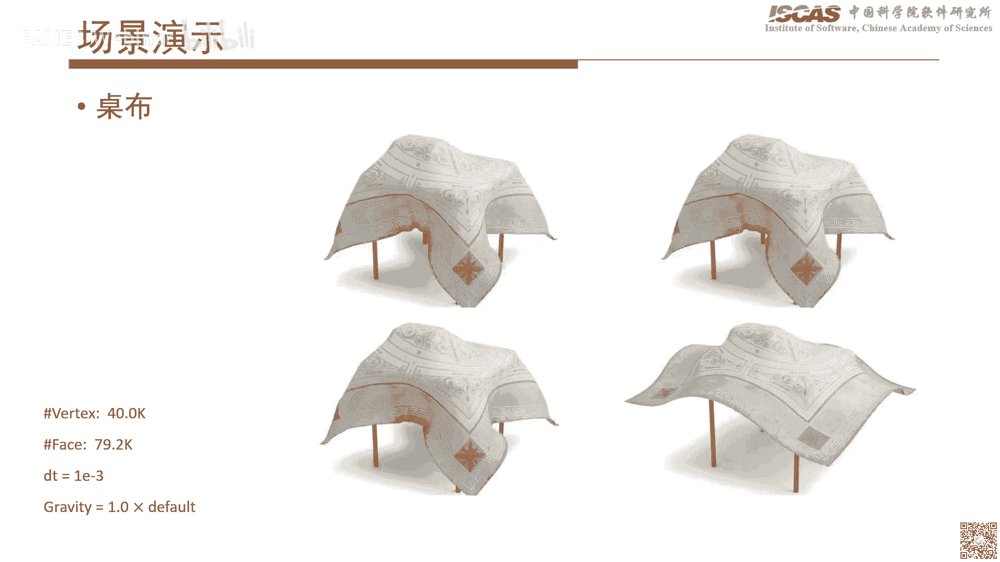

就是类似于桌布啊等等，这模拟，当然还有几个就是交交代交互的一些呃展示，当然这里边呃交互的一些场景，可能会有些一个小问题，就是因为前面整个我们现在实现的方法呢，实际上就是跟ib c其实可能差不多。

就是你如果一旦穿越出现穿透之后啊，他有可能回不去，所以这个因为其实也主要是ccd，普遍存在这个问题，就是cd它实际上你已经穿透了之后，他就没法，一般来说很难去判断它到底是不是已经穿透了。

所以这样的话就是对于这种交互问题，就是如果你比如说你事先设好场景，你让他去模拟一遍，这个一般来说问题不大，但是呢对交互的问题呢，就因为比如最简单的你用个鼠标，你不断去拖，这个时候很有可能。

因为你的鼠标的这个交互操作引入，你有可能直接就让他穿了，这个时候再去叫回来的话，会有可能会有一点问题。

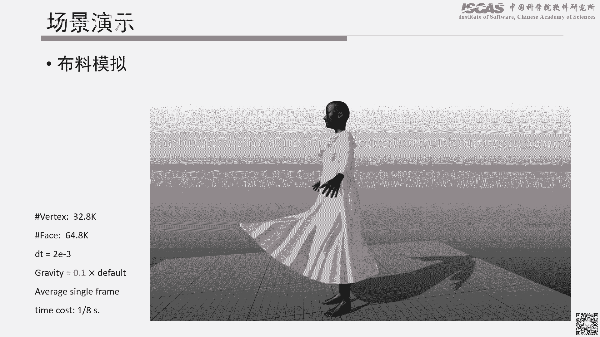

当然也有其他的一些场景，然后这个是一些其他一些阅读的一些啊论文啊，就是哦刚才那个有同学提到，就是那个paper是哪一个，就是呃我这样我标一下，其实就是这个就是刚才说的那个就这个paper。

然后有兴趣的话就是呃那个形式，就是那个力的那个形式啊，怎么导出来的时间可以去看这个这个赔本，然后另外两个是我们的自己的一些赔本，然后呃也已经放出去了，然后后面当然也可以结合代码再去看一下。

然后接下来就是我演示一下程序吧，然后因为这个刚才也讲就是，主要就是因为这周有事耽误了，所以有些代码可能还没放出去。

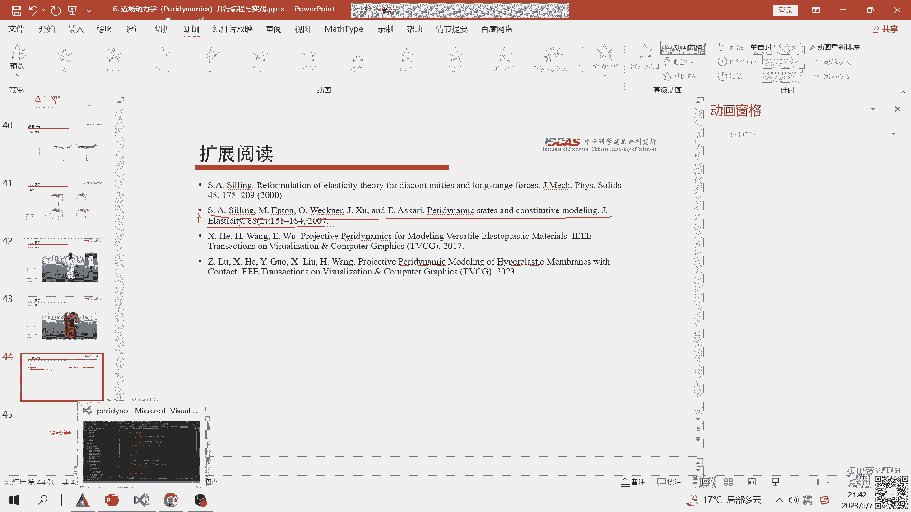

就是还没开源啊，所以这样我以那个呃私有仓的一些demo，我简单的先放一下吧，然后等到下次的话，我们因为前其实前面的话我们已经讲了啊，包括钢体，包括那个流体啊，然后这次主要其实就是针对柔性体以及啊。

当然碎裂的话，我们现在可能目前还呃还不能开源，就是所以主要是想针对柔性底这几块，这样的话就是嗯，因为前面讲的主要也是各个技术的实现嘛，然后但到目前为止可能还没有太，除了第一节课讲了一下框架性的层面啊。

就是因为比如像研究的话，其实很多时候我们也是比如说呃，我们第一步肯定实现为主，然后实现完了之后呢，后续我们可能就需要考虑，比如这个这个东西怎么使用，比如说我们自己写了一个算法模块或者流体，这个模块。

然后呢怎么跟其他的那个模块或者是算法，怎么给他耦合起来，然后呢最后去搭建一些复杂的一些场景，那这样的话就等下次课的话，我结合前面的那几个啊，比如结合钢铁啊，流体啊，跟柔性体这几块啊啊。

这样的话去到时候综合的去搭建一些场景，然后呢到时去演示，怎么去把各个不同的一些仿真技术啊去串起来，因为其实这个东西还是在仿真里，其实还是相对比较比较麻烦，所以这里边可能有些呃一个是框架层面要解决。

第二个当然可能是一些核心技术，我们怎么样去解决啊，所以这个首先第一个是，然后这里边实际上这里有个目录，大家后面应该整个整个上去，实际上就包含我们整个paper里的，所有的一些样例啊。

就是应该都是一对能对上的。

当然现在主要是可能，有些部分代码可能也没有优化，所以呃或者可能没整理的特别完善的话，有些目前就说可能还需要进一步的再整理一下。

嗯然后这个是一个这个是单层的一个布料，然后单层布料的话，其实当当这规模设的比较小了，呃大概是120x120啊，我要没记错的话，所以这样的话相对来说也比较快，然后当然这里边整个瓶颈啊，实际上就说一下。

就是前面当然整个包含global local两部啊，但是呢其实你发现这种场景就是带自碰撞的呃，解决这种连续碰撞的这个问题的场景，他整个瓶颈呢依然在于碰撞的一步，就是它整个仿真计算。

就是整个弹性求解这块应该是非常快的，但是呢因为像尤其是到后面，比如说你涉及到呃已经快接触的时候，这个时候呢会导致他整个时间不长，就是因为这个接触的存在啊，导弹那时间不上会卡的非常的小。

这样的话实际上会影响他整个仿真计算的这么，一个一个效率，所以他现在其实瓶颈里发现，它依然还是在接触和碰撞这一块，然后比如像嗯到这个时候了，这个时候呢实际上很多的呃三角面片，它实际上离得已经非常近了。

就是其实你肉眼可能看的话，其实可能就已经连在一起了，但是呢你实际上去解的时候，你这个时候依然不能让它出现穿透啊，所以这个时候就呃，呃会比较影响这个它的那个一些性能。

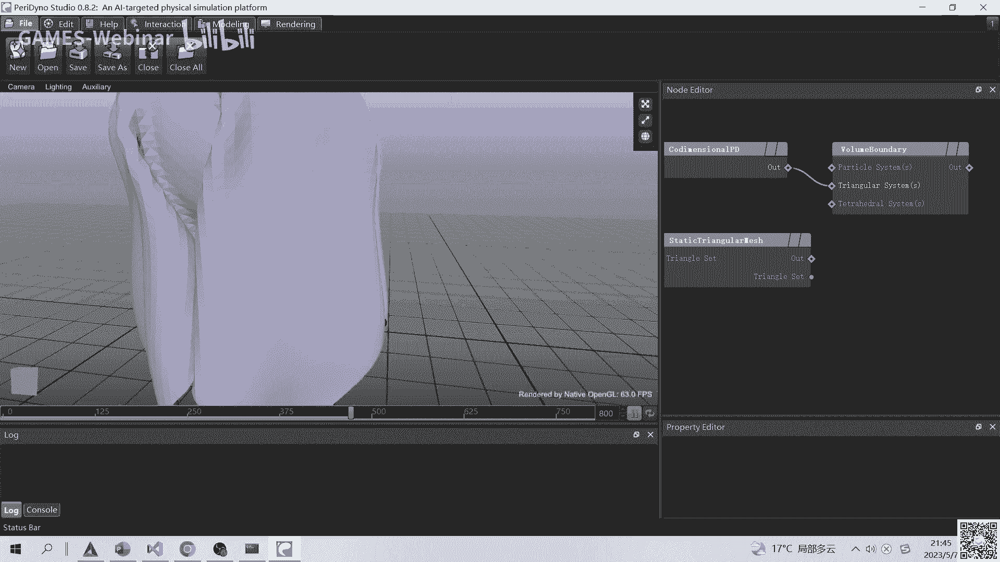

然后当然还有其他的一些，比如说像那看啊，这个是类似于布料的那个那个demo，那这个整个也是那个我们罗子祥的工作，然后他应该也在那个助教的一个群里边，然后有问题也可以直接问他。

这笔记本可能还是相对相对比较慢啊。

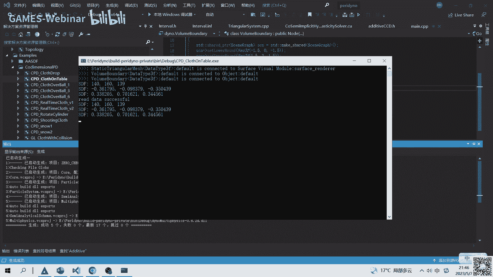

这个现在用台式机跑的话，最新台式机的话应该还可以，比如这样的这个就是一个类似于布料呃，就是呃其实就是ppt里的那个布料。

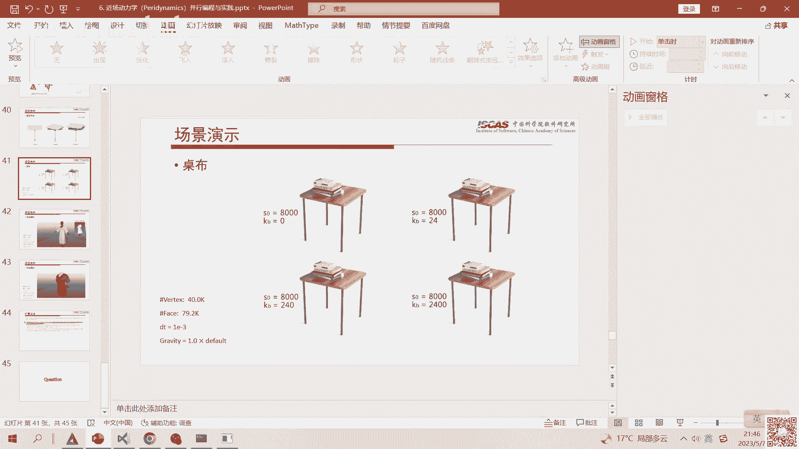

跟桌子碰撞的这么一个一个场景，所以这个当然跑起来的话也可以，那这个规模可能相对大一点，就是可能没有那么快啊。

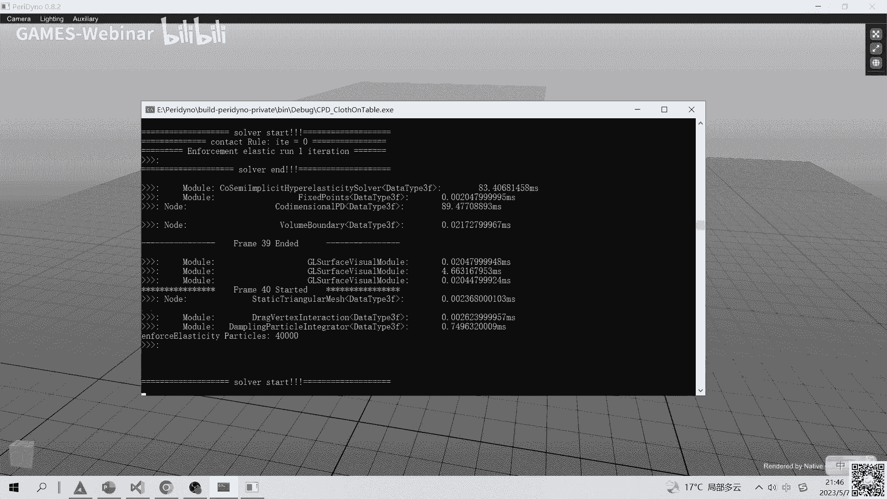

然后可能需要稍微等一下，这样我整个就那个啥了，不跑完了。

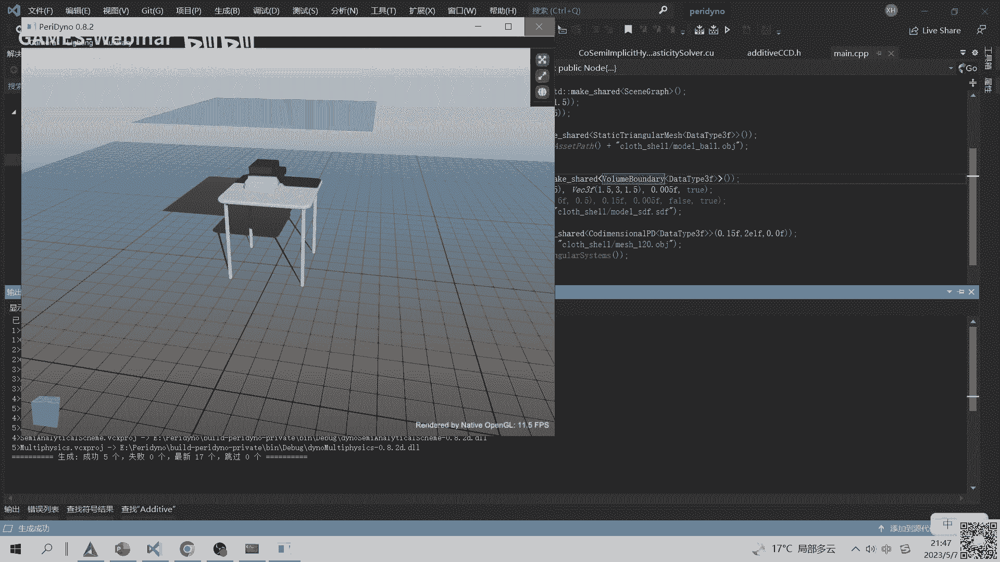

然后等后面整个放进去之后，然后大家可以挨个去试一下，然后后面还有其他几个，比如像这个是一个类似于测试这个布料下垂的，然后还有就是多层布料的，比如像这个实际上是一个多层布料的，这么一个场景。

嗯对这个是差不多几层。

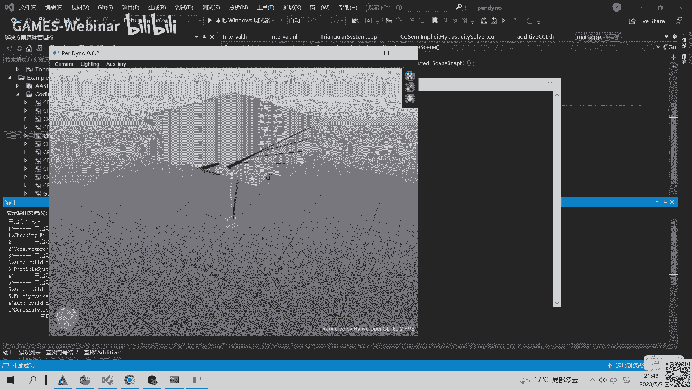

我看一下啊，12345对，这个应该跟paper里的一个是对上，就是差不多有六层，不料看对，就这类似这样的一个场景，然后这个后续的话。

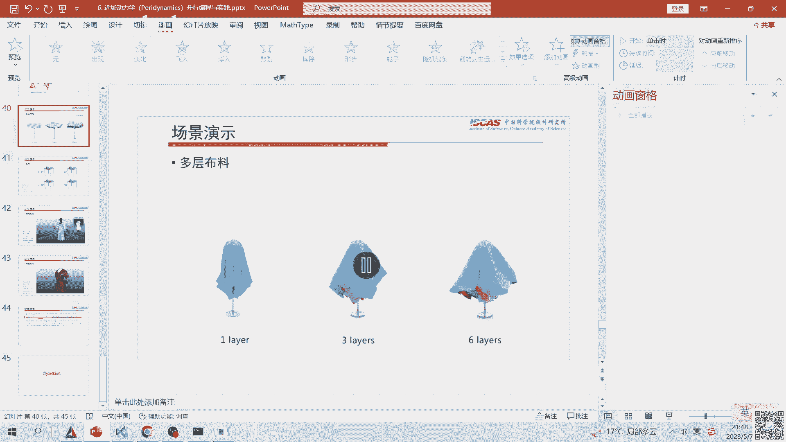

反正这个我就我就先不跑了，就是后面的话直接到时候等开完之后，然后大家可以自己去试一下吧，然后其他的，比如说是这里边有一个这个布料旋转的，然后带呃不同的这个嗯可以测试不同厚度的，当然还有就是。

当然这里面可能有些代码可能会稍微整理一下。

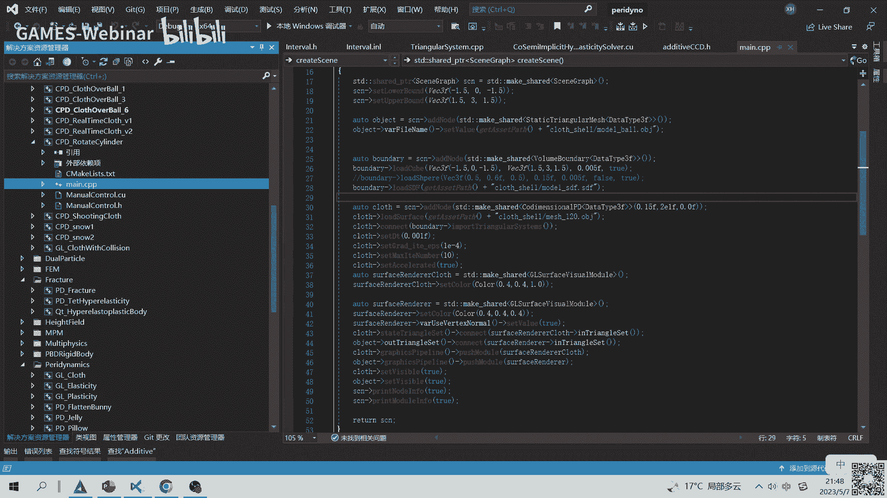

那整个价我今天讲的差不多就这些吧，然后呃后续的话这哦另外我可能要讲一下，就是因为后面我刚才也讲了，就是还是先就是后面我们看有没有可能把呃，各种的技术看怎么给它串起来，所以呢后面有可能呃会有一些额外的。

就是我们这边稍微花点时间，当然包括一方面是整个代码能调整一下，第二个呢要整合一下，所以后面这两次课就是在参考之前，因为混动还有两次课，那两次课的话呃周期可能稍微调长一点，因为主要最近可能也有一些别的事。

所以呢后续的那一刻就是最后剩了两次，改成两周一次，就是下次的话就相当于是我说一下，就是嗯下次的话是21号上，然后再下次的话，6月4号正好是上后门的两次啊，然后主要这个时候说一下别的就没啥。

然后看看大家还有有没有什么问题，然后我们也可以讨论一下，行要不我看好像那个直播间应该没啥问题啊，就是今天因为主要还是讲的啊偏理论，所以这样的话就是很多内容可能不是那么快，能接受。

我估计啊就是这个等到后面，然后这样，反正我觉得学计算机的，只要有代码的话，然后结合理论，一般来说解能逐步的入门，就是这样的话，我觉得应该后面有代码之后，可能能进一步的去加深这一部分。

今天讲那些那些理论嗯，行那我们今天的课我们就先到这儿，然后呃后面的反正有什么问题，我们可以呃，我看有说这些代码可以在哪里获取啊。

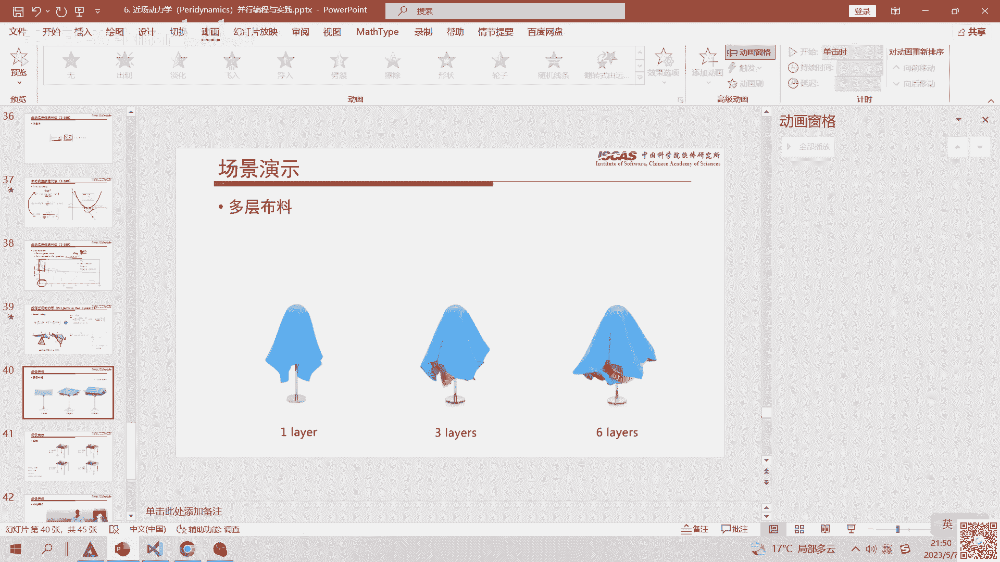

就今天刚才说的这个今天的这些代码。

刚才讲就是还没有开出去，然后以前的代码呢是这样，就是这个，当然这个是我们的那个，相当于这个是我们的一个类似于文档这样的，一个呃，就是我们这个开源舱呢，就是类似于我们这个项目的这么一个有网站啊。

然后这里边有两个仓，就是一个是github的一个仓，然后github仓呢，当然这个我好像没点代理，可能练不了啊，然后还有一个呢是一个马云的仓，然后马云的仓，当然这两个目前就是这连跪的。

实际上都是我们已经开出去的，然后就上次包括那个缸体的演示，两力以及呃s p h演示的样例，其实都已经开源了，也就是说这里我们课上讲的这个，所有的这个样例，实际上后面实际上我们都是会开源到建立边。

就这两个这两个舱里头，然后当然有些就是有些可能。

后面也会逐步的去完善，当然因为刚才讲的那个这些是在私有仓里边。

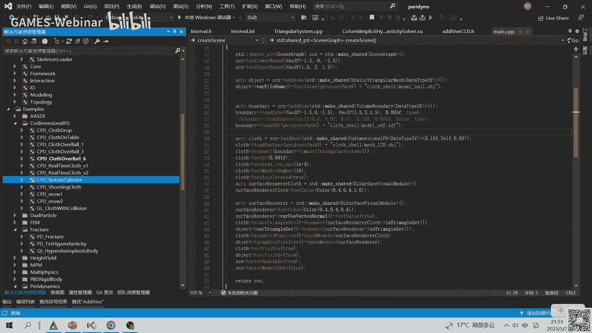

这个私有仓因为我们得整理一下，整理完了之后，我们的后续的话会推到这个开源仓，然后就是github开源仓，然后到时候从这里边，就是因为下次课之前，应该这个就到时候给他推上去。

然后这样的话大家可以去试一下啊，行那我看今天也比较晚了，那要不就今天的那个课，我们就到这儿好。

