# GAMES401-泛动引擎(PeriDyno)物理仿真编程与实践 - P7：7. PeriDyno插件与功能拓展 - GAMES-Webinar - BV15M4y1U76M

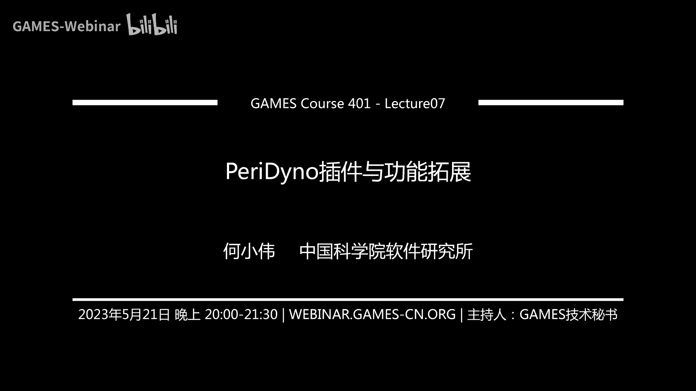

没有我看那个时间也差不多了，那这样我们开始了嗯，然后这次是这样，就是嗯主题实际上就是讲一下，那个该拿的那个系统的，然后里头的一个插件机制啊，然后以及就是一些相关的功能吧，然后当然这个今天讲的内容。

可能会相对来说就是会散一点，但是其实你实际上就是目标实际上只有一个，就是因为前面比如说我们实际上也已经讲了，就是说像比如包括像流体啊呀，像总体，当然其实还有一些其他的技术啊，有些没讲的。

比如说这里边那这样的话，我们实际上就比如说把这种呃，各种各样的这种技术啊，然后相当于怎么能给它给它串起来，然后相当于能在一个呃一个整体的框架里边，然后相当于比如说各个模块之间协同起来之后。

然后去比如说搭建一些那复杂的一些场景，实际上，所以今天这个目的，实际上主要是讲究说，怎么利用这个paradio这个框架或者插件套，这套机制，然后相当于就是把各种的那个技术，然后整合到一起。

然后整个今天的那个啊大纲啊，这是今天大纲，所以分几部分，那个当然首先概述，然后呢，实际上这里的比较重要的一个是c加加跟蓝图，然后这个实际上也是那个整个系统啊，就是整个pd那个系统。

现在呃相当于是一个基础性的一个东西，然后里边包含包括反射呀，回调等等，这些会降一下，然后另外就是啊会讲一下，就整个插件的那个设计的一个激励，然后但还有其他功能以及一些反制案例啊。

然后当然这里边其实还是得可能还得说一下，就是因为本身这样就是做仿真，这里的看你怎么做啊，如果比如说前面讲了，你针对的可能只是某个特定算法，其实是这样这种情况的话，比如说你实际上呃你有没有框架。

或者有没有这个引擎，其实可能呃区别不是特别大，然后呢，刚才讲的实际上就是这里的主要的问题在，就如果出现，比如说嗯，很多时候，你实际上你可能相当相当于需要很多的模块，相互依赖，然后呢或者是需要协同开发。

那这样的话就是怎么相当于有这个框架之后，或者有这个引擎之后呢，怎么能更便捷的这个相当于能配合起来使用啊，那所以这里边实际上就是呃接下来要探讨一下，就是因为呃这也是实际上也是我们从啊，过去过去的在研究。

比如到到当然也相当于有一些工程应用啊，这里这个过程中，然后啊就是实际上面临的一些问题，所以实际上本质相当于我们知道，就是从理论创新到应用，实际上它是一个很长的这么一个还有一个流程。

就是当然整个所有的应用，它这个起点它啊都是理论创新，但是理论创新但实际上是他的起点，但不代表就是说最后啊就是他可能就是应用，其实也不一定不一定是他的一个终点，所以这中间实际上面临着很多问题。

需要去解决啊，所以这样就是也结合我们前期的，就是说一些经验嘛，然后这样跟大家可以分享一下，就是这里边可能会存在的一些问题，当然这里总结下来的话，实际上因为呃我画了三个区域。

实际上分别代表的是呃从研究到比如说到研发，然后到最后到应用的这个整个完整的流程，当然它整个有可能是一个迭代子，每个过程，然后呢我们看一下每个每一步啊，实际上有可能会出现什么问题呢。

就是比如像我们原始单位那个整个研究，是我们一个原始创新啊，这个时候呢这个过程中，实际上就是大家对于科高校工科研院所来说，可能主要还是呃发论文为主，然后但是这个时候呢，实际上因为像整个实际上。

对于这个软件工程也好，或这个它实际上除了论文之外啊，它实际上它的整个呃代码呀，这个实际上也是一个非常宝贵的一个资产，所以这样呢就是实际上就是在发论文的同时，实际上理论上就是说。

我们怎么能把这个各种各样的这个各种代码，怎么能给他维护起来，所以像以往的话就是可能存在的问题，就是说我很多时候文章可能发了，但是呢这个代码可能就是啊，有可能当然当时可能还能用完。

但是可有可能过了一阵之后呢，就可能都不一定能在在哪能找着，或者是这样，就是因为我们知道这个整个软件系统的，实际上也会随着这个比如说你底层的库啊，或者是那个各种平台的那个更新。

它实际上很多时候需要不断的去，不应该升级换代，所以这样的话，你如果代码如果长期缺乏维护的话，会导致他整个系统或者整个代码，实际到最后可能就整个运行不来，运行不起，用不起来，相当于。

那当然最后其实际上还有就是你即使比如说，因为当然这个比如说呃比如前任的代码，实际上很多时候留下来之后呢，就是一般来说就是科研的代码，相对来说就是可能并没有那么规范，所以包括整个文档也好。

整个那个注释啊等等啊，这些东西实际上并不那么健全的，这样的话，实际上对于整个这种就是代码资产的传承，这个时间还是挺成问题的，那这样的话也就是说很多你会发现，就是呃就是你很多时候你论文虽然发了。

但是呢你实际上就是啊，真正你的相当于一些就是工程性的，比如你代码性的一些资产，就很有可能就是很难传承下来，当然这个东西实际上即使就是说你很多东西，最后传承下来，但是呢实际上你如果真的。

比如说因为我们如果到工程应用的话，实际上还是有可能比如说还要经历，比如说整个研发的过程啊，就是比如说对原先的一些呃各种的，比如说以往的那个研究代码的话，它可能接口数据啊，这个等等。

可能这个兼容性相对来说都比较差，那这样的话实际上可能需要做各种改造，然后各种测试等等，然后这样的话让他去把这个，整个相当于变得更好用，然后这个过程里边实际上就涉及到，就是因为它实际上你会发现。

它其实不单纯是一个工程问题，因为在如果在这个过程中，你发现就是可能有一些核心的，比如说有些法律，打个比方法律算法，它涉及到一些核心的一些技术的话，其实这个时候如果纯粹依赖的工程改造。

或者是就是另外工程人员去解决这个问题呢，实际上很多时候又又不太合适，所以这样的话实际上就是存在一个，就是说整个这个呃，呃就是说从你相当于说研究的一些呃，工作到呃应用的过程中。

然后其实会出现一些各种的一些问题，当然这个比如说到底谁来解决，其实也是一个问题啊，就是你发现这个当然最理想的肯定是呃，就是说相当于工程人员跟研发人员和研究人员，一起来配合来解决这个问题。

当然最后实际上就是到应用的时候，实际上也会面临其他的这种问题，因为具体用的话，实际上很多时候我们要到实际的场景里面去测，所以这里边可能会涉及到，比如说像性能啊，稳定性啊，可靠性等等，这个东西。

实际上都是呃可能都会有一个这样的一个问题，所以最终实际上就是当然如果在用的过程中，如果发现比如说可能存在一些新的问题，理论这个时候有可能又会回到，比如说我们的原石，我们一开始的那个啊起点。

就比如说我们的研究，从研究的角度可能进一步的说明，说白了就相当于我们又发现一些新的问题，然后需要从研究的角度去解决，所以你会发现整个这个逻辑其实是一个闭环啊，然后当然这个东西它实际上就是你会发现。

它需要不同的角色去参与，但是呢呃这里边实际上就是不同角色，你会发现他们之间配合实际上起来的时候，实际上是有协作成本的，所以呢实际上就是今天要讲的一个主要的一个，一个事情。

就是说那我们是不是有可能就是利用框架也好，或者引擎也好啊，然后呢，就尽可能的有没有可能去降低，整个不同角色之间的一个写作成本，那当然这个成本刚才讲的就是，其实不同的呃阶段，它的它的成本哪个不一样的。

比如说像那个像研究呃，其实他因为研究，整个实际上他面临的是一些不确定性的，一些问题啊，所以这样的话，实际上整个比如说我们像发一个论文的时候，他其实完整的流程就包括比如说像选题嗯，然后呢当然选完题之后。

比如说这个当然这个需求有可能是从应用来的，当然也有可能是，比如说是从比如说最新的一些，其他的一些科研成果里边，我们呃就是发现问题，然后这样的话，然后针对这些问题的话，我们去解决。

然后当然这个选题完了之后呢，可能有技术方案调研啊，算法实现等等，当然整个就是过程中可能就完了，之后大家还有对比啊，这个撰写论文，当然最后当然肯定是希望这些文章能投出去，然后各种投稿修改。

这个可能有可能会比较漫长，然后当然就是个整个时间呢可能也不太确定，所以这个你发现整个研究的成本，其实主要聚焦在实际上不确定性上面，但是最后的话实际上你论文相当于投资之后呢，呃当然你对于这个计算机理来说。

你代码是这样，当然你也可以开源，或者你可以考虑必然，当然这一甚至有可能实际上很多，我觉得也有可能很多时候是这样的，其实可能投完论文之后呢，你会发现，可能这个这个代码可能最后有可能也呃。

就可能就相当于就最后也没有用起来，所以有可能存在这样的一个问题，当然这个比较理想的就是说呢，这个我们已经做完之后，然后到研发的话，实际上可能就涉及到前面讲的，比如说啊数据规范啊，数据规范啊。

接口规范模块改造等等啊，就这些要当做到最后的话啊，有比如说到实际应用的里边，就会有各种应用场景啊，性能稳定性啊，这种模型等等各种测试啊，所以呢这样的话，实际上就是所以针对这些成本啊。

因为这其实每个对于每个角色，他其实他自己的那个领域里边，相对来说应该是比较呃专业的，但是呢就是它有可能如果出现，比如说他啊我们对比如研究人员，他要去解决工程问题的时候。

这个时候呢可能就是其实很多时候是不擅长的，那这样的话实际上引擎要解决的一个核心问题，就是说呢，实际上我们就是有没有可能通过引擎的，能让大家在自己的这个啊熟悉的这个领域里吧，去去深耕。

然后当然就是说比如说不同领域之间的，实际上相当于呃比如说通过这个引擎工具啊，这各种实际上它之间的那个写作，就变得相当于更方便一些，当然这个东西也不是说呃，你也不是说你不能去其他的这个领域里边去啊。

去做啊做事情，当然这个文章就相当于就是你跨领域的话，会出现一个什么问题，就是有可能因为你对别的领域不熟悉的话，会导致就是说你你可能以为是挖到了金子，但是呢，实际上有可能挖的可能就是这几个破石头啊。

所以这样的话实际上整个派单系统里的，实际上需要解决的核心问题，就是说那那相当于就比如说有没有可能是把呃，比如说编程人员或者研究人员，工程人员，或者当然还有设计人员等等啊，这个不同的角色呢。

实际上在相当于在这个系统里面，能够让他更好的信仰去配合下来来用，那这里边就是呃这里设计的，就是那整个派单的系统里面，怎么去解决这个问题，这里是比较核心的，实际上就是c加加跟那蓝图这个这么一个概念。

实际上本质就是通过啊c加加跟蓝图的配合，然后整个让仿真这个流程相当于更灵活，更那更好用，实际上是这么一个一个思想，当然这里边就是呃，许多有些人可能对蓝图是什么不太清楚，所以简单讲一下，实际上就蓝图的话。

如果以前大家用过，比如说用光略或啥的，这个应该就比较熟，它实际上就是一种啊，一种是叫合式化的一个编程界面，就是它实际上跟就是从某种意义上来讲，它实际上跟c加加解决的是一个问题，是一样的问题。

就相当于是通过一个编程式的一个方式，然后呢去完成某个任务，但是大家但是他这个东西实际上是一个呃，就是在可视化的一个方式，所以呢实际上就是对于就是说非这个，比如非计算机专业的，或者是非那个i t专业的。

实际上可能会更友好一些，然后呢这个我们可以看一下，这个整个real这个蓝图，它实际上是怎么演化过来的，就是实际上整个这个蓝图，包括这套这套东西，实际上也是软件工程，然后不断的呃升级改造。

然后逐步演化过来，所以其实你可以看早期的，比如说像u11 u12 里边二呃，那个其实他那个界面系统，其实你发现跟传统软件实际上是比较像的，因为它这个整个实际上，你发现实际上是一个标签系统。

就是呃他比如说针对某个对象，或者某个那个物体，它实际上就会有一个啊，类似你发现这样的一个属性链或者事件液，然后呢，这个东西呢，实际上就是当你发现这样的一个最大问题。

就是它实际上很多的功能实际上是固化在啊，这也就是你相当于先写程序的时候啊，很多时候你需要把这些东西，事先就就需要定制好，那这样的话实际上呃，我就是对于后面如果打个比方，我们比如说想做一些灵活的重组啥。

这个东西可能就会比较麻烦，但是我们知道实际上很多的任务，实际上是他需要不同的对象，或者是不同的组件之间相互配合，然后他们就比如说可能有一些数据传递啊，或者有消息的一些传递等等。

这样的话实际上对于这种这种方式啊，实际上并不太实用，所以到后来的你会发现就是像到u e3 里边，那逐步就已经有，就是现代的那个我们这就是最新看到的那样，让瑞尔蓝图的这么一些呃原型的一些概念了。

它实际上就相当于是通过把不同的一个组件啊，它实际上就是组件化，组件化之后呢，实际上就是不同组件之间呢，再比如通过数据传递啊，然后通过图的这种方式，然后给他给串起来，那这样的话实际上也就是说很多任务流程。

他这个时候你会发现，它实际上呃就不是固定的了，就是它不需要，就是说你相当于整个编程的时候，或者是整个研发的时候把整个任务流程固化，它相当于给后期的一些应用啊，或者后期的一些呃，在设计的话。

实际上提供了一些，就是动态的和配置的一些能力，当然我们看最近的最新的就是从u14 开始啊，u14 开始之后的话，实际上就是看到的呃，最新的这个蓝图的这么一个样子。

然后他这个东西就实际上就已经啊比较方便了，然后整个相当于就是呃，其实对于一些，比如说没有特别复杂的一些任务吧，它实际上就已经完全可以做到，就是说你不依赖于任何的c加加代码。

那这样的话你也可以相当于直接用这个，整个用各种拖拽式的这种界面的那个形式，然后把一些任务去搭建出来，所以这样的话，实际上对于就是说整个比如说你对一些任务，对于这个非计算机领域的这些呃。

这些比如设计人员来使用的话，这实际上是比较方便的，然后当这个整个你发现就是说u u一这套东西，实际上还是呃比较复杂的，就是呃它里边如果大家去看那个基础代码的话，我估计应该没有多少人。

估计能把整个代码都看一遍，因为里面包含的东西太多了，所以呢实际上对于就是整个拍摄单独系统啊，虽然我们实际上也是啊需要去构造，这个当c加加是底层的代码，它其实也是需要去构造这个蓝图。

那这样的话这个蓝图实际上我们是不太可能，就是说我们去构造那么复杂的，因为考虑到这个东西，实际上是一个太阳的一个系统，因为canyon的一个系统，其实最大的呃一个问题，就是他很多时候他的投入。

实际上是就是包括人员，包括资源的投入肯定是这样，肯定是不会说是特别的稳定，那这样的话，实际上我们要解决的，就是说怎么能在一个比较小的一个，维护成本下边，然后相当于能把一套类似的这么这样一套。

这个系统实际上给大家去搭建出来的。

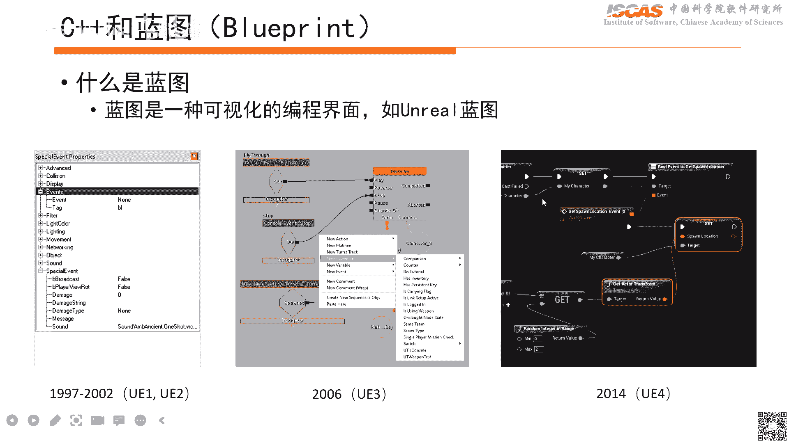

然后当然就是说有道系统之后，它整个蓝图当然有些好处啊，就是比如说像主要是简化任务流程，然后降低研发成本，因为这个东西实际上我们知道，整个呃如果全去依赖，就是编码人员去做处理各种任务的话。

这个东西实际上这个是非常啊，这个相当于非常吃不消的这个东西，所以这样的话，实际上对一些比较简单的这些任务的话，实际上就是我们希望通过这个蓝图呢，来去释放这个比编程人员的一个压力。

然后比如说最简单的打个比方，就是比如说我们设计了一个仿真模块之后，但是呢这个仿真模块呢，实际上他可能在不同的啊参数下跌，实际上可能就是有不同的一些计算结果，那这个时候呃比较简单。

当然以往你如果bi蓝图的话，你可能就这样一种可能就是啊你写一堆脚本，然后呢，每次你可以可以比如读一堆脚本的那个参数，然后当你通过脚本来运行，进行批量的那个去去更改，然后去测试。

但还有一种就是你不断的去改，程序里边的那个参数，但这个东西就c加加的话，整整的，因为它实际上是一个啊，它是一个编译的一个语言，也就是你每次改完之后，你重新再去编这个，实际上这是整个过程。

它实际上会花费比较大的一个开销，然后当然这个还有一个就是呃就是蓝图，一个最最重要的一个作用，时间就是嗯它实际上是和一个团队之间的协作，主要其实尤其是在比如说像呃设计人员，以及就是呃编程人员之间。

就是可以进行一个无缝的一个剪辑，所以那接下来我们来看一下，就是那针对这么庞大的一个系统，就是刚才讲究rea，如果是真的让瑞那样一个庞大系统，实际上这个是不太可行的，所以呢这样，接下来我们看看。

就是presidental里边就是怎么通过，就是就是一个相对的相对轻量的方式啊，然后把这个cr这个蓝图，这整套东西给它构建出来，所以这里吧实际上其实说起来很简单，就是其实主要现在这样。

整个呃pdl里的蓝图实际上主要依赖两个东西，一个是反射，另外一个是红，实际上就依赖这两个东西，然后相当于对于比如说底层的一些对象也好，或者一些属性也好，相当于相当于从整个框架层面。

对它进行统一的一个管理，然后当然有了这两个东西之后呢，实际上整个目的其实也比较简单，实际上就是相当于我们最终目的就是希望啊，实现，就是说这个代码运行逻辑，跟啊界面运行逻辑的一个统一。

但这里边实际上这个东西呃说的有点呃，呃笼统啊，但实际上这里边，因为我们知道这个整个代码运行逻辑，实际上它的功能肯定是远远超过这个整个界面，运行逻辑的，但是呢，这里边因为我们针对的实际上是一个仿真任务。

就是仿真任务呢实际上它本身要比通用编程，它实际上就是它因为它实际上是更特殊的一种，一种任务，所以呢实际上很多时候呢也不需要就做到，就是说呃跟通用的一个编程，就是它实际上不需要具备一个。

通用编程的一个能力，所以这样的话实际上就是针对这个仿真任务，实际上所以整个派单的系统啊，实际上是针对仿真这个特定的一个任务，然后相当于去进行的一些特定的一些设计，然后让他实现了这个呃代码的一个一个逻辑。

就是代码逻辑跟界面的逻辑，实际上看起来差不多是一致的，然后当然这两个逻辑其实从比如说从这个呃，从视角来看，实际上就是这个代码逻辑对应的实际上是我们，比如说是研发人员的一个逻辑。

都会说是程序员的这么一个逻辑啊，然后当然后面整个界面逻辑，实际上对应的是用户的一个逻辑，就是比如说我们实际上现在有很多这个，反应算法，那这样的话实际上我们对于就是后期用的话。

比如说我们可以利用已有的一些算法，然后去构建各种各样的一些仿真任务。

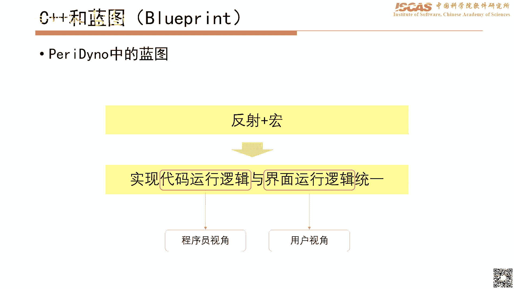

那接下来就是我们看看，就是呃，就是在里边那个蓝图对应的这个c加加的，就是说这两个逻辑啊到底是怎么统一起来，实际上因为上之前第一次课的时候讲了，就是整个pdal实际上它有四层的一个架构。

就是咱最顶层实际上是可以有个场景图，然后场景图呢实际上是有一系列的这个，节点构成的，当然节点里面还有模块，然后那样当然最底层的是，实际上是有这么一个呃field的这么一个概念。

就是它实际上对应的是各种各样的，各种各样的数据，就是这个feel的里边其实是包含呃，因为是这样，主要针对的实际上是不同的功能啊，就是这里边其实主要分为几类，就是一个是控制变量，一个是状态变量。

然后呢当然还有输入跟输出，当然这个节点实际上对应的是这样，就是只是一个就是创建一个cube，这个是在model这个库里头啊，就是啊比如说创建这么一个对象之后，它实际上会生成一个boss。

然后当然对应这里边呢，它主要的对应的控制变量，因为比如说我们一个boss的话，我们需要去控制它的，比如它的边长，然后另外就是它的表面网格，比如说我们想给它剖分成，比如说是三角网格或4k形网格的话。

那这样的话，比如说有还有一个分段数的这么一个概念，所以呢对于这个主要的控制变量，其实就是它这个里边其实是定义了两个，当然这里边其实因为它主要继承呢，还有一个叫prometric。

parametric model这么一个一个父类，然后这个父类里边其实定义了包括像平移，就是缩放，旋转等等啊，就是所以你看后面啊，就是右边那个图，实际上是展示了完整的这个控制变量。

然后这个控制变量整个实际上会，如果你调这个控制变量啊，实际上他会去控制，比如说因为这里边还有一个概念，就是状态变量，什么意思，就是它实际上就是描述这个整个节点，它所需要的一个最小的一个状态集合。

所以这个状态变量，实际上就是用来描述这个节电的一些一些量，然后呢这样的话，实际上整个控制变量实际上就是呃，也就是这些控制变量定义了之后呢，它实际上会去更新这个状态变量，然后利用这些状态变量分析之后呢。

实际上就得到相当于整个你，相当于最终的这个节点应该是一个什么样子，当然这里的还有就是当然像这个模型啊，它实际上还有一个一个输出，比如他输出一个标准的一个啊这个立方体，当然还有就是其他的。

就是比如说你像有些节点啊，为什么后面我看有些节点实际上是会有输入的，所以笼统的讲，实际上就是像pc gal里的这个，整个c加加跟蓝图啊，就是这个层面上来看，其实节点它其实主要它的节点面对应的。

实际上是界面上的这么一个，就是这个是节点编辑器里的一个这么一个图案，然后这个图案就是跟这个c加加整个代码，你会发现其实各种元素实际上都是一一对上的，当然这里包括还有一个就是啊这个状态变量。

然后这个这个quset，然后这个状态变量呢，实际上是在这个右边那个界面里头，就是它下面还有一栏，这个栏杆那个没没显示出来啊，就下面那栏的话，实际上就就会显示这个有这个节点的一个，所有的一个状态变量。

所以你发现就整个就是实际上，比如针对这个一个cube这个节点啊，所以就是啊这个图形化的一个界面，它跟整个c i a底层的那个逻辑啊，这两个东西实际上就是通过这里边，因为这个实际上是一个宏定义。

然后通过这个宏定义呢，实际上是把这整个东西给统一起来了，然后当然这个是一个单独针对的是一个节点。

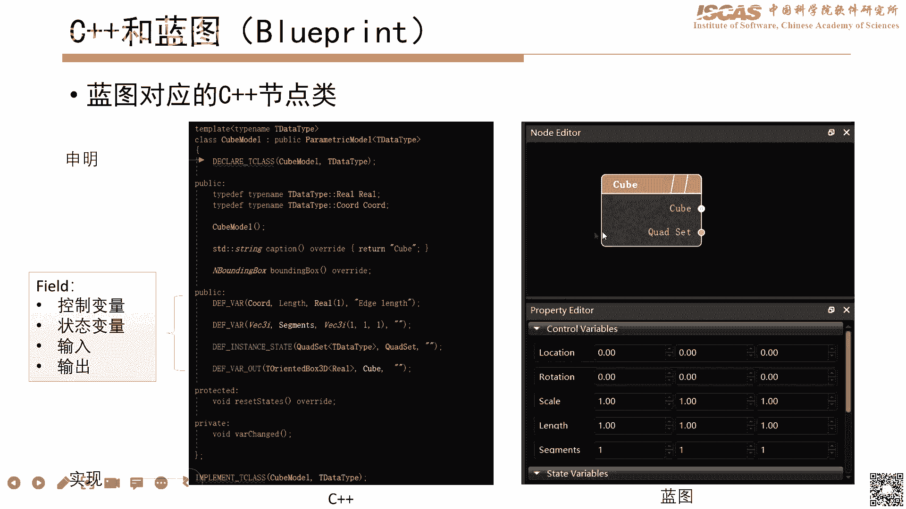

然后那这样的话如果针对的是一个场景，一个场景的话，实际上就是要呃相对复杂一点，就是因为它实际上一个场景列表可能会包含，就是说呃各种各样的一个节点，然后当然这个节点之间呢又会有一些，比如数据传递。

比如从上一个节点，它需要比如传递数据到下一个节点啊，那这样的话实际上不同节点，它构成了这么一个啊一个，其实这是一个有向无环图，叫做就是然后它相当于它所有的数据流，就是实际上就是从会从前面，然后传到后面。

然后将所有的节点组合起来之后，当然包括中间的那些连线啊，组合起来之后呢，它实际上对应的就是一个场景，当然这个右边那个实际上你看到的是一个呃，是一个图形化的这么一个场景图，然后当然这个左中间那个视口。

是它显示出来的效果，然后对于这个场景呢，它实际上有一个完全一样的一个c加加的一个，代码的这么一个视图，然后这个代码呢，实际上就是它整个实际上就创建一个，那这个代码可能比较小啊。

这样我直接从呃代码里面看一下，然后这个代码在有个叫tot water ping的。

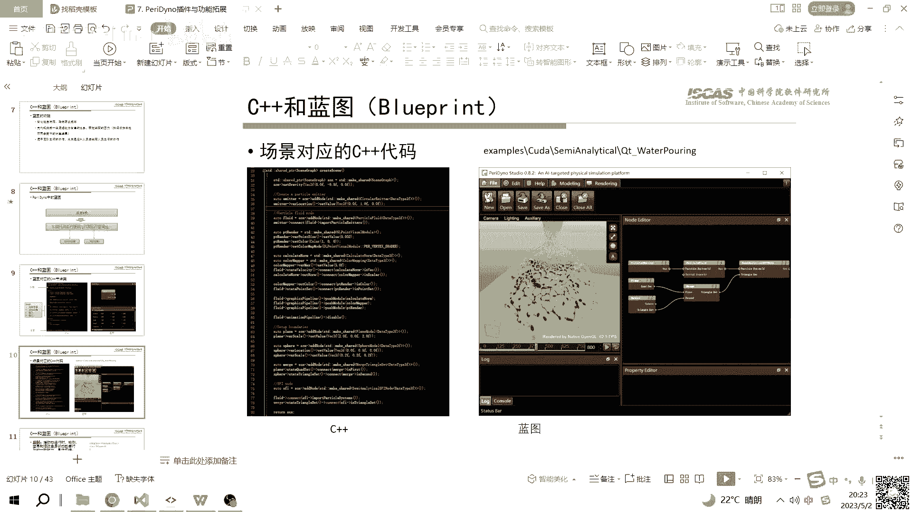

这么一个阳历里头，嗯在就这个，然后你打开这个类的话，你会发现就是呃整个代码也不多，实际上就相当于它因为它整个所有的这个实现，它其实不在这个这个门函数里头，有门函数只是去负责创建这个这个场景。

然后相当于所有整个场景，它包含哪些要素呢，就是首先它是这样需要创建一个场景，当然这里边可能需要设置一下啊，比如你的重力啊，你这个需要设一下，然后这里边有几个节点啊，我简单讲一下。

就是第一个就是因为它整个是一个流体啊，就是留下来的这么一个一个效果，所以呢首先就是这里边就需要创建一个发射器，然后呢需要当然这里边创建出来之后呢，它需要添加到这个场景里边。

然后当然就是每个场景就每个节点呢，同时它会有呃一些属性，就是比如你这个发射器应该放在哪个位置，那这样的话，你可以通过这个去更改它的那个位置，然后这个有了之后呢，他们后面要接一个流体的一个求解器。

然后相当于把发射器里边创建出来的那个例子，然后输送到这个流体的那个求解器里头，然后呢，这里边实际上当然这里这里有一个这个输送的，这个过程啊，这里有一个叫连接的这么一个一个函数，然后这个函数的指令。

跟刚才看到的一个图形化的那个是一模一样的。

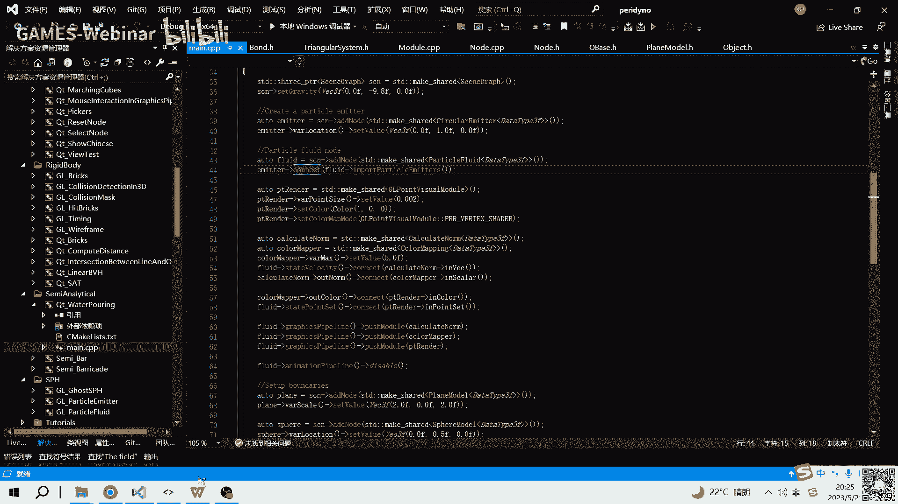

就是这里边实际上你会看到这里连过去的话，实际上正好有一个有一根连线，这个代表的就相当于是前一个节点的数据。

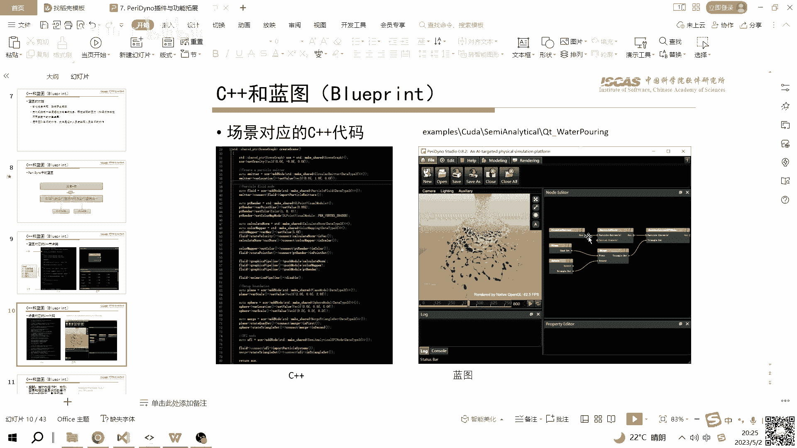

要连入到后面那个节点，然后呢这样的话这个流体这个节点，然后实际上就创建了，当然这里边还有一些，就是因为整个实际上你需要把啊，所有的那个就是比如流体，它实际上是一个粒子系统，所以就因为正好是前面讲的那个。

s b h的那些方法，那这样的话你和额外的，你可以加一些辅助的一些额外的模块，然后用于把这个比如说把流体给他渲染出，然后当然这个场景呢还加了一些边界。

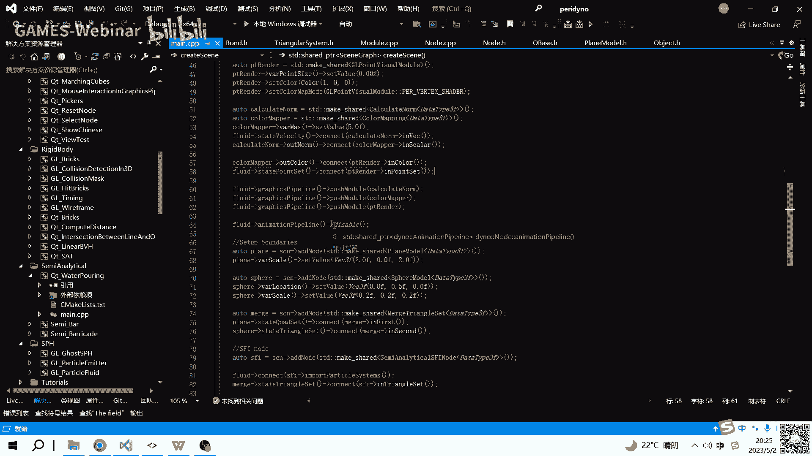

就是后面的那些节点啊，后面那三个节点，实际上，而且后面最后一个实际上是一个，留给我回了一个节点，因为它实际上是跟这个表面网格，它会产生一个耦合的一个作用，那这样的话。

实际上就是这个后面那个流过火的节点呢，需要接入一个流体，然后当然还需要接入一个表面网格，然后这里表面网格实际上包含两个，一个是中间的这个一个球的表面两格，然后当然后面底下还有一个平面啊。

然后这两个东西然后呢是合在一起之后。

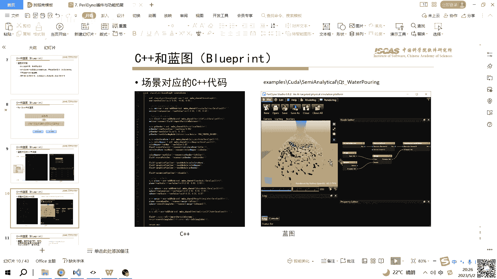

然后再输送到后面那个节点，所以这个整个后面实际上是在创立边界，然后这个边界实际上就包含一个平面，然后再包含一个一个球，然后打到最后的话，需要把这两个合起来之后，然后传入到这个流过火的这么一个节点。

所以你发现就所有的数据的话也是一样的。

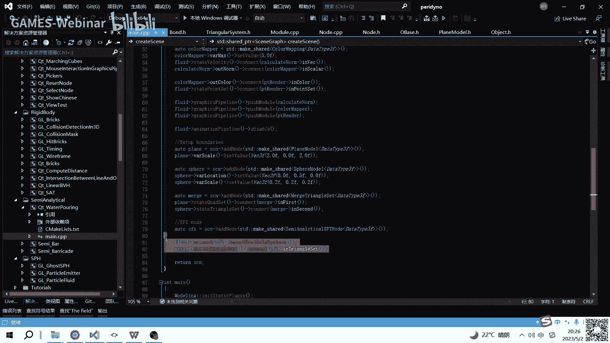

就相当于他实际上都是通过这个connect connect，对应到这个ui里边。

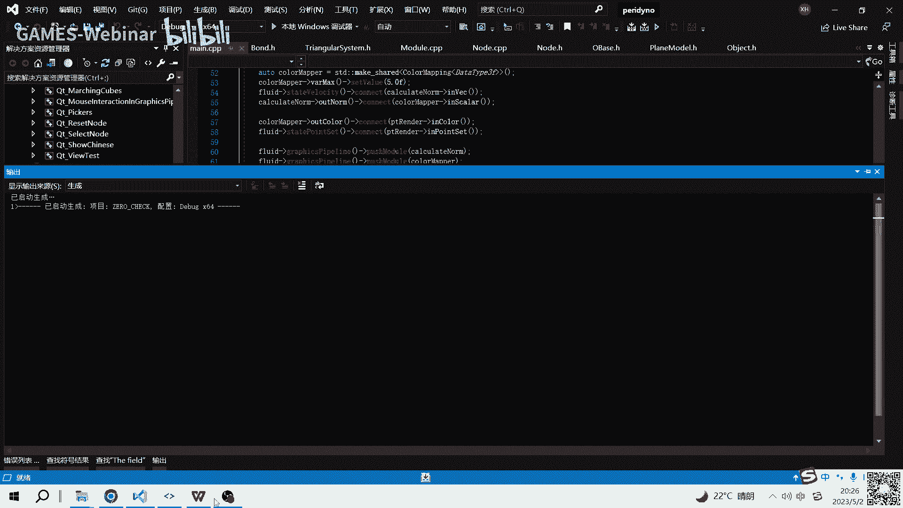

实际上就相当于是你把这个数据从上一个节点。

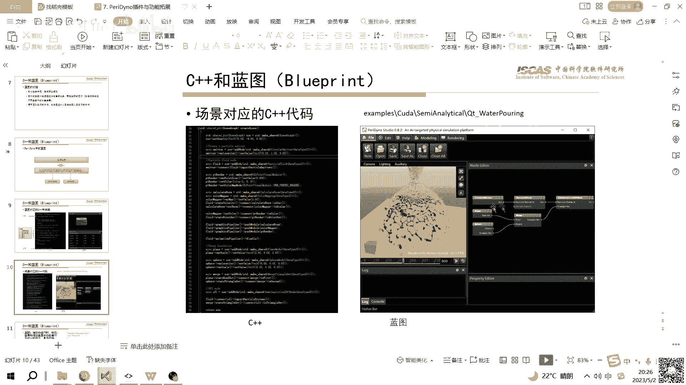

然后连出来，连接到下一个节点，然后这里我们可以跑起来，可以看一下。

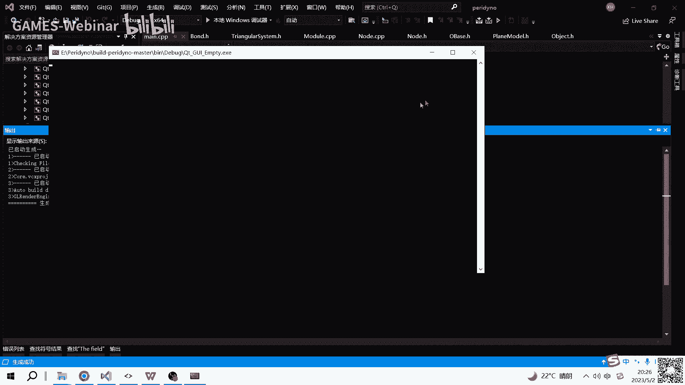

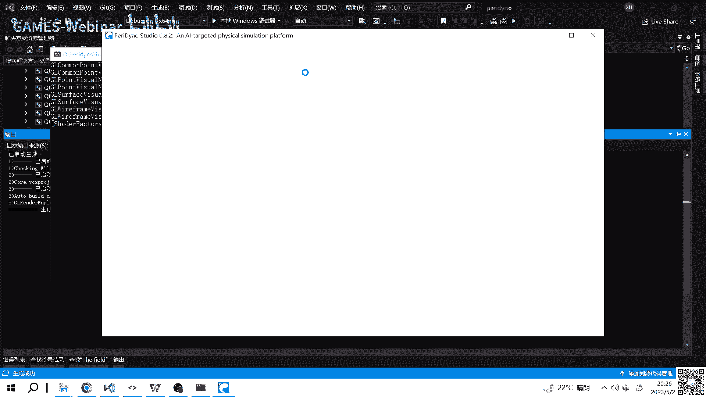

对哦这个好像启动错了。

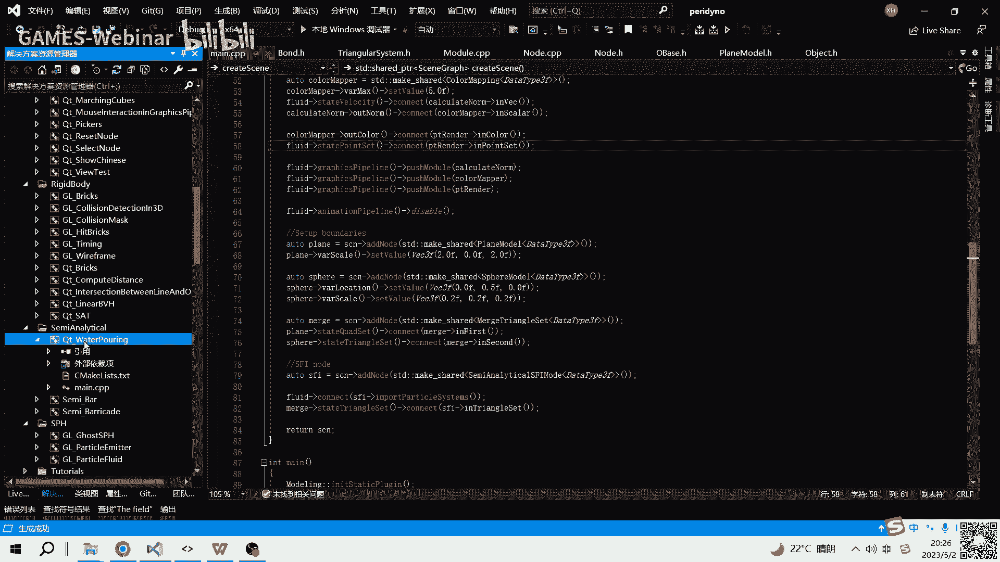

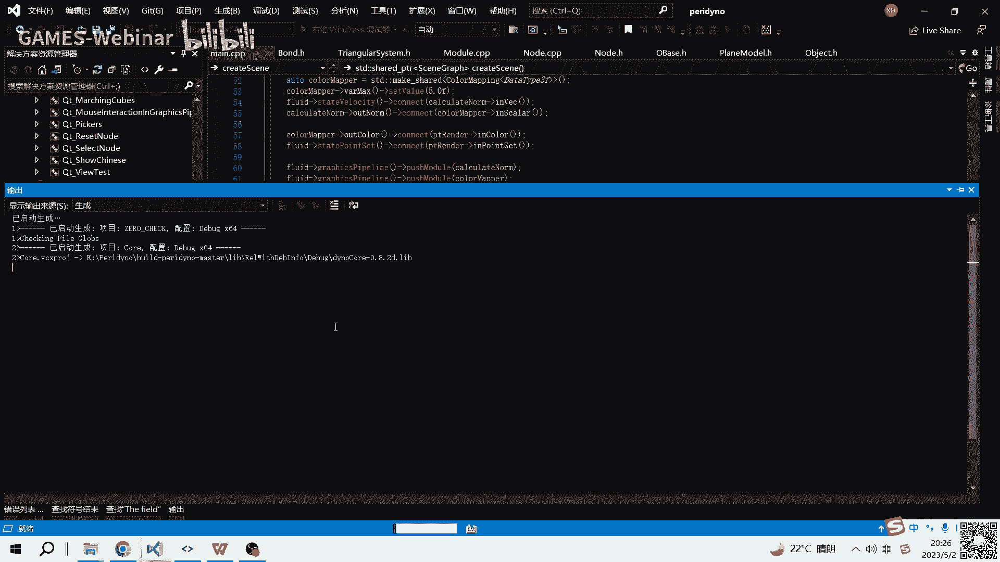

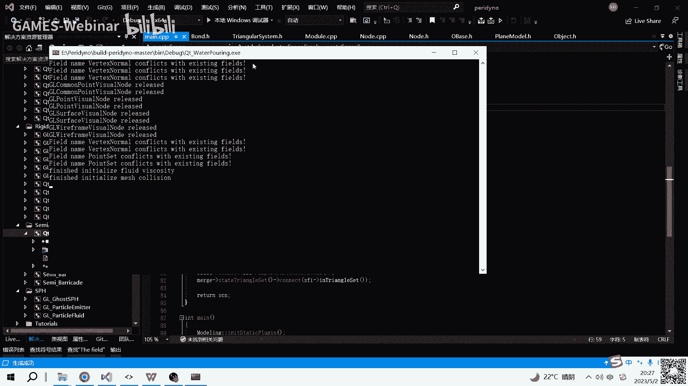

实际这个就相当于整个场景就跑起来，然后这样的话，实际上你可以看到就是呃这个对应的，实际上是c加代码的，对应的一个核化的一个节点节点图，然后左边那个其实就是呃，最后可视化出来之后的一个效果。

当然当然这里边你点开始之后啊，然后你就可以看到整个流体，其实从上面因为有圆形的一个发射器啊，那圆形发射器里边流出之后呢，然后正好就是沿着这个呃球的那个固壁，然后相当于往下流。

然后到最后他会落到那个呃那个表面上，我看那个直播间里有问qt打的g i g u i，对这个整个goi是用qt打的，对，行这个，那我就先把这个关了，然后大家有兴趣可以自己就可以跑一下。

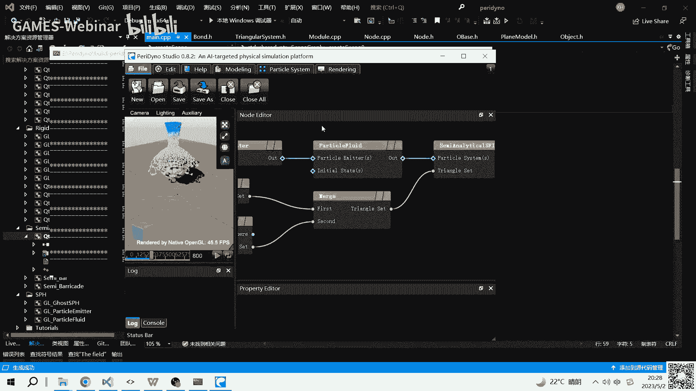

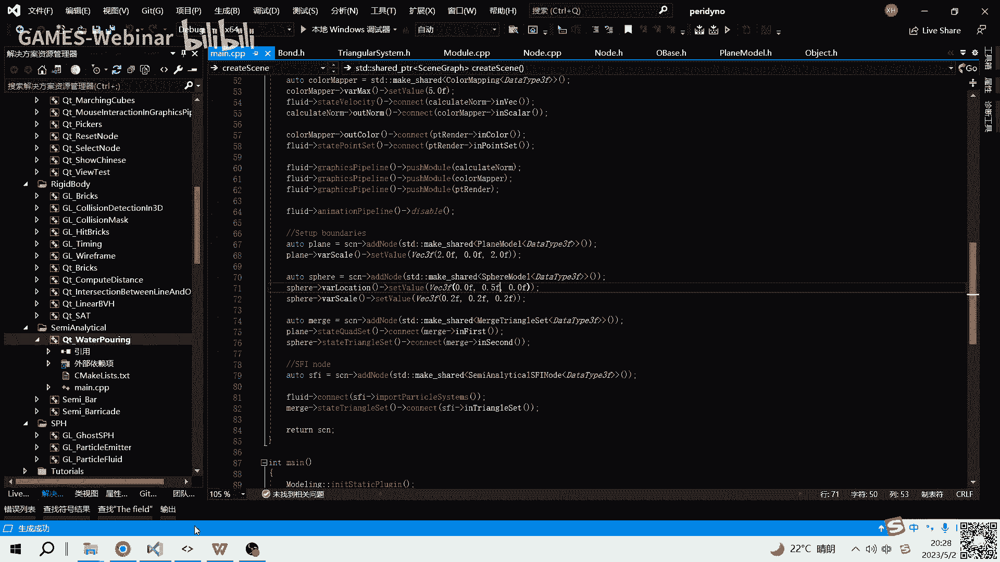

然后呢接下来就是我大我简单讲一下。

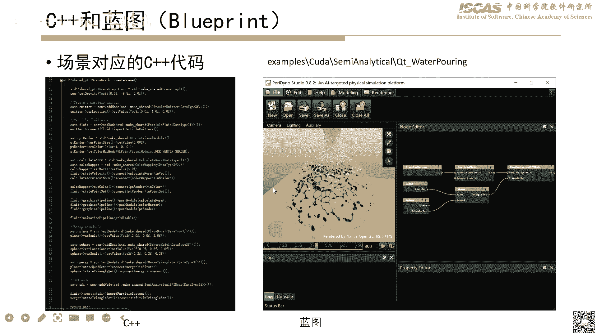

就是这个呃因为前面也讲了，这个实际上整套因为当然你也可以看到，就是实际上整个c加加的代码，就是代码层面的那些指令跟呃，ui层面的一些你看到的一些图源，它实际上是有一个一对应关系的。

那这个这个这个对应关系呢，实际上主要就是通过反射跟呃，一些宏定义来来实现的，那所以接下来讲我主要讲简单讲一下，就是这个反射到底是怎么做的，就是那反射其实就是说呃从概念上来讲，它实际上主要就是针对。

比如说我们动态，就是实际上你程序其实就相当于，你程序跑起来说，需要是相当于整个程序需要具备检测查询，修改自身状态的一种，实际上是这么一种能力，然后这个呃就是通俗的讲了什么意思啊。

实际上就是比如说我们可以看后面那个右边，那个标准的一个c加类，然后这个实际上就是我们之前定义的，就是一个基本的一个集合图源，就是我们比如说我们定义一个一个平面，那这个平面的话实际上就主要包含两个数据。

就是它有一个啊原点，一个法向，但是呢你如果单纯的只是这么定义，一个简单的类的话，对于这个整个框架来说，实际上他是不知道的，就是他其实并不知道你这里边有几个数据，除非是这样，你把这个整个数据结构。

就是如果是大家平时c加的话，就知道就是如果你想用这个数据结构，你这个时候你实际上是必须得把这个它对应的，那个头文件或者是其他文件，你相当于得include到，你相当于要用到它的那个地方。

但这样做的话会有什么问题，就是因为我们知道，就是实际上你相当于嗯，我们知道现在那个现代软件的话，整个它的功能会越来越多，尤其比如像我们做，比如开源的话，其实你是很难控制第三方，也就是很多时候。

比如说第三方的一个呃开发者，他可能写了一个也写了一个类，但是这个时候呢如果他不告诉你的话，你这个时候你是根本不知道，他这个写的类到底什么样的。

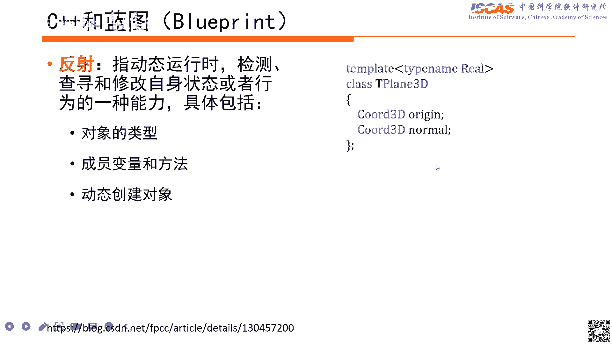

也就是说前面你看到的这些ui里边，比如说你相当于点了之后。

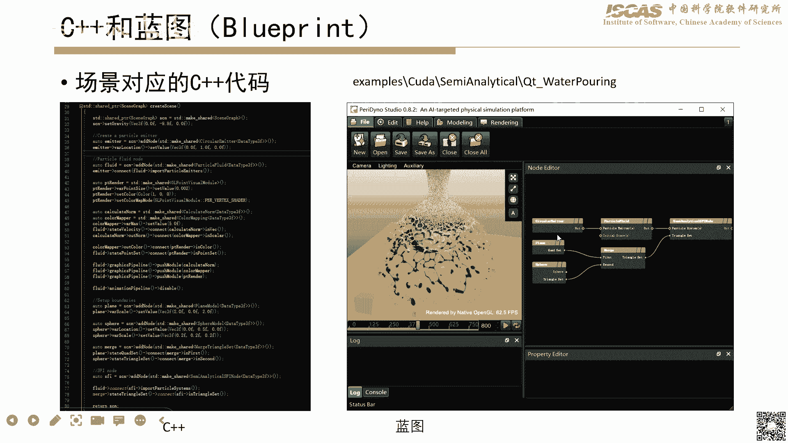

它有些属性框啊，这些属性框你要能识别出来，如果单纯的这么定义肯定是不行的，所以这样的话实际上就必须得具备，就比如说你相当于是要有一种能力能够，比如说你知识，比如说我们现在新写了一个类。

那这样的话我们可以知道，比如这个对象到底是什么类型，然后或者是比如这个呃类里的，到底包含了哪些变量和方法，当然还有一个非常重要的一个东西，就是因为这个需要支持，我们动态的去创建这个对象。

这个动态创建对象什么意思呢，就是比如说啊，因为那个我实际上很多时候我们知道，那c加加一般是用，比如说你用new一下，那这个时候一般它是因为整个它实际上是一个，编译型的一个代码，编程的代码。

也就是它意味着，如果你输给这个一个c加加的一个代码，你如果只给他告诉他我们这个类的那个名称，这个时候它实际上是没法创建一个对象，所以这样的话，实际上就必须依赖这个反射的这套机制。

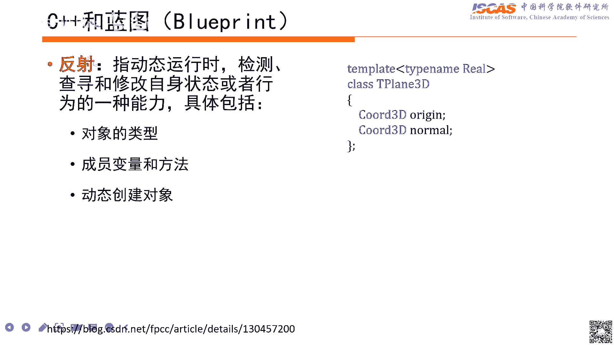

然后相当于把这几个功能能能支持出来，然后当然这个刚才讲的，就是反射到底有什么作用啊，实际上就是一个呢就是刚才讲了，就是呃比如说刚才那个ui的界面里头，实际上我们就可以，比如说我们现在要创建一个q版。

那这样的话，我们实际上只要输入一个cube的一个字符串，那这样的话就可以把这个cube，这个它对应的一个对象给他创建出来，然后呢加入到这个比如这个节点的一个节，节点编辑器里头，然后另外呢。

实际上比如说像比如说一个cube里边，他刚刚讲就是有比如说有它的边长，有分段数，有这个啊缩放平移旋转等等这些属性啊，那这些属性的话，实际上如果我们整个ui系统里边，相当于需要把它这个识别出来的话。

那这样的话也就是说也是相当于需要依赖反射，然后相当于反射能识别到这些属性，然后呢这样最终的话未必说为这个类创建一个，比如它可以调节的这么一个编辑器，然后利用这个编辑器呢。

比如说去更改它的一些自身的一些状态，所以呢主要是反射的话，实际上会有这样的一个好处。

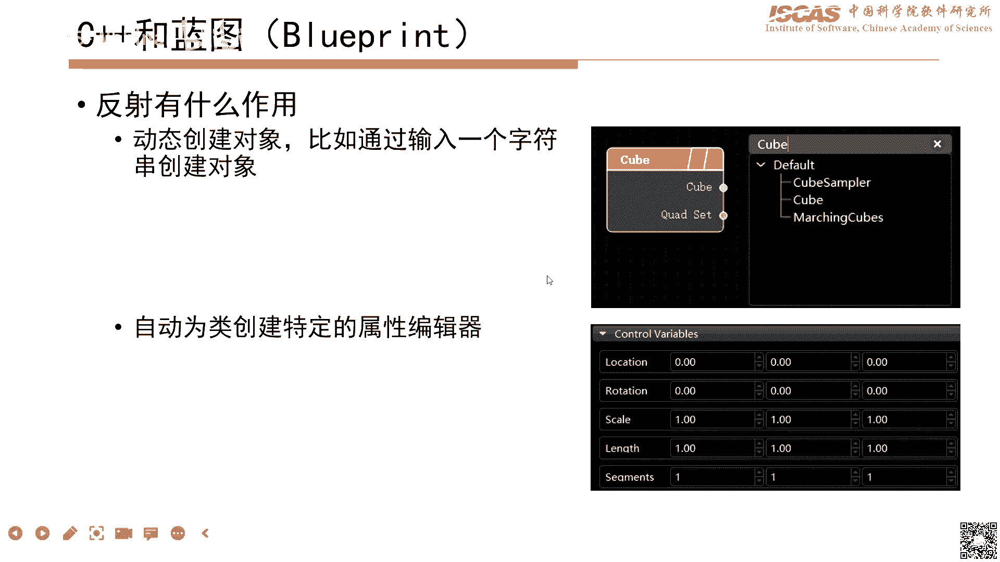

那后面我们看看就是反射整个是怎么来实现呢，就是呃这里以为实际上这样，整个现在python系统里边的话，其实它所有依赖反射的这个这些类啊，它实际上都会啊继承一个公共的一个父类，叫做一个object父类。

因为实际上因为这c加加本身这个语言啊，它实际上是一个编译型的一个语言，就是说它实际上本身它并不支持反射这个特性，因为大家如果用java的话，其实是比较方便的，因为像java里的。

你比如说你这种的那个成员变量啊，函数啊，实际上都是可以，因为它整整个实际上是个解释性的语言，所以它实际上实际上在运动啊，就在执行的时候，他实际上都可以动态的，相当于把这些比如常量变量。

函数和可以给获取到，但是c加加不是c加加的话，需要依赖于自己的一个实现，所以呢也就是说现在整个系统，实际就是你发现这个虽然包含非常多的类啊，但是它实际上会继承自一个公共的这么一个呃，一个父类。

然后这个父类是所有你需要反射的那个类的，一个公共福利，也就一个object，然后当这个object其实它整个里边的话，相当于就是反射到机制啊，它实际上是在这个object。

这个object这个类里边是去实现的，也就是说你实际上后面你不管，你去派生出什么类啊，这你实际上这个时候是不需要去不管，就是说里边这个东西就反射到机制怎么去实现，这个不用管。

也就是这个时候你只需要有依赖一定的规则，就比如依赖和依赖模板编程的一些一些特性，然后呢相当于有些宏定义，然后呢就很就是很方便的，就可以把这个相当于你这个整的，你比如说这个新创建的类啊，包含哪些信息呢。

实际上告诉这个这个父类，然后呢由他来完成，比如各种注册呀，各种那个相当于反射的一些。

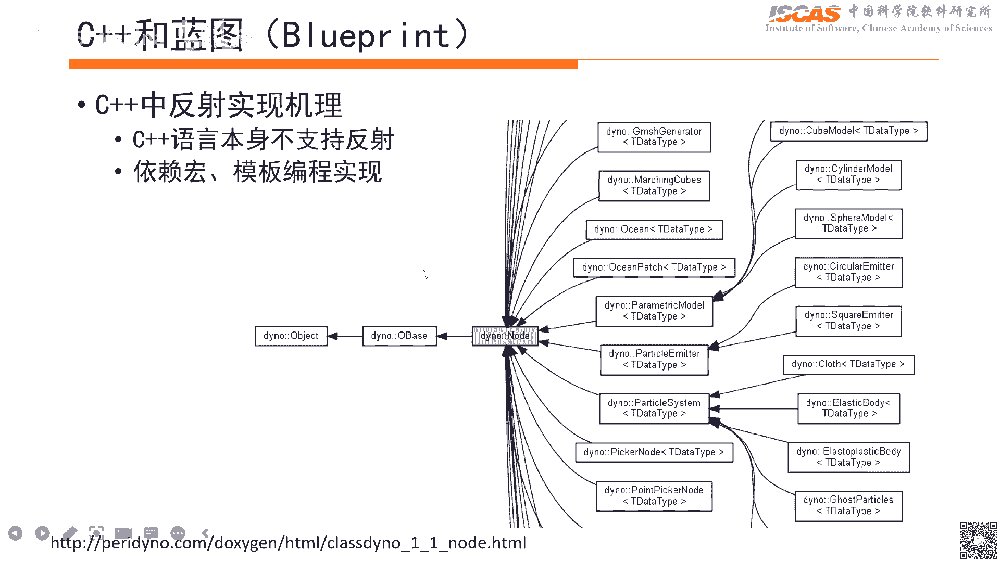

相关信息的一些查询，然后呢我们看一看，就是整个其实整个反射的话实际上包含呃，其实就主要其实就针对那个这个object类啊，实际上主要是包含三部，就是因为首先是这样呃。

从框架层面或者从这个object这个类型的角度来讲，它实际上它是需要维护一个所有类的，一个列表的，也就是说它比如说你新增加了一个类啊，他那你其实是这样，你必须得告诉他，你比如说你相当于我新写了一个类。

然后呢这个类里边包含比如到底哪些信息，比如他的那类的名称到底是什么，或者是他以及比如他你得告诉他一个构造函数，然后比如我想创建一个对象的时候，那这样的话他可以去调用那个构造函数。

去创建你的一个派生类的一个对象，所以实际上本所以这样的话，实际上就是整个这个object的最核心的一个地方，就是他会维护一个叫做class，就是class map的这class infmap。

然后这个map，实际上就相当于它是一个整个一个map结构，它会呃相当于它是从一个它的类的名称，到一个一个叫class fr的，这么一个一个映射的一个这么一个关系，然后呢这个表。

然后呢也就比如如果你现在新生成一个类，然后呢这个时候你需要去注册一下，这里边有个注册的一个一个函数，然后这个注册类调用这个注册类之后呢，它实际上会在这个呃类表里头，这个类的那个map里头啊。

实际上就相当于会新增加一个对象进去，然后呢这样的话也就是说你所有的那个类，也就是说你比如说你现在这个系统里边，包含的所有类的话，其实都会统一的存在这个object的这么一个，静态的一个结构里头。

然后这个结构是全局的，然后这个时候你如果在其他的，比如说你任何的地方，然后你如果想嗯去创建一个对象的话，你直接就可以调用这个啊这个结构，然后呢去你的去找相应的构造函数，然后把这个子类构造出来。

所以当然这里边最后的很像，就是你创建一个对象，然后这个对象实际上本质上它实际上是调用的，是子类的这么一个构造函数，然后呢去把这个东西给创建出来，当然这里边后面还有一些其他的一些，像原子操作。

这个主要是为了解决，就是说在多线程环境下边的一个，异常的一个问题啊，然后大家整的其实那个反射，你看这个东西实际上是比较比较简单的。

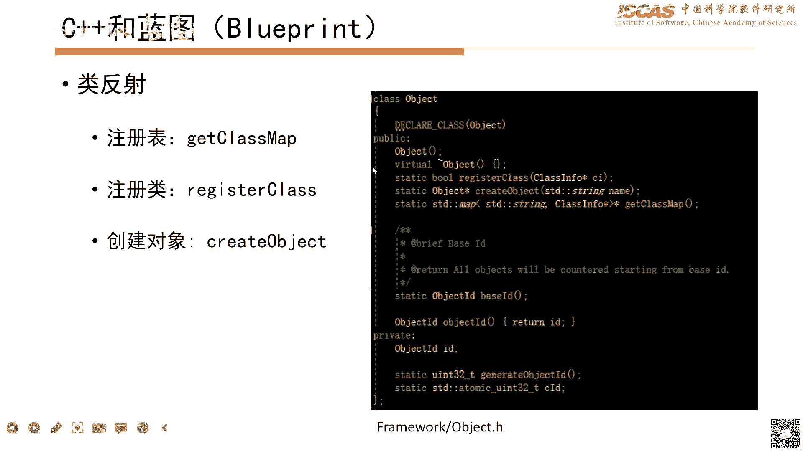

然后呢对于此类的话，当然这个前面那个是一个object的一个父类，然后当然对于子类，如果我们现在，比如说我们想创建一个自己的一个类，那这里边就需要依赖一个宏定义，然后这里边实际上主要是两个。

一个是一个声明，然后声明前面前面就说了，就相当于实际上就你需要定义一个这么一个，类的信息的一个呃一个静态变量，然后这个静态变量呢需要注册到这个object的这个，它的一个父类里头，然后这个父类相当于。

然后呢，后面如果你比如说你要去创建这个对象的话，实际上这个object就会通过这个字符串，就是通过你的类的那个名称去相当于去，然后再结合，就是说因为这里边你可以看他还有一个实现。

就是说你看那个很多那个类的话，其实主要两个，一个是生命，还有一个是这里有个叫implement the class，其实就这两个，然后呢实现的里边，你会发现它主要一个做的一个事情。

就是你发现它实际上就会创建一个这个，一个叫classing first这么一个对象，然后这个对象里边传入的两个东西，一个呢是它的一个类的一个名称，就是这个name实际上代表类的名称。

然后呢还有一个就是类的对应的一个构造函数，相当，这个也就这个时候你就可以通过这个类的名称，然后呢调用他的那个子类提供的这个构造函数，然后去创建相当于对应的一个子类对象。

所以呢也就是这个对于所有的你要如果是要呃，支持反射反射的这个姊妹啊，所以这样的话就是在头文件里边必须得include，就是相当必须得声明一下这个呃有两个函数，就一个声明，有两个红，一个声明。

还有一个是这个实现，你当这里边整个特性为什么这个可以实现啊，其实这里边还有一个c加加，比较特殊的一个地方，就是因为c加加的所有的这个static变量，就是静态变量。

就是因为像整个刚才说的这个它的一个类的，那个map，它实际上定义的一个是一个静态变量，c加加里，所有的静态变量实际上都会在所有这个相当于，比如说进入main函数之前，它实际上都会初始化完。

所以这样的话实际上什么意思，就是比如说你这里边定义了一个这个静态的，这么一个变量，然后这个变量呢实际上它会在，也就你在执行代码之前呢，事先就告诉这个object的那个父类，然后呢由他完成注册。

然后真正当你运行的时候呢，实际上你整个这个啊它的类表列表，也就这个时候呢实际上就完整的，这就构造出来了。

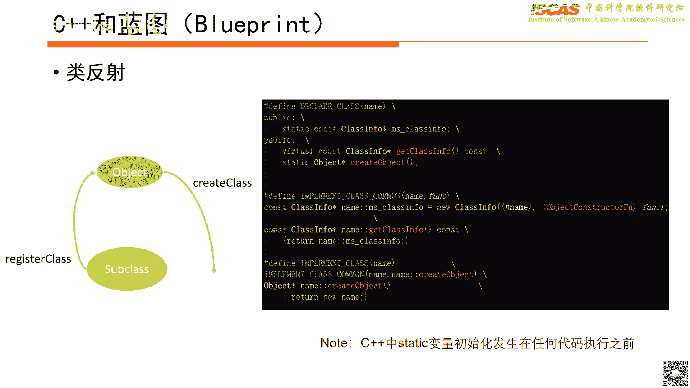

这样的话实际上你直接执行代码的时候，直接就可以用，然后呢前面实际上是对类的那个注册，当然除了累之外呢，还有一个呢实际上是刚才讲的这个成员变量，因为成员变量的话，实际上你相当于对于比如说一些控制变量。

我相当于需要ui，比如说去调整它的一些属性，那这样的话实际上对于所有的这个成员变量，也是需要去反射，然后成员变量的话，整个实际上是依赖有一个叫fo的，就是f base的这么一个一个父类来完成的。

然后他这个实际上跟整个就是注册类，实际上思想是类似的，其实也是相当于是他需要把自己的一个信息，告诉这个这个父类，然后就告诉这个f base的这个父类，然后呢由他完成注册，比如像这里边针对的控制变量啊。

然后他要输入几个东西，就是你一个你需要输入你的那个类的那个名称，然后你告诉他，这个我这个我相当于声明了这个呃，成员变量到底是叫什么，然后呢另外就是当然还有类型，因为这个是因为针对特定的模块。

比如说我这个是控制，那是参数，诶，不好意思，这个是参数还是说这个是输入，还是说这个是输出，那这样的话需要告诉他我们是什么类型，然后这样最后还有一个就是这个this对应的。

实际上是相当于比如说它的它是node的这个指针，然后这个指针传进之后呢，它实际上可额外的可以针对，就是整个note做一些额外的一个操作，所以呢就是整个你发现这个实际上所有的成员。

就是你需要反射的这个成员变量，实际上也都是依赖于就是这样的一个，宏定义来完成的，所以这里面为什么，你看那个派单那里面好多类似，但会有呃定义，就是各种各样的红啊，这个红主要其实就是为了让底层。

就是相当于你的父类来识别，就是说我这个子类到底是有哪些的啊，成员变量，那当然这个东西如果对，所以这里边实际上到底定义哪些这个呢，实际上就是你写累的时候可能需要注意，就是这个东西并不是说你定义的越多越好。

实际上只需要去暴露，就是必须的那些呃那些成员变量，就这样的话，实际上就是比如对于有些特定成员变量，可能就是只是你内部使用的话，实际上并不需要去暴露出来，然后呃其实说白了ui。

因为这样的ui其实不需要你去控制它，去控制所有的变量，它只需要控制，就是说你对外开放的那些电量实际上就可以了，所以当然这里边其实这么做，就是因为这个整个这个宏定义的那个，这个对象呢。

实际上也是呃放在这个头文件里面，然后它所以它的整个初始化的时候呢，会有一个优先级，就是它的整个构造函数要比，就是在内内的那个构造函数呢，实际上它初始化是要优先级要高，所以就这个时候实际上它放在头文件里。

有个好处，就是所有的那个变量，实际上是在构造函数进去之前，就实际上就把这个所有的那个对象，就已经创建出来了，然后当然比如这个时候你实际上有一些额外的，就这样比较方便的地方，就是这样的话。

你实际上会有一个默认的，比如这个参数它实际上会有一个默认的一个值，然后当然比如说你对特定的类啊，如果你这个时候我想更改它的默认的值的话，这个时候你不需要在这里边改，你直接在你的构造函数里面。

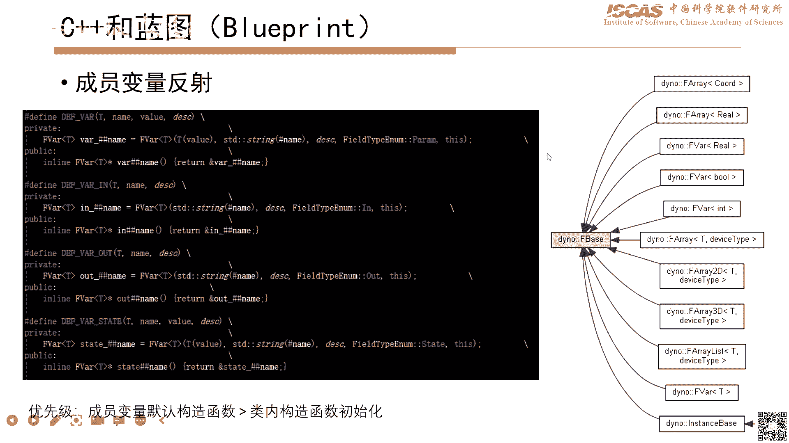

就可以去把这个值啊对它进行更改，然后呢这里边就是还是刚才那个程序啊，就是当然整个前面讲的实际上是一个呃，静态视图，就是静态视图什么意思，就相当于整个我这个场景或者整个节点对应的，到底是应该呃。

这个c加加代码，跟这个蓝图到底是应该怎么对上的，当然这里边还有一个呃非常重要的时间，因为整个仿真跟比如说这个跟cad软件啊或者啥，其实一个最大的一个区别是什么呢，因为它整个实际上是一个时间序列。

就是因为就像刚才比如说我点了一个这个，跑起来就点那个钮之后啊，反正开始之后这个扭之后呢，实际上它整个所有的礼包的那个元素，它实际上有可能会动起来，所以这样的话实际上就是除了这个场景，他这个连接关系啊。

比如他的那个各种的参数，各种的属性之外呢，它实际上还有一个额数据，比如说这个数据传递，这个动态的这个数据流的这么一个过程，然后以及计算模块的一个执行顺序，所以这里边实际上就是你发现就是说这个呃。

除了这个刚才说的场景，这个静态场景要对上之外，还有就是说整个动态的一个运行逻辑，就是ui里边啊，这这个我们看到ui的运行逻辑里边，有可能也是需要跟这个c加加的那个嗯，执行逻辑实际上需要去对上。

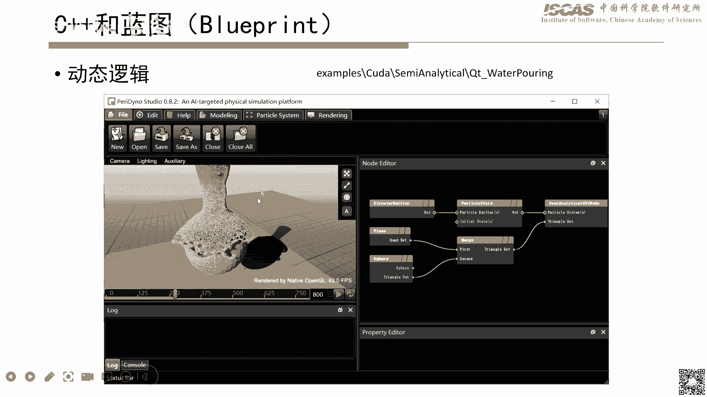

那这里边实际上就是我们看一下，就是呃现在其实这样的，现在整个动态逻辑其实主要由三部分来完成，就是其实就是针对刚才界面的话，实际上就是有两个钮，一个呢是重置，重置什么概念呢。

就是相当于比如说我这个点了一下，重置之后，它实际上会把所有的状态变量，恢复到它的一个呃初始的一个一个状态，然后这个时候呢相当于比如说呃。

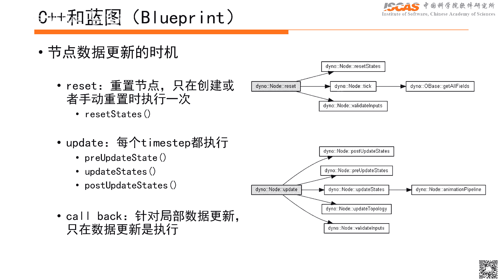

可刚才那个场景可以再跑一下。

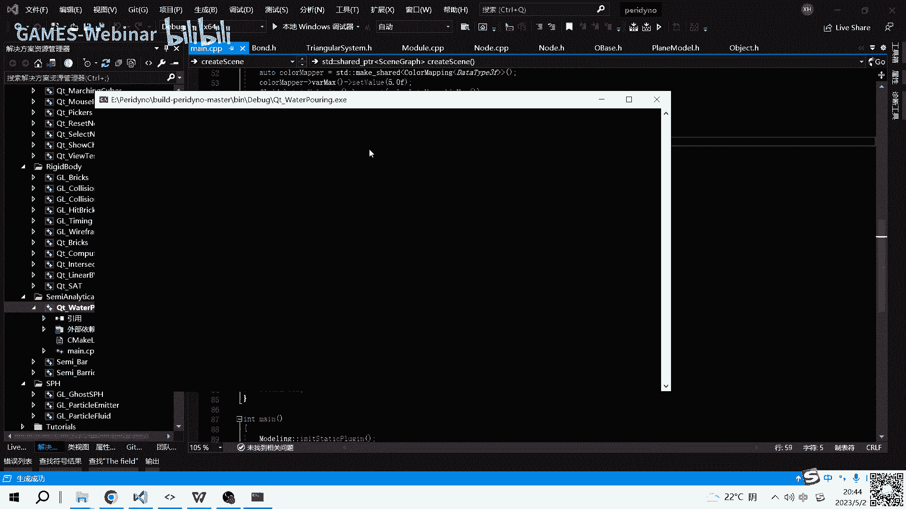

比如说这个场景，然后是这样，就是因为现在看到的只是一个静态场景，所以里边当然还没有各种的数据的计算啊，这些还都没有，然后但是这个点这里有两个钮，一个呢就是三角形的，对应的是法院开始的，就它会从前往后。

然后呢一个时间不一个时间步往前去去运动，然后后面那个是一个重置的一个一个new，然后呢比如说我们现在呃反正开始之后，那这个时候呢比如如果出现，比如说呃，我发现这个可能出水口的那个位置可能不太好。

这样我可能需要调一下这个出水口的位置，那这个时候调完之后呢，我可能需要点一下这个重置，然后呢，这样的话所有的这个节点里边的那个数据啊，嗯它实际上会恢复到一个初始的一个状态。

然后呢去重新开始整个仿真的一个流程。

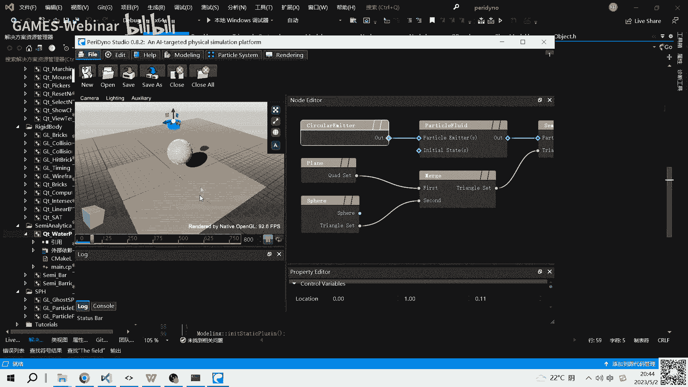

所以这个对应的实际上就是相当于它的一个。

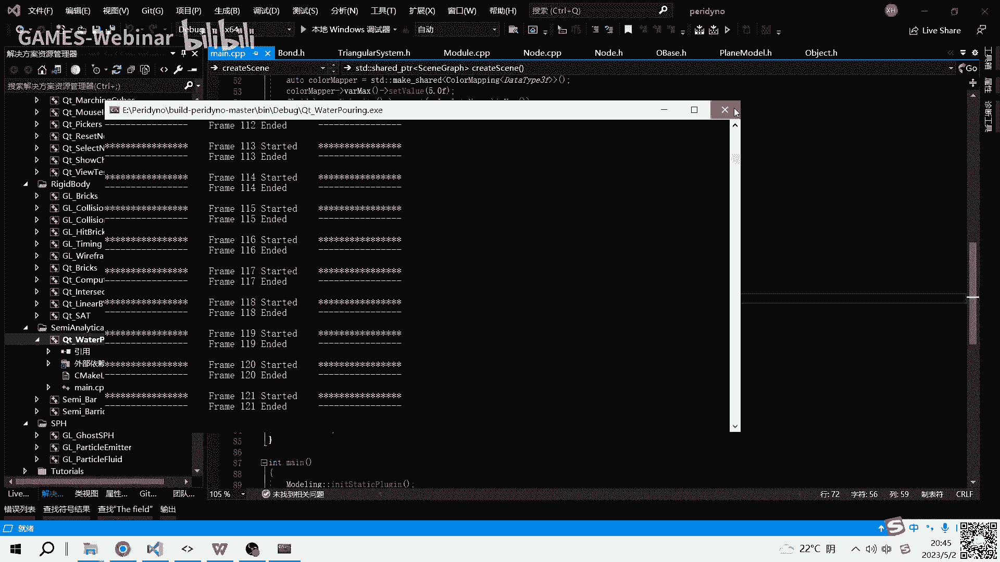

相当于它的一个两个，就是这里边最就是整个节点里边，最重要的两个机制，就是一个是重置，还有一个是更新，就是点法面开始之后呢，他会每个time step都逐步的去实执行，就是啊里边的一些函数。

当然这里边有三个比较重要的，就因为这几个都是包括这个重置，以及后面的这个相当于这三个函数，实际上都是虚函数，然后再也就我们在去实现子类的时候，就需要去重载这个函数，然后呢去完成。

就是说我们比如自己定义了一些状态，然后这个时候呢就需要去用这些呃，重载的函数去完成更新，然后这里我讲一下，就是为什么就是说这里边设计了呃三个函数。

就是因为正常实际上我们只需要一个update states，其实就可以，但是呢这里边为什么三个呢，其实主要就是呃针对的，实际上是一些耦合的场景，因为耦合场景是这样的，除了整个仿真流程的计算啊。

还有一些比如说我可能是一些数据的预处理，或者一些以及一些数据的预处理，然后那些预处理很多时候呢，它实际上是没法给他标准的一个流程化，所以对于那些操作呢，一般来说就是呃可以，他可以相当于把它放到这个呃玉。

这个叫per data states，以及那个post update states的这两个函数里头，然后这个其实可以看，就比如后面会演示那个流货物和那个场景里边，那个节点，那个节点。

实际上就是按照这种模式来来去操作的，然后当然这两个函数其实会有一个特点，就是因为它整个无论重置也好啊，或者是更新以后，它实际上都相对来说，它整个呃代价相对会比较比较多一些。

因为它这个实际上它因为会调会调用的，比如各种模块啊，这种状态实际上都会重新更新一遍，然而实际上有的时候，比如说我们针对的，可能是一些局部的内容的更新，那这样的话实际上并不需要，就是说我们呃相当于。

比如说我们点一下或者点重置，把所有的数据全都去改一遍，然后呢针对这样的一些需求，比如我们这个时候，如果只仅仅是只是想去更新局部的一些数据，那这样的话其实可以呃，现在pda里头就是有一个回调的函数的。

这么一个机制，这个机制呢就可以用来做，就是比如说一些轻量级的，比如说我可能就是针对的个别数据的更新，那这样的话就可以用回调函数去去完成，那后面我们看一下，就是整个这个回调函数到底什么概念。

就是其实可以看这个图，就是啊，比如说我们现在左边有一个这么一个主程序，然后呃一直在运行，然后呢但是呢就是我们现在有需求，比如我们等等，要主程序触发某个特定事件的时候，我们希望执行他某一个操作。

那这个时候呢，实际上就是可以通过回调函数来完成，就是我们把一个它需要执行的一个操作的，一个对象操作的函数呢作为相当于一个对象，然后呢把它那个指针呢，我们可以呃存到这个主程序里头，然后呢。

这样的话实际上主程序比如触发某个事件之后，这样就可以直接去调用这个回调函数，来完成就特定的一个功能，那这个有什么好处呢，就是因为很多时候这样比如像渲染也好，仿真也好，它实际上它整个实际上是一个呃相处。

一直处在一个不断循环的这么一个状态，然后有时候如果有如果是那样的一种机制呢，它是比如说他要处理的时候，他实际上不断的需要去判断，就是说你是不是需要去处理这个事件，这样的话实际上会导致大量的这个。

可能会是会有很多的这个呃，就是冗余的一个开销，所以所以这个回调函数整个会比较好的地方，就相当于他只在那个触发那一瞬间，然后呢去调用这个函数，也就尽可能的节约了这个讲的计算资源，当然还有其他的。

比如说它实际上就可以把，比如调用者跟被调用者，实际上他们整个可以给他分离开，然后这样的话就是可以由调用被调用者，然后呢去自定义的去处理一些，他想处理的一些行为，然后这里比较典型的一个例子。

实际上就是像比如说在游戏设计里边，就是呃，比如像那个子弹，击中障碍物的这么一个一个场景啊，因为这个场景实际上是非常的呃，他整个其实是非常偶然，然后呢实际上不是说一直在触发这么一个事件。

所以这针对这样的一些特定的，就是偶发的那个时间的话，非常适合用回调函数来来完成，那整个pdl里边的回调机制呢，实际上因为它主要是针对，就是说是因为比如说它一个节点里边，它有有可能会有很多的一些控制变量。

然后呢那这样的话针对比如说特定的控制变量，如果是他变了之后，我们需要更新整个节点内部的一份数据，所以这样的话实际上就整个panipda里头的，他的这个机制呢，实际上就是在每个field里边。

它会存一个就是一个回回调函数的一个列表，然后呢就是一旦比如说比如说我们需要，比如说用这个这个数据分析，就我们需要它执行特定的操作的话，那这样的话我们就会创建一个回调函数。

然后呢把它塞到这个field的那个回调函数里头，回调函数列表里头，然后这个时候呢如果比如说几种场景啊，作为一种呢，比如他数据更改之后，或者是比如它的连接的那个关系变了之后。

这样的话他会去呃去调用这个后面的回调函数。

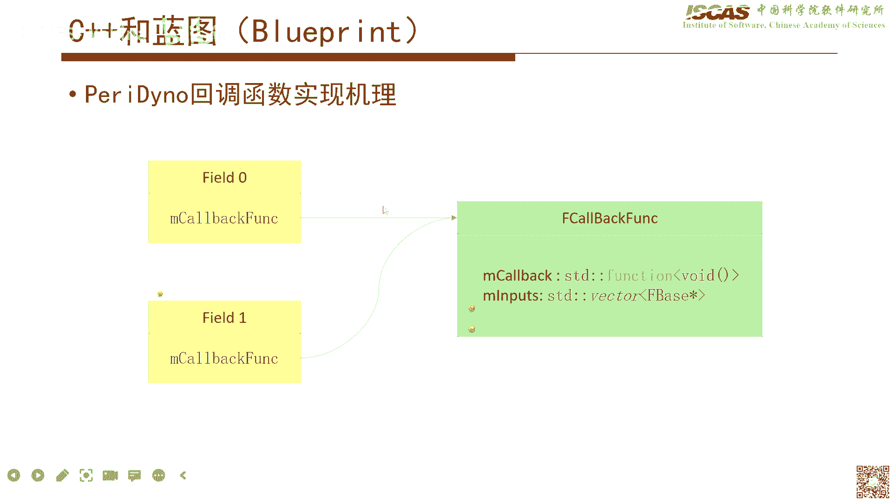

去处理，就是用户想要的一些一些行为，然后呢这里主要是回调函数，这里边主要有两种啊，就一种呢是呃，实际上是通过成员函数来进行回调，然后通过成员函数会进行回调，什么意思呢。

就是比如像这个这个是这个cube里边用来，比如说这个针对比如说他的那个缩放啊，旋转啊，这个平移等等，这些信息变了之后，我们相当于需要去更新它的一些呃内部数据，那这样的话实际上就是它里边写了一个成员。

成员函数，相当于比如说这些变量变量之后呢，它会对应的去更新它的一个，比如说它的表面网格，它的那个呃立方体的一些信息等等，就这些，那这样的话，实际上就是针对这个成员函数的回调的话。

实际上就需要利用这个s b的一个一个bd，然后相当于把这个成员变量，然后呢以及这个节点的那个指针，然后需要绑到一起之后，生成一个回调函数，然后呢再把这个回调函数的话，要通过这个attach的这个函数。

然后呢，附到每一个这个你需要它毁掉的这么一个那个，控制变量里头，比如这里边这个函数，当然这个你会发现这到底是添加到哪个field里头，这个是需要依赖，就是你这个函数啊到底是需要有哪些参数。

就你比如像这个，它实际上是需要所有这五个参数，实际上都需要，那这样的话，实际上需要把这个回调函数，都塞到这五个fid里头，然后这个时候呢也就它里边任意一个呃，相当于任意一个呃变量，然后发生改变之后呢。

实际上它会都会去调用这个函数。

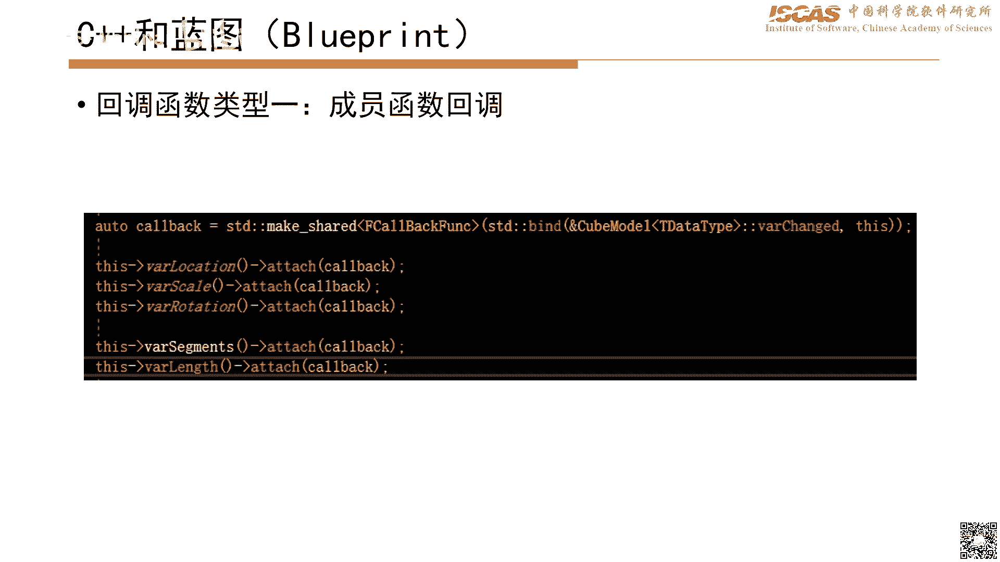

然后呢去更改它的一个内部的一个状态，那当然还有第二种类型，就是这个直接就可以通过那个叫莱姆的函数，实际上就是c加加里的一个泛函，然后这个函数呢实际上就是会更灵活一些，就是相当于对于有一些。

比如像这里边实际上是针对的，就是呃就是就有个静态版网格加载的，这么一个功能，然后这个功能呢实际上就相当于，比如说我相当于打开一个文件之后，相当于我需要把这个文件载入进来，就针对这样的一个功能。

那这样的话实际上也可以通过，比如说这里写了一个lab的函数，那这个兰姆达函数，它这个兰姆达函数大家就可以自己去看一下，就是怎么定义的，实际上就是它通过一个或，然后里面那个等号代表的。

其实前面的值可以都可以引进来，然后这样把这个栏目的函数，然后作为参数传到这个回调函数里头，然后呢里头呢实际上相当于也可以引用，就是这个类里边的那各种的一个一个对象，然后呢相当于通过它去完成一些操作。

比如它这里边实际上就是呃去获得他的一个，一个几何拓扑的一个信息，然后呢呃呃几何拓扑的一个对象，然后呢相当于把那个文件载进来，然后对这个对象进行一个初始化的，这么一个操作，然后呢这里这个实际上是现在实现。

就是现在支持的两种比较典型的一个回调类型，然后后面我们看一下。

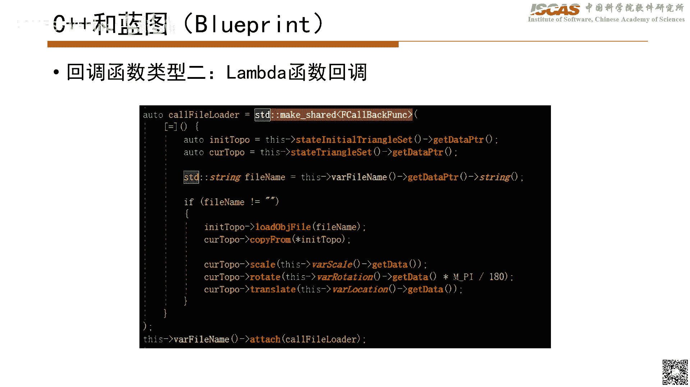

就是呃这个东西到底有什么用啊，就是这到底用能用来干嘛，其实其中第一个呢是这样，我后面举几个实例啊，就第一个的话，实际上主要就是用来比如说像控制一些啊，可见性就是什么概念啊，就是这个场景的话。

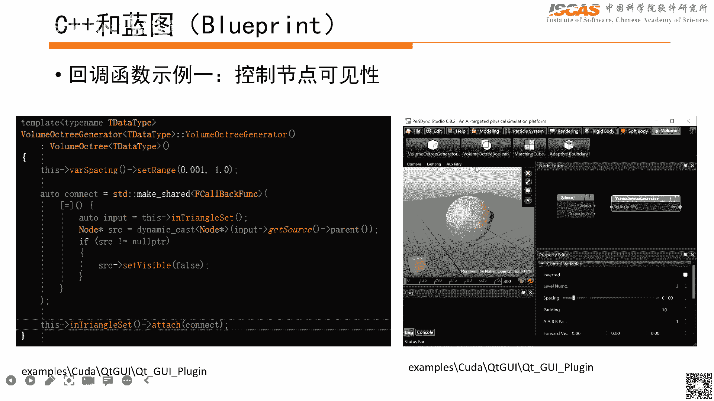

我直接打开那个，其实打开这个有gi plug in的这个一个程序吧。

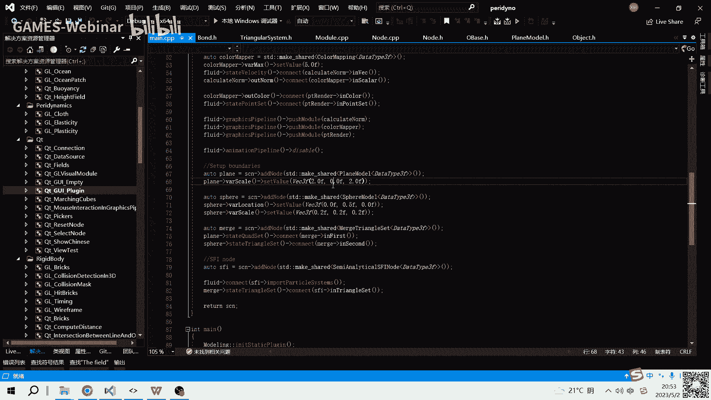

然后这里边因为是集成了各个库里的一些功能。

所以这样的话里边东西相对会多一点。

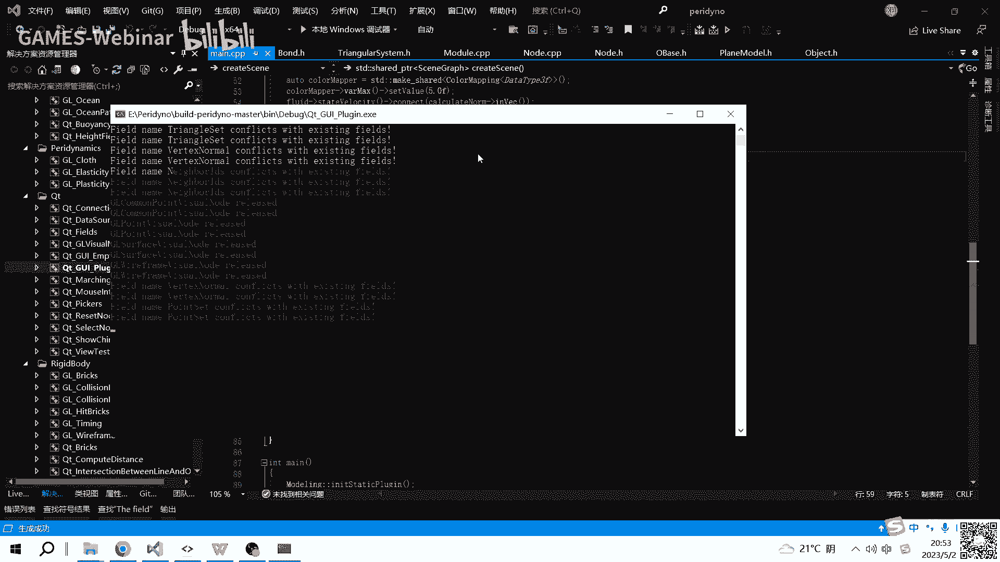

这这个我们叫那个我先演示一下，就是这个什么意思啊，就是比如说这里边有，我们可以创建一个啊基本的一个，比如基本的一个球体，然后呢这个球体当然可以调一下，然后呢后面是这样。

就是球体呢实际上我们可以给它转成一个，比如说改成一个有呃一个体的一个有限距离场，然后这个时候是这样，因为每项每个节点里边，它实际上都有一个可视化的一个模块，然后呢但是这里边如果是这样。

我直接从前面连到后边，这样的话，实际上就是比如说后面那个数据呢，因为现在需要需要输入一个三角网格，就相当于需要把球的这个数据输入到后面，然后呢作为它的一个输入。

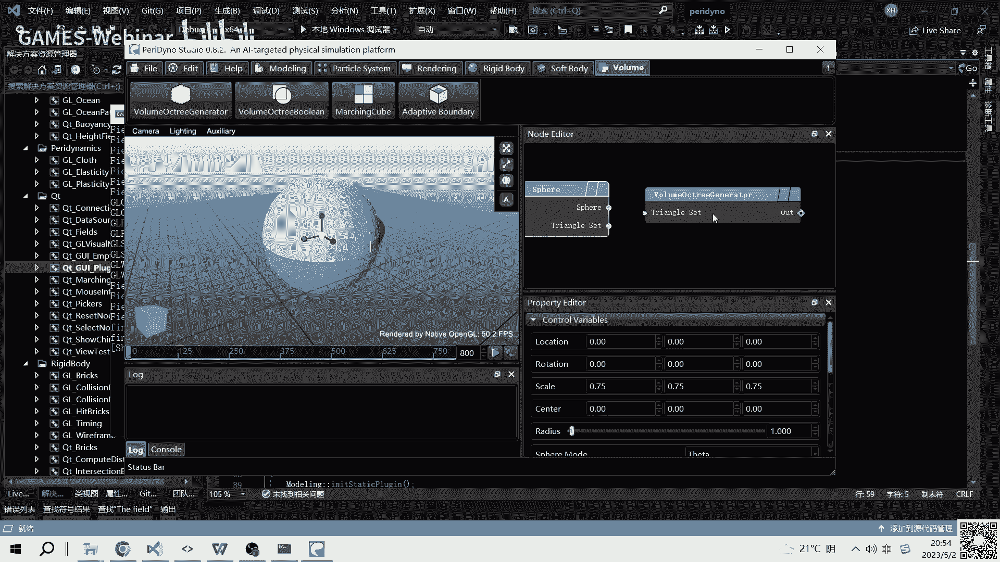

然后最后去构建出来一个远距离场，然后但是后面那个节点呢，实际上现在也带了一个渲染的呃，一个节点相当于通过比如这个把里边的呃，那个远距离厂转换成一个三角网格，就是利用完tube的那个方式。

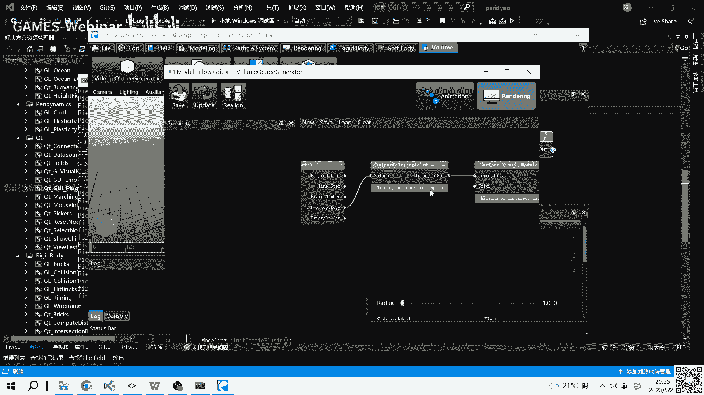

然后把显示出来，所以这样的话实际上如果你直接去连，那这个时候呢会出现什么问题呢，就是你前面那个节点，它实际上是处于一直处于显示的状态，然后后面那个节点呢它实际上也够出来。

但这两个东西实际上会存在一个遮挡，所以现在我们就是说我们希望是这样，比如我们前面那个节点连到后面之后，那这样的话就比如说我们控制一下，前面那个节点呢，就是它的可视化就给它消失掉。

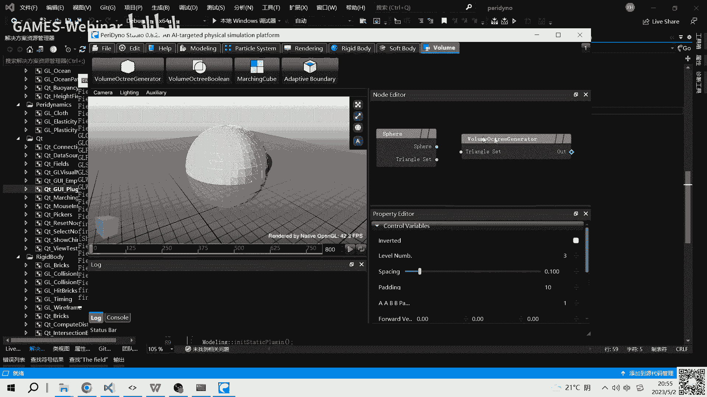

然后呢去显示后面那个节点，所以对于针对这样一个需求呢，实际上这里边就是写了这么一个回调函数，就是这里边有个volume。

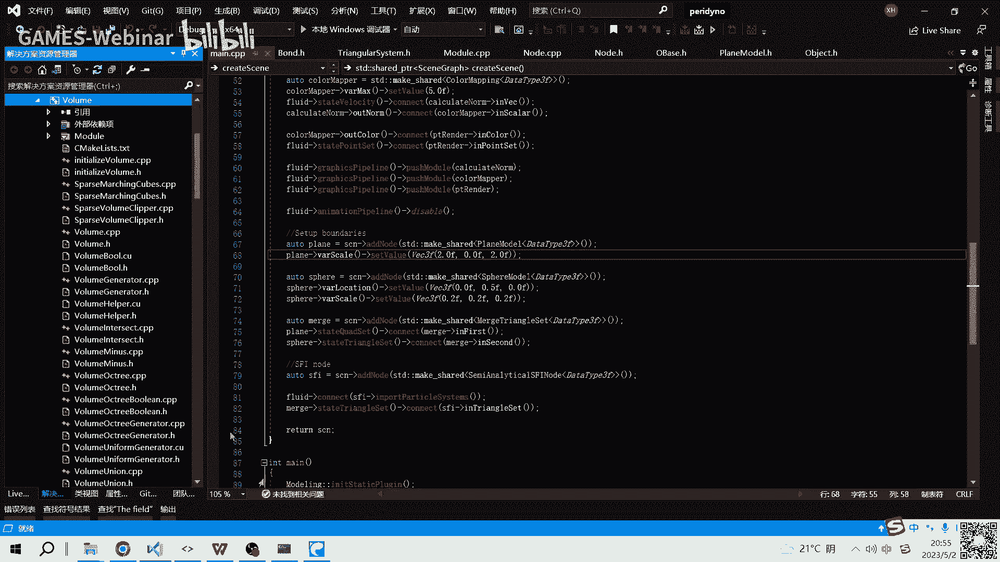

那当当找那个对，找那个类的时候，就是这里边大家也可以看一下，就是因为这里有提示啊，就是他针对的是哪个类，然后它实际上就是呃叫一个volume哦，这个是这是一个volume的generator。

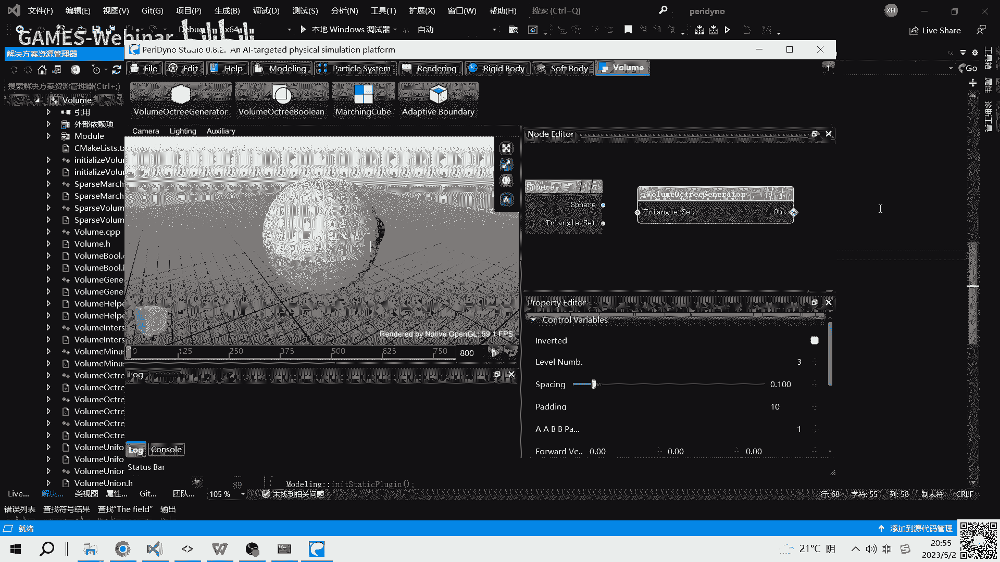

然后这个是在就是volume这个库的下头，然后呢它有一个一个类，然后这个类里边呢，是这这里边就加了一个回调函数，这个回调函数是怎么做的呢，就是实际上就是它回调的是相当于，因为它这里有需要输入一个字面片。

然后呢也就这个时候呢，就是说你如果一旦，比如说前面有这个三角面片输进来了，那这样的话我们希望是把前一个节点呢，它的渲染模块给它关掉，所以这里边实际上，整个这个回调函数做的是这么一个事情啊。

就是输入一个三角面片，然后呢我把它对应的这个啊就输入那个field的，他的那个附节点，它的那个给它显示给它关闭，实际上这么一个一个需求。

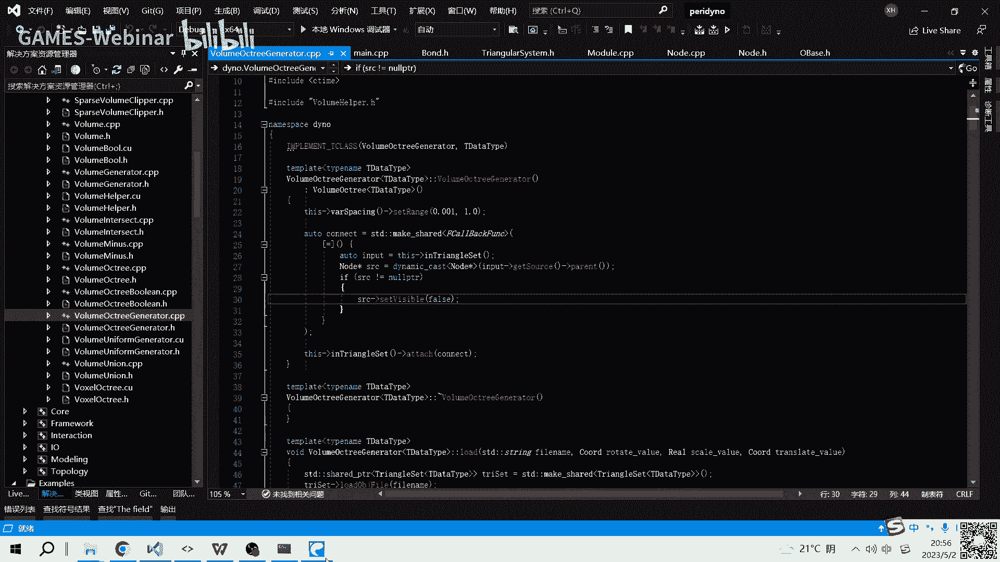

所以呢这样的话，其实比如说我们这里边给它连接之后，你可以看到直接就是前面那个就隐藏了，当然这样的话，实际上我们可以通过比如说去调一下，后面那个参数，然后当然这里可能需要重重置一下。

然后这个大家可以看到就是这样的话。

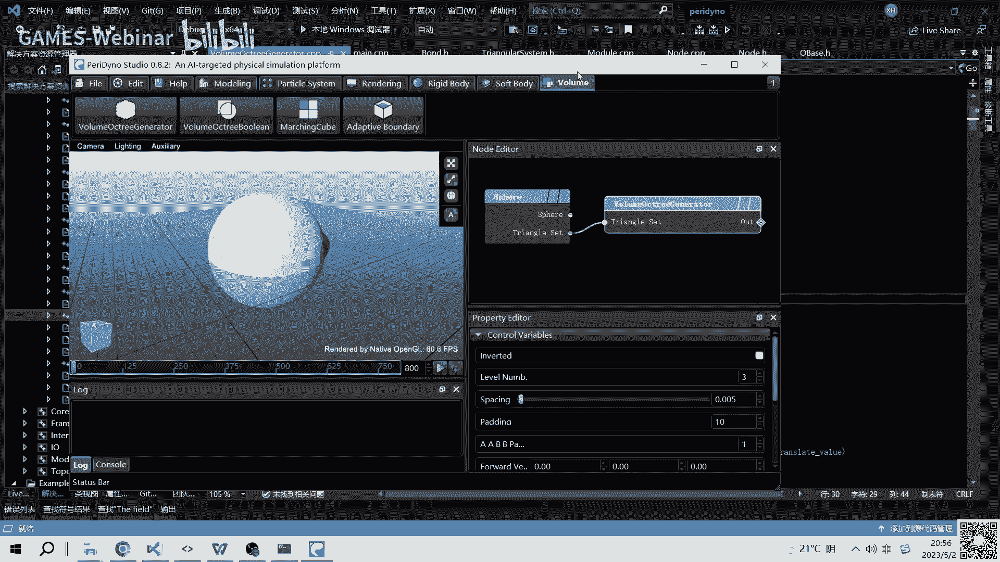

其实就是前面那个实际上并没有显示，就是前面那个初始的那个网格其实已经隐藏了，那这样的话只看到的是后面那个节点，就是创建出来的，它针对的一个t，然后它重构出来的一个表面网格。

所以呢这个是针对就是说这种可见性，就是针对这个比如说这个连连接的那个输入，然后呢做了一些可见性的这么一个事，当然这里边其实有各种其他的一些用途啊。

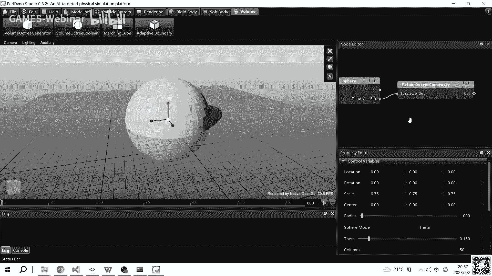

就是完全也不限于说仅仅是这么一个一个需求。

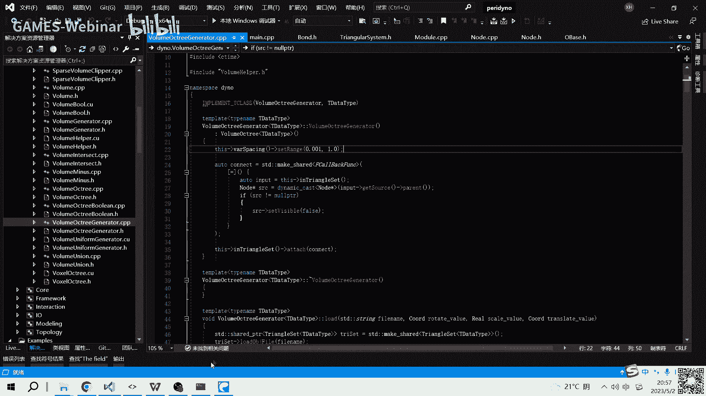

然后呢这里边这是一个，然后当然还有第二个我们看一下，就是还有一种，比如说前面之前那个讲s t h的时候，就是我们提到就是呃，因为s p h它的对于它的可动函数，实际上是有一个限制。

就是比如像我们去计算s p h里的这个。

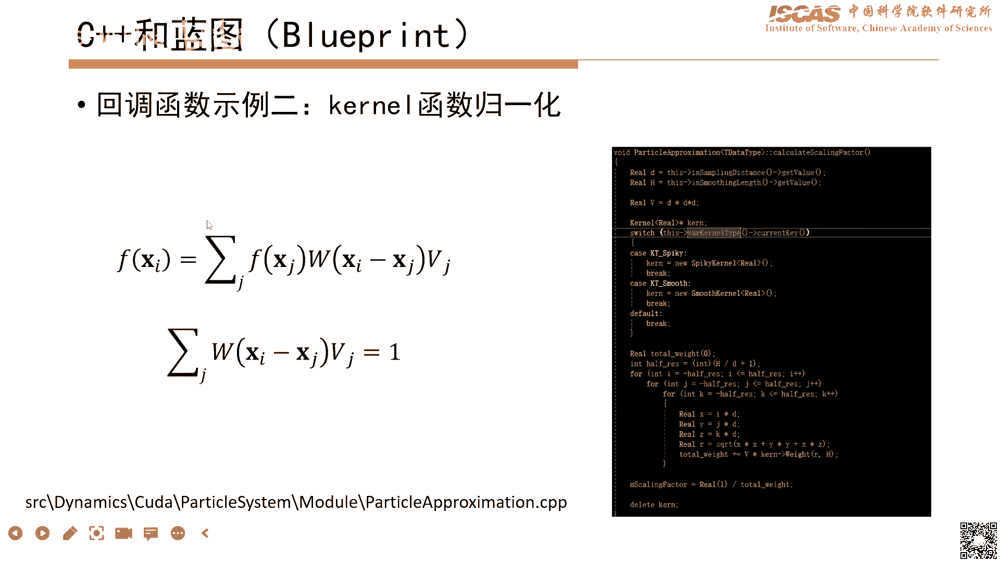

一个物理量啊，就是这样，我把后面的先关一下。

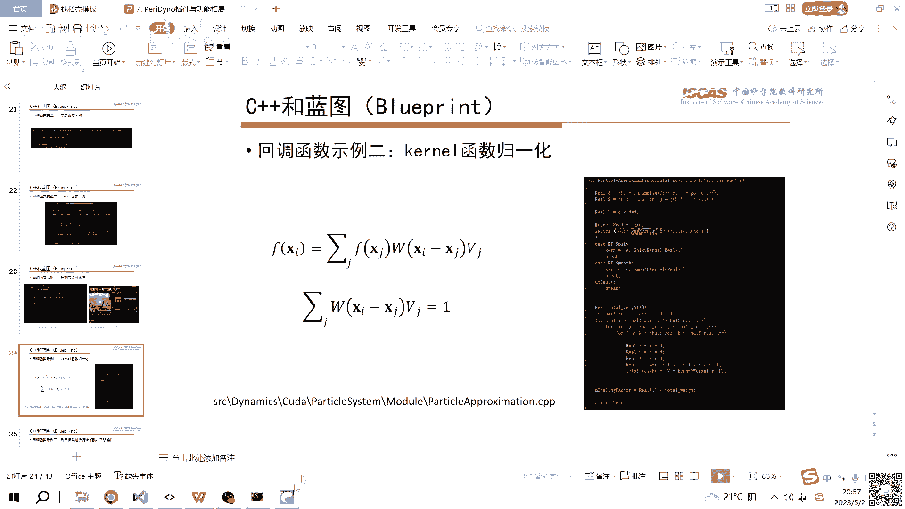

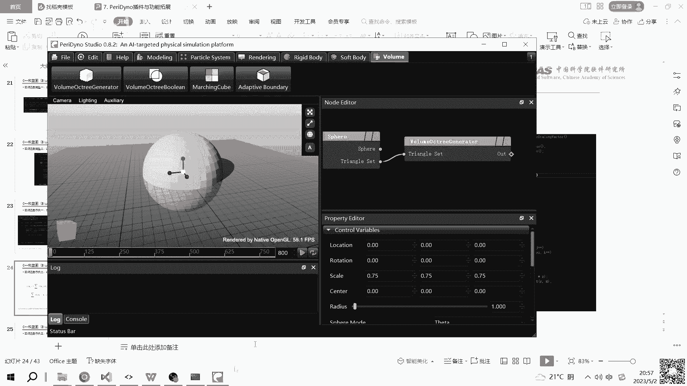

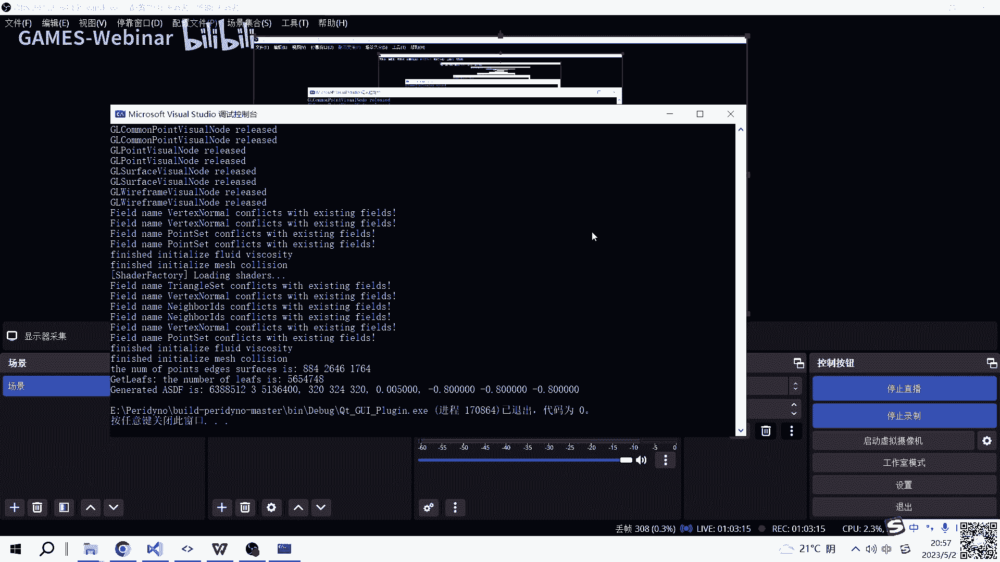

行，然后这个地方实际上你可以看到就是像s p h，我们去如果去求他的某个点的一个值的，就是某个点的那个物理量的时候，它实际上是依赖一个呃权重求和这么一个概念，然后呢当然这里边主要几个。

一个是这个每个例子上带的带了一个值，然后还有一个就是权重函数，然后这个权重函数呢，实际上就会有一个什么要求，就是它实际上要求它的整个权重加起来，必须是等于一，然后这个东西其实呃也可以啊，就是一般是这样。

你如果是一种比较简单粗暴的方法，你实际上完全可以在，比如说你每次去计算的时候，你相当于重新给他规划一下，那这样用的一个比较麻烦的地方，就是这样的话，你有可能会导致你实际上就是。

你不因为这个这个权重函数啊，实际上你在很多代码里边实际上都会去实现，那这样的话就会导致你有可能不同的地方，实现的可能并不一致，那这样的话我们有没有可能是，比如说我们在嗯某个地方，统一的对这个进行归一化。

然后呢这后面用的时候呢，实际上直接就用这个统一规划之后的，这么一个一个结果，所以呢这个呢实际上也可以就是依赖这个，就利用这个回调函数去完成啊，当然因为前面这里还讲就是这个空档函数。

实际上它还有很多类型的，所以这里边我们看可以看一下，就是这里边如果依赖回调函数怎么去做，就是啊比如像party system里，有里边有一个叫啊party和proximation的这么一个类。

实际上它整个对应的实际上就是这么这么一个，权重求和这么一个概念，然后在这里边实际上就是针对这个权重函数，归一化的这么一个呃需求，相当于这里边需要去计算一下，它的一个缩放因子，那这样的话其实就是针对。

比如说我们现在输进来之后，有一个比如说它的ex mos max，然后当然包括他的采样的间距啊，然后同时还有一些就是刚才讲，就是实际上你的那个kernel的类型，实际上也可能五花八门，所以这样的话。

实际上你的kernel类型也是需要作为一个参数，然后给他说进来，那这样针对这几个参数的话，实际上这个时候，如果我们一旦这几个参数变了之后，那这样的话，后面可能就需要重新的去计算一下，这个缩放因子。

然后呢，这样的话，实际上就需要只需要就是说把这个回调，就这个章是个成员函数，然后相当于把这个成员函数，然后呢分别输入到这里边的那三个函数里头，然后也就它们的值变了之后呢。

他会去自动的去调用这个函数去进行对这个嗯，相当于对这个ho进行，归一化的这么一个一个操作。

那当然最后还有一个，就是刚刚你看就是比如像那个发射器也好，或者是比如说我们这个时候创建一个cube的话，实际上你可以通过这个，相当于你可以通过整个它的一个标价，就是你选中这个物体或者选中某个节点之后。

它实际上是有一个标价的，然后这个标价如果你去移动的话，就是你会发现就是说它整个后面那个属性页，它实际上就是比如像他那个位置啊，它的旋转缩放啊，其实你可以看到，它实际上是跟着你左边那个操作。

实际上是跟它是联动的，所以呢这个实际上也是需要依赖，就是整个回调函数来完成这个操作，然后当然你看这个视图的话，其实可能只有两部分，就是左视图加60，但实际上整个实现的话，这里边需要依赖三个东西。

一个呢是整个这个啊，这个坐标价就是对应的三个箭头啊，这个实际上一个标价，然后呢这个标价移动了之后呢，它实际上会去设置这个field的这么一个啊，它的一个值就是因为你整个相当于移动之后。

你的这个所有的那个值去更新了，但是这个vg的这个对应的，因为这个整个界面实际上是在qt里面实现的，然后qt里面这个时候你需要让qt去知道，就是说你这个数据更新了之后，我相当于是需要怎么去更新。

我的这个界面里的那个属性，所以这里边实际上就是你可以看一下。

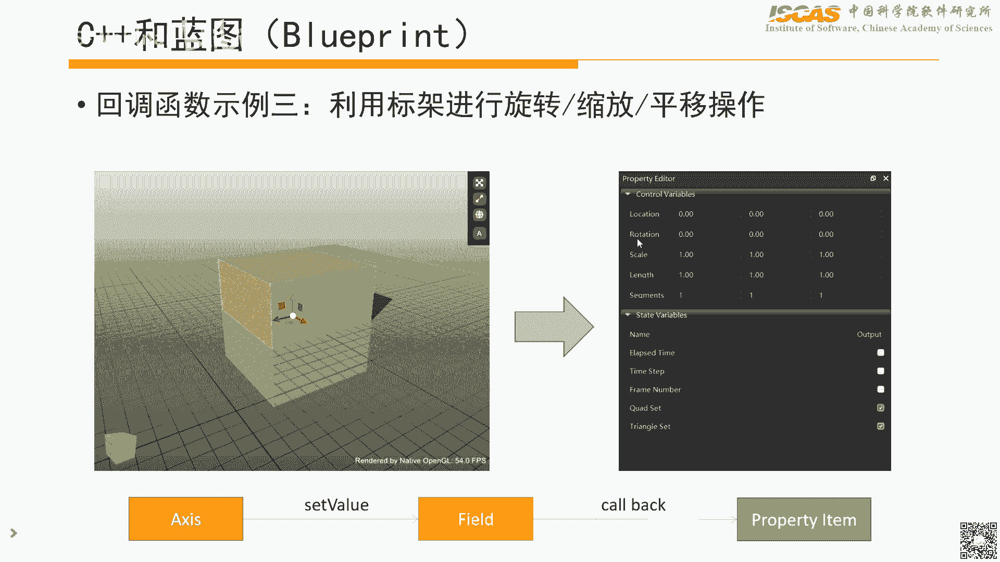

qt里边怎么去做的，就是因为这个对应到qt里边的有个qt g u i，然后呢这里边会有很多的就是标签。

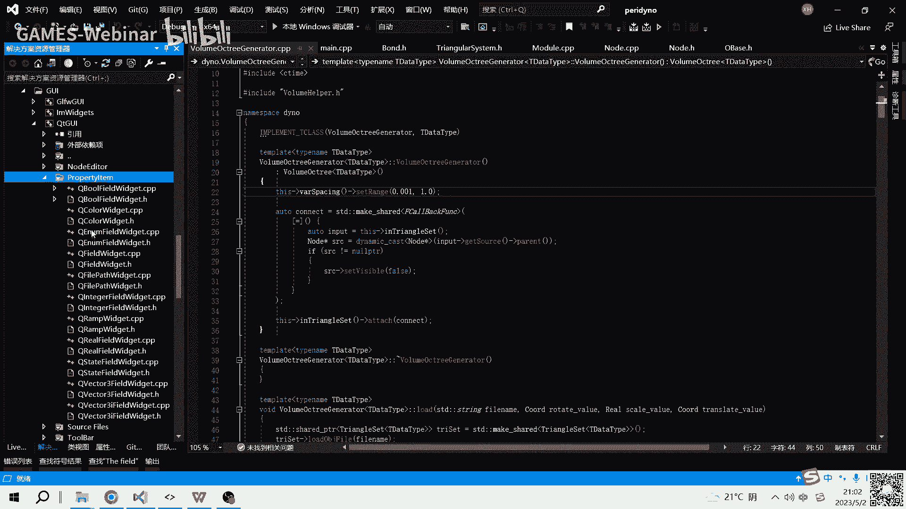

标签属性啊，然后这个标签属性当然对应的，比如这个像三维的啊。

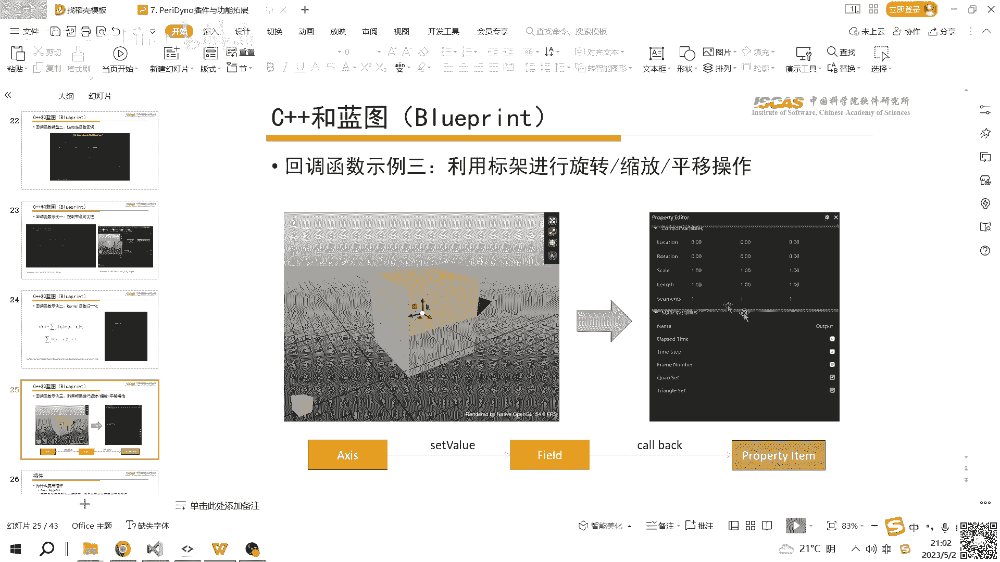

这个int float等等，这些都有，然后呢这样的话实际上你比如说我们点开一个，实际上点开一个这个呃，比如说这个三维向量的这么一个属性框，那这样的话它实际上会有一个，就是这个回调函数。

然后呢相当于这个回调函数实际上是在嗯，相当于在qt的这个界面的这个框架里边。

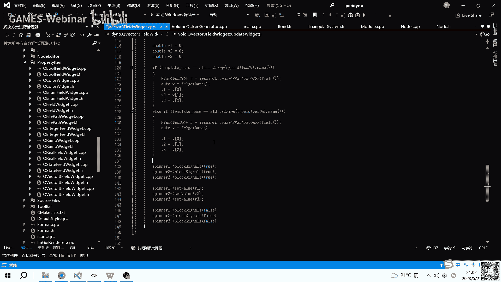

它相当于是传给了就是就是他的这个field，然后呢也就这个时候field如果只一旦发生改变了，他会去调用这个qt里边传给他，这个时候你会这个qd跟那个整个底层的框架，实际上是两套系统啊。

但是呢但依然可以在界面层面，相当于你把需要啊，就是跟qd相关的一些呃，一些那个功能跟一些函数，实际上可以传到这个底层框架，然后呢由他来完成回调。

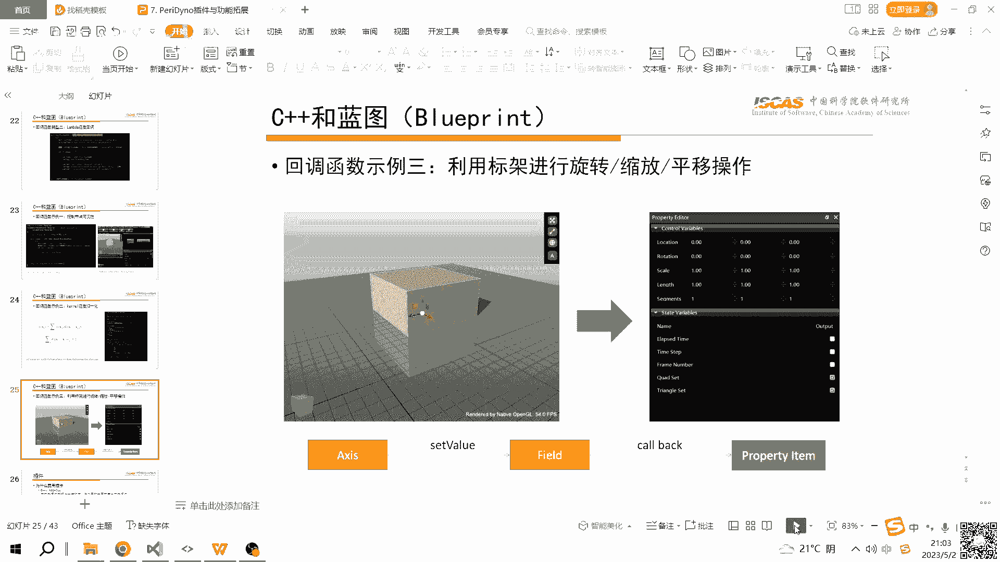

所以这样的话实际上就可以很方便的，就是比如说我们可以用这个左边这个呃，各种控件啊，然后来完成一些比较啊方便的一些操操。

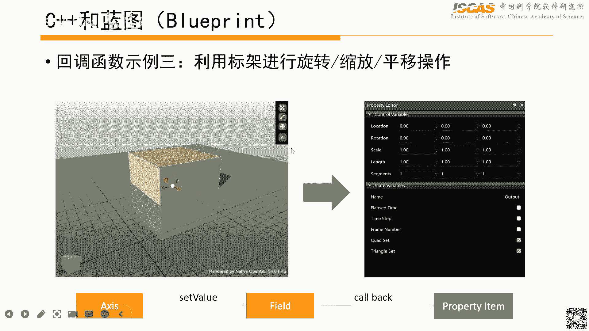

交互的操作啊，然后将那接下来还有一个呃一题，就是主要就讲讲就是啊插件相关的一些内容，当然为什么这里边我们说为什么要用那种插件，实际上整个插件对于c加加来说，它实际上插件是其实主要就包含两个。

一个就是整个框架，然后还有就是一堆的dl，实际上就是你直观的去看的话，其实这个东西很简单，然后他这个一个目的，实际上主要就是为了把一个复杂的一个系统，然后呃实际上给它拆拆分。

然后拆分成一些可能一些基本的，比如类似于积木块啊，然后呢这样的话我们比如说啊，这个这不是积分的积木块，然后相当这样的话实际上就在利用，比如说各种这样的积木块，然后再把它拼起来。

然后去构建一个复杂的一些系统，因为你发现就是我们这个系统，如果嗯最后代码量多了之后啊，当然包括现在，其实现在其实代码量也不少，然后你这样的话，如果你每次就都在一个系统里边，然后呢每次可能都要重新编译。

那这个实际上对于这个整个开发的那个成本，实际上还是比较大的，所以呢就是我们有没有可能就是实际上是插件，主要是呃利用这个拆分的几个功能。

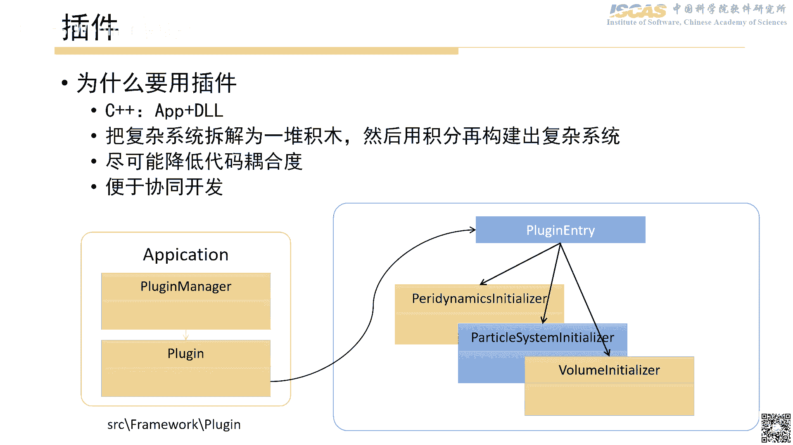

然后呢实际上把代码的这个耦合度实际上给他。

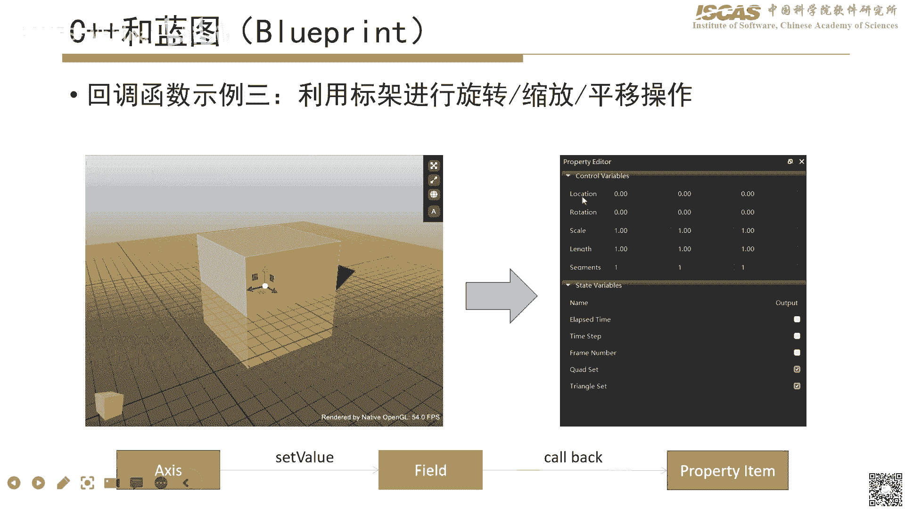

实际上把它给它降下来，然后这样的话比较适合于，比如说我们做协同开发，也就这个时候，比如说呃我不同的研发人员，可以呃相当于研发一部分，然后最后到再整合到这个整个应用框架里以后。

去完成这个相当于复杂的一些任务，那所以整个pdd这个系统里边，它这个插件系统是这样的，他当然跟其他的插件系统这个其实差不太多，就是单纯看插件系统，这个实际上差不多的，因为这样比如说他职业主要包含两部分。

一个就是框架层面，还有一个就是plug in的这个呃一些对象，然后所以呢整个这样框架层面呢，就这个是在framework里头啊，它实际上会有一个啊叫插件管理器，然后发现传理器呢。

他会去管理里边的每一个的pin，然后它对应的有bin的一个列表，然后呢当这个时候如果我们针对，比如说我们这个插件的开发人员的，这样的话，实际上我们就可以从这个plugin里边。

他这个时候他有一个entry，然后呢他这个可以从这个安全里边，我们给他继承下来，然后呢去开发各种各样不同的一些插件，比如针对的经济动力学的插件啊，或者针对那个粒子系统。

或者是当然前面演示那个sdf的等等等等啊，这些不同的一些插件，然后当然其实这个刚才讲到，就是本身插件这个东西，实际上是啊为了降低代码的耦合度啊，所以呢这里我简单提一下。

就是实际上就是呃设计模式里的一个概念，就是当这个东西主要是针对的是呃，如果我们希望是成为一名，就是说比如说开源软件的贡献者，就比如我们仅仅是使用者，这个其实没有关系啊，就是因为整个你代码怎么写嗯。

其实只要你自己看着舒服，其实都可以，但是呢如果你作为贡献者的话，这样的话，实际上可能就需要啊符合一定的一些约束，当然这个也是因为我最近在调代码的时候，就发现一些问题。

所以这样的话正好啊这块也简单的说一下，因为这里面实际上主要包含七个原则，实际上抽象的去看这几个，实际上会呃不知道在讲啥，因为这里边实际上比如说这七个的，比如像单性原则，开闭原则等等。

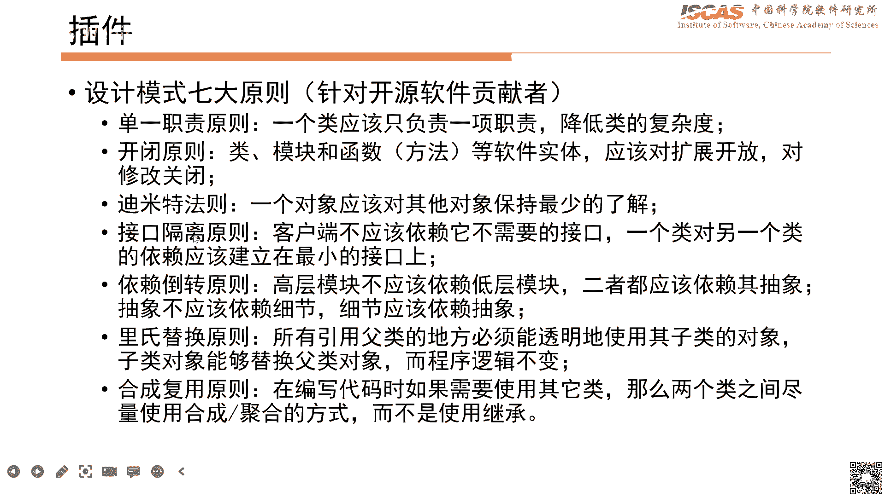

这个还是实际上比较抽象的，所以后面我真结合着具体的一些一些啊，碰到的一些情况，然后简单讲一下，就是这个到底哪个代表什么意思，首先这样就是第一个是单一性原则，这是什么意思呢。

就是一般来说一个类只负责一项职责，然后这样的话，实际上主要是为了降低这个，一个类的一个复杂度，所以这里边就是我举举个例子啊，就是什么样的情况下，其实是属于这个呃就是不太好的这么一个模式。

或者是实际上是跟这个原则违背的，比如像呃前面刚才刚刚演示了一个教育，一个就是相当于用输入一个三角网格，然后呢去创建它的一个体这么一个这么一个类，然后这个类里边呢你其实你现在去看的话。

它实际上还有一个额外的一个控制变量，因为前面讲的就是你实际上每个类，你需要哪些控制变量，这个东西呢尽可能的实际上是呃小，就是然后呢把不需要的那些呢实际给他摘出去，但是这里面会有一个额外的这么一个呃。

控制变量，这个控制变量是用来干嘛的呢，就是呃当然这个只是因为之前测试的时候，为了方便啊，就比如说我们希望这个整个s d f，然后它能动起来，所以这里边就加了一个这么一个控制变量，然后呢，在内部相当于。

比如说我让它整个沿着某一个速度，或者某一个方向，然后让它去不断的去运动，当然这个东西实际上这么设计啊，其实没什么问题，但是呢这个东西呢，就可能会跟整个类的一个初中，它实际上是相违背的。

因为整个初中他实际上只是做一个，比如说我们输入一个三角网格，然后呢相当于输出它的一个呃有向距离场，其实只是这么一个功能，然后当然这个实际上如果更合理的这种做法，比如说我们想保持这个单一职责的。

这个原则的话，那实际上可以把这部分直接移到外头，比如这个像刚才，因为是前面输入了一个三角网格，那这个时候我们实际上是可以去驱动这个，三角网格的运动，然后呢这个相当于3d网格运动完了之后，然后在后边。

然后去更新这个呃，这个相当于他新生成的这么一个s d f，所以这个实际上就对应了一个单一职责原则。

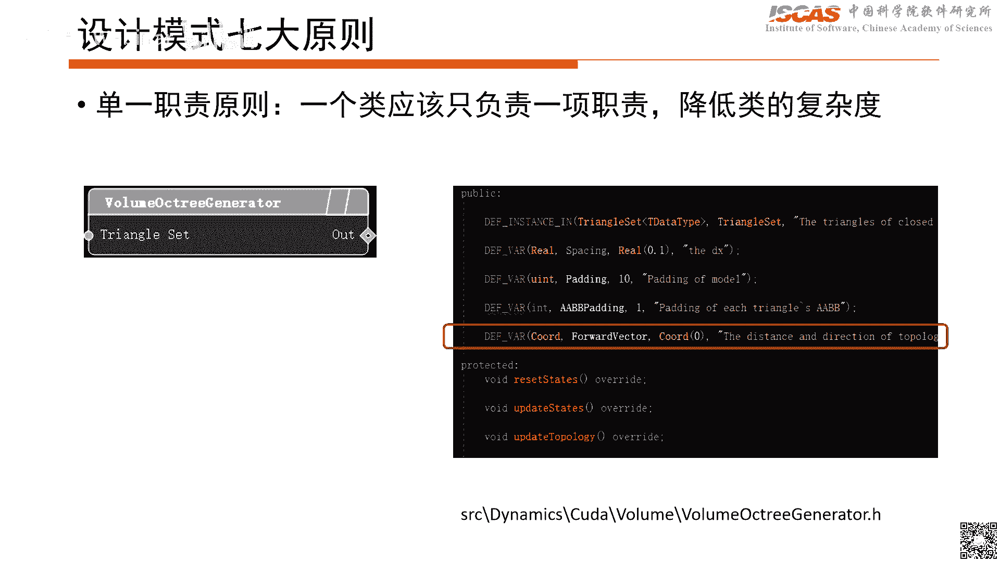

的这么一个概念，然后当然还有第二个是开闭原则，这个就是更抽象了，就是呃字面上的意思是他指的就是对扩展，对扩展开放，对修改关闭，但这个什么意思，其实就说的直观一点，实际上就是相当于你一个类。

你暴露出来的东西，对于比如说你是这个类的实现人员，那这样的话你应该是允许他去改的，但是呢对于比如说你仅仅是一个，其他类的一个使用者，那这样的话实际上就是说你一些内部的细节，你不应该暴露出去。

实际上直观的其实就是这么一个意思啊，所以这里边比如说举个简单例子，就比如像这里边，那还是刚才那个类啊，就是它里边会有一个函数，就是比如说他有一个初始化内部的，就是内部用的一些参数的这么一个函数。

然后呢这个函数实际上你可以设计成单，你可以设成啊，public也好，或者可以设成私有的也好，这个其实都没问题，但是呢这个按照这个原则来讲，就是你设置成public就会有问题。

就是因为这个函数其实对于使用者来说，它实际上并不清楚你这个东西是做什么的，所以这样的话，其实理论上它你是不应该是允许外面的类，其或者其他的类就直接的去调这个函数，因为这实际上是个内部使用的一个一个类。

所以这样针对这个，比如像这种，比如说我们只是在类的内部使用的一些，额数据也好，函数也好，这样的话实际上要给它封装起来，这样的话就不暴露给外表，也就这个时候呢就对对于也就这种函数的话。

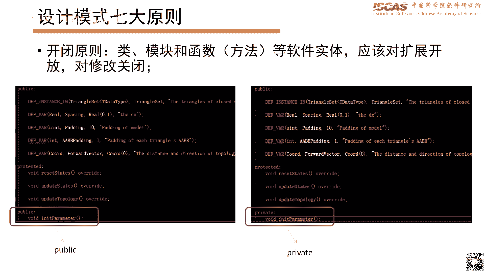

对外实际上是关闭的啊，那还有就是像迪米特法则跟接口隔离原则，这两个实际上是一个概念，就是呃一个对象应该是，对其应该是保持最少的了解，或者是这样呃，就是比如说不应该依赖这个不需要的接口啊。

所以这里边针对整个pano这个系统呢，实际上就是嗯讲台讲，实际上就是主要是几个一个人呢，实际上你node对这个state那个依赖，要尽可能的相当于要少，就是因为我们知道那个当你一个node。

你可以定义重复的很多不同的那个，你也可以用一些冗余的space去描述啊，比如说这个你虽然可以比如定义三个边，当然你可以定义比如说边跟边的乘积啊等等，这些都可以啊，你可以随便定义，也也可以用来描述这个。

比如这个一个立方体，但是呢这里边实际上是最佳的一个状态，应该是就是说你的状态实际上是描述这个呃，这个比如这个box最小的一个集合，然后当然就把一些这样，不如就冗余的这些这些变量的形象。

就不需要给它定义在里头，然后这样，当然这里也体现在比如说像low的跟嗯模块，这个比如说model模块以及对控制变量的一些依赖，以及对输入接口，当然这个输入接口就很重要了，因为输入接口的话。

你这个时候如果你有冗余的输入接口的话，这样的话直接就导致有可能就比如说呃，你相当于有些模块，它实际上有些接口是实际上用不到的，那这样的话它缺接口的话，直接就可能导致整个后边，整个模块实际上都没法执行。

所以也就这个时候其实对于整个节点也好，模块也好，你相当于需要设计的一些输入接口，以及输出接口，这个是要非常的注意，就是不能轻易的，比如说去改变它的输入接口，或者以及当输出相对来说还好。

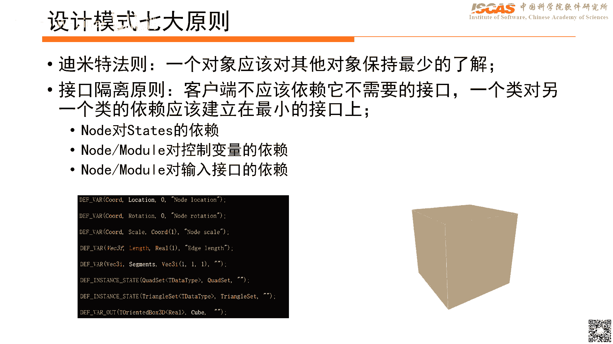

但是输入的话一般来说不能轻易动啊，然后接下来实际上是依赖倒转，以及这个理氏替换其实也是一个概念，就是什么意思，就是像高层模块，实际上不应该依赖这个底层模块，然后这里我举一个例子。

就像比如说现在整个python底层的话，它的拓扑的话实际上是一个层次化的一个结构，就是比如最顶层的话，实际上是一个电源，然后呢是一个编辑，然后呢是一个三角面片，然后四面四边形网格，然后呢四面体网格等等。

它实际上是一个拓扑层次化的一个结构，然后呢这个时候如果我们定义了一个模块，模块或者节点，它需要输入一个呃三联网格，那这个时候呢实际上就是什么意思，就是这个时候如果你输入一个四边形网格。

或者输入一个六面六面体网格，四面体网格，这个理论上，只要是这个是从三角网格继承下来的，这个时候应该也是可以输入到啊，这个相当于这个节点作为输入的，当然这个现在实际上整个界面里面设计的，其实也是允许的。

就是所以这里边就是要保证，就是这个理事替换原则，那就是什么意思，就是你如果输入的是它的一个子类，那这样的话你也应该能保证，就是说也就是你不管输入任何子类，它的结果应该是是正确的。

就是跟你输入它的那个父类，这是完全是不影响的，所以现在就是说实际上你如果是运行。

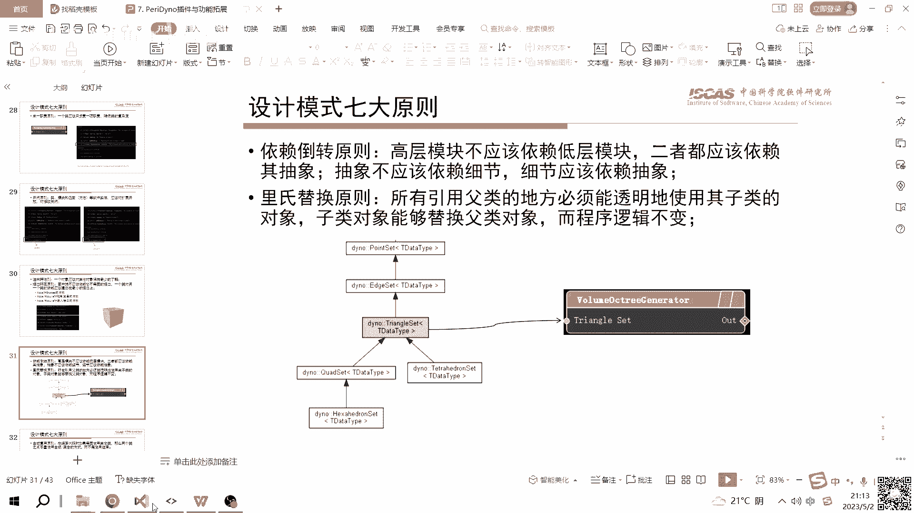

比如说这里边的那个程序的话，你会发现就是啊现在有个接口判断。

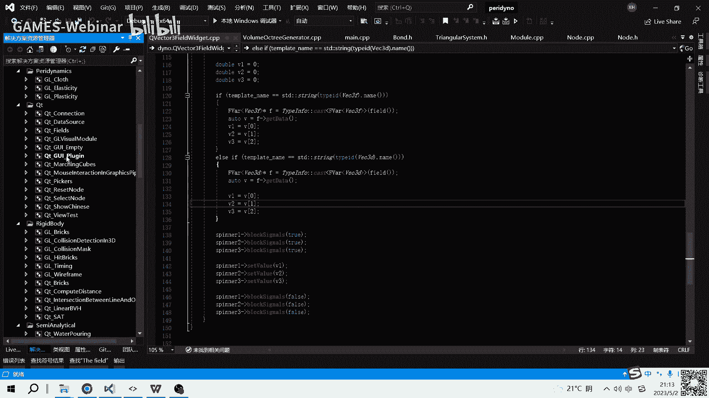

就是如果是所有的是子类的话，实际上都是可以允许输入，但是呢如果是不是子类或者是呃其他类型的话，这个实际上是不行啊，不行的，这样我简单演示一下这个这个到底什么意思啊。

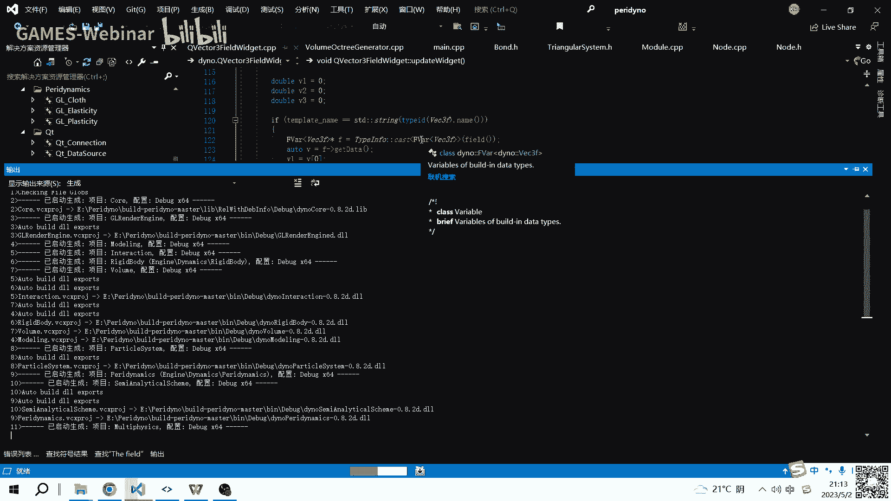

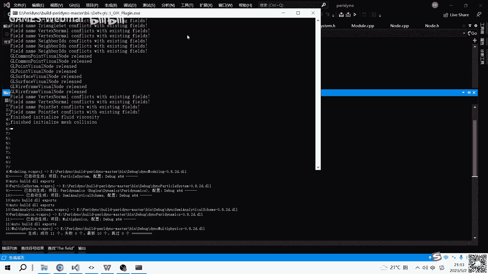

比如说像这里边我随便可以随便创建几个嗯，比如这个这个是因为是这样，他实际上输入的一个三角网格，当然输入三角网格呢，这个时候如果我比如说啊我这个呃cube，他cube其实可以输出两个，一个三角网格。

四边形网格，当然三角网格就可以传进去，但是呢这个时候如果我输入的是四边形网格，其实也也是被允许的，然后当然这个时候如果我们换一个，就是比如说我这里边创建的是一个呃，其他的一些类型，就是呃。

比如说这里边我创建的是一个粒子采样器，粒子采样器呢它输出的实际上是一个粒子啊，相当于这个典籍实际上是这个三角网格的父类，那这个时候呢实际上是按理说是不允许的，所以这种情况呢就是要得避免。

也就是说这个时候就不能允许它，相当于是把子类的那个对象输入给啊，就父类的对象输入给子类，然后作为传那个输入给它传进去，实际上这么一个概念啊。

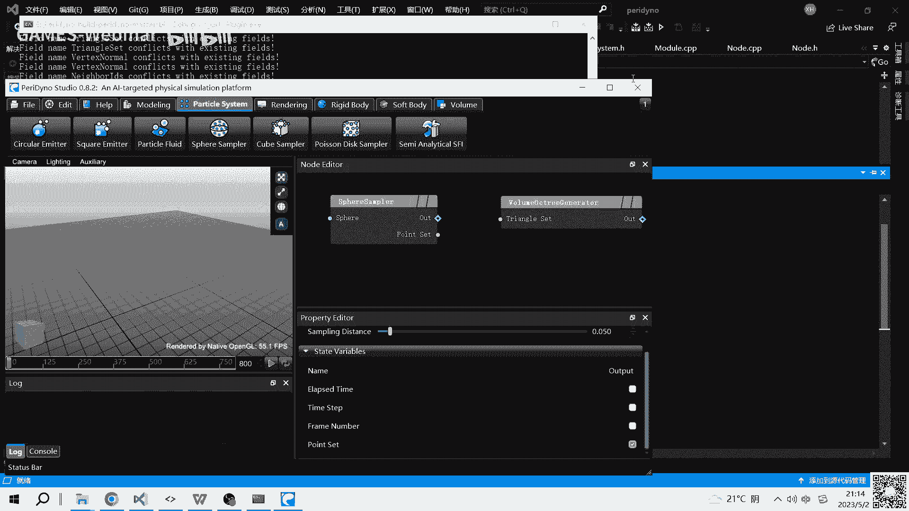

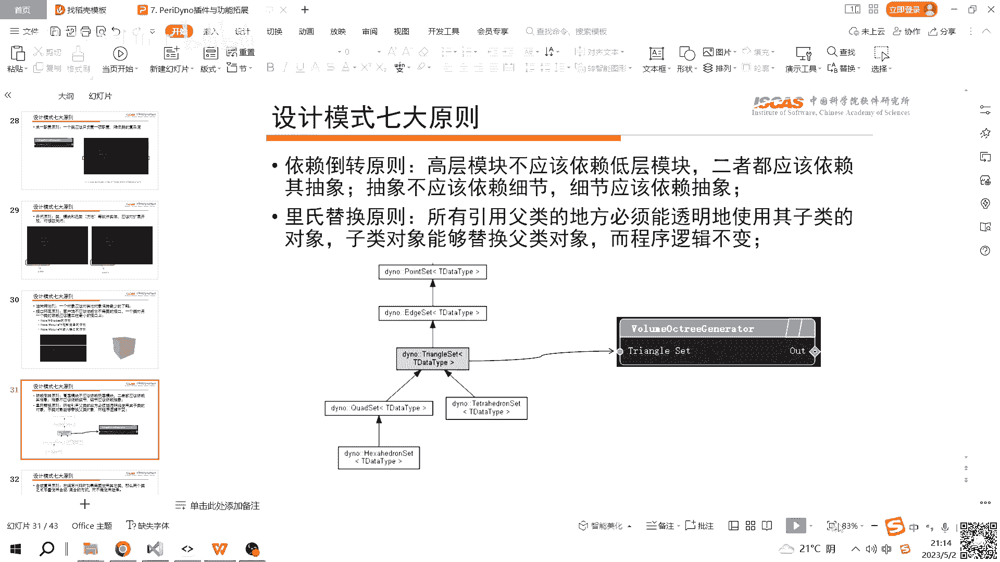

当然最后一个是这个合成复用的一个原则，就是啊这个主要是其实这个东西，其实最后那个原则其实属于呃比较模糊的，因为很多时候其实可能没有那么明确啊，然后当然这里边它其实核心意思就是，你如果你农夫用的地方。

那就是尽可能不要继承，就是当然这里我举了一个例子啊，就是比如说像啊这里边有一个针对刚体系统，查找那个领域的那个就其实做碰撞检测用的，那这里的实际上就依赖两个类，就是一个呢当然有个拓扑结构，还有一个呢。

就是比如说他有一个出力度的化疗检测，那这样的话这两个就是这种做法，当然我比如这个类，我可以完全从这两个类里边继承下来，作为它的一个子类去呃去实现，那这样的话也理论上没问题，但是这个会导致这个问题。

比如说你相当于你这样的话，你存在一个多重继承，你比如说你可以你有可能会继承多个父类，这样的话实际上会导致整个软件系统，它实际上维护起来，它整个那代价实际上是非常的非常的大，所以呢也就是这个代表的。

就是说你实际上就是需要用到别的模块的时候，就是如果能用这个组合的方式的话，相当于尽量用组合，然后也就不要用这种继承啊，这个派生的那个那个那个操作啊，但这里面其实还有一个需要注意的，就是一般来说继承的话。

就是实际上尽可能的，还有一个就是要减少这种啊，多继承的这么一些用的一些场景，就是多数什么概念，就比如一个子类，我可能同时去继承多个负雷，然后这样的话实际上就是呃有可能会导致，整个后面就是子类的话。

它会有可能会相对来说变得比较复杂，然后不太容易维护，所以呢这个也实际上也是一个比较呃。

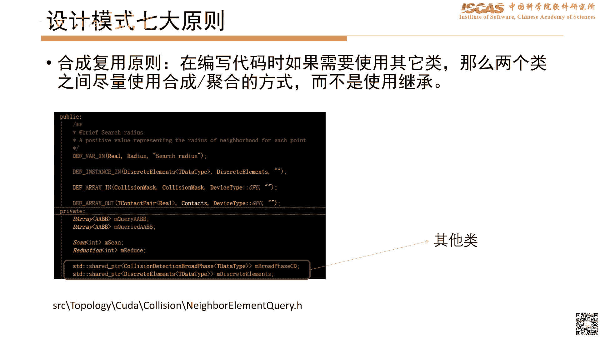

实际做研发的时候可能需要注意的一些地方，那接下来就是讲完前面那个一些是原则的话，就是后面我们看看，就是呃整个插件到底是怎么实现的，就是这里边当然就是使用的话比较简单。

其实这里边提供其实针对每一个plug int，实际上有两个接口，就是有一个叫一个叫nati static的那个bgin，还有一个就it is dandinologin，然后这两个分别针对这个静态库加载。

以及动态库加载的这么两个接口，然后呢实际上我们现在如果呃，比如说我们现在各种算法都已经写的差不多了，那这个时候呢我们实际上要做的就是嗯，相当于给他把那个插件做一下初始化。

然后这个初始化程过程其实也比较简单，就是相当于从pc entry这个类里边给他啊，继承下来一个子类，然后呢里边相当于给了创建，有个叫有个静态的这个uston这个一个函数，然后需要实现一下。

然后这里边相当于它会创建一个插件的，这么一个静态的一个对象，然后呢还有一个要做的就是，比如如果我们针对的是ui呃，因为这里吧现在这样的就是美的插件，它实际上会对应一套工具架，然后这样的话。

如果有些自定义的一些工具架的话，那这样的话就是需要去重载，这个就有个叫initialize，in action的这么一个呃一个函数，然后相当于去实现一些自定义的一些工具架的，一些一些按钮。

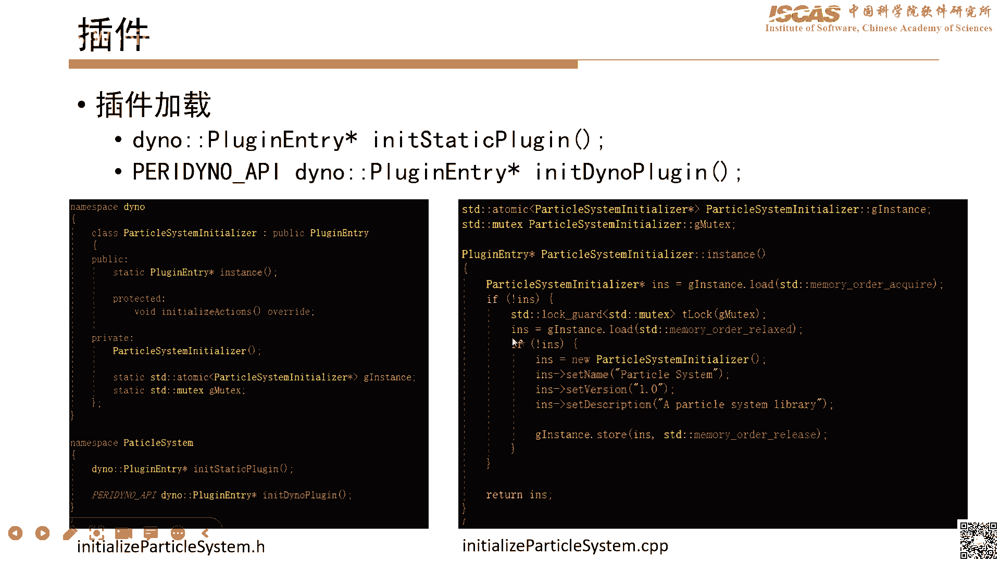

然后这个自定义工具架是什么意思呢，就是比如说你这里边，实际上比如针对那个粒子系统啊，这粒子系统的话，实际上就是呃，我们相当于现在是这样在上面添加了几个，比如说各种快捷快捷的一些钮，然后这扭的话。

实际上就相当于针对对应到代码里的，就需要相当于实际上是针对每一个钮，需要添加它的一个栏目的函数，相当于去创建一个对象，本质上，当然每个钮实际上对应的，实际上都是节点编辑器里边的，一个创建对象的一个过程。

就是点一下的话，跟节点编辑器里边你右键，比如说你创建一个对象，实际上是一个概念，然后当然这里边固化在这里边有个好处呢，就是这样你可以做一些额外的一些操作，比如说我可以定制化的把一些比如像这里边。

比如这个发射器，因为你看发射器的话创建出来它有一个外轮廓，那这样的话实际上你可以把外轮廓的那个呃，就用边框渲染的这么一个模块，然后给它显示出来啊，所以这样的话，实际上整整个插件你一旦加载进来之后呢。

实际上它会自动的就会把这个呃对应的工具架。

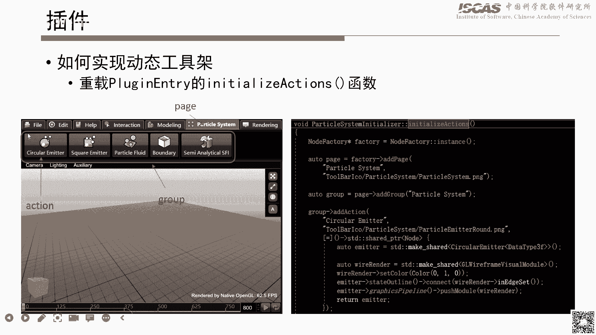

里边的一些按钮也相当于给它创建出来，然后当额外的其他还有一些其他的一些功能，然后这些呢实际上就是呃只是为了，就是后面相当于比如我们已经算法整个各种的，比如说已经研发差不多了。

然后呢只是让整个流程变得更好用的话，就是会有额外的一些就在ui层面，怎么让它变得更好用的一些扩展啊，比如说这个像这个标题栏，比如说我们如果是想对一些基本的数据类型，我们这个时候实际上不需要去显示它。

整个标题栏，那这样的话我们可以通过这个重载，每个节点或者每个模块，它的那个呃这个caption visible的函数，然后来相当于去呃。

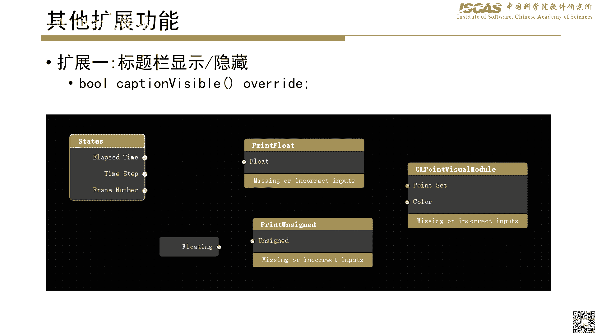

相当于去控制它的那个标题栏的显示跟呃隐藏，然后当然还有就是各种数据，其实现在实际上是这样的，现在整个不论是节点系统啊，里边的节点还是模块，实际上里边的每一项啊，实际上都是预留了这个自定化自定义的。

这个就是定制化的这么一些空间，所以呢比如说像这个标签，那个比如这个变量，比如变量的名称，那这些的话实际上就是我们可以自己的去，就是因为默认的话是这样的，就是比如像这里的定义一个变量的。

默认呢实际上是跟这个你定义的那个呃，就是代码力的那个名称是一致的，然后这么定义的主要一个好处，其实就是相当于你这样的话比较清晰，就是说你看到界面里边的对应的形变量，你直接可以在代码里面找到。

但是呢这个时候就是这样，如果对于比如说你到最后应用的话，其实这可能就并不直观，那这样的话实际上我们可以对每一个变量，它的那个名称，实际上可以对它进行更改，比如说我们改成比如像自己想要的这种方式。

就比如像这里我们给他，比如这个标量，我们就给他设置成一个，比如说中文的一个这么一个显示标量矢量等等，这些东西，实际上就是通过这个slog name，这么一个函数来去完成，当然其实他的那个所有的包括。

比如像这个标题栏，然后呢像描述信息啊，这个节点类型啊等等啊。

这个实际上都可以去定制化的去去改啊，那当然还有就是这里的，因为是这样，你看看节点的话，实际上主要是两个类型的，一种呢是啊这种小圆点，还有一种是这种啊钻石型的这个节点，然后那个小圆点。

实际上对应的是基本的数据类型，就是像啊控制变量呀，然后包括数组啊，二维数组，一维数组等等，就这些，然后呢这个这个钻石的这个形状，实际上对应的是节点，然后为什么这里要设计这个钻石的，这种数据类型。

其实主要是因为是什么原因啊，就是因为实际上就是像比如说啊，有的时候我们如果做耦合，那我和它实际上它依赖的数据会非常的多，就是比如像这里边要接入一个粒子系统，那这个时候它有可能会包含需要接入。

比如它的位置信息啊，它的速度信息，他的甚至他的那个比如d的性等等啊，那需要都需要求连接的，那这个时候实际上你会发现，整个界面会导致它非常的混乱，所以这样的话实际上就是这里边用这个呃，这个菱形的。

就是这种钻石型的，这个这个方式是相当于整个把它节点导进来，实际上是简化这个呃，整个图就是图形上的一个呈现啊，所以这样的话对于比如说前面，如果这个时候我需要接入一个主体。

需要用到里边它很多的那个状态变量的话，那实际上这样，我只需要把整个节点作为一个整体，然后给他转入到这个后面那个节点。

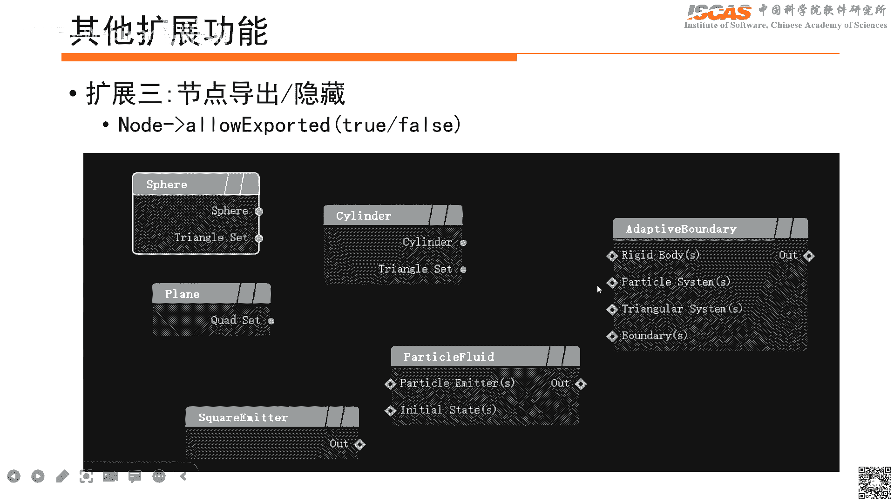

实际上就其实就可以完成这个操作，所以后面的话我会针对这个去演示一下，就是嗯这种场景啊，就是单主要包含几块，一个是这个实体建模，就是用s d f怎么去嗯，去相当于生成各种各样的这个呃。

就是自定义的去创造一些几何的图案图形，然后后面当然还有流体工布料，然后呢相当于这个也是依赖，就是说怎么依赖这个今天讲的这个插件系统，然后呢，把这个不同的这些啊模块儿给它串到一起。

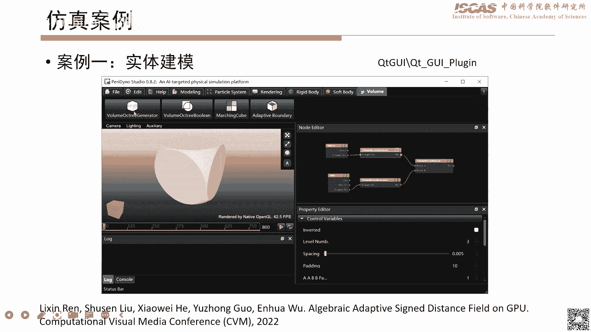

然后这里边实际上就是我还是用刚才的那个。

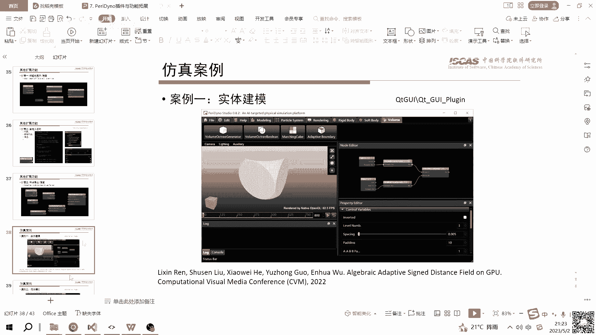

就是这里有一个叫q t g，i play in的这么一个一个程序啊，这个呢实际上这里边其实刚刚讲了，就是因为每一个类里的啊，就是那就每一个库里边，每个库里边实际上都会有一个叫initialize。

是什么什么什么这么一个头文件，然后这个头文件的本质，你如果打开进去之后呢，实际上就是初始化这个插件的这么一个一个类，然后呢以及两个api接口，然后当然里边就是啊。

一个呢是它的那个instance这个函数，然后还有一个就是初始化那个，就是工具栏的这么一个一个函数，所以整个呢这样的话，实际上你如果在呃需要静态使用的话，这个时候你相当于需要去在这个main函数里头。

相当于调用一下他的那个呃，初始化的一个一个函数，然后把这个插件给它加载进来，当然这个是静态加载的方式，然后一会儿会演示动态怎么加载，然后静态加载。

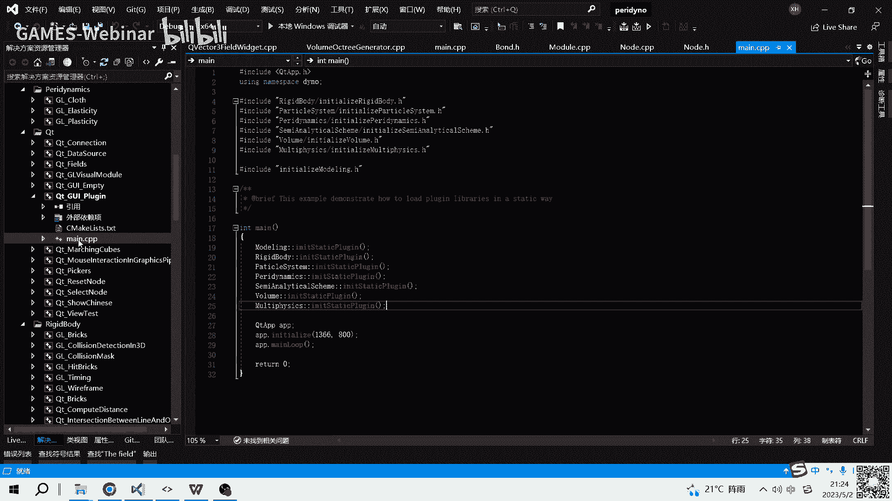

比如说这几个加载起来之后呢，就是你可以看到就是。

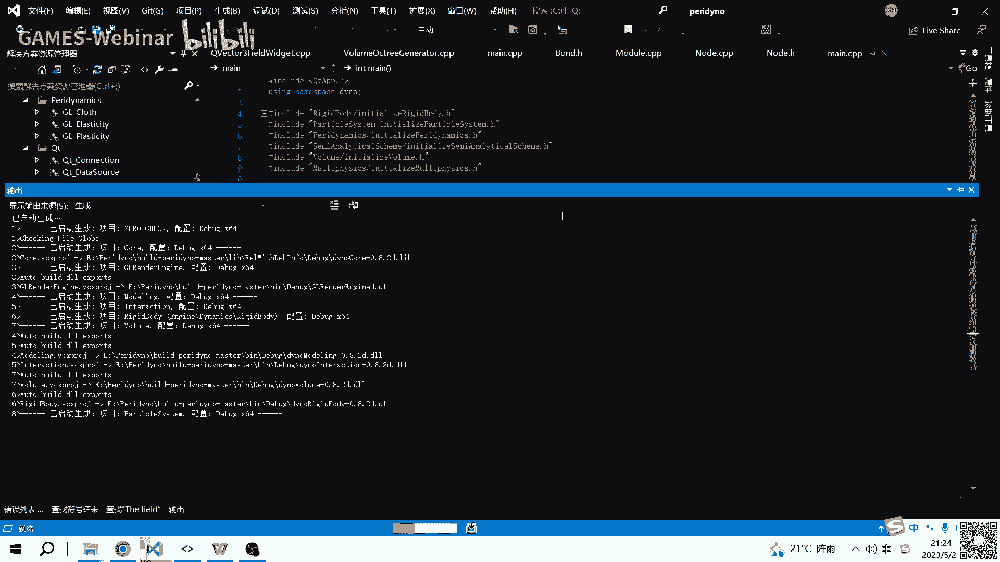

这样我发现这个直播软件开着的时候，那个程序好像会卡顿，然后这个估计可能是因为那个占用录屏软件，可能也占用gpu了，所以这样我把那个后面程序演示的部分，重新录制，然后演示一下吧。

那还是打开这个有一个叫g i plug in，的这么一个example。

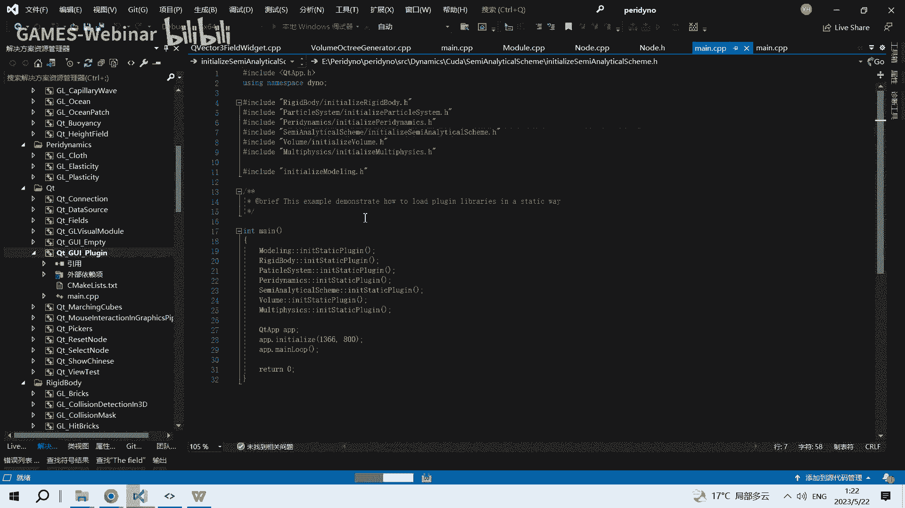

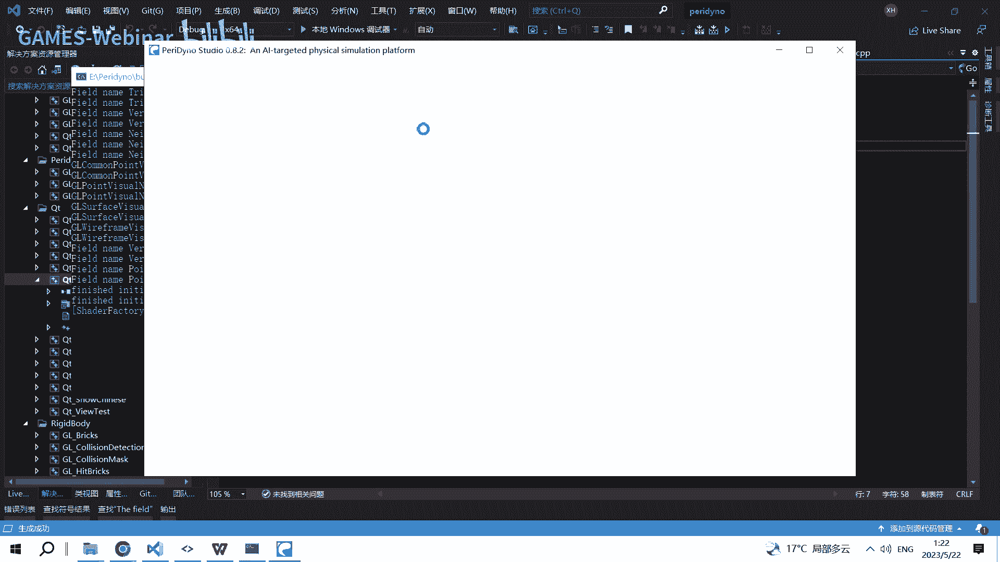

打开之后呢，就这里边首先就先切到这个啊volume这个选项卡，然后呢在这里边我们创建几个实体啊，这个第一步可能要那个先创建两个标准几何题，一个是这个标准的一个cube，然后还有一个标准的球，然后呢。

我们利用这两个基本几何体呢去做一些啊，基基于那个实体的一个融合操作，然后这个球可以稍微调一下，给它调小一点，然后这样的话就变成这么一个形状，然后接下来就是我们需要把这个表面网格，转成一个一个提网格。

然后这里借助这里有个叫vn martree generator，的这么一个一个类，然后他的每个输入实际上是一个三角网格，然后当然这个皮网格的分辨率需要改一下，因为不然的话分别太大的话。

它那个创建出来的那个呃质量不太好，然后这两个生成之后，当然这个现在我还没点重置啊，所以这会儿是没有的，当然我索性先把整个流程建完了，然后我们希望这个每个实体建完之后呢，我把它啊融合到一起。

然后后面有一个布尔操作，然后这个操作呢相当于可以针对呃实体模型，然后呢做比如说坐下的相交，相相相容，相差等等等等操作，当这个选项卡里边有各种操作可以选，然后这个接上之后啊，然后这个时候再点一下重置。

然后这个时候他当然前面两个给它关掉，然后这样的话，实际上你可以看到就是这个球跟这个那box，融合之后的这么一个形状，然后有了这个形状之后，接下来实际上我们就可以跟仿真把它对接起来。

然后这个对接呢实际上需要依赖，当第一步需要的是创建一个一些仿真的，一些基本要素，就是像流体的话，这里会有一个发射器，然后发射器后面需要接一个流体的一个求解器，然后呢把发射器创建出来的例子。

然后输入到这个求解器里头，然后当这个发射器的位置需要调一下，因为他现在是在内部，然后这样的话给他调到外头，然后这样的话就是相当于是从外面发射粒子，然后跟这个这个这个物体的边界，相当于产生作用。

然后呢这部分作用呢有一个叫这里，切到那个volume里头，有一个叫deputy boundary的这么一个一个节点，然后这个节点呢，实际上就是他输入针对这个流体，常见它可以输入一个呃流体，然后呢。

另外就是把刚才创建出来的那个实体模型，也给输进去，然后这样的话，实际上整个场景实际上就搭建完了，这个时候我们去点击一下这里这个绿色的箭头，然后它实际上你可以看到它开始运行。

然后呢因为他这个流体啊把它碰到边界之后，然后它实际上会跟呃受边界的一个约束，然后它整个流体的运动发生改变，然后另外就是你可以也可以看到，就因为它整个形状，是我们过来融合之后的一个形状。

所以它会沿着那个嗯更改之后，那个形状沿它的表面去运动，然后当然这个是一个流体的一个场景，那现在接下来就是，那我们再来看一个布料的一个场景，然后这样的话，实际上当这个整个实体模型可以不变啊。

所以这里我们实际上只需要把这个仿真，这波给它剃掉，就是将我们把那个流体那些节点给他删了，删了之后呢，这个时候我们可以重新的去创建一个呃，比如说我们就想模拟一块一块布，然后这个布呢就是当这个也是一样的。

这是一个求解器，然后他说要需要输入一个三角网格，那这样的话，这里边实际上我们可以创建一个一个平面，然后这个平面呢是这样，它可以调它的一个分段数啊，就是因为正常它实际上只有两个三角面片啊。

然后这样的话调完之后，你可以看到平面实际上就有一系列的三角形柱，四边形啊，当它其实四边形，然后当最终的话会转成一个三角形，然后这个四边形结构的实际上可以，因为它是三角形的一个父子类。

现在所以相当于它可以输入到布料理的，直接作为它的输入进行初始化，然后完了之后呢，这里边就是这个布料的一个数据呢，实际上就可以输入到这里的这个边界，那个aibinary这个节点里面有个三角网格系统。

那么这里这样的话，实际上去在运动过程中，去约束这个布料的一个行为，然后这里我把那个初始的那个关掉之后，然后再重置一下，这样的话这里布料的这个呃，它的数据结构实际上就会生成，然后你可以看到这里吧。

当然它有它的顶点和边啊，你可以看到那完了之后，这个时候整个场景已经重置完了，然后这个时候我再点一下这个网站开始按钮，然后这样的话你可以看到就整个呃这个布料，然后其实跟流体一样呢。

它其实碰到这个障碍物之后，然后发生整个形变的这个过程啊，这个是流体的一个场景，然后最后其实还有。

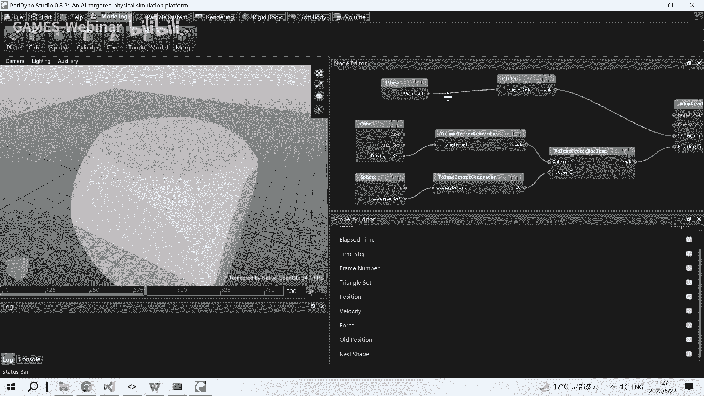

刚才就是因为他和那个呃插件的那个场景啊。

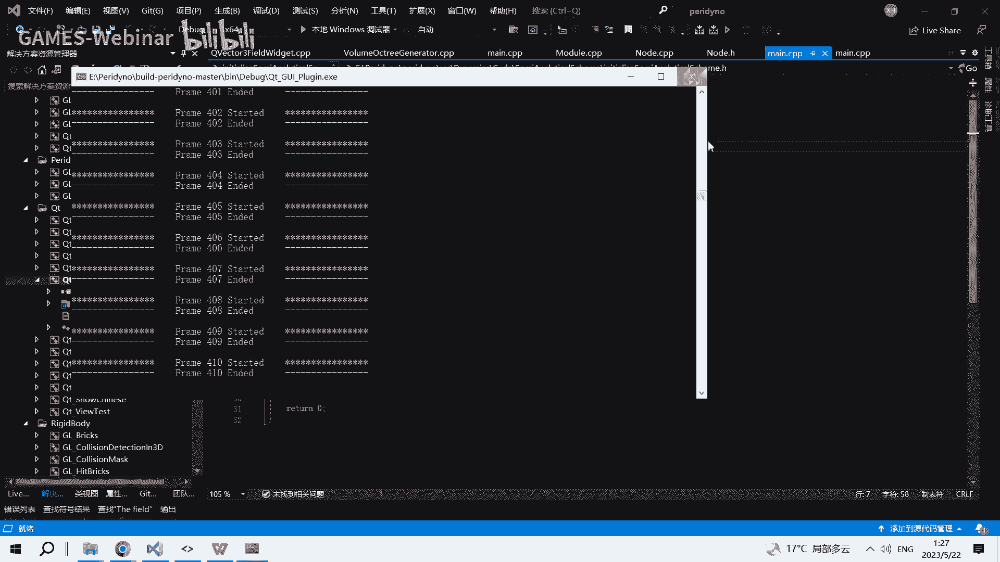

插件这个场景我再也再演示一下，因为嗯今天讲的主要是一个插件扩展的，所以这样的话实际上很多时候如果我们在外头，比如说我们把各种模块开发完了之后。

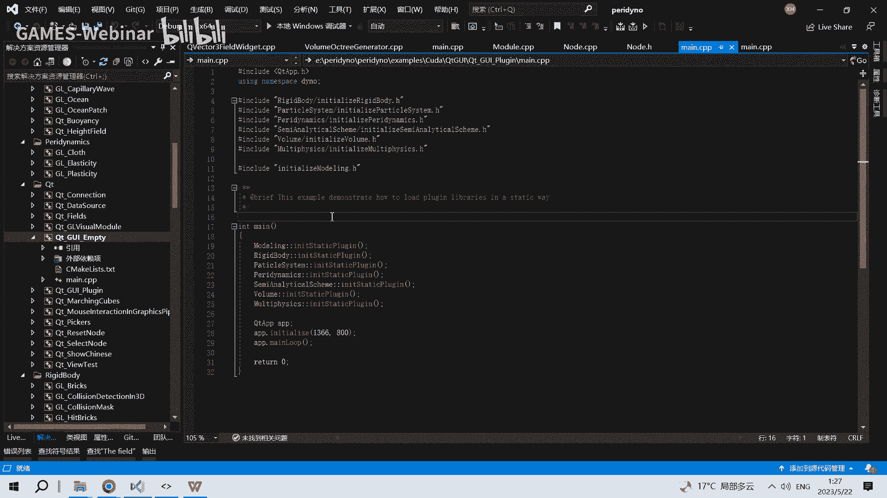

然后呢相当于需要以插件的形式最后载进来，当然这里吧我先演示。

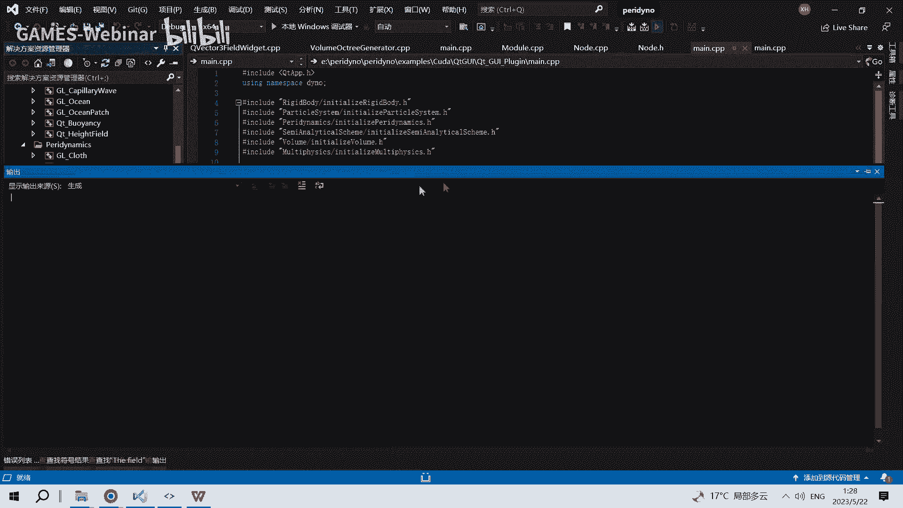

就是如果比如这里有一个那个空工程，这个工程是用来专门测试动态加载插件用的，然后实际上因为它里边基本不做。

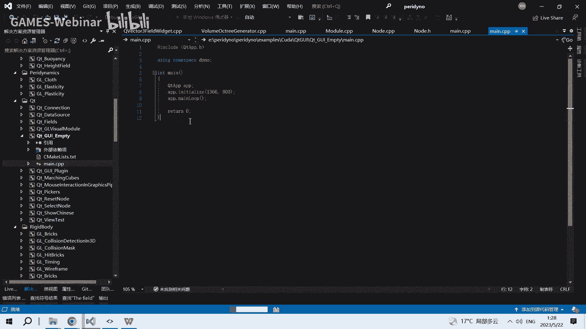

不进行任何的操作，所以呢如果直接打开的话，这里边是实际上空的。

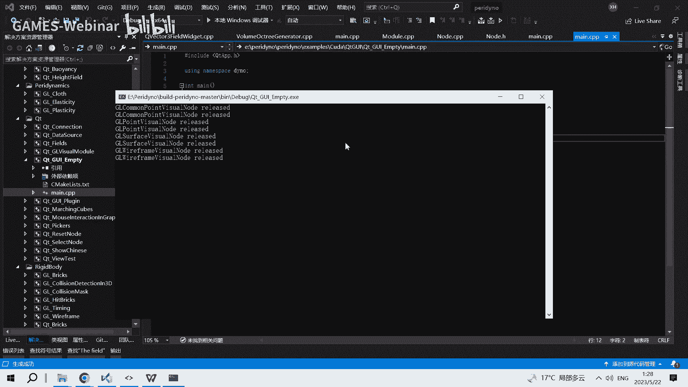

就是他几乎不加载任何的，跟仿真相关的一些算法，当然这个渲染是因为默认的有一些东西，然后但仿真的所有的选项卡，你发现其实没有。

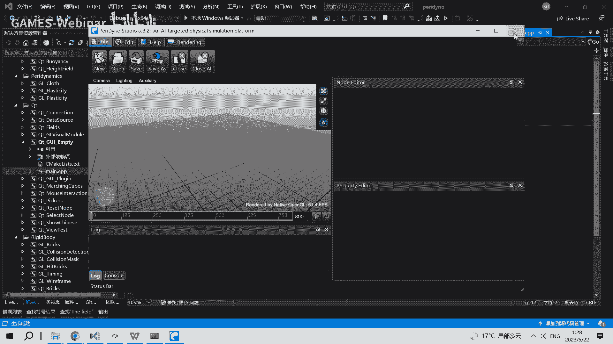

然后这个时候就是要怎么做呢，如果我们现在mate，比如说已经是开发了一些呃动态库啊，那这样的话实际上就是把这个动态库里的，比如说我们就还是刚才那个，呃粒子系统的这个动态库。

然后这样需要考到这个plugin里头。

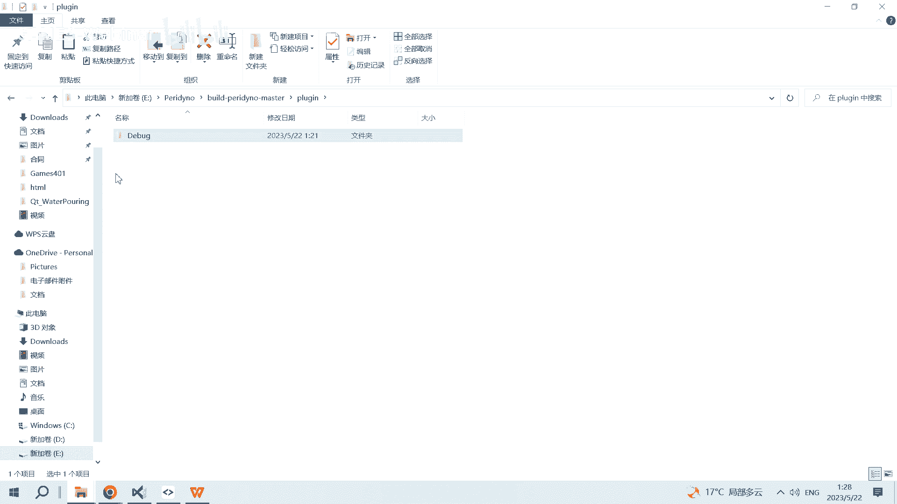

然后plugin里头的一个第八个录像，然后这个时候我们再去跑起来的话，实际上这样的话其实你就可以看到，就是嗯这个历史系统相关的这些功能。

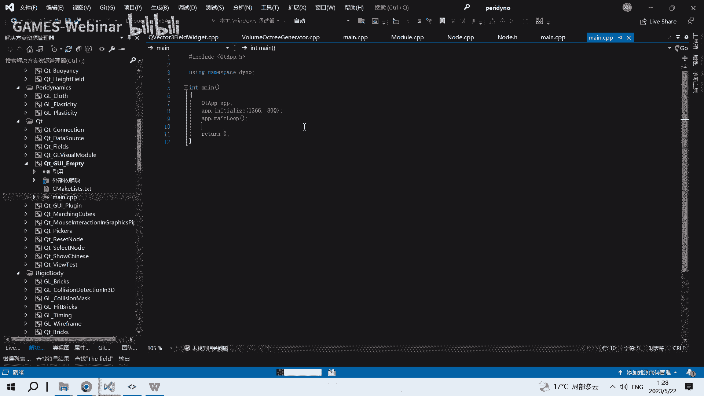

实际上就已经被加载到一个g u i里头了。

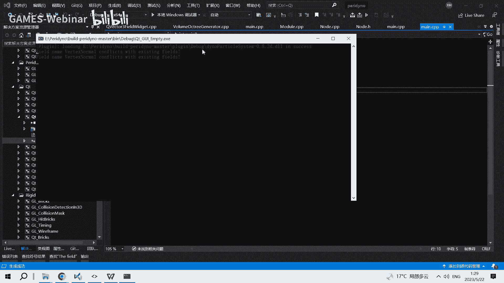

然后这部分这样的话，实际上你可以看到就是这里边的选项卡，就是跟刚才那个演示的那个界面，实际上是类似的，然后这个时候呢，实际上就是去点那个选项卡里的一些嗯按钮，然后这个时候呢就可以创建类似的。

刚才那样的一个场景，当然这里边没有那加载，没有建模啊，其他的没有加载，所以呢单纯可以演示一下，比如说流体针对流体这个场景，那这样的话其实就创建一个发射器，然后呢比如输入给这个流体的这个啊求解器。

然后这样的话就是比如说我们它再调一下位置，然后再点开始，然后这个时候你可以可以看到这流体啊，就是从发射器里表，然后生成出来的这么一个场景，然后当然就是这个时候，如果你比如说你啊。

自己自研了一些其他的一些库啊，或者其他的算法的话，其实也是通过今天讲的类似这种形式，然后这样的话可以导到这个嗯框架里头，然后呢，跟别的一些算法模块和插件也好像配合起来，来来创建更复杂一些场景。

所以这个我就这样，我相当于再演示一下啊。

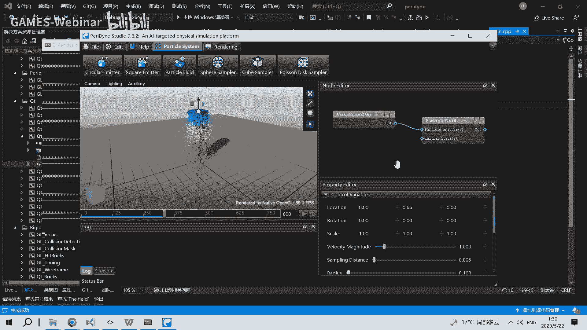

我们今天要讲的话差不多是这些。

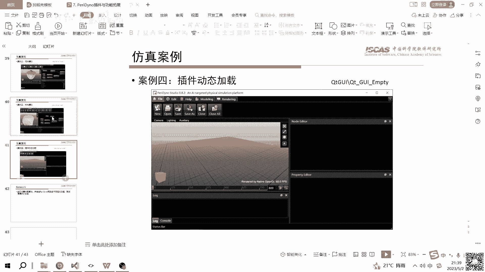

然后当然后面实际上就是一个小作业，就是因为其实呃一般我们作业不检查，就是大家有兴趣的话可以去做一下，就是你比如说你现在已经实现了一个，任意的一个ui啊，这样的话你可以试试，就是比如说针对这个呃。

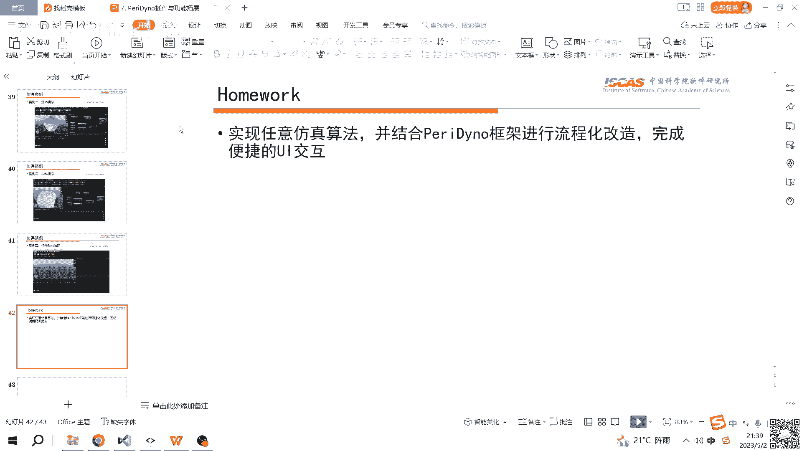

你需要的这么一个，就刚才前面演示了一个一个流程。

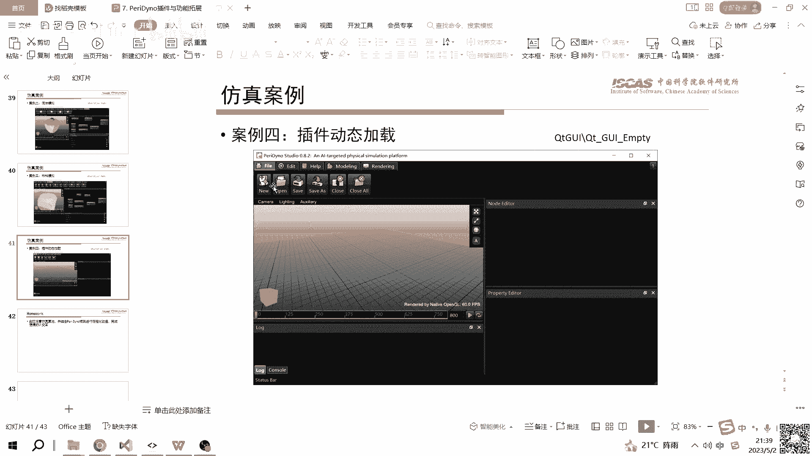

然后看看怎么比如说把你的算法给他谋划化，然后呢，最后相当于给这个怎么让它变得更好用一些，那整个今天要讲的差不多就这些吧，然后看看有哪些哪些问题吧，然后我看那个直播间里边有问，那个是不是自己做自研引擎。

是不是计算机必学，其实这个倒不一定就是资源引擎，其实主要是这样，就是看你在哪个阶段了，就是你如果仅仅是做一些研究啊，或者是可能就是目的就是发一些论文的话，其实这个不一定需要做自研引擎。

但是呢你如果比如后面，你如果想做一些其他更复杂的一些应用啊，那这样的话其实就有可能会需要，那其他的看看还有还有什么问题啊。

然后整个刚才演示的这几个样例啊，理论上应该是我测过的没问题，所以大家可以就是就按照刚才那个流程，可以去演示一下，就是就是在自己的台基地边，应该考的会比较流程，哦这里有说是打算用自研引擎做游戏。

然后这个呃可能还不太一样，就是因为我们那就知道我们现在做的那个，实际上主要针对仿真的，因为游戏引擎的话实际上跟这个还是不太一样，就是游戏引擎，因为其他涉及的，其实我觉得它涉及的物理实际上是要更简单。

所以它更多的实际上是侧重在其他方面，需要考虑的一些一些内容，然后考虑单机游戏呢大概需要哪选哪些，然后那这个我觉得最基础的应该是呃，就是类似于就是game 10101渲染啊，然后当然编程的是最基本的。

所以这个呢我觉得其实可能需要，那如果是这样，目前18岁的话，我觉得这个可能需要补很多基础知识吧，可能还到不了，就是那今天讲的就是比较就是比较专的一些，比如像房间算法，可能还到不了那个层次。

先看看看还有没有有没有其他问题啊，大学的哪些数学需要学是吧，这个看哪个方向，如果是针对，比如说仅仅是游戏开发，我觉得主要是教同学，然后线性代数，但是高速啊可能也需要学，然后嗯。

因为实际游戏里边其实涉及的物理，可能不会那么复杂，所以呢其实我觉得一些基本的一些数学啊，其实应该就差不多对，然后当然就是一些基本的力学的一些东西，当然这个就可能不需要什么连接件力学，这个其实没关系了。

其实就是一些大学物理里边的一些比较简，单的一些力学，我觉得有个了解应该就可以，因为游戏里面其实无论是比如说你钢铁系统啊，或者啥，其实都会比较简单，就是而且实际上会有很多的trick。

它其实不是那么serious的，物理方面，那现在反正这样就是整个欧为，我们这个其实也是一个开源系统，所以呢里边其实有很多问题呢，其实你会发现啊，就是也在不断的完善，所以就是可能中间的。

有可能中间某个版本可能会有一些小问题，但这个反正也是逐步的在完善的一个过程，行那今天我我看时间也差不多了，那我们的课要不就到这儿啊。

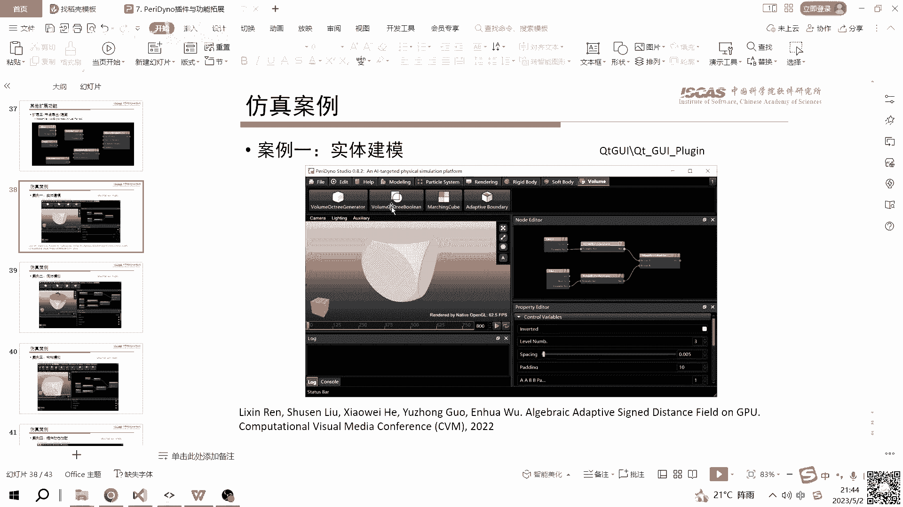