# GAMES401-泛动引擎(PeriDyno)物理仿真编程与实践 - P8：8. Vulkan编程原理及通用并行计算 - GAMES-Webinar - BV15M4y1U76M

嗯然后今天呢是这样，就是差不多是我这个最后一次课吧，然后后面就是有蔡老师进一步的会讲一下，就是工程仿真里的一些内容吧，然后今天这一课呢是这样，就是呃其实可以理解为，就是前面七次课的一个番外篇。

就是因为前面呢围绕我们，比如围绕库大，然后包括那个特丹诺引擎里边相关的一些内容，实际上整个是完整的，但是现在呢是这样，其实有可能会面临什么问题，就是可能有些同学打个比方，你可能现在没有英伟达的显卡。

或者是那个呃有种种种种原因吧，可能就用不了这个呃n卡，那这样的话会导致什么一个问题，就是可能就是前面课程里边讲的那些案例啊，或者很多的那个程序，实际上可能都跑不了，所以这样的话实际上就是带来一个问题。

就是说那如果我们脱离这个，比如说脱脱离扩大编程啊，我们还是进一步的想做，比如说一些并行仿真相关的一些呃，就仿真相关的一些并行计算，那还能不能做，然后主要是这样，所以今天呢实际上是针对这个问题。

然后我们主要讲一下，然后第二呢实际上是因为为什么今天讲挖坑啊，因为mark其实是呃最初的话应该是16年的时候，实际上就当时就呃呃当15年是提出来的，然后16年应该是属于正式发布啊。

然后这个瓦肯整个它实际上提出的初衷呢，实际上要整合就是渲染跟访问计算，然后呢用统一的api去去做，然后当然这里边这几年实际上在渲染力，渲染这一块啊，其实啊大家其实常识也比较多。

然后呢也发现挖矿这个还是有它的，这个很多有优势的那个地方，但是实际上在仿真计算领域，这个其实用motion做的其实不太多，所以呢现在实际上就是很多时候呢，就是说比如说我们马克到底他的能力边界。

就是针对仿真计算这个呃这一块啊，就是他的能力边界到底在哪，实际上很多时候不太清楚，然后呢我们目前到底能做哪些啊，跟仿真相关的内容，这个呢实际上很多时候可能不是特别的，就是因为这块其实做的相对比较少啊。

所以这样的话实际上今天呢其实也结合，因为正好华为呢就是我们说华为里头呢，其实之前也做了相关的一些工作，这样的话静好也是结合前期的一些工作，这样给大家做一个分享嘛，然后当然这里边今天讲的很多。

其实因为也是处于，其实很多时候其实处在一个探索的过程，其实很多时候也不是说，今天讲的其实就是一个成熟的解决方案，其实不是的，其实这里边因为啊我觉得瓦肯这个整个，包括整个语言也好。

或者是他其实用在法律这一块啊，其实还有很多需要进一步值得探索的一个地方，所以这样的话其实就是呃有很多，今天讲的可能有后门也不断的，因为其实也是开源的一个呃相当于一个系统吧。

这样的话后面实际上也会不断的进步的，去完善啊，嗯那现在那后面我们就具体来讲讲，就是这块内容吧，然后今天讲的话其实主要是分几块，就是首先简单介绍一下，就是挖坑的一个简介，然后当然以及一些通用名。

是云计算的一些一些概念，然后当然这里边就是会，接下来就是会讲一个比较具体的一个例子，就是说我们怎么用挖矿来写一个，并行计算的程序，这个计算实际上就是呃就跟渲染无关了。

就纯粹是一个通用的一个并计算的一个问题，然后当然这里边就这个过程中，其实就是你发现这是如果纯粹的用原始的那个，挖坑api去做的话，这个东西实际上还是蛮困难的，所以这样的话实际上接下来就是我们会看看。

就是说我们目前就是怎么针对以往这个挖孔，这个编程太复杂了这个问题啊，然后就是啊怎么来简化，就是针对这个计算任务，然后来进一步降低它一个编程的一个复杂度，当然因为整个实际上是呃。

现在实际上包括这个整个挖后端，实际上是内嵌在就是parda这个框架里头啊，所以呢就是这里边后续其实也会讲一下，就是这个挖矿后端是怎么跟pdino，实际上他作为一个那个跟kda类似的后端。

然后怎么跟这个pdl这个框架，然后相相当于怎么对接啊，当然还有一些其他的，就是我们的前期就是呃，就是各种尝试过程中发现了一些问题，然后正好也可以给大家分享一下，然后当然最后还有一些简单的一些。

案例的一个展示，首先我们来看一下就是挖坑，这个呃是一个什么东西啊，就是其实这个东西是这样，就是挖坑，最早实际上刚才提了，就是实际上在gdc 2015的时候，实际上是被提出来的。

然后当然这个正式发布是在2016年，然后他整个实际上因为也是嗯，我们知道他上一代的其实是主要，因为之前一般就主要用欧盟gr嘛，用的实际上比较多的，但是呢欧盟gl实际上还是有很多问题的。

比如说那个呃像多多线程下的一些问题啊，或者以及各种平台，比如移动平台跟pc平台这两个实际上不通的，所以针对等等，当然还有就是整个open g啊，它的呃它它主要是针对还是针对图形渲染的。

他其实针对通用计算这一块呢，实际上是还是比较弱的，所以这样的话实际上瓦肯设计的初衷，实际上就是要把呃渲染跟仿真这两个任务，然后呢实际上是整合到一起，然后相当于用一个通用的api，去解决这两个核心任务。

所以呢实际上他提出来的一个，当时实际上就被誉为是一个叫open g啊，net相当于实际上是下一代图形的一个接口，就是也就相当于是，未来有可能是要替换掉open g啊，但这个东西就是短期内。

我估计这个东西没有那么快了，所以这个实际上也可能会是一个漫长的过程，然后呢逐步的去替换就omg，当然这里边就是本质还是也看，就挖坟到底能解决这个问题，要以往存在问题的解到什么程度啊。

这个实际上当然还有各种硬件厂商的知识等等，这个实际上都相关，所以呢当然这个目标实际上整个需要替换掉，open g r，然后这样的话成为新一代的一个图形，的一个接口标准。

那当然这里面其实还有一个特别有意思的，就是挖坑这个东西啊，因为它特别偏底层，所以整个如果直接用marin去写这个呃，各种的程序的话，这个东西实践起来还是非常的麻烦，不方便，所以呢就是如果对于初学者来说。

所以今天讲的那个实际上不太，今天讲的内容可能不太适合，就是说如果你是一个图形或者啥仿真计算，入门的一个呃一个刚入门的这么一个情况，这样实际上不太适合用welcome去写的，就这个时候肯定还是希望更适合。

就比如你哭大，作为你一个入门的一个基础，然后当然后面其实会讲，就是怎么能尽可能的把这个复杂度也降下来，当然，然后呢挖坑它其实有一些那个特征，当然是因为他这嗯之所以会被认为是，比如说下一代重新api。

它肯定是有遗忘的，就像我们g1 里的一些无法比拟的优势啊，当然比如第一个，它实际上就这里就是一个，实际上是一个统一的api，所以这个统一a b i什么意思，其实主要像以前的open gl。

我们知道它实际上是在pc端跟移动端，实际上是两套api，就是pc端呢实际上叫open gl，然后呢移动端呢是呃open gl，但实际上说温蒂尔的一个子集，就这样的话。

实际上整个实际上兼容性感实际还是成问题，和这样的话，实际上win这个呃这个api呢，实际上就相当于，他实际上用一套统一的api去解决，就是说各种啊移动端也好，p那个pc端也好。

这样的话实际上是各种环境用统一的一套一开，那当然这样的一个好处，就是实际上它可以兼容各种各样的操作系统，比如说像android移动平台或者是windows linux等等啊。

这实际上都统一的用一个api，这样的话实际上如果这个可行的话，那就讲了，对于比如说我们呃写防御算法的研发人员来说，实际上是一个利好，因为这样的话你实际上只需要写一套算法，然后呢，这样的话就可以。

无成本的迁移到任何一个平台去运行，所以这个对于后期比如说你去发布啊，或者对那个呃这个平台迁移，跨平台迁移的时候，这个实际上会比较方便的，当然这个马克还有一个优势，就是它整个就是针对多线程环境。

还是比较友好的，因为以前像open gl或者bd差这个设计的时候，它实际上主要是还是针对那个那单核cpu的，这么一个来考虑，当然另外就是马可，因为它只是整个它的接口啊，更靠近底层。

所以它实际上就是他的所有的api，它的那个调度的一个开销，它实际上是相对来说更低，所以就也就是你如果同样执行同样的任务啊，这样的话，实际上理论上挖坑的效率应该会比open gr，实际上是要高。

当然他因为也更偏偏底层，就所以他其实对整个g p u拥有更呃，更直接的一个掌控能力，然后呢接下来我们看一下，就是我们看看就是给大家科普一下，就是整个gpu的api到底包含哪些东西啊。

就当整个g p u呃api它实际上也是伴随着，就是因为这里其实不光是挖坑啊，其实这个整个在gq i a p i这个家族里面，实际上是比较多的，当然主要其实就两个目的上来讲，就是其实就是不是为了做渲染。

其实就是为了做仿真，当然像挖坑，因为它它目的是渲染跟仿真，相当于兼顾的这么一个api，所以整个所有的那个gpu一拍，它实际上也是伴随着就是gpu的一个发展，然后当然最早的话就是open gl。

当时1992年提出来的，因为当时也是显卡，然后出现了之后呢，然后就相当于比如针对这个啊游戏啊，针对各种的那个三维的一些场景，然后做一些固定的一个一些管线的一些功能。

然后当这个他当时最初提出来的open gl单，主要是应用c来写的，然后呢当然另外就是他其实当早期的那个open gl，实际上是不具备这种可编程管线的，所以呢他很多时候他其实呃像学图形的时候。

为什么会讲那个根管线啊，它其实整个相当于每一步做什么，实际上都是固定的，所以这个是早期的那个呃呃图形api的一个特点，然后当然后面就是想微软的话，后来独立地发展出了像点direct x。

然后他当时在windows 95里面就是引入这个，然后当然因为微软，它实际上主要是他借助它的windows，所以呢就相当于实际上就是啊，它实际上形成了一套独立的一个标准啊。

所以这样的话其实整个它是平行于open g啊，独立发展的这么一个一个api，那当然后面的话实际上就是因为考虑到就是说，如果我们针对的呃，很多时候这样的，就是我们实际上很希望，就是说你这个呃。

a p i具有一定的可编程的能力，那这样的话实际上在第三第九的时候，它实际上就引入了这个角还level的这个cd language，然后这个嗯shader这个引入之后呢，实际上对于某些。

比如像顶点着色器或者片源左侧气，这这这几个阶段啊，就特定的一些阶段，那这样的话可以由用户去自己去设计一些，就是说相当自定义的一些行为，比如说我相当于对比如说这个顶点的一个属性，我可以做一些制定的计算。

那这样的话对于特定阶段的，实际上就具有了一个可编程的一个能力，那当然这一块实际上就是呃就是刚才讲的，就是因为open gl，整个实际上主要最初的话，主要还是针对pc平台啊，所以实际上在03年，包括后面。

因为我们知道那个呃就是二一世纪初的话，实际上最最大的一个变化，实际上你会发现就是各种移动设备啊，就是整个层出不穷，那这样的话实际上就是你所有的那个图，因为我们知道手机其实它也有gpu。

但只是他建个gpu的那个性能相对来说是比较弱，所以呢这样的话实际上你也同样需要兼顾，就是说你这个图形能力，也需要兼顾这个移动设备，所以针对这个移动设备呢。

实际上就是啊这里就发展出了就是open g l e s，它实际上就相当于是这个open gl的一个子集，然后呢，主要专门用来针对这个移动设备的那个，图形渲染，那当然这个同样的就是因为也是需要就是啊对。

比如说像顶点着色器啊，顶点着色器啊，当然后面其实还有几个左侧器啊，这几个一些特定的这个阶啊，这个嗯阶段实际上需要具有，可具备可编程能力的话，实际上open g它实际上也引入了这个着色语言。

就是open g l的这个协定，languy，他这个跟h l s l其实也是一个并行的，就是他这两个其实语法很像啊，就是很多东西其实你发现它是相通的，但是他整个因为它实际上它的那个维护的主体。

是不一样的，欧盟基亚，因为它整个是一个叫chronolop的这个组织，这个那公共组织来维护的，然后像德尔佩x的时间，主要是由微软来维护，他的那个一个语言的一个迭代，然后当然这后面就是因为其实这样的。

早期的刚才也讲了，其实早期的啊其实比如07年之前啊，其实那会儿当然就是呃，其实也具备一定的可编程的一些能力，但是呢实际上早期的图形api，其实主要还是渲染为主，当然也有尝试。

就比如说用可以用特定的shader，然后做一些模拟相关的事情啊，比如像那个文华老师之前在2004年的时候，其实呃也已经做了，比如像那个三维流程的一个模拟，但总的来说就是早期，因为各种比如说配套的工具啊。

这个或者一些调试工具的一个缺失，导致实际上就是嗯就是通用这个像kda以前啊，你如果用这个gpu的api去写一个比较复杂的一个，访问算法的话，这个东西代价还是比较大的。

所以呢实际上就是后就是07年这个扩大，这个就是由英伟达这个提出来之后，实际上这个东西，我觉得可以认为是一个里程碑的这么一个，一个节点啊，因为它整个实际上就是重新定了，就是你这个gpu其实它不是单纯。

就是不是单纯用来做渲染，它完全可以用gpu去做任何的啊，跟渲染无关的，比如完全是一个仿真计算的，一个通用的一个任务，所以这样的话实际上就是后面的就逐渐，就比如这个gpu呢。

你会发现在现在比如各种应用这个压训练啊，等等，各种算法训练，实际上你发现这个实际上就是也是啊，这个07年这个扩大提出来之后，然后对这整了这个你会发现这整个学术界也好，产业界学校实际上产生了很大的变化。

然后当然ka早期就是ta主要其实还是用针对，是计算的，然后当然这个其实早期的版本，包括08年那会，他其实也只支持c，然后后来是逐渐在嗯，应该是没记错的话，可能是5万还是六啊。

就是后面逐渐的这个记不太清楚了，就是后面逐渐的相当于加入了，比如对c加加的一个支持，所以整个它实际上发展到现在的话，其实变得已经变得是比较好用，当然这个整个它各种知识的标准，也是不断的发展和新加17啊。

最新的等等，就各种新的特性呢其实也不断的加，然后当然这个因为这还是跟那个前面就是欧文，g要跟doos其实是一样的，就是嗯因为这个英伟达，那这个扩大实际上主要还是英伟达的护盾，就这样的话。

实际上这个对于整个比如行业标准的话，实际上是缺失的，所以这样的话，实际上在后来在2009年的时候呢，又提出了这个open，就引入loopen cl，然后这个实际上专门是针对这个通用并计算。

然后呢相当于提出来的这么一个通用计算标准，然后这个当然最早是其实open是apple发起的，然后最后呢是后来是，应该是有这个corona group来维护，然后他这个整个里边很多特性。

你发现其实跟古代其实也比较像，当然唯一不一样的地方，其它其实是它整个实际上是呃他不是混编的，它相当于它的呃shader跟它的后续的代码，实际上整个人分离的，当然他整个也是支持这个c或者c加加。

它其实这些是实际上都支持的，但是后面其实你看后面的发展的话，整个现在其实从用户的角度来讲，其实我们cel这个用户群体应该是，目前应该是远远要少于这个扩大的这么一个，用户群体。

然后当然其实像metal的话，其实就后面apple，因为其实针对的其实就是，比如说图形和计算的这两个啊，这两个任务，它实际上就是apple也希望把呃，图形跟计算这两个api融合。

然后呢形成一个统一的这么一个图形接口，所以这样的话，实际上apple在14年的时候就开始就呃发，开始发展他的那个metal，然后当这个metal其实跟dx实际上是一样的，他其实也主要是针对这个v。

就是苹果的这些平台，就是苹果的那mac系统啊等等，然后它实际上是跨平台的能力，其实还相对是不足一些，所以呢到16年的时候，实际上就进一步的就是其实针对，因为其实目标还是一样的，就是需要把渲染跟这个计算。

这两个呃任务实际上是打通，然后用一个统一统一的api去处理，所以这样的话，实际上在16年的时候就发布了这个啊瓦肯，当然这个最早的时候实际上是md发起的，然后后来也是由这个开源组织来维护，然后呢就是挖坑。

其实比起其他的语言，比如比起那个m g l也好，或者c l也，它实际上你会发现它整个更底层更底层，什么意思呢，它实际上会把很多硬件的就gp硬件的那个特性，实际上会暴露出来，这样的话有个好处。

就是它实际上它整个的性能会更高，就是如果你运用得当的话，这个性能实际上可以得到更高效的一个性能，但是呢啊整个带来的一个负面的影响，其实本质上对整个包，可它实际上对于编程人的要求其实同样也很高。

然后呢同时导致就是整个编程的复杂度，其实大幅的一个提升，然后当然目前的话时间挖粉主要还是支持c啊，其实c加加的一些特性啊，比如说那个各种面向对象的封装啊等等啊，这个或继承派生等等这个东西。

目前马可应该是不支持的，然后呢这样我们从那个用前前面来讲啊，其实这个你会发现，就是如果单纯的去做这个并行计算啊，其实你有很多的解决方案，就是你比如说你可以用扩大来做，或者你也可以open cell。

或者你甚至你用win用全部重写一遍，当然也没问题啊，但这里边实际上就是啊，因为为什么这里边有很多的呃这个呃标准，或者是很多api，这个其实一方面是整个是，因为他其实这商业建的考量点我们就不去讨论。

然后当然对于这个研发人员来说，我们其实更关注的应该是就是说，那我们如果针对一个特定的一个呃任务，那我们是需要怎么去选择，就是用什么样的一个语言，是作为一个自己最合适的一个语言。

但这里边实际上就需要考虑很多方面的一个内，容，就是呃这里我列了几个方面，就是以这个kda in cell go mark为例，然后我们看看就是说这三个它其实在不同方面，它的特点啊有什么差异。

这样的话其实你可以结合，就是说你这个不同的呃特点，然后你最后却可以决定，就是说你到底用什么语言去完成，你最终最终的一个并计算的一个任务，所以首先第一个实际上是从实际上，从支持混合编译的这个角度。

这个混合编译这是什么概念，就是我解释一下，就是其实你看以前大家如果写过那个open gl的话，你会发现这是open gl的那个设备端的，那个就是gpu端的那个代码，跟这个厚实的端。

就是你c加加写的那个代码，这两个东西实际上是分离的，它实际上不是在放在一块编译的，然后这个呢实际上在扩大里边是支持的，因为扩大你会发现就是你整个比如说你在呃，有有一个点ceo的这个后缀的文件里面。

你可以同时的写c加加代码以及ko代码，然后这个时候呢，n m c c会帮你去拆分里边的不同的代码，所以这个当然也就这个，实际上是需要去用编译器，编译器层面来协助来完成这个内容，然后当这个有这个的好处。

就是你整个实际上你发现这个代码的，编码的一个复杂度，实际上能大幅度降低，这样的话就是可以，就是就是加快你整个研发算法的一个呃，一个效率，然后像那个open cl，以及包括这个实际上目前应该是不支持。

因为这样的话呃，不支持导致的一个结果，就是相当于你这个时候，你比如说你定义了一个数据结构，那这样的话你可能需要针对，比如说你ccr里的代码，以及你谁都是代码，这个时候你实际上是要维护两份代码。

这样然后同时要保证这两个之间的那个呃，就是结构是要完全一致的，所以这个整合对于代码的维护，实际上是有成本的，然后当然其实其第二个就是因为仿真的话，整个它的算法逻辑实际上会比较复杂。

所以呢就是啊需要有各种各样的调试工具，然后去辅助你来啊支撑，就就相当于是你比如说你这个呃，中间的某一个布，然后可能你需要去看看他输出的一些结果，那这个呢实际上其实也很重要。

就是所以当这个实际上目前应该都支持的，只是说那个呃你如果看裤带的话，可能会更好用一些，当然其实第三点的话其实很重要的，就是如果我们比如说后期我们如果我们想呃，我们写一份代码之后。

然后我们可希望就比如能到多跨平台里边，就是无无差无缝的迁移过去，那这样的话实际上我们就需要考虑，就是说这个这个api的这么一个，跨平台的一个能力啊，然后当然这里边就是我说了一下，就是因为像coda。

因为主要还是依赖于完全依赖于英伟达的显卡，所以这样的话，实际上对于比如说我们现在用的是md的显卡，或者是移动端的一个设备，那这样的话实际上可能没有能用的大显卡，那这样的话实际上你以前写的扩大代码。

可能就啊不能直接用，所以从跨平台的角度来讲，其实ka这个应该是对于平台，或者对硬件的依赖性实际上是比较强的，那这样的话其实像open cl跟瓦肯，其实这两个相对来说话，平台能力更好。

但其实严格来讲应该挖坑其实是最好的，因为它其实支持的平台就是，无论从pc端到移动端，它的那个兼容性应该更广，当然这个其实也带来一个不好的地方，就跟他说，因为很多时候你的这是你的效率啊。

跟你的那个啊就是你的性能跟你的那个复杂度，其实有时候是呃很难折中，就是说这样的话，你如果画平台接的好的话，你有可能整个你对于在不同平台适配的时候，它实际上依然还是会有差异。

所以这个时候就是还应该还是会有一，些额外的工作量需要去去解决啊，那当然还有一个就是整合，就是因为不同的语言，它其实是支持的c或者c加的标准是不一样，就是像库大哥们cl的话，现在应该主要是c和c加加。

其实c加加为什么这里很重要，因为这里边就是像仿真的话，呃，他其实如果单纯用c是不是可以，当然也可以，但是呢问题在于，就是说如果你这个嗯不用不依赖任何的封装的，这些特性的c加特性的话。

它会导致整个代码的复杂度极高，所以这里实际上就是呃，从这个代码简洁的角度来讲，其实这个支持c加加对对象的封装，这个东西实际上是比较重要的，然后当这个目前挖坑实际上不支持，所以如果用mark的话。

其实你许多代码，就是你可能需要退化到这个c的这个，一个一些规范，然后呢还有就是dc加加其实也有很重要的一块，就是比如模板的是不支持啊，这个这个其实模板主要是因为这样，就是很多时候。

我们不希望就是说你类似的代码写多份，然后这样的话其实整个维护的成本比较高，所以这样的话其实如果有模板支持的话，我们可以就是统一维护一份代码，然后这样的话其实用模板的一些策划，各种的其他的一些技术。

然后呢可以整个降低代码维护的成本，所以整个你会发现就是不同的语言之间，它在阶级方面其实会有一些差别，所以呢就是你可以结合自己的需求，如果你仅仅是比如说你想，就是想做一个特定的研究。

然后呢比如就写特定的算法，那这样的话其实你怎么说，你比如你用coda啊，你这可能是最方便的，然后当这个时候你如果要考虑的，比如你需要移动端啊或者跨平台，那这样的话可能扩大你解决不了你的那个需求。

那这个时候你可以考虑用walk，然后呢是不是对某些特定的算法进行重构，然后相当于生成一份，就是说你可以兼容各个平台的一些访问算法，那后面我们就来看一下，就是那我们现在既然就是呃每个语言。

它其实有它不同的特点，然后这样后面我们就看看，就是说用挖坑，如果呃作为我们现在打个码，我们就现在选定想用挖坑来写一个，并行计算的一个程序，那这里边就是呃该怎么做啊，就是这样，我当时第一就这一部分。

我先简单的讲一下，就是如果我们不依赖任何的封装，或者不是依赖于，就是我们家假设用的就是原始的api，然后怎么来做这个事情呢，就这里我写了一个简单简单的任务，就是比如说我们现在已经有两个数组求a跟b。

然后呢实际上就是做的事情也很简单，我们就假设把a跟b然后先求和，然后加到啊，把结果存到c的这么一个数组里头，那这个东西对于如果我们现在是用打个比方，我们现在用扩大来写了，这个其实很简单。

就是嗯我相信比如说对于一位初学者来说，以前可能完全没有接触接触过gpu，可能花个几个小时，这个东西应该也是能写出来的，这个我觉得没任何问题，但是呢这里边的问题在如果打个遍，我们现在是用vn去写。

那这个东西就很难说了，所以这里我写了个一言难尽，其实这里边主要是如果针对是呃，完全的一个挖坑的初学者，或者你可能gpu之前就是可能没有任何的接触，这个时候你如果仅仅是想去实现这个东西啊。

我觉得估计可能得花很久的时间，然后我们后面来看一下，就是为什么这个东西就这么复杂，就是因为这个整个挖坑它实际上前面有提到，就是他因为更偏底层，所以呢他许许多硬件的特性就是本呃，比如像ka它之所以点燃它。

其实本质是它编译器层面，它又给你做了很多的简化的一个工作，但是呢像挖坑，它其实它的编译器的那个能力相对还是比较弱，所以很多时候你需要去自己去，相当于去啊，指定各种各样的一些执行的一个流程。

然后呢这样我所以这里我先简单讲一下，就是welcome它包含哪些东西啊，就是呃你如果现在，比如说你就要想编写一个前面的一个任务啊，当然首先最顶层，它实际上你假设其实就是一个application。

然后呢你application，然后接下来的话你实际上就是要做的第一步，实际上就是你需要创建一个instance，就是当你针对不同任务，你可以创建多个instance啊，这个实际上是一对多的关系。

然后呢有了这个instance之后啊，就是接下来你要做的就是，因为你可能一个就是一个电脑上，或者一个移动设备上，你可能有多个显卡，那这样的话，实际上你这个时候你需要去选择一个显卡。

你具体在相当于要决定在哪个显卡里边，你去具体去执行你的那个计算任务，所以这里面实际上有一个物理的一个设备，这个物理设备对应的实际上就是你的一个呃，一个一个显卡，然后当物理设备选完之后呢。

实际上接下来你实际上计算的时候，你还需要有一个逻辑设备，这个逻辑设备呢，实际上是你就真正执行计算的呃一个地方，然后当然逻辑设备里头会有对应的那个，一个队列，这个队列呢主要有三种啊。

因为整个挖坑它其实主要是会针对，就是他有两类任务吗，它实际上一个是他的渲染任务，第二个呢是啊他的计算任务，所以这样的话实际上就是从队列角度来讲，它实际上会有三个队列，就是有一个图形队列。

还有一个计算队列，当然还有一个是transfer那个队列，然后transfer这个队列主要是针对，就是说比如说你现在有两个数组，你需要进行数据之间的一个拷贝，然后相当于其实是主要针对数据拷贝。

有这么一个一个独立队列，当然现在这样就是你不论是图形队列还好，也还是就是说你的计算队列，实际上它都是可以同时去完成，那个jansfer的这个拷贝的就是这个，所以这个呢实际上是简化了，整个，就一定程度上。

其实简化了整个啊计算的一个流程，那有了这个队列之后，当然下一步实际上你就要去创建各种坑等函数，然后你就去执行可能函数，当然这个东西呢其实你会发现比扩大还要复杂，就是扩大的话，你可能直接写一个客串函数。

然后编译器，然后就帮你转成一个二进制了，这个实际上比较简单，但是呢welcome里边，其实他整个逻辑实际上都需要你自己去创建，就是也就这个时候你需要去，如果你要去呃执行一个额计算的管线的话。

这个时候你呃首先还是还需要去分配一个，你的那个命令的一个command poor，然后当然这里边会有很多command buffer啊，然后这些command buffer呢。

实际上就会去具体的去在这个上面你去记录，就是说你要执行的哪些命令，相当于你这些，比如说你有一些计算的管线，你有一些算的管线，这样的话就需要依赖这个model buffer，然后去完成整个计算的一个过程。

当然这个过程整个行，因为你这个整个pine，它实际上它还有就是他需要输入，比如说各种各样的一些数据啊，就是比如说你输入一个呃呃buffer，或者输入一个那个变量，那这样的话其实你还要额外的指定。

就是你这个buffer到底是啊什么类型，然后呢，各种大小等等这些东西需要都需要去指定，也就是你会发现它整个，但完全它里边，相当于每一步都需要你指定清楚之后，然后挖坑才能真正的去执行你的那个代码。

就这样的话，实际上还有一块就很重要的，就相当于你整个gpu上你创建的，比如说你有global memory啊，你local memory各种memory的话，你实际上也需要就相当于是创建出来之后。

然后呢它是一种代表什么类型，然后他的描述符需要指定清楚之后，然后呢传递给相当于整个计算的那个pi，然后来去执行这个呃这个计算，所以这个实际上你会发现就是从这个won的，这个你看那个呃这个整个对象关系。

你会发现它其实流程还是比较长的，就是因为这个不像，因为像ka里边就是你很多东西它其实是隐藏的，就是比如说你直接如果你不选那个呃device，它其实默认可能就给你选了一个一个零，所以这个时候呢。

实际上你这个时候你不需要关注，就是你即使完全不管任何的其他的部分，你实际上只是单独的你去执行一下kle，它实际上会有很多的默认的一个操作，但是那welcome这很多地方你会发现。

它实际上需要显示的去指定各个部分，所以这样的话就针对就前面的这么一个，简单的一个任务，你发现就是他其实会包含很多步骤，就是啊这里只列了七个，就是我后面逐步的会讲一下，就是到底应该怎么怎么去做啊。

然后当然首先第一步，实际上就是你要创建一个instance，就是你当然整个application，然后你需要去创建一个instance，然后有了之后呢，你要呃前面也提了。

就是你相当于需要创建一个物理设备，然后有物理设备之后，然后当然才是这个一个逻辑设备，然后呢再结合你的队列，然后再去创建各种的啊，就是相当于buffer也好，或者是看那个peline等等啊，就这些对象。

然后呢第二步实际上要做的就是说，因为其实这里面最核心的答案是两个，一个就是你要准备的数据是什么，然后呢第二个就是你的计算程序里的那个代码，就是计算的代码是什么，所以呢实际上就是相当于整个前面的那设备。

初始化完了之后啊，后面第一步要做的其实就相当于是要在呃，就是你的gpu的那个memory上的，你实际上要去分配你所需要的一个数据，然后这个其实跟kda其实也有一定的差别，就是扩大的话，你如果打个比方。

因为这个实际上cpu和gpu的数据，一般是不能直接访问的，就比如我我现在有一部分cbc加加的代码，然后呢，这个时候它实际上是没法直接的去访问，gpu上的一个一个数据，然后反过来也是一样的。

就是你如果是现在，比如说我gpu有有个ko的一个函数，它实际上也是没法直接去访问这个呃，就是你的比如说对应的一个cpu，对应的一个呃内存的一个空间，所以呢就但是像ca的话。

其实会有一个比如说有有拷贝的函数，你这个时候你可以直接把cpu的一块数据，直接拷到这个gpu，然后这样的话gpu实际上就是啊就可以，就是针对就相当于你gpu的代码，直接就可以看到这块考进了一个数据。

但是呢mark有一个特点就是挖坑，他所有的这个数据，它需要通过有一个叫stage buffer的这么一块，一块存储区，需要进行中断，然后这个存储区相当于什么意思呢。

就是啊这个存储其实对于cpu和对于gpu，它实际上都是可见的，所以这个时候呢就是你相当于你cpu跟gpu，它互相之间打交道的话，他不是说你两个直接直接互相打交道。

他而是需要通过这个stating buffer，然后来去做这个一个中转，所以这里怎么做呢，就比如我们现在这个cpu里边，我们分配了一块一块呃空间，那这个时候呢他要映射到。

先映射到这个steady buffer里头，然后这个时候呢就是当然这个steady buffer，它对于gpu来说，如果直接去访问了也可以，但是呢，这个时候他其实整个呃效率还是比较低的，所以这样的话。

其实最好还是说把这个东西要直接考到这个呃，就gpu的一个local的一个memory里头，首先的话其实是利用这个sting buffer，然后进一步再把这个数据考到gpu，然后这个时候。

然后比如说你的gpu kl再去访问这个数据的时候，这个时候会表快，所以这个呢是其实是瓦肯在分配这个这个呃，空间的时候啊，就是跟其他的那个，比如像跟空大可能会有一定差别的一个地方。

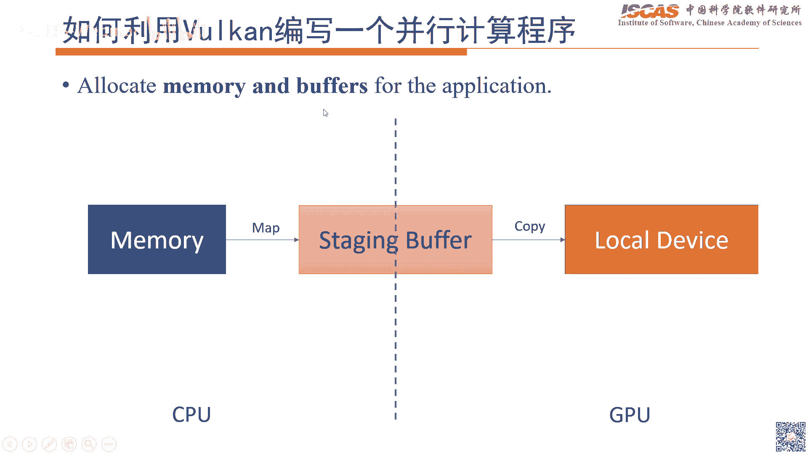

然后这个这个有了车后堂，第二步，实际上就是要去准备你的一个计算的一个ko，然后这个kono实际上你用很多号，很多那个写着写都可以写，在这里举了一个就用js写的这么一个eko，然后当然它这里边你会发现。

它其实也需要干几个事情，就是里边一个呢，你需要去指定它输入到底是输入哪些参数，就是其实前面相当于是你前面分配的那个buffer，到底是哪几个，所以第一个就是比如像针对那个两个数组，然后求和。

然后存到第三个数组的话，这样的话实际上它需要进就是输入这三个buff，然后当然你额外的还有个变量啊，就是这个变量实际上是告诉，就是说你这个可能我请问我这个数组里面，一共有多少个元素，然后有了这些之后呢。

当然其实这里面还有一个东西，你看它指定的是一个，就是因为我们知道那个gpu上面的话，整个执行它是以就是我们第二次讲了，它实际上是以block的那个为单位去执行的，所以这样的话。

实际上你需要还需要在这里边去指定一个，block的size，然后当然后面那个代码实际上就比较简单了，就是当然所有的这个啊shader它的入口啊，其实都是有一个叫main的一个函数。

就是相当于它整个就是一个入口函数，然后后面的话其实你会发现，其实这个就跟扩大就比较像了，就是你获取它的一个那个呃全局的一个id，然后当然这个是一个三维的，就如果你现在这个数组是一维的话。

那这个时候你只需要就是你呃，根据它的x就是x的那个大小，然后去相当于把这个呃对应的那个处理的那个，数据的那个位置给他定位出来，然后这样的话你整个去执行计算，然后呢所以这个整个代码实际上比较简单。

然后完了之后，当然你需要额外需要做的，实际上因为这个是一个二进制的代码，就是你如果直接去执行的话，这个执行不了的，所以呢这里边实际上就需要把这个二进制代码，然后呢转就编译成了。

这个叫有个spear v的这么一个呃中间文件。

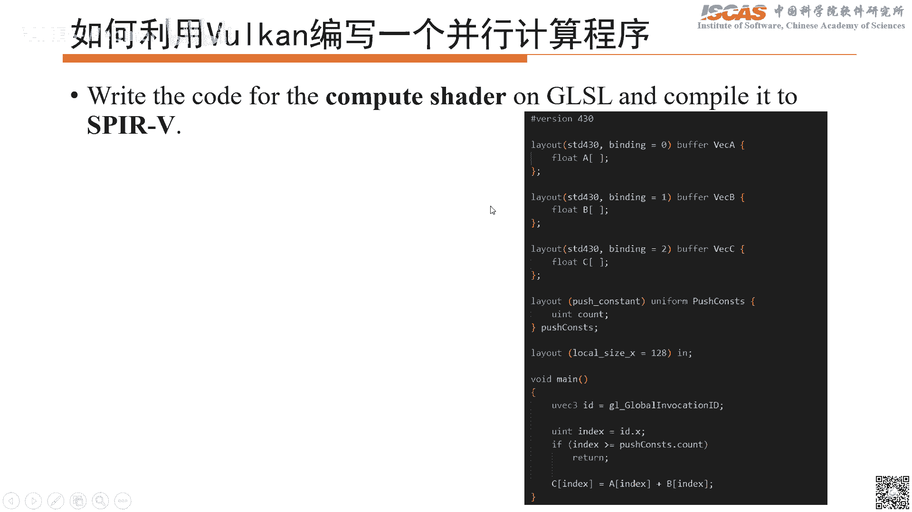

然后这个中间文件呢是这样，就是它其实是相当于是你的编程语言跟底层，就是ever的这么一个呃，中转其实相当于这就很多，就是这样，你可以看左边那个就是他其实不是单纯的。

比如针对那个js l或者g h l s，来推出这么一个标准，它实际上相当于是可以把很多的这个语言，实际上就相当于都转换成这么一个中间的，这么这么一个标准的二进制文件，然后呢进入这个。

比如说变成这个标准文件之后呢，然后再进一步的就是啊，到就是说在我各种gpu上去执行，所以这样的一个好处就是以前的话，比如说你那左边的这部分，你直接跟比如跟底层的driver直接打交道的话。

这个时候你实际上发现这个整工作量会比较大，因为你比如说你的语言里不断的变，然后当地人driver可能也会变，所以这样的话需要做各种适配，所以有了这么一个speed v的，这么一个中间的一个文件的好处。

就是，相当于实际上你相当于就它形成了一个标准，就相当于你不论是左边也好还是右边好，这样的话，你实际上都是跟中间的这么一个打交道，然后最后呢，相当于就是可以整个就可以简化你的一个呃，一个很多的一个流程啊。

然后呢这个就是完了之后呢，实际上接下来要做的，实际上就是你要去创建那个，因为你整个需要去执行那knel嘛，就是然后这个执行内ko的话，你需要描述就是你到底有哪些参数，就是所以这里边的参数的描述。

实际上它会有一个叫descriptor sets，然后当然还有一个呃，就是还有一部分，就是相当于你整个计算的一个一个排，然后呢这里边我把这个图我来简单解释一下，就是因为整个网可它实际上有两部分任务。

一部分呢是针对他整个渲染的，然后另外一部分实际上是针对这个计算的，然后针对渲染这部分，你会发现它实际上它的步骤非常多啊，就是呃像这个橙色的，这个实际上是一些固定的一些功能，然后当然还有一些那个淡黄。

这个黄色的实际上是一些可编程的一些呃stage，然后这些可变的stage呢，实际上跟这个计算实际上就很像了，就是它实际上相当于你允许你去啊，自己实现一些自定义的一些函数，那当然你看这个呃，这个图。

你发现可能会有一个容易让人形成一个误区，就是你发现这是可能反正你看着就是渲染，你看着比较复杂啊，然后呢你看那个计算的话，你可能发现就只有一块，但这里实际上会有一个误区，就是实际上你会发现这个东西啊。

其实并不，实际上并不是这样的，就是因为反而是这样，就是他为什么渲染会有这么一个长的一个流程，因为它实际上这样的一个好处，就是它很多数据它实际上是给你标准化了之后。

这样的话就是你可以以这个标准啊来准备数据，比如说你转的时候，你需要输入顶点，那这样的话顶点需要哪些数据，然后呢比如需要索引，所以顶点位置，然后呢其他的一些属性，你可以这些标准，然后进行跟这个白天打交道。

这个实际上是减，一定程度是简化了这个这个呃流程，但是呢就是访问计算的话会有一个什么问题，就是访问计算，它实际上针对的是一些通用的一些计算任务，这个时候实际上你没法预见。

就是说因为比如像钢铁啊或者流体里边，你会发现就是很多的数据结构，它其实五花八门，所以这个时候呢你就是呃就是比如这么一个，因为它其实对数据规范它其实没有约束的，所以这个时候你会发现。

就是有就是是不是能适应，就是各种各样的一个数据接口，其实这个东西是那实际上是没有定论的啊，这个东西，所以这个实际上就是其实一定程度上啊，整个实际上是对于仿真来说，实际上反而是增加了这个仿真的复杂度。

因为如果是这里边问题讲，如果你可能只仅仅是写一些简单的shader啊，就是比如说我们现在之间也是独立的，那这个没任何问题，但是呢这个时候，如果我们研发的是一个复杂的一个，物理仿真系统。

那这个不同的模块之间可能是需要去交互，那这样的话你这个数据的标准如果不统一的话，导致各种模块之间可能就没法协同，所以这个呢其实相当于这这里边，所以就后面我们实际上也会讲，就是呃怎么利用这个管线，相当于。

当然我们在这个基础上可能加入一些约束之后，然后怎么把复杂的算法能耦合起来，然后呢，这里边实际上就是整个流程其实就变成，就相当于是一部分，就是你首先你要创建就是各种buffer，buffer创建完了之后。

就是你这个时候其实你去执行之前，你需要因为你的buffer可以很多啊，而且不同的kernel因为是这样的，就不同的那个计算的pine，它依赖的buffer它实际上是不一样的。

所以这样的话实际上你具体执行的时候，你需要告诉这个你的那个pipeline，就是我需要哪些的那个buffer，然后相当于组合到一起，然后输入到这个这个pipeline里头，像这样的话。

实际上就会有一个叫descriptor set的这么一个呃，一个对象，然后这个对象其实就描述相当于，比如说我这个计算的kne，比如他第一个参数，它需要输入什么buffer。

或者是他的那个比如他的类型是什么，它的那个数据大小等等啊，就这些，然后这样的话比如说你一个完整的一个kindle，你需要n个参数，然后这个相当于形成一个this script exce。

然后这个set描述清楚之后呢，这样的话实际上整个计算的时候，它实际上就会根据这个你的这个描述，然后去读对应的这个数据，然后比如说这个时候你你这个ko，你需要比如这里n个，这样的话。

他其实会去找它对应的这个呃一个数据，然后呢真正进入到整个机啊，执行计算的这么一个过程，然后这整个计算的一个pon，其实你会发现它分为几块，就一个，当然就是这里边在整个layout，就相当于你的参数。

输入参数什么的一个描述，当然还有一个就是前面就是你写的一个shader，它实际上编程二进制之后，其实际上是一个spare v的这么一个一个code，所以这样的话实际上主要是由整个计算的。

可能实际上新手是由这两部分来来构成，所以你发现这个实际上是一个多对多的关系，就是你你比如左边你分配一堆buff，然后呢，你同时也有一堆的一堆的计算的一个papi。

那这样的话其实你可以根据你的那个pine，然后呢它的一个需求，然后呢去组合不同的那个要描述符，然后呢去执行不同的一个房间的一个计算任务，然后呢这个有了之后呢，实际上接下来是具体执行的时候。

这里这个时候实际上就需要依赖一个，就是command poor，就是相当于有个命令池的这么一个一个东西，然后这个东西呢它实际上里边最主要的是，你每一次执行。

你需要去相当于有一个command buffer这么一个对象，然后呢它里边具体的时候，你相当于你要去记录它到底啊，相当于这个时候，因为这样你有几部分来一个你的描述符，就相当于你输入法输入哪些参数。

这个需要描述清楚，然后呢你同时要把你的那个pipeline，就是我需要哪个计算和这个需要绑定进来，然后当然还有一些常量啊，然后以及就是说你这个分配的时候。

相当于比如说你dispatch到底是你的block，size到底是多少，然后分成多少这个组，这个时候你用dispatch这个呃api，然后相当于指定清楚。

这个整个就其量就构成了一个corona buffer，然后这样的话你一次执行的，就相当于就把你参数的装配，然后呢整个计算的流程，然后相当于整个都执行了，执行完成怎么这么一个过程，然后呢。

最后当然这个当然这个实际上只是准备啊，就你这command buffer，你你准备完了之后啊，就是你不去调用的话，它实际上不执行了，当然最后一步，实际上就是你有一个提交的一个过程，就是你相当于需要啊。

这就是你如果我们这里已经已经有好几个，hermes buffer人，这个时候呢你比如说你去提交哪个hermes buffer，它就会把对应的里面记录的所有的命令，实际都执行一遍。

所以这里面实际上就整个就是到这呢，实际上就完成了一个，就是前面我们看到了一个简单的这么一个数组，相加的这么一个任务的这么一个，完整的一个流程了，所以这里边我们可以看一下代码。

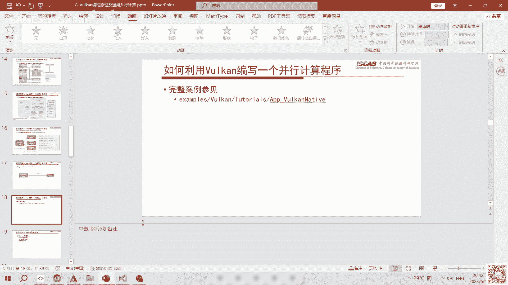

实际上这个非常的长，其实这个代码就是你虽然看的那个任务很简单，但是你如果去真正去看那个代码的话，这里我写了一个样例，就是如果传说了，相当于纯粹的你去调这个api的话。

就是这里边的话其实差不多呃有几百行代码吧，所以这个其实也比较费劲，就是当总统笼统讲的话，其实有几部分啊，就是你可以看一下，这是这里有个叫welcome native的这个。

因为写这个词主要是为了跟后面有个对照，就是呃，相当于就是我们如果不用任何的那个封装，或者不用任何简化的话，其实它相当于到底要包含哪几个阶段，当然这里边创建instance。

然后完了就是选择一个physical device，然后就逻辑device，然后呢当然这里边就是要分配buffer了，其实你会发现分配buffer其实也很复杂，就这里边当然实际上已经用了一些。

就是辅助的一些工具了，其实这个用这个辅助工具，实际相当相当相当于就是一定程度简化的，这个过程就是你需要分配几个buffer，然后呢当然还要从呃cpu到stin buffer。

然后再从stin buffer，然后再到那个啊gpu buffer等等这些过程，然后完了之后后面就创建那个just dating buffer，再往后的话，就你要创建那个老鼠符以及计算的一个pine。

然后再往后的话实际上就是啊就是command buffer，你要记录就是整个你需要执行的命令，然后需要把它记录下来，所以这个实际上只是一个对照，然后大家感兴趣的话就是可以去看一下。

就是如果你从头去利用api，就welcome a api去弄的话啊，这个是到底包含哪些部分，然后这样的话也可以去感受一下，这个瓦尔肯这个呃这个复杂的这个计算过程啊，然后呢我会讲就是那这个如果嗯针对一个。

就如果是仿真的任务啊，如果你都这么去搞这个，我觉得肯定是不现实的，因为这样的话，你整个因为我们知道仿真这个其实都比较复杂。

就是你要再加上整个编程又那么复杂的话，这个东西肯定是啊铁定是这个没法做的，所以后面的话我主要讲一下，就是那我们怎么来呃，降低这个一个复杂度，实际上这里边主要，其实就相当于对整个挖坑的这个底层呢。

实际上需要因为其实这里也需要结合，因为我们这里面实际上是不针对渲染啊，所以是单纯粹的只针对这个法律，计算的一个任务，然后怎么能让他针对这个特定的这个法，计算的一个任务，然后呢就相当于去简化整个呃仿真的。

就是简化整个研发的一个一个代价，所以这里主要分为几块，就一个呢就是挖坑这个对象，因为前面看这个挖坑对象其实比较多，所以这里实际上要做一定的一个分类跟封装，然后呢，相当于把有些就是可能跟。

相当于你跟你仿真算法无关的一些细节的东西，可能要隐藏起来，但还有一个就是因为实际仿真的话，其实它的涉及的这个计算的kernel它是五花八门，所以这样的话就是怎么能简化整个kernel，调用的一个方式。

那当然最后还有就是数据层面，就是我们怎么给他，因为前面也提了，就是你如果相当于你整个针对这个访问数据，你不做任何的约束的话，就会导致就是说你不同的ko之间，它的数据协同这个非常的一个困难。

所以这样的话就是我们需要针对这个呃，就是各种各样的那个仿真任务，然后呢，看看有没有可能在数据层面做一个一个，统一的一个封装，然后呢这里边我们就是我讲讲，就是说我们现在piano现在集成了。

这个有个叫catalina的这个底，它实际上就相当于是一个挖坑的一个后端，然后呢，相当于对他做的一个类似于各种的一个封装，之后的这么一个这个这是一个结构结构图啊，所以这里面主要引入了几个几个结构。

就是一个整个呢现在是这样，相当于是把呃整个挖孔底层，抽象成了一个y vk system的这么一个类，然后这个类呢实际上进一步的底下就是，当然这个类主要去管理，就比如说像你是创建instance上。

比如说你去选取这个physical device等等啊，就这些其实是相当于去处理这些功能，然后另外呢里边就是像逻辑设备以及它的那个，比如他的这个各种的q的话，实际上这里边就用一个统一的vk。

context的这个去管理，然后当然这里边还有后面最后一个，就是有个v k program，这个v program实际上是呃跟就是kda的那个kl函数，实际上是对标的，就是这样的话。

实际上就是比如说我们在ca里边写一个kernel函，就是gpu上能执行的可能函数，那对应到welcome里边，就是我们实际上等效的，我们要去写一个mickey program这样的一个kernel。

然后呢这个week program其实其它会依赖于一些数据，然后这个数据呢其实这里边呃就抽象成了三类，就是主要是啊他这里是当时用了一个父类啊，都是统一的，是抽象成vk variable。

然后呢这里边针对不同的数据，就是有三个不同的一个呃类的来表示，就是一个呢是wicked device buffer，然后这个呢，实际上比如说你去分配一块大的那个缓存的，这个用这个。

当然还有一个呢就是weekuniform，这个呢是用于那种易变的，但是数据规模比较小的这个数据，比如说你有几个参数，然后呢比如打包，然后需要传递到gpu里头。

那这样的这个时候你实际上可以用wiki uniform，但还有一个vk constant，然后这const呢就是实际上就等于针对，比如说呃我有一些比如像重力这种，你可能实际上是固定的。

这个时候你一般可能不太会变或者时间不长，那这样的话你其实你可以用v constant这个结构，然后呢传到这个vk program里头来去去执行，所以这个实际上整个相当于是该男的那个马可，后端的。

实际上就是针对这个啊welcome的各种对象的，实际上做了这么一个一个处理，然后呢，这样的话去简化它整个这个编程的一个流程了，然后接下来我们就讲一下。

就是那实际上刚才讲的就是vk program这个东西，实际上是跟呃coda的那个kernel，实际上整个是对标的，所以这样的话就是我们怎么去呃，去写一个坑等函数啊，所以像以往比还是针对前面那个。

比如说我们就是一个简单的一个向量求和的，这么一个the kneel，那这个实际上用裤带写的话，其实就两部啊，就是你比如说你首先你声明声明的话，这个时候你需要当然这个gk global有标识符啊。

这个是所有的扩大工作函数，这些都需要的，然后还有一个呢其实就相当于你要去标明，就是你这个kl函数到底需要哪些输入，比如你三个数组a b c，三个数组，然后它分别对应什么类型。

然后那里边的话实际上就是一个简单的指令呢，就是相当于a加b，然后放到c里头，然后这是代码，然后当时执行的时候就调用的时候，它其实有一个特定的一个语法，然后呢这个对标过来，然后到挖坑里头那个怎么做呢。

其实就是前面，因为前面那个直接用裸的a api去写的时候，你发现这个东西太长了，所以这样的话，实际上这里边我们就引入这个v k program，然后这个你发现跟左边那个实际上已经蛮像了。

就是他其实也包含两部分，一个呢就是你相当于有个声明，然后相当于你要声明一个函数，然后这个函数呢它需要输入哪些的形参，然后比如说你这里边一样的对应这个，比如你输入一个float的一个数组。

然后比如a b c3 个数组，然后呢这里边还有，比如说我这个时候还要告诉kernel，比如说我这个数组的长度，那这里的时间，比如我们可以用一个constant，所以你整个你发现这个形参，它实际上是用。

是用一个红红的一个定义来来定义的，然后当这个定义完了之后，也就这个时候呢，他就声明了，就比如我这个kindle，如果你想去调用这个ko的时候，你这个你就必须要输入这个参数。

四个参数就是你相当于有三个呃缓存，然后呢三个buffer，然后呢另外就是一个constant的一个数，然后当然完了之后，这个时候就需要因为整个呃挖坑的话，他的呃shader代码。

实际上跟host代码实际上是分离的，所以这个时候呢实际上还有一个要做的，就是，你相当于需要去载入你的那个a sparv的，生成的这么一个一个文件，然后这样的话，实际上就这个声明工程实际上就完成了。

然后最后到调用的时候呢，实际上这里边有一个比较快捷的一个方式，因为这前面只是一个生命的过程啊，然后你真正如果你要想去执行这个代码的时候，这个时候你相当于只有一个，当然这里有几种模式啊。

我先讲这个模式实际上就有个flash，比如这个你调用一下之后，然后当然其他的几个东西是跟左边类似的，就是你要告诉这个gpu，你需要比如说你的block size多少，比如这里边我们是写了128。

那这个实际上跟前面的那个呃，kl实际上是对应的，然后完了之后呢，就是你相当于就是要对它分组，就是比如你的总的数量是一个nb的数量，然后要分成多少个呃gloop，然后相当于这样的话，就是你要传呃。

这个他因为他despite的时候，他需要知道这个信息，然后去相当于去执行对应的命令，然后后面那几个实际上就是跟你的生命的过程，完全是一一对应的，就相当于你有几个数组，需要传递给这个执行的一个过程。

然后呢这里边其实除了就前面那个里边列的，就是像比如像有buffer啊，像有那个constant，所以这里边还有一些其他的，因为这里边其实主要是针对，比如说我们现在做的，如果是一个二维的一个高度场。

或者一个三维的欧拉网格，那这样的话实际上也需要，比如说其他的一些这个数据结构的一个支持，所以这里边实际上就是你会发现，整个从数据层面，就是它形参的层面里边就是会有一个统一，就是它当然针对底层的时间的话。

实际上是对应的，就是比如像constant，它对应的是一个vk constant的这么一个结构，然后呢就是uniform，它对应的实际上是一个vk uniform的一个形，一个结构。

当然这里边实际上就是前面几种，因为它整个还是相对来说比较简单，因为它实际上它的数据类型是比较单一的，但这里面比较麻烦的是什么呢，就是比如像那个流体里边可能会有涉及到，就是说我们的领域列表。

那这个时候呢它实际上不是一块buffer，它可能需要几块buffer组合到一起，然后来统一的去定义这个结构，然后这一块呢实际上呃，其实也可以定义这么一个红，但是呢这一块实际上就是。

因为前面讲这个现在整个猫肯它跟c加加，它实际上是不是混编的，所以呢会导致整个他这个调用的过程是这样啊，没有那么方便，所以这一块实际上我们还在进一步的尝试。

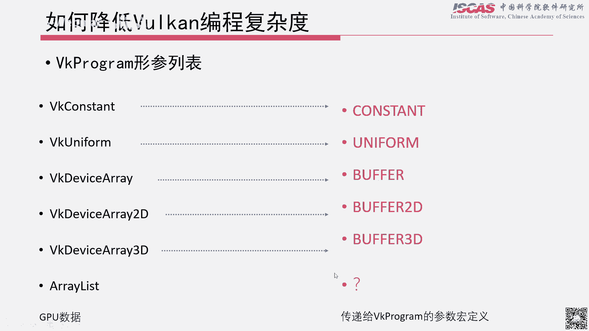

就看看有没有可能更简单的去处理这个问题啊，然后呢整个miki program，它整个运行机制的话会有两种，一种是这个啊，即使模式就是前面看到那个flash，然后它整个你如果看里边代码的话。

它其实就会分两个过程，就是首先你要创建就是整个command buffer，然后完了之后呢，你再去再去执行，就是你相当于是要提交你的那个q然后去执行，所以这个实际上这个指令包含了整个两个过程。

但是这里边直接这么做会有什么问题，就是因为这样的话，他每次都会去，相当于是把这个你的实参需要，都都是都需要重新更新一遍，然后但这个呢我们发现其实还是有开销的，所以这个对于比如说呃我们写反算法的时候。

有时候比如说我们要循环很多次，那这样的话我每次都重新往里写了，都还实际上存在大量的这个逻辑计算，所以对于这种任务呢，实际上这里边其实额外的还有一种模式，就是叫缓存模式。

那这样呢实际上你可以比如说我们这个记录呃，command buffer的时候，我们可以只记录一次，然后呢相当于真正执行的时候，相当于我们重复利用你记录的这些行参啊，就这些参数的那个数据。

然后这样的话就是可以降低整个执行的一个，一个一个代价。

就是当然这里还有一个办法，就是因为就是对于比如说仿真的任务来说，就是比如像这里是一个弹性体求解的这么一个，也可能比如它可能分为好几个kne，然后这几个ko呢要交替的去执行。

那这样的话单个v k program。

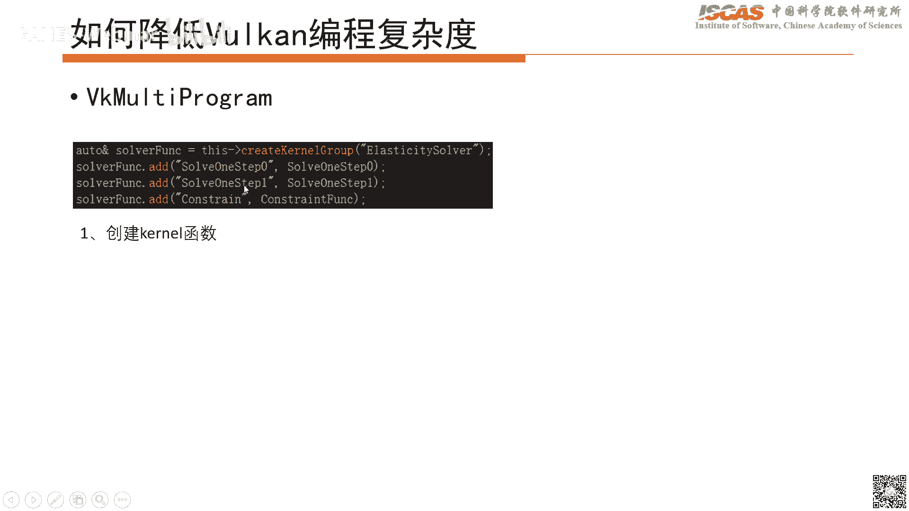

实际上是没法解决这个问题的，所以这里边实际上我们就引入了一个v k，multiprogram的这么一个结构，然后这个结构呢，实际上它可以就是呃把不同的kernel，然后呢呃将组合到一起，然后呢。

相当于把这个不同program的那个它的执行的命令，进入到同一个command buffer，然后这个时候相当于你比如写的时候，当然这个时候只需要写一次。

然后呢同时就把你各种各样的这个呃command buffer，然后就组合到一起，就比如这里边你啊调用的时候，你可能要循环十次，然后这样的话，每次你可能都需要去创建一个dispatch的，这个命令。

然后这样的话把这个整个组合到一个，command buffer之后，然后呢去统一执行，然后这个呢实际上就主要是可以解决，就是说我不也是其实跟前面一样的，就是你如果多个坑洞。

然后呢不断的需要来回切换command buffer。

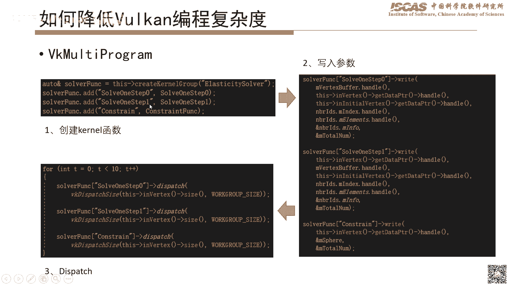

然后导致它性能低下的这么一个问题，然后这里边就是那我看一下，就是如果按照这种方式让我们看一下，就是啊最后我们要去写一个。

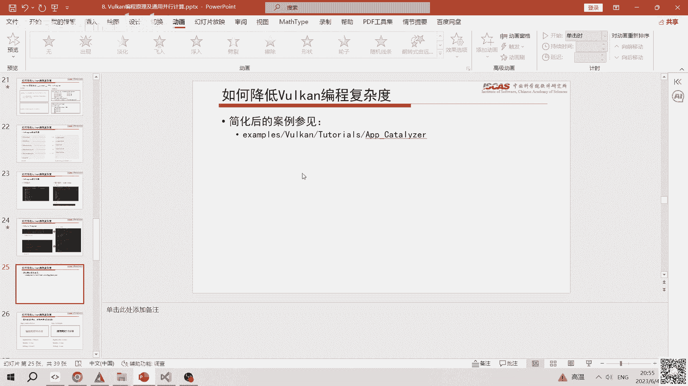

比如说写一个前面那两个数字相加的，这么一个任务啊，我们看看最后怎么做的，其实这里边代码你可以看其实就比较少了，就是嗯主要分几块，就当这第一个是这样，你所有的这个程序进来之后。

你必须有一个就是有一个vk system，他的那个有instance，然后你必须得初始化，然后这个初始化就相当于帮你是做完了所有，就比如说你physical device的选取啊。

就是逻逻辑设备的生成等等这些过程，然后这个完了之后呢，当然后面就是主要两块啊，就是一个你要去创建那个所有的那个buffer，然后这个buffer你会发现就是跟以前呃，就是互打后端。

其实你发现这个接口是一样的，就是因为车其实也包含两个，这个是有个叫dr，然后后面是cr c r，实际上你分配在实际上是cpu上的那个那个内存，然后呢dna，就因为这里边我们用的是一个挖坑后端。

所以这个的话它实际上用的是welcome的api，直接就相当于在gpu上的会去会去创建，开辟出这么一个八分，然后这个完了之后，当然这里边就是也就是因为这里也不需要。

就是像上一个就是这里native玩native的那个，直接裸a api写的那个那么麻烦，就是这里边时间就可以直接就把数据，当然这里边实际上内部实现啊，他也是用了staging buffer。

但是这里边就相当于把各种的细节，就给你隐藏出来了，然后完了之后整个调用的话，这个就比较简单，你发现就是其实就两步，一个呢就是你声明一个kernel，然后当这里面声明的时候。

你需要去标明就是我到底需要哪些啊行参，然后呢当然这个完了之后呢，就需要把那个shader的那个啊s p a文件，就是相当于给它载进来，然后最后的话就有一个执行，然后当然这里边有一个。

这里边相当于你计算完了之后啊，你相当于可以把那个数据你在好不带输出，因为这里边实际前面初始化的话，实际上是1001234的这么一个，线性的一个初始化，所以这样这个函数你直接呃运行的话，其实他会打出。

就是02468的这么一个一个结果。

所以这样的话，整个是相当于验证了整个计算的一个呃。

正确性啊，然后当然这个你其实你可以对照的就是看呃，之前的mark native的这个程序，你会发现这两个实际上诶一边这边的话，差不多是300多万代码吧，然后到这儿的话，实际上如果你依赖。

就是利用这个can lider这个封装之后呢，实际上你可以极大的缩短，整个代码的一个一个复杂度。

当然这里边其实还有一个你会发现，就是在这个时候，我们之前就是因为主要是这个，其实这样这个程序主要是针对这次课，我专门准备的，就是呃相当于其实也是为了就是相当于看看，就到底。

如果是我们纯粹的用markepi去写一个这么一个，简单的程序，到底开销怎么样，所以这个实际上之前我去写这个东西，其实花了好多时间，而且主要是因为这样，它里面包含的那个步骤比较多，所以呢特别容易。

其实还有一个问题，其实特别容易出错，所以这样的话，你整个实际上你的调试过程，实际上也都比较困难，所以这里整个你会发现就是当c呢，其实因为是一样的，就是你可能花不了几分钟。

但是呢你整个就是host的端这部分，你要去啊准备各种的一个呃，相当于这个对应的一些流程的话，其实会非常耗时间，所以这样的话其实可以依赖，就是我们这个相对封装之后的这个，然后这样的话。

其实可以极大的把这个时间给压缩下来，然后这样的话就是你，比如说你去研发复杂的一些算法的时候，其实这个也可以，对于整个你提升这个效率还是非常有帮助的，然后当然这块讲完之后，后面其实主要就讲一下。

就是因为呃现在实际上banner里程这样的话，实际上会有两个后端，一个是那个呃coda的，还有一个rock，然后因为这里边实际上就是我们还是希望做到，就这个整个框架啊，这个跟后端是无关的，所以这样的话。

实际上我们不管比如接入什么后端，实际上比如说像刺客讲的那个蓝图，实际上就直接可以用起来，所以呢针对这个需求呢，实际上我们后来在引擎架构里边，实际上做了一定的调整。

就是主要是针对这个framework这个库，这个库因为实际上是主要定了引擎架构，所以呢这对于这个库里面的，实际上是把跟gpu相gpu相关的，所有的后端的东西实际上就摘出来了。

所以这样的话就把就是说你跟gpu相关的，比如你挖矿后端或者扩大后端的这些呢，实际上都给他放到了，就是比如像这个core里边，或者是他的那个toology里，所以这样的话就整个架构跟底层。

实际上就是彻底的就是呃解耦了，也就是说比较适合，就是那这样的话我们后面去拓展算法也好，就是我们比如说我们增加新的这个，后端的数据结构，这个就完全不影响整个引擎，引擎框架的这么一个一个调整。

然后这里边呢具体怎么做呢，其实主要是两块，一个呢是呃我们相当于这个整个gpu的后端，实际上要跟计算的那个后端，实际上接口要啊要统一起来，因为这个要相当于跟那个框架要能对接的话，因为框架其实现在是这样。

它识别的是呃field field，当然这里面包含很多类了，就是比如像那个变量啊，数组啊等等，但它这里边实际上它其实并不关注，就说你这个数据你是用扩大分配的数据，还是用market api分配的数据。

所以这样的话，实际上这里边就是左边那个，实际上就相当于是会跟这个具体的gpu，后端其实是相关的，所以呢这里边中间实际上我们实现了一个思路，就相当于在这个你后端跟引擎框架之间的，实际上就引入了一个中间层。

就是利用中间层去屏蔽掉底层的这个细节，比如这里举一个例子的话，实际上就是比如像这个针对这个数组的这个，array的这么一个结构，那这个结构相当于其实到引擎的这个架构，这一段的话。

实际上它有一个fa的这么一个field，然后但是那个这到底层的话，其实他会有各种的，比如说像呃coda的那个内存分显存分配啊，然后mark的那个buffer的开闭等等，这些细节的话。

实际上都隐藏在这个啊底层，所以然后相当于对于它实际上通过这个varray，数据结构呢，实际上统一的利用统一的接口，然后暴露给这个引擎，所以这样的话其实就完全可以避免啊。

就是比如说我这个新进来一个后端之后啊，然后呢需要不断的去调整，这个引擎架构的这么一个问题，然后当然这是计算的这一块，然后呢除了这一块呢，其实还有一个要解决，就是因为呃引擎那个其实有几个任务。

当然一个是计算一个，但还有一个是渲染相关的，所以这一块呢，实际上也是跟前面的思路是类似的，就是我们相当于，比如说我们现在实际上主要有一个，就是javengine的这么一个一个渲染引擎。

然后这个引擎呢它也不是直接的跟walking backend，以及或者是put on那个bend直接打交道，而是利用一个gpu 8分这么一个中间的一个结构，然后呢去屏蔽掉底层的。

就是相当于跟硬件相关的一些api的一些信息，所以这样的话直接就是也可以比较方便的，去各种去拓展，比如说你去拓展底层，或者你去拓展，比如说我这个时候，我现在可可能会有一个新的这个这样引擎。

比如我现在想用vt k，或者想用ava去去做的话，这个时候呢实际上也是一样的，就是我们可以统一的用这个gpu buffer，然后去打交道，所以这里边就是其实现在这样，另外两个其实也有一些尝试。

就比如我们前面讲，刚刚讲，就是我们如果是现在不想用罗文件来做渲染的，我们比如说我们继承一个，比如用v t k我们是不是可以做，或者说直接用那个挖坑来做，也是不是也可以，当然更极端的。

就比如我们现在整个访问计算，整个访问计算的话，可能就还是利用原先的这个api，然后呢我们现在比如说我们想用unreal去，诶不好意思啊，整个用用成略去相当于去做渲染，那这样的话实际上就是比较方便的。

可以用来做各种各样的那个一个拓展啊。

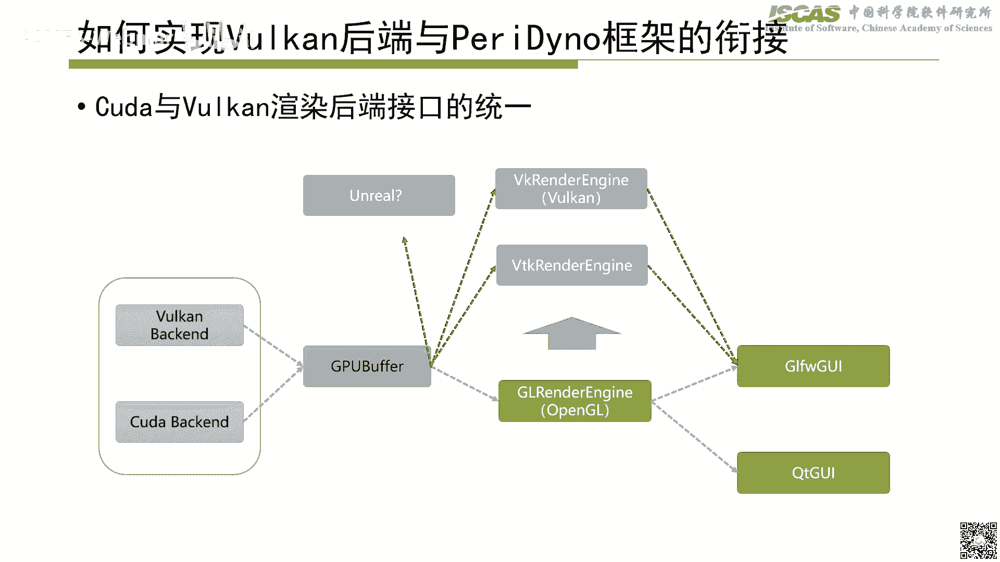

然后到最后的话，这里我呃分享一下，就其他的一些问题，就是呃就是瓦肯，其实这样就是按照从我们目前的一个感受来讲，其实他还是能做很多各种各样的复杂的，一些法律任务，但是呢其实他主要其实他还是前面提的问题。

就是他其实在研发反而上涨的时候，他整个相对来说会比较复杂，就是呃其实主要是研发成本比较高，所以这样的话其实这里边就需要注意一些问题，就是如果真正你利用就完分期的话，一个其实这个最严重的一个问题。

就是它整个对齐的问题，因为像ka的话，其实整个它编译器里边应该是默认的给你解决，这个对齐问题了，但是呢就是你如果是用挖on去写的话，它这个东西，你实际上需要需要研发人员自己去解决，这个对齐问题。

这个什么意思呢，就是比如说你这里创建了一个结构，然后呢就是前面那几个结构啊，就是他其实就是呃都比如都是16字节对齐的，然后这个时候你如果比如说你后面有两个，你定义了两个，结果，他这两个其实都是四字节啊。

然后这个时候啊，当然还有一个比如后面有个类型的，他其实也是四字节，但是呢这个时候其实如果你后面那个拍定，因为这个后面拍的那个零嘛，其实主要是用来呃，主要是为了对齐用的。

就如果你这里不相当于不加这个东西呢，就会导致就是说你如果是从cpu里边，你拷贝一份数据过去之后，就因为你后面因为在gpu端其实是这样，它默认的实际上就是16字节对齐，所以这里边实际上你是16字节。

16字节，16字节，然后到这里边其实也是16字节，然后在cpu端其实不是cpu端的话，它其实是一个紧致排列的，就会也就是这个什么什么意思，就是你相当于这个pd，如果你不填的话。

这个就会导致你一个position 0，直接就会跟到这个c type后头，这个时候你直接考到gpu的话，这个会导致整个呃各种数据是这样的出错的，所以你实际上需要去显示的去处理这些比较呃。

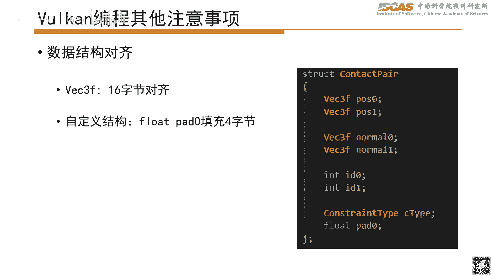

这个是比较麻烦的一些问题，然后还有一个问题，其实就是因为呃其实这样挖坑，因为它整个不支持混编嘛，所以这样的话他其实呃你在cpu端跟gpu端的话，实际上是两两套代码，就是比如说我这里有个触点。

它其实就是我们之前做钢筋动力学的时候，其实这两个东西它实际上是完全，其实内容是一样的，但是呢因为它声明在不同的一个地方，所以这样的话，实际上我们需要去定义两个这样的一个结构。

然后导致就是如果我们比如说我们后期，比如说因为呃一些新的需求啊，如果因为一些新的需求的话，啊我看直播间里有问那个是不是扬了吧，对主要是那个呃上周末开始，然后不知道那个因为家里边好像都有症状了。

也不知道是不是痒了，就是所以今天嗓子有点有点不太舒服，所以这样的话其实会后面会有一个什么问题，就是，就是如果比如说你这个我们这个代码呢更新了，然后比如说我们后端里边，有可能要增加了一个数据结构。

这个时候其实你对应的你要在呃device device端，相当于也是一样的，你需要去加这样的一个结构，这个时候其实会导致很多时候，你如果是相互依赖比较多的话，这个时候很容易出错，所以呢咳咳咳咳咳。

所以这个实际上就是对于就这种啊，不是不支持混合编译的这种api，其实对于呃去研发这个大型的这个一些呃，复杂的系统的话，时间还是不太适用了，所以我目前的感受啊，我觉得瓦肯其实主要还适合。

比如说我们个别的shader呃，或者个别的计算步骤，然后我们相当于对他去做做加速，加速的时候其实比较有用。

那当然还有其他的一些问题啊，这个我说一下，这是，也是因为其实本质就是挖坑，这个它比如说它不支持c加加，然后呢还有就是其实还有一个比较特殊的，就是他因为现在不支持flow的原子操作啊。

这个呢其实对于整个仿真的影响会非常的大，就是仿真，因为比如像做钢铁碰碰撞也好，或者就是做其他的一些流体啊，比如说欧拉流体这个操作非常的关键，就是因为很多时候我们是这样，因为如果没有这个操作的时候。

这个时候我们一种替代办法是，我们可以对它进行排序，用排序其实也可以解决这个问题，但是呢会导致你整个研发的成本非常的高，当然还有就是其他的像比如说高级的，像一些模板啊，模板就是不支持啊。

会导致就是你很多代码，你可能得呃重复的去写很多遍，然后这样的话整个维护起来也比较费劲啊，然后另外就是呃其实瓦肯还有一个比较呃，就是比较棘手的一个问题，实际上就是因为不同厂商。

对于walking的那个特性，它其实支持的啊五花八门，就是千差万别啊，就是所以呢就有可能导致，其实虽然说那个瓦肯的初衷很美好，就是他实际上为了解决卡平台，但是呢如果你不同不同的那个芯片。

或者不同的那个厂商的支持的那个标准，他如果有差异的话，也就是这个时候，你虽然你是用一个写了一份代码，然后这个时候你去跨平台，比如说你从pc端直接移到移动端的话，这个时候其实并没有那么容易。

就是很多时候你还是要针对这个不同的平台，然后去做适配，做去做优化，那当然最后最后我想说的，其实就是你整个性能跟灭绝，性能发现还是呃比较难兼顾的，因为mark整个它其实更偏底层。

所以它性能其实还是比较的比较的高，但是呢整个它呃写起来的话，我觉得还是比较比较麻烦，所以这样的话实际上就是就具体用的时候，我觉得还是需要考虑这个，就是看你需要快速的去呃创建一个仿真算法。

然后看你这也就是你看你是那个效率优先，还是说你是你是性能优先，其实你需要去考虑这些问题啊，然后当然这里边其实前面前期的话，其实也有一些尝试，就是因为整个因为挖坑其实会更偏底层。

所以这样的话实际上我们之前在呃，跟比如说跟kda的thrust做对比的时候，其实发现就是整个是这样，就是它在不同的规模下面，其实它的整个性能你会发现其实不太一样了，就是呃我们之前的测试是这样。

当然这个其实也跟我们整个就是，因为实际上是这样的，整个你创建呃，就是pipeline也好，或者你是去更新他的那个描述符，这个实际上都是有开销的，所以这个时候你会发现。

如果你的整个计算规模是比较小的时候啊，比如说我们这十的-3，十的-4等等这个量级的时候，你会发现整个挖坑它虽然是更偏硬件底层，但是它整个计算的效率，实际上实际上是不如这个苦打的，然后当然只有当它。

比如说它是它的规模达到一定程度以上之后啊，就你会发现它整个挖坑，因为它更偏底层的那个特性，就是也就是它整个那个计算密集度上去之后，这样的话才能保证，就是整个挖坑，实际上是要比扩大的那个效率更高。

所以这个我们之前比如像那个reduction，或者是这个skin等等啊，就这各种算法，但还有排序啊，其实基本也都是这个结论，当然排序的话相对来说好一点，因为这个其实也会跟那个算法其实是有关系的。

所以总的来说其实当然我们从嗯这个对比来看，总的来说实际上是mark，应该它的性能上来说应该是比coda要更优，但是呢其实前面也提到了，就是他整个呃算法的一个复杂度，就是你去写一个算法，复杂度其实要更高。

所以这个所有熟练的话，实际上真正到具体常用的时候。

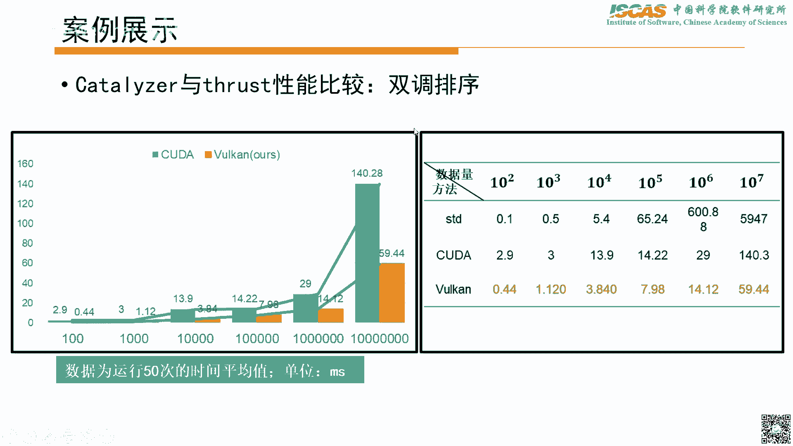

还要需要去权衡，就是你到底是用什么去开发。

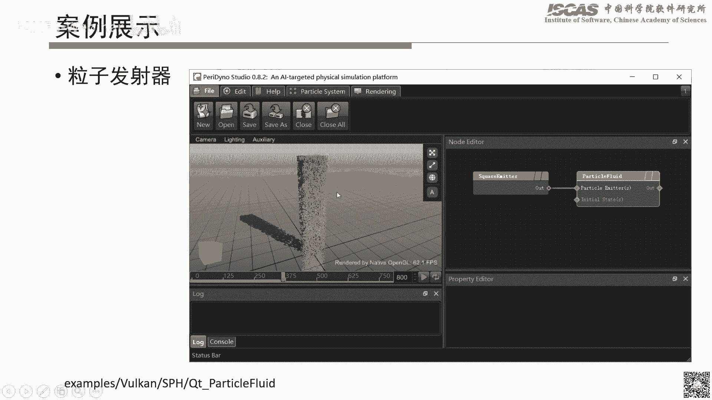

然后然后另外一个就是我演示一下，就是因为这里实际上搭了一个，简单的一个样例啊，就是主要也是为了去展示，就是呃相当于比如说一个呢是呃，我们渲染跟仿真之间一个要协同，第二个呢就是怎么跟这个之前讲了。

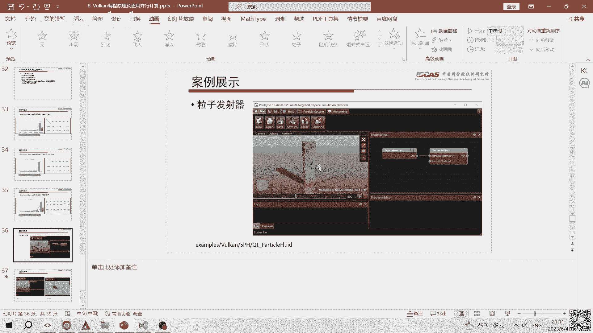

这个蓝图系统，看看能不能对上，所以这里实际上写了一个简单的一个样例，就是这里有一个叫s t h的那个呃一个目录。

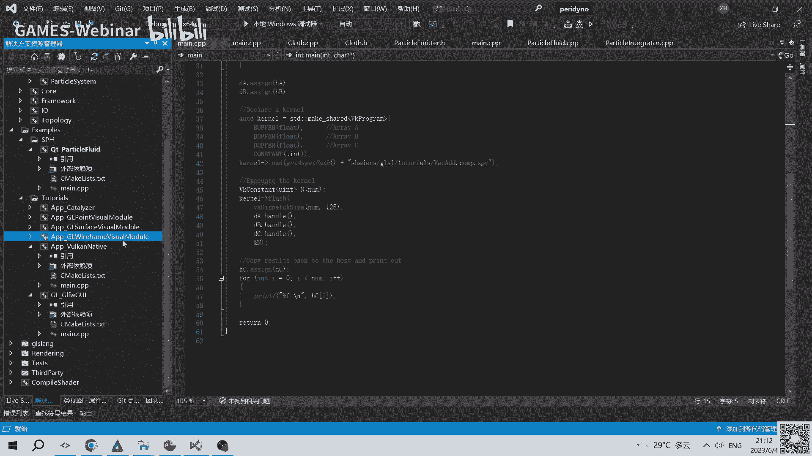

然后下面你打开的话就是这样的话，直接就可以去跑这个样例，然后这个因为纯粹是为了展示用的，所以里边其实有呃，里边现在还缺不少东西，就是因为现在仅仅是一个一个发射器。

然后对于这个场景的话，就是这样的话，实际上跟之前用ka写的实际上是一样的，就是你可以看到就是它包含啊一个发射器，然后呢后面有个流体修改器，当然这里的流水求解器，我现在只只写了一个积分的一个一个模块。

然后其他的模块现在没加，所以当然这里面你如果直接运行起来之后哦，我发现可能又跟那个啥一样了，就是我发现开着直播的话，我这个程序好像就跑不了，就很奇怪啊，我再试一下啊，好可以了对。

所以这样的话就是你可以看到，就是从发射器里边，然后生成粒子，然后当然这个经过这个求解，去进行一定的处理之后，然后这样的话就可以看到这个场景，所以这个场景实际上简单验证了，就整个就是从当然从后端的对接。

然后呢以及到跟蓝图整个引擎蓝图的对接，这个流程整个是验验证通的，但是呢就当这里边其实功能性还不多啊，就当这里边其实你可以看上半拖把的话，实际上也只只加了，就是一个发射器跟一个求解器。

当然这里边其实也有具备一些呃，其他一些能力，就是比如说我现在再创建一个发射器，当然这些实际上是没问题的，所以你发现就整个这样的话，其实一个好处，就是你实际上是整个引擎跟底层的后端，实际上是完全是解耦的。

这样的话就是你可以各种的后端，你对所以这样的话你比如重置之后，然后你这样你可以呃有两个发射器，然后去生成一个这个粒子，所以就这个时候你可以就是比较方便的去拓展，到。

就是说我们在不改动引擎架构的那个前提下。

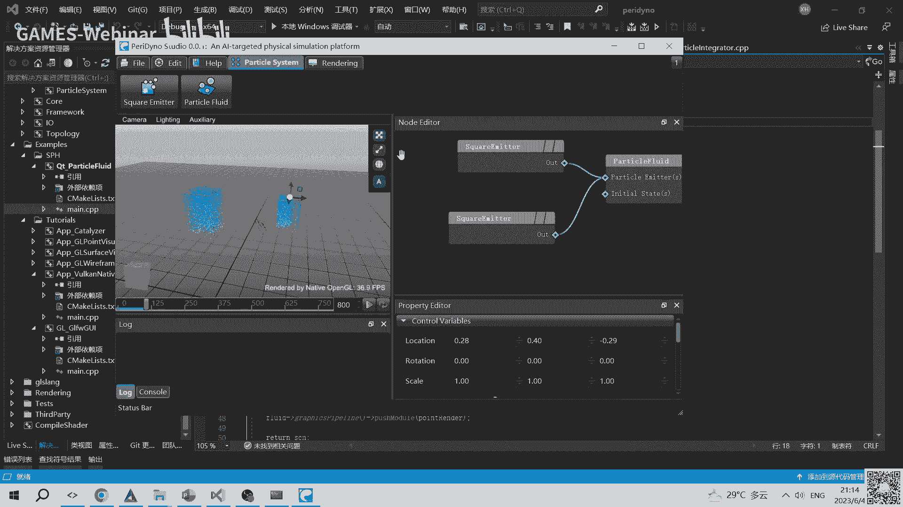

然后去拓展各种多后端，当然这里面还有一些其他的一些呃场景啊，我说一下，就当然这个也主要是为了辅助，如果大家有兴趣啊，想去呃基瓦肯去写一些算法的话，就是因为这里边其实是需要依赖，一些渲染的模块。

比如像这里有就点。

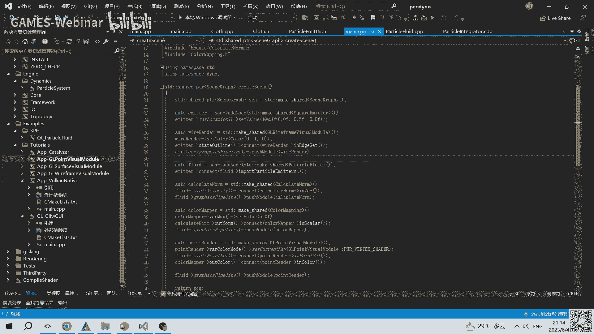

比如点线面的这些比较基本的。

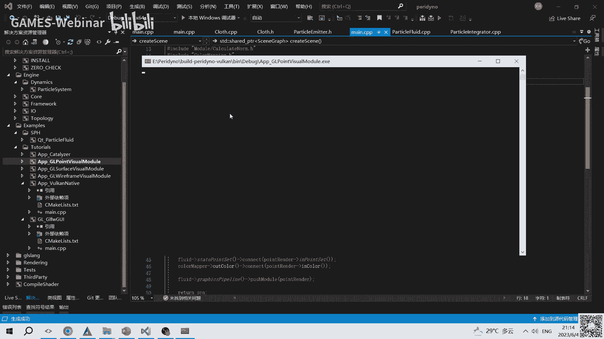

当然这个实际上整个也是用的是walking的，那个后端，然后这个比如说点点的点了一个渲染。

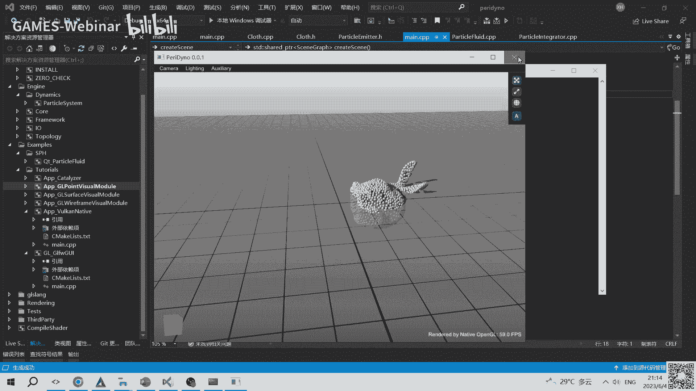

但是后面还有啊面的以及这个线框的。

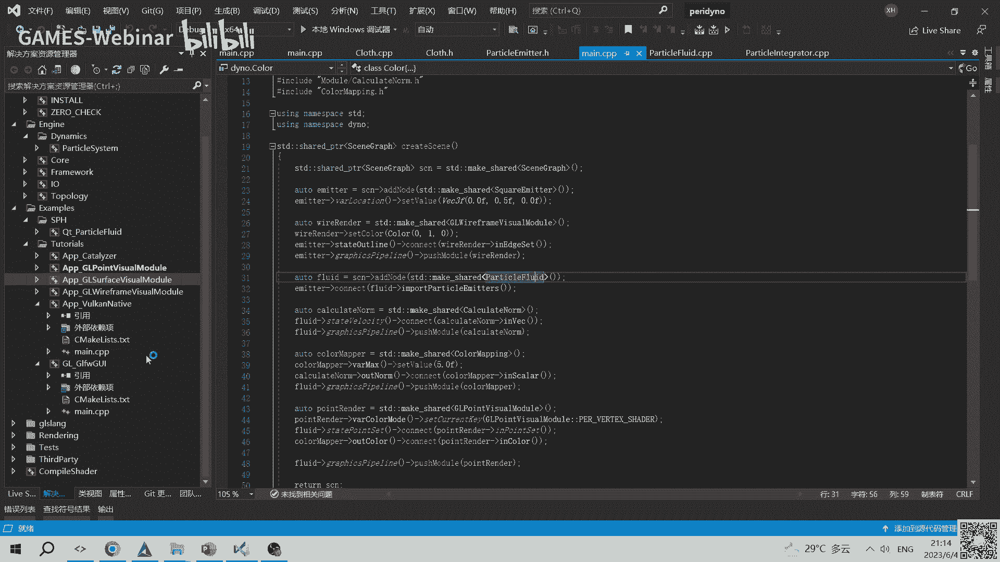

这个我就我就不一一演示了。

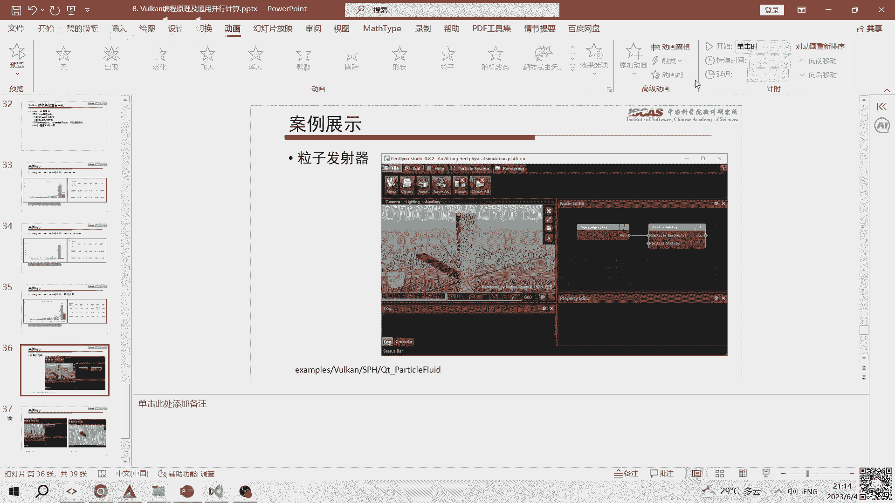

哦当然这里我得讲一下，就是因为这里边时间挖孔，后端的话大家得记得，就是这里边必须得选瓦尔肯的这个后端，它才能编译生成。

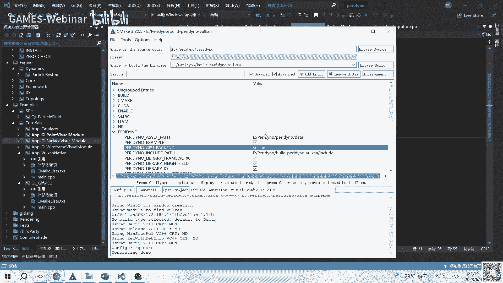

不然的话这个东西生成的还是扩大的，就是扩大的话，你看不到这些挖坑后端的这个样例。

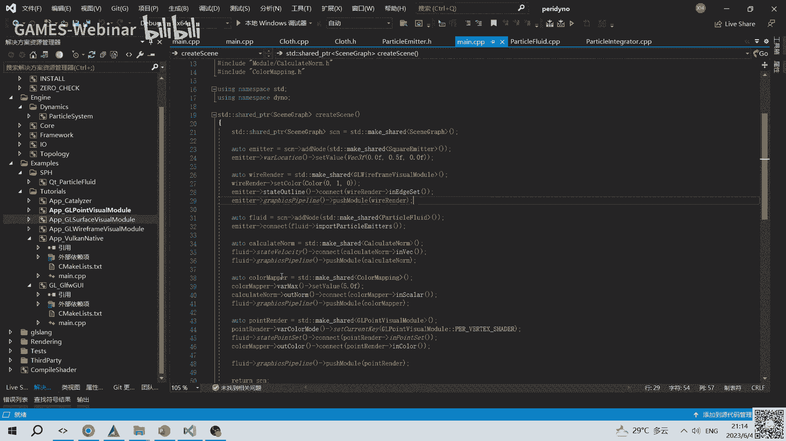

然后呢其他的还有一些呃样例。

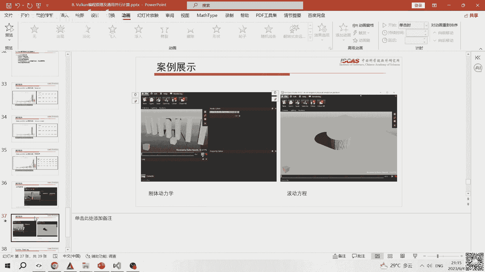

这个呢是这样，因为这个是之前因为这些项目，就这些案例我没有开源出去啊，这个其实也是之前啊为了验证，就是说我们比如说我们用马肯去呃，去做仿真任务，到底能能出能做到什么程度，所以呢之前其实也尝试了。

比如像缸体啊，然后呢泉水波啊，但还有弹性体等等，这个时间我们也都尝试了，就至少反正从目前的角度来讲，应该是很多法律任务都能做，只是说这个呃，相当于只是说看到底有多少代价去去完成。

这样的一个仿真的一个任务。

当然最后的话其实有一些，其他额外的一些那个材料，大家有兴趣的话，其实跟mark相关的可以去看一下，但这里之后我再做个广告，就是呃因为我估计快也快到那个保研季了，所以这样就是如果大家对这个。

反正这个方向感兴趣的，就是然后呢今年也要保研了，当然这个长期有效，就是你后面如果呃比如明年看到了，其实你比如说想做这个方向的啊，也可以联系我，这样的话其实就是呃也可以继续，比如到研究生阶段。

我们继续来做这个方向，然后呢因为整个名额还是有限，所以呢就是呃真正感兴趣的人，其实还是希望就是能尽快的联系，那这样的话就是呃我觉得就前期的话，因为很多时候更呃相当于就是更保险一些。

因为到后面的话都时候就不太确定了，所以这里是做一个简单的一个广告，然后呃其他的看看大家有什么问题，然后我们可以讨论一下，那当然后面的话其实就是呃，再往后应该是蔡老师，然后继续讲。

就是从工程工业法人的角度，就工程法人角度来讲，就是一些法律相关的一些内容吧，然后我就报段话要讲的，基本就是到这就应该就结束了，今天因为讲的可能其实这样的，今天讲的其实不太适合初学者。

就是嗯很多东西其实可能是需要等，你就整个比如说仿真也好，或者是并行计算也好，有一定了解之后，然后其实才可能能意识到，这里的那到底是是真正需要解决哪些问题，所以就是还是还是一样，就是一开始我说的就是。

你如果是一个入门的一个同学的话，其实你不呃其实你不需要来看这个，就这一期你可以不看的，就直接用扩大入门，然后当然后面的呃这些你可以作为扩展内容，然后去了解，然后大家可以看看，比如说其他的除了扩大之外啊。

当然你可以去了解到底其他的还有哪些api，然后可以来做这个跟仿真相关的一些内容，行，那要差不多的话，那我们今天就到这儿，然后反正后面有那个什么问题的话，大家有问题也可以联系我，邮箱好。

