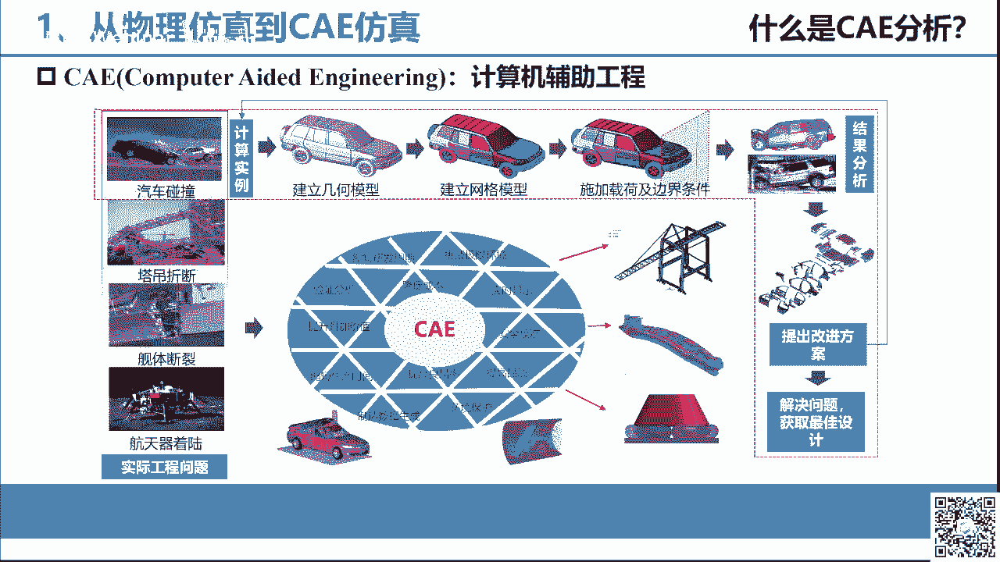
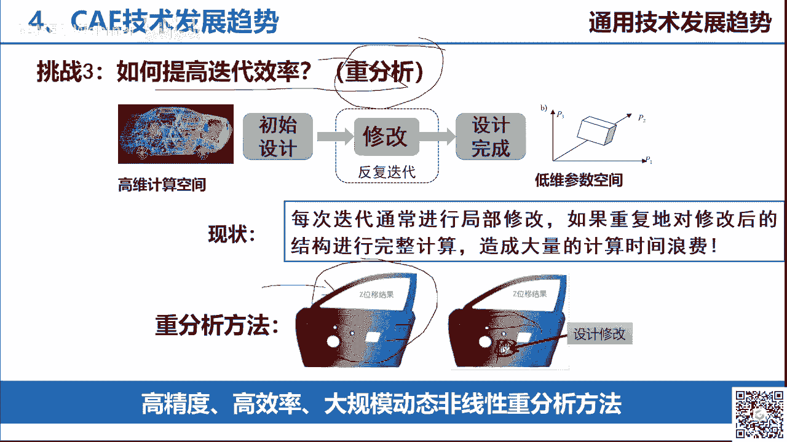
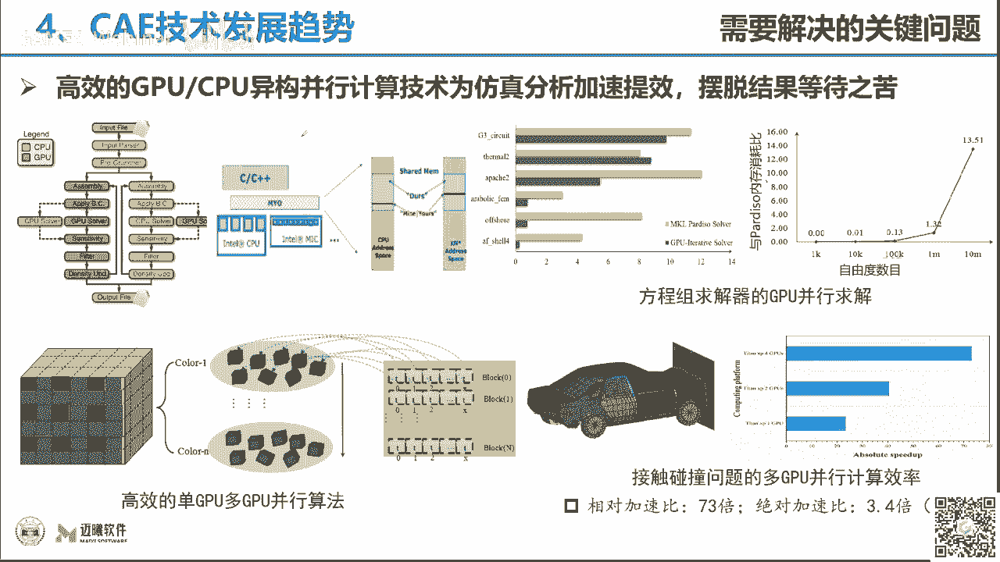
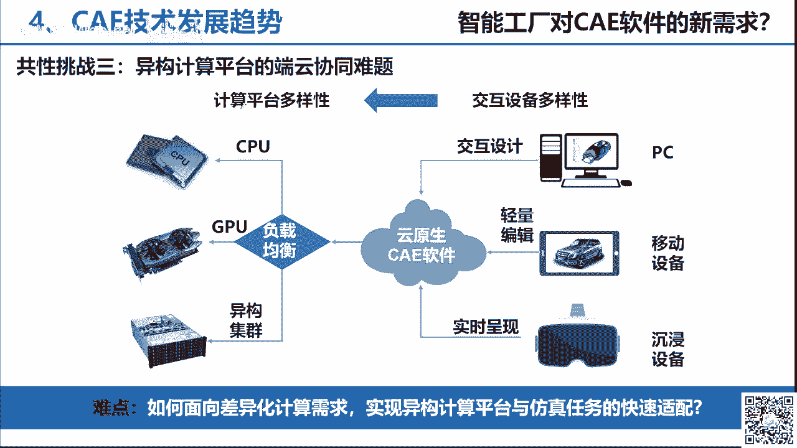
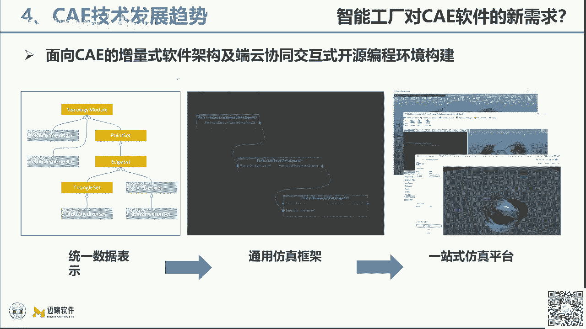

# GAMES401-泛动引擎(PeriDyno)物理仿真编程与实践 - P9：9. 工程CAE仿真连续介质力学基础 - GAMES-Webinar - BV15M4y1U76M

呃大家好，那我们现在八点钟时间到了，那我们这个开始。

我们今天晚上的这门课程的学习哦，还是我们game 401发动引擎，物理仿真编程与实践这门课，那么啊我是接下来接着何晓伟老师来上海，我是来自湖南大学曼系软件的蔡永，呃，那么我们今天讲的是工程师一连续仿真。

介质力学的一个基础好，我们首先，这个学习一下，就是说从物理仿真和这个c a仿真的，它的一个区别就在前面，何晓伟老师讲的，可能更多的是围绕着是我们c一仿真的，这样的一个层面来进行呃。

从这个物理仿真的层面来进行讲解的，那么物理法则和ca法则的一个区别是什么，比如说我们来看现在图片中展示的，这几个动画是吧，可能我们要模拟仿真的都是讲解的，是，都是要模拟。

像这样子一个汽车碰撞的这样的一个过程，那么在这个屏幕的这个左边是吧，就像一个游戏的一个界面啊，它就是采用了我们物理仿真的一个引擎对吧，在游戏里面进行一个汽车碰撞的一个模拟，那么在右边的话。

那么则是我们采用c a一仿真，也就是c a e软件来进行汽车碰撞的一个仿，一个仿真，那么大家可以观察一下，它的两个的一个区别是什么，那么也就是说对于物理仿真和c1 ，反正来说的话。

我觉得主要是从几个层面我们可以进行评判啊，第一个是在这个计算精度啊，计算精度这一个方面，那么应该来说ca一仿真的话，他应该是面向于，因为c a仿真其实前面应该说是两个字啊。

工业c a一仿真或者是工程c a一仿真，也就是说它是用到了工业和工程这种哦，这样的一个领域和这个场景中来的，那么也就要求它的计算的精度非常高，那这里所谓的这个计算精度。

其实是指我们采用计算机模拟仿真的这个手段，实际这种物理现象，和我们做物理实验所得到的一些数据，他们之间的一个对比啊，我们称为是我们这种c a仿真的一个计算精度，比如说我们要去评判某一个，比如说在汽像。

在汽车碰撞过程中，我们要去评判某一个零部件，它发生变形的一个情况，那么我们可能就会引入位移，这样子一个评判的一个标准，也是它发生了位移的一个量，或者是它的变形，一个变形的量，那么在c房子里面。

他对于这个的要求会非常高啊，会非常高，它要求跟实际的物理现象发生的，这个这个情况是是是需要更吻合一些，相对于物理仿真，也就是说它的计算精度是要高于物，理仿真的精度，那么再一个就是计算效率这个方面。

计算效率是c e仿真，他其实对计算效率要求也有非常高的，这样的一个呃标一个标一个标准，当然对于物理仿真来讲的话，那么它的要求就会更高一些对吧，比如说我们在请写一些啊啊游戏里面啊，比如在一些游戏里面。

我们要能够实时的去得到一些物理现象是吧，比如我的车已经撞已经撞已经撞毁了，好像就是我们这样一个玻璃的，挡风玻璃被破坏了等等之类的，那么他要做到一个实时性，但是对于cae仿真的话。

它是很难去做到一个实时性的，就好让大家去看到了，我们在右手边，这个汽车碰撞的这样一个过程对吧，虽然说它所模拟的可能只是一秒啊，就是从汽车开始接触这样的一个刚性强大，发生这个形变可能也就是一秒啊。

是最多最多就是一秒吧，甚至是零点几秒的这样的一个时间，但是我的计算机计算通常会需要速几个小时啊，甚至以前的话，我们可能需要几天的时间把它给算完，所以这个是在计算效率方面的一个区别。

另外一个我觉得也是非常重要的，就是在结果数据量的这样子一个层面，对于物理仿真可能我们更多的是关注于，比如说对于图像图形形式的一个实时渲染，和一个显示，但是对于c一仿真的话。

因为我们要指导工程设计而进行优化的设计，那我们就需要把整个这样的一个发生形变，变形的这样一个过程中，所有的数据要全部都记录下来，也就是说比如大家看到上面这样的一个，我们汽车的发动机的前前舱。

是发生了非常大的一个变形啊，它的吸能盒，它的性能量都发生非常大的一个变形，那么围绕着这个性能和它所有的一些位移，它受力的一些情况，包括他受到一些能量的一些情况，我们是要全部把它记录下来的。

所以也就是说对于我们z一仿真，可能我短短的直视这样子，一秒钟的一个仿真的时间，我用我需要采用几个小时，甚至几天的时间来进行计算，那么得到的数据量通常是数时机，甚至是数百级的这样的一个量级啊。

甚至是这样的一个量，一个量一个量级，因此也就是说总结一下，就是说c a一仿真相比物理仿真的话，它的计算精度更高一些，要求更高，那么它需要能够真实地去表达，我们的物理性现象，真实的物理现象。

另外一个它的计算的效率，肯定是比不上物理仿真的，它的计算速度会比较慢一些，因为它的计算量是非常大，它会涉及到对整个几何模型的一个，真实的建模标，包括对它的材料的本质的一个真实的一个表。

一个表一个表征和表达，所以它的计算量是很大，另外就是c一法则，还有一个结果数据的这样一个概念，同时c法则还有一个后处理的一个概念，这个我们到后面再讲，那么在今天在这样一个机会，也是跟大家一起来学习一下。

我们从前面基于我们攀登了去做物理仿真，然后逐步的上升到我们怎么来g判断呢，来做c a一的仿真分析，来开发一些我们c a一的一些软，一些分析计算的软件，和一些关键的一些功能的模块。

那么今天我将主要从这四个方面，可能大家更多的前面关注的都是图形学相关的，一些领域，所以我今天主要是讲解的，围绕c一方面的一些内容，做一些引入和一些科普性的一些讲解，然后简单的介绍一下。

我们目前基于这个pelo已经做了一些什么事情，然后，这其中就包括于对c一分析中的一些，关键的技术技术，c的一些它的软件的一个形态，和它软件开发的一些难点，以及我们cia技术啊。

目前发展的一个趋势的一个情一个情况，那么首先我们来看从物理仿真到c一仿真，那么什么是c一仿真，c a一的话其实就是计算机辅助工程，computer id engineering。

那么它主要是针对这种实际的工程问题，比如说前面我们的动画里面所演示的，像汽车碰撞啊，现在土木里面的一些塔吊的折断，我们健体的一船舶里面一些舰体的一些锻炼，甚至在我们航空航天里面。

一些航空器的着陆啊等等这样的一些问题，那么我们是通过所有这样一个真实的一些，物理的场景，我们首先要建立一个几何的一个模型，那么在这个里面可能又针对于我们物理场景，法则又有一些不太一样。

因为在这个c一房子里面，其实我们更刚更关注，于是我们物理场景中的某一个个体，比如说在这个上面，我们体现出来的是一个汽车碰撞，两车碰撞，在一个公路上，两车碰撞的这样一个物理场景。

但是我们实际上要分析计算的，可能只是我们汽车这样的一个个体，那我们首先就要基于这个汽车碰撞，去建立我们几何的一个模型啊，这个跟我们物理仿真也是一样，我们首先要有一个几何的一个模型，只是说在物理仿真里面。

可能更多的是o b g2 等等一些格式，那么在几何模型里面，在ca里面可能会采用像专门的一些机械啊，或者是工业三维建图的一些软件，像ug啊，像训练works，像卡贴啊等等这样的一些软件来进行建模。

得到一个几何的一个模型，然后我们基于这个几何模型，我们要建立网格的一个模型，当然这个也跟物理仿真也类似啊，那么接下来我们就要施加边界，及我们的一个边界条件，那么这个就是非常重要的。

施加载荷和它的一个边a边界条件，这个就是非常重要的一个步骤，就是我们要告诉你哪些地方是受到的约约束，哪些部件可动，绕着我们的六个自由度是吧，x y z x y z的转动和xyz的这个屏动。

这六个自由度哪些自由度是能动的，哪些自由度是不能动的，是在一定的约束，或者是给这个汽车要施加一定的力，或者是一定的速度是吧，使它能够动起来，这样子一些等等的一些载荷或者是边界条件，然后我们再去进行。

我们采用c a软件进行一个仿真的一个分析啊，得到1d系列的仿真的数据啊，那么这些数据他要起到非常关键的一个作用，它是要去指导我们实际工程产品的一个研发，也就是说工程师j c软件分析完之后。

得到的很多的数据，那么他要经基于这些数据去进行，大量的一些分析，然后提出一些改进的方案，比如说我们在这个汽车里面，大家在买车啊，以前在这个汽车里面，可能都听到我们的汽车是碰撞的声音，cap的五星级是吧。

四星级或者三星级，那么为了达到更高的一个碰撞的一个，星级的标准，那么在汽车的设计研发过程中，就需要用到ca软件进行反复的仿真分析，然后不断的去找到它的一个薄弱点啊，比如说我在发现诶某某一个地方这个变形。

在发生汽车碰撞的时候，它的变形量侵入量是比较大的好，那么就说明这块我可能需要进行一定的改进啊，那么这个就要提出改进设计的一个方案，最终来帮助工程师去解决问题，获得最佳的一个设计啊。

那么像这个就是我们整个c a一的，它的一个作用，它是起到这样的一个，来缩短我们整个的研发周期啊，为什么在公司里面要用的是a1 ，对不对，因为4a一它可以替代物理实验，因为我们前面讲过4a1 。

它对计算机度要求很高，它可以达到物理这种我做实际的物理实验，也就是我做汽车碰撞，我拿电脑去模拟一个汽车碰撞，和我实际中我拿一个车去做碰撞实验，他的计算精度可以达到80%，90%。

那我就可以指导我们公司研发的，那就可以收到我们的这个研发的成本，当然更重要，也就是说可以降低我们的成本是吧，缩缩短我们的周期。

然后降低我们的一个成本啊，那么这个是谁学习相关键的一个这个作用，也就是说我们的工程师一分析，它主要是用于预测和优化我们的产品，设计和制造性能啊和制造性能，那么我们再来看一下。

也就是说我们在一系列的我们前面讲过，c a分析，它是取代物理实验对吧，比如说我们还是以汽车为例啊，啊因为蔡老师我是来自于湖南大学啊，整车先进设计制造国家重点实验室啊，就是我们的软件。

可能更多的是面向于汽车这个领域，所以我在讲解的时候，可能很多的一些例子都是以汽车为为例啊，就跟大家先说明一下，那么比如说我们做一个物理实验，在汽车的研发过程中，我们需要去做到一个汽车车身啊。

大家注意到这个车身就是这样一个模型啊，就是说这个车身是指什么呢，就是整个汽车的车壳子，而去掉大家熟知的汽车的发这个发动机啊，它的一些底盘呢，它的轮胎压等等驱动系统之后，整个的车壳子。

我们要去去做它的一个抗弯刚度的一个实验，或者是抗扭啊，给他一个扭转的一个力，抗扭刚度的一个实验，以及我们讲的汽车碰撞的一个实验，那么对于像这些实验的话，我们都有对应的cae仿真技术来进行替代。

比如说我们可以采用ca软件，进行看望刚度的计算啊，就可以替代我的看望刚度实验，那么我也可以采用抗扭刚度的这样仿真分析计，算来解来替代我们车身抗扭刚度的一个实验来，汽车碰撞前面已经讲过了对吧。

那么我们可以发现我们采用4a仿真分析之后，得到的是一个这样子的一个图是吧，是一个有一定物理量的一个云图，那么这个云图可能就是表征的，就是我，比如说这是一个运e位移的一个云图是吧，那就告诉你。

我在这样的一个车身抗扭转刚度实验过程中，我哪些地方的刚度是比较差的是吧，我的刚度是比较差的，那么就需要工程师去进行改进啊，那么这个也是讲解什么是c一分析，那么c分析的话。

通过前面的讲解它的功能我们已经基本明白，那么它的作用主要就是改变我们产品的一个，开发的流程，也就是说在我们传统的像汽车呀，高铁呀，船舶工程机械啊，这样的一些工程化的工业产品当中的，设计流程中。

一般最开始是采用的，比如说我们从产品的规划啊，到产品的设计好，到产品的研制，然后到实验验证，然后再到生产出来对吧，这样是一个基本的主线，但这样一个主线过程中存在一个问题啊，就是你设计的产品。

不一定一下子我的性能就达标是吧，不管是我产品的一些物理的性能刚强度啊，模态啊，或者是我的一些疲劳稳定性的一些性能，那么我们就需要通过去做实验，进行反复的修改对吧，做完实验之后发现哪里不对。

然后我这样返回到设计阶段再进行一个修改，那么这是传统的设计流程，那么在引入c a一之后，那么这个方式就发生了一定的改变，那么这个改变主要是体现在一个方面对吧，大家可以发现从上面的流程到下面流程。

那么在产品设计的后面，我们就多了c a e的这样一个流程，在这里这样一个节点，也就是说我们在产品设计完成之后，我们就可以引用我们的c a e的软件，或者是cia的技术，对我们已经设计完成的这个产品。

进行验证和优化对吧，我在计算机里面进行仿真的分析，发现问题再去改进我的设计对吧，这个时候我就不需要每次改一个地方，就要把我的产品设置好，设置，就是说我根据设置图图片，先尝试性的制造一个产品出来对吧。

我不需要这样一个流程，我不需要去做物理实验啊，那么这样子的话，就能够去采用更短的一个开发的一个时间，去获得一个更优的一个设计方案，以及更可靠的一个设计质量，来得到一个更低的一个开发的一个成本啊。

开发的一个成本，但是呢在c一的发展的这个过程中，其实c技技术啊，如果大家在平时也接触过的话，其实他现在各个行业中的应用也是非常的广泛，也就在汽车行业的人中，他基本上已经像宝马啊之类的。

基本上都是可以完全采用数字化的模型，采用ca技术来进行一个车型的一个开发，也就是说它可以把整个开发过程中的产品设置，产品的实验可以完全不需要啊，我不需要去设置，我基于数模，基于ca技术所开发的产品。

就是符合我目标性的要求的，那么它的发展的趋势，也就是说它不是一个辅助设计的一个工具啊，而是说它是完全融入到我们产品的正向研发过，程中进行引导的一个设计，那么比如说在汽车里面是吧，那么c1 。

它在汽车里面的应用就非常的非常的广，非常的广泛，比如说我们可以在c一的这样一个工具啊，我们可以进行环境舒适性的一个评估，大家想想我平时坐在车里面，可能这种啊房间舒适做的比较好的车。

你会觉得哎呀这种空调吹起来也很舒服，坐在里面隔音也非常的舒服，然后它的减震降噪的性能都非常好是吧，车机做的很舒服，那么其实像这样子一个舒服这样的一些指标，我们都是可以用cad的工具来进行模拟和仿真。

分析的，那么第二个就是安全性啊，这刚才讲过了，第三个就是人机工程，人机工程是什么意思，就在汽车里面啊，我这个车的坐姿是很舒服对吧，我的车我的方向盘，我开我的手去操作方向盘，去操作各种档。

把操作各种按钮的舒适度是否顺手是吧，是否会跟我的一些运动轨迹产生一些干涉，其实这跟人机工程是相关的，那么这个也是可以采用c软件来进行分析的啊，当然还有包括最传统的结构的分析对吧。

前面就讲过我这个结构它的刚度啊，强度是吧，它所谓的刚度嘛，通俗讲就是它够不够硬对吧，它的硬度是不是足够强度嘛，就是它够不够稳定对吧，够不够稳，够不够稳定，那么对于这样的一些性能的一个分一个分析。

当然还有一块，比如说我们进行一些工程设计，工程设计和我们工艺的一个分析，所谓的工业飞机就是我汽车在设置完之后，我要把它加工出来，加工的话，那么在汽车里面，可能就有各种各样的一些加工的工艺。

比如说我们车身的冲压呀，我们发动机缸体的铸造啊，等等这样的一些加工的工艺，那么这个工艺加工过程，就会涉及到很多工艺的参数，那么这些参数也是可以采用ca分析的技术，来进行分析获取啊，来指导工人怎么来进行。

我们整个车身和汽车的一个制造，那么还有一个我们讲到的，就是这个虚拟实验对吧，这个虚拟实验是什么意思啊，大家就想象着我们在玩一个这种游戏是吧，我们玩极品飞车啊等等之类的。

那么好像就是在一个虚拟场景中去开一个汽车，在这个路上操纵它进行跑对吧，但是呢像这种游戏中的跑，可能有更多的还只是在物理法中的这个层面，对吧，就是分析一下我这个车身，简单的一些变形啊等等之类的。

简单的一些把图像的现象把它表达出来，那么对于这样子一个cee仿真的话，那么它的就会更细致一些，它也是模拟为一个汽车，在一个环境中实际在跑啊，更多的是在一些道路上，那么他这个跑不是白白的跑。

而是说它要分析出来，比如说我一个汽车在这样的一个道路上面，跑了几万公之后，我汽车的各种性能指标，比如说它的一个疲劳的那疲劳的一个程度对吧，也就是说我有没有开裂的地方，因为我们知道有一些结构件。

比如说我老是长期处在一定的震动当中，是一定的一定的这种震动当中的话，那么这个结构就有可能会发生裂纹，会开裂，那么虚拟实验的话，它就是采用cg技术，就把我们整个首先要把我们整个道路的数据。

那么这个道路的数据，那么就不仅仅说只是说我这个道路的一，个图像对吧，而是说我这个道路实际上坑坑洼洼的一些水，一些特一些特征是吧，坑坑洼洼的一些特征，我们全部都融入到我们这个里面来啊，融入到我们这个里面。

然后在这个汽车，在这样的一个道路数据上进行模拟的一个运行，来进行虚拟实验，来评判它的一个相关的一些性能指标，那么具体来讲的话，这个可能嗯大家第一次接触到cae分析的话，可能有些抽象啊。

但是也要有必要让大家先嗯大概的先了解一下，要不然我们到了后面讲到具体的一些，力学的基础啊，和程序开发的时候，可能大家也不太良，也不太理解理解这样一个模块啊，或者说它的一个工程应用价值啊。

或者他的目的是做什么，那么首先我们前面讲的就是汽车结构，强度和刚度的分析，这个我已经讲过是吧，大家理解强度就是它硬不硬，刚度就是它稳不稳啊，这样子一个，那么再一个就是模态把模特的话，其实主要是属于。

当然它属于动力学分析的一个领域啊，也就是说他解决的就是我们汽车结构一个振动，噪声的一个问题啊，大家就考虑到诶我坐在这个车里面，这个车的仅能造是降噪的能力怎么样是吧，隔音是否是好的。

那么当然还有一些响应的一个分析啊，那么这个就比如说对应到我前面讲的这个啊，虚拟实验对吧，我们整个汽车在一个汽车道路的路口上面，进行运行的时候，它的一个疲劳的分析，那么当然更重要的还涉及到很多温度场的一。

个计算啊，我们现在嗯像传统的燃油发动机对吧，我们要对整个发动机的温度场的来进行计算，包括对它的散热进行一个评估对吧，我一个温度是怎么分布的，那么我的散热是否能够保证，我的汽车零部件都在一个比较安。

可靠的温度的范围之内，当然也包括包括什么，我们在这个汽车里面比一些空调啊，等等一些对于人体舒适性，温度相关的这样的一些分析，那么再一个就是我们讲的，振动噪音的一个分析是吧，振动噪音的一个分析。

这里的振动噪音的分析，可能更多的是关注于在空腔里面，比如说我们在汽车里面我生产的一个分布啊，生产的一个分布，也就是说我通过这样的一个分析，我可以知道在我设计出来的这个汽车里面，诶。

我每一个地方它的噪音在运行过程中，它的噪音是怎么分布的，哪里的噪音比较小，哪里噪音比较大对吧，我也可以指导我的产品的一个设计，那么最后还有一个，那么这个通俗讲就是我们对它分组的一个模拟，对吧。

分组的一个模拟，那么我们为了提高我们的燃油的经济性啊，尤其是在我们的电动汽车是吧，我们电动汽车为了提高它的一个呃，降低它一个能量的一个下一个消耗是吧，那我们就尽量的降低我们汽车的这样的一个。

风阻的阻力啊，分组的系数，那么这个一个改进的话，我们就是也可以采用汽车，也就是我们俗称的cfd流体的分析啊，当然在我们的物理法则里面，我们也会用到ph等等这样一些方式，来进行流体的一个仿真。

在工业设一仿真分析里面，可能用到的是像呃f e m吗，或者f v m啊，或者是这种啊b方法会用的相对多一些。

那么当然还有就是我在前面讲过很久的，就是汽车结构碰撞和冲击分析对吧，比如说像这里就是模拟到我们侧碰对吧，我一个汽车设计完之后，当侧面受到了一个撞击之后，我汽车受损的一个情况对吧，受损的一个情况。

然后根据受损的情况再去考虑，如何来指导和改进我的一个开发，那么再就是这种工艺的分析啊，就是汽车零部件的这样子，一个冲压的成型分析等等对吧，我们整个汽车汽车啊，大家在这门课里面。

我们也可以学到很多跟汽车相关的知识对吧，我们汽车的车壳子，大家看到的那个汽汽车车身的那个外，各种非常漂亮，非常美观的这个外形，其实它一开始是有一整块平的这样子一个钢板，平的一个钢板，然后通过冲压啊。

就通过模具，我们讲的汽车的模具，通过两个模具去压我中间的这一个钢板，大家是吧，我两个模具具有一定造型的模具，去压这一个钢板，那么就会导致这个钢板，就会发生这个形状的变化对吧。

就可以达到跟模具的形面一样的这个形状出来，那么这个就是我们汽车车身加工制造的这样的，一个方法，我们叫做冲压成型，那么这样一个过程，我们也是可以采用我们这种3d软件，来进行分析，就像这种图片可能不太清楚。

但是简单的看一下，就是说比如说我如果分析出来全部是绿色的，那那就说明当前这个工艺设计的非常好，采用这种工具去加工的话，我整个汽车的特征都是能够加工出来的，但是如果说有别的颜色，特别是当出现红色的时候。

那就说明这个是有问题的，比如说标红色的地方，变红色的地方可能就代表什么，代表我在加工过程中，这个地方可能会开裂对吧，因为它会涉及到一个钢板的很大的一个变形嘛，会开裂。

或者说会分析到这个地方可能是有这个啊，钢板会挤压到一起去产生一定的皱纹，一个褶一个褶皱啊，这个是对我们对工艺分析去分析啊，当然还有这个流这个流体分析前面讲过了，对于我们这个外流场的一些分析等等。

当然还包括我们汽车结构的可靠性的一个，分析分析，那么以上所有的分析在c领域中，它最终的话其实我们还有一类工业sa软件，我们叫做多学科的优化设计软件，那么也就是说。

我们如何帮我们通过c a分析所得到的数据啊，我们反哺到我们的结构优化设计当中来，就做到汽车结构的一个优化设计，那么大家就可以看得出来对吧，从物理仿真我们讲解了更关注的点，可能跟我们cae仿真的关注点。

还是不太一样的是吧，从精度，从效率，从对于数据文件的要求可能是不太一样，那么我们也发现诶，c技术它在我们工业产品开发中，其实是非常重要的，是起到了非常重要的一个作用，那么在这样一个情况中啊。

就是我们作为一个研究者是吧，我们一个学习者，那我们就要思考一些问题对吧，就好像我们已经在学物理仿真的时候，也会考虑类似的问题，首先是c是吧，它是否有具有理论上的一些缺陷，第二个就是生意，他能否模拟。

或者说它是如何去模拟出完全实际的情况对吧，不知道大家现在脑子里有没有这么几个问号，第三个就是说，我们该如何去正确的认识十个亿啊，同时也包括，我们如何去正确的使用我们的ca软件对吧。

这样的几个关键的问几个关键的问题，因此我们首先接下来我们就来一起来探索，学习一下cae分析中的一些关键的技术，那么ca分析的话，其实它最基本的流程是分为有三个部分，其实我觉得一个物理场景也是有类似的。

而我们首先是前处理，所谓的前处理的话，它是包括我前面讲过对吧，前面一个流程我们是进行几何的一个建模，然后根据这个模型我们进行网格的剖分，然后我们再去加载它的一个载荷，和它的一些边界的条件。

那么接下来呢我们就在进行求解啊，那么这个就是c一仿真分析的一个，非常重要的一个部分，那么就包括涉及到根据不同的问题，我们可能就上热及到，比如说有固体力学的求解，有升学的求解，有热血的求解，有光学的求解。

有电磁学的求解，还包括有cfd流体力学的求解对吧，各种求解根据问题的不同，需要进行不同的一个求解啊，不知道这个里面有没有，大家所感兴趣的一些知识点啊，那么对于每一个求解啊，比如说我们对于固体力学的求解。

我们就会要需要采用到固体力学的求解器，那么对于升学，我们可能就涉及到有声学的求解器，那么对于每一个求解器，它又由这样子一个比较复杂的模块所构成，比如说包含有数字算法和我们的单元，计算的理论。

我们材料的本构模型，这个材料的本构模型起到什么作用呢，就是用来模拟我们真实的物理的性质，比如说我这个对象我是钢的，是铁的是吧，还是铝的，还剩布料还是木头，还是木头是吧，还是水泥啊。

这个就是通过材料本构模型来进行模拟，然后就是接触算法啊，这个就很重要，要去表征，其实在物理场景中会经常用得到对吧，只是表征两个物理，去检测两个物体是否发生有接触啊。

我们的接触算法当然还有一些面向于非线性，一些大变形问题计算的非线性迭代技术，这个我们暂时不提，大家有个印象，接下来就是连接与约束的关系对吧，这个也就是说我整个的一个汽车。

其实它是由上万个零件所构成的对吧，那么我们在实际的建模过程中，我们并不能把这3万个零件就当成一个整体，对吧，我们要是分为不同的零部件，从零件到部件再到整机啊，这样子一个关系通过连接把它连接。

通过连接关系把它连接起来的，那么再就是边界与载荷条件的加载是吧，这个也涉及到很多的处理的方式，这个我们到后面讲到具体的啊，力学基础啊，可能会介绍一些相关的内容，那么再一个就是求解啊。

我们整个模型怎么把它计算出来是吧，这个要涉及到我们一个方程组的求解，以及我们的并行计算技术对吧，这个在物理方程中非常重要，我们要通过gpu并行啊，cpu并行啊，多合并行啊，来提高我们的一个计算的效率嘛。

那么同样的像这一系列大家所熟知的，在物理场景中用的非常广泛的并行计算技术，它也能够用到我们的c a e的里面来对吧，比如说我们用ka直线gpu的并行啊，c一计算的一个gpu并行，这都是没问题的。

那么第三块就是我们的后处理啊，后处理，那么这个就涉及到对吧，我们要通过我们计算求解所得到的一些结果，得到一系列的图，比如说前面大家看到的云图啊，比如说这里有一些流线图啊，矢量图啊，矢量图啊。

或者是一些数据啊，一些曲线等等是吧，曲线等等这样子一些工作，那么通过这样的一个架构图，不知道大家现在有没有想到，我们ca分析跟panamo我们的发动引擎对吧，他们之间的一个关系是什么，对不对。

再想想是不是有点类似是吧，老师你这个不也就是基于节点，我们可以在发动运行在pda里面，做到我们一个增量的集成开发是吧，也可以去搭建出这样子，一个c a一仿真计算的一个流程出来对吧，这个就是我们讲的。

so you can mesh，和这个synl和这个kda他们之间的一个关系，当然细展开来讲的话，这个我就呃稍微快一点点，这个就比较比较专业，那么比如说我们讲到在c一分析里面中。

我们讲的第一大块是它的数值算法和单元理论，对吧，当然有些数字战法大家都很熟悉啊，包括我们在腾讯里面用的比较多的spa血压，还有npm吗，还有r b m，那么图形这个cad和caa一体化。

我们所提出来的就是说，因为前面这些分析可能都需要有，特定的一些模型数据，但是在这里的话，我们可能考虑到，我能不能直接基于cad的模型来进行cad的分析，那可能就有对应有一些等级合法。

i g a或者是其他的一些啊这种边界源啊，这种b m等等这样的一些计算的一个方法啊，那么从这个单元来讲的话，又分为有一维单元，平面单元，实体单元，板壳单元，特殊单元等等这些是吧。

那么所有的单元是个什么意思啊，大家现在先卖个关子，但是可以给大家一个基本的认识，其实有限元的单元，就等于我们在物理仿真中，会涉及到的一些网格是吧，我们的mesh啊，我们的mesh。

我们的网格或者是我们讲的是片源啊，每一个片源啊，每一每每个片源，那么其实这个对于有限元里面，它就对于我们讲的是单元的这个概念，那么根据我这个片源，我的这个网格它的形状不同，那就可以分为一维单元。

比如说是感单元啊，梁单元，那么根据它如果是三角形或者是四边形，我们就可以称为它是一种三角形或者四边形的，平面单元，那么如果他是个实体，比如说四面体，六面体，三棱柱，四棱柱。

那么它就可以是一些实体单元等等，当然在cia的计算过程中，也涉及到一些常用的一些特殊单元，比如说我们的钢铁单元是吧，钢铁单元就是我把整个这个模型作为一个刚体，它是无变形的对吧，它是无变形的，它是个缸体。

那么还有一些弹簧啊，我们在进行弹簧仿真的话，我们也会引入专门的一些弹簧单元，引入到我们在里面来进行一个计算等等，那么再一个就是我们的材料模型啊，材料模型其实这个跟物理仿真的话。

就有非常高度的一个接一个啊，等一个懂同性的对吧，我们在物联房子里面有这一套，比如超弹性的一些材料啊，连弹性的一些材料当然也会有一些啊，超嗯这些弹性啊，或者是弹塑性啊等等这样的一些材料。

那么在这些材料里面，其实在ca反应中，它也是按这么来分类的，只是说我们在进行材料本科计算的时候，可能我们在这里会有一个更高精度的一个，材料本科模型，能够融入到我的整个ca分析当中来，它主要是描述什么。

描述我们应力和应变他们之间的一个行为对吧，就是我的应变和应力他们之间的一个行为关系，就是通过材料模型来进行表征的，啊我看到有这个同学在里面，说到这个自动驾驶的一个仿真是吧，其实啊自动驾驶的仿真的话。

在我们caa里面，它更多的是处于这种多体动力学的这样的，一个领域，也就是说像现在有常用的像adam啊这样子一些呃，cee仿真的一个软件，就可以建立出，包含有汽车主要的一些传动部件的这样子。

一个多体动力学的一个模型出来，那么我就可以模拟在操作我的汽车，在道路上在行驶的时候，那么我的一些转向啊，这些行驶的过程中，我汽车的一些侧倾啊，和它稳定性的一些分析等等，就说我设计完汽车的整个的这些。

传统的结构之后，我可以去模拟，当我快速进行转弯，快速行驶的时候，我的结构的反应是否是灵敏的对吧，然后他的整个的结构是否是比较好稳，比较稳定的啊，不能说我设计完之后，当高速过弯的时候。

我的汽车就会啊呃就会侧翻啊等等，那么这些也是可以把它模拟出来，那么到了自动驾驶仿真的话，那么这就涉及到我们现在讲的，在这种互联网加的这样一个时代，做到了一个多领域的一个协同啊，多领域的一个协同。

像我们我带的有些学生做毕业设计，本科毕业设计的时候，就会做到类似的一些题目对吧，比如说我在一个汽车道路里面，我有一个v to x的一些传感器啊，我可以检测到旁边是否有一些障碍物，或者是我通过图像识别。

识别出前面是否有障碍物，然后把这些障碍物的一个信息反馈出一个信号，反馈出一个信号，到我所构建的这样一个动力学的模型当中，重力的模型当中，然后他去驱动我们的汽车，发生一个操作的一个指令。

然后就进行整个自动驾驶的一个模拟啊，这个ca技术也是可以做到的好，那么回答这个问题，我们再又回到我们，这个是这个ca分析的一个关键的一个技术啊，所以方向分析关键的一个一个技术，就是我们讲的有限元方法。

就是finite element mess，就是有限元的方法，那么它是求解我们数学物理的，一种基本的计算方法，它主要是取决于我们固体的一个力学，然后迅速的构扩展到我们的流体啊，全热啊。

电池啊等等这样的一个领域，那么所谓有限元方法，它的一个基本的概念，他就是用数学近视的一个方法，对真实的物理系统进行一个模拟啊，虽然我前面讲过，我们4a仿真分析的计算精度。

所需要得到的一些计算结果的数据啊，是要高于物理仿真的，高于物理仿真是吧，但是实际上cia一仿真，比如说像用到的有限元这个技术，他也称之为，我们称之为是一种工程中的数字计算方法，是一种工程的数字计算方法。

所谓工程的数值方法，就代表它是满足于我们实际工程需要的，那么它就代表什么，代表它要有一个非常高的一个普适性，普适性，也就是说我对于很多的问题，我要能够去计算计算，那么这个时候就要牺牲什么。

牺牲一定的精度，它还是会牺牲精度，但他牺牲的是相比我们真实情况，也就是说比如说我们去算一个数学公式啊，比如说我计算1+1=2对吧，这是一个数学的一个计算过程中，它是非常精确的，它是有精确解的啊。

它的结果就是正确的，是真实的，但是我们如果说诶，我们采用一定的方法去构建一个计算流程，去算1+1等于多少的时候，如果用工程中的计算唉，我去设定一个算法，那么算完之后它可能结果不是等于二是吧。

他可是等于1。9999，也就是它可能存在有0。01的误差，但是呢这种误差我们认为在工程中，它是可以用的，它是可以指导我实际工程研发的，那他就没问题啊，他就没问题，他就可以满足我实际工程的需要。

虽然它的精度不是百分之百啊，那么像有些人就是一类典型的这样子一个方法，那么它的一个分析的步骤，主要是包括结构的离散化，再到单元的分析，再到整体的分析啊，这个先抛出这三个关键词，我们一一的来讲解。

首先我们要了解在c一的软件中，最常用的有限元法的实现了，基本它的一个基本第一步，我们就是要进行离离散，离散离散是什么意思呢，就是我们要把原来的一个连续体，比如说我们看到的一个整体对吧，大家就想一想。

我一个足球表面对吧，它本来是一个整体的一个圆圆的一个表面，它是个连续的，但是我们在足球里面经常都会画很多格子是吧，黑白的格子，那么其实这个就是把这样的一个圆的表面，进行了离散对吧，就得到了一个离散体。

当然这样子一个思路在我们古代很早就有啊，比如说我们进行这个圆周率的求解等等，那么大家现在所看到的下面这几个模型啊，尤其是我们看得更为直观的，比如说我们在呃右手边的这几个模型对吧。

那么这个就是我们已经离散过的一些，有限元的一个模型，就它原来是吧，比如说像这样的一个钢铁模型，它本来就是一个整体，但是我们用的四面体的这样子，一个前面讲的单元的概念，我们进行离离离散。

得到很多一些小的这样的一个区域啊，小的一些模型，有小的特征去进行我们完整特征的一个近视啊，这个就是我们讲的有些人的离散的这样的，一个干一个概念嗯，那比如说还举一个例子。

比如说我们在这里是一个真实的七这个系统啊，就是一个t一个梯子，那么对于像这样一个梯子的这样子，一个模一个模型，我们在实际的有限元分析中，我们会怎么去做呢，怎么去做，我们就会去构建出像这样的一个有限元的。

一个模型啊，大家就可以看得出来，这两个模型虽然看起来很像，但是实际上可能就不太一样对吧，我真实的系系统我是有几根木柱子啊，这个板子啊是吧，这些所构成的一个楼梯，但是我在有线模型里面。

我就是有这种线段和这些红色的点所构成的，这样的一个模型，那么这样的一个模型，就囊括了我们有限元分析里面，所涉及到的一些基本的概念啊，比如说在这个里面，我们每一个在有限元模型这个图里面啊。

我们每一个黑色的这样子一个线段，他们我们就称之为是一个单元啊，它就是一个单元，那么两个单元之间啊，或者是多个单元之间，或者说单元和单元之间，大家可以看到，它都是通过一个红色的点所连接是吧。

那么在这个里面，我们就是说把它称之为是一个节点啊，是一个节点，那么节点它是能够承受一定的载荷，是具有一定的自由度，也就是说我们在这样的一个节点，它在一个空间中，像我前面讲的是包括x y z3 个平动。

三个转动的这样子六个自由度是吧，它是可以活动的，大家想一想是不是我整个系统它的一个运动，它的活动就完全可以通过节点来进行牵引的，对吧，你通过我的节点来进行一个牵引，一个牵引啊。

那么当然这个里面在有些人里面，还有一个比较重要的概念，我们就叫做自由度的一个概念啊，自由度的一个概念，也就是说像我整个这样一个模型，他整个具有多少个自由度对吧，比如说我有两个节点。

我俩我每个节点都有六个自由度，那么我整个模型就有三个自由度啊，就是有12个自由度，那么像这种，我们就是说通过将这种复杂的几何进行分段啊，就说我们比如说对于一维的问题，就像这样子一个几何，它是一个线段。

那我们通过的几何离散呢，就是把它分为若干个线段对吧，那么他它采用的这个几何离散的，一个基本的构建，就是我们这样子一个单元啊，就是这样一个线段的一个单一个单元，那么对于二维问题对吧。

二维问题比如说像这样子一个圆形，这样一个椭圆形啊，那么我们基于也同样可以进行，几何的一个离散对吧，画成像中间这个图这样子，那么它采用的软构件，就是说像这样的一个三角形的软构件对吧。

我们通过单个三角形的离散啊，可以拼接成我们整个原来的这样的一个模型，那么对于三位问题也是类似的对吧，三位问题也是类似，我们就可以通过像这样子一个，比如说像这样子一个六面体对吧。

六面体我们也可以把我们的几何模型离散成，由若干个六面体所构成一个模型，当然在这个里面我们可以看得出来是吧，比喻以二维问题为例，我们离散之后的模型跟我原来的模型之间，其实是一个近视的关系对吧。

它并不是一对一，完全是吻合的，在这个边界上面对吧，毕竟我们是用这种直线来去拟合一个曲边，它就肯定会有一定的误差的存在对吧，这就回应到我们前面讲的有限元的基数，他这种近似的求解技术对吧。

近似的一个求解技术，也就是说我们通过这些基本的构建，比如说线段呢，三角形呢六命题来来进行标准的几何划分啊，那么这样子处理的目的是什么呢，就能够处理非常复杂的几何问题，大家想一想啊，我用三角形。

你可以想象，我不管你这个面多么的复杂对吧，不管你这个面多么的复杂，我是不是都可以用一些或大或小或多或少对吧，都可以用这样子一些三角形，去把你的这个几个区域进行离散啊，进行离散对吧。

所以这个就是说它是可以去，你处理非常复杂的一些几何问题，那么这是从这个层面，那么它还有一个好处是什么呢，这里我们就引入到了单元的概念，也就是说这些基本构建了它是一个单元。

那么它的好处就是说有限元代表有限的元素，但这么想远有限的元素有，这是数量有限的元素或者数量有限的单元，那么我们通过标准的几何划分之后，我接下来去分析这样一个问题啊，比如说我去分析阿维问题这样子一个形状。

唉，我们觉得很难去描述啊，可能要都用到各种曲线啊，剧情表真的这样的一个问题的话，我进行计算的时候，我每次计算我只需要去计算它的标准构建，也就是说，我将对于原来在整个这样的一个复杂区域，上面的计算。

把它离散为若干个基本构建，就是单元之后，我接下来要算的就是这样子，一个具有相对规则的单元上面，来进行我们相关的一些计算，也就是说在单元上去建立它的一个力学方程，进行求解，这就是我们有训练基本的思路的。

第一部分就是我们基于单元来进行计算，得到了我离散的，比如说我离散了有十个单元，每个单元上面的力学方程进行求解，求解完之后怎么反馈到我整个整体上面，那我们就接下来前面不是离散吗，那我接下来要组装起来。

也就是说我要基于把我基于每一个基本构件，就是单元所计算的结果，我要把它组装到一个整体上面来，最终形成我整个近视区域上面的，一个我的力学的这样子一个，那么这里面就涉及到最基本的。

第一个就是我们讲的单元分析是吧，就是说其对于我们每个单元的单个基本构建，单元的一个分一个分析，那么它采用的也是我们基本的物理的，三代的方程来进行计算是吧，比如说我们首先去算它的节点位移。

那么有节点位移之后，我们就可以得到单元内部各点的一个位移，因为我们可以构建一个差值啊，大家知道我们知道了，在一个三角形上面三个点的一个位移之后，我们可以它得到差值函数。

得到它单元内部各个点之间的一个位移，然后我们再进行单元应变的计算，也就是说由位移得到它的应变，然后我们再用应变的，再由单元的应变，就是单元的形状变变，这个节点的位移，会导致我的单元形状发生改变是吧。

当然就是大家想想，我有三个一个三角形的一个上面我一个，我一个三我一个三角形上面我的三个节点，我的三个节点，比如说产生了一定的位移是吧，这里有个位移，这里有个位移，这里有个位移啊。

或者说在这里在这个房间里面还有一个位移，一个位移，那么这些节点的位移，就必然会导致我们整个三角形的这个形状，会发生改变对吧，也就是说它会产生我们的应变，产生应变，那么我们在有应变通过。

我们前面不是讲过有材料的本构方程嘛是吧，它的本构的一个模型，也就是说我去描述我这样子，整个材料性能的一个本构模型，我就可以有应变就可以得到我的应力，那么由单元的这个应力。

就可以得到我们整个的这个单元的这个应力，然后我们再把整个单元的这个应力啊，把单元的应力，我们再把它分散到我们整个的节点上面，得到我们的节点力啊，然后我们再反过来有了节点力之后。

我们又会有节点的这个位移啊，这实现出这样子，一个整个仿真的一个单元分析的一个流程，那么这个单元库前面也讲过对吧，那么在整个c一分析里面呢，就会有非常重要的一个组成原理，就是各种单元库啊。

就是我要分析不同的类型，我可能需要采用像这样的一些私媒体的单元啊，六媒体的单元啊，这些商人柱的一些单元啊，那么对于这种呃这种嗯平面的话，可能有是有这种三角形啊，四边形啊等等各类体一些单元。

包括我们前面提过的特种的一些单元，弹簧单元啊，阻力单元等等啊。

这个前面讲过的，那么进行单元分析之后，我们接下来就要把各个单元再拼接成一个，离散的结构体，也就是说大家看这个图啊，我们首先是整个一个大的这个三角形啊，大的这一个三角形，那我们在进行有限元计算的时候。

其实我我是把这个大的三角形理上为1号2号，3号4号啊，整个四个单元，那么我在有些计算的时候，我是算每个单元，把每个单元算完之后，我又把它全部拼接到一起来，形成一个整体啊。

在这里我们就有一个从单元刚度矩阵，到构建一个整体刚度矩阵的一个概念啊，这个我们到后面讲具体的力学基础的时候，再跟大家去讲解这个问题，那么以上就是我们讲的c a分析中，一个基本的一个计算的理论。

就是有宣言的一个方法啊，它的基本的思路没有他去讲台，具体的计算的过程和他的公式啊，他的思路就是这样的一个思路，先离散再组装，得到一个近似解啊，得到一个近似解啊，那么我们要如何去日正确的认识c。

那么就涉及到c12 个非常关键的指标，就是计算精度啊和它的计算效率啊，计算精度和计算效率，那么首先是精度精度我们前面讲过是吧，那么c一它首先从所采用的工工程中，工程工程算法来讲是吧。

工程数值分析算法来讲，其实他得到的解就是一种近世界啊，就是一种近世界，那么也就是说他对于很多的一些问题呢分析啊，本身结果就是近似的，而且同时其实c一目前虽然很多问题啊，基本上都实现了从0~1啊。

所以0~1是什么意思呢，就是a一啊，他基本可以算很多问题啊，包括前面有同学问到的，像自动驾驶啊这种很前沿的问题，他也能算对吧，但是他毕竟在理论上也有它不成熟的地方，在很多的一些场景中。

可能它的计算精度也还是有限的对吧，第二个就是效率问题，在c e分析中计算效率和精度是成正比的是吧，这个大家其实很好理解，就像前面我们讲过，我们进行离散的时候，在有曲边的这样一个这样一个情况对吧。

我们有曲边的这样的一个情况，那么如果说我只采用两个这种单元，去进行曲边的逼这个逼近是吧，那必然会采用比较大的，产生比较大的一个误差，那为了减少这个误差，我们当然可以把这个网格的尺寸变小一点对吧。

就是我增加一些点啊，再去把这些线连接起来，那么这种就可以取得更好的跟实际相结合，相贴近的这样的一个结果出来，贴近的一个结果出来，那么这个就是我们讲的它的一个精度和效率，成正比对吧，就说我们这样子说的话。

它确实可以提高我的精度啊，我跟真实模型越来越接近了，但是很显然呀，我离散完之后，每个单元都要进行计算，那么你增加了十个单元，那我就要增加多算十次单元的时间量对吧，那我的效率肯定就会降低了啊。

所以说在实际过程中，它是一把双刃剑啊，是一把双刃剑，是个矛盾体，好在我们实际的分层过程中，实际的工程分析过程中，我们也并不要求，一定要达到百分之百或者90%啊，这么高的精度，有时候70%啊，80%啊。

在特定的过程中也就能够满足我们的要求，当然这里也有一些啊，各种ca技术仿真精度的一些对比啊，当然这个数据可能相对有点老了，但是给大家做一个参参考吧，中间这个就是我们常用的一些ca的一个软件啊。

这个是我们常用的啊，呃这些商业的生意软件啊，当然我也希望我们学完这门课之后，大家能够基于我们拍到的平台去开发出啊，我们自己的一些声音软件出来，那么其实对于像最近刚度强度啊，这些静力学分析的话。

他的分析效率的精度啊，可以打精度可以达到90%以上，但是对于疲劳裂纹啊这些问题的话，他可能几率就只能达到75%啊，75%，而且效率的话像刚才的模态啊，计算是比较快的，那对于像流体啊。

像碰撞仿真啊啊这些问题，其实它既然效率也会比较慢啊，也会比较慢，那么这个就是我们讲的整个c一的一个技术，那么c技术里面我们最离不开的是什么，离不开的就是我们c a e的软件对吧。

那我们从c a d的模型到c a e仿真模型，到c a的性能分析，那么有其中c一的仿真模型和c一的性能分析，那么我们就需要记住我们讲的工业c a一软件，工业4a一软件，我可能大家做图形学多。

我们可能是接触cad啊，可能会更多一点对吧，但是在声音软件也是非常重要的，而且现在也是我们国内一个比较啊缺少的，这样的一个工业软件，大家都知道工业软件是个卡脖子问题对吧，现在很多工业软件都是国外的。

那么c软件他也不明白啊，现在这个可以，基本上可以说百分之95%吧，4%到95%的c a软件，可能都是国外的这种商业软件，我们国产的c软件，目前还是处于在快速的发展和这个起步当中的。

那么我们简单的来介绍一些c a软件，让大家先有个概念啊，那么其实啊，最早的ca软件是我们这个美国拉萨所提出来的，他们也是用于他们自己的一些内部呃，辅助他们啊这种非飞行机啊。

飞机的一些设计研发所开发的一些工具，然后逐步形成了现在啊，国际上大名鼎鼎的这样一个leon，这样一个有限元分析的一个软件啊，那么主流的仿真软件的话，这是我在网上找的一个图片啊，在网上找的一个图片。

那么它可能会主要涉及到各个领域啊，比如说我们在电池分析领域啊，啊在结构优化领域啊，在多体动力学领域啊，在机械传动啊，冲压仿真，这些工艺仿真里面都涉及到，有各种各样的这些软件存在啊。

各种各样的这些软件存在啊，那么目前来讲的话，基本上在每个领域里面都有一些细细分的软件，是他们一些行业的领头的一个软件，当然在这个里面也就不得不提我前面讲的对吧，我们国产的数学软件。

现在还是不还是还是不够的，还是不够的，那么这也就是为什么我们这样子，一个犯罪与引擎pano，在何老师讲完这种物理仿真之后啊，我们接下来要讲设一软软件，你有两个历历史的一个原因啊，一方面是医治。

我和何晓伟老师，我们一直有合作啊，包括我们现在也各种呃，我们合作承担的像一些呃国家的项目啊，其实就是去开发一些自主可控的，c a软件的一个产品，一个产品，而另外一个确实啊，在这个我们在共同研发的过程中。

确实也发现，pandeo确实可以提供一个非常快速的一个，c v软件研发学习和应用的这样的一个平台啊，所以这就是我为什么到了后面，我们开始接着pandeo来讲c一的一个原因，那么3d软件它为什么难对吧。

不知道大家在前面听完老师讲了将近一个小时，讲完c a软件，基本的c a技术的一些基本构成之后，有没有一个概念，它为什么很难对吧，那么他打的难的原因，主要是因为它涉及到复杂的一个学科的交叉啊。

它会产生一个比较大的一个技术鸿沟啊，就比如说啊我们要来去仿真，我们这样子一个汽车碰撞的一个，这样的一个过过程对吧，那么其实他我们要去开发这个软件的话，涉及到的层面是非常多的。

一个最基本的最基本的是数学对吧，那我们肯定要有各种数学计算的一个方法啊，那么包括我前面讲的数值分析方法，就是工程中的数值分析方法，有限的一些计算方法，然后我们要进入网格的剖分。

然后我们要进行大规模线性系统的一个，方程组的求解，那么还有一个就涉及到物理这个层面对吧，比如说我们包括材料啊，本构啊等等相关物理学的一些知识，然后另外还离不开我们计算计算机是吧，软件层面并行计算。

图形学相关的一些知识点的一些支撑，当然更离不开我们实际的工程知识对吧，你要去理解呀，理解你这样子一个汽车碰撞的一个过程中，它实际的一个工况对吧，实际一个场景是怎样子的。

那么这就需要你有一定的工程知识的一个积累，也就是说他对于c a软件来讲，它的产业涵贯的范围是非常广的对吧，我们从深海到太空，从民用到军工，从小型民企到大型大规模的央企啊，都快用用用到它。

那么问题的跨度尺度也很大啊，你有可能是用c e软件去算一个纳米级的器件，但也有可能是有软件是算一个千米级的，这样一个航母对吧，那么采用的技术的这个共性点是一样，但是可能在小的一些呃。

小小的细节点上面会有一定的差异，那么我们声音发展的有一些卡点啊，但这个就是一些介绍性的呢，主要是一个就是我们技术的积累啊，相对是比较薄弱啊，我们可能更多以前在有国外软件用的时候，我们更多的研究。

可能是集中在我们的算法的一个层面对吧，那么落地到软件产品的这个层面的工作，可能做的相对比较少一点，第二个就是说我们的场景迭代不足，也就是说我们的这种，大家都习惯于用国外的软件，就不愿意去用国产的软件。

那么就导致我们国产软件的产品迭代就会不足，另外一个就是人才储备的退还啊，就是目前在不管是啊，我们湖南大学在进行c软件人才培养，还是我们mc软件，在进行c a d开发人员的这种招聘的时候，我们就会发发。

现在ca软件的人才储备是非常匮乏的啊，怎么也是希望我们来开设这样一个线上课程，也是希望能够吸引大家一起来学习啊，我们随机软件相关的一些知识，那么在历史上的话，那目前来讲的话，其实整个c软件在国际上来讲。

目前基本上被西门子啊，大家可能都不知道是吧，西门子，其实它是一个非常是我们工业软件，很大的一个企业是吧，西门像像西门子，像offset，像msc，像达索，像e s i是吧，这些基本上就被这几个工业软件。

仿真软件的巨头所垄断啊，当然他们的成长其实是这样子一个，这是一个在网上找的啊，我在网上找的也是非常形象的一个图，一个图片，就像我们呃玩的那个呃，大鱼吃小鱼的游戏一样对吧，我不断的去吃。

通过并购这种各种小的，ca软件的一个公司来补充，因为我们前面讲过，ca软件涉及到的功能点非常多是吧，我通过并购来补充来增强我自身的这个实力，来壮大我自己是吧，这个是国外商业软件发展的一个这样子。

一个方式啊，当然在近几年的话，我们国产的收费软件发展也是非常的迅速啊，现在包括我自己所在的这个啊，由湖南大学可以成果转化所成立的，这个慢性软件，然后也包括像现在的石峰啊，像这样的锁城啊。

还有像起以前比较啊这个啊传统的像high gf啊，像森派克这个都是我们国内比较强势的啊，比较有代表性的一个，商业软件的一些公司和产品，那么接下来就来讲一讲，ca软件和他开发的一些难点中。

我们从ca软件基本架构啊来进行一个梳理，就以后如果说我们要继续犯罪引擎好，来开发一个cd软件的话，那么它大概的组成部分应该是包括有哪些，那么基本啊，从软件架构来讲，大的来讲的话。

一个就是跟我们c c仿真流程是对应的是吧，一个是在前处理，一个是这个求解器，一个是后后处的，那么在前处理这一块的话，我们就需要有两块基本功能的模块，一个是cad建模和模型的一个接口模块。

一个是网格剖分啊，就是我们进行离散网格，剖分和网格优化的一个模模块，那么在求解器这一块，就涉及到我们要根据你实际应用的场景，涉及到通用结构的隐私求解器啊，通过这显示动力学的求解器啊。

和多体动力学的求解器啊等等，这样一些求解器的一个开发，当然还有我们后处理的一些模块啊，我们ca的仿真分析，前面也看到了，有些非常漂亮的一些动画和一些云图对吧，那么这个也需要有一个强有力的一个。

渲染模块来进行支撑，当然它的一个其他的支撑技术啊，也离不开我们的云计算对吧，云端计算，现在因为c计算是比较耗资源的，那么我们需要有云端计算然满足啊，我们普通的用户对计算力，对计算资源的一个要求。

那么当然我们前面讲过，ca计算的计算量是很大的，所以我们要有并行计算的一个支撑，那么在下面也涉及到有数学计计算库啊，像大家可能也接触过的，像bas呀，像space啊，像这种各种的一些数学计算库。

也是我们所需要用得到的啊，用得到的这个就是我们前面讲的啊，基本的三个模块啊，这个就前缀的模块求解器，模块，材料和单元库，以及我们的并行计算的一个模块，是我们c a软件一个最基本最核心的。

这样的一个组成的部分，那么我们首先来看一下各个模块，一些常见的功能和它的作用啊，比如说在这个几何前处理的几何模块这一块，那么它就是用于将什么将我们构建，比如像这样一个整体的船舶呀。

坦克等等的这样子一些模型能够导入到，通过这样的一个几何接口，导入到我们的c e的软件当中来，那么另外一个呢我们ca软件现在也很多，这些软件也会支持一些简单的一个，几何建模的功能，比如说点线面的创建等等。

当然怎么说呢，就是说在cad软件，它毕竟不懂同于c a a d软件啊，所以说它的建模功能相对会比较弱，但是它也是不可或缺的，为这是为什么原因呢，因为我们在导入一些cad的这个模型之后。

难免会涉及到有一些几何模型的一些修补是吧，比如说我要增加要去补一个孔啊，我本来有有有有一个孔，但这个孔的话在c一分钟，我认为这个孔的作用不大，我们可以把它填补，填不到。

那么这个时候觉得可能就需要靠生成一个面，去把这个孔把它给补，把它补上，那么另外一个很大的一个应用场景呢，就是大家设想一下，就在很多场景中啊，他们往往会需要一个全自动的一个分析。

也就是说我从最开始的几何分析到网格剖分，到计算大求解，到后处理需要全部自动化的去完成，那么这个就要求我们ca软件在几何建模这一块，也有足够多的软构件，足够多的功能模块，能够用于参数驱动的这个几何建模。

还有一个就是非常关键的，从cad网模型到c a模型呢，我们讲的网格颇丰模块是吧，网格颇丰模模块，那么这就涉及到像这种三角形网格啊，和市民比四边形的网格，网格啊，四面体的网格。

六面体网格啊等等网格的一些生存，当然也涉及到我把这个网网格划分完之后，可能要对网格进行一定的调整，比如我的网格密度要调整啊，我网格要进行一个拉升，有些电话的网格我不需要，我要进行一个删除。

或者是有些网格我本来是四个网格，我现在把它进行一个合并对吧，进行一个合并等等，就是这样子一个啊，网格剖分模块常用的一些功能，那么具体到一个软件的一个功能点啊，这个我们到以后在算法讲解中可以再再扩展。

就会涉及到，比如说啊我一个ca软件，它要满足很多的功能，比如说啊对于一个通用结构的分析啊，比如说我们对于线性感，当然我这里是采用的是mac sim啊，就是我们国产c软件mac sim。

它的影视分析模块来进行讲解，那么比如说在这个线性分析这一个啊模块的话，可能支持高强度的分析啊，模态分析啊等等之类的啊，这些功能分析的一些模块，那么对于这个单元类型，大家可以看得到。

就是非常非常多的单元类类型啊，当然这个里面的单元类型，也要跟大家解释一下啊，这个单元类型，其实它不仅仅只是说靠几何形状，去进行划分对吧，比如说大家看在这个二维二维单元这个里面，同样是三角形单元对吧。

同样是三角形单元，这个三角形单元就代表它的几何形状，就是三角形嘛，但是实际上它在计算的理论又会有不一样，那么还有一阶三角形的平面应力，单单单元，二阶三角形的平面应力单元，也包括有一键三角形。

还有平面应变单元，根据我遇到的问题不一样，这个我们在后面会讲解，那么它有三角形的一个平面应变的一个呃，二阶的平面应变单元，也就是说对于同样一个三角形，就会有很多种类型的计算的一个方法啊。

这个也是要根据你实际的工况，以及你实际应用的场景和，对计算精度的要求是怎样子的，来选取合适的一个单元啊，来选取合适的一个单元，也就是我对于同一个几何体，它这个单元其实是对应于有多种计算的方法。

那么我们在有限元软件里面，在提到单元的时候，大家就有个印象诶，他不是值形状啊，而是指它的一个单元计算的方法啊，单元计算的一个方法，那么在另外一个的话，就是它实际的一些功能对吧。

比如说我们做的刚强度和模特的一些分析，一些一些分析啊，符合弹药的一些分析啊，还包括一些惯性思释放的一些分析等等，这个我不知道后面再逐步的展展开，那么这一块啊，还有非常重要的就是我们的材料本构对吧。

材料本构就是说我对于材料，物理性质的一些模拟啊，那我们在进行这些材料本构开发的过程中，我们就会采用这样的一些标准的刷点分，ch mark来进行测试对吧，来进行测测测试，因为像这样子一个，比如说像这样子。

一个单轴拉伸的这样的一个实验，那么这个实验我是可以在物理机上面去完成的，就是我在完成之后就可以得到，得到我这样的一个事件，这样子一个材料的事件，它在拉升过程中，它的一个应力应变的曲线。

那么我在前面我们不是讲讲述了吗，那我的材料本构模型，就是用来描述应变和应力之间的一个关系，那么我们在通过实验得到应力应变曲线之后，我们也可以去开发一个数字算法对吧，数值算法，那么你开发通过这个数字算法。

形成这样的一个本构模型，那么我在采用这整个这样子一个本构模型，对我的单轴拉伸时间进行模拟，也可以得到一个应力应变曲线来分析，诶，我的粉丝，这个仿真分析的数据，跟实验的数据是否是相等的成分。

来验证你的本科模型开发是否是正确的，那么再一个就是我们在这个啊c一分析中，我前面讲过的就是j就是相接触是吧，那么在这个接触这样的一个问题的话，其实在物理访问中也是非常的重要是吧。

在物理法中也是非常的重要，要对真实的物理的系统进行一个模拟，那么接触是必不可少的，那么对于c一仿真的接触，和这个物理仿真的接触，其实也会有一定的这个差异性，也会有一定的差异性。

在这个里面也就是说在我们是a分析里面，其实我们有时候经常会允许它有一定的穿透，然后我们比如说如果说你是采用罚函数法是吧，那么我可能一开始是模拟这种穿透的，这样的一个。

这这这样子一个通过先容许它的一个穿透，来获取到我的一个接触力啊，通过我的接触力，然后再把我三个物理题把它把它给诶，通过产生一个接触的反例，这样它产生一个反向的一个运，一个运动把它给分开对吧。

这个就是我们在这个接触分析的这样的，一个领域啊，但是在物理仿真里面，我知道像一些逆向embody啊，像粒子法呀，也会采用类似的这个思想对吧，我们首先是计算两个点的一个距离啊。

然后通过这个距离来算它的一个例啊，其实也是类似啊，也也是类似，但只是说在这个呃c一访中的接触中，他对他的数据稳定性的要求会非常的高，因为我的接触反力产生之后，最终是要我的内力和外力要形成一个合力。

来对我整个物理的这个现象进行一个银一个呃，事实分析啊，那么还有一些比如说损损，损态分析和评奖分析啊，这个也前面讲过啊，就是我们平时在做些路普的一些分析等等，会要用用到的，还有随机动作分析啊。

当然这里还有一个就是我们拓扑优化，这个嗯也是科普性的跟大家说一说，其实我们做分析啊，还有一个很好用的一个工具，我们叫做拓扑优化结构，拓扑优化它起到一个什么作用呢，就比如说大家看这个红色的这样子。

一个连杆的这样一个零件对吧，才发现诶，为什么随着这个动图的变化，我有些零件去掉了啊，有些地方的材料没有了，其实这样子，它就是一个结构拓扑优化的一个问题啊，一个过程，也就是说我们通过反复的这个计算。

我们可以去评价什么，比如说我在整个呃零件，有些地方它的可能它的收益比较小是吧，产生的位移量也是非常小小小小的，那我们就认为这个零件可能对整个呃，这部分的材料，对零件整部分的这个物理性能。

比如说刚强度的影响不大，那我们是不是就可以把这部分的材料给去掉，是吧，去掉之后就可以得到一个什么目的目的啊，就可以做达达到我们一个轻量化的一个目的，是达到我们轻量化的一个目的。

降低我们整个零件的一个质量是吧，它的重量越越轻，那么差成本也会越低一些啊，那么这个是我们ca软件，也是一个非常典型的一个应用吧，就是结构的top优化，结构拓扑优化，那么接下来。

比如说我们有一些研究的一些方向啊，比如说这个是一些啊，dj各单元的一个高精度算法啊，这个是啊后面有给大家讲啊，就是说我们对于三角形和四面体单元来讲，一方面是他们几何形状不一样，更为重要的是。

其实四边形它的计算的精度，是要远高于三角形的啊，对一般的软件当中，四边形的计算精度是要高于三角，是要高于三角形的，四边形的精度是要高于三角形的啊，但是四边形它有一个问题啊，如果说大家对于这种网格划分呢。

离上海比较熟悉的话，就知道我们要进行四面体的网格的这种破分，是比较困难的，大方向上，至少在正前面大家看到的所有的模型里面，我的p t所有图里面，大家看到的可能都是一些啊，由这种三角形或者是三角形。

是四边形混合所构成的一些模型啊，那么我们就可以尝试怎么样，为了能够降低网格剖分的一个时间啊，那我们就因为三角形可以实现自动的一个破分，那么我们就可以提高提高什么，提高我们三角形的一个计算的精度啊。

提高我们三角形的一个计算精精度，来代替工程中去使用四边形，那么降低我们进行前处理啊，就是网格剖分这方面的一些时间，和他的一个难度好，再一个就是方程组求解器啊，这个我准备以后专门跟大家去讲啊。

这一块的主要就是说我们对于任何的一些分析，其实他们都会归纳于去解一个方程，在c一里面都会去解一个ax等于b的，这样的一个方程，x等于b的这样的一个方程，那么都是通过求解这个方程得到x啊。

得到我们这样子一个未知量，那么因此方程组的求解，在ca的英语中是非常重要的，他经常会占到我们整个4a分析，计算时间的80%以上，因此我们就非常有必要去开发一个高稳定性，高精度的一个方程组的求解器。

来提高我们对应的cae分析的一个精度，和它的一个效率啊，但这里有一些典型应用的一些场景啊，比如在高铁啊，在工程机械啊，在船舶上面都有一些应用，那么这个也是一些应用啊，这个我们不去讲啊。

前面我们讲的是影视分析的一个模块，接下来这个模块也想跟大家讲一讲，我们这个叫做一显示分析模模块啊，显示分析的一个模块，那么他要算的问题主要是什么问题，比如说前面最开始给大家放的汽车碰撞。

汽车碰撞模拟的话，因为它涉及到，它涉及到一个非常大的一个材料的形变，非常大的一个变形对吧，那么这个时候我们就考虑到数值的稳定性，我们一般要采用像一些类似于像中心差分的。

这样一个思想进行一个显示的一个求解啊，因此一般的c a软件里面，都会包括有他的影视模块和它的显示模块啊，那么比如说我们在这里，涉及到两个管的一个碰撞对吧，涉及到我们整个这样的一个模型的。

这样的一个挤压的这样的一个过程，以及像这样子我们一个子弹打穿一个平板啊，这样的一个过过程，其实它都是基于s p a啊，不都基于我们显示模块来进行计算的，同样的它也包含有各种单元对吧，这个都是一样的。

我就不去展开讲了，各种单各种单元啊，各种材料以及它的一个接触计算的模块，也是一样的，那么对于显示计算来讲的话，它的呃接触计算的话就会比隐私会更稳定一些，那么会涉及到比如说我们这种点面的接触。

面面的接触啊，包括我们单面的接触啊，包括到我们这种有非常复杂的一些啊，自制接触啊，大家想一想，在一个汽车碰撞过程中涉及到的接触的现象，是非常多的是吧，各种各样的都会有，那么再就是对连接约束的一些处理啊。

连连接约束的一些处理，再就是非常重要的并行计算对吧，因为隐隐式求解的话，其实它的计算效率还比较好，它解决方程组的求解就可以算得很快，但是显示就不一样，因为显示它是一个迭代计算的一个过程。

可能我们在算一个汽车碰撞问题的时候，可能要涉及到数10万次了啊，数数10万次的一个反复的计算迭代，那么它的计算时间可能会要用到几天啊，或者是至少是一二十个小时这样子一个时间。

那么我们就可以采用这个并行计算的方法，来提高我的计算效率是吧，这就涉及到咱们pdl的这个啊，以这个引擎我们的贩罪引擎是吧，他所有的底层架构的数据其实就是采用gpu cpu啊。

混合的这样子一个来进行管理对吧，我的数据既可以直接在cpu中用，也可以在gpu中来用对吧，那么这样的一个框架的话就非常怎么样，非常适合于我们来进行我们cae分析中，这种gpu并行计算算法的一个开发啊。

先给大家一些概念吧，比如说我们用gpu来算这样子一个手机啊，大家手上都有手机是吧，那你们有没有想过你手机掉到地上之后，它的损坏程度，研发人员是怎么进行研进行研发的是吧，那么我们就会用计算机去模拟这样子。

一个手机掉在地上的这样一个过程，那么这个过程的话，就是用我们4a一的显示有限元分析模块，来进行仿真分析，那么这个过程会非常的耗时，但是如果说我们用gpu加速的话，我们用一块gpu。

比如说用a100 这样一个gpu的话，我们的计算速度的话，可以比这种商业软件用到96核的，这样子一个cpu还是要快到1。6倍啊，所以可以说gpu在ca的显示有限计算中，是有非常强大的这样一个功能的。

那么这个是我们做过的一些更多的算料，比如说更多的汽车碰撞啊，比如说像汽车座椅的这些，零部件的一些碰碰撞啊，包括像汽车内饰件的一些真空的成型的，仿真分析等等啊，然后这也有一些在其他的场景中。

比如说我们在一些单机破坏呀，像这个啊左下角是我们的冲压成型啊，像这个是受到一些冲击力，零部件的一些变形啊等等，那么这个都是我们显示模块来进行一个模拟，那么对于c e技术的一个发展趋势啊。

最后我们再利用是十几分钟给大家讲一讲，这个也是给大家啊放开一下我们的思路，那么c a技术发展的一个趋势，其实还是离不开几个关键词，第一个就是使用效率，第二个是计算效率，第三个是迭代效率。

看得出来效率最关键对吧，因为在企业中工程师他经常会用到c1 ，如果说我每算一次c一都要等等，等上几天几几几个小时是吧，那么它的工作效率必然会很低，那么所谓的使用效率其实要解决的问题是什么。

解决的是我们是cae模型和cad模型相分离的，这样的一个过程对吧，我们做c a分析，我们要从c a d模型转化为c一的一个模型，第二个是计算效率对吧，就是我单次求解的计算效率，第四个就是迭代效率。

迭代效率是什么意思啊，我们前面讲过，我们在产品设计完之后，我们就可以用c a软件进行一个分析，分析完之后，我的结果改进，改进完之后，我又来进行分析是吧，那么这样一个迭代过程中。

其实它的迭代的效率也是非常之重要的，好那我们首先就来看目前啊，一般我们怎么主流的去提高使用效率，就是如何去降低从cad模型到c a模型的，这样的一个时间的消耗，当然这个工程设计的梦想是吧。

其实现在也有很多的一些软一些软件啊，商业软件大家也可以了解一下，包括也有一些啊，这个学这个学者也会去研究，这种cad和4a一的一个无缝集成的一个方法，也就是我可以直接基于c a d来进行。

我们c一的一个分析，那么第二个计算效率啊，这个大家都很熟悉啊，这是并行计算嘛，就我们如何采用像gpu并行计算啊，像超算啊这样子一个平台或者cpu，gpu这样一个异构平台。

来提高我们整体c仿真的一个计算效率啊，我相信这个也是呃大家以后在c1 ，c一这个技术领域啊，大家所学的知识可以更多去贡献，大家智慧点的这样一个问题，我也希望以后，因为我们我我们团队其实是基于攀登大脑。

开发了另外一个增量集成的一个c软件平台，叫做mc sim nel，也希望大家可以在这样的一个开源平台里面，去贡献自己在这一块的一些智慧和结晶，那么迭代效率就是我前面讲过对吧，比如说我们每次分析完之后。

我要去改一个特征，那么改完之后我要进行重新的一个分析，如果说我每次分析啊，大家看，比如说我们从这个图到这个图，其实我就只是增加了一个孔，但是增加这一个孔之后，我如果像以前我要全部都要重新算一次对吧。

把整个模型全部算一次，其实是比较耗时的，那么如果我要迭代100次，那我这样一个车门就要重复迭代的算100次，那么有没有一个办法能够提高这种迭代效率呢，那么采用的方法就是重分析啊，这个大家可以了解一下。

我们讲的c a就是重分析，那么它的一个基本的思路是什么，就是说如果说我只改了这一部分，那我就只对这一部分的周边来进行分析啊，其他的这些地方我就不去进行分析啊，这样子的话。

我的每次迭代分析的计算量就极大的减，因就降低了对吧，那我迭代的效率就提高了。

你的效率就提高了，当然还有一些像这个就是我们要有更多的一些，单元的一个算法是吧，来提高我们的一个计算的精度啊，这个就比较多比较专业了，就涉及到c非常核心的一些计算的一些，你一些你一些理论。

那么这个是我们团队前面所做过的，围绕着这种cpu gpu异构并行架构，来加速c a软件所做的一些工作，这个在后面的课程中。

在逐步的跟大家去进行一个讲解，那么另外就是我们在多物理场啊，比如说呃我们作为力啊，热啊这种利这种各个厂子去耦合分析的话，其实也是未来c a软件发展所需要解决的，一个关键的一些问题啊。

那么对于我们基于判断单的去做的一个事，一个事情，我们主要是为了去实现一个复杂ca任务的一个，增量的开发集成以及模块去复用的一个难题，也就是说我希望去提供出这样的一个平台化的，这样子一个工具。

去吸取大家在c一相关的各个领域值日的专长，都来基于平台去实现和构建你自己的ca软件，比如说你是做算法研研究的，那你可以把你的算法在我们的平台上，可以快速的实现，形成一个软件。

从而来测试你的算法是否是是否是正确的，当然第二个就是我们从云和我们这种多终端的，就比如说我们在pc啊，移动啊，这种像我们的工业元宇宙是吧，我们在重庆市的这种设备中，对于c a软件的一个使用。

我们觉得panda也是能够满足这样一个要求的，再一个就是我们对于端云协同对吧，这个也是pdl很好的一个特一个特性，我们能做得到一个关于协同的这样的一个。

c a软件开发的这样的一个某一个某一个模式。

那么最终的话我们也是开发了这个，我直接跳到这里来吧，也是开发了我们称之为是maxim nel，这个是完全基于python单等来进行开发的，就是它底层的核心框架其实就是pagano。

但是我们把它从c a e的前处理求解器后处理，进行了一系列的软构件的开发和，节点的开发和集成，那么最终就形成了，能够基于大家基于这样的一个界面，来进行我们c仿真算法的研究。

仿真流程的一个搭建啊等等这样子一些工作啊，这个是我们软件主体的这个界面啊，大家看啊，虽然现在又有新的版本啊，大家可以到我们的马云平台上面，进行一个下一个下载，但实际上基本上也是类似。

大家可以看得出来跟判断了，其实操作的流程方式也是很类似的是吧，也是很类似的，只是说我们这个时候所搭建的这些流程的话，我们都是面向于赋予我们ca分析的，而不仅仅只是我们的物理仿真分析，这样子一个工作啊。

那么这个就是整个软件啊，这个到后面的课课课程中，我们再去啊跟大家进行仔细的这些讲解啊。

今天我们就不在这里来说了嗯，行那我们今天的这门课啊，这这个大家的学习我们就一起到这里啊，谢谢非常感谢大家。

