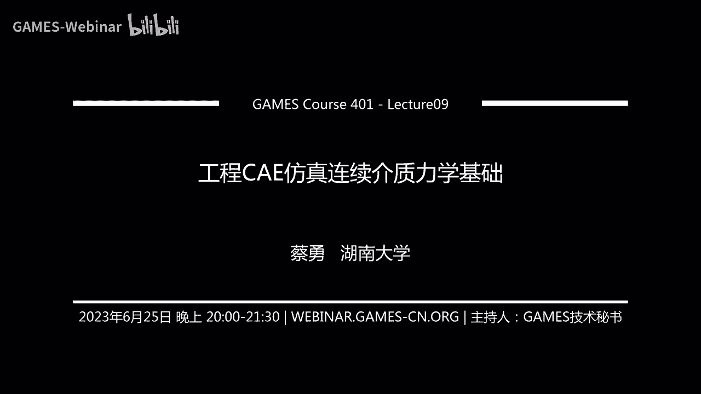
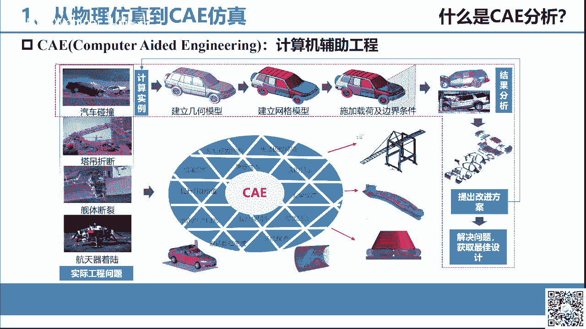
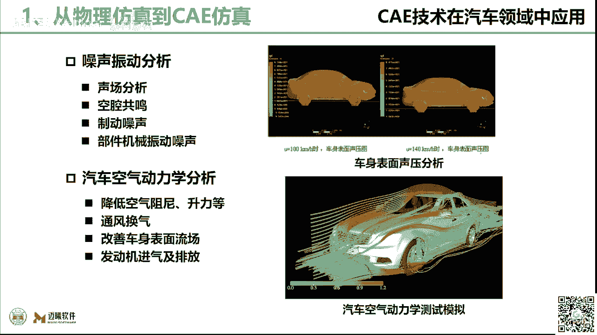
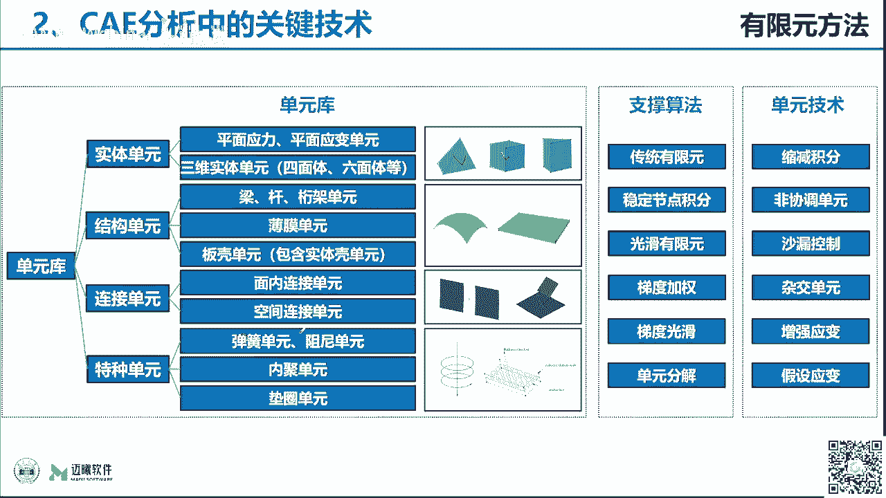
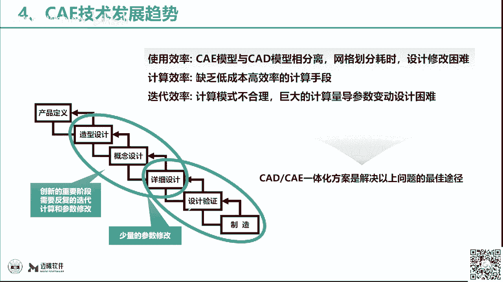
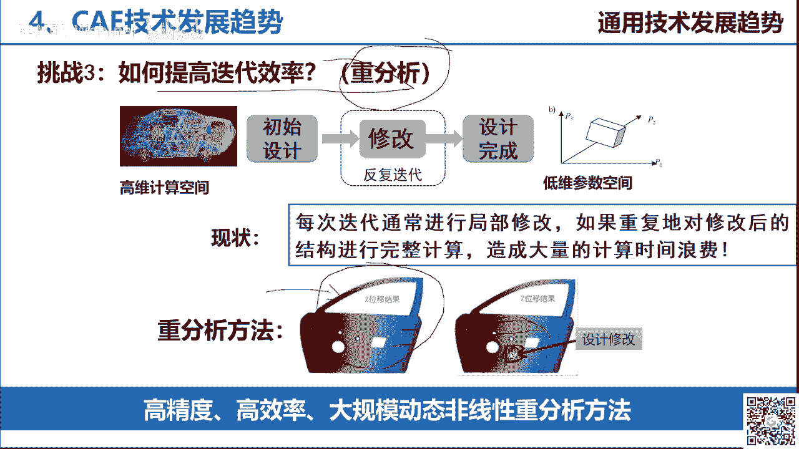
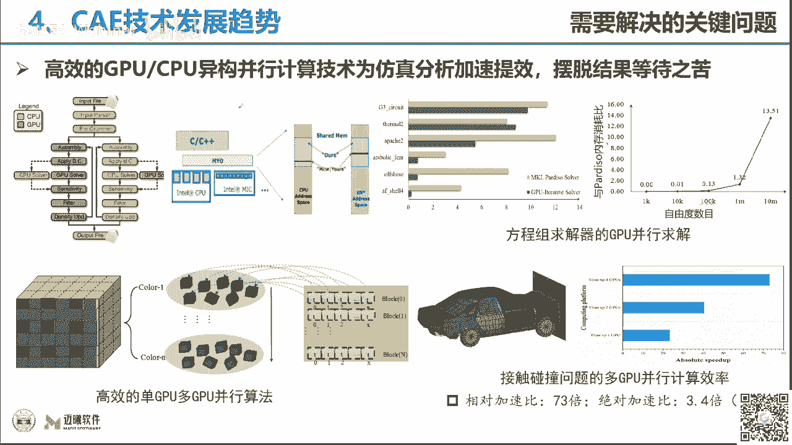
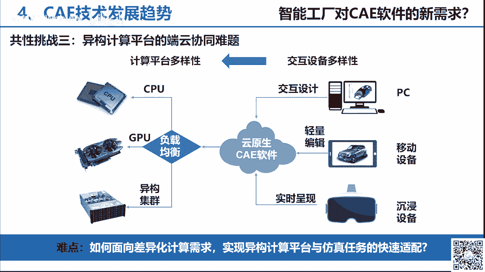
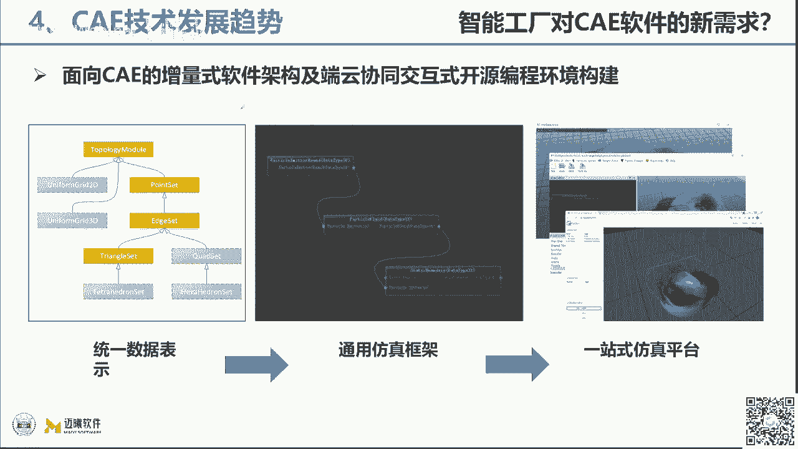
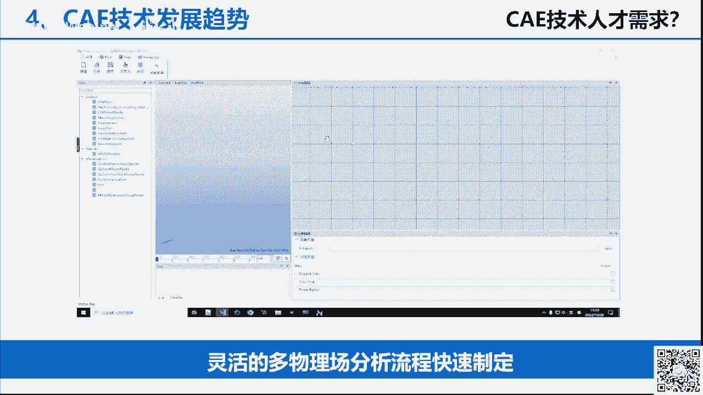

# GAMES401-泛动引擎(PeriDyno)物理仿真编程与实践 - P9：9. 工程CAE仿真连续介质力学基础 🧮

在本节课中，我们将要学习工程CAE仿真的基础概念，特别是连续介质力学的基本原理。我们将探讨CAE仿真与物理仿真的区别，了解CAE仿真的核心流程、关键技术及其在工业产品开发中的重要作用。

## 物理仿真与CAE仿真的区别

上一节我们介绍了物理仿真的基本概念，本节中我们来看看它与工程CAE仿真的主要区别。

物理仿真与CAE仿真的区别主要体现在以下几个方面：

1.  **计算精度**：CAE仿真面向工业和工程领域，要求计算精度非常高。其模拟结果需要与物理实验数据高度吻合，例如在汽车碰撞中预测零部件的位移或变形量。
2.  **计算效率**：物理仿真（如游戏）要求实时性。CAE仿真计算量巨大，模拟一秒的物理过程可能需要数小时甚至数天，难以做到实时。
3.  **结果数据量**：物理仿真更关注图形实时渲染。CAE仿真需要记录整个形变过程中的所有数据（如位移、受力、能量），数据量可达数GB甚至数百GB，用于指导工程设计和优化。
4.  **后处理**：CAE仿真有专门的后处理概念，用于分析海量仿真数据。

总结来说，CAE仿真相比物理仿真，计算精度要求更高，计算速度更慢，数据量更大，并且有专门的后处理流程。

## 什么是CAE仿真？

CAE是计算机辅助工程的缩写。它主要针对实际的工程问题，通过计算机模拟来预测和优化产品的设计与制造性能。

以下是CAE仿真的基本流程：

1.  **几何建模**：使用专业软件建立产品的三维几何模型。
2.  **网格划分**：将几何模型离散化为网格模型。
3.  **施加载荷与边界条件**：定义模型的受力、约束和运动条件。
4.  **求解分析**：使用CAE软件进行仿真计算。
5.  **结果分析与设计改进**：工程师根据仿真数据进行分析，提出产品改进方案。

CAE仿真的核心作用是**缩短研发周期、降低开发成本**。它可以在产品制造前进行虚拟测试，减少对物理实验的依赖。

例如，在汽车研发中，CAE仿真可以替代车身抗弯/抗扭刚度实验、碰撞实验等，并通过云图直观展示如位移分布等结果，指导工程师进行结构优化。

## CAE仿真的作用与发展趋势

CAE技术改变了传统产品开发流程。传统流程是“设计 -> 试制 -> 实验验证 -> 修改设计”的循环。引入CAE后，流程变为“设计 -> CAE仿真验证与优化 -> 试制”，从而在更短的时间内获得更优的设计方案，降低成本。

CAE在汽车工业中的应用非常广泛，包括：
*   环境舒适性评估
*   安全性分析（如碰撞）
*   人机工程学分析
*   结构强度与刚度分析
*   加工工艺分析（如冲压、铸造）
*   虚拟实验（如道路疲劳分析）
*   空气动力学分析

CAE的发展趋势是从辅助设计工具，转变为完全融入产品正向研发流程的核心技术。

## CAE分析的关键技术与流程

CAE分析的基本流程分为三大部分：前处理、求解和后处理。

### 前处理
前处理包括几何建模、网格划分以及载荷与边界条件的施加。

### 求解器
求解是CAE仿真的核心，根据不同物理问题调用不同的求解器（如固体力学、流体力学、热学等）。一个求解器通常包含以下模块：
*   **数值算法与单元理论**：如有限元法。
*   **材料本构模型**：描述材料应力-应变关系，模拟真实物理属性。
*   **接触算法**：处理物体间的接触与碰撞。
*   **连接与约束关系**：模拟零件间的装配关系。
*   **边界与载荷加载**
*   **方程求解与并行计算**：求解大型方程组，利用CPU/GPU并行提高效率。

### 后处理
后处理将求解结果可视化，生成云图、流线图、矢量图、曲线等，供工程师分析。

## 有限元法基础

有限元法是CAE领域求解数学物理问题的一种基本数值方法。它的基本思想是用有限数量的简单单元，去逼近复杂的几何形状和物理系统。

有限元分析的主要步骤包括：结构离散化、单元分析、整体分析。

### 1. 结构离散化
离散化是将一个连续的几何体分割成有限数量的小单元。例如，一个复杂的曲面可以用许多小三角形或四边形来近似表示。

**核心概念**：
*   **单元**：离散后的基本构建块（如线段、三角形、四面体）。
*   **节点**：单元之间的连接点，承受载荷并具有自由度。
*   **自由度**：节点可能具有的运动方向，通常包括3个平动和3个转动自由度。

### 2. 单元分析
在每个单元上建立力学方程进行求解。基本流程如下：
1.  由**节点位移**，通过插值函数得到单元内部各点的位移。
2.  由位移得到**单元应变**。
3.  通过材料**本构模型**，由应变得到**单元应力**。
4.  将单元应力分配到节点上，得到**节点力**。

### 3. 整体分析
将各个单元的分析结果（如单元刚度矩阵）组装起来，形成整个离散结构体的系统方程，并进行求解，最终得到整个模型的近似解。

## CAE软件的精度、效率与开发现状

### 精度与效率的平衡
CAE仿真得到的是**近似解**。计算**精度**和**效率**是一对矛盾体。提高精度（如加密网格）会增加计算量，降低效率。工程中通常根据需求在两者间取得平衡。

### CAE软件生态
主流CAE软件市场主要由西门子、ANSYS、达索等国外公司占据。国产CAE软件（如曼孚软件、石峰科技等）正在快速发展，但面临技术积累、场景迭代和人才储备等挑战。

CAE软件开发难点在于其涉及复杂的**多学科交叉**，包括数学、物理、计算机科学和具体工程领域的知识。

## CAE软件的基本架构与核心模块

一个CAE软件的基本架构通常包括：

1.  **前处理模块**
    *   CAD建模与模型接口
    *   网格剖分与优化
2.  **求解器模块**
    *   通用结构隐式/显式求解器
    *   多体动力学求解器等
3.  **后处理模块**
    *   结果可视化与渲染
4.  **支撑技术**
    *   云计算、并行计算、数学计算库

### 典型功能模块举例
*   **隐式分析模块**：用于静力学、模态分析等。涉及多种单元类型（不仅由几何形状区分，更由计算理论区分）和材料本构模型。
*   **显式分析模块**：用于碰撞、冲击等大变形、瞬态动力学问题。严重依赖**接触算法**和**并行计算**（如GPU加速）来提高效率。
*   **拓扑优化**：通过计算，在满足性能要求下寻找材料的最优分布，实现轻量化设计。

## CAE技术的发展趋势与PeriDyno的应用

CAE技术的发展围绕三个“效率”展开：

1.  **使用效率**：推动CAD与CAE的无缝集成，减少模型转换时间。
2.  **计算效率**：大力发展GPU并行、超算等异构计算，加速单次求解。
3.  **迭代效率**：采用**重分析**等技术，当设计局部修改时，只重新计算受影响区域，大幅提升优化迭代速度。

基于PeriDyno泛动引擎，可以开发增量式、模块化的CAE软件平台，如**曼孚SimAI**。该平台利用PeriDyno的底层数据管理和GPU/CPU异构并行能力，支持CAE仿真算法的快速研究、流程搭建和应用开发。

---

本节课中我们一起学习了工程CAE仿真的基础。我们明确了CAE仿真与物理仿真的核心区别，了解了CAE仿真的基本流程、以有限元法为代表的关键技术，以及CAE软件的基本架构和开发难点。最后，我们探讨了CAE技术的发展趋势，并看到了基于PeriDyno平台进行CAE软件开发的可行性与实践。这些知识为我们后续深入CAE仿真编程与实践打下了坚实的基础。