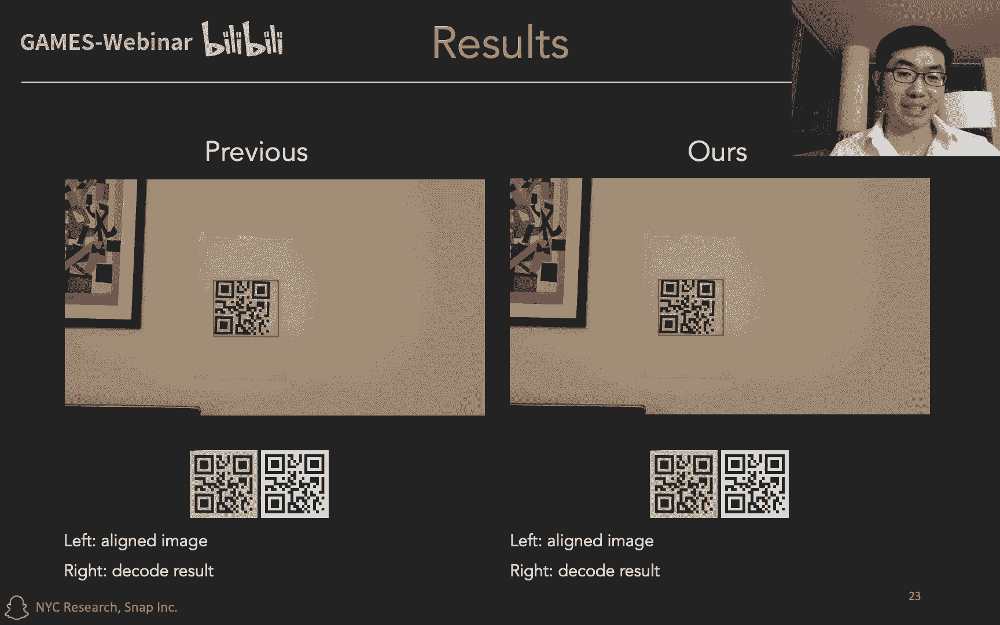
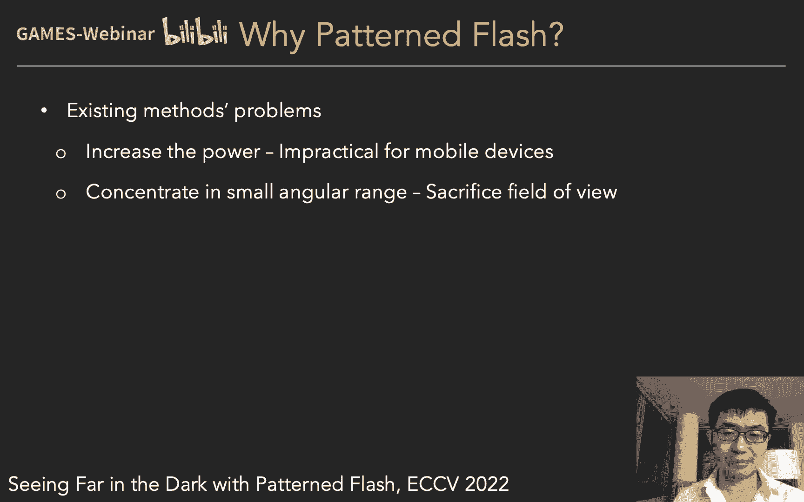

# GAMES204-计算成像 课程笔记 P1：Snap Research 的计算成像与摄影研究 👨‍🔬

在本节课中，我们将学习 Snap Research 在计算成像和计算摄影领域的研究工作。课程内容涵盖团队介绍、公司产品背景以及多个前沿研究项目的核心思想与成果。

---

## 团队与实验室介绍 🏢

我叫 Jian Wang，是 Snap Research 的高级科学家，研究方向包括计算成像、计算摄影和计算机视觉。我的个人主页是 jianwang-cmu.github.io，微信号是 jianwang8973，欢迎大家交流。

我们的实验室位于纽约时代广场的雅虎大楼内。虽然楼下游客众多，但实习生们似乎很喜欢这个充满活力的环境。公司附近有 Bryant Park、百老汇等著名景点。办公室内没有食堂，但公司为每人提供一张餐卡，可以在周边众多餐馆消费，这也成为了工作的乐趣之一。

实验室配备了机械室和暗房，考虑到纽约高昂的租金，这个空间相当可观。除了多样的餐馆，附近的景点也是我们采集数据的绝佳场所。

我们的团队背景多元，包括：
*   **研究科学家**：如我和 Si Zhuo，专注于计算成像、摄影和计算机视觉。
*   **高级研究工程师**：如 Ben，专注于可穿戴设备传感和移动传感。
*   **机械工程师**：如 Carl。
*   **软件工程师**、**电子工程师**、**项目经理**和**顾问**。

这种多元化的团队组合有助于激发灵感，并将想法转化为可供用户使用的现实产品。

我们的工作也离不开实习生的努力。每年我们招募约12名来自计算成像、摄影、计算机视觉和人机交互领域的实习生。我们正在招聘2023年的实习生，并为国际学生提供J-1签证支持。选择我们的原因包括：根据学生兴趣定制项目、提供充分指导、给予学术自由，以及有机会产生产品或学术影响。去年，我们的每位实习生都有顶会投稿。

---

## Snap公司核心产品 📱

Snap公司有两款核心产品：手机应用 Snapchat 和增强现实眼镜。

**Snapchat** 是一款即时通讯应用，全球拥有3.6亿用户，主要面向年轻人。其核心设计理念是“阅后即焚”和“社交无压力”。消息在被阅读后会消失，这模拟了人类自然的对话记忆方式，用户无需担心过去说过的“蠢话”。它的“Stories”（类似朋友圈）功能不支持公开点赞和评论，进一步减少了社交压力。应用一打开就是相机界面，鼓励用户拍照分享，并提供了大量趣味AR滤镜（如兔耳朵、变性别、变年龄等），这些滤镜极大地增加了拍照的乐趣。

**Spectacles** 是Snap公司行业领先的增强现实眼镜。公司为此投入了大量研发。

围绕这两款产品，我们面临着许多有趣且实际的计算成像和计算摄影问题。计算摄影通常是纯软件的，而计算成像则涉及硬件和软件的协同设计。

本节课将介绍我们在以下两类项目中的研究工作：
1.  **计算摄影**：包括图像修复和图像编辑，用于创建Snapchat中有趣的AR滤镜。
2.  **计算成像**：包括基于闪光灯的低光成像、资源受限的3D传感、透明玻璃检测以及一个偏科幻性质的透明相机研究。

此外，我们的经理 Shree Nayar 在 CCP 2022 大会上做了题为《视觉通信的进展》的主旨报告。视觉通信（通过图片和视频交流）已成为Snapchat上的主要交流方式。如果你对此感兴趣，可以在YouTube搜索CCP频道或访问我的个人主页获取链接。

同时推荐 Shree Nayar 的在线课程 **《计算机视觉的第一性原理》**。在当今基础模型时代，理解计算机视觉的基础理论对于深度研究至关重要，这门课程讲解得非常出色。

---

## 计算摄影：图像修复 🖼️

在计算摄影的图像修复方面，我们将重点介绍三个研究工作。

### 1. 盲人脸图像复原

第一个工作是盲人脸图像复原。目标是从质量严重退化（如有噪声、模糊、信息丢失）的输入图像中，恢复出高质量的人脸图像。“盲”意味着我们不知道图像具体的退化过程（如噪声多大、模糊核是什么）。

**核心方法**：利用预训练的人脸生成模型（如 StyleGAN）的先验知识。我们将生成模型“倒转”拟合到退化的输入图像上，从而在生成器的潜空间中找到对应的高质量人脸。

**结果**：该方法能显著提升图像质量，但存在一个潜在问题：输出的人脸质量虽高，但不一定与输入是同一个人。

### 2. 闪光灯与非闪光灯图像融合复原

第二个工作旨在融合两张照片：一张是低光环境下关闭闪光灯拍摄的（有噪声但色调自然），另一张是打开闪光灯拍摄的（细节清晰但光照生硬、色调不自然）。

**目标**：生成一张既保持自然色调，又拥有清晰细节、无噪声的照片。

**核心方法**：同样基于预训练的人脸生成模型（如 StyleGAN），将两张图像的信息融合到生成器的潜空间中。

**结果**：生成的图像在颜色上更接近非闪光灯图像的自然感，在细节和清晰度上则接近闪光灯图像，与真实情况（Ground Truth）非常接近。

### 3. 修复AI生成图像中的人脸

随着生成模型的流行，AI生成的图像有时会出现扭曲的“鬼脸”。我们的目标有两个：修复这些奇怪的人脸；将当前用户的面部特征融合到生成的人脸中。

**输入**：一张AI生成的带“鬼脸”的图像，一张用户的真实照片。
**核心方法**：与上一个项目类似，基于人脸生成模型，将两张图像的信息进行融合。
**结果**：生成的人脸既修复了扭曲部分，又融入了用户的特征（如胡须、鼻子、眼睛、眉毛等）。

---

## 计算摄影：图像编辑与滤镜 🎨

在图像编辑方面，我们主要研究用于创建Snap滤镜的技术，这里介绍三个工作。

### 1. 3D照片风格化

给定一张内容照片和一张风格画作，目标是生成一个具有3D效果且风格化的照片/视频。核心挑战是保证**视角一致性**，即从不同角度看这个3D内容时，风格化效果稳定、无抖动。

**核心方法**：使用一个统一的中间表示——点云。我们在点云上施加风格，然后将风格化后的点云投影到每一帧图像中，从而保证各视角间的一致性。

**结果**：可以生成背景风格化而人物保持原样的有趣效果。

### 2. 从云到素描

人们看云时常常会联想出各种形状。这个工作旨在自动生成与云朵形状对齐的动物素描。

**算法**：对于同一朵云，算法可以生成一组不同的、合理的素描结果，模拟不同人的不同想象。

### 3. 心率滤镜

使用手机前置摄像头拍摄的人脸视频来估计心率。心率是许多其他滤镜（如健身滤镜、健康滤镜）的基础。

**难点**：人脸运动会严重干扰心率信号。
**传统方法**：在脸部固定区域取像素均值，分析其随时间的变化（光电容积描记法原理）。人脸不动时，微小的波动对应心率；人脸运动时，会产生巨大干扰。

**我们的方法**：
1.  从输入视频中估计人脸的几何形状、反射率和光照（利用多帧信息联合估计光照，以避免光照信息中包含心跳信号）。
2.  用估计出的参数渲染一个**仅包含运动信息**的虚拟人脸视频。
3.  从原始信号中减去这个渲染视频产生的运动信号，得到**纯净的心跳信号**。
4.  对纯净信号进行频域分析，得到准确心率。

**结果**：即使在人物运动时，我们的方法也能比前人方法更准确地估计心率。

---

## 计算成像：硬件软件协同设计 ⚙️

计算成像涉及硬件和软件的联合设计。本节介绍四个工作。

### 1. 基于闪光灯的低光成像

低光成像方法主要分两类：不使用闪光灯和使用闪光灯。
*   **无闪光灯**：包括单图去噪/去模糊，以及多帧融合（如手机的“夜景模式”）。
*   **有闪光灯**：
    *   **白色闪光灯**：颜色不自然。
    *   **双色温闪光灯**：模拟环境光色温，改善白平衡。
    *   **不可见光闪光灯**：使用红外或紫外光，人眼不可见，但需要移除相机上的红外截止滤光片，影响白天成像。
    *   **立体不可见光系统**：使用两个相机，一个标准RGB相机，一个近红外/近紫外相机。两者共享绿色通道，便于对齐和融合。白天仅用RGB相机，晚上双系统融合。但需要增加一个相机。
    *   **深红色闪光灯**：基于人眼生理特性——在暗视觉下，视杆细胞对深红色光不敏感，而相机仍对其敏感。因此，深红色闪光灯对人眼刺激小，同时能被相机良好捕捉。

**深红色闪光灯结果**：融合闪光灯与非闪光灯图像，能得到细节丰富、颜色正确的照片。

### 2. 图案化闪光灯

闪光灯的一个根本问题是作用距离有限，因为光强随距离平方衰减。现有方案（增加功率或聚光）在移动设备上不实用或会限制视野。

**我们的方法**：图案化闪光灯。将均匀的光斑变为一系列高亮的光点。在远距离场景下，这些光点处的信号仍能高于噪声水平。利用图像的稀疏性和冗余性，可以从这些稀疏的强信号中恢复出整个图像。

**额外优势**：图案化闪光灯与相机可构成一个结构光系统，能够同时估计深度信息。

**结果**：在相同功率下，图案化闪光灯比传统闪光灯能捕捉到更远的场景细节，并能获取深度图。

### 3. 资源受限的3D传感

在AR眼镜等设备上实现结构光3D传感面临体积小、功耗低、精度高的挑战。

**核心方法**：微型基线结构光。当相机和投影仪基线非常小时，可以利用一阶泰勒展开，将非线性的成像过程近似为线性的。这简化了系统求解过程，类似于光流计算中的思想。

**成像模型简化**：
当基线 `b` 很小时，`I(x) ≈ R(x) * P(x + u(x,y))` 可线性化为 `I(x) ≈ R(x) * [P(x) + ∇P(x) · u(x,y)]`，其中 `u(x,y)` 是与深度相关的视差。求解 `u(x,y)` 即可得到深度。

**结果**：使用基线仅15mm的设备，成功实现了高精度的3D重建。

### 4. 透明玻璃检测

透明玻璃检测非常困难，但具有重要安全意义（如防止撞上玻璃门）。

**我们的方法**：基于玻璃的光谱透射特性。玻璃在可见光波段透射率高，但在远红外波段透射率很低。因此，我们使用RGB相机和远红外相机配对。
*   **没有玻璃时**：两个相机都能看到场景。
*   **有玻璃时**：远红外相机几乎看不到玻璃后的场景。
*   通过比较两幅图像的差异，即可检测出玻璃。

**未来适用性**：未来的窗户玻璃仍需满足“视觉透明”和“隔热”两个基本特性，因此我们的方法在未来依然有效。

### 5. 透明相机（探索性研究）

这是一个偏科幻的概念，旨在设计一个外壳透明的相机。这反直觉的地方在于：如果相机透明，光线如何被传感器接收？外壳的杂散光是否会干扰成像？

**解决方案**：
1.  **涂层设计**：在传感器和外壳上施加互补（相反）的涂层，使得通过外壳的杂散光不会被传感器捕捉。镜头与传感器上的涂层一致，确保通过镜头的光能被传感器捕捉（后来发现镜头无需涂层也可工作）。
2.  **传感器镂空**：将传感器设计成奇数列为像素、偶数列镂空的样式。宏观上，传感器呈半透明状。
3.  **图像复原**：利用自然图像的空间冗余性，通过图像复原算法从稀疏采样的传感器数据中重建出完整图像。

**透明度分析**：从不同角度看，相机都呈现一定的透明度。

---

## 总结 🎯

本节课我们一起学习了 Snap Research 在计算成像和计算摄影领域的多项前沿工作。

Snap 是一家相机公司，我们相信相机能让人们的生活和交流变得更加有趣。基于公司两大核心产品——拥有数亿用户的 Snapchat 应用和行业领先的 Spectacles AR 眼镜，我们的团队提出了许多既有趣又具有实际意义的研究问题。

在计算摄影方面，我们探讨了图像修复（如盲复原、多图融合、AI人脸修复）和图像编辑（如3D风格化、云朵素描、心率估计）技术，这些是创造有趣AR滤镜的基础。

在计算成像方面，我们深入研究了硬件软件协同设计，包括改进低光成像的深红色与图案化闪光灯、适用于微型设备的3D传感技术、实用的透明玻璃检测方法，以及一个富有想象力的透明相机概念。

今天介绍的工作只是我们研究成果的一部分。未来，更多的工作将在我的个人主页上展示，敬请持续关注。

