# 嘉宾座谈：Snap Research 的计算成像、摄影研究 ｜ GAMES204-计算成像 - P1 - GAMES-Webinar - BV16V4y1c74R

大家好，欢迎来到我今天的talk，competent image and competent photograph，search，at saber，search，java sneer search。

在计算成像和计算摄影方面的研究工作，我叫剑王哦，我的个人主页是剑王杠，cmu dot github，dot i o，我的微信号是建完8973，欢迎大家加我进一步交流和讨论，首先介绍一下我们实验室。

我们实验室坐落于纽约时代广场雅虎大楼，每天楼下都是游客，人挤人，我不知道公司为什么把office放在这里，但是看上去我们的实习生非常喜欢，公司附近还有很多著名景点，比如啊brand park。

百老汇等等，我们office里面没有食堂，也许是因为公司附近已经有很多吃饭的地方了，公司给我们每人一个ma card，可以在餐馆消费，每天去不同餐馆嗯，觅食也是这里的工作的乐趣之一。

这是我们的实验室，由啊mechanic room啊，dark room啊，作为实验室还是挺大的，考虑到这里的租金很高，实验室附近的著名景点，除了有多种多样的餐馆之外呢，也是跟我们采集数据的绝佳场所。

下面介绍一下我们团队啊，我是团队里的senior scientist，做计算成像，计算摄影和计算机视觉方面的研究，思卓也是团队里的research scientist，和我做类似方向的研究。

ban是我们的senior，设置engineer，做可穿戴设备的呃，传感和移动传感方面的研究，car是我们的senior，以设置engineer是我们的mechanic ical engineer啊。

机械工程师andrea是我们的program manager，xxi，and michael是我们的consultants，其中某hit是威斯康星麦迪逊的教授，长期是哥大的教授。

mike是非常senior的电子工程师，我们的director是喜ena manager，是gru，可以看到我们团队里的人的背景是非常多元的，有research scientist。

research engineer，mechanical engineer，software engineer，嗯and electrical engineer，就是说有研究科学家，有研究工程师。

机械工程师，软件工程师，还有电子工程师，这是多么这么多远的团队才能迸发出啊，灵感的火花，并且把想法变成现实，把想法变成可以真正让用户使用的产品。

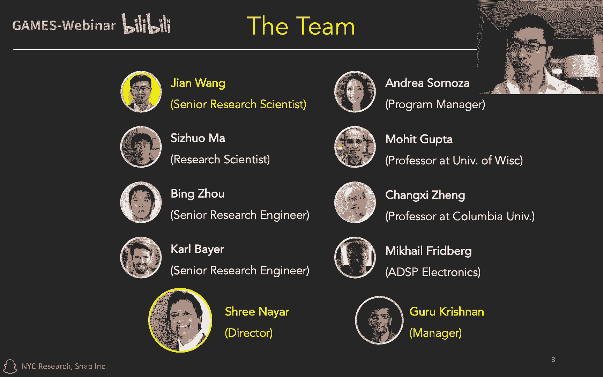

我们的工作呢也离不开谁生的啊努力，每年我们会有大概12个实习生来自计算成像，计算摄影，计算机视觉和人机交互领域，这里呢是实际上活动的一些合照，我们现在在招2023年的实习生，如果您感兴趣啊。

非常欢迎申请，对于国际学生，我们会帮忙申请接万签证，为什么选择我们呢，我的主页上写的啊，原因简单来说，我们会为学生考虑，根据学生的兴趣和特点量身定做实际项目，我们也会提供非常多的指导。

同时如果需要也提高学术的研究的自由度，实际上有机会产生产品与产品影响，学术影响啊，或者两者都有，今年啊，我们的每个实习生都有顶会的投稿，我们的实际生数量也是非常有限的，如果您想跟我学术合作，欢迎联系。

我会给学生合作者提供学术指导和学术ide。

首先介绍一下我们公司snap ink，snap公司有两套产品，一个是手机app叫snapchat，另一个是增强现实眼镜，snap chat是一款即时通信软件，可以用来给朋友发消息啊。

发照片和发视频和微信很类似，在全世界有3。6亿用户，主要集中在年轻人，它的设计理念呢比较独特，阅后即焚，也就是看完了消息就没了，这个和微信很不一样，在微信上面呢，你给别人发了消息，这个消息会一直存在。

您还可以搜索某人过去发的消息，一开始呢我觉得snapshot设计比较反人类，因为用微信比较习惯了嘛，其实一开始我用snapchat的时候，我一个人对话，我问他啊，在哪里会面，然后呢他给我发了个地址。

我打开后看了，然后呢再打开啊，想确认一下地址诶，地址没了，但是呢随着用户用snapchat越来越多啊，我越来越觉得snapchat的设计，更近似于人类之间的通信，比如说我上个月跟你说的话。

我们可能都不大记得了，可能只能记得一点印象，而且也没有地方去搜索是吧，snp下载的最根本的设计理论是什么呢，社交无压力，在这上面聊天呢，你不用担心你过去说过了什么呃，呃蠢话。

ok他也有朋友圈叫做stories，在上面发朋友圈呢，别人没有办法点赞，也没有办法公开评论，如果朋友呢嗯看到了你发的什么照片视频啦，真的想给你评论的话，他如果开始打字啊，会直接发送到你的啊。

跟你的聊天窗口里面，相比之下呢，在微信里面你发个朋友圈，你可能还担心，比如说点赞的人不够多呀，啊在啊，比如在发票之前，你可能会想很多，比如说呃，你要把这个图片呢要修得美美的呀之类的。

snap chat的设计理念是社交无压力，我现在越来越觉得他是社交了，未来，下面介绍snp下载的五个tap就五个啊，五个页面一打开snp下的呢是他的呃相机窗口，ok就是中间的这个tag啊。

而不是像微信一样一打开就是聊天窗口，snapchat这么设计是为了鼓励用户拍照，然后呢啊发给朋友，此外呢用户还可以调出一些滤镜，比如说让自己有双啊兔耳朵呀，然后呢嗯男美女啊，女变男嗯。

或者是小孩毕业老人嗯，或者老人变小孩之类的，这些滤镜呢增加了很多拍照的趣味性，snap chat在滤镜上面是最早发力的公司，也是做的最好的公司，由于滤镜的成功呢。

啊instagram抖音也开始有类似的功能，这个是嗯聊天窗口跟微信类似，可以发送文字，图片语音，还有各种各样的表情包，最左边呢是啊snap地图，可以看到朋友们在哪里，这儿呢就是类似于朋友圈了啊。

可以看到朋友发的照片和视频，文字呢一般都是直接加在照片和视频里面，还可以看到啊公众号发的视频，比如说呃那个呃比如说呃cn啊，或者是哪个新闻媒体发的，比如说新事业杯啊。

嗯然后呢会发一些这方面的体育新闻之类的，最右边呢呃就是短视频，有点像微信视频号。

snap公司另外一个核心产品，是行业领先的增强现实眼镜啊，a r glass，ok，我们的增强现实眼镜叫sniffles，snp，在这款眼镜上面投资了很多年了，包括研究和呃，收购重要的straps。

围绕二塔公司的两个核心产品，我们有非常有趣的和实际的计算，成像和计算摄影问题，技能神像呢啊一般都是啊pure solar best，就是纯软件的。

现在成像呢一般是啊codesign hardware and software，就是说啊啊把硬件和软件联合设计，在嗯计算摄影方面呢，今天呢我会给大家讲到啊，我们在呃两类project上面的研究工作。

一个是呃图像修复，image restoration，另外一个是呃图像编辑，image manipulation，它呢可以用来嗯，就是说在snapchat的app上面做那种很有趣的，a ar的啊滤镜。

我们称这个ar滤镜叫做内部叫做snapolis，或者叫做啊snap滤镜，在计算成像方面呢啊我会介绍四类的研究工作，第一类呢是基于闪光灯的低光成像，第二类呢是啊资源有限的啊，3d传感。

第三类呢是透明玻璃的检测，第四个呢是啊带带点科幻性质研究透明的相机，我们还有其他的研究工作啊，但是可惜的是啊，现在还处于保密阶段，有可能明年会公开一部分，如果您感兴趣的，可以对我的网站保持关注啊。

一旦可以公开。

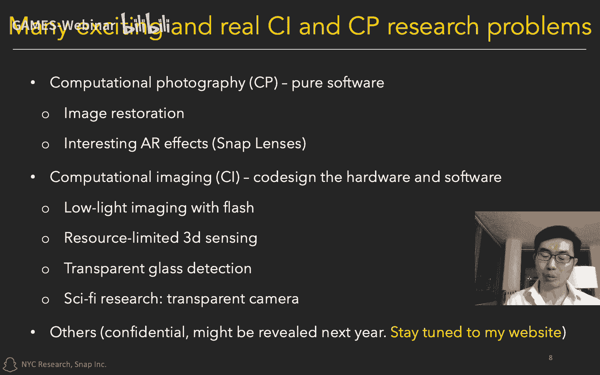

我立马获得啊，我的网站上面啊公开出来，除了我今天给的token介绍的我们的研究工作，我们的manager，11在c c p2022 上面给了主旨报告，介绍了我们别的工作嗯。

他的报告的题目是advances in visual communication，那visual communication其实就是呃，呃现在snap chat上面就是说呃，呃主要的交流方式了。

visual commencing，就是说啊现在主要的交流方式不再是文字了，而是什么图片和视频，那accp是计算摄影方面的顶会，如果您感兴趣啊啊观看啊，11的这个主旨报告呢，啊这里面有啊提供的链接。

比如说去youtube上面搜索一下，可以去找一下c c b的channel呀，或者是更简单的去我的网站上面。

然后呢我的网站上面有啊提供了这个链接，同时呢这里也做一个啊啊小广告，十日呢还有一个在线课程，叫做first principles of computer vision。

就是啊计算机视觉里面的呃第一性原理，在现在啊基本能力时代，很多人其实都不知道，计算机视觉的一些基础理论，但是呢这些理论对于研究工作的深度，是非常重要的，他的这门课真是教授这些，而且讲的非常的好。

相信您看了之后呢会受益匪浅。

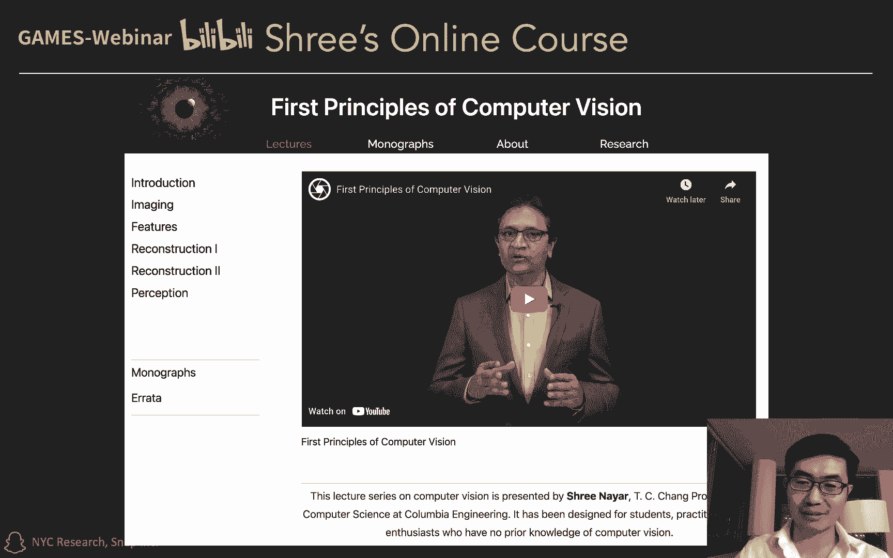

好在现在呢啊开始介绍一下，我们嗯的具体的研究工作，在嗯这是计算摄影图像修复方面呢，啊我会啊重点介绍三个研究工作，包括blind faimage restoration，就是图像，就说嗯人脸啊图像的复原。

并且你是不知道他的这个呃啊，图一下坏的过程的，第二个是啊flash flash啊，fast image restoration，就是基于闪光灯和不闪光灯，就两个图片融合的这种呃人脸图像复原。

第三个呢是啊restoring ai generated faces，就是修复现在啊ai生成的图像里面的，这个人脸的这个问题，第一个啊，blinda fast image restoration。

左边呢呃是呃input，ok右边的是output，是我们期待的output切换的啊，结果那可以看到这个问题其实还是挺难的，可以我们可以看到这个input里面呢会noise啊，会会会造成那会有嗯信息损失。

那嗯怎么从这个呃输入啊，可以修复到输出呢，就修复修复得到的输出呢，我这边可以按暂停一下，然后大家可以想一想，那我们可以嗯根据这个输入的这个特点啊，因为都是人脸，那么可以用到什么呢。

啊人脸的这个呃a prayer，ok那我们是基于这个呃pretrain的face，简单一些，model specifically style干，我们可以把这个啊style这个这个人脸生成器啊啊。

肯定选到这个in locity的input上面，然后呢可以在这个output，这里解释一下这个bland的意思，就是说呃我们这我们这个input到这个output呀。

就是啊就是为什么会变为为什么这个会变坏，一般会有加上一般会有noise呀，有buz，然后呢不line表示说我们不知道这noize有多重，然后呢这个伯乐的的布洛克呢是啊多大。

还有别的一些呃degradation啊，包括呃呃jpg可不j啊，jpg压缩呀之类的。

ok现在看一下啊算法的呃这个结果嗯，这边的话就是展示了这个输入是长什么样子的，可以看到这个呃呃信息丢失很严重，然后呢嗯这个输入的质量非常的差。

那么呃这个事儿啊，输出可以看到输出的啊，这个人脸的质量非常的高，其实呢呃这个数值还是有些问题的，就是这个输出虽然质量很高，但是不一定保证啊，输出和和输入呢是同一个人。

这也引出了我们按第二个project，我们第二页有两个呃，输入一个是这个啊loquality的这个呃，人脸的这个照片，另外一个呢是呃闪光灯打开的时候拍的，拍出的照片，那有人就会问了。

就说为什么我不直接用这个闪光灯拍的，这个闪光灯拍的照片呢，啊因为这个闪光灯拍的照片啊也不好看，就是你会看到它的这个呃，这个哈嗯光照有点那个，比如说有有点有点太那个harsh，ok这不是很自然相嗯。

相较之下呢，这个这个这个这个这个input，就是说这个low低质量低质量的这个输入呃，虽然呃比较的啊嗯有噪声啊，但是呢它的这个颜色这个这个这个感觉就overall，这个呃颜色这个痛啊还是很好的。

这两张照片都是互有优缺点，ok那我们这边目标是什么呢，是希望能够融合这两张照片生成一张照片呢，它的这个整体的这个呃颜色嗯是非常好看的，同时呢也没有噪声，那怎么做呢，唉我们用一个啊类似的方法嗯。

就是嗯嗯基于这个嗯人脸生成模型啊，prefa fa generation model，like a style gun，ok那这个是我们的输出的结果，可以看到啊，它确实符合我们的期望。

你看这个颜色是非常好看的，ok这颜色颜色非常好看，比这个flash image要好好多了，并且呢就是说也是没有noise，比这比这个no flash mesh也是嗯好的非常多。

然后呢这个是ground truth，可以看到就是这个我们的output，跟着ground truth是非常相像的。

看第三个啊，project修复ai生成的图像里面的人脸，那现在啊就是生成模型非常的火啊，给这个生成模型打一段话，比如说啊一个人和一个呃呃呃数字相机，ok然后呢这个就可以，这个就是人工智能啊。

生成了一个呃照片，哎呀效啊非常的棒，像真的似的，那它有什么问题呢，他仔细嗯看了一下，发现呢啊这个人脸的话是有问题的，这人脸他这个你看这个眼睛就是啊有点不大对，ok然后呢嗯一旦有点不大对了之后呢。

我们就觉得他就就挺像像像鬼似的，ok那这鼻子也不大对，这嘴的话也挺奇怪的，那其实嗯在产品里面呢，我们其实还有另外第二个需求，就是我们希望这个生成了这个图像里面，能够生图像。

生成图像里面图像的这个人脸里面呢，能够融合进入啊，当前这个用户的这个人脸上面的特征，所以呢啊具体来说有两个需求，一个是修复这个啊奇怪的人命，第二个呢是融合进这个用户的人脸特征。

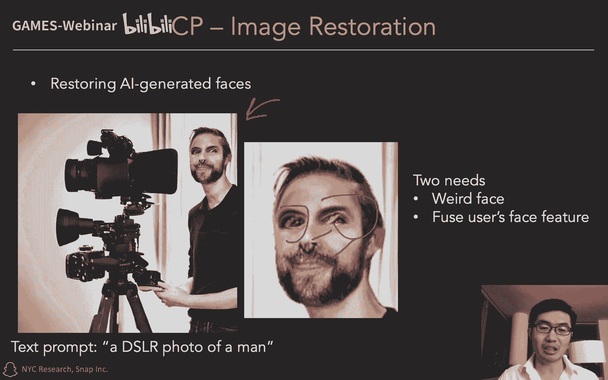

ok那具体来说呢是嗯由于两个输入，第一个是ai简单性的face a i生成的人脸，第二个是用户的自己的人脸，那把它们融合起来，那怎么融合呢，ok那其实啊这个和上一个project的有点类似。

上一个project是啊融合啊，no flash和flash image，那这边的话就是融合这两张图片，当然了，刚才那两个刚才那product里面的话，那个那两个人脸其实是那两个。

就说no flash和flash啊，fate images本来就长得比较类似了，这边的话就长得一点不大同不大相同，但是呢我们依然可以用类似的方法，基于这个人脸生成模型，然后把它们给融合在一起。

把它呢嗯贴回去，ok这个就是我们最终的最终的生成的照片，ok也就是说有一个啊ai简单体的image，还有一个当前用户的一个啊photo，那我们可以把他们既修复这个鬼脸，然后呢就可以把人脸。

把把这个用户的信息转化进去，仔细看的话，其实可以看到，可以看到什么呢，就是呃这边胡胡须啊，然后呢鼻子呀癌症啊，然后这个眉毛呀其实是啊，和用户当前的这个照片是非常相似的，ok那现在接下来按一下i嗯。

另外一个工作啊，qr code，snapchat有自己的qr code，叫做snap code，然后啊为什么要snap code呢，因为我们认为我们的snap code讲的比较好看。

在我们做这个project之前，公司里面刚刚有一个呃叫做snap code的skin good line，就是说嗯叫用户呀，就是我如果打印出来一张，打印出来一个snap code，那，扫描它的时候。

这范围距离也一定要在啊，比如说多近之内，比如说这边写了个，就说啊嗯7x这个距离其实是非常小的，你想象一下，就是说这个啊snap code就这么就这么大，那么你的扫描你扫描的距离必须是这个七倍的。

比如说啊七倍的距离以内，这其实是非常非常短的，那我们的工作呢，嗯就是嗯来延长这个啊扫描的距离，那扫描距离越长的话，其实用户扫描这个code也会越顺畅是吧。

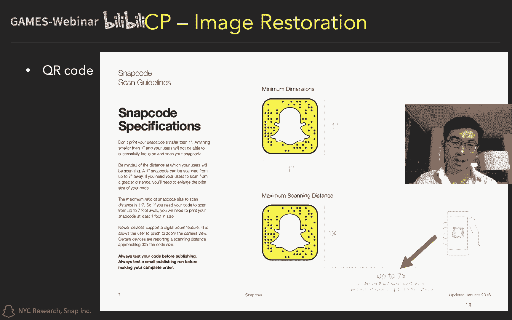

那我们来看一下，就是，为什么我们不能从很远的距离，来扫描这个二维码呢。

这个video就展示了啊什么呢，就是当我们拿着个相机。

然后呢，嗯然后离这二维码越来越远。

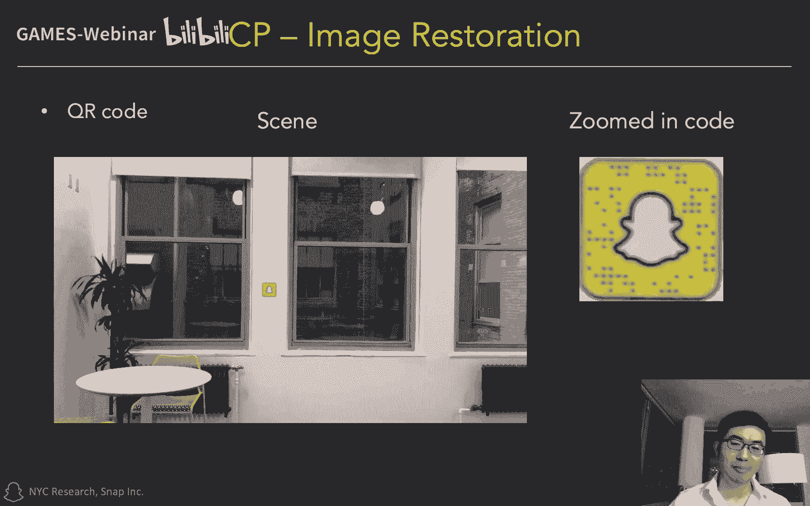

然后拍到了这个图像，我们可以看到呢，就是大家相机离这这二维码越来越远，那首先质量会显著下降的，你看现在的话就是这些啊，beat信息其实是越来越模糊了的，那显然这个时候再对二维码做那个呃。

解码是非常困难的。

那下面来看看就是我们的算法的呃，结果在右边，然后呢还有啊，之前算法的结果在左边，你这个时候啊之前的方法已经失败了，他已经检测不了检，检测不了任何一个code了，那我们的方法呢啊还能讲得扣的。

并且三个都能讲得到。

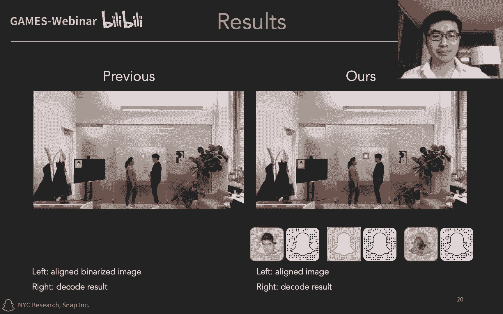

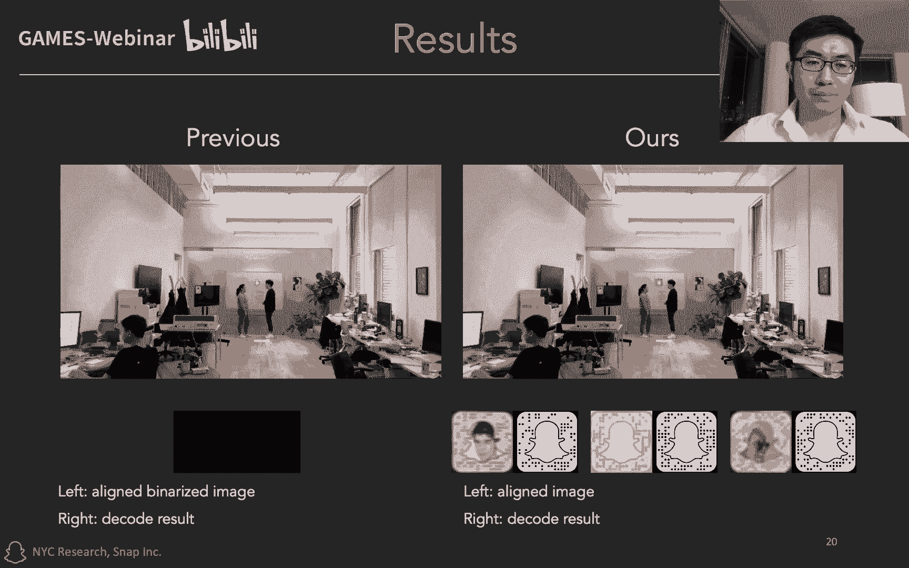

嗯ok，那接下来再看看就是啊，我们的算法和嗯之前的算法，对于这种啊倾斜的这个二维码的啊，performance。

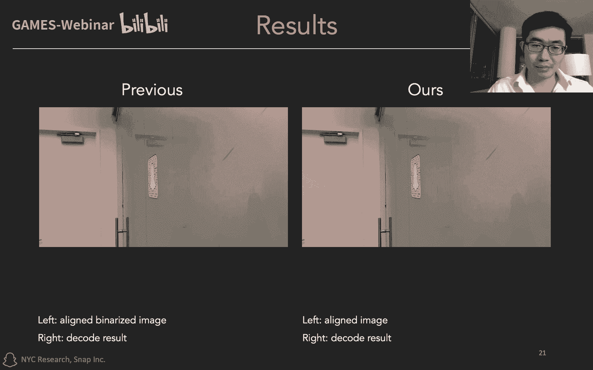

ok啊，我们的算法呢其实对于普通的二维码也是work的。

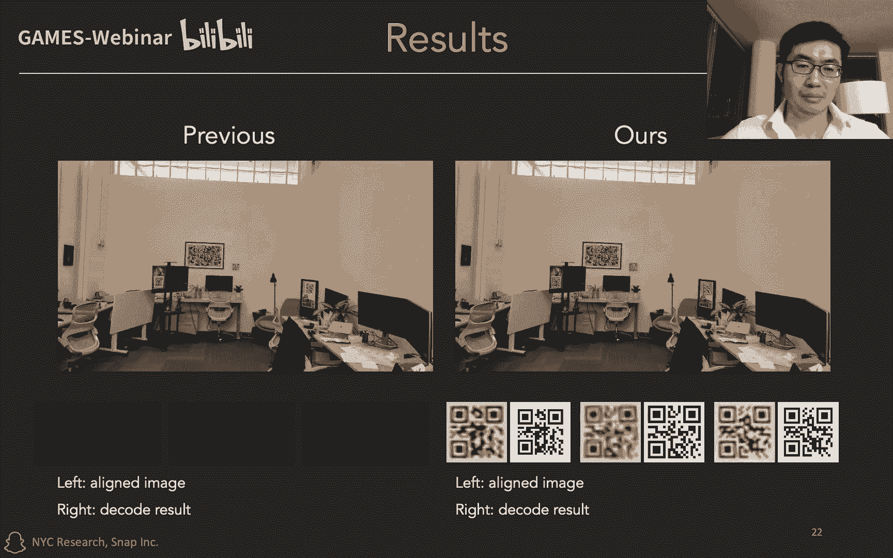

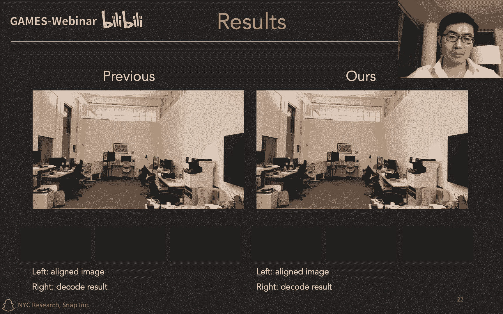

这个里面的啊测试一下，对于这个倾斜的二维码的这个performance，我们的算法呢就是说能看到更加倾斜的二维码。

传统的呃算法呢是这样子的，他先呢呃检测出这个呃啊square在哪，然后呢再简单说四个角点在哪，然后呢做alignment就把alig正方形，然后呢在这个区域里面，就这个这个里面的区域呢做这个r2 值化。

然后呢把然后呢再对每个点就说嗯，做一个就能做一个什么啊，简单的一个归类，就是说它是一个一还是个零，当我们的方法呢嗯是先是什么呢。

i用了一个fine tuna和object detection network，然后呢再用了一个传递声音网络，这个转音神经网络，同时做这个alignment，和这个从这个呃image转到这个bats。

我们的方法呢已经进入到了啊app里面，并且呢被嗯几亿用户每天都在使用，那考虑到就是这个扫描二维，扫描二维码的这个呃操作呢是非常频繁的，那我们的算法呢也就是说每天都是被用的，非常的非常非常非常的频繁。

这个project呢是非常成功的，那这里呢分享一下这个project的一些成功的经验，我们呢是第一个啊，找到并且是来处理这个问题的啊，我们是在2019年的1月份开始做这个project。

在当时我们并不知道诶，这个扫描距离呢还能变成在2年半之后呢，我们知道啊，微信和apple啊，在做类似的事情，第二个呢是网络设计，我们是第一个呃用这个网络来做这个问题的。

并且呢啊有这个a做了这个training，可以注意到什么呢，我们我刚才在slide里面修了，就说我们alignment和这个image to beats，是呃联合起来劝的，这样子的话。

在alignment那边的话，就是说出了点问题的话，在后面这个image to beats，这还能够修复，还能够更正一点回来，第三个呢是啊，理论分析到底需要多少的这个camera pixels。

来解码一个二维码，那我们到底需要多少个capixels，那嗯根据内灰色的采样定律，我们是需要36x36的cover pixels，但是我们发现这个二维码它是啊，唉要么是零，要么是一。

所以这个啊那灰色产定律呢啊是节水啊，不需要那么多，那我们发现了啊，只要1。5倍嗯就够了，同时呢我们考虑到二维码它自带冗余编码，也就是说我们并不需要解码啊，所有的壁纸才能把这个二维码给啊，嗯解码出来。

我们呢只需要解码，比如说70%的这个bs，那么就能够把这个二维码解码出来，那经过理论分析呢，我们发现嗯比如说1。1倍的啊，一倍1。1倍的时候啊，我们解码的成功率是50%，然后呢1。5倍的时候。

我们减法成功率是100%，唉这种啊理论分析呢，对我们嗯，这个嗯实验部分也是有非常大的帮助的，接着呢是啊啊我们非常仔细地来嗯，嗯合成这个是训练数据，我们就是说啊写了一个simulate。

ok把一个code呢a code从比如说i嗯经过这lins啊，就是说啊map这个center平面，然后呢嗯centre p进行这个采样，然后据说也模拟这个链子的，嗯这个呃模糊的一个过程。

ok然后呢每个每个这个pia，这个嗯即就说嗯在考研上面做这个migration，这个这么一个过程，同时呢还会加加加啊，noise呀，啊加啊啊布乐呀，还有motion blu呀。

然后呢嗯还加这个啊啊反观呀之类的，还同时还加一些image processing，比如说啊jpg压缩呀，然后呢这个呃shining啊之类的操作，这样子的话，使得我们最后生成出来的这个二维码。

跟我们真正的用手机拍的这二维码，是非常相信是非常类似的，这样的话我们在这种合成数据上面，券在日料在上面啊，test啊，这din gap啊是非常非常小，那这样的话能保证在real的sumtt的时候。

那performance的依然很高，接着呢是啊复燃小灯啊，网络设计，接下来呢啊我介绍一下啊，在啊我们在啊计算摄影方面啊，做那个呃一级啊，编辑要来啊做啊snap滤镜方面的工作。

那这里面的话具体来说我会介绍三个工作，第一个是啊3d照片分格化，第二个是呃cloud to sketch，就是在云上素描，第三个呢是信绿的滤镜，首先啊3d照片放个炮，那什么是3d照片放个炮呢。

给定一个呃呃给定一个content image，再给你一个啊，painting，ok，这ping是给的一个风格，那我们就会生成一个风格化的，并且是3d的照片，换一个painting，也就是换一个风格。

再换一个偏题，那3d照片放动画的核心idea是什么呢，是我们要做到啊，view consistency，就是说从不同的视角去看这个3d照片呢，要是嗯这个要没有要要没有抖动的，那怎么做到这一点呢，啊。

我们用到了一个呃呃统一的中间表示一个点云。

那我们在点云上面嗯，做这个把这个点上面把这个啊风格加进去呢，然后呢对于这个风格化的这个呃feature点云啊，我们把它再投影到每一帧里面去，这样的话可以保证嗯现在出来每张照片。

他都是呃它相互之间的话是一致的。

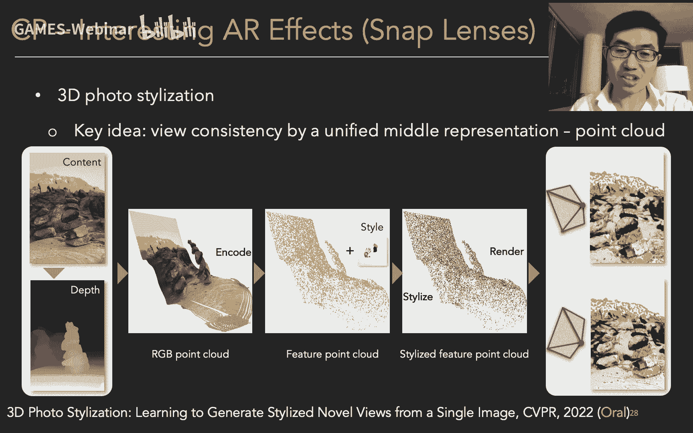

大家看大家来看一下这个嗯效果，这是另外一个结果，在这个结构里面呢，我们故意啊把这个人没有做风格化是吧，背景做风格化，接着的一个工作啊，在云上面素描，lder to ketch。

不知道大家有没有这么一个体会啊，就是啊当你看天上云的时候，尤其是啊看云的时间比较长了之后，你会发现诶你这个云像个什么东西，像个什么动物，啊啊啊，我在这边也暂停个几秒钟，大家看看这些语音像什么。

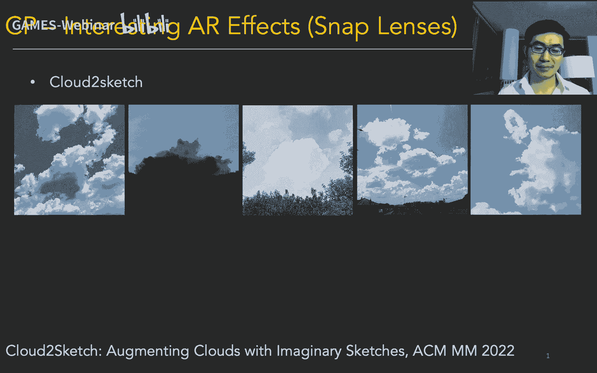

那我们的算法呢就是呃能够自动生成一些呃，素描，并且呢这个这个素描呢是跟这个云是非常啊，aligned啊，这个素描呢本身就是某种动物，比如说啊第一个云呢，我们把它自动生成出来一个象的素描大象。

第二个的话这个是一个浣熊，应该是这个呢是个狗，这个是个乌龟，ok这个是个熊，然后这边是个狮子狗吧，这边是个鹦鹉，然后一个很有趣的事情是什么呢，我对同一的原因，那不同的人嗯想象中的这个东西是不一样的。

那我们的算法呢嗯也能够做到类似的，比如说对于这一组云，那我们可以生成一组结果。

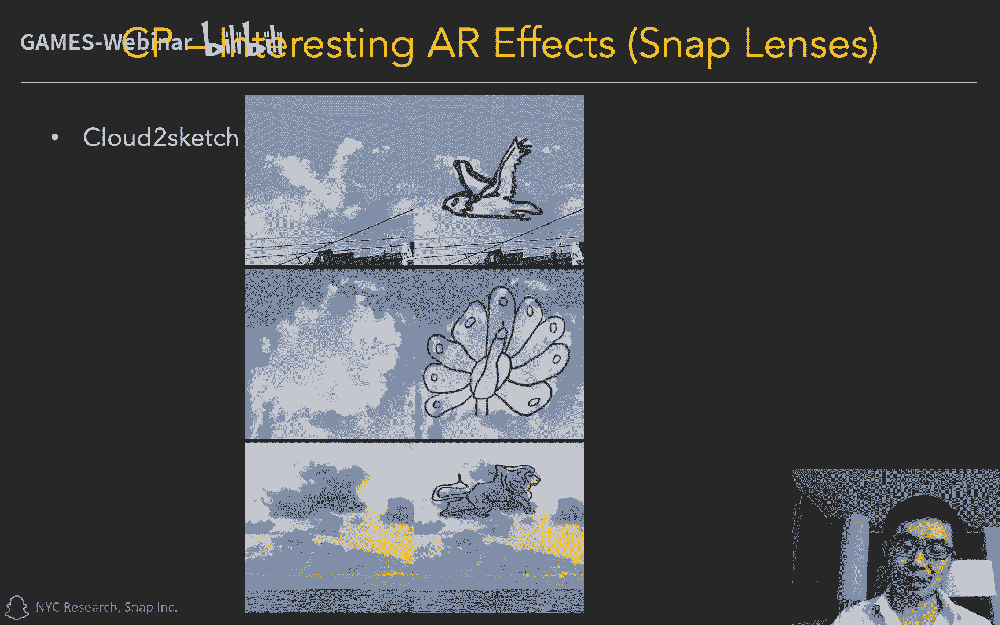

比如说这个鸟是孔雀啊，这是个狮子啊，那这个是另外一组结果，也是mac sense的比这是另外一种鸟，只是个跑线，这是一个相，接下来呢介绍啊心跳滤镜，新加滤镜是这样子的。

就是嗯用手机的前摄像头来拍摄一段你的呃，人脸的视频，然后呢从这忍者的视频里面，嗯可以估计出心跳的速度，比如说呃是80啊，一秒钟跳80次呀，嗯或者是一秒钟跳100次。

那为什么snap chat对这个方面的研究感兴趣呢，因为嗯心率是很多，其他呃snap滤镜的基础。

比如说呃心跳滤镜，比如a hara harness啊，健身滤镜，比如说你在去健身房之前，你测试一下你的心率，然后呢介绍完之后，你再测试一下心率，那如果这个区别比较大的话，就嗯摩尔生成上说明。

那你要认真健身了，那比如说嗯，我就嗯这个软件呢就会给你一些奖励，第三类呢是呃健康滤镜，那可以用这个嗯检测心率，来估计出你的这个健康情况，这个心率估计啊啊难点是人脸的运动，那如果人脸不动的话。

其实这个算法是可以是很简单的，比如说嗯我就呃比如人脸不动，ok那么我就在视频里面啊，只关注这部分区，然后呢对着去求一个像素均值，然后呢每一帧都会有一个值嘛，然后呢把这个值啊画出来，随着横轴是时间轴。

正直的话就是这个均值相对均值，那如果人人比如这个假人没有心跳的话，那么这个值就应该是个横线不动，那是真的人的话，他会有心跳，那么我们可以看到这个细微的这个波动，ok那对于这个呃波段线呢。

我们做一个频率的分析，比如分裂变换，那在弗雷德在频率里面最高的那个呃，pk就对应的是心跳，但是呢他人脸有运动的时候，那这个问题就会复杂很多，比如说啊这个slider里面这个人在运动。

ok那这个图呢就是啊，嗯比如说就这就是说对这个区域的一个，就是一个相对均值，那每次这个人脸有这么一个呃运动的时候呢，那么这个波动就会有嗯，这项目均值就会有非常大的波动，那这个时候如果我们还对这个呃。

曲线做频域分析的话，那么我们会得到一个错误的pk，在真实的这个心跳其实是这个这个值，那我们是怎么解决这个问题的呢，我们是生成一个新的video，这个video啊是我们自己render出来的。

那既然要扔了一个video，那我们需要什么呢，人脸的这个啊，geometry，人脸的abel，还有光照的信息，那这三个信息呢都是可以从这个input video，估计出来的。

我们先是估计出这个人脸这个gommi和rb的，那这个是比较简单的啊，比如说可以根据cdmm，那有了这个小米9和r b的之后呢，我们可以用比如说用30帧的信息诶，一起30帧的图像，一起来估计这个光照。

那估计出关照之后呢，我们可以来render如啊，每一帧，ok每每就是每一帧里面的这个人脸，那么这时候你再比如说取这么一个区域，求一个相对正值，那么可以得到第二行的这个曲线。

ok然后这个曲线里面是包含不包含嗯，这个心跳信息的，它只包含了运动信息，那我们下面可以很简单，就是比如说把呃原始的这个呃曲线，减去这个呃运动的曲线，那么就可以得到一个心跳only的这个曲线，然后呢。

然后呢，我们对这个嗯心跳oner的曲线做一个频率分析，我们也可以得到一个正确的心率，当然具体的算法不会是直接这么简单啊，这就删减就行了的，但是呢还拉瓦列是这样子的，注意我们这边啊，我刚才提到。

就是说我们嗯啊会故意说这人员这几米水，然后故意说故意说这个呃光照信息，这光照信息是根据这30帧一起估计的，而不是每帧估计的，因为啊按照每一帧估计的话，那么这个关照信息里面，其实包含这个心跳信息的。

那如果我们用30帧信息嗯一起估计的话，那因为这30日星期肯定是已经啊，包含了一个周期的心跳了，那么这时候估计出来的这个啊，关二信息里面是不包含线心跳信息的。

ok对于这个input video，那这个是ground truth的这个心率，那这个是呃前人嗯搜索方法的这个估计结果，那这个是我们的估计结果，可以看到我们的结果跟果然数值是更接近的，即使人在运动。

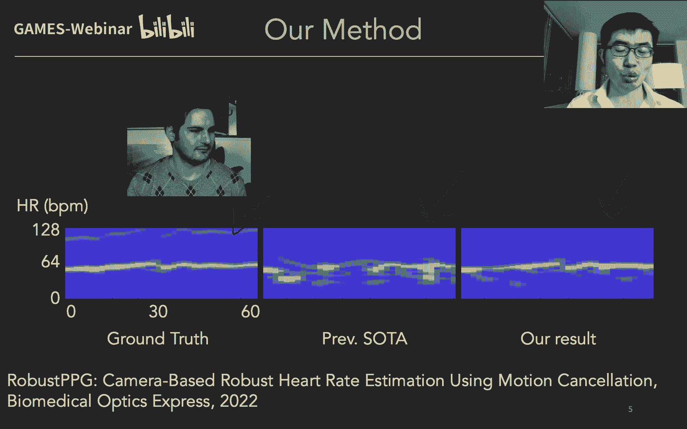

我们也能挥出准确的心率，接下来啊，我介绍一下我们在计算成像方面的工作，计算成像呢是啊呃硬件和软件的联合设计，在这里呢我会介绍三个工作，第一个是呃基于闪光灯的低光成像。

第二个呢是啊在啊自然有限下面的啊3d传感，第三个呢是透明玻璃的检测，嗯在我讲这个基于闪光灯的激光成像之前呢，我会我先回顾一下，就是低光成像有哪些方法，那激光成像呢一般包含两类方法。

就像我们的一类是什么的啊，带闪光灯的，一类是不带闪光灯的，就像我们的手机里面有说既有这个ntmode，也有闪光灯，那不带闪光灯的方法啊，包含什么呢。

呃single image best和a bimage best，然后呢a versal image best day，就是我们阐述的这个呃呃夜晚模式，他是怎么做的呢，他就是啊拍了嗯。

比如说十到15张照片，ok然后呢把这个15~15张照片一起融合，得到一张照片，这个single image就很好理解，就是说我的输入只有一张张照片，然后呢对这张照片进行去噪或者去模糊。

那基于闪光灯断方法呢啊又有啊好几类，那最基本的是啊使用白的闪光灯，那啊跟白色闪光灯呢其实有嗯嗯有些缺点，比如就像我在啊嗯最早的时候在，在今天套的早的时候说的就是这个啊，flash mage。

它这颜色不是很自然，正是基于这个原因呢，嗯人们提出来了，就是flash flash啊，比如说我们拍两张照片，然后一张是with flash，一张是with or flash，然后把两张照片进行融合。

初中flash初中flash解决什么问题的呢，啊对了，现在的手机一般都是初中flash，在啊网上拍照的时候呢，就是呃如果你的闪光灯是是什么呢，是比如说是白色的，是偏偏蓝的那种白色。

然后你的背景的话是那个暖色调，但那个闪光灯是冷色调，那这时候白屏之后照片是挺难看的，那驱动flash它本身是两个led，然后呢一个led是冷色调的白，另外一个led是应该叫做琥珀色。

ok然后呢通过调节这两个led的相对的强度，来这个模拟这个环境光的这个色温，那当你这个闪光灯的色温，和这个环境光的色温比较接近的时候，那你那么你的白平衡就比较好做，那出来了最终的照片就也会比较好看。

打开flash dflash来解决什么问题的呢，那是啥问，有一个问题就是他人他比较惹人讨厌，ok就是比如说啊谁用闪光灯来拍你了，那么你的眼睛肯定会不舒服，还有一个嗯他也是什么呢，比如说在餐馆里面嗯。

你如果你在吃饭，然后呢突然旁边有个人用闪光灯来拍了个照片，你会觉得非常奇怪，就是他不social friendly，那基于这个原因呢，啊有人就提出来了，就是说我要dark flash。

那就是人眼看不到的这个flash，那本质上就是呃正红外啊，或者是呃紫外闪光灯，那红外紫外人眼看不见，ok，那比如说我用这个相机拍了两张场，我拍了两张照片，一张是带flash的，依然是不带flash。

带flash的是一个就是连续是一个连l r e m，那不带不带flash的是一个noise rgb image，那我然后呢，我在用flash的flag的方法，把它们给融合得了一张啊。

非常嗯好看的一个rgb美剧，这个方法呢嗯天然气很不错，ok他有一个问题，就是嗯，我需要把相机的这个呃a r blog fter给去掉，就是说我们现在的这个手机里面，这个相机它是基于硅做的。

然后呢硅的话它其实是对这个嗯，从紫外到这个红外光都是可以敏感的，但是呢我们手机的相机，它其实是为了模拟这个人眼看到的这个信息，它啊嗯在这龟上面呢又加了一个air blog filter。

就是说把这个紫外光和红外光给过滤掉了，但是呢如果我想用这个da da flash的话，我还有我又需要把这个ar filter给拿掉，l blog filter给拿掉。

这样的话他才能让这个相机对这个呃ar light敏感，当我把这个呃嗯nel blue ftp去掉了之后呢，哎我晚上拍照方便了，但是我白天拍照怎么办呢，是吧，那这个是就是修改现有的这个相机的这个坏处。

那基于此呢，我们提出来的是stereoscopic dark flash，就是说我们这边用两个相机，第一个相机呢就是我们手机，现在的现有这个rgb camera。

那第二个相机呢啊我们使用这个nel camera，ok在晚上的话，我们会拍两张照片，比如左边左上角提供给我们这个noisy的耳机，并image右边照片提供给我们这个nel flash image。

然后呢我们把这两张照片进行融合，这样子的话在白天的话，我们只要左边这个gb开门就好了，但实际实际的啊做的过程当中，我们不是简单的，就是右边这个相机就是一个nel camera还是什么呢。

啊这边对相机是一个啊，他这个bpd是nel green green near uv，ok然后左前进是r g g b，然后呢这两个相机都有一个共同的channel green channel。

然后我们利用这green共同的green channel啊，做alignment，然后呢再做这个flash flash，如果没有这个共同的那个国人签到的话，那么做这个啊。

alignment或者气体分析还是很困难的，因为他们因为你想想把一个nel image，就是ln到一个rgb image上面，他们是处于不同的模态的，那这机的也是非常麻烦的。

我们因为有这个共同的channel i n i m的呃，就简单很多，red flash，那嗯不管是dark flash，还有这个stereoscopic dk flash，我们要么就是修改现有的相机。

要么是增加一个相机，那有没有更简单的方法，就是说我们对着相机部分做啊，不做任何改动，ok我们只改这个闪光灯，同时呢也让这个人，也也让这个闪光灯对这个人眼不敏感，也就比说人眼对这个闪光灯是不敏感的。

那我们发现其实是嗯有这个方法的啊，我们可以把这个闪光灯改成一个深红色的啊，这是基于什么呢，人眼的生理特性，就是人眼对在网上对这个深红色的光不敏感，同时呢相机的话对这个圣痕色的光。

也是依然是有很高的敏感度的，也就是说相机能够拍到一个很好的这个照片，然后呢呃人也是嗯看不嗯不会感到很刺激，接下来我会仔细介绍pon的flash，那闪光呢有一个啊fundamental problem。

就是说看不远，那python flash，就说哎我们能不能把对这个闪光灯做一些修改，使得什么呢，同样的power啊，我们能够看得更远，ok那首先介绍一下啊，reflash啊。

那为什么使用这个red flash，那我们来看一下这个人演的这个视觉系统，但这个呃环境光比较亮的时候呢，就是我们人眼人看到的图像，那我们就当我们把什么呢，把这个室内的光给关掉之后呢，嗯关掉那一瞬间。

我们人眼睛什么都看不到了，但是呢嗯非常有意思的是，在五分钟之后或者15分钟之后，诶我们的人眼睛渐渐的又可以看到东西了，然后散热风扇之后呢，唉我们也能看到非常多的东西，注意。

这时候呢虽然我们人眼睛能看到能看到的东西，但是呢我们看不到颜色，这个整个一个过程呢叫做暗示印，这是因为啊啊我们人眼睛里面有两种细胞，一个是叫做视锥细胞，一个叫做视杆细胞，那当环境光比较亮的时候呢。

我们人已经是用视锥细胞来感受外部世界的，然后呢视锥细胞它能够感受到颜色，那嗯当环境光比较亮的时候呢，呃我们用视锥细胞，然后呢这个这是视觉呢有一个专有的名字，叫做photopea vision。

然后呢嗯这是一些8吨，同样400nm到700nm都是敏感的，当环境光变暗的时候，那我们人已经开始用这个视杆细胞了，那这湿感谢巴拉啊，只对这个不能对颜色敏感，只对那个呃呃明暗嗯敏感，ok。

并且呢他对明明暗的这个敏感程度，要远高于这个视锥细胞，那他的这个呃city fashion是啊，长这个样子的，ok长这个样子，这边有个很有趣的现象，就是什么呢，嗯从视锥细胞到视杆细胞。

他们这个呃sativity function在谱上面是有平移的，你们会发现啊这个视杆细胞啊，但是在室外在视感细胞作用的时候，这个时候的视觉叫做score score topic vision。

那实感细胞啊，对于这个嗯深红色这部分啊是很不敏感的，但是呢相机呢啊，那设计出来就是对这个啊可见光部分400 700，400nm到700nm是非常敏感的，那干细胞对这对这个生活的部分不敏感诶。

那我们能不能用这部分来做闪光灯呢，那deep red flash就是基于这个id。

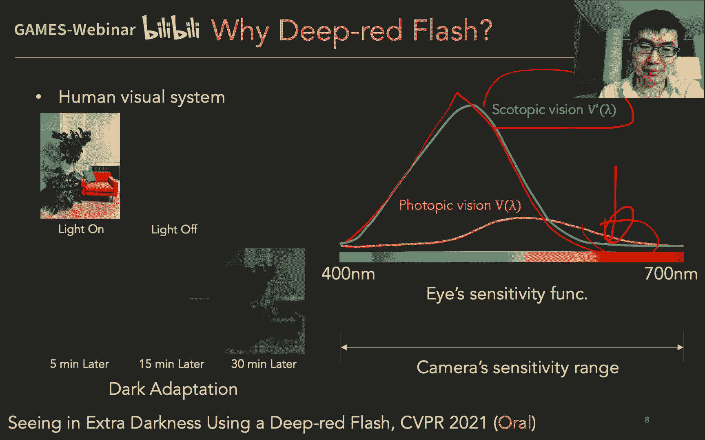

下面来看一下啊，结果那我们依然是拍两张照片啊，依然是带闪光，依然是不带闪光灯的，那不带闪光灯呢，这个照片呢就会非常的noisy。

那带闪光灯呢就会偏红色，然后呢我们使用这个融合的技术，这是我们的结果，可以看到呢我们结果里面有非常多的细节，变颜色也是对的，这个是视频的结果，那左边的话是啊，输入这个video。

右边的话是最终输出的结果，ok啊pattern flash啊，是另外一个是我们的另外一个工作，那python flash是来解决这个闪光灯的一个访谈变的，problem，就是只能作用于比较近的距离。

那当然啊这个啊场景离相机有比如10米远，我们其实开了闪光灯，我们相机也什么都看不，什么都看不到，原因是什么呢，这个物理定律就是这个闪光灯的这个强度呀，它会衰减的非常快，是随着这个距离的二次方进行衰减的。

那现有的方法要么就是increase power，ok但是呢equest the power啊，对这在移动设备上面是不现实的，因为移动设备上面能量是有限的，第二个呢就是说像一个手游电脑一样，就是说。

我把所有的光都集中到一个很小的范围里面，但是呢因为我们这个对手电脑是work的，但是呢我们呢我们是为了拍照，这个时候呢就嗯如果我们还有这个方案的话，那么这个视野会受到很大的限制。

这是我们的方法，我的方法就是说嗯，从这个传统的闪光灯触发闪光灯，闪光灯就是说各处嗯能量都是一样的，那我们能不能就是说对这个闪光灯就在空间上，就是local里把它给能，能不能就是会遇到一点。

ok会遇到一点，会遇到一点，这样的话嗯，生成我们这种flash叫做pattern flash，就是一个一个的dot，然后在那些dot的地方的话就会比较亮。

这样的话有什么好处呢，当我们使用这个啊传统的flash的时候，就是每个地方它的能量都是一样的，嗯当这个场景的距离比较远的时候呢，然后相机一有噪声的，那这时候啊比如说这个场景的这个edge信息。

那可能以下的这个信息，都会在这个noise符号下面。

那其实什么都没有，但是如果我们使用这个python flash啊，我们可以保证什么呢，在那些有些dos的地方，那么这个信号其实是高于这个noise floor，然后呢呃既然图像就是呃有这个呃吸收特性的。

ok那自然自然有些冗余，那么我们可以通过这些sparse的这个地方，得到了这个信息，然后把整个图像给恢复出来，同时呢我们有这个理论证明，就是说这个啊。

即使对这个普通的这个呃传统这个unit or flash，我们做这个local average，我们的这个python flash依然有更高的性价比，具体的可以看我们的paper，接下来我们看一下结果。

嗯左边的话嗯修了一下，就是我们这场景是怎么拍出来的啊，比如说我们一个呃红色的大巴啊，我们有呃，比如说相机，然后呢有一个flash，ok当我们使用啊panel的flash的时候。

我们拍出的照片是长这个样子的，那我们使用传统的flash啊，same power诶，那这是我们呃呃喜欢长安常常光灯拍的照片。

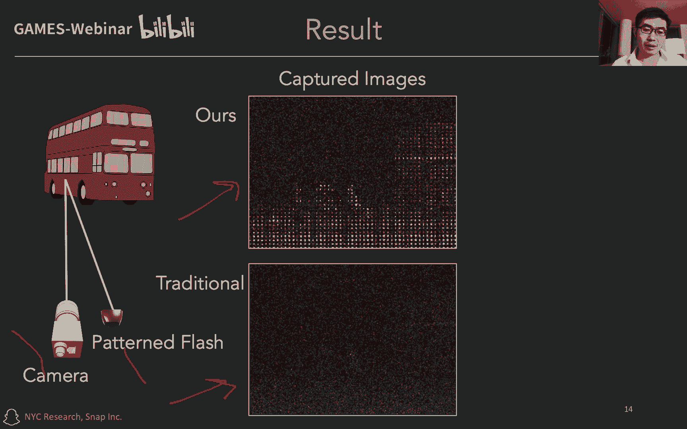

然后呢我们用啊去噪算法，ok那呃这这这就是啊python flash的结果，那这个是传统的flash，结果可以看到呢，我们的嗯结果里面包含更多的细节，比如这个人啊，然后这个空啊之类的，同时很有意思的是。

我们的方法呢还有一个额外的好处，就是可能get到depth，因为啊我们有个相机，然后呢还有一个python flash，那这是这就是一个结构系统，在具体的算法里面呢。

我们这depth啊和这个图像是一起估计的，这个是另外一个结果，这是嗯实上传统的闪光灯拍的照片。

这是使用我们的闪光灯拍出的照片，并且这里面呢并且我market到了depth，ok接下来介绍一下啊啊资源有限的情况，下面的呃3d传感的工作，比如说在这个呃ar格子上面，ok要做这个结构光，那会面临哪些。

困难呢比如说我们需要这个结构，光系统是非常compact的，就是非常小的，然后呢耗的power也是非常少的，然后几率是非常高的，基于此呢，我们提出来了啊，叫做微机线的结构光。

ok它的核心idea是什么呢，呃就是当我这个当我这个什么呢啊，相机和这个投影仪它的距离是非常近的时候呢，啊我可以用这个啊first一阶的这个taylor展开啊，来近似，然后呢，把一个非线性的啊。

实验过程变成一个线性的实现过程，这样的话这个系统就会更加好解，其实这个idea呢在啊很多地方在计算视觉里面，很多地方都会用到，比如说嗯光流的计算，举例来说是这样子的，当这个啊相机合作的推移啊。

处于同一位置的时候呢，呃这个是一个图像的这个生成的过程，i x等于rox y乘以p x y，然后这个a的话是image，ro的话是rb 6，p的话是这个pro投影仪导数据的pattern。

但这个极限的话不等于零的时候，这个是新的啊，成像模型，那r x等于rox r b的，然后乘以这个pattern，注意这个python这个时候有了这么一个呃u xy。

那这u x y就叫做disparity，然后这departy是跟这个depth是相关的，我们只要求出这个ux就能得到这个depth，但是呢注意这个成像过程其实是非线性的，但是呢有意思的是。

当我这个best line非常小的时候，我们其实可以用这个一阶展开来近似整个公式，那就把这个一个这么一个努linear的一块钱，变成一个linda一块形。

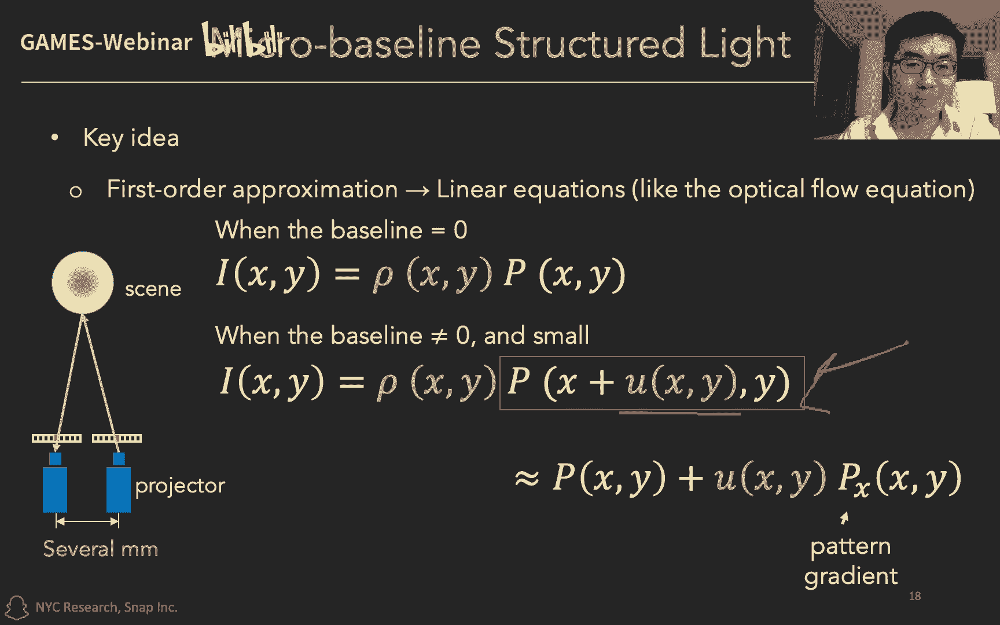

啊这个是实验设备，注意啊。

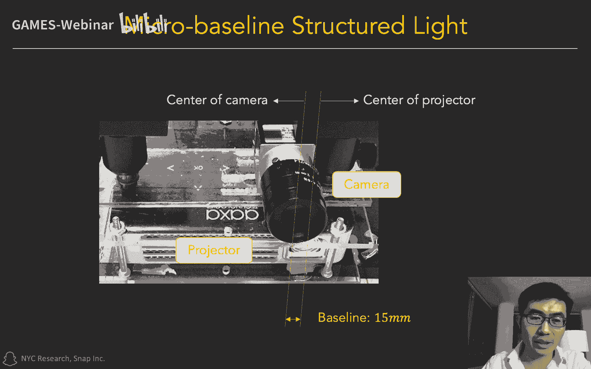

我们这边相机或者推移它的best line非常小，比如只有15mm啊，这个是实验结果。

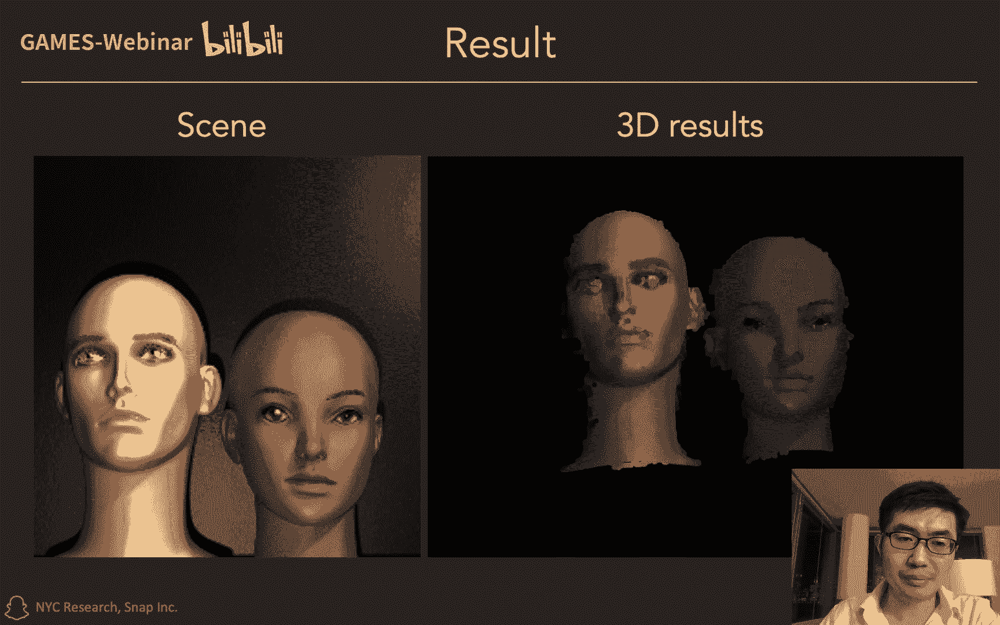

这是另外一组实验结果。

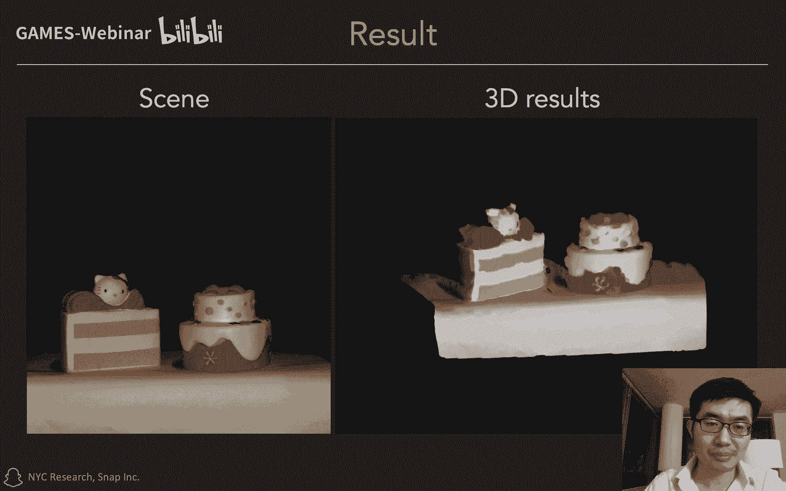

接下来呢介绍一下我们另外个工作啊，透明玻璃的检测，那在介绍之前呢，我们先来看一下哥哥的满目。

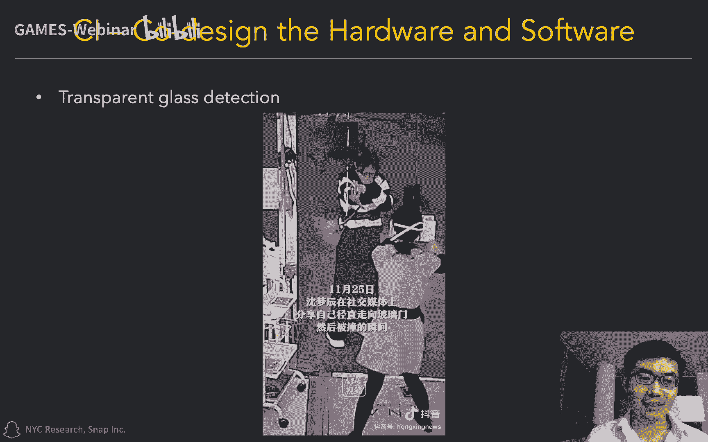

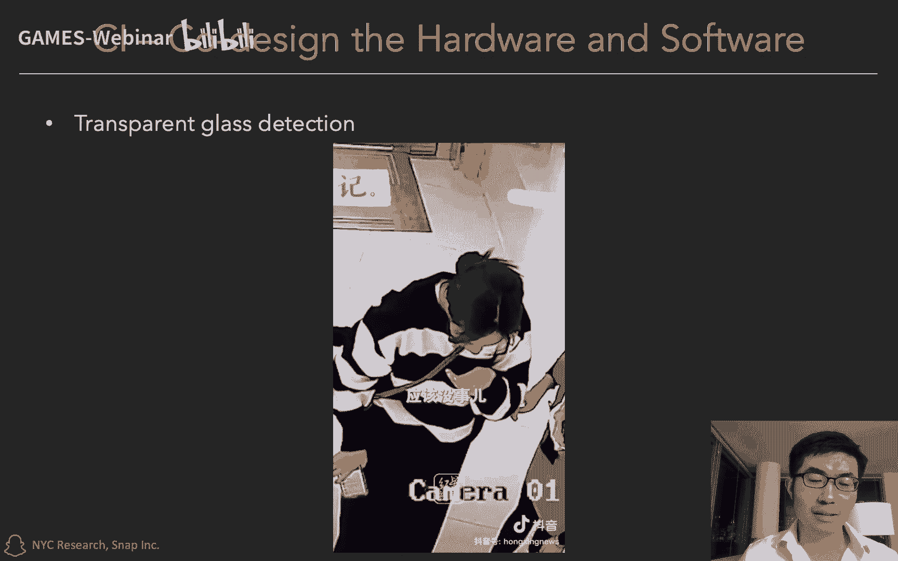

抖音因为什么呢，这个玻璃啊擦就说擦得非常的干净，然后呢，嗯这位女士呢就是没有看到前面一个玻璃，然后撞到了撞到了玻璃。

这玻璃检测，这透明玻璃检测其实是非常困难的，那我们怎么做的呢，我们是通过观察这个玻璃的这个呃啊，transmission curve，ok根据这个transition课文，我们来设计我们的方案。

那么我们观察我们观察到什么呢，叫玻璃在这个可见光部分的，光照线的透过率是非常高的，但是呢在这个呃远长按就是远红外部分，它的通用是非常低的，那么嗯居此我们就提出来使用啊。

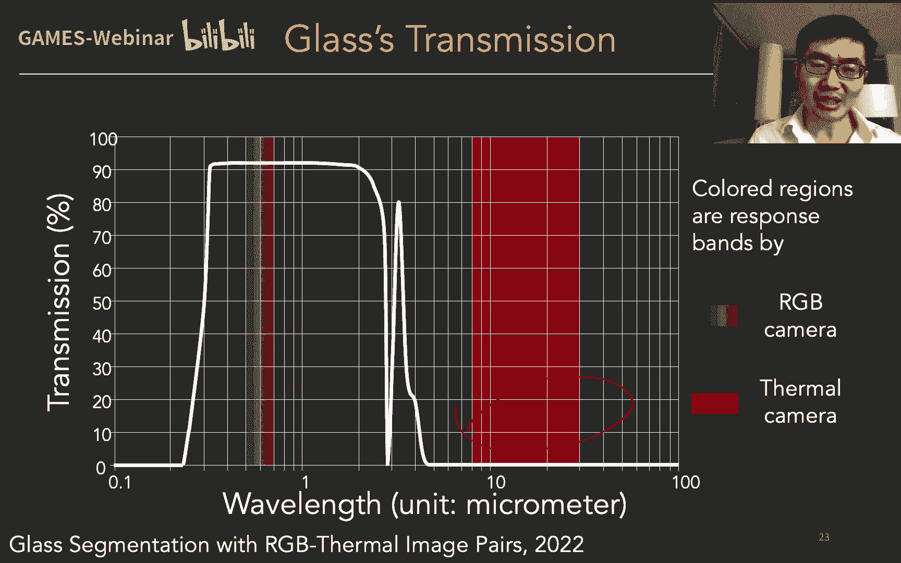

rgb和simon这个camera pe，ok当我们没有玻璃的时候，我们使用这个rgb和sumer camera bear来拍照片，那两个图片里面都会有这个都会有这个tra，当我们有这个玻璃的时候呢。

啊somebody image里面就没有这个ree了，ok那基于这个difference，我们就能分辨出啊前面有没有玻璃。

那这是一个呃呃一个人拿着一个玻璃，然后呢被这个r g b summer camp拍照片的结果，那如果只看这个左图rgb image，那我们很难分辨出其中哪些是个玻璃。

但是呢当我们把两张照片一起看的时候呢，我们知道了哦，这个人手上有一块大玻璃，那这边修出了一个呃我们算法的结果，那左左边的话是rgb image，中间的话是somebody image。

右边的话是我们的结果，但如果只看这个rgb image的话，其实我们很难知道，就是说啊这和这哪儿是不是玻璃，ok但是结合这个sumer image，那我们就很容易分辨出来啊，哪儿是真正的玻璃。

一个很有趣的问题是什么呢，就是我们的算法在未来还能work吗，就是在未来你那玻璃可能是一个别的材料做的，那我们上面还work吗，经过我们的分析，其实我们方法在未来还是worked，为什么呢。

因为既然是玻璃，那么当然我们这边柜主要指的是窗户上的玻璃，或者门上面的玻璃，那既然是这样的玻璃的话，一般都有两个特性，第一个特性是它啊在人眼睛，人眼睛看上去是透明的，那第二个特性是啊，它要是隔热的。

那既然是隔热，那就是什么呢，那我们的这个方法呢正是基于这两个区别，就是说在一二再再再再一一块通过一块不同嗯，在在另外一个地方是不通过的，未来的玻璃也依然符合的特性，所以我们的话依然是worked。

最后呢嗯介绍一个啊偏科幻的一个研究工作，透明的相机，那这个透明相机其实啊是啊，嗯一个非常有趣的一个概念，在这个具体介绍这个工作之前呢，我们来看看这个透明的鱼，ok这是一个真正的鱼啊。

这个这个真正的鱼它净化了1。4亿年，ok把自己的身体给净化给透明了，但是呢眼睛依然暴露了，暴露了他，ok那说明什么呢，把自己的眼睛进化成透明的是非常的困难的。

ok透明相机是非常啊，是是有点反直觉的，为什么反直觉呢，因为如果相机如果一个相机是透明的话，那么这个scissor怎么来接收光呢，因为这个光不是已经透透过它就跑了吗，ok另外一个是什么呢。

如果这个相机是透明的话，那啊这个从这壳子这边进来的光器，不是会打到这个cs上面的吗，那这ser岂不是会收到很多很多的杂散光吗，那我们是怎么解决的呢，这边有点像嗯解一个puzzle。

ok大家可以记住一下啊，我这边说的这个solution，然后呢嗯大家最后可以回味一下，到底是为什么会work，那我们的方法呢，嗯首先要求这个sensor和这个kiss。

还有这个length上面会有coating，ok然后呢，这个sensor和cocs上面的coding是互补的，就是相反的，这样子的话使得什么呢，这砸这个通过这个cast的杂散光。

不会被senator给捕捉，同时要求这length这center上面的coding要是一致的，这样子的话，通过这个length的这个光，能够被这个ser给捕捉到，当然了，我们经过再进一步思考之后。

发现这个length上面其实是不需要这个coding的，也是work的，第二个呢是需要这个sensor上面有这个啊gap，ok就是说比如说呃基数列依然是pixels，偶数列就是完全的是空白，就是镂空了。

这样的话啊在宏观上看的话，就现在依然是半透明的，然后呢呃这个是我们的culture image，ok啊，然后呢，基于这个呃自然图像是呃，空间是冗余的这个特性，那我们可以采用这个图像复原的方法。

可以得到可创建出这么一个图片。

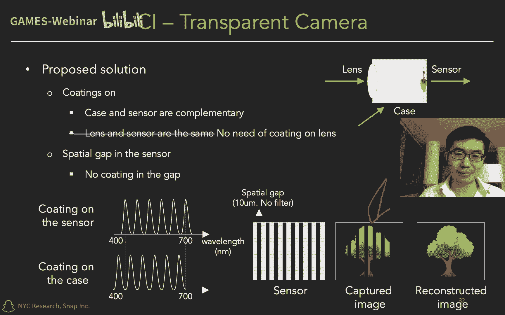

这个是render出来的一个相机的一个效果。

那这个是一个非常有趣的地方，就是这个透明度的分析，从不同的角度来看，这个相机啊啊都能够啊看透这个看透这个相机，比如说如果眼睛在这边的话，那么会有一半的官网可以突击过来啊，不管是从光是从还是从这儿到的。

还是这儿的，ok如果相信如果这个眼睛在这儿的话，那么，这儿有1/2的光可以拖过来，这样的话会有1/4的光给拖过来。

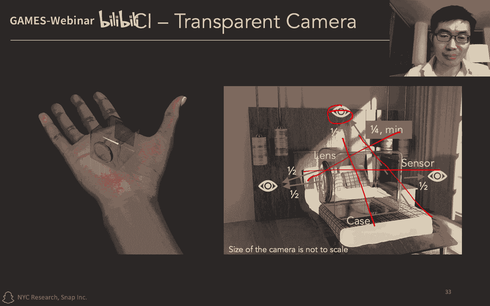

那在我的top最后呢，呃我用snap slogan来解说今天的talk啊，snap是一个相机公司，我们相信呢，相机可以让人们的生活和相互之间的交流，更加有趣，那基于我们公司的啊两大核心产品。

一个是有3亿用户的手机app，另外一个是行业领先的ar glass，团战里面可以提出提出来很多的哎，有趣的和呃实际的计算成现和计算摄影的问题，比如说啊手机app里面有这个计算摄影问题。

包括图像修复和图像的编辑，主线编辑，用图片编辑来得到一些有趣的这个滤镜，ok那在这个增强现实眼镜里面呢，会有啊计算常见问题包括这个呃sensing和display，那我今天的top呢只含只包含了啊。

我们做了现有的工作里面的一小部分，那请大家持续关注我们嗯的其他的研究工作，在未来呢啊我会在我的主页上面嗯一一展示。

