# 嘉宾座谈：智能光学仪器中的感知与计算 ｜ GAMES204-计算成像 - P1 - GAMES-Webinar - BV19d4y1d7oo

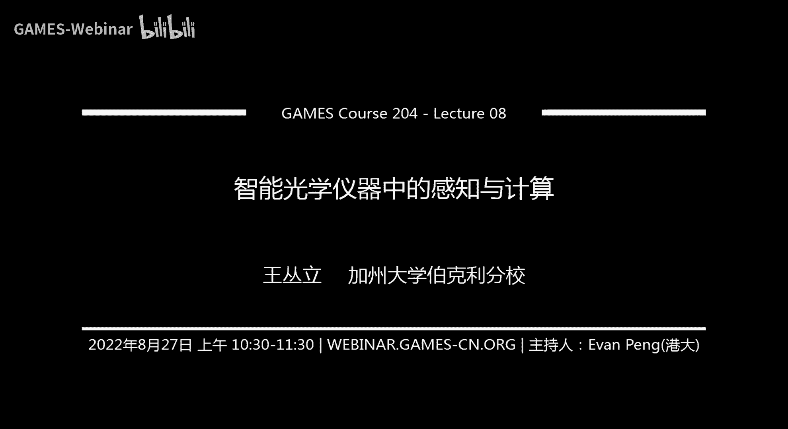

ok我们差不多开始啊，各位同学上午好，那欢迎回到games 204计算成像的课程啊，非常道歉，就是我们这周由于这个时差的原因，我们有gler，所以我们把这个课程从昨天晚上常规的周五晚上的时间。

调到了今天上午，就非常感谢大家，周末上午还早起来啊，参加我们的课程内容对，然后从下周起我们也会回到这个日常的周五晚上的时间，请大家继续关注我们的这个课程通知，那今天我们非常荣幸啊。

邀请您到了来自加州大学伯克利的王崇利博士，对，那他现在是在加州大学伯克利cs这个答案的博后研究员的工作，那师从的是这个广场成像以及观察显示领域，大家非常熟悉的ng嗯新生，然后嗯做的是一些跟视觉相关的。

然后有一些计算成像的工作呃，崇利博士之前是在cost啊，是从计算成像大佬wolkpatches，在之前是在这个天大拿到了本科学位，那他在本科期间也在哈佛大学进行了一些访问和交流，然后大家如果有问题的话。

欢迎随时在这个弹幕评论，区留言也欢迎这个后续可以在啊，有些交流活动对我们可能大概就是在一个小时之后的这个时间，我们会有一些呃更多的q a，那王博士也会在线给大家分享一下。

对这个留学对计算成像一些感兴趣的问题，我们把舞台交给王博士，好的啊，谢谢谢谢啊，一帆的介绍，然后我现在分享一下我的屏幕，大家可以看到对吧，ok贵，那我们开始吧。

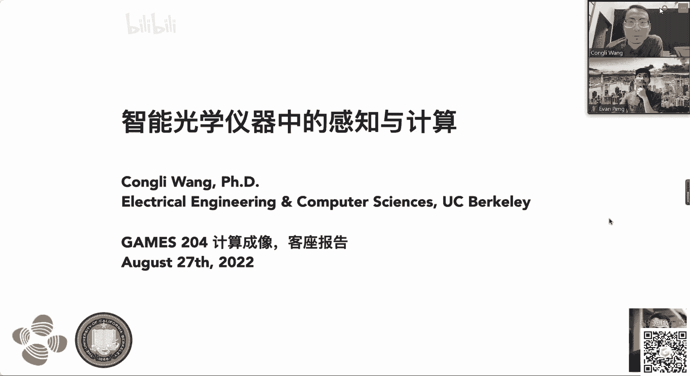

然后今天的主题主要是讲讲智智能光学仪器中的感知和计算啊，然后这个是这个agenda，但是啊我们这个课走一个半小时，所以说可能有点紧时间，我觉得我主要想提的主要是讲一下我博士期间的工作。

就是做这个计算模型传感器，然后以及另外一个我想重要想分享的是这个我们我不是后期做的工作，这叫auspicion啊，这是这是全世界第一次在中文平台上面公开我们的研究，然后我觉得会非常巨大的。

肯定会大家肯定会非常感兴趣，这个内容哈好好就这样，首先第一个部分啊，就是讲它这个波形传感啊，啊首先就是我们讲一下什么叫什么什么多钱对吧，就是为什么呢，因为当你观测星星的时候，因为大气的大气湍流。

所以这个星星会发生这个会有这个啊肉眼可见的这个模糊对吧，因为这个大气团又改变了这个呃空气的温度，然后温度的变化改变折射率，然后所以说光线不能完美的聚焦到一个点，所以就会产生一个问题，然后天文啊。

天文学家大家就用你这个叫自适应光学去校正这个即便播前，从而得到一个呃很很锐利的一个图片，然后除了天文的话，就是但是在在这个就是在显微镜里面，就是比如说啊左边这个图片呢是这个叫名场显显示的图片。

就是就是你像我们小学初中用的这种显微镜去拍这个，这个是我个人的，这是我的口腔上皮细胞，然后你会看的话，你会发现他大部分是透明的对吧，然后你很难看到一些他组织本身的一些细节，右边这个图的话呢，就是啊就。

是如果你能获得它的相位，或者是说他的啊这种啊相位的这种就是就是光啊光程变化的程度的话，那么你就能得到关于这个样本更多的拓扑的一些信息啊，这都是啊，这都是这个拨弦或者是叫相对更有用的部分。

同时的话在这个眼科也会有很多应用，大家像你像我的话，我是近视，我需要戴眼镜对吧，就是因为我们的人的眼睛不是完美的，然后他总会有各种各样的相差，然后这个象它怎么去描述呢，就用拨前去描述啊。

一般我们是就是就是描，述这个嗯这个呃即便拨弦偏离理想啊，理想球面的这一个程度用来这个来，用来用这个来表示你的这一个眼睛的这个相差的大小，然后这个很有用，是因为比如说你要配眼镜。

你要测这个度数和你的闪光对吧，就是所谓的defaulus是和这个cmd c对吧，然后两种毕业相差，然后或者是你做激光手术，你也需要先知道你的这个近视的程度，然后才能去做手术，所以这些东西都很重要。

所以什么说微风的测量是很重要的，就是播前的测量是很重要好，然后呢拨弦很重要的话，我们怎么去测量它呢，这，就是所谓的via sensing啊，然后这个问题很难，为什么呢，是因为呃播前呢。

它是一个它是一个关于这个光传播的这一个不同光程差的，这个这个问题，像左边这个图啊，像有个波前，这波线怎么描述呢，就是说你可以认为这个波前是在从同一个点发出来的所有光线的集合。

但只不过呢因为一些因为成像系统中的一些一些问题，但是呢这个球面波发生了一些变化，就是嗯然后这个球面不上这个这个曲面上每一点的这个法线，方向就是你可以定义这一根光线。

然后我们想要知道的就是这一个啊这个表面的变化，然后这个测量很难，为啥呢，是因为如果你从几何光学的角度出发，因为我们人类的传感器是是只能检测到这个光的强度的变化，它检测不到光的项目，光光的方向的变化。

也就是说你像我同学那个图画的就是同样一个这个这个pixel对吧，它只能检测到这个这一束光到底有多强，它不能解释到这个光从哪个方向来的，然后呢，那怎么办呢。

然后嗯我们的我们的光学工程师就想出一些很好的想法，怎么去测量它，比如最最最经典的就是用这个维通讯阵列，就是把一个通讯阵列放在这个这个传感器前面，然后呢你像左边那个图，就是说当你的拨弦是平的。

比如说你是啊这个这个这个这个成像点的，这个这个这个误点是无穷远的地方，然后那么它出来的平面波就变成了一个呃，呃球面波就变成了平面波对吧，然后这个平面当你有平面波的时候。

那么每一个微通阵列都会都会都会聚焦到同一个同一个聚焦点，那么你就能，得到这个啊这个嗯就是就是regular sample的这个点阵，然后当你有畸变拨弦的时候，就是右边那个图bug的时候。

那么因为因为拨弦的存在，所以说每一个这个法向方向的光线都会有微小的偏折，然后这个微小的偏折，我们根据这个呃，就是就是这个这个最简单的这个这个叫薄透镜成像公式，你就能你就能知道这个这个光线。

它它中心的光线肯定是曝光过，光线肯定是肯定是不会不会变的对吧，然后就能你就能推测出这个每一个这个拨弦上的每一个小小小区域，对应的这一个没同层，另外后，面都会成一个小的点，然后这个点会发生。

你就可以可以看到这个这个点，相当于原来这个平面膜会有一些小的偏移，而根据追踪这个这些需要点的偏移程度，那么你就能反过来求解过程，然后除了刚刚说那个男的那个呃波形测量的方法。

然后还有这种更更更加就是更加复杂的一些光学编码，比如这里的话，它是用一个叫剪切干涉，很像哪些干涉的一个一种方法，就是就是不用为通讯阵列，但是用这一个啊这种周期性的这种这种啊叫什么啊，叫规定对吧。

就是这个光栅，然后去得到这，样的啊，这样的这个这个点阵，它的点赞会发生变化，然后就重新把它解出来，这个原因就是因为就是如果你用这种微信链的话，它最大的问题是横向分辨率比较小对吧。

因为像我这个图里面画的就是你这么这么大的一个一个市场，但是你只有三个维通行证，那么你能测量的有效的拨前的数量就走三个对吧，然后这个也相当于是你这么这么大的市场，只能采采用三三个点，然后这个不是很有效率。

就是为什么他们其他的研究，横向剪切干涉，他们就提出用这种啊光栅去去做，然后去提高分辨率，因为你看这里的这个点点的数量变多了对吧，也就是它有效的这个分辨率变多了，然后他就可以呃去改进它横向横向的分辨率。

然后除了那除了那些之外的话，然后还有这种啊，就是叫基于这个courage sense，就是就是基于courage sensing的这种这种方法。

就是用去求解这个呃transport intest division，就很像这个光线传输方程，然后去求解，然后就像这种方法的话，你是需要呃要需要多这边的图的图像在不同的轴向位置的呃，去测量，然后去求解。

然后你，才能得到这个过程，然后有那么多的拨弦啊，波形传感器对吧，然后一个很自然的问题，然后这就是我啊，但是我们不会讲很多低调，我们会告诉你这个结论是存在的。

是我们的确可以用统一的理论去去表述他们所有的现象，然后呢既然我们有了这样一理论的话，我们自然而然会想什么样的一种玻璃传感器，可能是比较比较呃，比较最优的，就是在某些角度中，从某些这个性能角度上讲，它。

是它是它是最优的，然后这就是啊我今天主要讲的呃第一个动作，这这这是我我之前博士期间做的一个工作，就叫做cod播放先手就是编码的播音传感器，然后是是怎么样的，就是嗯还是跟之前的传感器一样啊。

但是我们唯一的区别就是说我们不用这个return列，或者是不用这种周期性的这种啊光栅，我们用一个随机编码的一个啊binary的一个empty mask是什么意思呢。

就是他就是我们呃在这个神色前面非常短的距离，像比如说1~2mm的地方，就基本上就是把这个mask紧贴的这个玻璃放置，然，后做一个啊，这个mask是啥呢，就是就是一个随机分布的一个零或一要么透光。

要么不透光的一个很多个随机小孔组成的一个眼膜，那为什么要做这个呢，这个主要的目的也许是这样的，就是我们之前对这个播音传感器的这个建模，然后表明啥呢，是这个微动传感器的性能啊。

它其实完全不取决于你前面这个光学元件放的是什么，你可以放这里，也可以放在任何这种规定，最重要的是这个这个嗯你放置之后，你就是你需要去思考它的这个理论分辨率，和它这个后面后和后期计算的这个，啊成本。

对然后所以说我们做的这个工作，就是因为我们认为呃前面的oopoptic是对他影响不是很大，然后这个现在是这样work的，就是首先左边这个这个图片还是一样，还是跟我们之前一样，是没有任何机边拨弦的时候。

我们测我们先测量一个眼颜色啊，斑为什么会有颜色斑呢，为什么它它原来是零和一，但是后面我们得到了，甚至得到图片确实是就是灰度的，就是因为这个距离特别小，然后这个颜色会比较大。

因为这个百度remark的这个feature size很大，然后当你有即便拨浅的时候，这个颜色啊衍射斑会会随之移动，然后每个每个像素颜色斑的移动呢对应于那一点播前的呃，很像梯度，老这样说可能比较绕。

然后这里有个ination可以展展示一下这个这个这个原理是什么，就是当你把这个mask放到这个cs前面的时候，然后再在这个在平行光的照射下，然后你就会看到像这样的颜色般啊。

然后这个是simulation，但不是实拍的，但是我后面有个实拍的图，那为什么会看到这样的原因，就是因为这个距离像我刚刚说的是1~2mm。

然后前面的这个mask的feature size是每个像素是啊16微米左右，16微米左右，然后就说他这个有的时候隐隐的效用会比较会比较明显，然后左边这个的话是个是个gif动图。

就是表示的是当你没有级别模型和有级别拨弦的时候，你拍到的身体上拍到的图片是什么样，然后如果你仔细看的话，你会发现这个也是也是还等会做行为的改变啊，然后这个改变就是我刚刚说的就是每一个像素的移动呃。

代表的是那一点拨前的横向梯度，也就是中间这个图这个这个这个矢量图表示的，然后在这个情况下，仿真的是个这个高斯波前，所以你可以看到高斯波前打扰一下王博士，稍微打扰一下。

那个这边是有一些同学在这个b站上面会有一些问题，所以可以关注一下，看一下，那比方这边有一个同学问到说啊，这个wave sensor的标定啊，这边刚刚你讲到了需要一个平面波。

但是通常来说这个用于标定的平面波很难是比较理想的，所以有没有一些comment啊，这是个非常好的问题啊，然后我想提的是，其实所有的微风cs都是治标定的，换句话说，比如说当你的这个平行站的这个平行光。

你固定的时候，如果你在同样一个照明条件下测量你的畸变前，那么你的即便拨弦只会在这一个原来的这个呃，拨弦上面发生一个偏移对吧，因为微风设置它只是测量的是你相对于参考参考波形的变化对吧。

也就是说你的这个标定你不需要非常完美的平面膜，你只要因为它是个自标定的系统，它跟参考参考波前的形，具体形状其实是没有关系的，就是在补充一下，其实大家可以理解为。

就是目前slice这上面的b减一的过程是一个相对的过程，对是的，说的很对对，因为为什么呢，就是就就就就就就是因为这种这种传统的工程师啊，他们都是你像我这个前面写写的是slope space。

就是就是所谓的这个基于梯度的，因为你想看梯度的话，你对波全球的梯度，其实你完全没有关于梯度绝对值的信息对吧，也就是这个dc turn，就是这个这个这个常量是是不重要的，对不对是吧。

就是说这个参考其实所以它所以它是个自标定的过程，ok好的，谢谢，那可以继续往后面再讲下去，对我们后面可能还会有一些问题，那大家随时留言提问，谢谢啊，可以可以好的好的啊，好然后然后刚刚说到这个啊，我看啊。

对对对，然后就是好，然后那么那么它的每个像素的变化，就就是就是就是编码的这个波形的梯度啊，好那么如果我们能解除这一个梯度，那么我们在这对这个题目出的就积分，我们就能反向走到拨前对吧。

然后就是右边这个图表示的，然后这个地方因为拨弦是个高斯，然后我只是把它做了这个二派，这个呃这个磨平，因为他这个这个fish是周期性的数字，然后然后就是这样做的，可作为可视化让大家看一下。

然后怎么去求解这个问题呢，然后我们可以写这样一个非常简单的一个数学公式去表示它，然后像像这个公司怎么推的，然后在我之前的文章里面是有大家可以感兴趣可以去看啊，但是我在这边不会仔细讲。

就是左边这个动图呢是我们两张图片，一张是我们标记的图片，第二张是我们有级别模型的图片对吧，然后我们的目的就是就是求解每一个像素它的位移对吧，然后这个像素的位移啊，就是跟什么成正比呢。

跟这个先跟这个跟这个呃这个mask跟这个选手之间的距离z成正比，跟我们所所考虑的参考参考这个啊，参考这个拉姆塔，就是就是我们的这个波长是成正比，然后以及供我们的这个波形的梯度成正比对吧。

然后这个问题其实就是最最经典的这个叫计算机成像，计算机视觉里面的光流估计的问题，然后我们如果能解除这个sp之后，我们再做积分，就能得到这个波前，然后这是我们后台的一个sensor。

就是就是我们就做了个mask，然后把它放到这个三的前面，右边是实际拍的，这个在平行光下面的这个这个这个defcon老师，然后把这图放大了，可以给家给看一下。

然后这个这个python的确是有很多高的频率的，这些这些这些小小的点，然后这下面是一些实际的一些重建的一些结果，左边是实际拍摄的图片，右边的是重建的拨弦。

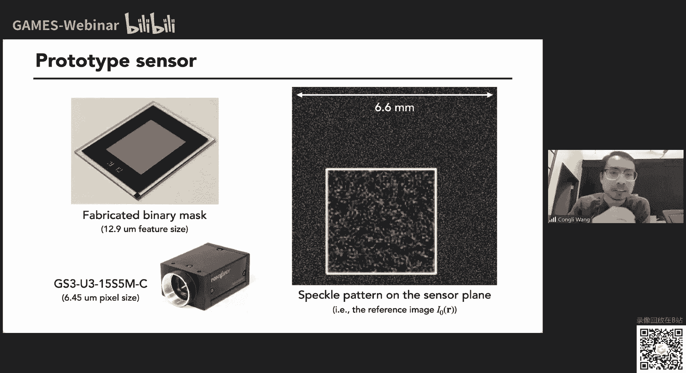

像这这个这个地方是个球面波，然后这个呢是一个啊是一个大气湍流的，这是一个热空气湍流的一个一个结果啊，这是另外一个啊，时间有限，所以我过得很快，但大家大家有兴趣的话。

可以可以去仔细看那个文章，因为我实在是很多，然后我我就我我觉得后面的更重要啊，然后我们还做了一些实验去表明我们的这个精度的确是可以的，然后在这里的话我们是用一个sn，就是这个叫空间光调制器。

然后去产生这个这个实际的拨弦，然后用我们的生产去测，然后这是右边是结果，可以看到这个这个error很小，然后最关键的是这个算法其实可以做的很快，然后在gpu上的话，我们可以做到50帧每秒。

就是我们的我们的这个，你可以看到这个地方有我们搭这个非常小的一个设备，然后我们的微分在上面我们可以直接插到这个外星人笔记本上面，用它的gpu直接跑，然后这里这里是一些额外的一些这个视频的一些结果啊。

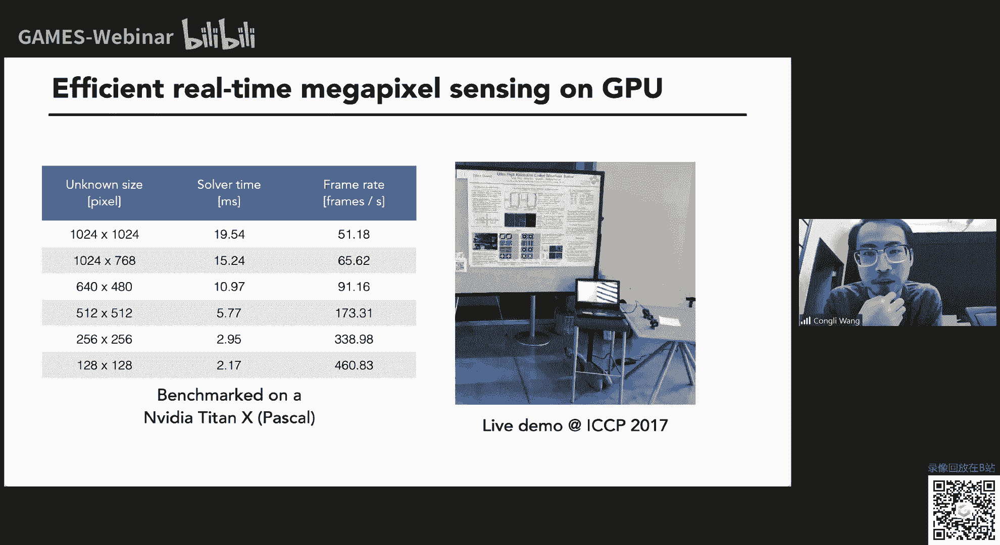

像这里的话是最简单的一个词，它这个非常简单的一个，就是这个目的就是给大家看看这个demo是怎么怎么work。

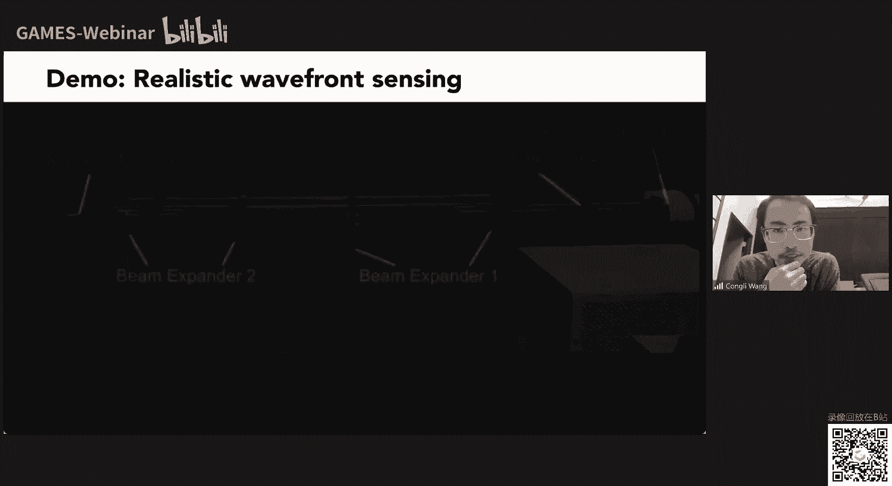

嗯你像这个地方的话。

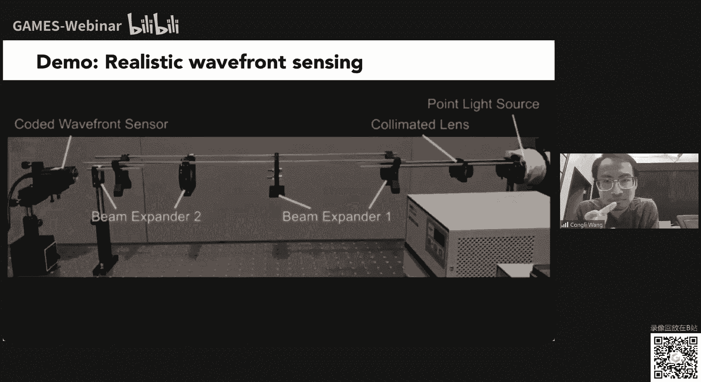

我我是给他呃，用打火机给它加热空气，然后我们空气我之前说过，空空空气这个温度的变化会导致折射率的变化，所以这个拨弦因为折射率变化的话，这个每个光线传播它也会发生变化对吧，然后就会有等等等的波线。

我们可以测出来，另外一个的话就是做这个default，就是如果我移动其中一个透镜稍微移动一点啊，然后就能看到这个这个球面波的变化，然后你就可以看到这个这个球面博士怎么变化。

然后刚刚那个是刚刚那个是这个sense的这个呃基本原理。

然后，然后呢我们就我们家有个这样的sensor对吧，然后我们就会想要做一些应用啊，然后有什么应用比较好呢，像像像第一个应用的话，可能就是自适应光学，因为我之前也说了，在在天文里面自适应光学是很重要的。

因为什么波形传感器很重要，就是因为它能测量拨前得到拨钱之后，你就能对这个波形做校正对吧，然后这这这这是我们之前的一个呃一个应用的一个文章，就是用这个vivo sensor去做自适应光学。

然后这大概是这样的啊，就是我们我们自己搭了一个自适应光学的一个系统，然后当有，这个当有当有这个这个呃即便存在的时候，然后你像这相机拍到的图片就会比较模糊对吧，像中间这个情况。

这这这这个情况是我是放了一个ls啊，右边是我们这个做完a o之后的结果，然后你可以看到这个自适应光学，它可以去啊去校正这个啊积电哦，然后所有的扣都在这个吉他上面，然后大家注意有兴趣可以看啊。

虽然这个扣的是很很早写的，然后可能不是很成熟，然后呃那我们再回过头来讲一下什么是自适应光学霸好吧，而且这个也很重要，对我后面的一些cp是。

然后这个就，是我之前说过的，就是当你看天上的星星，天上星星会一闪一闪，这个原因是啥呢，这个这个原因跟这个跟这个你在很热的天气去去眺望远方一样，你能看到这个地面是这种有这种这种his effect。

这个原因就是呃就是我刚刚说的是大气湍流的这个折射率的变化，然后这一切都可以反映到波形的变化，然后嗯好，然后的话呢我们有这个turbulence对吧，你像这个星星他有特别ence，然后我们在现实上。

我们在camera上看到的这个图片呢就会呃有这个畸变对吧，像我这个动画里显示的这个星星就会看到很，多个artifact，多很多个尾像，然后ao的作用就是就是什么呢，就是我们要用一个播音传感器去去测量。

去测量这个这个turbulence对吧，像这个你像我这里画的就是这个最经典的是tm选手，就是当你特别认识到这个陌生的时候，我们我们用计算机去啊，通过刚刚的这种呃这种图图像去去解码这个波前。

然后我们把反向拨前输入给这个我们的校准器，校正器可以是这种deform mirror对吧，然后这个这个地方就是一种非常可以非常快速变形的一种变形镜，好多变形镜就你你去施加反向拨弦之后，那么同样的。

这个保险过来之后，经过defamo之后，它就会变成变成呃教程好的拨弦，那么这时候你得到的这个图图片啊就会变得清晰对吧，然后但是大家要注意的就是就是呃有有一个问题啊，有个小问题是是为啥呢。

是我们成像的是这个星星star，就是蓝色这个点，但是我们实际测量拨前呢，我们可能需要可能需要额外的这个叫gsta，就是这种引导性，因为这个有的时候我们我们想要实际呃成像的这个物体的这个波长啊。

可能跟我们测量vivo的这个波，长可能不一样，因为假如说这个我们这个guar，如果是跟这个跟我们想要成像的star是是都可以被相机观测的话，那么相机就能看到两个像了对吧。

一个是这个star的这个蓝色的星星，一个是橙色的这个点，然后这是我们不想要的，就说一般我们会把这个该star和这个我们真正想要成像的这个star用，用不同的波，用不同的波长去啊得到好。

然后我们讲了这个image formation model啊，就是非常简单，就是比如说你有个物体，然后你的理想情况下拨弦是目前是平面波，然后我们能能得到一个一个很自律的图片，对吧。

但是呢当你有即便拨浅的时候啊，因为有级别拨前，那么你的p s f就是不再是一个完美的一个，一个非常好的一个爱理班啊，就是不再是这种非常完美的情况，那么就会有这种呃这种这种blur对吧。

然后就像这里这里是一个唉你没选，就是就是展示这个psf到otf的一个过程，然后以及以及遇到可能遇到这些问题，是因为你这个你如果去考虑这个分裂变呃，复裂光学的一些一些过程的话。

你会发现这个这个o t f就是will post对吧，就是因为它在频率里面有很多有很多零了，然后你很，难去做反你就把它写出来，当然也不是不行，但是就是，等一下，啊这这些slash有点问题，把这些跳过。

等一下啊。

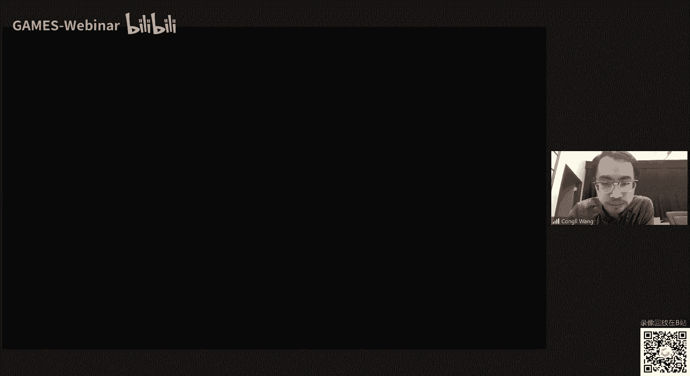

all right对，然后就是嗯就是刚刚说的这个这个在频率率，有有这个有这个零点的问题，然后但是也也不是不能解决，像你像computer vision的人的话，他们就会做这种叫迪科目lution啊。

然后用神算法去解决这个问题，但是我们我们刚刚说的是自适应光学，它既然已经在天文中存在这么长时间，那么我们很赞同嘛，就是说我们想用自适应光学去解决这种我们平时用的相机的这个问题。

然后相当于是我们做的不是被动的这种反转机，但我们做的是主动的，我们做的是我们就是我们做的是主动的，我们做的是主动的反潜机，也就是我们用硬件去做反潜机，而不是用软件啊，这是最大的区别。

然后这个右边的话是对。

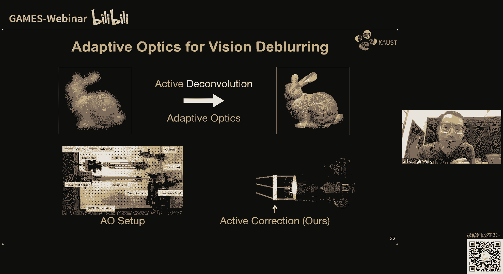

右边是个动画，然后表示的是这个啊。

等一下这个为什么我发不了啊，好的好了，就是这个右边这个动画表示的，我们这个搭建这个这个自适应光学系统的这个过程，就是我们有一个物体光是可见光啊，是我们想要观测的，同时我们还有另外一个曝光。

是我们所谓的引导性，用来测量拨浅的，但是是呃近红外为什么要进红外呢，就是因为我们不想让我们的相机能拍到这个引导性对吧，然后当有这个蓝色拨前呃，脑洞在里面的时候，我们的工程传感器就能测量这个波形的变化。

然后并且去嗯去让，sn去教训他，我这里给大家看一下这个demo啊，这里是一些测试。

比如说像嗯在在在在这里的话，我们是用了一些这种自己做的一种这种这种这个变形的玻璃片，然后去啊就去制造一些这种嗯光学畸变，然后大家能看到一些这个去测试我们的系统，然后这里是额外的一些例子。

我突然发现我讲的太慢了，所以说我我我我我在这边可能会跳过一些东西，好然后这里的话是额外的一些实验的一些结果，现在这个就是我刚刚提到的这些不利片，然后我们用这个去做测试。

然后去去验证我们的ao的这个系统的这个这个程度，然后这是一些例子，所以这就是给大家看一下这个播音传感器它有什么用，以及它为什么能够自适应光学结合到一起，后来然后这个我我前面提过。

就是嗯用软件也也也能做这个反潜机对吧。

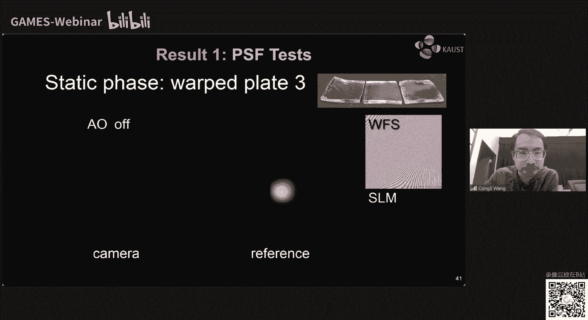

但是为什么我们要用硬件做呢，就是因为结果就是在这里给你展示一些，我就是啊，同时我们的论文里面还跑了一些跟其他纯软件的方法呢做了一些比较，然后你可以看到除软件的方法的话，它会有一些各种各样的一些问题。

这个原因很有可能是嗯就是就是软件上它有一些假设，它可能在真实的实验里面可能不太成立，所以它可能会有这种各种各样的art选择，然后就是我刚刚提到的这些这些问题好老的是第一个应用对吧。

第二个应用的话就是除了呃支持光学。

我们还能做这个显微镜啊，为啥呢，就是我刚就我刚刚给大家提到的那个例子，就是呃名场名场成像的这个样本，可能可能啊不是不是我们想要我们我们可能得得到不了太多拓扑信息，但是如果我们能对他做相位成像的话。

那我们我们就能得到更多的这个呃拓扑信息，你像这里是我们呃自己搭了一个显微镜，然后我们把我们之前起初的那个波纹传感器作为作为探测器使用，然，后呃右边是我们拍到的图片啊，然后我们根据这一张图片。

我们就能重现出它的幅度和相位，然后嗯这个过程是这样的，就是唯一的区别，就是说我们第一篇论文我们只求解了相位，但是呢在显微镜这个样本里面，这样本本身它是有吸收率的，你像我这里给大家看下图呢。

是啊是我的红细胞，然后第第一张图片这个i这个i0 是啊，那么下面这个测量measurement里面的i，这个是实际有样本的时候拍到的图片，所以大家可以看到就是这个这个散斑不仅存在它有移动的情况。

它还会有这个明亮程度的变化对吧，然后这个对显微镜是很重要的，然后我们，就是提出了怎么把我们的算法改进，然后使得它不仅能求解国前，也就是说相位还能求解出它的幅度啊。

哦就是右边这个结果表示的就是a是它的幅度啊，啊这个fight它的相位，然后就是如果有同学不太清楚，我在讲手的话，就是就是这个这个概念是这个波动光学里面的概念啊，就是嗯就是当当你有一个这个相干光啊。

相干波的时候，这个波本身啊，每一个点的这个这个强度可以用这个幅度a表示，然后每一点的相位呢可以用这个fi表示，换句话说就是说如果你从几何光学角度考虑，的话呢这个相位fi就是我们之前说的每根光线。

这个呃法线方向偏离这个传播方向的这个角度，然后以及这个a呢就是这每一根光线这个啊radiance的这个强度，然后这里是一些实验结果。

你像最左边的话是原始的数据啊，就是我们实际拍到的图片，然后中间和右边呢是我们算法重建的结果，然后大家可以看到就是这个我们的深色的确可以重建出这个啊啊，幅度和相位，而且右边最右边的相位的。

大家可以看到这个我们红红细胞是有这个叫这个downership，就是还是有这种，然后进去像这个像这个叫做甜甜圈的这种形状，然后大家可以看到很可以可以看到这个这个形状非常有非常有意思。

然后另外一个有趣的应用就是说嗯如果如果你熟悉这个波动光学，你会知道，当你完全知道了幅度和相位之后，你只是你完全对这个服场所有信息你都了解了，那么你能做的是什么呢，你可以做这种叫数字从聚焦啊。

就是说比如说左边最左边是我们之前测出来的这个幅度和相位，那么我们跟这两个信息我们就可以组合成一个服场，然后我们就通过对这个服厂做啊，肺炎而衍射去在在在数值上去传播它啊，那么我们就得到不同传播呃。

呃这个这个这个平面的这个呃光的强度，分光强度的分布啊，这个情况呢就是一个委托镜阵列的其中一个委托镜，大家知道委托镜是用来做呃聚焦的对吧，然后那么你对我们这个服厂做做这个propagation之后。

那么我们就能得到一个聚焦的光斑对吧，就是我们这个动画所显示的，然后这个这个图更更更直接的表明这个这个什么。

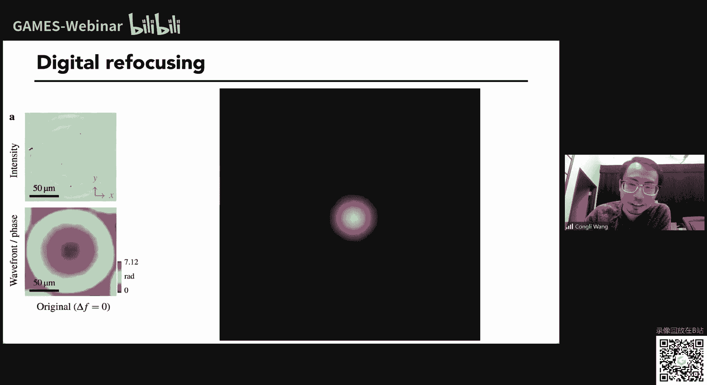

这是个什么过程，就是我们传播这个符号，然后我们能看到这个啊，我们能看到这个呃这个服厂从从从这个从这个聚焦到离交的这个过程，然后另外一个例子就就是这个叫啊红就是红。

就是我的这个红细胞，然后左边是我们之前测量出来的这个幅度和相位，然后右边是我们可以做数字程序，要的结果好，大家可以看到这个每个细胞是怎么从聚焦到离焦的过程，都可以看得很清楚啊。

然后这里有一个比较有有意思的地方是在于嗯，因为我们这个样本采集的时候是放在这个载玻片，载玻片上面对吧，上面盖了盖玻片，然后这个本身这个玻璃板它可能本身啊不是非常聚焦的好。

也就是说我们原始图片里看到这个每个细胞，它都会有这个有这个有这个圈圈在这里回到了他们每个细胞边上对吧，但那个圈圈呢其实是衍射斑啊，这是因为你做了颜色之后，它这个边界会有这个颜色的这个文。

然后如果通过数字数字从重聚焦，我们就可以重新要重新聚焦到我们这些细胞上面，就是中间那个图显示，所以你看这个距离非常小啊，就是你做一点啊，王博士再打扰一下啊。

对这边其实这个弹幕还是有不少同学感兴趣的一些问题的啊，那有的同学问到啊，你这边提到了这个新的这个方式，跟之前的那个通过干涉波前探测的一个比较，可不可以再给大家这个呃简单的强调一下。

或者是提一下这个哪些优缺点，各自的这个特点，从这个速度的角度来说，各自的优缺点是什么啊，可以可以可以的啊，等一下啊，那我回到之前的li。

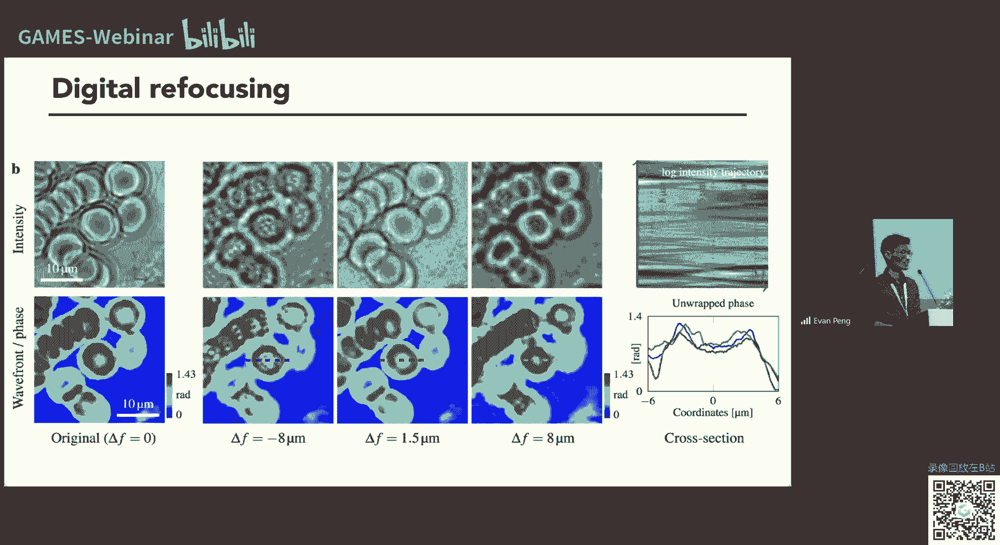

嗯这个非常好的问题啊，我觉得是非常好的问题，啊对一般其实做这种所谓的这个波前探测和相关恢复啊，也其实就是一个no standing the tradeoff，就是所谓的这个accuracy跟speed。

所以其实不同的算法啊，当然是有硬件的部分的不同啊，然后也主要就是各自有侧重，对就是我国目时候给大家分享一下，对我觉得最重要的一点是什么呢。

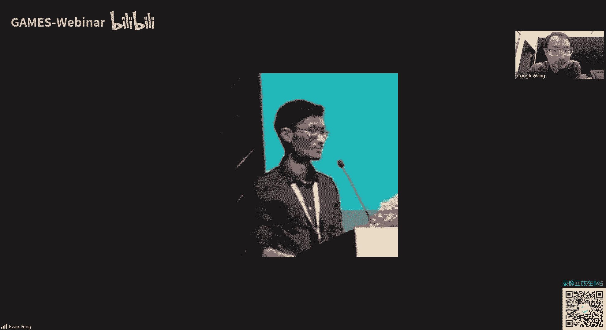

是你像这个工作是横向干涉剪切的这种方式，他需要一个周期性的这种empty的max规定，换句话说就是说你必须要保证你加工的时候，你的这个规定就一定要是这个样子对吧，这是第一个问题。

就是你加工你必须得非常precise，但是我们的情况呢我们这一个vivo生成是随机的一个眼膜对吧，你换句话说你其实根本不需要做非常精精细的加工，也就是加工这方面有非常大的优势啊，这是最重要的。

然后其次的话就是它这个amp t规这个规定啊，它是需要打光的对吧，大家可以看到这个你像你像这个这个这个图，这个就是因为如果把光挡掉的话，它这个嗯能量会有损失对吧，然后你的噪声可能可能会变高。

然后这就就不是呃就不是很好对吧，老是这个问题，然后我觉得这是最大的区别，硬件上也就是说他们这个，要量产的话，你就得你就得做，就就就得用非常嗯就是就是你得你得你就是就是你得非常非常精确，去求这个mp规定。

为啥呢，是因为这个硬件跟软件是是这个couple的啊，就是就是就是耦合的，因为你为什么还要做周期性的empty规定是吧，为啥呢，是因为这种周期性的这种性质可以使得它的复利也被它。

它使它可以在复利率里面去去用，然后这个不知道大家其他同学有没有听明白，就大概就是就是跟这个这个跟这个跟这个叫，什么这个叫就跟这个就是跟这个通信里面这个载波的这个思想很像，就是你把你想要调制的信息啊。

啊通过这种呃这种周期性的这种高频的这种啊从阵列转移到高额，转移到频谱比较高的地方去，然后你再你对你的原始的图像信号做分裂变换，然后那么你这些编码的信息就会就会落到这个频谱的呃外面。

然后那么你就你手动把这个频谱crop一个小的部分，然后你再把它重新位移到中间，然后你再做反复列变换，就大概是这样的一个过程，最大的问题是在于什么呢，是是你做这个的话，你一个是需要这个硬件。

需要这个周期性的排列，不然你的分裂变换你会不准，然后第二个问题的话，你会不可避免的有精度损失对吧，因为你想看你如果是1024x1024的图片，你要做分裂变换是114x1024，然后你你做cp之后。

你的有效分辨率会降低，对不对，这都是问题啊，所以说为什么我觉得我们的设计比他们优优秀的地方，就在于这个硬件跟软件是解耦的，对吧，我们的硬件不依赖于软件，然后我们软件可以适用于任何的mask。

这是个最重要的最重要的区别，好谢谢这个同学有个后续的问题啊，刚刚你可能也提到了一些在编码方法上面，就是跟g4 不相宜的干涉方法相比，有什么优缺点，对就是我刚刚说对吧，就是嗯四不像。

刚刚也已经基本上我回复了这个问题，对，首先这个这个四不像已，如果你如果你要用干涉去做事不效应的话，你相当于你得你得去做这个face shifting对吧，你得你得对，就是因为如果你想要拍一次照片。

就能得到拨前或者是其他任何的信息的话，你你说非shift可能不行，对不对，然后对，然后有人前期主要说的就是说相较于传统的四部相应的方法，我们更希望通过一些encoding的方式。

使得你的这个capture的过程能够尽可能地简化，其实相当于是一种one shot的方法，对对，就是对这个是很很好，绝对就是就是因为像我刚刚说的这个大气湍流的变化，它它很剧烈，很变化很快对吧。

我们想要尽量快的得到这个波形变化的信息啊，就是就是对吧，所以为什么这个我们叫光线传感器，为什么他们大家都想要做snapshot，大家都想要用一些这种确定性的这种模型和这种方法去求解。

不想要任何的太多不确定性，就是因为我们想要尽量快尽量准确的去求解这个拨钱对吧，然后还有个问题就是就是对，还有一个问题就是如果你用这种这种干涉移动方式的话，这种其实，它会比较敏感，对这个对这个光路的变化。

然后就是这话你像在天文里面，你是无法用该设计去测的，然后你很难去去去这个去这个做，那就是很好的问题啊，好的谢谢，那我们这边还是比较这个generalize的，关于这个领域的一些问题。

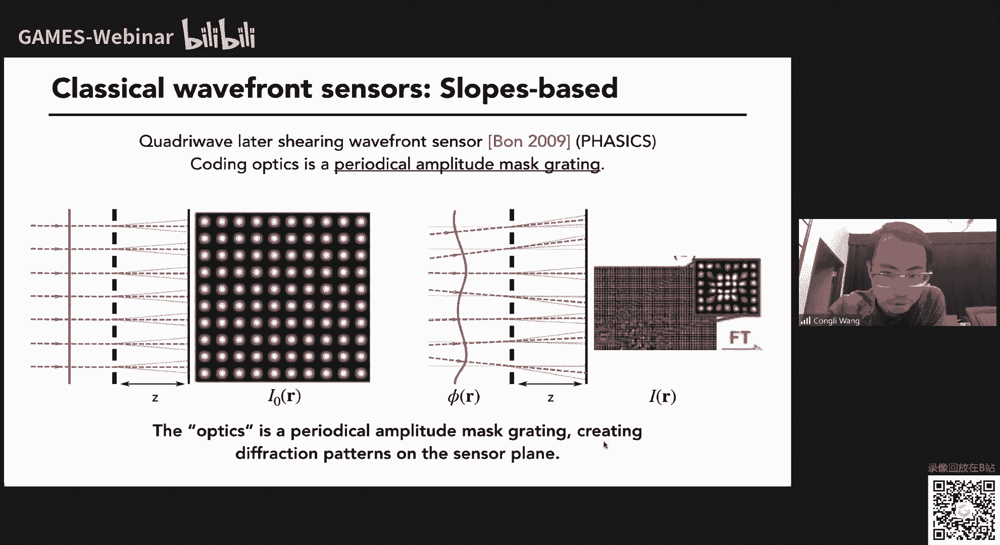

咱们留到这个第一部分结束之后，咱们做一个简单的总结吧，各位同学请稍微耐心一下，对我们先先把这个因为王博士今天可能会讲两部分的内容，咱们先把第一部分的内容由于时间关系先先讲下去。

对我们后面再找一个第一部分，结束之后抽一些时间一起来回答一下大家的一些问题，对对对，就是大家大家不要急哈，因为那个嗯大家还是可以随时提问的，对就是如果没有特别跟当前slash相关的，咱们立刻先回答一下。

还有一些比较这个啊普适性的可以探讨性的问题。

咱们在第二就第一部分结束之后再来讨论，谢谢对对对，我们做室里面可以继续啊，对然后然后刚刚讲就是这个叫什么，这个叫哦对，这个叫这个嗯，d j都refocusing对吧，就是这个数字从聚焦。

然后这个就讲完了啊，就是大概就是这两个应用对吧，给大家看一，下就是因为我今天本来不想讲太多很深的东西，因为大家知道大家都是同学对吧，实际上给大家介绍一下我之前做了什么工作。

然后然后然后这个是刚刚第一部分，然后第二部分就是所谓的可微跟光学，然后这个这个我觉得是个很很比较有趣的一个点啊，大家可以大家可以大家可以思考一下。

然后就是呃我我主要会讲我我就是一篇呃在under review的文章，然后另外一篇是这个但是范围oe上的文章，然后这这第一篇文章还没有出来，所以说我很多细节不会涉及，但是会给大家看一下结。

果好这篇文章的一部分，一就是这之前多ptation还很荣幸得到这个最佳学生论文奖，给大家看一下，好现在需要切换一下slice啊，因为这个slice在呃这个这个是不上。

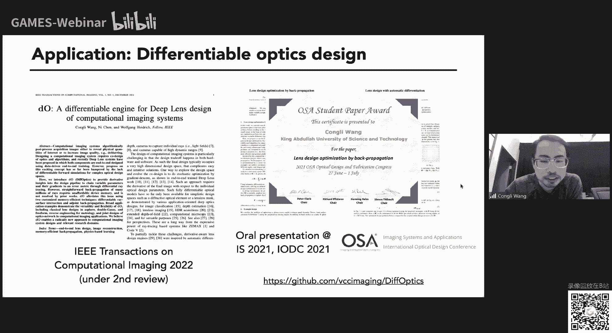

放出来大家可以看到对吧好的，然后就是嗯首先就是计算选项的过程，就是就咱们上的课很久，然后你们肯定也也了解过什么是计算成像，就是啊你有你有个有个情况模型，就是我这个你图里面画的兔子。

然后这个staff bi呢是通过我们一些光学，也是有一些硬件，然后能能对它成一个像，然后我们镜像成像关心的问题呢，是这个反问题是怎么从这一个我们拍到的这个图片去做一些计算。

通过软件去求解出一些我们关心的参数，对，然后这个这个问这个这个问题怎么求解呢，然后有很多方法可以求解啊，然后对最经典的就是我们我们有些变量，这个变量叫x然后我们有我们的这个成像模型f这个函数。

然后我们得到我们的测量是y，这个y是fx加上一些噪声，然后我们想要做的就是说我们怎么去求解这个正向模型，怎么从fx减y定义一个loss，然后去去求我们想要估计的这个参数x，然后这个过程怎么做呢。

你们可能知道啊，现在这个什么学校都酷，都很火对吧，大家一般都是进一个loss的时候，直接用这个海涛去做规定design是吧，就是做t下降去求解，所以说这个是非常有优势的啊。

就是也就是说你相当于是你任何模型，都可以用这种梯度下降的方式去求解，就是我这里就是我这里写的就是x呢，是你可以用通过这种迭代的方式去解，就是每一次你你下降一个，你根据当前当前当前的梯度去做一个tv差价。

然后去更新你的x，然后但又有个问题了，然后那那你有个fx一个模型，你怎么去求它的梯度呢对吧，然后这么这这里的话我就要简单的介绍一下这个这个所谓的叫bbation，就是这个反向传播。

所以如果有同学不清楚的话，我在这边简单来讲一下知识，就是你的模型呢，你的fx模型可以拆解成很多不同的layer对吧。

就是就是雷尔斯其实是这个learning这个这个这个他们这个learning community里面的，这个术语，大概就是说不同的这种函数的这种呃这种组合对吧，然后当你要求梯度的时候。

你要对这个这个标量loss对它求梯度，到这个梯度是一个什么矢量对吧，然后这个这个partial loss parsx是啥呢，就是通过链式法则，你就可以拆解成不同f啊，呃这个呃这个呃这个微分的乘积对吧。

然后这个叫反向传播，就是就是用来这个追踪以及去计算这些呃这些梯度的，然后这个咋这个具体怎么做呢，大家可能会知道，比如说你只计算一个普通函数y等于fx，你可以用这个python用这个np做的话。

就是算计算就完了，但是你同时你还可以用这种呃带着这种自动微分的这种库啊，比如pytorch，你可以求出因为自动微分它它它自定义的算式，和他自己的这个derivative。

也就是同样的fx这个函数在拍torch里面，它会它会返给你返回这个primal，它本身这个函数的值以及这个函数在这一点对的导数的值对吧啊，举个例子啊，比如说你像你像这个y等于x平方。

你可以嗯一般来一般计算出fx就是x x x x，但是的话如果你用这种啊排套取这种带自动微分的库的话，那么你能得到啊，不仅得到y等于x平x平方，然后得到y随x的梯度，也就是二乘以x。

然后就回到我们刚刚这个建模的过程啊，就是说也就是我们现在不仅考虑这个正常模型f，我们还同时考虑正常模型f的导数对吧，然后我们要考虑我们考虑这个f导数指的是它的它的微分对吧。

也就是换句话说我们就是说我们想要我们的模型是可微的对吧，可唯的原因就是在于我们想要f这个成像模型，变得它的导数可以求对吧，然后这就是为什么我们有这个所谓可微分光学的概念啊。

就是因为我们想要整个光学建模的过程变得可微，那么可谓的好处有啥呢，就是有两个装饰，第一个的话就是我刚刚说的，就是当你想要出现反向问题的时候，你可以直接用tv sl方法去求解。

然后大家都想要想要用这种data driven，就这种数据驱动的方式去优化你的软件和硬件，这种叫叫叫叫叫叫叫n to n这个how we shat codesign，我这个很老实。

跟这个孙老师他们有在这方面有很深的积累，然后另外一个方面就是就是口音的关系，重要的原因就在于它是数字上是是这个可兼容的对吧，因为当你有梯度的话，那么你的梯度可以从你后面的后端的神经网络。

直接bp给到你的前端的这个光学硬件是吧，然后那么你就可以做这种hold闪，然后这是我刚刚提到一些工作，像这个是pro，是之前在斯坦福的工作，然后另外一个是这个孙老师去年的slob的工作。

然后我作为coser也跟他工作了很久，这个这个光线对接的引擎啊，老师讲一些应用啊，首先第一个就是我们来先可视化一下，这个这个刚刚说的那个到底啥意思，再逛一下，像我们考虑一是最难的一个系统。

就是这个单透镜的系统，你有一个平行光，那么你这个平行光的呃，经过推进之后，你会有一个呃偏移，那么我们能追踪每一根光线偏移的偏移的这个达到这个呃平面上的点，就是所谓的sport dia管点列图对吧。

然后我们就把这个调为fx啊，然后我们刚刚说了，我们想要这个系统变的可微，也就是我们不仅要考虑fx本身，我们还想考虑fx随x的导数对吧，而这个导数在这个情况下，它是一个它它它它是一个这个矢量图。

就右边那个图为啥呢，是因为我们这个x啊，它虽然是这个参数，但是当你这个参数变化的时候，这个点亮图它它它它它会它会有一个呃运动对吧，这个运动就是这里的这个这个这个矢量，这里是个动画展示这个过程。

你像最左边的话是我改变的一个透视性的区域，然后大家能看到这个sport diy的这个变化，以及这个sport代管具体每一个点的这个运动的速度，这个运动的速度就是它变化的程度对吧。

也就是最右边的这个动画sport呃，这个sport derivatives对吧，就是它的这个嗯这个这个梯度对吧，所以这是为什么可微分光学很有用啊，是因为我们不仅能得到关于fx的信息。

我们还能得到关于fx的导数的信息对吧，然后这是同样的一个图，但是我们可以同时做rendering。

我们同时可以做渲染，所以我们同时可以去渲染出这样一个图片，以及它的这个梯度好加上一些应用，首先第一个就是我们可以拖进设计。

就是你像传统通讯设计师怎么设计呢，是我们有一个这样的从专利库里面扒拉一个这个设设计，然后我们去手动设置一些呃参数，然后去做优化对，然后你拿出来一些现成的这个网络结构，然后然后你在上面做一些改动。

然后去去训练的网络，然后使得你能达到你想要的目的，是这个其实跟光影设计的过程很像，然后那么我们就我们就想问这个问题了对吧，有很多很多个变量，可能有几百万个变量。

然后他们最优化的时候就是用反向传播背后可选去做的，那么当我们通讯设计设计里面有很多个参数的时候，我们呃传统方法可能会比较慢对吧，像比如说你做自由曲面设计，它可能参数很多的时候就很难优化之后怎么办呢。

我们就想能不能用打传播去去做这个优化，也就是有的是我自己说的，就是我们能不能所谓的用这个bpagation去做lance design，就用反向传播去做透镜设计哦，这是我之前刚刚说的。

就是我们有一个设计的这个match，这个叫这个评价函数，然后我们有一些我们想要画的参数x我们可以定义一个loss，然后我们嗯我们可以把这个建模的过程写出来，然后在几何光学里面，这个建模的过程呢。

其实就是你怎么追击每根光线的过程对吧，然后这些函数有哪些呢，就是首先你光线的传播从一个点到另外一个点，以及这个光线打到一个一个光学表面上，然后他怎么样去做这个intersection。

就是相交以及这个折射和反射对吧，然后呢嗯就是我之前说的，就是我们因为我们想做可唯可唯的光学引擎，我们就要关心不仅关心这个参数本身，我们还想需要知道它的梯度，在光学设计里面呢。

我们关心的参数呢是表面的参数，也就是我们关心的是每一个光学表面，它的参数以及它们的他们的梯度对吧，就是我这个中间这个模型中显，所以说这个这个resurface intersection就是最重要的部分。

然后这就是这就是篇这篇论文的贡献就是在于什么呢，是是求交的这个过程嗯，如果你有一个一般的这个光学曲面曲面的话，你是很难求教的，然后你必须得用一种得用这种迭代的这种求根的方式，去求这个相交的点。

但是如果你直接暴力求用auto tv去解的话，这个迭代会非常消耗消耗的内存，因为大家可能也知道，你的网络如果很大，或者是你的你的这个你的这个训练训练的这个batch size很大的话。

你的memories不错的对吧，而这个同样的这个问题也会在我们可谓光学里面也会存在，然后这篇文章的主要贡献就在于我们我们提出了，就是他其实求跟那个过程呢，它它不需要用o o d f去做，我们可以先求。

我们可以先用一般迭代的方式求出的跟t在这个值，然后我们最后一步我们再把o d加进来，然后这样这样去去去manually engage这个规定，那么使得这个系统仍然是可悲的。

同时的话这个memory消耗会变得很小，右边就右边这个图就是就是这样一对比，是跟我们之前啊，跟我们之前的方法，或者是跟其他人的方法，因为其他人都是用这种这种迭代求解的话，然后我们去比的话。

我们的确有很多呃这个memory上的优势啊，然后然后然后这个是伟大，我我我发现我可能讲不完，所以我这部分跳的很快，然后大家就是大家都看一个结果就好了好吧，然后呢。

就是我们我们就具体就是说我们具体实现了一个光光线狙击系统，然后这是一些这关系，这这这这是一些呃关于它的结果，就比如我们可以去追踪这个这个这个路同和出同的位置对吧。

以及我们可以跟这个现成的这个商业软件z max对比，看到这个我们的z max d我们可以创造得到基本上完全一致的结果，然后我们可以做些应用了对吧，比如最简单的，是我们可以去做一些简单的透明设计。

那这个情况的话，我是优化一个非球面呃呃呃优化一个非球面，然后是怎么看优化这个冰球面的系数，使得它能聚焦到一个点，然后以及去优化一个线程的一个特性设计，怎么样去优化一些参数。

使它能得到更小的这个sport bg，就是也就是说我们这个点的聚焦聚焦到更更小劳，以及怎么去做这种周曲面的设计，因为这种曲面设计很难，为啥是因为它变量很多，然后传统方法很难优化，然后在在这里的话。

我们也可以直接跑我们这个可为的这个引擎，然后去做去做优化，然后这里是一些优化前和优化后的结果，好这个只是个demo，表明这个我们这个我们这个工作室可以直接无脑跑后，必须要加很多限制。

对这种简单的这种光源，光源光光也是他的情况，然后更一般的我们还可以做这种呃，更比较复杂的一些这个呃这个非球面的一些呃一些设计，然后在这边的话就是有个尼康那个专利。

然后我们从这种原始的这种啊这个这个这这这个这个原始的设计，就是我把他们的非球面去掉了，然后用我们的引擎的话，我们重新跑一次优化，我，们能得到非常好的结果，跟它原来的相比的话是是接近的。

这都是这种啊这种可悲的光学引擎给你带来的优势，老以及我们的影片还可以做渲染对吧，因为我们不仅能做，因为我们能做光学镜的话，我们我们就能反向做追击，然后从从而去渲染一个场景，在这个情况下的话。

我是呃渲染两个两个透镜，对左边这个的话呢是是没有校正色差的透镜，所以你能看到这个场景还是会有很很强的色差，右边的话呢是叫做色差之后的，就是你看到这个色差的这个结果就会比较小，然后除了那些。

简单的应用之外，我们还可以做更复杂的应用啊，比如说像这个情况下，我们是想要画一个自由曲面，使得这个自由曲面在传播之后，他能他能他能得到一张我们想要的图片，比如这个牛这个牛这个牛顿的这个照片。

右边是优化出来的自由曲面，而这个问题呃，之前做的话会比较困难，你可能需要特别的一些解求解器，但是你如果用可微的光学引擎做的话，你就不需要去解气啊，你可以直接用归元，第三你就可以得到这个结果。

然后以及还有其他的一些，比如说m突然的一些设计啊，以及，miss alignment imation对吧，你像这这个有个n t n的设计，就是就是说你怎么样让软件硬件一起优化对吧。

然后去去去让这个呃后端神经网络去处理你这个嗯模糊的图片，然后得到这个比较锐利的片，然后这一切都可以用我们这个可悲的引擎去做，然后以及最后的话我们还可以做这个叫飞。

非常有趣的，我觉得非常有趣的一个实验，就是做这个miss lemon bbengineering，就是比如说我们有一个非常简单的这个光学的这个这个set up对吧。

然后我们想知道我们想要我们想要创造这个sa的数字孪生，也就是说我们想，要呃建立一个数值上的模型，使得我们的模型得到的得到的simulation，这个图能完全跟我们实际拍摄到的图片相吻合对吧。

那这个可能不会吻合，像比如这个情况，这就是我们理想中就是个点，就就就就就这个点啊，点的这个物这个误点，但是呢实际拍出的误点可能会有些偏移对吧，因为这个透镜可能不是非常好的，这个对齐的。

那我们怎么样估计这个参数的一些，怎么估计这些啊，这个这个设置中的一些参数使他们两个能一样呢，对不对，然后这个问题就是就是怎么样构建这个关于你这个，光学系统的数字孪生对吧啊，怎么构建呢。

我们可以直接无脑跑我们的呃，这个归离散，因为我们的这个可微的这个这个这个引擎他自己带了梯度。

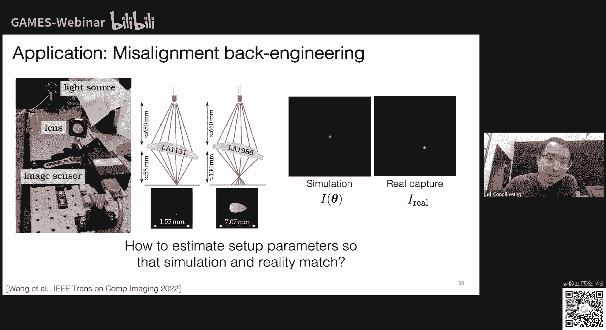

我就可以说这个优化，那这里的话我给大家展展展示的就是左边是我们呃仿真得到了图片，然后最右边是我们实际拍到的图片，那么中间就是优化的过程，大家可以看到这个优化过程非常快，然后我们优化之后。

我们就能看到这个这个点跟就是我们我们创造的这个simulation，跟实际拍到的这个measurement是非常吻合的，然后这里是这里是更多的一些例子，就是最左边就是就是我们模型得到的图片。

最右边是我们实际拍到的图片，然后在这个情况下呢，是我我是把这个透镜转了一个比较小的角度，然后我们去优化这个透镜的三维坐标信息对吧，然后大家可以看到经过优化之后，优化之后的模型。

这个形状跟我们测量的情况是非常接近的啊，这这里是更多的一些结果，这，就是说我们怎么更进一步去利用这种可悲的引擎，去去求一些光学参数啊。

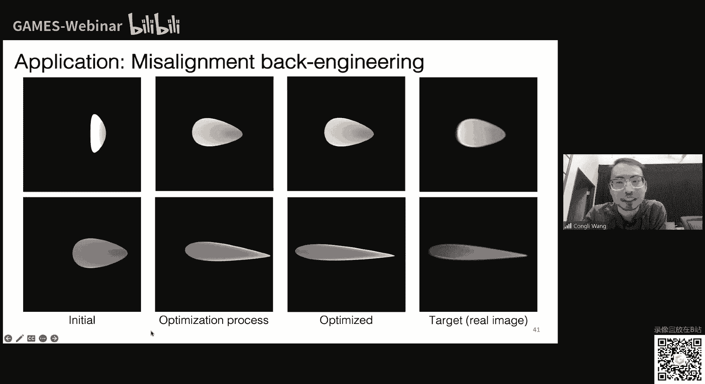

然后这就是最简单的一个这个叫做face nshman的，一个一个一个一个一个装置，就是说嗯道理跟我刚刚讲的一样，就是我们有有一个透镜，这个透镜的一些参数是不知道的，而且它的这个不仅是它的位。

它的位置信息和它的一些光学参数也是不知道的，我们怎么样去呃测量它对吧，然后也可以用我们刚刚说的可微的引擎去做啊，然后这这里这些结果就就是就是啊这些对比。

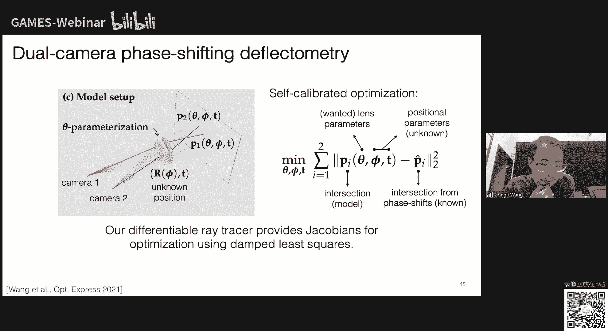

就是就是比如说有个透镜对吧。

我们不知道它的这个实际的这个前后表面的这个这个曲率的值，但是我们通过我们的引擎，我们可以得到一个非常接近的支持啊，然后这这也是它的这个我觉得它的它的威力所在好，然后这个是这个是这个是可微光学的部分。

看大家有什么什么有没有什么其他的问题啊。

没有问题的话，我就我就继续下一个最重要的课题啊，哦我在这里先提一个问题吧，对就是其实还是蛮多同学讲到了这个口味光学啊，也不是说要提问题，就这部分嗯。

今天可能王博士给大家讲的是一些high lever的应用，和一些目前比较前沿的一些paper，我们这个204课程后面会有专门的几节课，会给这个口味分光学做一个比较详细的分析，从这个光学model。

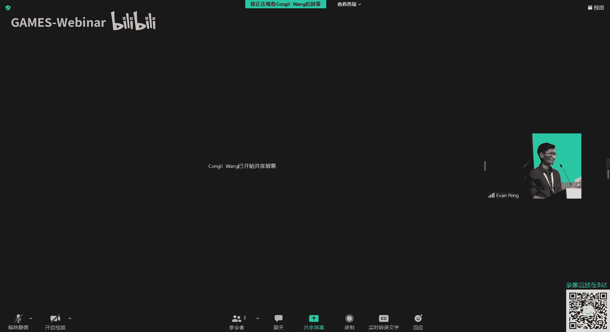

从这个算法建立的image formation，所以可能大家今天听起来会比较比较多的一些内容，其实只是为了给大家一个概念，说这个东西其实是目前的一个研究热点，而且他是非常有意思的对。

然后就是我觉得王教授王博士可以回回应一下，就同学们蛮关心的，就是对训练集的要求对，就是跟传统的这种通常来讲，就大家可能比较关心这个可微光学对训练集体的要求，可以简单评论一下就好。

因为他们就是就在斯坦福的很多工作，非常非常非常有这个有这个硬塞啊，但我只能说一点，就是训练集，你啊你可以用仿真的方式去做训练对吧，就是就是啊这这应该是完全可以的，但是最重要的过程最重要的问题在于什么呢。

是如果你通过软硬件联合优化得到的光学设计，你加工出来可能跟你设计的是会有偏差的对吧，就是所谓的有公差的会有些问题，这个计算里面对吧，那么你就必须得想个办法去把这个偏差把它校正过来。

也就是你你你必须得在啊这个这个这个组装之后，你还得再再做一些额外的一些这种这种呃harry的loop，这种这种圈领去去教训它，这是我对这个的回应啊，关于这个的我觉得对，就我们后面课程会有这个详细的展开。

就各个模块今天主要是给大家一个了解一下最前沿的科技，因为王博士在伯克利大学里面做的工作也都是非常前沿的，对然后这边还有一个更小的问题，关于这部分口味公式的参数估计如何处理多解的问题，这也是蛮有意思的。

就卡在这个关系，但是我想要说的是啊，如果你只是设计的话，你其实不需要最优解对吧，其实一个局部解局部最优解其实就已经可以了，好这是第一个，然后第二个是当你发现你有很多个解。

比如说你做这种这种这种这个叫这个叫mmmo，就是做这种这种光学测量，当你有很多个解的话，那么说明啥呢，说明你这个问题没有很好的regalize，你没有很好的做正则化。

你应该做一些政治的话去让你的姐变得更加make sense，更加更加有有更加就是合理对吧，这是这是我觉得嗯需要提到的点啊，就是就就就就就就举个最简最简单的例子，就比如说我我我我我优化这个透镜。

如果我只优化它的参数，不优化它的三维未未未知坐标的话，那么我觉得我得到解也会很差对吧，就是因为我有这些额外的因素没有考虑，那么就会有这种问题，对不对，就是说啊对啊，由于时间有限。

我们这个可以后续再来讨论，咱们先让这个王教授分享一下他另一部分非常有意思的工作，对大家也可以继续提问，后面我们还是会留一些时间，那今天可能会稍微多一点点时间，希望大家能够理解对，然后最后想了想。

这样再说一下，就是我这个文章虽然在审，但是我们这个吉他仓库已经，开放啊，就还没有开放，就是还没有公开对吧，但是我这个仓库在这里，大家可以去，有空可以去看一下这两篇文章的这个仓库，大家可以点个小心。

点个点个爱心啊，这个非常感谢啊，这个之后很快就会开源，就是等我的文章正式上线之后，让大家可以去自己去试一下，而且这个是这个这个是python就写的就是比较比较简单，因为之前我们的版本是基于秘书吧。

所以你可能要写c加加17，你可能如果不是很熟，c加的话，你可能比较难做，但是我们都可以拍拖去，然后就可以去去去去做各种各，样的事情，然后之前就是我在博士期间做的一些工作，然后现在我想讲的是呢。

现在讲的可能是非常新的内容，这应该是第一次在这个中文，在这个中文中文这个互联网世界里面展露伯克利的这一项秘密研究啊，我们叫我们叫autivation，奥兹视觉。

然后或者是就是我在下面有一个我自己给的翻译啊，就是帮大家理解的是啥，就是我们想做一个超彩色视网膜投影显示技术对吧，叫observation，然后这个呢是基于一种设备，这个设备叫自适应光学激光扫描。

共聚焦显眼镜叫a o s o啊，这个这个这个工作，是个非常大的一个项目，然后我是去年加入了这个团队，然后很幸运，在去年这1年我们整个团队然后有很大的进步，然后有很多很多很多最新的进展可以给大家分享。

然后这里是一些呃就是我的这就是我们我们组的一些人，然后呃这个这个list不是很完全，因为这个项目有很有很长时间，然后有很多来来去去，有很多人大很多人都在上面做过很多贡献。

然后呃虽然我是在这边这个做presentation的，但是他们的贡献我觉得非常重要，好我现在给大家讲一下，首先就是我们这个gp的这个观众大，家可能都对图形学有些了解，就是图形学是啥呢。

图形学是就是给人类视觉，就是给人啊去展展展露一些这个这个图形信息的对吧，就是我下面的中文写的，就是说图形学就是想要想要去表示这些图形给人类看，对不对，然后呃这个过程是啥呢。

就是如果你可能上过计算机图形学，你可能知道就是啊你有一个场景就左边这个图啊，有个叫这个叫coral box对吧，康康奈尔和，然后你对他做渲染，你得到一张图片对，然后这个这个图片就能。

就是图一学想关心的对吧，但是呢想要提醒大家的是，这个是所谓的perpetual image，为啥呢，是因为你渲染的时候，你是对每个像素做的对吧，你得到的只是一张数字化之后的图片。

你想要这张图片被人所感知，你是需要把这张图片显示到一个显示器上，就是中间这个图画同时在被人眼观测到，打到视网膜上，最后经过photo assamzation之后。

你才能得到实际的啊人对这一个图片的感知对吧，就整个这个过程是这样的，对不对，然后你就会发现一个什么问题呢，就是计算机图形学不是完全全链路，它的链路不是，完整的是因为最后这一环节是缺失的，从这个图像。

从从从这个渲染得到的图片，到人的视网膜这个过程中经历了很多其他的因素对吧，首先第一个是这个display，就是我下面这句话写的。

就是说你的human procession呢是这个在光学上是是被这个display被显示器所影响，被你的人的眼睛的这种不完美所影响，因为你像我们的眼睛，我之前讲播前也说过，我们的眼睛不是完美的对吧。

然后你像我近视对不对，然后就是这些额外的相差会导致你的这个成像的一些问题，以及最关键的是你这个人人的视网膜，它是有这个锥状细胞和感和感状细胞，你们可能之前上课也讲过，你像这个锥状细胞。

它它是一个个的细胞对吧，它是离散的，对不对，然后你这个连续就是你这个你这个pixel的这个图片投影到这上面的时候，从这个pixel到这个空空，就是就是这个嗯水状细胞对吧，这个过程它是会有这个会有这个呃。

会有这个会有这个光学上的这个变化的，然后以及得到这个信号之后，怎么大脑怎么去在神经上面做一些decoding，怎么去解码，把这个最后得到的这个图片信息，把它把它复现出来，所以这就是我们。

ospici想要想要去理解的就是嗯这这里是额外的一个图啊，左边这个是人的眼前的这个这个示意图，大家可以看到这个视网膜，你视网膜上这个锥状细胞就是这个photo这个这个叫photo receptors。

就是他是负责感知颜色和和和，就是嗯是主要处理你这个颜色信息的，它也是最敏感这些这些可见光的信号对，然后这些这些这些因素是完全没有被考虑进来的，被动性质的，所以说这就是我们autivation想要做的。

就是我们想要呃把图形学提升到下一个阶段，就是传统图形学，就是我之前说的，就是它只是对每一，个像素做渲染对吧，但现在呢我们想要把最后这一个从显示器到视网膜这一部分，也把它做做完，我们想要对每一个居状细胞。

每个空，每个per控对对，每一个空做渲染对吧，这是我们想要做的，就是所谓这所谓的osvision，然后这个名字可能大家可能觉得很奇怪，什么叫out对吧，然后这个是从这个绿野仙踪英文名里面来的。

the visor of arts，为啥呢，是因为我们刚刚描述的这个场景，这个图形学的场景，它只能在我们的仪器里面给你复现出这个冰这个色彩平凡的世界，你在外面是看不到的对吧。

所以说我们就叫它就相当于是个先进的，所以叫vior of ar，然后我们开发的软件就叫visor对吧，就是因为因为the visor of arts给大家插播一下。

然后这个auspicion有什么用呢对吧，我觉得最关键的是什么呢，它可以让他可以他可以去叫叫叫叫他可以啊，做programmable human vision对吧，就是人的视觉是非常复杂的，为啥呢。

是因为呃呃大家可能知道有有色盲，可能追状细胞，如果因为正常人可能有三种不同的这个追状细胞，但是但红绿色盲可能有的呃，某一些红绿色盲可能只有两种配方细胞，那么他们就看不到，他们都无法无法分辨红色和绿色。

然后在这些因素是我们一直想要去科学家想要去理解对，然后oautivision可以做啥呢，它可以做，我们就可以用oswitch作，为一个平台，那我们的这个呃vision scientist。

这个vision指的是human vision，不是computer vision，让我们的vision scientist做更多的这个experiment，就是就是for science对吧。

然后另外两个最重要的最重要的前提是，我下面说我觉得最重要的是就是towards novel color sensation，就是说我们可以实现这种全新的这种呃这种颜色的感知具体是什么呢。

第一个是可以可以扩展人的色域，第二个是可以做这个呃，color of boosting dimensional，bodidimensional bosting，就是说可以让色盲看到真正的呃三种颜色。

可以让可以让色盲在我们的仪器里面啊，看到我们就是呃正常三色人能看到的颜色，让我讲一些，低调什么，首先就是你想要理解这个我们的这个原理，首先要讲一下我们这个这个photoreceptor。

这个特别是空调是怎么个回事，你像我们人，我们人是一般的大，一般只有三种聚聚状细胞对吧，就是左边这个图，人类的话三种装细胞对不同波长的光都有感应，然后但是他们每种组装细胞的感应是有点略微不一样。

这一点的话呢像有的生物，像皮皮虾，它的它可能有12种最终细胞，那么它感知的这个颜色就会就会更加嗯缤纷对吧，然后这就是这就是这这就涉及到怎么去理解这个人类的颜色啊，然后左边就是呃刚刚同样的那个图案是走。

不过是我在给这些地方给大家画出来，画出来这个这个这个感应曲线就是就是做每个不同的空啊，不同的种类的这个空对这个颜色的感知是这样的对吧啊，右边呢是三个已经分类好的这个呃这个视网膜的这个这个这个地图。

然后每个空都被都被标注了不同的颜色，表明它的这个呃类型对吧，然后首先要注意的就是不同的人呐是有不同的这个lm ratio，就是说它的这个红色的这个呃感光器呃，就是我我们叫l我们叫l控。

l就是long的意思，对吧，m4 这个这个迷点，然后这个s是这个shot对吧，然后就是就是就是这就是我们三个人，他这个呃l控和a和m控的比例是不一样的，然后这是第一个点，然后第二个点的话呢是这个蓝色的。

这个这个呃蓝色敏感的s控是比较少，就是所谓的这个啊红就说就是二色人，我们叫这个中文，我其实不知道怎么翻译啊，就是说就是说就是他只有两种组装细胞，那么它就是右边这个图。

就是下面这个就是说他有的人他可能没有这个l他没有l控对吧，那所有的l控都跟m控是一样的对如果这时候的话，那么他对红光就比如说你这里看着不断，你可以知道有600以上。

它这个光就会他其实还是能感应到这个这个红光的，但是呢他的这个卡or就是它的它的它的颜色的感知，可能就就分辨不出来，因为为啥呢，比如说大家可以看到这个图上面，500和600这个这个响应都是类似的对吧。

也就是说对红绿色盲来说，它的这个500nm的光，500nm的光对他来说都是都是很类似的，它很难他很难去，它可以它可以区分，但是说对他的m控的的刺激是类似的，然后就就是限制他们他们这种饮食的感知能力。

好吧，然后呃这个跟我们的色域有什么关系呢，就是就就就是因为这三种不同的响应曲线啊，是你可以把它在三维的空间中画出来，但是呃你在可视化的时候，我们我们希望把它压到一个二维平面，然后这个这个过程就就是说啊。

比如说啊我我我考虑这个这个黑色的这根线啊，这个这个这个波长处的这个光是什么颜色的，就是我这个黑色点在这个commenticity大会上画的这个点。

那么你就可以对应读出啊l m s3 种控不同的这个呃感应的这个程度，然后这个是所谓的lms s value，然后你根据这，三个值去做这个x y z到xy的这个换算。

那么就能得到这个commantity大管上面的一个点，然后这就是这就是human human color garment，就是所谓的人的这个色域就是马蹄形状的原因，就是因为我们三种锥状细胞。

他们的感知是这样的，而且每一个波每个波长你你只能固定的这个呃生成tv体，然后这个就是我下面这个呃sse里面这个方程里面表表述的就是说啊，每一个颜色对对，对我们平时看到的世界来说。

每个l m s value是等于每个每个空的这个神的tvt，就是它它的这个这一这一束光的感光程度对不同，波长的感就对这一个波长的感光程度诚意，这个波长啊，这个光实际的这个强度，你像这个地方。

我把微写出来，就是0。50。7，0。1x111对吧，然后最关键的来了，就是我们提出的observation跟我们一般的这个vision有什么不一样呢，是在于如果我们能对lms 3种控。

每一种空施加不同的光的强度，也就是我们也就是我们呃调试每一个空上面的，让他们打，让虽然是同一个波长的光，那么但是我们让这束光的强度，在每一个不同的控上面的强度都都会呃都会不一样。

那么理论上就能实现让这个呃让这个被试者看到不一样的颜色，就是就是我这边写的就是问号，为啥呢，是因为之前是都是一对吧，因为你没法精确的控制每一束光，在每一个，集装细胞上的强度，但是如果你能控制。

那么你就能实现这个osvision对吧，你就你就你就能做出这个空win lin开始就能，你就能你就能你就能直接program一个就是就是你直接可以对对你的human。

你你可以直接对你的这个人的这个视人的这个颜色的视觉，可以对它做编程啊，再举给大家举个例子，比如说啊比如说我我给这个呃这个被试者看看500 510nm的光，那么他可能看到的是这种啊。

在sn和这个他可能看到的是这个电缆啊，偏绿的一个一个光对吧，但是如果你在audivision里面，如果你对每个，空你对它做不同的line intense modation，你像这里我根据比例算出来是1。

60。4和零的话，那么实际上每一个空它受到了这个等价的这个呃，感应值是我下面说的这个值，就是这个这个这个hello，就是这个啊空心的这个圈圈的值啊，那么如果你反向去查这个表。

那么你会发现原来510nm的光，现在这个是测试者，他能看到600nm的光，也就是说这个510nm的光，我们可以让这个受试者看到600nm的光的结果，这个是我在commodity大会上面画的另外一个点。

就是这个这个黑色的圈啊，也就是说与其看到的是电缆，现在这个被试者他能看到一个呃就是呃偏红的一个光，对吧，然后呵呵对，然后这个这个有这个有啥用呢。

是因为这个我们可以我们可以扩展这个这个human card gm，就是我们我们之前说的这个卡拉嘎米是这个马蹄形，然后现在如果没有我们的osbc的话，我们能让你看到不一样的颜色啊，好吧，我觉得我还行啊。

快点，因为讲的太慢了好，然后这个是具体是我们我们是这样做的啊，首先我们有我们有一个我们想要给车子看到的视频，然后我们把它啊打到这个视网上，然后我们可以对每一个空做这个编程，然后去。

嗯根据他不同的这个空types去做相应的这个类似lin test这个这个调整，对然后呃这个是这个这个oosation的这个主要这个princip，然后嗯对因为时间关系我就不给大家讲太细了。

但是我想给大家展示一些我们最新的一些结果，我觉得非常有帮助，对大家，首先第一个我们系统里面现在只有543nm的激光，我们现在能让被试者就就是如果你只看这束绿色激光，那么你只能看到对应的这个啊。

对于你能看到的颜色，就是这个打了叉的这个点，就是就是呃他可能就是绿色，但是如果你呃用如果我们用这个osphere，我们的这个技术，那么我们我们就能让这个被试者看到看到这个color variation。

就是人家看到，然后看到不同的颜色，像这个受试者就他他就说他能看到红色，他能看到橙色，它能看到黄色对吧，这都是从一束绿色激光得到的啊，就是因为刚刚我们的facebook在在在work。

因为我们做到了哪一点，然后这里是呃一些更多的一些结果，像比如说像我们给他看一个这个这个letter e，就是就是就是这个大去那个做做这个事情，给他看经常看的那个字母e，那么这个受试者他能看到这个。

他能看到一个红色的一个一个字母字母e在一个绿色的背景上，然后这一切都是用543nm激光照射到它视网膜上产生的，大家可以想看这有多震撼啊，因为你你能想象一束绿色的激光，就能让你看到红色的字对吧。

这是非常惊艳的一件事情，然后不仅如此，而且这个数字他能他能看到这个字母的不同的这个orientation，能分辨出这个字母的这个不同的方向，然后同时这个反过来的这个case也是一样的。

就我们还可以把这个把这个case是反过来，然后以及以及额外的一些这个视频的一些结果，就是你像这个情况也也是这个数字，它能看到一个红色的这个这个盒子，在这个啊背景上移动。

然后最后的话我们还可以给大家看一个非常小的一个video，然后大家可能看到这里是彩色的这个视频啊，但是实际上这个受试者他的确他也能看到呃，一个类似彩色的一个视频，但是这一切都是用一束绿色激光所造成的。

也就是说用我们的原理，我们能我们能work是非常重要，这个，好吧，然后这一切是怎么做到的呢，是因为嗯我之前说过，就是这个oosvision是基于一个硬件，我们叫a s o。

就是英文就是这个叫adaptive optics对吧，scanning lia summo，就是啊这是个非常复杂的仪器啊，非常大的一个仪器，大家可以看到这里我给大家展示的这个界面设计图。

以及我们实际做实验的时候怎么做的，就是这个受试者他需要他需要自己啊，把他的这个他他他他他就要咬咬住一个by吧，然后他的眼睛就被我们的这个激光不断地扫描，然后当激光在扫描的时候，激光的强度会发生变化。

然后去做到我们auspici刚的效果对，然后这里这里是个动画，给大家展示一下这个是什么过程，就是这个激光是这样少，然后做的你像这一点是非常困难对吧，为啥呢。

是因为你想要对每一个空调对做到非常精准的checking stimulation，为啥呢，就是首先第一个是人的眼睛都是有相差的啊，然后你需要去接他去校正，怎么校正呢。

就是我们刚刚说的用自适应方式去去去住校正，然后第二点的话呢是人的眼睛应该不断做快速移动，就是叫所谓的cs和michael c，我们我们系统里面现在是1ms的这个latency。

然后就以第三个这个你想做simulation的时候，这个人的眼睛是有这个是有这个，有这个关于这个颜色的这个相差的，这就是所谓的这个tca，就是就是横向的这个chromatic aberation对吧。

然后怎么去测量它，以及你还需要做渲染，你还要做realization是吧，然后我们都用非常快的c加加和和这个kda去做白天，然后整个系统能非常高效率的运行好，以及最后怎么样去做这些呃。

这些cycle physical的实验，这个怎么去去这个组织这一切，以及怎么样去克服人视觉中的一些困难，这些都是一些technical challenge对，然后我想给大家展示一下这个数据。

就是啊这个我们我们实验中实际采购的一些一些结果，就是我们的系统现在可以啊，可以去，首先第一个你可以对视网膜成像对吧，就是呃就是我们这里这里给大家看的这个rational image。

大家可以看到每一个这个空调，这个大家都能看到，而且而且这个是这个是实时啊，不错的，然后我们有对应的空label，就是啊这个每个类就是每个这个空是具体是哪哪种类型对吧。

然后以及我们能记录这个我们想要调制的激光的这个这个嗯，具体的这个stimulation的这个type，以及它具体的ltintened level，就是我们叫michael dos。

就是具体这个呃绿色激光是怎么样在每一个空调上面扫描的，然后在这个地方我给大家展示的是之前demo里面给大家看的，一个红色的box，在这个绿色的背景上移动，然后我们这个这个log系统。

我我我我们这个数据系统非常的先进啊，可以让大家感受一下这个为什么我们做这些事情，是因为我们想想要做电极性的工作，想让这个工具彻底的做到这个呃clevel的precision，你看这里的话。

我给大家展示的就是我们这个log log system里面，我们可以暂停整个就是记录的数据，去检查每一个micro是不是的确都到每个空上，然后以及呢我们可以去做去做这种这种check。

就是看我的麦克风是不是的确落到了我们想要的tt的这个空上，以及最后的话就是就是做interpretation，就是因为这些都是这些，这些其实更广义的都是心理学实验。

我们怎么样去验证这个收视的确看到红色对吧，然后这一切都是需要我们这些呃log的data去去呃去完成的，然后最后的话就是呃另外就是说像刚刚大家看到的这个地图。

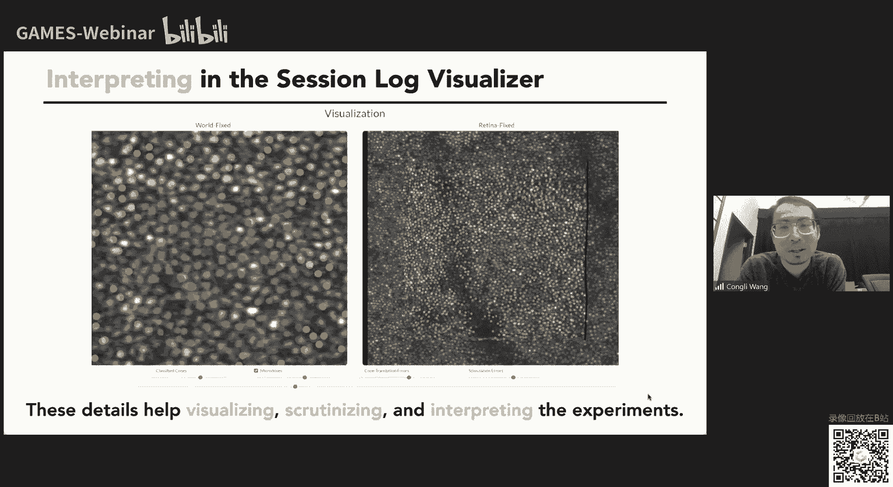

是很大的地图对吧，然后另外一个主要的挑战是我们怎么样从这个测量到的这些呃。

vivo的这个信息里面去重新建一张很大的地图，然后我们现在有算法可以直接做到这一点，然后对比之前的结果，我们现在的方法提高了很多，然后对，但是但是具体细节我就不跟大家讲，因为呃一个是时间。

另外一个是这个还是没有发表的工作，好吧，然后大概就是这样子，谢谢大家啊，有问题可以提问，好的，谢谢那个呃王博士啊，非常有意思的工作，尤其是最后这个东西，因为我之前或多或少了解一些。

这个是一个啊真正的是一个交叉性的学科，光学，然后这个计算机也是光学和心理学等等各个领域都合在一起的，那今天可能给大家讲的是一个比较high wever的概念，所以有些东西其实还是因为比较前沿的研究嘛。

所以很多东西其实还是不确定的，所以可能大家就是听起来有些地方的技术细节还没有很明确，所以这个也是希望大，家能够理解，那我们这边也有很多同学对这方面非常感兴趣啊。

就有同学直接评论说可以是否可以用a o c t就是adaptive exo city，来去帮助这个啊，做这个东西的效果会更好，另外就是这个非常好的问题啊，但是我想要给大家让。

让我回到这个刚刚的slice，是个非常好的问题，我想给呃对，首先a o o c t理论上是可以的对吧，而且实际上而且实际上跟a o s o的这个区别其实是很小的，基本上基本上没有什么主要的区别。

只不过是a o，但是关键关键是什么呢，关键在于啊这个过程是有两部分，首先第一部分啊你有a o了对吧，这没有问题，所以但是呃你你要你要做image和做stimulation两部分都很重要，为什么呢。

首先ao啊是用来做这个校正，校正这个眼睛的这个畸变的对吧，然后image是为啥呢，是因为我我之前说眼睛在不断的快速移动对吧，因为，我们想要对每一个呃空空cell做这个做这个激发。

那么我们就必须得快速的定位到这个眼睛的位置，那么也就得做image对吧，然后以及你做stimulation是因为你要你你知道这个眼睛的位置之后，你在你在调制相应的可见光的这个呃强度去达到你想要的结果。

为什么为什么为什么为什么为什么为什么，我觉得l o c t不一样，是因为什么呢，是因为o t t它是个成像的设备对吧，你得到的是个模拟match的一个一个信息对吧。

但是这个地方的话我们其实不需要这个体积信息，我们只需要的是这个，视网膜地图的形状以及我们想要知道在哪个地方去啊，做stimulation。

因为a o s o跟a o a o c e的唯一区别就是只不过是你的光源有呃，有有不一样的地方，因为你像a o c的话，你需要用这种嗯运动运用这种这种这种这种这个啊就是这个sweet source。

或者是这种这种啊这种fix dmin这种方式去去做对吧，但是你在o o o c里面，它不需要这种光源，因为它目的不仅仅是成像的目的，更多的是更多的是做stimulation，更多的是做去做去做激发成像。

只是用来帮助定位眼睛位置的一种方式，但是这个这是个不错的问题，我觉得好的，谢谢啊，然后其实还有同学关心说这样一个东西啊，从像素层面来说可以做到多少，因为其实一旦谈到显示。

大家第一反应就是我们有多少项要素，对不对，这是个非常好的问题啊，就是大家可以这样想，就是呃现在我们的photob呢是大概1度乘1度，这个这个大概有多大呢，就是你的大拇指的指甲盖这个大小。

然后把你的这个放到你的这个手臂的这个长度，这个地方这样看，然后你这个指甲盖这个这个大小大概就是1度乘1度左右，这是我们现在，display的这个大小对这个的确非常小啊，对但是啊怎么说呢。

这个毕竟是一个science的东西，因为我们想要做的是不仅是computational image，不仅仅是计算成像。

我们更加做的是一种computational imaging for science对吧，我们要我们这种是个更尊重的平台，它不仅能做这种做这种dic。

它更多的是一种呃做这个human vision研究的一种一种平台，因为你要理解人的，比如说你像我们之前说的，像为什么人有两种这种这种呃，就是如果你是两色人，如果你是红绿色盲的话，你看不到啊。

你无法分辨红色和绿色的，但是因为我们这种设备的话是有，可能让色盲能分辨红色和绿色，这些都是都是这个呃这这个显这个显示啊，显显示设备可以做到的一些东西，对我觉得这些都是很有潜力的，对非常有意思啊。

这个我个人也是非常感兴趣，我觉得这是一个啊就是真的是一个做科学研究的一个大方向了，就是从除了从这个啊传统的计算成像，在这个日常摄影或者是工业成像方面的应用，往更深的一个层次走了一下。

对那当然也有很多的挑战和很多的这个不确定的因素，但是这才是所谓的研究的快乐，所以我们非常期待啊，这个你们，后续的工作对，是的是的，谢谢啊，然后大家可以看一下还有什么问题对。

因为其实很多呃这个评论上的问题，刚才王博士在讲的过程中都已经cover了，所以我们这里不再赘述，大家可以回看一下问题，以及回看一下后面的这个视频对，然后我看这边还有之前的一些问题，那么看一下。

就其实最开始有一个同学关注了，说从一开始在讲这个计算成像的时候，大家很多人在谈到光刻机啊，就那我说光刻机的中的成像有哪些难点，这个对，但是我不是做这个的。

但是我知道的是有人做计算光刻computational，liography啊，具体就是说因为大家知道光刻机里有个眼膜，然后这个眼膜决定了你这个呃光刻出来的这个样子，但是因为眼色存在。

然后这个你这个眼膜跟你最后成就是刻出来的东西可能不太一样，对不对，然后有的人就做这种计算，光刻就怎么做呢，就是说呃根据你想要的这个这个pattern就反向优化你的这个眼mask，老去做这个反弹硫化。

然后啊有很多一些仿真的结果，看上去还挺有趣的对，但我觉得这也是一个可以做的点，但是我对这个了解不多，是我唯一知道的东西，关于关于光刻对挺好的，所以今天其实王博士给大家分享了三个方面主要的内容吧。

第一个方面是啊we fly，三星这个东西其实是在呃光学领域，尤其是早期这个天王丞相这块，对大气湍流的这个形象这块有非常多的应用，也是很有意思的，那其实过度而有很多同学提到了这个adaptice。

这就是自适应光学，然后后面又给大家讲了这个所谓的depression optics，那这个其实是啊近几年这个发展的一个研究热点的，那也是我们games 204这个课程的一个核心问题。

那啊前面几节课程我们主要是从这个视觉csl跟图像的角度，色给大家就是讲了一下一些背景的东西，那从下周开始，我们也会进入这个核心的内容。

就是相当于是把deflect of defensive optics的各个模块给分开讲一下展开，所以后面有很多的啊内容也欢迎大家持续关注了。

然后第三部分王博士给大家分享了一下伯克利这边啊非常前沿的工作，这真的是一个非常前沿的工作，我个人认为是就是有那些sars的这个潜力的对，然后其实也是非常有价值有意义的，对于我们人类视觉的东西。

因为其实人类视觉human resistance是最好的相机啊，有超过1亿个像素的这个分辨能，力有很大很大的这个动态范围，但实际上我们目前的一些啊研究，所以这个方向的研究是很有价值和意义的。

也欢迎同学们及时关注，这边还有一个同学提了一个最后的一个问题啊，就说啊前面的一个重聚焦的问题，refocusing就如何来评价这个聚焦的精度，就我想肯定是前面这个啊wfla那一块的吧。

对怎么评价这个聚焦的精度对吧，这个让我做一次分享，s y x，这个我觉得怎么评价这个精度，这个这个问题怎么回答呢，就是这其实是个蛮蛮开放，蛮有意思的问题，这个也也有很多方面的东西去衡量。

你可以简单评价一下，就是某个应用来说对，就比方这个对我觉得怎么评价精度嗯，我最关键的还是看你要做啥，像你像这个情况的话，是我们想要重新聚焦到一个呃，每个让每个细胞啊，就是在对焦的这个点对吧。

这是我们想要做的，实际上我可以简单说两句，我觉得呃关于这个精度也好，或者是其他的成像质量也好，通常我们会说这是一个domestic的问题对，所以其实你你更多的时候如果要去评价他的话。

可能会去考虑在具体的某个应用上面，然后其实啊成像传统的一些成像的标准都可以用来评价，算一些特殊的一些表征，去评价它聚焦的精度，对这个就是很难用一个一个简单概括性的这个颜色去回答这个问题。

然后对我记得还还想再，再提一点，就是这个数字从聚焦，可能跟有的同学可能理解的那种类似广场相机的处理，从小可能是不是不太一样的啊，因为为啥呢，是因为我们在这边做的是服厂的，从聚焦。

也就是说我们传播的是一个点，就是你可以认为是一个相干光源，一个点所所所发射的这个服厂对他做重聚焦啊，然后他他可能他他的他所谓的遮挡是不存在的，是因为你只有一个误点，所有的光，比如说像这个情况的话。

所有的光都是从这个呃我们这个相相干的光源这一个点发出来的，所以它没有所谓遮挡的，问题遮挡的问题的话只是在比如说你如果考虑几何光学，你你是个你这个思维live的时候，就是就是你你是所有光线集合的时候。

那么有的光线被挡住了，有的光线没有被挡住啊，这时候你才会知道遮挡的问题，我觉得这这是一个我我想补充的点，好的对，然后也还有同学关注这个wave fcc，通常因为现在的这个器件的限制吧。

通常会有一个we are no one的这个呃敏感度跟空间分辨率的trade off，这方面有没有什么评价，in comments，什么什么敏感度跟这个wifi 3性的敏感度跟空间分辨率的trade对。

这是个非，常好的问题对，然后我想说的是什么呢，就是我其实第一篇文章没有讲，因为没有时间啊，但是如果你去看我那篇啊，we processing啊，理论的这篇文章，这篇2020年的oe的话。

我在里面有一个公式，就说这个横向空间分辨率是取决于你这个你这个coding optics，就是你编码原件跟你呃传感器之间的距离，这个距离越小越好，而且这个是fundamental里面对这是我的。

我觉得是最重要的一个common，你可以去看一下，我具体是怎么从几何光学或者波动光学出发推导这个公式的，好的对，那其实嗯就是王博士今天讲的大，多数内容啊我们在网上都会有，我相信在网上都有一些公开的信息。

所以大家其实如果特别感兴趣的话，可以关注一下，我个人这边也非常期待文博是新的那篇paper能到我公众号support一下，期待我们这个公众号能够报道一下你们的工作，对对今天可能由于时间的关系啊。

我们也差不多要到这边，以及具有这个nature science潜力的这个新的这个这个visual size的问题嗯，对，非常感谢，再次感谢，然后大家如果有问题的话，也可以随时联系啊。

我们今天的课程差不多就到这里，那给大家拖了一些时间，非常抱歉，那也祝大家周末快乐，下周的是同一，下周的这个周五，我们会恢复到这个regular的这个上课时间，然后具体的内容我们会在群里面再通知。

也欢迎大家持续关注。