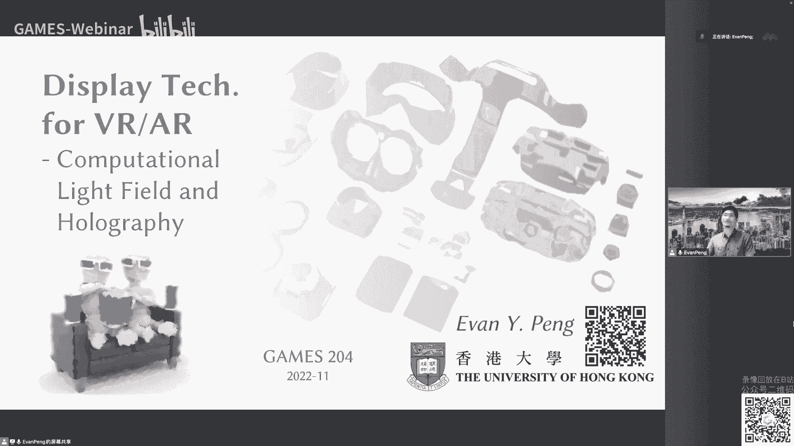

# 课程名称：计算光场与全息显示 | GAMES204-计算成像 - P1

## 📚 课程概述

在本节课中，我们将学习显示技术中的两个核心概念：计算光场与全息显示。我们将从基本定义出发，探讨它们的工作原理、技术挑战、当前的研究进展以及在未来元宇宙等应用场景中的潜力。课程内容旨在为初学者提供一个清晰、全面的入门指南。

---

## 🌟 光场显示：从概念到应用

上一节我们介绍了课程的整体框架，本节中我们来看看光场显示的基本概念。

光场是一个描述通过空间中每一点和每一方向的光线亮度的函数，通常称为全光函数。在图形学中，常简化为用空间中的两个点（u, v, s, t）来表征光线的传播，即4D光场。

以下是光场应用的两个主要方向：

1.  **光场采集（相机）**：通过在传感器前放置微透镜阵列，一次性记录来自不同方向的光线信息。后期通过算法处理，可以实现重聚焦、大景深等效果。其核心原理可表示为：`最终图像 = 算法处理(微透镜阵列采集的多视角图像)`。
2.  **光场显示**：作为光场采集的逆过程，其目标是为观察者的双眼提供来自不同方向的光线信息，从而产生立体视觉和正确的视觉辐辏调节冲突（VAC）线索。

---

## 🔍 光场显示的形态与挑战

了解了光场的基本概念后，我们来看看它的几种实现形态及其面临的挑战。

光场显示有多种形态，例如电视、便携设备和近眼显示设备。其基本原理类似，通常包含可调制的背光和多层液晶显示层，通过算法耦合，使最终出射的光线编码了不同的强度和方向信息。

然而，光场显示面临一个根本性限制：在显示面板总像素固定的情况下，需要在视角和空间分辨率之间进行权衡。这限制了其显示质量的进一步提升。

---

## 🌀 迈向波前：全息显示原理

从光场（光线）的描述，我们进一步深入到更本质的波前描述，这就引出了全息显示。

全息术通过干涉记录和衍射再现来完整记录和重建物体光场的波前信息。其过程可概括为八个字：干涉记录，衍射再现。

以下是光学全息的基本步骤：

1.  **记录过程**：一束相干光（如激光）被分束。一束作为参考光，另一束照射物体后成为物光。物光和参考光在感光干板上发生干涉，形成包含物体波前信息的干涉条纹并被记录下来。
2.  **再现过程**：用相同波长的激光（再现光）照射记录好的全息干板。干板上的条纹结构对再现光进行调制，衍射出的光波精确重建了原始物光的波前，从而形成一个可供观察的虚拟三维像。

理论上，全息可以完整编码三维信息，是实现真三维显示的理想途径。

---

## 💻 计算全息：算法与优化

既然光学全息能记录真实场景，我们自然希望用计算的方式生成用于动态显示的全息图，这就是计算全息。

计算全息图生成后，通过空间光调制器（SLM）显示。SLM可以控制每个像素点反射或透射光线的相位延迟，从而调制光波。

计算全息图生成主要有两类算法：

*   **直接法**：例如双相位编码法。将目标图像的复振幅信息通过一次传播计算并编码到纯相位图中。优点是速度快，可实时；缺点是成像质量较低，会产生重影。
*   **迭代法**：例如经典的GS算法及其变种。通过在目标平面和SLM平面之间多次正向和反向传播迭代，不断更新相位图，最终收敛到一个较优解。优点是成像质量高；缺点是计算慢，难以实时。

---

## 🤖 智能融合：神经网络与计算全息

传统的迭代算法在速度与质量上难以兼顾，而现代优化方法，特别是深度学习，为计算全息带来了新的突破。

我们可以将全息图生成过程构建为一个可微分的物理仿真模型，利用梯度下降进行端到端优化。从随机相位开始，通过正向传播计算损失，反向传播更新相位，最终得到高质量的全息图。

然而，仿真与真实设备之间存在差距。我们提出了“相机在环”优化策略，将真实拍摄的图像反馈到优化循环中，让算法自动补偿光学系统的像差等非理想因素，显著提升了真实显示效果。

进一步地，我们可以训练一个神经网络模型来学习这种“相机在环”的优化映射。在训练阶段需要相机参与，但在推理阶段，训练好的模型可以直接快速生成高质量的全息图，实现了速度与质量的平衡。

---

## 🌈 超越激光：部分相干光全息

激光作为相干光源会带来散斑噪声，影响图像质量。一个直接的解决方案是使用非相干或部分相干光源，如LED或SLD。

部分相干光全息面临新的挑战：宽光谱会导致图像模糊。我们的研究通过算法预补偿，在计算全息图时就将部分相干光的特性考虑进去，从而在抑制散斑的同时，尽可能保持图像的清晰度。实验表明，使用SLD光源能在保留细节和消除散斑之间取得良好平衡。

---

## 🎯 三维全息显示与未来展望

全息的终极目标是为三维显示服务。我们可以将三维场景分解为多个深度层（RGB-D），或者直接使用光场作为输入，通过我们构建的神经网络模型生成相应的三维全息图。

我们已经开发了VR和AR原理样机。在显示中，可以实现逼真的聚焦和离焦效果，其景深效果非常自然，接近真实光学成像。

尽管计算全息与光场显示前景广阔，但目前仍处于实验室阶段，面临眼盒大小、视场角、计算效率等诸多挑战。它们与变焦、多焦面等技术路径是互补和结合的关系。未来，端到端的光学设计优化、全息与波导等新型光学元件的结合，将是重要的研究方向。

---

## 📝 课程总结

本节课我们一起学习了计算光场与全息显示的核心知识。我们从光场的定义出发，探讨了光场采集与显示的原理。随后深入到全息显示，讲解了其干涉记录与衍射再现的物理本质。接着，我们详细介绍了计算全息的两类算法、面临的挑战以及如何通过“相机在环”优化和深度学习技术来提升成像质量与速度。最后，我们探讨了使用部分相干光抑制散斑的方法，并展望了三维全息显示的未来发展趋势与挑战。希望本课程能帮助你建立起对这两个前沿显示技术领域的基本理解。