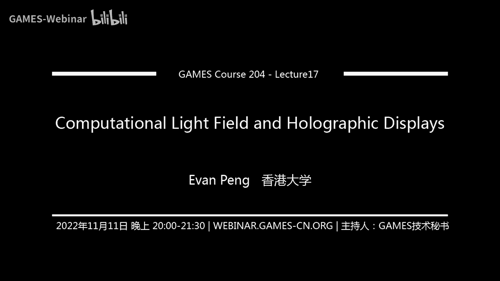

# 显示技术补充：计算光场与全息显示 ｜ GAMES204-计算成像 - P1 - GAMES-Webinar - BV1YK411o7yS

如果没有问题的话，那咱们再稍等个两分钟吧，对今天正好是这个双11啊，相信各位应该也挺忙的啊，就是有同学可能在购物，那可能今天又是啊，有些同学可能要投稿对吧。

今天是i tribe ec vp r的这个第五最后一天，所以其实有很多这个做cv，做machine learning，做ai的同学，现在其实是在奋笔疾书，在跑最后的实验，结果也比较辛苦。

那这也是其中一个原因，所以我们决定今天在这里做一个pose，就先给大家take a break，从这么多的这个vision的image camera的这个内容上面，先抽空回来，先谈一下其他方面的东西。

对然后那个哦如果大家看群里的通知，其实关于呃之前作业的讯息在群里也有，那这个作业的就是17号吧，下周四，所以啊今天也是想说再给大家换一个课题，可以留给大家更多的时间去看一下作业的东西。

所以我们今天可能就是啊可能两个月前吧，对跟大家见过一次面试，是讲了一个display table vr的one one 101 introduction的部分，那当时其实也有同学提到了。

说可否在详细的讲一下显示，尤其是这个全息这一块，因为这2年其实啊metaverse非常火热嘛，所以可能计算全息的这个需求以及这个关注度还是蛮高的，所以呢我们今天就正好借这个契机。

take a break给大家这个简单的分享一下这个live graph的一些东西，那可能今天的内容还是跟上次一样，不像是先把这个啊exercise的这种教科书式的课程，就是讲的非常的细节内容。

那我可能会更倾向于是一种普及式的，就是让大家了解一些概念，以及呃我们目前在学术界这方面的一些研究，那当然可能更多的是以我个人参与过的一些项目的这个实验结果，来作为这个平台。

那其实也是希望给大家提供一个机会，可以去多多讨论，因为其实刚才今天在群里面也有同学问我说，对这个meta这个事情怎么看啊，那怎么说呢，其实有好有坏吧，对我觉得其实每个人都会有自己的想法。

关于这个所谓的metaverse，我们其实是做这个方向，也并不完全说我啊个人百分之百的认同ma的所作所为吧，这个我们后面也可以在呃抽空来讨论一下，ok我觉得那时间差不多了。

我们可以差不多开始就大概还是跟上次一样啊，就是如果有什么问题，或者是说哪里的这个视频流稍微卡住了，可以在弹幕或者是在群里面留言，我们会有技术组的同事在随时跟进，这个非常感谢这数组的同事。

因为我还是这个问题，我现在人在海外的ip，所以实际上我们没有办法直接做推流，需要这个技术组的同事一直跟进，整个直播的过程非常的辛苦，再次表示感谢，好的，那我们今天就差不多开始了啊，咱们c。

对我呃。

其实很多朋友今天在问我这个事情啊，也就是咱们中国时间的周三晚上以及周四，昨天的时候，我相信很多人跟我一样，我的朋友圈都被这个事情刷屏了，facebook或者是说现在称之为meta。

他这个lay off了11000名员工这个事情，那所以其实大家也在开始在在退一步的反思，说到底原因就是这个事情靠不靠谱哈，就是一半是哭，一半是笑，对我觉得圆宇宙这个东西啊，我个人感觉在2~3年内，他。

其实还是没有办法在消费端普及的，但是也就是因为说他其实还是一个比较前沿具有风险性的东西，所以我们从学术界，从工业界的这个啊研究的角度才有更大的价值。

那当然确实是可能facebook或者说mea之前这个前2年的步子迈得太大了，所以他现在再再稍微pay back，为他自己犯的错了买单，稍微在这个往回退了一步，那我觉得也不见得是一件坏事吧。

对整个产业链来讲，对整个这个研究的方向，研究趋势等等，都是一个怎么说，提供一些insi，ok那其实在这个情，况下面我们就会回到刚刚那个点了，mea一直在给我们灌输的一个大的story。

就是我们会有一个好未来的世界是bers，然后无论怎么样，这个mtv里面最核心的那个点其实还是回到了这个显示的模块，因为其实meta被大家吐槽的无非就是两点。

一个是说这个啊小张的这个原宇宙的虚拟人物太过于简单，不够逼真，对这个是content creation的一些问题啊，那第二个就是说它的这个头衔，他的一些其他的这个平台，从这个显示的质量。

从这个啊头戴的舒适度，都是目前还不足以，就是啊convince我们的消费者去花这个钱去买单的，那所以归根结底而言，我们今天所care的还是这个，回顾一下我们上次讨论过的。

就是future display and visualization series，对吧，那这个也是我相信在大家上一次给大家展示过的，那这些所谓的科幻电影啊，就给了我们很多很多的。

但实际上我们还是会focus到这两个点上面，这也是我们今天要讲的，从like you和photograph的角度来讲，观赏和全息显示它是更适合服务于这两个啊应用场景的。

就是一个是多人的这个呃分享式的这个显示，第二个就是我们所谓的禁言显示了，那我们先来讲这个进行显示这一块吧，就大家其实肯定都或多或少的试过了各种各样的显示器啊。

那我们上市其实也给大家普及过了人眼的一些问题，那实际上你所看到的大多数显示器，question two，以及他们最新的quest for，它实际上本质上无论它更新到目前的三代，还是一个啊2d的显示器。

然后经过一个放大镜，一个镜片投影出来一个虚拟的2d平面功能页观看，那在这个情况下面，你所看到的这个virtual image，它实际上是一个fix foger，那它是一个固定的焦距。

它会呃缺乏足够的我们所谓的称之为focus cues，那最强大的一个点就是我们之前所一直强调过的所谓的vc啊，聚焦跟自适应辅助的这个confit，那它带来的问题就是为什么大家在佩戴啊。

这个头戴显示器超过一定时间的时候，你会产生这个头晕目眩的一个主要原因之一吧，所以要解决这一个问题呢，我们说光学领域和计算机图形学领域在过去的十来年的时间里面，花了非常非常非常多的这个经历和工作。

在研究如何去使得我们的这个near display能够提供一定的focus cute啊，这个还是需要有这个computational的这个助力了，就缺乏了算法本身的助力，这个的实现是非常困难的。

那这期间很多的工作其实也是meta之前收购的oculus的的一些很多员工，那首先我们来看我们说呃，传统的这个vr的display，它只有一个的focal plan。

那如何实现它这个更好的这个呃圈圈的focus呢，最简单的我们来做这个very focus对吧，我们还做一个公啊胶平面的扫描，那啊单纯的去扫描全部的光谱面，其实它这个成本非常高的。

但是我们目前会有这个所谓的gas，the i check in the technique，所以我们有了这个叫做gta very  display，sorry，那它实际上有一个很大的问题。

就是说我们需要有更多的这个啊扫描器件，而且这个扫描实际上是需要一些，你看尼克就是机械上的一些啊器件，或者是说从电子上来实现一个变焦透镜，把这个乘出来的虚拟项乘到不同的相平面位置上面。

所以它会带来的问题是它的这个系统结构相对来说还是比较复杂的，那接下来我们就有了，如果我们不做扫描，或者我们直接在呃不同的这个面上面乘出来多个深度呢，这就有点于有点像。

我们把一个3d的场景给分成了不同的不同的这个平面，那实际上反过来讲，如果我们要通过它来做成像，那是否我们在显示层面也可以这么做，如果我们可以把这个显示的图像给成了不同的深度平面上面。

那我们同样可以提供足够程度的，focus cups right，那这也就有了第二类的display，我们称之为mari plan display，那它会有什么问题呢。

同样的你要实现这个mac print，就像第一类的very fox，但我们可能会需要的是什么，我们需要一个非常高速的spiritual rate，去改变图像成到不同的这个深度上面，而且是尽可能的多平面。

尽可能的连续是比较好的，那或者说我们需要有多层的这个lcd print，这个大家也是了解的那一样的问题，他的这个system complicity同样是非常高的。

那第三种这个啊显示种类呢来这就开始逐步过渡到我们今天要，讨论的一些方向上面了所谓的光场显示，那这个广场的概念其实等会儿我们会具体说啊，已经提出来了十来年了吧，就算光场显示，它也有将近10年的时间。

他经历过了一段时间的波峰，但短期内又有稍微一些下降，那这个最大的问题是什么呢，它非常好，它能够提供这个三维的显示信息，但实际上呢我们都知道它的分辨率，它的这个信息带宽是非常受限的，那只有两个限制。

一个是本身它会有一个所谓的depression里面的限制也是限制，第二个是我们目前所用到的大多数的光场显示，它还是，基于现有的display panner，比如说我们的液晶显示面板。

那它总体的像素总数以及它的带宽是固定的，所以实际上它的一个上限是在那里，那我们人总是希望消费者总是希望能够同时实现大的视角，同时实现大的平面分辨率，在这个情况下，面。

目前的live display他的这个resolution是非常limited，似乎我们回到了这个大家一直在问的概念啊，或者是说全世界都在讨论概念，holo，就每一天都能打开这个网页啊。

凡是谈到语言宇宙的，就大家都会提到全息holo这个词，但到底什么是holo，我们现在看这个holo graphic evolution，就上次其实也给大家简单的提了一下，在1947年的时候。

就是超过半个世纪以前啊，the disable development这个theory of horrographic，新有了这个theory develop，但是他真正来做起来的是什么。

其实他啊去push他把这个事情做完了，是60年代初我们有了laser，就是类似的发明了这个其实也是啊，前2年我们有一个international day of light对吧。

国际光日也是讲到了lisa的这个事情，然后到了62年我们就有了这个project article horror，the record string obje。

就真正的用这个laser用了这个呃光记录的全息的方式，实现了3d物体的记录和重构，然后他就沉寂了将近20年的这个时间，一直吃到了80年代，作为全新的探讨，又有了一波新的浪潮啊。

这里我们说在80年代初的时候啊，我们会有他得到了一个很大的发展，那主要由于是laser的机，就是激光的这个更新换代了，那我们这个时候从传统的一些比较复杂。

比较昂贵的激光器过渡到了我们有这个solidler，所谓的固体激光器，对，那这个肯定自然而然的就push了前全新的研究的发展向前了，所以在1983年的时候啊。

我们这全息有了第一张这个credit card，在信用卡上面有了这个所谓的类似于现在的这个全息防伪，然后又沉寂了将近20年的时间，这个历史总是惊人的相似啊，真正的从全息防伪这样一个静态的全息图像。

又经历了将近两个decade，在09年的时候，我们有了这个interactive，however is play，它终于被给比赛出来了，当然这还是一个lptap实验室的产品，然后在10年代。

无论是在光学还是在图形学领域，我们就见证了又一波浪潮，有很多很多的这个关于全息的这个呃学术论文被发表出来了，ok那我们来看一下全息呃，今天我们展示的是光学全息啊，还首先还不知所谓的这个显示的概念。

还是一个holograp，大家可以看到啊，光时的全息它实际上是非常的逼真的，它可以record的真实的哦，场景中的光场讯息，比方说我们左边的这个场景啊，这个是一个真实的博览会上面的场景应该是在俄罗斯吧。

12年的时候，然后这个virtual for real的这个场景是非常非常相似的，那到底是如何实现这个所谓的光学全息呢，我们来看下一张图啊，就是是全息的记录和在线，我们说实际上就是八个字。

该设纪录也是在线，从光学的角度来说，那最简单的我们来看有这样一个光路啊，首先我们有一个cp人来b，比方说我们有一说这个啊干涉的相干光，相干光，比方说激光，然后我们把这个激光打到一个冰speech上。

就是对这束相干光进行了一个分数，分成了一竖向前平行的传播的光，另一束光是向下对，有一个转折的过程，我们称之为两路，一路是illation照明光路，另一路是这个refresh他的这个呃参考光路。

让我们知道当照明光路打在物体上的时候呢，原来的这个平行的平面的波经过物体表面的形态的这个调制，它会发生这个形变，也就是说我们其实物体给我们的illation b进行了一个modulation。

就是进行了一些调制，得到了这个object b，那这个object并向下传播，打的时候打到了我们这样一层所谓的photograph play上面，那通常来说可以是各种感光胶对吧，就类似于呃光刻胶。

或者是这个照片提交等等，这样一束distorted经过调制的有分布的物目光，所谓的object跟reference ban，他们产生了相，干它们会发生这个相互的作用，就会产生了干涉条纹。

那这些干涉条纹里面就encode了，也就是所谓encode，the wafer encode，这个拨弦，这个拨弦就会被这个呃感光的这个平板给它记录下来了，于是乎我们就记录下了三维场的信息。

那我们需要将它显示出来，衍射在线，那这个时候同样的我们说我们同样是用相同或长的激光打进来，一should be construction变对吧，就打到我们这个，记录下的这个全息干板上面。

那么这个钢板这其实就是在一个解耦解运算的过程吧，跟我们钢板上面记录的这些条文的信息产生了一定程度上的反应，这个时候就解耦出来原始的这个目光的波前的信息。

那就会得到了一个啊virtual image供观察者看到，这个就是所谓的reconstructing the horrogram对吧，然后这里我们呃右边我放了一个显微镜下面看到的全息图啊。

这实际上就是这全息钢板上面放大之后，你能看到的这样一个啊它的结构，那大家可以看到啊，它其实有非常非常多的微结构的，那这些微结构的产生就是啊我们前面讲到的，在这个recording记录的过程中。

经过条纹的干涉和产生的这个呃纹理，所以我们说实际上全息的产生的过程是一个干涉记录，演示在线的过程，那通常来讲我们可以记录下来的是整个雾光场的wifly。

所谓的波前重构出来的自然也是这个呃暮光场的wei fly，所以全息是从理论上它就可以encode 3维的信息，于是乎大家就会进一步想，那我们从这个全息干板可以记录下这样一个静态的信息。

理论上如果我们将它做成显示器，我们是否就可以自然而然的实现真三维显示，这个其实也是有点类似于嗯star wars，星球大战里面的这些虚拟的全息显示的一些概念，于是大家就会在在想这个概念。

我们一直在讲全息，在讲广场以及传统的所谓的mari view的3d display，那到底他们之间是有什么样的区别呢，我们说实际上啊他们是一个子集的子集的过程，我个人认为从光学的角度而言。

它实际上我们是从r从光线的表达的这个过程逐步过渡到啊，从微fly就是拨弦的表达的这样一个过程的，对一个一个怎么说呢，就是一个解析的过程吧，所以不论是like you也好，不论是holoba也好。

我们的终极目标都是希望去恢复啊，这个物空间的整个广场为flag，整个波前那无非是说在目前全系做不到的情况下，面，我们从wave稍微这个降低一些维度，我们降低到race，这个时候我们就叫life you。

虽然我们说全息啊，但实际上广场是全息的一个子集，所以我们先来插播一下，先来了解一下广场，那这边我给出一个非常former的wikipedia的解释啊，什么什么是广场。

它是一个vector function，the describe mt of life，following in depression through，every point in space。

就听起来是有些复杂的啊，广场它实际上呢就说描述通过空间中每一个点和每一个方向的，光的亮的一个函数，我们通常称之为全光红数，也是得益于一位科学家，大家其实应该都蛮熟的，法拉第对吧。

他首先提出光应该被理解为一种一个厂的概念，就如同他所提出的meme to feel磁场的概念一样，再后来呢就会有这个广场的概念是由这个另一位算命为这个啊，列位科学家在1846年，sorry啊sorry。

1846年是法拉第提出的，然后在1936年的这center，其在一篇scientific paper上面定义的这个三维空光，在三维空间中不是测量的经典论文，所以就定义了这两个词的意义，然而近年来呢。

光学里面的这个光场又逐步被图形学的光上有了一个更新的定义，我们这么说吧，上面这张图我们说这是全光函数的定义，是谷地的五个维度的，所以我们有一个c呃，five，这里就是五个维度去定义这根光线。

它的这个啊传播方向跟传播强度对吗，这个是维的，但过去的这个10年的十几年的时间啊，土星学graphics又进行了进一步的简化，用空间之后两个点uvs去表征了这个光线的传播，我们又称之为4d的广场。

但实际上不论是5d还是4d，我个人理解它实际上都是对这个更高维度的，we friend播前的一个表达的一个子集，于是乎我们就有很多的广场，那我们这个课程就要计算成像，但实际上广场它既是有计算成像的东西。

又是有显示的东西，我相信大家可能非常的了解了所谓的光场相机，或者说大多数同学可能知道广场都是从光场相机开始的啊，那光场相机其实是stanford的啊，06年的时候，marley boy。

还有他的这个p h d学生啊，n7 所提出的这样一个概念，那大家可能也知道了这个公司litter对吧，现在被谷歌收购了，那其实最简单的原理，它实际上里面就是一个大的敷衍，这阵列就是很多的微透镜阵列。

加一个大的主镜，就如同我这边图片给出的是一样，那实际上每一个微震静呢都可以理解为从一个角度，我们就拍同样的场景，那最后所有的这些场景的图像在被组件给encoding到cs上面去。

那我们就通过啊后期的算法的解耦，可以得到任意对焦平面的这个图像，比方说在这里啊，我们可以对焦在啊左边的这个是狗狗的这个图片啊，可以对焦到远近，比方说第一张图我们对焦的是前面的这个毛球，是在近景。

那第二张图我们对焦的时代的后劲，那最下面那张我们实现的是all in focus，也就是说一个非常大的景深，前到后的这样一个深度范围内，它都是处在比较好的聚焦的情况下面。

那这些东西都是在一次拍摄后期处理而得到的，所以这就有了光场相机，那大家自然可以想到我们可以通过这种方式获得关卡，但实际上我们说啊显示无非是相机拍摄成像的一个逆过程对吗，那我们如何去得到显示呢。

无非就是提供不同程度的不同角度的这个呃光是信息而已，那么举个最简单的例子啊，假设我们有一排的这个发光源，那每个光源对应的是一个信息，一个加一个透镜的一个啊一个怎么来说就是一个呃图像信息。

那实际上我们就可以通过呃成像的方式，反之的把这些信息定向的提供给人员观看，观看对应的是来自不同点发出的不同方向的光线，于是就有了观察显示，那这边是给了一个二一维的信息，一维的这个示意啊，自然而然的。

如果我们把这个扩到二维的维度来，那实际上我们就会有了真正的所谓的通常大家所知道的光场显示，这边只是给了一个非常简单的例子啊，通过一系列的array的投影，括diffuser什么的。

我们可以得到一系列的lifbg，就是对应了，大家可以理解为这其中哪一条就对应了，光场相机里面所谓的这样一个呃，微透镜阵列里面的微透镜所拍到的一个角度信息，当然它的encoding模式会有一些不同啊。

于是乎我们就有了life the acquisition and display，那说到了光场显示啊，我相信很多同学可能男孩终于下想到了就是啊goodwestern。

大名鼎鼎的高端western所提出的这个所谓的like you display，但实际上这么多年，科研人员也研究了不同形态的光场显示，这边这样我们可以做这个电视层面的，就是tv sours。

我们可以做这个portable device，我们也可以去做这个经营显示等等，我们把它所有的这些显示形态啊去拆解，看来它实际上基本的这个形态跟原理是类似的，就是多层显示，实际上无非是说我们有一层背光。

可以经过调制的背光，然后我们会有多层的lcd，通过一些算法，通过一些耦合，使得最终出来的这根光线它会代表不同形态，所谓的不同形态就说它encode了啊，不同的强度跟不同的方向，我们再来具体看几个例子啊。

在光场显示里面非常出名的一篇paper啊，tensor depression，那gin和那个dla dog现在就是meta facebook lapse的这个显示部门的director。

那郭德现在是stanford教授了，他们将广场表示为一个张量，一个tensor，那实际上我们讲这么多的这个液晶显示的层，无非这从数学上确实就可以表示为一个张量，那对张量进行分解。

我们就可以将这个高维度的光场不断的压缩成多个张向量的张量级，对吧，那这个所谓的多个向量的向量积，也就是对应到了物理层面的系统层面，用有限层数的液晶层可以实现这个完整的光场的过程。

这个是他们当年应该是12年前吧，对做的一个prototype是在利用类似于笔记本屏幕大小的这个液晶显示，三层叠加实现的这个光场显示吧，大家可以看到不同的这个视差图像。

好我们说除了这个啊笔记本这样的形态或者电视形态的光上，我们还希望大家大家总是希望把这个广场做到眼镜形态的，所以我们又有了lifesta display，那其实原理上一样的，无非是说在这个演技形态的时候。

我们大家有一些呃信息，有比方说我们有gates，所以我们可以做这个所谓的for viri对吧，那这个是呃浙大这2年的一篇paper吧，浙江大学刘旭老师团队的一些工作，这边也是实际的实验效果图。

大家也可以看到这个效果还是非常好的，当然了，我们可以再进一步的往外走对吧，就有了这样一个平台之后，有了两层的液晶之后，我们还可以做什么，我们除了可以做vr的display。

我们是否还可以增加更多的这个元素在里面，比方说我们去给它实现一个videos m r misery，比方说我们如何实现更好的interaction，毕竟小张所卖的这个原与车的空间。

最终而言我们是要与其他的用户进行互动，需要与真实的场景进行互动，所以呢我们在今年的这个是ut grass啊，to grass跟stanford今年的一篇h b vr的best paper。

那我们实际上做的就是从range端，我们有了一个focus step acquisition，的过程，然后我们有real time的这个tracking跟rendering。

我们又有了这个live serial display，就前面讲到了这个眼镜形态，或者说头戴显示器形态的光场显示，当把这些有机的结合起来进行优化的时候。

我们就得到了一个所谓的video is remake a reality，这个感兴趣的同学我们可以去看这个具体的视频啊，以及我们这个呃网页上的一些技术细节信息，大家可以看到，比方说这个也是视频。

我们可以看到这个前期上显示的是真实，可以通过这个显示器可以看，通过我们的头戴显示可以看到的，然后这边的蝴蝶是虚拟的对吧，然后大家可以看到用户的手可以实时的tracking，然后可以跟这个蝴蝶进行交互。

ok那我们讲说除了这个头戴显示的这个对于个人而言的广场之外，我们刚才说到了另一个显示形态，我们希望跟啊其他的用户去分享，有一个啊martin user是那个live display。

就比方说我们在开会的时候，比方说我们在做演示的时候，于是乎我们就可以像学术界这么多年也提出了所谓的capital life display的概念，这个概念其实挺简单的，早期我们想说，假设我们坐在圆桌前。

我们希望做的是什么，我们假设有一个高速的投影机，我们可以把图像投影在一个高速旋转的这样一个啊一个承接题目上面，那我们，就可以得到了这个共360度观看的光效对吧。

那这个其实大家可能会比较熟悉的是07年called devivid那天，squthe paper在过去的10年时间里，然后浙大的留学老师团队其实也是做了很多这方面的研究和改进，那最大的一个改进就是说啊。

我们把这个高速的投影机放到了桌面以下，这样子你在做交互的时候，光线就不会被用户的这个双手给挡住，同时我们把这个所谓的立体的金字塔式的，这个承接的屏幕给设计成了这个全屏的，类似于一个圆盘的一个一个装饰。

那这个情况下面它的这个，rotation，它的旋转实际上从这个立体的空间降低到了是一个implem，它的稳定性透光率都会更好，那于是转一圈的情况下面扫描一圈，大家可以看到啊，就是呃每一个角度。

每一个时刻的话是一个竖条对吧，那就高速旋转一圈的时候，扫描过来，其实就是类似于一个与啊筒状的这样一个观看空间，实现了360度的光场显示，那实际上算法上面是怎么实现的呢。

这个跟传统的这个图形时的random算法其实是类似的，我们先定义一些viewpoints，所谓的试点，那我们可以，从试点追击这根光线经过这个物体，假设是这个q这个魔方上面的一个点对吧。

然后再啊继续追击这个光线，打到我们这个script上面会有一个交点，那从这个scream是这样的焦点，它会经过一些折射对吧，再反向追击为这个投影机，就是project的这个投影点。

那这个就是我们这个在这个视频位置需要看到的这个图像信息，需要投影到屏幕上面的位置，那经过所有的这个点的追击之后，以及不同时刻的这个图像的切换，实施的切换，我们就可以实现这样一个3d显示的过程。

当然我们刚才讲到这，是对一个这个高度物理，这个virtual virtual direction而言，那我们又想如何去实现不同这个身高的人，在不同的视点高度同样能看到正确的3d显示，于是正在的团队啊。

在光学这方面确实他们是非常有建树，所以他们就引入了这个一个鱼眼镜头，360度的romi camera，那这个时候你就可以看到我们拍一圈还在图像，我们就可以detect上面，在不同的位置。

我们有use a one and usb，那我们的render在渲染这个过程，图形学的处理上就可以根据这个试点的位置去定向的投送，去改变这个不同试点的图像的渲染，大家可，以看到啊不同位置。

这个是是不同视角看上去的这个虚拟的魔方，右边的跟每个子图是左边的，这个真实的魔方的这个这个对应关系是我合的，我们接下来看一些真实的实验结果，那这些都是这个团队在过去10年做的一些工作了，大家可以看到啊。

我们可以比方说通过一些interaction的一些器件，我们可以做这个下下下这个国际象棋，那中间这个是这个360度的magic experience，这只老虎是看起来是浮在桌面的。

那这里我尤其是希望大家可以看的是右下角，这个我们称之为major procession，那其实很多时候大家一直在想到底什么是mix reality，就是我们要跟真实的场景交互有互动。

并且它更真实的场景物理空间是相吻合的，是相对应的，所以在这里啊大家可以看到的，我们把这个虚拟乘出来的这个cube，虚拟的这个craft这个cube跟一个真实的这个框框，大家可以看到是完全重合在一起的。

并且从各个角度看，它都是对应成立的，那这个也就证明了说，我们可以通过光学跟算法的这个有机的结合去实现interactive table to life of display。

其实这些工作都是很久以前的工作了，为什么这个时候在2022年代了，我还要提及呢，是说那么多年以前啊，其实很多时候算法的算力也好了，器件的这个贷款也好，都是受限的，尤其是在10年前，我们可能没。

有所谓现在的ai这个事情，那到现在我们再反过头来看，其实很多时候有了这个emerging physics跟emergent machine elligence。

实际上我们去重新visit这些当年做的一些方案，它也是有它的价值的，可能可以去inspire一些新的这个观察显示方案，或者新的这个呃，这怎么说说的源源宇宙的方案吧，ok从观赏的部分就到这里。

让大家可以看到前面我们给大家展示了几个广场的例子，实际上我们都还是在讲光线，这是全息的核心是什么，全息的核心是we float，我们讨论的是波。

那这里我们给大家展示这个classical computer generated hor管对吧，毕竟我们始终要做的是从呃光学记录的hologra。

但我们真正的dynamic display就是要给人眼看的，所以我们实际上还是要configuration for work的这个ip，这边我们有两幅图案。

那左边这个实际上是一个非常传统的叫做point in rome，就是所谓的点云的这个呃计算全息的算法，我相信图形学的同学们可能对点源已经非常的熟悉了，就不再展开在传统的这样一个方式对吧。

我们比方说我们要成为这一收啊，帆船那船上面的任何一个点有x y z的这个坐标对吧，那实际上它的x y z的坐标对应到这个平面上啊，对应到这个这个这个什么来着。

后关平面上面相位平面上面它实际上就是一圈一圈的环对吧，它实际上就是一个球面波汇聚到这个点，而球面波的相位就是你可以看到的这一圈圈的还贷，而最终我们实现了这个全息图。

最简单的算法就是ok我们一个点是这样一圈圈的环节，那我们把所有的点都追击都算出来，有n个这样的一个还贷的组合，那最终我们把所有的这些相位给super propose，就说我们把它相加起来就得到了全息图。

这是一个最难if的一个算法了，pinbase phone crow base，然后我们再讲右边的这个右边的这个又是另一个思路，我们可以从the point cloud，我们把一个三维场景的分解啊。

我们可以分解为点晕，那也可以分解为这个所谓的layer，就是一层一层的，没有，sorry，那我们把这个3d场景给分解成为了之后呢，每一个新的element就可以asize到它最相近的。

这个前面这个wafi上面去了，就同样是这样一个概念，小的这个微fla，比如比方说这个convolution ergo propagation卷积的这样一个运算，那这个是最基本的这个呃计算全息的算法。

这个这些算法会有哪些challenge以及哪些机会，我们说啊它实际上呢就是几乎所有的design，你把它这个拆解之后，它都是这样一个一个一个呃框架，我们首先有一个光源对吧。

我们刚刚在前面讲了这个光学在线的时候，我们需要有一束路，有一束入射的重现光，那比方说这里我们有一个激光，他发出的一个球面波，经过我们的cording majs就给他啊准时成了一个平面波。

那这一束光我们就称等价于光学全息在线中的这个reconstructed力，然后这束光呢会打到这个special moderator上面。

这个时候的special modation空间光调制器就可以等价于我们前面讲到的这个嗯，记录是全息干板的那层全息干板，比方说那层光胶。

那这个时候呢即使录射波就会被special moderator上面的这个呃，每一个像素进行了一个调制，就等同于这些像素的信息，就代表了我们这个encode的那些呃广场，的条纹信息。

这个也就是说我们需要显示的全息图片内容，于是乎跟我们的在线播一样，经过传播之后，这些每一个点被调之后发生的直播，在空间中不断的叠加，不断的相互干涉，他最终啊这个波峰相干相消之后得到了这个wifi。

它就形成了你所需要的物理的光场，就是空间，或者说咱们这里不能用光场，应该说啊，how do they object wif。

那这个wiflow呢通过一些光学透镜或者是其他的一些realize被人眼观看到，那这个就是我们整一个或者graphic nei display的一个形态了，那最核心的一点就是说我们怎么去计算这。

样一个呃全息图，并可以显示到我们这个special mode later上，ok我们再来花一分钟时间来讲一下这个special modulator，可能其实很多同学之前也问到过了所有的空间光调制器。

那你可以理解为它实际上跟你的这个sensor一样的，它是有很多很多的呃像素点对，但每一个像素点他接受了一定的光线，那它又可以反射出来一定的光线，但是把这个光线接收，反射过程中。

它的光线加了一个所谓的相位延迟，就是所谓的光线增加了一个光程差，那通常来讲的实现方式就有所谓的呃air pos，就是离qu液晶的方式来实现的，大家可以看到通过液晶的偏转来实现光程差的调制。

那啊产业界其实有一些呃几大这个special model is的厂家了，大家可能也都了解过了，那我们用的比较多的就是德国的holi，ok那回到全息显示计算全息的这个算法。

我们说要生成这样一个计算全息的图，我们会有两种大类型的算法，一种我们称之为direct message，那什么是呢，就非常直接啊，字面的意思就是一次传播即可得到，假设我们有这只兔子对吧。

它过一个back propagation，直接传到了special live modulation这个平面，那这个时候我们从一把一个负整幅传到一个另一个平面的负整幅，我们得到了还是个负整幅对吧。

但实际上呢我们的这个空间光调制器只能显示整幅线，所以只能实现相位的调整，所以我们只希望保，留下来这个相位的分布，怎么做呢，就会有了所谓的double face egg coding，所谓的双向位调制法。

这个大家应该也是听得比较多了，就通过这个呃像素之间的interacing，实际上可以把这个负整幅的信息给encode到持有者相位的信息上面，它的好处是什么，这个是非常非常快的啊，可以实现实时。

但是它的坏处也非常明显的，就是所得到的这个呃全息图，你拿去直接display的时候，它通常来讲会create很多的copy，就是所谓的呃回回应成像就很多的ghosting images。

而且它的这个成像质量是非常低的，就后面我们会有看到，ok自然而然对应于direct message，我们就会有了这个iterative meth，所谓的迭代，但我相信做过光学的同学。

大家可能对项目恢复啊，face retriever j s算法并不陌生了，我们来举个例子啊，迭代我们同样是从这支bin开始啊，我们一次向前向后传播，转告这个special leo的平面。

对我们保留下face，然后把这个呃整幅被丢掉，然后我们用这个当前的这个face进行一次正向的传播，得到了这个a bunny，那我们就在这里把face给丢掉，我们留下了这个减幅，然后再次进行了反向传播。

通过这样不断的正向反向迭代的过程，最终我们可以收敛到一个比较好的这个相位图，那同样的这proplication算子还是用了这个所谓的angular special，就是所谓的交互理论。

当然也可以用这个所谓的啊菲涅尔衍射啊，from coc衍射等等，就是光学的同学可以看一下复利光学这本书，其实讲的非常好，叫郭德门stanford出版的，那实际上呢它就是一次获得两次的复利变换的一些vi。

ok我们来做一个总结啊，我们说通常有这两类算法，那通常来讲迭代的算法它是相对比较慢的，很难实现，实是它的迭代的带来的好处，就是我们尽可能地收敛到一个比较好的结果，所以通常来讲它的这个成像质量是会更好的。

那我们在这里做了一个比较大的调研了，我们说所有的这个计算全系通常有这样一个渠道，就是所谓的image quality跟我们的run time的一个trade off。

我们通过在一个很大的dataset上面去做了一个研究，我们发现即使目前现有的这些啊迭代算法，它总是有，一个上限在我们的simulation的结果里面，它就根曲线的上升，当你这个迭代的次数不断增加。

它最后收敛的这个趋势越来越少，于是乎我们会希望去呃调研说，如果有些更简单的方法可以去bypass这个这些问题，我们实际上也能得到跟这个最佳的效果差不多的方法，但是这个算法就简单了很多。

那同样的我们说现在有了这个machine learning对吧，所以我们可以去得到一个比方说hold that啊，实现了跟这个迭代方法差不多的成像质量，但是它是实时的。

所以我们的问题就在于之前所有的这些方法，传统的计算全息，它我们称之为kristic，启发性的，从现在这个modern optimization的角度而言，我们有希望做的优化过程。

它是deterministic，就是说我们算法该收敛到自己，找到一个合理的解答，啊这个我们后面的说，descoptimization，我相相信在之前几节课程的时候。

这个啊孙老师其实给大家来个或多少讲过了，这个所谓的梯度下降优化的这样一个一个算法啊，很简单的sorry，假设我们要做一个优化，那我们每一步都是一个梯度优化，我们从什么开始呢。

我们从一个random相位开始，我们向前传播一次，我们会得到了一个这个副厂，就我们得到了这个f have free啊，free space propagation的model对吧。

这里那我们把这个have提取它的这个整幅讯息，跟我们这个目标的target跟target etitude a进行一个比较，我们就得到了一个loss，对吧，我们把这个loss depp给回去。

我们就得到了下一步的这个场啊，sorry，下一步的这个相位，那经过这样一个不断迭代的过程，它就可以得到收敛到比较好的这个相位全息图了，实际上他的这个呃ultimization trip是非常简单的。

就是gradient design g d，但是我们说通常来讲最大的问题往往都不是算法，最大的问题往往是实验，尤其是我们这种学系显示这种实验性科学，我们说俄罗斯是什么样的这个计算学系的算法。

从这个simulation的角度来讲，它的显示效果都是非常非常好的，比方说第一排大家可以看到的perfect right，但实际上在实验过程中总是会有这样或那样的问题。

比方说model miss bench，比方说真实啊，系统中的一些相差等等，它都会带来很多的哦这个啊wifly这些distortion。

而这个refriend distortion往往都是在呃波长量级的对吧，因为我们这里探讨的都是这个波长量级的变化，那学术界花了还有一些时间去讨论说如何有一些啊ai bass的一些技术。

可以去帮助我们做这样一个矫正celebration，而且是一个fly automatic man，所以我们就提出了叫做camera in the holographic概念，那其实这个概念很有意思。

很简单了，我们来说假设我们有两条的两套系统，一套是simulated的全息仿真的这个全息显示，另一套我们是这个真实的全息显示，仿真的全息显示，当然是perfect对吧，是没有相差的。

没有任何的degradation理想情况，然后真实的这个全息显示，我们又是有optic aberci，那如果我们把这张生成的相位图同时显示到仿真的跟真实的，这两个special moderator上面。

然后进行一次传播，我们会得到两个呃，负减负差对吧，我们这里有f跟ht，那我们在真实的这个全息显示中，我们可以放一个相机去拍摄下这张真实的这个mt 9。

然后我们把这个真实的antitude呢跟我们的target，希望得到的目标的这个antitude做一个lost，这就是一个正向传播的过程了对吧，那我们来考虑反向，我来反向的过程中。

我们不考虑这个真啊真实的这个全息显示的，因为实际上的真实的显示器上面，我们是没有反向传播的过程，我们没有办法对t to进行反向传播，我们去考虑写啊，similation这条pass的情况下面。

我们可以把这个loss求梯度反向传播，再传播到啊special moderator，我们可以去update这个face，这已经用了一个非常啊simple是clever and trip。

就是看到这里这里我这边写了一下，f pad是mination的，是我们可以得到的，assessment是真实的，是incessible，但是我们认为说sorry最终收敛的时候。

simulation跟真实的这两条pass它们之间应该是尽可能的近似相等，所以我们可以对这个梯度进行一个替换，来进行一个优化，这样一个不断的这样一个迭代优化的过程，我们就称之为camera的路。

那这个时候由于camera参与，所以实际上真实场景中带来的就像这些误差啦，啊degradation呢都会被encode到这个优化过程，中那他所得到的这个最终的全息图所include真实场景就更加逼真。

所以最终成像的这个效果自然就更好了，我们来看实验结果，左边是这个所谓的理想模型，就是我们不考虑真实场景是真实的，这个实验设备中会有哪些设备有哪些误差。

右边是这个camera road所优化得到的这个全息图显示的效果，大家可以看到啊，通过这个camera的路，我们实际上面它的这个呃显示效果会更加的对比度高，它的这个呃背景的噪声会低对吧。

所以ky的loop that's rescue这个成像质量，那这个存在一个最大的问题是什么，就是说每一个场景我都需要办个camera录，我都需要算一遍，model training。

我们是否可以借用这个概念，确定一个model出来，现在我就不需要啊，每一个场景都去做一个新的这个target，我们都去做这个cameron的路，还有同学在弹幕问到数值仿真时，是否需要对。

强度注意强度厂的采样啊，这个肯定是需要的，对这个当然也是有各方面的，一个是你的simulation，拍到了图像的过程，那通常来讲说啊，我们会倾向于相机拍照的过程。

这个相机的这个分辨率肯定是尽可能的高考对吧，对，但是真是通常在优化的时候，在前几度优化的时候，我们会对这个高分辨率图像进行一个勾选，broad first，就是先消除一些噪点误差带来的影响。

关于这个问题，我们其实在我们发了两篇paper中的啊，不是材料，是有这个详细的讨论的，感兴趣的同学可以去看一下，ok回到我们这个呃内容本身，这个时候我们想的是说如果我们有个data set对吧。

那我们把相机放在那不断的去拍，不断的去圈里，我们可以通过拍很多的图跟这个呃做这个training去算一个model出来，这个model呢可以是include一些物理信息的。

source intensity vs可能是透镜带来的相差，那这个可以用泽尼克来表示等等，那我们就可以把这个optimization就分成了两步。

在这个training stage我们算出来这个model，我们需要这个camera，在inference stage的时候，我们就可以把科目拿掉了对吧，我们就不需要这个camera。

但是我们通过算好的这个model再去啊，加上这个全集全息，加上这个target进行迭代，可以得到任意图像的全息图哦，有同学问说相机的非线性响应会有很大影响吗，好的对，那肯定是会有的。

通常来讲不单纯只是这个项目啊，所有的这个做成像做显示的项目，我们通常来讲所有的呃数据的数据操作，我们会在线性空间去做，所以我们实际上是在相机拿到数据的时候，是从它的raw data进行来操操作的。

那如果你相机最终给出来的能够得到的这个ss的数据，是被线性非线性响应调制过的，那你肯定要进行一些preprocess再去啊，给到我们这个update的过程，这是一个方面啊，这另一方面退1万步说。

就算相机的非线性响应会影响这个成像质量，我们实际上希希望去优化的，不单纯只是非线性响应带来的这个degradation，它对这个非线性非线性对他的这个这个影响是比较弱的，对这些也是有可能被提升的。

那我觉得这个是具体操作的问题了，通过我们叫做camera change model的方式，我们就可以得到了另一个这个呃计算程序的算法了。

这个时候我们就不需要相机针对每张图像进行一个camera的路由优化，那同样这边是一个比较啊，左边的是rgwai传统的迭代，右边是啊，经过我们这个相机券的model的迭代的图的实际显示效果。

大家可以看到啊，虽然说这个图像质量并不完美啊，毕竟是inference的，但实际上它的对比度和噪声水平都有了很大的提高，所以我们解决了这个啊image quality的问题对吧。

那我们说最终我们还是希望他算得越快越好，所以speed的问题，那我们就必须来探讨这个神经网络了，后来呢，那什么是coronline，coronline。

实际上我们就是一个fifa world的一个network exture，那我们来看它最基本的架构啊，首先我们是有一个小的unit，我们称之为target face generator。

那给定了一个目标图s rgb的空间，我们给它转成了减幅，我们把它丢进这个小bi，我们得到了一个相位在td print对吧，然后要经过反向传播。

我们会得到了这个呃this is source跟antage source，所以实际上就是得到了一个厂。

然后我们把这个副厂负债不再丢给了这个face in code去得到special modeler的相位，就是啊实际上那个所谓的face in code就是如何把啊复诊服务的信息给他。

encode到只是有相位的信息上，因为我们最终能显示的只是这段相位图，所以那接下来的过程在确定的过程中，我们就是把这个相位图显示出来，正向传播，得到这个simulator construction。

这些就跟我们前面讲的这个步骤是一样的，然后我们去做loss，就可以得到最基本的htm，但大家注意到这个时候我们假定所有的光学都是perfect对吧，还没有考虑上车，所以下一步呢我们需要把相差给考虑进来。

我们需要把我们前面讲的这个camera rap chan model，比方说这个相差整理课啦，比方说这个啊光源光照，这些给他加到我们这个poor net里面来，就对其中的某些模块进行调制更新。

那这个时候我们再进行一步的确定，这个时候我们就得到了，how to say fx inspired neural work for computer，generated her graphic。

ok那我们说我们解决了这个啊速度的问题，解决了成像的问题，但只要我们还用激光，就一定会存在另一个问题，就是spec，那什么是spectrum，大家可以看啊，就尤其是在这个天空的位置上面。

会有一些很多的散发，啊这个产生实际上是这个所谓相干光源带来的问题，那一个最难if的解决方式是什么呢，大家可能听到我们把激光换成vd对吧，我们把相干光换成非相干光，那散漫自然而然就弱化或者消失了。

但我们希望说我们如何去把这个过程变得更加smart，更加elligent，而去损失它的这个成像质量了，于是乎我们就调研了。

我们称之为cashepartially coherent and neal graphic，我们把这个激光mei换成了l d或者是slap，slap就是supernoion d，我们称之为这个psla。

那我们知道l e d跟s赛的区别是跟激光的区别是什么，激光是单点单波长对吧，那led是宽波长，以及它是方的，这个呃像我大小就是psize imming area s，在介于二者之间是单点，但是宽光谱。

那这个时候一旦是partially coherent的，大家可以看到从special later上打出来的这个呃distorted wifi就不再是一个wifi。

而是很多个wifladistorted wiflag叠加到一起的，就比如我们这个呃animation动画演示的效果，那这个时候我们相机拍照的图像呢就不再是一张呃shp的图像。

而是很多图像的叠加就会产生了不，我们就希望说诶我们是否能用算法计算全息的方法，通过预计算在photogram上做视频coding，那通过这个公式的decoding，把这个blog给尽可能弱化，消除影响。

于是我们就有了这个partially coherent平和graphy的项目，这里我不再展开技术细节的，大家可以直接来看最终的实验结果，所有这些都是实拍可以看到的，我们首先要对比lisa跟d。

那想要拉a laser，就是图像非常的sharp对吗，但是大家可以看到噪点激光，当我们换成l e d的时候，sorry，不好意思，我今天这个声音不太好，我们的这个散白消失了，换成led。

但是他同时introduce the blood就带来了一些模糊，因为它实际上是一个宽光谱的图像的叠加，就等同于是很多张图像有一些小人位移之后的叠加，那我们再来看g跟sn，这两者都是所谓的宽宽谱对吧。

都是所谓的partially口译论，但只有sl才能更好的保存这个图像的细节，它的sharpness，然后我们再来看这个啊，laser跟sled的比较，激光跟sl他们同样是保存啊，保留这个图像的细节。

但只有这个s类可以通过这个宽光谱在多长量级的一个叠加，去实现这个消散班的这样一个功能，那这个是另一个显示的例子啊，这个是真实显示的全息图，而不是放了一张2d的这个图像，上放了一张这个2d显示的图像。

上面左边我们是一个算出来的hologram，就是真实显示到我们的special letter上面的，右边是我们的相机拍到的真实的全息显示的图，那我们可以看到，即使通过这么大概率的放大。

这只老虎的这个啊玻璃体还是非常非常高的，对我们刚才讲的这些都是第一代的所谓的这个neural graph，我们在这里先做一个暂停嘛，就是所谓的第一代。

就说我们先有了这个neural graphic这个概念，这个family，然后呢我们去提出了camera road的这个概念，通过相机闭环优化，可以去mitigate to encode。

这些真实物理系统上面的degradation，带来的图像质量的下降，我们把这个下降的把东西给in code的优化过程，在这个优化全息图的时候就给它考虑进来了，那最终我们得到的图像就会有一个更好的提升。

但实际上我们人总是会希望说如何去得到更好的representation对吧，于是乎我们又去调研了，因为city holographic with a better model。

那这个时候我们就更想传统的这种呃纯物理的inspire，这个model它可能还无法表征从更广泛的情况，为什么，因为物理模型其实是非常复杂的，而且真实场景中的变化远不止我们考虑到的。

比方说透镜相差等等的这样一些简单的参数可以去把它cod进来的，所以我们在想，我们在退一步来讲，这个时候我们是否更多地利用一些neural world pe呃。

representation的这些capability，可以更好的generalize我们这个model的这个encoding capability，于是乎我们就提了一个新的model。

我们称之为啊cnm proxy nm，然后跟之前所有我们做的这些工作的真实显示场景的比较，大家可以看到啊，又有了一个进一步的提升，这个是另一个例子，然而我们说全系最终是为了三维显示。

所有不为了三维显示的全系工作最终都是耍流氓，在我个人看来看，所以我们希望做的是什么，我们希望最终compul的一个cd的后果，那怎么去表达三维的形态呢，最基本的我们说我们有r g b d。

假设我们要恢复这只bunny，我们有他的gb图，有它的深度图，我们可以首先将深度的图给decompose的不同的layer mask上面。

是于是就可以把这个rgb的图有d comp到不同的maimage上面去，那我们把这些tiko的desplayer images给丢到这个啊，cnm pc就我们提出了这个model里面。

那同样的用这个camera capture，在不同深度的聚焦图像的这个呃呃数据集进行圈里，那我们就可以得到了一个three d horim based model。

好这边有同学问到脚谱传多脚蹼传播是否可以听网络提的，这当然是可以的啊，就理论上啊，网络是可以啊，impressed的，替代任何的这个propagation或者是operation的。

对我们之所以在这里还讨论了一个脚步，是说脚蹼这个毕竟是物理学的一个传播过程，它从物理学的角度而言，它是呃accurate对吧，因为以后如果我们纯靠一个网络黑箱去encode所有的信息。

只要encode它的相差，you are encode这个propagation传播的这个过程，它可能会变得太epose，就是有太多的未知量让一个网络去去完成。

那我们觉得这样来说可能会比较比较trey对，所以我们希望说其中有一些部分的这个功能，我们是知道是一个笃定的解答，我们可以把它当成一个约束去帮助这个model更好的收敛哦，对正好有个同学回来说。

脚步传播是一个很好的物理约束，对其实也是这中间一个原因，那到目前为止我还没有给大家看我们最终做的这个样机啊，所以我们做了一个vr的样机，也做了一个a2 的样机，就是argumental l2 级。

那这个a2 的样机呢，我们通过一个波导来实现了这个呃图像的耦合和偶出，接下来给大家看这个显示结果，这是一个vr的场景啊，这是一个三维的啊，室内场景我们看书架，我们再再看一遍啊。

就是我们可以focus在前后不同位置的时候，大家可以看到箭头所指向位置的这个对焦的情况，对这里是这个a r的场景啊，再播放一遍啊，这个可能有点卡对。

大家可以看到我们可以聚焦到前后不同场景前景的这个玩具车，后景向这个狮子王那前进，我们有这个traffic light，traffic speak site对吧，这个splimit。

然后后面我们有这个butterfly，大家可以看到不同的这个离焦和聚焦效果，那其实之前有很多同学也可以可能可能看到啊，有一篇n去年有篇nature的工作。

mt组的他们用了这个demon network去实现了这个cd holo graphic，是一个非常不错的工作，大家也可以关注一下，也试试下rt v b d的，那这里会有两个问题啊，大家可以注意。

一个是说这里面并没有考虑camera录，所以实际上这些算的东西都是假定你的显示器件是perfect，所以这个光学相差，所以它图像质量并没有达到最好的要求，也就是大家可以看到所谓的离交量上面呃，近视较深。

尤其是这个啊这只8米的这个边缘的位置，它实际上是有artifacts，它并不nature并不是我们真实看到了这个离交的过程，那这个有几方面的原因呢。

一个是说呃这篇paper用我们这个demon training的，方法并没有考虑这个不同胶面的这个离交真实离解的过程。

第二个是他们的这个face encoding是直接用的这个double face encoding，所以其实是有很多的问题存在的，所以我们说真实的focus use matters。

那什么是真实的focus use呢，就说我们希望全息显示，最终能看到的这个娇声的效果应该是跟非相干光看到的叫声效果一样，就应该是给你拿单反的一个镜头去拍的人像模式，所看到的这个离交效果是一样的。

那这个时候我们说啊需要很大的自由度了对吧，那传统的这些呃计算全息的方式可能就不适用了，那这里我们会进一步研究了，我们可以利用时域的方式做encoding，所以有个tmt press或者关费啊。

今天有时间关系，我就不再展开了，因为我们后面还会有课程以及games的这个talk，会具体呃跟大家展开技术细节，这些牛肉和graph的一些工作，所以我今天在这里可能只是跟大家简单的提怎么来说。

简单的抛砖引玉一下，就上次可能也给大家看过了，这是一个真实的这个全息显示的结果，大家可以看到啊，这个rap从后往前奔跑的过程，大家可以看到这个叫声的变化啊，聚焦效果。

报警的这个竹林跟前景的这个correct，它的这个呃叫声的变化，而且它的这个离家的过程，景深的效果是非常自然的，对具体具体的技术细节啊。

我们会在12月初games会另外组织一场这个啊stanford的seminar，会有我们stanford的同学来给大家详细的解释，我们今天讲了很多所谓的competition，abograph。

distance全系，这是肯定是一个热门的话题了，但实际上很多这个研究领域的工作就是在想如何把这个传统的jpeter，generated holographic跟这个machine pages结合起来。

那我们退1万步啊，退一步回到我们之前开篇在讲的时候，所谓的like you跟全息显示，我们说市面上已经有很多的显示方法去尝试解决目前的问题了，尤其是在原宇宙的框架上面，我们有了very sole。

我们有了mc plan对吧，那么我们有了来信，但实际上我们还有了全息啊，全息还远没有达到当前这些very focal markeplan所能达到的这个，显示效果的水平，可是我们说啊。

我个人认为从来就跟全息这之间有一个结合的过程，是一个很不错的方向，所以我们今天才会给大家去简单的分享一下life，you and holographic display for vr a r，到这边。

这里有一点我可能个人的私心还是想要提及一下，就是你会听到很多很多的这个呃工作很多很多的报道，kim说啊，我们今天有新的全息显示啊，我们今天有更好的这个horrogram something bout。

对我可以告诉你的事情，任何所谓号称consumer level的，全息显示投到显示器，目前倒是不存在的，只存在于ppt或者是实验室产品，经过他们call nspolo。

但是不是所有的holx is hollow，那关于这方面的工作，如果同学们比较感兴趣的话，我这边也出了一些比较代表性的一些工作，大家可以看一下，同时如果同学们如果对这个感兴趣，想继续深造的话。

可以关注一些这些组，最后我们来讲一下horizon，这个其实也是今天有同学在群里面留言问我的啊，就是未来到底是在哪里，我们说我们总是相信了光闪和全息显示，它会带来很多很多的优势，英雄rush等等。

但是我们说这还是一个非常非常荣威除垢，哪怕今天meta或者是其他的公司怎么去画这个饼，说啊，我们在可以预见的2~3年内，我们就会有永远宙的爆发等等，实际上我还是认为这是一个比较漫长的过程啊。

那总的来说一个最显著的点啊，其实我们今天也没有谈到，在后面的课程我们会提及的就是里面加ebox y，就大概可能也经常听到了这个词，你所能看到这个图像的区域的大小跟它的市场角是受限的。

这当然只是这其中一个很重要的这个待解决的问题之一了，那总的来说所有，的这个所谓的光场显示或者是全息显示，因为最终来讲它都是要给人眼去看的，对今天的内容大概就到这里了。

那关于这些呃后面讲的这些全息的一些工作的具体的技术细节，我们后面会有专门的课程内容，或者是这个games的微米娜会邀请呃，sao的这个同学们来给大家进行一些分享。

啊有同学问到说r g b t是怎么拓展到mark 6的，所以这个是一个很好的问题啊，在我们最新的这篇mari tmi press的这个上面，我们提出的这个架构啊，它是比较first v。

我们可以输入是rh b d，就是所谓的2。5d，我们也可以是输入的是3d，所谓的focus step，就是一层一层的focus stg，我们也可以是输入的4d就是所谓的广场。

自然而然的就也可以得到了这个mari 6，因为本身光场的信息，他就带了这个mt 6，然后这个呃全息数据是如何产生的，这个其实怎么说呢，就我们整一个所谓的计算程序。

converter general holographi在探讨的就是如何更好地产生全新的数据对吧，就总的来说，所谓的全息数据无非就是encode的啊，物理光场就从物理的角度，从光学的角度而言。

它就是规范了复检服务，然后我们要把负减负encode到上位，这个相位可供special模组内测显示，这个就是一个所谓啊computer horrobuffet的一个过程。

所以我不是太理解这个同学所谓全息数据如何产生，这个问题的初衷是什么哦，有同学问普通显示器是不是比5d工厂少了，方向为对，你可以说这么可以这么说，就说普通的显示器啊，我们二级的显示器。

我们有这个xy的这个点对吧，x y z的这样一个点，然后呢任何一个点发出的这个光线，我们理解为像在这个它这个呃像素点发出光线的这个空这个发散角内，它的信息是一样的，它代表的值都一样了。

比方说这个信息的灰度值是150，那么各个方向这个框里面，这个角度里面，它发射的这个代表的信息都是150，但可能会有一些衰减，可它就是没有变化的，然而如果是从光场的角度，或者是从全新的角度。

我们认为它对不同方向，它应该是会代表着不同的值的，哦离轴反射系统可以用衍射光学进行计算吗，这个也是可以的，没有什么问题的，那其实有很多的工作啊，不一定是做同轴的，离这个系统的话，它其实也有好处和坏处了。

那一个目前比较大的问题，你就不能进行很大角度，离轴是在于说空间光调制器的那个入射角度是受限的对吧，通常来讲我比方说这个airpoliquor base的这个呃spy moderator。

它的这个最佳的调试角度是在正负的10度范围内吧，在他的角度的话，它这个演示效率会下降的非常非常快，所以我们其实用的不多，那它带来的好处是什么，好处就是说所有的这个衍射光学啊。

它都会有一个高级刺和连音机刺的问题，这个我相信光学的同学都可能了解，那通过离职系统可以比较好的把这个几次给移开，就不会被人眼观察到，所以它通常来讲它这个成像的这个呃图像的对比度会更高一些。

他的这个呃杂光会少一些等等，所以这其实也是一个缺道夫，这个怎么说呢，就是，相位和振幅，它实际上代表的是波长，wiflag，那波长就是指物体发出的这个这个这个这个整个的三维光场的信息，那关于这点的话。

其实光学的定义跟图形式的定义还是稍微有一些些不一样的，就今天时间有限，我们没有办法展开啊，那我觉得如果感兴趣的同学可以再翻看一下这个富利光学这本书，有同学问实现rgb有可能避免tdm或者sdm。

首先不好意思，我想了解一下tdm或者sdm是指，哦曲面全息方向看，ok这个的话，哦十分复用，空分复用，ok，哦这这这个也是有可能的，对对了解了，就通常来讲我们要实现rgb有两种方式对吧。

要么就是通过这个时序的切换，r g b r g b的切换，要么就需要有些同步，要么是我们要做三个通道再进行呃耦合，类似于现在很多的投影机里面实现了这个功能，你说的是有可能避免吗，我只能说有可能。

但是这个成像效果并不会很好，最简单的我们来说，这就类似于一个啊partial hero的极限情况对吧，不同的颜色通道打在同一张图上面，它实际实际上就是，非相干的不同这个颜色朋友之间非相干的这个啊播唱了。

那实际上我们也可以去我们之前也做过这样的实验啊，就是同一张图我们去优化它这个呃rgb 3个通道，在图像一张全息图实现多个，但是目前的这个带宽来讲，它能够优化的空间是非常受限的。

我们实际上成像的过程中来讲，实现一些非常简单的小的图形是ok的，但是它的这个啊怎么来说，就是他的sharpness也不会很好，呃全息数据的通用存储格式只能由三维软件生成，啊这个我没有太理解什么意思。

就是说实际上没有所谓的全息数据的通用格式，我们只是说所以我所有存储下来的最终都是data，都是一个矩阵对吧，那我们只是说我们啊如何存储下这个相位的信息，比方说0~2派之间，或者是复诊图的信息。

我们怎么去存储下来而已，啊三维设计软件生成的通常来讲不会是一个全息数据吧，可能只是原始的这个呃三维场景的ground术士的图吧，比方说r g b d或者是mtv或者是那个point ground。

好端到端光学设计跟全息显示有什么结合，我们说其实camera的时候就是一个端到端的一个优化过程啊对吧，就是从把相机闭环合在一起优化，从一个端到另一个端，把光学的优化给合到一起，那光道端端到端光学优化。

update这个啊d o e套件的相位分布，实际上也可以理解为我们在update这个呃special modulator的这个相位，所以而且是相相结合的。

那实际上这个entral optimization跟camila in the rope，horrograph的这个概念啊，都是我们组在业界率先提出来的，所以基本上也是互相融通的。

这个我们后面也可以再找机会跟大家讲一下，这也是之所以我们这个会take a break来讲一下全息这块，因为后面的这个内容了，我们开始会逐步过渡到端到端，光学设计后面的课程内容，波导和全息是否有结合。

这个肯定是有的啊，stanford马上会有新的工作发出来，就之前我们刚刚那天工作已经是用了一个几何波导对，去跟晨曦做了一个实现dr的过程，那我们会再考虑进一步的，我们是用这个啊。

也是播到跟全息结合在一起的，steer马上也会有工作出来，然后其他的组啊，大家可以关注一下，天正和相位在深度网络中有必要分开处理吗，我觉得这个就是一个啊如何itation的问题了。

你可以给它分解为两个china，一个是这个实部和虚部对吧，也可以是一个mc 91个face，这是可以的，它实际上本身就可以处理复数，所以我觉得这个理论上来说，他们并没有本质的区别。

ok我相信大家的这个问题基本上啊尽可能的回答，可能今天有些问题我回答的不是很清楚，对今天非常抱歉这个原因，我的声音状况不是太好，对那后面的话关于这个啊全息这块，全息显示这块的一些最新的研究工作。

我们都会在12 11月底或者12月初的时候，在，在这个呃games的women的上面会有进一步的解释，大家如果想更了解更多的话，也可以欢迎关注我们的公众号，就刚刚提到的，有大多数paper。

我们公众号上面都有中文的技术解读，大家可以翻看一下，ok那今天就到这里，非常感谢大家的关注和支持理解。

