# GAMES102：几何建模与处理 - P11：曲面参数化 曲面简化 - GAMES-Webinar - BV1NA411E7Yr

好 各位同学晚上好。

首先讲一下这次卓越8的情况，这次卓越总体上提交卓越的同学完成情况都还是比较良好。

我们看几个代表性比较做的比较好的同学，卓越主要是实现那个CVT的ROAR算法，就是一个迭代过程。

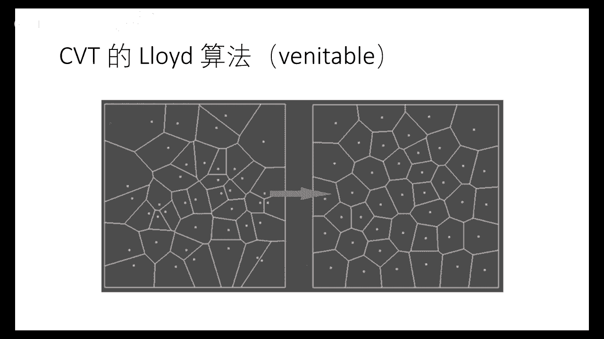

这几个卓越的同学的卓越还是界面比较好。

那么这里有个demo来看一下，它是个实时生成一些点，然后用ROAR的算法来迭代，这个点的个数可以用户进行输入，可以看到它对这个迭代次数也是可以进行一些修改，因为从理论上来讲迭代无从多次。

就是总是能收敛的，但是有些情况下收敛会比较慢。

这是另外一个同学，大家看一下他的结果，他也是随机在边上生成一些点，然后构成我的内图，同时他也显示了Denali赛亚波芬，然后同时在做一些迭代，像这个情况这个case比较好。

到这里就生成一个比较规整的一个市面性网格，赛亚网格。

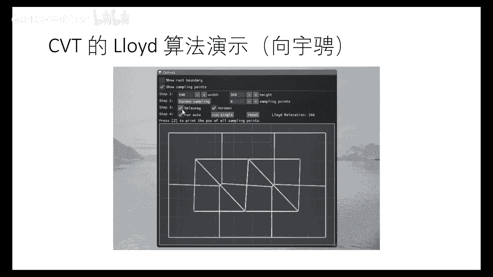

那么这是另外一个同学，同样他实时的进行迭代，可以看到这个他也在用鼠标交互增加一些点，那么这个结果也在实时可以计算出新的文案，他这个交互增加的点，大家可以看到，他在增加文案图，基本上是在更新。

那么当然文案图你也可以进行一些变密度的，密度的来源于图像的灰度，你这样的话就可以生成这种像stippling，这种艺术叫stippling，这个点的个数跟你这个图像的灰度相关，颜色越深。

那么他的点的密度越高，他用cpt来做，效果也还不错，这个部分同学的优秀代码和卓页，我们也会挂在这个卓页网站上面，供大家参考，同学们可以根据这个优秀卓页来对比一下，看看自己实现的这个卓页效果，好。

今天有两个主题。

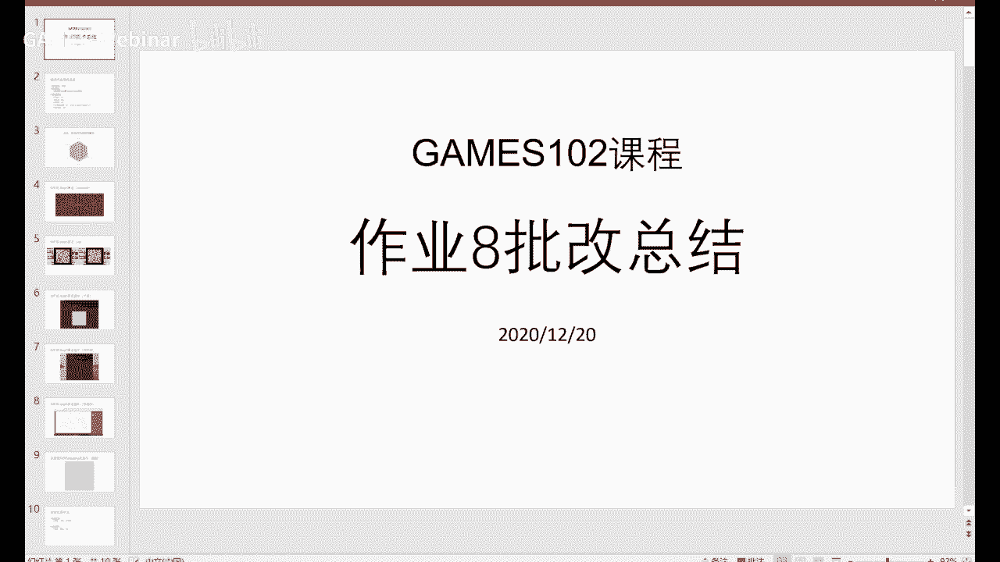

第一个主题是曲面参数化，参数化。

同学们应该是在前面卓页已经体验过，是吧，那么我们以前一直从影射开始讲，这个影射不同的维数到不同的维数空间，影射的本身维度就是定义的维数，那么可以看到这个，如果从二维到二维，那么是平面影射。

二维到三维就是一个曲面，这是个正向影射，那么这个R3中的参数曲面，实际上是一个平面区域映射过来的，所以它看起来是三维空间的一个曲面，它本质上是个二维流行，所以这个以前我们都非常清楚，那么这里就有一个。

另一个问题，就是给另一张曲面，我要去找他的参数域，就是它的这个对应的二维，这个区域或者定义在哪里，所以这里这个问题就叫做参照化，那么这个参照化也叫做展开，因为很形象，为空间的曲面。

怎么把它展开的一个平面，所以它本质上数学问题，就是找一个这个影射，从R3到R2的一个影射，那么使得这个影射，那么这个点之间有一对应，那么这个参照化，为什么这个事情很重要，这个在以前做曲面曲线拟合的时候。

大家就体会到了是吧，这个大家做过作业，如果参照化不对，不好的话，对这个曲面的拟合，曲线拟合会有影响，虽然这里是一个曲线拟合，曲面拟合也是一样，如果你这个参照化空间，这个不均匀。

就会导致这个拟合的这个曲面，会呈现不好的性质，那么参照化，还有很多其他应用，这个我们有没有地图展开，就是一个球面展开成一个平面的过程，是吧，所以在用地图绘制过程中，也是用到参照化的一些技术。

在那这个地图绘制有不同的技术，不同的这个展开结果，他们在地理学，他们叫这个球体投影，那么在图形学中用的最多的就是文理影射，我准备一个网格，中间有个割缝，把它展开以后呢，然后用一张文理给它对应。

所以每个顶点呢，就有一个文理坐标，文理坐标有了以后呢，它这个曲面的这个这个对应的这个点呢，就有个颜色可以汇译过来，所以可以给这个曲面进行一些贴图，当艺术家基于这个贴图，也可以在上面进行绘制。

画一些这个颜色和图案，使得呢，这个相当于是在曲面上进行画图，因为有的时候在曲面上进行操作不方便，可以在平面上这个，这个叫文理地图，就这因为在这个例子里面，它这个网这个曲面被分成了若干部分。

每一部分都分别参照化，所以就变成一个若干部分的一个参照化的一个拼接，这个叫Atlas，叫文理地图，这个这个为什么分割成若干片呢，主要是每一片参照化呢，它的这个扭曲会比较小，所以分割的比较小片的话呢。

就会有更好的效果，这个在后面我们也会提到，但还有好多其他的一些应用，也是基于这个参照化的一些，这个结果，后面我们陆陆续续会展开，我这里就不详细介绍，那么把一个曲面展开成一个二维的一个形状，或者定义。

我们以前在讲微微几何的时候就提到，有一种理想的曲面叫可展曲面，可展曲面呢，它能够没有任何扭曲，把它展开成平面，是吧，那么可展曲面你也可以这样理解，是由于一张平面的一张纸，可以没有任何的这个皱褶。

或者是挤压，然后把它拼成的形状，那么根据理论的这个微微几何理论就可以知道，这个可展曲面只有三类，柱面，锥面和切线面，是吧，所以他们是可以没有任何扭曲能展开来，显然对于非这种可展曲面的话。

他们就没这么好的性质，所以一般的这个曲面展开都会有一些形变或扭曲，那么最理想的当然是这种可展了，但是一般来说我们后面就会，对任意曲面的话，我们需要怎么去计小化这样一个扭曲，使得参照效果会尽量好。

有些参照性质呢，参照性质的结果也包含保持别的性质，比如说这个褒角，我希望这个夹角尽量保持住，但是对于这张曲面来讲，连曲面的夹角就是这个点连着两个夹角，就是表示这个两条曲线的切线夹角。

他们尽量保持这个叫共型影射，当然有些保持局部面积，有些是保持这个等距关系，那么从一个影射观点来看的话，这个中间的这个保持性质，事实上就是这个F的一个几何量，就是雅各比这个行列式的一个。

这个雅各比决策的行列式，这个行列式的模，这个行列式的这个决策值，就是度量的这样一个保持性质，如果这个雅各比行列式等于，1就是局部等距，大于1就是膨胀，小于1就是收缩，小于0的话呢就是发生了翻转。

就是用F的雅各比这个行列式可以刻画，那么这个由于我们讨论的这个曲面呢，主要还是一些理想表达，就是我们曲面分成了很多小单元，所以我们一个F呢，可以把它分解成若干个函数，每个函数定义在这个小单元上面。

F呢是一系列的这个小单元上的函数的一个拼接，只不过这个拼接呢要保持一些光滑性，所以我们讨论F呢，就可以把它分解成讨论一些小单元之间，在我们这里小单元就是三角形之间的一些这个变换，我们知道这个小单元之间。

三角形之间变换在平面上，就可以是用一个比较简单的函数，比如仿真变换或线性变换，就来来近视，也就是说我任何一个复杂的函数，我在一个局部上面就可以把它变成一个线性，就是像是就是菜鸟展开的一阶部分，好。

那么我们把一个是R3到R2的这样一个映射呢，我把它先简化，就是R3的每个每个小单元，我可以没有任何扭曲就旋转，把它摊到一个参考的一个R上面，那么好，那么呢，一个这个到这里的影视就变成了这个到这里的影视。

所以我只要考虑每个每个顿小单元三角形，它这个影视，就是这个这个影视啊，它的这个扭曲是多少，因为因为在这里面只是一个从R3空间旋转到R2空间，所以这里没有任何的扭曲，所以扭曲产生是在这个Phi这里产生。

就就这个圈圈里面这个Phi产生的扭曲，所以我们要去讨论这个总共的扭曲变化呢，只要讨论从一个这样的全转单元形，就这个全转过来啊，变转到我的参数域上，单元形之间的一个扭曲程度，那么这由于这是个性应变化。

性应变化中间的那个矩阵呢，就是这个Phi，就是这个Phi可以表达成平移加旋转，所以用骑士坐标，这也是我们同学学经常用的，L是一个R3的旋转，T是一个平移，那么我们这个平移。

因为不发生任何的这个对扭曲的贡献，所以一般扭曲就由这个L2*2的这个矩阵来度量，那么怎么去度量一个三角形之间发生的这个扭曲程度呢，这里在数学上我们对L可以做一个分解，叫SVD分解，叫奇值分解。

这个分解是把任何一个矩阵，不管几位的，我们这里是R*2，可以把它分解成这样形式，左右两个都是正交阵，中间是一个对角阵，对角阵就是这个矩阵叫做奇值，也就是L转之L，这个乘积的一个乘乘根，就是σ1和σ2。

我们先假设σ2>σ1，那么它的几何异非常非常好，就是说它如果把一个单位圆，如果局部一个圆，整个变成了一个椭圆，这个σ1和σ2就是这个椭圆的长轴和半轴，你可以看到σ2如果越长，表示扭曲拉伸的非常非常扁。

如果σ1=0就向下退化，所以我们可以用σ1和σ2来度量，这个变换所发生的这个形变程度，从这个图上可以很容易就知道一些度量，我们可以看到，比如说σ1和σ2等长，但是有可能很大有可能很小，这就是相似变化。

保角，如果σ1*σ2=1，表示这个单位椭圆跟这个单位圆的面积是一样，是吧，保面积，如果σ1和σ2都等于1，跟这个圆一样的就是等距，所以就推出了很自然就理解了这样几个度量，如果你要保角怎么办呢。

σ1和σ2要相等，就是保角conformal，共型，它的乘积等于1，表示面积相等，那么如果这个等于1，表示这个保刚性，因为都是单位圆变成单位圆了，对参照化的话还有这个就是怎么保持定扭曲。

那么可以看到不同的扭曲，这个参照化是不一样的，这个扭曲是不一样的，你看这个扭曲就小很多，这个就被拉伸了，那么另外还有一个问题就是这个叫做翻转，如果这个翻转问题呢，可以这样来就是可以看。

如果上个顶点它的顺序V1 V2 V3是一个，像这里是顺值针，那么如果变成了对变换以后，它变成了逆时针，那么是不是这个这个orotation，就是这个角度发生了翻转，这时候就是我们不希望的。

因为翻转容易产生这种回影现象，翻转是翻转产生以后呢，就是有两个点，两个三角形可能会有重叠，会对应一个纹理，这样的话就会这个使得纹理进行一些非常不好的现象，如果没翻转的话，就是局部是一一对应的。

就是不会有这个回影现象，所以翻转也是我们一个比较考量的度量，那么对于对于这个形变的话呢，那么这里有个图啊，就像这个点从这里慢慢的往这边靠，可以看到这个它的这个sigma，就会就sigma1就会越变越小。

到这里的话，sigma1就会趋向于0，好当这个点跨越这个边的时候呢，sigma1就变成0了，是吧，你可以看到这个sigma1往0越靠近0，那么这个退化程度就越高，好再往上往前跨的话呢。

sigma1就变成负了，因为它的就发生了翻转，就是从右手系这样一个变成了左手系，这样一个这样一个朝向顺序，这就是sigma1小于0就会发生这个事情，所以从这里可以看到，怎么去避免这个翻转。

就sigma1不能够跨越这个0值，是吧，所以sigma1要大于0，要不然sigma1小于0就就那个就会发生翻转，这个从我们刚才那个雅克比这个描述里就可以看到。

因为雅克比这个值啊就等于sigma1乘以sigma2，这两个乘积，所以如果中间有一个值是小于0，那么这个雅克比就小于0就发生翻转了，好所以这个很容易理解，好那么坐参的话呢。

大概很多年坐下来问文章非常非常多，到最近也还是一个非常火的一个课题，每年都有一些在sigma上面都有一些好的论文，我们也在这上面做了长期十多年就做了非常多的工作，特别最近几年做了一系列工作。

那么等一下会来介绍一下主要一些工作，好那我们我们把这个参数化分成三类方法，那么我们先介绍第一类TART，TART方法呢大家都实现过，上次就是你们实现的这篇FLOR的方法。

它是根据TART这个理论来来做的，并且拓展了，它这个方法很简单，就是对一个开曲面我们有一个边界，先把这个边界点呢印到一个平面上的突突边形，可以是圆可以是矩形或正方形。

然后呢其中每个点呢都是它一领域的一个线性组合，这个组合这个系数你可以自己定，可以是均匀权，也可以是跟几何相关，口谈权或者什么权，那么就这样的话整个系统呢，因为边界是被固定了。

所以它整个系统呢就是一个一个系数方程组，就可以求解这个方程组就可以就会得到这个解，这种方法有个非常好的好处呢，就是它有个理论保证，它怎么说呢，它说这个边界如果是个突的，那么它的这个结果呢就一定能保证。

理论上保证是没有翻转的，就是这个解是个非常好的，理论上能保证它是一个非常好的一个value的一个解，所以这个方法虽然很简单，但是它这个理论性保证非常好，所以至少可以生成一个没有翻转的一个结果给我。

但是这个由于这个边界是固定的，它的结果往往就会扭曲很大，这显然了因为它的边界不够自由，很多点就会挤在一块，导致这个扭曲非常非常大，所以这一类方法就很多人也会去在那些改进，最近几年151617可以看到。

对这种方法也进行了改进，好那么另外一种改进方向呢，就是基于这个几何的优化方法，就是这个就是基于几何的一些一些一些度量，那么早年的话有这个ABF，叫Angle Based Flattening。

就是基于角度的一个展开，上去参照化嘛，它的一个出发点就是说，我去保持每个三角形的这个角度，如果这个角度保持好了，这个三角形相似性就相似了嘛，所以它是把角度当作变量，求解这个参照化的这样网格。

那么它的变量就是这些角度了，你可以看到对于这个其中的一个这个空间三角形，空间四面这个这个三角形变到平面以后，它的一圈要满足什么性质呢，要满足180度啊，还有每个三角形要保持。

那个一个三角形的话内角和是180度，所以呢，它求得这个每个角的角度以后呢，它就可以重建出这个网格，所以它的变量就是这个角度，这角度约束有三角形内角和一派，并且它为了防止这个防防止那个这个角度。

这个变成零，所以它设了一个非常小的值，每个角就必须大于等于1平，这个值很小而已，还有每一个点的一圈，它就加强等于2π，还有一个这样的正弦定理所保证的一个比，每条边比上正弦，等于这条边比这个正弦。

所以传递过去以后要满足这个势质，所以它就把这个参照化的网格的角度作为变量，去优化求解，如果这个这个解是存在的，那么它就可以保证是没有翻转，因为这个这个强约束是在这，它只要优化出来能得到解。

当然有可能得不到解，这个得不到解它有参照化失败，那么整个的话就是它把这几个约束，变成一个这样的拉格朗的层次方，就可以就可以做，好，那么就minimize这样一个函数，这个目标函数就可以去得到解，好。

那么这是2008年我早年的一篇文章，这个文章语音还是比较高的，也比较知名，就是它就是我们把每个散热器，这个这个形状的尽量保持是保持它的那个旋转刚性，那么这篇文章读起来或者实现起来也也不难。

大家有兴趣可以去可以去仔细看一下，在未来我们也还会再介绍这个工作的一些方法，我这就不展开，那么这篇文章是我们团队的傅晓明，当时他还在读博士期间做的一篇文章，他呢这个变量呢是什么。

是一个散热器到另外一个散热器的一个变换的系数，他去优化这些系数，不像刚才优化角度优化刚才的那个旋转，这是变优化这个系数，就是那个变换，那么去求得最终的参考结果，好，那我们今天重点来介绍第三类方法。

就是能够严格保证Foldover Free的一个方法，这个方法呢来源就是，实际上是跟第一种方法有关系，第一种方法理论上保证了它一定是没翻转，但它的问题在于什么呢，在于它扭曲很大，那么这个方法就在想。

我能不能从这个方法本身开始，不断的去优化调整这些顶点，调整顶点过程中呢，使得我的扭曲能够不断减小，一步一步减小，直到减小到不能减少为止，并且在做的过程中始终保持上扬型，不发生任何的退化，就是不发生翻转。

这时候就能保持严格的不翻转的结果，但是我的扭曲给我降下来了，那么这个图呢就是，这个color bar就显示了，越红就表示扭曲越大，越白呢表示扭曲越小，可以看到，从这样一个非常多的红色。

慢慢就优化出这样一个结果，这个就没有红色，就是表示扭曲很小了，那么具体怎么在度量这个扭曲，在这么多年来，能不能发明了不少的这种度量扭曲，我们前面提到过，σ2比σ1要大，你可以发现。

这些扭曲度量都有一个共同的特性，就是这个小的σ，就是这个c值都在分母中出现，我们刚才也提到这个想法，σ1如果一旦去向亿零，它的这个倒数就去向正无穷，所以你为了避免这个发生翻转。

所以你不希望σ1变成去向亿零，甚至往负的变化，所以你只要去最小化这些能量函数，这些能量函数里面都有σ1作为分母，就可以避免σ1往零跑，往零去靠近，因为一靠近的话，这个目标函数就非常非常大。

所以它为了避免这种非常大的值，它一定会去牺牲别的太阳型的一些度量，所以这里面任何一个度量都可以拿来去做，早年有这种形式，那么最近几年用的比较多的度量是2015年，这篇文章所提出来的。

这个叫对称基地克略能量，你可以看到这个σ1和σ2是对称的，共同考虑两个奇异值的这种度量，所以我们后面也是用这种度量为主，当然你说我用别的度量可不可以，当然也没问题，当然不同度量它的优化难度可能会不一样。

好 那我们就把这个问题就变成这样一个问题，就是我去对每个太阳型计小化这个度量，那么有什么约束呢，我希望这个雅各比要大一点，雅各比大一点就表示没有反转，那么实际上是这个σ1和σ2。

实际上是一个矩阵的奇异值，它是跟那个变量，就是那个顶点坐标是非常非线性关系，所以整个系统就是一个非常复杂的非线性，非突问题，就求解起来会比较困难，再加上t的个数可能会很多。

所以整个求解效率就是大家要关心的问题，那么对于优化来讲，如果同学们做过优化的话就清楚，我计小化一个能量函数，实际上就是朝它的一个t度方向去走，那么这个t度呢，如果是用一阶的t度，就是一阶方法。

如果是用海选阵代表的t度，就是那个两阶的信息的t度，那么就是两阶法，就是牛顿法，当然中间还有一些近似的牛顿法，牛顿法等等，所以它本质上都在，如果是两阶方法的话，就都在怎么，都在找这个方向。

海选阵的me这个方向去走，然后呢，还有一个就是line search，就是走多远，这个点走多远，所以整个优化就是一个这样的过程，给定在末班函数，我去，当然有初值是什么呢，初值就是那个tars。

这个参照化所给的结果，所以由那个初值，我就不断的去更新这个点点的，这个这个坐标，朝某个方向更新一个距离，就可以去做这个优化，好那么因为优化过程中呢，实际上一个比较重要的量，就是有几个量，一个是方向。

一个是步长，这几个量，初值已经给定了吗，所以说方向和步长，那么，这五六年来，这个有很多paper，就在做怎么来快速求解，这个非线性非图问题，像这篇15年这文章，就是利用一个擬云端法的一个方法。

lbfjs这样的方法，那么我就快速练一下，咱们这是利用这个，尼斯兰拉巴拉斯，作为海神针的一个近视，作为一个二次逼近，然后来做这个优化，那么这个是用加权的一个拉巴拉斯，来做优化的过程，17年。

这文章也是跟刚才一样，是属于一接方法，那么这篇是用了另外一种，这个近视，用一个像量场的一个，算子来逼近这个海神针，也是属于一接方法，大家有兴趣也可以去看，我们下面把这个参考文献都写在这里。

这个CM方法是最近几年，比较有名的一个方法，这个是他，因为他是变成了两接，两接以后呢，他就比一接是要快，是吧，他是用了这样一个矩阵，的一个，也是拉巴拉斯，这个一个算子，来近视这个海神针，这是比较早。

就是最近的18年，一篇文章，就是用了一个拧刃法来做这个，优化，那么这个也是属于两接方法，好，那么我想多花点时间来介绍一下这篇文章，这篇文章是我们也是18年，是C-graph这一篇文章，这篇文章呢。

因为前面几个方法，大家可以看到都在都在找啊，就是怎么去找这个海神针的近视，就是这个框架里面的这个edge，那么这就是大家都在，在优化过程都是差不多，只不过就在优化或者近视，更好的这个海神针。

然后使得这个优化过程快速啊，稳定啊等等啊，我们这篇文章的思路呢，稍微有点不一样，就不一样的，实际观察，你可以看这张图，这个图这个大位的头啊，是只有脖子是个边界，所以他边界一展开以后呢，是个圆啊。

那么中间很多头发这个顶点就挤在这里，导致这个扭曲非常非常大，这个大的原因就在于这个很多顶点，是挤在这里吗，是吧，所以呢，这个如果你去优化那个能量呢，就发现这个中间的那些这个底球性的非常非常大，就是很大。

而从优化观点来看的话，如果你这个函数函数，那目标函数值很大，他要去下降，他的这个下降速度呢，就是或者是这个不常的，啊就不能设的，就是你下降这个过程呢，就会不是很快，是吧，所以呢。

我们的一个想法就是我们把一个极大扭曲的这个值，把它压下来啊，我们不去优化这个原始目标，我是中间有一个目标函数，但这个目标函数的这个这个扭曲呢，是有借的，那这时候我的优化就比较快，好。

当然我优化完以后的话，我们我们优化的这个目标呢，并不是原来的目标，所以我们去更新这个目标函数，然后再去做优化，所以虽然他是不断在更新目标函数，要做多次优化，但是呢，他中间的每一次优化过程呢。

由于没有非常大的这个这个能量值，所以他优化会比较快，这也是我们这个方法的一个非常大的特色，我们不是去跟传统方法一样，去去找好的海选证的逼近，而是什么把目标函数进行进行修改啊，指着优化变得更快，好。

那这就是这篇文章的一个过程啊，好，我们，有一个数值值，那么我们中间构造一些啊，这个参考三角形，使得这个扭曲啊，不是太大，然后呢，我们再去不断的去更新这个参考化啊，以及这个reference。

这个这个参考三角形，然后不断的去去去优化啊，然后就得到最后结果，好，这个过程中也始终是保持跟刚才那些目标，还是一样啊，这个这个防防止翻转啊，那么我们这里就不详细去介绍中间那些细节啊。

大家可以在我们的主页上可以去找到这个，当时SIGGRAPH的一个PPT啊，里面有非常详细的介绍，我只是介绍大家啊，这个，我们这篇文章的一个思路就是去更改目标函数，不断去更改目标函数。

然后达到对原始问题的纠结啊，跟原来的思路是非常不一样啊，毕竟结果也非常好啊，数据也也也相对来说到现在为止还是最快的，好，可以看到这里我们对比了当时18年时候的文章，对比了这几个方法，可以看到他的。

可以看到这个这个图，这个图呢，就是一下子我们的人量下降的很低了啊，你看这个红色这个是CM方法啊，就是收敛的就比较慢一点啊，时间也比较长，我们是速度非常快，那么这个是一个非常大型的一个模型啊，Lucy啊。

这个模型有看看这里有900K，90万多万个点啊，你看到我们这个蓝蓝色就是我们的方法啊，然后这个下降的很快，迭代94就已经达到这个能量值非常非常小，别的方法还在这个不断的迭代来收敛啊，好。

这个另外一种常译化的特性呢，就是叫bijective，bijective是什么，是一个global的一个injective，实际上什么是说局部的没有翻转，是是也是局部的叫bijective。

他是global的bijective，就是什么，我我边界也不允许你在远的地方相交啊，不允许碰撞，局部的翻转表示局部在碰撞吗，好，那么全局你看这里，虽然每个每个每个点局部来讲，没有这个翻转。

但是他全局发生了碰撞，就是错综，就是叠在一块，因为叠在一块的话就有问题，就是你你这个网格的曲面上的两个点，对应了同一个纹理，也会发生这样一个纹理，这个这个杂乱的现象，这里有个图，这里有个红色块。

上次这里只有一个块啊，但是这里被印成两个了，这里没有发生扭曲，没有发生这个全体之交的话，就是正常的一个纹理的印词，好，那么这种呃global这个bijective啊，难在哪里呢，难在哪里。

它不仅是这个印词的这个函数，或者印词这个有个有个别的一个性质，它是个整体行为，因为他要边界上面都要不发生重叠，就不发生碰撞，所以它是一个比较难判断的问题，因为它是一个像是把边界看成是一个形状的话呢。

它就是一个这个呃边界不能自交，也不能碰撞的一个问题，所以它它这个全局的一个检测问题啊，所以不能光靠就印词函数的一个局部性质来做判断，所以它的计算量是比较大的，到现在为止呢，也实际上是在我们这个工作之前。

我们我们的工作是今年发表在siggraph，在我们工作之前只有两个文章来做的做到这事儿，做最大进行加速啊，一篇是15年这本文章啊，用一个拟的方法来做这个加速啊，但是他收敛性比较慢，17年这本文章呢。

一个比较巧妙的方法想法就是什么，他在这个形状，他在参照画的外面的又包了一层啊，更大网格，因为如果这个更大网格不发生自交，是不是就不会发生碰撞，所以他这个非常巧妙的方法，把它嵌在一个更大网格。

只要这个更大网格上面用传统方法去做，那个那个那个免自交啊，因为因为这些三星外面三星不发生自交，就保证了他们不会发生碰撞，对吧，但是他也是收敛会比较慢一点，那我们今年有篇论文呢。

发表在今年siggraph啊，这个所以你可以看到我们再看一遍，你可以看到这同样时间，我们一下子就收敛到结果，他们还在不断的去迭代啊，像2015年这文呢就更更慢了啊，看他能不能收敛到我们这个结果啊。

差不多啊，因为这是个全球经济新闻题，他不保证结果要要是为的，这个这个因为有可能他们找到的是其他的一个绩效值，好这是个比较啊，我们看一下，好那么这个这个是比较的，我们跟这两篇啊。

这个全局byjective的方法，可以看到他的收敛性啊，速度啊就会比较快，时间用了五秒啊，他们啊，这方面还还在那跑啊，那么这个是这个是刚才说的progressive文的文章。

就是progressive就是利用这个改变目标函数值的方法去做，但是这个pb方法呢，他是不保证全局啊，无织交，他全局有可能产生织交，虽然他总体上会比这个我们方要要要快一点，但是快的快的不多啊。

所以我们比这个方案要慢一点，但慢的是就像是消耗了一点点时间，达到了一个全局啊，这个byjective的一个结果啊，你可以看到0。26，2。23，11。77秒啊，是比这个两个方法要快快了。

就将近一个数量级了，是吧，所以一下子我们把这个问题的这个纠结啊提高了一个数量级，那么对于一些比较极端的例子，像这个例子比较是这个曲面是一个比较极端的例子啊，像我们很多方法都都没法没法做到收敛。

因为在这里面他这个啊，中间有一步能过去啊，但我们方法还只能能够达到非常完美的解，好，那么参照的话呢，是刚才是对这个椅子的一个开曲面，是吧，就是有边界的曲面来做，但是对于一张这个封闭曲面。

比如地球是封闭的一个球面，那么你要把它展开就一定要有个割缝，把它割开才能展开，是吧，所以曲面割缝问题也是一个非常重要的问题，因为你不割开，你就没法去把它摊平啊，一个封闭的球面是没法摊平到球面，是吧。

所以他要不要割开，而割开这个问题呢，也有很多配方在做啊，这是早年的2002年有篇啊，比较有名的文章叫geometry image，结合图像，他呢就是贪婪式的去找这个啊，这个他的参照画的一个最大的扭曲。

然后到边界找到最短路径，最长距离反映到网格上面就是一个割缝啊，所以他不断去找割缝，使得这个扭曲啊，这个能接受为止，这个割缝就找到了啊，我们还有这是两年前我们的一个博士生柴双铭做的一个割缝问题。

他是沿着这个球面上，我先把它印到球面，因为他是个亏口亏零的这个局面来讲的话，他印到球面球面以后呢，找这个最大扭曲的点把它连起来，那使得这个展开以后也会扭曲比较小啊，这几年也有不少文章啊，你可以看到啊。

autocad的这个这两个都是啊，都是那个C管文章，就是想办法在这个曲面上找更好的割缝，使得这个减少中间扭曲啊，像这篇文章他还可以实时的去割开这些这些这些曲面，你可以合并起曲面。

然后使得他的总理上的这个割缝啊，尽量的好，这是18年一篇文章，这篇文章的考虑了不仅考虑了割缝，这个使得参照化要扭曲小，而且他还考虑的割缝的这个总长度尽量小，这是个非常难的辩论问题。

这个文章提出一个辩论方法去找这个割缝，好，那么割缝问题呢，在去年我们做了一篇这个有很有意思的文章，本质上也是在找割缝啊，那么这个是做什么呢，我们先看一下一段视频啊。

那么现在在冬天冬天刚好是这个橘子上市时间啊，相信同学们也是了，这个这个时间也在吃橘子，这个视频显示一个艺术家在橘子皮上面用刀子，找割缝啊，割完以后的话，这个橘子皮展开成什么呢。

展开成一个这个这个很有意义的一个图形啊，是一匹马，是吧，很很神奇啊，就是这个他在橘子皮上割缝啊，展开以后啊，能展开成一个目标函数，这个问题上是马上就应该想到，他就是个三人化问题，是吧。

只不过这个割缝怎么找啊，这个比较不知道，是吧，所以我们后来去找了一下这个艺术家，是个日本的艺术家叫Okada，他呢，这个他有很好的空间感觉，因为他对这个割这个橘子皮还是比较熟悉。

所以他要去经过大量的尝试，才能做出一个例子来，比如说他想割一匹马，他他需要割很尝试很多次啊，这是他他的一个一个demo，可以看到要浪费大量的橘子，才能找到一个合理的解出来，从我们这个，这个几何问题来看。

我们中间一个科学问题是什么呢，就是给一个曲面，我怎么去找空间找一个割缝啊，使得他能展开之后，能够逼近或者说能够成为我们用户想要的一个二维形状，注意这个形状也是用户输入的，右边这个啊。

割缝是要我们自己去找的，所以说，所以他是给定一个二维形状，还有一个橘子皮，这个曲面如何去生成或者找到这个割缝，只展开以后能够逼近我的那个二维形状，但这个问题实际上比较难的，因为因为这个。

你以前的参照的话呢，找割缝的做什么，做事目标是在脊脚化他的扭曲啊，而现在呢，事实上是要是希望他的边界啊，能够逼近我一个用户所以输入的一个形状，所以他的目标是不一样的啊。

并且这个这个目标是一个关于边界一个global的一个性质，跟刚才那个自交一样，他是个非常难的问题啊，我们想了很久就找不到方案，后来突然发现这个印象去思维啊，反正这个这个方法啊，这个就找到了啊，他什么呢。

我们把一个这样的用户输入形状，把它把它通过一个映射，印到球面上去，如果印刷过去以后，刚刚好这个这个就拼了，缝子没有了，是不是这个这个这个缝的边界就是割缝，对吧，当然你运气不总是这么好吗。

所以有可能这个缝还不能够完全消失，那你要对这个形状进行一些变形，或者增加一些编辑，那我们利用这样一个方法，指导用户去进行对形象进行修改，就能够让这个这个用过来的缝啊，就就就填满这个填满以后。

这个缝就自然就形成了这个这个啊，割缝啊，所以把这个割缝，然后用这个球球级的这样一个坐标，以及这个坐标生成这样一个指导图，用户根据这个指导图，然后就可以在上面画这个黑线，那么你在沿着这个黑线呢。

就可以用刀子是自己就可以把一个橘子皮给割开，割开完之后呢，就可以展开成你要的那个形状啊，那么在这里呢，我们还真是做了一些这种交互式的这样一些UI，啊，就是让你去根据你的愿望输入你的形状，修改你的形状。

使得你能够从一个橘子皮展开成你要的形状啊，好这个，嗯，你们本质上它也是个参照化求割缝问题，怎么过目标呢，是要逼近我的形状，所以他中间的一些技术跟传统方法还是有不一样的，我们看到我们这里一些艺术家。

在那个书上只能做五十六十个例子，我们他做人做的我们也能做啊，这个因为算法嘛，这个就是可以做很多，但是他做一个例子要花很长时间，我们做例子啊。

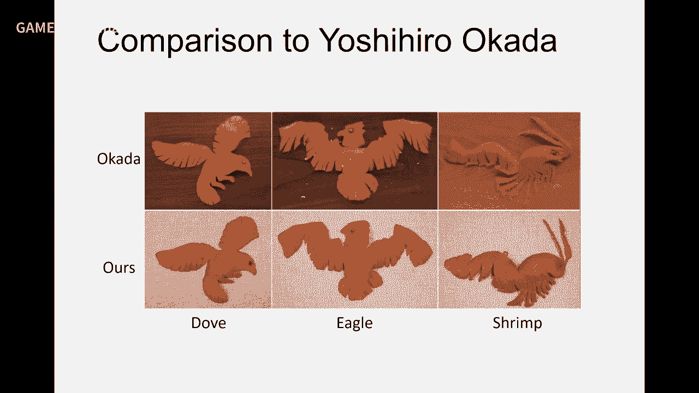

就是一个算法就可以去做做出来，他做不到的我们也能做到啊，所以这是我们通过我们这个系统去做到的这些例子，可以看到这个当时我们去年啊，去年科技节活动，我们面向全社会普及数学图形学就也面向中小学生。

让他们来实践各自这个举止，他们都还是非常开心，特别是小朋友，自己做出来的东西总是非常非常非常开心嘛。

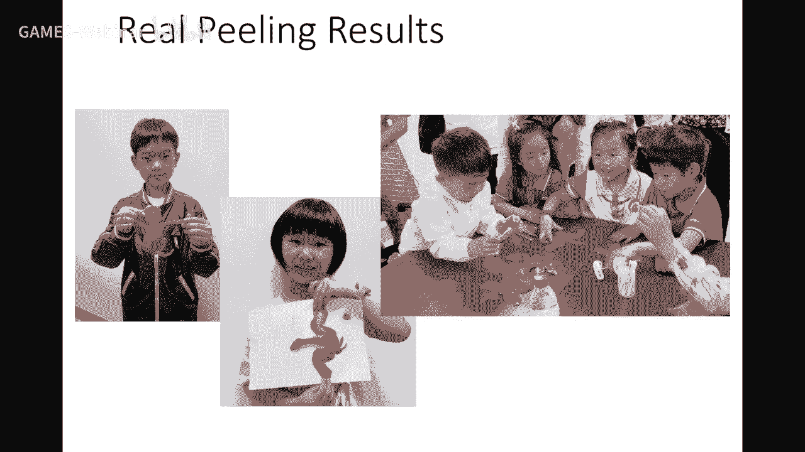

好，那么传统化这里面还有一个问题呢，就是说如果一个形状单片传统化呢，可能会那个扭曲会非常非常大，那么呢，有的时候呢，会把一个模型的分割成若干小片，小片分别传统化以后呢，把它拼起来成一个大的纹理。

这个叫做Multi-Charts，那么这个Multi-Charts拼起来以后呢，这个就叫Atlas，所以你可以看到一个模型的参照化，它并不是只有一片参照化，它可能有多片，那么它的纹理呢。

这个一样的可以印过来，那么这里有一个问题是什么呢，就是说你每片参照化以后是一个单独的片，你要把它拼起来以后呢，形成一个Atlas地图，那么你这里有大部分的这个空白区域就会浪费。

比如说纹理是1024x1024，那么你这里一个占的面积，总和与这个整个矩形的面积相比，你这个比例叫做Packing效率，Packing一般叫装箱，就是可以看到这些物体装在这个矩形箱子里。

如果你这个空间浪费很多，这就叫空闲率就会比较高，这是不好的，会浪费这个纹理的存储空间，所以可以看到同样是这一块，我右边这个装箱就比较紧，它的占有率达到86%，达到非常高。

你可以看到它存储的纹理大小就这么大，比它要小很多，大大节省了内存和显存的开销，那么这个Packing，就是Atlas生成也有很多方法，这个本身它是一个优化学里面的一个叫做装箱问题。

就集装箱怎么去装更多的货物，那么对于这个矩形的相对容易一点，但是对于这种非矩形的这种内形状的多边形的就装箱问题是个NP难问题，所以它一直是个非常难的问题，那我们的一个这个。

去年CPUC管我的文章的一个思想，是吧，我们把一个这个难的问题把它转换成一个比较简单的问题，怎么转换呢，我们就参照化的过程中呢，就就，用那个矩形去逼近它，这样装箱效率就会更加更加高，所以我们目标是。

做更高装箱效率的这样一个工作，对于这个Packing问题呢，历史上这几年也有几篇文章做，像这篇文章就是你Packing完以后，他发现这里浪费控制率很高，他把这里割开来，把它填到这里来，通过一个搜索。

然后去去不断的去优化这样一个Packing的效率，啊，那么我们这个方法呢，就是19年啊，去年的SIGGRAPH，就是我们是把这个网格呢，做一个先做一个参照化，这参照化呢有个特殊的性质。

就是他的这个边界啊，要么是横的，要么是竖的，就是形成这样一个边界是平行于这个这个核子边界的，这时候呢，你就把它进行分割以后呢，它装箱效率非常高，因为矩形的装箱效率可以有很好的奇葩式算法装的很高。

那么那么这个这样的话呢，就它的浪费空间就比较小，最后呢，我在这个参照化呢进行一个优化，让它那个边界可以自由啊，这样的话就使得装箱效率可以控制在一定的这个界里面，因为矩形的装箱效率，我可以控制的非常小。

给定一个上界，我都可以给他啊做到，因为我这我这里分割可以可以更多的分割成细块，所以能保证这个装箱效率，好，这是我们方法做的，这这是如果如果不去用我们方法，这个话就装箱效率就80%。

我们把它分成做个快以后呢，能提高到92%，这其中一个例子啊，还有这个值可以改，这个值可以用户输入，比如说我希望装箱效率就90%，我分割快就会多一点，但是这个快的不会突然多很多啊，就我们中间有一个算法啊。

能保证这样一个装箱效率，好，最后参照方的还有一些其他参照化，我我这里也稍微过一下啊，有一个球面参照化，对于这个quickverding的后面后面曲面呢，那么你把它剪开参照化到平面，ok 是吧，没问题。

但是呢，如果你还有另外一种归层曲面叫球面，你可以把球面参照参照化区域啊，把这个啊，这个这个网格把它不剪开，就参照化到球面啊，因为球面也是归整区域啊，至少啊，比较均匀啊，比比较比较对称的归整。

所以球面上也可以定义其他信号，就球鞋盘数啊等等，所以有些时候应用在球面上做这个参照化啊，完成这个这个曲面的处理也是ok的，所以球面上的话也有它的应用啊，这方面也有不少工作啊，我们也啊。

从前前五六年也做了系列工作，这是我们大家有兴趣可以去看我们的主页，上面都有我们的论文啊，这个好，另外一种参照化呢，就是在两个内容曲面之间做一个映射啊。

这个叫compatible这个这个match叫相容性网格啊，就是你可以这样认为，把形成一个曲面当做是一个定义，把它的这个顶点把它map到这里来，是吧，那么如果map到这里来。

中间可能也会有很多扭曲问题啊，还有那么你也可以去对它进行重重采样啊，那么改变它的网格，使它们之间有一个意义对应，做好这个事情以后呢，这两个曲面的什么就每顶点都是一一对应好了啊。

就是一个包括三角形边和顶点都是有对应关系，可以做很多其他的应用，比如说这个啊，这个形状差值啊，等等后面也会来讲，专门讲这个方面的内容，啊，好，那么我们也是在这方面做了一系列工作啊，这个有兴趣。

特别是今年有一篇啊，C管文章也是把这个方法做的非常非常好，效果非常好，好，这个参数化呢，大致来就介绍这这些内容啊，因为它是个几个处理的一个非常基本的一个问题，所以我们啊，今天讲的比较多一点。

那么它本身是一个三维到二维的降维问题，是吧，那么事实上参数化呢，做好以后的话，它在参数区间就可以存储这个几何的很多信息，除了存储文理以外，它还存储其他的，对吧，比如说法项啊，这个一些材质啊。

就normal map，还有一些这种细节啊，dispersion map啊，等等还有材质，都会存在这里面，所以呢，对这种大型的这个场景呢，还有其他一些的度量要考虑，除了参数化以外，怎么存储啊。

分割存储等等，这就是像这个虚幻5的宣传片里面就就就啊，这个这个场景是景点是非常非常大的，啊，在宣传片里面，他们指出有160一个面片啊，那么就这种几何怎么样，最近参数化要存储啊，就就就有很多挑战，好。

但是参数化还是有继续很多没解决问题啊，那个冷蓝，又还是一个chuteoff，就是怎么样是一个平衡啊，这个质量效率和普达度之间的一个平衡，另外还有一些方法，还有不少人在做，特别是对于这个超大场景的参数化。

如果这个规模，景点规模已经超过内存了，那么你这个参数化怎么去做也是个挑战。

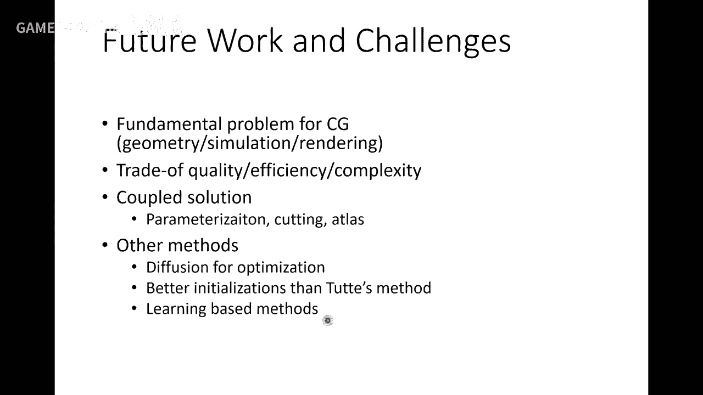

好，那么今天还不问内容呢，是简化。

简化也是一个非常重要的一个，啊，问题。

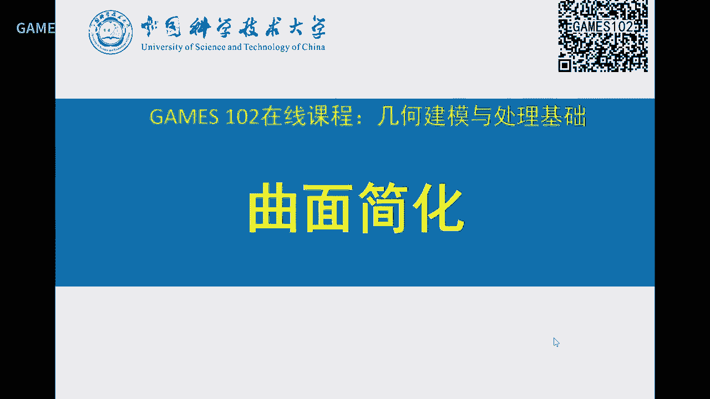

好，我们看一下，刚才刚刚提到这个虚幻5啊，今年五月份出了一个宣传片啊，不知道有没有同学关注啊，当时这个场景非常大啊，这个达到160个亿一个面片啊，好，还有这种，城市场景。

还有些模型本身就达到1000多万面片，这个场景，这个，数量都非常多，所以大规模网格啊，它在这个是应用中经常存在，你怎么有效存储传输啊，处理等等就是一个非常大的挑战，但是人们发明了很多方法了，这个，所以。

一个一个很简单的想法就是，你一个模型如果离我视点很近，就看得很清晰，如果视点离我很远，我可以看得非常啊，可以看得不是很清晰，就没有必要用这么多景点去表达它，是吧，这就是一个简化，就是怎么把一个模型。

如果在不损失太多视觉效果下面，把它的景点减少，啊，会甚至减得非常粗糙，那么使得在远处的时候呢，我就用这个粗糙的网格去去做替代，那么这个就是怎么怎么样去把一个高复杂度的几何体进行一些简化表达。

减少它的景点面和边的个数，那么，这个技术的就叫LOD，level of detail，也叫多层次细节，那么这里有很多应用啊，就是LOD一个是这个modeling，用于这个绘制渲染中，还一个是用于这个。

仿真中，因为做很多计算几何处理也一样，你如果对于在很高清晰的这个几何体上做呢，时间和开销非常大，那么有没有可能在低分辨率，就是低网，这个这个粗糙的网格上去做，然后呢，再去逼近精细网格上的一些几何量啊。

或物理量等等，这也是一个方法，那么做做简化，很容易知道它这个简化的景点越多，就偏离原来的曲面会越远，是吧，所以它的质量和误差是一个，就是这个大小和这个误差是一个平衡，是吧，然后你这个简化的，不简化。

就是景点越多，误差越小，但是呢，你如果，简化的很少的景点，size很小，误差就会越大，所以简化也是一个中间这两个量的一个平衡，还有一个质量的一个考量，你能不能保持这个限率特征，像这个简化就特征就没了。

是吧，好，那么这考量的一些因素呢，就是，简化在历史上从90年代开始就开始做，那时候内存啊都是，非常非常小，所以对简化的要求也是非常迫切，虽然现在内存啊显存都非常大了，但是呢，这个场景可以更大，是吧。

所以这个还是有它的是意义，所以这个简化呢，这个performance啊，就是这个性能，有这么几个考量，有一种就是，这个离线的简化，有一种是实时的啊，好，我们来看一下，这简化的，一个，方法就是什么。

或者是你怎么做简化呢，肯定是要减少它的那个，几何几何量吧，是吧，几何对象有顶点边和面是吧，度量呢，哎，你有一些几何度量，还有一些视觉上的一些度量，你你，无外乎就这么两两个考量，这两个考量。

把它把它明确以后呢，简化算法就会，相应的就会去找到，好，我们来先看一下简单的策略，这个策略是什么，这是简化呢，可以，看成是一个过程，是有一系列的这个局部的操作，啊，比如说这个操作是一个，嗯。

这个点有六条相邻的点啊，那么我如果把这个点，讲到这个点跟作为这个，英语说是，共鸣性很强，我我我这样一个平面，没有必要用六个三角形来表达，我可以把这个点给删掉，删了以后的话呢，就形成一个框，对吧。

这个框我又重新三角化，就变成这样一个形状，可以看到，这个操作，这个顶点，把他去掉，一下子就变成少了一个顶点，是吧，而且少了两条边，也少了两个面，所以他就今天就个数少了，面也少了，好，所以这些操作呢。

就是很容易理解啊，这样这样一个操作就叫顶，顶点删除，顶点少了一个面少了两个，还有一种操作叫边收缩，就是对调边，这个边假设跟周围，一圈平面啊，都都那个误差啊，这个这个不大，那么我就可以把他边给删掉。

你看那边删掉是什么意思呢，就两个顶点收缩成一个顶点啊，这时候呢，就两个三角形就就就就就没了啊，这时候也是少一个点，少两个面，还有对一个三角形进行收缩缩变成一个点啊，这时候今天少两个面少了四个。

还有对这种啊，这这这种这种顶点进行收缩啊，还有这种算子，还有对这个两条边进行收缩啊，所以你可以呃，在实际过程中，根据不同的这个度量啊，可以去进行这样一些这种啊，合并啊。

简化就就导致就可以一步一步减少顶点量和面面的量啊，还有一种方法比较比较常常见的，也比较实用的就是这个叫聚类法啊，你可以把这个场景用这里以二维图形来这个示范啊，就是你把这个二维用一个格子。

Grid把它分割啊，分成好多一些Cell啊，这个又比如说四杀数，然后位于同一个Cell的这个三角形呢，你会点了几个顶点呢，就可以进行合并，像这个这两点合并成一个点，对吧，这里三个点可以合并成一个点啊。

这个叫聚类，就位于同样一个Grid的这个点来把它聚成一起啊，这样的话呢，可以大量的减少很多顶点颗数啊，当然这里这里处理的时候会发生这种非流行结构，还有这种悬桩边，这时候呢，就可以出做些处理。

这些边对对渲染是没有用的，可以把它删掉啊，那么在简化过程中有一些度量啊，就是误杀度量，误杀误杀怎么来控制呢。

有些局部的度量，有些是全局度量，我们分别简单介绍一下啊，嗯，度量不一样，它效果也会不一样，像这个2000个面片减化到488，一个是用了局部度量，一个用全局度量啊，总体上来讲呢，全局度量会相对好一点。

因为局部度量是一个点一个点去删，贪婪的去去删，而全局的话，它有个全局性啊，好。

我们来看看局部的一些方法啊，有方法度量一个点是不是要被删啊，这个规则很多啊，这里列了几个规则，大家一看就明白啊，这个点0，它作为10这个镜子平面，越尖锐啊，越越高就表示这个顶点越重要，不能删。

像这个就是以前写的拉布拉斯啊，相关的类似的，还有什么，还有它的一圈夹角，跟二排的比相啊，因为如果这个点是，一圈三角形是共面的话，这个这个角度加起来是二排，如果如果是这种尖的话，就小于二排。

所以这笔子越大就表示越可以被删除啊，同样这些度量，你可以想到很多，啊，那个这是点点删除啊，这是边收缩，边收缩其中有一个度量叫做25X，这度量的是1997年，SIGGRAPH那个提出来的，在后面有啊。

叫QEM，叫25X度量，这25X度量呢，简单解释就是说，我这条边周围的这一圈呢，我用一个R字曲面去拟合，用一个R字曲面去拟合，这个周围一圈啊，我像这个方向就是一个R字，抛线拟合这样一个周围的情况。

那么对于这个三维中来讲，它有一个R字一个啊，曲面，那么这个曲面呢，就是拟合出来就有这样一个系数矩阵，是吧，你看这是个R字函数吗，是个抛面，是个R字曲面，然后利用这个R字曲面的这个性质。

就可以来这个度量它的一些扭曲。

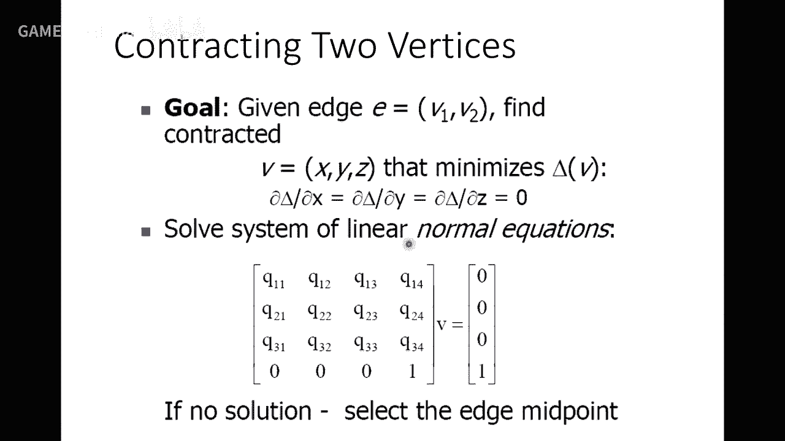

这是求解这个，对，那么这个是个格子化，对每个点我就可以，用这个R字曲面的那个系数矩阵，的一个奇值来看，越扁的表示这个地方越平，就这个点，这个这条边就越不重要，就可以把它删掉，如果是有这个方向性的这个。

这个边呢就很重要，就可以不删，所以它通过这样一个R字度量，就可以判断哪些点不重要，就是哪些边不重要，可以把它删除掉，所以这个度量，度量呢它周围的，领域这些象形的一个平坦度。

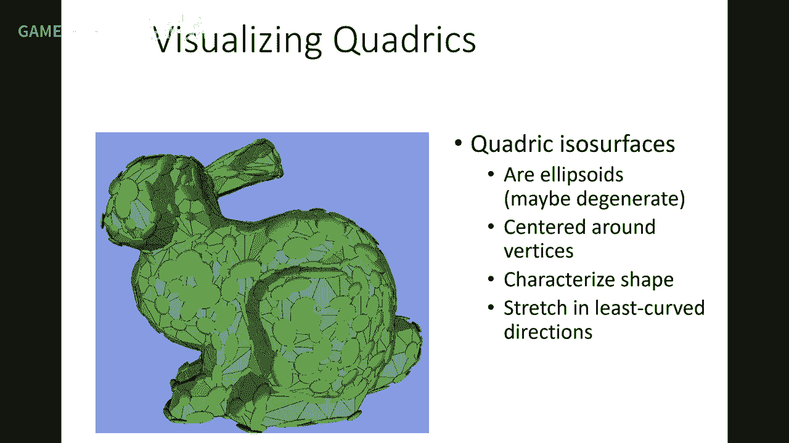

越平坦就越先被删掉，可以减化掉，那么这个算法就非常简单，然后你对每个点点算一个R字度量，然后看一看这个边，这个R字度量是大的小，如果小，小的话就可以被删掉，就可以把它删除，不断去这样迭代。

就可以去完成整个算法，当然任何减化算法都会碰到这样一个问题，就是当你删掉一下边也好，减也好，就中间这些象形的会发生很多怪异现象，就是有些是折叠，有些翻转，这个要避免掉就可以了。

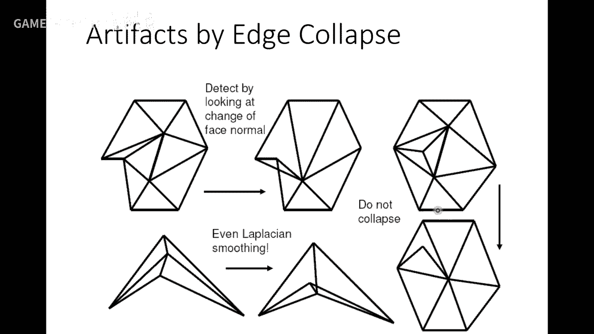

这是个例子，这是个12000个顶点，减化到2000，甚至到200多，300不到，那么可以看到，减化越狠的话，这个形状就是，这个世界效果就会越差，但是如果它这个物体放在很远处，实际上是轮廓还是比较像的。

就够了，对好，这个还一些这个减化呢，就除了几何的误差，他还会考虑这个一些别的，Appearance相关的，就是眼睛看的一些视觉效果，比如说颜色，纹理，这个法相，因为法相也会影响这个，能渲染的效果，是吧。

实际上是这些考虑这些方法呢，考虑这些因素的方法呢，大概也差不多，怎么就把以前，顶点只有三个坐标的因素，变成了一个，加上了别的因素，比如说你如果考虑颜色，就是xyz是顶点，LRGB是颜色。

你就相当于是对这些量，以前只有xyz来来来，来拟合一个25差嘛，能量，那么现在是一个，如果考虑RGB就六维的，考虑纹理就是五维的，这是一个非常简单的一个推广，所以只不过这个相量的为数变高了。

但是度量仍然类似，用一个20就行了，所以推广起来不难，可以看到这个例子，这个地图已经简化，如果你不考虑那些度量的话，在这里面就扭曲被拉，就拉伸的很厉害，如果考虑的话呢，这个这里简化。

这个就不会对这个纹理发生太多的，这个扭曲拉伸，好，还有一些global的一些，简化的一些策略，就是全局策略，全局策略呢，相对来说，度量比会比较难，那么历史上的有一些方法，我比较有名的，我稍微介绍一下。

一个一种是92年很早年了，还对那个retailing，在retailing本质上是在一个曲面上，进行重采样，比如说给1000个点，你怎么在曲面上采1000个点，是均匀均匀，那么这篇文章张早年做的。

他是一个想法，就是把这个点点，把它看作是那个，就是曲面上流动的一些粒子，粒子之间呢，有相互的这个排斥力，就是每个点受力平衡的时候呢，就会是达到均衡状态，来模拟这样一个过程，所以他整个算法的一个过程。

就是每个点跟周围，这个互斥力达到平衡，就是能够使得这些点呢，尽量在曲面上尽量均匀，他给的这个参数就是这个顶点克数，所以他本质上是在做一个重采样，使得这个重采样呢，是尽量的分布在这个曲面上面。

这是他的结果，他这个早年我也实现过这个文章，中间有些细节就是怎么让这个点，能够在跨散氧型阶段移动，所以这些点呢为了达到均匀，这些点就不一定能够在那些原来那些，尖锐特征上面，因为他的度量就是尽量均匀。

所以他不一定能保持这个尖锐特征，这93年Hugh Traubi这个当年一篇文章。

他是用一个网格的光纯能量去优化，去移动这个顶点，这个我们在讲拉布拉斯那一节时候，也讲过这个方法，就是在minimize他的那个拉布拉斯能量，只不过当时不是叫拉布拉斯，是另外一种能量形式。

上他就是在移动顶点的坐标，使得他这个整个网格的质量进一步提高，那么结构中你也可以采用一些，这种减少顶点的方法，可以边收缩呀，顶点删除策略，但是他的度量还是全局的，好那个后面我们再讲一下AOD。

AOD的话呢，就是简化的一个非常重要的应用，就是，那么那么AOD，讲AOD的话，有一个概念叫做多分辨率分析，多分辨率表达，就是我把一个网格表达成一个，这个简化以后表达成简化网格，加上中间的一些这种。

这个操作，那么可以看到这个，我们以二维为例，从这样一个形状，简化三个两个点变成他，再三个点变成他，上这个就是一个，这个简化过程，上你可以把中间这些参数，把它记下来，举例了，比如说你如果记下这个长度。

再记下这个长度，你是不是，记录了他怎么从复杂，简化过来的一个操作，同时我从简化的网格，这个形状逐步去加这个长度，是不是就可以回到这个点，回到这个点以后，我再加这个长度，就可以回到这个点，是吧。

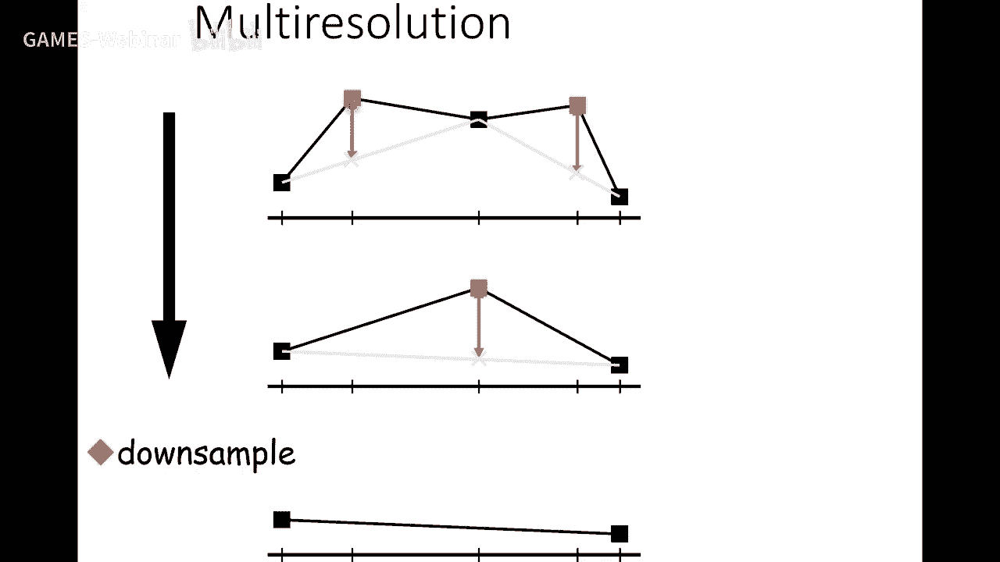

所以他是记录了这样一个，简化的过程，好，基于这样一个思想，就是上这个从小波分析来看，我把一个信号分解成一个。

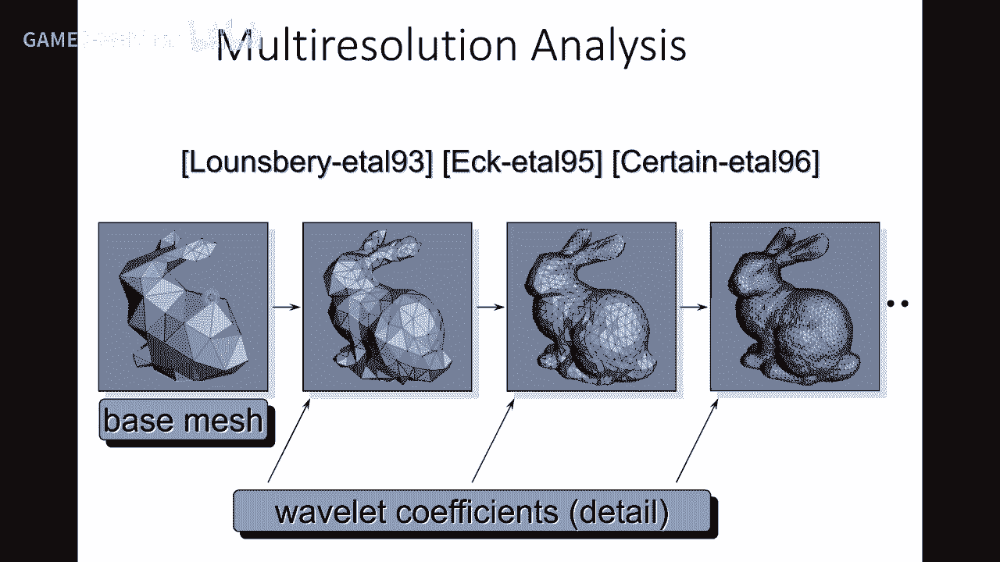

比较简单的网格，加上一些系数，就可以恢复原来的网格，是吧，好，那么AOD呢，这个，有几种形式，一种叫Discrete，就是这个离散AOD，这也是早年，这个AOD的一个方法，就是我对一个模型。

比如说模型很复杂，我给他进行简化到，不同的点点数，或者把他们都存起来，那么，当我在做渲染或漫游的时候呢，我如果离得近，我就调这个模型，离得远就调这个模型，是吧，所以他两个模型之间呢，会突然一个变化。

这个叫POP，好像不联系性，是吧，好，那么这个，后来就就说，我怎么避免这个突然的这个变化，那么我们能不能continuous，就是能够记录中间的连接变化，是吧，那么其中一个想法就是什么。

你把中间的操作全部把它记录下来，你就能够，比较好的这个，一个边一个边的加，或者一个点一个点的加，就用户是看不，就是就是看不到这些变化，那么这个事项就刚才我讲的，就是你把这个边收缩啊，这个把它记下来。

比如说你可以看到，如果你把它记下来以后呢，你从一个复杂的景点，网格不断简化不断简化，就可以把它操作，给他记录下来，或者把它编码成一些信息，那么如果你想从这个模型，逐渐把它变密啊，变成更多的网格呢。

就中间就是不断去增加点点，就行了增加边就行了，所以你把这个操作的这个属性，把它记下来就可以变成可逆了，这时候就是一个重建过程啊，我怎么样从一个网格不断的去增加，这些操作就能够变成更加，点点更丰富。

不断的增加，所以你只要记住这些操作就行了，这是95年96年，SIGGRAPH提出一个概念，叫Progressive Mesh，叫渐进网格，当时这个提出来以后，还是非常好的一个创意啊，嗯。

这我也讲一讲就是这个想法非常好啊，就是你你说我，只要存一个，简单的网格再加上一些操作，我就我就可以，这个操作呢，可以存储量不是那么大，不像以前他要存中间，若干个几何模型嘛，我只要存一个简单的。

加上一些操作就行了，但现在呢事实上是事实是呢，在那个游戏中，或者一些应用中，我们还是不是这样用，因为你这样用的话呢，你这个操作是要消耗客户端的一些，CPU计算资源，虽然时候呢，是虽然灌到GPU去渲染。

但是你这个加这些，还是要在CPU上做，所以呢会消耗客户端的一些，计算资源啊这也是这个方法，现在啊没有在实际，中用的很广的一个原因啊，因为我宁愿这个，这个消耗这个带宽，去下载一个模型这里，我马上就能这个。

读取然后把它汇职出来啊，而不是我用在这里，在进行一些这个，CPU上要消耗这个，开销来计算这个网格更新，好那么这就是continuous。

这个AOD的一些概念，就是可以把这个操作，一个简单网格，加上这个系列操作就可以，恢复到任何一个，经典数的一个，网格上面，好，那么，当时提出，progressive matching，还有一个另外的背景。

当时的网络啊就是20多年前，网络带宽没有那么大，所以当时纯，如果你是纯M0 M1 M2，是若干个零散的网格的话，就对带宽的要求会比较高，当然现在来说带宽不是问题了，那么当时就是说。

我们还可以节约这个网络上的，传输时间，因为这些操作就量不大，你可以还有别的方法去压缩，所以说，你可以在客户端，我编完游戏的时候，编或许一些这个码流，然后更新这个场景，这个带宽有限的情况下。

这种方法还是比较不错的，那现在呢因为随着硬件发展，包括网络发展，这个网络速度是越来越快了，所以，现在不是这个大问题，所以这种，技术呢，应用的这个场景并不是太多。

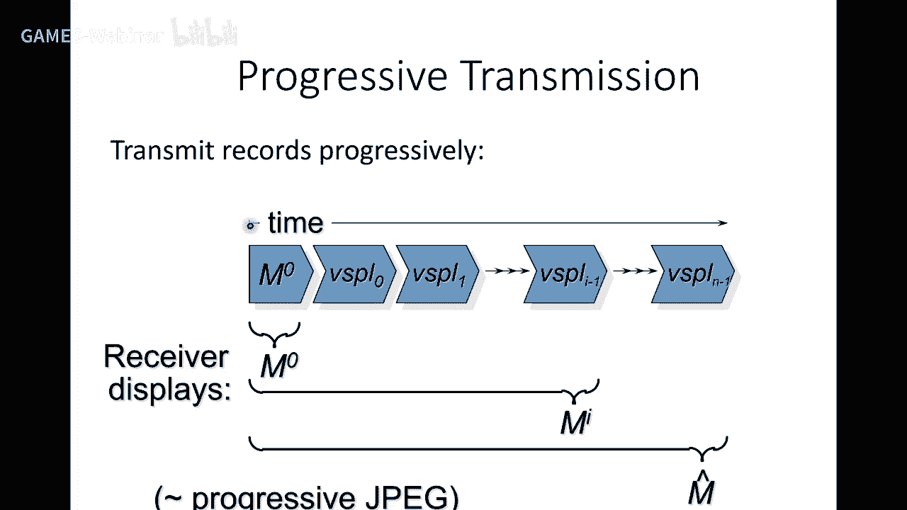

好另外一个，这个在LOD的时候，显然就要有一个基于视点相关的，意思也很容易理解，我的视点在这。

离我近的话我LOD密一点，离我远的话就LOD就稀一点，就是你怎么样，去，去适应的去选取我的这个操作，当年还是，蛮有意义的一个工作，现在可能也没有。

自己应用中，好更大挑战呢就是，今年五月份虚幻5，引擎推出的demo，它里面可以，自己声称这个场景整个有160亿，一个面片这么大的一个，场景当然这场景不可能，是一个网格了它可能也是分布式，存储啊包括那个。

简化得到的，所以它里面，还可能还有硬件的，包括因为它是运营在，那个Playstation，PS5上面所以是索尼的，一个专门为游戏，所开发的一个这个，这个硬件所以可能综合，综合来讲它这个。

渲染这个加载的这个量会比较大，但无论怎么样，这个加载可能不是一片，一起加载这个，可能开始失效不了的，所以他怎么他要把这个场景进行怎么切割，怎么怎么做LOD，怎么做简化等等这个综合技术。

做到这样一个demo，最近我们也在探索这其中的一些技术，当然还有，这个城市级别的这个商业模型，数量也是非常大的，怎么样能够，高效的实时的这个进行，进行渲染，那么渲染，还有很多值得，为了渲染的这个简化。

还有很多值得去做的一些挑战，这个去解决，包括现在，云计算的这个，慢慢成为普世以后，你怎么样利用这个云的资源，云边端，配合来做一些这种，实时的这种调度啊组织啊，你这个几何，可以很大但是呢。

我在我当前的视点里面，所呈现的几何，这个信息或者是数据量并不大，但是你怎么去智能的去调度它，能够达到，这个质量与这个，速度之间的一个平衡，也是非常大的挑战，这是还有很多工作，是需要等着我们去探索的。

那么关于简化呢，到现在工作也很多，这里有一些资源，有些资源还是比较老的，大家可以相对参考一下，好，那么最后布置一下，这是卓业，是这个就实现，这个97年那份文章的qm，方法，来实践它。

那么这个实现过程中呢，有些技巧啊，因为我们顶点是，一个列表面也是个列表，如果你减换掉一个顶点以后，或者是少了一些顶点以后，你先不要把这顶点，从这个列表中删除，因为这个这个列表，是一个连续性存储。

如果你删掉一个顶点呢，是要是要有开销的，是吧你要把后面的一些元素，要把它全部拷贝到，前一个去，啊实际上你只要寄，这个被删除顶点寄一个标记，表示它，是没有用了，到最后解放完以后的话。

如果你要导出一个网格也好，啊或者是，到宣传管线里去再给他更新，这些指标就可以了，好这个要注意，也可以QAV网上有很多版本，你们可以去参考参考，当然你如果做的好的话，你可以实时的，用一个波动感。

实时的操作这个个数，使他减换到，另一个顶点个数还有回来，都可以，这个data line这里写错了应该，不是26号是1月，就是给这次作业，给大家两周时间好吧，给大家两周时间应该是1月，3号啊这个。

data line好吧就是，是两周时间，大家完成这个作业。

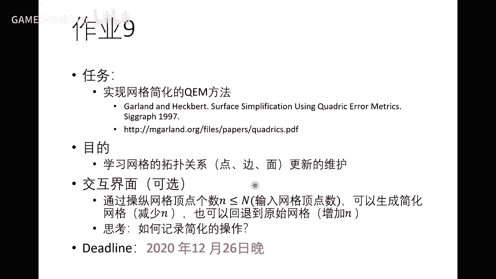

好那么今天的课就到这里，结束了好那么。

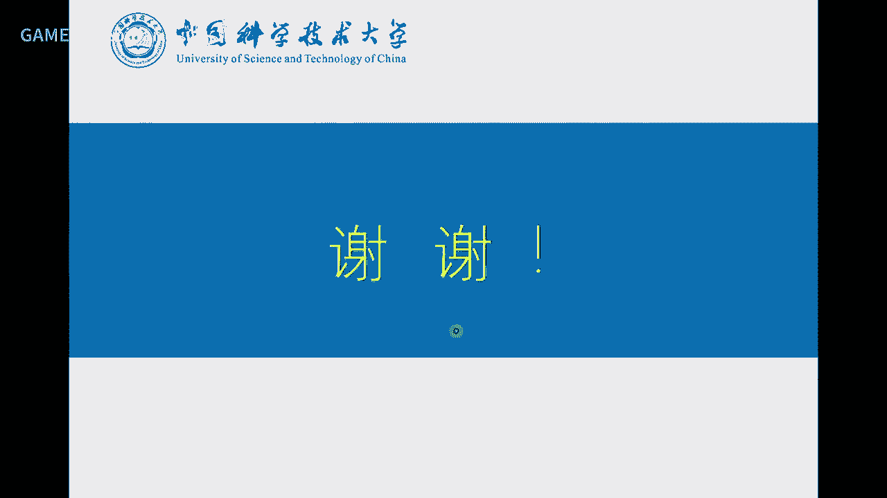

这个各位同学好再见，你可不可以帮我找个地方住啊？我可以帮你找个地方住？

